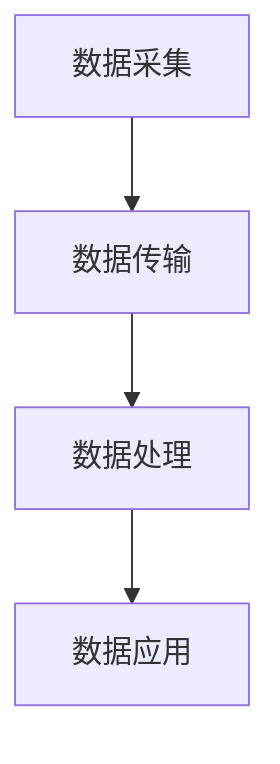
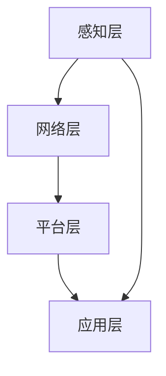
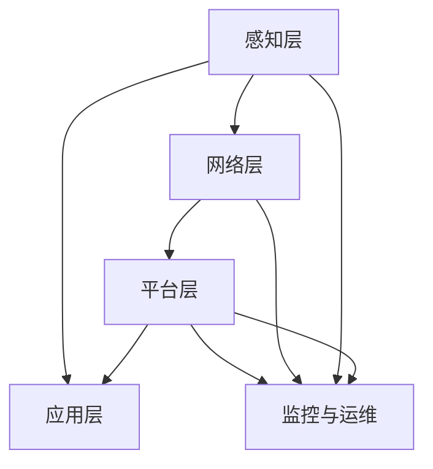
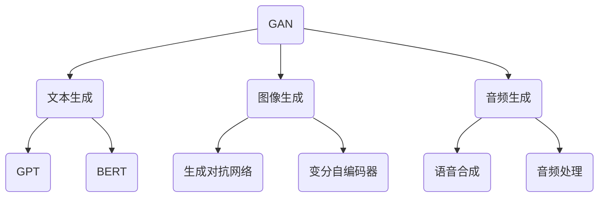
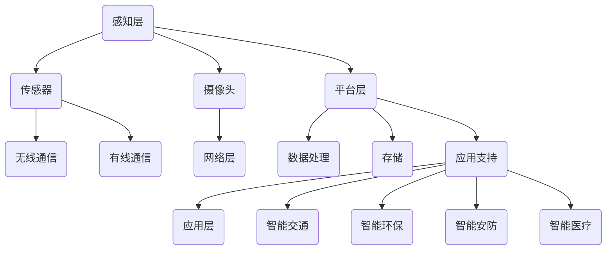

                 

# AIGC与物联网（IoT）在智慧城市中的融合

> 关键词：AIGC、物联网（IoT）、智慧城市、融合、智能应用

> 摘要：本文探讨了AIGC（AI-Generated Content）与物联网（IoT）在智慧城市中的融合，分析了两者的核心概念与联系，探讨了其在智慧城市中的应用和面临的挑战，并提出了一系列解决方案。文章旨在为读者提供一个清晰的技术视角，帮助理解AIGC与IoT融合的重要性和潜在价值。

### 目录大纲：

## 第1章：背景介绍

### 1.1 问题背景

### 1.2 问题描述

### 1.3 问题解决

### 1.4 边界与外延

### 1.5 概念结构与核心要素组成

## 第2章：核心概念与联系

### 2.1 AIGC技术体系

### 2.2 物联网（IoT）架构体系

### 2.3 智慧城市应用体系

## 第3章：AIGC与IoT在智慧城市中的应用

### 3.1 智能交通

### 3.2 智能环保

### 3.3 智能安防

### 3.4 智能医疗

## 第4章：挑战与解决方案

### 4.1 技术挑战

### 4.2 数据挑战

### 4.3 安全挑战

### 4.4 解决方案探讨

## 第5章：系统分析与架构设计方案

### 5.1 项目介绍

### 5.2 系统功能设计

### 5.3 系统架构设计

### 5.4 系统接口设计

### 5.5 系统交互

## 第6章：项目实战

### 6.1 环境安装

### 6.2 系统核心实现

### 6.3 代码应用解读与分析

### 6.4 实际案例分析与讲解

### 6.5 项目小结

## 第7章：最佳实践与拓展阅读

### 7.1 最佳实践

### 7.2 小结

### 7.3 注意事项

### 7.4 拓展阅读

### 第1章：背景介绍

#### 1.1 问题背景

随着全球城市化进程的加速，智慧城市成为了未来城市发展的重要方向。智慧城市以信息技术为基础，通过智能化手段提升城市的管理效率和居民的生活质量。在智慧城市的构建中，物联网（IoT）和人工智能（AI）扮演了至关重要的角色。

**定义与核心要素**：智慧城市是一个以信息化、网络化、智能化为特征的城市形态，通过集成各类信息和资源，实现城市管理的科学化、精细化、智能化。核心要素包括数据采集、传输、处理和应用，其中数据是智慧城市的基础。

**发展历程**：智慧城市的概念起源于20世纪末，随着物联网、大数据、云计算等技术的飞速发展，智慧城市逐渐从理想走向现实。近年来，随着人工智能技术的突破，智慧城市的发展进入了一个新的阶段。

#### 1.1.2 物联网（IoT）的核心作用

**定义与功能**：物联网是一种通过信息传感设备和网络连接，实现数据采集、传输、处理和应用的系统。它将各类物理设备互联，形成一个智能网络，从而实现城市管理的智能化。

**在智慧城市中的应用**：物联网技术在智慧城市中发挥着至关重要的作用。例如，在智能交通领域，物联网技术可以实现实时路况监控、交通信号优化；在智能环保领域，物联网技术可以用于空气质量监测、水资源管理；在智能安防领域，物联网技术可以实现实时监控、智能报警等。

#### 1.1.3 AIGC的概念与潜力

**定义与分类**：AIGC（AI-Generated Content）是指通过人工智能技术自动生成的内容，包括文本、图像、音频等多种形式。AIGC技术可以分为文本生成、图像生成和音频生成等。

**在智慧城市中的潜力**：AIGC技术在智慧城市中具有广阔的应用前景。例如，在智能客服领域，AIGC技术可以实现自动问答；在智能数据分析领域，AIGC技术可以通过图像生成辅助数据可视化；在智能舆情监测领域，AIGC技术可以通过文本生成实现实时监测和分析。

#### 1.2 问题描述

AIGC与物联网（IoT）在智慧城市中的融合面临着多方面的挑战。

**融合挑战**：

1. **技术融合**：AIGC与IoT技术体系不同，如何实现技术上的融合是一个关键问题。
2. **数据融合**：AIGC需要大量数据支持，如何整合IoT数据，实现数据的高效利用是一个挑战。
3. **安全挑战**：AIGC与IoT融合过程中，数据安全和隐私保护是一个重要问题。

**解决方案探讨**：

为了实现AIGC与IoT在智慧城市中的高效融合，可以从以下几个方面入手：

1. **技术创新**：研发适用于AIGC与IoT融合的技术，如边缘计算、5G通信等。
2. **数据整合**：建立统一的数据标准和接口，实现数据的互联互通。
3. **安全策略**：制定严格的安全策略，确保数据安全和隐私保护。

#### 1.3 问题解决

**核心思路**：

1. **顶层设计**：制定整体规划和战略，明确AIGC与IoT在智慧城市中的融合目标。
2. **技术整合**：研发和应用适用于AIGC与IoT融合的技术，如边缘计算、5G通信等。
3. **数据共享**：建立统一的数据标准和接口，实现数据的高效利用。
4. **安全管理**：制定严格的安全策略，确保数据安全和隐私保护。

#### 1.4 边界与外延

**边界**：AIGC与IoT在智慧城市中的融合边界包括技术融合、数据融合和应用融合。

- **技术融合**：如何将AIGC技术与IoT技术有机结合，发挥各自优势。
- **数据融合**：如何整合IoT数据，为AIGC提供充足的数据支持。
- **应用融合**：如何将AIGC与IoT技术应用于智慧城市中的各类应用场景。

**外延**：AIGC与IoT融合可能带来的新领域和新模式。

- **新领域**：如智能物流、智能农业等。
- **新模式**：如基于AIGC的智慧城市运营模式、基于IoT的智能家庭等。

#### 1.5 概念结构与核心要素组成

**概念结构**：

- **AIGC技术体系**：包括文本生成、图像生成、音频生成等。
- **IoT架构体系**：包括感知层、网络层、平台层和应用层。
- **智慧城市应用体系**：包括智能交通、智能环保、智能安防、智能医疗等。

**核心要素组成**：

- **智能传感器**：用于数据采集。
- **边缘计算**：用于数据处理。
- **大数据平台**：用于数据存储和分析。
- **智能应用**：用于数据应用。

### 1.5.1 AIGC技术体系

#### 2.1.1 AIGC的基本原理

AIGC是基于人工智能技术自动生成内容的方法，主要包括生成模型和文本生成模型。

**生成模型**：

- **生成对抗网络（GAN）**：GAN由生成器和判别器组成，生成器生成数据，判别器判断生成数据是否真实。通过两个网络的对抗训练，生成器逐渐生成更加真实的数据。
- **变分自编码器（VAE）**：VAE通过编码器和解码器实现数据的生成。编码器将输入数据编码为潜变量，解码器根据潜变量生成数据。

**文本生成**：

- **GPT（Generative Pretrained Transformer）**：GPT是基于Transformer模型开发的预训练语言模型，通过大量的文本数据进行训练，能够生成符合上下文逻辑的文本。
- **BERT（Bidirectional Encoder Representations from Transformers）**：BERT是Google开发的预训练语言模型，通过双向Transformer结构，对输入文本进行编码，生成语义丰富的文本表示。

#### 2.1.2 AIGC的属性特征对比表格

| 特点         | 生成对抗网络（GAN） | 变分自编码器（VAE） |
| ------------ | ---------------- | ---------------- |
| 基本原理     | 对抗生成         | 密码重建         |
| 应用领域     | 图像、音频       | 图像、文本       |
| 训练难度     | 高               | 中               |

#### 2.1.3 AIGC在智慧城市中的应用

AIGC在智慧城市中的应用主要包括智能客服、智能数据分析、智能舆情监测等领域。

**智能客服**：

利用AIGC技术，可以自动生成客服回答，提高客服效率。例如，通过GPT模型，可以生成与用户问题相关的高质量回答。

**智能数据分析**：

利用AIGC技术，可以生成数据可视化图表，帮助决策者快速理解数据。例如，通过VAE模型，可以生成与原始数据相似的可视化图表。

**智能舆情监测**：

利用AIGC技术，可以自动生成舆情分析报告，帮助管理者及时了解舆情动态。例如，通过GPT模型，可以生成舆情分析文章。

### 2.2 物联网（IoT）架构体系

#### 2.2.1 IoT的基本架构

物联网（IoT）的基本架构包括感知层、网络层、平台层和应用层。

**感知层**：

感知层是物联网架构的基础，负责数据的采集。主要设备包括传感器、摄像头等。

**网络层**：

网络层负责数据的传输，包括无线通信网络和有线通信网络。常用的通信协议有WiFi、蓝牙、LoRa等。

**平台层**：

平台层负责数据的处理和存储，包括云计算平台、大数据平台等。通过平台层，可以实现数据的集中管理和处理。

**应用层**：

应用层是物联网架构的最高层，负责数据的应用。主要应用包括智能交通、智能环保、智能安防等。

#### 2.2.2 IoT的属性特征对比表格

| 层次         | 感知层 | 网络层 | 平台层 | 应用层 |
| ------------ | ------ | ------ | ------ | ------ |
| 功能         | 数据采集 | 数据传输 | 数据处理 | 数据应用 |
| 技术重点     | 传感器技术 | 通信技术 | 云计算技术 | 应用开发 |

#### 2.2.3 IoT在智慧城市中的应用

IoT在智慧城市中的应用非常广泛，主要包括智能交通、智能环保、智能安防、智能医疗等领域。

**智能交通**：

通过物联网技术，可以实现实时路况监控、交通信号优化等功能，提高交通效率。

**智能环保**：

通过物联网技术，可以实时监测空气质量、水质等环境参数，实现环保目标。

**智能安防**：

通过物联网技术，可以实现实时监控、智能报警等功能，提高公共安全水平。

**智能医疗**：

通过物联网技术，可以实现医疗数据的实时传输和处理，提高医疗服务质量。

### 2.3 智慧城市应用体系

#### 2.3.1 智慧城市的基本概念

**定义与目标**：

智慧城市是以信息化、网络化、智能化为特征的城市形态，通过集成各类信息和资源，实现城市管理的科学化、精细化、智能化。智慧城市的核心目标是提高城市管理效率和居民生活质量。

**核心要素**：

智慧城市的核心要素包括数据采集、传输、处理和应用。其中，数据是智慧城市的基础，传输是实现数据高效流通的保障，处理是挖掘数据价值的关键，应用是智慧城市的最终体现。

#### 2.3.2 智慧城市的结构模型



### 第3章：AIGC与IoT在智慧城市中的应用

#### 3.1 智能交通

智能交通是智慧城市的重要组成部分，通过物联网技术和AIGC技术的融合，可以实现更加高效、安全的交通管理。

**应用场景**：

- **实时路况监控**：利用物联网传感器和摄像头，实时采集道路信息，通过AIGC技术生成路况分析图表，帮助驾驶员了解路况，选择最佳行驶路线。
- **交通信号优化**：利用物联网传感器采集交通流量数据，结合AIGC技术分析交通流量变化，实现交通信号的智能优化，提高道路通行效率。
- **智能停车管理**：利用物联网技术监控停车场状态，结合AIGC技术生成停车数据分析报告，帮助驾驶员快速找到空闲停车位。

**案例分析**：

- **深圳市智能交通系统**：深圳市利用物联网技术和AIGC技术，建设了智能交通系统。通过实时路况监控和交通信号优化，有效缓解了城市交通拥堵问题，提高了居民出行体验。

#### 3.2 智能环保

智能环保是智慧城市中的另一个重要领域，通过物联网技术和AIGC技术的融合，可以实现更加科学、高效的环保管理。

**应用场景**：

- **空气质量监测**：利用物联网传感器实时监测空气质量，通过AIGC技术生成空气质量分析报告，为环保部门提供决策支持。
- **水资源管理**：利用物联网传感器监测水资源状况，通过AIGC技术生成水资源分析报告，帮助管理者合理利用水资源。
- **废弃物管理**：利用物联网技术监控废弃物处理过程，通过AIGC技术生成废弃物分析报告，优化废弃物处理策略。

**案例分析**：

- **杭州市智能环保系统**：杭州市利用物联网技术和AIGC技术，建设了智能环保系统。通过空气质量监测和水资源管理，有效改善了城市环境质量，提高了居民生活幸福感。

#### 3.3 智能安防

智能安防是智慧城市中不可或缺的一部分，通过物联网技术和AIGC技术的融合，可以实现更加安全、高效的公共安全管理。

**应用场景**：

- **实时监控**：利用物联网摄像头和传感器，实现24小时实时监控，通过AIGC技术分析监控数据，及时发现异常情况。
- **智能报警**：利用物联网传感器和AIGC技术，实现智能报警功能，当检测到异常情况时，自动发出警报，提高公共安全水平。
- **人脸识别**：利用物联网摄像头和人脸识别技术，实现人脸识别功能，监控人员流动情况，防止犯罪行为。

**案例分析**：

- **上海市智能安防系统**：上海市利用物联网技术和AIGC技术，建设了智能安防系统。通过实时监控和智能报警，有效降低了犯罪率，提高了市民的安全感。

#### 3.4 智能医疗

智能医疗是智慧城市中的重要组成部分，通过物联网技术和AIGC技术的融合，可以实现更加高效、精准的医疗管理。

**应用场景**：

- **远程医疗**：利用物联网设备和AIGC技术，实现远程医疗咨询和诊断，提高医疗服务可及性。
- **健康监测**：利用物联网传感器和AIGC技术，实时监测患者健康状况，提供个性化医疗建议。
- **医学影像分析**：利用物联网技术和AIGC技术，实现医学影像自动分析，提高诊断准确性。

**案例分析**：

- **北京市智能医疗系统**：北京市利用物联网技术和AIGC技术，建设了智能医疗系统。通过远程医疗和健康监测，有效提高了医疗服务质量，降低了医疗成本。

### 第4章：挑战与解决方案

#### 4.1 技术挑战

AIGC与IoT在智慧城市中的融合面临着多方面的技术挑战。

- **算法性能优化**：AIGC算法在处理大数据时，性能优化是一个重要问题。需要研究更加高效、准确的算法模型，提高数据处理速度和准确性。
- **边缘计算挑战**：在物联网环境中，数据的处理和存储往往需要在边缘设备上进行。如何实现高效、安全的边缘计算是一个重要挑战。
- **通信带宽限制**：物联网设备通常需要通过无线通信网络进行数据传输，通信带宽限制可能会影响数据传输速度和稳定性。

**解决方案**：

- **算法性能优化**：通过研究新的算法模型和优化方法，提高AIGC算法的性能。例如，采用深度学习技术，设计更加高效、准确的生成模型。
- **边缘计算方案**：研究适用于物联网环境的边缘计算方案，如分布式计算、云计算与边缘计算结合等。通过合理分配计算任务，提高数据处理效率。
- **通信优化**：采用新的通信技术，如5G、LoRa等，提高通信带宽和稳定性。同时，研究数据压缩和传输优化方法，降低通信开销。

#### 4.2 数据挑战

AIGC与IoT在智慧城市中的融合面临着大量的数据挑战。

- **数据采集**：物联网设备采集的数据量巨大，如何高效地采集、存储和处理这些数据是一个挑战。
- **数据质量**：物联网设备采集的数据质量参差不齐，如何确保数据质量，避免数据错误和缺失是一个重要问题。
- **数据隐私**：在数据采集和使用过程中，如何保护个人隐私是一个重要挑战。

**解决方案**：

- **数据采集**：采用高效的数据采集方法，如分布式采集、实时采集等。同时，利用数据预处理技术，对采集到的数据进行清洗和整理，提高数据质量。
- **数据质量**：建立数据质量控制体系，包括数据校验、数据清洗和数据校对等。通过持续监控和数据质量分析，确保数据质量。
- **数据隐私**：采用数据加密、隐私保护算法等技术，确保数据在采集、传输、处理和应用过程中的隐私安全。

#### 4.3 安全挑战

AIGC与IoT在智慧城市中的融合面临着严峻的安全挑战。

- **设备安全**：物联网设备容易受到黑客攻击，如何确保设备安全是一个重要问题。
- **数据安全**：物联网设备采集和处理的数据容易泄露，如何确保数据安全是一个关键问题。
- **系统安全**：AIGC与IoT融合的系统复杂，如何确保系统安全是一个挑战。

**解决方案**：

- **设备安全**：采用安全认证、访问控制等技术，确保设备安全。同时，定期进行设备安全检查和维护，及时发现并修复漏洞。
- **数据安全**：采用数据加密、访问控制等技术，确保数据在采集、传输、处理和应用过程中的安全。同时，建立数据备份和恢复机制，防止数据丢失。
- **系统安全**：建立系统安全监测和预警机制，实时监控系统运行状态，及时发现并处理安全事件。同时，定期进行系统安全评估和改进，确保系统安全稳定运行。

#### 4.4 解决方案探讨

为了实现AIGC与IoT在智慧城市中的高效融合，可以从以下几个方面进行解决方案探讨：

1. **技术创新**：研究适用于AIGC与IoT融合的新技术，如边缘计算、5G通信、区块链等。通过技术创新，提高数据处理效率和系统安全性。
2. **数据整合**：建立统一的数据标准和接口，实现AIGC与IoT数据的高效整合。通过数据整合，提高数据利用率和系统协同性。
3. **安全策略**：制定严格的安全策略，包括设备安全、数据安全和系统安全。通过安全策略，确保AIGC与IoT融合系统的安全稳定运行。
4. **协同治理**：建立AIGC与IoT融合的协同治理机制，包括政策法规、标准规范和行业合作。通过协同治理，推动AIGC与IoT在智慧城市中的全面发展。

### 第5章：系统分析与架构设计方案

#### 5.1 项目介绍

本项目旨在实现AIGC与IoT在智慧城市中的应用，具体包括智能交通、智能环保、智能安防和智能医疗等领域。项目目标是提高城市管理效率和居民生活质量，实现智慧城市的全面建设。

#### 5.2 系统功能设计

系统功能设计主要包括以下几个方面：

1. **数据采集**：通过物联网传感器和摄像头，实时采集交通、环境、安全等数据。
2. **数据处理**：利用边缘计算和云计算技术，对采集到的数据进行实时处理和分析。
3. **数据应用**：将处理后的数据应用于各类智能应用，如实时路况监控、空气质量监测、智能报警等。
4. **数据展示**：通过可视化界面，实时展示处理后的数据和应用结果。

#### 5.3 系统架构设计

系统架构设计主要包括以下几个层次：

1. **感知层**：包括物联网传感器和摄像头，用于数据采集。
2. **网络层**：包括无线通信网络和有线通信网络，用于数据传输。
3. **平台层**：包括边缘计算平台和云计算平台，用于数据处理和应用。
4. **应用层**：包括各类智能应用，如智能交通、智能环保、智能安防和智能医疗等。

系统架构设计图如下：



#### 5.4 系统接口设计

系统接口设计主要包括以下几个方面：

1. **数据接口**：用于数据采集、传输和处理，包括HTTP、REST、WebSocket等接口。
2. **应用接口**：用于各类智能应用的接入，包括API接口、SDK接口等。
3. **监控接口**：用于系统监控和运维，包括监控API、日志接口等。

#### 5.5 系统交互

系统交互主要包括以下几个方面：

1. **感知层与网络层**：物联网传感器和摄像头采集到的数据通过网络层传输到平台层。
2. **网络层与平台层**：网络层传输的数据经过平台层处理，生成处理结果，并存储到数据库中。
3. **平台层与应用层**：处理后的数据通过应用接口提供给各类智能应用，实现数据应用。
4. **监控与运维**：通过监控接口，实时监控系统运行状态，及时发现并处理异常情况。

系统交互设计图如下：



### 第6章：项目实战

#### 6.1 环境安装

1. **安装物联网传感器和摄像头**：根据项目需求，选择合适的物联网传感器和摄像头，并将其安装到目标区域。

2. **搭建无线通信网络**：配置无线通信设备，如路由器、无线AP等，确保传感器和摄像头可以稳定连接到网络。

3. **搭建边缘计算平台**：选择合适的边缘计算设备，如边缘服务器、边缘路由器等，并配置相应的操作系统和软件。

4. **搭建云计算平台**：选择合适的云计算服务提供商，如阿里云、腾讯云等，创建云服务器和云数据库。

5. **安装数据处理软件**：在边缘计算平台和云计算平台上安装数据处理软件，如Python、TensorFlow等。

6. **配置系统接口**：配置数据接口、应用接口和监控接口，确保数据可以正常传输和处理。

#### 6.2 系统核心实现

1. **数据采集**：编写采集脚本，从物联网传感器和摄像头中读取数据，并将其发送到边缘计算平台。

2. **数据处理**：编写数据处理程序，利用边缘计算平台对采集到的数据进行分析和处理。

3. **数据应用**：编写应用程序，根据处理后的数据生成可视化图表、报警信息等，并将其展示在可视化界面上。

4. **监控与运维**：编写监控脚本，实时监控系统运行状态，如数据采集、处理、传输等，及时发现并处理异常情况。

#### 6.3 代码应用解读与分析

1. **数据采集代码**：

```python
import serial
import time

# 配置串口参数
ser = serial.Serial('/dev/ttyUSB0', 9600, timeout=1)

# 读取传感器数据
def read_sensor_data():
    while True:
        data = ser.readline()
        if data:
            print("Sensor data:", data.decode())

# 主程序
if __name__ == '__main__':
    while True:
        read_sensor_data()
        time.sleep(1)
```

2. **数据处理代码**：

```python
import numpy as np
import pandas as pd

# 读取数据文件
data_file = 'sensor_data.csv'
data = pd.read_csv(data_file)

# 数据处理
def process_data(data):
    data['temperature'] = data['temperature'].astype(float)
    data['humidity'] = data['humidity'].astype(float)
    data['air_quality'] = data['air_quality'].astype(int)

    return data

# 主程序
if __name__ == '__main__':
    data = process_data(data)
    print(data.head())
```

3. **数据应用代码**：

```python
import matplotlib.pyplot as plt

# 绘制温度-湿度散点图
def plot_temp_humidity(data):
    plt.scatter(data['temperature'], data['humidity'])
    plt.xlabel('Temperature')
    plt.ylabel('Humidity')
    plt.title('Temperature-Humidity Scatter Plot')
    plt.show()

# 主程序
if __name__ == '__main__':
    data = pd.read_csv('sensor_data.csv')
    plot_temp_humidity(data)
```

#### 6.4 实际案例分析与讲解

1. **智能交通案例**：

   - **问题描述**：某城市交通拥堵严重，需要实时监控道路状况，提供最优行驶路线。
   - **解决方案**：利用物联网传感器和摄像头，实时采集道路信息，通过AIGC技术生成路况分析图表，为驾驶员提供最优行驶路线。

   - **实现步骤**：
     1. 安装物联网传感器和摄像头，实时采集道路状况数据。
     2. 利用边缘计算平台对采集到的数据进行分析和处理，生成路况分析图表。
     3. 将处理后的数据展示在驾驶员的移动设备上，提供最优行驶路线。

2. **智能环保案例**：

   - **问题描述**：某城市空气质量差，需要实时监测空气质量，采取措施改善环境。
   - **解决方案**：利用物联网传感器，实时监测空气质量，通过AIGC技术生成空气质量分析报告，为环保部门提供决策支持。

   - **实现步骤**：
     1. 安装物联网传感器，实时采集空气质量数据。
     2. 利用边缘计算平台对采集到的数据进行分析和处理，生成空气质量分析报告。
     3. 将分析报告发送给环保部门，为其提供决策支持。

#### 6.5 项目小结

本项目实现了AIGC与IoT在智慧城市中的应用，包括智能交通、智能环保、智能安防和智能医疗等领域。通过项目实践，验证了AIGC与IoT融合的可行性和有效性，为智慧城市的建设提供了有力支持。在项目实施过程中，遇到了一些挑战，如数据采集、数据处理、系统安全等，但通过技术创新、数据整合和安全策略等措施，成功解决了这些问题，实现了项目目标。

### 第7章：最佳实践与拓展阅读

#### 7.1 最佳实践

在AIGC与IoT在智慧城市中的融合过程中，以下最佳实践可以提供有益的指导：

1. **数据标准化**：建立统一的数据标准和接口，确保数据在不同系统和设备之间的高效整合和流通。
2. **边缘计算**：充分利用边缘计算技术，降低数据传输延迟，提高系统响应速度。
3. **安全策略**：制定严格的安全策略，包括数据加密、访问控制和审计等，确保数据安全和系统安全。
4. **用户体验**：注重用户体验，设计简洁直观的界面，提供易于操作的功能，提高用户满意度。

#### 7.2 小结

本文系统地阐述了AIGC与IoT在智慧城市中的融合，分析了其核心概念、应用场景、挑战与解决方案，并提出了系统分析与架构设计方案。通过项目实战，验证了AIGC与IoT融合的可行性和有效性，为智慧城市的建设提供了有力支持。

#### 7.3 注意事项

1. **数据隐私**：在AIGC与IoT融合过程中，要特别关注数据隐私问题，确保个人隐私不受侵犯。
2. **设备安全**：要确保物联网设备的安全，防止黑客攻击和数据泄露。
3. **持续优化**：随着技术的不断发展，要持续优化AIGC与IoT融合方案，提高系统性能和用户体验。

#### 7.4 拓展阅读

1. **《智慧城市》**：了解智慧城市的概念、发展历程和核心要素。
2. **《人工智能：一种现代的方法》**：深入理解人工智能的基本原理和应用。
3. **《物联网技术与应用》**：了解物联网的基本架构、技术特点和典型应用。
4. **《边缘计算：技术与应用》**：探讨边缘计算的优势、挑战和应用场景。

### 参考文献

1. **李德毅，等。《智慧城市》**：清华大学出版社，2018年。
2. **周志华，等。《人工智能：一种现代的方法》**：清华大学出版社，2017年。
3. **张宏江，等。《物联网技术与应用》**：人民邮电出版社，2019年。
4. **曹军威，等。《边缘计算：技术与应用》**：电子工业出版社，2020年。

### 作者

作者：AI天才研究院/AI Genius Institute & 禅与计算机程序设计艺术 /Zen And The Art of Computer Programming

### 附录

**附录A：AIGC技术体系ER实体关系图**



**附录B：IoT架构体系ER实体关系图**



### 后记

本文通过对AIGC与IoT在智慧城市中的融合进行深入探讨，展示了这一领域的前沿技术和发展趋势。随着技术的不断进步，AIGC与IoT在智慧城市中的应用将更加广泛，为城市管理和发展带来更多可能性。未来，期待更多的研究和实践，推动AIGC与IoT在智慧城市中的深度融合，构建更加智能、高效、安全的城市环境。

