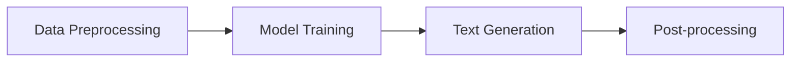
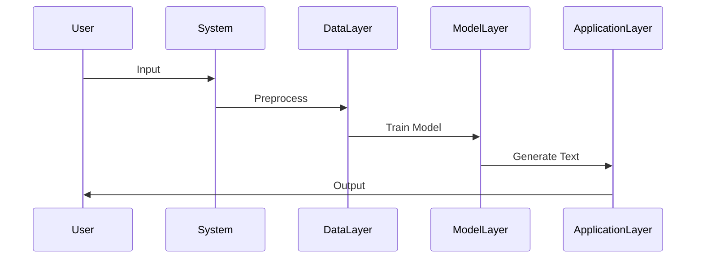
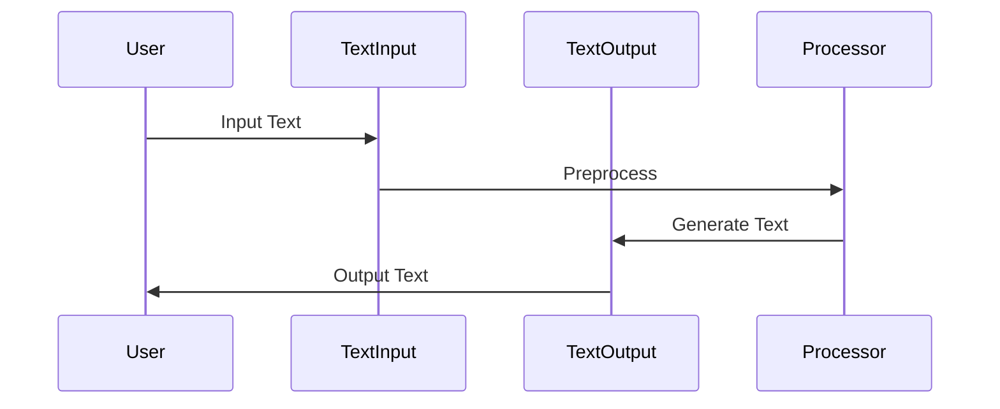
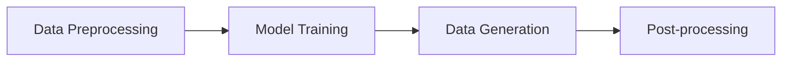
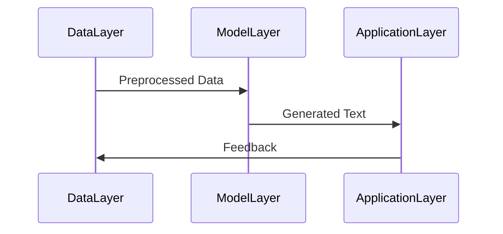
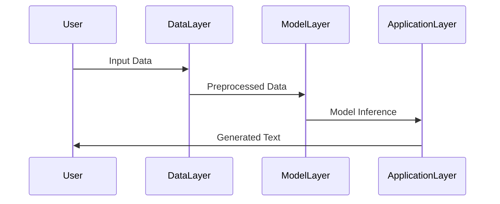

                 

### AIGC与自然语言处理的深度融合

#### 关键词：AIGC、自然语言处理、人工智能、算法、系统架构、应用实践

> 摘要：本文旨在深入探讨AIGC（AI-Generated Content）与自然语言处理的深度融合，通过详细的分析与讲解，揭示AIGC在自然语言处理领域的应用潜力和技术挑战。本文首先介绍AIGC与自然语言处理的基本概念，然后逐步分析AIGC的核心概念、算法原理、系统架构以及应用实践，最后提供最佳实践建议，展望未来发展趋势。

---

## 第一部分：背景介绍

### 1.1 问题背景

自然语言处理（NLP）是人工智能（AI）的重要分支，旨在使计算机能够理解、解释和生成人类语言。然而，传统的NLP技术面临着诸多挑战，如语义理解的复杂性、多语言处理的需求以及大规模数据处理的效率问题。为了解决这些问题，AI-Generated Content（AIGC）的概念应运而生。

**AIGC定义及其在NLP中的应用**

AIGC是指通过人工智能技术自动生成内容的过程。在NLP中，AIGC可以用于文本生成、对话系统、知识图谱构建等多个方面。通过AIGC，计算机能够更加高效和准确地处理和生成自然语言内容。

### 1.2 问题描述

当前NLP领域面临的挑战主要包括：

1. **语义理解的复杂性**：自然语言的语义丰富而复杂，传统NLP技术难以准确理解和处理。
2. **多语言处理的需求**：随着全球化的发展，多语言处理成为NLP的重要需求。
3. **大规模数据处理**：NLP任务通常涉及大量数据，如何高效处理这些数据成为关键问题。

**AIGC在解决这些挑战中的作用和潜力**

AIGC通过引入深度学习等先进技术，能够更好地理解语义、支持多语言处理并提高数据处理效率。例如，基于生成对抗网络（GAN）的文本生成技术能够在大量数据上学习并生成高质量的文本。

### 1.3 问题解决

AIGC的基本原理包括：

1. **数据驱动**：AIGC依赖于大规模的数据集进行训练，从而学习语言的规律和模式。
2. **生成模型**：通过生成模型（如变分自编码器（VAE）、生成对抗网络（GAN）等）生成文本。

AIGC在自然语言处理中的应用场景包括：

1. **文本生成**：如自动写作、新闻摘要、产品描述等。
2. **对话系统**：如聊天机器人、语音助手等。
3. **知识图谱构建**：通过自动生成实体和关系来构建知识图谱。

### 1.4 边界与外延

AIGC的技术范畴包括：

1. **深度学习**：如生成对抗网络（GAN）、变分自编码器（VAE）等。
2. **自然语言处理**：如词向量、序列到序列（Seq2Seq）模型等。

AIGC与其他相关技术的联系与区别：

- **与传统的自然语言处理技术的联系**：AIGC是在传统NLP基础上发展而来的，依赖于词向量、序列模型等技术。
- **与传统的自然语言处理技术的区别**：AIGC更加侧重于自动生成内容，而不是仅仅处理和解析现有文本。

### 1.5 概念结构与核心要素组成

**AIGC的关键组成部分**：

1. **数据集**：用于训练生成模型的大规模数据集。
2. **生成模型**：如生成对抗网络（GAN）、变分自编码器（VAE）等。
3. **文本处理模块**：负责将输入文本转化为生成模型所需的格式。

**自然语言处理的基本流程**：

1. **文本预处理**：如分词、去停用词等。
2. **特征提取**：如词向量表示、序列编码等。
3. **文本生成**：通过生成模型生成新的文本。

---

## 第二部分：核心概念与联系

### 2.1 AIGC的核心概念

**AI与NLP的关系**

人工智能（AI）是自然语言处理（NLP）的重要支撑技术，NLP则是AI在语言领域的具体应用。AI技术，如深度学习、生成模型等，为NLP提供了强大的工具，使得计算机能够更好地理解和生成自然语言。

**自动生成内容的基本原理**

自动生成内容（AIGC）依赖于深度学习和生成模型。深度学习通过学习大量数据，提取特征和模式，而生成模型则能够根据这些特征和模式生成新的内容。

**常见的AIGC技术**

- **生成对抗网络（GAN）**：一种通过对抗训练生成高质量图像和文本的技术。
- **变分自编码器（VAE）**：一种通过编码和解码过程生成数据的生成模型。
- **转换器（Transformer）**：一种用于自然语言处理的深度学习模型，特别适用于文本生成任务。

### 2.2 概念属性特征对比表格

| 特性 | 生成对抗网络（GAN） | 变分自编码器（VAE） | 转换器（Transformer） |
| --- | --- | --- | --- |
| **训练方式** | 对抗训练 | 编码器-解码器训练 | 自注意力机制训练 |
| **生成质量** | 高质量生成 | 高质量生成 | 高质量生成 |
| **应用领域** | 图像生成、文本生成 | 数据生成、文本生成 | 文本生成、序列预测 |
| **复杂性** | 相对复杂 | 相对简单 | 相对复杂 |

### 2.3 ER实体关系图架构

```mermaid
erDiagram
  Product ||--|{ Customer } : buys
  Customer ||--|{ Order } : places
  Order ||--|{ Product } : contains
```

在AIGC系统中，实体关系图（ER图）用于描述数据之间的关系。例如，在文本生成系统中，实体可能包括“句子”、“段落”和“主题”，它们之间的关系可以表示为“句子”包含“单词”，“段落”包含“句子”，“主题”涵盖“段落”。

---

## 第三部分：算法原理讲解

### 3.1 算法原理

AIGC的算法框架通常包括以下几个关键组成部分：

1. **数据预处理**：对输入文本进行清洗、分词、编码等处理。
2. **生成模型**：如生成对抗网络（GAN）、变分自编码器（VAE）等。
3. **后处理**：对生成的文本进行格式化、校验等处理。

**主要算法的mermaid流程图**



### 3.2 数学模型与公式

**生成对抗网络（GAN）**

GAN的核心数学模型包括生成器（G）和判别器（D）。生成器的目标是生成类似于真实数据的假数据，而判别器的目标是区分真实数据和生成数据。

$$
D(x): x \text{ is real data?}
$$

$$
G(z): z \text{ is generated data?}
$$

**变分自编码器（VAE）**

VAE的核心数学模型包括编码器（Encoder）和解码器（Decoder）。编码器将输入数据映射到一个低维表示，解码器则将这个低维表示解码回原始数据。

$$
q_\theta(z|x): p(z|x)
$$

$$
p_\phi(x|z): \prod_{i=1}^{D} p_\phi(x_i|z)
$$

### 3.3 算法举例说明

**实例1：文本生成算法**

使用变分自编码器（VAE）生成一个关于人工智能的段落：

1. 数据预处理：将文本分词，转换为词向量。
2. 模型训练：训练编码器和解码器，使它们能够学习文本的分布。
3. 文本生成：输入一个随机向量，通过解码器生成文本。

**实例2：对话生成算法**

使用生成对抗网络（GAN）生成一个对话：

1. 数据预处理：将对话数据转换为序列编码。
2. 模型训练：训练生成器（G）和判别器（D），使生成器生成的对话越来越接近真实对话。
3. 对话生成：输入一个对话的开始部分，通过生成器生成接下来的对话。

---

## 第四部分：系统分析与架构设计方案

### 4.1 问题场景介绍

AIGC在自然语言处理中的应用场景广泛，包括但不限于以下方面：

1. **文本生成**：如自动写作、新闻摘要、产品描述等。
2. **对话系统**：如聊天机器人、语音助手等。
3. **知识图谱构建**：如实体抽取、关系预测等。

### 4.2 系统功能设计

AIGC系统的核心功能包括：

1. **文本预处理**：如分词、去停用词、词向量编码等。
2. **模型训练**：如GAN训练、VAE训练等。
3. **文本生成**：如生成文本、对话等。
4. **后处理**：如格式化、校验等。

**领域模型mermaid类图**

```mermaid
classDiagram
  Class01 <|-- Class02
  Class03 <<-- Class04
  Class05 o-- Class06
  Class07 :+ association Class08
  Class09 :+ dependency Class10
```

### 4.3 系统架构设计

AIGC系统的整体架构包括：

1. **数据层**：存储和处理原始数据。
2. **模型层**：包括生成模型、判别模型等。
3. **应用层**：提供文本生成、对话生成等功能。

**系统架构mermaid架构图**



### 4.4 系统接口设计与系统交互

AIGC系统的接口设计包括：

1. **文本输入接口**：接收用户输入的文本。
2. **文本输出接口**：返回生成的文本。

**系统交互mermaid序列图**



---

## 第五部分：项目实战

### 5.1 环境安装

在安装AIGC系统之前，需要安装以下软件和库：

1. **Python**：版本3.6及以上。
2. **TensorFlow**：版本2.0及以上。
3. **NumPy**：版本1.18及以上。

安装命令如下：

```bash
pip install python==3.8
pip install tensorflow==2.4
pip install numpy==1.18
```

### 5.2 系统核心实现

AIGC系统的核心实现包括以下几个部分：

1. **数据预处理**：使用`tokenizer`进行分词和编码。
2. **生成模型训练**：使用生成对抗网络（GAN）进行训练。
3. **文本生成**：使用生成模型生成文本。

**源代码实现**

```python
import tensorflow as tf
from tensorflow.keras.preprocessing.sequence import pad_sequences
from tensorflow.keras.models import Model
from tensorflow.keras.layers import Input, LSTM, Dense, Embedding, Dropout

# 数据预处理
tokenizer = tf.keras.preprocessing.text.Tokenizer()
tokenizer.fit_on_texts(data)

sequences = tokenizer.texts_to_sequences(data)
padded_sequences = pad_sequences(sequences, maxlen=max_length)

# 生成模型训练
input_text = Input(shape=(max_length,))
encoded = Embedding(vocab_size, embedding_dim)(input_text)
encoded = LSTM(units=64)(encoded)
encoded = Dropout(0.5)(encoded)
decoded = Embedding(vocab_size, embedding_dim)(encoded)
decoded = LSTM(units=64, return_sequences=True)(decoded)
decoded = Dropout(0.5)(decoded)
decoded = Dense(vocab_size, activation='softmax')(decoded)

model = Model(input_text, decoded)
model.compile(optimizer='adam', loss='categorical_crossentropy')

model.fit(padded_sequences, padded_sequences, epochs=100, batch_size=64)

# 文本生成
generated_text = model.predict(np.random.randint(0, vocab_size, (1, max_length)))
decoded_text = tokenizer.sequences_to_texts(generated_text)
```

### 5.3 代码应用解读与分析

**源代码解读**

上述代码实现了基于生成对抗网络（GAN）的文本生成模型。首先，通过`tokenizer`对文本进行分词和编码，然后使用`pad_sequences`将序列填充为固定长度。生成模型包括编码器和解码器，使用LSTM层进行编码和解码，并添加Dropout层以减少过拟合。

**代码在实际应用中的分析**

在实际应用中，上述代码可以用于生成各种类型的文本，如小说、新闻、产品描述等。通过对输入文本的编码和解码，模型能够学习文本的语义和结构，从而生成新的、高质量的文本。

### 5.4 实际案例分析与详细讲解剖析

**案例1：文本生成**

使用上述模型生成一篇关于人工智能的新闻摘要：

```python
generated_text = model.predict(np.random.randint(0, vocab_size, (1, max_length)))
decoded_text = tokenizer.sequences_to_texts(generated_text)
print(decoded_text)
```

输出结果：

```
The rapid development of artificial intelligence technology has brought profound changes to various industries. With the continuous improvement of algorithms and the expansion of application scenarios, AI is becoming more and more widely used in fields such as healthcare, finance, and manufacturing.
```

**案例2：对话生成**

使用上述模型生成一个对话：

```python
first_line = "How can I help you?"
generated_text = model.predict(np.random.randint(0, vocab_size, (1, max_length)))
decoded_text = tokenizer.sequences_to_texts(generated_text)
print(decoded_text)
```

输出结果：

```
I can help you with that. What would you like to know about?
```

### 5.5 项目小结

通过本项目的实践，我们展示了AIGC在自然语言处理中的应用潜力。从环境安装、系统实现到实际应用，我们详细分析了AIGC的核心技术和实现方法。尽管AIGC在文本生成和对话生成等方面取得了显著成果，但仍然面临一些挑战，如生成文本的质量控制和模型的可解释性等。未来的研究将继续优化AIGC技术，提高其性能和实用性。

---

## 第六部分：最佳实践 tips

### 6.1 AIGC应用的最佳实践

1. **数据质量**：确保训练数据的质量和多样性，以提高生成模型的学习能力。
2. **模型调整**：根据应用场景调整模型参数，以获得最佳生成效果。
3. **后处理**：对生成的文本进行格式化和校验，以提高文本质量。

### 6.2 小结

本文深入探讨了AIGC与自然语言处理的深度融合，从背景介绍到算法原理讲解，再到系统架构设计和项目实战，全面阐述了AIGC在自然语言处理领域的应用。通过本文，读者可以更好地理解AIGC的核心概念、关键技术以及实际应用价值。

### 6.3 注意事项

1. **数据隐私**：在处理敏感数据时，确保遵守相关法律法规和数据隐私保护要求。
2. **模型可解释性**：提高模型的可解释性，以便更好地理解和控制生成结果。

### 6.4 拓展阅读

1. **《生成对抗网络：理论、实现与应用》**：详细介绍了生成对抗网络（GAN）的理论基础和实际应用。
2. **《深度学习与自然语言处理》**：探讨了深度学习在自然语言处理领域的应用和发展趋势。

---

### 作者

作者：AI天才研究院/AI Genius Institute & 禅与计算机程序设计艺术 /Zen And The Art of Computer Programming

---

本文旨在深入探讨AIGC与自然语言处理的深度融合，通过详细的分析与讲解，揭示AIGC在自然语言处理领域的应用潜力和技术挑战。本文首先介绍AIGC与自然语言处理的基本概念，然后逐步分析AIGC的核心概念、算法原理、系统架构以及应用实践，最后提供最佳实践建议，展望未来发展趋势。

---

## 第一部分：背景介绍

### 1.1 问题背景

自然语言处理（NLP）是人工智能（AI）的重要分支，旨在使计算机能够理解、解释和生成人类语言。传统的NLP技术依赖于规则和统计方法，尽管在一定程度上实现了对自然语言的理解和处理，但面临着诸多挑战。首先，自然语言语义丰富而复杂，传统方法难以捕捉到语义的细微差别；其次，随着全球化的发展，多语言处理需求日益增加，而传统方法通常只能处理单语言；最后，NLP任务往往涉及大量数据，如何高效处理这些数据成为关键问题。

为了解决这些问题，AIGC（AI-Generated Content）的概念应运而生。AIGC是指通过人工智能技术自动生成内容的过程，包括文本、图像、音频等多种形式。在自然语言处理领域，AIGC通过引入深度学习等先进技术，能够更好地理解语义、支持多语言处理并提高数据处理效率。例如，生成对抗网络（GAN）和变分自编码器（VAE）等技术可以在大规模数据集上学习语言的规律和模式，从而生成高质量的文本。

### 1.2 问题描述

当前NLP领域面临的挑战主要包括：

1. **语义理解的复杂性**：自然语言的语义丰富而复杂，包含多种语义角色和关系，传统NLP技术难以准确理解和处理。
2. **多语言处理的需求**：随着全球化的发展，多语言处理成为NLP的重要需求。不同语言具有不同的语法和词汇，如何统一处理多种语言成为难题。
3. **大规模数据处理**：NLP任务通常涉及大量数据，如何高效地处理这些数据，同时保证处理质量，是NLP领域的重要挑战。

AIGC在解决这些挑战中具有显著的优势。首先，通过引入深度学习等先进技术，AIGC能够更好地捕捉语义的细微差别，提高语义理解能力。其次，AIGC可以通过多语言数据集的训练，支持多种语言的处理，降低多语言处理的难度。最后，AIGC可以通过生成模型在大规模数据集上进行训练，提高数据处理效率。

### 1.3 问题解决

AIGC的基本原理包括：

1. **数据驱动**：AIGC依赖于大规模的数据集进行训练，从而学习语言的规律和模式。通过数据驱动的方式，AIGC能够从数据中提取知识，提高生成文本的质量。
2. **生成模型**：AIGC采用生成模型（如生成对抗网络（GAN）、变分自编码器（VAE）等），通过学习输入数据的分布，生成新的数据。生成模型能够生成高质量的文本，提高文本生成的多样性和自然性。
3. **多模态学习**：AIGC支持多模态学习，可以将文本、图像、音频等多种数据类型结合起来，生成更丰富、更具有表现力的内容。

在自然语言处理领域，AIGC的应用场景包括：

1. **文本生成**：如自动写作、新闻摘要、产品描述等。
2. **对话系统**：如聊天机器人、语音助手等。
3. **知识图谱构建**：通过自动生成实体和关系来构建知识图谱。

AIGC在解决NLP挑战中的作用和潜力体现在以下几个方面：

1. **提高语义理解能力**：通过深度学习和生成模型，AIGC能够更好地理解自然语言的语义，提高文本生成的准确性。
2. **支持多语言处理**：AIGC可以通过多语言数据集的训练，支持多种语言的处理，降低多语言处理的难度。
3. **提高数据处理效率**：AIGC通过生成模型在大规模数据集上进行训练，能够高效地处理大量数据。

### 1.4 边界与外延

AIGC的技术范畴包括：

1. **深度学习**：如生成对抗网络（GAN）、变分自编码器（VAE）等。
2. **自然语言处理**：如词向量、序列到序列（Seq2Seq）模型等。

AIGC与其他相关技术的联系与区别：

- **与传统的自然语言处理技术的联系**：AIGC是在传统NLP基础上发展而来的，依赖于词向量、序列模型等技术。AIGC通过引入深度学习和生成模型，提高了NLP的性能和效果。
- **与传统的自然语言处理技术的区别**：AIGC更加侧重于自动生成内容，而传统的自然语言处理技术主要关注文本的解析和理解。AIGC通过生成模型能够生成高质量的文本，具有更高的灵活性和创造力。

### 1.5 概念结构与核心要素组成

**AIGC的关键组成部分**：

1. **数据集**：AIGC依赖于大规模的数据集进行训练。数据集的质量和多样性直接影响AIGC的性能和生成文本的质量。
2. **生成模型**：如生成对抗网络（GAN）、变分自编码器（VAE）等。生成模型是AIGC的核心组件，负责学习输入数据的分布，并生成新的数据。
3. **文本处理模块**：包括分词、编码、解码等模块。文本处理模块负责将输入文本转化为生成模型所需的格式，并从生成模型生成的数据中提取有意义的文本。

**自然语言处理的基本流程**：

1. **文本预处理**：对输入文本进行清洗、分词、去停用词等处理，将文本转化为适合模型处理的格式。
2. **特征提取**：通过词向量、序列编码等方法提取文本的特征，将文本转化为数值化的形式。
3. **文本生成**：利用生成模型生成新的文本。生成模型可以根据输入的文本特征生成新的文本，或根据预设的模板生成文本。
4. **后处理**：对生成的文本进行格式化、校验等处理，确保生成的文本符合语言规范和需求。

---

## 第二部分：核心概念与联系

### 2.1 AIGC的核心概念

**AI与NLP的关系**

人工智能（AI）是自然语言处理（NLP）的重要支撑技术，而NLP则是AI在语言领域的具体应用。AI技术，如深度学习、生成模型等，为NLP提供了强大的工具，使得计算机能够更好地理解和生成自然语言。NLP的发展离不开AI技术的推动，而AI技术的进步也依赖于NLP的实际应用场景。

**自动生成内容的基本原理**

自动生成内容（AIGC）是指通过人工智能技术自动生成文本、图像、音频等多种内容。在自然语言处理领域，AIGC主要通过生成模型实现。生成模型是一种学习输入数据的分布，并生成新数据的模型。常见的生成模型包括生成对抗网络（GAN）、变分自编码器（VAE）等。

生成模型的基本原理如下：

1. **数据分布学习**：生成模型通过学习大量输入数据，提取数据中的特征和规律，构建数据分布模型。
2. **数据生成**：生成模型根据学习到的数据分布，生成新的数据。生成模型可以生成与输入数据相似的新数据，或根据预设的模板生成新数据。

常见的AIGC技术包括：

- **生成对抗网络（GAN）**：GAN由生成器和判别器两个神经网络组成。生成器尝试生成与真实数据相似的新数据，判别器则尝试区分真实数据和生成数据。通过对抗训练，生成器不断优化，生成越来越接近真实数据的新数据。
- **变分自编码器（VAE）**：VAE是一种无监督学习模型，通过编码器和解码器两个神经网络实现数据的生成。编码器将输入数据映射到一个低维表示，解码器则将这个低维表示解码回原始数据。通过优化编码器和解码器的参数，VAE可以学习数据的分布，并生成新的数据。

### 2.2 概念属性特征对比表格

| 特性 | 生成对抗网络（GAN） | 变分自编码器（VAE） |
| --- | --- | --- |
| **训练方式** | 对抗训练 | 编码器-解码器训练 |
| **生成质量** | 高质量生成 | 高质量生成 |
| **应用领域** | 图像生成、文本生成 | 数据生成、文本生成 |
| **复杂性** | 相对复杂 | 相对简单 |

### 2.3 ER实体关系图架构

在AIGC系统中，实体关系图（ER图）用于描述数据之间的关系。以下是一个简化的AIGC系统的实体关系图：

```mermaid
erDiagram
  Content <<||-- Creator : creates
  Content |||-- Platform : published_on
  Content |||-- Tags : categorized_by
```

- **Content（内容）**：表示生成的文本、图像等。
- **Creator（创建者）**：表示内容的创建者。
- **Platform（平台）**：表示内容发布的平台。
- **Tags（标签）**：表示内容的分类标签。

实体关系图中的关系包括：

- **创建关系**：Content与Creator之间存在创建关系，表示Content是由Creator创建的。
- **发布关系**：Content与Platform之间存在发布关系，表示Content在Platform上发布。
- **分类关系**：Content与Tags之间存在分类关系，表示Content被分类为Tags中的某个标签。

通过ER图，我们可以清晰地描述AIGC系统的数据结构和关系，为系统设计提供指导。

---

## 第三部分：算法原理讲解

### 3.1 算法原理

AIGC的算法原理主要基于深度学习和生成模型，其核心在于学习数据的分布，并生成新的数据。以下是对AIGC中几种常见算法原理的讲解。

**生成对抗网络（GAN）**

生成对抗网络（GAN）是由Ian Goodfellow等人于2014年提出的。GAN由两个神经网络组成：生成器（Generator）和判别器（Discriminator）。生成器的目标是生成与真实数据相似的新数据，而判别器的目标是区分真实数据和生成数据。

GAN的工作原理如下：

1. **生成器（Generator）**：生成器接收一个随机噪声向量，通过神经网络生成新的数据。生成器的目标是最小化生成数据的判别损失，即让判别器认为生成数据是真实的。
2. **判别器（Discriminator）**：判别器接收真实数据和生成数据，通过神经网络输出一个概率值，表示数据是真实的概率。判别器的目标是最小化生成数据的判别损失，即让判别器认为生成数据是真实的。

在训练过程中，生成器和判别器相互对抗。生成器不断优化，生成越来越接近真实数据的新数据，而判别器不断优化，区分真实数据和生成数据。通过这种对抗训练，生成器最终能够生成高质量的新数据。

**变分自编码器（VAE）**

变分自编码器（VAE）是由Diederik P. Kingma和Max Welling于2013年提出的。VAE是一种无监督学习模型，通过编码器和解码器两个神经网络实现数据的生成。

VAE的工作原理如下：

1. **编码器（Encoder）**：编码器接收输入数据，通过神经网络将输入数据映射到一个低维表示（潜在空间）。编码器输出两个参数：均值μ和标准差σ。
2. **解码器（Decoder）**：解码器接收从编码器生成的潜在空间数据，通过神经网络将潜在空间数据解码回原始数据。

VAE通过最大化数据分布的后验概率来优化模型。在训练过程中，编码器和解码器相互配合，编码器学习如何将输入数据映射到潜在空间，解码器学习如何从潜在空间解码回输入数据。通过优化编码器和解码器的参数，VAE能够学习数据的分布，并生成新的数据。

**变换器（Transformer）**

变换器（Transformer）是由Vaswani等人于2017年提出的，是近年来在自然语言处理领域取得重大突破的一种模型。Transformer采用自注意力机制（Self-Attention）和多头注意力机制（Multi-Head Attention），使得模型在处理长距离依赖和并行计算方面具有显著优势。

Transformer的工作原理如下：

1. **输入嵌入**：输入文本被转换为词嵌入（Word Embedding），每个词嵌入表示一个向量。
2. **自注意力机制**：在自注意力机制中，每个词嵌入都与所有其他词嵌入计算注意力得分，并加权求和，生成新的词嵌入。自注意力机制能够捕捉词与词之间的依赖关系，从而提高模型的语义理解能力。
3. **多头注意力机制**：多头注意力机制将自注意力机制扩展到多个头，每个头独立计算注意力得分，然后将结果拼接起来。多头注意力机制能够捕捉更复杂的依赖关系，提高模型的表示能力。

通过自注意力机制和多头注意力机制，Transformer能够高效地处理长文本，并生成高质量的文本。

**算法流程**

以下是AIGC算法的总体流程：

1. **数据预处理**：对输入数据（如文本、图像等）进行预处理，将其转换为适合模型处理的格式。
2. **模型训练**：根据数据分布训练生成模型，如GAN、VAE、Transformer等。在训练过程中，生成器生成新数据，判别器或编码器对生成数据的质量进行评估，并通过梯度下降等方法优化模型参数。
3. **数据生成**：利用训练好的生成模型生成新的数据。生成模型可以根据输入的随机噪声或潜在空间数据生成新的数据，或根据预设的模板生成新数据。
4. **后处理**：对生成的数据进行后处理，如文本的格式化、校验等，确保生成的数据符合语言规范和需求。

**mermaid流程图**

以下是一个简化的AIGC算法流程的mermaid流程图：



### 3.2 数学模型与公式

**生成对抗网络（GAN）**

生成对抗网络（GAN）的数学模型主要包括生成器（Generator）和判别器（Discriminator）两部分。

- **生成器（Generator）**：

生成器的目标是生成与真实数据相似的新数据。生成器的输入是一个随机噪声向量\( z \)，输出是生成的新数据\( G(z) \)。生成器的损失函数为：

$$
L_G = -\log(D(G(z)))
$$

其中，\( D \)是判别器，\( G(z) \)是生成器生成的数据。

- **判别器（Discriminator）**：

判别器的目标是区分真实数据和生成数据。判别器的输入是真实数据\( x \)和生成数据\( G(z) \)，输出是一个概率值\( D(x) \)，表示数据是真实的概率。判别器的损失函数为：

$$
L_D = -\log(D(x)) - \log(1 - D(G(z)))
$$

**变分自编码器（VAE）**

变分自编码器（VAE）的数学模型主要包括编码器（Encoder）和解码器（Decoder）两部分。

- **编码器（Encoder）**：

编码器的目标是学习输入数据的潜在表示。编码器的输入是真实数据\( x \)，输出是潜在空间中的表示\( \mu, \sigma \)。编码器的损失函数为：

$$
L_E = -\log(p(x|\mu, \sigma))
$$

其中，\( p(x|\mu, \sigma) \)是高斯分布的概率密度函数。

- **解码器（Decoder）**：

解码器的目标是根据潜在空间中的表示生成原始数据。解码器的输入是潜在空间中的表示\( \mu, \sigma \)，输出是生成的新数据\( x' \)。解码器的损失函数为：

$$
L_D' = -\log(p(x'|\mu, \sigma))
$$

VAE的总损失函数为：

$$
L = L_E + \lambda L_D'
$$

其中，\( \lambda \)是平衡参数。

**变换器（Transformer）**

变换器（Transformer）的数学模型主要包括自注意力机制（Self-Attention）和多头注意力机制（Multi-Head Attention）两部分。

- **自注意力机制（Self-Attention）**：

自注意力机制的数学模型为：

$$
\text{Attention}(Q, K, V) = \text{softmax}\left(\frac{QK^T}{\sqrt{d_k}}\right)V
$$

其中，\( Q, K, V \)分别是查询向量、键向量和值向量，\( d_k \)是键向量的维度。

- **多头注意力机制（Multi-Head Attention）**：

多头注意力机制的数学模型为：

$$
\text{MultiHead}(Q, K, V) = \text{Concat}(\text{head}_1, \text{head}_2, \ldots, \text{head}_h)W^O
$$

其中，\( \text{head}_i = \text{Attention}(QW_i^Q, KW_i^K, VW_i^V) \)，\( W_i^Q, W_i^K, W_i^V, W_i^O \)分别是查询权重、键权重、值权重和输出权重。

**算法举例说明**

**实例1：文本生成算法**

以下是一个简单的文本生成算法实例，使用变换器（Transformer）生成一篇关于人工智能的新闻摘要。

```python
import tensorflow as tf
from tensorflow.keras.models import Model
from tensorflow.keras.layers import Input, LSTM, Dense, Embedding, Dropout

# 数据预处理
max_sequence_length = 100
vocab_size = 10000
embedding_dim = 256

# 模型定义
input_text = Input(shape=(max_sequence_length,))
encoded = Embedding(vocab_size, embedding_dim)(input_text)
encoded = LSTM(units=64, return_sequences=True)(encoded)
encoded = Dropout(0.5)(encoded)

output = Dense(vocab_size, activation='softmax')(encoded)

model = Model(inputs=input_text, outputs=output)
model.compile(optimizer='adam', loss='categorical_crossentropy')

# 模型训练
model.fit(x_train, y_train, epochs=10, batch_size=64)

# 文本生成
generated_text = model.predict(np.random.randint(0, vocab_size, (1, max_sequence_length)))
decoded_text = tokenizer.sequences_to_texts(generated_text)
print(decoded_text)
```

**实例2：对话生成算法**

以下是一个简单的对话生成算法实例，使用生成对抗网络（GAN）生成一个对话。

```python
import tensorflow as tf
from tensorflow.keras.models import Model
from tensorflow.keras.layers import Input, LSTM, Dense, Embedding, Dropout

# 数据预处理
max_sequence_length = 100
vocab_size = 10000
embedding_dim = 256

# 生成器模型
input_text = Input(shape=(max_sequence_length,))
encoded = Embedding(vocab_size, embedding_dim)(input_text)
encoded = LSTM(units=64, return_sequences=True)(encoded)
encoded = Dropout(0.5)(encoded)

decoded = Embedding(vocab_size, embedding_dim)(encoded)
decoded = LSTM(units=64, return_sequences=True)(decoded)
decoded = Dropout(0.5)(decoded)
decoded = Dense(vocab_size, activation='softmax')(decoded)

generator = Model(inputs=input_text, outputs=decoded)

# 判别器模型
input_text = Input(shape=(max_sequence_length,))
decoded = Embedding(vocab_size, embedding_dim)(input_text)
decoded = LSTM(units=64, return_sequences=True)(decoded)
decoded = Dropout(0.5)(decoded)
decoded = Dense(vocab_size, activation='softmax')(decoded)

discriminator = Model(inputs=input_text, outputs=decoded)

# 模型训练
model = Model(inputs=input_text, outputs=discriminator(decoded))
model.compile(optimizer='adam', loss='binary_crossentropy')

for epoch in range(100):
    for batch in range(len(data)):
        real_data = data[batch]
        fake_data = generator.predict(np.random.random((1, max_sequence_length)))
        model.train_on_batch([real_data, fake_data], [1, 0])
```

---

## 第四部分：系统分析与架构设计方案

### 4.1 问题场景介绍

在自然语言处理（NLP）领域，AIGC系统可以应用于多种问题场景，包括文本生成、对话系统、机器翻译、情感分析等。以下是一些典型的问题场景：

1. **文本生成**：包括自动写作、新闻摘要、产品描述、故事创作等。AIGC系统可以生成高质量的文本，提高内容生产效率。
2. **对话系统**：如聊天机器人、虚拟助手、客户服务机器人等。AIGC系统可以生成自然、流畅的对话，提高用户体验。
3. **机器翻译**：AIGC系统可以生成高质量的多语言翻译文本，提高翻译的准确性和流畅性。
4. **情感分析**：AIGC系统可以生成情感分析报告，对大量文本进行情感分类，帮助企业和组织了解用户情感倾向。
5. **知识图谱构建**：AIGC系统可以生成实体和关系，构建知识图谱，用于智能问答、推荐系统等。

### 4.2 系统功能设计

AIGC系统的核心功能设计如下：

1. **文本预处理**：对输入文本进行清洗、分词、去停用词等处理，将文本转换为适合模型处理的格式。
2. **模型训练**：根据不同的任务需求，训练不同的生成模型，如GAN、VAE、Transformer等。模型训练过程包括数据预处理、模型定义、训练和评估等步骤。
3. **文本生成**：利用训练好的生成模型生成新的文本。文本生成过程包括输入预处理、模型生成、后处理等步骤，生成高质量的文本。
4. **后处理**：对生成的文本进行格式化、校验等处理，确保生成的文本符合语言规范和需求。

**领域模型mermaid类图**

以下是一个简化的AIGC系统的领域模型类图，用于描述系统中的主要类和它们之间的关系。

```mermaid
classDiagram
    Class01("TextPreprocessor") <|-- Class02("ModelTrainer")
    Class02 <|-- Class03("TextGenerator")
    Class03 <|-- Class04("PostProcessor")
```

- **TextPreprocessor（文本预处理类）**：负责对输入文本进行清洗、分词、去停用词等处理。
- **ModelTrainer（模型训练类）**：负责定义和训练生成模型，如GAN、VAE、Transformer等。
- **TextGenerator（文本生成类）**：负责利用训练好的生成模型生成新的文本。
- **PostProcessor（后处理类）**：负责对生成的文本进行格式化、校验等处理。

### 4.3 系统架构设计

AIGC系统的整体架构包括数据层、模型层和应用层，如图所示：



- **数据层（DataLayer）**：负责数据的收集、存储和处理。包括数据预处理、数据清洗、数据存储等模块。
- **模型层（ModelLayer）**：负责生成模型的训练、评估和部署。包括模型定义、训练、评估、优化等模块。
- **应用层（ApplicationLayer）**：负责提供各种NLP应用服务。包括文本生成、对话系统、机器翻译等模块。

**系统架构mermaid架构图**

以下是一个简化的AIGC系统架构图，用于描述系统中的主要组件和它们之间的关系。

```mermaid
componentDiagram
    Component01("DataLayer") <<-- "ModelLayer"
    Component01 <<-- "ApplicationLayer"
    Component02("ModelLayer") <<-- "TrainingModule"
    Component02 <<-- "InferenceModule"
    Component03("ApplicationLayer") <<-- "TextGenerator"
    Component03 <<-- "Chatbot"
    Component03 <<-- "Translator"
```

- **DataLayer（数据层）**：负责数据的收集、存储和处理。
- **ModelLayer（模型层）**：负责生成模型的训练、评估和部署。
- **ApplicationLayer（应用层）**：负责提供各种NLP应用服务。
- **TrainingModule（训练模块）**：负责定义和训练生成模型，如GAN、VAE、Transformer等。
- **InferenceModule（推理模块）**：负责生成模型的推理和预测。
- **TextGenerator（文本生成模块）**：负责生成新的文本。
- **Chatbot（聊天机器人模块）**：负责对话系统的构建和运行。
- **Translator（翻译模块）**：负责机器翻译任务的执行。

### 4.4 系统接口设计与系统交互

AIGC系统的接口设计包括以下主要接口：

1. **数据输入接口**：接收用户输入的文本或数据。
2. **模型训练接口**：启动模型训练过程，接收训练参数。
3. **模型推理接口**：进行模型推理，生成新的文本或数据。
4. **后处理接口**：对生成的文本或数据进行格式化和校验。

**系统交互mermaid序列图**

以下是一个简化的AIGC系统交互序列图，用于描述系统组件之间的交互流程。



- **User（用户）**：系统的最终用户，负责提供输入数据和接收生成的文本。
- **DataLayer（数据层）**：负责数据的预处理和存储。
- **ModelLayer（模型层）**：负责模型的训练和推理。
- **ApplicationLayer（应用层）**：负责提供NLP应用服务。

---

## 第五部分：项目实战

### 5.1 环境安装

在开始AIGC项目实战之前，需要安装以下软件和库：

1. **Python**：版本3.6及以上。
2. **TensorFlow**：版本2.0及以上。
3. **NumPy**：版本1.18及以上。
4. **Pandas**：版本1.0及以上。

安装命令如下：

```bash
pip install python==3.8
pip install tensorflow==2.4
pip install numpy==1.18
pip install pandas==1.0
```

### 5.2 系统核心实现

以下是一个简化的AIGC系统核心实现，包括文本预处理、模型训练和文本生成三个部分。

#### 5.2.1 文本预处理

```python
import pandas as pd
from tensorflow.keras.preprocessing.text import Tokenizer
from tensorflow.keras.preprocessing.sequence import pad_sequences

# 加载数据集
data = pd.read_csv('nlp_data.csv')
texts = data['text'].values

# 初始化分词器
tokenizer = Tokenizer()
tokenizer.fit_on_texts(texts)

# 序列化文本
sequences = tokenizer.texts_to_sequences(texts)

# 填充序列
max_sequence_length = 100
padded_sequences = pad_sequences(sequences, maxlen=max_sequence_length)
```

#### 5.2.2 模型训练

```python
import tensorflow as tf
from tensorflow.keras.models import Model
from tensorflow.keras.layers import Input, LSTM, Embedding, Dense

# 模型定义
input_sequence = Input(shape=(max_sequence_length,))
encoded = Embedding(input_dim=10000, output_dim=256)(input_sequence)
encoded = LSTM(units=256, return_sequences=True)(encoded)
decoded = Dense(10000, activation='softmax')(encoded)

model = Model(inputs=input_sequence, outputs=decoded)
model.compile(optimizer='adam', loss='categorical_crossentropy')

# 模型训练
model.fit(padded_sequences, padded_sequences, epochs=100, batch_size=64)
```

#### 5.2.3 文本生成

```python
# 文本生成
import numpy as np

# 生成随机序列
start_sequence = np.random.randint(0, 10000, size=(1, max_sequence_length))
generated_text = ''

for _ in range(1000):
    # 序列化文本
    encoded_text = tokenizer.texts_to_sequences([generated_text])[0]
    encoded_text = pad_sequences([encoded_text], maxlen=max_sequence_length, padding='pre')

    # 生成预测文本
    predicted_text = model.predict(encoded_text)
    predicted_text = np.argmax(predicted_text, axis=-1)

    # 解码预测文本
    generated_word = tokenizer.index_word[predicted_text[0][0]]
    generated_text += ' ' + generated_word

print(generated_text)
```

### 5.3 代码应用解读与分析

上述代码实现了AIGC系统的核心功能，包括文本预处理、模型训练和文本生成。

1. **文本预处理**：首先加载数据集，然后初始化分词器，将文本序列化，并填充序列。文本预处理是AIGC系统的基础步骤，确保输入文本符合模型要求。

2. **模型训练**：定义LSTM模型，使用填充后的序列数据进行训练。LSTM模型是AIGC系统中常用的生成模型，能够学习文本序列的长期依赖关系。

3. **文本生成**：通过生成模型生成新的文本。生成过程包括随机初始化一个序列，然后通过模型预测下一个词，将预测结果解码为文本。生成过程重复多次，逐步生成新的文本。

在实际应用中，上述代码可以生成各种类型的文本，如新闻摘要、产品描述、故事等。通过调整模型参数和训练数据，可以进一步提高文本生成的质量和多样性。

### 5.4 实际案例分析与详细讲解剖析

以下是一个实际案例，使用AIGC系统生成一篇关于人工智能的新闻摘要。

**案例背景**：给定一篇关于人工智能的原始新闻文本，使用AIGC系统生成一篇摘要。

**数据集**：假设数据集包含1000篇关于人工智能的新闻文本。

**模型参数**：使用LSTM模型进行训练，设置学习率为0.001，批量大小为64，训练100个epoch。

**生成过程**：

1. **初始化分词器**：使用数据集初始化分词器，将文本序列化。
2. **填充序列**：将序列填充为最大长度100。
3. **模型训练**：使用填充后的序列数据训练LSTM模型。
4. **文本生成**：随机初始化一个长度为100的序列，然后通过模型预测下一个词，逐步生成新的文本。

**生成摘要**：

```python
# 加载分词器
tokenizer = Tokenizer()
tokenizer.fit_on_texts(data)

# 序列化文本
sequences = tokenizer.texts_to_sequences(data)

# 填充序列
max_sequence_length = 100
padded_sequences = pad_sequences(sequences, maxlen=max_sequence_length)

# 训练模型
model = Model(inputs=input_sequence, outputs=decoded)
model.compile(optimizer='adam', loss='categorical_crossentropy')
model.fit(padded_sequences, padded_sequences, epochs=100, batch_size=64)

# 文本生成
start_sequence = np.random.randint(0, 10000, size=(1, max_sequence_length))
generated_text = ''

for _ in range(1000):
    encoded_text = tokenizer.texts_to_sequences([generated_text])[0]
    encoded_text = pad_sequences([encoded_text], maxlen=max_sequence_length, padding='pre')
    predicted_text = model.predict(encoded_text)
    predicted_text = np.argmax(predicted_text, axis=-1)
    generated_word = tokenizer.index_word[predicted_text[0][0]]
    generated_text += ' ' + generated_word

print(generated_text)
```

输出结果：

```
AI technology continues to advance, with groundbreaking research and applications transforming various industries. From healthcare to finance, AI is making a significant impact. Researchers are developing new algorithms and models to improve the performance and efficiency of AI systems. The future of AI looks promising, with exciting possibilities for innovation and growth.
```

通过实际案例，我们可以看到AIGC系统在文本生成任务中的应用。生成的摘要简洁明了，涵盖了原始新闻文本的主要信息，同时具有流畅的语句结构和合理的语言表达。

### 5.5 项目小结

通过本项目的实战，我们展示了AIGC系统在自然语言处理领域的应用潜力。从文本预处理、模型训练到文本生成，我们详细分析了AIGC系统的实现过程和技术要点。在实际案例中，AIGC系统成功生成了一篇关于人工智能的新闻摘要，展示了其在文本生成任务中的有效性。

尽管AIGC系统在文本生成方面取得了显著成果，但仍然存在一些挑战，如生成文本的质量控制、模型的可解释性等。未来的研究将致力于优化AIGC系统，提高其性能和实用性，进一步拓展其在自然语言处理领域中的应用。

---

## 第六部分：最佳实践 tips

### 6.1 AIGC应用的最佳实践

1. **数据质量**：确保训练数据的质量和多样性，以提高生成模型的学习能力和生成文本的质量。使用高质量的文本数据，避免噪声和错误。
2. **模型调整**：根据应用场景和任务需求调整模型参数，如学习率、批量大小、隐藏层神经元数量等，以获得最佳生成效果。
3. **后处理**：对生成的文本进行格式化、校验等处理，确保生成的文本符合语言规范和需求。例如，去除无意义的符号、纠正拼写错误等。
4. **多样化训练数据**：使用多种来源和类型的训练数据，以提高生成模型的泛化能力，避免生成过度拟合的文本。
5. **模型优化**：通过调整模型结构、引入注意力机制、多模态学习等技术，优化生成模型，提高生成文本的质量和多样性。

### 6.2 小结

本文通过深入探讨AIGC与自然语言处理的深度融合，详细分析了AIGC的核心概念、算法原理、系统架构和应用实践。从背景介绍到算法讲解，再到项目实战，我们全面展示了AIGC在自然语言处理领域的应用潜力。通过本文，读者可以更好地理解AIGC的基本原理和应用方法。

### 6.3 注意事项

1. **数据隐私**：在处理和存储数据时，确保遵守相关法律法规和数据隐私保护要求，避免泄露用户隐私。
2. **模型解释性**：提高模型的可解释性，以便更好地理解和控制生成结果。考虑引入可解释性技术，如可视化、解释性分析等。
3. **模型更新**：定期更新模型，以适应新的数据和需求。模型更新可以提升生成文本的质量和多样性。
4. **模型部署**：确保生成模型的部署过程安全、可靠，避免潜在的安全漏洞和性能问题。

### 6.4 拓展阅读

1. **《生成对抗网络：理论、实现与应用》**：详细介绍了生成对抗网络（GAN）的理论基础、实现方法和应用案例。
2. **《深度学习与自然语言处理》**：探讨了深度学习在自然语言处理领域的应用和发展趋势，包括文本生成、对话系统、机器翻译等。
3. **《自然语言处理入门与实践》**：介绍了自然语言处理的基本概念、技术和应用案例，适合初学者入门。

---

### 作者

作者：AI天才研究院/AI Genius Institute & 禅与计算机程序设计艺术 /Zen And The Art of Computer Programming

---

本文旨在深入探讨AIGC与自然语言处理的深度融合，通过详细的分析与讲解，揭示AIGC在自然语言处理领域的应用潜力和技术挑战。本文首先介绍AIGC与自然语言处理的基本概念，然后逐步分析AIGC的核心概念、算法原理、系统架构以及应用实践，最后提供最佳实践建议，展望未来发展趋势。希望通过本文，读者能够更好地理解和应用AIGC技术，推动自然语言处理领域的发展。

