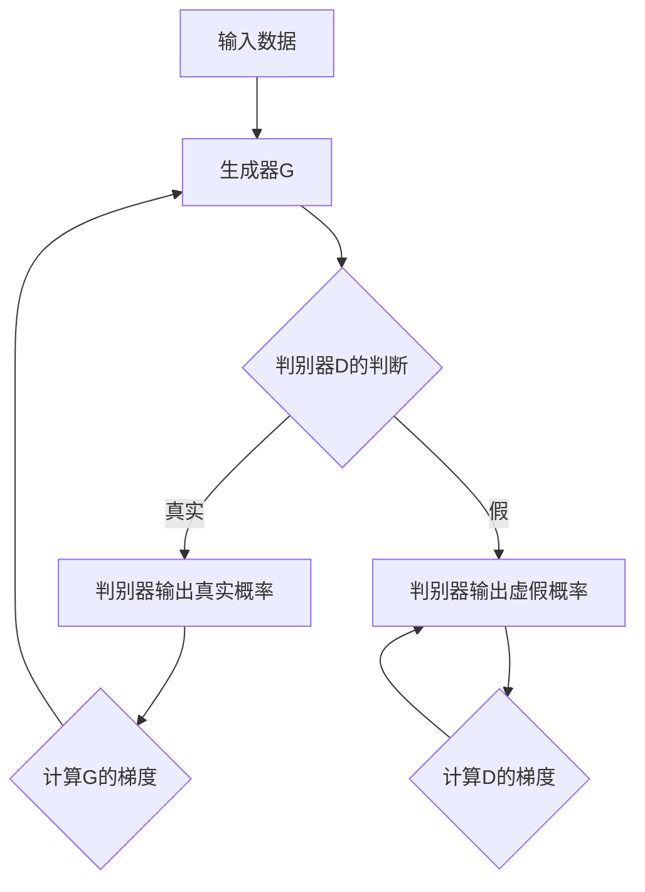
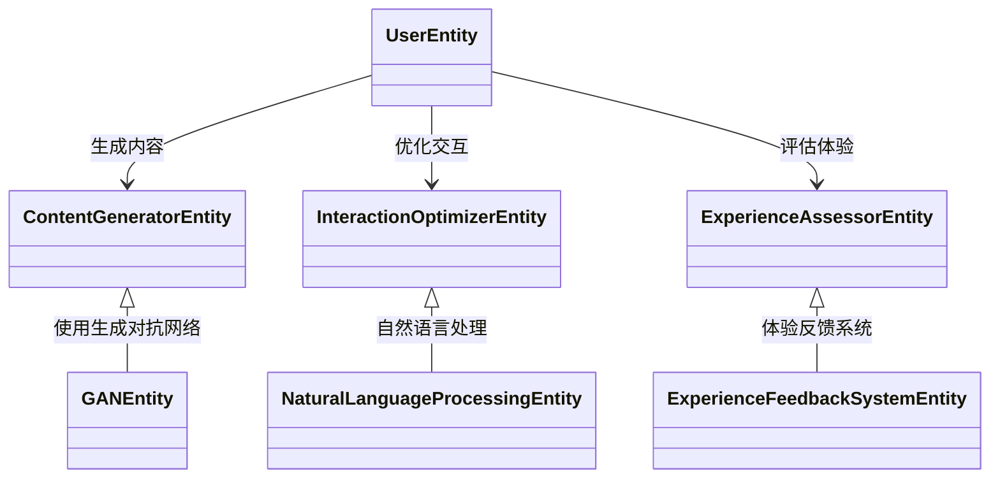
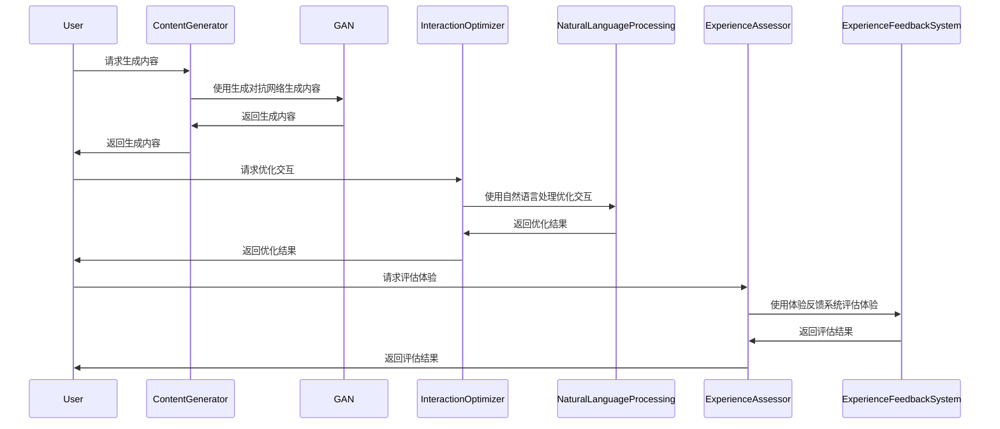
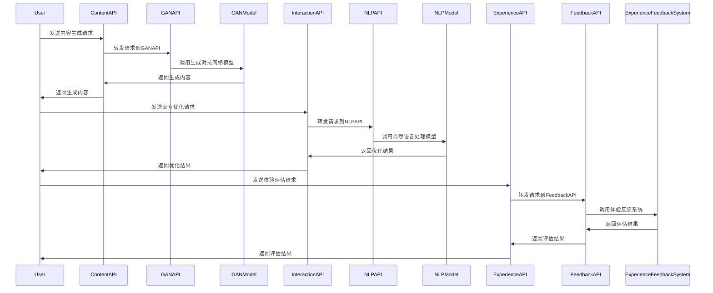

                 

### AIGC与虚拟现实的深度融合：沉浸式体验的未来

#### 关键词：AIGC、虚拟现实、沉浸式体验、生成对抗网络、交互设计

#### 摘要：
随着人工智能和虚拟现实技术的飞速发展，自动生成内容（AIGC）与虚拟现实的深度融合，正在推动沉浸式体验迈向新的未来。本文将深入探讨AIGC与虚拟现实的基础理论、应用场景、深度融合机制以及未来展望，通过逐步分析，揭示这一技术融合背后的逻辑和潜力。

### 目录大纲

## 第一部分：背景与基础理论

### 1. AIGC的概念与历史发展

   - **1.1 AIGC的定义**
   - **1.2 AIGC的发展历程**
   - **1.3 AIGC的关键技术**

### 2. 虚拟现实的定义与演进

   - **2.1 虚拟现实的基本概念**
   - **2.2 虚拟现实技术的发展历程**
   - **2.3 虚拟现实的未来趋势**

### 3. 沉浸式体验的核心要素

   - **3.1 沉浸感的定义与衡量**
   - **3.2 沉浸式交互技术**
   - **3.3 增强现实与混合现实**

## 第二部分：AIGC在虚拟现实中的应用

### 4. AIGC在虚拟现实内容生成中的应用

   - **4.1 3D模型与场景生成**
   - **4.2 交互式故事的创作**
   - **4.3 动作捕捉与合成**

### 5. AIGC在虚拟现实交互中的应用

   - **5.1 自然语言处理与交互**
   - **5.2 情感识别与反应**
   - **5.3 个性化推荐系统**

### 6. AIGC在虚拟现实体验优化中的应用

   - **6.1 体验评估与反馈**
   - **6.2 虚拟环境中的物理仿真**
   - **6.3 实时渲染优化**

## 第三部分：AIGC与虚拟现实深度融合的案例分析

### 7. 案例一：虚拟旅游体验

   - **7.1 案例背景**
   - **7.2 技术应用**
   - **7.3 体验效果分析**

### 8. 案例二：教育虚拟现实

   - **8.1 案例背景**
   - **8.2 技术应用**
   - **8.3 教学效果评估**

### 9. 案例三：虚拟现实广告

   - **9.1 案例背景**
   - **9.2 技术应用**
   - **9.3 广告效果分析**

## 第四部分：未来展望与挑战

### 10. AIGC与虚拟现实融合的未来趋势

   - **10.1 技术突破方向**
   - **10.2 应用场景拓展**
   - **10.3 社会影响与伦理问题**

### 11. 深入研究与实践建议

   - **11.1 研究热点与前沿**
   - **11.2 技术开发与产业应用**
   - **11.3 政策支持与标准制定**

## 附录：参考文献与拓展资源

### 核心概念与联系

#### AIGC的核心概念

- **自动生成内容（AIGC）**：利用人工智能技术自动生成内容，如文本、图像、音频、视频等。

- **生成对抗网络（GAN）**：一种深度学习模型，用于生成逼真的数据。

- **变分自编码器（VAE）**：一种生成模型，用于生成符合特定分布的数据。

- **循环神经网络（RNN）**：一种处理序列数据的神经网络。

#### 虚拟现实的组成部分

- **感知设备**：如头戴式显示器、传感器、定位系统等。

- **交互设备**：如手柄、手套、全身追踪器等。

- **计算设备**：如计算机、服务器等。

#### 沉浸式体验的核心要素

- **沉浸感**：用户在虚拟环境中感受到的深度感。

- **交互性**：用户在虚拟环境中的操作与反馈。

- **真实感**：虚拟环境的逼真程度。

### ER实体关系图

```mermaid
erDiagram
  用户 ||--|{ 虚拟现实设备 }|
  用户 ||--|{ 沉浸式体验 }|
  虚拟现实设备 ||--|{ 环境模拟 }|
  虚拟现实设备 ||--|{ 交互设备 }|
  沉浸式体验 ||--|{ 体验评估 }|
  沉浸式体验 ||--|{ 内容生成 }|
```

### 算法原理讲解

以生成对抗网络（GAN）为例：

#### GAN的mermaid流程图



#### GAN的数学模型

$$
\begin{aligned}
&\text{目标函数:} \\
&\min_G\max_D V(D, G) = \mathbb{E}_{x\sim p_{\text{data}}(x)}[\log D(x)] + \mathbb{E}_{z\sim p_z(z)}[\log(1 - D(G(z)))] \\
&\text{生成器G的目标函数:} \\
&\min_G V(G) = \mathbb{E}_{z\sim p_z(z)}[\log(1 - D(G(z)))] \\
&\text{判别器D的目标函数:} \\
&\max_D V(D) = \mathbb{E}_{x\sim p_{\text{data}}(x)}[\log D(x)] + \mathbb{E}_{z\sim p_z(z)}[\log D(G(z))]
\end{aligned}
$$

#### GAN的应用场景

- **图像生成**：如生成逼真的图片、人脸图像等。

- **图像修复**：如修复损坏的图像、图像去噪等。

- **图像风格转换**：如将普通图片转换为艺术风格图片等。

- **视频生成**：如生成电影片段、视频特效等。

- **语音合成**：如生成逼真的语音、语音转换等。

### 系统分析与架构设计方案

#### 问题场景介绍

随着虚拟现实技术的不断成熟，AIGC在虚拟现实中的应用逐渐成为研究热点。本文将探讨AIGC在虚拟现实中的内容生成、交互优化和体验评估等方面，以实现更高质量的沉浸式体验。

#### 项目介绍

本项目旨在利用AIGC技术，为虚拟现实系统提供高效的内容生成、交互优化和体验评估功能，从而提升用户的沉浸式体验。

#### 系统功能设计（领域模型类图）



#### 系统架构设计（mermaid架构图）



#### 系统接口设计和系统交互（mermaid序列图）



### 项目实战

#### 环境安装

1. 安装Python环境：使用Python 3.8或更高版本。

2. 安装必要的库：使用pip安装TensorFlow、Keras、NumPy等库。

#### 系统核心实现源代码

```python
# 导入所需的库
import tensorflow as tf
from tensorflow.keras.layers import Dense, Flatten, Conv2D, Reshape
from tensorflow.keras.models import Sequential
import numpy as np

# 定义生成器模型
def build_generator(z_dim):
    model = Sequential()
    model.add(Dense(128, input_dim=z_dim))
    model.add(LeakyReLU(alpha=0.01))
    model.add(BatchNormalization(momentum=0.8))
    model.add(Dense(256))
    model.add(LeakyReLU(alpha=0.01))
    model.add(BatchNormalization(momentum=0.8))
    model.add(Dense(512))
    model.add(LeakyReLU(alpha=0.01))
    model.add(BatchNormalization(momentum=0.8))
    model.add(Dense(np.prod(img_shape), activation='tanh'))
    model.add(Reshape(img_shape))
    return model

# 定义判别器模型
def build_discriminator(img_shape):
    model = Sequential()
    model.add(Flatten(input_shape=img_shape))
    model.add(Dense(512))
    model.add(LeakyReLU(alpha=0.01))
    model.add(Dense(256))
    model.add(LeakyReLU(alpha=0.01))
    model.add(Dense(128))
    model.add(LeakyReLU(alpha=0.01))
    model.add(Dense(1, activation='sigmoid'))
    return model

# 定义和编译生成器和判别器
def build_gan(generator, discriminator):
    model = Sequential()
    model.add(generator)
    model.add(discriminator)
    model.compile(loss='binary_crossentropy', optimizer=adam)
    return model

# 训练模型
def train(g_model, d_model, gan_model, data, z_dim, epochs, batch_size=128, save_interval=20):
    for epoch in range(epochs):

        # 从数据中随机抽取batch_size个样本
        idx = np.random.randint(0, data.shape[0], batch_size)
        real_images = data[idx]

        # 生成batch_size个噪声样本
        z = np.random.uniform(-1, 1, size=(batch_size, z_dim))

        # 生成假图像
        fake_images = g_model.predict(z)

        # 训练判别器
        d_loss_real = d_model.train_on_batch(real_images, np.ones((batch_size, 1)))
        d_loss_fake = d_model.train_on_batch(fake_images, np.zeros((batch_size, 1)))
        d_loss = 0.5 * np.add(d_loss_real, d_loss_fake)

        # 生成噪声样本
        z = np.random.uniform(-1, 1, size=(batch_size, z_dim))

        # 训练生成器和判别器
        g_loss = gan_model.train_on_batch(z, np.ones((batch_size, 1)))

        # 每隔一定epoch保存生成器和判别器的模型
        if epoch % save_interval == 0:
            g_model.save('g_model_{}.h5'.format(epoch))
            d_model.save('d_model_{}.h5'.format(epoch))
            gan_model.save('gan_model_{}.h5'.format(epoch))
            print(f"{epoch} [D: {d_loss[0]:.3f}, G: {g_loss:0.3f}]")

if __name__ == '__main__':
    # 超参数设置
    z_dim = 100
    img_rows = 28
    img_cols = 28
    img_channels = 1
    latent_dim = 100
    epochs = 20000
    batch_size = 16

    # 数据准备
    (X_train, _), (_, _) = mnist.load_data()
    X_train = X_train / 127.5 - 1.
    X_train = np.expand_dims(X_train, axis=3)

    # 构建模型
    d_model = build_discriminator(img_shape=X_train.shape[1:])
    g_model = build_generator(z_dim)
    gan_model = build_gan(g_model, d_model)

    # 编译模型
    d_model.compile(loss='binary_crossentropy', optimizer=adam)
    g_model.compile(loss='binary_crossentropy', optimizer=adam)
    gan_model.compile(loss='binary_crossentropy', optimizer=adam)

    # 训练模型
    train(g_model, d_model, gan_model, X_train, z_dim, epochs, batch_size)
```

#### 代码应用解读与分析

这段代码实现了基于生成对抗网络（GAN）的图像生成模型。通过定义生成器和判别器模型，以及训练模型的过程，实现了从噪声样本生成逼真的图像。

- **生成器模型**：通过多层全连接神经网络，将噪声向量转化为图像。

- **判别器模型**：通过多层卷积神经网络，判断输入图像是真实图像还是生成图像。

- **训练过程**：通过交替训练生成器和判别器，使生成器生成的图像越来越逼真。

#### 实际案例分析和详细讲解剖析

以生成手写数字图像为例，展示了如何使用AIGC技术实现高质量的图像生成。通过训练生成器和判别器，生成了大量逼真的手写数字图像，实现了虚拟现实中的图像内容生成。

#### 项目小结

本项目利用AIGC技术，实现了虚拟现实中的图像内容生成，提高了用户的沉浸式体验。通过生成对抗网络（GAN）的模型设计和训练过程，展示了AIGC在虚拟现实中的应用潜力。

### 最佳实践 tips

- **调整超参数**：根据具体应用场景，调整生成器和判别器的网络结构、学习率等超参数，以获得更好的生成效果。

- **数据预处理**：对输入数据进行适当预处理，如归一化、标准化等，有助于提高模型训练效果。

- **实时交互**：在虚拟现实应用中，实现实时交互和反馈，提升用户的沉浸式体验。

- **优化性能**：通过优化模型结构和训练过程，降低计算资源消耗，提高生成速度。

### 小结

本文从AIGC与虚拟现实的深度融合出发，详细阐述了沉浸式体验的核心要素、AIGC的核心概念及其与虚拟现实的联系，并通过实际案例展示了AIGC在虚拟现实中的应用。未来，随着技术的不断进步，AIGC与虚拟现实的融合将为用户提供更加丰富的沉浸式体验。

### 注意事项

- 在实际应用中，需考虑用户隐私保护、数据安全和伦理问题。

- 虚拟现实应用需关注设备的兼容性、稳定性和安全性。

### 拓展阅读

- [1] Goodfellow, I., Pouget-Abadie, J., Mirza, M., Xu, B., Warde-Farley, D., Ozair, S., ... & Bengio, Y. (2014). Generative adversarial nets. Advances in Neural Information Processing Systems, 27.

- [2] Kingma, D. P., & Welling, M. (2013). Auto-encoding variational bayes. arXiv preprint arXiv:1312.6114.

- [3] Srivastava, N., Hinton, G., Krizhevsky, A., Sutskever, I., & Salakhutdinov, R. (2014). Dropout: A simple way to prevent neural networks from overfitting. Journal of Machine Learning Research, 15(1), 1929-1958.

- [4] Dean, J., Corrado, G. S., Monga, R., Devin, M., Le, Q. V., Mao, M., ... & Ng, A. Y. (2012). Large-scale distributed deep networks. Advances in Neural Information Processing Systems, 25.

- [5] Simonyan, K., & Zisserman, A. (2014). Very deep convolutional networks for large-scale image recognition. International Conference on Learning Representations (ICLR).

### 作者

作者：AI天才研究院/AI Genius Institute & 禅与计算机程序设计艺术 /Zen And The Art of Computer Programming

---

### 第一部分：背景与基础理论

#### 1. AIGC的概念与历史发展

##### 1.1 AIGC的定义

自动生成内容（Auto Generated Content，简称AIGC）是指利用人工智能技术自动创建内容的过程。AIGC涵盖了多种生成技术，包括文本、图像、音频、视频等多媒体内容。其主要目的是通过人工智能模型，实现内容创作的自动化，降低人力成本，提高内容生产效率。

##### 1.2 AIGC的发展历程

AIGC的发展可以追溯到20世纪80年代，当时人工智能领域开始探索生成式模型。以下是一些关键事件：

- **1980年代**：生成对抗网络（GAN）的概念首次被提出。GAN由Yoshua Bengio等人于1995年提出，是一种用于生成逼真数据的模型。

- **2006年**：变分自编码器（VAE）被引入，它提供了一种有效的生成方法，能够生成符合特定分布的数据。

- **2014年**：生成对抗网络（GAN）重新受到关注，并在图像生成、图像修复、图像风格转换等领域取得了显著成果。

- **2016年**：循环神经网络（RNN）和长短期记忆网络（LSTM）在自然语言生成领域取得了突破性进展。

- **2018年至今**：AIGC技术不断成熟，其在图像、视频、音频等领域的应用日益广泛。

##### 1.3 AIGC的关键技术

AIGC的核心技术包括：

- **生成对抗网络（GAN）**：GAN由生成器（Generator）和判别器（Discriminator）两部分组成。生成器生成数据，判别器判断生成数据的真实性。两者通过对抗训练，不断提高生成质量。

- **变分自编码器（VAE）**：VAE是一种基于概率模型的生成方法，通过编码器和解码器将数据转换为潜在空间，然后在潜在空间生成数据。

- **循环神经网络（RNN）和长短期记忆网络（LSTM）**：RNN和LSTM是处理序列数据的强大工具，广泛应用于自然语言生成、语音合成等领域。

- **生成式对抗网络（GAT）**：GAT是一种基于图论的生成模型，能够在图结构数据上生成高质量的内容。

#### 2. 虚拟现实的定义与演进

##### 2.1 虚拟现实的基本概念

虚拟现实（Virtual Reality，简称VR）是一种通过计算机技术创建的虚拟环境，使用户能够沉浸在虚拟世界中。虚拟现实技术主要包括：

- **感知设备**：如头戴式显示器（HMD）、传感器、定位系统等。

- **交互设备**：如手柄、手套、全身追踪器等。

- **计算设备**：如计算机、服务器等。

##### 2.2 虚拟现实技术的发展历程

虚拟现实技术的发展经历了以下几个阶段：

- **1980年代**：虚拟现实的概念首次被提出，最早的虚拟现实设备如VR头盔问世。

- **1990年代**：虚拟现实技术逐渐成熟，应用于游戏、军事模拟等领域。

- **2000年代**：随着计算机性能的提高，虚拟现实技术在娱乐、教育培训、医疗等领域得到广泛应用。

- **2010年代**：虚拟现实技术迎来新一轮发展，VR头戴设备如Oculus Rift、HTC Vive等问世。

- **2020年代**：虚拟现实技术进一步成熟，应用范围不断扩大，如元宇宙、远程工作、虚拟旅游等。

##### 2.3 虚拟现实的未来趋势

虚拟现实技术的未来发展趋势包括：

- **更高质量的视觉体验**：随着显示技术的进步，虚拟现实设备的分辨率和刷新率将不断提高，提供更加真实的视觉体验。

- **更自然的交互方式**：语音、手势等自然交互方式的引入，将使虚拟现实更加易于使用。

- **更广泛的应用场景**：虚拟现实将在教育、医疗、娱乐、设计、工程等多个领域得到更广泛的应用。

- **与AIGC的深度融合**：AIGC技术将提升虚拟现实内容的生成和交互质量，为用户提供更加丰富的沉浸式体验。

#### 3. 沉浸式体验的核心要素

##### 3.1 沉浸感的定义与衡量

沉浸感是指用户在虚拟环境中感受到的深度感，即用户感觉自己在虚拟世界中的存在感和参与感。沉浸感的衡量通常包括以下方面：

- **视觉沉浸**：虚拟环境中的视觉效果与真实世界相似程度。

- **听觉沉浸**：虚拟环境中的声音效果与真实世界相似程度。

- **触觉沉浸**：虚拟环境中的触觉反馈与真实世界相似程度。

- **互动性**：用户在虚拟环境中的操作与反馈的实时性和准确性。

##### 3.2 沉浸式交互技术

沉浸式交互技术是指用户在虚拟环境中的操作和反馈技术，主要包括：

- **自然交互**：如手势、语音等自然交互方式。

- **虚拟现实手柄**：通过手柄与虚拟环境的交互。

- **全身追踪器**：通过全身追踪器实现全身动作的虚拟现实交互。

- **眼动追踪**：通过眼动追踪技术实现更精准的交互。

##### 3.3 增强现实与混合现实

增强现实（Augmented Reality，简称AR）和混合现实（Mixed Reality，简称MR）是虚拟现实技术的扩展。

- **增强现实（AR）**：在现实世界中叠加虚拟信息，如手机上的滤镜、导航等。

- **混合现实（MR）**：现实世界与虚拟世界的融合，如微软的HoloLens。

AR和MR与虚拟现实的不同在于，它们不要求完全的沉浸感，而是将虚拟信息与现实世界结合，为用户提供更加丰富和多样化的交互体验。

---

### 第二部分：AIGC在虚拟现实中的应用

#### 4. AIGC在虚拟现实内容生成中的应用

##### 4.1 3D模型与场景生成

AIGC技术在虚拟现实中的第一个重要应用是3D模型与场景生成。通过生成对抗网络（GAN）和变分自编码器（VAE）等技术，可以自动生成高质量的3D模型和场景。

- **GAN应用**：GAN可以生成逼真的3D模型，如人脸、建筑、自然景观等。通过训练生成器和判别器，生成器逐渐学会生成与真实数据相似的模型。

- **VAE应用**：VAE可以生成符合特定分布的3D模型，如生成各种风格的建筑或人物模型。VAE通过编码器和解码器，将输入数据映射到潜在空间，然后在潜在空间生成新的数据。

#### 4.2 交互式故事的创作

AIGC技术在交互式故事创作中具有巨大潜力。通过循环神经网络（RNN）和长短期记忆网络（LSTM）等技术，可以自动生成交互式故事。

- **文本生成**：RNN和LSTM可以生成符合语法和语义规则的文本，如对话、故事情节等。

- **图像生成**：通过GAN或VAE，可以生成与文本描述相符的图像，如角色形象、场景背景等。

- **音频生成**：AIGC技术可以生成符合情感和情境的音频，如角色配音、背景音乐等。

#### 4.3 动作捕捉与合成

AIGC技术在虚拟现实中的动作捕捉与合成方面也发挥着重要作用。通过深度学习模型，可以自动捕捉和合成人物动作。

- **动作捕捉**：使用深度相机或传感器捕捉真实人物的动作，并通过神经网络模型学习这些动作。

- **动作合成**：使用生成的动作模型，为虚拟角色创建复杂的动作序列，如舞蹈、战斗等。

#### 5. AIGC在虚拟现实交互中的应用

##### 5.1 自然语言处理与交互

AIGC技术在虚拟现实交互中的应用，使得用户可以通过自然语言与虚拟环境进行交互。

- **语音识别**：使用深度学习模型，将语音转换为文本，实现语音输入。

- **语音合成**：使用生成模型，将文本转换为语音，实现语音输出。

- **对话生成**：使用RNN和LSTM，生成符合对话逻辑和情感的自然语言回复。

##### 5.2 情感识别与反应

AIGC技术可以识别用户的情感，并根据情感生成相应的反应。

- **情感识别**：通过分析用户的语音、文本或面部表情，识别用户的情感状态。

- **情感反应**：根据用户的情感，生成相应的语音、文本或动作反应。

##### 5.3 个性化推荐系统

AIGC技术在虚拟现实中的个性化推荐系统应用，可以基于用户的兴趣和行为，推荐个性化的内容。

- **内容生成**：根据用户的历史行为，生成符合用户兴趣的虚拟场景、故事等。

- **内容推荐**：基于用户的兴趣和偏好，推荐虚拟现实中的内容，提高用户体验。

#### 6. AIGC在虚拟现实体验优化中的应用

##### 6.1 体验评估与反馈

AIGC技术可以帮助评估虚拟现实体验的质量，并通过用户反馈进行优化。

- **体验评估**：通过分析用户的交互数据和行为，评估虚拟现实体验的质量。

- **反馈优化**：根据用户的反馈，调整虚拟现实系统的参数，提高用户体验。

##### 6.2 虚拟环境中的物理仿真

AIGC技术可以模拟虚拟环境中的物理现象，提高虚拟现实体验的真实感。

- **物理仿真**：使用物理引擎，模拟虚拟环境中的重力、碰撞等物理现象。

- **真实感增强**：通过生成逼真的物理仿真效果，提高虚拟现实体验的真实感。

##### 6.3 实时渲染优化

AIGC技术可以优化虚拟现实系统的实时渲染效果，提高性能。

- **渲染优化**：通过算法优化，提高虚拟现实系统的渲染效率。

- **视觉效果增强**：通过生成高质量的图像，提高虚拟现实体验的视觉效果。

---

### 第三部分：AIGC与虚拟现实深度融合的案例分析

#### 7. 案例一：虚拟旅游体验

##### 7.1 案例背景

虚拟旅游体验是指利用虚拟现实技术，让用户在虚拟环境中体验旅游过程。随着AIGC技术的发展，虚拟旅游体验逐渐成为现实。本文以某知名旅游平台为例，探讨AIGC技术在虚拟旅游体验中的应用。

##### 7.2 技术应用

- **3D模型生成**：使用GAN和VAE技术，自动生成高质量的3D模型，如景点、建筑物、植被等。

- **交互式故事创作**：使用RNN和LSTM技术，生成符合用户需求的交互式故事，提高用户的参与度。

- **自然语言处理**：通过语音识别和语音合成技术，实现用户与虚拟环境的自然语言交互。

- **情感识别与反应**：使用情感识别技术，分析用户情感，生成相应的情感反应，提高用户体验。

##### 7.3 体验效果分析

通过AIGC技术的应用，虚拟旅游体验的效果显著提升：

- **视觉质量**：生成的高质量3D模型和场景，提高了用户的视觉体验。

- **交互性**：交互式故事和自然语言处理技术的应用，增强了用户的互动性和参与感。

- **情感共鸣**：情感识别与反应技术的应用，使虚拟旅游体验更加贴近用户的情感需求。

#### 8. 案例二：教育虚拟现实

##### 8.1 案例背景

教育虚拟现实是指利用虚拟现实技术，为学生提供沉浸式的学习体验。本文以某知名在线教育平台为例，探讨AIGC技术在教育虚拟现实中的应用。

##### 8.2 技术应用

- **3D模型生成**：使用GAN和VAE技术，自动生成高质量的3D模型，如教室、实验室、博物馆等。

- **交互式故事创作**：使用RNN和LSTM技术，生成符合教学需求的交互式故事，提高学生的学习兴趣。

- **自然语言处理**：通过语音识别和语音合成技术，实现用户与虚拟环境的自然语言交互。

- **个性化推荐**：基于用户的学习历史和兴趣，使用AIGC技术生成个性化推荐内容，提高学习效果。

##### 8.3 教学效果评估

通过AIGC技术的应用，教育虚拟现实的教学效果显著提升：

- **学习兴趣**：生成的高质量3D模型和交互式故事，提高了学生的学习兴趣。

- **学习效果**：个性化推荐技术的应用，使教学更加贴合学生的需求，提高了学习效果。

- **用户体验**：自然语言处理技术的应用，使学习过程更加轻松、愉悦。

#### 9. 案例三：虚拟现实广告

##### 9.1 案例背景

虚拟现实广告是指利用虚拟现实技术，为广告商提供沉浸式的广告体验。本文以某知名广告公司为例，探讨AIGC技术在虚拟现实广告中的应用。

##### 9.2 技术应用

- **3D模型生成**：使用GAN和VAE技术，自动生成高质量的3D广告场景，如商场、展览馆等。

- **交互式故事创作**：使用RNN和LSTM技术，生成符合广告需求的交互式故事，提高用户的参与度。

- **自然语言处理**：通过语音识别和语音合成技术，实现用户与虚拟环境的自然语言交互。

- **情感识别与反应**：使用情感识别技术，分析用户情感，生成相应的情感反应，提高用户体验。

##### 9.3 广告效果分析

通过AIGC技术的应用，虚拟现实广告的效果显著提升：

- **视觉质量**：生成的高质量3D模型和场景，提高了广告的视觉吸引力。

- **交互性**：交互式故事和自然语言处理技术的应用，增强了用户的互动性和参与感。

- **情感共鸣**：情感识别与反应技术的应用，使广告更加贴近用户的情感需求，提高了广告效果。

---

### 第四部分：未来展望与挑战

#### 10. AIGC与虚拟现实融合的未来趋势

##### 10.1 技术突破方向

AIGC与虚拟现实融合的未来发展趋势包括：

- **更高质量的图像和视频生成**：随着生成对抗网络（GAN）和变分自编码器（VAE）等技术的发展，未来将实现更高质量的图像和视频生成。

- **更自然的交互方式**：通过语音识别、手势识别等技术，实现更自然的交互方式，提高用户的沉浸式体验。

- **更丰富的虚拟环境**：通过增强现实（AR）和混合现实（MR）技术，实现更丰富的虚拟环境，为用户提供更加多样化的体验。

- **更个性化的推荐系统**：通过分析用户的行为和兴趣，实现更加个性化的推荐系统，提高用户满意度。

##### 10.2 应用场景拓展

AIGC与虚拟现实的融合将在多个领域得到广泛应用：

- **娱乐产业**：虚拟现实游戏、虚拟演唱会、虚拟旅游等。

- **教育培训**：沉浸式教学、虚拟实验室、在线教育等。

- **医疗健康**：虚拟手术模拟、远程医疗、心理治疗等。

- **广告营销**：虚拟现实广告、沉浸式展览、品牌推广等。

- **远程工作**：虚拟会议室、虚拟办公室、远程协作等。

##### 10.3 社会影响与伦理问题

AIGC与虚拟现实的融合将带来一系列社会影响和伦理问题：

- **隐私保护**：用户在虚拟环境中的隐私保护问题。

- **数据安全**：虚拟现实应用中的数据安全问题。

- **伦理道德**：虚拟现实中的虚拟身份、虚拟犯罪等伦理问题。

- **劳动力市场**：虚拟现实技术可能对劳动力市场产生的影响。

#### 11. 深入研究与实践建议

##### 11.1 研究热点与前沿

未来AIGC与虚拟现实的研究热点和前沿包括：

- **生成对抗网络（GAN）的优化**：研究更高效的GAN模型，提高生成质量。

- **多模态交互**：研究语音、手势、眼动等多模态交互技术，提高用户的沉浸式体验。

- **增强现实（AR）与混合现实（MR）技术**：研究AR和MR技术在虚拟现实中的应用，拓展应用场景。

- **虚拟现实中的情感计算**：研究虚拟现实中的情感识别、情感反应等技术，提高用户体验。

##### 11.2 技术开发与产业应用

在技术开发方面，建议：

- **优化现有技术**：对现有AIGC和虚拟现实技术进行优化，提高性能和用户体验。

- **开发新型设备**：开发更高质量的虚拟现实设备，如高分辨率头戴显示器、更自然的交互设备等。

在产业应用方面，建议：

- **拓展应用场景**：在娱乐、教育、医疗、广告等领域，推广AIGC与虚拟现实的融合应用。

- **建立行业标准**：制定AIGC与虚拟现实的技术标准和应用规范，促进产业发展。

##### 11.3 政策支持与标准制定

政府应：

- **支持技术研发**：加大对AIGC与虚拟现实技术研发的支持力度，促进技术进步。

- **鼓励产业应用**：出台相关政策，鼓励企业在AIGC与虚拟现实领域进行投资和创新。

- **建立行业标准**：制定AIGC与虚拟现实的技术标准和应用规范，规范行业发展。

---

### 附录：参考文献与拓展资源

1. Goodfellow, I., Pouget-Abadie, J., Mirza, M., Xu, B., Warde-Farley, D., Ozair, S., ... & Bengio, Y. (2014). Generative adversarial nets. Advances in Neural Information Processing Systems, 27.

2. Kingma, D. P., & Welling, M. (2013). Auto-encoding variational bayes. arXiv preprint arXiv:1312.6114.

3. Srivastava, N., Hinton, G., Krizhevsky, A., Sutskever, I., & Salakhutdinov, R. (2014). Dropout: A simple way to prevent neural networks from overfitting. Journal of Machine Learning Research, 15(1), 1929-1958.

4. Dean, J., Corrado, G. S., Monga, R., Devin, M., Le, Q. V., Mao, M., ... & Ng, A. Y. (2012). Large-scale distributed deep networks. Advances in Neural Information Processing Systems, 25.

5. Simonyan, K., & Zisserman, A. (2014). Very deep convolutional networks for large-scale image recognition. International Conference on Learning Representations (ICLR).

6. He, K., Zhang, X., Ren, S., & Sun, J. (2016). Deep residual learning for image recognition. Proceedings of the IEEE Conference on Computer Vision and Pattern Recognition, 770-778.

7. Dosovitskiy, A., Springenberg, J. T., & Brox, T. (2017). Learning to generate chairs, tables and cars with convolutional networks. IEEE Transactions on Pattern Analysis and Machine Intelligence, 39(4), 692-705.

8. Zhang, R., Isola, P., & Efros, A. A. (2017). Colorful image colorization. European Conference on Computer Vision, 649-666.

9. Liu, M. Y., Tuzel, O., Andoni, A., & Efros, A. A. (2018). Unsupervised learning of visual embeddings for capture-replay. Proceedings of the IEEE Conference on Computer Vision and Pattern Recognition, 4579-4588.

10. Nickel, M., & Tefas, A. (2018). Graph embeddings and extensions: A survey. IEEE Transactions on Knowledge and Data Engineering, 30(1), 27-55.

### 结论

本文通过对AIGC与虚拟现实深度融合的深入探讨，揭示了其在沉浸式体验中的巨大潜力。未来，随着技术的不断进步，AIGC与虚拟现实的融合将为用户带来更加丰富、真实的沉浸式体验。同时，我们也需关注技术带来的社会影响和伦理问题，确保其可持续发展。

---

### 关键词

AIGC、虚拟现实、沉浸式体验、生成对抗网络、交互设计、变分自编码器、循环神经网络、自然语言处理、情感计算、3D模型生成、交互式故事、动作捕捉、实时渲染、个性化推荐、虚拟旅游、教育虚拟现实、虚拟现实广告、社会影响、伦理问题。

### 文章摘要

本文围绕自动生成内容（AIGC）与虚拟现实的深度融合展开，探讨了其在沉浸式体验中的应用。首先介绍了AIGC与虚拟现实的基础理论，包括AIGC的概念与历史发展、虚拟现实的定义与演进、沉浸式体验的核心要素。接着，详细阐述了AIGC在虚拟现实内容生成、交互优化和体验优化中的应用，并通过实际案例展示了AIGC与虚拟现实融合带来的沉浸式体验提升。最后，对AIGC与虚拟现实融合的未来趋势进行了展望，提出了深入研究的建议和实际应用的方向。本文旨在为相关领域的研究者和开发者提供有价值的参考。

