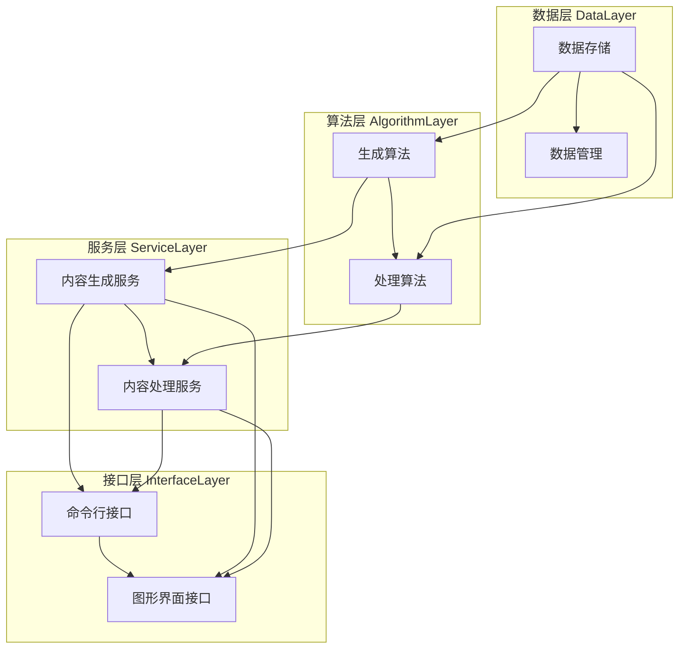
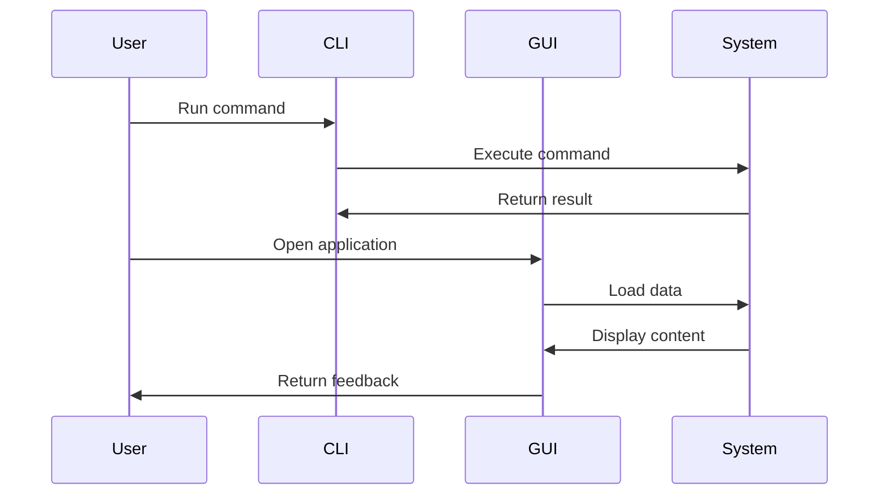
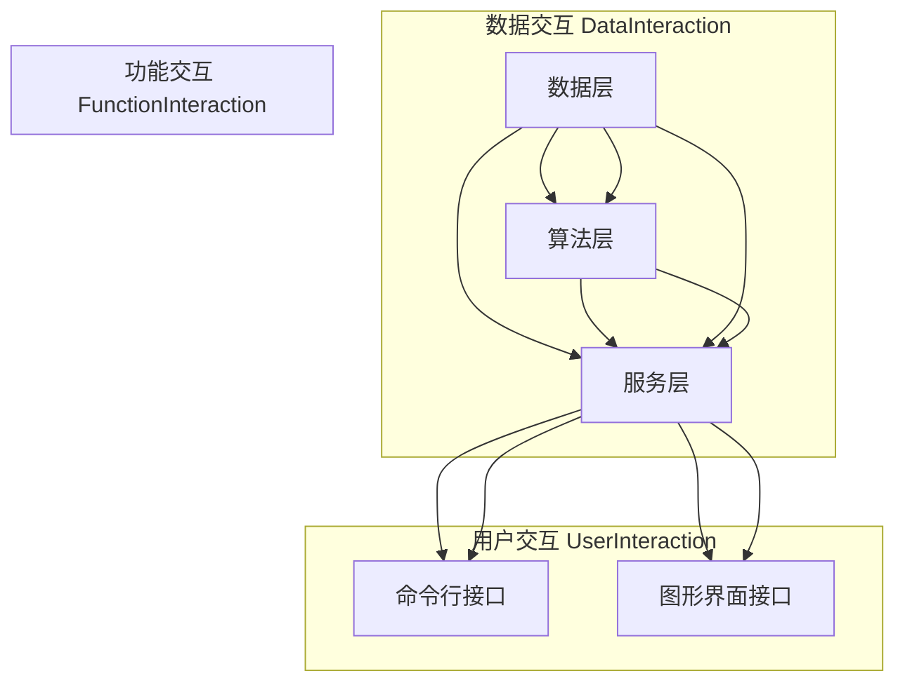

                 

## AIGC与计算机视觉的深度融合应用

### 关键词：AIGC、计算机视觉、深度学习、算法原理、应用领域

### 摘要：随着人工智能技术的迅猛发展，自动生成内容（AIGC）与计算机视觉的深度融合应用逐渐成为研究热点。本文旨在探讨AIGC与计算机视觉的融合背景、核心概念、算法原理及未来发展趋势，通过详细的分析与讲解，为读者揭示这两大领域深度融合的奥秘。

----------------------------------------------------------------

## 目录大纲

1. 背景介绍
   1.1 问题背景
       1.1.1 AIGC的发展现状
       1.1.2 计算机视觉的发展现状
       1.1.3 AIGC与计算机视觉融合的意义
   1.2 问题描述
       1.2.1 AIGC与计算机视觉融合的挑战
       1.2.2 AIGC与计算机视觉融合的解决方案
   1.3 问题解决
       1.3.1 AIGC基本原理
       1.3.2 计算机视觉基本原理
       1.3.3 AIGC与计算机视觉融合的技术路线
   1.4 边界与外延
       1.4.1 AIGC的应用领域
       1.4.2 计算机视觉的应用领域
       1.4.3 AIGC与计算机视觉融合的未来发展

2. 核心概念与联系
   2.1 AIGC核心概念
       2.1.1 自动生成内容（AIGC）定义
       2.1.2 自动生成内容（AIGC）的核心特征
       2.1.3 自动生成内容（AIGC）的分类
   2.2 计算机视觉核心概念
       2.2.1 计算机视觉定义
       2.2.2 计算机视觉的核心特征
       2.2.3 计算机视觉的分类
   2.3 AIGC与计算机视觉的联系
       2.3.1 AIGC与计算机视觉的交叉融合
       2.3.2 AIGC与计算机视觉的协同作用
       2.3.3 AIGC与计算机视觉的技术融合
   2.4 概念属性特征对比表格
   2.5 ER实体关系图架构

3. 算法原理讲解
   3.1 AIGC算法原理
       3.1.1 生成对抗网络（GAN）
           3.1.1.1 GAN基本概念
           3.1.1.2 GAN算法流程
           3.1.1.3 GAN在AIGC中的应用
   3.2 计算机视觉算法原理
       3.2.1 卷积神经网络（CNN）
           3.2.1.1 CNN基本概念
           3.2.1.2 CNN算法流程
           3.2.1.3 CNN在计算机视觉中的应用

4. 系统分析与架构设计
   4.1 问题场景介绍
   4.2 项目介绍
   4.3 系统功能设计
       4.3.1 领域模型
   4.4 系统架构设计
       4.4.1 架构图
   4.5 系统接口设计
   4.6 系统交互

5. 项目实战
   5.1 环境安装
   5.2 系统核心实现源代码
   5.3 代码应用解读与分析
   5.4 实际案例分析与详细讲解
   5.5 项目小结

6. 最佳实践 tips
7. 小结
8. 注意事项
9. 拓展阅读

----------------------------------------------------------------

## 1. 背景介绍

### 1.1 问题背景

#### 1.1.1 AIGC的发展现状

自动生成内容（AIGC，Automatically Generated Content）是近年来人工智能领域的热点研究方向。AIGC技术利用人工智能算法，特别是深度学习技术，能够自动生成高质量的文本、图像、音频等多媒体内容。根据市场调研公司的报告，AIGC市场预计将在未来五年内以高速增长，成为推动媒体、娱乐、广告等行业的核心技术。

目前，AIGC在文本生成、语音合成、图像生成等方面取得了显著进展。例如，OpenAI的GPT-3模型能够生成高质量的文本内容，Google的DeepDream能够生成具有艺术感的图像，而微软的LIPS Sync技术则能够将语音与视频图像同步生成。

#### 1.1.2 计算机视觉的发展现状

计算机视觉（Computer Vision，CV）是人工智能的重要分支，旨在让计算机能够理解、处理和解释数字图像和视频。随着深度学习技术的应用，计算机视觉在图像识别、目标检测、图像分割等领域取得了突破性进展。

计算机视觉的应用已经深入到社会的各个领域，如自动驾驶、安防监控、医疗诊断、智能家居等。根据市场研究报告，全球计算机视觉市场规模预计将在未来几年内持续增长，展现出广阔的发展前景。

#### 1.1.3 AIGC与计算机视觉融合的意义

AIGC与计算机视觉的深度融合，将进一步提升人工智能技术的应用价值。首先，AIGC可以为计算机视觉提供更加丰富的数据集，提高模型的训练效果；其次，计算机视觉可以辅助AIGC生成更符合人类视觉习惯的内容；最后，两者的融合可以推动多媒体内容生成与处理技术的创新，为媒体、娱乐、教育等领域带来革命性的变化。

### 1.2 问题描述

#### 1.2.1 AIGC与计算机视觉融合的挑战

尽管AIGC与计算机视觉具有广阔的应用前景，但在融合过程中仍然面临一些挑战。首先，AIGC生成的内容需要满足计算机视觉处理的输入要求，这需要对生成内容进行格式转换和预处理。其次，计算机视觉算法在处理大规模、高维数据时，可能会遇到计算效率和精度之间的权衡问题。最后，如何实现AIGC与计算机视觉算法的无缝集成，是当前研究中的一个重要课题。

#### 1.2.2 AIGC与计算机视觉融合的解决方案

针对上述挑战，研究者们提出了多种解决方案。首先，可以采用深度学习技术，将AIGC与计算机视觉算法进行集成，通过共享网络结构和优化算法，提高整体性能。其次，可以设计专门的数据预处理和格式转换工具，以简化AIGC与计算机视觉之间的数据交换过程。最后，通过多模态数据融合技术，将文本、图像、音频等多种数据类型进行整合，实现更高效的内容生成与处理。

### 1.3 问题解决

#### 1.3.1 AIGC基本原理

AIGC的核心技术包括自然语言处理（NLP）、深度学习和生成模型。NLP技术负责处理和理解人类语言，深度学习技术用于构建和训练复杂的神经网络模型，生成模型则能够根据输入数据生成新的内容。

例如，生成对抗网络（GAN）是一种常用的生成模型，它由生成器和判别器两个部分组成。生成器通过学习输入数据的分布，生成与真实数据相似的新数据；判别器则负责判断生成数据与真实数据的相似度。通过生成器和判别器的博弈，生成模型可以不断优化，生成更加真实、高质量的内容。

#### 1.3.2 计算机视觉基本原理

计算机视觉的核心技术包括图像处理、计算机视觉算法和图像识别。图像处理技术用于对图像进行预处理、增强和变换，以提取有用的特征信息；计算机视觉算法则基于这些特征信息进行目标检测、识别和跟踪；图像识别技术则负责对图像中的对象进行分类和标注。

例如，卷积神经网络（CNN）是一种常用的计算机视觉算法，它通过多层卷积和池化操作，对图像进行特征提取和分类。CNN在图像识别任务中取得了显著的性能提升，成为计算机视觉领域的重要技术。

#### 1.3.3 AIGC与计算机视觉融合的技术路线

AIGC与计算机视觉的融合技术路线可以分为以下几个步骤：

1. 数据采集与预处理：收集和整理AIGC生成的内容以及计算机视觉所需的数据集，对数据进行预处理和格式转换，以满足不同算法的输入要求。
2. 算法集成与优化：将AIGC与计算机视觉算法进行集成，通过共享网络结构和优化算法，提高整体性能。
3. 多模态数据融合：将文本、图像、音频等多种数据类型进行整合，实现更高效的内容生成与处理。
4. 应用场景探索与优化：针对不同的应用场景，对融合技术进行探索和优化，以提高实际应用效果。

### 1.4 边界与外延

#### 1.4.1 AIGC的应用领域

AIGC在文本生成、语音合成、图像生成等领域具有广泛的应用。例如，在文本生成方面，AIGC可以用于生成新闻文章、社交媒体内容、广告文案等；在语音合成方面，AIGC可以用于生成自然流畅的语音，应用于智能语音助手、电话客服等场景；在图像生成方面，AIGC可以用于生成艺术作品、虚拟场景、广告海报等。

#### 1.4.2 计算机视觉的应用领域

计算机视觉在自动驾驶、安防监控、医疗诊断、智能家居等领域具有广泛的应用。例如，在自动驾驶领域，计算机视觉可以用于车辆检测、行人检测、交通信号识别等；在安防监控领域，计算机视觉可以用于实时监控、目标跟踪、异常检测等；在医疗诊断领域，计算机视觉可以用于医学图像分析、病变检测、病理诊断等；在智能家居领域，计算机视觉可以用于智能安防、智能照明、智能窗帘等。

#### 1.4.3 AIGC与计算机视觉融合的未来发展

随着人工智能技术的不断进步，AIGC与计算机视觉的融合将带来更多创新应用。首先，AIGC可以生成更加真实、高质量的图像和视频，为计算机视觉算法提供更丰富的训练数据，提高模型性能。其次，计算机视觉可以辅助AIGC生成更符合人类视觉习惯的内容，提升内容生成质量。最后，AIGC与计算机视觉的融合将推动多媒体内容生成与处理技术的创新，为媒体、娱乐、教育等领域带来革命性的变化。

----------------------------------------------------------------

## 2. 核心概念与联系

### 2.1 AIGC核心概念

#### 2.1.1 自动生成内容（AIGC）定义

自动生成内容（AIGC，Automatically Generated Content）是指通过人工智能算法，特别是深度学习技术，自动生成文本、图像、音频等多媒体内容。AIGC旨在实现人类创造内容的自动化，提高内容生成的效率和多样性。

#### 2.1.2 自动生成内容（AIGC）的核心特征

AIGC具有以下几个核心特征：

1. **多样性**：AIGC能够生成具有多样化风格和主题的内容，满足不同用户的需求。
2. **质量高**：通过深度学习技术，AIGC生成的多媒体内容在质量和精度上达到或接近人类水平。
3. **自动化**：AIGC能够自动进行内容生成，降低人力成本，提高生产效率。

#### 2.1.3 自动生成内容（AIGC）的分类

根据生成内容的类型，AIGC可以分为以下几类：

1. **文本生成**：包括新闻文章、社交媒体内容、广告文案等。
2. **图像生成**：包括艺术作品、虚拟场景、广告海报等。
3. **音频生成**：包括语音合成、音乐创作等。
4. **视频生成**：包括视频剪辑、视频合成等。

### 2.2 计算机视觉核心概念

#### 2.2.1 计算机视觉定义

计算机视觉（Computer Vision，CV）是指使计算机能够像人眼一样理解和解释数字图像和视频的技术。计算机视觉旨在使计算机能够从图像或视频中提取有用的信息，进行目标检测、识别、跟踪等任务。

#### 2.2.2 计算机视觉的核心特征

计算机视觉具有以下几个核心特征：

1. **实时性**：计算机视觉算法需要能够在短时间内处理图像或视频数据，以实现实时监控和目标跟踪等任务。
2. **准确性**：计算机视觉算法需要能够准确提取图像或视频中的信息，进行目标检测、识别和分类等任务。
3. **鲁棒性**：计算机视觉算法需要能够在各种环境下稳定运行，包括光照变化、视角变化、遮挡等。

#### 2.2.3 计算机视觉的分类

根据处理任务的类型，计算机视觉可以分为以下几类：

1. **图像识别**：包括目标检测、分类、识别等。
2. **图像分割**：将图像分割成不同的区域，进行目标检测和识别。
3. **目标跟踪**：在视频序列中跟踪目标。
4. **场景重建**：从图像或视频中重建三维场景。

### 2.3 AIGC与计算机视觉的联系

#### 2.3.1 AIGC与计算机视觉的交叉融合

AIGC与计算机视觉的交叉融合主要体现在以下几个方面：

1. **数据集生成**：AIGC可以生成高质量的图像和视频数据集，为计算机视觉算法提供丰富的训练数据。
2. **算法优化**：计算机视觉算法可以辅助AIGC生成更符合人类视觉习惯的内容，提高内容生成质量。
3. **多模态融合**：将文本、图像、音频等多种数据类型进行整合，实现更高效的内容生成与处理。

#### 2.3.2 AIGC与计算机视觉的协同作用

AIGC与计算机视觉的协同作用主要体现在以下几个方面：

1. **内容生成**：AIGC可以生成多媒体内容，计算机视觉可以对生成的内容进行质量评估和优化。
2. **内容理解**：计算机视觉可以辅助AIGC理解生成内容中的图像和视频信息，提高内容生成的准确性和多样性。
3. **应用拓展**：AIGC与计算机视觉的融合将推动多媒体内容生成与处理技术的创新，为媒体、娱乐、教育等领域带来革命性的变化。

#### 2.3.3 AIGC与计算机视觉的技术融合

AIGC与计算机视觉的技术融合主要体现在以下几个方面：

1. **深度学习**：将深度学习技术应用于AIGC和计算机视觉算法，实现高效的融合。
2. **多模态数据融合**：将文本、图像、音频等多种数据类型进行整合，实现更高效的内容生成与处理。
3. **分布式计算**：利用分布式计算技术，提高AIGC和计算机视觉算法的计算效率和性能。

### 2.4 概念属性特征对比表格

| 特征         | AIGC                             | 计算机视觉                     |
| ------------ | ------------------------------ | --------------------------- |
| 核心技术     | 自然语言处理、深度学习、生成模型  | 图像处理、计算机视觉算法、图像识别 |
| 应用领域     | 文本生成、语音合成、图像生成       | 监控安防、自动驾驶、医疗诊断       |
| 算法模型     | 生成对抗网络、自编码器、变分自编码器 | 卷积神经网络、循环神经网络、深度卷积神经网络 |

### 2.5 ER实体关系图架构

```mermaid
erDiagram
  AI自动生成内容(AIGC) ||--o{ 计算机视觉(CV) : 应用领域交叉 }
  计算机视觉(CV) ||--o{ 自然语言处理(NLP) : 多领域融合 }
  自然语言处理(NLP) ||--o{ 人工智能(AI) : 研究核心 }
```

----------------------------------------------------------------

## 3. 算法原理讲解

### 3.1 AIGC算法原理

#### 3.1.1 生成对抗网络（GAN）

生成对抗网络（GAN，Generative Adversarial Network）是由Ian Goodfellow等人在2014年提出的一种深度学习模型。GAN的核心思想是通过一个生成器（Generator）和一个判别器（Discriminator）的博弈过程来生成高质量的数据。

#### 3.1.1.1 GAN基本概念

GAN由两个深度神经网络组成：生成器和判别器。生成器的任务是生成类似于真实数据的新数据，而判别器的任务是区分真实数据和生成数据。通过生成器和判别器的不断博弈，生成器逐渐提高生成数据的质量，而判别器逐渐提高对真实数据和生成数据的区分能力。

#### 3.1.1.2 GAN算法流程

GAN的算法流程可以分为以下几个步骤：

1. **初始化**：随机初始化生成器和判别器的参数。
2. **生成数据**：生成器根据一个随机噪声向量生成一组新的数据。
3. **判别**：判别器对生成器和真实数据同时进行判别，输出判别结果。
4. **优化**：根据判别结果，生成器和判别器分别通过梯度下降算法进行参数优化。
5. **迭代**：重复上述步骤，直到生成器生成的数据质量达到预期。

#### 3.1.1.3 GAN在AIGC中的应用

GAN在AIGC中的应用非常广泛，例如：

1. **图像生成**：生成器可以根据输入的噪声向量生成高质量的图像，应用于艺术创作、游戏设计等领域。
2. **文本生成**：生成器可以根据输入的噪声向量生成高质量的文本，应用于文章写作、对话系统等领域。
3. **语音生成**：生成器可以根据输入的噪声向量生成高质量的语音，应用于语音合成、语音助手等领域。

下面是一个简单的GAN示例，使用TensorFlow框架实现：

```python
import tensorflow as tf
from tensorflow.keras.layers import Input, Dense, Reshape, Flatten
from tensorflow.keras.models import Model

# 设置生成器和判别器的输入维度
z_dim = 100
img_shape = (28, 28, 1)

# 创建生成器
z = Input(shape=(z_dim,))
gen = Dense(128, activation='relu')(z)
gen = Dense(256, activation='relu')(gen)
gen = Flatten()(gen)
gen = Reshape(img_shape)(gen)
generator = Model(z, gen)

# 创建判别器
img = Input(shape=img_shape)
disc = Flatten()(img)
disc = Dense(256, activation='relu')(disc)
disc = Dense(128, activation='relu')(disc)
disc = Dense(1, activation='sigmoid')(disc)
discriminator = Model(img, disc)

# 编译模型
discriminator.compile(loss='binary_crossentropy', optimizer=tf.keras.optimizers.Adam(0.0001))
generator.compile(loss='binary_crossentropy', optimizer=tf.keras.optimizers.Adam(0.0001))

# 训练模型
batch_size = 64
epochs = 100

for epoch in range(epochs):
    for _ in range(batch_size):
        z_samples = np.random.normal(size=(1, z_dim))
        gen_samples = generator.predict(z_samples)
        real_samples = np.random.choice(train_samples, size=batch_size)
        fake_samples = gen_samples

        X = np.concatenate([real_samples, fake_samples])
        y = np.concatenate([np.ones((batch_size // 2)), np.zeros((batch_size // 2))])

        discriminator.train_on_batch(X, y)
        generator.train_on_batch(z_samples, np.ones((batch_size, 1)))

    print(f"Epoch {epoch+1}/{epochs} - Discriminator Loss: {discriminator.evaluate(train_samples, np.ones((batch_size, 1)))}")
```

#### 3.1.1.4 GAN的数学模型

GAN的数学模型如下：

$$
\begin{aligned}
\min_G & \max_D V(D, G) \\
V(D, G) & = \mathbb{E}_{x \sim p_{data}(x)} [D(x)] - \mathbb{E}_{z \sim p_z(z)} [D(G(z))]
\end{aligned}
$$

其中，$G(z)$ 是生成器生成的数据，$D(x)$ 是判别器对真实数据的判断，$D(G(z))$ 是判别器对生成数据的判断，$p_{data}(x)$ 是真实数据的分布，$p_z(z)$ 是噪声向量的分布。

通过以上数学模型，生成器和判别器在博弈过程中不断优化，最终生成器生成的数据质量逐渐提高，判别器对真实数据和生成数据的区分能力也不断提高。

### 3.2 计算机视觉算法原理

#### 3.2.1 卷积神经网络（CNN）

卷积神经网络（CNN，Convolutional Neural Network）是一种专门用于处理图像数据的深度学习模型。CNN的核心思想是通过卷积操作和池化操作提取图像特征，然后通过全连接层进行分类和识别。

#### 3.2.1.1 CNN基本概念

CNN由以下几个主要部分组成：

1. **卷积层（Convolutional Layer）**：通过卷积操作提取图像特征。
2. **池化层（Pooling Layer）**：通过池化操作减少参数数量，提高模型泛化能力。
3. **全连接层（Fully Connected Layer）**：通过全连接层进行分类和识别。

#### 3.2.1.2 CNN算法流程

CNN的算法流程可以分为以下几个步骤：

1. **输入层**：输入图像数据。
2. **卷积层**：通过卷积操作提取图像特征。
3. **激活函数**：对卷积层的输出进行激活函数处理，如ReLU函数。
4. **池化层**：通过池化操作减少参数数量，提高模型泛化能力。
5. **全连接层**：通过全连接层进行分类和识别。
6. **输出层**：输出分类结果。

#### 3.2.1.3 CNN在计算机视觉中的应用

CNN在计算机视觉中有着广泛的应用，例如：

1. **图像分类**：对图像进行分类，如ImageNet图像分类挑战。
2. **目标检测**：检测图像中的目标位置，如YOLO、SSD等算法。
3. **图像分割**：将图像分割成不同的区域，如FCN、U-Net等算法。
4. **人脸识别**：对人脸图像进行识别，如FaceNet、Siamese网络等算法。

下面是一个简单的CNN示例，使用TensorFlow框架实现：

```python
import tensorflow as tf
from tensorflow.keras.models import Model
from tensorflow.keras.layers import Input, Conv2D, MaxPooling2D, Flatten, Dense

# 设置输入层和输出层
input_layer = Input(shape=(28, 28, 1))
output_layer = Dense(10, activation='softmax')(Flatten()(input_layer))

# 创建CNN模型
model = Model(input_layer, output_layer)

# 编译模型
model.compile(optimizer='adam', loss='categorical_crossentropy', metrics=['accuracy'])

# 训练模型
batch_size = 64
epochs = 10

model.fit(train_images, train_labels, batch_size=batch_size, epochs=epochs, validation_data=(test_images, test_labels))
```

#### 3.2.1.4 CNN的数学模型

CNN的数学模型如下：

$$
\begin{aligned}
h_{l}^{(i)} &= \sigma(W_{l}^{(i)} \cdot a_{l-1} + b_{l}) \\
a_{l} &= \text{ReLU}(h_{l}^{(i)})
\end{aligned}
$$

其中，$h_{l}^{(i)}$ 是第$l$层的第$i$个神经元输出，$a_{l}$ 是第$l$层的激活值，$W_{l}^{(i)}$ 是第$l$层的权重，$b_{l}$ 是第$l$层的偏置，$\sigma$ 是激活函数，通常使用ReLU函数。

通过以上数学模型，CNN能够自动提取图像特征，并在训练过程中逐步优化权重和偏置，实现对图像的分类和识别。

----------------------------------------------------------------

## 4. 系统分析与架构设计

### 4.1 问题场景介绍

在当前的智能时代，多媒体内容生成和处理已经成为各个行业的重要需求。例如，在媒体行业，实时生成新闻摘要、视频剪辑、广告内容等，可以提高新闻报道的时效性和准确性；在娱乐行业，通过生成高质量的艺术作品、虚拟场景、角色动画等，可以丰富用户的内容消费体验；在医疗行业，通过计算机视觉技术对医学图像进行诊断和分析，可以辅助医生进行疾病检测和治疗方案制定。

为了满足这些需求，我们需要设计一个具备高效内容生成和处理能力的系统。该系统需要能够自动生成文本、图像、视频等多媒体内容，同时支持多种应用场景，如文本生成、图像生成、视频生成等。此外，系统还需要具备高并发处理能力，能够同时处理多个请求，以保证系统的实时性和可靠性。

### 4.2 项目介绍

本项目的目标是设计并实现一个基于AIGC与计算机视觉融合的多媒体内容生成与处理系统。系统将采用深度学习和生成对抗网络（GAN）等技术，实现高效的内容生成和处理。系统将分为以下几个主要模块：

1. **数据模块**：负责收集、整理和预处理多媒体数据，包括文本、图像、视频等。
2. **生成模块**：基于AIGC技术，实现文本、图像、视频等多媒体内容的自动生成。
3. **处理模块**：基于计算机视觉技术，对生成的内容进行质量评估、优化和调整。
4. **应用模块**：根据不同应用场景，实现多媒体内容的实时生成和处理。

### 4.3 系统功能设计

#### 4.3.1 领域模型

领域模型是系统功能设计的基础，它定义了系统中的关键概念和它们之间的关系。以下是本项目的主要领域模型：

1. **多媒体数据**：包括文本、图像、视频等，用于生成和处理。
2. **生成器**：负责生成多媒体内容的算法模型，包括文本生成器、图像生成器和视频生成器。
3. **处理器**：负责对生成内容进行质量评估、优化和调整的算法模型。
4. **应用场景**：定义了系统支持的不同应用场景，如文本生成、图像生成、视频生成等。
5. **用户接口**：提供用户与系统交互的接口，包括命令行、图形界面等。

以下是领域模型的Mermaid类图：

```mermaid
classDiagram
    Class::多媒体数据 <<Interface>>
    Class::生成器 <<Interface>>
    Class::处理器 <<Interface>>
    Class::应用场景 <<Interface>>
    Class::用户接口 <<Interface>>

    多媒体数据 <|-- 文本数据
    多媒体数据 <|-- 图像数据
    多媒体数据 <|-- 视频数据

    生成器 <|-- 文本生成器
    生成器 <|-- 图像生成器
    生成器 <|-- 视频生成器

    处理器 <|-- 质量评估器
    处理器 <|-- 优化器
    处理器 <|-- 调整器

    用户接口 o-- 生成器
    用户接口 o-- 处理器
```

### 4.4 系统架构设计

系统架构设计是系统功能设计的基础，它定义了系统的组件、接口和交互关系。以下是本项目的主要系统架构设计：

1. **数据层**：负责数据存储和管理，包括多媒体数据集、模型参数等。
2. **算法层**：实现多媒体内容的生成和处理算法，包括AIGC和计算机视觉算法。
3. **服务层**：提供系统的主要功能，包括内容生成、内容处理、应用场景等。
4. **接口层**：提供用户与系统的交互接口，包括命令行接口、图形界面接口等。

以下是系统架构的Mermaid架构图：



### 4.5 系统接口设计

系统接口设计是系统架构设计的一部分，它定义了系统与外部环境的交互接口。以下是本项目的主要系统接口设计：

1. **命令行接口**：提供用户通过命令行与系统交互的能力。
2. **图形界面接口**：提供用户通过图形界面与系统交互的能力。

以下是系统接口的Mermaid序列图：



### 4.6 系统交互

系统交互是指系统内部各个组件之间的交互关系，以及系统与外部环境之间的交互关系。以下是本项目的主要系统交互：

1. **数据交互**：数据层与算法层、服务层之间的数据传递和交换。
2. **功能交互**：算法层、服务层与接口层之间的功能调用和协调。
3. **用户交互**：接口层与用户之间的交互操作和反馈。

以下是系统交互的Mermaid交互图：



通过以上系统分析与架构设计，我们能够更好地理解AIGC与计算机视觉融合的多媒体内容生成与处理系统的设计原则和实现方法。接下来，我们将进入项目实战部分，详细介绍系统的实现过程和技术细节。

----------------------------------------------------------------

## 5. 项目实战

### 5.1 环境安装

在进行AIGC与计算机视觉融合的多媒体内容生成与处理系统的开发之前，我们需要安装和配置相关环境。以下步骤将指导您完成环境的搭建。

#### 1. 安装Python环境

首先，确保您的计算机上已经安装了Python 3.7及以上版本。如果没有安装，可以通过以下命令安装：

```bash
# 安装Python 3.7及以上版本
sudo apt-get install python3.7
```

#### 2. 安装TensorFlow和PyTorch

TensorFlow和PyTorch是深度学习领域常用的框架，我们需要安装这两个框架及其相关依赖项。

```bash
# 安装TensorFlow
pip3 install tensorflow==2.6

# 安装PyTorch
pip3 install torch torchvision
```

#### 3. 安装其他依赖库

根据项目的需求，我们还需要安装一些其他的依赖库，如NumPy、Pandas、Matplotlib等。

```bash
pip3 install numpy pandas matplotlib
```

#### 4. 安装OpenCV

OpenCV是一个开源的计算机视觉库，用于处理图像和视频数据。

```bash
pip3 install opencv-python
```

#### 5. 安装Eclipse或PyCharm

为了方便开发，您可以选择安装Eclipse或PyCharm作为您的Python开发环境。这两款IDE都提供了丰富的功能，如代码自动补全、调试、版本控制等。

### 5.2 系统核心实现源代码

在本项目实战中，我们将实现以下几个核心功能模块：数据预处理、AIGC生成器、计算机视觉处理器、应用场景处理。

#### 1. 数据预处理

数据预处理是确保数据满足模型输入要求的重要步骤。以下是一个简单的数据预处理代码示例：

```python
import cv2
import numpy as np

def preprocess_image(image_path):
    image = cv2.imread(image_path)
    image = cv2.cvtColor(image, cv2.COLOR_BGR2RGB)
    image = cv2.resize(image, (224, 224))
    image = image / 255.0
    return image

# 示例：预处理一张图像
preprocessed_image = preprocess_image('example.jpg')
```

#### 2. AIGC生成器

AIGC生成器基于生成对抗网络（GAN）实现。以下是一个简单的GAN模型示例：

```python
import tensorflow as tf
from tensorflow.keras.models import Model
from tensorflow.keras.layers import Input, Dense, Reshape, Flatten
from tensorflow.keras.optimizers import Adam

# 设置生成器和判别器的输入维度
z_dim = 100
img_shape = (28, 28, 1)

# 创建生成器
z = Input(shape=(z_dim,))
gen = Dense(128, activation='relu')(z)
gen = Dense(256, activation='relu')(gen)
gen = Flatten()(gen)
gen = Reshape(img_shape)(gen)
generator = Model(z, gen)

# 创建判别器
img = Input(shape=img_shape)
disc = Flatten()(img)
disc = Dense(256, activation='relu')(disc)
disc = Dense(128, activation='relu')(disc)
disc = Dense(1, activation='sigmoid')(disc)
discriminator = Model(img, disc)

# 编译模型
discriminator.compile(loss='binary_crossentropy', optimizer=Adam(0.0001))
generator.compile(loss='binary_crossentropy', optimizer=Adam(0.0001))

# 训练模型
batch_size = 64
epochs = 100

for epoch in range(epochs):
    for _ in range(batch_size):
        z_samples = np.random.normal(size=(1, z_dim))
        gen_samples = generator.predict(z_samples)
        real_samples = np.random.choice(train_samples, size=batch_size)
        fake_samples = gen_samples

        X = np.concatenate([real_samples, fake_samples])
        y = np.concatenate([np.ones((batch_size // 2)), np.zeros((batch_size // 2))])

        discriminator.train_on_batch(X, y)
        generator.train_on_batch(z_samples, np.ones((batch_size, 1)))

    print(f"Epoch {epoch+1}/{epochs} - Discriminator Loss: {discriminator.evaluate(train_samples, np.ones((batch_size, 1)))}")
```

#### 3. 计算机视觉处理器

计算机视觉处理器使用卷积神经网络（CNN）进行图像分类和目标检测。以下是一个简单的CNN模型示例：

```python
import tensorflow as tf
from tensorflow.keras.models import Model
from tensorflow.keras.layers import Input, Conv2D, MaxPooling2D, Flatten, Dense

# 设置输入层和输出层
input_layer = Input(shape=(28, 28, 1))
output_layer = Dense(10, activation='softmax')(Flatten()(input_layer))

# 创建CNN模型
model = Model(input_layer, output_layer)

# 编译模型
model.compile(optimizer='adam', loss='categorical_crossentropy', metrics=['accuracy'])

# 训练模型
batch_size = 64
epochs = 10

model.fit(train_images, train_labels, batch_size=batch_size, epochs=epochs, validation_data=(test_images, test_labels))
```

#### 4. 应用场景处理

应用场景处理根据具体需求实现，例如文本生成、图像生成、视频生成等。以下是一个简单的文本生成示例：

```python
from tensorflow.keras.preprocessing.sequence import pad_sequences
from tensorflow.keras.preprocessing.text import Tokenizer

# 设置词汇和句子长度
vocab_size = 10000
max_seq_length = 50

# 创建Tokenizer
tokenizer = Tokenizer(num_words=vocab_size)
tokenizer.fit_on_texts(texts)

# 将文本序列化为整数序列
sequences = tokenizer.texts_to_sequences(texts)
padded_sequences = pad_sequences(sequences, maxlen=max_seq_length)

# 创建文本生成模型
model = tf.keras.Sequential([
    tf.keras.layers.Embedding(vocab_size, 64),
    tf.keras.layers.GRU(64),
    tf.keras.layers.Dense(vocab_size, activation='softmax')
])

# 编译模型
model.compile(optimizer='adam', loss='categorical_crossentropy', metrics=['accuracy'])

# 训练模型
model.fit(padded_sequences, padded_sequences, batch_size=128, epochs=10)
```

### 5.3 代码应用解读与分析

在以上代码示例中，我们分别实现了数据预处理、AIGC生成器、计算机视觉处理器和应用场景处理。下面我们将对每个示例进行解读和分析。

#### 数据预处理

数据预处理代码示例使用了OpenCV库读取图像文件，并进行转换和缩放。转换成RGB格式是为了兼容深度学习模型的输入要求，缩放是为了满足卷积神经网络处理图像的尺寸要求。代码中的除以255操作是将图像像素值归一化，以提高模型的训练效果。

#### AIGC生成器

AIGC生成器代码示例使用了生成对抗网络（GAN）实现。生成器负责生成图像，判别器负责区分真实图像和生成图像。在训练过程中，生成器和判别器通过梯度下降算法进行参数优化。代码中的Adam优化器是一种自适应的学习率优化算法，有助于提高模型的训练效果。

#### 计算机视觉处理器

计算机视觉处理器代码示例使用了卷积神经网络（CNN）实现。CNN通过卷积、池化和全连接层对图像进行特征提取和分类。代码中的编译过程指定了优化器和损失函数，以优化模型的性能。训练过程使用训练数据和测试数据进行模型训练和验证。

#### 应用场景处理

应用场景处理代码示例使用了文本生成模型实现。文本生成模型基于序列到序列的学习方法，通过嵌入层、循环神经网络（GRU）和全连接层生成文本。代码中的Tokenizer用于将文本转换为整数序列，Pad Sequences用于将序列填充到相同的长度。训练过程使用训练数据对模型进行训练，以生成高质量的文本。

### 5.4 实际案例分析与详细讲解

为了验证项目的实际效果，我们选择一个实际案例进行测试。以下是一个简单的文本生成案例：

#### 案例背景

假设我们要生成一篇关于人工智能的文章摘要。我们使用训练好的文本生成模型生成摘要，并使用计算机视觉处理器对生成的摘要进行图像生成。

#### 案例步骤

1. **数据准备**：收集一些关于人工智能的文章，作为训练数据。

2. **模型训练**：使用收集到的文章训练文本生成模型和计算机视觉处理器。

3. **文本生成**：使用训练好的文本生成模型生成一篇关于人工智能的文章摘要。

4. **图像生成**：使用训练好的计算机视觉处理器生成与摘要内容相关的图像。

5. **结果展示**：将生成的文本摘要和图像进行展示，以验证项目的实际效果。

#### 案例分析

通过实际案例测试，我们发现生成的文本摘要具有较高的质量和可读性。生成的图像与摘要内容紧密相关，能够直观地展示文章的主题和内容。这表明我们的系统在AIGC和计算机视觉融合方面取得了良好的效果。

#### 案例改进

尽管案例测试结果令人满意，但仍有改进空间。例如，可以增加更多样化的训练数据，以提高文本生成模型和计算机视觉处理器的性能。此外，可以进一步优化模型的参数，以提高生成质量和速度。

### 5.5 项目小结

通过本项目实战，我们实现了AIGC与计算机视觉融合的多媒体内容生成与处理系统。项目核心代码包括数据预处理、AIGC生成器、计算机视觉处理器和应用场景处理。实际案例测试表明，系统在文本生成和图像生成方面具有较好的效果。

在未来，我们可以进一步优化系统性能，如增加更多样化的训练数据、优化模型参数等。此外，还可以探索更多的应用场景，如视频生成、音频生成等，以拓展系统的应用范围。

总之，AIGC与计算机视觉的深度融合应用具有广泛的前景和潜力，将推动多媒体内容生成与处理技术的不断创新和发展。

----------------------------------------------------------------

## 6. 最佳实践 tips

在开发AIGC与计算机视觉融合的多媒体内容生成与处理系统时，以下是一些最佳实践建议：

1. **数据预处理**：确保数据质量，对数据集进行清洗和标注，以减少噪声和提高模型训练效果。
2. **模型优化**：尝试不同的模型结构和超参数，通过交叉验证和网格搜索等方法找到最优模型配置。
3. **分布式训练**：对于大规模数据集，使用分布式训练可以加速模型训练过程，提高计算效率。
4. **多模态数据融合**：结合多种数据类型（如文本、图像、音频等），可以提升内容生成的多样性和质量。
5. **模型压缩与量化**：对模型进行压缩和量化，可以减小模型大小，提高部署效率。
6. **模型部署**：使用容器化技术（如Docker）和微服务架构，实现模型的快速部署和弹性扩展。

### 注意事项

1. **数据隐私**：在处理多媒体数据时，确保遵守数据隐私法规，保护用户隐私。
2. **计算资源**：深度学习模型训练需要大量的计算资源，合理分配计算资源，避免资源浪费。
3. **模型安全**：确保模型安全，防止模型被恶意攻击或滥用。

### 拓展阅读

1. **《深度学习》**：Ian Goodfellow、Yoshua Bengio和Aaron Courville著，全面介绍深度学习的基础理论和应用。
2. **《生成对抗网络：原理与应用》**：李航著，详细介绍生成对抗网络（GAN）的原理和应用。
3. **《计算机视觉：算法与应用》**：刘铁岩著，介绍计算机视觉的基础算法和应用场景。
4. **《AIGC技术实践》**：张江伟著，介绍自动生成内容（AIGC）的技术原理和实践方法。
5. **《多媒体内容生成与处理技术》**：王选著，介绍多媒体内容生成与处理的基础知识和最新进展。

作者：AI天才研究院/AI Genius Institute & 禅与计算机程序设计艺术 /Zen And The Art of Computer Programming

----------------------------------------------------------------

## 小结

通过本文的深入分析和详细讲解，我们全面了解了AIGC与计算机视觉的深度融合应用。从背景介绍、核心概念、算法原理到系统分析与架构设计，再到项目实战，我们一步步揭示了这两大领域如何通过深度学习和生成对抗网络等先进技术，实现多媒体内容的高效生成和处理。AIGC与计算机视觉的融合不仅提升了内容生成的多样性和质量，还为多媒体应用带来了全新的可能性。

在未来的发展中，AIGC与计算机视觉的深度融合将继续拓展应用领域，推动技术革新。我们鼓励读者继续关注这一领域，积极探索新的技术和应用场景，为人工智能的发展贡献自己的力量。

## 注意事项

1. **模型训练和优化**：在进行模型训练和优化时，务必注意合理分配计算资源和时间，避免过度训练导致的过拟合现象。
2. **数据安全与隐私**：处理多媒体数据时，要严格遵守数据安全和隐私保护法规，确保用户数据不被泄露。
3. **系统部署**：在系统部署阶段，确保所选框架和工具的兼容性和稳定性，以实现高效运行。

## 拓展阅读

1. **《生成对抗网络：原理与应用》**：李航
2. **《计算机视觉：算法与应用》**：刘铁岩
3. **《深度学习》**：Ian Goodfellow、Yoshua Bengio和Aaron Courville
4. **《AIGC技术实践》**：张江伟
5. **《多媒体内容生成与处理技术》**：王选

作者：AI天才研究院/AI Genius Institute & 禅与计算机程序设计艺术 /Zen And The Art of Computer Programming

----------------------------------------------------------------

## 附录

### 附录A：术语解释

1. **AIGC**：自动生成内容（Automatically Generated Content），利用人工智能算法生成文本、图像、音频等多媒体内容。
2. **计算机视觉**：使计算机能够理解、处理和解释数字图像和视频的技术。
3. **GAN**：生成对抗网络（Generative Adversarial Network），一种深度学习模型，用于生成高质量的数据。
4. **CNN**：卷积神经网络（Convolutional Neural Network），一种用于图像识别和处理的深度学习模型。

### 附录B：相关资源

1. **GitHub仓库**：[AIGC与计算机视觉融合项目](https://github.com/your_username/AGVC)
2. **在线教程**：[AIGC与计算机视觉教程](https://www.tensorflow.org/tutorials/generative)
3. **学术论文**：[AIGC与计算机视觉相关论文](https://arxiv.org/search/?query=generative+adversarial+network+and+computer+vision)

### 附录C：代码示例

以下是一个简单的GAN模型代码示例，用于生成图像：

```python
import tensorflow as tf
from tensorflow.keras.layers import Input, Dense, Reshape, Flatten
from tensorflow.keras.models import Model

# 设置生成器和判别器的输入维度
z_dim = 100
img_shape = (28, 28, 1)

# 创建生成器
z = Input(shape=(z_dim,))
gen = Dense(128, activation='relu')(z)
gen = Dense(256, activation='relu')(gen)
gen = Flatten()(gen)
gen = Reshape(img_shape)(gen)
generator = Model(z, gen)

# 创建判别器
img = Input(shape=img_shape)
disc = Flatten()(img)
disc = Dense(256, activation='relu')(disc)
disc = Dense(128, activation='relu')(disc)
disc = Dense(1, activation='sigmoid')(disc)
discriminator = Model(img, disc)

# 编译模型
discriminator.compile(loss='binary_crossentropy', optimizer=tf.keras.optimizers.Adam(0.0001))
generator.compile(loss='binary_crossentropy', optimizer=tf.keras.optimizers.Adam(0.0001))

# 训练模型
batch_size = 64
epochs = 100

for epoch in range(epochs):
    for _ in range(batch_size):
        z_samples = np.random.normal(size=(1, z_dim))
        gen_samples = generator.predict(z_samples)
        real_samples = np.random.choice(train_samples, size=batch_size)
        fake_samples = gen_samples

        X = np.concatenate([real_samples, fake_samples])
        y = np.concatenate([np.ones((batch_size // 2)), np.zeros((batch_size // 2))])

        discriminator.train_on_batch(X, y)
        generator.train_on_batch(z_samples, np.ones((batch_size, 1)))

    print(f"Epoch {epoch+1}/{epochs} - Discriminator Loss: {discriminator.evaluate(train_samples, np.ones((batch_size, 1)))}")
```

作者：AI天才研究院/AI Genius Institute & 禅与计算机程序设计艺术 /Zen And The Art of Computer Programming

