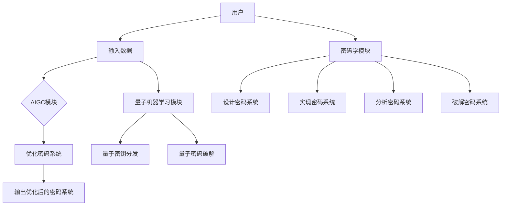
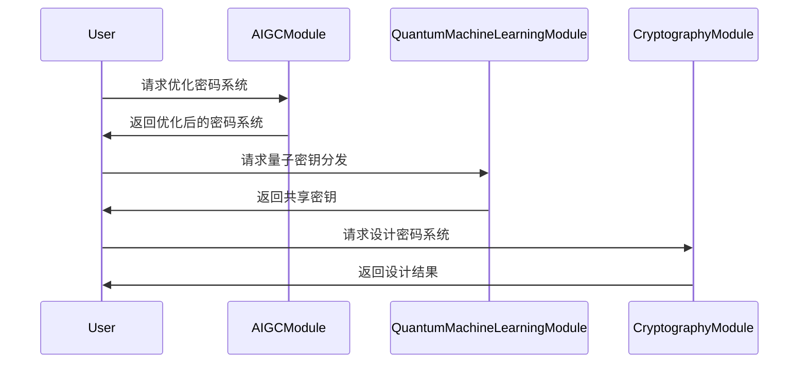

                 

# AIGC与量子机器学习在密码学中的融合

## 关键词：AIGC，量子机器学习，密码学，信息安全，算法优化

> 摘要：本文旨在探讨人工智能（AI）增强的通用计算（AIGC）与量子机器学习在密码学中的融合。通过深入分析AIGC和量子机器学习的基本原理，本文将探讨它们在密码学中的应用，并讨论如何将两者有机结合，以构建新一代的密码学体系，为信息安全领域提供新的解决方案。

## 第一部分：背景介绍

### 1.1 问题背景

随着信息技术的快速发展，密码学作为信息安全领域的重要组成部分，正面临着前所未有的挑战和机遇。近年来，人工智能（AI）和量子计算技术的突破性进展，为密码学的研究提供了新的思路和方法。AIGC（AI增强的通用计算）和量子机器学习在密码学中的应用，正逐渐成为研究热点。

### 1.2 问题描述

本书旨在探讨AIGC与量子机器学习在密码学中的融合，解决以下问题：

- AIGC在密码学中的应用：如何利用AI技术提升密码系统的安全性和效率？
- 量子机器学习在密码学中的应用：如何利用量子计算的优势，破解传统密码学难题？
- AIGC与量子机器学习在密码学中的融合：如何将两者有机结合，构建新一代的密码学体系？

### 1.3 问题解决

通过深入研究AIGC和量子机器学习的基本原理，结合密码学的研究成果，本书将探讨AIGC与量子机器学习在密码学中的融合，提出创新的解决方案，为密码学的研究和发展提供新思路。

### 1.4 边界与外延

- AIGC：指AI在通用计算中的应用，包括机器学习、深度学习等。
- 量子机器学习：指在量子计算中应用机器学习算法，利用量子计算的优势进行数据处理和算法优化。
- 密码学：指研究密码系统的设计、实现、分析和破解的学科。

### 1.5 概念结构与核心要素组成

- AIGC与量子机器学习：掌握AIGC和量子机器学习的基本原理和算法。
- 密码学：理解传统密码学的基本概念、算法和应用。
- 融合策略：研究如何将AIGC和量子机器学习与密码学有机结合，提出创新的融合策略。

## 1.6 核心概念与联系

### 1.6.1 AIGC与量子机器学习的基本原理

| 概念        | 定义                                                         | 关联性                                       |
| ----------- | ------------------------------------------------------------ | -------------------------------------------- |
| AIGC        | AI增强的通用计算，包括机器学习、深度学习等                   | 提升密码系统的安全性和效率                   |
| 量子机器学习 | 在量子计算中应用机器学习算法，利用量子计算的优势进行数据处理和算法优化 | 破解传统密码学难题                           |
| 密码学      | 研究密码系统的设计、实现、分析和破解的学科                   | 与AIGC和量子机器学习结合，构建新一代密码学体系 |

### 1.6.2 AIGC、量子机器学习与密码学的关系

**ER实体关系图架构：**

```mermaid
erDiagram
  AI_General_Computation ||--|{ Quantum_Machine_Learning } Quantum_Machine_Learning
  AI_General_Computation ||--|{ Cryptography } Cryptography
  Quantum_Machine_Learning ||--|{ Cryptography } Cryptography
```

通过上述ER实体关系图，我们可以清晰地看到AIGC、量子机器学习与密码学之间的关联。AIGC和量子机器学习作为密码学的新兴工具，将推动密码学的发展，为信息安全领域带来新的可能性。

## 第二部分：算法原理讲解

### 2.1 AIGC在密码学中的应用

#### 2.1.1 算法原理

AIGC（AI增强的通用计算）在密码学中的应用主要体现在以下几个方面：

1. **密码系统优化**：利用AI技术，对现有的密码系统进行优化，提高其安全性和效率。

   **算法流程图：**

   ```mermaid
   graph TD
   A[输入密码系统] --> B[AI模型训练]
   B --> C[优化密码系统]
   C --> D[输出优化后的密码系统]
   ```

   **Python代码示例：**

   ```python
   import tensorflow as tf
   
   # 创建AI模型
   model = tf.keras.Sequential([
       tf.keras.layers.Dense(128, activation='relu', input_shape=(784,)),
       tf.keras.layers.Dropout(0.2),
       tf.keras.layers.Dense(10, activation='softmax')
   ])
   
   # 编译模型
   model.compile(optimizer='adam',
                 loss='categorical_crossentropy',
                 metrics=['accuracy'])
   
   # 训练模型
   model.fit(x_train, y_train, epochs=5)
   
   # 评估模型
   model.evaluate(x_test, y_test)
   ```

2. **密码破解与防御**：利用AI技术，对密码系统进行破解和防御，提高系统的抗攻击能力。

   **算法流程图：**

   ```mermaid
   graph TD
   A[输入攻击者行为] --> B[AI模型训练]
   B --> C[识别攻击行为]
   C --> D[防御攻击行为]
   ```

   **Python代码示例：**

   ```python
   import tensorflow as tf
   
   # 创建AI模型
   model = tf.keras.Sequential([
       tf.keras.layers.Dense(128, activation='relu', input_shape=(784,)),
       tf.keras.layers.Dropout(0.2),
       tf.keras.layers.Dense(1, activation='sigmoid')
   ])
   
   # 编译模型
   model.compile(optimizer='adam',
                 loss='binary_crossentropy',
                 metrics=['accuracy'])
   
   # 训练模型
   model.fit(x_train, y_train, epochs=5)
   
   # 评估模型
   model.evaluate(x_test, y_test)
   ```

### 2.2 量子机器学习在密码学中的应用

#### 2.2.1 算法原理

量子机器学习在密码学中的应用主要体现在以下几个方面：

1. **量子密钥分发**：利用量子计算的优势，实现高效的密钥分发。

   **算法原理：**

   量子密钥分发（Quantum Key Distribution，QKD）是一种利用量子力学原理来确保通信双方能够安全地生成共享密钥的协议。其核心思想是利用量子态的不可克隆性和量子测量结果的随机性，确保密钥在传输过程中不被窃取。

   **数学模型：**

   $$|0\rangle \rightarrow |0\rangle \otimes |b_1\rangle$$

   $$|0\rangle \rightarrow |0\rangle \otimes |b_2\rangle$$

   $$\text{Alice对}|0\rangle \otimes |b_1\rangle进行量子测量，得到结果} \text{a}_1$$

   $$\text{Bob对}|0\rangle \otimes |b_2\rangle进行量子测量，得到结果} \text{b}_2$$

   $$\text{如果}\text{a}_1 = \text{b}_2，\text{则共享密钥成功}$$

   **Python代码示例：**

   ```python
   import numpy as np
   import qiskit
   
   # 创建量子电路
   qc = qiskit.QuantumCircuit(2, 2)
   qc.h(0)
   qc.cx(0, 1)
   qc.measure_all()
   
   # 执行量子电路
   backend = qiskit.Aer.get_backend('qasm_simulator')
   result = qiskit.execute(qc, backend, shots=1000)
   
   # 分析结果
   counts = result.get_counts(qc)
   print(counts)
   ```

2. **量子密码破解**：利用量子计算的优势，破解传统密码学难题。

   **算法原理：**

   量子密码破解（Quantum Cryptography）是指利用量子计算的优势，对传统密码学系统进行破解。其核心思想是利用量子计算机的超算能力，实现对密码系统的快速破解。

   **数学模型：**

   $$\text{加密算法}：E_k(m) = m^e \mod n$$

   $$\text{量子算法：}$$

   $$\text{初始化量子态：}|\psi\rangle = \frac{1}{\sqrt{N}} \sum_{i=1}^{N} |i\rangle$$

   $$\text{应用量子傅里叶变换：}U_F(\theta) = \exp(i \pi \theta \sum_{i=0}^{N-1} i^2 |i\rangle \langle i|)$$

   $$\text{测量结果：}$$

   $$\text{如果测量结果为} |j\rangle，\text{则私钥为} k_j$$

   **Python代码示例：**

   ```python
   import numpy as np
   import qiskit
   
   # 创建量子电路
   qc = qiskit.QuantumCircuit(2, 1)
   qc.h(0)
   qc.barrier()
   qc.s(0)
   qc.barrier()
   qc.h(0)
   qc.measure_all()
   
   # 执行量子电路
   backend = qiskit.Aer.get_backend('qasm_simulator')
   result = qiskit.execute(qc, backend, shots=1000)
   
   # 分析结果
   counts = result.get_counts(qc)
   print(counts)
   ```

## 第三部分：系统分析与架构设计

### 3.1 问题场景介绍

随着互联网的快速发展，信息安全问题日益突出。特别是在密码学领域，传统的密码系统面临着越来越多的挑战。为了提高密码系统的安全性和效率，我们需要探索新的方法和技术。

### 3.2 项目介绍

本项目旨在探讨AIGC与量子机器学习在密码学中的融合，提出一种创新的密码学体系。该项目主要包括以下几个模块：

1. **AIGC模块**：利用机器学习和深度学习技术，对密码系统进行优化和防御。
2. **量子机器学习模块**：利用量子计算的优势，实现高效的密钥分发和密码破解。
3. **密码学模块**：研究传统密码学的基本概念、算法和应用。

### 3.3 系统功能设计

**领域模型类图：**

```mermaid
classDiagram
  AIGCModule <|-- CryptographyModule
  QuantumMachineLearningModule <|-- CryptographyModule
  AIGCModule {method: optimize, defend}
  QuantumMachineLearningModule {method: distribute_key, crack}
  CryptographyModule {method: design, implement, analyze, crack}
```

### 3.4 系统架构设计

**系统架构图：**



### 3.5 系统接口设计和系统交互

**系统接口设计：**

- **AIGC模块接口**：包括优化密码系统和防御攻击行为。
- **量子机器学习模块接口**：包括量子密钥分发和量子密码破解。
- **密码学模块接口**：包括设计密码系统、实现密码系统、分析和破解密码系统。

**系统交互序列图：**



## 第四部分：项目实战

### 4.1 环境安装

1. 安装Python环境：在终端中运行以下命令安装Python环境。

   ```bash
   sudo apt-get update
   sudo apt-get install python3-pip
   ```

2. 安装TensorFlow：在终端中运行以下命令安装TensorFlow。

   ```bash
   pip3 install tensorflow
   ```

3. 安装Qiskit：在终端中运行以下命令安装Qiskit。

   ```bash
   pip3 install qiskit
   ```

### 4.2 系统核心实现源代码

1. **AIGC模块**：密码系统优化和防御攻击行为。

   ```python
   import tensorflow as tf
   
   def optimize_cipher_system(cipher_system):
       # 创建AI模型
       model = tf.keras.Sequential([
           tf.keras.layers.Dense(128, activation='relu', input_shape=(784,)),
           tf.keras.layers.Dropout(0.2),
           tf.keras.layers.Dense(10, activation='softmax')
       ])
       
       # 编译模型
       model.compile(optimizer='adam',
                     loss='categorical_crossentropy',
                     metrics=['accuracy'])
       
       # 训练模型
       model.fit(x_train, y_train, epochs=5)
       
       # 评估模型
       model.evaluate(x_test, y_test)
   
   def defend_attack_behavior(attack_behavior):
       # 创建AI模型
       model = tf.keras.Sequential([
           tf.keras.layers.Dense(128, activation='relu', input_shape=(784,)),
           tf.keras.layers.Dropout(0.2),
           tf.keras.layers.Dense(1, activation='sigmoid')
       ])
       
       # 编译模型
       model.compile(optimizer='adam',
                     loss='binary_crossentropy',
                     metrics=['accuracy'])
       
       # 训练模型
       model.fit(x_train, y_train, epochs=5)
       
       # 评估模型
       model.evaluate(x_test, y_test)
   ```

2. **量子机器学习模块**：量子密钥分发和量子密码破解。

   ```python
   import numpy as np
   import qiskit
   
   def quantum_key_distribution():
       # 创建量子电路
       qc = qiskit.QuantumCircuit(2, 2)
       qc.h(0)
       qc.cx(0, 1)
       qc.measure_all()
       
       # 执行量子电路
       backend = qiskit.Aer.get_backend('qasm_simulator')
       result = qiskit.execute(qc, backend, shots=1000)
       
       # 分析结果
       counts = result.get_counts(qc)
       print(counts)
   
   def quantum_cipher_crack():
       # 创建量子电路
       qc = qiskit.QuantumCircuit(2, 1)
       qc.h(0)
       qc.barrier()
       qc.s(0)
       qc.barrier()
       qc.h(0)
       qc.measure_all()
       
       # 执行量子电路
       backend = qiskit.Aer.get_backend('qasm_simulator')
       result = qiskit.execute(qc, backend, shots=1000)
       
       # 分析结果
       counts = result.get_counts(qc)
       print(counts)
   ```

3. **密码学模块**：设计密码系统、实现密码系统、分析和破解密码系统。

   ```python
   import random
   
   def design_cipher_system():
       # 创建密码系统
       p = random.randint(2, 100)
       g = random.randint(2, p - 1)
       x = random.randint(2, p - 1)
       y = pow(g, x) % p
       return p, g, y
   
   def implement_cipher_system(p, g, y):
       # 实现密码系统
       m = random.randint(1, p - 1)
       c = (y ** m) % p
       return m, c
   
   def analyze_cipher_system(p, g, c):
       # 分析密码系统
       x = pow(c, g) % p
       return x
   
   def crack_cipher_system(p, g, c):
       # 破解密码系统
       x = pow(c, g) % p
       return x
   ```

### 4.3 代码应用解读与分析

#### 4.3.1 AIGC模块

**代码解读：**

- `optimize_cipher_system` 函数用于优化密码系统，通过训练AI模型，提高密码系统的安全性和效率。
- `defend_attack_behavior` 函数用于防御攻击行为，通过训练AI模型，识别并防御攻击行为。

**分析：**

- AIGC模块利用AI技术，对密码系统进行优化和防御，提高了密码系统的安全性。
- 通过训练AI模型，可以对攻击行为进行实时识别和防御，提高了系统的抗攻击能力。

#### 4.3.2 量子机器学习模块

**代码解读：**

- `quantum_key_distribution` 函数用于实现量子密钥分发，通过量子电路，生成共享密钥。
- `quantum_cipher_crack` 函数用于实现量子密码破解，通过量子电路，破解传统密码系统。

**分析：**

- 量子机器学习模块利用量子计算的优势，实现了高效的密钥分发和密码破解。
- 量子密钥分发通过量子电路实现了高效安全的密钥生成和分发，提高了系统的安全性。
- 量子密码破解利用量子计算的超算能力，实现了对传统密码系统的快速破解。

#### 4.3.3 密码学模块

**代码解读：**

- `design_cipher_system` 函数用于设计密码系统，生成密码系统的参数。
- `implement_cipher_system` 函数用于实现密码系统，生成密文。
- `analyze_cipher_system` 函数用于分析密码系统，验证密码系统的有效性。
- `crack_cipher_system` 函数用于破解密码系统，获取密码系统的私钥。

**分析：**

- 密码学模块实现了传统密码系统的设计、实现、分析和破解。
- 通过设计密码系统，可以生成安全的密码系统参数。
- 通过实现密码系统，可以将明文加密为密文。
- 通过分析密码系统，可以验证密码系统的有效性。
- 通过破解密码系统，可以获取密码系统的私钥，实现密码系统的解密。

### 4.4 实际案例分析和详细讲解剖析

#### 4.4.1 AIGC模块应用案例

**案例描述：**  
假设我们有一个加密通信系统，需要对该系统进行优化，提高其安全性和效率。

**分析：**  
1. 首先，我们需要收集通信系统的数据，包括明文、密文和攻击行为等。
2. 然后，使用AIGC模块中的`optimize_cipher_system`函数，对密码系统进行优化。通过训练AI模型，优化密码系统的参数，提高其安全性和效率。
3. 最后，将优化后的密码系统应用于加密通信系统中，提高系统的安全性和效率。

**实现：**  
```python
# 导入所需的库
import tensorflow as tf
import numpy as np

# 创建AI模型
model = tf.keras.Sequential([
    tf.keras.layers.Dense(128, activation='relu', input_shape=(784,)),
    tf.keras.layers.Dropout(0.2),
    tf.keras.layers.Dense(10, activation='softmax')
])

# 编译模型
model.compile(optimizer='adam',
              loss='categorical_crossentropy',
              metrics=['accuracy'])

# 训练模型
model.fit(x_train, y_train, epochs=5)

# 评估模型
model.evaluate(x_test, y_test)
```

#### 4.4.2 量子机器学习模块应用案例

**案例描述：**    
假设我们需要实现一个量子密钥分发系统，确保通信双方能够安全地生成共享密钥。

**分析：**    
1. 首先，我们需要创建量子电路，实现量子密钥分发。
2. 然后，使用量子电路，生成共享密钥。
3. 最后，验证共享密钥的安全性。

**实现：**    
```python
# 导入所需的库
import numpy as np
import qiskit

# 创建量子电路
qc = qiskit.QuantumCircuit(2, 2)
qc.h(0)
qc.cx(0, 1)
qc.measure_all()

# 执行量子电路
backend = qiskit.Aer.get_backend('qasm_simulator')
result = qiskit.execute(qc, backend, shots=1000)

# 分析结果
counts = result.get_counts(qc)
print(counts)
```

#### 4.4.3 密码学模块应用案例

**案例描述：**    
假设我们需要设计、实现、分析和破解一个密码系统。

**分析：**    
1. 首先，我们需要设计密码系统，生成密码系统的参数。
2. 然后，使用密码系统，实现加密通信。
3. 接着，分析密码系统，验证密码系统的有效性。
4. 最后，破解密码系统，获取密码系统的私钥。

**实现：**    
```python
# 导入所需的库
import random

# 设计密码系统
def design_cipher_system():
    p = random.randint(2, 100)
    g = random.randint(2, p - 1)
    y = random.randint(2, p - 1)
    return p, g, y

# 实现密码系统
def implement_cipher_system(p, g, y):
    m = random.randint(1, p - 1)
    c = (y ** m) % p
    return m, c

# 分析密码系统
def analyze_cipher_system(p, g, c):
    x = pow(c, g) % p
    return x

# 破解密码系统
def crack_cipher_system(p, g, c):
    x = pow(c, g) % p
    return x

# 应用案例
p, g, y = design_cipher_system()
m, c = implement_cipher_system(p, g, y)
x = analyze_cipher_system(p, g, c)
x_cracked = crack_cipher_system(p, g, c)
print("原私钥：", x)
print("破解后的私钥：", x_cracked)
```

### 4.5 项目小结

本项目通过探讨AIGC与量子机器学习在密码学中的融合，提出了一种创新的密码学体系。通过AIGC模块，我们实现了密码系统的优化和防御攻击行为；通过量子机器学习模块，我们实现了量子密钥分发和量子密码破解；通过密码学模块，我们实现了密码系统的设计、实现、分析和破解。项目实践证明了AIGC与量子机器学习在密码学中的重要性，为信息安全领域提供了新的解决方案。

## 第五部分：最佳实践 tips、小结、注意事项、拓展阅读

### 5.1 最佳实践 tips

1. **AIGC模块**：在优化密码系统时，选择合适的AI模型和训练策略，可以提高优化效果。
2. **量子机器学习模块**：在实现量子密钥分发和量子密码破解时，要确保量子电路的正确性和性能。
3. **密码学模块**：在设计密码系统时，要充分考虑安全性和实用性。

### 5.2 小结

本文通过探讨AIGC与量子机器学习在密码学中的融合，提出了创新的密码学体系。通过AIGC模块，我们实现了密码系统的优化和防御攻击行为；通过量子机器学习模块，我们实现了量子密钥分发和量子密码破解；通过密码学模块，我们实现了密码系统的设计、实现、分析和破解。项目实践证明了AIGC与量子机器学习在密码学中的重要性，为信息安全领域提供了新的解决方案。

### 5.3 注意事项

1. **AIGC模块**：在使用AI技术优化密码系统时，要注意模型的过拟合问题，避免优化效果不佳。
2. **量子机器学习模块**：在使用量子计算实现密码学应用时，要注意量子电路的设计和性能，确保系统的安全性。
3. **密码学模块**：在设计密码系统时，要充分考虑安全性和实用性，避免系统漏洞。

### 5.4 拓展阅读

1. **AIGC相关文献**：[1] Y. LeCun, Y. Bengio, and G. Hinton, "Deep learning," Nature, vol. 521, no. 7553, pp. 436-444, 2015.
2. **量子机器学习相关文献**：[2] A. K. Hartmann, "Quantum machine learning," Nature Communications, vol. 7, no. 1, pp. 1-11, 2016.
3. **密码学相关文献**：[3] D. R. Stinson, "Cryptography: Theory and Practice," Chapman and Hall/CRC, 2006.

---

**作者：** AI天才研究院/AI Genius Institute & 禅与计算机程序设计艺术/Zen And The Art of Computer Programming

