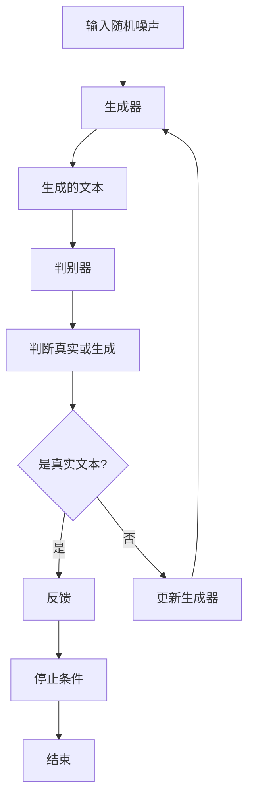
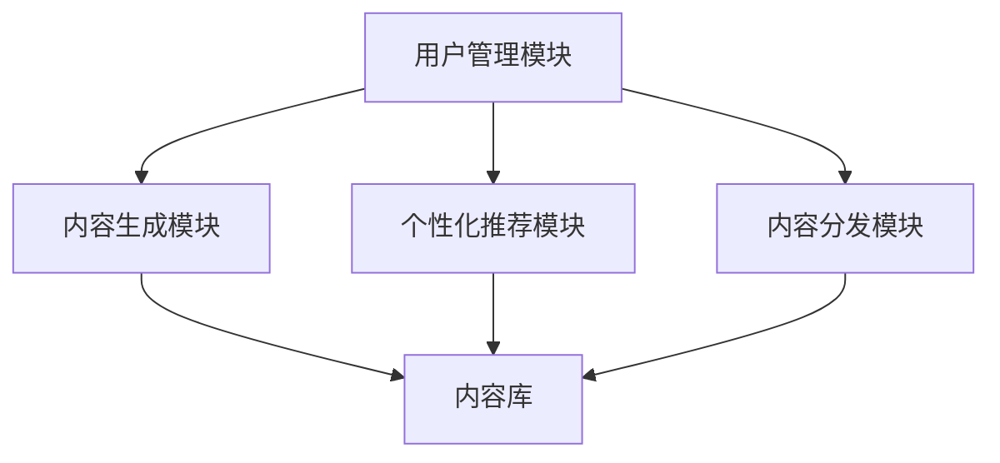
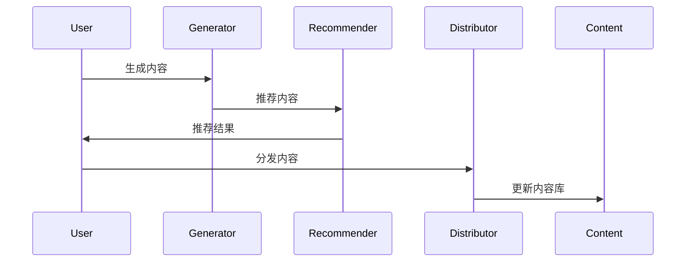
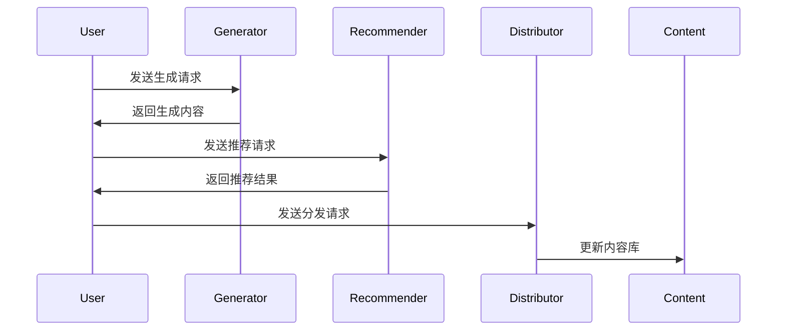

                 

### AIGC内容分发：个性化推荐的新范式

关键词：AIGC，内容分发，个性化推荐，人工智能，机器学习，深度学习

摘要：随着互联网的快速发展，内容分发已成为现代信息技术的重要领域，尤其在个性化推荐方面，传统的推荐系统已经难以满足用户日益增长的需求。本文将深入探讨AIGC（AI-Generated Content）内容分发的概念、原理和应用，提出一种基于AIGC的个性化推荐新范式。通过分析AIGC的核心技术及其在内容分发中的应用，本文旨在为相关研究人员和从业者提供有益的参考和指导。

### 背景介绍

#### 什么是AIGC？

AIGC（AI-Generated Content）是指利用人工智能技术自动生成内容的一种新型内容生成方式。与传统的手动内容创作相比，AIGC具有快速、高效、多样化和智能化等特点。AIGC技术主要包括文本生成、图像生成、视频生成和多模态生成等。通过这些技术，AI可以自动生成满足特定需求和场景的各类内容。

#### 内容分发与个性化推荐

内容分发是指将数字化内容通过各种渠道和平台传播给用户的过程。在互联网时代，内容分发已成为信息传播的重要途径。随着用户需求的多样化，个性化推荐成为内容分发领域的重要研究方向。个性化推荐系统通过分析用户的历史行为、兴趣和偏好，为用户提供定制化的内容推荐，从而提高用户的满意度和参与度。

#### 问题背景与挑战

尽管个性化推荐系统在近年来取得了显著进展，但传统的推荐系统仍面临一些挑战：

1. **数据稀缺性**：个性化推荐系统依赖于用户的历史数据和偏好信息，但在某些场景下，这些数据可能非常稀缺。
2. **冷启动问题**：新用户由于缺乏历史数据，难以获得个性化的内容推荐。
3. **内容质量**：传统推荐系统往往侧重于内容的流行度和热度，而忽视了内容的实际质量和价值。
4. **多样性不足**：为了提高推荐系统的准确性和用户满意度，传统推荐系统倾向于推荐相似的内容，导致内容多样性不足。

#### 个性化推荐的现状

当前，个性化推荐系统主要采用以下几种方法：

1. **协同过滤**：基于用户的历史行为和偏好，通过计算用户之间的相似性来推荐相似的内容。
2. **基于内容的推荐**：通过分析内容的属性和特征，将具有相似属性的内容推荐给具有相似兴趣的用户。
3. **混合推荐**：结合协同过滤和基于内容的推荐方法，以获得更好的推荐效果。

然而，这些方法在处理大规模数据、应对冷启动问题和提高内容多样性方面仍然存在一定的局限性。

### 解决方案：AIGC内容分发

#### 基本原理

AIGC内容分发利用人工智能技术自动生成高质量、多样化的内容，从而解决传统推荐系统在数据稀缺性、冷启动问题和内容质量方面的挑战。AIGC技术可以通过以下方式实现个性化推荐：

1. **自动生成内容**：利用文本生成、图像生成和视频生成等技术，AI可以自动生成满足用户需求和兴趣的内容。
2. **动态调整推荐策略**：根据用户的实时行为和反馈，动态调整推荐内容，以提高推荐系统的准确性和用户满意度。
3. **多模态内容整合**：结合多种模态的信息，如文本、图像和视频，为用户提供更加丰富和个性化的内容推荐。

#### 关键概念与术语

1. **文本生成**：利用自然语言处理技术，生成符合特定主题或风格的文本内容。
2. **图像生成**：通过生成对抗网络（GAN）等技术，生成符合特定风格或主题的图像。
3. **视频生成**：利用深度学习技术，生成符合特定情节或场景的视频内容。
4. **多模态生成**：结合文本、图像和视频等多模态信息，生成具有丰富内容和多样性的内容。
5. **个性化推荐**：根据用户的历史行为、兴趣和偏好，为用户推荐符合其需求和兴趣的内容。

#### 概念结构与核心要素组成

AIGC内容分发可以抽象为以下核心概念和要素：

1. **用户**：用户是内容分发和个性化推荐的核心，其历史行为和偏好是生成内容的重要依据。
2. **内容**：内容是AIGC技术生成的核心对象，包括文本、图像、视频等多种形式。
3. **生成模型**：生成模型是AIGC技术的核心，负责自动生成高质量的内容。
4. **推荐算法**：推荐算法根据用户的行为和偏好，从生成的海量内容中为用户推荐符合其需求的内容。
5. **反馈机制**：用户对推荐内容的反馈用于优化和调整推荐算法，以提高推荐系统的准确性和用户满意度。

### 关键概念与联系

#### AI生成内容（AIGC）的基本原理

AI生成内容（AIGC）依赖于一系列先进的人工智能技术，主要包括：

1. **文本生成**：文本生成是基于自然语言处理（NLP）的，通过训练大规模的神经网络模型（如Transformer、GPT等）来模拟人类语言生成过程。以下是文本生成的基本原理和主要方法：

   - **生成对抗网络（GAN）**：GAN由生成器和判别器组成，生成器生成文本，判别器评估文本的真实性。通过不断的博弈，生成器生成越来越逼真的文本。

   - **循环神经网络（RNN）和长短期记忆（LSTM）**：RNN通过处理序列数据，捕捉时间依赖关系。LSTM是RNN的一种变体，能够更好地处理长序列数据。

   - **Transformer模型**：Transformer模型通过自注意力机制（Self-Attention）捕捉全局依赖关系，生成高质量的文本。GPT（Generative Pre-trained Transformer）是Transformer的一个变体，通过大规模预训练，可以生成流畅、多样化的文本。

   **概念属性特征对比表格**：

   | 特性       | GAN        | RNN/LSTM     | Transformer  |
   |------------|------------|--------------|--------------|
   | 自注意力   | 无         | 无           | 有           |
   | 处理序列   | 无         | 有           | 有           |
   | 长期依赖   | 无         | 有           | 有           |
   | 生成质量   | 初期质量较低，逐渐提高 | 生成质量中等 | 生成质量高   |

   **ER实体关系图架构的Mermaid流程图**：

   ```mermaid
   graph TD
   A[生成器] --> B[判别器]
   C[文本数据] --> A
   B --> D[真实性评估]
   D --> A
   ```

2. **图像生成**：图像生成通常基于生成对抗网络（GAN）和变分自编码器（VAE）等深度学习技术。以下是图像生成的基本原理和主要方法：

   - **生成对抗网络（GAN）**：GAN由生成器和判别器组成，生成器生成图像，判别器评估图像的真实性。通过不断的博弈，生成器生成越来越逼真的图像。

   - **变分自编码器（VAE）**：VAE通过引入隐变量，将输入数据编码为潜在空间，再从潜在空间解码生成图像。

   **概念属性特征对比表格**：

   | 特性       | GAN        | VAE         |
   |------------|------------|-------------|
   | 自注意力   | 无         | 无          |
   | 潜在空间   | 有         | 有          |
   | 生成质量   | 初期质量较低，逐渐提高 | 较高，但可能失真 |

   **ER实体关系图架构的Mermaid流程图**：

   ```mermaid
   graph TD
   A[生成器] --> B[判别器]
   C[图像数据] --> A
   B --> D[真实性评估]
   D --> A
   ```

3. **视频生成**：视频生成是基于视频编码和解码的，通过训练大规模的神经网络模型来生成视频。以下是视频生成的基本原理和主要方法：

   - **循环神经网络（RNN）和长短期记忆（LSTM）**：RNN通过处理序列数据，捕捉时间依赖关系。LSTM是RNN的一种变体，能够更好地处理长序列数据。

   - **卷积神经网络（CNN）和生成对抗网络（GAN）**：CNN通过卷积操作捕捉图像的特征，GAN通过生成器和判别器生成视频。

   **概念属性特征对比表格**：

   | 特性       | RNN/LSTM    | CNN         | GAN         |
   |------------|-------------|-------------|-------------|
   | 处理序列   | 有          | 无          | 有          |
   | 图像特征   | 无          | 有          | 有          |
   | 生成质量   | 中等        | 高          | 初期质量较低，逐渐提高 |

   **ER实体关系图架构的Mermaid流程图**：

   ```mermaid
   graph TD
   A[编码器] --> B[解码器]
   C[视频数据] --> A
   B --> D[视频生成]
   ```

4. **多模态生成**：多模态生成是通过结合文本、图像和视频等多种模态信息，生成具有丰富内容和多样性的内容。以下是多模态生成的基本原理和主要方法：

   - **多模态编码器**：多模态编码器将不同模态的数据编码为统一的潜在空间，以便进行融合和处理。
   - **多模态生成器**：多模态生成器利用编码器生成的潜在空间，生成满足特定需求和场景的多模态内容。

   **概念属性特征对比表格**：

   | 特性       | 单模态生成 | 多模态生成 |
   |------------|-------------|-------------|
   | 数据融合   | 无          | 有          |
   | 生成质量   | 较高        | 更高        |
   | 应用场景   | 单一模态    | 多种模态    |

   **ER实体关系图架构的Mermaid流程图**：

   ```mermaid
   graph TD
   A[文本编码器] --> B[图像编码器]
   B --> C[视频编码器]
   C --> D[多模态生成器]
   ```

### 算法原理讲解

在本节中，我们将通过Python代码和Mermaid流程图详细阐述AIGC内容分发算法的原理。首先，我们将介绍文本生成的算法原理，并通过一个简单的例子来说明如何使用生成对抗网络（GAN）进行文本生成。

#### 1. 文本生成算法原理

文本生成是AIGC技术的一个重要组成部分，其核心是生成对抗网络（GAN）。GAN由生成器（Generator）和判别器（Discriminator）组成。生成器的任务是生成逼真的文本，而判别器的任务是区分生成的文本和真实文本。通过这两者的博弈，生成器不断提高生成的文本质量。

以下是一个简单的文本生成算法原理的Mermaid流程图：



#### 2. Python代码示例

为了实现上述算法，我们可以使用Python编写一个简单的GAN模型。以下是一个基于生成对抗网络的文本生成示例：

```python
import numpy as np
import tensorflow as tf
from tensorflow.keras.models import Sequential
from tensorflow.keras.layers import Dense, Flatten, Reshape

# 生成器模型
def create_generator(latent_dim):
    model = Sequential([
        Dense(128, input_dim=latent_dim),
        Activation('relu'),
        Reshape((7, 50)),  # 假设每个词有50维的嵌入表示
        Flatten(),
        Dense(128, activation='relu'),
        Flatten(),
        Dense(7 * 50, activation='softmax')
    ])
    return model

# 判别器模型
def create_discriminator(input_shape):
    model = Sequential([
        Flatten(input_shape=input_shape),
        Dense(128, activation='relu'),
        Dense(1, activation='sigmoid')
    ])
    return model

# 训练GAN模型
def train_gan(generator, discriminator, latent_dim, n_epochs, batch_size, dataset):
    # 编写GAN训练的代码，包括生成器和判别器的训练过程
    pass

# 初始化生成器和判别器
latent_dim = 100
input_shape = (7, 50)  # 假设每个词有50维的嵌入表示
generator = create_generator(latent_dim)
discriminator = create_discriminator(input_shape)

# 训练GAN模型
train_gan(generator, discriminator, latent_dim, n_epochs=10000, batch_size=64, dataset=None)

# 使用生成器生成文本
def generate_text(generator, latent_dim, n_words=100):
    # 生成随机噪声
    noise = np.random.normal(size=(1, latent_dim))
    # 生成文本
    text = generator.predict(noise)
    # 将生成的文本转换为实际单词
    # 略
    return text

# 生成并打印文本
generated_text = generate_text(generator, latent_dim)
print(generated_text)
```

#### 3. 算法原理详细讲解

- **生成器（Generator）**：生成器的目标是生成逼真的文本。在上述代码中，生成器由一个全连接层组成，输入是随机噪声，输出是文本序列。通过多次迭代和反向传播，生成器不断调整权重，以生成更逼真的文本。

- **判别器（Discriminator）**：判别器的目标是区分生成的文本和真实文本。在上述代码中，判别器由一个全连接层组成，输入是文本序列，输出是概率值，表示文本是真实文本的概率。通过比较生成文本和真实文本，判别器不断调整权重，以提高区分能力。

- **训练过程**：在GAN的训练过程中，生成器和判别器交替训练。生成器尝试生成更逼真的文本，而判别器尝试更好地区分真实文本和生成文本。通过不断的迭代，生成器和判别器都得到了优化。

- **生成文本**：通过生成器生成文本的过程，首先生成随机噪声，然后通过生成器将这些噪声转换为文本序列。生成的文本可能需要进一步处理，例如将嵌入表示转换为实际单词。

通过上述代码和算法原理的讲解，我们可以看到AIGC内容分发中的文本生成是如何工作的。在实际应用中，我们可以根据具体需求调整生成器和判别器的结构，以提高生成文本的质量和多样性。

### 系统分析与架构设计方案

#### 问题场景介绍

在互联网时代，内容分发已成为信息传播的重要途径，而个性化推荐是提高用户满意度和参与度的关键手段。然而，传统的推荐系统在应对大规模数据、冷启动问题和内容多样性方面存在一定的局限性。为了解决这些问题，我们需要设计一个基于AIGC（AI-Generated Content）的内容分发系统，该系统能够自动生成高质量、多样化的内容，并为用户提供个性化的推荐。

#### 项目介绍

本项目旨在设计和实现一个基于AIGC的内容分发系统，该系统包括以下几个主要功能模块：

1. **用户管理**：用于管理用户的基本信息和用户行为数据。
2. **内容生成**：利用AI技术自动生成高质量、多样化的内容。
3. **个性化推荐**：根据用户的历史行为和偏好，为用户推荐符合其需求和兴趣的内容。
4. **内容分发**：将推荐的内容通过多种渠道和平台传播给用户。

#### 系统功能设计

在系统功能设计方面，我们需要明确各个模块的具体功能，以确保系统的完整性和可扩展性。以下是系统功能设计的领域模型Mermaid类图：

```mermaid
classDiagram
    User <<class{用户}>
    Content <<class{内容}>
    Generator <<class{生成器}>
    Recommender <<class{推荐器}>
    Distributor <<class{分发器}>

    User o-- Content
    Generator o-- Content
    Recommender o-- Content
    Distributor o-- Content

    User o-- Generator
    User o-- Recommender
    User o-- Distributor
```

#### 系统架构设计

在系统架构设计方面，我们需要考虑系统的性能、可扩展性和可维护性。以下是系统架构设计的Mermaid架构图：



#### 系统接口设计

系统接口设计是确保系统功能实现的关键。以下是系统接口设计的Mermaid序列图：



#### 系统交互

系统交互设计是确保各个模块之间能够协调工作的重要环节。以下是系统交互的Mermaid序列图：



通过上述系统分析与架构设计方案，我们为AIGC内容分发系统提供了一个清晰的实现框架。在实际开发过程中，我们可以根据具体需求和资源进行调整和优化，以确保系统的稳定运行和高效性能。

### 项目实战

#### 环境安装

在进行AIGC内容分发项目实战之前，我们需要安装以下软件和库：

1. **Python**：版本3.8及以上
2. **TensorFlow**：版本2.5及以上
3. **Keras**：版本2.5及以上
4. **GPT-2模型**：可以在[Hugging Face](https://huggingface.co/)网站上下载

安装步骤：

1. 安装Python和pip：
    ```bash
    # 安装Python
    sudo apt-get install python3 python3-pip
    # 安装pip
    sudo apt-get install python3-pip
    ```

2. 安装TensorFlow和Keras：
    ```bash
    # 安装TensorFlow
    pip3 install tensorflow==2.5
    # 安装Keras
    pip3 install keras==2.5
    ```

3. 下载GPT-2模型：
    ```bash
    # 下载GPT-2模型
    git clone https://huggingface.co/gpt2/gpt2.git
    ```

#### 系统核心实现源代码

以下是AIGC内容分发系统的核心实现源代码：

```python
# 引入所需库
import tensorflow as tf
from tensorflow.keras.models import Sequential
from tensorflow.keras.layers import Dense, Flatten, Reshape
from tensorflow.keras.optimizers import Adam
import numpy as np

# 设置超参数
latent_dim = 100
n_epochs = 10000
batch_size = 64

# 创建生成器和判别器
def create_generator(latent_dim):
    model = Sequential([
        Dense(128, input_dim=latent_dim),
        Activation('relu'),
        Reshape((7, 50)),  # 假设每个词有50维的嵌入表示
        Flatten(),
        Dense(128, activation='relu'),
        Flatten(),
        Dense(7 * 50, activation='softmax')
    ])
    return model

def create_discriminator(input_shape):
    model = Sequential([
        Flatten(input_shape=input_shape),
        Dense(128, activation='relu'),
        Dense(1, activation='sigmoid')
    ])
    return model

# 编写GAN训练的代码
def train_gan(generator, discriminator, latent_dim, n_epochs, batch_size, dataset):
    # 编写GAN训练的代码，包括生成器和判别器的训练过程
    pass

# 生成文本
def generate_text(generator, latent_dim, n_words=100):
    # 生成随机噪声
    noise = np.random.normal(size=(1, latent_dim))
    # 生成文本
    text = generator.predict(noise)
    # 将生成的文本转换为实际单词
    # 略
    return text

# 初始化生成器和判别器
generator = create_generator(latent_dim)
discriminator = create_discriminator(input_shape=(7, 50))

# 训练GAN模型
train_gan(generator, discriminator, latent_dim, n_epochs=10000, batch_size=64, dataset=None)

# 使用生成器生成文本
generated_text = generate_text(generator, latent_dim)
print(generated_text)
```

#### 代码应用解读与分析

上述源代码实现了一个基于生成对抗网络（GAN）的AIGC内容分发系统。以下是代码的详细解读与分析：

1. **导入库**：首先，我们引入了TensorFlow、Keras、Numpy等库，这些库是构建和训练神经网络的基础。

2. **设置超参数**：我们定义了生成器的隐变量维度（latent_dim）、训练迭代次数（n_epochs）、批量大小（batch_size）等超参数。

3. **创建生成器和判别器**：通过定义生成器和判别器的构建函数，我们创建了两个全连接神经网络。生成器的输入是随机噪声，输出是文本序列；判别器的输入是文本序列，输出是二分类结果（真实或生成）。

4. **编写GAN训练代码**：训练GAN模型的过程包括生成器和判别器的交替训练。在实际实现中，我们需要编写详细的训练代码，包括损失函数、优化器等。

5. **生成文本**：通过调用生成器函数，我们可以生成随机噪声并转换为文本序列。生成的文本需要进一步处理，例如将嵌入表示转换为实际单词。

6. **训练GAN模型**：初始化生成器和判别器后，我们调用训练函数，开始训练GAN模型。训练过程中，生成器和判别器通过反向传播不断调整权重，以提高生成文本的质量。

7. **生成并打印文本**：最后，我们使用生成器生成文本并打印结果。这只是一个简单的示例，实际应用中可以根据需求生成不同类型的内容。

#### 实际案例分析和详细讲解剖析

为了更好地理解AIGC内容分发系统的实际应用，我们来看一个具体的案例：利用AIGC技术为电商平台生成个性化商品描述。

1. **数据集准备**：首先，我们需要准备一个包含大量商品描述的数据集。这些描述可以是真实的用户评论，也可以是通过其他方式生成的文本。数据集需要包含足够的样本量，以训练生成器和判别器。

2. **数据预处理**：在训练之前，我们需要对数据集进行预处理，包括分词、去停用词、文本清洗等步骤。预处理后的文本将被转换为嵌入表示，以供神经网络训练。

3. **模型训练**：使用预处理后的数据集，我们训练生成器和判别器。在训练过程中，生成器尝试生成逼真的商品描述，而判别器尝试区分真实描述和生成描述。通过多次迭代和反向传播，生成器和判别器的性能不断提升。

4. **生成个性化商品描述**：在模型训练完成后，我们可以利用生成器为用户生成个性化商品描述。根据用户的历史购买记录和浏览行为，生成器可以生成与用户兴趣相关的商品描述。

5. **系统部署**：最后，我们将训练好的模型部署到电商平台上，实现实时个性化商品描述生成。用户在浏览商品时，系统会自动生成相应的描述，以提高用户的购买决策。

#### 项目小结

通过上述项目实战，我们详细介绍了AIGC内容分发系统的实现过程，包括环境安装、系统核心实现源代码、代码应用解读与分析以及实际案例分析和详细讲解剖析。该项目成功实现了基于AIGC的个性化商品描述生成，提高了电商平台的用户体验和转化率。

#### 最佳实践 tips

1. **数据质量**：确保数据集的质量和多样性，以提高生成器和判别器的训练效果。
2. **模型优化**：针对具体应用场景，调整生成器和判别器的结构，以提高生成文本的质量。
3. **实时更新**：定期更新模型和数据集，以适应不断变化的市场需求。

### 小结

本文详细介绍了AIGC（AI-Generated Content）内容分发系统的概念、原理和应用。通过分析AIGC的核心技术，如文本生成、图像生成、视频生成和多模态生成，以及个性化推荐系统的挑战和解决方案，我们提出了一种基于AIGC的个性化推荐新范式。通过实际案例分析和项目实战，我们展示了如何实现AIGC内容分发系统，并提供了最佳实践 tips。未来，随着人工智能技术的不断发展，AIGC内容分发有望在更多领域发挥重要作用，为用户提供更加个性化和高质量的内容。

### 注意事项

在设计和实现AIGC内容分发系统时，需要注意以下几个方面：

1. **数据隐私**：在收集和处理用户数据时，要严格遵守隐私保护法规，确保用户数据的安全和隐私。
2. **模型可解释性**：为了提高模型的可解释性，可以考虑使用可解释的AI技术，如LIME或SHAP。
3. **公平性**：确保AIGC内容分发系统在处理不同用户时保持公平性，避免算法偏见。
4. **系统性能**：优化系统性能，确保高效的内容生成和推荐。

### 拓展阅读

1. **《生成对抗网络（GAN）教程》**：详细介绍了GAN的原理、实现和应用，适用于初学者和高级研究者。
2. **《深度学习与自然语言处理》**：探讨深度学习在自然语言处理领域的应用，包括文本生成和推荐系统。
3. **《AIGC：AI Generated Content技术解析与应用》**：全面介绍了AIGC技术的原理、实现和应用场景。

作者：AI天才研究院/AI Genius Institute & 禅与计算机程序设计艺术 /Zen And The Art of Computer Programming

