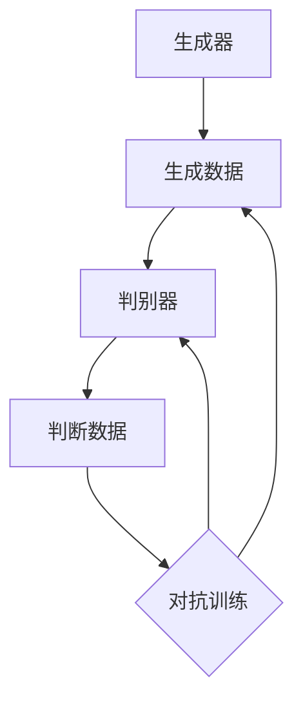
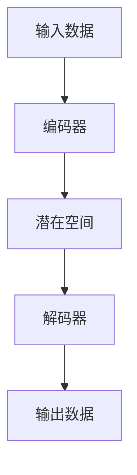
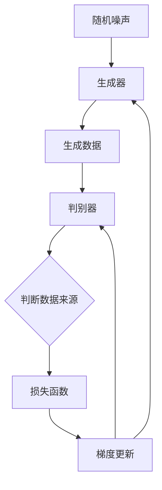

                 

### 目录大纲构建步骤

构建一篇文章的目录大纲是确保文章结构清晰、逻辑严密的重要环节。以下是构建目录大纲的具体步骤：

1. **明确文章主题**：首先，确定文章的核心主题，这将是整篇文章的中心思想。主题需要具有明确性和针对性，便于读者把握文章的主旨。

2. **提炼关键词**：根据主题，提炼出5-7个核心关键词。这些关键词将贯穿全文，帮助读者快速抓住文章的重点。

3. **撰写摘要**：撰写一段摘要，简要介绍文章的核心内容和主题思想。摘要应具有吸引力，能够激发读者的阅读兴趣。

4. **制定大纲结构**：根据文章主题和关键词，设计文章的章节结构。通常包括引言、背景介绍、核心概念、算法原理、系统设计、实战案例、最佳实践、小结和拓展阅读等部分。

5. **细化章节内容**：针对每个章节，进一步细化内容，列出具体的小节标题和内容要点。这一步需要考虑每个章节的目的和读者需求，确保内容丰富且具有实际价值。

6. **确保逻辑连贯性**：在制定大纲时，要确保各章节之间的逻辑连贯性，使文章内容前后呼应，形成统一的整体。

7. **使用Mermaid绘制图表**：在核心概念、算法原理、系统设计等部分，使用Mermaid语法绘制相关的流程图、类图、架构图和序列图，以增强文章的可读性和逻辑性。

8. **检查完整性**：最后，检查大纲的完整性，确保每个章节都有具体的内容要点，没有遗漏重要部分。

通过以上步骤，可以构建出一个清晰、有条理的目录大纲，为撰写高质量的文章奠定基础。

### 第一部分：AIGC内容生成概述

#### 1.1 AIGC概念引入

**1.1.1 人工智能生成内容的定义**

人工智能生成内容（AI Generated Content，简称AIGC）是指利用人工智能技术，特别是深度学习算法，生成各种形式的内容，如文本、图像、音频和视频等。AIGC的核心在于模拟人类创造和表达内容的过程，从而实现自动化内容生成。

**1.1.2 AIGC的发展历程与技术演进**

AIGC技术的发展历程可以追溯到深度学习的兴起。随着神经网络和生成对抗网络（GAN）等算法的提出，AIGC技术逐渐成熟。从最初的简单图像生成，到复杂的文本生成，再到多模态内容生成，AIGC技术已经实现了跨越式的发展。

**1.1.3 AIGC的当前应用场景**

AIGC技术目前在多个领域得到广泛应用。例如，在文本生成方面，AIGC被用于生成新闻文章、产品描述和自动化问答系统；在图像生成方面，AIGC被用于图像修复、风格迁移和虚拟图像创作；在音频生成方面，AIGC被用于语音合成、音乐创作和声音效果制作；在视频生成方面，AIGC被用于视频剪辑、视频生成和视频增强。

#### 1.2 AIGC技术原理

**1.2.1 生成对抗网络（GAN）原理与流程图**

生成对抗网络（GAN）由生成器（Generator）和判别器（Discriminator）两部分组成。生成器的任务是生成尽可能真实的数据，判别器的任务是区分生成数据与真实数据。通过两者之间的对抗训练，生成器逐渐提升生成能力，判别器也变得更加精确。

**1.2.2 变分自编码器（VAE）原理与流程图**

变分自编码器（VAE）是一种概率生成模型，它通过编码器（Encoder）和解码器（Decoder）将数据映射到一个潜在空间，从而生成新的数据。编码器将输入数据压缩成一个低维表示，解码器则从这个低维表示中生成新的数据。

**1.2.3 AIGC技术的核心属性与特点**

AIGC技术的核心属性包括数据生成能力、自适应性和灵活性。它能够在大量数据中学习到复杂模式，并能够根据需求生成高质量的内容。此外，AIGC技术还具有强大的扩展性，可以应用于多种不同的领域和任务。

#### 1.3 AIGC内容生成的伦理考量

**1.3.1 AIGC内容生成中的伦理问题**

AIGC内容生成过程中可能涉及的伦理问题包括数据隐私、知识产权保护、内容真实性和准确性等。这些问题需要我们在技术设计和应用中予以充分考虑。

**1.3.2 伦理考量的重要性**

伦理考量在AIGC内容生成中的重要性不可忽视。一方面，它关乎用户的信任和权益；另一方面，它也影响技术的可持续发展和社会责任。

**1.3.3 相关法律法规与政策**

目前，全球各国都在积极制定与AIGC相关的法律法规和政策。例如，我国发布的《新一代人工智能治理原则》中，明确提出了数据安全、伦理道德和公平公正等方面的要求。

#### 1.4 AIGC技术类型与分类

**1.4.1 基于文本的AIGC**

基于文本的AIGC主要涉及自然语言生成（NLG）技术，如文本摘要、问答系统和自动写作等。这些技术能够根据输入文本生成新的文本内容。

**1.4.2 基于图像的AIGC**

基于图像的AIGC包括图像生成、图像修复和图像风格迁移等技术。这些技术能够生成高质量、具有创意的图像内容。

**1.4.3 基于音频的AIGC**

基于音频的AIGC主要涉及语音合成、音乐创作和声音效果制作等。这些技术能够生成逼真、自然的音频内容。

**1.4.4 基于视频的AIGC**

基于视频的AIGC包括视频生成、视频剪辑和视频增强等。这些技术能够根据输入视频生成新的视频内容，提高视频质量和观看体验。

#### 1.5 AIGC内容生成的挑战与未来方向

**1.5.1 技术挑战**

AIGC内容生成面临的技术挑战主要包括算法复杂性、数据隐私保护和模型可解释性等。解决这些问题需要不断推进算法优化和技术创新。

**1.5.2 伦理挑战**

AIGC内容生成中的伦理挑战主要体现在数据隐私、知识产权保护和内容真实性等方面。需要建立完善的伦理规范和法律体系，确保技术应用的公平性和透明性。

**1.5.3 未来发展方向**

AIGC未来的发展方向包括多模态内容生成、自适应内容生成和智能化内容审核等。这些技术将进一步推动AIGC在各个领域的应用。

#### 1.6 本章小结

本章介绍了AIGC的基本概念、技术原理、伦理考量以及当前的应用场景和未来发展方向。通过本章的学习，读者可以全面了解AIGC的内容生成技术及其在各个领域的应用前景。

### 第一部分：AIGC内容生成概述

#### 1.1 AIGC概念引入

**1.1.1 人工智能生成内容的定义**

人工智能生成内容（AI Generated Content，简称AIGC）是指通过人工智能技术，尤其是深度学习算法，自动生成文本、图像、音频和视频等多样化的内容。AIGC的核心在于利用大规模数据训练模型，使其能够模拟人类的创作过程，生成符合人类期望的内容。

**1.1.2 AIGC的发展历程与技术演进**

AIGC技术的发展历程可以追溯到20世纪80年代的神经网络研究。随着深度学习的兴起，特别是2014年生成对抗网络（GAN）的提出，AIGC技术取得了重大突破。GAN的引入使得生成模型和判别模型的交互训练成为可能，极大地提高了内容生成的质量。此后，变分自编码器（VAE）、生成扩展网络（GAN变种）等新算法不断涌现，推动了AIGC技术的持续进步。

**1.1.3 AIGC的当前应用场景**

AIGC技术目前在多个领域得到广泛应用。在文本生成方面，AIGC技术被用于新闻文章写作、产品描述生成和自动化问答系统等；在图像生成方面，AIGC技术被用于图像修复、风格迁移和虚拟图像创作等；在音频生成方面，AIGC技术被用于语音合成、音乐创作和声音效果制作等；在视频生成方面，AIGC技术被用于视频生成、视频剪辑和视频增强等。随着技术的不断进步，AIGC的应用场景还将继续扩展。

#### 1.2 AIGC技术原理

**1.2.1 生成对抗网络（GAN）原理与流程图**

生成对抗网络（GAN）由生成器（Generator）和判别器（Discriminator）两部分组成。生成器的任务是生成尽可能真实的数据，判别器的任务是区分生成数据与真实数据。GAN的训练过程是一个对抗性的过程，生成器试图生成逼真的数据，而判别器则试图准确判断数据来源。通过不断迭代训练，生成器的生成能力逐渐提高，判别器也变得更加精确。

**1.2.2 变分自编码器（VAE）原理与流程图**

变分自编码器（VAE）是一种概率生成模型，通过编码器（Encoder）和解码器（Decoder）将输入数据映射到一个潜在的分布空间，从而实现数据的生成。编码器将输入数据压缩成一个低维的潜在表示，解码器则从这个潜在表示中生成新的数据。VAE的核心思想是利用概率模型进行数据生成，从而避免了GAN中的模式崩溃问题。

**1.2.3 AIGC技术的核心属性与特点**

AIGC技术的核心属性包括生成能力、自适应性和灵活性。生成能力指的是AIGC能够生成高质量、多样化且具有创意的内容。自适应性指的是AIGC能够根据不同的输入和需求，动态调整生成策略和内容风格。灵活性指的是AIGC能够应用于多种不同的领域和任务，满足各种内容生成需求。

#### 1.3 AIGC内容生成的伦理考量

**1.3.1 AIGC内容生成中的伦理问题**

AIGC内容生成过程中可能会出现多种伦理问题，如数据隐私、知识产权保护和内容真实性等。数据隐私问题主要涉及个人数据的收集、存储和使用，特别是在大规模数据训练模型时，如何保护用户隐私成为一个重要议题。知识产权保护问题主要体现在AIGC生成的内容可能会侵犯他人的知识产权，如原创作品、专利等。内容真实性问题是AIGC生成的内容可能存在虚假、误导或不准确的情况，从而影响用户的信任和社会的公正性。

**1.3.2 伦理考量的重要性**

伦理考量在AIGC内容生成中的重要性不可忽视。一方面，伦理考量关乎用户的权益和利益，确保用户数据的安全和隐私保护。另一方面，伦理考量也关乎技术的可持续发展和社会责任，防止技术滥用和道德风险。通过建立完善的伦理规范和法律体系，可以确保AIGC技术的健康发展和合理应用。

**1.3.3 相关法律法规与政策**

全球各国都在积极制定与AIGC相关的法律法规和政策。例如，我国发布的《新一代人工智能治理原则》中，明确提出了数据安全、伦理道德和公平公正等方面的要求。此外，欧洲联盟也发布了《通用数据保护条例》（GDPR），对个人数据保护提出了严格的要求。这些法律法规和政策为AIGC技术的应用提供了指导和规范。

#### 1.4 AIGC技术类型与分类

**1.4.1 基于文本的AIGC**

基于文本的AIGC主要包括自然语言生成（NLG）技术，如文本摘要、问答系统和自动写作等。文本生成技术利用大规模语言模型，能够根据输入文本生成新的文本内容，广泛应用于新闻写作、产品描述、广告文案和自动化问答等领域。

**1.4.2 基于图像的AIGC**

基于图像的AIGC主要包括图像生成、图像修复和图像风格迁移等技术。图像生成技术能够根据文本描述或噪声数据生成新的图像内容，广泛应用于艺术创作、游戏设计和虚拟现实等领域。图像修复技术能够修复损坏或模糊的图像，广泛应用于图像处理和图像增强等领域。图像风格迁移技术能够将一种风格迁移到另一张图像上，广泛应用于图像风格化和艺术创作等领域。

**1.4.3 基于音频的AIGC**

基于音频的AIGC主要包括语音合成、音乐创作和声音效果制作等。语音合成技术能够根据文本内容生成逼真的语音，广泛应用于智能助手、语音导航和语音翻译等领域。音乐创作技术能够根据旋律或歌词生成新的音乐，广泛应用于音乐制作和个性化音乐推荐等领域。声音效果制作技术能够根据需求生成各种声音效果，广泛应用于电影音效、游戏音效和虚拟现实等领域。

**1.4.4 基于视频的AIGC**

基于视频的AIGC主要包括视频生成、视频剪辑和视频增强等。视频生成技术能够根据文本描述或图像生成新的视频内容，广泛应用于电影制作、广告制作和虚拟现实等领域。视频剪辑技术能够根据需求对视频进行剪辑、拼接和编辑，广泛应用于视频制作和视频分享等领域。视频增强技术能够提高视频的质量和观看体验，广泛应用于视频会议、视频直播和在线教育等领域。

#### 1.5 AIGC内容生成的挑战与未来方向

**1.5.1 技术挑战**

AIGC内容生成面临的技术挑战主要包括算法复杂性、数据隐私保护和模型可解释性等。算法复杂性体现在生成模型和判别模型的训练过程中，需要解决优化问题、梯度消失和模式崩溃等问题。数据隐私保护问题主要体现在大规模数据训练模型时，如何保护用户隐私，避免数据泄露。模型可解释性问题主要体现在深度学习模型通常难以解释其内部工作机制，从而影响用户对技术的信任。

**1.5.2 伦理挑战**

AIGC内容生成中的伦理挑战主要体现在数据隐私、知识产权保护和内容真实性等方面。数据隐私问题主要涉及个人数据的收集、存储和使用，特别是在大规模数据训练模型时，如何保护用户隐私成为一个重要议题。知识产权保护问题主要体现在AIGC生成的内容可能会侵犯他人的知识产权，如原创作品、专利等。内容真实性问题是AIGC生成的内容可能存在虚假、误导或不准确的情况，从而影响用户的信任和社会的公正性。

**1.5.3 未来发展方向**

AIGC未来的发展方向包括多模态内容生成、自适应内容生成和智能化内容审核等。多模态内容生成技术将结合文本、图像、音频和视频等多种数据类型，实现更加丰富和多样化的内容生成。自适应内容生成技术将根据用户需求和环境动态调整生成策略和内容风格，提供更加个性化的内容。智能化内容审核技术将利用人工智能技术对生成内容进行实时审核，确保内容的真实性和合法性。

#### 1.6 本章小结

本章介绍了AIGC的基本概念、技术原理、伦理考量以及当前的应用场景和未来发展方向。通过本章的学习，读者可以全面了解AIGC的内容生成技术及其在各个领域的应用前景。AIGC技术作为人工智能的重要分支，具有广泛的应用潜力和发展前景，但同时也面临着一系列技术挑战和伦理问题。在未来，需要不断推进技术创新和伦理建设，确保AIGC技术的健康发展和合理应用。

### 第二部分：AIGC内容生成的最佳实践

#### 2.1 数据准备与处理

**2.1.1 数据来源与采集**

在进行AIGC内容生成之前，首先需要准备合适的数据集。数据来源可以是公开的数据集，也可以是自定义的数据集。公开数据集如COCO、ImageNet、Common Crawl等，涵盖了丰富的图像、文本、音频和视频数据，适用于各种AIGC任务。自定义数据集则需要根据具体应用场景进行采集，确保数据的多样性和代表性。

**2.1.2 数据预处理与清洗**

数据预处理是AIGC内容生成的重要步骤，主要包括数据清洗、数据增强和数据归一化等。

- **数据清洗**：去除数据中的噪声和错误，保证数据的质量和一致性。例如，在文本数据中，去除停用词、标点符号和特殊字符；在图像数据中，去除损坏或模糊的图像。
- **数据增强**：通过数据增强技术，增加数据集的多样性，提高模型的泛化能力。常见的增强方法包括图像翻转、旋转、缩放和裁剪，文本数据的填充、删除和替换等。
- **数据归一化**：将数据转换到统一的尺度范围内，有利于模型训练和优化。例如，图像数据的归一化处理，将像素值映射到[0, 1]或[-1, 1]的区间。

**2.1.3 数据增强与扩充**

数据增强与扩充是提高AIGC模型性能的重要手段。数据增强通过对原始数据进行操作，生成新的数据样本，从而增加数据集的多样性。数据扩充则是通过合成技术，生成新的数据样本，填补数据集的空白。

- **图像增强**：常见的图像增强方法包括随机裁剪、颜色抖动、亮度调整和对比度增强等。
- **文本增强**：常见的文本增强方法包括词语替换、句子重排和文本生成等。
- **音频增强**：常见的音频增强方法包括噪声添加、音调调整和音量调整等。

#### 2.2 模型选择与优化

**2.2.1 常见AIGC模型介绍**

AIGC领域常用的模型包括生成对抗网络（GAN）、变分自编码器（VAE）、生成扩展网络（GAN变种）和自注意力模型（Transformer）等。

- **生成对抗网络（GAN）**：由生成器和判别器组成，通过对抗训练生成高质量数据。
- **变分自编码器（VAE）**：利用潜在变量模型，实现数据的生成和概率建模。
- **生成扩展网络（GAN变种）**：包括深度卷积生成网络（DCGAN）、条件生成对抗网络（cGAN）和混合式生成对抗网络（MGMAN）等，提高了生成质量和稳定性。
- **自注意力模型（Transformer）**：基于自注意力机制，实现高效的内容生成。

**2.2.2 模型选择依据与优化策略**

选择合适的模型是AIGC内容生成成功的关键。模型选择依据包括任务类型、数据规模和生成质量等。

- **任务类型**：针对不同的任务，选择合适的模型。例如，对于图像生成任务，可以选择GAN或VAE；对于文本生成任务，可以选择Transformer或序列到序列（Seq2Seq）模型。
- **数据规模**：考虑数据集的大小，选择适合的数据规模。对于小数据集，可以选择VAE或自注意力模型；对于大数据集，可以选择GAN或其变种。
- **生成质量**：评估生成数据的真实性和多样性，选择生成质量较高的模型。

优化策略包括超参数调整、正则化和迁移学习等。

- **超参数调整**：通过调整学习率、批量大小、生成器容量和判别器容量等超参数，优化模型性能。
- **正则化**：使用L1、L2正则化、dropout等方法，防止模型过拟合。
- **迁移学习**：利用预训练模型，减少训练时间和提高生成质量。

#### 2.3 内容生成与质量控制

**2.3.1 AIGC内容生成流程**

AIGC内容生成通常包括数据准备、模型训练和内容生成三个阶段。

- **数据准备**：收集和预处理数据集，进行数据增强和扩充。
- **模型训练**：使用训练数据集，对生成模型进行训练，优化模型参数。
- **内容生成**：使用训练好的模型，生成新的内容样本。

**2.3.2 内容质量控制方法**

内容质量控制是确保生成内容符合预期的重要步骤。主要方法包括以下几种。

- **数据验证**：通过数据集的验证集，评估生成模型的性能，确保生成数据的真实性和多样性。
- **内容评分**：使用人工或自动化方法，对生成内容进行评分，评估内容的质量和满意度。
- **阈值设定**：设定生成内容的阈值，将不符合要求的样本排除在外，提高整体质量。

**2.3.3 内容风格与情感控制**

控制生成内容的风

