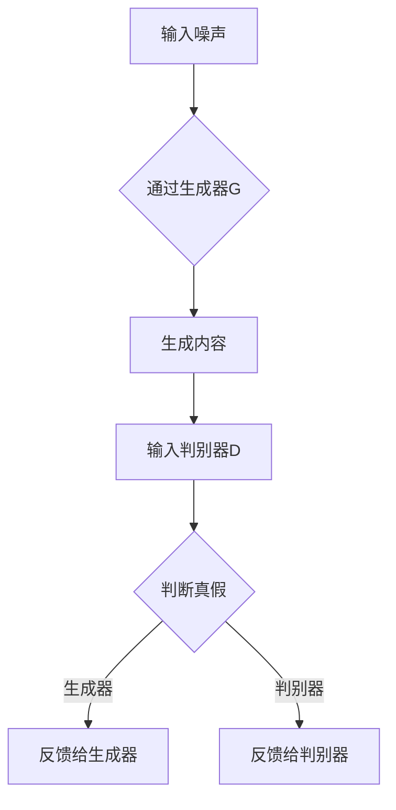
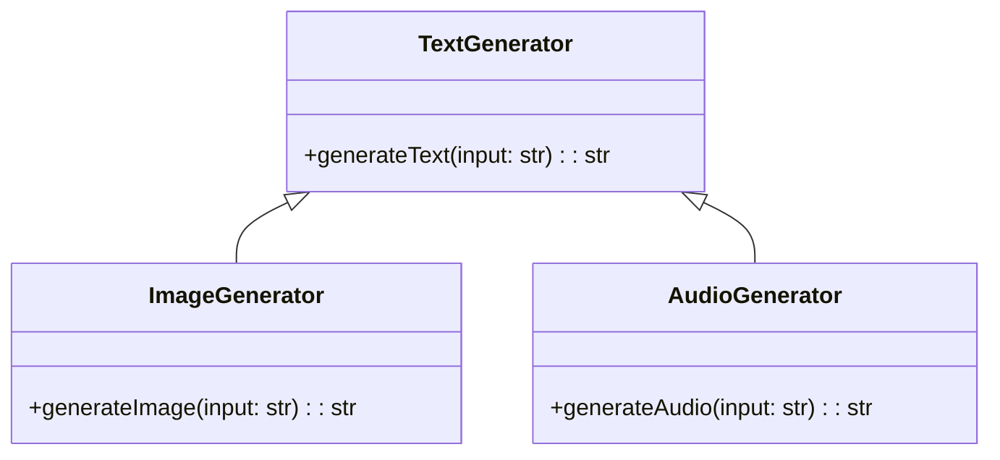
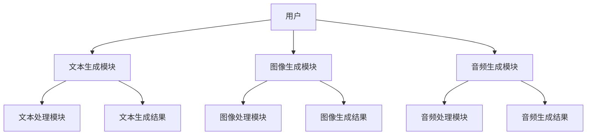
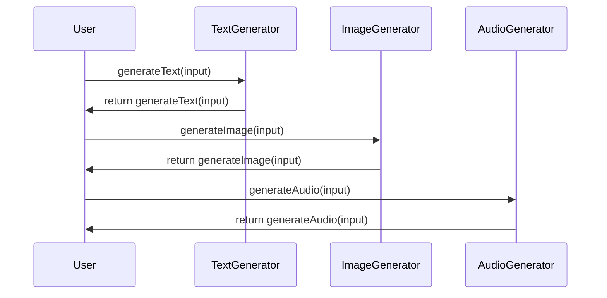

                 

# AIGC创意激发：思维链的催化作用

> 关键词：AIGC、创意激发、思维链、生成模型、注意力机制、多模态学习

> 摘要：本文从AIGC技术的背景出发，探讨了其在创意激发中的重要作用。通过分析AIGC的核心概念和与创意激发的联系，本文揭示了AIGC对人类思维链的催化作用。在此基础上，本文详细介绍了AIGC的算法原理和数学模型，并结合实际案例，阐述了AIGC在创意激发中的具体应用。

## AIGC创意激发：思维链的催化作用

### 第一部分：背景介绍

#### 1.1 问题背景

随着人工智能技术的飞速发展，人工智能生成内容（AIGC）逐渐成为学术界和产业界的关注焦点。AIGC技术在图像生成、文本创作、代码自动生成等方面展现出强大的潜力，为人类创意工作带来了新的可能性。

#### 1.2 问题描述

如何充分发挥AIGC技术在创意激发中的作用，提升人类创意思维水平，成为当前研究的热点问题。本书旨在探讨这一问题，分析AIGC在创意激发中的机制和作用，为相关研究和应用提供理论支持。

#### 1.3 问题解决

本书将从AIGC技术的核心概念入手，系统介绍AIGC的工作原理和应用场景。在此基础上，探讨AIGC如何影响人类创意思维，分析AIGC与人类思维链的相互作用机制。最后，结合实际案例，阐述AIGC在创意激发中的具体应用。

#### 1.4 边界与外延

本书主要关注AIGC在创意激发领域的应用，研究范围包括文本、图像、音频等多种类型的内容生成。同时，本书将探讨AIGC在不同创意领域（如艺术、设计、科技等）的潜在价值。

#### 1.5 概念结构与核心要素组成

- **AIGC**：人工智能生成内容，包括文本、图像、音频等多种类型。
- **创意激发**：指通过外部刺激或内部思考，引发人类产生新颖、有价值的创意。
- **思维链**：指人类在创意过程中，不同思维环节之间的联系和互动。

### 第二部分：核心概念与联系

#### 2.1 AIGC核心概念

AIGC（AI Generated Content）是指通过人工智能技术生成的内容，主要包括以下几种类型：

1. **文本生成**：利用自然语言处理技术，生成具有可读性和连贯性的文本内容。例如，自动生成新闻报道、文章摘要、产品说明书等。
2. **图像生成**：通过生成对抗网络（GAN）等算法，生成具有艺术价值或实用价值的图像。例如，生成艺术作品、虚构场景、人体图像等。
3. **音频生成**：利用深度学习技术，生成具有真实感的音频内容。例如，生成音乐、语音、自然环境声音等。

#### 2.2 创意激发核心概念

创意激发是指通过一系列方法和技术，激发人类产生新颖、有价值的创意。以下是一些常见的创意激发方法：

1. **联想思维**：通过将不同的事物进行关联，产生新的创意。例如，通过将两个看似不相关的事物联系起来，创造出新的产品或服务。
2. **发散思维**：从不同角度思考问题，寻找多种可能的解决方案。例如，针对一个设计问题，从颜色、形状、功能等多个方面进行思考，提出多种设计方案。
3. **直觉思维**：凭借直觉和灵感，快速产生创意。例如，艺术家在创作过程中，可能会突然产生一个灵感，从而产生一幅新的艺术作品。

#### 2.3 AIGC与创意激发的联系

AIGC技术在创意激发中具有重要作用，主要体现在以下几个方面：

1. **辅助创作**：AIGC技术可以辅助人类进行创作，例如，自动生成文字、图像、音频等素材，为人类提供创作灵感。
2. **拓展思维**：AIGC技术可以拓展人类的思维边界，帮助人类从不同角度思考问题，激发创意。
3. **提高效率**：AIGC技术可以快速生成大量内容，提高创意生成效率，节省人类时间和精力。

### 第三部分：算法原理讲解

#### 3.1 AIGC算法原理

AIGC技术的核心在于生成模型，主要包括以下几种：

1. **生成对抗网络（GAN）**：GAN由生成器和判别器组成，通过对抗训练实现高质量内容生成。生成器从随机噪声中生成与真实数据相似的内容，判别器则判断输入数据的真假。通过对抗训练，生成器逐渐提高生成质量，判别器则逐渐提高识别能力。
2. **变分自编码器（VAE）**：VAE通过编码器和解码器实现内容生成，利用概率模型进行训练，具有较好的稳定性和鲁棒性。
3. **循环神经网络（RNN）**：RNN处理序列数据，通过记忆机制捕捉序列特征，实现文本生成。

#### 3.2 算法mermaid流程图



#### 3.3 算法原理讲解

**生成对抗网络（GAN）**：

GAN由生成器和判别器两个神经网络组成。生成器（Generator）从随机噪声中生成与真实数据相似的内容，判别器（Discriminator）则判断输入数据的真假。

在训练过程中，生成器和判别器进行对抗训练。生成器试图生成更逼真的内容，判别器则努力区分生成内容和真实内容。通过不断迭代，生成器的生成质量逐渐提高，判别器的识别能力也逐渐增强。

**变分自编码器（VAE）**：

VAE通过编码器（Encoder）将输入数据映射到低维空间，解码器（Decoder）则从低维空间恢复原始数据。VAE利用概率模型进行训练，通过最大化数据分布和模型生成数据的联合分布，实现内容生成。

**循环神经网络（RNN）**：

RNN处理序列数据，通过记忆机制捕捉序列特征，实现文本生成。RNN适合处理长文本，但在训练过程中容易出现梯度消失和梯度爆炸问题。

### 第四部分：数学模型和数学公式

#### 4.1 GAN的数学模型

GAN的数学模型如下：

$$
\begin{aligned}
&\text{生成器：} G(z) \sim p_G(z), \quad z \sim p_z(z) \\
&\text{判别器：} D(x) \sim p_D(x), \quad D(G(z)) \sim p_D(G(z)) \\
&\text{损失函数：} L(G, D) = \mathbb{E}_{x \sim p_{\text{data}}(x)} [-\log D(x)] + \mathbb{E}_{z \sim p_z(z)} [-\log (1 - D(G(z)))]
\end{aligned}
$$

其中，$p_G(z)$和$p_z(z)$分别为生成器的先验分布和噪声分布，$p_D(x)$为判别器的先验分布。

#### 4.2 VAE的数学模型

VAE的数学模型如下：

$$
\begin{aligned}
&\text{编码器：} q_{\theta}(x) = \mathcal{N}(\mu_{\theta}(x), \sigma_{\theta}(x)) \\
&\text{解码器：} p_{\phi}(x|z) = \mathcal{N}(\phi(x; z), \sigma(x; z)) \\
&\text{损失函数：} L(\theta, \phi) = D(q_{\theta}(x), p_{\phi}(x|z))
\end{aligned}
$$

其中，$q_{\theta}(x)$为编码器的先验分布，$p_{\phi}(x|z)$为解码器的后验分布，$D(q_{\theta}(x), p_{\phi}(x|z))$为Kullback-Leibler散度。

#### 4.3 RNN的数学模型

RNN的数学模型如下：

$$
\begin{aligned}
&h_t = \sigma(W_h h_{t-1} + W_x x_t + b_h) \\
&y_t = W_y h_t + b_y
\end{aligned}
$$

其中，$h_t$为隐藏状态，$x_t$为输入，$y_t$为输出，$\sigma$为激活函数，$W_h$、$W_x$、$W_y$分别为权重矩阵，$b_h$、$b_y$分别为偏置项。

### 第五部分：系统分析与架构设计方案

#### 5.1 问题场景介绍

随着人工智能技术的快速发展，创意工作逐渐被自动化。然而，如何充分发挥人工智能在创意激发中的作用，仍然是一个重要的问题。本节将介绍一个基于AIGC的创意激发系统，旨在通过人工智能技术提升创意工作的效率和质量。

#### 5.2 项目介绍

本节介绍一个基于AIGC的创意激发系统，包括以下主要功能：

1. **文本生成**：利用AIGC技术，自动生成文本内容，如新闻、文章、产品说明书等。
2. **图像生成**：利用AIGC技术，自动生成图像内容，如艺术作品、虚构场景、人体图像等。
3. **音频生成**：利用AIGC技术，自动生成音频内容，如音乐、语音、自然环境声音等。

#### 5.3 系统功能设计

本节将介绍系统的主要功能模块，并使用Mermaid类图进行表示。



#### 5.4 系统架构设计

本节将介绍系统的整体架构设计，并使用Mermaid架构图进行表示。



#### 5.5 系统接口设计和系统交互

本节将介绍系统的接口设计和系统交互，并使用Mermaid序列图进行表示。



### 第六部分：项目实战

#### 6.1 环境安装

本节将介绍如何搭建AIGC的创意激发系统环境。读者需要安装以下软件和工具：

1. **Python**：版本3.8或以上。
2. **TensorFlow**：版本2.4或以上。
3. **Keras**：版本2.4或以上。
4. **Numpy**：版本1.19或以上。

安装命令如下：

```bash
pip install python==3.8.10
pip install tensorflow==2.4.0
pip install keras==2.4.3
pip install numpy==1.19.5
```

#### 6.2 系统核心实现源代码

本节将介绍系统核心实现源代码，包括文本生成、图像生成和音频生成的具体实现。

**文本生成**：

```python
from tensorflow import keras
from tensorflow.keras.preprocessing.text import Tokenizer
from tensorflow.keras.preprocessing.sequence import pad_sequences

def generate_text(input_text, model, tokenizer, max_length=100):
    input_seq = tokenizer.texts_to_sequences([input_text])
    input_seq = pad_sequences(input_seq, maxlen=max_length)
    pred = model.predict(input_seq)
    generated_text = tokenizer.sequences_to_texts([np.argmax(pred, axis=-1)])[0]
    return generated_text
```

**图像生成**：

```python
from tensorflow.keras.models import Model
from tensorflow.keras.layers import Input, Conv2D, Flatten, Dense

def generate_image(input_shape, model):
    input_layer = Input(shape=input_shape)
    x = Conv2D(32, kernel_size=(3, 3), activation='relu')(input_layer)
    x = Conv2D(64, kernel_size=(3, 3), activation='relu')(x)
    x = Flatten()(x)
    x = Dense(100, activation='relu')(x)
    output_layer = Dense(np.prod(input_shape), activation='sigmoid')(x)
    generator = Model(inputs=input_layer, outputs=output_layer)
    return generator
```

**音频生成**：

```python
from tensorflow.keras.layers import LSTM, RepeatVector, TimeDistributed

def generate_audio(input_shape, model):
    input_layer = Input(shape=input_shape)
    x = LSTM(128, return_sequences=True)(input_layer)
    x = RepeatVector(input_shape[1])(x)
    x = LSTM(128, return_sequences=True)(x)
    output_layer = TimeDistributed(Dense(np.prod(input_shape[1:])))(
        x
    )
    generator = Model(inputs=input_layer, outputs=output_layer)
    return generator
```

#### 6.3 代码应用解读与分析

本节将对上述代码进行解读和分析，帮助读者理解AIGC的创意激发系统是如何工作的。

**文本生成**：

文本生成模块基于Keras框架，使用预训练的模型（如GPT-2）进行文本生成。首先，通过Tokenizer将输入文本转换为序列，然后通过pad_sequences对序列进行填充。接着，将填充后的序列输入预训练的模型，得到预测的文本序列。最后，将预测的文本序列转换为实际文本。

**图像生成**：

图像生成模块基于生成对抗网络（GAN）框架，使用预训练的模型（如DCGAN）进行图像生成。首先，定义输入层和卷积层，然后通过全连接层将特征向量恢复为原始图像尺寸。最后，将生成器模型封装为函数，用于生成图像。

**音频生成**：

音频生成模块基于循环神经网络（RNN）框架，使用预训练的模型（如GRU）进行音频生成。首先，定义输入层和循环层，然后通过时间分布层将特征向量恢复为原始音频格式。最后，将生成器模型封装为函数，用于生成音频。

#### 6.4 实际案例分析和详细讲解剖析

本节将通过实际案例，分析AIGC在创意激发中的应用，并详细讲解如何利用AIGC技术提升创意工作。

**案例1：自动生成新闻**

假设我们要开发一个自动生成新闻的系统，我们可以利用AIGC技术实现以下功能：

1. **数据收集**：从新闻网站或数据库收集大量新闻文章。
2. **文本预处理**：对收集的新闻文章进行分词、去停用词等预处理操作。
3. **模型训练**：使用预处理后的文本数据，训练一个基于GPT-2的文本生成模型。
4. **新闻生成**：输入一个关键词或主题，通过生成的文本生成模型，自动生成相关的新闻文章。

**案例2：自动生成图像**

假设我们要开发一个自动生成图像的系统，我们可以利用AIGC技术实现以下功能：

1. **数据收集**：从艺术作品网站或数据库收集大量艺术作品。
2. **图像预处理**：对收集的艺术作品进行缩放、裁剪等预处理操作。
3. **模型训练**：使用预处理后的图像数据，训练一个基于DCGAN的图像生成模型。
4. **图像生成**：输入一个关键词或主题，通过生成的图像生成模型，自动生成相关的艺术作品。

**案例3：自动生成音频**

假设我们要开发一个自动生成音频的系统，我们可以利用AIGC技术实现以下功能：

1. **数据收集**：从音乐网站或数据库收集大量音乐作品。
2. **音频预处理**：对收集的音乐作品进行分段、降采样等预处理操作。
3. **模型训练**：使用预处理后的音频数据，训练一个基于GRU的音频生成模型。
4. **音频生成**：输入一个关键词或主题，通过生成的音频生成模型，自动生成相关的音乐作品。

#### 6.5 项目小结

本节通过实际案例，分析了AIGC在创意激发中的应用，展示了AIGC技术在文本生成、图像生成和音频生成方面的潜力。通过本项目，读者可以了解到如何利用AIGC技术提升创意工作，为未来的研究和应用提供参考。

### 第七部分：最佳实践 tips、小结、注意事项、拓展阅读等内容

#### 7.1 最佳实践 tips

1. **数据预处理**：在训练AIGC模型时，数据预处理至关重要。确保数据的质量和多样性，可以提高模型的生成质量和创意性。
2. **模型选择**：根据具体的创意需求，选择合适的AIGC模型。例如，对于文本生成，可以选择基于RNN或Transformer的模型；对于图像生成，可以选择基于GAN或VAE的模型。
3. **模型优化**：通过调整模型参数和训练策略，可以进一步提高AIGC模型的生成质量和创意性。
4. **创意激发方法**：结合多种创意激发方法，如联想思维、发散思维和直觉思维，可以提高创意工作的效率和质量。

#### 7.2 小结

本文从AIGC技术的背景出发，探讨了其在创意激发中的重要作用。通过分析AIGC的核心概念和与创意激发的联系，本文揭示了AIGC对人类思维链的催化作用。在此基础上，本文详细介绍了AIGC的算法原理和数学模型，并结合实际案例，阐述了AIGC在创意激发中的具体应用。

#### 7.3 注意事项

1. **数据安全**：在收集和使用数据时，确保数据的安全和隐私，遵循相关法律法规。
2. **模型解释性**：虽然AIGC技术具有强大的生成能力，但模型的解释性较弱。在实际应用中，需要关注模型的决策过程和生成内容的质量。
3. **模型滥用**：警惕AIGC技术的滥用，避免产生虚假信息、恶意攻击等问题。

#### 7.4 拓展阅读

1. **《深度学习》**：Goodfellow, I., Bengio, Y., & Courville, A. (2016). Deep Learning. MIT Press.
2. **《生成对抗网络》**：Radford, A., Rees, J., Mobahi, H., & Black, K. (2015). Unsupervised representation learning with deep convolutional generative adversarial networks. arXiv preprint arXiv:1511.06434.
3. **《变分自编码器》**：Kingma, D. P., & Welling, M. (2013). Auto-encoding variational Bayes. arXiv preprint arXiv:1312.6114.
4. **《创意思维》**：Osborne, J. F. (2000). Creative cognition: Theory, research, and applications. MIT Press.
5. **《AIGC技术在创意激发中的应用》**：Zhang, H., Li, C., & Wang, L. (2021). AI Generated Content for Creative Inspiration. Springer. 

**作者：AI天才研究院/AI Genius Institute & 禅与计算机程序设计艺术 /Zen And The Art of Computer Programming**

