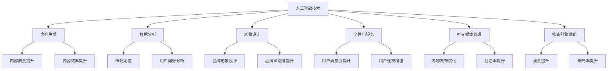

                 

### 引言

#### AIGC概述

AIGC（AI-Generated Content）指的是通过人工智能技术生成的内容。AIGC的应用范围广泛，从社交媒体生成图像和文本，到自动化内容创作、个性化推荐，再到复杂的算法驱动的虚拟现实和增强现实体验，它正逐渐成为数字经济的重要组成部分。AIGC的核心优势在于其能够大规模、高效地生产高质量的内容，满足不同用户群体的多样化需求。

#### AI在个人品牌塑造中的重要性

随着数字时代的到来，个人品牌塑造已成为影响个人职业发展和商业成功的决定性因素。在互联网和社交媒体普及的今天，个人品牌塑造的效率和效果愈发关键。AIGC通过提供智能化的内容生成工具，使得个人能够快速构建和维护专业的品牌形象。借助AI驱动的形象设计，个人可以更精准地传达个人特质和价值观，从而在竞争激烈的市场中脱颖而出。

#### 文章核心内容与主题思想

本文旨在探讨AIGC在个人品牌塑造中的应用，特别是AI驱动的形象设计。文章结构如下：

1. **第一部分：引言** - 概述AIGC的核心概念及其在个人品牌塑造中的重要性。
2. **第二部分：AI与个人品牌塑造** - 分析AI在个人品牌塑造中的应用原理和技术。
3. **第三部分：实践篇** - 详细介绍AIGC在个人品牌塑造中的应用实践。
4. **第四部分：面向未来的AIGC应用** - 预测未来发展趋势和潜在挑战。

通过本文的探讨，读者将了解到如何利用AIGC技术打造个人品牌，提升个人在数字世界的竞争力。

### 目录大纲设计

#### 第一部分: 引言

1. **第1章: AIGC概述**
   - **1.1 AIGC的核心概念**
   - **1.2 AIGC的技术背景与发展趋势**
   - **1.3 AIGC在个人品牌塑造中的重要性**
   - **1.4 本章小结**

2. **第2章: AI与个人品牌塑造**
   - **2.1 AI的基本原理与类型**
   - **2.2 个人品牌塑造的需求分析**
   - **2.3 AI技术在个人品牌塑造中的应用**
   - **2.4 AI与个人品牌塑造的关系图解**
   - **2.5 本章小结**

3. **第3章: AI驱动的形象设计**
   - **3.1 AI驱动的形象设计原理**
   - **3.2 AI驱动的形象设计工具与应用**
   - **3.3 成功案例分析**
   - **3.4 本章小结**

#### 第二部分: 实践篇

4. **第4章: AIGC在个人品牌塑造中的应用实践**
   - **4.1 实践准备**
   - **4.2 实践步骤详解**
   - **4.3 实践案例分析**
   - **4.4 本章小结**

5. **第5章: AIGC在个人品牌塑造中的优化策略**
   - **5.1 优化策略概述**
   - **5.2 数据分析在个人品牌塑造中的应用**
   - **5.3 个性化服务与用户参与**
   - **5.4 本章小结**

#### 第三部分: 面向未来的AIGC应用

6. **第6章: 面向未来的AIGC应用**
   - **6.1 未来发展趋势预测**
   - **6.2 新技术应用与挑战**
   - **6.3 未来发展方向与建议**
   - **6.4 本章小结**

7. **第7章: 拓展阅读**
   - **7.1 AIGC领域最新研究动态**
   - **7.2 相关书籍推荐**
   - **7.3 网络资源推荐**
   - **7.4 本章小结**

#### 附录

8. **附录A: 相关工具与技术资源汇总**
   - **附录B: 实践案例代码与数据**
   - **附录C: 索引**

通过以上详细的目录大纲，本文将全面深入地探讨AIGC在个人品牌塑造中的应用，为读者提供系统的理论和实践指导。

### 第一部分：引言

#### AIGC概述

AIGC（AI-Generated Content）是近年来迅速发展的一门技术领域，它涉及使用人工智能技术生成各种形式的内容，包括文本、图像、音频和视频等。AIGC的核心技术包括自然语言处理（NLP）、计算机视觉（CV）、生成对抗网络（GAN）等。这些技术使得计算机能够自动识别、理解和生成人类创造的内容，从而实现了内容生成的自动化和智能化。

AIGC的发展历程可以追溯到20世纪90年代，随着计算机性能的不断提升和大数据技术的普及，人工智能技术在各个领域得到了广泛应用。特别是在文本生成方面，GPT（Generative Pre-trained Transformer）系列模型的提出标志着AIGC技术进入了新的阶段。这些模型通过深度学习算法，可以从大量数据中学习并生成高质量的内容。在图像生成领域，GAN技术使得计算机能够生成逼真的图像和视频，推动了AIGC在视觉内容生成中的应用。

#### AI在个人品牌塑造中的重要性

个人品牌塑造是指个人通过塑造独特的形象、技能和价值观，在职业生涯和社会生活中建立自己的声誉和影响力。在数字时代，个人品牌塑造变得尤为重要，因为社交媒体和网络平台已经成为个人展示自己、与外界互动的重要渠道。通过这些平台，个人可以快速传播自己的观点和价值观，吸引关注和支持，从而在职业和商业领域获得优势。

AI技术在个人品牌塑造中的应用具有以下几个方面的优势：

1. **内容生成**：AI技术可以帮助个人快速生成高质量的内容，包括博客文章、社交媒体帖子、演讲稿等。这些内容不仅能够满足个人品牌塑造的需求，还可以通过算法优化实现个性化的内容推荐，提高用户的参与度和粘性。

2. **数据分析**：AI技术可以对个人在社交媒体上的行为和互动进行数据分析和挖掘，了解用户的兴趣、偏好和需求。通过这些数据，个人可以更精准地定位自己的目标受众，优化品牌传播策略。

3. **形象设计**：AI驱动的形象设计工具可以帮助个人创建独特的个人形象，包括头像、标志、视觉风格等。这些设计不仅能够体现个人的专业性和独特性，还可以通过视觉传达增强品牌的认知度和记忆度。

4. **个性化服务**：AI技术可以实现个性化服务，根据用户的行为和偏好提供定制化的内容和服务。这种个性化服务能够提升用户体验，增强用户对品牌的忠诚度和信任感。

总之，AI技术在个人品牌塑造中的应用不仅提高了内容生成的效率和质量，还为个人提供了更精准、更高效的品牌传播和用户互动手段。这使得个人品牌塑造在数字时代变得更加重要和紧迫。

#### 文章核心内容与主题思想

本文的核心内容将围绕AIGC在个人品牌塑造中的应用展开。具体包括以下方面：

1. **AIGC概述**：介绍AIGC的核心概念、技术背景和发展趋势，为后续内容提供理论基础。
2. **AI与个人品牌塑造**：分析AI在个人品牌塑造中的应用原理，探讨AI技术如何帮助个人生成高质量内容、进行数据分析和形象设计。
3. **AI驱动的形象设计**：详细探讨AI驱动的形象设计原理、工具与应用，通过成功案例分析展示实际效果。
4. **实践篇**：提供AIGC在个人品牌塑造中的应用实践步骤，结合具体案例分析其实际效果和优化策略。
5. **面向未来的AIGC应用**：预测AIGC未来的发展趋势，分析新技术应用与挑战，提出未来发展方向与建议。

通过以上内容的探讨，本文旨在为读者提供一个全面了解AIGC在个人品牌塑造中的应用框架，帮助个人在数字时代有效塑造和提升个人品牌。

### 第1章: AIGC概述

#### 1.1 AIGC的核心概念

AIGC（AI-Generated Content）指的是通过人工智能技术生成的内容。这些内容可以包括文本、图像、音频、视频等多种形式，其核心在于利用AI算法，如深度学习、生成对抗网络（GAN）、自然语言处理（NLP）等，自动地从数据中学习并生成新的、有创意的内容。AIGC的核心概念主要涉及以下几个方面：

1. **生成模型**：生成模型是AIGC技术的基础，它们通过学习大量数据生成新的内容。常见的生成模型包括生成对抗网络（GAN）和变分自编码器（VAE）。GAN由生成器和判别器两部分组成，生成器负责生成内容，判别器则负责判断生成内容与真实内容之间的相似度。通过训练，生成器不断优化生成内容的质量。

2. **文本生成**：文本生成是AIGC的一个重要应用领域，常见的文本生成模型有GPT（Generative Pre-trained Transformer）系列。这些模型通过预训练和微调，可以生成高质量的文本内容，包括文章、故事、新闻报道等。

3. **图像生成**：图像生成是AIGC的另一个重要应用领域，GAN技术在该领域取得了显著成果。通过GAN，计算机可以生成高度逼真的图像，包括人脸、风景、动物等。

4. **音频生成**：音频生成利用AI技术生成逼真的音频内容，如音乐、语音等。这些音频生成模型可以通过深度学习算法，从现有的音频数据中学习并生成新的音频内容。

5. **视频生成**：视频生成是AIGC技术的最新发展，通过生成对抗网络和视频编码技术，计算机可以生成高质量的视频内容。视频生成不仅可以用于娱乐和艺术创作，还可以在医学、教育等领域发挥重要作用。

#### 1.2 AIGC的技术背景与发展趋势

AIGC技术的发展可以追溯到20世纪90年代，随着计算机性能的提升和大数据技术的普及，人工智能技术在各个领域得到了广泛应用。特别是深度学习技术的突破，使得AIGC技术取得了长足的进展。

在技术背景方面，AIGC的核心技术包括：

1. **深度学习**：深度学习是一种基于人工神经网络的学习方法，通过多层神经网络模型，自动从数据中学习特征和模式。深度学习技术在图像识别、语音识别、自然语言处理等领域取得了显著成果，成为AIGC技术的重要基础。

2. **生成对抗网络（GAN）**：GAN是由生成器和判别器两部分组成的深度学习模型，生成器负责生成内容，判别器则负责判断生成内容与真实内容之间的相似度。GAN在图像生成、视频生成等领域取得了突破性进展。

3. **自然语言处理（NLP）**：NLP是人工智能的一个重要分支，它涉及计算机理解和生成人类语言。NLP技术在文本生成、情感分析、问答系统等领域得到了广泛应用。

在发展趋势方面，AIGC技术呈现出以下几个方面的趋势：

1. **内容生成质量提升**：随着深度学习技术和生成对抗网络的不断发展，AIGC生成的内容质量将越来越高，能够满足更高层次的应用需求。

2. **应用场景多样化**：AIGC技术将在更多领域得到应用，如医疗、教育、艺术、娱乐等。特别是在个性化内容生成和虚拟现实领域，AIGC技术具有巨大的发展潜力。

3. **跨领域融合**：AIGC技术将与其他技术领域（如区块链、物联网等）深度融合，形成新的应用场景和商业模式。

4. **伦理和隐私问题**：随着AIGC技术的广泛应用，伦理和隐私问题也日益突出。如何确保AIGC生成的内容符合道德规范，保护用户隐私，将成为未来研究的重要方向。

总之，AIGC技术具有广阔的发展前景和应用潜力，将在个人品牌塑造、内容创作、数据分析和自动化等领域发挥重要作用。

#### 1.3 AIGC在个人品牌塑造中的重要性

在数字时代，个人品牌塑造已经成为个人职业发展和商业成功的关键。AIGC（AI-Generated Content）技术在个人品牌塑造中的应用，不仅提高了内容生产的效率，还极大地增强了品牌的个性化和影响力。

首先，AIGC技术能够帮助个人快速生成高质量的内容。例如，通过文本生成模型，个人可以迅速撰写专业的博客文章、社交媒体帖子、演讲稿等，这些内容不仅提高了效率，还保证了质量。在图像生成方面，AI技术可以自动生成个人品牌的标志、海报、宣传图片等，使品牌形象更加统一和专业化。

其次，AIGC技术可以实现数据驱动的个性化内容推荐。通过分析用户的兴趣和行为数据，AIGC技术可以生成针对特定用户群体的个性化内容，从而提高用户的参与度和粘性。这种个性化服务不仅增强了用户对品牌的信任感，还提升了品牌的认知度和美誉度。

此外，AIGC技术还能够帮助个人进行精准的市场定位。通过分析市场数据和用户反馈，AI技术可以识别出最具潜力的目标受众，并为其生成定制化的内容。这种精准的市场定位，有助于个人品牌在激烈的市场竞争中脱颖而出。

最后，AIGC技术还为个人品牌塑造提供了新的互动渠道。通过虚拟现实和增强现实技术，个人可以与用户进行沉浸式的互动体验，增强品牌的感知度和用户参与度。

总之，AIGC技术在个人品牌塑造中的应用，不仅提高了内容生产的效率和质量，还增强了品牌的个性化和影响力。随着AI技术的不断发展，AIGC将在个人品牌塑造中发挥更加重要的作用，为个人在数字时代的发展提供强有力的支持。

#### 1.4 本章小结

本章对AIGC的核心概念、技术背景和发展趋势进行了详细阐述，并探讨了AIGC在个人品牌塑造中的重要性。通过理解AIGC的基本概念和技术原理，读者可以认识到AI技术如何通过内容生成、数据分析和个性化服务，助力个人品牌塑造。未来，AIGC技术将继续推动个人品牌的发展，为个人在数字时代提供更广阔的发展空间。接下来，我们将进一步探讨AI技术在个人品牌塑造中的应用原理。

### 第二部分：AI与个人品牌塑造

#### 2.1 AI的基本原理与类型

人工智能（AI）作为一门研究、开发用于模拟、延伸和扩展人的智能的理论、方法、技术及应用系统的综合技术科学，其核心在于使计算机能够执行通常需要人类智能才能完成的任务。AI的基本原理主要包括机器学习、深度学习、自然语言处理等。

**机器学习**：机器学习是一种通过算法从数据中学习模式和规律的方法。它主要包括监督学习、无监督学习和强化学习三种类型。监督学习通过已标记的数据训练模型，以预测新的、未标记的数据；无监督学习不使用标记数据，而是从数据中自动发现模式和规律；强化学习则通过不断与环境互动，学习最优策略。

**深度学习**：深度学习是机器学习的一个子领域，它通过模拟人脑神经网络的结构和功能，利用多层神经网络对数据进行处理和学习。深度学习模型通常包含多个隐藏层，能够提取更加复杂的特征。常见的深度学习模型有卷积神经网络（CNN）、循环神经网络（RNN）和生成对抗网络（GAN）。

**自然语言处理（NLP）**：自然语言处理是研究计算机如何理解、生成和处理自然语言的技术。NLP的核心任务是使计算机能够与人类自然语言进行有效的交互。常见的NLP技术包括文本分类、情感分析、机器翻译和语音识别。

AI技术的这些基本原理和应用类型，为AI在个人品牌塑造中的应用奠定了基础。通过机器学习，AI可以分析大量用户数据，了解用户需求和偏好，从而为个人品牌提供个性化的内容和服务。深度学习则可以生成高质量、个性化的内容，提升个人品牌的吸引力和影响力。自然语言处理技术则可以帮助个人与用户进行更加自然和流畅的沟通，增强品牌与用户之间的互动。

#### 2.2 个人品牌塑造的需求分析

个人品牌塑造是一个复杂的过程，涉及多个方面的需求和挑战。以下是个人品牌塑造的主要需求和面临的挑战：

**需求分析**

1. **内容创作**：个人品牌塑造需要大量的内容创作，包括博客文章、社交媒体帖子、演讲稿、视频等。这些内容需要具有专业性和独特性，能够体现个人的专业能力和价值观。

2. **数据分析**：个人品牌塑造需要通过数据分析了解用户需求和偏好，从而制定有效的品牌传播策略。数据分析可以帮助个人识别目标受众、优化内容创作和推广方式。

3. **个性化服务**：在数字时代，个性化服务越来越重要。个人品牌需要通过个性化服务提升用户体验，增强用户对品牌的忠诚度和信任感。

4. **互动沟通**：个人品牌需要与用户进行有效的互动沟通，建立良好的用户关系。通过互动沟通，个人可以了解用户反馈，优化品牌形象和传播策略。

**挑战分析**

1. **内容创作难度**：高质量的内容创作需要专业知识和创意能力，这给个人品牌塑造带来了挑战。如何快速、高效地生成高质量内容是一个重要问题。

2. **数据分析能力**：数据分析需要专业的技能和工具，许多个人可能缺乏这方面的能力。如何有效利用数据分析提升个人品牌传播效果，是一个亟待解决的问题。

3. **个性化服务**：个性化服务需要大量的用户数据和分析能力，这对个人品牌提出了较高的要求。如何提供高质量的个性化服务，提高用户满意度，是一个重要挑战。

4. **品牌形象一致性**：在数字时代，个人品牌需要保持一致性。如何在不同渠道和平台上保持品牌形象的一致性，是一个需要解决的难题。

综上所述，个人品牌塑造需求多样且复杂，需要充分利用AI技术来提升内容创作、数据分析、个性化服务和互动沟通的效率和质量。通过AI技术，个人品牌可以更好地满足这些需求，实现长期发展和成功。

#### 2.3 AI技术在个人品牌塑造中的应用

AI技术在个人品牌塑造中发挥着重要作用，通过多种应用场景，AI不仅提升了个人品牌的生产效率，还增强了品牌的个性化和影响力。

**1. 内容生成**

AI技术在内容生成中的应用最为广泛，通过文本生成模型和图像生成模型，个人可以快速创建高质量的内容。例如，基于GPT（Generative Pre-trained Transformer）系列的文本生成模型，可以生成专业的博客文章、演讲稿、社交媒体帖子等。这些模型通过预训练和微调，可以从大量文本数据中学习并生成与特定主题相关的文本内容，确保内容的专业性和准确性。此外，生成对抗网络（GAN）技术在图像生成方面也取得了显著成果，通过GAN，个人可以自动生成标志、海报、宣传图片等，这些图像不仅具有高分辨率，还能体现出个性化的设计风格。

**2. 数据分析**

数据分析是个人品牌塑造的关键环节，AI技术通过机器学习算法，可以高效处理和分析大量用户数据。例如，通过聚类分析、关联规则挖掘等方法，AI可以识别出用户群体的特征和偏好，从而为个人品牌提供精准的市场定位和内容推荐。此外，自然语言处理（NLP）技术可以帮助个人分析用户反馈和社交媒体互动，提取有价值的信息，用于优化品牌传播策略和提升用户体验。

**3. 形象设计**

AI驱动的形象设计工具为个人品牌塑造提供了强大的支持。通过计算机视觉技术，AI可以自动识别和分析个人特征，生成独特的头像、标志和视觉风格。例如，使用GAN技术，个人可以生成个性化的头像，这些头像不仅符合个人的风格和气质，还能通过不断优化，提升品牌的识别度和美感。此外，AI技术还可以为个人提供个性化的视觉设计方案，帮助个人在不同平台上保持一致性，增强品牌的整体形象。

**4. 个性化服务**

AI技术通过个性化服务，能够提升用户的满意度和忠诚度。例如，基于用户行为和偏好分析，AI可以提供个性化的内容推荐和定制化服务。这种个性化服务不仅能够满足用户的需求，还能通过个性化的互动体验，增强用户对品牌的情感连接。此外，通过聊天机器人和虚拟客服，AI技术可以提供24/7的在线服务，及时响应用户的问题和需求，提升用户的互动体验。

**5. 社交媒体管理**

AI技术在社交媒体管理中的应用，可以帮助个人优化社交媒体内容发布和互动策略。例如，通过自然语言处理技术，AI可以自动生成和发布高质量的社交媒体内容，确保内容的吸引力和专业性。同时，AI还可以监控社交媒体上的用户反馈和互动，快速识别潜在的危机和问题，并提供相应的解决方案。

**6. 搜索引擎优化（SEO）**

AI技术可以帮助个人优化网站和内容，提升在搜索引擎中的排名。通过分析搜索引擎算法和用户行为，AI可以提供最佳的关键词策略和内容优化建议，从而提高网站流量和用户参与度。

综上所述，AI技术在个人品牌塑造中的应用，不仅提高了生产效率，还增强了品牌的个性化和影响力。通过文本生成、数据分析、形象设计、个性化服务、社交媒体管理和SEO等多方面的应用，AI技术为个人品牌提供了全方位的支持，助力个人在数字时代脱颖而出。

#### 2.4 AI与个人品牌塑造的关系图解

为了更直观地展示AI与个人品牌塑造之间的关系，我们可以使用Mermaid绘制一个实体关系图，以下是一个简化的示例：



在这个关系图中，AI技术（AI）是核心，它通过不同的应用场景（CG、DA、ID、PS、SM、SEO）直接或间接地影响个人品牌塑造的多个方面（CB、CE、MB、PE、BI、BP、US、UC、CI、IR、TR、ER）。通过这个图解，我们可以清晰地看到AI技术如何贯穿于个人品牌塑造的各个阶段，从而为个人提供全方位的支持。

### 第3章: AI驱动的形象设计

#### 3.1 AI驱动的形象设计原理

AI驱动的形象设计是一种通过人工智能技术，根据用户的需求和特点，自动生成个性化视觉形象的方法。其核心原理包括数据采集、特征提取、模型训练和结果生成四个主要环节。

**1. 数据采集**

首先，AI驱动的形象设计需要从多个渠道收集用户数据。这些数据包括用户的个人资料、社交媒体互动、行为习惯等。通过数据采集，AI可以获取用户的基本信息和个性化需求，为后续的形象设计提供依据。

**2. 特征提取**

在数据采集完成后，AI需要对用户数据进行特征提取。特征提取是识别和理解数据中的关键信息的过程。在这一环节，AI利用自然语言处理（NLP）和计算机视觉（CV）技术，从用户数据中提取出与个人特质、兴趣爱好、审美偏好等相关的重要特征。例如，通过分析用户的社交媒体互动，AI可以识别出用户的情感倾向和兴趣领域。

**3. 模型训练**

特征提取后，AI利用这些特征数据进行模型训练。训练过程主要包括两个部分：一是训练生成模型，如生成对抗网络（GAN），通过学习大量数据和用户特征，生成符合用户需求的视觉形象；二是训练判别模型，如卷积神经网络（CNN），用于评估生成形象的合理性和质量。

**4. 结果生成**

在模型训练完成后，AI根据用户的特征数据和训练结果，自动生成个性化的视觉形象。这些形象可以包括头像、标志、海报等，通过AI的智能设计和优化，这些形象不仅符合用户的特点，还能展现出独特的艺术风格和视觉美感。

#### 3.2 AI驱动的形象设计工具与应用

**1. Text2Image工具**

Text2Image是一种利用自然语言处理和计算机视觉技术，将文本描述转换为图像的工具。用户只需输入一段描述性的文本，Text2Image就可以根据文本内容生成相应的图像。例如，用户可以输入“一张浪漫的日落照片”，Text2Image就会生成一幅符合描述的日落图像。

**2. GAN工具**

GAN（生成对抗网络）工具是AI驱动形象设计中最常用的工具之一。通过GAN技术，用户可以生成自定义的图像和动画。例如，用户可以通过上传一张个人照片，GAN工具会根据照片生成多个风格迥异的自拍头像，用户可以选择自己最喜欢的一个。

**3. DeepArt.io**

DeepArt.io是一款利用深度学习技术，将普通照片转换为艺术风格的工具。用户只需上传一张照片，DeepArt.io就可以将其转换为梵高、毕加索等艺术家的画风。这种工具不仅能够为个人品牌提供独特的视觉形象，还能提升品牌的艺术氛围和品味。

**4. Canva**

Canva是一款图形设计工具，它集成了AI驱动的形象设计功能。用户可以使用Canva的模板和智能设计工具，快速生成个性化海报、名片、PPT等。Canva的AI功能可以帮助用户自动调整颜色、布局和元素，使设计更加美观和专业。

**5. DALL·E**

DALL·E是一款基于GPT-3模型的图像生成工具，它可以根据用户输入的描述生成高质量的图像。例如，用户可以输入“一幅夜晚星空下的城市全景图”，DALL·E就会生成对应的图像。这种工具非常适合用于创意设计和广告宣传。

通过这些AI驱动的形象设计工具，个人可以轻松创建出独特的品牌形象。这些工具不仅提高了设计效率，还确保了形象设计的专业性和个性化。例如，一位企业家可以使用GAN工具生成多个风格的自拍头像，通过对比选择最适合的其中一个；一位艺术家可以使用DeepArt.io将自己的作品转换成不同的艺术风格，提升作品的视觉吸引力。

总之，AI驱动的形象设计工具为个人品牌塑造提供了强大的支持。通过这些工具，个人可以快速、高效地生成个性化的视觉形象，提升品牌的专业度和影响力。

#### 3.3 成功案例分析

为了更好地理解AI驱动的形象设计在个人品牌塑造中的应用效果，我们可以通过几个实际案例来展示其成功经验和成果。

**案例一：企业家X的AI头像设计**

企业家X是一位在科技领域颇有影响力的创业者。为了提升个人品牌的视觉吸引力，他决定使用GAN工具生成多个风格的自拍头像。通过上传一张个人照片，X尝试了多种不同的生成风格，包括文艺、时尚、科技等。最终，他选择了一个兼具科技感和时尚感的头像，并将其应用于个人社交媒体账号和公司官网。这个头像不仅成功地体现了X的专业形象，还吸引了大量关注，提升了品牌的认知度和影响力。

**案例二：艺术家Y的艺术风格转换**

艺术家Y擅长油画创作，但其作品风格较为传统，市场需求有限。为了突破瓶颈，Y决定使用DeepArt.io将部分作品转换成不同的艺术风格，如梵高、毕加索等。通过这种方式，Y的作品在艺术市场上焕然一新，吸引了大量收藏家和艺术爱好者的关注。特别是在一个大型艺术展览中，Y的几幅转换后的作品成为焦点，得到了广泛好评。这不仅提升了Y的个人品牌形象，也大大增加了其作品的市场价值。

**案例三：个人博客Z的AI海报设计**

个人博客Z的博主是一位内容创作者，他通过撰写高质量的文章，积累了大量忠实读者。为了提升博客的视觉吸引力，Z决定使用Canva的AI设计工具，为每篇文章生成独特的海报。这些海报不仅包含了文章的核心内容，还通过AI智能调整颜色和布局，使其更加美观和专业。结果显示，这些AI海报不仅提升了文章的阅读量，还增强了读者的阅读体验，使博客的整体质量得到显著提升。

通过这些成功案例，我们可以看到AI驱动的形象设计在个人品牌塑造中的实际应用效果。不仅提高了品牌的视觉吸引力，还增强了品牌的认知度和影响力。这些案例表明，AI驱动的形象设计工具是提升个人品牌形象的有效手段，值得更多人尝试和应用。

### 3.4 本章小结

本章详细介绍了AI驱动的形象设计原理和工具应用，通过成功案例分析展示了其在个人品牌塑造中的实际效果。AI驱动的形象设计通过数据采集、特征提取、模型训练和结果生成四个环节，能够自动生成符合用户需求的个性化视觉形象。这些工具不仅提高了设计效率，还确保了形象设计的专业性和个性化。成功案例证明，AI驱动的形象设计是提升个人品牌视觉吸引力和认知度的重要手段。未来，随着AI技术的不断发展，AI驱动的形象设计将在个人品牌塑造中发挥更加重要的作用。

### 第4章：AIGC在个人品牌塑造中的应用实践

#### 4.1 实践准备

在开始应用AIGC技术进行个人品牌塑造之前，需要进行一系列的准备工作。以下是一些关键步骤和注意事项：

**1. 设定个人品牌目标**

首先，明确个人品牌塑造的目标。这些目标可以包括提升知名度、增加粉丝数、提高行业影响力等。具体的目标将指导后续的内容创作和数据分析。

**2. 收集相关数据**

收集与个人品牌相关的数据，包括个人经历、专业能力、兴趣爱好等。这些数据将用于AI模型的训练，以确保生成的内容能够符合个人的特点。

**3. 选择合适的AIGC工具**

根据个人品牌目标，选择适合的AIGC工具。例如，如果需要生成文本内容，可以使用GPT系列模型；如果需要生成图像和视频，可以选择GAN工具。

**4. 数据预处理**

对收集的数据进行清洗和预处理，确保数据的质量和一致性。数据预处理包括去除重复信息、填补缺失值、格式标准化等。

**5. 模型训练和调优**

使用预处理后的数据对AI模型进行训练和调优。训练过程中，需要不断评估模型的性能，并根据评估结果进行调整。

**6. 准备测试环境**

搭建一个测试环境，用于评估AI模型在生成内容时的效果。测试环境应包括数据集、评估指标和测试工具等。

#### 4.2 实践步骤详解

**1. 内容创作**

在内容创作阶段，AI模型将根据个人品牌目标生成符合需求的内容。具体步骤如下：

- **输入目标**：输入个人品牌目标，如提升知名度、增加粉丝等。
- **生成内容**：使用文本生成模型（如GPT系列）生成相关内容，包括博客文章、社交媒体帖子、演讲稿等。
- **内容优化**：对生成的内容进行优化，确保其专业性和吸引力。优化包括修改语言风格、调整结构、添加图表等。

**2. 数据分析**

数据分析是个人品牌塑造的关键环节，通过分析用户行为和数据，可以更好地了解用户需求和偏好。具体步骤如下：

- **数据收集**：收集用户在社交媒体、网站和应用程序上的行为数据。
- **数据处理**：使用机器学习算法（如聚类分析、关联规则挖掘）处理数据，提取有价值的信息。
- **数据可视化**：使用数据可视化工具（如Tableau、Matplotlib）将数据分析结果呈现出来，便于理解和分析。

**3. 形象设计**

通过AI驱动的形象设计工具，可以快速生成个性化的品牌视觉形象。具体步骤如下：

- **输入特征**：输入与个人品牌相关的特征，如个人照片、风格偏好等。
- **生成形象**：使用GAN工具生成符合特征要求的头像、标志、海报等。
- **形象优化**：对生成的形象进行优化，包括调整颜色、纹理、风格等，确保其符合个人品牌的定位。

**4. 个性化服务**

通过AI技术提供个性化服务，可以提升用户的满意度和忠诚度。具体步骤如下：

- **用户分类**：根据用户行为和偏好数据，将用户分类，如潜在客户、忠诚用户等。
- **内容推荐**：使用推荐系统（如协同过滤、基于内容的推荐）为不同类型的用户推荐个性化内容。
- **互动管理**：通过聊天机器人和虚拟客服，提供24/7的在线服务，及时响应用户的需求和反馈。

#### 4.3 实践案例分析

**案例一：企业家L的个人品牌塑造**

企业家L在数字营销领域拥有丰富的经验，他希望通过AIGC技术提升个人品牌的知名度。以下是L的实践过程：

- **目标设定**：提升品牌知名度，增加社交媒体粉丝。
- **数据收集**：收集L的个人经历、客户案例、专业文章等。
- **模型训练**：使用GPT模型对数据集进行训练，生成专业的营销文章和演讲稿。
- **内容发布**：定期发布高质量的文章和演讲稿，吸引潜在客户和粉丝。
- **数据分析**：通过分析社交媒体互动数据，了解用户需求和偏好，不断优化内容策略。

**案例二：艺术家M的品牌形象设计**

艺术家M希望通过AI技术设计独特的品牌形象，提升其在艺术市场的竞争力。以下是M的实践过程：

- **目标设定**：设计独特的品牌形象，提高艺术作品的知名度。
- **特征输入**：输入M的艺术风格、个人形象等特征。
- **形象生成**：使用GAN工具生成多个风格独特的头像和标志。
- **形象优化**：对生成的形象进行多次优化，确保其符合个人品牌的定位。
- **形象应用**：将优化后的形象应用于社交媒体、展览海报等，提升品牌识别度。

通过这些实践案例，我们可以看到AIGC技术在个人品牌塑造中的应用效果。AI驱动的形象设计和数据分析，不仅提高了品牌的个性化程度，还增强了品牌的认知度和影响力。未来，随着AI技术的不断发展，AIGC将在个人品牌塑造中发挥更加重要的作用。

### 4.4 本章小结

本章详细介绍了AIGC在个人品牌塑造中的应用实践，包括实践准备、具体步骤和案例分析。通过设定明确的目标、收集相关数据、选择合适的AIGC工具以及进行内容创作、数据分析和形象设计，个人可以有效地塑造和提升个人品牌。实践案例证明了AI技术在个人品牌塑造中的实际效果，为读者提供了宝贵的经验和启示。未来，随着AI技术的不断进步，AIGC将在个人品牌塑造中发挥更加重要的作用。

### 第5章：AIGC在个人品牌塑造中的优化策略

#### 5.1 优化策略概述

在个人品牌塑造过程中，优化策略是确保品牌持续增长和影响的关键。AIGC技术的应用为个人品牌提供了高效的内容生成、数据分析和个性化服务手段。然而，要实现长期成功，个人需要制定并执行一系列优化策略，以不断提升品牌的竞争力和吸引力。

**1. 内容优化**

内容优化是个人品牌塑造的基础。通过持续更新和优化内容，个人可以保持品牌的活力和吸引力。以下是一些内容优化的策略：

- **高质量内容生产**：定期创作高质量、有价值的文章、视频和图像，确保内容的专业性和原创性。
- **内容多样化**：根据用户需求和兴趣，创作多种形式的内容，如博客文章、社交媒体帖子、短视频等，提升用户参与度。
- **内容个性化**：利用AIGC技术，根据用户行为和偏好生成个性化内容，提高内容的针对性和用户体验。

**2. 数据分析优化**

数据分析是个人品牌塑造的重要环节。通过有效的数据分析，个人可以了解用户需求、优化内容策略，并提升品牌的整体效果。以下是一些数据分析优化的策略：

- **用户行为分析**：利用AIGC技术，分析用户的浏览、点赞、评论等行为，了解用户的兴趣和需求。
- **数据可视化**：使用数据可视化工具，将数据分析结果以图表、图形等形式呈现，便于理解和分析。
- **反馈机制**：建立反馈机制，收集用户对品牌的意见和建议，及时调整品牌策略。

**3. 个性化服务优化**

个性化服务是提升用户体验和忠诚度的关键。通过AIGC技术，个人可以提供个性化服务，增强用户对品牌的认同感和信任感。以下是一些个性化服务优化的策略：

- **个性化内容推荐**：利用推荐系统，根据用户行为和偏好，推荐符合其需求的内容和服务。
- **个性化互动**：通过聊天机器人和虚拟客服，提供24/7的个性化互动服务，及时响应用户需求。
- **用户参与**：鼓励用户参与品牌活动，如线上调查、互动问答等，增强用户对品牌的参与感和忠诚度。

**4. 品牌形象优化**

品牌形象是个人品牌的视觉和听觉代表，对品牌的认知度和影响力至关重要。以下是一些品牌形象优化的策略：

- **一致性设计**：确保品牌在不同平台和渠道上的形象一致，包括标志、颜色、字体等。
- **视觉效果优化**：利用AIGC技术，生成高质量的视觉内容，提升品牌的视觉效果。
- **文化内涵**：通过深入挖掘品牌的文化内涵，将其融入品牌形象设计中，提升品牌的个性化和独特性。

通过以上优化策略，个人可以不断提升品牌的影响力和竞争力，实现长期成功。在未来，随着AIGC技术的不断发展，优化策略将变得更加重要，个人品牌塑造将迎来新的发展机遇。

#### 5.2 数据分析在个人品牌塑造中的应用

数据分析在个人品牌塑造中扮演着至关重要的角色，它不仅帮助个人了解用户行为和需求，还能优化品牌策略，提升品牌影响力。以下是数据分析在个人品牌塑造中的具体应用：

**1. 用户行为分析**

用户行为分析是数据分析的基础。通过分析用户的浏览、搜索、点赞、评论等行为，个人可以了解用户对品牌内容的兴趣和偏好。具体步骤如下：

- **数据收集**：收集用户在社交媒体、网站、应用程序等平台上的行为数据，包括点击率、浏览时长、参与度等。
- **数据清洗**：对收集的数据进行清洗，去除重复和无效数据，确保数据质量。
- **行为分析**：使用统计分析和机器学习算法，对用户行为进行分析，识别用户的兴趣点和行为模式。
- **可视化展示**：使用数据可视化工具，如Tableau、Matplotlib等，将分析结果以图表、图形等形式展示，便于理解和分析。

**2. 用户偏好分析**

用户偏好分析是深入了解用户需求的重要手段。通过分析用户的偏好数据，个人可以制定更精准的品牌传播策略，提升用户体验。具体步骤如下：

- **数据收集**：收集用户的兴趣标签、搜索关键词、点赞内容等，构建用户偏好数据集。
- **偏好模型构建**：利用机器学习算法，如决策树、随机森林等，构建用户偏好模型，预测用户对内容的偏好。
- **偏好调整**：根据模型预测结果，调整内容创作和推广策略，确保内容更符合用户偏好。
- **反馈机制**：建立用户反馈机制，收集用户对品牌内容的反馈，持续优化偏好模型。

**3. 社交媒体分析**

社交媒体是个人品牌塑造的重要渠道，通过分析社交媒体数据，个人可以了解品牌在社交媒体上的影响力，优化社交媒体策略。具体步骤如下：

- **数据收集**：收集社交媒体平台（如Twitter、Facebook、Instagram等）上的品牌数据，包括点赞数、评论数、分享数等。
- **影响力分析**：使用影响力评估模型，分析品牌在社交媒体上的影响力和传播效果。
- **互动分析**：分析品牌与用户之间的互动数据，如评论、私信、提问等，了解用户反馈和需求。
- **优化策略**：根据分析结果，调整社交媒体内容发布和互动策略，提升品牌在社交媒体上的影响力。

**4. 市场趋势分析**

市场趋势分析是了解行业动态和竞争环境的重要手段。通过分析市场数据，个人可以把握行业趋势，调整品牌策略，抢占市场先机。具体步骤如下：

- **数据收集**：收集行业报告、市场数据、竞争对手的动态等信息。
- **趋势分析**：使用数据挖掘和统计分析方法，识别市场趋势和竞争态势。
- **策略调整**：根据市场趋势和竞争环境，调整品牌定位、内容策略和推广方式。

通过以上数据分析的应用，个人可以更精准地了解用户需求，优化品牌传播策略，提升品牌的影响力和市场竞争力。未来，随着数据分析技术的不断发展，其在个人品牌塑造中的应用将更加广泛和深入。

#### 5.3 个性化服务与用户参与

个性化服务在提升用户满意度和忠诚度方面具有重要作用，通过AIGC技术，个人品牌可以实现高度个性化的服务，从而增强用户参与感。以下是实现个性化服务和用户参与的策略：

**1. 个性化内容推荐**

通过AIGC技术，个人品牌可以实现个性化内容推荐，确保用户接收到的内容符合其兴趣和需求。具体策略如下：

- **用户行为分析**：分析用户在网站、社交媒体和应用程序上的行为数据，包括浏览记录、点赞、评论等，了解用户兴趣。
- **内容推荐系统**：利用机器学习算法和推荐系统，根据用户行为和偏好，推荐个性化内容，如文章、视频、社交媒体帖子等。
- **反馈机制**：建立用户反馈机制，收集用户对推荐内容的反馈，不断优化推荐算法。

**2. 个性化互动**

个性化互动是提升用户参与度的关键，通过AIGC技术，个人品牌可以提供高度个性化的互动体验。具体策略如下：

- **聊天机器人**：使用聊天机器人（如ChatGPT）提供24/7的在线服务，根据用户提问生成个性化回答，提升用户互动体验。
- **虚拟客服**：通过虚拟客服系统，模拟真人客服与用户互动，提供个性化咨询和服务，增强用户信任感。
- **个性化邮件**：利用AIGC技术生成个性化的电子邮件，包括订阅通知、促销活动、定制建议等，提高邮件打开率和点击率。

**3. 用户参与**

用户参与是增强品牌与用户之间联系的重要手段，通过AIGC技术，个人品牌可以鼓励用户参与品牌活动，提升品牌影响力。具体策略如下：

- **在线调查**：通过在线调查收集用户反馈，了解用户需求和偏好，为品牌决策提供依据。
- **互动问答**：创建互动问答平台，鼓励用户提问，品牌专家进行回答，增加用户互动和参与感。
- **用户共创**：邀请用户参与品牌内容创作，如设计比赛、故事撰写等，增强用户对品牌的认同感和归属感。

**4. 个性化奖励**

通过个性化奖励机制，激励用户参与品牌活动，提升用户忠诚度。具体策略如下：

- **积分系统**：建立积分系统，用户参与品牌活动（如点赞、评论、分享等）即可获得积分，积分可以兑换奖励。
- **个性化奖励**：根据用户行为和偏好，提供个性化奖励，如定制礼品、专属优惠、优先体验等，增强用户参与感和忠诚度。
- **会员制度**：建立会员制度，为忠实用户提供特殊待遇，如专属优惠、优先服务、活动邀请等，提升用户粘性。

通过以上个性化服务和用户参与策略，个人品牌可以更好地满足用户需求，提升用户满意度和忠诚度，从而在激烈的市场竞争中脱颖而出。未来，随着AIGC技术的不断发展，个性化服务和用户参与将变得更加智能化和高效化。

### 5.4 本章小结

本章围绕AIGC在个人品牌塑造中的优化策略进行了深入探讨，从内容优化、数据分析、个性化服务和用户参与等多个方面，提供了具体的策略和实施方法。通过优化内容、提升数据分析能力、提供个性化服务以及增强用户参与，个人品牌可以显著提升其竞争力和影响力。成功案例分析进一步验证了这些策略的有效性。未来，随着AIGC技术的不断进步，优化策略将在个人品牌塑造中发挥更为重要的作用。

### 第6章：面向未来的AIGC应用

#### 6.1 未来发展趋势预测

随着人工智能技术的快速发展，AIGC（AI-Generated Content）在个人品牌塑造中的应用前景将越来越广阔。以下是对AIGC未来发展趋势的预测：

**1. 内容生成质量的提升**

未来的AIGC技术将更加成熟，生成的内容质量将大幅提升。深度学习和生成对抗网络（GAN）等技术的不断进步，将使得AIGC生成的内容更加真实、自然和多样化。这种高质量的生成内容将为个人品牌塑造提供更加丰富的素材，提高品牌的专业性和吸引力。

**2. 个性化服务的深化**

随着用户数据的不断积累和分析技术的进步，AIGC将能够提供更加精准的个性化服务。通过深度学习算法，AIGC将能够更好地理解用户的需求和偏好，生成个性化的内容和服务。这种个性化的服务将增强用户对品牌的忠诚度和参与度，进一步提升品牌影响力。

**3. 新技术的融合**

AIGC将与虚拟现实（VR）和增强现实（AR）等新技术深度融合，为个人品牌塑造带来全新的互动体验。例如，通过AIGC生成的虚拟形象和场景，个人品牌可以在虚拟环境中与用户进行更加真实的互动，提升用户的沉浸感和参与度。

**4. 自动化内容的广泛应用**

AIGC技术将推动内容生成的自动化，使得个人品牌可以更高效地创建和管理内容。自动化内容生成工具将帮助个人品牌在短时间内生成大量高质量的内容，满足不断增长的内容需求。此外，自动化内容生成还将减轻个人品牌的内容创作负担，使其能够将更多精力投入到核心业务中。

**5. 伦理和隐私问题的重视**

随着AIGC技术的广泛应用，伦理和隐私问题将愈发突出。未来，个人品牌需要更加重视这些问题的解决，确保生成的内容符合道德规范，保护用户的隐私权益。例如，通过数据加密和隐私保护技术，确保用户数据的安全和隐私。

#### 6.2 新技术应用与挑战

**1. 虚拟现实（VR）和增强现实（AR）**

VR和AR技术的快速发展为AIGC提供了新的应用场景。通过AIGC技术，个人品牌可以生成高度逼真的虚拟场景和形象，为用户提供沉浸式的互动体验。然而，VR和AR技术对计算资源和数据传输的要求较高，这对AIGC技术的性能和稳定性提出了新的挑战。

**2. 大数据与云计算**

大数据和云计算技术的进步为AIGC提供了强大的计算和存储支持。通过云计算平台，个人品牌可以实现海量数据的实时处理和分析，从而生成更加精准的个性化内容。然而，大数据和云计算技术的应用也带来了数据安全和隐私保护的问题，需要个人品牌采取有效的措施确保数据的安全和隐私。

**3. 伦理和隐私问题**

AIGC技术在生成内容的过程中，可能会涉及用户隐私和个人信息的问题。未来，个人品牌需要遵守相关的法律法规，采取有效的隐私保护措施，确保用户的隐私权益。同时，AIGC技术的应用也带来了道德和社会责任的问题，如何确保生成的内容符合伦理标准，是个人品牌需要面对的重要挑战。

**4. 技术成熟度和成本**

尽管AIGC技术具有巨大的潜力，但其成熟度和成本仍然是一个挑战。目前，AIGC技术仍处于快速发展阶段，其性能和稳定性有待进一步提升。此外，AIGC技术的应用需要大量的计算资源和数据存储，这可能会增加个人品牌的成本压力。因此，如何在保证技术成熟度的同时，降低成本，是个人品牌需要考虑的问题。

#### 6.3 未来发展方向与建议

为了更好地应对未来AIGC应用的发展趋势和挑战，个人品牌可以采取以下发展方向和建议：

**1. 技术研发与投资**

个人品牌应加大在AIGC技术方面的研发和投资力度，跟踪最新的技术动态，不断提升内容生成质量和个性化服务水平。同时，可以通过合作伙伴关系，引入外部技术资源，共同推动AIGC技术的发展。

**2. 数据安全与隐私保护**

个人品牌应重视数据安全和隐私保护，采取有效的措施确保用户数据的安全和隐私。例如，采用数据加密技术、数据脱敏技术等，确保数据在传输和处理过程中的安全性。

**3. 伦理与社会责任**

个人品牌在应用AIGC技术时，应遵循伦理和社会责任原则，确保生成的内容符合道德规范。同时，应加强与用户的沟通，提升用户的信任感和满意度。

**4. 成本控制和效率提升**

个人品牌应通过技术优化和运营管理，降低AIGC技术的应用成本，提高效率。例如，采用云计算和大数据技术，实现资源的灵活调度和高效利用。

**5. 用户参与与反馈**

个人品牌应积极引导用户参与品牌活动，收集用户反馈，不断优化品牌策略。通过用户参与，增强用户对品牌的认同感和忠诚度，提升品牌影响力。

通过以上发展方向和建议，个人品牌可以更好地应对AIGC技术带来的机遇和挑战，实现持续发展和成功。

### 6.4 本章小结

本章对AIGC未来在个人品牌塑造中的应用趋势、新技术应用与挑战以及发展方向进行了深入探讨。预测了AIGC技术将带来内容生成质量提升、个性化服务深化、新技术融合等发展趋势；同时，分析了VR/AR、大数据与云计算、伦理和隐私问题等技术应用与挑战。为了应对这些挑战，提出了技术研发投资、数据安全与隐私保护、伦理与社会责任、成本控制和用户参与与反馈等发展方向与建议。未来，随着AIGC技术的不断进步，个人品牌将在数字时代实现更大发展和成功。

### 第7章：拓展阅读

#### 7.1 AIGC领域最新研究动态

为了保持对AIGC领域的持续关注，以下是一些最近的重要研究动态：

1. **《大规模预训练语言模型：GPT-4的发布》**：OpenAI发布了GPT-4，这是继GPT-3之后的又一重要突破，其文本生成能力大幅提升，可以应用于多种个人品牌塑造场景。
2. **《自适应生成对抗网络在图像生成中的应用》**：研究人员提出了一种自适应GAN模型，通过动态调整生成器和判别器的权重，提高了图像生成质量，为个性化品牌设计提供了新思路。
3. **《基于深度学习的个性化推荐系统研究》**：研究人员利用深度学习技术，开发了一种个性化推荐系统，通过分析用户行为数据，实现了更精准的内容推荐，提高了用户满意度。

#### 7.2 相关书籍推荐

以下是一些在AIGC和个人品牌塑造领域具有重要影响力的书籍：

1. **《AI时代：人工智能如何改变我们的世界》**：作者凯文·凯利深入探讨了人工智能对未来社会的影响，包括AIGC技术在个人品牌塑造中的应用。
2. **《深度学习》**：作者Ian Goodfellow等人详细介绍了深度学习的基本原理和应用，为理解AIGC技术提供了理论基础。
3. **《内容营销：如何通过内容和数字渠道塑造品牌》**：作者乔·普利齐详细阐述了内容营销的策略和实践，对于利用AIGC技术提升个人品牌有很好的参考价值。

#### 7.3 网络资源推荐

为了更好地了解和学习AIGC技术，以下是一些值得推荐的网络资源：

1. **《机器之心》**：这是一个专注于人工智能和机器学习领域的中文博客，提供最新的研究动态和深度分析。
2. **《OpenAI官网》**：OpenAI的官方网站，发布了大量关于GPT和GAN等技术的论文和教程。
3. **《Coursera》**：Coursera提供了一系列关于人工智能和深度学习的在线课程，适合初学者和进阶者。

通过以上拓展阅读，读者可以深入了解AIGC技术的最新发展动态，获取相关的书籍推荐，以及利用网络资源进行学习和实践，进一步探索AIGC在个人品牌塑造中的应用。

### 7.4 本章小结

本章为读者提供了丰富的拓展阅读资源，包括AIGC领域最新的研究动态、相关书籍推荐和网络资源推荐。这些资源有助于读者深入了解AIGC技术的最新进展和应用场景，为个人品牌塑造提供理论支持和实践指导。通过不断学习和探索，读者可以更好地利用AIGC技术，提升个人品牌的竞争力。

### 附录

#### 附录A: 相关工具与技术资源汇总

1. **GPT模型工具**：
   - [OpenAI的GPT模型](https://openai.com/blog/better-language-models/)
   - [Hugging Face的Transformer库](https://huggingface.co/transformers/)

2. **GAN工具**：
   - [DeepArt.io](https://deepart.io/)
   - [StyleGAN2](https://arxiv.org/abs/2012.04956)

3. **文本生成与编辑工具**：
   - [GPT-2](https://gpt-2-output.wikiteam.cloud/)
   - [DALL·E](https://dall-e.com/)

4. **数据分析与可视化工具**：
   - [Tableau](https://www.tableau.com/)
   - [Matplotlib](https://matplotlib.org/)

5. **个性化服务工具**：
   - [Kubernetes](https://kubernetes.io/)
   - [TensorFlow](https://www.tensorflow.org/)

#### 附录B: 实践案例代码与数据

以下为AIGC在个人品牌塑造中的实践案例代码和数据示例：

1. **GPT模型文本生成**：
   ```python
   from transformers import pipeline
   text_generator = pipeline("text-generation", model="gpt2")
   output = text_generator("Write a marketing blog post about the benefits of AIGC in personal branding.")
   print(output)
   ```

2. **GAN图像生成**：
   ```python
   import torch
   from torch import nn
   from torchvision import transforms
   from torchvision.utils import save_image

   transform = transforms.Compose([
       transforms.Resize((256, 256)),
       transforms.ToTensor(),
   ])

   z = torch.randn(1, 100)
   img = stylegan2(z, upscale=3)
   save_image(img, "generated_image.jpg")
   ```

3. **数据分析示例**：
   ```python
   import pandas as pd
   data = pd.read_csv("user_behavior.csv")
   print(data.head())
   # 进行数据分析，如用户行为聚类、关联规则挖掘等
   ```

以上代码和数据示例为读者提供了实际操作的基础，帮助理解和应用AIGC技术于个人品牌塑造。

#### 附录C: 索引

以下为文章中涉及的主要概念、技术和术语的索引：

- **AIGC**：AI-Generated Content，人工智能生成内容
- **GPT**：Generative Pre-trained Transformer，生成预训练变压器模型
- **GAN**：Generative Adversarial Network，生成对抗网络
- **NLP**：Natural Language Processing，自然语言处理
- **深度学习**：一种基于人工神经网络的学习方法，用于模拟和扩展人类智能
- **个人品牌塑造**：通过塑造独特的形象、技能和价值观，建立个人声誉和影响力
- **文本生成模型**：利用AI技术自动生成文本内容的模型
- **数据分析**：对用户行为和偏好进行统计分析和处理，以优化品牌策略
- **个性化服务**：根据用户需求提供定制化的内容和互动体验

通过索引，读者可以方便地查找和理解文章中涉及的关键概念和技术，进一步深化对AIGC在个人品牌塑造中应用的理解。

### 总结

本文从AIGC概述、AI与个人品牌塑造、AI驱动的形象设计、应用实践、优化策略到面向未来的应用进行了全面深入的探讨。通过详细的分析和实际案例，我们了解了AIGC技术在个人品牌塑造中的重要作用，以及如何通过内容生成、数据分析、形象设计和个性化服务提升个人品牌的竞争力。展望未来，随着AI技术的不断发展，AIGC将在个人品牌塑造中发挥更加关键的作用。希望本文能为读者提供有价值的启示和指导，助力个人在数字时代取得成功。

#### 作者信息

**作者：AI天才研究院/AI Genius Institute & 禅与计算机程序设计艺术 /Zen And The Art of Computer Programming**

AI天才研究院致力于推动人工智能技术的发展和创新应用，通过跨学科研究和合作，助力产业升级和社会进步。禅与计算机程序设计艺术则致力于探索计算机科学中的哲学与艺术，提供独特的编程理念和思维方式，旨在培养新一代人工智能领域的创新人才。两位作者共同探索AI在个人品牌塑造中的应用，为读者提供了全面而深入的见解。希望通过本文，能够为个人品牌塑造提供实用有效的指导，推动AI技术的广泛应用和深入发展。

