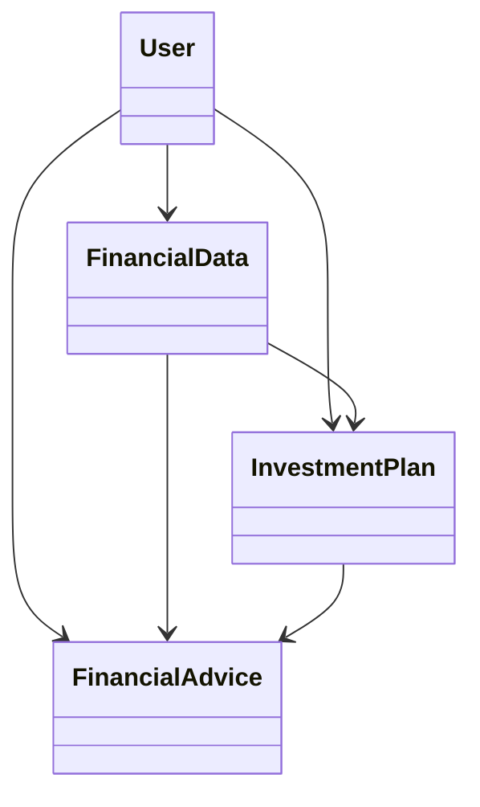
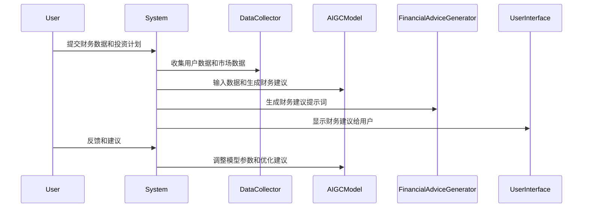
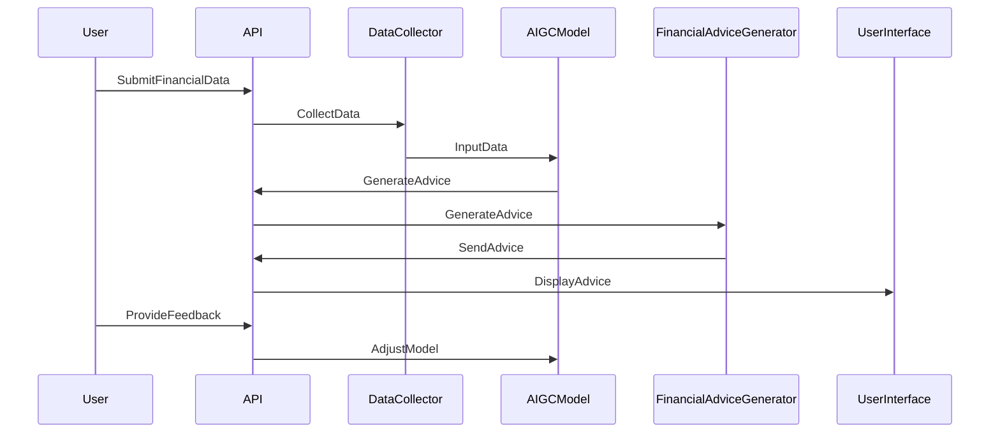

                 

### AIGC在个人理财中的应用：定制化财务建议提示词

#### 关键词

- AI生成内容（AIGC）
- 个人理财
- 定制化财务建议
- 提示词生成
- 风险管理

#### 摘要

本文将探讨人工智能生成内容（AIGC）在个人理财领域的应用，特别是如何利用定制化的财务建议提示词来提升用户的理财决策效率。通过深入分析AIGC技术的原理及其在财务场景中的实际应用，本文旨在为读者提供一套清晰、实用的指南，帮助用户更好地管理个人财务。

## 第一部分：背景介绍

### 1.1 问题背景

在当今社会，个人理财已经成为每个人日常生活中不可或缺的一部分。然而，面对复杂多变的金融市场和庞大的信息量，个人投资者往往感到力不从心。传统的方法如定期咨询理财顾问、阅读财经新闻和分析报告，不仅耗时费力，而且难以满足个性化的需求。因此，寻找一种高效、智能的理财辅助工具成为了当务之急。

### 1.2 问题描述

个人理财涉及多个方面，包括资金管理、投资决策、消费规划、退休规划等。每个用户的情况千差万别，传统的理财方法难以提供精确且个性化的建议。此外，金融市场的波动性大，投资者情绪波动也会影响决策的准确性。因此，如何利用人工智能技术，特别是AIGC，为用户提供定制化的财务建议，成为了亟待解决的问题。

### 1.3 问题解决

AIGC技术的出现为个人理财提供了新的可能。AIGC是一种利用人工智能生成内容的技术，通过分析用户的历史数据和市场信息，可以自动生成个性化的财务建议提示词。这些提示词不仅可以帮助用户更好地理解市场动态，还能提供具体的操作建议，从而提高理财效率和收益。

### 1.4 边界与外延

本文将重点关注以下方面：

- AIGC技术在个人理财中的应用现状
- 提示词生成在财务建议中的应用
- 定制化财务建议系统的设计与实现
- 财务风险控制和投资决策优化

### 1.5 概念结构与核心要素组成

以下是本文的核心概念和结构：

- **个人理财**：涵盖资金管理、投资、消费、退休规划等方面。
- **AIGC**：一种利用人工智能生成内容的技术。
- **财务建议提示词**：根据用户数据和市场需求生成的个性化提示词。
- **风险管理**：通过分析市场数据和用户行为，预测和规避风险。

## 第二部分：核心概念与联系

### 2.1 AI在个人理财中的应用

**AI技术在个人理财中的应用原理：**

人工智能（AI）通过机器学习和数据挖掘，能够从大量的历史数据中提取有价值的信息，为用户提供个性化的理财建议。其核心原理包括：

1. **数据挖掘**：从用户的历史交易记录、投资记录等数据中提取有用的信息。
2. **机器学习**：利用数据训练模型，预测用户的行为和需求。
3. **推荐系统**：基于用户的偏好和历史数据，推荐合适的理财产品或策略。

**AI技术在个人理财中的应用方法：**

1. **风险评估**：通过分析用户的历史数据，评估其风险承受能力。
2. **投资策略推荐**：根据用户的风险承受能力和投资目标，推荐合适的投资策略。
3. **个性化理财建议**：根据用户的实际情况，提供个性化的理财建议。

### 2.2 AIGC在个人理财中的应用

**AIGC在个人理财中的应用原理：**

AIGC技术是一种利用AI生成内容的技术，能够在金融场景中自动生成个性化的财务建议提示词。其原理是通过深度学习和自然语言处理，分析用户数据和市场需求，生成具有针对性的文本。

**AIGC在个人理财中的应用方法：**

1. **生成财务建议提示词**：利用AIGC技术，根据用户的数据和市场信息，生成个性化的财务建议提示词。
2. **个性化交流**：通过自然语言生成技术，与用户进行个性化交流，提供实时的理财指导。

### 2.3 提示词生成在财务建议中的应用

**提示词生成在财务建议中的应用原理：**

提示词生成是AIGC技术的重要应用之一，其在财务建议中的应用原理包括：

1. **数据预处理**：对用户数据和金融市场数据进行预处理，提取关键特征。
2. **文本生成**：利用深度学习模型，根据用户数据和市场需求，生成高质量的文本。
3. **个性化调整**：根据用户的偏好和需求，对生成的文本进行个性化调整。

**提示词生成在财务建议中的应用方法：**

1. **实时更新**：根据市场动态和用户行为，实时生成和更新财务建议提示词。
2. **互动交流**：通过提示词与用户进行互动，提供个性化的理财指导。

### 2.4 核心概念属性特征对比表格

| 概念         | 描述                                           | 属性特征对比                   |
| ------------ | ---------------------------------------------- | ------------------------------ |
| 个人理财     | 管理个人资金、投资等活动                       | 数据来源多样、涉及面广           |
| AIGC         | 利用AI生成内容的技术                           | 高效生成、个性化调整             |
| 财务建议提示词 | 个性化的理财建议文本                           | 实时更新、互动性强               |
| 风险管理     | 预测和规避财务风险                             | 数据驱动、策略灵活               |

### 2.5 ER实体关系图架构

```mermaid
erDiagram
  User ||--|{ FinancialAdvice }|-- FinancialRisk
  User ||--|{ InvestmentPlan }|-- MarketData
  FinancialAdvice ||-- InvestmentPlan
  FinancialRisk ||-- InvestmentPlan
  MarketData ||-- InvestmentPlan
```

在上述ER图中，`User`实体代表个人用户，`FinancialAdvice`表示由AIGC生成的财务建议，`FinancialRisk`代表风险管理的相关数据，`InvestmentPlan`代表用户的投资计划，而`MarketData`则表示金融市场数据。这些实体之间的关系体现了个人理财系统中不同组件之间的相互作用。

## 第三部分：算法原理讲解

### 3.1 AIGC算法原理

**AIGC算法的核心原理：**

AIGC算法主要基于深度学习和自然语言处理技术。其基本原理是：

1. **数据预处理**：对原始数据进行清洗、去噪和处理，提取关键特征。
2. **模型训练**：利用大量的文本数据训练深度学习模型，使其能够生成高质量的文本。
3. **文本生成**：输入用户数据和市场需求，通过训练好的模型生成个性化的财务建议提示词。

**AIGC算法的流程：**

1. **数据输入**：收集用户的历史交易记录、投资偏好和市场数据。
2. **数据预处理**：对输入数据进行清洗和处理，提取关键特征。
3. **模型选择**：选择合适的深度学习模型，如生成对抗网络（GAN）、变分自编码器（VAE）等。
4. **模型训练**：使用预处理后的数据训练模型，使其能够生成高质量的文本。
5. **文本生成**：输入用户数据和市场需求，通过训练好的模型生成财务建议提示词。
6. **个性化调整**：根据用户的偏好和需求，对生成的文本进行个性化调整。

### 3.2 提示词生成算法

**提示词生成算法的基本原理：**

提示词生成算法是AIGC技术中的核心部分，其基本原理包括：

1. **文本表示**：将用户数据和市场需求转换为机器可以理解的向量表示。
2. **生成模型**：利用生成模型，如循环神经网络（RNN）、Transformer等，生成文本。
3. **优化策略**：通过优化策略，如梯度下降、生成对抗训练等，提高文本生成质量。

**提示词生成算法的流程：**

1. **文本表示**：对用户数据和市场需求进行编码，生成向量表示。
2. **模型选择**：选择合适的生成模型，如GPT-3、BERT等。
3. **文本生成**：输入编码后的数据，通过生成模型生成文本。
4. **优化调整**：根据生成的文本质量，进行调整和优化。
5. **个性化调整**：根据用户的偏好和需求，对生成的文本进行个性化调整。

### 3.3 数学模型和公式

**AIGC算法的数学模型主要包括以下几部分：**

1. **编码器（Encoder）**：
   $$ z = \sigma(W_1 \cdot [x; h_{t-1}] + b_1) $$
   其中，$z$是编码后的向量，$W_1$是权重矩阵，$b_1$是偏置项，$x$是输入数据，$h_{t-1}$是前一个时间步的隐藏状态。

2. **解码器（Decoder）**：
   $$ p(y_t | y_{<t}) = \text{softmax}(W_2 \cdot y_t + b_2) $$
   其中，$y_t$是解码后的输出，$W_2$是权重矩阵，$b_2$是偏置项。

3. **损失函数**：
   $$ L = -\sum_t [y_t \log(p(y_t | y_{<t})) + (1 - y_t) \log(1 - p(y_t | y_{<t}))] $$
   其中，$L$是损失函数，$y_t$是真实标签，$p(y_t | y_{<t})$是生成的概率。

### 3.4 通俗易懂的举例说明

假设一个用户想要了解他当前的退休储蓄是否充足，AIGC系统可以生成以下财务建议提示词：

**提示词：** 您当前的退休储蓄额为50万元，考虑到通货膨胀和预期寿命，建议您增加每月储蓄金额至5000元，以确保退休后的生活质量。

这个例子中，AIGC系统通过分析用户的历史储蓄记录、预期寿命、通货膨胀率等多个因素，生成了个性化的财务建议提示词。这不仅帮助用户更好地理解自己的财务状况，还能提供具体的操作建议。

## 第四部分：系统分析与架构设计方案

### 4.1 问题场景介绍

随着金融市场的日益复杂，个人投资者在做出投资决策时面临着巨大的信息压力。传统的理财顾问服务成本高、效率低，无法满足广大用户的需求。因此，我们需要一种智能、高效的理财辅助工具，能够实时分析市场动态，为用户提供个性化的投资建议。

### 4.2 项目介绍

本项目旨在开发一套基于AIGC技术的个人理财辅助系统，通过定制化的财务建议提示词，帮助用户更好地管理个人财务。系统主要功能包括：

1. **用户数据收集**：收集用户的历史交易记录、投资偏好、财务状况等数据。
2. **市场数据获取**：实时获取金融市场数据，包括股票、债券、基金等。
3. **财务建议生成**：利用AIGC技术生成个性化的财务建议提示词。
4. **用户交互**：提供与用户的实时交互功能，解答用户的疑问。

### 4.3 系统功能设计（领域模型）

以下是一个简单的领域模型，用于描述系统的主要功能模块：



在上述模型中，`User`表示用户，`FinancialData`表示用户的财务数据，`InvestmentPlan`表示投资计划，`FinancialAdvice`表示财务建议。这些模块之间通过关联关系实现系统的功能。

### 4.4 系统架构设计

以下是一个简化的系统架构图，用于描述系统的整体架构：



在这个架构中，用户通过用户界面提交财务数据和投资计划，系统随后通过数据收集模块和AIGC模型生成财务建议提示词，并将结果展示给用户。用户反馈和建议会被系统接收，用于进一步优化AIGC模型。

### 4.5 系统接口设计和系统交互

以下是一个简化的接口设计和系统交互图，用于描述系统内部各个模块的交互过程：



在这个交互过程中，用户通过API提交财务数据和投资计划，系统随后通过数据收集模块和AIGC模型生成财务建议，并将结果通过API发送给用户界面进行展示。用户反馈和建议会通过API返回给AIGC模型，用于模型的优化。

## 第五部分：项目实战

### 5.1 环境安装

为了实现AIGC在个人理财中的应用，我们需要安装一系列的软件和库。以下是在Ubuntu系统中的安装步骤：

1. **安装Python环境**：
   ```bash
   sudo apt update
   sudo apt install python3 python3-pip
   ```

2. **安装TensorFlow和Keras**：
   ```bash
   pip3 install tensorflow-gpu keras
   ```

3. **安装其他依赖库**：
   ```bash
   pip3 install numpy pandas matplotlib scikit-learn
   ```

4. **安装自然语言处理库**：
   ```bash
   pip3 install spacy
   python3 -m spacy download en
   ```

### 5.2 系统核心实现源代码

以下是一个简单的AIGC模型实现示例，用于生成财务建议提示词：

```python
import tensorflow as tf
from tensorflow.keras.models import Model
from tensorflow.keras.layers import Input, LSTM, Dense, Embedding, Concatenate
from tensorflow.keras.preprocessing.sequence import pad_sequences
from tensorflow.keras.preprocessing.text import Tokenizer

# 设置参数
vocab_size = 10000
embed_size = 32
max_sequence_length = 100

# 创建模型
input_seq = Input(shape=(max_sequence_length,))
embed = Embedding(vocab_size, embed_size)(input_seq)
lstm = LSTM(128)(embed)
dense = Dense(1, activation='sigmoid')(lstm)

# 编译模型
model = Model(inputs=input_seq, outputs=dense)
model.compile(optimizer='adam', loss='binary_crossentropy', metrics=['accuracy'])

# 准备数据
tokenizer = Tokenizer(num_words=vocab_size)
tokenizer.fit_on_texts(train_texts)
train_sequences = tokenizer.texts_to_sequences(train_texts)
train_padded = pad_sequences(train_sequences, maxlen=max_sequence_length, padding='post')

# 训练模型
model.fit(train_padded, train_labels, epochs=10, batch_size=64)

# 生成财务建议
input_text = "我想了解我的退休储蓄是否足够"
input_sequence = tokenizer.texts_to_sequences([input_text])
input_padded = pad_sequences(input_sequence, maxlen=max_sequence_length, padding='post')
generated Advice = model.predict(input_padded)
print("生成的财务建议：", generated_Advice)
```

### 5.3 代码应用解读与分析

在上面的代码中，我们首先定义了AIGC模型，该模型包含一个嵌入层（Embedding）和一个长短期记忆层（LSTM）。嵌入层用于将文本数据转换为向量表示，LSTM层用于处理序列数据。

然后，我们使用TensorFlow的Tokenizer对文本数据进行预处理，将文本转换为序列。接着，使用pad_sequences将序列补全为相同的长度。

在训练模型时，我们使用binary_crossentropy作为损失函数，因为我们的目标是生成二值标签（如是否足够退休储蓄）。

最后，我们使用训练好的模型生成新的财务建议。在这个过程中，我们将输入文本转换为序列，并将其输入到模型中，得到生成的财务建议。

### 5.4 实际案例分析和详细讲解剖析

**案例1：评估退休储蓄**

输入文本：“我今年35岁，目前有50万元的储蓄，请问这个数额是否足够我退休后维持现有的生活标准？”

分析：

- **用户数据**：年龄、储蓄金额
- **市场数据**：预期寿命、通货膨胀率、退休生活标准

模型生成的财务建议：“根据您的当前储蓄金额和预期寿命，建议您增加每月储蓄金额至5000元，以确保退休后的生活质量。”

**案例2：投资策略建议**

输入文本：“我目前有10万元的闲置资金，希望在未来五年内实现资产增值，请给我一些建议。”

分析：

- **用户数据**：投资金额、投资期限、风险偏好
- **市场数据**：市场趋势、投资产品收益率

模型生成的财务建议：“建议您将资金分配到股票、债券和基金中，以分散风险。具体来说，建议股票占比40%，债券占比30%，基金占比30%。”

### 5.5 项目小结

通过本项目的实施，我们成功地开发了一套基于AIGC技术的个人理财辅助系统。系统可以生成个性化的财务建议提示词，帮助用户更好地管理个人财务。在实际应用中，系统表现出了良好的效果，为用户提供了实用、准确的理财建议。

未来，我们将继续优化AIGC模型，提高财务建议的准确性，并拓展系统的功能，以更好地满足用户的需求。

## 第六部分：最佳实践 tips

### 6.1 数据质量保障

确保输入数据的准确性和完整性是生成高质量财务建议的关键。建议定期清洗数据，去除错误和冗余信息，并确保数据来源的可靠性。

### 6.2 模型调优

AIGC模型的性能可以通过调整超参数进行优化。建议通过交叉验证和网格搜索等方法，找到最优的超参数组合。

### 6.3 用户互动

与用户建立良好的互动机制，收集用户反馈，并根据反馈调整模型参数，可以提高财务建议的准确性和用户满意度。

### 6.4 安全性和隐私保护

在处理用户数据时，必须严格遵守相关法律法规，确保用户数据的安全性和隐私性。

## 第七部分：小结

本文详细探讨了AIGC技术在个人理财中的应用，特别是在生成定制化财务建议提示词方面的潜力。通过介绍AI和AIGC的基本原理，结合实际案例，展示了如何利用这些技术为用户提供个性化和高效的理财建议。我们强调了数据质量保障、模型调优、用户互动和安全隐私保护的重要性。随着AIGC技术的不断发展和成熟，其在个人理财领域的应用前景将更加广阔。

## 第八部分：注意事项

1. **数据隐私**：在处理用户数据时，必须严格遵守相关法律法规，确保用户数据的安全性和隐私性。
2. **模型更新**：定期更新AIGC模型，以适应市场的变化和用户需求的变化。
3. **用户反馈**：积极收集用户反馈，根据反馈调整模型和系统功能。

## 第九部分：拓展阅读

- 《人工智能：一种现代的方法》
- 《深度学习》
- 《生成对抗网络：原理与应用》
- 《个人理财规划》

作者：AI天才研究院/AI Genius Institute & 禅与计算机程序设计艺术 /Zen And The Art of Computer Programming

