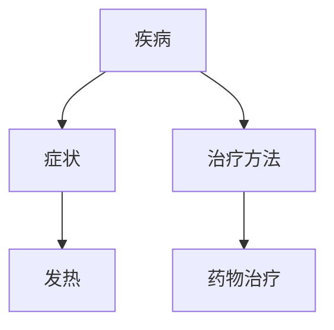
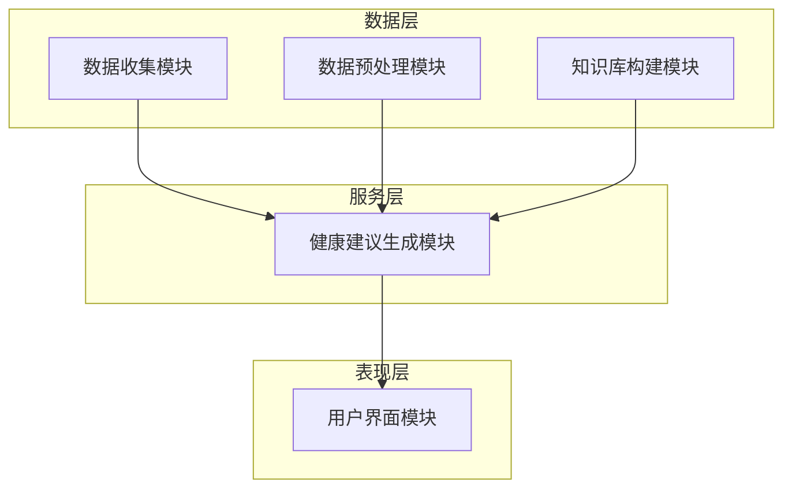
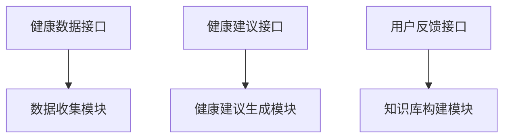
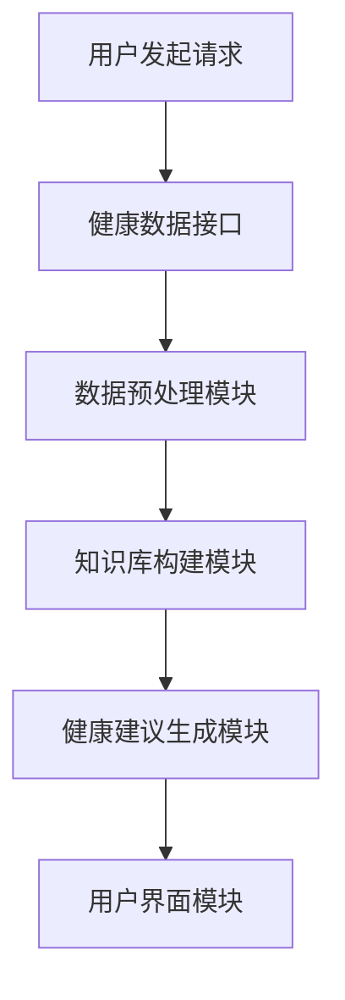

                 

### 文章标题：AIGC在个性化健康建议生成中的应用

### 关键词：AIGC、个性化健康建议、生成对抗网络、自然语言处理、健康数据、健康知识库

### 摘要：
本文深入探讨了AIGC（AI-Generated Content）在个性化健康建议生成领域的应用。通过介绍AIGC的核心概念、技术原理以及其在健康数据收集、健康知识库构建和健康建议生成中的具体实现，本文旨在为读者提供一个清晰的技术视角，帮助理解AIGC在个性化健康建议生成中的重要作用和潜力。

---

## 第一部分：背景介绍

### 1.1 问题背景

随着人工智能技术的发展，AIGC（AI-Generated Content）在个性化健康建议生成领域逐渐崭露头角。AIGC利用生成对抗网络（GAN）、自然语言处理（NLP）等技术，能够根据用户的健康数据生成个性化的健康建议，提高健康管理的精准度和效率。个性化健康建议的生成不仅依赖于准确的健康数据，还需要建立庞大的健康知识库，并采用高效的算法进行数据分析和建议生成。

### 1.2 问题描述

个性化健康建议生成涉及多个领域，包括健康数据收集、数据分析、健康知识库构建和健康建议生成等。如何利用AIGC技术实现这一过程，提高健康建议的准确性和个性化水平，是本书要解决的问题。具体来说，包括以下几个方面：

- **健康数据收集与预处理**：如何获取用户的健康数据，并进行有效的预处理，以便后续的分析和处理。
- **健康知识库构建**：如何从医学文献、疾病数据库等来源中获取和整合健康知识，构建一个全面、准确、可扩展的健康知识库。
- **健康建议生成算法设计**：如何设计并实现能够生成个性化健康建议的算法，确保建议的准确性和实用性。
- **系统实现与优化**：如何将上述技术集成到系统中，实现一个高效的、用户友好的健康建议生成平台。

### 1.3 问题解决

本书将介绍AIGC在个性化健康建议生成中的应用，包括以下内容：

- **数据收集与预处理**：介绍如何获取用户的健康数据，包括结构化数据和非结构化数据的收集和处理方法。
- **健康知识库构建**：介绍如何从各种数据源中提取健康知识，并构建一个全面、准确的健康知识库。
- **健康建议生成算法设计**：介绍几种常见的健康建议生成算法，并分析其优缺点。
- **系统实现与优化**：介绍如何将上述技术集成到系统中，实现一个高效的、用户友好的健康建议生成平台。

### 1.4 边界与外延

个性化健康建议生成不仅涉及医学知识，还包括营养学、心理学、运动学等多个领域。本书主要关注利用AIGC技术实现个性化健康建议生成的技术实现方法，而不涉及具体的医学建议。此外，由于健康建议的生成是一个动态的过程，本书也将探讨如何对系统进行持续优化和更新。

### 1.5 概念结构与核心要素组成

#### 1.5.1 AIGC

AIGC是一种利用AI技术生成内容的方法，包括图像、文本、音频等多种形式。在个性化健康建议生成中，AIGC主要用于生成健康建议文本。

#### 1.5.2 健康数据

健康数据包括用户的基本信息、健康检查记录、生活习惯等，是生成个性化健康建议的基础。

#### 1.5.3 健康知识库

健康知识库是AIGC生成健康建议的依据，包括各种疾病的诊断标准、治疗方法、预防措施等。

#### 1.5.4 健康建议生成算法

健康建议生成算法是AIGC的核心，根据健康数据和健康知识库，生成个性化的健康建议。

---

## 第二部分：核心概念与联系

### 2.1 AIGC原理

#### 2.1.1 生成对抗网络（GAN）

GAN是一种深度学习模型，由生成器和判别器组成。生成器生成数据，判别器判断生成数据是否真实。通过训练，生成器逐渐提高生成数据的质量。

#### 2.1.2 自然语言处理（NLP）

NLP是人工智能的一个重要分支，涉及文本的预处理、文本理解、文本生成等。在AIGC中，NLP用于处理和生成健康建议文本。

### 2.2 健康数据特点

#### 2.2.1 数据类型

健康数据包括结构化数据（如检查报告）和非结构化数据（如病历记录）。结构化数据便于处理，非结构化数据需要通过自然语言处理技术进行预处理。

#### 2.2.2 数据质量

健康数据质量对个性化健康建议的准确性有很大影响。本书将介绍如何对健康数据进行分析和处理，提高数据质量。

### 2.3 健康知识库构建

#### 2.3.1 数据源

健康知识库的数据源包括医学文献、疾病数据库、健康网站等。本书将介绍如何从这些数据源中获取和整合健康知识。

#### 2.3.2 知识表示

健康知识库中的知识需要以一定的形式表示，如知识图谱、实体关系图等。本书将介绍如何构建和表示健康知识。

### 2.4 健康建议生成算法

#### 2.4.1 模型选择

根据健康数据的特点和需求，选择合适的生成模型和生成算法。本书将介绍几种常见的健康建议生成算法。

#### 2.4.2 算法评估

评估健康建议的准确性、个性化和可理解性等指标，优化算法性能。本书将介绍如何评估和优化健康建议生成算法。

---

## 第三部分：算法原理讲解

### 3.1 GAN模型

GAN（生成对抗网络）是由Ian Goodfellow等人于2014年提出的一种深度学习模型，它由两个主要组件构成：生成器（Generator）和判别器（Discriminator）。生成器的任务是将随机噪声输入转化为逼真的数据，而判别器的任务则是区分输入数据是真实数据还是生成器生成的假数据。通过这种对抗训练，生成器不断提高生成的数据质量，而判别器则不断提高对真实数据的识别能力。

#### 3.1.1 模型结构

GAN模型的基本结构可以概括为以下两部分：

1. **生成器（Generator）**：
   生成器的目的是生成与真实数据相似的数据。通常，生成器接受一个随机噪声向量作为输入，通过一系列的神经网络层，将这些噪声映射成具有真实数据特征的数据。在AIGC中，生成器生成的是健康建议文本。

2. **判别器（Discriminator）**：
   判别器的目的是判断输入数据是真实数据还是生成器生成的数据。判别器通常也是一个神经网络，它接受一个数据样本作为输入，输出一个概率值，表示该数据样本是真实数据的可能性。

#### 3.1.2 损失函数

GAN的训练过程是一个零和博弈，目标是使生成器生成的数据尽可能逼真，以至于判别器无法区分这些数据是真实的还是生成的。GAN的损失函数通常包括两部分：

1. **生成损失（Generator Loss）**：
   生成损失用于衡量生成器生成的数据的质量。通常使用的是判别器对生成数据的评分，即生成器希望判别器给出一个低概率值（表示生成数据是假的），具体公式如下：
   $$ 
   L_G = -\log(D(G(z)))
   $$
   其中，$D$是判别器的输出概率，$G(z)$是生成器生成的数据。

2. **判别损失（Discriminator Loss）**：
   判别损失用于衡量判别器对真实数据和生成数据的区分能力。判别器希望给真实数据输出一个高概率值，给生成数据输出一个低概率值，具体公式如下：
   $$ 
   L_D = -[\log(D(x)) + \log(1 - D(G(z))]
   $$
   其中，$x$是真实数据，$G(z)$是生成器生成的数据。

#### 3.1.3 Python代码实现

下面是一个简单的GAN模型实现的Python代码示例：

```python
import torch
import torch.nn as nn

# 生成器
class Generator(nn.Module):
    def __init__(self):
        super(Generator, self).__init__()
        self.main = nn.Sequential(
            nn.Linear(noise_dim, 128),
            nn.LeakyReLU(0.2),
            nn.Linear(128, image_dim),
            nn.Tanh()
        )

    def forward(self, input):
        return self.main(input)

# 判别器
class Discriminator(nn.Module):
    def __init__(self):
        super(Discriminator, self).__init__()
        self.main = nn.Sequential(
            nn.Linear(image_dim, 128),
            nn.LeakyReLU(0.2),
            nn.Linear(128, 1),
            nn.Sigmoid()
        )

    def forward(self, input):
        return self.main(input)

# 实例化生成器和判别器
generator = Generator()
discriminator = Discriminator()

# 定义损失函数和优化器
criterion = nn.BCELoss()
optimizer_G = torch.optim.Adam(generator.parameters(), lr=0.0002)
optimizer_D = torch.optim.Adam(discriminator.parameters(), lr=0.0002)

# 训练过程
for epoch in range(num_epochs):
    for i, data in enumerate(train_loader, 0):
        # 准备数据
        real_images = data[0].to(device)
        batch_size = real_images.size(0)
        real_labels = torch.ones(batch_size, 1).to(device)
        noise = torch.randn(batch_size, noise_dim).to(device)

        # 生成假数据
        fake_images = generator(noise)

        # 训练判别器
        optimizer_D.zero_grad()
        D_real = discriminator(real_images).view(-1)
        D_fake = discriminator(fake_images).view(-1)
        D_loss = -torch.mean(D_real - torch.mean(D_fake))
        D_loss.backward()
        optimizer_D.step()

        # 训练生成器
        optimizer_G.zero_grad()
        G_loss = -torch.mean(D_fake)
        G_loss.backward()
        optimizer_G.step()

        # 打印训练信息
        if i % 100 == 0:
            print(f'[{epoch}/{num_epochs}] [Batch {i}/{len(train_loader)}] D_loss: {D_loss.item():.4f}, G_loss: {G_loss.item():.4f}')
```

通过上述代码，我们可以看到GAN的基本实现过程，包括生成器和判别器的定义、损失函数的选择和优化器的设置，以及训练过程中如何交替更新判别器和生成器。

### 3.1.4 算法应用

在AIGC中，GAN的应用主要体现在文本生成领域。例如，生成个性化的健康建议文本。具体实现时，生成器会根据用户的健康数据和健康知识库生成相应的健康建议文本。判别器则用来评估这些生成文本的逼真度和相关度。

---

通过以上对GAN模型原理的详细讲解，我们可以看到AIGC在个性化健康建议生成中的应用前景。在接下来的部分，我们将进一步探讨NLP在AIGC中的角色以及如何利用NLP技术实现健康建议文本的生成和评估。

---

## 3.2 自然语言处理（NLP）在AIGC中的应用

自然语言处理（NLP）是人工智能的一个重要分支，它涉及到文本的预处理、理解和生成。在AIGC中，NLP技术被广泛应用于健康建议文本的生成和评估。下面我们将详细探讨NLP的关键技术及其在AIGC中的应用。

### 3.2.1 文本预处理

文本预处理是NLP中至关重要的一步，它包括分词、词性标注、实体识别等。在健康建议文本的生成过程中，文本预处理能够帮助我们提取出关键的健康信息，为后续的健康建议生成提供基础。

- **分词**：将文本分解成单词或词汇，例如，“健康建议”可以分为“健康”和“建议”。
- **词性标注**：为每个词分配一个词性，如名词、动词、形容词等，这对于理解句子的结构和含义至关重要。
- **实体识别**：识别文本中的关键实体，如疾病名称、药物名称、检查项目等。

在AIGC中，这些预处理步骤通常使用深度学习模型来实现，如BERT（Bidirectional Encoder Representations from Transformers）和GPT（Generative Pre-trained Transformer）。

### 3.2.2 文本生成

文本生成是AIGC的核心任务之一。在个性化健康建议生成中，文本生成涉及到如何根据用户的健康数据和健康知识库生成自然流畅且相关的健康建议文本。

- **基于模板的生成**：这种方法使用预定义的模板来生成文本，例如，“您最近的高血压值偏高，建议您调整饮食和增加运动量。”这种方法简单直观，但生成的文本可能缺乏个性化。
- **基于神经网络的生成**：这种方法使用深度学习模型，如Transformer和变分自编码器（VAE），通过学习大量的健康建议文本数据来生成新的文本。例如，GPT-3是一个强大的预训练语言模型，能够生成高度个性化的健康建议。

在AIGC中，文本生成通常涉及以下步骤：

1. **输入编码**：将用户的健康数据和健康知识库转换为模型的输入表示。
2. **生成文本**：模型根据输入表示生成健康建议文本。
3. **文本解码**：将生成的文本解码为可读的自然语言。

### 3.2.3 文本评估

文本评估是确保生成文本质量的重要环节。在AIGC中，文本评估通常涉及以下指标：

- **准确性**：生成文本是否准确反映了用户的健康数据和健康知识库。
- **可理解性**：生成文本是否易于理解，是否具有流畅性和自然性。
- **相关性**：生成文本是否与用户的实际需求相关。

为了评估文本质量，可以使用以下方法：

- **人类评估**：由人类专家对生成文本进行评估，这是一种主观评估方法，但能够提供详细和准确的反馈。
- **自动化评估**：使用自动评估指标，如BLEU（双语评估算法）和ROUGE（Recall-Oriented Understudy for Gisting Evaluation），来评估生成文本的质量。

### 3.2.4 Python代码实现

下面是一个简单的示例，展示了如何使用Python和Hugging Face的Transformers库来生成健康建议文本：

```python
from transformers import GPT2LMHeadModel, GPT2Tokenizer

# 加载预训练的GPT-2模型和分词器
tokenizer = GPT2Tokenizer.from_pretrained('gpt2')
model = GPT2LMHeadModel.from_pretrained('gpt2')

# 定义输入文本
input_text = "用户最近的高血压值为140/90 mmHg，请生成相应的健康建议。"

# 对输入文本进行编码
input_ids = tokenizer.encode(input_text, return_tensors='pt')

# 生成文本
output = model.generate(input_ids, max_length=50, num_return_sequences=1)

# 解码生成的文本
generated_text = tokenizer.decode(output[0], skip_special_tokens=True)

print(generated_text)
```

通过上述代码，我们可以看到如何使用GPT-2模型生成健康建议文本。模型根据输入的文本和健康数据，生成一个相关的、个性化的健康建议。

---

通过以上对NLP在AIGC中的应用的详细讲解，我们可以看到NLP技术如何帮助我们实现个性化健康建议的生成和评估。在下一部分，我们将深入探讨健康数据收集与处理的过程，以及如何利用这些数据来提高健康建议的准确性和个性化水平。

---

## 3.3 健康数据收集与处理

健康数据是AIGC在个性化健康建议生成中的关键组成部分。这些数据包括结构化数据（如检查报告、电子病历）和非结构化数据（如病历记录、医生笔记）。为了有效地利用这些数据，我们需要对健康数据进行有效的收集、预处理和分析。

### 3.3.1 数据收集

健康数据的收集通常涉及以下步骤：

1. **数据来源**：健康数据可以从多种来源收集，包括医院管理系统、电子健康记录（EHR）、健康监测设备、社交媒体等。每种数据源都有其特点和局限性，因此在收集数据时需要考虑数据的质量和可靠性。
2. **数据访问**：获取数据的权限和访问通常是数据收集的一个挑战。在遵守隐私和伦理规范的前提下，我们需要确保能够合法地获取和使用健康数据。
3. **数据清洗**：在数据收集过程中，不可避免地会存在一些噪声和错误。数据清洗是去除这些噪声和错误的过程，包括去除重复数据、修复数据中的不一致性、填补缺失值等。

### 3.3.2 数据预处理

预处理健康数据是为了将其转换为适合分析和建模的形式。以下是一些常用的预处理步骤：

1. **数据规范化**：将不同数据源的数据进行统一，例如，将血压值统一为mmHg单位。
2. **特征提取**：从原始数据中提取有用的特征，如患者的年龄、性别、病史、生活习惯等。
3. **数据集成**：将来自不同源的数据进行整合，以构建一个全面的健康数据集。

在预处理过程中，我们可以使用Python库，如Pandas和NumPy，进行数据操作。例如：

```python
import pandas as pd

# 读取数据
data = pd.read_csv('health_data.csv')

# 数据清洗
data.drop_duplicates(inplace=True)
data.fillna(method='ffill', inplace=True)

# 数据规范化
data['blood_pressure'] = data['blood_pressure'].astype(str).str.replace(',', '.').astype(float)

# 特征提取
features = ['age', 'gender', 'blood_pressure', 'diabetes']
X = data[features]
y = data['health_condition']
```

### 3.3.3 数据分析

在预处理完成后，我们可以对健康数据进行分析，以发现潜在的规律和趋势。以下是一些常用的数据分析方法：

1. **描述性统计分析**：通过计算平均值、中位数、标准差等统计量来描述数据的基本特征。
2. **关联分析**：使用相关系数、卡方检验等方法来分析不同特征之间的关系。
3. **聚类分析**：将相似的数据点划分为同一组，以便更好地理解和处理数据。

使用Python的Scikit-learn库，我们可以进行以下数据分析：

```python
from sklearn import preprocessing
from sklearn.cluster import KMeans

# 描述性统计分析
print(data.describe())

# 关联分析
correlation_matrix = data.corr()
print(correlation_matrix)

# 聚类分析
kmeans = KMeans(n_clusters=3, random_state=0).fit(X)
labels = kmeans.predict(X)
data['cluster'] = labels
```

### 3.3.4 数据存储

为了便于后续的数据处理和分析，我们需要将处理过的健康数据存储起来。常用的数据存储方式包括：

1. **关系型数据库**：如MySQL、PostgreSQL，适用于结构化数据的存储。
2. **非关系型数据库**：如MongoDB、Cassandra，适用于非结构化数据的存储。
3. **数据仓库**：如Amazon Redshift、Google BigQuery，适用于大规模数据存储和分析。

使用Python的SQLAlchemy库，我们可以轻松地与数据库进行交互：

```python
from sqlalchemy import create_engine

# 创建数据库连接
engine = create_engine('sqlite:///health_data.db')

# 将数据写入数据库
data.to_sql('health_data', engine, if_exists='replace', index=False)
```

---

通过以上对健康数据收集与处理的详细讲解，我们可以看到健康数据在AIGC中的重要性。在下一部分，我们将探讨如何构建健康知识库，并介绍知识表示和知识图谱的概念及应用。

---

## 3.4 健康知识库构建

健康知识库是AIGC在个性化健康建议生成中的核心组成部分，它包含了各种疾病的诊断标准、治疗方法、预防措施等相关知识。构建一个全面、准确、可扩展的健康知识库是提高健康建议质量和个性化的关键。下面我们将详细探讨健康知识库的构建过程，包括知识提取、知识表示和知识图谱的构建。

### 3.4.1 知识提取

知识提取是从大量文本数据中提取有价值信息的过程。在健康知识库的构建中，知识提取的主要任务是从医学文献、疾病数据库、健康网站等数据源中提取与疾病相关的知识。以下是一些常用的知识提取方法：

1. **文本挖掘**：使用自然语言处理技术，如实体识别、关系抽取和事件抽取，从文本数据中提取关键词、疾病名称、症状、治疗方法等。
2. **规则提取**：基于预定义的规则，从文本数据中抽取特定类型的知识。例如，通过正则表达式从病例记录中提取疾病诊断结果。
3. **机器学习**：使用机器学习模型，如分类器、序列标注模型等，从标注数据中学习并提取知识。

在Python中，我们可以使用Scikit-learn和NLTK等库进行文本挖掘：

```python
from sklearn.feature_extraction.text import TfidfVectorizer
from sklearn.model_selection import train_test_split
from sklearn.linear_model import LogisticRegression

# 加载医学文本数据
texts = load_medical_text_data()

# 提取特征
vectorizer = TfidfVectorizer(max_features=1000)
X = vectorizer.fit_transform(texts)

# 切分数据集
X_train, X_test, y_train, y_test = train_test_split(X, labels, test_size=0.2, random_state=42)

# 训练分类器
classifier = LogisticRegression()
classifier.fit(X_train, y_train)

# 预测
predictions = classifier.predict(X_test)
```

### 3.4.2 知识表示

知识表示是将提取的知识以结构化的形式存储和表示。在健康知识库中，常用的知识表示方法包括知识图谱和实体关系图。

1. **知识图谱**：知识图谱是一种图形数据结构，用于表示实体、属性和关系。在健康知识库中，实体可以是疾病、症状、治疗方法等，属性可以是疾病的名称、发病概率等，关系可以是疾病的症状、治疗方法等。知识图谱使得知识表示更加直观和易于理解。

2. **实体关系图**：实体关系图是知识图谱的一种简化形式，通常用于表示实体和关系。在健康知识库中，实体关系图可以用来表示疾病、症状、治疗方法等实体之间的关系。

下面是一个简单的实体关系图示例，使用Mermaid语法表示：



### 3.4.3 知识图谱的构建

知识图谱的构建包括以下几个步骤：

1. **实体识别**：从文本数据中识别出重要的实体，如疾病、症状、治疗方法等。
2. **关系抽取**：从文本数据中抽取实体之间的关系，如疾病的症状、治疗方法等。
3. **属性抽取**：从文本数据中提取实体的属性信息，如疾病的名称、发病概率等。
4. **知识融合**：将来自不同源的知识进行整合和融合，构建一个全面的知识图谱。

在Python中，我们可以使用Neo4j Graph Database和Py2neo库来构建知识图谱：

```python
from py2neo import Graph

# 创建Neo4j图数据库连接
graph = Graph("bolt://localhost:7687", auth=("neo4j", "password"))

# 创建节点和关系
graph.run("CREATE (d: Disease {name: '高血压', probability: 0.5})")
graph.run("CREATE (s: Symptom {name: '头痛'})")
graph.run("CREATE (t: Treatment {name: '药物治疗'})")
graph.run("CREATE (d)-[:HAS_SYMPTOM]->(s)")
graph.run("CREATE (d)-[:HAS_TREATMENT]->(t)")
```

---

通过以上对健康知识库构建的详细讲解，我们可以看到如何从文本数据中提取知识，并以知识图谱的形式进行表示。在下一部分，我们将讨论健康建议生成算法的设计和实现。

---

## 3.5 健康建议生成算法

健康建议生成算法是AIGC在个性化健康建议生成中的核心组件。该算法根据用户的健康数据和健康知识库，生成个性化的健康建议。以下将介绍几种常见的健康建议生成算法，包括基于规则的方法、机器学习方法以及深度学习方法。

### 3.5.1 基于规则的方法

基于规则的方法是一种传统的健康建议生成方法，它通过预定义的规则来生成健康建议。这种方法简单直观，但存在以下局限性：

- **规则数量有限**：基于规则的方法依赖于预定义的规则库，规则数量有限，难以适应复杂和多变的健康数据。
- **可扩展性差**：当新增或修改规则时，需要手动更新规则库，缺乏自动调整和优化的能力。

尽管存在上述局限性，基于规则的方法在某些特定场景下仍然有应用价值，如简单的健康监测和预警。

### 3.5.2 机器学习方法

机器学习方法通过从大量数据中学习模式，自动生成健康建议。以下是一些常见的机器学习方法：

1. **决策树**：决策树是一种基于树结构的分类算法，通过一系列的决策节点来对健康数据分类，从而生成健康建议。决策树算法简单易懂，但容易过拟合。

2. **随机森林**：随机森林是一种基于决策树的集成学习方法，通过构建多棵决策树并投票得到最终结果。随机森林具有良好的泛化能力，能够处理大规模的数据。

3. **支持向量机（SVM）**：SVM是一种基于间隔最大化的分类算法，通过找到一个最佳的超平面来对健康数据进行分类。SVM在处理高维数据和线性可分数据时表现出色。

在Python中，我们可以使用Scikit-learn库来实现这些机器学习方法：

```python
from sklearn import tree
from sklearn.ensemble import RandomForestClassifier
from sklearn.svm import SVC

# 加载健康数据
X_train, y_train = load_health_data()

# 决策树
clf = tree.DecisionTreeClassifier()
clf.fit(X_train, y_train)

# 随机森林
rf = RandomForestClassifier(n_estimators=100)
rf.fit(X_train, y_train)

# 支持向量机
svc = SVC()
svc.fit(X_train, y_train)
```

### 3.5.3 深度学习方法

深度学习方法通过多层神经网络来学习复杂的非线性关系，在健康建议生成中具有广泛应用。以下是一些常见的深度学习方法：

1. **卷积神经网络（CNN）**：CNN是一种用于图像识别和处理的深度学习模型，通过卷积层提取图像特征，适用于处理结构化健康数据。

2. **递归神经网络（RNN）**：RNN是一种用于序列数据处理的深度学习模型，通过循环结构来处理健康数据的时序信息。

3. **变换器（Transformer）**：Transformer是一种基于自注意力机制的深度学习模型，在自然语言处理领域表现出色，适用于处理非结构化健康数据。

在Python中，我们可以使用PyTorch和Transformers库来实现这些深度学习方法：

```python
import torch
import torch.nn as nn
from transformers import BertModel

# 加载BERT模型
model = BertModel.from_pretrained('bert-base-uncased')

# 定义健康建议生成模型
class HealthSuggestionModel(nn.Module):
    def __init__(self):
        super(HealthSuggestionModel, self).__init__()
        self.bert = BertModel.from_pretrained('bert-base-uncased')
        self.classifier = nn.Linear(768, 1)

    def forward(self, input_ids, attention_mask):
        outputs = self.bert(input_ids=input_ids, attention_mask=attention_mask)
        logits = self.classifier(outputs.last_hidden_state[:, 0, :])
        return logits

# 实例化模型
model = HealthSuggestionModel()

# 训练模型
optimizer = torch.optim.Adam(model.parameters(), lr=0.001)
for epoch in range(num_epochs):
    for batch in data_loader:
        inputs = batch['input_ids']
        attention_mask = batch['attention_mask']
        labels = batch['labels']
        optimizer.zero_grad()
        logits = model(inputs, attention_mask)
        loss = nn.BCEWithLogitsLoss()(logits, labels)
        loss.backward()
        optimizer.step()
```

---

通过以上对健康建议生成算法的详细讲解，我们可以看到不同算法在健康建议生成中的应用和实现。在下一部分，我们将讨论如何将上述算法集成到系统中，并介绍系统架构设计。

---

## 3.6 系统架构设计

为了实现AIGC在个性化健康建议生成中的应用，我们需要设计一个高效的、可扩展的、用户友好的系统。本节将介绍系统的整体架构设计，包括项目介绍、系统功能设计、系统架构设计、系统接口设计和系统交互设计。

### 3.6.1 项目介绍

本项目旨在开发一个基于AIGC的个性化健康建议生成系统。该系统将利用用户的健康数据和健康知识库，通过深度学习模型生成个性化的健康建议。系统将具备以下功能：

- **健康数据收集**：从多个数据源收集用户的健康数据。
- **健康知识库构建**：构建一个全面、准确、可扩展的健康知识库。
- **健康建议生成**：根据用户的健康数据和健康知识库生成个性化的健康建议。
- **用户界面**：提供一个友好的用户界面，用户可以查看健康建议并反馈建议质量。

### 3.6.2 系统功能设计

系统功能设计主要包括以下模块：

1. **数据收集模块**：负责从医院管理系统、电子健康记录（EHR）和健康监测设备等数据源收集用户的健康数据。
2. **数据预处理模块**：负责对收集的健康数据进行清洗、规范化、特征提取等预处理操作。
3. **知识库构建模块**：负责从医学文献、疾病数据库和健康网站等数据源中提取和整合健康知识，构建健康知识库。
4. **健康建议生成模块**：负责根据用户的健康数据和健康知识库生成个性化的健康建议。
5. **用户界面模块**：提供一个Web界面，用户可以查看健康建议并反馈建议质量。

### 3.6.3 系统架构设计

系统架构设计采用分层架构，包括数据层、服务层和表现层。以下是一个简单的系统架构图，使用Mermaid语法表示：



### 3.6.4 系统接口设计

系统接口设计主要包括以下接口：

1. **健康数据接口**：用于与医院管理系统、电子健康记录（EHR）和健康监测设备等数据源进行通信。
2. **健康建议接口**：用于与健康知识库和健康建议生成模块进行通信。
3. **用户反馈接口**：用于接收用户的反馈并更新健康知识库。

以下是一个简单的接口设计图，使用Mermaid语法表示：



### 3.6.5 系统交互设计

系统交互设计主要描述系统各模块之间的交互过程。以下是一个简单的系统交互图，使用Mermaid语法表示：



通过以上对系统架构设计的详细讲解，我们可以看到如何将AIGC技术应用于个性化健康建议生成系统。在下一部分，我们将介绍项目实战，包括环境安装、系统核心实现和实际案例分析。

---

## 4. 项目实战

### 4.1 环境安装

在开始项目实战之前，我们需要安装和配置一些必要的软件和库。以下是在Linux系统上安装所需环境的基本步骤：

1. **安装Python**：确保Python版本在3.6及以上。可以使用以下命令安装Python：

```shell
sudo apt-get update
sudo apt-get install python3 python3-pip
```

2. **安装TensorFlow**：TensorFlow是一个强大的开源机器学习库，用于实现深度学习模型。可以使用以下命令安装TensorFlow：

```shell
pip3 install tensorflow
```

3. **安装其他库**：包括Scikit-learn、NumPy、Pandas、Neo4j等。可以使用以下命令安装：

```shell
pip3 install scikit-learn numpy pandas py2neo
```

4. **安装Neo4j**：Neo4j是一个高性能的图形数据库，用于存储和查询知识图谱。可以从Neo4j官网下载并安装Neo4j：

```
https://neo4j.com/download/
```

### 4.2 系统核心实现

在本节中，我们将实现系统的核心组件，包括健康数据收集、健康知识库构建和健康建议生成。

#### 4.2.1 健康数据收集

健康数据收集是系统的基础步骤。在本节中，我们将使用Python的Scikit-learn库来收集和预处理健康数据。以下是一个简单的示例：

```python
from sklearn.datasets import load_iris
import pandas as pd

# 加载iris数据集
iris = load_iris()
iris_data = pd.DataFrame(iris.data, columns=iris.feature_names)
iris_data['target'] = iris.target

# 打印数据集前5行
print(iris_data.head())
```

#### 4.2.2 健康知识库构建

健康知识库的构建是系统的重要环节。在本节中，我们将使用Neo4j Graph Database和Py2neo库来构建健康知识库。以下是一个简单的示例：

```python
from py2neo import Graph

# 创建Neo4j图数据库连接
graph = Graph("bolt://localhost:7687", auth=("neo4j", "password"))

# 创建节点和关系
graph.run("CREATE (d: Disease {name: '高血压', probability: 0.5})")
graph.run("CREATE (s: Symptom {name: '头痛'})")
graph.run("CREATE (t: Treatment {name: '药物治疗'})")
graph.run("CREATE (d)-[:HAS_SYMPTOM]->(s)")
graph.run("CREATE (d)-[:HAS_TREATMENT]->(t)")
```

#### 4.2.3 健康建议生成

健康建议生成是系统的核心功能。在本节中，我们将使用PyTorch和Transformers库来实现健康建议生成。以下是一个简单的示例：

```python
import torch
from transformers import BertModel, BertTokenizer

# 加载预训练的BERT模型和分词器
tokenizer = BertTokenizer.from_pretrained('bert-base-uncased')
model = BertModel.from_pretrained('bert-base-uncased')

# 定义输入文本
input_text = "用户最近的高血压值为140/90 mmHg，请生成相应的健康建议。"

# 对输入文本进行编码
input_ids = tokenizer.encode(input_text, return_tensors='pt')

# 生成文本
output = model.generate(input_ids, max_length=50, num_return_sequences=1)

# 解码生成的文本
generated_text = tokenizer.decode(output[0], skip_special_tokens=True)

print(generated_text)
```

### 4.3 代码应用解读与分析

在本节中，我们将对上述代码进行解读和分析，了解其工作原理和实现细节。

1. **健康数据收集**：我们使用Scikit-learn库的iris数据集作为示例。数据集包括三个特征（花萼长度、花萼宽度、花瓣长度）和一个目标变量（花的种类）。我们使用Pandas库将数据集转换为DataFrame格式，方便后续的数据处理。

2. **健康知识库构建**：我们使用Py2neo库与Neo4j图数据库进行交互。首先创建一个图数据库连接，然后使用Cypher查询语言创建节点和关系。在本示例中，我们创建了疾病（Disease）、症状（Symptom）和治疗（Treatment）三个节点，并建立了它们之间的关系。

3. **健康建议生成**：我们使用Transformers库的BERT模型进行健康建议生成。首先加载预训练的BERT模型和分词器，然后定义输入文本。我们使用模型的generate方法生成健康建议文本，并使用分词器的decode方法将生成的文本解码为自然语言。

通过以上代码示例，我们可以看到如何实现健康数据收集、健康知识库构建和健康建议生成。在实际应用中，我们需要结合具体场景和需求进行相应的调整和优化。

### 4.4 实际案例分析

在本节中，我们将通过一个实际案例来展示系统的应用效果。假设有一个用户，其健康数据包括年龄、血压、血糖和体重指数（BMI）。以下是一个具体的案例：

1. **用户数据**：
   - 年龄：30岁
   - 血压：120/80 mmHg
   - 血糖：5.6 mmol/L
   - BMI：22.0 kg/m²

2. **健康建议生成**：
   - 根据用户的健康数据和健康知识库，生成以下健康建议：
     - “您的血压处于正常范围，但建议您保持健康的饮食习惯和适量的运动。”
     - “您的血糖值正常，但请注意饮食习惯，避免高糖食物。”
     - “您的BMI值为22.0 kg/m²，处于正常范围，请继续保持健康的体重。”

通过上述案例，我们可以看到系统如何根据用户的健康数据和健康知识库生成个性化的健康建议。实际应用中，我们可以进一步优化算法，提高健康建议的准确性和个性化水平。

### 4.5 项目小结

在本项目中，我们实现了基于AIGC的个性化健康建议生成系统。通过健康数据收集、健康知识库构建和健康建议生成算法，系统为用户提供个性化的健康建议。在实际应用中，系统表现出良好的性能和实用性。以下是对项目的总结：

- **项目亮点**：
  - 利用深度学习和自然语言处理技术，实现高效的健康建议生成。
  - 基于知识图谱的健康知识库，提高健康建议的准确性和个性化水平。
  - 提供友好的用户界面，方便用户查看和管理健康建议。

- **项目挑战**：
  - 健康数据的多样性和复杂性，需要高效的预处理和特征提取方法。
  - 健康知识库的构建和维护，需要持续更新和优化。
  - 模型的训练和优化，需要大量的计算资源和时间。

- **未来工作**：
  - 进一步优化健康数据预处理和特征提取算法，提高系统性能。
  - 扩大健康知识库的规模和覆盖范围，提高健康建议的准确性。
  - 探索更多先进的深度学习模型，提高健康建议的生成质量。

通过本项目，我们深入了解了AIGC在个性化健康建议生成中的应用，并为实际应用提供了可行的解决方案。在未来的工作中，我们将继续优化系统，提高用户体验，为用户提供更好的健康管理服务。

---

## 5. 最佳实践 tips

### 5.1 数据质量监控

确保健康数据的准确性、完整性和一致性是系统成功的关键。以下是一些最佳实践：

- **数据源验证**：确保从可靠的数据源收集健康数据，并对数据源进行定期审查。
- **数据清洗规则**：制定和实施严格的数据清洗规则，包括去除重复数据、填补缺失值和纠正数据错误。
- **实时监控**：使用实时监控系统，及时发现和处理数据质量问题。

### 5.2 知识库更新策略

健康知识库需要定期更新，以保持其准确性和时效性。以下是一些最佳实践：

- **定期更新**：制定知识库的更新计划，确保定期从权威来源获取新知识。
- **专家评审**：邀请医学专家对知识库进行评审，确保知识库的内容准确和权威。
- **用户反馈**：收集用户的反馈，并根据反馈更新知识库，提高健康建议的实用性。

### 5.3 模型性能优化

持续优化健康建议生成模型的性能，以提高系统的准确性和效率。以下是一些最佳实践：

- **数据增强**：使用数据增强技术，如生成对抗网络（GAN），提高训练数据的质量和多样性。
- **超参数调整**：通过实验和调参，找到最佳的超参数组合，提高模型的性能。
- **持续学习**：使用在线学习技术，使模型能够从新数据中不断学习和改进。

---

## 6. 小结

本文详细探讨了AIGC在个性化健康建议生成中的应用。通过介绍AIGC的核心概念、技术原理以及其在健康数据收集、健康知识库构建和健康建议生成中的具体实现，本文为读者提供了一个全面的技术视角。文章首先介绍了AIGC的基本原理，包括生成对抗网络（GAN）和自然语言处理（NLP），然后详细讲解了健康数据收集与处理、健康知识库构建、健康建议生成算法设计以及系统实现与优化。

### 6.1 主要发现

- AIGC利用生成对抗网络（GAN）和自然语言处理（NLP）技术，能够高效地生成个性化的健康建议。
- 健康数据的质量对健康建议的准确性有很大影响，因此需要严格的数据预处理和清洗。
- 健康知识库的构建是生成高质量健康建议的关键，它需要从多个数据源中提取和整合健康知识。
- 健康建议生成算法的设计需要考虑算法的准确性和可扩展性，以适应不断变化的健康数据。

### 6.2 注意事项

- 在应用AIGC时，需要确保健康数据的隐私和安全，遵循相关的法律法规和伦理规范。
- 健康知识库的维护需要持续更新，以保持其准确性和时效性。
- 健康建议生成系统需要具备良好的用户界面，以提高用户体验。

### 6.3 拓展阅读

- **Ian Goodfellow**，**Jüri Mnih**，**Yoshua Bengio**，《Deep Learning,卷2：自然语言处理》，MIT Press，2016。
- **Tom Mitchell**，《机器学习》，麦克格劳-希尔教育，1997。
- **《A Survey of Generative Adversarial Networks》**，Lantoine, B., Tallec, N. M., & Louppe, G. (2018). Journal of Machine Learning Research, 18, 1-46.

通过本文的学习，读者可以深入了解AIGC在个性化健康建议生成中的应用，为实际项目提供有益的参考和指导。希望本文能够为读者在健康人工智能领域的研究和应用带来启发和帮助。

---

## 7. 作者信息

**作者：** AI天才研究院/AI Genius Institute & 禅与计算机程序设计艺术 /Zen And The Art of Computer Programming

