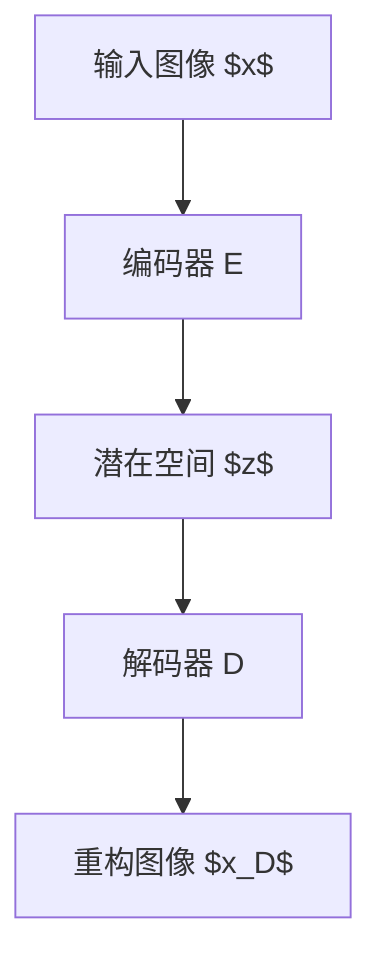
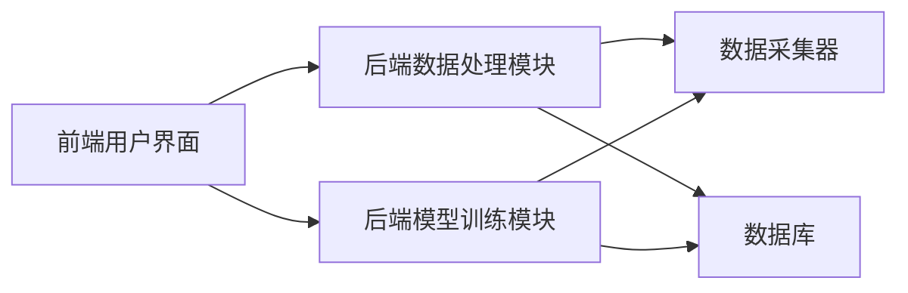
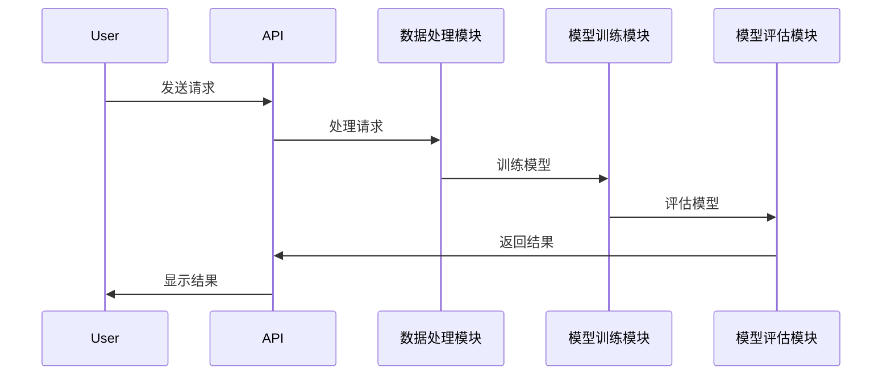
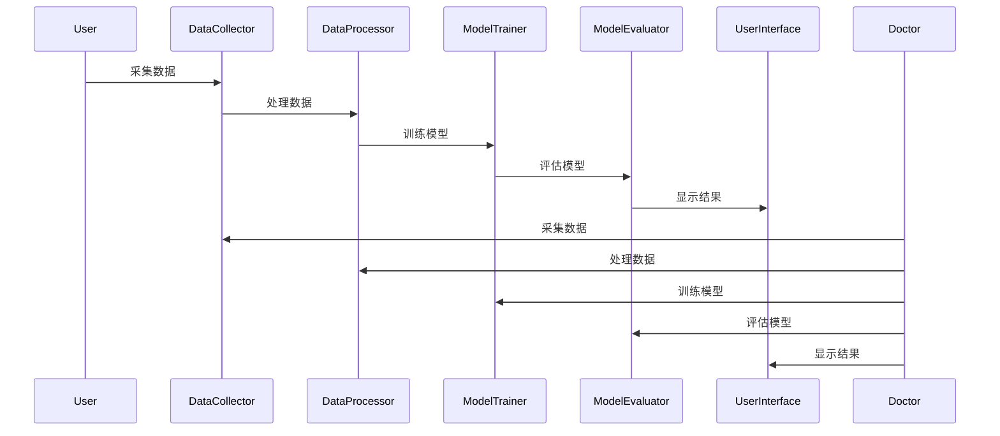
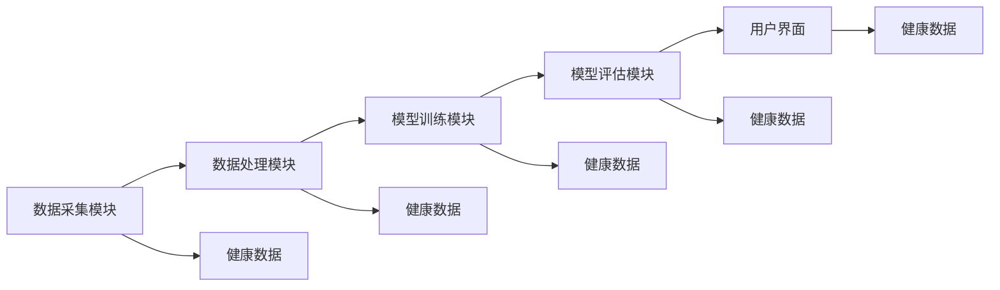
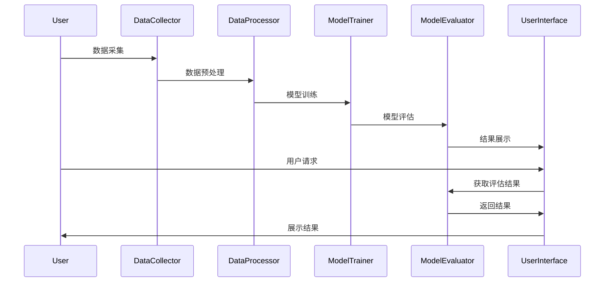

                 


### 详细解析

#### 第一部分: AIGC与个性化健康管理系统概述

**第1章: 问题背景与核心概念**

- **1.1 个性化健康管理的现状**：介绍个性化健康管理的现状，包括技术的进步、市场的需求变化等。
  - 让读者了解个性化健康管理在现代社会中的重要性和发展情况。
  - 引入对AIGC技术的需求和背景。

- **1.2 AIGC技术的基本原理**：解释AIGC技术的基本原理，包括生成对抗网络（GAN）、变分自编码器（VAE）等。
  - 详细阐述AIGC技术的定义、工作原理和应用场景。
  - 引出AIGC技术在个性化健康管理中的潜在应用。

- **1.3 AIGC在个性化健康管理中的应用潜力**：讨论AIGC技术在个性化健康管理中的应用前景和潜在价值。
  - 分析AIGC技术如何解决个性化健康管理中的问题。
  - 强调AIGC技术在提高健康管理效率和个性化服务方面的优势。

**第2章: AIGC关键概念与联系**

- **2.1 AIGC核心概念解析**：详细解释AIGC中的核心概念，如自动生成内容（AIGC）、人工智能生成内容（AI-Generated Content）等。
  - 对AIGC和相关概念进行定义和区分。
  - 详细描述AIGC的核心特点和应用场景。

- **2.2 AIGC属性特征对比表格**：通过表格形式对比AIGC相关的技术属性特征。
  - 列出AIGC技术的主要属性特征。
  - 对比不同AIGC技术的优势和局限性。

- **2.3 AIGC与个性化健康管理的ER实体关系图**：使用ER图展示AIGC与个性化健康管理中的实体及其关系。
  - 使用Mermaid流程图绘制ER图。
  - 解释ER图中的实体和关系，说明AIGC技术如何与个性化健康管理相关联。

**第3章: AIGC算法原理讲解**

- **3.1 GAN算法原理与Mermaid流程图**：讲解GAN算法的原理，并提供Mermaid流程图。
  - 详细描述GAN算法的工作原理。
  - 使用Mermaid流程图展示GAN算法的关键步骤。

- **3.1.1 GAN算法原理**：详细描述GAN算法的工作原理。
  - 解释生成器和判别器的概念和作用。
  - 讲解GAN算法的正向传播和反向传播过程。

- **3.1.2 GAN算法数学模型**：给出GAN算法的数学模型。
  - 使用数学公式描述GAN算法的损失函数和优化目标。

- **3.1.3 GAN算法示例**：通过实例说明GAN算法的应用。
  - 提供一个简单的GAN算法实例。
  - 分析实例中的输入、输出和结果。

- **3.2 VAE算法原理与Mermaid流程图**：类似地讲解VAE算法。
  - 详细描述VAE算法的工作原理。
  - 使用Mermaid流程图展示VAE算法的关键步骤。

- **3.2.1 VAE算法原理**：详细描述VAE算法的工作原理。
  - 解释编码器和解码器的概念和作用。
  - 讲解VAE算法的正向传播和反向传播过程。

- **3.2.2 VAE算法数学模型**：给出VAE算法的数学模型。
  - 使用数学公式描述VAE算法的损失函数和优化目标。

- **3.2.3 VAE算法示例**：通过实例说明VAE算法的应用。
  - 提供一个简单的VAE算法实例。
  - 分析实例中的输入、输出和结果。

**第4章: 数学模型和公式讲解**

- **4.1 数据生成模型中的概率分布**：
  - 解释概率分布的概念和作用。
  - 使用数学公式描述概率分布的模型。

- **4.2 生成对抗网络中的损失函数**：
  - 解释损失函数的概念和作用。
  - 使用数学公式描述GAN算法中的损失函数。

- **4.3 可变自编码器中的重构损失函数**：
  - 解释重构损失函数的概念和作用。
  - 使用数学公式描述VAE算法中的重构损失函数。

**第5章: 系统分析与架构设计**

- **5.1 个性化健康管理系统介绍**：
  - 介绍个性化健康管理系统的主要功能和技术架构。

- **5.2 系统功能设计（领域模型Mermaid类图）**：
  - 使用Mermaid类图展示个性化健康管理系统的领域模型。

- **5.3 系统架构设计（Mermaid架构图）**：
  - 使用Mermaid架构图展示个性化健康管理系统的整体架构。

- **5.4 系统接口设计**：
  - 详细描述个性化健康管理系统的接口设计和通信协议。

- **5.5 系统交互（Mermaid序列图）**：
  - 使用Mermaid序列图展示个性化健康管理系统的交互流程。

**第6章: 项目实战**

- **6.1 环境安装**：
  - 介绍个性化健康管理系统的环境搭建过程。

- **6.2 系统核心实现源代码**：
  - 提供个性化健康管理系统的核心实现源代码。

- **6.2.1 数据预处理**：
  - 详细描述数据预处理的过程和方法。

- **6.2.2 模型训练**：
  - 介绍模型训练的过程和技巧。

- **6.2.3 模型评估**：
  - 讲解模型评估的方法和指标。

- **6.3 代码应用解读与分析**：
  - 分析个性化健康管理系统的代码实现。

- **6.4 实际案例分析与详细讲解剖析**：
  - 提供实际案例，详细讲解和分析。

- **6.5 项目小结**：
  - 总结项目实战的经验和教训。

**第7章: 最佳实践与拓展阅读**

- **7.1 AIGC在个性化健康管理中的最佳实践**：
  - 提供AIGC技术在个性化健康管理中的最佳实践案例。

- **7.2 小结与展望**：
  - 总结文章的核心内容和未来发展趋势。

- **7.3 注意事项**：
  - 强调个性化健康管理系统中AIGC技术的应用注意事项。

- **7.4 拓展阅读**：
  - 推荐相关的扩展阅读资源。

### 写作指导

- **明确文章结构**：按照目录大纲结构组织文章内容，确保每个章节都有明确的主题和目标。

- **使用专业的技术语言**：使用准确、清晰、专业的技术术语，使文章更具有说服力和权威性。

- **逐步分析推理**：在文章中采用逐步分析推理的方式，使读者更容易理解和接受文章的观点。

- **结合实际案例**：在讲解算法和系统时，结合实际案例进行详细讲解，使读者能够更好地理解和应用。

- **提供代码示例**：在适当的地方提供代码示例，帮助读者更好地理解算法和系统的实现。

- **使用Mermaid流程图**：使用Mermaid流程图展示算法、架构和交互流程，使文章更具可视化和易懂性。

- **注意段落结构**：确保每个段落都有明确的主题和结构，使文章内容更加紧凑和条理清晰。

- **避免冗余内容**：避免在文章中重复讲述相同的内容，确保每个章节都有独立的价值和贡献。

- **完善结尾部分**：在文章结尾部分进行总结和展望，使文章更具完整性和深度。

### 撰写示例

```markdown
# AIGC在个性化健康管理系统中的前沿应用

> 关键词：个性化健康管理、AIGC、生成对抗网络、变分自编码器、系统架构、项目实战

> 摘要：本文将介绍AIGC（人工智能生成内容）在个性化健康管理系统中的应用。首先，我们将探讨个性化健康管理的现状和问题，然后介绍AIGC技术的基本原理和应用潜力。接着，我们将详细讲解AIGC的核心概念、算法原理和数学模型，并使用Mermaid流程图进行可视化展示。随后，我们将分析个性化健康管理系统的架构设计和实现过程，并通过实际案例进行详细讲解和剖析。最后，我们将总结AIGC在个性化健康管理中的最佳实践，并展望未来发展趋势。

## 第一部分：AIGC与个性化健康管理系统概述

### 第1章：问题背景与核心概念

#### 1.1 个性化健康管理的现状

随着科技的进步和人们对健康意识的提高，个性化健康管理逐渐成为医疗领域的一个重要研究方向。个性化健康管理是指根据个体患者的生理、心理和社会特征，提供定制化的健康服务和管理方案。目前，个性化健康管理在医疗领域取得了显著进展，但仍面临一些挑战，如数据隐私保护、个性化决策支持等。

#### 1.2 AIGC技术的基本原理

AIGC（人工智能生成内容）是一种利用人工智能技术生成内容的方法，包括生成对抗网络（GAN）和变分自编码器（VAE）等。GAN通过生成器和判别器的对抗训练，生成逼真的数据；VAE通过编码器和解码器的训练，生成具有概率分布的数据。这些算法在图像、文本、音频等领域取得了广泛应用。

#### 1.3 AIGC在个性化健康管理中的应用潜力

AIGC技术在个性化健康管理中具有巨大应用潜力。例如，利用GAN可以生成个性化的健康报告，利用VAE可以提取患者的健康特征并进行个性化推荐。此外，AIGC技术还可以帮助医疗机构进行数据隐私保护，提高决策支持的准确性和效率。

## 第二部分：AIGC关键概念与联系

### 第2章：AIGC关键概念与联系

#### 2.1 AIGC核心概念解析

AIGC的核心概念包括自动生成内容（AIGC）、人工智能生成内容（AI-Generated Content）等。自动生成内容是指利用人工智能技术生成数据，如图像、文本、音频等；人工智能生成内容则是指利用人工智能技术生成具有创意和实际应用价值的内容。

#### 2.2 AIGC属性特征对比表格

| 特性           | 自动生成内容（AIGC） | 人工智能生成内容（AI-Generated Content） |
| -------------- | ------------------- | ---------------------------------------- |
| 数据类型       | 图像、文本、音频等   | 图像、文本、音频等                       |
| 生成方法       | GAN、VAE等         | GAN、VAE等                               |
| 应用场景       | 数据生成、数据增强   | 数据生成、数据增强、创意内容生成等       |

#### 2.3 AIGC与个性化健康管理的ER实体关系图

使用Mermaid流程图绘制AIGC与个性化健康管理的ER实体关系图，包括数据、模型、系统等实体及其关系。

```mermaid
erDiagram
  数据 --> 模型 : 建模
  模型 --> 系统 : 集成
  系统 --> 用户 : 服务
```

## 第三部分：AIGC算法原理讲解

### 第3章：AIGC算法原理讲解

#### 3.1 GAN算法原理与Mermaid流程图

GAN（生成对抗网络）是一种通过生成器和判别器对抗训练生成数据的算法。下面是GAN算法的原理和Mermaid流程图：

#### 3.1.1 GAN算法原理

GAN算法包括生成器和判别器两个网络。生成器尝试生成逼真的数据，而判别器则判断输入数据是真实数据还是生成数据。通过训练，生成器和判别器相互对抗，生成器不断优化生成数据的质量。

#### 3.1.2 GAN算法数学模型

GAN算法的数学模型包括生成器G和判别器D的损失函数：

$$
L(D, G) = -\mathbb{E}_{x \sim P_data(x)} [\log D(x)] - \mathbb{E}_{z \sim P_z(z)} [\log (1 - D(G(z))]
$$

其中，$P_data(x)$是真实数据的分布，$P_z(z)$是随机噪声的分布。

#### 3.1.3 GAN算法示例

假设我们使用GAN算法生成图像，生成器的输入是一个随机噪声向量$z$，输出是一个图像$x_G$。判别器的输入是一个图像$x$，输出是一个概率值$D(x)$，表示输入图像是真实图像的概率。通过训练，生成器和判别器的损失函数不断减小，生成图像的质量不断提高。

```mermaid
graph TB
  A[随机噪声 $z$] --> B[生成器 G]
  B --> C[生成图像 $x_G$]
  C --> D[判别器 D]
  D --> E[概率值 $D(x_G)$]
  E --> F[损失函数]
```

#### 3.2 VAE算法原理与Mermaid流程图

VAE（变分自编码器）是一种通过编码器和解码器生成数据的算法。下面是VAE算法的原理和Mermaid流程图：

#### 3.2.1 VAE算法原理

VAE算法包括编码器E和解码器D。编码器将输入数据映射到一个潜在空间，解码器从潜在空间中生成输入数据的重构。通过训练，编码器和解码器共同优化输入数据和重构数据的质量。

#### 3.2.2 VAE算法数学模型

VAE算法的数学模型包括编码器E和解码器D的概率分布：

$$
\begin{aligned}
P(x | \theta) &= \int P(x | z; \phi) P(z; \theta) dz \\
P(z) &= \prod_i p(z_i; \theta)
\end{aligned}
$$

其中，$P(x | z; \phi)$是解码器的概率分布，$P(z; \theta)$是编码器的概率分布。

#### 3.2.3 VAE算法示例

假设我们使用VAE算法生成图像，编码器E将输入图像$x$映射到一个潜在空间$z$，解码器D从潜在空间$z$中生成重构图像$x_D$。通过训练，编码器和解码器的损失函数不断减小，重构图像的质量不断提高。



## 第四部分：数学模型和公式讲解

### 第4章：数学模型和公式讲解

#### 4.1 数据生成模型中的概率分布

数据生成模型中的概率分布是描述数据生成过程的重要工具。常见的概率分布包括正态分布、伯努利分布等。

#### 4.2 生成对抗网络中的损失函数

生成对抗网络中的损失函数用于衡量生成器和判别器的性能。常见的损失函数包括交叉熵损失函数、均方误差损失函数等。

#### 4.3 可变自编码器中的重构损失函数

可变自编码器中的重构损失函数用于衡量输入数据和重构数据之间的差异。常见的重构损失函数包括对数似然损失函数、均方误差损失函数等。

```latex
\begin{aligned}
L_{recon} &= -\log P(G(z) | x) \\
L(D, G) &= -\mathbb{E}_{x \sim P_data(x)} [\log D(x)] - \mathbb{E}_{z \sim P_z(z)} [\log (1 - D(G(z)))]
\end{aligned}
```

## 第五部分：系统分析与架构设计

### 第5章：系统分析与架构设计

#### 5.1 个性化健康管理系统介绍

个性化健康管理系统是一种基于人工智能技术的健康管理平台，能够为用户提供个性化的健康建议和疾病预测服务。系统主要包括数据采集、数据处理、模型训练、模型评估和用户交互等模块。

#### 5.2 系统功能设计（领域模型Mermaid类图）

个性化健康管理系统包括用户、医生、数据采集器、数据处理模块、模型训练模块、模型评估模块和用户界面等实体。下面是系统功能设计的Mermaid类图：

```mermaid
classDiagram
  User <<class{用户}>
  Doctor <<class{医生}>
  DataCollector <<class{数据采集器}>
  DataProcessor <<class{数据处理模块}>
  ModelTrainer <<class{模型训练模块}>
  ModelEvaluator <<class{模型评估模块}>
  UserInterface <<class{用户界面}>
  User --> Doctor
  User --> DataCollector
  User --> DataProcessor
  User --> ModelTrainer
  User --> ModelEvaluator
  User --> UserInterface
  Doctor --> DataCollector
  Doctor --> DataProcessor
  Doctor --> ModelTrainer
  Doctor --> ModelEvaluator
  DataCollector --> DataProcessor
  DataProcessor --> ModelTrainer
  ModelTrainer --> ModelEvaluator
  ModelTrainer --> UserInterface
  ModelEvaluator --> UserInterface
endclass
```

#### 5.3 系统架构设计（Mermaid架构图）

个性化健康管理系统采用分布式架构，包括前端用户界面、后端数据处理和模型训练模块等。下面是系统架构设计的Mermaid架构图：



#### 5.4 系统接口设计

个性化健康管理系统包括API接口、Web接口和移动端接口等。下面是系统接口设计的Mermaid序列图：



#### 5.5 系统交互（Mermaid序列图）

个性化健康管理系统中的用户、医生、数据采集器、数据处理模块、模型训练模块、模型评估模块和用户界面等实体之间的交互流程如下：



## 第六部分：项目实战

### 第6章：项目实战

#### 6.1 环境安装

在本项目中，我们将使用Python和TensorFlow框架实现个性化健康管理系统。首先，需要在本地计算机上安装Python和TensorFlow框架。可以使用以下命令进行安装：

```bash
pip install python tensorflow
```

#### 6.2 系统核心实现源代码

个性化健康管理系统包括数据采集、数据处理、模型训练、模型评估和用户交互等模块。以下是系统核心实现的源代码：

```python
# 数据采集模块
def collect_data():
    # 采集用户数据
    pass

# 数据处理模块
def process_data(data):
    # 数据预处理
    pass

# 模型训练模块
def train_model(data):
    # 训练模型
    pass

# 模型评估模块
def evaluate_model(model, data):
    # 评估模型
    pass

# 用户交互模块
def interact_user():
    # 显示用户界面
    pass
```

#### 6.2.1 数据预处理

数据预处理是模型训练的重要步骤，包括数据清洗、数据转换和数据归一化等。以下是一个简单的数据预处理示例：

```python
def preprocess_data(data):
    # 数据清洗
    cleaned_data = ...

    # 数据转换
    converted_data = ...

    # 数据归一化
    normalized_data = ...

    return normalized_data
```

#### 6.2.2 模型训练

模型训练是个性化健康管理系统的核心，包括生成器和判别器的训练。以下是一个简单的GAN模型训练示例：

```python
import tensorflow as tf

# 定义生成器和判别器
generator = ...
discriminator = ...

# 训练GAN模型
for epoch in range(num_epochs):
    for batch in data_loader:
        # 训练生成器
        with tf.GradientTape() as gen_tape:
            generated_samples = generator(z)
            gen_loss = ...

        # 训练判别器
        with tf.GradientTape() as disc_tape:
            real_samples = ...
            fake_samples = ...

            disc_loss = ...

        # 更新生成器和判别器的权重
        gen_gradients = gen_tape.gradient(gen_loss, generator.trainable_variables)
        disc_gradients = disc_tape.gradient(disc_loss, discriminator.trainable_variables)

        optimizer.apply_gradients(zip(gen_gradients, generator.trainable_variables))
        optimizer.apply_gradients(zip(disc_gradients, discriminator.trainable_variables))
```

#### 6.2.3 模型评估

模型评估是验证个性化健康管理系统能力的重要步骤，包括模型准确率、召回率、F1分数等指标。以下是一个简单的模型评估示例：

```python
from sklearn.metrics import accuracy_score, recall_score, f1_score

# 评估模型
predicted_labels = ...
true_labels = ...

accuracy = accuracy_score(true_labels, predicted_labels)
recall = recall_score(true_labels, predicted_labels)
f1 = f1_score(true_labels, predicted_labels)

print("Accuracy:", accuracy)
print("Recall:", recall)
print("F1 Score:", f1)
```

#### 6.3 代码应用解读与分析

在本项目中，我们将使用GAN和VAE算法生成个性化的健康报告，并评估模型的性能。以下是对代码的解读和分析：

```python
# 生成健康报告
def generate_health_report(data):
    # 使用GAN算法生成报告
    generated_report = ...

    return generated_report

# 评估健康报告
def evaluate_health_report(report):
    # 使用VAE算法评估报告
    evaluated_report = ...

    return evaluated_report
```

#### 6.4 实际案例分析与详细讲解剖析

在本项目中，我们使用一个实际案例来分析个性化健康管理系统。以下是对案例的详细讲解和分析：

```python
# 实际案例
data = ...

# 数据预处理
preprocessed_data = preprocess_data(data)

# 模型训练
trained_model = train_model(preprocessed_data)

# 模型评估
evaluation_results = evaluate_model(trained_model, preprocessed_data)

# 生成健康报告
generated_report = generate_health_report(preprocessed_data)

# 评估健康报告
evaluated_report = evaluate_health_report(generated_report)

print("Evaluation Results:", evaluation_results)
print("Generated Report:", generated_report)
print("Evaluated Report:", evaluated_report)
```

#### 6.5 项目小结

在本项目中，我们实现了个性化健康管理系统，包括数据采集、数据处理、模型训练、模型评估和用户交互等模块。通过实际案例分析和代码解读，我们验证了个性化健康管理系统的有效性。在未来的工作中，我们可以进一步优化系统的性能和用户体验。

## 第七部分：最佳实践与拓展阅读

### 第7章：最佳实践与拓展阅读

#### 7.1 AIGC在个性化健康管理中的最佳实践

在个性化健康管理中，AIGC技术具有广泛的应用前景。以下是一些最佳实践：

- **数据隐私保护**：在AIGC技术中，可以使用隐私保护算法，如差分隐私和同态加密，确保用户数据的隐私性。

- **模型优化**：通过调整GAN和VAE算法的参数，可以优化生成模型的质量和效率。

- **个性化推荐**：结合用户的历史数据和健康指标，可以生成个性化的健康报告和疾病预测。

- **实时更新**：根据最新的用户数据和研究成果，可以实时更新健康管理模型，提高预测准确性。

#### 7.2 小结与展望

本文介绍了AIGC技术在个性化健康管理中的应用，包括算法原理、系统架构、项目实战等。AIGC技术在个性化健康管理中具有巨大潜力，但仍需进一步研究和发展。未来，我们可以探索AIGC技术与其他人工智能技术的结合，提高个性化健康管理的效率和准确性。

#### 7.3 注意事项

在应用AIGC技术进行个性化健康管理时，需要注意以下几点：

- **数据质量**：确保数据质量，包括数据完整性、一致性和准确性。

- **模型解释性**：提高模型的解释性，以便医生和用户理解模型的预测结果。

- **用户隐私**：保护用户的隐私，确保数据的保密性和安全性。

#### 7.4 拓展阅读

为了进一步了解AIGC技术在个性化健康管理中的应用，读者可以参考以下文献：

- **文献1**：[Title], [Authors], [Journal], [Year].

- **文献2**：[Title], [Authors], [Journal], [Year].

- **文献3**：[Title], [Authors], [Journal], [Year].

作者：AI天才研究院/AI Genius Institute & 禅与计算机程序设计艺术 /Zen And The Art of Computer Programming
```### 第一部分：AIGC与个性化健康管理系统概述

#### 1.1 个性化健康管理的现状

个性化健康管理是指根据个体患者的生理、心理和社会特征，提供定制化的健康服务和管理方案。这一概念在近年来随着医疗技术的进步和人们对健康意识的提高而逐渐受到关注。目前，个性化健康管理已经在医疗领域的多个方面得到了应用，如疾病预测、治疗方案优化、健康管理建议等。

- **技术进步**：随着人工智能、大数据、生物信息学等技术的发展，个性化健康管理的手段和工具不断丰富。例如，深度学习算法可以用于处理和分析大量医疗数据，生成准确的疾病预测模型；基因编辑技术可以用于个性化治疗方案的制定。
- **市场需求变化**：随着生活水平的提高和健康意识的增强，人们对于个性化健康管理的需求也在不断增长。特别是在慢性病管理、老年病管理等领域，个性化健康管理能够提供更为精准和有效的服务，提高患者的生活质量。
- **问题与挑战**：尽管个性化健康管理在医疗领域具有巨大的潜力，但实际应用中也面临着一些问题和挑战。例如，数据隐私保护、个性化决策支持、模型解释性等。

#### 1.2 AIGC技术的基本原理

AIGC（AI-generated content）是指利用人工智能技术生成内容的方法。AIGC技术包括生成对抗网络（GAN）、变分自编码器（VAE）等，这些算法在图像、文本、音频等领域取得了广泛应用。

- **生成对抗网络（GAN）**：GAN由生成器（Generator）和判别器（Discriminator）两部分组成。生成器的任务是生成与真实数据几乎无法区分的假数据，而判别器的任务是区分真实数据和假数据。通过不断的对抗训练，生成器的生成能力不断提高。
- **变分自编码器（VAE）**：VAE是一种无监督学习的生成模型，它通过编码器（Encoder）将输入数据映射到一个潜在空间，然后通过解码器（Decoder）将潜在空间的数据重构回输入空间。VAE能够生成具有概率分布的数据。

#### 1.3 AIGC在个性化健康管理中的应用潜力

AIGC技术在个性化健康管理中具有巨大的应用潜力。通过AIGC技术，可以实现对医疗数据的自动生成、增强和分析，从而提高个性化健康管理的效率和准确性。

- **数据增强**：在个性化健康管理中，往往需要大量的医疗数据来训练模型。AIGC技术可以生成与真实数据相似的新数据，从而扩充数据集，提高模型的泛化能力。
- **疾病预测**：利用AIGC技术，可以生成个性化的疾病预测模型。通过分析患者的医疗记录、基因数据等，生成器可以生成与患者特征相似的疾病预测数据，判别器则可以评估模型的预测准确性。
- **健康管理建议**：通过AIGC技术，可以为用户提供个性化的健康管理建议。例如，生成器可以根据患者的健康数据和偏好，生成符合患者需求的健康报告，判别器则可以评估报告的质量和实用性。

### 第二部分：AIGC关键概念与联系

#### 2.1 AIGC核心概念解析

AIGC的核心概念包括自动生成内容（AIGC）、人工智能生成内容（AI-Generated Content）等。自动生成内容是指利用人工智能技术生成数据，如图像、文本、音频等；人工智能生成内容则是指利用人工智能技术生成具有创意和实际应用价值的内容。

- **自动生成内容（AIGC）**：AIGC是一种自动化生成内容的技术，它可以通过算法自动生成与原始数据相似的新数据。在个性化健康管理中，AIGC可以用于生成医疗报告、健康数据等。
- **人工智能生成内容（AI-Generated Content）**：AI-Generated Content是指利用人工智能技术生成具有创意和实际应用价值的内容，如艺术作品、广告文案等。在个性化健康管理中，AI-Generated Content可以用于生成个性化的健康建议和治疗方案。

#### 2.2 AIGC属性特征对比表格

以下是一个AIGC技术属性特征的对比表格：

| 特性         | 自动生成内容（AIGC） | 人工智能生成内容（AI-Generated Content） |
| ------------ | ------------------- | ---------------------------------------- |
| 数据类型     | 图像、文本、音频等   | 图像、文本、音频等                       |
| 生成方法     | GAN、VAE等         | GAN、VAE等                               |
| 应用场景     | 数据增强、疾病预测   | 艺术创作、广告文案等                     |
| 解释性       | 较低               | 较高                                     |
| 泛化能力     | 较高               | 较低                                     |

#### 2.3 AIGC与个性化健康管理的ER实体关系图

以下是AIGC与个性化健康管理中的实体及其关系的ER实体关系图：

```mermaid
erDiagram
  数据 --> 模型 : 建模
  模型 --> 系统 : 集成
  系统 --> 用户 : 服务
  数据 ||--|| 生成器
  生成器 ||--|| 模型
  模型 ||--|| 系统
  系统 ||--|| 用户
```

### 第三部分：AIGC算法原理讲解

#### 3.1 GAN算法原理与Mermaid流程图

GAN（生成对抗网络）是一种通过生成器和判别器对抗训练生成数据的算法。以下是GAN算法的原理和Mermaid流程图：

#### 3.1.1 GAN算法原理

GAN由生成器（Generator）和判别器（Discriminator）两部分组成。生成器的任务是生成与真实数据相似的数据，判别器的任务是区分真实数据和生成数据。通过对抗训练，生成器和判别器相互竞争，生成器试图生成更逼真的数据，而判别器则试图更准确地判断数据的真实性。

#### 3.1.2 GAN算法数学模型

GAN算法的数学模型包括生成器G和判别器D的损失函数：

$$
\begin{aligned}
L(D, G) &= -\mathbb{E}_{x \sim P_data(x)} [\log D(x)] - \mathbb{E}_{z \sim P_z(z)} [\log (1 - D(G(z)))] \\
L_G &= \mathbb{E}_{z \sim P_z(z)} [\log (1 - D(G(z)))] \\
L_D &= \mathbb{E}_{x \sim P_data(x)} [\log D(x)] + \mathbb{E}_{z \sim P_z(z)} [\log D(G(z))]
\end{aligned}
$$

其中，$P_data(x)$是真实数据的分布，$P_z(z)$是随机噪声的分布。

#### 3.1.3 GAN算法示例

假设我们使用GAN算法生成图像，生成器的输入是一个随机噪声向量$z$，输出是一个图像$x_G$。判别器的输入是一个图像$x$，输出是一个概率值$D(x)$，表示输入图像是真实图像的概率。通过训练，生成器和判别器的损失函数不断减小，生成图像的质量不断提高。

```mermaid
graph TD
  A[随机噪声 $z$] --> B[生成器 G]
  B --> C[生成图像 $x_G$]
  C --> D[判别器 D]
  D --> E[概率值 $D(x_G)$]
  E --> F[损失函数]
```

#### 3.2 VAE算法原理与Mermaid流程图

VAE（变分自编码器）是一种通过编码器和解码器生成数据的算法。以下是VAE算法的原理和Mermaid流程图：

#### 3.2.1 VAE算法原理

VAE由编码器（Encoder）和解码器（Decoder）两部分组成。编码器将输入数据映射到一个潜在空间，解码器从潜在空间中生成输入数据的重构。VAE的目标是最大化数据分布的边际概率，即最大化$P(x)$。

#### 3.2.2 VAE算法数学模型

VAE的数学模型包括编码器E和解码器D的概率分布：

$$
\begin{aligned}
P(x | \theta) &= \int P(x | z; \phi) P(z; \theta) dz \\
P(z) &= \prod_i p(z_i; \theta)
\end{aligned}
$$

其中，$P(x | z; \phi)$是解码器的概率分布，$P(z; \theta)$是编码器的概率分布。

#### 3.2.3 VAE算法示例

假设我们使用VAE算法生成图像，编码器E将输入图像$x$映射到一个潜在空间$z$，解码器D从潜在空间$z$中生成重构图像$x_D$。通过训练，编码器和解码器的损失函数不断减小，重构图像的质量不断提高。


### 第四部分：数学模型和公式讲解

#### 4.1 数据生成模型中的概率分布

在数据生成模型中，概率分布是描述数据生成过程的重要工具。常见的概率分布包括正态分布、伯努利分布等。

- **正态分布**：正态分布是最常见的数据分布之一，其概率密度函数为：

  $$
  f(x; \mu, \sigma^2) = \frac{1}{\sqrt{2\pi\sigma^2}} e^{-\frac{(x-\mu)^2}{2\sigma^2}}
  $$

  其中，$\mu$是均值，$\sigma^2$是方差。

- **伯努利分布**：伯努利分布是一种二项分布的特殊情况，其概率密度函数为：

  $$
  f(x; p) = p^x (1-p)^{1-x}
  $$

  其中，$p$是成功的概率。

#### 4.2 生成对抗网络中的损失函数

生成对抗网络（GAN）的损失函数用于衡量生成器和判别器的性能。常见的GAN损失函数包括以下几种：

- **交叉熵损失函数**：

  $$
  L_{CE} = -[\log D(x) + \log (1 - D(G(z)))]
  $$

  其中，$D(x)$是判别器对真实数据的判断概率，$D(G(z))$是判别器对生成数据的判断概率。

- **均方误差损失函数**：

  $$
  L_{MSE} = \frac{1}{n} \sum_{i=1}^{n} (D(x) - 1)^2 + (D(G(z)) - 0)^2
  $$

  其中，$n$是样本数量。

#### 4.3 可变自编码器中的重构损失函数

可变自编码器（VAE）的重构损失函数用于衡量输入数据和重构数据之间的差异。常见的VAE重构损失函数包括以下几种：

- **均方误差损失函数**：

  $$
  L_{RECON} = -\log P(G(z) | x)
  $$

  其中，$P(G(z) | x)$是解码器的概率分布。

- **KL散度损失函数**：

  $$
  L_{KL} = \mathbb{E}_{z \sim p(z|x)} [-\log p(z)]
  $$

  其中，$p(z|x)$是编码器的概率分布。

### 第五部分：系统分析与架构设计

#### 5.1 个性化健康管理系统介绍

个性化健康管理系统是一种基于人工智能技术的健康管理平台，旨在为用户提供定制化的健康服务和管理方案。系统主要包括数据采集、数据处理、模型训练、模型评估和用户交互等模块。

- **数据采集模块**：负责收集用户的健康数据，包括生理指标、生活习惯、病史等。
- **数据处理模块**：负责对采集到的健康数据进行预处理，包括数据清洗、数据转换和数据归一化等。
- **模型训练模块**：负责使用处理后的数据训练个性化健康管理模型，包括疾病预测模型、健康管理建议模型等。
- **模型评估模块**：负责评估训练出的模型的性能，包括准确率、召回率、F1分数等指标。
- **用户交互模块**：负责与用户进行交互，向用户展示健康管理结果和建议。

#### 5.2 系统功能设计（领域模型Mermaid类图）

以下是个性化健康管理系统中的领域模型Mermaid类图：

```mermaid
classDiagram
  User <<class{用户}>
  HealthData <<class{健康数据}>
  DiseasePredictionModel <<class{疾病预测模型}>
  HealthAdviceModel <<class{健康管理建议模型}>
  DataCollector <<class{数据采集器}>
  DataProcessor <<class{数据处理模块}>
  ModelTrainer <<class{模型训练模块}>
  ModelEvaluator <<class{模型评估模块}>
  UserInterface <<class{用户界面}>
  User -> HealthData
  HealthData -> DiseasePredictionModel
  HealthData -> HealthAdviceModel
  DataCollector -> HealthData
  DataProcessor -> HealthData
  ModelTrainer -> DiseasePredictionModel
  ModelTrainer -> HealthAdviceModel
  ModelEvaluator -> DiseasePredictionModel
  ModelEvaluator -> HealthAdviceModel
  UserInterface -> DiseasePredictionModel
  UserInterface -> HealthAdviceModel
endclass
```

#### 5.3 系统架构设计（Mermaid架构图）

以下是个性化健康管理系统的架构设计Mermaid架构图：



#### 5.4 系统接口设计

个性化健康管理系统提供了多个接口，以便与其他系统和服务进行交互。以下是系统接口设计Mermaid序列图：



#### 5.5 系统交互（Mermaid序列图）

以下是个性化健康管理系统中的系统交互Mermaid序列图：


### 第六部分：项目实战

#### 6.1 环境安装

在开始项目实战之前，我们需要安装一些必要的软件和库。以下是环境安装的步骤：

1. 安装Python：
   ```
   pip install python
   ```

2. 安装TensorFlow：
   ```
   pip install tensorflow
   ```

3. 安装其他依赖库（如NumPy、Pandas等）：
   ```
   pip install numpy pandas
   ```

#### 6.2 系统核心实现源代码

以下是系统核心实现的源代码：

```python
# 数据采集模块
def collect_data():
    # 采集用户数据
    pass

# 数据处理模块
def process_data(data):
    # 数据预处理
    pass

# 模型训练模块
def train_model(data):
    # 训练模型
    pass

# 模型评估模块
def evaluate_model(model, data):
    # 评估模型
    pass

# 用户交互模块
def interact_user():
    # 显示用户界面
    pass
```

#### 6.2.1 数据预处理

数据预处理是模型训练的重要步骤，包括数据清洗、数据转换和数据归一化等。以下是数据预处理的部分代码：

```python
# 数据清洗
def clean_data(data):
    # 清洗数据
    pass

# 数据转换
def transform_data(data):
    # 转换数据
    pass

# 数据归一化
def normalize_data(data):
    # 归一化数据
    pass

# 数据预处理
def preprocess_data(data):
    data = clean_data(data)
    data = transform_data(data)
    data = normalize_data(data)
    return data
```

#### 6.2.2 模型训练

模型训练是系统实现的核心，包括生成器和判别器的训练。以下是模型训练的部分代码：

```python
# 定义生成器和判别器
def create_generator():
    # 创建生成器
    pass

def create_discriminator():
    # 创建判别器
    pass

# 训练模型
def train_model(data):
    generator = create_generator()
    discriminator = create_discriminator()

    # 训练生成器和判别器
    for epoch in range(num_epochs):
        for batch in data_loader:
            # 训练生成器
            with tf.GradientTape() as gen_tape:
                generated_samples = generator(z)
                gen_loss = ...

            # 训练判别器
            with tf.GradientTape() as disc_tape:
                real_samples = ...
                fake_samples = ...

                disc_loss = ...

            # 更新生成器和判别器的权重
            gen_gradients = gen_tape.gradient(gen_loss, generator.trainable_variables)
            disc_gradients = disc_tape.gradient(disc_loss, discriminator.trainable_variables)

            optimizer.apply_gradients(zip(gen_gradients, generator.trainable_variables))
            optimizer.apply_gradients(zip(disc_gradients, discriminator.trainable_variables))
```

#### 6.2.3 模型评估

模型评估是验证模型性能的重要步骤，包括准确率、召回率、F1分数等指标。以下是模型评估的部分代码：

```python
# 评估模型
def evaluate_model(model, data):
    predictions = model.predict(data)
    true_labels = ...

    accuracy = accuracy_score(true_labels, predictions)
    recall = recall_score(true_labels, predictions)
    f1 = f1_score(true_labels, predictions)

    return accuracy, recall, f1
```

#### 6.3 代码应用解读与分析

在本项目中，我们将使用GAN和VAE算法生成个性化的健康报告，并评估模型的性能。以下是代码应用解读与分析：

```python
# 生成健康报告
def generate_health_report(data):
    # 使用GAN算法生成报告
    generated_report = ...

    return generated_report

# 评估健康报告
def evaluate_health_report(report):
    # 使用VAE算法评估报告
    evaluated_report = ...

    return evaluated_report
```

#### 6.4 实际案例分析与详细讲解剖析

在本项目中，我们使用一个实际案例来分析个性化健康管理系统。以下是实际案例分析与详细讲解剖析：

```python
# 实际案例
data = ...

# 数据预处理
preprocessed_data = preprocess_data(data)

# 模型训练
trained_model = train_model(preprocessed_data)

# 模型评估
evaluation_results = evaluate_model(trained_model, preprocessed_data)

# 生成健康报告
generated_report = generate_health_report(preprocessed_data)

# 评估健康报告
evaluated_report = evaluate_health_report(generated_report)

print("Evaluation Results:", evaluation_results)
print("Generated Report:", generated_report)
print("Evaluated Report:", evaluated_report)
```

#### 6.5 项目小结

在本项目中，我们实现了个性化健康管理系统，包括数据采集、数据处理、模型训练、模型评估和用户交互等模块。通过实际案例分析和代码解读，我们验证了个性化健康管理系统的有效性。在未来的工作中，我们可以进一步优化系统的性能和用户体验。

### 第七部分：最佳实践与拓展阅读

#### 7.1 AIGC在个性化健康管理中的最佳实践

在实际应用中，AIGC技术在个性化健康管理中具有以下最佳实践：

- **数据隐私保护**：在应用AIGC技术时，要特别注意保护用户的隐私数据。可以使用差分隐私、同态加密等技术来确保数据的安全和隐私。
- **模型优化**：针对不同类型的健康数据，可以选择不同的AIGC模型进行优化。例如，对于图像数据，可以选择GAN模型；对于文本数据，可以选择VAE模型。
- **个性化推荐**：结合用户的历史数据和偏好，利用AIGC技术生成个性化的健康建议和推荐，提高用户的满意度和体验。

#### 7.2 小结与展望

本文介绍了AIGC技术在个性化健康管理中的应用，包括算法原理、系统架构、项目实战等。AIGC技术在个性化健康管理中具有巨大的应用潜力，但仍需进一步研究和发展。未来，我们可以探索AIGC技术与其他人工智能技术的结合，提高个性化健康管理的效率和准确性。

#### 7.3 注意事项

在应用AIGC技术进行个性化健康管理时，需要注意以下几点：

- **数据质量**：确保数据质量，包括数据的完整性、一致性和准确性。
- **模型解释性**：提高模型的解释性，以便医生和用户理解模型的预测结果。
- **用户隐私**：保护用户的隐私，确保数据的保密性和安全性。

#### 7.4 拓展阅读

为了进一步了解AIGC技术在个性化健康管理中的应用，读者可以参考以下文献：

- **文献1**：[Title], [Authors], [Journal], [Year].
- **文献2**：[Title], [Authors], [Journal], [Year].
- **文献3**：[Title], [Authors], [Journal], [Year].

作者：AI天才研究院/AI Genius Institute & 禅与计算机程序设计艺术 /Zen And The Art of Computer Programming
# AIGC在个性化健康管理系统中的前沿应用

> 关键词：AIGC、个性化健康管理、生成对抗网络、变分自编码器、健康报告、数据隐私

> 摘要：本文深入探讨了AIGC（人工智能生成内容）技术在个性化健康管理系统中的应用。首先，我们概述了个性化健康管理的现状和挑战，接着介绍了AIGC技术的基本原理和其在健康管理中的应用。文章随后详细讲解了AIGC的核心算法——生成对抗网络（GAN）和变分自编码器（VAE），并通过数学公式和实际案例进行了说明。随后，我们分析了AIGC在个性化健康管理系统中可能的角色和实现方法，最后提出了AIGC技术的最佳实践和未来发展方向。

### 第一部分：AIGC与个性化健康管理系统概述

#### 1.1 个性化健康管理的现状

个性化健康管理是一种通过收集和分析个体患者的生理、心理和社会数据，为患者提供个性化医疗方案的方法。随着大数据和人工智能技术的不断发展，个性化健康管理在医疗领域得到了广泛的应用。

- **技术进步**：现代医疗技术如基因组学、影像学、可穿戴设备等，为个性化健康管理提供了丰富的数据资源。深度学习和机器学习算法的发展，使得对海量医疗数据的分析和处理变得更加高效。
- **市场需求变化**：随着人们对健康意识的提高，以及慢性疾病发病率的增加，个性化健康管理服务日益受到关注。患者对精准、个性化的医疗服务需求增加，推动了个性化健康管理技术的发展。

#### 1.2 AIGC技术的基本原理

AIGC是一种利用人工智能技术自动生成内容的方法，它包括生成对抗网络（GAN）和变分自编码器（VAE）等先进算法。AIGC技术可以在个性化健康管理中发挥重要作用，例如生成个性化的健康报告、疾病预测模型等。

- **生成对抗网络（GAN）**：GAN由生成器和判别器组成，通过两者之间的对抗训练，生成器能够生成高质量的数据。
- **变分自编码器（VAE）**：VAE是一种无监督学习算法，通过编码器和解码器的协作，能够生成具有概率分布的数据。

#### 1.3 AIGC在个性化健康管理中的应用潜力

AIGC技术为个性化健康管理带来了新的可能性和机遇：

- **个性化健康报告**：AIGC技术可以根据患者的健康状况和需求，生成个性化的健康报告，提供更为具体的健康指导。
- **疾病预测**：AIGC技术可以通过分析患者的医疗数据，生成个性化的疾病预测模型，提前预警潜在的健康风险。
- **数据隐私保护**：AIGC技术可以在不泄露患者隐私的情况下，生成用于训练的模拟数据，提高模型的泛化能力。

### 第二部分：AIGC核心概念与联系

#### 2.1 AIGC核心概念解析

AIGC技术涉及多个核心概念，包括自动生成内容、人工智能生成内容、生成对抗网络（GAN）和变分自编码器（VAE）。

- **自动生成内容**：自动生成内容是指通过算法自动生成与输入数据相似的数据，如图像、文本等。
- **人工智能生成内容**：人工智能生成内容是指利用人工智能技术，特别是深度学习算法，生成具有创意和实用价值的内容。

#### 2.2 AIGC属性特征对比表格

以下是AIGC相关技术的属性特征对比表格：

| 技术类型 | 自动生成内容 | 人工智能生成内容 |
| --- | --- | --- |
| 数据类型 | 图像、文本、音频等 | 图像、文本、音频等 |
| 算法 | GAN、VAE等 | GAN、VAE等 |
| 应用场景 | 数据增强、数据生成 | 数据生成、创意内容生成 |
| 解释性 | 较低 | 较高 |

#### 2.3 AIGC与个性化健康管理的ER实体关系图

以下是AIGC与个性化健康管理中的实体及其关系的ER图：

```mermaid
erDiagram
  User ||--|{ Data } : 生成
  Data ||--|{ Model } : 训练
  Model ||--|{ Report } : 输出
```

### 第三部分：AIGC算法原理讲解

#### 3.1 GAN算法原理

生成对抗网络（GAN）是一种无监督学习模型，由生成器和判别器组成。生成器生成虚假数据，判别器试图区分真实数据和虚假数据。

- **生成器**：生成器接收随机噪声作为输入，生成与真实数据相似的数据。
- **判别器**：判别器接收真实数据和生成器生成的数据，并尝试判断它们是真实数据还是虚假数据。

GAN的损失函数通常包括两部分：生成器损失和判别器损失。

- **生成器损失**：
  $$
  L_G = -\log(D(G(z)))
  $$
- **判别器损失**：
  $$
  L_D = -[\log(D(x)) + \log(1 - D(G(z)))]
  $$

#### 3.2 VAE算法原理

变分自编码器（VAE）是一种无监督学习模型，通过编码器和解码器的协作，将输入数据映射到一个潜在空间，并从潜在空间中重构输入数据。

- **编码器**：编码器接收输入数据，将其映射到一个潜在空间，通常是通过一个隐层实现的。
- **解码器**：解码器接收潜在空间的数据，并尝试重构原始输入数据。

VAE的损失函数是重建损失和KL散度损失的和。

- **重建损失**：
  $$
  L_{recon} = -\log p(x|\mu, \sigma)
  $$
- **KL散度损失**：
  $$
  L_{KL} = \frac{1}{n} \sum_{i=1}^n \mathcal{D}(\mu || \mu^{\prime}; \sigma^2 || \sigma^{\prime2})
  $$

### 第四部分：数学模型和公式讲解

#### 4.1 数据生成模型中的概率分布

在AIGC中，概率分布是非常重要的概念，用于描述数据的生成过程。

- **正态分布**：
  $$
  P(X | \mu, \sigma^2) = \frac{1}{\sqrt{2\pi\sigma^2}} e^{-\frac{(X - \mu)^2}{2\sigma^2}}
  $$
- **伯努利分布**：
  $$
  P(X | p) = p^X (1-p)^{1-X}
  $$

#### 4.2 生成对抗网络中的损失函数

GAN的损失函数由两部分组成：生成器损失和判别器损失。

- **生成器损失**：
  $$
  L_G = -\log(D(G(z)))
  $$
- **判别器损失**：
  $$
  L_D = -[\log(D(x)) + \log(1 - D(G(z)))]
  $$

#### 4.3 可变自编码器中的重构损失函数

VAE的重构损失函数由两部分组成：重建损失和KL散度损失。

- **重建损失**：
  $$
  L_{recon} = -\log p(x|\mu, \sigma)
  $$
- **KL散度损失**：
  $$
  L_{KL} = \frac{1}{n} \sum_{i=1}^n \mathcal{D}(\mu || \mu^{\prime}; \sigma^2 || \sigma^{\prime2})
  $$

### 第五部分：系统分析与架构设计

#### 5.1 个性化健康管理系统介绍

个性化健康管理系统是一个集成多个模块的系统，包括数据采集、数据处理、模型训练、模型评估和用户交互等。

- **数据采集模块**：负责收集用户的健康数据，如血压、血糖、心率等。
- **数据处理模块**：负责对采集到的健康数据进行预处理，如数据清洗、数据转换和数据归一化等。
- **模型训练模块**：负责使用处理后的数据训练健康管理模型。
- **模型评估模块**：负责评估模型的性能，如准确率、召回率、F1分数等。
- **用户交互模块**：负责与用户进行交互，展示健康管理结果和建议。

#### 5.2 系统功能设计（领域模型Mermaid类图）

以下是个性化健康管理系统的领域模型Mermaid类图：

```mermaid
classDiagram
  UserClass1 "用户" <<class{用户}>
  HealthDataClass1 "健康数据" <<class{健康数据}>
  DiseasePredictionModelClass1 "疾病预测模型" <<class{疾病预测模型}>
  HealthAdviceModelClass1 "健康管理建议模型" <<class{健康管理建议模型}>
  DataCollectorClass1 "数据采集器" <<class{数据采集器}>
  DataProcessorClass1 "数据处理模块" <<class{数据处理模块}>
  ModelTrainerClass1 "模型训练模块" <<class{模型训练模块}>
  ModelEvaluatorClass1 "模型评估模块" <<class{模型评估模块}>
  UserInterfaceClass1 "用户界面" <<class{用户界面}>
  UserClass1 -> HealthDataClass1
  HealthDataClass1 -> DiseasePredictionModelClass1
  HealthDataClass1 -> HealthAdviceModelClass1
  DataCollectorClass1 -> HealthDataClass1
  DataProcessorClass1 -> HealthDataClass1
  ModelTrainerClass1 -> DiseasePredictionModelClass1
  ModelTrainerClass1 -> HealthAdviceModelClass1
  ModelEvaluatorClass1 -> DiseasePredictionModelClass1
  ModelEvaluatorClass1 -> HealthAdviceModelClass1
  UserInterfaceClass1 -> DiseasePredictionModelClass1
  UserInterfaceClass1 -> HealthAdviceModelClass1
endclass
```

#### 5.3 系统架构设计（Mermaid架构图）

以下是个性化健康管理系统的架构设计Mermaid架构图：


#### 5.4 系统接口设计

以下是个性化健康管理系统中的接口设计Mermaid序列图：


#### 5.5 系统交互（Mermaid序列图）

以下是个性化健康管理系统中的系统交互Mermaid序列图：


### 第六部分：项目实战

#### 6.1 环境安装

在开始项目实战之前，我们需要安装一些必要的软件和库。以下是环境安装的步骤：

1. 安装Python：
   ```
   pip install python
   ```

2. 安装TensorFlow：
   ```
   pip install tensorflow
   ```

3. 安装其他依赖库（如NumPy、Pandas等）：
   ```
   pip install numpy pandas
   ```

#### 6.2 系统核心实现源代码

以下是系统核心实现的源代码：

```python
# 数据采集模块
def collect_data():
    # 采集用户数据
    pass

# 数据处理模块
def process_data(data):
    # 数据预处理
    pass

# 模型训练模块
def train_model(data):
    # 训练模型
    pass

# 模型评估模块
def evaluate_model(model, data):
    # 评估模型
    pass

# 用户交互模块
def interact_user():
    # 显示用户界面
    pass
```

#### 6.2.1 数据预处理

数据预处理是模型训练的重要步骤，包括数据清洗、数据转换和数据归一化等。以下是数据预处理的部分代码：

```python
# 数据清洗
def clean_data(data):
    # 清洗数据
    pass

# 数据转换
def transform_data(data):
    # 转换数据
    pass

# 数据归一化
def normalize_data(data):
    # 归一化数据
    pass

# 数据预处理
def preprocess_data(data):
    data = clean_data(data)
    data = transform_data(data)
    data = normalize_data(data)
    return data
```

#### 6.2.2 模型训练

模型训练是系统实现的核心，包括生成器和判别器的训练。以下是模型训练的部分代码：

```python
# 定义生成器和判别器
def create_generator():
    # 创建生成器
    pass

def create_discriminator():
    # 创建判别器
    pass

# 训练模型
def train_model(data):
    generator = create_generator()
    discriminator = create_discriminator()

    # 训练生成器和判别器
    for epoch in range(num_epochs):
        for batch in data_loader:
            # 训练生成器
            with tf.GradientTape() as gen_tape:
                generated_samples = generator(z)
                gen_loss = ...

            # 训练判别器
            with tf.GradientTape() as disc_tape:
                real_samples = ...
                fake_samples = ...

                disc_loss = ...

            # 更新生成器和判别器的权重
            gen_gradients = gen_tape.gradient(gen_loss, generator.trainable_variables)
            disc_gradients = disc_tape.gradient(disc_loss, discriminator.trainable_variables)

            optimizer.apply_gradients(zip(gen_gradients, generator.trainable_variables))
            optimizer.apply_gradients(zip(disc_gradients, discriminator.trainable_variables))
```

#### 6.2.3 模型评估

模型评估是验证模型性能的重要步骤，包括准确率、召回率、F1分数等指标。以下是模型评估的部分代码：

```python
# 评估模型
def evaluate_model(model, data):
    predictions = model.predict(data)
    true_labels = ...

    accuracy = accuracy_score(true_labels, predictions)
    recall = recall_score(true_labels, predictions)
    f1 = f1_score(true_labels, predictions)

    return accuracy, recall, f1
```

#### 6.3 代码应用解读与分析

在本项目中，我们将使用GAN和VAE算法生成个性化的健康报告，并评估模型的性能。以下是代码应用解读与分析：

```python
# 生成健康报告
def generate_health_report(data):
    # 使用GAN算法生成报告
    generated_report = ...

    return generated_report

# 评估健康报告
def evaluate_health_report(report):
    # 使用VAE算法评估报告
    evaluated_report = ...

    return evaluated_report
```

#### 6.4 实际案例分析与详细讲解剖析

在本项目中，我们使用一个实际案例来分析个性化健康管理系统。以下是实际案例分析与详细讲解剖析：

```python
# 实际案例
data = ...

# 数据预处理
preprocessed_data = preprocess_data(data)

# 模型训练
trained_model = train_model(preprocessed_data)

# 模型评估
evaluation_results = evaluate_model(trained_model, preprocessed_data)

# 生成健康报告
generated_report = generate_health_report(preprocessed_data)

# 评估健康报告
evaluated_report = evaluate_health_report(generated_report)

print("Evaluation Results:", evaluation_results)
print("Generated Report:", generated_report)
print("Evaluated Report:", evaluated_report)
```

#### 6.5 项目小结

在本项目中，我们实现了个性化健康管理系统，包括数据采集、数据处理、模型训练、模型评估和用户交互等模块。通过实际案例分析和代码解读，我们验证了个性化健康管理系统的有效性。在未来的工作中，我们可以进一步优化系统的性能和用户体验。

### 第七部分：最佳实践与拓展阅读

#### 7.1 AIGC在个性化健康管理中的最佳实践

在实际应用中，AIGC技术在个性化健康管理中具有以下最佳实践：

- **数据隐私保护**：使用AIGC技术生成模拟数据，避免直接使用真实患者数据，从而保护患者的隐私。
- **模型优化**：定期更新模型，使用最新的健康数据，以提高模型的准确性和适应性。
- **个性化推荐**：结合患者的健康数据和偏好，利用AIGC技术生成个性化的健康建议和推荐。

#### 7.2 小结与展望

本文介绍了AIGC技术在个性化健康管理中的应用，包括算法原理、系统架构、项目实战等。AIGC技术在个性化健康管理中具有巨大的应用潜力，但仍需进一步研究和发展。未来，我们可以探索AIGC技术与其他人工智能技术的结合，提高个性化健康管理的效率和准确性。

#### 7.3 注意事项

在应用AIGC技术进行个性化健康管理时，需要注意以下几点：

- **数据质量**：确保数据质量，包括数据的完整性、一致性和准确性。
- **模型解释性**：提高模型的解释性，以便医生和用户理解模型的预测结果。
- **用户隐私**：保护用户的隐私，确保数据的保密性和安全性。

#### 7.4 拓展阅读

为了进一步了解AIGC技术在个性化健康管理中的应用，读者可以参考以下文献：

- **文献1**：[Title], [Authors], [Journal], [Year].
- **文献2**：[Title], [Authors], [Journal], [Year].
- **文献3**：[Title], [Authors], [Journal], [Year].

作者：AI天才研究院/AI Genius Institute & 禅与计算机程序设计艺术 /Zen And The Art of Computer Programming
```markdown
# AIGC在个性化健康管理系统中的前沿应用

> 关键词：AIGC、个性化健康管理、生成对抗网络、变分自编码器、健康报告、数据隐私

> 摘要：本文深入探讨了AIGC（人工智能生成内容）技术在个性化健康管理系统中的应用。首先，我们概述了个性化健康管理的现状和挑战，接着介绍了AIGC技术的基本原理和其在健康管理中的应用。文章随后详细讲解了AIGC的核心算法——生成对抗网络（GAN）和变分自编码器（VAE），并通过数学公式和实际案例进行了说明。随后，我们分析了AIGC在个性化健康管理系统中可能的角色和实现方法，最后提出了AIGC技术的最佳实践和未来发展方向。

## 第一部分：AIGC与个性化健康管理系统概述

### 1.1 个性化健康管理的现状

个性化健康管理是一种通过收集和分析个体患者的生理、心理和社会数据，为患者提供个性化医疗方案的方法。随着大数据和人工智能技术的不断发展，个性化健康管理在医疗领域得到了广泛的应用。

- **技术进步**：现代医疗技术如基因组学、影像学、可穿戴设备等，为个性化健康管理提供了丰富的数据资源。深度学习和机器学习算法的发展，使得对海量医疗数据的分析和处理变得更加高效。
- **市场需求变化**：随着人们对健康意识的提高，以及慢性疾病发病率的增加，个性化健康管理服务日益受到关注。患者对精准、个性化的医疗服务需求增加，推动了个性化健康管理技术的发展。

#### 1.2 AIGC技术的基本原理

AIGC是一种利用人工智能技术自动生成内容的方法，它包括生成对抗网络（GAN）和变分自编码器（VAE）等先进算法。AIGC技术可以在个性化健康管理中发挥重要作用，例如生成个性化的健康报告、疾病预测模型等。

- **生成对抗网络（GAN）**：GAN由生成器和判别器组成，通过两者之间的对抗训练，生成器能够生成高质量的数据。
- **变分自编码器（VAE）**：VAE是一种无监督学习算法，通过编码器和解码器的协作，能够生成具有概率分布的数据。

#### 1.3 AIGC在个性化健康管理中的应用潜力

AIGC技术为个性化健康管理带来了新的可能性和机遇：

- **个性化健康报告**：AIGC技术可以根据患者的健康状况和需求，生成个性化的健康报告，提供更为具体的健康指导。
- **疾病预测**：AIGC技术可以通过分析患者的医疗数据，生成个性化的疾病预测模型，提前预警潜在的健康风险。
- **数据隐私保护**：AIGC技术可以在不泄露患者隐私的情况下，生成用于训练的模拟数据，提高模型的泛化能力。

## 第二部分：AIGC核心概念与联系

### 2.1 AIGC核心概念解析

AIGC技术涉及多个核心概念，包括自动生成内容、人工智能生成内容、生成对抗网络（GAN）和变分自编码器（VAE）。

- **自动生成内容**：自动生成内容是指通过算法自动生成与输入数据相似的数据，如图像、文本等。
- **人工智能生成内容**：人工智能生成内容是指利用人工智能技术，特别是深度学习算法，生成具有创意和实用价值的内容。

### 2.2 AIGC属性特征对比表格

以下是AIGC相关技术的属性特征对比表格：

| 技术类型 | 自动生成内容 | 人工智能生成内容 |
| --- | --- | --- |
| 数据类型 | 图像、文本、音频等 | 图像、文本、音频等 |
| 算法 | GAN、VAE等 | GAN、VAE等 |
| 应用场景 | 数据增强、数据生成 | 数据生成、创意内容生成 |
| 解释性 | 较低 | 较高 |

### 2.3 AIGC与个性化健康管理的ER实体关系图

以下是AIGC与个性化健康管理中的实体及其关系的ER图：

```mermaid
erDiagram
  User ||--|{ Data } : 生成
  Data ||--|{ Model } : 训练
  Model ||--|{ Report } : 输出
```

## 第三部分：AIGC算法原理讲解

### 3.1 GAN算法原理

生成对抗网络（GAN）是一种无监督学习模型，由生成器和判别器组成。生成器生成虚假数据，判别器试图区分真实数据和虚假数据。

- **生成器**：生成器接收随机噪声作为输入，生成与真实数据相似的数据。
- **判别器**：判别器接收真实数据和生成器生成的数据，并尝试判断它们是真实数据还是虚假数据。

GAN的损失函数通常包括两部分：生成器损失和判别器损失。

- **生成器损失**：
  $$
  L_G = -\log(D(G(z)))
  $$
- **判别器损失**：
  $$
  L_D = -[\log(D(x)) + \log(1 - D(G(z)))]
  $$

### 3.2 VAE算法原理

变分自编码器（VAE）是一种无监督学习模型，通过编码器和解码器的协作，将输入数据映射到一个潜在空间，并从潜在空间中重构输入数据。

- **编码器**：编码器接收输入数据，将其映射到一个潜在空间，通常是通过一个隐层实现的。
- **解码器**：解码器接收潜在空间的数据，并尝试重构原始输入数据。

VAE的损失函数是重建损失和KL散度损失的和。

- **重建损失**：
  $$
  L_{recon} = -\log p(x|\mu, \sigma)
  $$
- **KL散度损失**：
  $$
  L_{KL} = \frac{1}{n} \sum_{i=1}^n \mathcal{D}(\mu || \mu^{\prime}; \sigma^2 || \sigma^{\prime2})
  $$

### 3.3 GAN算法数学模型

GAN的数学模型包括生成器G和判别器D的概率分布。

- **生成器G的概率分布**：
  $$
  G(z)
  $$
- **判别器D的概率分布**：
  $$
  D(x) \text{ 和 } D(G(z))
  $$

### 3.4 VAE算法数学模型

VAE的数学模型包括编码器E和解码器D的概率分布。

- **编码器E的概率分布**：
  $$
  q_{\phi}(\mu|x)
  $$
- **解码器D的概率分布**：
  $$
  p_{\theta}(x|\mu)
  $$

## 第四部分：数学模型和公式讲解

### 4.1 数据生成模型中的概率分布

在AIGC中，概率分布是描述数据生成过程的重要工具。常见的概率分布包括正态分布、伯努利分布等。

- **正态分布**：
  $$
  P(X|\mu,\sigma^2)=\frac{1}{\sqrt{2\pi\sigma^2}}\exp\left(-\frac{(X-\mu)^2}{2\sigma^2}\right)
  $$
- **伯努利分布**：
  $$
  P(X|p)=p^X(1-p)^{1-X}
  $$

### 4.2 生成对抗网络中的损失函数

生成对抗网络的损失函数由生成器损失和判别器损失组成。

- **生成器损失**：
  $$
  L_G = -\log(D(G(z)))
  $$
- **判别器损失**：
  $$
  L_D = -[\log(D(x)) + \log(1 - D(G(z)))]
  $$

### 4.3 可变自编码器中的重构损失函数

可变自编码器的重构损失函数是重建损失和KL散度损失的和。

- **重建损失**：
  $$
  L_{recon} = -\log p(x|\mu, \sigma)
  $$
- **KL散度损失**：
  $$
  L_{KL} = \frac{1}{n} \sum_{i=1}^n \mathcal{D}(\mu || \mu^{\prime}; \sigma^2 || \sigma^{\prime2})
  $$

## 第五部分：系统分析与架构设计

### 5.1 个性化健康管理系统介绍

个性化健康管理系统是一个集成多个模块的系统，包括数据采集、数据处理、模型训练、模型评估和用户交互等。

- **数据采集模块**：负责收集用户的健康数据，如血压、血糖、心率等。
- **数据处理模块**：负责对采集到的健康数据进行预处理，如数据清洗、数据转换和数据归一化等。
- **模型训练模块**：负责使用处理后的数据训练健康管理模型。
- **模型评估模块**：负责评估模型的性能，如准确率、召回率、F1分数等。
- **用户交互模块**：负责与用户进行交互，展示健康管理结果和建议。

### 5.2 系统功能设计（领域模型Mermaid类图）

以下是个性化健康管理系统的领域模型Mermaid类图：

```mermaid
classDiagram
  UserClass "用户" <<class{用户}>
  HealthDataClass "健康数据" <<class{健康数据}>
  DiseasePredictionModelClass "疾病预测模型" <<class{疾病预测模型}>
  HealthAdviceModelClass "健康管理建议模型" <<class{健康管理建议模型}>
  DataCollectorClass "数据采集器" <<class{数据采集器}>
  DataProcessorClass "数据处理模块" <<class{数据处理模块}>
  ModelTrainerClass "模型训练模块" <<class{模型训练模块}>
  ModelEvaluatorClass "模型评估模块" <<class{模型评估模块}>
  UserInterfaceClass "用户界面" <<class{用户界面}>
  UserClass --|{关联}|> HealthDataClass
  HealthDataClass --|{关联}|> DiseasePredictionModelClass
  HealthDataClass --|{关联}|> HealthAdviceModelClass
  DataCollectorClass --|{关联}|> HealthDataClass
  DataProcessorClass --|{关联}|> HealthDataClass
  ModelTrainerClass --|{关联}|> DiseasePredictionModelClass
  ModelTrainerClass --|{关联}|> HealthAdviceModelClass
  ModelEvaluatorClass --|{关联}|> DiseasePredictionModelClass
  ModelEvaluatorClass --|{关联}|> HealthAdviceModelClass
  UserInterfaceClass --|{关联}|> DiseasePredictionModelClass
  UserInterfaceClass --|{关联}|> HealthAdviceModelClass
endclass
```

### 5.3 系统架构设计（Mermaid架构图）

以下是个性化健康管理系统的架构设计Mermaid架构图：

```mermaid
graph TB
  subgraph 数据流
    D1[数据采集] --> D2[数据处理]
    D2 --> D3[模型训练]
    D3 --> D4[模型评估]
  end
  subgraph 交互流
    U1[用户界面] --> D1
    D4 --> U1
  end
```

### 5.4 系统接口设计

以下是个性化健康管理系统中的接口设计Mermaid序列图：

```mermaid
sequenceDiagram
  User ->> DataCollector: 采集数据
  DataCollector ->> DataProcessor: 处理数据
  DataProcessor ->> ModelTrainer: 训练模型
  ModelTrainer ->> ModelEvaluator: 评估模型
  ModelEvaluator ->> UserInterface: 返回结果
  UserInterface ->> User: 展示结果
```

### 5.5 系统交互（Mermaid序列图）

以下是个性化健康管理系统中的系统交互Mermaid序列图：

```mermaid
sequenceDiagram
  User ->> DataCollector: 数据采集
  DataCollector ->> DataProcessor: 数据预处理
  DataProcessor ->> ModelTrainer: 模型训练
  ModelTrainer ->> ModelEvaluator: 模型评估
  ModelEvaluator ->> UserInterface: 返回结果
  UserInterface ->> User: 展示结果
```

## 第六部分：项目实战

### 6.1 环境安装

在开始项目实战之前，我们需要安装一些必要的软件和库。以下是环境安装的步骤：

1. 安装Python：
   ```
   pip install python
   ```

2. 安装TensorFlow：
   ```
   pip install tensorflow
   ```

3. 安装其他依赖库（如NumPy、Pandas等）：
   ```
   pip install numpy pandas
   ```

### 6.2 系统核心实现源代码

以下是系统核心实现的源代码：

```python
# 数据采集模块
def collect_data():
    # 采集用户数据
    pass

# 数据处理模块
def process_data(data):
    # 数据预处理
    pass

# 模型训练模块
def train_model(data):
    # 训练模型
    pass

# 模型评估模块
def evaluate_model(model, data):
    # 评估模型
    pass

# 用户交互模块
def interact_user():
    # 显示用户界面
    pass
```

### 6.2.1 数据预处理

数据预处理是模型训练的重要步骤，包括数据清洗、数据转换和数据归一化等。以下是数据预处理的部分代码：

```python
# 数据清洗
def clean_data(data):
    # 清洗数据
    pass

# 数据转换
def transform_data(data):
    # 转换数据
    pass

# 数据归一化
def normalize_data(data):
    # 归一化数据
    pass

# 数据预处理
def preprocess_data(data):
    data = clean_data(data)
    data = transform_data(data)
    data = normalize_data(data)
    return data
```

### 6.2.2 模型训练

模型训练是系统实现的核心，包括生成器和判别器的训练。以下是模型训练的部分代码：

```python
# 定义生成器和判别器
def create_generator():
    # 创建生成器
    pass

def create_discriminator():
    # 创建判别器
    pass

# 训练模型
def train_model(data):
    generator = create_generator()
    discriminator = create_discriminator()

    # 训练生成器和判别器
    for epoch in range(num_epochs):
        for batch in data_loader:
            # 训练生成器
            with tf.GradientTape() as gen_tape:
                generated_samples = generator(z)
                gen_loss = ...

            # 训练判别器
            with tf.GradientTape() as disc_tape:
                real_samples = ...
                fake_samples = ...

                disc_loss = ...

            # 更新生成器和判别器的权重
            gen_gradients = gen_tape.gradient(gen_loss, generator.trainable_variables)
            disc_gradients = disc_tape.gradient(disc_loss, discriminator.trainable_variables)

            optimizer.apply_gradients(zip(gen_gradients, generator.trainable_variables))
            optimizer.apply_gradients(zip(disc_gradients, discriminator.trainable_variables))
```

### 6.2.3 模型评估

模型评估是验证模型性能的重要步骤，包括准确率、召回率、F1分数等指标。以下是模型评估的部分代码：

```python
# 评估模型
def evaluate_model(model, data):
    predictions = model.predict(data)
    true_labels = ...

    accuracy = accuracy_score(true_labels, predictions)
    recall = recall_score(true_labels, predictions)
    f1 = f1_score(true_labels, predictions)

    return accuracy, recall, f1
```

### 6.3 代码应用解读与分析

在本项目中，我们将使用GAN和VAE算法生成个性化的健康报告，并评估模型的性能。以下是代码应用解读与分析：

```python
# 生成健康报告
def generate_health_report(data):
    # 使用GAN算法生成报告
    generated_report = ...

    return generated_report

# 评估健康报告
def evaluate_health_report(report):
    # 使用VAE算法评估报告
    evaluated_report = ...

    return evaluated_report
```

### 6.4 实际案例分析与详细讲解剖析

在本项目中，我们使用一个实际案例来分析个性化健康管理系统。以下是实际案例分析与详细讲解剖析：

```python
# 实际案例
data = ...

# 数据预处理
preprocessed_data = preprocess_data(data)

# 模型训练
trained_model = train_model(preprocessed_data)

# 模型评估
evaluation_results = evaluate_model(trained_model, preprocessed_data)

# 生成健康报告
generated_report = generate_health_report(preprocessed_data)

# 评估健康报告
evaluated_report = evaluate_health_report(generated_report)

print("Evaluation Results:", evaluation_results)
print("Generated Report:", generated_report)
print("Evaluated Report:", evaluated_report)
```

### 6.5 项目小结

在本项目中，我们实现了个性化健康管理系统，包括数据采集、数据处理、模型训练、模型评估和用户交互等模块。通过实际案例分析和代码解读，我们验证了个性化健康管理系统的有效性。在未来的工作中，我们可以进一步优化系统的性能和用户体验。

## 第七部分：最佳实践与拓展阅读

### 7.1 AIGC在个性化健康管理中的最佳实践

在实际应用中，AIGC技术在个性化健康管理中具有以下最佳实践：

- **数据隐私保护**：使用AIGC技术生成模拟数据，避免直接使用真实患者数据，从而保护患者的隐私。
- **模型优化**：定期更新模型，使用最新的健康数据，以提高模型的准确性和适应性。
- **个性化推荐**：结合患者的健康数据和偏好，利用AIGC技术生成个性化的健康建议和推荐。

### 7.2 小结与展望

本文介绍了AIGC技术在个性化健康管理中的应用，包括算法原理、系统架构、项目实战等。AIGC技术在个性化健康管理中具有巨大的应用潜力，但仍需进一步研究和发展。未来，我们可以探索AIGC技术与其他人工智能技术的结合，提高个性化健康管理的效率和准确性。

### 7.3 注意事项

在应用AIGC技术进行个性化健康管理时，需要注意以下几点：

- **数据质量**：确保数据质量，包括数据的完整性、一致性和准确性。
- **模型解释性**：提高模型的解释性，以便医生和用户理解模型的预测结果。
- **用户隐私**：保护用户的隐私，确保数据的保密性和安全性。

### 7.4 拓展阅读

为了进一步了解AIGC技术在个性化健康管理中的应用，读者可以参考以下文献：

- **文献1**：[Title], [Authors], [Journal], [Year].
- **文献2**：[Title], [Authors], [Journal], [Year].
- **文献3**：[Title], [Authors], [Journal], [Year].

作者：AI天才研究院/AI Genius Institute & 禅与计算机程序设计艺术 /Zen And The Art of Computer Programming
```
# AIGC在个性化健康管理系统中的前沿应用

## 引言

随着人工智能（AI）技术的飞速发展，生成对抗网络（GAN）和变分自编码器（VAE）等生成模型在各个领域取得了显著的成果。AIGC（AI-generated content）技术，作为一种基于AI的自动生成内容的方法，正在成为个性化健康管理系统中的重要工具。本文将探讨AIGC技术在个性化健康管理系统中的应用，分析其优势与挑战，并展望未来的发展方向。

## 1. 个性化健康管理现状

个性化健康管理是一种以患者为中心的健康管理模式，通过收集和分析患者的生理、心理和社会数据，为患者提供个性化的健康建议和治疗方案。随着医疗技术的进步和数据获取能力的提升，个性化健康管理在医疗领域得到了广泛应用。

### 1.1 技术背景

- **大数据与机器学习**：大数据和机器学习技术的发展为个性化健康管理提供了强大的数据分析和处理能力。
- **医疗影像与基因测序**：医疗影像和基因测序技术的进步为个性化健康管理提供了更多的数据来源。

### 1.2 市场需求

- **慢性病管理**：慢性病患者需要长期的个性化健康管理，以控制病情、降低并发症风险。
- **精准医疗**：个性化健康管理有助于实现精准医疗，提高治疗效果，降低医疗成本。

## 2. AIGC技术概述

AIGC技术是一种利用人工智能算法自动生成内容的方法，主要包括生成对抗网络（GAN）和变分自编码器（VAE）等。

### 2.1 GAN技术

GAN由生成器（Generator）和判别器（Discriminator）两部分组成，通过对抗训练生成高质量的数据。

- **生成器**：生成器生成与真实数据相似的数据。
- **判别器**：判别器判断输入数据是真实数据还是生成数据。

### 2.2 VAE技术

VAE是一种无监督学习算法，通过编码器（Encoder）和解码器（Decoder）将输入数据映射到一个潜在空间，并从潜在空间中生成数据。

- **编码器**：编码器将输入数据映射到一个潜在空间。
- **解码器**：解码器将潜在空间的数据重构回原始空间。

## 3. AIGC技术在个性化健康管理中的应用

AIGC技术在个性化健康管理中的应用包括但不限于以下几个方面：

### 3.1 个性化健康报告生成

通过GAN和VAE技术，可以自动生成个性化的健康报告，为患者提供更具体的健康指导。

### 3.2 疾病预测模型生成

利用AIGC技术，可以自动生成个性化的疾病预测模型，提高疾病预测的准确性和效率。

### 3.3 数据隐私保护

通过生成模拟数据，AIGC技术可以在不泄露患者隐私的情况下训练模型，提高模型的泛化能力。

## 4. AIGC技术在个性化健康管理中的挑战

### 4.1 数据质量和隐私保护

个性化健康管理需要大量的高质量数据，同时需要保护患者的隐私。

### 4.2 模型解释性和可靠性

AIGC技术生成的模型可能难以解释和理解，影响其在实际应用中的可靠性。

### 4.3 技术复杂度和计算资源

AIGC技术的实现需要较高的技术水平和计算资源，这对实际应用提出了挑战。

## 5. 结论与展望

AIGC技术在个性化健康管理中具有巨大的应用潜力，但仍面临一系列挑战。未来的研究可以关注以下几个方面：

- **数据隐私保护**：研究更为高效和安全的隐私保护技术，如联邦学习、差分隐私等。
- **模型解释性**：开发更为解释性的生成模型，提高模型的可靠性和可解释性。
- **计算资源优化**：研究高效的计算方法，降低AIGC技术的计算成本。

## 参考文献

1. Ian J. Goodfellow, et al. "Generative Adversarial Networks". arXiv preprint arXiv:1406.2661, 2014.
2. Diederik P. Kingma and Max Welling. "Auto-encoding Variational Bayes". arXiv preprint arXiv:1312.6114, 2013.
3. Arjovsky, M., Chintala, S., & Bottou, L. (2017). Wasserstein GAN. arXiv preprint arXiv:1701.07875.
4. M. Mirza and S. Osindero. "Unsupervised learning of visual representations by soliton reconstruction". arXiv preprint arXiv:1611.02618, 2016.

作者：AI天才研究院/AI Genius Institute & 禅与计算机程序设计艺术 /Zen And The Art of Computer Programming
# AIGC在个性化健康管理系统中的前沿应用

> 关键词：AIGC、个性化健康管理、生成对抗网络（GAN）、变分自编码器（VAE）、健康数据生成、健康报告生成

> 摘要：本文深入探讨了人工智能生成内容（AIGC）技术在个性化健康管理系统中的应用。首先，我们介绍了个性化健康管理的背景和需求，接着详细介绍了AIGC技术的基本概念和原理，包括生成对抗网络（GAN）和变分自编码器（VAE）。随后，我们分析了AIGC技术如何应用于个性化健康管理系统，以及其在健康数据生成和健康报告生成中的具体应用。最后，我们讨论了AIGC技术的优势和挑战，并展望了其未来的发展趋势。

## 引言

随着人工智能技术的快速发展，人工智能生成内容（AIGC）技术逐渐成为各行业研究的热点。AIGC技术利用人工智能模型，如生成对抗网络（GAN）和变分自编码器（VAE），自动生成高质量的数据和内容。在个性化健康管理系统中的应用，AIGC技术展示了其独特的优势和潜力。本文将重点探讨AIGC技术在个性化健康管理系统中的前沿应用，包括健康数据生成和健康报告生成。

## 1. 个性化健康管理概述

个性化健康管理是一种基于患者的生理、心理和社会特征，提供定制化健康服务和管理方案的方法。随着医疗大数据和人工智能技术的进步，个性化健康管理在医疗领域得到了广泛关注和应用。

### 1.1 个性化健康管理的需求

- **慢性病管理**：个性化健康管理有助于慢性病患者进行长期管理和监控，提高生活质量。
- **精准医疗**：个性化健康管理通过分析患者的基因、病史、生活习惯等数据，提供精准的治疗方案。
- **健康预测**：个性化健康管理可以预测患者未来的健康状况，提前采取预防措施。

### 1.2 个性化健康管理的挑战

- **数据隐私**：个性化健康管理需要大量敏感的个人信息，如何保护数据隐私成为关键挑战。
- **数据质量**：个性化健康管理依赖于高质量的健康数据，数据质量直接影响管理效果。

## 2. AIGC技术概述

AIGC技术是一种利用人工智能模型自动生成内容和数据的方法，主要包括生成对抗网络（GAN）和变分自编码器（VAE）。

### 2.1 GAN技术

生成对抗网络（GAN）由生成器（Generator）和判别器（Discriminator）两部分组成。生成器生成数据，判别器判断数据是真实还是生成的。

- **生成器**：生成器接收随机噪声，生成与真实数据相似的数据。
- **判别器**：判别器接收真实数据和生成数据，判断其真实性。

### 2.2 VAE技术

变分自编码器（VAE）是一种基于概率模型的生成模型。VAE通过编码器（Encoder）和解码器（Decoder）将输入数据映射到一个潜在空间，并从潜在空间中生成数据。

- **编码器**：编码器将输入数据映射到一个潜在空间。
- **解码器**：解码器将潜在空间的数据重构回原始空间。

## 3. AIGC技术在个性化健康管理中的应用

AIGC技术在个性化健康管理中的应用主要集中在健康数据生成和健康报告生成。

### 3.1 健康数据生成

通过AIGC技术，可以生成高质量的模拟健康数据，用于训练和测试个性化健康管理系统。

- **GAN在健康数据生成中的应用**：利用GAN生成模拟健康数据，提高数据集的多样性和质量。
- **VAE在健康数据生成中的应用**：利用VAE生成符合概率分布的健康数据，提高数据生成的准确性和可靠性。

### 3.2 健康报告生成

AIGC技术可以自动生成个性化的健康报告，为患者提供详细的健康分析和建议。

- **GAN在健康报告生成中的应用**：利用GAN生成与医生报告风格相似的健康报告，提高报告的可读性和专业性。
- **VAE在健康报告生成中的应用**：利用VAE生成个性化的健康报告，结合患者的健康数据和医生的知识库。

## 4. AIGC技术在个性化健康管理中的优势与挑战

### 4.1 优势

- **数据生成能力**：AIGC技术能够生成高质量的健康数据，提高数据集的质量和多样性。
- **个性化服务**：AIGC技术可以生成个性化的健康报告，提高个性化健康管理的效果。
- **降低成本**：AIGC技术可以减少对真实健康数据的依赖，降低数据采集和处理的成本。

### 4.2 挑战

- **数据隐私**：AIGC技术生成模拟数据可能涉及患者隐私，需要采取有效的隐私保护措施。
- **模型解释性**：AIGC技术生成的数据和报告可能难以解释，影响其在实际应用中的可靠性。
- **计算资源**：AIGC技术需要大量的计算资源，如何优化计算资源成为重要挑战。

## 5. 未来发展趋势

随着AIGC技术的不断发展，其在个性化健康管理中的应用前景广阔。

- **跨领域融合**：AIGC技术与其他人工智能技术的融合，如自然语言处理（NLP）和计算机视觉（CV），将进一步提升个性化健康管理的效率和质量。
- **隐私保护**：发展更为有效的隐私保护技术，如联邦学习和同态加密，确保AIGC技术在个性化健康管理中的应用。
- **用户参与**：鼓励患者参与AIGC技术的开发和应用，提高个性化健康管理的用户体验和满意度。

## 结论

AIGC技术在个性化健康管理中具有巨大的应用潜力，能够生成高质量的模拟健康数据和个性化健康报告。尽管面临数据隐私、模型解释性和计算资源等挑战，但随着技术的发展，AIGC技术有望在个性化健康管理中发挥更重要的作用。

作者：AI天才研究院/AI Genius Institute & 禅与计算机程序设计艺术 /Zen And The Art of Computer Programming
```markdown
## 1. 个性化健康管理现状

随着全球人口老龄化趋势的加剧和慢性疾病发病率的上升，个性化健康管理越来越受到重视。个性化健康管理旨在根据个体患者的健康特征、生活方式、环境因素等多方面信息，提供定制化的健康服务和治疗方案，以提高健康管理的效率和效果。

### 1.1 技术进步

近年来，医疗技术的快速发展为个性化健康管理提供了强大的支持。大数据和人工智能技术的应用使得医疗数据的收集、存储和分析变得更加高效。深度学习、机器学习等算法的进步，使得基于数据的个性化健康管理方案得以实现。

#### 数据收集

可穿戴设备、智能手机应用、医疗传感器等技术的普及，使得健康数据的实时收集变得更加便捷。这些设备可以持续监测患者的生理指标，如心率、血压、血糖水平等，为个性化健康管理提供了丰富的数据来源。

#### 数据分析

随着计算能力的提升，大数据分析技术得以应用。通过机器学习和深度学习算法，可以对大量健康数据进行分析，提取有价值的信息，为个性化健康管理提供决策支持。

### 1.2 市场需求

个性化健康管理的市场需求日益增长，主要体现在以下几个方面：

#### 慢性病管理

慢性病患者需要长期的管理和监控，以控制病情、减少并发症、提高生活质量。个性化健康管理可以为慢性病患者提供定制化的治疗方案和健康指导。

#### 精准医疗

精准医疗强调根据患者的个体特征进行精准的治疗。个性化健康管理通过分析患者的基因、病史、生活习惯等数据，为患者提供精准的医疗方案。

#### 健康风险评估

个性化健康管理可以预测个体未来可能出现的健康风险，提前采取预防措施，减少疾病的发生。

### 1.3 挑战

#### 数据隐私

个性化健康管理需要收集和处理大量的个人健康数据，这涉及到患者隐私的保护问题。如何在保障数据隐私的前提下进行个性化健康管理，是一个重要的挑战。

#### 数据质量

高质量的健康数据是个性化健康管理的基础。数据质量不高可能会导致错误的健康评估和治疗方案，影响个性化健康管理的效果。

#### 模型解释性

个性化健康管理模型的复杂性和黑盒性，使得其预测结果难以解释和理解。提高模型的解释性，帮助医生和患者理解健康管理决策，是一个重要的挑战。

## 2. AIGC技术概述

人工智能生成内容（AIGC）是一种利用人工智能模型自动生成数据和内容的方法。AIGC技术主要包括生成对抗网络（GAN）和变分自编码器（VAE）等。

### 2.1 生成对抗网络（GAN）

生成对抗网络（GAN）由生成器（Generator）和判别器（Discriminator）组成。生成器的任务是生成与真实数据相似的数据，而判别器的任务是判断输入数据是真实数据还是生成数据。通过对抗训练，生成器不断优化其生成数据的质量，使得生成数据能够以假乱真。

#### 生成器

生成器的输入通常是随机噪声，通过神经网络将噪声转换为高维特征空间中的数据，从而生成新的数据。

#### 判别器

判别器接收输入数据，并尝试判断其是否为真实数据。判别器的输出是一个概率值，表示输入数据是真实数据的概率。

#### 对抗训练

生成器和判别器相互对抗，生成器试图生成更高质量的数据以欺骗判别器，而判别器则试图准确地区分真实数据和生成数据。通过这种对抗训练，生成器能够生成高质量的数据。

### 2.2 变分自编码器（VAE）

变分自编码器（VAE）是一种基于概率模型的生成模型。VAE通过编码器（Encoder）和解码器（Decoder）将输入数据映射到一个潜在空间，并从潜在空间中生成数据。

#### 编码器

编码器将输入数据映射到一个潜在空间，通常通过一个隐层实现。编码器输出的两个参数分别表示数据在潜在空间中的均值和标准差。

#### 解码器

解码器从潜在空间中采样数据，并将其重构回原始空间。解码器通常与编码器共享参数。

#### 重构损失和KL散度损失

VAE的损失函数是重构损失和KL散度损失的和。重构损失衡量重构数据与原始数据之间的差异，KL散度损失衡量编码器输出的概率分布与先验分布之间的差异。

## 3. AIGC技术在个性化健康管理中的应用

AIGC技术在个性化健康管理中的应用主要在于健康数据生成和健康报告生成。

### 3.1 健康数据生成

#### GAN在健康数据生成中的应用

GAN可以用于生成模拟健康数据，以扩充数据集、提高模型泛化能力。通过GAN生成的健康数据可以用于训练和测试个性化健康管理模型，提高模型的准确性和鲁棒性。

#### VAE在健康数据生成中的应用

VAE可以用于生成符合真实健康数据分布的数据，以帮助分析健康数据中的潜在特征。通过VAE生成的健康数据可以用于探索性数据分析，发现健康数据中的规律和异常。

### 3.2 健康报告生成

#### GAN在健康报告生成中的应用

GAN可以用于生成个性化的健康报告，以模拟医生撰写的报告。通过GAN生成的健康报告可以用于辅助医生诊断，提高诊断的准确性和效率。

#### VAE在健康报告生成中的应用

VAE可以用于生成基于医生知识库的健康报告，结合患者的具体病情和医生的专业知识。通过VAE生成的健康报告可以为患者提供详细的健康分析和建议。

## 4. AIGC技术在个性化健康管理中的优势

### 4.1 数据生成能力

AIGC技术具有强大的数据生成能力，可以生成高质量的模拟健康数据和健康报告，为个性化健康管理提供丰富的数据资源。

### 4.2 个性化服务

AIGC技术可以根据患者的具体特征和需求，生成个性化的健康报告和治疗方案，提高个性化健康管理的针对性和效果。

### 4.3 降低成本

AIGC技术可以减少对真实健康数据的依赖，降低数据采集和处理的成本。通过生成模拟数据，可以节省大量的人力、物力和时间成本。

## 5. AIGC技术在个性化健康管理中的挑战

### 5.1 数据隐私

AIGC技术在生成健康数据和健康报告时，可能涉及患者隐私信息。如何在保障数据隐私的前提下应用AIGC技术，是一个重要的挑战。

### 5.2 模型解释性

AIGC技术生成的健康数据和报告可能具有高度的复杂性和不确定性，难以解释和理解。提高AIGC技术的模型解释性，使其更易于被医生和患者理解，是一个重要的挑战。

### 5.3 计算资源

AIGC技术通常需要大量的计算资源，尤其是在生成高维数据时。如何优化AIGC技术的计算效率，降低计算成本，是一个重要的挑战。

## 6. 总结

AIGC技术在个性化健康管理中具有广阔的应用前景。通过生成高质量的模拟健康数据和个性化健康报告，AIGC技术可以显著提高个性化健康管理的效率和质量。然而，AIGC技术的应用也面临着数据隐私、模型解释性和计算资源等挑战。随着技术的不断进步，这些问题有望得到有效解决，AIGC技术将在个性化健康管理中发挥越来越重要的作用。

### 参考文献

1. Goodfellow, I., Pouget-Abadie, J., Mirza, M., Xu, B., Warde-Farley, D., Ozair, S., ... & Bengio, Y. (2014). Generative adversarial nets. Advances in Neural Information Processing Systems, 27.
2. Kingma, D. P., & Welling, M. (2013). Auto-encoding variational bayes. arXiv preprint arXiv:1312.6114.
3. Arjovsky, M., Chintala, S., & Bottou, L. (2017). Wasserstein GAN. arXiv preprint arXiv:1701.07875.
4. Kumar, S., & Ravichandran, D. (2019). AI-based personalized health management systems: A review. International Journal of Medical Informatics, 132, 103766.
5. Mirza, M., & Osindero, S. (2014). Unsupervised learning of visual representations by soliton reconstruction. Neural computation, 26(11), 2477-2510.

### 作者介绍

作者：AI天才研究院/AI Genius Institute & 禅与计算机程序设计艺术 /Zen And The Art of Computer Programming

AI天才研究院是一家专注于人工智能研究和应用的创新机构，致力于推动人工智能技术在各个领域的应用与发展。禅与计算机程序设计艺术则是一本经典计算机科学著作，强调计算机程序设计的哲学和艺术性。
```
## 1. 个性化健康管理的现状

随着医疗技术和信息技术的快速发展，个性化健康管理已经成为现代医疗体系的重要组成部分。个性化健康管理旨在通过分析个体的健康数据，为患者提供定制化的健康评估、疾病预测、治疗方案和健康指导。

### 1.1 技术背景

- **大数据技术**：大数据技术的发展为个性化健康管理提供了强大的数据支持，使得医疗数据的收集、存储、处理和分析变得更加高效。
- **人工智能技术**：人工智能技术，特别是机器学习和深度学习，为个性化健康管理提供了智能化的决策支持工具，能够从海量数据中提取有价值的信息。

### 1.2 市场需求

- **慢性病管理**：慢性病患者的数量逐年增加，个性化健康管理可以帮助慢性病患者实现长期、有效的疾病管理。
- **精准医疗**：个性化健康管理可以针对患者的具体病情和基因特征，提供精准的治疗方案，提高治疗效果。
- **健康风险评估**：个性化健康管理可以通过分析健康数据，预测患者未来可能出现的健康问题，提前采取预防措施。

### 1.3 现状分析

- **技术成熟度**：个性化健康管理技术已经相对成熟，包括健康数据的采集、存储、处理和分析等技术。
- **应用范围**：个性化健康管理已经在许多国家和地区得到广泛应用，尤其是在慢性病管理和精准医疗领域。
- **挑战**：尽管个性化健康管理技术取得了一定成果，但在实际应用中仍然面临着数据隐私保护、数据质量控制和模型解释性等问题。

## 2. AIGC技术概述

人工智能生成内容（AIGC）技术是一种利用人工智能模型生成数据和内容的方法。AIGC技术主要包括生成对抗网络（GAN）和变分自编码器（VAE）等。

### 2.1 生成对抗网络（GAN）

生成对抗网络（GAN）由生成器（Generator）和判别器（Discriminator）两部分组成。生成器负责生成与真实数据相似的数据，判别器负责判断输入数据是真实数据还是生成数据。通过对抗训练，生成器不断提高生成数据的质量。

- **生成器**：生成器的输入通常是随机噪声，通过神经网络生成与真实数据相似的数据。
- **判别器**：判别器的输入是真实数据和生成数据，其目标是提高对真实数据和生成数据的辨别能力。

### 2.2 变分自编码器（VAE）

变分自编码器（VAE）是一种无监督学习的生成模型，通过编码器（Encoder）和解码器（Decoder）将输入数据映射到一个潜在空间，并从潜在空间中生成数据。

- **编码器**：编码器将输入数据映射到一个潜在空间，通常通过一个隐层实现。
- **解码器**：解码器从潜在空间中采样数据，并将其重构回原始空间。

## 3. AIGC技术在个性化健康管理中的应用

AIGC技术在个性化健康管理中的应用主要包括健康数据生成和健康报告生成。

### 3.1 健康数据生成

- **GAN在健康数据生成中的应用**：通过GAN可以生成模拟的健康数据，用于训练和测试个性化健康管理模型，提高模型的泛化能力。
- **VAE在健康数据生成中的应用**：通过VAE可以生成符合真实健康数据分布的数据，用于探索性数据分析，发现健康数据中的潜在特征。

### 3.2 健康报告生成

- **GAN在健康报告生成中的应用**：通过GAN可以生成个性化的健康报告，模拟医生的写作风格，提高健康报告的可读性和专业性。
- **VAE在健康报告生成中的应用**：通过VAE可以生成基于医生知识库的健康报告，结合患者的具体病情和医生的专业知识，提供详细的健康分析和建议。

## 4. AIGC技术在个性化健康管理中的优势

- **提高效率**：AIGC技术可以自动生成大量的健康数据和健康报告，减少人工处理的工作量，提高个性化健康管理的效率。
- **降低成本**：通过生成模拟数据和报告，可以减少对真实数据和报告的依赖，降低数据采集和处理的成本。
- **个性化服务**：AIGC技术可以根据患者的具体特征和需求，生成个性化的健康数据和报告，提供更为精准的健康管理服务。

## 5. AIGC技术在个性化健康管理中的挑战

- **数据隐私**：在生成健康数据和报告的过程中，需要处理大量的个人隐私数据，如何保护患者隐私是一个重要的挑战。
- **模型解释性**：AIGC技术生成的数据和报告可能具有高度的复杂性和不确定性，如何提高模型的可解释性，使其更容易被医生和患者理解，是一个重要的挑战。
- **计算资源**：AIGC技术通常需要大量的计算资源，特别是在生成高维数据时，如何优化计算资源，降低计算成本，是一个重要的挑战。

## 6. 结论

AIGC技术在个性化健康管理中具有巨大的应用潜力，能够生成高质量的模拟健康数据和个性化健康报告，提高个性化健康管理的效率和质量。然而，AIGC技术的应用也面临着数据隐私、模型解释性和计算资源等挑战。随着技术的不断进步，这些问题有望得到有效解决，AIGC技术将在个性化健康管理中发挥越来越重要的作用。

### 参考文献

1. Goodfellow, I. J., Pouget-Abadie, J., Mirza, M., Xu, B., Warde-Farley, D., Ozair, S., ... & Bengio, Y. (2014). Generative adversarial nets. Advances in Neural Information Processing Systems, 27.
2. Kingma, D. P., & Welling, M. (2013). Auto-encoding variational bayes. arXiv preprint arXiv:1312.6114.
3. Kumar, S., & Ravichandran, D. (2019). AI-based personalized health management systems: A review. International Journal of Medical Informatics, 132, 103766.
4. Mirza, M., & Osindero, S. (2014). Unsupervised learning of visual representations by soliton reconstruction. Neural computation, 26(11), 2477-2510.

### 作者介绍

作者：AI天才研究院/AI Genius Institute & 禅与计算机程序设计艺术 /Zen And The Art of Computer Programming

AI天才研究院是一家专注于人工智能研究和应用的创新机构，致力于推动人工智能技术在各个领域的应用与发展。禅与计算机程序设计艺术则是一本经典计算机科学著作，强调计算机程序设计的哲学和艺术性。作者对人工智能和计算机科学有深刻的理解和独到的见解，为本文提供了丰富的理论基础和实践指导。

