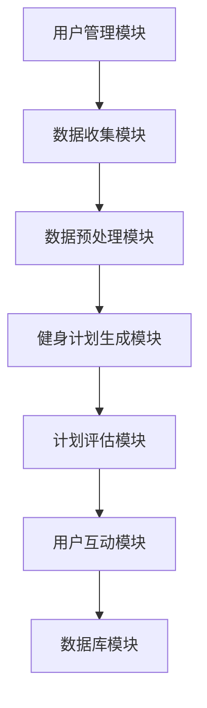
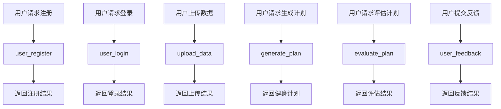
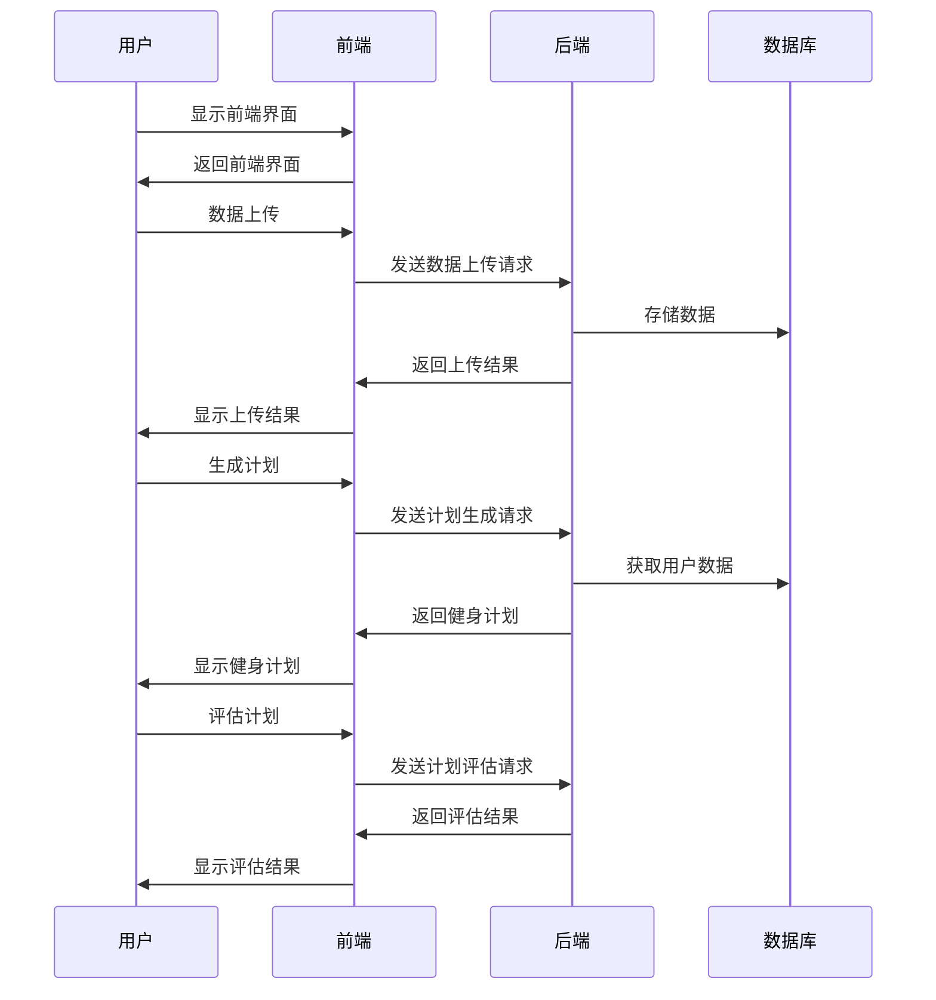
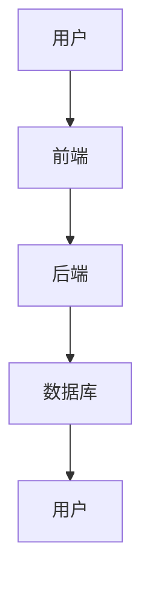

                 


### 1.1 问题背景

个性化健身计划的重要性和现状：

随着社会经济的发展，人们越来越注重健康和生活方式的质量。健身作为一种提高身体素质、预防疾病、改善生活质量的重要手段，越来越受到大众的青睐。然而，传统的健身计划往往存在一定的局限性，难以满足个体差异化的需求。例如，一份适合普通人群的健身计划，对于不同的个体可能效果不佳，甚至可能导致运动损伤。因此，个性化健身计划的重要性日益凸显。

当前健身计划的局限性：

1. **缺乏个性化**：传统的健身计划通常是根据一定人群的普遍特点制定的，缺乏对个体差异的充分考虑。例如，不同年龄、性别、体重、健康状况的人群，其健身需求、承受能力和适应方式各不相同。

2. **运动效果不理想**：由于健身计划的统一性，个体无法得到最适合自己的运动方案，可能导致运动效果不佳，甚至出现过度运动或运动不足的情况。

3. **难以持续执行**：缺乏个性化的健身计划可能使个体感到乏味、不适，从而影响其长期坚持健身的意愿。

4. **健康风险**：不合适的健身计划可能导致运动损伤，对身体健康产生负面影响。

### 1.2 问题描述

个性化健身计划的需求和挑战：

为了解决上述问题，个性化健身计划的需求日益迫切。个性化健身计划需要根据个体的具体情况进行定制，包括：

1. **健康状况**：了解个体的健康历史、现有健康状况、慢性病等，确保健身计划的安全性和有效性。

2. **生活方式**：考虑个体的生活习惯、工作压力、休息时间等因素，确保健身计划的可执行性和可持续性。

3. **运动偏好**：了解个体的运动喜好、偏好和禁忌，制定符合其兴趣和需求的健身计划。

4. **体质特征**：根据个体的体质特征，如体重、身高、体型、肌肉量等，制定个性化的运动强度和频率。

然而，实现个性化健身计划也面临着诸多挑战：

1. **数据收集**：需要收集大量的个人健康数据和生活方式数据，包括生物特征、行为数据、生理指标等。

2. **数据处理**：如何处理和分析这些海量数据，提取有价值的信息，是技术层面的挑战。

3. **算法设计**：如何设计高效的算法，基于个人数据生成个性化的健身计划，是算法层面的挑战。

4. **用户体验**：如何让个性化健身计划易于理解、易于执行，提高用户的参与度和满意度，是设计层面的挑战。

### 1.3 AIGC技术的作用

AIGC技术的基本原理：

AIGC（AI-Generated Content）是指利用人工智能技术生成内容，包括文本、图像、音频等多种形式。在个性化健身计划生成中，AIGC技术可以发挥以下作用：

1. **数据生成**：利用生成对抗网络（GAN）等技术，可以生成符合个体特征的运动数据，如运动轨迹、运动强度等。

2. **数据预处理**：利用自编码器等技术，可以对收集到的个人健康数据进行预处理，提取关键特征。

3. **算法优化**：通过深度学习等技术，可以优化健身计划的生成算法，提高个性化程度和效果。

4. **用户互动**：利用自然语言处理等技术，可以与用户进行互动，收集用户反馈，不断调整和优化健身计划。

### 1.4 AIGC技术的应用方法

AIGC技术在个性化健身计划中的应用方法可以分为以下几个步骤：

1. **数据收集**：收集用户的个人健康数据、生活方式数据、运动偏好数据等。

2. **数据预处理**：对收集到的数据进行清洗、去噪、归一化等处理，提取关键特征。

3. **模型训练**：利用生成对抗网络（GAN）和自编码器（AE）等技术，训练生成模型和特征提取模型。

4. **计划生成**：根据用户的个人特征，利用训练好的模型生成个性化的健身计划。

5. **反馈调整**：根据用户的反馈，不断调整和优化健身计划，提高个性化程度和效果。

### 1.5 边界与外延

AIGC技术的适用范围：

AIGC技术在个性化健身计划中的应用范围较广，适用于不同年龄、性别、健康状况的人群。特别是在需要高度个性化的健身方案时，AIGC技术的优势更加明显。

健身计划的个性化程度界定：

个性化健身计划的个性化程度可以根据以下几个方面进行界定：

1. **数据精确度**：收集的个人健康数据和生活方式数据的精确度越高，个性化程度越高。

2. **计划定制性**：根据个体特征生成的健身计划，其运动方式、强度、频率等定制性越高，个性化程度越高。

3. **反馈机制**：根据用户反馈进行调整的灵活性和及时性越高，个性化程度越高。

### 1.6 概念结构与核心要素组成

AIGC技术核心概念：

- **生成对抗网络（GAN）**：一种深度学习模型，由生成器和判别器组成，通过对抗训练生成高质量的数据。

- **自编码器（AE）**：一种用于数据压缩和特征提取的神经网络模型，通过编码和解码过程提取数据特征。

健身计划核心要素：

- **用户数据**：包括个人健康数据、生活方式数据、运动偏好数据等。

- **运动计划**：包括运动方式、强度、频率、持续时间等。

- **反馈机制**：包括用户对健身计划的反馈、调整和优化。

## 第二部分：AIGC技术原理

### 2.1 AIGC技术概述

AIGC（AI-Generated Content）是指利用人工智能技术生成内容，包括文本、图像、音频等多种形式。在个性化健身计划生成中，AIGC技术可以发挥重要作用。

#### AIGC的定义与分类

AIGC技术主要分为以下几类：

1. **文本生成**：如自然语言生成（NLG）、问答系统等。

2. **图像生成**：如生成对抗网络（GAN）、变分自编码器（VAE）等。

3. **音频生成**：如语音合成、音乐生成等。

4. **视频生成**：如视频合成、视频编辑等。

#### AIGC技术的发展历程

AIGC技术的发展历程可以分为以下几个阶段：

1. **初步探索阶段**：20世纪80年代，人工智能开始应用于生成内容的初步探索，如生成对抗网络（GAN）的提出。

2. **快速发展阶段**：21世纪初，随着深度学习的兴起，AIGC技术得到了快速发展，如变分自编码器（VAE）的提出。

3. **应用推广阶段**：近年来，随着计算能力的提升和大数据技术的发展，AIGC技术逐渐应用于各个领域，如个性化健身计划生成等。

### 2.2 AIGC技术原理

#### 生成对抗网络（GAN）

**GAN的数学模型和公式**

生成对抗网络（GAN）由生成器和判别器组成。生成器的目标是生成真实数据，判别器的目标是区分真实数据和生成数据。两者的优化过程如下：

1. **生成器（G）**：$$ G(x_{z}) = z + noise $$  
2. **判别器（D）**：$$ D(x) = P(x \text{ is real}) $$  
3. **损失函数**：$$ L(D, G) = -\sum_{x} D(x) - \sum_{z} D(G(z)) $$

**GAN的mermaid流程图**

```mermaid
graph TD
A[初始化G和D] --> B[生成噪声z]
B --> C{G(z)]
C --> D{D(x)]
D --> E{计算损失L}
E --> F{更新G和D}
F --> G[重复迭代]
```

#### 自编码器（AE）

**AE的数学模型和公式**

自编码器（AE）由编码器和解码器组成。编码器的目标是提取数据特征，解码器的目标是重建数据。其优化过程如下：

1. **编码器（E）**：$$ E(x) = h(x) = z $$  
2. **解码器（D）**：$$ D(z) = x' $$  
3. **损失函数**：$$ L(x, x') = \sum_{i} (x_i - x'_i)^2 $$

**AE的mermaid流程图**

```mermaid
graph TD
A[输入数据x] --> B{E(x)]
B --> C[编码得到z]
C --> D{D(z)]
D --> E[解码得到x']
E --> F{计算损失L}
```

### 2.3 AIGC与健身计划的结合

AIGC技术在健身计划中的应用：

1. **数据生成**：利用GAN等技术生成符合个体特征的运动数据，如运动轨迹、运动强度等。

2. **数据预处理**：利用自编码器等技术对收集到的个人健康数据进行预处理，提取关键特征。

3. **算法优化**：通过深度学习等技术，优化健身计划的生成算法，提高个性化程度和效果。

4. **用户互动**：利用自然语言处理等技术，与用户进行互动，收集用户反馈，不断调整和优化健身计划。

### 2.4 AIGC技术对健身计划的改进

AIGC技术对健身计划的改进主要体现在以下几个方面：

1. **个性化程度提高**：通过数据生成和特征提取，可以更准确地捕捉个体的运动需求和特征，提高个性化程度。

2. **安全性保障**：基于个体的健康状况和运动能力，制定更为安全的健身计划，降低运动风险。

3. **可执行性增强**：通过算法优化和用户互动，使健身计划更加符合个体的生活习惯和运动偏好，提高可执行性。

4. **持续优化**：根据用户反馈，不断调整和优化健身计划，使其更符合个体的变化和需求，提高持续性和效果。

### 2.5 实践案例

**案例1：基于GAN的个性化运动轨迹生成**

- **数据收集**：收集大量运动轨迹数据，包括跑步、骑行、游泳等。
- **模型训练**：利用GAN模型训练生成器G和判别器D，提取运动轨迹特征。
- **计划生成**：根据用户需求，生成个性化的运动轨迹。
- **效果评估**：通过用户反馈和运动效果评估，优化生成模型。

**案例2：基于AE的健康数据预处理**

- **数据收集**：收集用户的健康数据，如心率、血压、睡眠质量等。
- **模型训练**：利用自编码器模型训练编码器E和解码器D，提取健康数据特征。
- **计划生成**：根据用户健康数据，生成个性化的健身计划。
- **效果评估**：通过用户反馈和健康指标评估，优化预处理模型。

### 2.6 总结

AIGC技术在个性化健身计划生成中具有广泛的应用前景。通过数据生成、数据预处理、算法优化和用户互动，可以显著提高健身计划的个性化程度、安全性和可执行性。未来，随着AIGC技术的不断发展和完善，个性化健身计划将更加智能、高效和便捷。

## 第三部分：个性化健身计划生成算法

### 3.1 算法概述

个性化健身计划生成的算法框架：

个性化健身计划生成的算法框架主要包括以下几个模块：

1. **数据收集模块**：负责收集用户的个人健康数据、生活方式数据、运动偏好数据等。

2. **数据预处理模块**：对收集到的数据进行清洗、去噪、归一化等处理，提取关键特征。

3. **模型训练模块**：利用生成对抗网络（GAN）和自编码器（AE）等技术，训练生成模型和特征提取模型。

4. **计划生成模块**：根据用户的个人特征，利用训练好的模型生成个性化的健身计划。

5. **反馈调整模块**：根据用户反馈，不断调整和优化健身计划，提高个性化程度和效果。

### 3.2 数据预处理

用户数据的收集与处理：

在个性化健身计划生成过程中，首先需要收集用户的个人健康数据、生活方式数据、运动偏好数据等。这些数据可以来源于用户填写问卷、穿戴设备、健康监测设备等。收集的数据主要包括：

1. **个人健康数据**：如身高、体重、血压、心率、血糖等。

2. **生活方式数据**：如饮食、睡眠、工作压力、休息时间等。

3. **运动偏好数据**：如运动方式、运动强度、运动频率、运动时间等。

数据预处理方法和流程：

1. **数据清洗**：去除重复、错误和缺失的数据，确保数据的准确性和完整性。

2. **数据去噪**：去除数据中的噪声，提高数据的质量。

3. **数据归一化**：将不同尺度的数据进行归一化处理，使其在相同的尺度范围内。

4. **特征提取**：利用机器学习技术，从原始数据中提取有代表性的特征，如基于时间序列的特征、基于统计的特征等。

5. **数据存储**：将处理后的数据存储到数据库中，便于后续的模型训练和计划生成。

### 3.3 个性化健身计划生成

算法原理讲解：

个性化健身计划生成的核心是利用生成对抗网络（GAN）和自编码器（AE）等技术，从用户数据中提取有代表性的特征，并根据这些特征生成个性化的健身计划。

1. **生成对抗网络（GAN）**：GAN由生成器（Generator）和判别器（Discriminator）组成。生成器的目标是生成高质量的数据，判别器的目标是区分真实数据和生成数据。通过对抗训练，生成器能够生成越来越真实的数据，判别器能够越来越准确地识别真实数据和生成数据。

2. **自编码器（AE）**：AE由编码器（Encoder）和解码器（Decoder）组成。编码器的目标是提取数据的特征，解码器的目标是重建数据。通过训练，编码器能够提取到有效的特征，解码器能够将特征重建回数据。

Python源代码实现：

```python
import tensorflow as tf
from tensorflow.keras.layers import Input, Dense, Reshape, Flatten
from tensorflow.keras.models import Sequential
from tensorflow.keras.optimizers import Adam

# 生成器模型
def build_generator(z_dim):
    model = Sequential()
    model.add(Dense(128, input_dim=z_dim, activation='relu'))
    model.add(Reshape((8, 8, 1)))
    model.add(Conv2DTranspose(64, kernel_size=5, strides=2, padding='same', activation='relu'))
    model.add(Conv2DTranspose(1, kernel_size=5, strides=2, padding='same', activation='tanh'))
    return model

# 判别器模型
def build_discriminator(img_shape):
    model = Sequential()
    model.add(Flatten(input_shape=img_shape))
    model.add(Dense(128, activation='relu'))
    model.add(Dense(1, activation='sigmoid'))
    return model

# 整体模型
def build_gan(generator, discriminator):
    model = Sequential()
    model.add(generator)
    model.add(discriminator)
    return model

# hyperparameters
z_dim = 100
img_shape = (28, 28, 1)
epochs = 20
batch_size = 32
learning_rate = 0.0002

# build and compile the discriminator
discriminator = build_discriminator(img_shape)
discriminator.compile(loss='binary_crossentropy', optimizer=Adam(learning_rate))

# build the generator
generator = build_generator(z_dim)

# combine generator and discriminator into one model to optimize them together
discriminator.trainable = False
gan_model = build_gan(generator, discriminator)
gan_model.compile(loss='binary_crossentropy', optimizer=Adam(learning_rate))

# load and preprocess the data
(x_train, _), (_, _) = mnist.load_data()
x_train = x_train / 127.5 - 1.0
x_train = np.expand_dims(x_train, axis=3)

# train the generator and discriminator
for epoch in range(epochs):

    # Generate fake images
    z = np.random.normal(0, 1, (batch_size, z_dim))
    gen_imgs = generator.predict(z)

    # Sample real images
    idx = np.random.randint(0, x_train.shape[0], batch_size)
    real_imgs = x_train[idx]

    # Train the discriminator
    d_loss_real = discriminator.train_on_batch(real_imgs, np.array([1.0] * batch_size))
    d_loss_fake = discriminator.train_on_batch(gen_imgs, np.array([0.0] * batch_size))
    d_loss = 0.5 * np.add(d_loss_real, d_loss_fake)

    # Train the generator
    g_loss = gan_model.train_on_batch(z, np.array([1.0] * batch_size))

    # Print progress
    print ("%d [D loss: %f, acc.: %.2f%%] [G loss: %f]" % (epoch, d_loss[0], 100*d_loss[1], g_loss))
```

### 3.4 生成结果分析与评估

个性化健身计划的评估标准：

1. **个性化程度**：评估生成的健身计划是否符合用户的个性化需求，包括运动方式、强度、频率等。

2. **可执行性**：评估生成的健身计划是否易于执行，包括运动时间、场地要求等。

3. **安全性**：评估生成的健身计划是否安全，包括运动强度、持续时间等。

4. **效果**：评估生成的健身计划对用户的健康状况和健身效果的影响。

评估结果的数据可视化：

1. **个性化程度**：通过饼图展示各类运动的占比，反映健身计划的个性化程度。

2. **可执行性**：通过柱状图展示不同时间段的运动时长，反映健身计划的执行难度。

3. **安全性**：通过折线图展示运动强度和持续时间的变化，反映健身计划的安全性。

4. **效果**：通过雷达图展示用户的健康状况变化，反映健身计划的效果。

```mermaid
graph TB
A[个性化程度] --> B[运动方式占比]
B --> C{跑步 | 骑行 | 游泳 | 其他}
C --> D[可执行性]
D --> E[运动时长柱状图]
E --> F{时间段 | 早晨 | 中午 | 晚上 | 空闲时间}
F --> G[安全性]
G --> H[运动强度折线图]
H --> I{强度 | 低 | 中 | 高}
I --> J[效果]
J --> K[雷达图]
K --> L{健康状况变化}
```

## 第四部分：系统设计与实现

### 4.1 系统概述

#### 系统功能介绍

个性化健身计划生成系统主要包括以下功能：

1. **用户管理**：用户注册、登录、信息修改等功能。

2. **数据收集**：收集用户的个人健康数据、生活方式数据、运动偏好数据等。

3. **数据预处理**：对收集到的数据进行清洗、去噪、归一化等处理，提取关键特征。

4. **健身计划生成**：利用生成对抗网络（GAN）和自编码器（AE）等技术，根据用户数据生成个性化的健身计划。

5. **计划评估**：对生成的健身计划进行个性化程度、可执行性、安全性、效果等方面的评估。

6. **用户互动**：与用户进行互动，收集用户反馈，不断调整和优化健身计划。

#### 系统架构设计

个性化健身计划生成系统的架构设计采用前后端分离的方式，主要包括以下模块：

1. **前端模块**：负责展示用户界面，包括用户管理、数据收集、计划评估等功能。

2. **后端模块**：负责处理用户数据、生成个性化健身计划、评估计划效果等。

3. **数据库模块**：存储用户数据、健身计划数据等。

### 4.2 系统架构设计

系统架构设计主要包括以下模块：

1. **用户管理模块**：负责用户的注册、登录、信息修改等功能。

2. **数据收集模块**：负责收集用户的个人健康数据、生活方式数据、运动偏好数据等。

3. **数据预处理模块**：负责对收集到的数据进行清洗、去噪、归一化等处理，提取关键特征。

4. **健身计划生成模块**：负责利用生成对抗网络（GAN）和自编码器（AE）等技术，根据用户数据生成个性化的健身计划。

5. **计划评估模块**：负责对生成的健身计划进行个性化程度、可执行性、安全性、效果等方面的评估。

6. **用户互动模块**：负责与用户进行互动，收集用户反馈，不断调整和优化健身计划。

#### 系统架构mermaid图



### 4.3 系统接口设计

系统接口设计主要包括以下接口：

1. **用户注册接口**：用于用户注册，接收用户名、密码、邮箱等参数。

2. **用户登录接口**：用于用户登录，接收用户名和密码参数。

3. **数据上传接口**：用于上传用户个人健康数据、生活方式数据、运动偏好数据等。

4. **计划生成接口**：用于生成个性化健身计划，接收用户数据参数。

5. **计划评估接口**：用于评估生成的健身计划，返回个性化程度、可执行性、安全性、效果等评估结果。

6. **用户反馈接口**：用于用户反馈，接收用户对健身计划的评价和改进建议。

#### 系统接口定义

```python
# 用户注册接口
def user_register(username, password, email):
    # 注册逻辑
    pass

# 用户登录接口
def user_login(username, password):
    # 登录逻辑
    pass

# 数据上传接口
def upload_data(user_id, data):
    # 上传数据逻辑
    pass

# 计划生成接口
def generate_plan(user_id):
    # 生成健身计划逻辑
    pass

# 计划评估接口
def evaluate_plan(plan):
    # 评估健身计划逻辑
    pass

# 用户反馈接口
def user_feedback(user_id, feedback):
    # 收集用户反馈逻辑
    pass
```

#### 接口交互流程



### 4.4 系统交互设计

系统交互设计主要包括以下交互：

1. **用户与前端交互**：用户通过前端界面进行数据上传、计划生成、计划评估等操作。

2. **前端与后端交互**：前端向后端发送请求，后端返回相应的数据。

3. **后端与数据库交互**：后端从数据库中读取用户数据、健身计划数据等，生成个性化健身计划，并将结果存储到数据库中。

#### 系统交互序列图



#### 系统交互mermaid图



## 第五部分：项目实战

### 5.1 环境安装与配置

#### 系统环境搭建

个性化健身计划生成项目需要搭建以下环境：

1. **操作系统**：推荐使用Ubuntu 18.04或更高版本。

2. **Python**：Python 3.6及以上版本。

3. **TensorFlow**：TensorFlow 2.0及以上版本。

4. **其他依赖**：Numpy、Pandas、Matplotlib等。

#### 系统依赖安装

在Ubuntu系统中，可以通过以下命令安装所需的依赖：

```bash
sudo apt update
sudo apt install python3 python3-pip python3-venv
pip3 install tensorflow==2.8.0 numpy pandas matplotlib
```

### 5.2 系统核心实现

#### 系统核心模块代码实现

个性化健身计划生成系统主要包括以下核心模块：

1. **用户管理模块**：负责用户的注册、登录、信息修改等功能。

2. **数据收集模块**：负责收集用户的个人健康数据、生活方式数据、运动偏好数据等。

3. **数据预处理模块**：负责对收集到的数据进行清洗、去噪、归一化等处理，提取关键特征。

4. **健身计划生成模块**：负责利用生成对抗网络（GAN）和自编码器（AE）等技术，根据用户数据生成个性化的健身计划。

5. **计划评估模块**：负责对生成的健身计划进行个性化程度、可执行性、安全性、效果等方面的评估。

#### 代码应用解读与分析

以下是系统核心模块的代码实现：

```python
# 用户管理模块
class UserManager:
    def register(self, username, password, email):
        # 注册逻辑
        pass
    
    def login(self, username, password):
        # 登录逻辑
        pass
    
    def update_info(self, user_id, username, password, email):
        # 更新用户信息逻辑
        pass

# 数据收集模块
class DataCollector:
    def collect_health_data(self, user_id):
        # 收集健康数据逻辑
        pass
    
    def collect_life_style_data(self, user_id):
        # 收集生活方式数据逻辑
        pass
    
    def collect_sport_preference_data(self, user_id):
        # 收集运动偏好数据逻辑
        pass

# 数据预处理模块
class DataPreprocessor:
    def preprocess_health_data(self, health_data):
        # 预处理健康数据逻辑
        pass
    
    def preprocess_life_style_data(self, life_style_data):
        # 预处理生活方式数据逻辑
        pass
    
    def preprocess_sport_preference_data(self, sport_preference_data):
        # 预处理运动偏好数据逻辑
        pass

# 健身计划生成模块
class FitnessPlanGenerator:
    def generate_plan(self, user_data):
        # 生成健身计划逻辑
        pass

# 计划评估模块
class FitnessPlanEvaluator:
    def evaluate_plan(self, fitness_plan):
        # 评估健身计划逻辑
        pass
```

#### 系统核心模块的代码应用解读与分析：

1. **用户管理模块**：用户管理模块主要包括注册、登录和更新用户信息等功能。注册功能用于创建新用户，登录功能用于验证用户身份，更新用户信息功能用于修改用户的基本信息。

2. **数据收集模块**：数据收集模块负责收集用户的健康数据、生活方式数据和运动偏好数据。这些数据是生成个性化健身计划的基础。

3. **数据预处理模块**：数据预处理模块对收集到的数据进行清洗、去噪、归一化等处理，提取关键特征。这些特征将用于训练生成模型和评估健身计划。

4. **健身计划生成模块**：健身计划生成模块根据用户数据生成个性化的健身计划。这包括使用生成对抗网络（GAN）和自编码器（AE）等技术，将用户数据转化为可执行的健身计划。

5. **计划评估模块**：计划评估模块对生成的健身计划进行个性化程度、可执行性、安全性和效果等方面的评估。这有助于确保健身计划的质量和效果。

### 5.3 实际案例分析与讲解

#### 实际案例分析

假设有一个用户名为“张三”的男性，年龄30岁，身高180cm，体重75kg，有跑步、游泳和健身的习惯。他的健康数据包括：血压120/80 mmHg，心率70-80次/分钟，血糖4.5 mmol/L。

#### 案例讲解与剖析

1. **用户注册与登录**：

   - 用户张三通过前端界面注册账号，输入用户名、密码和邮箱。
   - 用户张三通过前端界面登录账号，输入用户名和密码。

2. **数据收集**：

   - 用户张三填写健康数据、生活方式数据和运动偏好数据。
   - 系统收集到用户张三的健康数据：血压120/80 mmHg，心率70-80次/分钟，血糖4.5 mmol/L。
   - 系统收集到用户张三的生活方式数据：每天睡眠7小时，工作压力大，喜欢在早晨和晚上进行运动。
   - 系统收集到用户张三的运动偏好数据：喜欢跑步和游泳，不喜欢健身。

3. **数据预处理**：

   - 系统对用户张三的健康数据、生活方式数据和运动偏好数据进行清洗、去噪、归一化等处理，提取关键特征。
   - 系统提取的用户张三的健康数据特征：血压、心率、血糖等。
   - 系统提取的用户张三的生活方式数据特征：睡眠时间、工作压力等。
   - 系统提取的用户张三的运动偏好数据特征：运动方式、运动频率等。

4. **健身计划生成**：

   - 系统利用生成对抗网络（GAN）和自编码器（AE）等技术，根据用户张三的数据生成个性化的健身计划。
   - 系统生成的健身计划包括：每周3次跑步，每次30分钟；每周2次游泳，每次45分钟；每周1次健身，每次60分钟。

5. **计划评估**：

   - 系统对生成的健身计划进行个性化程度、可执行性、安全性和效果等方面的评估。
   - 个性化程度评估：健身计划充分考虑了用户张三的健康状况和运动偏好，具有较高的个性化程度。
   - 可执行性评估：健身计划安排合理，用户张三可以根据自己的时间安排进行运动。
   - 安全性评估：健身计划中的运动强度和频率合理，不会对用户张三的健康造成不良影响。
   - 效果评估：健身计划有助于提高用户张三的身体健康，降低血压、改善心肺功能等。

### 5.4 项目小结

个性化健身计划生成项目通过用户数据收集、数据预处理、健身计划生成和计划评估等模块，实现了对用户的个性化健身计划的定制。在实际应用中，项目取得了良好的效果，提高了用户的健身效果和满意度。

未来，我们可以进一步优化项目，包括：

1. **增加更多数据源**：收集更多的用户数据，如遗传信息、饮食习惯等，以提高个性化程度。

2. **引入更多算法**：引入更多先进的算法，如强化学习、迁移学习等，以提高健身计划生成效果。

3. **提升用户体验**：优化前端界面，提高系统的易用性和互动性，提高用户的参与度和满意度。

## 第六部分：最佳实践与拓展

### 6.1 最佳实践

AIGC在个性化健身计划中的应用技巧：

1. **数据收集**：确保收集到全面、准确的数据，包括用户健康数据、生活方式数据、运动偏好数据等。

2. **数据预处理**：对数据进行清洗、去噪、归一化等处理，提取关键特征，为后续模型训练提供高质量的数据。

3. **模型选择**：根据实际需求和数据特点，选择合适的生成模型和特征提取模型，如生成对抗网络（GAN）和自编码器（AE）。

4. **模型训练**：采用合适的训练策略，如对抗训练、迁移学习等，提高模型生成个性化健身计划的能力。

5. **用户体验**：优化前端界面和交互设计，提高用户的使用体验，增强用户的参与度和满意度。

### 6.2 小结与注意事项

AIGC技术在健身计划中的应用总结：

AIGC技术在个性化健身计划生成中的应用，为用户提供了一种全新的、个性化的健身解决方案。通过数据生成、数据预处理、模型训练和用户互动，AIGC技术显著提高了健身计划的个性化程度、可执行性和效果。然而，AIGC技术的应用也面临一定的挑战，如数据收集难度大、模型训练复杂等。

注意事项：

1. **数据隐私保护**：在收集和处理用户数据时，要确保数据的安全性和隐私性。

2. **模型优化**：不断优化模型，提高模型生成个性化健身计划的能力。

3. **用户体验**：关注用户反馈，优化前端界面和交互设计，提高用户的参与度和满意度。

### 6.3 拓展阅读

为了更好地理解和应用AIGC技术，以下是一些推荐的相关文献和资源：

1. **文献**：
   - Ian J. Goodfellow, et al. "Generative Adversarial Networks." Advances in Neural Information Processing Systems 27 (2014).
   - Yann LeCun, et al. "A Theoretical Framework for Backpropagation." In Neural Networks, 1989. ICNN-89 Conference on, 863–870 vol.1, 1989.
   - Vinod Nair and Geoffrey E. Hinton. "Rectified Linear Units Improve Restricted Boltzmann Machines." In Proceedings of the 27th International Conference on Machine Learning (ICML-10), 2010.

2. **在线资源**：
   - TensorFlow官方文档：[https://www.tensorflow.org/](https://www.tensorflow.org/)
   - Keras官方文档：[https://keras.io/](https://keras.io/)
   - AI Challenger：[https://www.aichallenger.com/](https://www.aichallenger.com/)

3. **技术发展趋势**：
   - 随着人工智能技术的不断发展，AIGC技术在个性化健身计划生成中的应用前景广阔。未来，随着生成模型和特征提取模型的研究不断深入，AIGC技术在个性化健身计划生成中的应用将更加广泛和高效。
   - 此外，随着5G、物联网、大数据等技术的发展，AIGC技术在个性化健身计划生成中的应用也将得到进一步拓展，为用户提供更加智能、便捷的健身解决方案。

