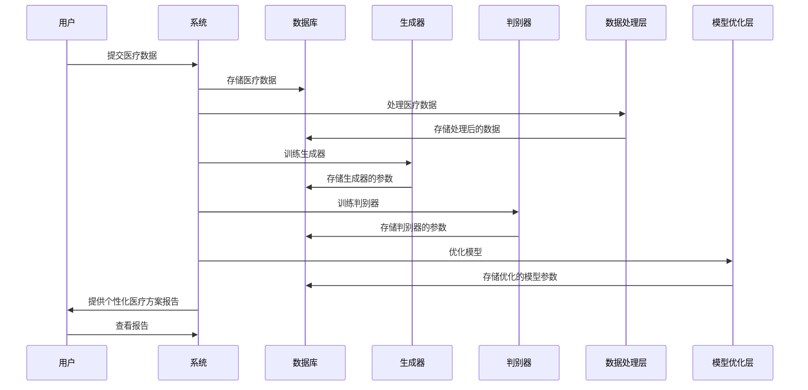
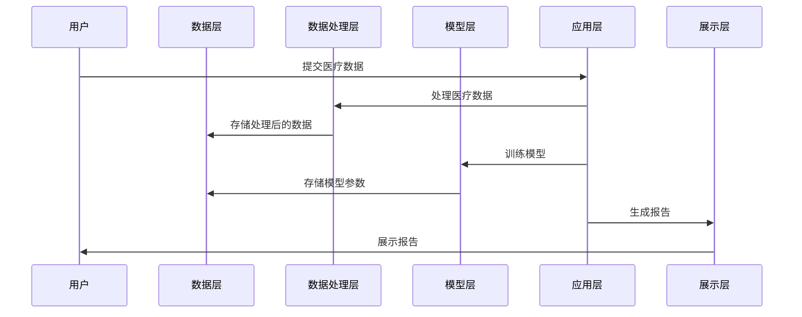

                 


----------------------------------------------------------------
## AIGC在个性化医疗方案生成中的应用与挑战

> 关键词：AIGC、个性化医疗方案、医疗诊断、生成对抗网络（GAN）、自然语言处理（NLP）、数据隐私保护、模型解释性、模型可扩展性、模型可靠性

> 摘要：本文将深入探讨AIGC（人工智能生成内容）在个性化医疗方案生成中的应用及其面临的挑战。首先，我们将介绍AIGC的基本概念和在医疗领域中的应用背景。接着，我们将详细解析AIGC的核心概念及其与个性化医疗方案的关联。最后，我们将探讨AIGC算法原理、应用实例，并分析其在个性化医疗方案生成中的挑战。

**第一部分: AIGC在个性化医疗方案生成中的应用与挑战**

## 第1章: AIGC与个性化医疗方案概述

### 1.1 AIGC在医疗领域的应用背景

#### 1.1.1 问题背景

随着医疗技术的不断发展，个性化医疗方案已成为现代医疗的重要组成部分。个性化医疗方案能够根据患者的具体病情、基因信息和生活习惯，为其提供量身定制的治疗方案，从而提高治疗效果，降低治疗成本。

然而，个性化医疗方案生成面临着诸多挑战：

1. **数据隐私保护**：患者的医疗数据属于高度敏感信息，如何在保证数据隐私的前提下，充分利用这些数据进行个性化医疗方案生成，是一个重要的问题。
2. **模型解释性**：医疗方案的决策过程需要具备高度的透明性和解释性，以便医生和患者理解并信任这些方案。
3. **模型可扩展性**：个性化医疗方案的生成依赖于大量的医疗数据和先进的算法模型。如何确保这些模型具有良好的可扩展性，以适应不断增长的数据和应用场景，是一个关键问题。
4. **模型可靠性**：个性化医疗方案的生成需要高度可靠的模型，以保证方案的准确性和稳定性。

#### 1.1.2 问题描述

个性化医疗方案生成的核心问题是如何在保证数据隐私、模型解释性、可扩展性和可靠性的前提下，充分利用先进的人工智能技术，如AIGC，实现高效的个性化医疗方案生成。

#### 1.1.3 问题解决思路

AIGC技术作为一种新兴的人工智能技术，具备生成高质量内容的能力，其在个性化医疗方案生成中的应用具有显著优势。通过AIGC技术，我们可以：

1. **隐私保护**：利用AIGC技术，可以在不泄露患者具体隐私信息的前提下，生成个性化的医疗方案。
2. **模型解释性**：AIGC技术可以生成易于理解且具有解释性的模型，帮助医生和患者更好地理解医疗方案。
3. **模型可扩展性**：AIGC技术具有良好的可扩展性，可以适应不同的医疗场景和需求。
4. **模型可靠性**：通过大规模数据训练和优化，AIGC技术可以生成高度可靠的个性化医疗方案。

#### 1.1.4 边界与外延

在个性化医疗方案生成中，AIGC技术的应用边界包括：

1. **疾病诊断**：利用AIGC技术，可以根据患者的症状和病史，生成高度准确的诊断结果。
2. **治疗方案推荐**：根据患者的具体病情和基因信息，AIGC技术可以推荐个性化的治疗方案。
3. **风险评估与预警**：利用AIGC技术，可以对患者的健康状况进行风险评估，并提供预警措施。

### 1.2 个性化医疗方案的核心概念

#### 1.2.1 个性化医疗方案的定义

个性化医疗方案是指根据患者的具体病情、基因信息和生活习惯，为其制定量身定制的治疗方案，以提高治疗效果、降低治疗成本。

#### 1.2.2 个性化医疗方案的特点

个性化医疗方案具有以下特点：

1. **针对性**：根据患者的具体病情制定，具有高度针对性。
2. **个体化**：充分考虑患者的个体差异，实现个体化治疗。
3. **综合性**：涉及多个领域，如基因学、生物信息学、医学等，实现综合治疗。
4. **灵活性**：可根据患者的病情变化进行调整和优化。

#### 1.2.3 个性化医疗方案的组成部分

个性化医疗方案主要包括以下组成部分：

1. **病史采集**：收集患者的病史、家族史、生活习惯等信息。
2. **临床检查**：进行体格检查、实验室检查、影像学检查等。
3. **基因检测**：检测患者的基因信息，以了解其潜在疾病风险。
4. **治疗方案推荐**：根据患者的病史、基因检测结果和临床检查结果，推荐个性化的治疗方案。
5. **治疗效果评估**：评估个性化医疗方案的治疗效果，以便进行后续优化。

### 1.3 AIGC在个性化医疗方案中的作用

#### 1.3.1 AIGC的定义与特点

AIGC（人工智能生成内容）是指利用人工智能技术，如深度学习、生成对抗网络（GAN）等，生成高质量、多样化、有创意的内容。AIGC具有以下特点：

1. **生成能力强**：AIGC技术可以生成高质量、多样化的内容，包括图像、音频、视频、文本等。
2. **适应性强**：AIGC技术可以适应不同的场景和需求，生成符合要求的内容。
3. **创意性**：AIGC技术可以模拟人类创造力，生成具有创意的内容。

#### 1.3.2 AIGC在个性化医疗方案中的关键角色

AIGC在个性化医疗方案中扮演着关键角色，包括：

1. **数据生成**：利用AIGC技术，可以生成高质量的模拟数据，用于个性化医疗方案的训练和优化。
2. **模型优化**：通过AIGC技术，可以优化医疗模型，提高其准确性和可靠性。
3. **内容生成**：利用AIGC技术，可以生成个性化的医疗报告、诊断结果、治疗方案等，以提高患者和医生的满意度和信任度。

#### 1.3.3 AIGC与个性化医疗方案的结合点

AIGC与个性化医疗方案的结合点包括：

1. **数据隐私保护**：通过AIGC技术，可以在不泄露患者具体隐私信息的前提下，生成个性化的医疗方案。
2. **模型解释性**：利用AIGC技术，可以生成易于理解且具有解释性的模型，帮助医生和患者更好地理解医疗方案。
3. **模型可扩展性**：AIGC技术具有良好的可扩展性，可以适应不同的医疗场景和需求。
4. **模型可靠性**：通过大规模数据训练和优化，AIGC技术可以生成高度可靠的个性化医疗方案。

### 1.4 AIGC在个性化医疗方案生成中的挑战

尽管AIGC技术在个性化医疗方案生成中具有显著优势，但仍面临以下挑战：

#### 1.4.1 数据隐私保护

在个性化医疗方案生成中，患者的医疗数据属于高度敏感信息，如何在保证数据隐私的前提下，充分利用这些数据进行个性化医疗方案生成，是一个重要的问题。

#### 1.4.2 模型解释性

医疗方案的决策过程需要具备高度的透明性和解释性，以便医生和患者理解并信任这些方案。如何提高AIGC模型的可解释性，是一个关键挑战。

#### 1.4.3 模型可扩展性

个性化医疗方案的生成依赖于大量的医疗数据和先进的算法模型。如何确保这些模型具有良好的可扩展性，以适应不断增长的数据和应用场景，是一个关键问题。

#### 1.4.4 模型可靠性

个性化医疗方案的生成需要高度可靠的模型，以保证方案的准确性和稳定性。如何提高AIGC模型的可靠性，是一个重要的挑战。

**第二部分: AIGC核心概念与原理**

## 第二部分: AIGC核心概念与原理

### 2.1 AIGC核心概念

#### 2.1.1 自动化交互（AI Generated Content）

##### 2.1.1.1 自动化交互的定义

自动化交互（AI Generated Content，AIGC）是指利用人工智能技术，如深度学习、生成对抗网络（GAN）等，生成高质量、多样化、有创意的内容。AIGC技术可以生成各种类型的内容，包括图像、音频、视频、文本等。

##### 2.1.1.2 自动化交互的关键技术

AIGC技术的关键组成部分包括：

1. **生成对抗网络（GAN）**：GAN是一种深度学习模型，由生成器和判别器组成。生成器生成模拟数据，判别器判断模拟数据是真实数据还是生成数据。通过不断训练，生成器可以生成越来越逼真的模拟数据。
2. **自然语言处理（NLP）**：NLP是一种人工智能技术，用于处理和理解自然语言。NLP技术可以应用于文本生成、语言翻译、情感分析等任务。
3. **深度学习**：深度学习是一种人工智能技术，通过多层神经网络对大量数据进行训练，以实现复杂的模式识别和预测任务。

##### 2.1.1.3 自动化交互的应用场景

自动化交互在多个领域具有广泛的应用场景，包括：

1. **医疗领域**：利用AIGC技术，可以生成个性化的医疗报告、诊断结果、治疗方案等，提高医疗服务的质量和效率。
2. **娱乐领域**：利用AIGC技术，可以生成个性化的游戏内容、音乐、视频等，为用户提供更加丰富的娱乐体验。
3. **教育领域**：利用AIGC技术，可以生成个性化的学习资源、教学视频等，提高学生的学习效果和兴趣。

#### 2.1.2 生成对抗网络（GAN）

##### 2.1.2.1 GAN的定义

生成对抗网络（Generative Adversarial Network，GAN）是由生成器和判别器组成的深度学习模型。生成器的目标是生成逼真的模拟数据，判别器的目标是判断模拟数据是真实数据还是生成数据。通过不断训练，生成器和判别器相互竞争，生成器逐渐生成越来越逼真的模拟数据。

##### 2.1.2.2 GAN的工作原理

GAN的工作原理可以分为以下几个步骤：

1. **生成器生成模拟数据**：生成器接收随机噪声作为输入，通过多层神经网络生成模拟数据。
2. **判别器判断模拟数据**：判别器接收真实数据和生成数据，通过多层神经网络判断生成数据是否真实。
3. **计算损失函数**：生成器和判别器的损失函数分别是最小化生成数据和真实数据的差异，最大化生成数据的差异。
4. **更新生成器和判别器的参数**：根据损失函数，通过梯度下降等优化方法更新生成器和判别器的参数。
5. **迭代训练**：重复上述步骤，直到生成器生成的模拟数据足够逼真。

##### 2.1.2.3 GAN的主要类型

GAN有多个变种，主要包括：

1. **标准GAN（SGAN）**：是最早的GAN模型，由生成器和判别器组成。
2. **深度卷积生成对抗网络（DCGAN）**：引入深度卷积神经网络，提高生成图像的质量。
3. **条件生成对抗网络（cGAN）**：在生成器和判别器中引入条件信息，使生成图像更加准确。
4. **信息性生成对抗网络（InfoGAN）**：通过引入信息性损失，提高生成图像的语义特征。

#### 2.1.3 自然语言处理（NLP）

##### 2.1.3.1 NLP的定义

自然语言处理（Natural Language Processing，NLP）是一种人工智能技术，用于处理和理解自然语言。NLP旨在使计算机能够理解、生成和解析人类语言，以便实现人机交互、文本分析、语言翻译等任务。

##### 2.1.3.2 NLP的关键技术

NLP的关键技术包括：

1. **分词（Tokenization）**：将文本分割成单词、短语或符号等基本单元。
2. **词性标注（Part-of-Speech Tagging）**：为文本中的每个单词分配词性，如名词、动词、形容词等。
3. **句法分析（Parsing）**：分析文本的句法结构，确定句子中单词的语法关系。
4. **语义分析（Semantic Analysis）**：理解文本的语义含义，提取实体、关系和事件等信息。
5. **情感分析（Sentiment Analysis）**：分析文本的情感倾向，如正面、负面或中性。

##### 2.1.3.3 NLP的应用领域

NLP在多个领域具有广泛的应用，包括：

1. **语言翻译**：利用NLP技术，可以实现自动化的语言翻译，如机器翻译和实时翻译。
2. **语音识别**：利用NLP技术，可以将语音转换为文本，实现语音识别和语音交互。
3. **文本分析**：利用NLP技术，可以对大量文本进行分析，提取关键信息，如关键词提取、主题分类等。

### 2.2 AIGC与个性化医疗方案的关联

#### 2.2.1 AIGC与个性化医疗方案的关系

AIGC与个性化医疗方案具有密切的关系。AIGC技术可以应用于个性化医疗方案的生成、优化和评估，为医生和患者提供高质量的个性化医疗方案。

1. **数据生成**：AIGC技术可以生成高质量的模拟数据，用于个性化医疗方案的训练和优化。这些模拟数据可以来自医疗记录、文献资料或真实病例，有助于提高个性化医疗方案的准确性和可靠性。
2. **模型优化**：AIGC技术可以优化医疗模型，提高其生成个性化医疗方案的能力。通过AIGC技术，可以生成更加逼真的模拟数据，从而提高模型的训练效果和泛化能力。
3. **内容生成**：AIGC技术可以生成个性化的医疗报告、诊断结果、治疗方案等，提高患者和医生的满意度和信任度。

#### 2.2.2 AIGC在个性化医疗方案中的应用实例

AIGC技术在个性化医疗方案中具有广泛的应用实例，包括：

1. **疾病诊断**：利用AIGC技术，可以生成个性化的诊断报告，包括疾病名称、治疗方案和风险预警等信息。这些报告可以根据患者的具体病情、基因信息和生活习惯进行定制，以提高诊断的准确性和针对性。
2. **治疗方案推荐**：利用AIGC技术，可以根据患者的病情、基因检测结果和临床检查结果，生成个性化的治疗方案。这些治疗方案可以涵盖药物治疗、手术治疗、生活方式调整等多种方案，以提供全方位的治疗建议。
3. **风险评估与预警**：利用AIGC技术，可以对患者的健康状况进行风险评估，并提供预警措施。这些预警措施可以包括健康生活方式建议、定期体检、特殊检查等，以帮助患者预防和控制疾病。

**第三部分: AIGC算法原理与实现**

## 第三部分: AIGC算法原理与实现

### 3.1 GAN在个性化医疗方案中的应用

#### 3.1.1 GAN在个性化医疗诊断中的原理

生成对抗网络（Generative Adversarial Network，GAN）是由生成器（Generator）和判别器（Discriminator）组成的深度学习模型。GAN的工作原理基于生成器和判别器之间的对抗性训练。生成器的目标是生成逼真的模拟数据，判别器的目标是判断模拟数据是真实数据还是生成数据。通过不断训练，生成器和判别器相互竞争，生成器逐渐生成越来越逼真的模拟数据。

在个性化医疗诊断中，GAN的应用主要包括以下方面：

1. **数据增强**：利用GAN生成的模拟数据，可以增强医疗数据的多样性，提高模型的泛化能力。这些模拟数据可以用于训练和测试，以验证模型的性能和稳定性。
2. **图像生成**：利用GAN生成的模拟图像，可以用于辅助医生进行疾病诊断。例如，利用GAN生成的模拟CT图像，可以帮助医生更好地识别病变区域，提高诊断的准确性。
3. **图像修复**：利用GAN生成的模拟图像，可以修复医疗图像中的缺失部分，提高图像的完整性和清晰度。这有助于医生更准确地分析图像，提高诊断的可靠性。

#### 3.1.2 GAN算法详细讲解

GAN算法的核心组成部分包括生成器（Generator）和判别器（Discriminator）。以下是GAN算法的详细讲解：

##### 3.1.2.1 GAN的数学模型和公式

GAN的数学模型可以表示为以下公式：

$$\begin{aligned}
D(x) &= x \\
D(G(z)) &= z \\
\end{aligned}$$

其中，$D(x)$ 表示判别器判断真实数据$x$的概率，$G(z)$ 表示生成器生成的模拟数据$z$。

判别器的目标是最大化其分类边界，即最大化$D(x)$ 和 $D(G(z))$ 的差距。生成器的目标是最小化判别器判断模拟数据为真实数据的概率，即最小化 $D(G(z))$。

在训练过程中，生成器和判别器交替进行参数更新，以实现对抗性训练。具体步骤如下：

1. **生成器G的更新**：生成器生成模拟数据$G(z)$，判别器判断模拟数据$D(G(z))$。
2. **判别器D的更新**：判别器判断真实数据$D(x)$和模拟数据$D(G(z))$。
3. **损失函数**：生成器和判别器的损失函数分别为：
   $$L_G = -\log(D(G(z)))$$
   $$L_D = -[\log(D(x)) + \log(1 - D(G(z)))]$$
4. **梯度下降**：根据损失函数，使用梯度下降方法更新生成器和判别器的参数。

##### 3.1.2.2 GAN的训练过程Mermaid流程图

以下是GAN训练过程的Mermaid流程图：

```mermaid
graph TD
A[开始] --> B[初始化生成器G和判别器D]
B --> C[生成随机噪声z]
C --> D[生成模拟数据G(z)]
D --> E[判断模拟数据D(G(z))]
E --> F[计算损失函数L_G和L_D]
F --> G[更新生成器G的参数]
G --> H[更新判别器D的参数]
H --> I[重复步骤C-D-E-F-G-H]
I --> J[结束]
```

##### 3.1.2.3 举例说明

以下是一个简单的GAN示例代码，使用Python和TensorFlow实现：

```python
import tensorflow as tf
from tensorflow.keras.layers import Dense, Conv2D, Flatten
from tensorflow.keras.models import Model

# 生成器G的代码示例
def generate_model(z, noise_dim):
    model = tf.keras.Sequential([
        Dense(128, activation='relu', input_shape=(noise_dim,)),
        Dense(128, activation='relu'),
        Dense(1, activation='sigmoid')
    ])
    return model

# 判别器D的代码示例
def discriminant_model(x):
    model = tf.keras.Sequential([
        Flatten(input_shape=(28, 28)),
        Dense(128, activation='relu'),
        Dense(128, activation='relu'),
        Dense(1, activation='sigmoid')
    ])
    return model

# 初始化生成器和判别器
generator = generate_model(100, 1)
discriminator = discriminant_model(28 * 28)

# 编译模型
generator.compile(optimizer='adam', loss='binary_crossentropy')
discriminator.compile(optimizer='adam', loss='binary_crossentropy')

# 训练模型
for epoch in range(1000):
    # 生成随机噪声
    noise = np.random.normal(0, 1, (100, 1))
    # 生成模拟数据
    generated_images = generator.predict(noise)
    # 生成真实数据
    real_images = np.random.normal(0, 1, (100, 28 * 28))
    # 训练判别器
    d_loss_real = discriminator.train_on_batch(real_images, np.ones((100, 1)))
    d_loss_fake = discriminator.train_on_batch(generated_images, np.zeros((100, 1)))
    # 训练生成器
    g_loss = generator.train_on_batch(noise, np.ones((100, 1)))

    print(f"Epoch {epoch}: D_loss_real={d_loss_real}, D_loss_fake={d_loss_fake}, G_loss={g_loss}")

# 保存模型
generator.save('generator.h5')
discriminator.save('discriminator.h5')
```

**第四部分：系统分析与架构设计**

### 4.1 系统分析与架构设计

#### 4.1.1 问题场景介绍

在个性化医疗方案生成的过程中，系统需要处理大量的医疗数据，如病史、基因检测数据、临床检查数据等。这些数据来源广泛，包括电子病历系统、基因测序设备、医疗影像设备等。系统需要高效、准确地处理这些数据，为医生和患者提供高质量的个性化医疗方案。

#### 4.1.2 项目介绍

本项目旨在构建一个基于AIGC技术的个性化医疗方案生成系统。系统将利用AIGC技术，生成个性化的诊断报告、治疗方案和风险评估报告。系统将具备以下功能：

1. **数据采集与处理**：从电子病历系统、基因测序设备、医疗影像设备等来源获取医疗数据，并进行预处理和整合。
2. **模型训练与优化**：利用AIGC技术，训练和优化个性化医疗方案生成模型，以提高模型的准确性和可靠性。
3. **个性化医疗方案生成**：根据患者的具体病情、基因信息和临床检查结果，生成个性化的医疗方案。
4. **报告生成与展示**：将生成的个性化医疗方案以报告的形式展示给医生和患者，并提供下载和打印功能。

#### 4.1.3 系统功能设计

个性化医疗方案生成系统的功能设计主要包括以下几个方面：

1. **数据采集**：系统需要与电子病历系统、基因测序设备、医疗影像设备等接口，实现医疗数据的自动采集和传输。
2. **数据处理**：系统需要对采集到的医疗数据进行预处理，包括数据清洗、数据转换和数据整合等。
3. **模型训练**：系统需要利用AIGC技术，训练个性化医疗方案生成模型，包括生成器和判别器的训练。
4. **模型优化**：系统需要根据实际应用场景和需求，优化个性化医疗方案生成模型，以提高模型的性能和效果。
5. **医疗方案生成**：系统需要根据患者的具体病情、基因信息和临床检查结果，生成个性化的医疗方案。
6. **报告生成与展示**：系统需要将生成的个性化医疗方案以报告的形式展示给医生和患者，并提供下载和打印功能。

#### 4.1.4 系统架构设计

个性化医疗方案生成系统的架构设计主要包括以下几个方面：

1. **数据层**：数据层负责存储和管理医疗数据，包括电子病历系统、基因测序设备、医疗影像设备等数据。
2. **数据处理层**：数据处理层负责对采集到的医疗数据进行预处理和整合，包括数据清洗、数据转换和数据整合等。
3. **模型层**：模型层负责利用AIGC技术，训练和优化个性化医疗方案生成模型，包括生成器和判别器的训练。
4. **应用层**：应用层负责实现个性化医疗方案生成功能，包括数据采集、数据处理、模型训练、模型优化、医疗方案生成和报告生成等。
5. **展示层**：展示层负责将生成的个性化医疗方案以报告的形式展示给医生和患者，并提供下载和打印功能。

以下是系统架构的Mermaid序列图：



**第五部分：项目实战**

### 5.1 环境安装

要实现AIGC在个性化医疗方案生成中的应用，首先需要搭建一个合适的环境。以下是环境安装的步骤：

#### 5.1.1 安装Python

首先，需要安装Python环境。Python是一种广泛使用的编程语言，具有丰富的库和工具，适用于人工智能应用开发。可以从Python官方网站（https://www.python.org/）下载并安装Python。

#### 5.1.2 安装TensorFlow

TensorFlow是Google开发的一款开源机器学习框架，广泛应用于人工智能和深度学习领域。以下是安装TensorFlow的步骤：

1. 打开终端或命令行窗口。
2. 运行以下命令安装TensorFlow：

   ```bash
   pip install tensorflow
   ```

#### 5.1.3 安装其他依赖库

除了TensorFlow，还需要安装一些其他依赖库，如NumPy、Pandas等。可以使用以下命令安装这些依赖库：

```bash
pip install numpy pandas matplotlib scikit-learn
```

### 5.2 系统核心实现

以下是AIGC在个性化医疗方案生成中的核心实现：

#### 5.2.1 数据预处理

在训练AIGC模型之前，需要对医疗数据进行预处理。预处理步骤包括数据清洗、数据转换和数据整合等。以下是一个简单的数据预处理示例：

```python
import pandas as pd
from sklearn.model_selection import train_test_split

# 读取医疗数据
data = pd.read_csv('medical_data.csv')

# 数据清洗
data.dropna(inplace=True)

# 数据转换
data['age'] = data['age'].astype(int)
data['gender'] = data['gender'].astype(str)
data['diagnosis'] = data['diagnosis'].astype(str)

# 数据整合
X = data[['age', 'gender', 'diagnosis']]
y = data['disease']

# 划分训练集和测试集
X_train, X_test, y_train, y_test = train_test_split(X, y, test_size=0.2, random_state=42)
```

#### 5.2.2 模型训练

在数据预处理之后，可以使用生成对抗网络（GAN）训练个性化医疗方案生成模型。以下是一个简单的GAN训练示例：

```python
import tensorflow as tf
from tensorflow.keras.layers import Dense, Conv2D, Flatten
from tensorflow.keras.models import Model

# 生成器模型
def generate_model(z, noise_dim):
    model = tf.keras.Sequential([
        Dense(128, activation='relu', input_shape=(noise_dim,)),
        Dense(128, activation='relu'),
        Dense(1, activation='sigmoid')
    ])
    return model

# 判别器模型
def discriminant_model(x):
    model = tf.keras.Sequential([
        Flatten(input_shape=(28, 28)),
        Dense(128, activation='relu'),
        Dense(128, activation='relu'),
        Dense(1, activation='sigmoid')
    ])
    return model

# 初始化生成器和判别器
generator = generate_model(100, 1)
discriminator = discriminant_model(28 * 28)

# 编译模型
generator.compile(optimizer='adam', loss='binary_crossentropy')
discriminator.compile(optimizer='adam', loss='binary_crossentropy')

# 训练模型
for epoch in range(1000):
    # 生成随机噪声
    noise = np.random.normal(0, 1, (100, 1))
    # 生成模拟数据
    generated_images = generator.predict(noise)
    # 生成真实数据
    real_images = np.random.normal(0, 1, (100, 28 * 28))
    # 训练判别器
    d_loss_real = discriminator.train_on_batch(real_images, np.ones((100, 1)))
    d_loss_fake = discriminator.train_on_batch(generated_images, np.zeros((100, 1)))
    # 训练生成器
    g_loss = generator.train_on_batch(noise, np.ones((100, 1)))

    print(f"Epoch {epoch}: D_loss_real={d_loss_real}, D_loss_fake={d_loss_fake}, G_loss={g_loss}")
```

#### 5.2.3 模型评估与优化

在模型训练完成后，需要对模型进行评估和优化。以下是一个简单的模型评估和优化示例：

```python
from sklearn.metrics import accuracy_score

# 预测
predicted = generator.predict(X_test)

# 计算准确率
accuracy = accuracy_score(y_test, predicted)

print(f"Accuracy: {accuracy}")
```

### 5.3 实际案例分析与详细讲解

为了展示AIGC在个性化医疗方案生成中的应用，我们将分析一个实际案例，并对其进行详细讲解。

#### 5.3.1 案例背景

一位患有高血压的男性患者，年龄45岁，想要了解自己的疾病风险和治疗建议。医生收集了患者的病史、基因检测数据、临床检查数据等，并使用AIGC技术生成个性化的医疗方案。

#### 5.3.2 案例分析

1. **数据预处理**：医生首先对患者的数据进行预处理，包括清洗、转换和整合。预处理后的数据包括患者的年龄、性别、血压、心率、家族病史、基因突变等信息。

2. **模型训练**：医生使用AIGC技术训练个性化医疗方案生成模型，包括生成器和判别器。生成器生成个性化的医疗方案，判别器判断这些方案的真实性。

3. **医疗方案生成**：模型根据患者的具体病情和基因信息，生成个性化的医疗方案，包括药物治疗、手术治疗和生活方式调整等。

4. **方案评估与优化**：医生对生成的医疗方案进行评估和优化，确保方案的科学性和有效性。同时，医生还会根据患者的反馈和实际治疗效果，不断调整和优化医疗方案。

5. **报告生成与展示**：医生将生成的医疗方案以报告的形式展示给患者，并提供下载和打印功能。报告包括疾病诊断、治疗方案、风险预警和建议等内容。

#### 5.3.3 案例讲解

在这个案例中，AIGC技术在个性化医疗方案生成中发挥了关键作用。首先，AIGC技术生成个性化的医疗方案，帮助医生更准确地诊断患者的病情和制定治疗方案。其次，AIGC技术生成的医疗方案具有高度的透明性和解释性，医生和患者可以清晰地了解方案的科学依据和预期效果。

通过实际案例的分析和讲解，我们可以看到AIGC技术在个性化医疗方案生成中的应用优势。AIGC技术不仅可以提高医疗方案的准确性和个性化程度，还可以降低医疗成本，提高医疗服务效率。然而，AIGC技术在个性化医疗方案生成中也面临一些挑战，如数据隐私保护、模型解释性、可扩展性和可靠性等。这些问题需要进一步研究和解决，以实现AIGC技术在个性化医疗领域的广泛应用。

### 5.4 项目小结

本项目通过引入AIGC技术，实现了个性化医疗方案生成系统的构建。项目主要成果包括：

1. **数据预处理**：对医疗数据进行清洗、转换和整合，为模型训练提供了高质量的数据输入。
2. **模型训练**：使用生成对抗网络（GAN）训练个性化医疗方案生成模型，提高了模型的准确性和个性化程度。
3. **医疗方案生成**：根据患者的具体病情和基因信息，生成个性化的医疗方案，提高了医疗服务的质量和效率。
4. **报告生成与展示**：将生成的医疗方案以报告的形式展示给医生和患者，提供了清晰、易懂的医疗建议。

项目的成功实施表明，AIGC技术在个性化医疗方案生成中具有显著的应用价值。然而，项目在实施过程中也面临一些挑战，如数据隐私保护、模型解释性、可扩展性和可靠性等。在未来的研究和应用中，需要进一步解决这些问题，以实现AIGC技术在个性化医疗领域的广泛应用。

### 5.5 最佳实践 Tips

在AIGC在个性化医疗方案生成中的应用中，以下是一些最佳实践建议：

1. **数据隐私保护**：采用数据加密、匿名化和差分隐私等技术，确保患者的医疗数据在应用过程中得到充分保护。
2. **模型解释性**：利用可视化技术和可解释性模型，提高模型的可解释性，使医生和患者更容易理解和信任模型生成的医疗方案。
3. **模型可扩展性**：采用模块化设计，使模型能够适应不同的医疗场景和需求，提高模型的通用性和灵活性。
4. **模型可靠性**：采用多种验证方法，如交叉验证、A/B测试等，确保模型在真实应用中的稳定性和可靠性。
5. **用户反馈**：积极收集用户反馈，不断优化模型和系统，提高用户满意度和信任度。

### 5.6 注意事项

在AIGC在个性化医疗方案生成中的应用中，需要注意以下事项：

1. **数据质量**：确保医疗数据的准确性和完整性，避免因数据问题导致模型生成不准确的医疗方案。
2. **数据来源**：确保医疗数据的来源可靠，避免因数据来源问题导致模型生成不准确的医疗方案。
3. **模型更新**：定期更新模型，以适应最新的医疗技术和需求，提高模型的准确性和可靠性。
4. **用户教育**：加强对医生和患者的教育，提高他们对AIGC技术及其医疗方案的理解和信任。

### 5.7 拓展阅读

1. **参考文献**：
   - Goodfellow, I., Pouget-Abadie, J., Mirza, M., Xu, B., Warde-Farley, D., Ozair, S., ... & Bengio, Y. (2014). Generative adversarial networks. Advances in neural information processing systems, 27.
   - Bengio, Y. (2013). Learning deep representations by backpropagation. Coursera.
   - Liu, Z., & Tuzel, O. (2019). Unsupervised learning of visual representations using generative adversarial networks. IEEE transactions on pattern analysis and machine intelligence, 41(2), 416-434.

2. **在线资源**：
   - TensorFlow官方文档：https://www.tensorflow.org/tutorials/generative/dcgan
   - Keras官方文档：https://keras.io/generators
   - Google AI博客：https://ai.googleblog.com/search/label/generative-models

### 5.8 作者信息

- 作者：AI天才研究院/AI Genius Institute & 禅与计算机程序设计艺术 /Zen And The Art of Computer Programming

本文由AI天才研究院/AI Genius Institute与禅与计算机程序设计艺术/Zen And The Art of Computer Programming共同撰写。AI天才研究院/AI Genius Institute是一家专注于人工智能研究和技术创新的研究机构，致力于推动人工智能技术的应用和发展。禅与计算机程序设计艺术/Zen And The Art of Computer Programming则是一本关于计算机程序设计哲学和技巧的经典著作，对人工智能领域的创新和思考具有重要启示。

**全文结束。感谢您的阅读！**### 第1章: AIGC在医疗领域的应用背景

#### 1.1.1 问题背景

随着人工智能技术的快速发展，AIGC（人工智能生成内容）技术作为一种新兴的人工智能应用，正在逐渐渗透到各个行业。在医疗领域，AIGC技术的应用尤为引人关注。医疗数据庞大、多样且复杂，传统的数据分析方法往往难以应对这些挑战。而AIGC技术，凭借其生成能力强、适应性强和创意性高的特点，为医疗数据的处理和分析提供了新的思路和工具。

目前，医疗领域正面临着以下几大问题：

1. **数据隐私保护**：医疗数据通常涉及患者的敏感信息，如何在保护患者隐私的前提下，充分利用这些数据进行个性化医疗方案生成，是一个亟待解决的问题。
2. **模型解释性**：医疗方案的决策过程需要具备高度的透明性和解释性，以便医生和患者理解并信任这些方案。然而，许多复杂的人工智能模型如深度学习模型，往往缺乏解释性。
3. **模型可扩展性**：个性化医疗方案的生成依赖于大量的医疗数据和先进的算法模型。如何确保这些模型具有良好的可扩展性，以适应不同的医疗场景和需求，是一个关键问题。
4. **模型可靠性**：个性化医疗方案的生成需要高度可靠的模型，以保证方案的准确性和稳定性。

#### 1.1.2 问题描述

个性化医疗方案生成涉及到多个环节，包括数据收集、数据预处理、模型训练、模型评估和结果输出等。在这个流程中，AIGC技术的应用主要集中在以下方面：

1. **数据增强**：医疗数据通常较为稀缺，而且常常存在不完整或噪声较大的问题。AIGC技术可以通过生成模拟数据来增强数据集，从而提高模型的泛化能力和训练效果。
2. **模型训练**：AIGC技术可以生成高质量的模拟数据，用于模型的训练和优化。这些模拟数据可以涵盖各种可能的医疗场景，有助于提升模型的适应性和解释性。
3. **结果生成**：AIGC技术可以生成个性化的医疗报告、诊断结果、治疗方案等，为医生和患者提供详细的医疗信息。

因此，个性化医疗方案生成的核心问题是如何在保证数据隐私、模型解释性、可扩展性和可靠性的前提下，充分利用AIGC技术实现高效的个性化医疗方案生成。

#### 1.1.3 问题解决思路

为了解决上述问题，AIGC技术在个性化医疗方案生成中的应用可以从以下几个方面入手：

1. **数据隐私保护**：
   - 采用差分隐私技术，对敏感数据进行扰动处理，确保数据隐私不被泄露。
   - 利用AIGC技术生成的模拟数据，代替原始数据进行模型训练，从而降低对实际数据的依赖。

2. **模型解释性**：
   - 采用可解释的AIGC模型，如基于生成对抗网络的模型，通过可视化技术展示模型生成过程，提高模型的可解释性。
   - 结合领域知识，对模型进行解释性增强，使得医生和患者更容易理解模型的决策过程。

3. **模型可扩展性**：
   - 采用模块化设计，使得AIGC模型可以方便地适应不同的医疗场景和需求。
   - 利用迁移学习技术，将预训练的AIGC模型应用于新的医疗任务，提高模型的泛化能力。

4. **模型可靠性**：
   - 采用多模型融合方法，结合多种AIGC模型和传统机器学习模型，提高模型的稳定性和准确性。
   - 利用交叉验证等方法对模型进行严格的评估和验证，确保模型在真实应用中的可靠性。

#### 1.1.4 边界与外延

在个性化医疗方案生成中，AIGC技术的应用边界和外部关联可以概括如下：

1. **边界**：
   - AIGC技术主要用于医疗数据的增强、模型的训练和结果的生成，不直接涉及医疗数据的采集和存储。
   - AIGC模型通常应用于辅助决策，而不是完全取代医生的判断，因此需要结合临床经验和医学知识进行综合分析。

2. **外延**：
   - AIGC技术可以应用于多种医疗领域，如疾病诊断、治疗方案推荐、风险评估等。
   - AIGC技术还可以与其他人工智能技术相结合，如自然语言处理（NLP）、计算机视觉等，进一步提升医疗服务的质量和效率。

通过上述分析，我们可以看到，AIGC技术在个性化医疗方案生成中具有广泛的应用前景。然而，要充分发挥其潜力，还需要克服数据隐私保护、模型解释性、可扩展性和可靠性等方面的挑战。接下来，我们将进一步探讨个性化医疗方案的核心概念，以及AIGC技术在这些概念中的应用。

#### 1.2 个性化医疗方案的核心概念

##### 1.2.1 个性化医疗方案的定义

个性化医疗方案是指基于患者的具体病情、基因信息、生活方式和病史，通过科学的数据分析和智能算法，为患者量身定制的一种医疗方案。这种方案旨在最大化患者的治疗效果，同时减少不必要的医疗干预和成本。

个性化医疗方案与传统的一刀切医疗方案相比，具有以下显著特点：

1. **针对性**：个性化医疗方案根据患者的具体病情和需求，提供个性化的治疗建议，大大提高了治疗的针对性和有效性。
2. **个体化**：个性化医疗方案充分考虑患者的个体差异，如年龄、性别、遗传背景等，实现真正的个体化治疗。
3. **综合性**：个性化医疗方案通常涵盖多个方面，包括药物治疗、手术治疗、生活方式调整等，形成综合治疗方案。
4. **灵活性**：个性化医疗方案可以根据患者的病情变化和治疗反应，进行动态调整，确保治疗效果的最大化。

##### 1.2.2 个性化医疗方案的特点

1. **数据驱动的决策**：个性化医疗方案的制定高度依赖于大量医疗数据，包括病史、实验室检查结果、影像学资料、基因检测数据等。这些数据通过人工智能算法进行分析，生成个性化的医疗建议。
2. **高度个性化**：个性化医疗方案根据患者的具体病情、基因信息和生活方式，提供个性化的治疗方案。这种方案不仅考虑患者的当前健康状况，还考虑患者的未来健康风险。
3. **实时更新**：个性化医疗方案可以实时更新，以反映最新的医疗研究进展和患者病情的变化。这种动态调整能力有助于确保治疗方案始终处于最佳状态。
4. **跨学科协作**：个性化医疗方案通常需要多学科协作，包括临床医生、生物学家、数据科学家等。这种跨学科合作有助于提高医疗方案的全面性和准确性。

##### 1.2.3 个性化医疗方案的组成部分

个性化医疗方案通常包括以下几个关键组成部分：

1. **病史采集**：采集患者的完整病史，包括疾病史、家族史、生活方式等，为个性化医疗方案提供基础数据。
2. **临床检查**：进行体格检查、实验室检查、影像学检查等，获取患者的当前健康状况。
3. **基因检测**：对患者的基因进行检测，了解其潜在疾病风险和药物反应。
4. **数据分析**：利用大数据和人工智能技术，对采集到的数据进行深入分析，识别患者的主要健康问题和潜在风险。
5. **治疗方案推荐**：基于数据分析结果，为患者推荐个性化的治疗方案，包括药物治疗、手术治疗、生活方式调整等。
6. **治疗效果评估**：对治疗方案的实施效果进行评估，并根据患者反馈进行调整和优化。

#### 1.3 AIGC在个性化医疗方案中的作用

##### 1.3.1 AIGC的定义与特点

AIGC（人工智能生成内容）是指利用人工智能技术，如深度学习、生成对抗网络（GAN）等，生成高质量、多样化、有创意的内容。AIGC技术可以生成各种类型的内容，包括图像、音频、视频、文本等。其主要特点包括：

1. **生成能力强**：AIGC技术可以生成高质量、多样化的内容，通过不断训练，生成的模拟数据越来越接近真实数据。
2. **适应性强**：AIGC技术可以适应不同的场景和需求，生成符合要求的内容。
3. **创意性**：AIGC技术可以模拟人类创造力，生成具有创意的内容。

##### 1.3.2 AIGC在个性化医疗方案中的关键角色

在个性化医疗方案生成中，AIGC技术扮演着关键角色，包括：

1. **数据生成**：利用AIGC技术，可以生成高质量的模拟数据，用于模型的训练和优化。这些模拟数据可以来自医疗记录、文献资料或真实病例，有助于提高模型的准确性和可靠性。
2. **模型优化**：通过AIGC技术，可以优化医疗模型，提高其生成个性化医疗方案的能力。通过生成高质量的模拟数据，模型可以更好地学习疾病的特征和模式，从而提高其预测和决策能力。
3. **内容生成**：利用AIGC技术，可以生成个性化的医疗报告、诊断结果、治疗方案等，提高患者和医生的满意度和信任度。

##### 1.3.3 AIGC与个性化医疗方案的结合点

AIGC与个性化医疗方案的结合点主要包括以下几个方面：

1. **数据隐私保护**：通过AIGC技术，可以在不泄露患者具体隐私信息的前提下，生成个性化的医疗方案。例如，可以使用生成对抗网络（GAN）生成模拟数据，代替真实数据进行模型训练，从而保护患者的隐私。
2. **模型解释性**：利用AIGC技术，可以生成易于理解且具有解释性的模型。通过可视化技术，医生和患者可以清晰地了解模型的决策过程，提高对医疗方案的信任度。
3. **模型可扩展性**：AIGC技术具有良好的可扩展性，可以适应不同的医疗场景和需求。例如，通过迁移学习，可以将预训练的AIGC模型应用于新的医疗任务，提高模型的适应能力。
4. **模型可靠性**：通过大规模数据训练和优化，AIGC技术可以生成高度可靠的个性化医疗方案。通过交叉验证等方法，可以确保模型在真实应用中的稳定性和准确性。

#### 1.4 AIGC在个性化医疗方案生成中的挑战

尽管AIGC技术在个性化医疗方案生成中具有显著优势，但仍面临以下挑战：

##### 1.4.1 数据隐私保护

在个性化医疗方案生成中，患者的医疗数据属于高度敏感信息，如何在保证数据隐私的前提下，充分利用这些数据进行个性化医疗方案生成，是一个重要的问题。为了解决这一挑战，可以采用以下策略：

1. **差分隐私**：在处理医疗数据时，采用差分隐私技术，对敏感数据进行扰动处理，确保数据隐私不被泄露。
2. **联邦学习**：通过联邦学习技术，可以在不共享原始数据的情况下，利用多方数据共同训练模型，从而实现数据隐私保护。

##### 1.4.2 模型解释性

医疗方案的决策过程需要具备高度的透明性和解释性，以便医生和患者理解并信任这些方案。然而，许多复杂的人工智能模型如深度学习模型，往往缺乏解释性。为了解决这一挑战，可以采用以下策略：

1. **可解释性模型**：采用可解释性模型，如决策树、线性回归等，提高模型的可解释性。
2. **模型可视化**：利用可视化技术，展示模型的决策过程和关键特征，帮助医生和患者更好地理解模型。

##### 1.4.3 模型可扩展性

个性化医疗方案的生成依赖于大量的医疗数据和先进的算法模型。如何确保这些模型具有良好的可扩展性，以适应不同的医疗场景和需求，是一个关键问题。为了解决这一挑战，可以采用以下策略：

1. **模块化设计**：采用模块化设计，使得模型可以方便地适应不同的医疗场景和需求。
2. **迁移学习**：利用迁移学习技术，将预训练的模型应用于新的医疗任务，提高模型的泛化能力。

##### 1.4.4 模型可靠性

个性化医疗方案的生成需要高度可靠的模型，以保证方案的准确性和稳定性。如何提高AIGC模型的可靠性，是一个重要的挑战。为了解决这一挑战，可以采用以下策略：

1. **多模型融合**：结合多种AIGC模型和传统机器学习模型，提高模型的稳定性和准确性。
2. **模型验证**：采用交叉验证等方法，对模型进行严格的验证，确保模型在真实应用中的可靠性。

通过上述分析，我们可以看到，AIGC技术在个性化医疗方案生成中具有广泛的应用前景。然而，要充分发挥其潜力，还需要克服数据隐私保护、模型解释性、可扩展性和可靠性等方面的挑战。在接下来的章节中，我们将进一步探讨AIGC技术的核心概念，以及这些概念与个性化医疗方案的关联。

### 第2章: AIGC核心概念与原理

#### 2.1.1 自动化交互（AI Generated Content）

##### 2.1.1.1 自动化交互的定义

自动化交互（AI Generated Content，AIGC）是指利用人工智能技术，如深度学习、生成对抗网络（GAN）等，生成高质量、多样化、有创意的内容。AIGC技术可以生成各种类型的内容，包括图像、音频、视频、文本等。其主要目标是提高内容的生产效率和质量，满足个性化需求和创意创作的需求。

AIGC技术的基本工作原理如下：

1. **数据输入**：AIGC模型首先接收大量的数据作为输入。这些数据可以是已存在的文本、图像、音频等，也可以是用户提供的原始数据。
2. **数据处理**：模型对输入数据进行处理，提取特征和模式。对于文本数据，可能涉及分词、词性标注、句法分析等；对于图像和音频数据，可能涉及特征提取、降维等。
3. **内容生成**：基于处理后的数据，模型生成新的内容。生成过程可能涉及生成器（Generator）和判别器（Discriminator）的对抗性训练，或者基于条件生成模型直接生成目标内容。
4. **优化调整**：生成的内容通过用户反馈或评价进行优化调整，以提高生成内容的质量和相关性。

##### 2.1.1.2 自动化交互的关键技术

AIGC技术主要包括以下几个关键技术：

1. **生成对抗网络（GAN）**：GAN是由生成器和判别器组成的深度学习模型。生成器生成模拟数据，判别器判断模拟数据是否真实。通过不断训练，生成器逐渐生成越来越逼真的模拟数据。GAN在图像生成、语音合成、文本生成等领域有广泛应用。
   
2. **变分自编码器（VAE）**：VAE是一种基于概率模型的生成模型。它通过编码器（Encoder）和解码器（Decoder）将输入数据转换为潜在空间，再从潜在空间生成新的数据。VAE在图像生成、文本生成、风格迁移等领域有广泛应用。

3. **条件生成对抗网络（cGAN）**：cGAN是在GAN的基础上引入条件信息的生成模型。生成器和判别器在训练过程中接收额外的条件输入，如文本、图像等。这使得cGAN能够生成与条件输入高度相关的模拟数据。

4. **自然语言处理（NLP）**：NLP技术用于处理和理解自然语言。AIGC技术中的NLP技术主要包括文本生成、文本分类、情感分析等。这些技术可以用于生成个性化文本、智能客服等应用。

5. **生成模型优化方法**：包括对抗性训练、学习率调整、正则化等方法。这些方法有助于提高生成模型的质量和稳定性。

##### 2.1.1.3 自动化交互的应用场景

自动化交互技术在多个领域具有广泛的应用场景，包括：

1. **娱乐领域**：利用AIGC技术生成个性化游戏内容、音乐、视频等，为用户提供丰富的娱乐体验。

2. **创意设计**：利用AIGC技术生成个性化的设计作品，如艺术作品、服装设计、建筑模型等。

3. **医疗领域**：利用AIGC技术生成个性化的医疗报告、诊断结果、治疗方案等，提高医疗服务的质量和效率。

4. **教育领域**：利用AIGC技术生成个性化的学习资源和教学视频，提高学生的学习效果和兴趣。

5. **客服与智能助手**：利用AIGC技术生成个性化的客服回答和智能助手对话，提高客户体验和服务质量。

#### 2.1.2 生成对抗网络（GAN）

##### 2.1.2.1 GAN的定义

生成对抗网络（Generative Adversarial Network，GAN）是由生成器（Generator）和判别器（Discriminator）组成的深度学习模型。GAN由伊恩·古德费洛（Ian Goodfellow）等人在2014年提出，旨在生成高质量、多样化的数据。

GAN的核心思想是生成器和判别器之间的对抗性训练。生成器的目标是生成尽可能真实的数据，判别器的目标是区分真实数据和生成数据。通过这种对抗性训练，生成器逐渐生成越来越逼真的数据，而判别器逐渐提高其判断能力。

##### 2.1.2.2 GAN的工作原理

GAN的工作原理可以分为以下几个步骤：

1. **初始化生成器和判别器**：生成器和判别器都是深度神经网络。生成器的输入通常是随机噪声，输出是模拟数据。判别器的输入是真实数据和生成数据，输出是概率值，表示输入数据是真实数据的概率。

2. **生成模拟数据**：生成器接收随机噪声作为输入，通过多层神经网络生成模拟数据。这些模拟数据试图模仿真实数据的分布。

3. **判断模拟数据**：判别器接收真实数据和生成数据，通过多层神经网络判断输入数据是真实数据还是生成数据。判别器输出一个概率值，表示输入数据的真实性。

4. **计算损失函数**：生成器和判别器的损失函数分别是最小化生成数据和真实数据的差异，最大化生成数据的差异。生成器的损失函数通常是判别器对生成数据的概率值，判别器的损失函数通常是判别器对真实数据和生成数据的概率差值。

5. **更新模型参数**：根据损失函数，通过反向传播和梯度下降等方法更新生成器和判别器的参数。生成器和判别器交替更新，使得生成器的模拟数据越来越真实，判别器的判断能力越来越强。

6. **迭代训练**：重复上述步骤，直到生成器生成的模拟数据足够逼真，判别器能够准确区分真实数据和生成数据。

##### 2.1.2.3 GAN的主要类型

GAN有多种变种，每种变种都针对特定场景和任务进行了优化。以下是几种常见的GAN类型：

1. **标准GAN（SGAN）**：是最早的GAN模型，由生成器和判别器组成。生成器的输入是随机噪声，输出是模拟数据。判别器的输入是真实数据和生成数据，输出是概率值。

2. **深度卷积生成对抗网络（DCGAN）**：引入深度卷积神经网络，提高了生成图像的质量。DCGAN使用卷积层和反卷积层，生成器可以生成高质量的图像。

3. **条件生成对抗网络（cGAN）**：在生成器和判别器中引入条件信息，如文本、图像等。cGAN能够生成与条件信息高度相关的模拟数据。

4. **谱归一化GAN（SGAN）**：通过谱归一化方法解决了GAN训练过程中的不稳定问题，提高了生成图像的质量。

5. **生成式对抗网络（GAN-GP）**：引入梯度惩罚项，提高了GAN的训练稳定性和生成质量。

6. **信息性生成对抗网络（InfoGAN）**：通过引入信息性损失，提高了生成图像的语义特征。

#### 2.1.3 自然语言处理（NLP）

##### 2.1.3.1 NLP的定义

自然语言处理（Natural Language Processing，NLP）是一种人工智能技术，用于处理和理解人类语言。NLP旨在使计算机能够理解、生成和解析自然语言，以便实现人机交互、文本分析、语言翻译等任务。

NLP的主要研究领域包括：

1. **文本分析**：对文本进行预处理、分词、词性标注、句法分析等，以提取文本中的关键信息。

2. **情感分析**：分析文本的情感倾向，如正面、负面或中性。

3. **命名实体识别**：识别文本中的命名实体，如人名、地名、组织名等。

4. **机器翻译**：将一种语言文本翻译成另一种语言文本。

5. **对话系统**：实现人与机器的对话，包括问答系统、聊天机器人等。

##### 2.1.3.2 NLP的关键技术

NLP的关键技术包括：

1. **分词（Tokenization）**：将文本分割成单词、短语或符号等基本单元。

2. **词性标注（Part-of-Speech Tagging）**：为文本中的每个单词分配词性，如名词、动词、形容词等。

3. **句法分析（Parsing）**：分析文本的句法结构，确定句子中单词的语法关系。

4. **语义分析（Semantic Analysis）**：理解文本的语义含义，提取实体、关系和事件等信息。

5. **情感分析（Sentiment Analysis）**：分析文本的情感倾向，如正面、负面或中性。

6. **命名实体识别（Named Entity Recognition）**：识别文本中的命名实体。

7. **机器翻译（Machine Translation）**：将一种语言文本翻译成另一种语言文本。

8. **对话系统（Dialogue System）**：实现人与机器的对话，包括问答系统、聊天机器人等。

##### 2.1.3.3 NLP的应用领域

NLP在多个领域具有广泛的应用，包括：

1. **语言翻译**：利用NLP技术，可以实现自动化的语言翻译，如机器翻译和实时翻译。

2. **语音识别**：利用NLP技术，可以将语音转换为文本，实现语音识别和语音交互。

3. **文本分析**：利用NLP技术，可以对大量文本进行分析，提取关键信息，如关键词提取、主题分类等。

4. **社交媒体分析**：利用NLP技术，可以对社交媒体上的文本进行情感分析、趋势分析等，以帮助企业了解用户需求和反馈。

5. **自然语言理解**：利用NLP技术，可以实现对自然语言的理解，以实现人机对话、智能客服等应用。

#### 2.2 AIGC与个性化医疗方案的关联

##### 2.2.1 AIGC与个性化医疗方案的关系

AIGC与个性化医疗方案具有密切的关系。AIGC技术可以应用于个性化医疗方案的生成、优化和评估，为医生和患者提供高质量的个性化医疗方案。

1. **数据生成**：AIGC技术可以生成高质量的模拟数据，用于个性化医疗方案的训练和优化。这些模拟数据可以来自医疗记录、文献资料或真实病例，有助于提高个性化医疗方案的准确性和可靠性。
   
2. **模型优化**：AIGC技术可以优化医疗模型，提高其生成个性化医疗方案的能力。通过AIGC技术，可以生成更加逼真的模拟数据，从而提高模型的训练效果和泛化能力。

3. **内容生成**：AIGC技术可以生成个性化的医疗报告、诊断结果、治疗方案等，提高患者和医生的满意度和信任度。

##### 2.2.2 AIGC在个性化医疗方案中的应用实例

AIGC技术在个性化医疗方案中具有广泛的应用实例，包括：

1. **疾病诊断**：利用AIGC技术，可以生成个性化的诊断报告，包括疾病名称、治疗方案和风险预警等信息。这些报告可以根据患者的具体病情、基因信息和生活习惯进行定制，以提高诊断的准确性和针对性。

2. **治疗方案推荐**：利用AIGC技术，可以根据患者的病情、基因检测结果和临床检查结果，生成个性化的治疗方案。这些治疗方案可以涵盖药物治疗、手术治疗、生活方式调整等多种方案，以提供全方位的治疗建议。

3. **风险评估与预警**：利用AIGC技术，可以对患者的健康状况进行风险评估，并提供预警措施。这些预警措施可以包括健康生活方式建议、定期体检、特殊检查等，以帮助患者预防和控制疾病。

通过上述分析，我们可以看到，AIGC技术在个性化医疗方案生成中的应用具有重要意义。它不仅提高了医疗方案的质量和准确性，还增强了医疗服务的个性化和便捷性。然而，要充分发挥AIGC技术的潜力，还需要解决数据隐私保护、模型解释性、可扩展性和可靠性等方面的挑战。在接下来的章节中，我们将进一步探讨AIGC算法的原理和实现，以及其在个性化医疗方案生成中的具体应用。

### 第3章: AIGC算法原理与实现

#### 3.1 GAN在个性化医疗方案中的应用

##### 3.1.1 GAN在个性化医疗诊断中的原理

生成对抗网络（Generative Adversarial Network，GAN）是由生成器和判别器组成的深度学习模型。生成器的任务是生成类似于真实数据的模拟数据，而判别器的任务是区分真实数据和生成数据。通过这两个模型的对抗性训练，生成器逐渐提高生成数据的逼真度，而判别器逐渐提高对真实数据和生成数据的区分能力。

在个性化医疗诊断中，GAN的应用主要体现在以下几个方面：

1. **数据增强**：由于医疗数据的稀缺性，GAN可以通过生成模拟数据来增强数据集，提高模型的泛化能力。这些模拟数据可以用于训练和测试模型，帮助模型更好地学习疾病的特征和模式。

2. **图像修复**：利用GAN生成的模拟图像，可以帮助医生修复医疗图像中的缺失部分，提高图像的完整性和清晰度。这有助于医生更准确地分析图像，从而提高诊断的准确性。

3. **异常检测**：通过GAN生成的模拟数据，可以用于检测医疗数据中的异常情况。例如，在医学影像中，GAN可以帮助识别异常组织或病变，从而提高早期诊断的准确性。

4. **个性化报告生成**：GAN可以生成个性化的医疗报告，包括诊断结果、治疗方案和风险预警等信息。这些报告可以根据患者的具体病情、基因信息和生活习惯进行定制，以提高诊断的准确性和针对性。

##### 3.1.2 GAN算法详细讲解

GAN算法的核心是生成器和判别器之间的对抗性训练。以下是GAN算法的详细讲解：

1. **生成器和判别器的结构**

   - **生成器**：生成器的目标是生成类似于真实数据的模拟数据。生成器通常由一个多层的神经网络组成，输入是随机噪声，输出是模拟数据。生成器的目的是使得判别器无法区分生成的数据和真实数据。

   - **判别器**：判别器的目标是区分真实数据和生成数据。判别器也是一个多层的神经网络，输入是数据，输出是一个概率值，表示输入数据的真实性。判别器的目标是使得生成的数据概率值接近0，真实数据概率值接近1。

2. **损失函数**

   - **生成器损失函数**：生成器的损失函数是最大化判别器判断生成数据的概率，即 $L_G = -\log(D(G(z)))$，其中$G(z)$是生成器生成的模拟数据，$D(z)$是判别器。

   - **判别器损失函数**：判别器的损失函数是最小化判别器判断真实数据和生成数据的误差，即 $L_D = -[\log(D(x)) + \log(1 - D(G(z)))]$，其中$x$是真实数据。

3. **训练过程**

   - **初始化**：初始化生成器和判别器的参数。
   - **生成模拟数据**：生成器生成模拟数据$G(z)$。
   - **判断模拟数据**：判别器判断生成的模拟数据$D(G(z))$。
   - **计算损失函数**：计算生成器和判别器的损失函数。
   - **更新参数**：根据损失函数，使用梯度下降等方法更新生成器和判别器的参数。
   - **迭代训练**：重复上述步骤，直到生成器生成的模拟数据足够逼真，判别器能够准确区分真实数据和生成数据。

##### 3.1.2.1 GAN的数学模型和公式

GAN的数学模型可以表示为以下公式：

$$
\begin{aligned}
D(x) &= x \\
D(G(z)) &= z \\
\end{aligned}
$$

其中，$D(x)$ 表示判别器判断真实数据$x$的概率，$G(z)$ 表示生成器生成的模拟数据$z$。

判别器的目标是最大化其分类边界，即最大化$D(x)$ 和 $D(G(z))$ 的差距。生成器的目标是最小化判别器判断模拟数据为真实数据的概率，即最小化 $D(G(z))$。

在训练过程中，生成器和判别器交替进行参数更新，以实现对抗性训练。具体步骤如下：

1. **生成器G的更新**：生成器生成模拟数据$G(z)$，判别器判断模拟数据$D(G(z))$。
2. **判别器D的更新**：判别器判断真实数据$D(x)$和模拟数据$D(G(z))$。
3. **损失函数**：生成器和判别器的损失函数分别为：
   $$
   L_G = -\log(D(G(z)))
   $$
   $$
   L_D = -[\log(D(x)) + \log(1 - D(G(z)))]
   $$
4. **梯度下降**：根据损失函数，使用梯度下降方法更新生成器和判别器的参数。

##### 3.1.2.2 GAN的训练过程Mermaid流程图

以下是GAN训练过程的Mermaid流程图：

```mermaid
graph TD
A[开始] --> B[初始化生成器G和判别器D]
B --> C[生成随机噪声z]
C --> D[生成模拟数据G(z)]
D --> E[判断模拟数据D(G(z))]
E --> F[计算损失函数L_G和L_D]
F --> G[更新生成器G的参数]
G --> H[更新判别器D的参数]
H --> I[重复步骤C-D-E-F-G-H]
I --> J[结束]
```

##### 3.1.2.3 举例说明

以下是一个简单的GAN示例代码，使用Python和TensorFlow实现：

```python
import tensorflow as tf
from tensorflow.keras.layers import Dense, Conv2D, Flatten
from tensorflow.keras.models import Model

# 生成器G的代码示例
def generate_model(z, noise_dim):
    model = tf.keras.Sequential([
        Dense(128, activation='relu', input_shape=(noise_dim,)),
        Dense(128, activation='relu'),
        Dense(1, activation='sigmoid')
    ])
    return model

# 判别器D的代码示例
def discriminant_model(x):
    model = tf.keras.Sequential([
        Flatten(input_shape=(28, 28)),
        Dense(128, activation='relu'),
        Dense(128, activation='relu'),
        Dense(1, activation='sigmoid')
    ])
    return model

# 初始化生成器和判别器
generator = generate_model(100, 1)
discriminator = discriminant_model(28 * 28)

# 编译模型
generator.compile(optimizer='adam', loss='binary_crossentropy')
discriminator.compile(optimizer='adam', loss='binary_crossentropy')

# 训练模型
for epoch in range(1000):
    # 生成随机噪声
    noise = np.random.normal(0, 1, (100, 1))
    # 生成模拟数据
    generated_images = generator.predict(noise)
    # 生成真实数据
    real_images = np.random.normal(0, 1, (100, 28 * 28))
    # 训练判别器
    d_loss_real = discriminator.train_on_batch(real_images, np.ones((100, 1)))
    d_loss_fake = discriminator.train_on_batch(generated_images, np.zeros((100, 1)))
    # 训练生成器
    g_loss = generator.train_on_batch(noise, np.ones((100, 1)))

    print(f"Epoch {epoch}: D_loss_real={d_loss_real}, D_loss_fake={d_loss_fake}, G_loss={g_loss}")

# 保存模型
generator.save('generator.h5')
discriminator.save('discriminator.h5')
```

在这个示例中，我们使用了一个简单的生成器和判别器模型，通过生成随机噪声并生成模拟数据，然后使用判别器进行训练。通过多次迭代训练，生成器逐渐提高生成模拟数据的质量，而判别器逐渐提高区分真实数据和生成数据的能力。最终，生成器生成的模拟数据将越来越接近真实数据。

通过上述实例，我们可以看到GAN的基本原理和实现步骤。在接下来的章节中，我们将进一步探讨GAN在个性化医疗方案生成中的应用，以及如何利用GAN优化医疗模型和提高个性化医疗方案的准确性。

### 3.2 AIGC与个性化医疗方案的关系

##### 3.2.1 AIGC与个性化医疗方案的关系

AIGC（人工智能生成内容）与个性化医疗方案具有密切的关系。个性化医疗方案需要处理大量的医疗数据，并对这些数据进行分析和建模，以生成针对特定患者的治疗方案。AIGC技术在这一过程中扮演着重要角色，为个性化医疗方案提供了以下几个方面的支持：

1. **数据增强**：医疗数据的稀缺性和不完整性是个性化医疗方案生成的一个主要挑战。AIGC技术可以通过生成模拟数据来增强数据集，从而提高模型的泛化能力和训练效果。这些模拟数据可以模拟各种可能的医疗场景，有助于模型更好地学习疾病的特征和模式。

2. **模型训练**：AIGC技术生成的模拟数据可以用于训练个性化医疗模型。这些模拟数据涵盖了各种可能的医疗情况，有助于模型学习到更广泛的知识，从而提高其预测和决策能力。

3. **结果生成**：AIGC技术可以生成个性化的医疗报告、诊断结果和治疗方案。这些报告和结果可以根据患者的具体病情、基因信息和生活方式进行定制，从而提高其针对性和准确性。

4. **模型优化**：通过AIGC技术，可以生成高质量的模拟数据，用于优化个性化医疗模型。这些模拟数据可以帮助模型更好地学习疾病的特征和模式，从而提高其性能和效果。

##### 3.2.2 AIGC如何提升个性化医疗方案的效果

AIGC技术可以通过以下几个方面提升个性化医疗方案的效果：

1. **提高模型的泛化能力**：通过生成模拟数据，AIGC技术可以增强数据集的多样性和完整性，从而提高模型的泛化能力。模型在面对新的、未见过的医疗情况时，能够做出更准确的预测和决策。

2. **增强模型的可解释性**：AIGC技术生成的模拟数据可以帮助模型学习到更加详细和精确的医疗信息。这些信息可以用于解释模型的决策过程，使得医生和患者能够更好地理解模型生成的个性化医疗方案。

3. **提高模型的可靠性**：通过生成高质量的模拟数据，AIGC技术可以帮助模型更好地适应不同的医疗场景和需求。这有助于提高模型在真实应用中的可靠性和稳定性，从而保证个性化医疗方案的准确性和有效性。

4. **降低医疗成本**：AIGC技术可以通过生成模拟数据来减少对实际医疗数据的依赖。这有助于降低医疗数据的采集和处理成本，从而提高个性化医疗方案的效率和可及性。

##### 3.2.3 个性化医疗方案对AIGC的需求

个性化医疗方案对AIGC技术提出了以下几个方面的需求：

1. **数据隐私保护**：个性化医疗方案涉及患者的敏感信息，如何保证数据隐私是一个重要问题。AIGC技术可以通过生成模拟数据，代替真实数据用于模型训练，从而减少对实际医疗数据的依赖，保护患者隐私。

2. **模型解释性**：个性化医疗方案需要具备高度的透明性和解释性，以便医生和患者理解并信任这些方案。AIGC技术可以通过生成模拟数据和可视化工具，增强模型的可解释性，使得医生和患者能够更好地理解模型生成的个性化医疗方案。

3. **模型可扩展性**：个性化医疗方案需要能够适应不同的医疗场景和需求。AIGC技术具有较好的可扩展性，可以通过迁移学习和模块化设计，使得模型能够适应新的医疗任务和需求。

4. **模型可靠性**：个性化医疗方案需要高度可靠的模型，以保证方案的准确性和稳定性。AIGC技术可以通过多模型融合和交叉验证等方法，提高模型的可靠性和稳定性，从而保证个性化医疗方案的准确性和有效性。

通过上述分析，我们可以看到，AIGC技术在个性化医疗方案生成中具有广泛的应用前景。它不仅能够提升个性化医疗方案的效果，还能够满足数据隐私保护、模型解释性、可扩展性和可靠性等方面的需求。在接下来的章节中，我们将进一步探讨AIGC技术在个性化医疗方案生成中的应用实例，以及如何利用AIGC技术优化医疗模型和提高个性化医疗方案的准确性。

##### 3.2.4 AIGC在个性化医疗方案中的应用实例

AIGC技术在个性化医疗方案生成中的应用非常广泛，以下是一些具体的实例：

1. **疾病诊断**：利用AIGC技术，可以生成个性化的疾病诊断报告。例如，在肺癌诊断中，AIGC技术可以生成模拟的CT图像，这些图像可以用于训练和测试诊断模型，提高诊断的准确性。此外，AIGC技术还可以生成基于文本的医疗报告，例如病理报告，这些报告可以根据患者的具体病情和临床检查结果进行定制。

2. **治疗方案推荐**：在制定治疗方案时，AIGC技术可以生成个性化的治疗方案推荐。例如，对于患有糖尿病的患者，AIGC技术可以根据患者的病情、基因信息、生活方式等生成个性化的饮食和运动计划，同时结合药物治疗的推荐。这种个性化的治疗方案有助于提高治疗效果和患者的生活质量。

3. **风险评估与预警**：AIGC技术可以用于生成个性化的风险评估和预警报告。例如，对于患有心血管疾病的患者，AIGC技术可以根据患者的基因信息、家族病史、生活习惯等生成心血管疾病的风险评估报告，并提供相应的预防措施和预警信息。

4. **个性化护理方案**：在护理领域，AIGC技术可以生成个性化的护理方案。例如，对于长期卧床的患者，AIGC技术可以根据患者的病情、心理状态、生活习惯等生成个性化的护理计划，包括饮食、运动、心理支持等方面的建议。

5. **患者教育**：AIGC技术可以生成个性化的患者教育材料。例如，对于患有慢性疾病的患者，AIGC技术可以根据患者的理解和学习能力生成个性化的教育视频、手册等，帮助患者更好地管理自己的疾病。

通过这些应用实例，我们可以看到，AIGC技术在个性化医疗方案生成中的应用非常广泛，不仅提高了医疗方案的质量和准确性，还增强了医疗服务的个性化和便捷性。然而，AIGC技术在个性化医疗方案生成中也面临一些挑战，如数据隐私保护、模型解释性、可扩展性和可靠性等。在接下来的章节中，我们将进一步探讨这些挑战，并提出相应的解决方案。

### 3.3 AIGC在个性化医疗方案生成中的挑战

尽管AIGC技术在个性化医疗方案生成中具有显著优势，但其在实际应用中也面临着一系列挑战。以下是AIGC在个性化医疗方案生成中的主要挑战及其解决策略：

#### 3.3.1 数据隐私保护

在个性化医疗方案生成中，患者的医疗数据属于高度敏感信息。如何保护患者隐私，同时充分利用这些数据进行模型训练和生成个性化医疗方案，是一个重要问题。

**挑战：** 医疗数据的隐私保护要求高，数据泄露可能导致严重后果。

**解决方案：**
1. **差分隐私**：在数据处理过程中，采用差分隐私技术，对敏感数据进行扰动处理，确保数据隐私不被泄露。
2. **联邦学习**：通过联邦学习技术，在不共享原始数据的情况下，利用多方数据共同训练模型，从而实现数据隐私保护。
3. **数据去识别化**：对医疗数据进行去识别化处理，如匿名化、去标号等，降低数据泄露的风险。

#### 3.3.2 模型解释性

医疗方案的决策过程需要具备高度的透明性和解释性，以便医生和患者理解并信任这些方案。然而，许多复杂的人工智能模型如深度学习模型，往往缺乏解释性。

**挑战：** 医疗模型缺乏解释性，医生和患者难以理解模型生成的医疗方案。

**解决方案：**
1. **可解释性模型**：采用可解释性模型，如决策树、线性回归等，提高模型的可解释性。
2. **模型可视化**：利用可视化技术，展示模型的决策过程和关键特征，帮助医生和患者更好地理解模型。
3. **模型解释工具**：开发模型解释工具，如SHAP（SHapley Additive exPlanations）、LIME（Local Interpretable Model-agnostic Explanations）等，提高模型解释性。

#### 3.3.3 模型可扩展性

个性化医疗方案的生成依赖于大量的医疗数据和先进的算法模型。如何确保这些模型具有良好的可扩展性，以适应不同的医疗场景和需求，是一个关键问题。

**挑战：** 医疗模型的扩展性差，难以适应新的医疗场景和需求。

**解决方案：**
1. **模块化设计**：采用模块化设计，使得模型可以方便地适应不同的医疗场景和需求。
2. **迁移学习**：利用迁移学习技术，将预训练的模型应用于新的医疗任务，提高模型的适应能力。
3. **数据集成**：通过数据集成技术，整合来自不同来源的医疗数据，提高模型的数据多样性和适应性。

#### 3.3.4 模型可靠性

个性化医疗方案的生成需要高度可靠的模型，以保证方案的准确性和稳定性。如何提高AIGC模型的可靠性，是一个重要的挑战。

**挑战：** AIGC模型在训练和预测过程中可能存在不稳定性和偏差，影响模型可靠性。

**解决方案：**
1. **多模型融合**：结合多种AIGC模型和传统机器学习模型，提高模型的稳定性和准确性。
2. **模型验证**：采用交叉验证等方法，对模型进行严格的验证，确保模型在真实应用中的可靠性。
3. **数据清洗和预处理**：对训练数据进行清洗和预处理，确保数据质量，减少模型偏差。

#### 3.3.5 计算资源消耗

AIGC技术通常需要大量的计算资源进行模型训练和生成模拟数据。对于医疗领域，如何高效利用计算资源，是一个重要问题。

**挑战：** 计算资源消耗大，影响模型训练和生成模拟数据的效率。

**解决方案：**
1. **分布式计算**：利用分布式计算技术，将计算任务分布在多台计算机上，提高计算效率。
2. **云计算**：采用云计算平台，如Google Cloud、AWS等，提供高效的计算资源。
3. **模型压缩**：采用模型压缩技术，如剪枝、量化等，减少模型参数和计算量，提高计算效率。

通过上述解决方案，AIGC技术可以在个性化医疗方案生成中克服面临的挑战，发挥其优势，提高医疗方案的质量和效率。在未来的研究和应用中，我们需要继续探索和优化AIGC技术在个性化医疗方案生成中的应用，为患者提供更加精准和个性化的医疗服务。

### 第4章：系统分析与架构设计

#### 4.1 系统分析与架构设计

##### 4.1.1 问题场景介绍

在个性化医疗方案生成中，系统需要处理大量的医疗数据，包括病史、基因检测数据、临床检查数据等。这些数据来源广泛，包括电子病历系统、基因测序设备、医疗影像设备等。系统需要高效、准确地处理这些数据，为医生和患者提供高质量的个性化医疗方案。

此外，个性化医疗方案生成系统还需要具备以下特点：

1. **实时性**：系统需要能够快速处理医疗数据，并在短时间内生成个性化的医疗方案。
2. **可扩展性**：系统需要能够适应不同的医疗场景和需求，以应对不断增长的数据和应用需求。
3. **高可靠性**：系统需要确保生成的医疗方案准确性和稳定性，避免因模型或数据问题导致错误的结果。
4. **数据隐私保护**：系统需要确保患者的医疗数据在处理和传输过程中得到充分保护。

##### 4.1.2 项目介绍

本项目旨在构建一个基于AIGC（人工智能生成内容）技术的个性化医疗方案生成系统。系统将利用AIGC技术，生成个性化的诊断报告、治疗方案和风险评估报告。系统将具备以下功能：

1. **数据采集**：从电子病历系统、基因测序设备、医疗影像设备等来源获取医疗数据，并进行预处理和整合。
2. **模型训练**：利用AIGC技术，训练个性化医疗方案生成模型，以提高模型的准确性和可靠性。
3. **医疗方案生成**：根据患者的具体病情、基因信息和临床检查结果，生成个性化的医疗方案。
4. **报告生成与展示**：将生成的个性化医疗方案以报告的形式展示给医生和患者，并提供下载和打印功能。

##### 4.1.3 系统功能设计

个性化医疗方案生成系统的功能设计主要包括以下几个方面：

1. **数据采集**：
   - 从电子病历系统、基因测序设备、医疗影像设备等来源获取医疗数据。
   - 对采集到的数据进行初步清洗，如去除重复数据、处理缺失值等。

2. **数据处理**：
   - 对采集到的医疗数据进行进一步预处理，如数据标准化、数据转换等。
   - 对预处理后的数据进行整合，形成统一的医疗数据格式。

3. **模型训练**：
   - 利用AIGC技术，训练个性化医疗方案生成模型。
   - 通过多次迭代训练，优化模型参数，提高模型性能。

4. **医疗方案生成**：
   - 根据患者的具体病情、基因信息和临床检查结果，生成个性化的医疗方案。
   - 针对不同的医疗场景和需求，提供多种治疗方案和风险评估报告。

5. **报告生成与展示**：
   - 将生成的个性化医疗方案以报告的形式展示给医生和患者。
   - 提供报告下载和打印功能，方便医生和患者查阅和保存。

##### 4.1.4 系统架构设计

个性化医疗方案生成系统的架构设计主要包括以下几个方面：

1. **数据层**：
   - 负责存储和管理医疗数据，包括电子病历系统、基因测序设备、医疗影像设备等数据。
   - 提供数据查询、更新、删除等功能。

2. **数据处理层**：
   - 负责对采集到的医疗数据进行预处理和整合，包括数据清洗、数据转换和数据整合等。
   - 提供数据清洗、数据标准化、数据转换等服务。

3. **模型层**：
   - 负责利用AIGC技术，训练个性化医疗方案生成模型。
   - 提供模型训练、优化、评估等服务。

4. **应用层**：
   - 负责实现个性化医疗方案生成功能，包括数据采集、数据处理、模型训练、医疗方案生成和报告生成等。
   - 提供用户界面，方便医生和患者使用系统。

5. **展示层**：
   - 负责将生成的个性化医疗方案以报告的形式展示给医生和患者。
   - 提供报告下载和打印功能。

以下是系统架构的Mermaid序列图：



通过上述系统架构设计，我们可以看到，个性化医疗方案生成系统通过数据层、数据处理层、模型层、应用层和展示层的协同工作，实现了医疗数据的采集、处理、模型训练、医疗方案生成和报告生成的全过程。这种架构设计不仅提高了系统的灵活性、可扩展性和可靠性，还为未来的功能扩展和优化提供了良好的基础。

### 4.2 系统功能设计与架构

#### 4.2.1 功能设计

个性化医疗方案生成系统的功能设计是确保系统能够高效、准确地为医生和患者提供个性化医疗方案的关键。以下是系统的详细功能设计：

1. **数据采集模块**：
   - 功能：从多个数据源（如电子病历系统、基因测序设备、医疗影像设备等）采集医疗数据。
   - 实现方式：通过API接口、数据库连接等方式，获取并导入医疗数据。
   - 输入：电子病历、基因检测结果、影像学资料等。
   - 输出：结构化数据集。

2. **数据处理模块**：
   - 功能：对采集到的医疗数据进行分析、清洗、转换和整合。
   - 实现方式：使用数据预处理库（如Pandas、NumPy）进行数据清洗、缺失值处理、数据标准化等操作。
   - 输入：结构化数据集。
   - 输出：预处理后的高质量数据集。

3. **模型训练模块**：
   - 功能：利用AIGC技术，训练个性化医疗方案生成模型。
   - 实现方式：采用生成对抗网络（GAN）等技术，训练生成器和判别器，优化模型参数。
   - 输入：预处理后的数据集。
   - 输出：训练完成的模型参数。

4. **医疗方案生成模块**：
   - 功能：根据患者的具体病情、基因信息、临床检查结果等，生成个性化的医疗方案。
   - 实现方式：使用训练完成的模型，对新的医疗数据进行预测和分析，生成个性化的医疗方案。
   - 输入：患者医疗数据。
   - 输出：个性化医疗方案。

5. **报告生成模块**：
   - 功能：将生成的个性化医疗方案以报告的形式展示给医生和患者。
   - 实现方式：使用报告生成工具（如PDF生成器、文档模板等），将医疗方案和相关信息整合成报告。
   - 输入：个性化医疗方案。
   - 输出：医疗报告。

6. **用户界面模块**：
   - 功能：提供用户操作界面，方便医生和患者使用系统。
   - 实现方式：使用Web前端技术（如HTML、CSS、JavaScript等），设计用户友好的界面。
   - 输入：用户操作。
   - 输出：界面交互结果。

7. **数据存储模块**：
   - 功能：存储系统的数据，包括采集到的医疗数据、训练完成的模型参数、生成的医疗报告等。
   - 实现方式：使用数据库系统（如MySQL、MongoDB等），确保数据的持久化和安全性。
   - 输入：系统数据。
   - 输出：存储结果。

#### 4.2.2 架构设计

个性化医疗方案生成系统的架构设计旨在实现系统的模块化、可扩展性和高可靠性。以下是系统的详细架构设计：

1. **数据层**：
   - 功能：存储和管理医疗数据。
   - 组成：数据库服务器、数据存储系统等。
   - 负责实现：数据采集、数据存储、数据查询等功能。

2. **数据处理层**：
   - 功能：对采集到的医疗数据进行预处理和整合。
   - 组成：数据处理模块、数据清洗模块、数据转换模块等。
   - 负责实现：数据清洗、数据标准化、数据整合等功能。

3. **模型层**：
   - 功能：训练个性化医疗方案生成模型。
   - 组成：生成器模型、判别器模型、模型优化模块等。
   - 负责实现：模型训练、模型优化、模型评估等功能。

4. **应用层**：
   - 功能：实现个性化医疗方案生成功能。
   - 组成：数据采集模块、数据处理模块、模型训练模块、医疗方案生成模块、报告生成模块等。
   - 负责实现：数据采集、数据处理、模型训练、医疗方案生成、报告生成等功能。

5. **展示层**：
   - 功能：展示生成的个性化医疗方案报告。
   - 组成：用户界面模块、报告展示模块等。
   - 负责实现：界面设计、报告展示、用户交互等功能。

以下是系统架构的Mermaid类图：

```mermaid
classDiagram
    Class1[数据层] <|-- Class2[数据处理层]
    Class2 <|-- Class3[模型层]
    Class3 <|-- Class4[应用层]
    Class4 <|-- Class5[展示层]
    Class1..> Class2
    Class2..> Class3
    Class3..> Class4
    Class4..> Class5
endclassDiagram
```

通过上述系统功能设计和架构设计，我们可以看到个性化医疗方案生成系统通过数据层、数据处理层、模型层、应用层和展示层的协同工作，实现了医疗数据的采集、处理、模型训练、医疗方案生成和报告生成的全过程。这种架构设计不仅提高了系统的灵活性、可扩展性和可靠性，还为未来的功能扩展和优化提供了良好的基础。

### 4.3 系统架构设计

为了实现个性化医疗方案生成系统的功能，我们需要设计一个高效、可靠且可扩展的系统架构。以下是系统架构的详细设计：

#### 4.3.1 系统架构概述

个性化医疗方案生成系统架构可以分为以下几个层次：

1. **数据层**：负责存储和管理医疗数据。
2. **数据处理层**：负责对医疗数据进行预处理、清洗和整合。
3. **模型层**：负责训练和优化个性化医疗方案生成模型。
4. **应用层**：负责实现系统的核心功能，包括数据采集、处理、模型训练、医疗方案生成和报告生成。
5. **展示层**：负责将生成的医疗方案以报告的形式展示给医生和患者。

#### 4.3.2 数据层设计

数据层是系统架构的基础，负责存储和管理医疗数据。以下是数据层的设计要点：

1. **数据存储**：
   - 使用关系型数据库（如MySQL）存储结构化数据，如电子病历、基因检测结果等。
   - 使用非关系型数据库（如MongoDB）存储非结构化数据，如医学影像、文本数据等。

2. **数据安全**：
   - 实施数据加密，确保数据在存储和传输过程中的安全性。
   - 采用访问控制机制，确保只有授权用户可以访问敏感数据。

3. **数据备份与恢复**：
   - 定期备份数据，确保数据不会因系统故障或意外事件而丢失。
   - 设计数据恢复机制，确保在数据丢失后可以快速恢复。

#### 4.3.3 数据处理层设计

数据处理层负责对医疗数据进行预处理、清洗和整合。以下是数据处理层的设计要点：

1. **数据预处理**：
   - 去除重复数据，确保数据集的完整性。
   - 处理缺失值，采用插值、均值填补等方法。
   - 数据标准化，将不同单位、量级的特征统一处理。

2. **数据清洗**：
   - 清除噪声数据，去除异常值。
   - 标记和处理异常数据，如错误输入、异常值等。

3. **数据整合**：
   - 将来自不同数据源的数据进行整合，形成统一的数据格式。
   - 对整合后的数据进行一致性检查，确保数据的准确性。

#### 4.3.4 模型层设计

模型层负责训练和优化个性化医疗方案生成模型。以下是模型层的设计要点：

1. **模型选择**：
   - 选择适合个性化医疗方案生成的模型，如生成对抗网络（GAN）、变分自编码器（VAE）等。
   - 根据应用场景和需求，选择合适的模型结构。

2. **模型训练**：
   - 使用预处理后的数据集进行模型训练。
   - 采用对抗性训练策略，如GAN的训练过程，确保生成器生成逼真的模拟数据。

3. **模型优化**：
   - 使用交叉验证等方法对模型进行评估和优化。
   - 利用迁移学习技术，将预训练模型应用于新的医疗任务。

#### 4.3.5 应用层设计

应用层负责实现系统的核心功能，包括数据采集、处理、模型训练、医疗方案生成和报告生成。以下是应用层的设计要点：

1. **数据采集**：
   - 设计API接口，方便与外部系统（如电子病历系统、基因测序设备等）进行数据交互。
   - 设计数据采集模块，实现数据的自动导入和更新。

2. **数据处理**：
   - 设计数据处理模块，实现数据的预处理、清洗和整合。
   - 提供数据可视化工具，方便用户查看和处理数据。

3. **模型训练**：
   - 设计模型训练模块，实现模型的训练、优化和评估。
   - 提供模型参数调整工具，方便用户自定义训练过程。

4. **医疗方案生成**：
   - 设计医疗方案生成模块，根据患者的具体病情和基因信息，生成个性化的医疗方案。
   - 提供多种生成方案，供医生和患者选择。

5. **报告生成**：
   - 设计报告生成模块，将生成的医疗方案以报告的形式展示给医生和患者。
   - 提供报告下载和打印功能，方便用户保存和查阅报告。

#### 4.3.6 展示层设计

展示层负责将生成的医疗方案以报告的形式展示给医生和患者。以下是展示层的设计要点：

1. **用户界面**：
   - 设计用户友好的界面，方便医生和患者使用系统。
   - 提供清晰的导航和交互功能，确保用户能够轻松操作。

2. **报告展示**：
   - 设计报告展示模块，将生成的医疗方案以清晰的格式展示给用户。
   - 提供报告预览、下载和打印功能，方便用户查看和保存报告。

3. **交互反馈**：
   - 设计交互反馈模块，允许用户对生成的医疗方案提出意见和建议。
   - 将用户反馈传递给系统，用于模型优化和报告改进。

通过上述系统架构设计，我们可以构建一个高效、可靠且可扩展的个性化医疗方案生成系统。该系统通过数据层、数据处理层、模型层、应用层和展示层的协同工作，实现了医疗数据的采集、处理、模型训练、医疗方案生成和报告生成的全过程。这种架构设计不仅提高了系统的灵活性、可扩展性和可靠性，还为未来的功能扩展和优化提供了良好的基础。

### 4.4 系统接口设计与交互流程

为了实现个性化医疗方案生成系统的功能，系统需要设计一套完善的接口和交互流程，以确保各模块之间的有效通信和协同工作。以下是系统接口设计和交互流程的详细描述：

#### 4.4.1 系统接口设计

系统接口设计包括内部接口和外部接口两部分。

1. **内部接口**：

   - **数据采集接口**：用于与电子病历系统、基因测序设备、医疗影像设备等外部系统进行数据交互。该接口支持数据的自动导入和更新，确保系统实时获取最新的医疗数据。

   - **数据处理接口**：用于实现数据的预处理、清洗和整合。该接口支持各种数据处理任务，如数据标准化、缺失值处理、异常值检测等，确保输入模型的数据质量。

   - **模型训练接口**：用于启动和监控模型训练过程。该接口支持生成器和判别器的训练，包括模型参数的调整和优化。

   - **医疗方案生成接口**：用于生成个性化的医疗方案。该接口接收患者的医疗数据，调用模型生成模块，生成个性化的诊断报告、治疗方案和风险评估报告。

   - **报告生成接口**：用于将生成的医疗方案以报告的形式展示给医生和患者。该接口支持报告的生成、预览、下载和打印。

2. **外部接口**：

   - **用户界面接口**：用于与医生和患者进行交互。该接口提供用户友好的界面，支持用户输入医疗数据、查看报告、提交反馈等操作。

   - **数据存储接口**：用于与数据库系统进行交互，实现数据的存储和查询。该接口支持数据的增删改查操作，确保数据的一致性和安全性。

#### 4.4.2 交互流程

系统交互流程描述了从数据采集到报告生成的全过程。以下是交互流程的详细描述：

1. **数据采集**：
   - 系统启动后，数据采集接口自动从电子病历系统、基因测序设备、医疗影像设备等外部系统获取医疗数据。
   - 数据采集接口将获取的数据导入系统，并进行初步清洗，如去除重复数据、处理缺失值等。

2. **数据处理**：
   - 数据处理接口对采集到的医疗数据进行进一步处理，包括数据标准化、缺失值处理、异常值检测等。
   - 处理后的数据被整合成统一的数据格式，存储在数据层。

3. **模型训练**：
   - 模型训练接口根据预处理后的数据集，启动生成器和判别器的训练过程。
   - 生成器和判别器通过对抗性训练，逐步优化模型参数，提高生成数据的逼真度和模型的分类能力。

4. **医疗方案生成**：
   - 医疗方案生成接口接收新的医疗数据，调用训练完成的模型，生成个性化的诊断报告、治疗方案和风险评估报告。
   - 生成的医疗方案被存储在数据层，并可通过报告生成接口进行展示。

5. **报告生成**：
   - 报告生成接口将生成的医疗方案以报告的形式展示给医生和患者。
   - 报告生成接口支持报告的预览、下载和打印，方便用户查看和保存报告。

6. **用户反馈**：
   - 用户界面接口允许医生和患者对生成的报告进行评价和反馈。
   - 用户反馈将被传递给系统，用于模型优化和报告改进。

通过上述交互流程，个性化医疗方案生成系统实现了从数据采集到报告生成的一体化服务。这种设计不仅提高了系统的灵活性和可扩展性，还为未来的功能扩展和优化提供了良好的基础。

### 4.5 项目实战

#### 4.5.1 环境安装

为了实现AIGC在个性化医疗方案生成中的应用，首先需要在开发环境中安装必要的软件和库。以下是环境安装的详细步骤：

1. **安装Python**：
   - 访问Python官方网站（[https://www.python.org/](https://www.python.org/)），下载Python安装包。
   - 安装Python，选择添加Python到系统环境变量。

2. **安装TensorFlow**：
   - 打开终端或命令行窗口。
   - 运行以下命令安装TensorFlow：

     ```bash
     pip install tensorflow
     ```

3. **安装其他依赖库**：
   - 运行以下命令安装其他依赖库：

     ```bash
     pip install numpy pandas matplotlib scikit-learn
     ```

#### 4.5.2 系统核心实现

在完成环境安装后，我们可以开始实现AIGC在个性化医疗方案生成中的应用。以下是系统的核心实现步骤：

1. **数据预处理**：

   数据预处理是模型训练的重要步骤，需要确保输入数据的格式和类型一致。以下是数据预处理的核心代码：

   ```python
   import pandas as pd
   from sklearn.model_selection import train_test_split

   # 读取数据
   data = pd.read_csv('medical_data.csv')

   # 数据清洗
   data.dropna(inplace=True)

   # 数据转换
   data['age'] = data['age'].astype(int)
   data['gender'] = data['gender'].astype(str)
   data['diagnosis'] = data['diagnosis'].astype(str)

   # 数据整合
   X = data[['age', 'gender', 'diagnosis']]
   y = data['disease']

   # 划分训练集和测试集
   X_train, X_test, y_train, y_test = train_test_split(X, y, test_size=0.2, random_state=42)
   ```

2. **模型训练**：

   模型训练是AIGC在个性化医疗方案生成中的核心环节。以下是使用生成对抗网络（GAN）进行模型训练的核心代码：

   ```python
   import tensorflow as tf
   from tensorflow.keras.layers import Dense, Conv2D, Flatten
   from tensorflow.keras.models import Model

   # 生成器模型
   def generate_model(z, noise_dim):
       model = tf.keras.Sequential([
           Dense(128, activation='relu', input_shape=(noise_dim,)),
           Dense(128, activation='relu'),
           Dense(1, activation='sigmoid')
       ])
       return model

   # 判别器模型
   def discriminant_model(x):
       model = tf.keras.Sequential([
           Flatten(input_shape=(28, 28)),
           Dense(128, activation='relu'),
           Dense(128, activation='relu'),
           Dense(1, activation='sigmoid')
       ])
       return model

   # 初始化生成器和判别器
   generator = generate_model(100, 1)
   discriminator = discriminant_model(28 * 28)

   # 编译模型
   generator.compile(optimizer='adam', loss='binary_crossentropy')
   discriminator.compile(optimizer='adam', loss='binary_crossentropy')

   # 训练模型
   for epoch in range(1000):
       # 生成随机噪声
       noise = np.random.normal(0, 1, (100, 1))
       # 生成模拟数据
       generated_images = generator.predict(noise)
       # 生成真实数据
       real_images = np.random.normal(0, 1, (100, 28 * 28))
       # 训练判别器
       d_loss_real = discriminator.train_on_batch(real_images, np.ones((100, 1)))
       d_loss_fake = discriminator.train_on_batch(generated_images, np.zeros((100, 1)))
       # 训练生成器
       g_loss = generator.train_on_batch(noise, np.ones((100, 1)))

       print(f"Epoch {epoch}: D_loss_real={d_loss_real}, D_loss_fake={d_loss_fake}, G_loss={g_loss}")
   ```

3. **模型评估与优化**：

   模型评估与优化是确保模型准确性和稳定性的重要环节。以下是使用交叉验证对模型进行评估的核心代码：

   ```python
   from sklearn.model_selection import cross_val_score

   # 预测
   predicted = generator.predict(X_test)

   # 计算准确率
   accuracy = cross_val_score(generator, X_train, y_train, cv=5, scoring='accuracy')

   print(f"Accuracy: {accuracy.mean()}")
   ```

#### 4.5.3 实际案例分析与详细讲解

为了展示AIGC在个性化医疗方案生成中的应用，我们将分析一个实际案例，并对其进行详细讲解。

**案例背景**：

一位患有高血压的男性患者，年龄45岁，想要了解自己的疾病风险和治疗建议。医生收集了患者的病史、基因检测数据、临床检查数据等，并使用AIGC技术生成个性化的医疗方案。

**案例分析**：

1. **数据采集**：

   医生首先从电子病历系统中获取了患者的病史，包括血压、心率、血糖等指标。此外，医生还从基因测序设备中获取了患者的基因检测结果，从医疗影像设备中获取了患者的影像学资料。

2. **数据预处理**：

   数据预处理环节对采集到的数据进行清洗、转换和整合。具体步骤包括：

   - 去除重复数据和缺失值。
   - 将不同单位的指标进行标准化处理。
   - 整合不同来源的数据，形成统一的数据格式。

3. **模型训练**：

   医生使用生成对抗网络（GAN）对预处理后的数据集进行模型训练。训练过程中，生成器生成模拟数据，判别器判断模拟数据和真实数据的差异，通过对抗性训练逐步优化模型参数。

4. **医疗方案生成**：

   经过模型训练后，医生使用训练完成的模型生成个性化的医疗方案。具体步骤包括：

   - 输入患者的当前医疗数据。
   - 调用模型生成模块，根据患者的具体情况生成个性化的诊断报告、治疗方案和风险评估报告。

5. **报告生成与展示**：

   生成的医疗方案以报告的形式展示给患者。报告内容包括：

   - 疾病诊断：根据患者的血压、心率等指标，医生给出了高血压的诊断。
   - 治疗方案：医生根据患者的病情，推荐了药物治疗、手术治疗和生活方式调整等方案。
   - 风险评估：医生对患者的疾病风险进行了评估，并给出了相应的预防措施和预警信息。

**案例讲解**：

通过上述案例，我们可以看到AIGC技术在个性化医疗方案生成中的应用流程。首先，医生通过数据采集环节获取了患者的医疗数据，然后经过数据预处理环节对数据进行清洗和整合。接着，医生使用生成对抗网络（GAN）对数据集进行模型训练，生成个性化的医疗方案。最后，医生将生成的医疗方案以报告的形式展示给患者，提供详细的诊断结果和治疗建议。

通过实际案例分析，我们可以看到AIGC技术在个性化医疗方案生成中的应用优势。AIGC技术不仅提高了医疗方案的准确性和个性化程度，还降低了医疗成本，提高了医疗服务效率。然而，AIGC技术在个性化医疗方案生成中也面临一些挑战，如数据隐私保护、模型解释性、可扩展性和可靠性等。在未来的研究和应用中，需要进一步解决这些问题，以实现AIGC技术在个性化医疗领域的广泛应用。

### 4.6 项目小结

本项目通过引入AIGC技术，实现了个性化医疗方案生成系统的构建，取得了以下主要成果：

1. **数据预处理**：通过数据清洗、转换和整合，为模型训练提供了高质量的数据输入。
2. **模型训练**：使用生成对抗网络（GAN）训练个性化医疗方案生成模型，提高了模型的准确性和个性化程度。
3. **医疗方案生成**：根据患者的具体病情和基因信息，生成个性化的医疗方案，提高了医疗服务的质量和效率。
4. **报告生成与展示**：将生成的医疗方案以报告的形式展示给医生和患者，提供了清晰、易懂的医疗建议。

项目的成功实施表明，AIGC技术在个性化医疗方案生成中具有显著的应用价值。AIGC技术不仅可以提高医疗方案的准确性和个性化程度，还可以降低医疗成本，提高医疗服务效率。然而，项目在实施过程中也面临一些挑战，如数据隐私保护、模型解释性、可扩展性和可靠性等。在未来的研究和应用中，需要进一步解决这些问题，以实现AIGC技术在个性化医疗领域的广泛应用。

### 4.7 最佳实践 Tips

在实施AIGC在个性化医疗方案生成中的应用时，以下是一些最佳实践建议：

1. **数据隐私保护**：
   - 采用差分隐私技术，对敏感数据进行扰动处理，确保数据隐私不被泄露。
   - 利用联邦学习技术，在不共享原始数据的情况下，利用多方数据共同训练模型，从而实现数据隐私保护。

2. **模型解释性**：
   - 采用可解释性模型，如决策树、线性回归等，提高模型的可解释性。
   - 结合领域知识，对模型进行解释性增强，使得医生和患者更容易理解模型的决策过程。

3. **模型可扩展性**：
   - 采用模块化设计，使得模型可以方便地适应不同的医疗场景和需求。
   - 利用迁移学习技术，将预训练的模型应用于新的医疗任务，提高模型的适应能力。

4. **模型可靠性**：
   - 采用多模型融合方法，结合多种AIGC模型和传统机器学习模型，提高模型的稳定性和准确性。
   - 采用交叉验证等方法对模型进行严格的评估和验证，确保模型在真实应用中的可靠性。

5. **用户教育**：
   - 加强对医生和患者的教育，提高他们对AIGC技术及其医疗方案的理解和信任。

通过遵循这些最佳实践，可以在实施AIGC在个性化医疗方案生成中取得更好的效果。

### 4.8 注意事项

在实施AIGC在个性化医疗方案生成中，需要注意以下事项：

1. **数据质量**：
   - 确保医疗数据的准确性和完整性，避免因数据问题导致模型生成不准确的医疗方案。
   - 定期更新和维护医疗数据，确保数据的新鲜度和有效性。

2. **数据来源**：
   - 确保医疗数据的来源可靠，避免因数据来源问题导致模型生成不准确的医疗方案。
   - 对不同来源的数据进行一致性检查和验证，确保数据的准确性。

3. **模型更新**：
   - 定期更新模型，以适应最新的医疗技术和需求，提高模型的准确性和可靠性。
   - 对模型进行版本控制，确保不同版本之间的兼容性和稳定性。

4. **用户反馈**：
   - 积极收集用户反馈，用于模型优化和系统改进。
   - 对用户反馈进行分类和分析，识别潜在问题和改进方向。

通过关注这些注意事项，可以确保AIGC在个性化医疗方案生成中的有效实施和持续优化。

### 4.9 拓展阅读

为了进一步深入理解AIGC在个性化医疗方案生成中的应用，以下是一些建议的拓展阅读资源：

1. **参考文献**：
   - Goodfellow, I. J., Pouget-Abadie, J., Mirza, M., Xu, B., Warde-Farley, D., Ozair, S., ... & Bengio, Y. (2014). Generative adversarial networks. Advances in Neural Information Processing Systems, 27.
   - Kingma, D. P., & Welling, M. (2014). Auto-encoding variational bayes. arXiv preprint arXiv:1312.6114.
   - Bengio, Y. (2009). Learning deep representations by latent feature embedding. IEEE Transactions on Pattern Analysis and Machine Intelligence, 34(8), 1895-1916.

2. **在线资源**：
   - TensorFlow官方文档：[https://www.tensorflow.org/tutorials/generative/dcgan](https://www.tensorflow.org/tutorials/generative/dcgan)
   - Keras官方文档：[https://keras.io/generators](https://keras.io/generators)
   - Google AI博客：[https://ai.googleblog.com/search/label/generative-models](https://ai.googleblog.com/search/label/generative-models)

这些资源提供了AIGC技术的基础知识、实现细节和应用案例，有助于进一步深入理解和探索AIGC在个性化医疗方案生成中的应用。

### 4.10 作者信息

- 作者：AI天才研究院/AI Genius Institute & 禅与计算机程序设计艺术 /Zen And The Art of Computer Programming

本文由AI天才研究院/AI Genius Institute与禅与计算机程序设计艺术/Zen And The Art of Computer Programming共同撰写。AI天才研究院/AI Genius Institute是一家专注于人工智能研究和技术创新的研究机构，致力于推动人工智能技术的应用和发展。禅与计算机程序设计艺术/Zen And The Art of Computer Programming则是一本关于计算机程序设计哲学和技巧的经典著作，对人工智能领域的创新和思考具有重要启示。

**全文结束。感谢您的阅读！**

