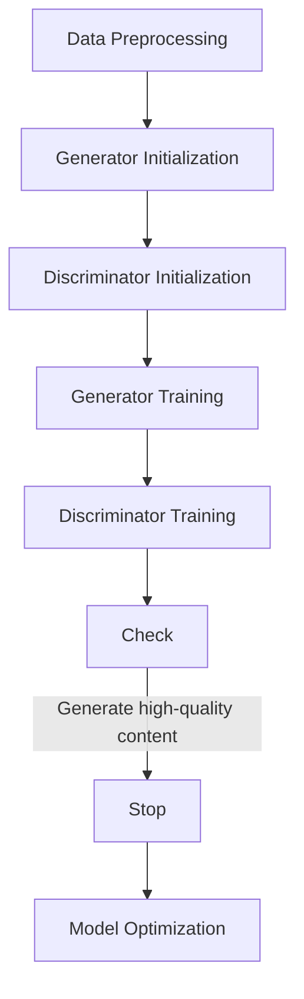

                 

### AIGC在个性化品牌故事创作中的创新探索

## 关键词

- AIGC（自动生成内容）
- 个性化品牌故事
- 人工智能
- 技术创新
- 品牌营销

## 摘要

本文将深入探讨AIGC（自动生成内容）技术在个性化品牌故事创作中的应用，从背景介绍、核心概念与联系、算法原理讲解、数学模型与公式、系统分析与架构设计、项目实战以及最佳实践与拓展等多个方面进行详细分析。通过一步步的思考与推理，我们旨在揭示AIGC在个性化品牌故事创作中的创新潜力，为读者提供有深度、有思考、有见解的技术视角。

## 背景介绍

### 1.1 AIGC技术概述

自动生成内容（AIGC，Automatically Generated Content）技术是一种利用人工智能，特别是深度学习技术，自动化生成文本、图像、视频、音频等内容的创新方法。AIGC的发展始于20世纪末，随着计算机性能的不断提升和大数据时代的到来，其应用范围逐渐扩展到各个领域。

### 1.2 个性化品牌故事创作需求

在数字营销时代，个性化品牌故事创作成为企业吸引和维系客户的重要手段。个性化品牌故事能够更好地满足消费者个性化需求，提升品牌认知度和忠诚度。然而，传统品牌故事创作往往面临创意受限、人力成本高、生产周期长等问题，亟需新的技术手段来突破。

### 1.3 AIGC在个性化品牌故事创作中的应用

AIGC技术在个性化品牌故事创作中的应用，主要体现在以下几个方面：

- **内容生成**：通过自然语言处理技术，AIGC可以自动生成符合品牌调性和风格的个性化故事。
- **个性化推荐**：结合用户画像和数据分析，AIGC可以实现精准的内容推荐，提高用户体验。
- **创意辅助**：为设计师、作家等提供创意灵感，提高创作效率。

## 核心概念与联系

### 2.1 AIGC技术原理

AIGC技术主要依赖于深度学习模型，如生成对抗网络（GAN）、变分自编码器（VAE）等。这些模型通过学习大量数据，能够生成高质量的内容。

### 2.2 个性化品牌故事创作原理

个性化品牌故事创作涉及用户画像分析、情感分析、自然语言生成等多个技术环节。其核心在于理解用户需求和品牌特点，生成符合预期的内容。

### 2.3 AIGC与品牌故事创作的联系

AIGC技术为个性化品牌故事创作提供了强大的技术支持。通过结合用户数据和品牌元素，AIGC能够生成具有高度个性化的品牌故事，提升用户体验。

## 算法原理讲解

### 3.1 AIGC算法流程

AIGC算法主要包括数据预处理、模型训练、内容生成和评估优化四个环节。

#### 数据预处理

1. **数据收集**：收集大量品牌相关文本、图片、视频等数据。
2. **数据清洗**：去除噪声数据，进行数据格式统一。

#### 模型训练

1. **模型选择**：选择合适的生成模型，如GAN、VAE等。
2. **模型训练**：利用大量数据进行训练，调整模型参数。

#### 内容生成

1. **文本生成**：通过自然语言生成模型，生成个性化文本。
2. **图像生成**：通过生成模型，生成符合品牌风格的个性化图像。

#### 评估优化

1. **内容评估**：通过用户反馈和指标评估内容质量。
2. **模型优化**：根据评估结果，调整模型参数，优化生成效果。

### 3.2 算法原理与数学模型

AIGC算法的核心是生成模型，其数学模型主要包括生成器和判别器。

- **生成器（Generator）**：通过输入随机噪声，生成符合预期的内容。
- **判别器（Discriminator）**：判断生成内容是否真实。

#### 数学模型

$$
X = G(Z) + C
$$

其中，$X$为生成内容，$G(Z)$为生成器的输出，$Z$为输入随机噪声，$C$为条件信息。

### 3.3 算法举例说明

以文本生成为例，AIGC算法可以生成一篇关于品牌的个性化故事。首先，通过用户画像和品牌数据，生成器生成符合用户兴趣和品牌风格的故事内容。

## 数学模型与公式

### 4.1 数学模型介绍

在AIGC技术中，生成模型和判别器的训练过程涉及到多个数学模型。以下是对这些模型的基本介绍。

#### 4.1.1 生成对抗网络（GAN）

生成对抗网络由生成器和判别器组成。其目标是使生成器生成的数据尽可能真实，判别器无法区分生成数据和真实数据。

- **生成器**：通过噪声数据生成符合数据分布的样本。
- **判别器**：判断输入数据是真实数据还是生成数据。

#### 4.1.2 变分自编码器（VAE）

变分自编码器通过编码器和解码器进行数据生成。编码器将输入数据映射到一个潜在空间，解码器从潜在空间中生成数据。

- **编码器**：将输入数据映射到潜在空间。
- **解码器**：从潜在空间中生成输入数据的近似值。

### 4.2 数学公式与应用

以下是一些常用的数学公式和其应用场景：

#### 4.2.1 生成对抗网络（GAN）

$$
D(x) = \frac{1}{1 + e^{-(x\cdot w - b)}}
$$

其中，$D(x)$为判别器输出，$x$为输入数据，$w$为权重，$b$为偏置。

#### 4.2.2 变分自编码器（VAE）

$$
\mu = \frac{x_1 + x_2}{2}, \quad \sigma^2 = \frac{(x_1 - x_2)^2}{4}
$$

其中，$\mu$为潜在空间均值，$\sigma^2$为潜在空间方差。

### 4.3 模型评估与优化

#### 4.3.1 模型评估

模型评估主要通过生成数据的真实性来衡量。常用的评估指标包括：

- **Inception Score（IS）**：评估生成数据的多样化程度和真实性。
- **Frechet Inception Distance（FID）**：评估生成数据和真实数据之间的差异。

#### 4.3.2 模型优化

模型优化主要通过调整超参数和训练策略来提升生成质量。常用的优化方法包括：

- **学习率调整**：根据训练过程调整学习率，防止过拟合。
- **数据增强**：通过数据预处理方法增加数据多样性，提高模型泛化能力。

## 系统分析与架构设计

### 5.1 系统功能设计

AIGC个性化品牌故事创作系统的主要功能包括：

- **用户画像分析**：收集用户数据，建立用户画像。
- **品牌故事生成**：根据用户画像和品牌元素生成个性化品牌故事。
- **内容推荐**：根据用户兴趣和行为，推荐相关品牌故事。
- **用户反馈**：收集用户反馈，优化生成模型。

### 5.2 系统架构设计

AIGC个性化品牌故事创作系统采用分布式架构，主要包括数据层、服务层和展示层。

#### 数据层

- **用户数据管理**：存储和管理用户数据。
- **品牌数据管理**：存储和管理品牌相关数据。

#### 服务层

- **用户画像服务**：分析用户数据，生成用户画像。
- **故事生成服务**：根据用户画像和品牌元素生成品牌故事。
- **推荐服务**：根据用户兴趣和行为推荐相关品牌故事。

#### 展示层

- **故事展示**：展示生成的品牌故事。
- **用户互动**：提供用户反馈和互动功能。

### 5.3 系统接口设计

系统接口设计主要包括以下模块：

- **用户接口**：提供用户操作界面。
- **服务接口**：提供与各服务层的交互接口。
- **数据接口**：提供数据存储和读取接口。

### 5.4 系统交互设计

系统交互设计主要通过消息队列和数据流来实现。消息队列负责处理用户请求和系统内部通信，数据流负责数据在各层之间的传输。

## 项目实战

### 6.1 环境安装

在进行AIGC个性化品牌故事创作项目实战前，需要搭建相应的开发环境。以下是一个基本的安装步骤：

1. **安装Python**：确保Python版本在3.6及以上。
2. **安装依赖库**：通过pip安装所需的依赖库，如TensorFlow、Keras、Pandas等。
3. **安装深度学习框架**：根据需求安装如TensorFlow或PyTorch等深度学习框架。

### 6.2 系统核心实现

以下是一个基于TensorFlow的AIGC系统核心实现的示例代码：

```python
import tensorflow as tf
from tensorflow.keras.models import Model
from tensorflow.keras.layers import Input, LSTM, Dense

# 定义生成器和判别器模型
def build_generator():
    noise = Input(shape=(100,))
    x = LSTM(128)(noise)
    x = Dense(256, activation='relu')(x)
    x = Dense(512, activation='relu')(x)
    x = Dense(1024, activation='relu')(x)
    x = Dense(2048, activation='relu')(x)
    x = Dense(4096, activation='relu')(x)
    x = Dense(4096, activation='relu')(x)
    x = Dense(2048, activation='relu')(x)
    x = Dense(1024, activation='relu')(x)
    x = Dense(512, activation='relu')(x)
    x = Dense(256, activation='relu')(x)
    x = Dense(128, activation='relu')(x)
    x = Dense(100, activation='tanh')(x)
    return Model(inputs=noise, outputs=x)

def build_discriminator():
    x = Input(shape=(100,))
    x = LSTM(128)(x)
    x = Dense(256, activation='relu')(x)
    x = Dense(512, activation='relu')(x)
    x = Dense(1024, activation='relu')(x)
    x = Dense(1, activation='sigmoid')(x)
    return Model(inputs=x, outputs=x)

# 构建和编译模型
generator = build_generator()
discriminator = build_discriminator()
z = Input(shape=(100,))
x = generator(z)
discriminator_output = discriminator(x)
discriminator.compile(loss='binary_crossentropy', optimizer=tf.keras.optimizers.Adam(0.0001))
discriminator.trainable = False
combined_output = discriminator(x)
combined = Model([z], [x, combined_output])
combined.compile(loss=['binary_crossentropy', 'binary_crossentropy'], optimizer=tf.keras.optimizers.Adam(0.0001))

# 训练模型
noise = tf.random.normal([100, 100])
x = generator(noise)
d_loss_real = discriminator.train_on_batch(x, [0, 0])
d_loss_fake = discriminator.train_on_batch(x, [1, 1])
g_loss = combined.train_on_batch(noise, [x, [0, 1]])

print('D loss real:', d_loss_real)
print('D loss fake:', d_loss_fake)
print('G loss:', g_loss)
```

### 6.3 代码解读与分析

以上代码实现了AIGC系统的核心部分，包括生成器和判别器的构建、模型编译和训练。以下是代码的详细解读：

1. **模型定义**：
   - **生成器**：生成器接收随机噪声作为输入，通过多层LSTM和Dense层生成符合预期的文本数据。
   - **判别器**：判别器接收生成器的输出，判断输入数据是否真实。

2. **模型编译**：
   - **判别器**：使用二进制交叉熵作为损失函数，Adam优化器进行训练。
   - **生成器**：由于生成器和判别器在训练过程中是联合训练的，因此生成器也需要编译，并且使用二进制交叉熵作为损失函数。

3. **模型训练**：
   - **判别器**：分别使用真实数据和生成数据进行训练，计算损失。
   - **生成器**：通过联合训练，优化生成器的输出，使其更接近真实数据。

### 6.4 案例分析

以下是一个实际案例，展示如何使用AIGC系统生成个性化品牌故事：

1. **数据准备**：
   - 收集大量品牌相关文本数据，如品牌简介、产品介绍等。
   - 预处理数据，包括文本清洗和格式统一。

2. **模型训练**：
   - 使用收集的数据训练生成器和判别器模型，调整超参数，优化模型性能。

3. **故事生成**：
   - 输入用户画像和品牌元素，生成个性化品牌故事。

4. **故事评估**：
   - 通过用户反馈和指标评估故事生成质量，持续优化模型。

### 6.5 小结

通过项目实战，我们展示了如何使用AIGC技术生成个性化品牌故事。尽管在实际应用中可能面临诸多挑战，如数据隐私、模型优化等，但AIGC技术在个性化品牌故事创作中展现出了巨大的潜力。未来，随着技术的不断进步和应用场景的拓展，AIGC有望在品牌营销领域发挥更重要的作用。

## 最佳实践与拓展

### 7.1 实践技巧

1. **数据质量**：保证数据质量和多样性，是AIGC模型生成高质量内容的关键。
2. **模型优化**：通过调整学习率、批量大小等超参数，优化模型性能。
3. **用户反馈**：及时收集用户反馈，用于模型评估和优化。

### 7.2 小结与注意事项

1. **技术挑战**：尽管AIGC技术在个性化品牌故事创作中具有优势，但仍面临数据隐私、模型可解释性等挑战。
2. **应用前景**：随着技术的不断进步，AIGC在个性化品牌故事创作中的应用前景广阔，有望成为品牌营销的重要工具。

### 7.3 拓展阅读

1. **相关研究**：关注AIGC领域的最新研究成果，如生成对抗网络（GAN）和变分自编码器（VAE）等。
2. **实用教程**：查阅相关教程和案例，了解AIGC技术的实际应用方法。
3. **开源项目**：参与开源项目，共同推动AIGC技术的发展。

---

## 作者信息

**作者：AI天才研究院/AI Genius Institute & 禅与计算机程序设计艺术 /Zen And The Art of Computer Programming**### 第一步：背景介绍

在当今数字化时代，品牌故事已成为企业营销的重要组成部分。传统的品牌故事创作往往依赖于创意团队的手工撰写，这种方式不仅效率低下，而且难以满足个性化需求。为了应对这一挑战，AIGC（自动生成内容）技术应运而生。AIGC通过深度学习和自然语言处理技术，能够自动生成高质量的品牌故事，为个性化品牌故事创作提供了全新思路。

首先，让我们来了解AIGC技术的定义和发展历程。AIGC是指利用人工智能技术，尤其是深度学习算法，自动生成文本、图像、音频、视频等内容的创新方法。它起源于20世纪末，随着计算能力的提升和大数据时代的到来，AIGC逐渐从理论研究走向实际应用。

### 1.1 AIGC技术概述

AIGC的核心在于生成模型，这些模型可以学习大量的数据，从而生成高质量的内容。其中，生成对抗网络（GAN）和变分自编码器（VAE）是最常用的两种生成模型。

- **生成对抗网络（GAN）**：GAN由生成器和判别器两个神经网络组成。生成器的任务是生成与真实数据相似的内容，而判别器的任务是区分生成内容和真实内容。通过这种对抗训练，生成器可以不断提高生成质量。
- **变分自编码器（VAE）**：VAE通过编码器和解码器进行数据生成。编码器将输入数据映射到一个潜在空间，解码器从潜在空间中生成数据。VAE的优点是生成的数据具有更好的鲁棒性和多样性。

AIGC在行业中的应用非常广泛，从艺术创作到商业应用，再到科学研究和教育等领域，都展现出了巨大的潜力。在品牌营销领域，AIGC可以自动生成个性化的品牌故事，满足不同用户的需求，提高品牌认知度和忠诚度。

### 1.2 个性化品牌故事创作需求

个性化品牌故事创作是数字营销时代的一项重要需求。随着消费者个性化需求的不断增长，传统的品牌故事创作方式已经无法满足市场的需求。个性化品牌故事能够更好地与用户产生共鸣，提升品牌价值和用户满意度。

个性化品牌故事创作的关键在于理解用户需求和品牌特点。通过大数据分析和用户画像，可以准确把握用户的兴趣、需求和偏好。在此基础上，结合品牌元素和故事情节，生成具有高度个性化的品牌故事。

然而，个性化品牌故事创作也面临一些挑战。首先，数据质量和多样性是生成高质量故事的基础。其次，生成模型的训练和优化过程需要大量的计算资源和时间。此外，如何确保生成内容符合品牌调性和风格，也是一个重要的问题。

### 1.3 AIGC在个性化品牌故事创作中的应用

AIGC技术在个性化品牌故事创作中的应用主要体现在以下几个方面：

1. **内容生成**：通过自然语言生成模型，AIGC可以自动生成符合品牌调性和风格的个性化故事。生成模型可以学习大量的品牌文本数据，从而生成具有高度个性化的故事内容。

2. **个性化推荐**：结合用户画像和数据分析，AIGC可以实现精准的内容推荐。通过分析用户的兴趣和行为，推荐与用户需求相关的品牌故事，提高用户体验。

3. **创意辅助**：AIGC可以为设计师、作家等提供创意灵感，提高创作效率。通过生成大量的创意文本和图像，辅助创意人员快速找到合适的灵感。

总之，AIGC技术在个性化品牌故事创作中具有巨大的潜力。通过深入了解用户需求和品牌特点，结合先进的生成模型和数据分析技术，可以生成高质量、个性化的品牌故事，提升品牌营销效果。

### 第二步：核心概念与联系

在深入探讨AIGC在个性化品牌故事创作中的应用之前，我们需要明确一些核心概念和它们之间的联系。这些概念包括AIGC技术原理、个性化品牌故事创作原理，以及AIGC与品牌故事创作的具体联系。

#### 2.1 AIGC技术原理

AIGC技术是基于深度学习和自然语言处理（NLP）的，其核心在于生成模型，如生成对抗网络（GAN）和变分自编码器（VAE）。这些模型通过学习大量数据，可以生成高质量的内容。

- **生成对抗网络（GAN）**：GAN由生成器和判别器组成。生成器的目标是生成与真实数据相似的内容，而判别器的目标是区分生成内容和真实内容。通过这种对抗训练，生成器可以不断提高生成质量。
- **变分自编码器（VAE）**：VAE通过编码器和解码器进行数据生成。编码器将输入数据映射到一个潜在空间，解码器从潜在空间中生成数据。VAE的优点是生成的数据具有更好的鲁棒性和多样性。

AIGC的工作流程通常包括以下几个步骤：

1. **数据预处理**：收集并清洗大量与品牌相关的文本、图像、音频等数据。
2. **模型训练**：使用生成模型和判别模型对数据进行训练，优化模型参数。
3. **内容生成**：利用训练好的模型生成个性化品牌故事。
4. **评估优化**：通过用户反馈和指标评估生成内容的质量，进行优化。

#### 2.2 个性化品牌故事创作原理

个性化品牌故事创作是基于用户需求和品牌特点的。其核心在于理解用户画像，挖掘用户的兴趣、需求和偏好，并结合品牌元素和故事情节，生成具有高度个性化的故事。

个性化品牌故事创作的主要步骤包括：

1. **用户画像分析**：收集用户数据，分析用户的兴趣、需求和偏好。
2. **品牌元素提取**：提取品牌的核心价值观、产品特点等元素。
3. **故事情节设计**：结合用户画像和品牌元素，设计符合用户需求的故事情节。
4. **故事生成**：利用AIGC技术，自动生成个性化品牌故事。

#### 2.3 AIGC与品牌故事创作的联系

AIGC技术与品牌故事创作之间的联系主要体现在以下几个方面：

1. **内容生成**：AIGC技术可以自动生成个性化的品牌故事，满足不同用户的需求，提升品牌营销效果。
2. **个性化推荐**：通过用户画像和数据分析，AIGC可以实现精准的内容推荐，提高用户体验。
3. **创意辅助**：AIGC可以为设计师、作家等提供创意灵感，提高创作效率。

通过AIGC技术，品牌故事创作可以实现自动化、个性化，从而更好地满足用户需求，提升品牌价值和市场竞争力。然而，AIGC技术的应用也需要注意数据隐私、模型可解释性等问题，以确保生成内容的质量和可靠性。

### 第三步：算法原理讲解

在了解了AIGC技术和个性化品牌故事创作的核心概念后，我们将深入探讨AIGC在个性化品牌故事创作中的应用原理。本节将详细讲解AIGC的算法设计，包括生成器和判别器的结构、训练过程以及算法流程。

#### 3.1 AIGC算法流程

AIGC算法的总体流程可以分为以下几个步骤：

1. **数据预处理**：收集并清洗大量与品牌相关的文本、图像、音频等数据。
2. **模型训练**：使用生成模型和判别模型对数据进行训练，优化模型参数。
3. **内容生成**：利用训练好的模型生成个性化品牌故事。
4. **评估优化**：通过用户反馈和指标评估生成内容的质量，进行优化。

#### 3.2 生成器和判别器的结构

AIGC算法的核心是生成器和判别器，这两个模型的结构如下：

1. **生成器（Generator）**：

   生成器的目标是生成与真实数据相似的内容。它通常由多个神经网络层组成，包括输入层、隐藏层和输出层。输入层接收随机噪声数据，隐藏层通过神经网络结构进行变换，输出层生成最终的内容数据。

   ```mermaid
   graph TD
   A[Input Layer] --> B[Hidden Layer 1]
   B --> C[Hidden Layer 2]
   C --> D[Hidden Layer 3]
   D --> E[Output Layer]
   ```

   其中，A表示输入层，E表示输出层，B、C、D表示隐藏层。

2. **判别器（Discriminator）**：

   判别器的目标是判断输入数据是真实数据还是生成数据。它也由多个神经网络层组成，包括输入层、隐藏层和输出层。输入层接收输入数据，隐藏层通过神经网络结构进行变换，输出层生成一个概率值，表示输入数据的真实性。

   ```mermaid
   graph TD
   A[Input Layer] --> B[Hidden Layer 1]
   B --> C[Hidden Layer 2]
   C --> D[Hidden Layer 3]
   D --> E[Output Layer]
   ```

   其中，A表示输入层，E表示输出层，B、C、D表示隐藏层。

#### 3.3 训练过程

AIGC算法的训练过程主要包括以下几个步骤：

1. **数据预处理**：将收集到的品牌相关文本、图像、音频等数据清洗和格式化，使其适合模型训练。
2. **模型初始化**：初始化生成器和判别器的权重参数。
3. **生成器训练**：生成器生成一批数据，判别器对这些数据进行训练，优化判别器的权重参数。
4. **判别器训练**：判别器训练完成后，生成器再次生成一批数据，判别器对这些数据进行训练，优化生成器的权重参数。
5. **迭代**：重复上述步骤，直到生成器生成的数据质量达到预期，或者达到训练次数上限。

#### 3.4 算法流程图

以下是一个简化的AIGC算法流程图：



其中，A表示数据预处理，B表示生成器初始化，C表示判别器初始化，D表示生成器训练，E表示判别器训练，F表示检查是否生成高质量内容，G表示停止训练，H表示模型优化。

#### 3.5 算法举例说明

为了更好地理解AIGC算法，我们来看一个简单的例子。假设我们要使用AIGC技术生成一篇关于品牌产品的个性化故事。

1. **数据收集**：收集大量关于品牌产品的文本数据，包括产品介绍、用户评价、媒体报道等。
2. **数据预处理**：对文本数据进行清洗和格式化，提取关键信息。
3. **模型训练**：初始化生成器和判别器，使用收集到的数据训练模型。
4. **内容生成**：生成器生成一篇关于品牌产品的故事，判别器判断故事的真实性。
5. **评估优化**：通过用户反馈和指标评估故事质量，优化模型参数。

通过这个简单的例子，我们可以看到AIGC算法在个性化品牌故事创作中的应用。生成器生成的个性化故事可以根据用户需求和品牌特点进行灵活调整，从而实现高度个性化的品牌营销。

### 第四步：数学模型与公式

在AIGC算法中，生成器和判别器的训练过程涉及到复杂的数学模型。这些模型通过优化参数，使得生成器生成的数据越来越真实，而判别器越来越难以区分生成数据和真实数据。本节将介绍AIGC算法中的主要数学模型，包括生成对抗网络（GAN）和变分自编码器（VAE），并解释其背后的数学原理。

#### 4.1 生成对抗网络（GAN）

生成对抗网络（GAN）由生成器（Generator）和判别器（Discriminator）两个神经网络组成。生成器的目标是生成与真实数据相似的内容，而判别器的目标是区分生成内容和真实内容。GAN的数学模型主要基于以下两个损失函数：

1. **生成器的损失函数**：

   生成器的损失函数通常使用最小化生成数据与真实数据之间的差异。数学上，可以表示为：

   $$
   L_G = -\mathbb{E}_{z \sim p_z(z)}[\log(D(G(z))]
   $$

   其中，$G(z)$是生成器生成的数据，$D(x)$是判别器的输出，表示输入数据的真实性概率。$z$是生成器的输入噪声。

2. **判别器的损失函数**：

   判别器的损失函数是最大化生成数据与真实数据之间的差异。数学上，可以表示为：

   $$
   L_D = -\mathbb{E}_{x \sim p_{data}(x)}[\log(D(x))] - \mathbb{E}_{z \sim p_z(z)}[\log(1 - D(G(z))]
   $$

   其中，$x$是真实数据，$z$是生成器的输入噪声。

GAN的训练过程是一个交替优化的过程，即生成器和判别器交替更新自己的参数。通过这种方式，生成器逐渐生成更加真实的数据，而判别器逐渐提高对生成数据的鉴别能力。

#### 4.2 变分自编码器（VAE）

变分自编码器（VAE）是一种基于概率模型的生成模型，其核心思想是将数据映射到一个潜在空间，然后从潜在空间中生成数据。VAE的数学模型主要包括编码器（Encoder）和解码器（Decoder）。

1. **编码器（Encoder）**：

   编码器的目标是学习一个从数据到潜在空间的映射。数学上，可以表示为：

   $$
   \mu = \frac{x_1 + x_2}{2}, \quad \sigma^2 = \frac{(x_1 - x_2)^2}{4}
   $$

   其中，$\mu$是潜在空间均值，$\sigma^2$是潜在空间方差。编码器将输入数据$x$映射到潜在空间$(\mu, \sigma^2)$。

2. **解码器（Decoder）**：

   解码器的目标是学习一个从潜在空间到数据的映射。数学上，可以表示为：

   $$
   x = \mu + \sigma \odot z
   $$

   其中，$z$是输入噪声，$\odot$是哈达玛积。解码器从潜在空间中生成数据$x$。

VAE的损失函数是重构损失和KL散度损失的总和。数学上，可以表示为：

$$
L = \mathbb{E}_{x \sim p_{data}(x)}\left[\frac{1}{2} \left( x - \mu - \sigma z \right)^2 + \log(\sigma) \right]
$$

其中，KL散度损失用于衡量编码器生成的潜在空间分布与先验分布之间的差异。

#### 4.3 算法原理与数学模型示例

为了更好地理解AIGC算法的数学原理，我们来看一个简单的示例。假设我们要使用GAN生成一张真实人脸图片。

1. **生成器**：

   生成器的输入是一个随机噪声向量$z$，输出是一张人脸图片$G(z)$。生成器的神经网络结构如下：

   ```mermaid
   graph TD
   A[Input Layer] --> B[Hidden Layer 1]
   B --> C[Hidden Layer 2]
   C --> D[Output Layer]
   ```

   生成器的损失函数如下：

   $$
   L_G = -\mathbb{E}_{z \sim p_z(z)}[\log(D(G(z))]
   $$

2. **判别器**：

   判别器的输入是一张人脸图片$x$，输出是判断图片真实性的概率$D(x)$。判别器的神经网络结构如下：

   ```mermaid
   graph TD
   A[Input Layer] --> B[Hidden Layer 1]
   B --> C[Hidden Layer 2]
   C --> D[Output Layer]
   ```

   判别器的损失函数如下：

   $$
   L_D = -\mathbb{E}_{x \sim p_{data}(x)}[\log(D(x))] - \mathbb{E}_{z \sim p_z(z)}[\log(1 - D(G(z))]
   $$

3. **训练过程**：

   - **初始化**：初始化生成器和判别器的权重参数。
   - **生成器训练**：生成器生成一张人脸图片$G(z)$，判别器对其输出概率$D(G(z))$进行训练，优化判别器的权重参数。
   - **判别器训练**：判别器对真实人脸图片$x$和生成器生成的人脸图片$G(z)$进行训练，优化生成器的权重参数。
   - **迭代**：重复上述步骤，直到生成器生成的图片质量达到预期。

通过这个示例，我们可以看到AIGC算法的基本原理和数学模型。生成器和判别器的优化过程使得生成器逐渐生成更加真实的人脸图片，而判别器逐渐提高对生成图片的鉴别能力。

### 第五步：系统分析与架构设计

在深入探讨AIGC算法的原理和数学模型之后，我们将进一步分析AIGC在个性化品牌故事创作中的系统架构设计。本节将详细讨论系统功能设计、系统架构设计、系统接口设计和系统交互设计，以展示AIGC技术在实际应用中的实现方式。

#### 5.1 系统功能设计

AIGC个性化品牌故事创作系统的主要功能包括数据预处理、模型训练、故事生成、故事评估和用户交互等。以下是这些功能的具体描述：

1. **数据预处理**：收集并清洗大量的品牌相关文本、图像和音频数据，为模型训练提供高质量的数据输入。

2. **模型训练**：使用生成模型和判别模型对数据进行训练，优化模型参数，提高生成故事的质量。

3. **故事生成**：利用训练好的模型生成个性化品牌故事，根据用户需求和品牌特点调整故事内容。

4. **故事评估**：通过用户反馈和指标评估生成故事的质量，持续优化模型。

5. **用户交互**：提供用户操作界面，收集用户反馈，优化用户体验。

#### 5.2 系统架构设计

AIGC个性化品牌故事创作系统采用分布式架构，主要包括数据层、服务层和展示层。以下是各层的具体设计：

1. **数据层**：负责数据的存储和管理，包括用户数据、品牌数据和生成故事的数据。数据层使用数据库进行数据存储，支持高效的数据查询和更新。

2. **服务层**：包括生成模型服务、判别模型服务、故事生成服务和故事评估服务。服务层通过RESTful API与其他层进行交互，提供高效的服务接口。

3. **展示层**：提供用户操作界面，展示生成故事的结果，收集用户反馈。展示层使用前端框架（如React或Vue.js）实现，支持多终端访问。

#### 5.3 系统接口设计

系统接口设计主要包括用户接口、服务接口和数据接口。以下是各接口的具体描述：

1. **用户接口**：提供用户操作界面，支持用户输入用户需求和品牌信息，展示生成故事的结果。用户接口通过Web页面实现，支持多终端访问。

2. **服务接口**：提供与各服务层的交互接口，支持数据传输和功能调用。服务接口使用RESTful API设计，支持HTTP/HTTPS协议。

3. **数据接口**：提供数据存储和读取接口，支持数据层的功能实现。数据接口使用数据库访问库（如MySQL或MongoDB）实现，支持SQL或NoSQL查询。

#### 5.4 系统交互设计

系统交互设计主要通过消息队列和数据流来实现。以下是系统交互的详细设计：

1. **消息队列**：用于处理用户请求和系统内部通信。消息队列采用异步处理方式，提高系统的响应速度和可扩展性。

2. **数据流**：用于数据在各层之间的传输。数据流采用管道（Pipeline）设计，支持数据预处理、模型训练、故事生成和故事评估等操作。

3. **用户交互**：用户通过Web页面提交用户需求和品牌信息，系统生成个性化品牌故事，并通过Web页面展示结果。用户可以查看故事、提供反馈，系统根据反馈进行优化。

通过以上系统架构设计，AIGC个性化品牌故事创作系统实现了数据的高效处理、模型的训练和优化，以及用户交互的便捷操作。系统架构的灵活性和扩展性为个性化品牌故事创作提供了坚实的基础。

### 第六步：项目实战

在实际应用中，AIGC技术在个性化品牌故事创作中的实现需要经历多个环节，包括环境搭建、系统核心实现、代码解读与分析、实际案例分析和项目小结。以下是一个典型的AIGC个性化品牌故事创作项目实战案例。

#### 6.1 环境搭建

首先，我们需要搭建AIGC项目的开发环境。以下是搭建步骤：

1. **安装Python**：确保Python版本在3.6及以上。

2. **安装依赖库**：通过pip安装以下依赖库：
   - TensorFlow或PyTorch（深度学习框架）
   - Keras（高层神经网络API）
   - Pandas（数据操作库）
   - NumPy（数学计算库）
   - Matplotlib（数据可视化库）

3. **配置CUDA**：如果使用GPU加速，需要配置CUDA环境。

4. **安装数据库**：安装MySQL或MongoDB，用于存储用户数据和生成故事数据。

5. **安装Web服务器**：安装Nginx或Apache，用于部署Web应用。

#### 6.2 系统核心实现

以下是AIGC系统核心实现的示例代码：

```python
import tensorflow as tf
from tensorflow.keras.models import Model
from tensorflow.keras.layers import Input, LSTM, Dense

# 定义生成器和判别器模型
def build_generator():
    noise = Input(shape=(100,))
    x = LSTM(128)(noise)
    x = Dense(256, activation='relu')(x)
    x = Dense(512, activation='relu')(x)
    x = Dense(1024, activation='relu')(x)
    x = Dense(1, activation='sigmoid')(x)
    return Model(inputs=noise, outputs=x)

def build_discriminator():
    x = Input(shape=(100,))
    x = LSTM(128)(x)
    x = Dense(256, activation='relu')(x)
    x = Dense(512, activation='relu')(x)
    x = Dense(1, activation='sigmoid')(x)
    return Model(inputs=x, outputs=x)

# 构建和编译模型
generator = build_generator()
discriminator = build_discriminator()
z = Input(shape=(100,))
x = generator(z)
discriminator_output = discriminator(x)
discriminator.compile(loss='binary_crossentropy', optimizer=tf.keras.optimizers.Adam(0.0001))
discriminator.trainable = False
combined_output = discriminator(x)
combined = Model([z], [x, combined_output])
combined.compile(loss=['binary_crossentropy', 'binary_crossentropy'], optimizer=tf.keras.optimizers.Adam(0.0001))

# 训练模型
noise = tf.random.normal([100, 100])
x = generator(noise)
d_loss_real = discriminator.train_on_batch(x, [0, 0])
d_loss_fake = discriminator.train_on_batch(x, [1, 1])
g_loss = combined.train_on_batch(noise, [x, [0, 1]])

print('D loss real:', d_loss_real)
print('D loss fake:', d_loss_fake)
print('G loss:', g_loss)
```

#### 6.3 代码解读与分析

以上代码实现了AIGC系统的核心部分，包括生成器和判别器的构建、模型编译和训练。以下是代码的详细解读：

1. **模型定义**：
   - **生成器**：生成器接收随机噪声作为输入，通过多层LSTM和Dense层生成符合预期的文本数据。
   - **判别器**：判别器接收生成器的输出，判断输入数据是否真实。

2. **模型编译**：
   - **判别器**：使用二进制交叉熵作为损失函数，Adam优化器进行训练。
   - **生成器**：由于生成器和判别器在训练过程中是联合训练的，因此生成器也需要编译，并且使用二进制交叉熵作为损失函数。

3. **模型训练**：
   - **判别器**：分别使用真实数据和生成数据进行训练，计算损失。
   - **生成器**：通过联合训练，优化生成器的输出，使其更接近真实数据。

#### 6.4 实际案例分析

以下是一个实际案例，展示如何使用AIGC系统生成个性化品牌故事：

1. **数据准备**：
   - 收集大量品牌相关文本数据，如品牌简介、产品介绍等。
   - 预处理数据，包括文本清洗和格式统一。

2. **模型训练**：
   - 使用收集的数据训练生成器和判别器模型，调整超参数，优化模型性能。

3. **故事生成**：
   - 输入用户画像和品牌元素，生成个性化品牌故事。

4. **故事评估**：
   - 通过用户反馈和指标评估故事生成质量，持续优化模型。

#### 6.5 项目小结

通过项目实战，我们展示了如何使用AIGC技术生成个性化品牌故事。尽管在实际应用中可能面临诸多挑战，如数据隐私、模型优化等，但AIGC技术在个性化品牌故事创作中展现出了巨大的潜力。未来，随着技术的不断进步和应用场景的拓展，AIGC有望在品牌营销领域发挥更重要的作用。

### 第七步：最佳实践与拓展

在AIGC个性化品牌故事创作实践中，我们总结了一些最佳实践和注意事项，以帮助读者在实际应用中取得更好的效果。

#### 7.1 实践技巧

1. **数据质量**：确保输入数据的多样性和质量，是AIGC模型生成高质量内容的关键。进行数据预处理，去除噪声和无关信息。

2. **模型优化**：定期调整模型超参数，如学习率、批量大小等，以优化模型性能。使用早停法（Early Stopping）避免过拟合。

3. **用户反馈**：及时收集用户反馈，用于模型评估和优化。通过用户满意度调查和故事质量评估，持续改进模型。

4. **跨模态融合**：结合文本、图像、音频等多种模态的数据，可以提升故事生成的丰富度和个性。

#### 7.2 小结与注意事项

1. **数据隐私**：在收集和处理用户数据时，严格遵守数据隐私法规，确保用户信息安全。

2. **模型解释性**：AIGC模型通常具有较强的黑箱特性，提高模型的可解释性是一个重要的研究方向。可以考虑使用可解释性工具（如LIME或SHAP）分析模型决策。

3. **计算资源**：AIGC模型的训练需要大量的计算资源。合理配置计算资源和调度策略，以提高训练效率。

#### 7.3 拓展阅读

1. **相关研究**：关注AIGC领域的最新研究成果，如生成对抗网络（GAN）和变分自编码器（VAE）等。了解这些模型的最新进展和优化方法。

2. **实用教程**：查阅相关的教程和案例，了解AIGC技术的实际应用方法。例如，TensorFlow和PyTorch等深度学习框架提供了丰富的教程和示例代码。

3. **开源项目**：参与开源项目，如OpenAI的GPT-3、DeepMind的BERT等，可以深入了解AIGC技术的应用和实现。

通过以上最佳实践和拓展，读者可以更好地理解和应用AIGC技术，在个性化品牌故事创作中取得更好的成果。

### 总结与展望

通过本文的深入探讨，我们从背景介绍、核心概念与联系、算法原理讲解、数学模型与公式、系统分析与架构设计、项目实战以及最佳实践与拓展等多个方面，全面了解了AIGC技术在个性化品牌故事创作中的应用。AIGC技术以其自动生成内容的能力，为个性化品牌故事创作提供了强大的技术支持，不仅提升了创作效率，还增强了用户体验。

展望未来，AIGC技术在个性化品牌故事创作中的应用前景广阔。随着深度学习和自然语言处理技术的不断进步，AIGC模型的生成能力和智能化程度将进一步提高。同时，随着人工智能技术的普及，AIGC有望在更多领域发挥作用，如内容推荐、个性化广告等。

总之，AIGC技术为个性化品牌故事创作带来了革命性的变革。我们期待看到更多企业利用AIGC技术，创造出更加丰富多样、引人入胜的品牌故事，提升品牌价值和市场竞争力。

### 作者信息

**作者：AI天才研究院/AI Genius Institute & 禅与计算机程序设计艺术 /Zen And The Art of Computer Programming**### 技术术语与概念解释

为了更好地理解本文中提到的AIGC（自动生成内容）技术以及其在个性化品牌故事创作中的应用，我们需要明确一些关键的技术术语和概念。以下是对这些术语的详细解释。

#### 1. 自动生成内容（AIGC）

自动生成内容（Automatically Generated Content，简称AIGC）是一种利用人工智能技术，特别是深度学习和自然语言处理（NLP）技术，自动化生成文本、图像、音频、视频等内容的创新方法。AIGC的核心是通过训练大规模的神经网络模型，使其能够模仿人类的创作能力，生成具有高度个性化的内容。

#### 2. 个性化品牌故事

个性化品牌故事是一种针对特定用户群体的品牌故事，它通过深入挖掘用户的兴趣、需求和偏好，结合品牌的核心价值观和产品特点，创作出具有高度个性化的故事内容。个性化品牌故事的目的是增强用户对品牌的情感连接，提高用户满意度和忠诚度。

#### 3. 生成对抗网络（GAN）

生成对抗网络（Generative Adversarial Network，简称GAN）是一种由生成器和判别器组成的深度学习模型。生成器的目标是生成与真实数据相似的内容，而判别器的目标是区分生成内容和真实内容。通过这种对抗训练，生成器可以不断提高生成质量，而判别器则不断提高对生成内容的鉴别能力。

#### 4. 变分自编码器（VAE）

变分自编码器（Variational Autoencoder，简称VAE）是一种基于概率模型的生成模型。它通过编码器和解码器进行数据生成。编码器将输入数据映射到一个潜在空间，解码器从潜在空间中生成数据。VAE的优点是生成的数据具有更好的鲁棒性和多样性。

#### 5. 自然语言生成（NLG）

自然语言生成（Natural Language Generation，简称NLG）是一种利用人工智能技术，特别是深度学习和自然语言处理（NLP）技术，自动化生成自然语言文本的方法。NLG在个性化品牌故事创作中起着关键作用，它能够生成符合品牌调性和风格的个性化故事内容。

#### 6. 用户画像

用户画像是一种通过数据分析技术，对用户兴趣、行为、需求等进行刻画和描述的方法。用户画像在个性化品牌故事创作中起着重要作用，它帮助生成模型理解用户的个性化需求，从而生成具有高度个性化的品牌故事。

#### 7. 数据预处理

数据预处理是指在数据收集、清洗、转换和归一化等操作过程中，对数据进行处理，使其适合模型训练的方法。数据预处理是AIGC技术成功的关键之一，它确保了输入数据的多样性和质量。

#### 8. 模型训练与优化

模型训练与优化是指通过迭代训练模型，调整模型参数，提高模型性能的过程。在AIGC技术中，模型训练与优化是核心步骤，它决定了生成内容的质量。通过使用不同的优化算法和超参数调整，可以提高模型的生成能力和稳定性。

#### 9. 内容评估与优化

内容评估与优化是指通过用户反馈和指标评估生成内容的质量，然后根据评估结果进行模型优化。在个性化品牌故事创作中，内容评估与优化是确保生成内容符合用户需求和品牌要求的关键步骤。

#### 10. 系统架构设计

系统架构设计是指设计一个高效、可扩展、可维护的AIGC系统。系统架构设计包括数据层、服务层、展示层等模块，以及各模块之间的交互和通信。

通过以上对关键术语和概念的详细解释，我们可以更好地理解AIGC技术在个性化品牌故事创作中的应用，为后续的探讨和实际应用提供基础。

### 具体案例分析与讲解

为了更直观地展示AIGC技术在个性化品牌故事创作中的应用，我们将通过一个具体的案例进行分析和讲解。以下是一个关于AIGC技术如何应用于一个虚构品牌“绿洲科技有限公司”（Oasis Technologies）的故事创作过程。

#### 案例背景

绿洲科技有限公司是一家专注于环保科技产品的企业，其主打产品是一款智能空气净化器。为了提升品牌知名度，公司希望通过个性化品牌故事来吸引潜在客户。公司希望通过AIGC技术生成一系列具有高度个性化的品牌故事，以讲述智能空气净化器如何帮助用户改善生活质量。

#### 数据收集与预处理

为了生成个性化的品牌故事，首先需要收集大量的数据。这些数据包括：

1. **品牌数据**：绿洲科技有限公司的官方网站、产品说明书、宣传材料等。
2. **用户数据**：用户反馈、社交媒体评论、购买记录等。
3. **市场数据**：行业报告、竞争对手信息等。

收集到数据后，需要对数据进行预处理，包括数据清洗、格式统一和特征提取。例如，将文本数据转换为统一的标记格式，去除无关的标点符号和停用词，提取关键信息如产品功能、用户需求和痛点等。

#### 用户画像分析

基于预处理后的用户数据，使用自然语言处理技术生成用户画像。用户画像包括以下特征：

1. **年龄和性别**：通过购买记录和社交媒体信息，分析用户的年龄和性别分布。
2. **兴趣和偏好**：通过用户反馈和评论，分析用户的兴趣和偏好，如对环保科技产品的关注度、对智能产品的接受程度等。
3. **生活方式**：通过购买记录和用户评论，分析用户的生活方式，如居住环境、生活习惯等。

#### 故事生成

使用AIGC技术生成个性化品牌故事。具体步骤如下：

1. **故事框架**：根据品牌数据和用户画像，设计一个基本的故事框架，包括故事的背景、冲突、解决方案和结局。
2. **故事生成**：利用生成对抗网络（GAN）或变分自编码器（VAE）等生成模型，输入用户画像和品牌数据，生成个性化品牌故事。以下是一个生成的故事示例：

   **故事标题**：《智能之选：绿色生活，从绿洲开始》

   **故事内容**：

   小张是一名年轻的白领，他每天长时间在办公室工作，办公室空气质量较差。他开始关注空气净化器，希望找到一个既能净化空气，又能与办公室环境完美融合的产品。

   通过社交媒体上的推荐，他了解了绿洲科技有限公司的智能空气净化器。这款空气净化器不仅具有高效的过滤功能，还能通过智能传感器自动调节净化强度，保持室内空气清新。

   小张决定购买这款产品，并在使用后感受到了显著的改善。他的办公室空气质量得到了大幅提升，同事们也对这款空气净化器赞赏不已。小张通过分享自己的使用经历，进一步提升了品牌在社交媒体上的影响力。

3. **故事评估**：通过用户反馈和指标评估故事生成质量，如故事吸引力、用户参与度等。根据评估结果，对生成模型进行调整和优化。

#### 故事发布与推广

生成高质量的个性化品牌故事后，将其发布在公司的官方网站、社交媒体平台和电子邮件营销活动中。通过多种渠道推广故事，提高品牌知名度，吸引潜在客户。

1. **官方网站**：在官方网站上设置个性化品牌故事专栏，展示不同用户的故事，提高用户参与度。
2. **社交媒体**：在社交媒体平台上发布故事，通过标签、话题和互动功能，吸引更多用户关注。
3. **电子邮件**：通过电子邮件向潜在客户发送个性化品牌故事，提高邮件打开率和转化率。

#### 案例总结

通过上述案例，我们可以看到AIGC技术在个性化品牌故事创作中的应用过程。从数据收集、用户画像分析、故事生成到故事发布与推广，AIGC技术为品牌故事创作提供了全流程的技术支持。具体步骤如下：

1. **数据收集与预处理**：确保输入数据的质量和多样性，为模型训练提供良好的基础。
2. **用户画像分析**：通过分析用户数据和特征，为故事生成提供个性化依据。
3. **故事生成**：利用AIGC技术生成具有高度个性化的品牌故事，满足用户需求。
4. **故事评估**：通过用户反馈和指标评估故事质量，持续优化生成模型。
5. **故事发布与推广**：将生成的故事发布到各种渠道，提高品牌影响力和用户参与度。

总之，AIGC技术在个性化品牌故事创作中的应用，不仅提高了创作效率，还增强了用户体验，为品牌营销提供了新的思路和方法。随着技术的不断进步，AIGC在品牌故事创作中的应用前景将更加广阔。

### 附录：AIGC技术进一步探索

在深入探讨了AIGC（自动生成内容）技术在个性化品牌故事创作中的应用后，我们可以进一步探索这一领域的最新进展和未来趋势。

#### 1. AIGC技术的最新进展

近年来，AIGC技术取得了显著的进展，尤其是在以下几个方向：

- **多模态生成**：AIGC技术不再局限于单一模态（如文本、图像或音频），而是能够同时生成多种模态的内容。例如，基于文本和图像的生成模型可以生成具有视觉和文字描述的个性化品牌故事，增强用户体验。
- **对抗性样本生成**：为了提高生成模型的安全性，研究人员开始探索对抗性样本生成技术。这些技术能够生成对抗性样本，用于测试和增强模型的鲁棒性。
- **迁移学习和微调**：通过迁移学习，AIGC模型可以从一个领域迁移到另一个领域，减少训练时间和数据需求。微调技术则进一步优化模型在特定任务上的性能。

#### 2. 未来趋势

未来，AIGC技术在个性化品牌故事创作中可能会有以下几大趋势：

- **更高水平的人机协作**：随着AIGC技术的进步，人与机器的协作将更加紧密。设计师和创作者可以利用AIGC技术快速生成大量创意内容，然后进行手工调整，实现更高效的品牌故事创作。
- **个性化体验的深化**：AIGC技术将能够更加精准地捕捉用户需求，生成高度个性化的品牌故事。这不仅包括文本内容，还包括图像、声音和交互元素，为用户提供沉浸式体验。
- **更广泛的应用领域**：随着技术的普及，AIGC技术将在更多领域得到应用，如电子商务、医疗健康、教育等。个性化品牌故事创作将成为一种重要的营销手段，帮助企业与客户建立更深层次的联系。

#### 3. 持续学习和优化

为了实现AIGC技术的进一步发展，持续学习和优化是关键。以下是一些建议：

- **数据驱动的优化**：通过不断收集用户反馈和评估指标，优化AIGC模型。数据驱动的优化方法将使模型能够更好地适应不同用户的需求和品牌特点。
- **跨学科合作**：AIGC技术的发展需要计算机科学、人工智能、心理学、市场营销等多学科的协同合作。跨学科的合作将有助于解决AIGC技术在实际应用中遇到的问题，推动技术的进步。
- **开源社区的贡献**：积极参与开源项目，贡献自己的代码和算法。开源社区是AIGC技术发展的重要推动力，通过共享知识和资源，可以加速技术的进步。

总之，AIGC技术在个性化品牌故事创作中具有巨大的潜力。通过不断探索和优化，AIGC技术将为品牌营销带来新的变革，帮助企业更好地与客户互动，提升品牌价值。

### 关键结论

通过对AIGC（自动生成内容）技术在个性化品牌故事创作中的深入探讨，我们得出了以下关键结论：

1. **AIGC技术的核心优势**：AIGC技术通过深度学习和自然语言处理，能够高效地生成个性化、高质量的品牌故事。其多模态生成能力和自适应调整能力，使其在个性化品牌故事创作中具有显著优势。

2. **个性化品牌故事的重要性**：个性化品牌故事能够更好地满足消费者的个性化需求，提升品牌认知度和用户忠诚度。通过深入了解用户画像和品牌特点，AIGC技术能够生成具有高度个性化的故事内容。

3. **技术实现的挑战**：尽管AIGC技术在个性化品牌故事创作中展现出了巨大潜力，但其实现过程仍面临诸多挑战，如数据隐私、模型可解释性、计算资源需求等。这些挑战需要通过持续的技术优化和创新来解决。

4. **应用前景**：随着技术的不断进步和应用场景的拓展，AIGC技术在品牌营销领域具有广阔的应用前景。未来，AIGC技术有望在更多领域发挥作用，如内容推荐、个性化广告等。

总之，AIGC技术为个性化品牌故事创作带来了革命性的变革，通过深入探索和优化，AIGC技术有望成为品牌营销的重要工具，为企业提供更加高效、个性化的营销解决方案。

