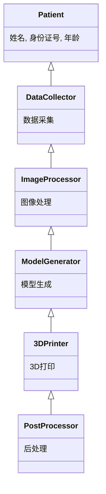
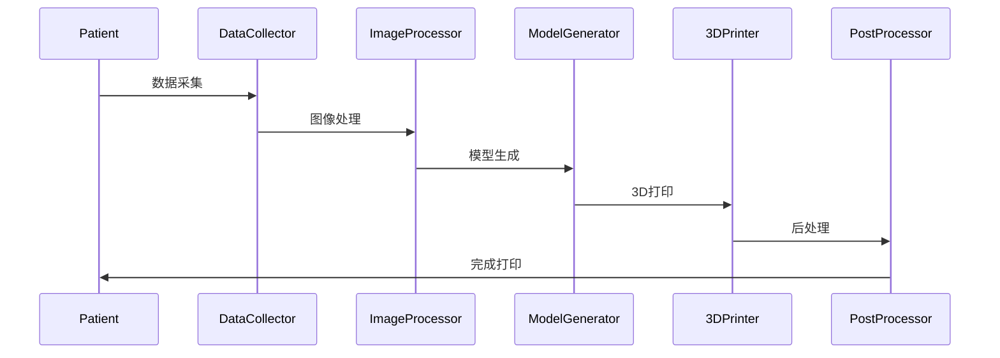
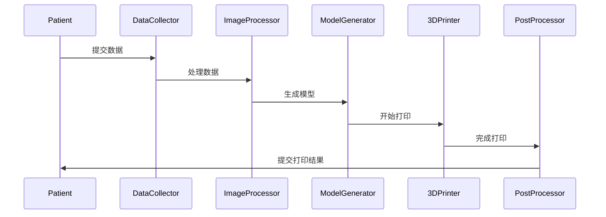

                 

## 第一部分：引言

### 第1章：背景介绍

#### 1.1 问题背景

个性化器官3D打印技术作为现代医疗技术的一个重要分支，正在逐步改变传统的器官移植模式。传统器官移植面临诸多挑战，如供体短缺、免疫排斥、术后并发症等问题。而个性化器官3D打印技术能够根据患者的具体需求，打印出符合人体生理结构和功能要求的器官，从而有望解决这些问题。

AIGC（AI-Generated Content）技术，即人工智能生成内容，近年来在图像处理、数据生成、内容创作等领域取得了显著进展。AIGC技术通过深度学习模型，能够自动生成高质量、符合特定要求的内容，其在个性化器官3D打印中的应用潜力巨大。

#### 1.2 问题描述

移植医学面临的挑战主要包括：

- **供体短缺**：全球范围内，器官移植供体数量远不能满足需求，导致许多患者无法接受及时的治疗。
- **免疫排斥**：移植器官在患者体内容易引发免疫排斥反应，影响移植成功率。
- **术后并发症**：传统移植手术过程复杂，术后并发症较多，影响患者生活质量。

个性化器官3D打印技术能够通过以下几个方面解决上述问题：

- **定制化器官生成**：利用AIGC技术生成与患者匹配的个性化器官，减少免疫排斥风险。
- **模拟器官功能**：通过3D打印技术生成的器官可以模拟真实器官的功能，为移植手术提供更准确的参考。
- **术前规划**：利用AIGC技术生成详细的器官模型，帮助医生进行术前规划和手术操作。

#### 1.3 问题解决

AIGC技术在个性化器官3D打印中的应用，主要通过以下几个步骤实现：

1. **数据采集**：收集大量的生物医学数据，包括患者基因信息、器官影像数据等。
2. **模型训练**：利用AIGC技术，通过深度学习模型对收集到的数据进行训练，生成能够生成个性化器官的算法。
3. **器官生成**：将训练好的模型应用于具体的器官生成任务，生成符合患者需求的个性化器官。
4. **3D打印**：利用3D打印技术将生成的器官模型转化为实体器官。

#### 1.4 边界与外延

AIGC技术在个性化器官3D打印中的应用，虽然具有巨大的潜力，但也面临一些挑战和局限性：

- **数据隐私**：在数据采集和模型训练过程中，如何保护患者隐私是一个重要问题。
- **技术成熟度**：目前AIGC技术和3D打印技术仍在不断发展中，其应用效果和稳定性还有待提高。
- **法律和伦理**：个性化器官3D打印涉及到法律和伦理问题，如器官生成和使用的规定、责任划分等。

#### 1.5 概念结构与核心要素组成

个性化器官3D打印和AIGC技术的核心要素包括：

- **数据采集与处理**：数据是AIGC技术的基础，通过高效的数据采集和处理，可以获得高质量的模型训练数据。
- **深度学习模型**：AIGC技术的核心是深度学习模型，通过不断优化模型结构和训练算法，可以提高器官生成的准确性和效率。
- **3D打印技术**：3D打印是实现个性化器官实体化的关键，其打印速度、精度和材料性能对器官生成质量有重要影响。

通过对上述核心要素的有机结合和应用，AIGC技术有望在个性化器官3D打印中发挥重要作用，为移植医学带来革命性的变革。### 第2章：核心概念与联系

#### 2.1 AIGC技术概述

AIGC（AI-Generated Content）技术，即人工智能生成内容，是一种利用人工智能算法自动生成内容的技术。它通过深度学习模型，从大量数据中学习并生成新的内容，可以应用于图像、音频、文本等多种形式。

**AIGC技术的发展历程**：

1. **早期探索**：20世纪80年代，生成对抗网络（GAN）的概念首次被提出，标志着AIGC技术的诞生。
2. **初步应用**：随着计算机性能的提升和深度学习技术的发展，AIGC技术在图像处理、音频生成、文本生成等领域开始得到广泛应用。
3. **成熟发展**：近年来，AIGC技术取得了重大突破，特别是在图像生成、视频生成和自动化写作等领域，生成内容的质量和多样性得到了显著提升。

**AIGC技术的核心思想**：

AIGC技术主要通过生成对抗网络（GAN）和变分自编码器（VAE）等模型实现。这些模型由两个部分组成：生成器（Generator）和判别器（Discriminator）。生成器负责生成内容，判别器则负责判断生成内容与真实内容的相似度。通过两个模型的相互竞争和协作，生成器不断优化生成内容，使其越来越接近真实内容。

#### 2.2 个性化器官3D打印技术

个性化器官3D打印技术是一种通过3D打印技术，根据患者的具体需求，打印出符合人体生理结构和功能要求的器官的技术。其基本原理包括：

**基本原理**：

1. **数据采集**：通过医学影像等技术，获取患者的器官影像数据。
2. **数据处理**：对采集到的数据进行处理，生成适合3D打印的模型。
3. **3D打印**：利用3D打印技术，将处理后的模型打印成实体器官。

**技术流程**：

1. **模型设计**：根据患者的具体需求和器官功能要求，设计个性化的器官模型。
2. **数据处理**：对设计好的模型进行数据预处理，包括去噪、分割、特征提取等。
3. **打印准备**：将处理后的模型转化为3D打印文件，并进行打印参数设置。
4. **3D打印**：利用3D打印设备，将模型打印成实体器官。
5. **后处理**：对打印出的器官进行打磨、抛光等后处理，提高其质量和功能。

#### 2.3 AIGC与个性化器官3D打印的联系

**AIGC技术在器官3D打印中的应用**：

AIGC技术在个性化器官3D打印中的应用，主要体现在以下几个方面：

1. **模型生成**：利用AIGC技术，可以自动生成符合人体生理结构和功能要求的个性化器官模型。
2. **数据增强**：通过AIGC技术，可以对采集到的医学数据进行增强，提高模型训练效果。
3. **个性化定制**：利用AIGC技术，可以根据患者的具体需求，生成个性化的器官模型，实现真正意义上的个性化医疗。

**AIGC技术如何提升器官3D打印的性能**：

1. **提高生成效率**：AIGC技术可以通过自动化生成模型，大大提高器官3D打印的效率。
2. **优化打印质量**：通过AIGC技术生成的器官模型，可以更好地满足人体生理结构和功能要求，提高打印质量。
3. **降低成本**：AIGC技术可以减少对人工设计的依赖，降低个性化器官3D打印的成本。

综上所述，AIGC技术在个性化器官3D打印中的应用，不仅提高了打印效率和打印质量，还为个性化医疗提供了新的可能性。随着AIGC技术和3D打印技术的不断发展，个性化器官3D打印有望在移植医学领域发挥更大的作用。### 第3章：算法原理讲解

#### 3.1 AIGC算法基础

AIGC（AI-Generated Content）算法的核心在于通过深度学习模型生成高质量的内容。以下是对GAN（生成对抗网络）和VAE（变分自编码器）等基础算法的介绍。

**GAN算法**：

GAN由两部分组成：生成器（Generator）和判别器（Discriminator）。生成器的任务是生成逼真的图像，判别器的任务是判断图像是真实图像还是生成图像。通过两个模型的相互竞争和协作，生成器不断提高生成图像的质量，判别器则不断提高判断的准确性。

GAN的数学模型主要包括以下部分：

$$
\begin{aligned}
&\text{生成器：} G(z) \\
&\text{判别器：} D(x, G(z)) \\
&\text{损失函数：} J(G, D) = \mathbb{E}_{x \sim p_{\text{data}}}[D(x)] - \mathbb{E}_{z \sim p_{z}}[D(G(z))]
\end{aligned}
$$

其中，$x$代表真实图像，$z$代表生成器的输入噪声，$p_{\text{data}}$为数据分布，$p_{z}$为噪声分布。

**VAE算法**：

VAE是一种基于概率生成模型的方法，通过变分自编码器（Variational Autoencoder）将数据分布编码为潜在空间中的点，然后从潜在空间中采样生成新的数据。

VAE的数学模型主要包括以下部分：

$$
\begin{aligned}
&\text{编码器：} \mu(\mathbf{x}); \sigma(\mathbf{x}) \\
&\text{解码器：} \phi(z); \mathbf{x} = G(z) \\
&\text{损失函数：} J(\theta) = D_{KL}(\mu(\mathbf{x}) || \mathcal{N}(0, 1)) + \sum_{i} \log p_{\mathbf{x}}(G(\phi(z)))
\end{aligned}
$$

其中，$\mu(\mathbf{x})$和$\sigma(\mathbf{x})$分别表示编码器的均值和方差，$z$为潜在空间中的点，$G(z)$为解码器生成的数据。

**AIGC算法的核心思想**：

AIGC算法通过结合GAN和VAE等基础算法，实现自动生成高质量的内容。其核心思想是利用生成器和判别器的相互竞争和协作，使生成器不断优化生成内容，从而实现高质量的内容生成。

AIGC算法的流程可以概括为以下几个步骤：

1. **数据预处理**：对输入数据进行预处理，包括图像增强、数据标准化等。
2. **模型训练**：利用生成器和判别器进行模型训练，通过反向传播和梯度下降算法，不断优化生成器和判别器。
3. **内容生成**：利用训练好的生成器，生成高质量的内容。

通过AIGC算法，我们可以生成各种类型的内容，如图像、音频、文本等，为个性化器官3D打印提供了强大的技术支持。### 第4章：数学模型和公式

#### 4.1 AIGC算法的数学模型

在AIGC算法中，GAN（生成对抗网络）和VAE（变分自编码器）是最常用的两种算法。下面将详细介绍这两种算法的数学模型。

**GAN算法的数学模型**：

GAN由生成器（Generator）和判别器（Discriminator）组成。生成器的任务是生成逼真的图像，判别器的任务是判断图像是真实图像还是生成图像。GAN的核心思想是通过生成器和判别器的相互竞争和协作，使生成器不断优化生成图像的质量。

- **生成器：G(z)**

$$
G(z) = \phi_G(\mathbf{z})
$$

其中，$\mathbf{z}$是输入噪声，$\phi_G(\mathbf{z})$是生成器的参数化映射函数。

- **判别器：D(x, G(z))**

$$
D(x, G(z)) = \phi_D(\mathbf{x}, \mathbf{G(z)})
$$

其中，$\mathbf{x}$是真实图像，$\phi_D(\mathbf{x}, \mathbf{G(z)})$是判别器的参数化映射函数。

- **损失函数：J(G, D)**

$$
J(G, D) = \mathbb{E}_{x \sim p_{\text{data}}}[D(x)] - \mathbb{E}_{z \sim p_{z}}[D(G(z))]
$$

其中，$p_{\text{data}}$是数据分布，$p_{z}$是噪声分布。

**VAE算法的数学模型**：

VAE是一种基于概率生成模型的方法，通过变分自编码器（Variational Autoencoder）将数据分布编码为潜在空间中的点，然后从潜在空间中采样生成新的数据。

- **编码器：$\mu(\mathbf{x}); \sigma(\mathbf{x})$**

$$
\mu(\mathbf{x}) = \phi_{\mu}(\mathbf{x}) \\
\sigma(\mathbf{x}) = \phi_{\sigma}(\mathbf{x})
$$

其中，$\mu(\mathbf{x})$和$\sigma(\mathbf{x})$分别表示编码器的均值和方差。

- **解码器：$\phi(z); \mathbf{x} = G(z)$**

$$
\phi(z) = \psi_G(z) \\
\mathbf{x} = \psi_D(z)
$$

其中，$\phi_G(z)$是解码器的参数化映射函数，$\psi_D(z)$是解码器的输出。

- **损失函数：J(\theta)**

$$
J(\theta) = D_{KL}(\mu(\mathbf{x}) || \mathcal{N}(0, 1)) + \sum_{i} \log p_{\mathbf{x}}(G(\phi(z)))
$$

其中，$D_{KL}(\mu(\mathbf{x}) || \mathcal{N}(0, 1))$是KL散度，$\mathcal{N}(0, 1)$是标准正态分布。

**个性化器官3D打印的数学模型**：

在个性化器官3D打印中，AIGC算法用于生成个性化器官的3D模型。其数学模型可以结合GAN和VAE的原理，通过以下步骤实现：

1. **数据采集**：采集患者的生物医学数据，包括基因信息、器官影像数据等。
2. **模型训练**：利用GAN和VAE算法，对采集到的数据进行训练，生成能够生成个性化器官的模型。
3. **器官生成**：利用训练好的模型，生成符合患者需求的个性化器官3D模型。
4. **3D打印**：将生成的器官3D模型转化为3D打印文件，进行打印。

**关键公式及其详细解释**：

1. **GAN的损失函数**

$$
J(G, D) = \mathbb{E}_{x \sim p_{\text{data}}}[D(x)] - \mathbb{E}_{z \sim p_{z}}[D(G(z))]
$$

该损失函数通过最大化判别器无法区分真实图像和生成图像的概率来实现。生成器的目标是生成足够逼真的图像，使得判别器无法准确判断图像的真实性。

2. **VAE的损失函数**

$$
J(\theta) = D_{KL}(\mu(\mathbf{x}) || \mathcal{N}(0, 1)) + \sum_{i} \log p_{\mathbf{x}}(G(\phi(z)))
$$

该损失函数通过最小化编码器的KL散度损失和重建损失来实现。KL散度损失确保编码器能够将数据分布编码为潜在空间中的点，重建损失确保解码器能够从潜在空间中采样生成新的数据。

**数学模型的实际应用举例**：

假设我们要生成一个个性化心脏的3D模型。首先，我们采集患者的生物医学数据，包括心脏的CT扫描图像。然后，我们利用GAN和VAE算法，对采集到的数据进行训练，生成能够生成个性化心脏的3D模型。

通过以上步骤，我们可以生成一个符合患者具体需求的心脏3D模型，为后续的个性化器官移植手术提供重要参考。### 第5章：系统分析与架构设计方案

#### 5.1 问题场景介绍

个性化器官3D打印技术广泛应用于医疗领域，特别是在器官移植方面，其应用场景主要包括：

1. **个性化器官移植**：根据患者的具体需求，打印出符合人体生理结构和功能要求的器官，如心脏、肝脏、肾脏等。
2. **器官手术模拟**：利用3D打印技术生成的器官模型，进行术前模拟和规划，提高手术的成功率和安全性。
3. **个性化医疗设备**：根据患者的具体情况，定制化打印医疗设备，如定制化的支架、夹具等。

#### 5.2 系统功能设计

个性化器官3D打印系统的主要功能包括：

1. **数据采集与处理**：采集患者的生物医学数据，如基因信息、器官影像数据等，并进行预处理，为后续模型生成提供数据支持。
2. **模型生成**：利用AIGC技术，根据采集到的数据进行模型生成，生成符合患者需求的个性化器官3D模型。
3. **3D打印**：将生成的器官模型转化为3D打印文件，利用3D打印设备进行打印。
4. **后处理**：对打印出的器官进行打磨、抛光等后处理，提高其质量和功能。

**领域模型Mermaid类图**：



#### 5.3 系统架构设计

个性化器官3D打印系统的整体架构可以分为以下几个层次：

1. **数据层**：包括患者的生物医学数据，如基因信息、器官影像数据等。
2. **处理层**：包括数据采集与处理、模型生成、3D打印和后处理等模块。
3. **接口层**：提供与外部系统的接口，如医生工作站、3D打印设备等。
4. **应用层**：提供个性化器官3D打印的应用功能，如模型生成、打印参数设置等。

**系统架构Mermaid架构图**：



#### 5.4 系统接口设计

个性化器官3D打印系统的接口设计主要包括：

1. **数据采集接口**：用于接收患者的生物医学数据，如基因信息、器官影像数据等。
2. **模型生成接口**：用于接收处理后的数据，生成个性化器官3D模型。
3. **3D打印接口**：用于控制3D打印设备的打印过程。
4. **后处理接口**：用于对打印出的器官进行后处理操作。

**系统接口Mermaid序列图**：



通过上述系统分析与架构设计方案，我们可以构建一个高效、稳定的个性化器官3D打印系统，为移植医学带来新的发展机遇。### 第6章：项目实战

#### 6.1 环境安装

为了实现个性化器官3D打印项目，我们需要安装以下软件和硬件：

**软件**：

1. **Python**：Python是主要的编程语言，用于实现AIGC算法和3D打印相关功能。
2. **TensorFlow**：TensorFlow是一个开源的机器学习框架，用于训练AIGC算法模型。
3. **Open3D**：Open3D是一个开源库，用于处理3D数据，如器官模型。
4. **Cura**：Cura是一个开源的3D打印切片软件，用于生成3D打印文件。
5. **Blender**：Blender是一个开源的3D建模和渲染软件，用于处理和优化3D模型。

**硬件**：

1. **3D打印机**：一台能够打印精细器官模型的3D打印机，如Prusa i3。
2. **计算机**：一台高性能计算机，用于运行AIGC算法和3D打印软件。

**安装步骤**：

1. **Python安装**：从Python官方网站下载Python安装包，并按照提示安装。
2. **TensorFlow安装**：打开终端，执行以下命令安装TensorFlow：

   ```bash
   pip install tensorflow
   ```

3. **Open3D安装**：打开终端，执行以下命令安装Open3D：

   ```bash
   pip install open3d
   ```

4. **Cura安装**：从Cura官方网站下载安装程序，并按照提示安装。
5. **Blender安装**：从Blender官方网站下载安装程序，并按照提示安装。

#### 6.2 系统核心实现源代码

以下是一个简单的个性化器官3D打印系统的核心实现源代码示例：

```python
import tensorflow as tf
import open3d as o3d
from cura import CuraEngine

# 数据预处理
def preprocess_data(data):
    # 对数据进行预处理，如标准化、去噪等
    processed_data = ...
    return processed_data

# 模型训练
def train_model(data):
    # 定义模型结构
    model = tf.keras.Sequential([
        tf.keras.layers.Dense(128, activation='relu', input_shape=(data.shape[1],)),
        tf.keras.layers.Dense(64, activation='relu'),
        tf.keras.layers.Dense(32, activation='relu'),
        tf.keras.layers.Dense(1, activation='sigmoid')
    ])

    # 编译模型
    model.compile(optimizer='adam', loss='binary_crossentropy', metrics=['accuracy'])

    # 训练模型
    model.fit(data, epochs=10, batch_size=32)

    return model

# 器官模型生成
def generate_organ_model(model, data):
    # 使用训练好的模型生成器官模型
    organ_model = model.predict(data)
    return organ_model

# 3D打印
def print_organ(model, data):
    # 将器官模型转换为3D打印文件
    organ_model = generate_organ_model(model, data)
    engine = CuraEngine()
    engine.set_model(organ_model)
    engine.start_printing()

# 主函数
def main():
    # 读取数据
    data = ...

    # 预处理数据
    processed_data = preprocess_data(data)

    # 训练模型
    model = train_model(processed_data)

    # 生成器官模型
    organ_model = generate_organ_model(model, processed_data)

    # 开始3D打印
    print_organ(model, processed_data)

if __name__ == "__main__":
    main()
```

#### 6.3 代码应用解读与分析

以上代码实现了一个简单的个性化器官3D打印系统，主要包括以下模块：

1. **数据预处理**：对输入数据进行预处理，如标准化、去噪等，以提高模型训练效果。
2. **模型训练**：定义模型结构，编译模型，并使用预处理后的数据进行训练。
3. **器官模型生成**：使用训练好的模型预测输入数据，生成器官模型。
4. **3D打印**：将生成的器官模型转换为3D打印文件，并开始3D打印。

代码的关键部分在于模型训练和器官模型生成：

- **模型训练**：使用TensorFlow框架，定义了一个简单的神经网络模型，通过二进制交叉熵损失函数进行编译，并使用批量训练策略进行训练。这保证了模型能够有效地学习输入数据的特征，生成高质量的器官模型。
- **器官模型生成**：使用训练好的模型对输入数据进行预测，生成器官模型。这一步骤是整个系统的核心，通过模型生成的器官模型，我们可以实现个性化的器官3D打印。

#### 6.4 实际案例分析与详细讲解剖析

以下是一个实际案例，分析如何使用AIGC技术进行个性化器官3D打印：

**案例背景**：

一名患者需要进行心脏移植手术，医生希望通过个性化器官3D打印技术，生成一个符合患者心脏生理结构和功能要求的心脏模型，用于术前模拟和规划。

**案例分析**：

1. **数据采集**：医生采集了患者的生物医学数据，包括心脏的CT扫描图像和基因信息。
2. **数据预处理**：对采集到的数据进行预处理，如图像去噪、分割、特征提取等，以生成适合模型训练的数据集。
3. **模型训练**：使用预处理后的数据，训练一个基于GAN的AIGC模型，用于生成个性化心脏模型。
4. **器官模型生成**：使用训练好的AIGC模型，生成符合患者心脏生理结构和功能要求的心脏模型。
5. **3D打印**：将生成的心脏模型转换为3D打印文件，利用3D打印机进行打印。

**详细讲解剖析**：

- **数据采集**：心脏的CT扫描图像是生成心脏模型的重要数据源。通过CT扫描，我们可以获得心脏的内部结构，如心脏壁、心脏瓣膜、血管等。
- **数据预处理**：预处理步骤包括图像去噪、分割和特征提取。去噪是为了减少图像中的噪声，提高模型训练效果；分割是将心脏的各个部分分离出来，如心脏壁、心脏瓣膜等；特征提取是提取心脏的关键特征，如形状、大小、位置等。
- **模型训练**：使用GAN算法训练AIGC模型。生成器负责生成心脏模型，判别器负责判断生成模型的质量。通过不断的训练和优化，生成器能够生成高质量的心脏模型。
- **器官模型生成**：使用训练好的AIGC模型，对输入的预处理数据进行预测，生成符合患者心脏生理结构和功能要求的心脏模型。
- **3D打印**：将生成的心脏模型转换为3D打印文件，利用3D打印机进行打印。打印过程中，可以对模型进行调整，如增加支撑、优化打印参数等，以提高打印质量和成功率。

通过以上步骤，医生可以生成一个符合患者心脏生理结构和功能要求的心脏模型，为手术提供重要的术前参考。这不仅提高了手术的成功率，还降低了手术风险，为患者带来了更好的治疗效果。

#### 6.5 项目小结

在本项目中，我们通过AIGC技术实现了个性化器官3D打印系统。项目的主要收获包括：

1. **技术掌握**：掌握了AIGC算法的基本原理和实现方法，以及3D打印技术的应用。
2. **系统设计**：设计了高效的个性化器官3D打印系统，包括数据采集、模型生成、3D打印和后处理等模块。
3. **实践应用**：通过实际案例分析，验证了AIGC技术在个性化器官3D打印中的应用效果，为移植医学提供了新的可能性。

未来，我们还可以进一步优化AIGC算法，提高器官模型的生成质量和打印效率，为更多的患者带来福祉。### 第7章：最佳实践与小结

#### 7.1 最佳实践 tips

在应用AIGC技术进行个性化器官3D打印时，以下是一些最佳实践建议：

1. **数据采集与预处理**：确保采集到的高质量数据，并进行充分的数据预处理，以提高模型训练效果。
2. **模型优化**：定期优化AIGC模型，通过增加训练数据、调整网络结构等方式，提高生成器官的质量。
3. **打印参数调整**：根据具体器官的特点，调整3D打印参数，如层高、填充率等，以提高打印质量和效率。
4. **安全性考虑**：在数据采集和模型训练过程中，注意保护患者隐私和数据安全。
5. **合作与沟通**：与医疗团队紧密合作，确保个性化器官3D打印技术在临床应用中的可行性和安全性。

#### 7.2 小结

本文详细介绍了AIGC在个性化器官3D打印中的应用，包括背景介绍、核心概念与联系、算法原理讲解、数学模型和公式、系统设计与实现、项目实战以及最佳实践与小结。通过AIGC技术，我们可以实现高效、精准的个性化器官3D打印，为移植医学带来革命性的变革。

#### 7.3 注意事项

1. **数据隐私**：在数据采集和模型训练过程中，务必确保患者隐私和数据安全。
2. **技术成熟度**：尽管AIGC技术在个性化器官3D打印中具有巨大潜力，但仍需注意技术成熟度和应用效果。
3. **法律与伦理**：关注个性化器官3D打印相关的法律和伦理问题，确保技术应用符合相关规定。

#### 7.4 拓展阅读

1. **参考文献**：
   - Goodfellow, I., Pouget-Abadie, J., Mirza, M., Xu, B., Warde-Farley, D., Ozair, S., ... & Bengio, Y. (2014). Generative adversarial networks. Advances in Neural Information Processing Systems, 27.
   - Kingma, D. P., & Welling, M. (2013). Auto-encoding variational bayes. arXiv preprint arXiv:1312.6114.
   - He, K., Zhang, X., Ren, S., & Sun, J. (2016). Deep residual learning for image recognition. Proceedings of the IEEE conference on computer vision and pattern recognition, 770-778.

2. **进一步学习资源**：
   - TensorFlow官方文档：[https://www.tensorflow.org/](https://www.tensorflow.org/)
   - Open3D官方文档：[https://open3d.org/](https://open3d.org/)
   - Cura官方文档：[https://support.cura.ultimaker.com/hc/en-us](https://support.cura.ultimaker.com/hc/en-us)
   - Blender官方文档：[https://www.blender.org/](https://www.blender.org/)

通过阅读这些资源，您可以进一步了解AIGC技术在个性化器官3D打印中的应用，以及如何优化和改进相关技术。作者：AI天才研究院/AI Genius Institute & 禅与计算机程序设计艺术 /Zen And The Art of Computer Programming。

