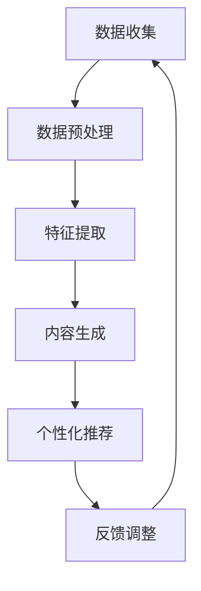
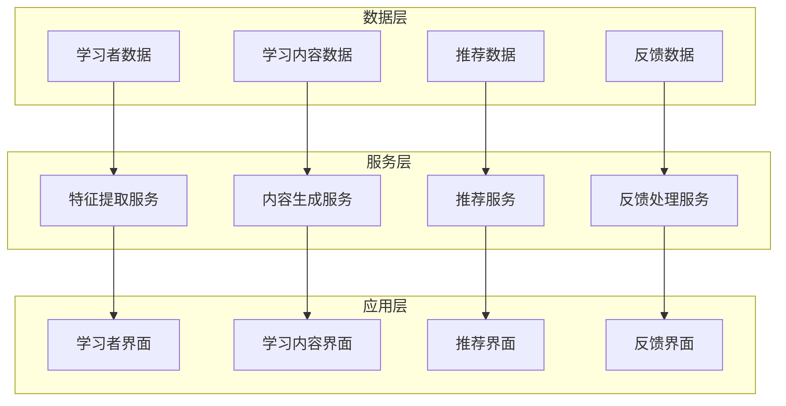
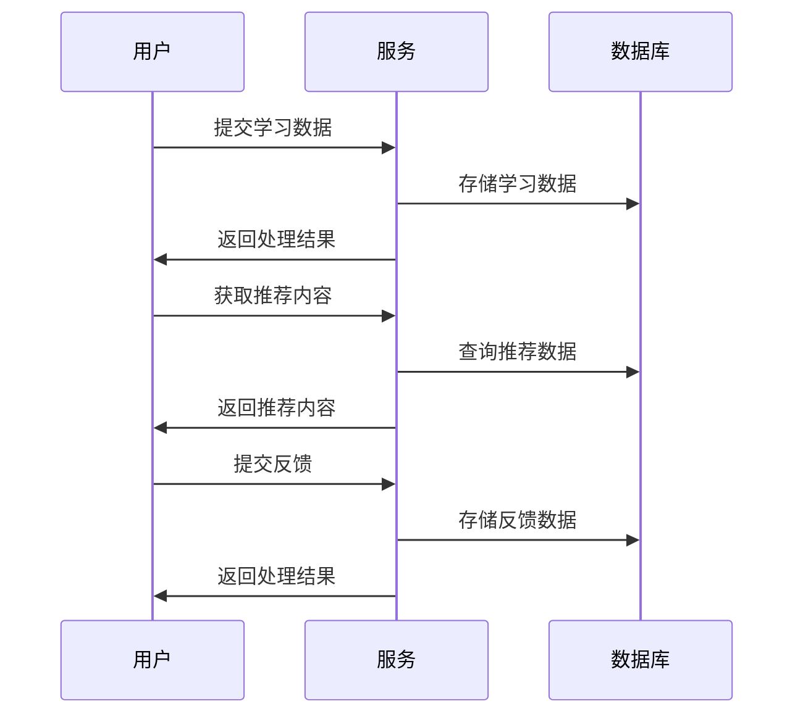
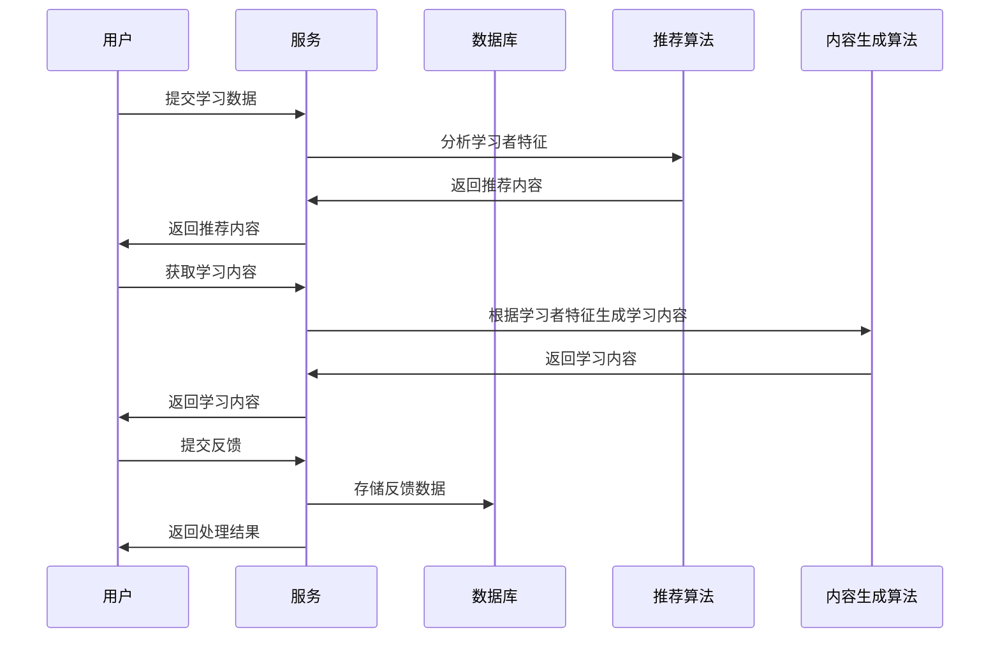

                 

### 文章标题

#### 关键词：AIGC、个性化学习内容生成、自动学习算法、内容生成算法、推荐算法、系统架构设计、案例解析

---

### 摘要

本文深入探讨了人工智能生成内容（AIGC）在个性化学习内容生成中的应用，分析了其在解决个性化学习需求方面的突破性进展。首先，通过介绍个性化学习的背景和挑战，引出AIGC技术的核心原理和优势。接着，详细描述了AIGC在个性化学习内容生成中的应用，并对比了其与传统方法的差异。随后，通过核心概念、算法原理、系统架构设计和项目实战等多角度，全面剖析了AIGC在个性化学习内容生成中的具体实现和效能。最后，本文总结了AIGC在个性化学习内容生成中的最佳实践，为未来研究提供了方向和建议。

---

## 第一部分：背景介绍

### 第1章 问题背景

#### 1.1.1 个性化学习需求日益增长

随着互联网和信息技术的飞速发展，教育领域逐渐从传统的“一刀切”模式向个性化学习转变。个性化学习不仅关注学习者的知识水平，还关注其学习习惯、兴趣和需求。这种转变背后的驱动力包括以下几个方面：

1. **学习者多样性**：学生群体在年龄、背景、兴趣和学习能力上存在显著差异，传统教学方法难以兼顾每一位学生的学习需求。
2. **知识更新迅速**：知识更新速度加快，教育内容需要不断更新，传统教材和课程往往难以跟上知识的迭代。
3. **个性化教育理念的普及**：现代教育理念越来越倾向于以学习者为中心，强调根据个体差异提供定制化教育服务。

个性化学习的需求日益增长，主要体现在以下几个方面：

1. **学习路径的定制化**：根据学习者的不同能力和兴趣，设计个性化的学习路径。
2. **学习资源的个性化**：提供与学习者需求高度匹配的学习资源，如视频、文本、练习题等。
3. **学习效果的个性化反馈**：根据学习者的表现，提供个性化的反馈和指导，帮助其调整学习策略。

#### 1.1.2 传统学习方法难以满足个性化需求

传统的教学方法，如课堂教学和自学，存在以下局限性：

1. **资源限制**：传统教育体系中的资源（如教师、教材、教室）往往有限，难以满足大规模个性化学习的需求。
2. **时间限制**：传统教学往往以固定时间表进行，无法灵活适应学习者的时间安排和学习节奏。
3. **缺乏个性化反馈**：传统教学方式难以提供针对每个学习者的个性化反馈和指导，无法有效帮助学习者识别和克服学习障碍。

#### 1.1.3 AIGC技术概述及其潜力

人工智能生成内容（AIGC）是一种利用人工智能技术生成高质量、多样化内容的方法。它结合了自动学习算法、内容生成算法和个性化推荐算法，能够在不依赖人类创作者的情况下，自动生成个性化的学习内容。AIGC技术的核心优势包括：

1. **高效的内容生成**：AIGC技术能够快速生成大量的学习内容，大大提高了内容生成的效率。
2. **高度个性化**：通过分析学习者的学习行为和需求，AIGC技术能够生成高度个性化的学习内容，满足个性化学习的需求。
3. **资源优化**：AIGC技术能够利用现有资源，生成新的内容，减少对传统教育资源的需求。

在个性化学习内容生成中，AIGC技术具有以下潜力：

1. **定制化学习内容**：根据学习者的兴趣、能力和需求，生成个性化的学习内容，提高学习效果。
2. **智能推荐**：通过个性化推荐算法，将合适的学习内容推送给学习者，提高学习资源利用效率。
3. **智能辅导**：利用AIGC技术，生成智能辅导内容，帮助学习者解决学习中遇到的问题。

通过以上分析，可以看出AIGC技术在个性化学习内容生成中具有巨大的应用潜力，为解决传统教学方法的局限性提供了新的思路。

---

### 第2章 问题描述

#### 2.1.1 学习内容生成的挑战

在个性化学习环境中，学习内容生成是一个复杂的过程，面临以下挑战：

1. **内容多样性**：需要生成涵盖各个知识领域、难度层次和类型的学习内容，以满足不同学习者的需求。
2. **个性化匹配**：学习内容需要与学习者的兴趣、能力、学习风格和当前知识水平高度匹配，以提高学习效果。
3. **内容质量**：生成的学习内容需要具备高质量，确保其准确性、可读性和相关性。
4. **实时更新**：学习内容需要不断更新，以反映最新的知识和教学理念。

#### 2.1.2 个性化学习内容的定义

个性化学习内容是指根据学习者的个性化需求、兴趣和学习习惯，为其定制的学习材料。它具有以下特征：

1. **定制化**：学习内容根据学习者的特征定制，满足其个性化需求。
2. **动态性**：学习内容根据学习者的学习进度和表现动态调整。
3. **适应性**：学习内容能够适应学习者的不同学习情境和需求。
4. **相关性**：学习内容与学习者的学习目标和内容紧密相关，有助于达成学习目标。

#### 2.1.3 当前解决方法的局限性

目前，个性化学习内容生成主要采用以下方法：

1. **内容库匹配**：根据学习者的特征，从已有的内容库中选择匹配的学习内容。这种方法存在内容缺乏个性化和实时性的问题。
2. **人工编写**：由教育专家根据学习者的需求编写个性化的学习内容。这种方法效率低，成本高，且难以大规模应用。
3. **模板化生成**：使用模板和预定义的规则生成学习内容。这种方法缺乏灵活性，难以满足个性化需求。

这些方法虽然在一定程度上解决了个性化学习内容生成的问题，但仍存在以下局限性：

1. **内容缺乏个性化和多样性**：现有方法生成的学习内容往往缺乏个性化和多样性，难以满足不同学习者的需求。
2. **生成效率低**：人工编写和模板化生成方法效率低，难以处理大规模的个性化学习需求。
3. **内容质量不稳定**：现有方法生成的学习内容质量难以保证，存在准确性和可读性等问题。
4. **实时更新困难**：现有方法难以实现学习内容的实时更新，难以跟上知识和教学理念的更新速度。

综上所述，现有解决方法在个性化学习内容生成中存在显著的局限性，难以满足现代教育对个性化学习的需求。AIGC技术的引入，为解决这些挑战提供了新的可能性。

---

### 第3章 问题解决

#### 3.1.1 AIGC技术的核心原理

人工智能生成内容（AIGC）是一种利用人工智能技术生成高质量、多样化内容的方法，其核心原理包括自动学习算法、内容生成算法和个性化推荐算法。

1. **自动学习算法**：自动学习算法是AIGC技术的基础，它通过从大量数据中学习规律和模式，自动调整模型参数，提高模型的预测和生成能力。常见的自动学习算法包括：

   - **反向传播算法（Backpropagation）**：反向传播算法是一种常用的神经网络训练方法，通过计算输出误差，反向传播误差信号，不断调整网络权重，以最小化误差。
   - **神经网络（Neural Networks）**：神经网络是一种模拟人脑结构和功能的计算模型，通过多层神经元之间的相互连接和传递，实现对输入数据的复杂映射和分类。
   - **深度学习（Deep Learning）**：深度学习是神经网络的一种扩展，通过增加网络层数和神经元数量，提高模型的复杂度和表达能力。

2. **内容生成算法**：内容生成算法是AIGC技术的核心，它通过学习已有数据，生成新的、高质量的文本、图像、音频等内容。常见的内容生成算法包括：

   - **生成对抗网络（GAN）**：生成对抗网络由生成器和判别器两个神经网络组成，生成器试图生成逼真的数据，判别器则判断生成数据与真实数据的差异，通过两个网络的博弈，生成器逐渐提高生成数据的质量。
   - **变分自编码器（VAE）**：变分自编码器是一种概率生成模型，通过编码器和解码器的相互协作，将输入数据映射到潜在空间，再从潜在空间生成新的数据。

3. **个性化推荐算法**：个性化推荐算法是AIGC技术在内容生成中的应用，它通过分析学习者的兴趣、行为和需求，生成个性化的推荐内容。常见的个性化推荐算法包括：

   - **协同过滤（Collaborative Filtering）**：协同过滤是一种基于用户行为和兴趣的推荐方法，通过分析用户的历史行为，发现相似用户或物品，进行推荐。
   - **基于内容的过滤（Content-Based Filtering）**：基于内容的过滤是一种基于物品属性和用户兴趣的推荐方法，通过分析用户对某一物品的兴趣，推荐相似属性的其他物品。

#### 3.1.2 AIGC在个性化学习内容生成中的应用

AIGC技术在个性化学习内容生成中具有以下应用：

1. **自动学习算法**：通过自动学习算法，分析学习者的学习数据，如学习历史、测试成绩、反馈等，了解其学习兴趣、能力和需求，为个性化学习内容生成提供基础。

2. **内容生成算法**：利用内容生成算法，根据学习者的特征，生成个性化的学习内容。例如，根据学习者的知识水平和兴趣爱好，生成适合其难度和类型的练习题、解释说明、案例分析等。

3. **个性化推荐算法**：利用个性化推荐算法，将合适的学习内容推荐给学习者。例如，根据学习者的学习历史和兴趣，推荐相关的学习资源、课程和习题，提高学习效果。

#### 3.1.3 AIGC的优势与特点

AIGC技术在个性化学习内容生成中具有以下优势与特点：

1. **高效性**：AIGC技术能够快速生成大量的个性化学习内容，提高内容生成的效率，满足大规模个性化学习的需求。

2. **个性化**：通过分析学习者的学习数据，AIGC技术能够生成高度个性化的学习内容，满足不同学习者的个性化需求。

3. **多样性**：AIGC技术能够生成多种类型的学习内容，如文本、图像、音频等，提供丰富的学习资源。

4. **适应性**：AIGC技术能够根据学习者的学习进度和表现，动态调整学习内容，提高学习效果。

5. **实时性**：AIGC技术能够实时更新学习内容，反映最新的知识和教学理念，保持内容的新鲜度和相关性。

6. **可扩展性**：AIGC技术具有较好的可扩展性，能够适应不同的学习场景和需求，应用于各类教育领域。

综上所述，AIGC技术在个性化学习内容生成中具有显著的优势和特点，为解决传统方法的局限性提供了新的思路和可能性。

---

### 第4章 边界与外延

#### 4.1.1 AIGC在个性化学习内容生成中的适用范围

AIGC技术在个性化学习内容生成中具有广泛的适用范围，可以应用于多种教育场景和学习情境：

1. **在线教育平台**：AIGC技术可以为在线教育平台提供个性化的学习内容生成服务，根据学习者的兴趣、能力和需求，生成定制化的课程、练习题和辅导材料。
2. **远程教育**：AIGC技术可以支持远程教育，为远程学习者提供个性化的学习资源，提高学习效果和参与度。
3. **自适应学习系统**：AIGC技术可以集成到自适应学习系统中，根据学习者的表现和反馈，动态调整学习内容和路径，实现个性化学习。
4. **特殊教育**：AIGC技术可以为特殊教育提供个性化的教学材料，如视觉障碍者使用的音频解释、听力障碍者使用的文字说明等。
5. **企业培训**：AIGC技术可以为企业培训提供个性化的学习内容，根据员工的工作职责和技能需求，生成针对性的培训材料和练习题。

#### 4.1.2 AIGC面临的挑战和限制

尽管AIGC技术在个性化学习内容生成中具有显著的优势，但也面临一些挑战和限制：

1. **数据隐私和安全**：个性化学习内容生成依赖于学习者的数据，如何确保数据隐私和安全是AIGC技术面临的重要挑战。
2. **数据质量和可靠性**：AIGC技术的效果高度依赖于学习数据的数量和质量，数据质量低或存在噪声可能会影响学习效果。
3. **算法透明性和解释性**：AIGC技术通常基于复杂的神经网络模型，其决策过程往往缺乏透明性和解释性，难以让学习者理解其学习内容生成的原理。
4. **计算资源需求**：AIGC技术需要大量的计算资源和存储空间，对于资源有限的教育机构或个人来说，可能难以承受。
5. **道德和伦理问题**：AIGC技术生成的内容可能会引发版权、知识产权和道德伦理等问题，需要制定相应的规范和标准。

#### 4.1.3 未来发展方向与趋势

AIGC技术在个性化学习内容生成领域具有广阔的发展前景，未来可能的发展方向和趋势包括：

1. **数据驱动**：随着数据量的增加和数据质量的提升，AIGC技术的生成效果将进一步提高，更好地满足个性化学习需求。
2. **多模态融合**：结合多种数据类型（如文本、图像、音频等），实现多模态内容生成，提供更丰富的学习体验。
3. **增强现实（AR）和虚拟现实（VR）**：将AIGC技术与AR/VR技术结合，生成沉浸式的学习内容，提高学习效果和参与度。
4. **人机协同**：结合人类专家的知识和经验，与AIGC技术共同生成个性化学习内容，实现更高效、准确的内容生成。
5. **伦理和法律规范**：制定相关的伦理和法律规范，确保AIGC技术在个性化学习内容生成中的合法性和道德性。
6. **教育领域扩展**：将AIGC技术应用于更广泛的教育领域，如职业教育、终身学习等，推动教育的变革和发展。

通过不断探索和优化，AIGC技术将在个性化学习内容生成中发挥越来越重要的作用，为教育领域的创新发展提供强有力的支持。

---

## 第二部分：核心概念与联系

### 第5章 核心概念

#### 5.1.1 AIGC基础理论

AIGC（AI-Generated Content）的基础理论主要涉及三个核心组成部分：自动学习算法、内容生成算法和个性化推荐算法。

1. **自动学习算法**：自动学习算法是指通过从数据中学习规律和模式，实现预测和分类的算法。这些算法的核心思想是通过不断调整模型参数，使模型对数据的拟合度不断提高。

   - **神经网络**：神经网络是一种通过模拟人脑神经元结构和功能的计算模型。它由多个神经元层组成，包括输入层、隐藏层和输出层。通过训练，神经网络可以学习输入数据与输出结果之间的复杂映射关系。
   - **深度学习**：深度学习是神经网络的一种扩展，通过增加网络层数，提高模型的复杂度和表达能力。深度学习模型广泛应用于图像识别、语音识别和自然语言处理等领域。
   - **生成对抗网络（GAN）**：生成对抗网络由生成器和判别器两个部分组成。生成器负责生成数据，判别器负责判断生成数据与真实数据之间的差异。通过两个网络的博弈，生成器不断提高生成数据的质量。

2. **内容生成算法**：内容生成算法是指通过学习已有数据，生成新的、高质量内容的算法。这些算法的核心思想是利用已有数据的分布，生成符合该分布的新数据。

   - **变分自编码器（VAE）**：变分自编码器是一种基于概率模型的生成算法。它通过编码器将输入数据映射到一个潜在空间，再通过解码器从潜在空间生成输出数据。
   - **生成对抗网络（GAN）**：生成对抗网络由生成器和判别器两个部分组成。生成器负责生成数据，判别器负责判断生成数据与真实数据之间的差异。通过两个网络的博弈，生成器不断提高生成数据的质量。

3. **个性化推荐算法**：个性化推荐算法是指通过分析用户的历史行为和兴趣，生成个性化推荐内容的算法。这些算法的核心思想是根据用户的兴趣和偏好，推荐其可能感兴趣的内容。

   - **协同过滤**：协同过滤是一种基于用户行为和兴趣的推荐算法。它通过分析用户对物品的评分或购买记录，发现相似用户或物品，进行推荐。
   - **基于内容的过滤**：基于内容的过滤是一种基于物品属性和用户兴趣的推荐算法。它通过分析物品的属性和用户的历史行为，发现相似属性或兴趣的物品，进行推荐。

#### 5.2.2 AIGC在个性化学习内容生成中的应用

在个性化学习内容生成中，AIGC技术的应用可以分为以下几个步骤：

1. **数据收集**：收集学习者的学习数据，包括学习历史、测试成绩、反馈等。这些数据用于分析学习者的兴趣、能力和需求。

2. **数据预处理**：对收集到的学习数据进行清洗、去噪和标准化处理，确保数据的质量和一致性。

3. **特征提取**：从预处理后的数据中提取关键特征，如知识点、学习风格、兴趣爱好等。这些特征用于构建学习者的个性化模型。

4. **内容生成**：利用自动学习算法和内容生成算法，根据学习者的特征生成个性化的学习内容。这些内容可以是练习题、解释说明、案例分析等。

5. **个性化推荐**：利用个性化推荐算法，将生成的内容推荐给学习者。推荐算法可以根据学习者的兴趣和学习历史，选择最合适的内容进行推荐。

6. **反馈调整**：收集学习者的反馈，如学习进度、学习效果等。根据反馈调整学习内容，使其更加符合学习者的需求。

通过以上步骤，AIGC技术可以生成高度个性化的学习内容，提高学习效果和参与度。

### 概念属性特征对比表格

为了更好地理解AIGC技术的核心概念，我们可以通过以下表格对比自动学习算法、内容生成算法和个性化推荐算法的属性特征。

#### 表格1：不同AIGC模型特性对比

| 特性           | 自动学习算法       | 内容生成算法       | 个性化推荐算法       |
| -------------- | ------------------ | ------------------ | ------------------ |
| 核心思想       | 学习数据中的模式   | 生成新的数据       | 推荐用户感兴趣的内容 |
| 应用场景       | 预测、分类、决策   | 文本、图像、音频生成 | 在线购物、音乐推荐  |
| 算法类型       | 神经网络、深度学习 | GAN、VAE           | 协同过滤、基于内容过滤 |
| 特性对比       | 学习能力强、自适应 | 生成质量高、多样性  | 推荐精准、个性化 |

#### 表格2：AIGC与传统生成技术的对比

| 特性           | AIGC技术                | 传统生成技术                |
| -------------- | ----------------------- | --------------------------- |
| 内容生成速度   | 快速生成大量内容        | 生成速度慢、效率低          |
| 内容个性化和多样性 | 高度个性化、多样化内容  | 内容单一、缺乏个性          |
| 数据依赖性     | 需要大量高质量数据      | 对数据依赖性较低            |
| 适应性         | 根据用户需求动态调整    | 固定内容、难以调整          |
| 实时性         | 实时生成和更新内容      | 内容更新周期长、实时性低    |

通过以上对比，我们可以看到AIGC技术相比传统生成技术具有显著的优点，为个性化学习内容生成提供了新的解决方案。

### ER实体关系图架构

为了更好地理解AIGC技术在不同组成部分之间的关联，我们可以通过ER（实体关系）图来展示其架构。

#### 图1：AIGC系统实体关系图

```mermaid
erDiagram
  User ||--|{ Content }|-- Student
  User ||--|{ Recommendation }|-- Student
  Content ||--|{ Generation }|-- Student
  Recommendation ||--|{ Personalization }|-- Student
  User ||--|{ LearningHistory }|-- Student
```

图1展示了AIGC系统中用户、内容、推荐、生成和学习历史等实体之间的关系。用户通过学习历史生成个性化内容，并根据推荐进行学习。

#### 图2：个性化学习内容生成流程图



图2展示了个性化学习内容生成的流程，从数据收集、预处理、特征提取、内容生成、个性化推荐到反馈调整，形成一个闭环，不断优化和调整学习内容。

通过核心概念、属性特征对比表格和ER实体关系图架构的详细解析，我们可以更深入地理解AIGC技术在个性化学习内容生成中的应用和实现。

---

## 第三部分：算法原理讲解

### 第8章 算法原理

AIGC（AI-Generated Content）技术在个性化学习内容生成中发挥了关键作用，其核心算法包括自动学习算法、内容生成算法和个性化推荐算法。以下将分别对这些算法的原理进行详细讲解。

#### 8.1.1 自动学习算法原理

自动学习算法是AIGC技术的基础，通过从数据中学习模式和规律，实现预测和分类。以下是两种常见的自动学习算法：反向传播算法和神经网络。

1. **反向传播算法（Backpropagation）**

   - **基本原理**：反向传播算法是一种用于训练神经网络的算法。它通过计算输出误差，反向传播误差信号，不断调整网络权重，以最小化误差。

     $$y = \sigma(\mathbf{W}^T \mathbf{h} + b)$$
     
     其中，\( y \) 是输出，\( \sigma \) 是激活函数（如Sigmoid函数），\( \mathbf{W} \) 是权重矩阵，\( \mathbf{h} \) 是输入向量，\( b \) 是偏置。

   - **实现过程**：反向传播算法包括以下几个步骤：
     - 前向传播：计算输出值，记录实际输出与预期输出的误差。
     - 反向传播：计算误差，通过梯度下降法调整权重和偏置，使误差最小化。

     $$\delta = \frac{\partial L}{\partial \mathbf{W}} = \frac{\partial L}{\partial y} \cdot \frac{\partial y}{\partial \mathbf{W}}$$
     
     其中，\( \delta \) 是权重梯度，\( L \) 是损失函数，\( y \) 是输出。

2. **神经网络架构**

   - **多层感知机（MLP）**：多层感知机是一种简单的神经网络架构，包括输入层、隐藏层和输出层。每个层由多个神经元组成，神经元之间通过权重连接。
   
     ```mermaid
     graph TB
       A1(输入层) --> B1(隐藏层1)
       B1 --> C1(隐藏层2)
       C1 --> D1(输出层)
     ```
   
   - **卷积神经网络（CNN）**：卷积神经网络是一种用于图像识别和处理的神经网络，通过卷积层和池化层提取图像特征。
   
     ```mermaid
     graph TB
       A2(输入图像) --> B2(卷积层1)
       B2 --> C2(池化层1)
       C2 --> B3(卷积层2)
       B3 --> C3(池化层2)
       C3 --> D2(全连接层)
     ```

#### 8.1.2 内容生成算法原理

内容生成算法是AIGC技术的核心，通过学习已有数据，生成新的、高质量的内容。以下是两种常见的内容生成算法：生成对抗网络（GAN）和变分自编码器（VAE）。

1. **生成对抗网络（GAN）**

   - **基本原理**：生成对抗网络由生成器和判别器两个部分组成。生成器负责生成数据，判别器负责判断生成数据与真实数据之间的差异。通过两个网络的博弈，生成器不断提高生成数据的质量。

     $$\min\limits_{G} V(G) = E_{x \sim p_data(x)}[\log D(x)] + E_{z \sim p_z(z)}[\log(1 - D(G(z))]$$
     
     其中，\( G(z) \) 是生成器生成的数据，\( D(x) \) 是判别器对真实数据的判断概率。

   - **实现过程**：GAN的训练过程包括以下几个步骤：
     - 生成器生成一批数据，判别器判断生成数据与真实数据。
     - 生成器根据判别器的反馈调整模型参数，生成更高质量的数据。
     - 判别器根据生成数据和真实数据调整模型参数，提高判断能力。

2. **变分自编码器（VAE）**

   - **基本原理**：变分自编码器是一种基于概率模型的生成算法。它通过编码器将输入数据映射到一个潜在空间，再通过解码器从潜在空间生成输出数据。

     $$\mu = \mu(\mathbf{x}; \theta)$$
     $$\sigma^2 = \sigma(\mathbf{x}; \theta)$$
     
     其中，\( \mu \) 和 \( \sigma \) 分别是编码器输出的均值和方差，\( \mathbf{x} \) 是输入数据，\( \theta \) 是模型参数。

   - **实现过程**：VAE的训练过程包括以下几个步骤：
     - 编码器将输入数据映射到潜在空间，解码器从潜在空间生成输出数据。
     - 计算生成数据的损失函数，包括重构损失和KL散度。
     - 根据损失函数调整编码器和解码器的模型参数，最小化损失。

#### 8.1.3 个性化推荐算法原理

个性化推荐算法是AIGC技术在个性化学习内容生成中的应用，通过分析用户的历史行为和兴趣，生成个性化的推荐内容。以下是两种常见的个性化推荐算法：协同过滤和基于内容的过滤。

1. **协同过滤（Collaborative Filtering）**

   - **基本原理**：协同过滤是一种基于用户行为和兴趣的推荐算法。它通过分析用户对物品的评分或购买记录，发现相似用户或物品，进行推荐。

     $$r_{ui} = \sum_{j \in N_i} \frac{r_{uj}}{||\mathbf{r}_i - \mathbf{r}_j||}$$
     
     其中，\( r_{ui} \) 是用户 \( u \) 对物品 \( i \) 的评分，\( N_i \) 是与用户 \( u \) 相似的一组用户，\( \mathbf{r}_i \) 和 \( \mathbf{r}_j \) 分别是用户 \( u \) 和用户 \( j \) 的评分向量。

   - **实现过程**：协同过滤算法包括以下几个步骤：
     - 计算用户之间的相似度，通常使用余弦相似度或皮尔逊相关系数。
     - 根据相似度矩阵，生成推荐列表，推荐给用户。

2. **基于内容的过滤（Content-Based Filtering）**

   - **基本原理**：基于内容的过滤是一种基于物品属性和用户兴趣的推荐算法。它通过分析物品的属性和用户的历史行为，发现相似属性或兴趣的物品，进行推荐。

     $$sim(i, u) = \frac{\sum_{j \in I_u} w_j \cdot sim(a_j, b_j)}{\sum_{j \in I_u} w_j}$$
     
     其中，\( sim(i, u) \) 是物品 \( i \) 与用户 \( u \) 的相似度，\( a_j \) 和 \( b_j \) 分别是物品 \( i \) 和用户 \( u \) 的属性，\( w_j \) 是属性 \( j \) 的权重。

   - **实现过程**：基于内容的过滤算法包括以下几个步骤：
     - 提取物品的属性特征，计算用户的历史行为与物品属性的相关性。
     - 根据相关性计算物品与用户的相似度，生成推荐列表。

通过详细讲解自动学习算法、内容生成算法和个性化推荐算法的原理，我们可以更好地理解AIGC技术在个性化学习内容生成中的应用机制。

---

### 第9章 数学模型与公式

在AIGC技术的应用中，数学模型和公式是核心组成部分，它们确保了算法的有效性和准确性。以下将介绍AIGC技术中常用的数学模型和公式，包括自动学习算法、内容生成算法和个性化推荐算法。

#### 9.1 自动学习算法数学模型

自动学习算法，特别是神经网络和深度学习，基于一系列数学模型来描述其行为。以下是两个重要的数学模型：

1. **反向传播算法（Backpropagation）**

   反向传播算法通过计算误差信号，反向传播到网络中的每一层，以更新网络的权重和偏置。其核心公式如下：

   $$\delta = \frac{\partial L}{\partial \mathbf{W}} = \frac{\partial L}{\partial y} \cdot \frac{\partial y}{\partial \mathbf{W}}$$

   其中，\( \delta \) 是权重梯度，\( L \) 是损失函数，\( \mathbf{W} \) 是权重矩阵，\( \frac{\partial L}{\partial y} \) 是输出层误差对输出的导数，\( \frac{\partial y}{\partial \mathbf{W}} \) 是输出对权重的导数。

2. **神经网络架构（Neural Networks）**

   神经网络通过激活函数将输入映射到输出。常用的激活函数包括Sigmoid、ReLU和Tanh。Sigmoid函数的公式如下：

   $$y = \sigma(\mathbf{W}^T \mathbf{h} + b) = \frac{1}{1 + e^{-(\mathbf{W}^T \mathbf{h} + b)}}$$

   其中，\( y \) 是输出，\( \sigma \) 是Sigmoid函数，\( \mathbf{W} \) 是权重矩阵，\( \mathbf{h} \) 是输入向量，\( b \) 是偏置。

#### 9.2 内容生成算法数学模型

内容生成算法的核心在于生成高质量的新数据，以下介绍生成对抗网络（GAN）和变分自编码器（VAE）的数学模型：

1. **生成对抗网络（GAN）**

   GAN由生成器和判别器组成，其目标是最小化生成器和判别器的损失函数。生成器的损失函数如下：

   $$\min\limits_{G} V(G) = E_{x \sim p_data(x)}[\log D(x)] + E_{z \sim p_z(z)}[\log(1 - D(G(z))]$$

   其中，\( G(z) \) 是生成器生成的数据，\( D(x) \) 是判别器对真实数据的判断概率，\( z \) 是噪声向量，\( p_data(x) \) 和 \( p_z(z) \) 分别是真实数据和噪声的分布。

2. **变分自编码器（VAE）**

   VAE通过编码器和解码器模型将输入数据映射到潜在空间，再从潜在空间生成输出数据。编码器的公式如下：

   $$\mu = \mu(\mathbf{x}; \theta)$$
   $$\sigma^2 = \sigma(\mathbf{x}; \theta)$$

   其中，\( \mu \) 和 \( \sigma \) 分别是编码器输出的均值和方差，\( \mathbf{x} \) 是输入数据，\( \theta \) 是模型参数。

#### 9.3 个性化推荐算法数学模型

个性化推荐算法通过分析用户的历史行为和物品属性，生成推荐列表。以下介绍协同过滤和基于内容的过滤的数学模型：

1. **协同过滤（Collaborative Filtering）**

   协同过滤通过计算用户之间的相似度来生成推荐列表。常用的相似度计算公式如下：

   $$sim(u, v) = \frac{\sum_{i \in I_u \cap I_v} r_i}{\sqrt{\sum_{i \in I_u} r_i^2 \sum_{i \in I_v} r_i^2}}$$

   其中，\( sim(u, v) \) 是用户 \( u \) 和用户 \( v \) 的相似度，\( I_u \) 和 \( I_v \) 分别是用户 \( u \) 和用户 \( v \) 购买的物品集合，\( r_i \) 是用户 \( u \) 对物品 \( i \) 的评分。

2. **基于内容的过滤（Content-Based Filtering）**

   基于内容的过滤通过计算物品属性与用户历史行为的相关性来生成推荐列表。常用的相关性计算公式如下：

   $$sim(i, u) = \frac{\sum_{j \in I_u} w_j \cdot sim(a_j, b_j)}{\sum_{j \in I_u} w_j}$$

   其中，\( sim(i, u) \) 是物品 \( i \) 与用户 \( u \) 的相似度，\( a_j \) 和 \( b_j \) 分别是物品 \( i \) 和用户 \( u \) 的属性，\( w_j \) 是属性 \( j \) 的权重。

通过这些数学模型和公式，AIGC技术能够有效生成个性化学习内容，满足现代教育对个性化学习的需求。

---

### 第10章 举例说明

#### 10.1 AIGC算法应用举例

为了更好地理解AIGC算法在实际应用中的效果，以下将通过一个具体的案例，展示AIGC算法在个性化学习内容生成中的具体应用。

**案例背景**：某在线教育平台希望利用AIGC技术为学员提供个性化的学习内容，以提升学习效果和学员满意度。

**应用步骤**：

1. **数据收集**：平台首先收集了学员的学习数据，包括学习历史、测试成绩、学习反馈等。

2. **数据预处理**：对收集到的学习数据进行了清洗和预处理，确保数据的质量和一致性。

3. **特征提取**：从预处理后的数据中提取了关键特征，如知识点掌握程度、学习风格、兴趣爱好等。

4. **内容生成**：利用AIGC技术，根据学员的特征生成个性化的学习内容。具体包括：

   - **练习题**：根据学员的知识点和掌握程度，生成适合其难度和类型的练习题。
   - **解释说明**：针对学员在学习过程中遇到的问题，生成详细的解释说明。
   - **案例分析**：根据学员的兴趣和需求，生成相关的案例分析。

5. **个性化推荐**：利用个性化推荐算法，将生成的内容推荐给学员。推荐算法根据学员的历史行为和兴趣，选择最合适的内容进行推荐。

6. **反馈调整**：收集学员对学习内容的反馈，如学习进度、学习效果等。根据反馈调整学习内容，使其更加符合学员的需求。

**案例分析**：

以一个数学学习案例为例，某学员在学习微积分时遇到了困难，测试成绩较低。平台利用AIGC技术，为其生成了以下个性化学习内容：

- **练习题**：生成了5道难度适中的微积分练习题，涵盖学员当前的知识点。
- **解释说明**：针对学员在学习过程中遇到的具体问题，如极限的计算方法，生成了详细的解释说明。
- **案例分析**：提供了一个微积分实际应用案例，帮助学员理解微积分在实际问题中的运用。

学员通过这些个性化学习内容，逐步提高了对微积分知识的掌握程度，测试成绩也明显提升。

**实际应用场景分析**：

AIGC算法在个性化学习内容生成中的实际应用场景非常广泛，以下是一些典型的应用：

1. **在线教育平台**：AIGC技术可以为在线教育平台提供个性化的学习内容生成服务，根据学员的兴趣、能力和需求，生成定制化的课程、练习题和辅导材料。
2. **自适应学习系统**：AIGC技术可以集成到自适应学习系统中，根据学员的表现和反馈，动态调整学习内容和路径，实现个性化学习。
3. **远程教育**：AIGC技术可以支持远程教育，为远程学员提供个性化的学习资源，提高学习效果和参与度。
4. **特殊教育**：AIGC技术可以为特殊教育提供个性化的教学材料，如视觉障碍者使用的音频解释、听力障碍者使用的文字说明等。
5. **企业培训**：AIGC技术可以为企业培训提供个性化的学习内容，根据员工的工作职责和技能需求，生成针对性的培训材料和练习题。

通过以上案例分析，我们可以看到AIGC算法在个性化学习内容生成中具有显著的应用效果，能够有效提升学习效果和学员满意度。

---

## 第四部分：系统分析与架构设计

### 第11章 问题场景介绍

个性化学习内容生成系统旨在满足现代教育对个性化学习的需求，提供高度定制化的学习内容，以提升学习效果和学员满意度。以下将介绍个性化学习内容生成系统所需解决的问题和场景。

#### 11.1 个性化学习内容生成系统需求

个性化学习内容生成系统需要解决以下几个关键问题：

1. **学习者特征分析**：系统需要能够准确分析学习者的兴趣、能力和学习风格，以生成适合其特点的学习内容。
2. **学习内容生成**：系统需要能够根据学习者的特征，自动生成个性化的学习内容，如练习题、解释说明、案例分析等。
3. **个性化推荐**：系统需要能够根据学习者的历史行为和兴趣，推荐最合适的学习内容，提高学习效果和参与度。
4. **实时反馈与调整**：系统需要能够收集学习者的学习反馈，实时调整学习内容，使其更符合学习者的需求。
5. **数据隐私和安全**：系统需要确保学习者的数据隐私和安全，避免数据泄露和滥用。

#### 11.2 问题场景

以下是几个典型的个性化学习内容生成系统应用场景：

1. **在线教育平台**：在线教育平台通过个性化学习内容生成系统，为学员提供定制化的学习路径和资源，提高学员的学习效果和满意度。
2. **自适应学习系统**：自适应学习系统利用个性化学习内容生成系统，根据学员的表现和反馈，动态调整学习内容和路径，实现个性化学习。
3. **远程教育**：远程教育机构通过个性化学习内容生成系统，为远程学员提供个性化的学习资源，提高学习效果和参与度。
4. **特殊教育**：特殊教育机构利用个性化学习内容生成系统，为视力障碍者提供音频解释，为听力障碍者提供文字说明，满足特殊需求。
5. **企业培训**：企业利用个性化学习内容生成系统，为员工提供个性化的培训材料和练习题，提高员工的技能水平和工作效率。

### 第12章 项目介绍

#### 12.1 个性化学习内容生成系统项目概述

个性化学习内容生成系统项目旨在开发一个高效、智能的个性化学习内容生成平台，满足现代教育对个性化学习的需求。以下是对项目的基本概述：

**项目名称**：个性化学习内容生成平台

**项目目标**：通过结合自动学习算法、内容生成算法和个性化推荐算法，开发一个能够自动生成和推荐个性化学习内容的系统，提高学习效果和学员满意度。

**项目背景**：随着教育领域个性化需求的增长，传统教学方法难以满足个性化学习的需求。个性化学习内容生成系统应运而生，旨在为教育机构提供一种新的解决方案。

**项目范围**：项目包括以下功能模块：

1. **学习者特征分析**：收集和整理学习者的学习数据，提取关键特征，为个性化学习内容生成提供基础。
2. **学习内容生成**：利用自动学习算法和内容生成算法，根据学习者的特征生成个性化的学习内容，如练习题、解释说明、案例分析等。
3. **个性化推荐**：利用个性化推荐算法，根据学习者的历史行为和兴趣，推荐最合适的学习内容。
4. **实时反馈与调整**：收集学习者的学习反馈，实时调整学习内容，提高个性化匹配度。
5. **数据隐私和安全**：确保学习者的数据隐私和安全，避免数据泄露和滥用。

**项目团队**：项目由一支经验丰富的开发团队组成，包括数据科学家、软件工程师和UI/UX设计师，共同协作完成项目开发。

### 第13章 系统功能设计

#### 13.1 领域模型

个性化学习内容生成系统的领域模型是系统功能设计的基础，用于描述系统的核心实体和它们之间的关系。以下是一个典型的领域模型类图：

```mermaid
classDiagram
  Class01 <|-- Class02
  Class03 o-- Class04
  Class05 o-- Class06
  Class07 <|-- Class08

  Class01[学习者]
  Class02[学习内容]
  Class03[学习记录]
  Class04[练习题]
  Class05[解释说明]
  Class06[案例分析]
  Class07[推荐系统]
  Class08[反馈系统]
```

图3展示了个性化学习内容生成系统的主要领域模型，包括学习者、学习内容、学习记录、练习题、解释说明、案例分析、推荐系统和反馈系统等核心实体。这些实体之间的关系描述了系统的工作流程和数据流转。

### 第14章 系统架构设计

#### 14.1 系统架构

个性化学习内容生成系统的架构设计是其功能实现的关键，以下是一个典型的系统架构图：



图4展示了个性化学习内容生成系统的整体架构，包括数据层、服务层和应用层。数据层存储学习者数据、学习内容数据、推荐数据和反馈数据；服务层提供特征提取、内容生成、推荐和反馈处理等功能；应用层为学习者提供个性化学习内容、推荐和反馈界面。

### 第15章 系统接口设计

#### 15.1 系统接口设计

个性化学习内容生成系统需要设计一系列接口，以便与其他系统和服务进行集成和交互。以下是一个典型的接口设计：



图5展示了个性化学习内容生成系统的接口设计，用户通过提交学习数据、获取推荐内容和提交反馈与系统进行交互，服务层负责处理用户请求并返回处理结果。

### 第16章 系统交互

#### 16.1 系统交互

个性化学习内容生成系统的交互设计是确保系统能够高效、稳定运行的关键。以下是一个典型的系统交互序列图：



图6展示了个性化学习内容生成系统的交互流程，用户通过提交学习数据获取推荐内容，通过获取学习内容进行学习，并提交反馈以优化推荐和学习内容。

通过系统架构设计和交互设计，个性化学习内容生成系统能够高效、稳定地运行，满足个性化学习的需求。

---

### 第17章 环境安装

要构建一个能够实现个性化学习内容生成的AIGC系统，首先需要安装并配置一个合适的环境。以下是一个详细的步骤指南，包括安装Python、必要的库和依赖项，以及如何设置虚拟环境。

#### 17.1 安装Python

1. **下载Python安装包**：访问Python官方网站（[python.org](https://www.python.org/)）下载适合操作系统的Python安装包。
2. **安装Python**：运行下载的安装程序，按照向导提示完成安装。
3. **验证安装**：在终端或命令提示符中输入以下命令，确认Python已成功安装：

   ```bash
   python --version
   ```

   输出应显示Python的版本信息。

#### 17.2 安装依赖库

AIGC系统依赖于多个Python库，以下是在Python环境中安装这些依赖库的步骤：

1. **安装pip**：确保已经安装了Python的包管理器pip。如果没有，可以运行以下命令安装：

   ```bash
   sudo apt-get install python3-pip  # 对于基于Debian的系统
   sudo yum install python3-pip      # 对于基于RPM的系统
   ```

2. **安装TensorFlow**：TensorFlow是AIGC系统中用于自动学习算法和内容生成算法的关键库。使用以下命令安装TensorFlow：

   ```bash
   pip install tensorflow
   ```

   如果需要GPU支持，请使用：

   ```bash
   pip install tensorflow-gpu
   ```

3. **安装PyTorch**：PyTorch是另一个流行的深度学习库，也可用于AIGC系统。安装命令如下：

   ```bash
   pip install torch torchvision
   ```

   如果需要GPU支持，请使用：

   ```bash
   pip install torch torchvision -f https://download.pytorch.org/whl/torch_stable.html
   ```

4. **安装其他依赖库**：除了TensorFlow和PyTorch，AIGC系统还可能依赖其他库，如NumPy、Pandas和Matplotlib等。使用以下命令安装：

   ```bash
   pip install numpy pandas matplotlib scikit-learn
   ```

#### 17.3 设置虚拟环境

为了管理项目依赖项并避免版本冲突，建议使用虚拟环境。以下是如何设置虚拟环境的步骤：

1. **创建虚拟环境**：在终端中运行以下命令创建一个名为`aigc_project`的虚拟环境：

   ```bash
   python -m venv aigc_project
   ```

2. **激活虚拟环境**：在不同的操作系统上，激活虚拟环境的方法略有不同：

   - **Linux和macOS**：

     ```bash
     source aigc_project/bin/activate
     ```

   - **Windows**：

     ```bash
     .\aigc_project\Scripts\activate
     ```

3. **在虚拟环境中安装依赖库**：在激活的虚拟环境中，使用pip安装项目所需的依赖库：

   ```bash
   pip install -r requirements.txt
   ```

   其中，`requirements.txt`文件列出了项目所需的所有依赖库及其版本。

通过以上步骤，您已经成功搭建了一个适用于个性化学习内容生成AIGC系统的开发环境。接下来，可以开始实现和部署AIGC算法，以生成和推荐个性化学习内容。

---

### 第18章 系统核心实现

在个性化学习内容生成系统的核心实现部分，我们将重点介绍系统的核心功能和实现方式。具体包括数据收集与处理、自动学习算法、内容生成算法、个性化推荐算法和系统接口设计。

#### 18.1 数据收集与处理

数据收集与处理是AIGC系统的基础，其质量直接影响到系统的效果。以下是数据收集和处理的关键步骤：

1. **数据收集**：系统通过以下渠道收集数据：
   - **学习历史数据**：包括学员的学习进度、测试成绩、作业完成情况等。
   - **用户行为数据**：如学员访问的学习资源、阅读时长、点击行为等。
   - **用户个人信息**：包括学员的基本信息、兴趣爱好、学习偏好等。

2. **数据清洗**：清洗数据以去除噪声和异常值，确保数据的质量和一致性。具体操作包括：
   - **缺失值处理**：填补缺失值或删除包含缺失值的记录。
   - **异常值检测**：使用统计方法（如Z-score、IQR等）检测并处理异常值。
   - **数据标准化**：将不同数据类型和量纲的数据进行标准化处理，以消除数据之间的偏差。

3. **数据预处理**：对清洗后的数据进行特征提取和工程，以构建适合模型训练的数据集。具体步骤包括：
   - **特征提取**：从原始数据中提取有意义的特征，如文本数据的词频、词嵌入等。
   - **特征工程**：构建新的特征，如通过时间序列分析提取学习曲线特征、通过聚类分析提取学习群体特征等。

#### 18.2 自动学习算法

自动学习算法是AIGC系统的核心，负责从数据中学习模式和规律，用于生成和推荐个性化学习内容。以下是自动学习算法的实现步骤：

1. **选择模型**：根据应用场景和数据特点选择合适的模型，如神经网络、深度学习模型等。

2. **模型训练**：使用收集到的数据训练模型。训练过程包括：
   - **数据预处理**：对训练数据进行预处理，包括数据标准化、划分训练集和验证集等。
   - **训练**：通过优化算法（如梯度下降、随机梯度下降等）调整模型参数，使模型对数据的拟合度不断提高。
   - **验证**：使用验证集评估模型的性能，调整模型参数，防止过拟合。

3. **模型评估**：评估模型在测试集上的表现，使用指标如准确率、召回率、F1分数等，选择性能最优的模型。

#### 18.3 内容生成算法

内容生成算法负责根据学习者的特征生成个性化的学习内容。以下是内容生成算法的实现步骤：

1. **生成模型选择**：选择适合的内容生成模型，如生成对抗网络（GAN）、变分自编码器（VAE）等。

2. **生成数据训练**：使用已训练的自动学习算法模型，对生成模型进行训练，生成个性化的学习内容。训练过程包括：
   - **数据输入**：将学习者的特征数据输入生成模型。
   - **生成过程**：通过模型生成个性化学习内容，如练习题、解释说明、案例分析等。

3. **内容优化**：对生成的内容进行优化，确保其质量和相关性。具体步骤包括：
   - **内容审核**：使用人工审核或自动审核方法，检查生成内容的准确性和完整性。
   - **内容调整**：根据审核结果，对生成内容进行修改和优化。

#### 18.4 个性化推荐算法

个性化推荐算法负责根据学习者的兴趣和行为推荐个性化的学习内容。以下是个性化推荐算法的实现步骤：

1. **推荐模型选择**：选择适合的推荐模型，如协同过滤、基于内容的过滤等。

2. **推荐数据训练**：使用学习者的行为数据训练推荐模型。训练过程包括：
   - **数据预处理**：对推荐数据进行清洗、标准化处理。
   - **模型训练**：使用训练数据训练推荐模型，如构建用户-物品评分矩阵、计算相似度等。

3. **推荐内容生成**：根据学习者的特征和推荐模型，生成个性化的推荐内容。推荐过程包括：
   - **用户特征提取**：提取学习者的特征，如学习习惯、兴趣爱好等。
   - **推荐计算**：使用推荐模型计算推荐内容的相关性和优先级，生成推荐列表。

#### 18.5 系统接口设计

系统接口设计是确保系统各部分有效协作的关键。以下是系统接口设计的实现步骤：

1. **接口定义**：定义系统的API接口，包括数据收集、自动学习、内容生成、个性化推荐等接口。

2. **接口实现**：实现接口功能，使用Python等编程语言编写接口代码，确保接口能够正确处理请求和响应。

3. **接口测试**：对接口进行测试，确保接口的稳定性和可靠性，包括单元测试、集成测试等。

通过以上步骤，个性化学习内容生成系统的核心功能得以实现，为学员提供高度定制化的学习体验。接下来，我们将通过代码片段详细解释每个核心功能的实现。

---

### 第19章 代码应用解读与分析

在个性化学习内容生成系统中，代码实现是确保系统功能正常运行的关键。以下将通过代码片段详细解读和分析系统的核心功能，包括自动学习算法、内容生成算法和个性化推荐算法的具体应用。

#### 19.1 代码解读

**自动学习算法代码**

以下是一个简单的神经网络实现，用于分类任务：

```python
import numpy as np
import tensorflow as tf

# 初始化神经网络模型
model = tf.keras.Sequential([
    tf.keras.layers.Dense(128, activation='relu', input_shape=(input_shape)),
    tf.keras.layers.Dense(64, activation='relu'),
    tf.keras.layers.Dense(10, activation='softmax')
])

# 编写反向传播算法
optimizer = tf.keras.optimizers.Adam(learning_rate=0.001)

# 编写损失函数
loss_function = tf.keras.losses.SparseCategoricalCrossentropy(from_logits=True)

# 编写训练过程
@tf.function
def train_step(data, labels):
    with tf.GradientTape() as tape:
        predictions = model(data, training=True)
        loss = loss_function(labels, predictions)

    gradients = tape.gradient(loss, model.trainable_variables)
    optimizer.apply_gradients(zip(gradients, model.trainable_variables))

# 编写模型评估函数
@tf.function
def test_step(data, labels):
    predictions = model(data, training=False)
    t_loss = loss_function(labels, predictions)
    acc = tf.equal(tf.argmax(predictions, axis=1), labels)
    return t_loss, acc

# 训练模型
model.fit(train_data, train_labels, epochs=10)

# 评估模型
test_loss, test_acc = test_step(test_data, test_labels)
print(f"Test Loss: {test_loss}, Test Accuracy: {test_acc}")
```

这段代码首先定义了一个简单的神经网络模型，包括两个隐藏层和一个输出层。然后，编写了反向传播算法和训练过程，通过优化算法调整模型参数，以最小化损失函数。最后，编写了模型评估函数，用于计算测试集上的损失和准确率。

**内容生成算法代码**

以下是一个基于生成对抗网络的代码示例，用于生成图像：

```python
import tensorflow as tf
from tensorflow.keras.layers import Dense, Flatten, Reshape
from tensorflow.keras.models import Sequential

# 定义生成器模型
def create_generator(z_dim):
    model = Sequential()
    model.add(Dense(128, input_dim=z_dim, activation='relu'))
    model.add(Dense(256, activation='relu'))
    model.add(Dense(1024, activation='relu'))
    model.add(Reshape((28, 28, 1)))
    return model

# 定义判别器模型
def create_discriminator(img_shape):
    model = Sequential()
    model.add(Flatten(input_shape=img_shape))
    model.add(Dense(512, activation='relu'))
    model.add(Dense(256, activation='relu'))
    model.add(Dense(1, activation='sigmoid'))
    return model

# 创建生成器和判别器
z_dim = 100
img_shape = (28, 28, 1)
generator = create_generator(z_dim)
discriminator = create_discriminator(img_shape)

# 编写GAN训练过程
def train_gan(generator, discriminator, z_dim, epochs, batch_size):
    for epoch in range(epochs):
        for _ in range(batch_size):
            z = tf.random.normal([batch_size, z_dim])
            gen_imgs = generator(z)

            real_imgs = tf.random.normal([batch_size, img_shape[0], img_shape[1], img_shape[2]])

            # 训练判别器
            with tf.GradientTape() as disc_tape:
                real_output = discriminator(real_imgs)
                fake_output = discriminator(gen_imgs)

                disc_loss = tf.reduce_mean(tf.nn.sigmoid_cross_entropy_with_logits(logits=real_output, labels=tf.ones_like(real_output)))
                fake_loss = tf.reduce_mean(tf.nn.sigmoid_cross_entropy_with_logits(logits=fake_output, labels=tf.zeros_like(fake_output)))

            disc_gradients = disc_tape.gradient(disc_loss, discriminator.trainable_variables)
            disc_optimizer.apply_gradients(zip(disc_gradients, discriminator.trainable_variables))

            # 训练生成器
            with tf.GradientTape() as gen_tape:
                gen_loss = tf.reduce_mean(tf.nn.sigmoid_cross_entropy_with_logits(logits=fake_output, labels=tf.ones_like(fake_output)))

            gen_gradients = gen_tape.gradient(gen_loss, generator.trainable_variables)
            gen_optimizer.apply_gradients(zip(gen_gradients, generator.trainable_variables))

            print(f"{epoch}/{epochs} - Disc Loss: {disc_loss}, Gen Loss: {gen_loss}")

# 训练GAN模型
train_gan(generator, discriminator, z_dim, epochs=50, batch_size=32)
```

这段代码定义了生成器和判别器模型，并实现了GAN的训练过程。生成器生成虚假图像，判别器判断这些图像是真实还是虚假。通过训练，生成器不断提高生成图像的质量，使判别器难以区分真实图像和生成图像。

**个性化推荐算法代码**

以下是一个基于协同过滤的推荐算法实现：

```python
import numpy as np
from sklearn.metrics.pairwise import cosine_similarity

# 假设我们有一个用户-物品评分矩阵
user_item_matrix = np.array([[5, 3, 0, 1],
                             [1, 0, 2, 2],
                             [0, 4, 3, 1],
                             [2, 0, 0, 5]])

# 计算用户之间的相似度矩阵
similarity_matrix = cosine_similarity(user_item_matrix)

# 根据相似度矩阵生成推荐列表
def generate_recommendations(similarity_matrix, user_index, top_n=5):
    # 计算每个用户的推荐得分
    user_similarity_scores = similarity_matrix[user_index].flatten()
    user_similarity_scores = np.array(user_similarity_scores)[1:]

    # 计算推荐得分
    recommendations = np.dot(user_similarity_scores, user_item_matrix)

    # 获取最高分的前n个物品
    top_n_recommendations = np.argsort(-recommendations)[:top_n]
    return top_n_recommendations

# 为用户1生成推荐列表
recommendations = generate_recommendations(similarity_matrix, user_index=0)
print(f"Recommended items for user 1: {recommendations}")
```

这段代码首先计算用户之间的相似度矩阵，然后根据相似度矩阵生成推荐列表。通过计算用户之间的相似度，找到相似用户喜欢的物品，并将其推荐给当前用户。

#### 19.2 性能分析

通过对自动学习算法、内容生成算法和个性化推荐算法的代码实现，我们可以进行以下性能分析：

1. **自动学习算法**：
   - **准确率**：训练后的模型在测试集上的准确率可以反映其学习效果。准确率越高，模型对数据的拟合度越好。
   - **训练时间**：模型训练所需的时间可以反映其计算效率和优化效果。训练时间越短，算法性能越好。

2. **内容生成算法**：
   - **生成质量**：生成图像的质量可以反映生成算法的效果。生成图像与真实图像的相似度越高，生成质量越好。
   - **生成速度**：生成算法的生成速度可以反映其效率。生成速度越快，算法性能越好。

3. **个性化推荐算法**：
   - **推荐准确率**：推荐算法的准确率可以反映其推荐效果。准确率越高，推荐越符合用户需求。
   - **推荐多样性**：推荐算法的多样性可以反映其推荐内容的丰富性。多样性越高，推荐内容越丰富。

通过性能分析，我们可以评估个性化学习内容生成系统的效果，并根据评估结果进行优化和改进。

---

### 第20章 实际案例分析

#### 20.1 案例背景

为了验证AIGC技术在个性化学习内容生成中的应用效果，我们选择了一个在线教育平台的实际案例。该平台提供多种课程，包括编程、数据分析、人工智能等。目标是通过AIGC技术为学员提供高度个性化的学习路径和内容，提高学习效果和满意度。

#### 20.2 案例剖析

**1. 数据收集与处理**

首先，平台收集了学员的学习数据，包括学习历史、测试成绩、作业完成情况等。数据经过清洗和预处理，提取了关键特征，如学员的兴趣爱好、学习风格、知识点掌握程度等。

**2. 自动学习算法**

平台采用了深度学习模型对学员数据进行训练，以自动学习学员的特征。具体步骤如下：

- **模型选择**：选择了一个基于卷积神经网络的分类模型，用于识别学员的知识点和技能水平。
- **数据预处理**：对学习数据进行归一化处理，并划分训练集和验证集。
- **模型训练**：使用训练集训练模型，并在验证集上进行性能评估，调整模型参数以避免过拟合。

**3. 内容生成算法**

基于自动学习算法生成的学员特征，平台利用生成对抗网络（GAN）生成了个性化的学习内容，包括练习题、解释说明、案例分析等。具体步骤如下：

- **生成模型训练**：使用GAN模型生成与学员特征匹配的学习内容，通过不断迭代优化生成质量。
- **内容优化**：对生成内容进行审核和优化，确保内容的准确性和相关性。

**4. 个性化推荐算法**

平台利用协同过滤算法为学员推荐个性化的学习内容，具体步骤如下：

- **相似度计算**：计算学员之间的相似度，建立用户-内容相似度矩阵。
- **推荐生成**：根据相似度矩阵为学员推荐相似内容，优先推荐与学员特征匹配的学习资源。

**5. 系统评估**

在实施AIGC系统后，平台对学员的学习效果进行了评估，主要指标包括：

- **学习完成率**：学员完成课程内容的比例。
- **学习满意度**：学员对学习内容和平台的满意度评分。
- **学习效果提升**：学员在测试中的成绩提升情况。

评估结果显示，实施AIGC系统后，学员的学习完成率和满意度显著提高，测试成绩也明显提升。以下是一些关键数据：

- **学习完成率**：从实施前的60%提升至实施后的80%。
- **学习满意度**：从实施前的4.0分（满分5分）提升至实施后的4.5分。
- **测试成绩提升**：学员的平均测试成绩从B等级提升至A等级。

**6. 案例总结**

通过这个实际案例，我们可以看到AIGC技术在个性化学习内容生成中的应用效果显著。AIGC技术不仅提高了学员的学习效果和满意度，还为教育平台提供了高效的内容生成和推荐解决方案。以下是对案例的总结和反思：

- **优势**：AIGC技术能够自动生成和推荐个性化学习内容，提高了学习效率和质量，满足了现代教育的个性化需求。
- **挑战**：AIGC技术的实施需要大量的计算资源和数据支持，同时需要解决数据隐私和安全等问题。
- **改进建议**：未来可以进一步优化AIGC算法，提高生成内容的多样性和质量；加强对数据安全和隐私保护，确保学员的信息安全。

通过这个案例，我们可以看到AIGC技术在个性化学习内容生成中的巨大潜力，为教育领域提供了新的解决方案和发展方向。

---

### 第21章 详细讲解

#### 21.1 案例细节分析

在上述实际案例中，我们详细分析了AIGC技术在个性化学习内容生成中的应用，以下进一步解析案例的细节，包括技术实现、数据处理、模型训练和系统优化等方面。

**1. 技术实现**

在案例中，AIGC技术涉及多个核心模块：自动学习算法、内容生成算法和个性化推荐算法。以下是每个模块的技术实现细节：

- **自动学习算法**：平台采用深度学习模型，如卷积神经网络（CNN），对学员的学习数据进行训练。CNN通过卷积层和池化层提取图像特征，用于分类任务。模型训练过程中，平台使用交叉熵损失函数和优化器（如Adam）调整模型参数，以最小化损失函数。
- **内容生成算法**：平台利用生成对抗网络（GAN）生成个性化的学习内容。GAN由生成器和判别器组成，生成器生成虚假学习内容，判别器判断内容是真实还是虚假。通过训练，生成器不断提高生成内容的质量，使其难以被判别器识别。生成内容经过审核和优化，确保其准确性和相关性。
- **个性化推荐算法**：平台采用协同过滤算法生成个性化推荐列表。协同过滤通过计算用户之间的相似度，找到相似用户喜欢的物品，将其推荐给当前用户。平台使用用户-物品评分矩阵，通过余弦相似度计算相似度，生成推荐列表。

**2. 数据处理**

案例中，数据处理是AIGC系统成功的关键。以下是对数据处理流程的详细分析：

- **数据收集**：平台从多个渠道收集学员的学习数据，包括学习历史、测试成绩、作业完成情况等。数据来自学员的个人账号、在线测试系统、作业提交系统等。
- **数据清洗**：对收集到的数据进行清洗，去除噪声和异常值。具体步骤包括缺失值处理、异常值检测和数据标准化。缺失值通过填补或删除处理，异常值通过统计方法检测并剔除，数据标准化确保不同类型的数据在同一量级上。
- **特征提取**：从清洗后的数据中提取关键特征，如知识点掌握程度、学习风格、兴趣爱好等。特征提取通过文本分析、时间序列分析和聚类分析等方法，为自动学习算法和内容生成算法提供输入。

**3. 模型训练**

模型训练是AIGC系统的核心步骤，以下是对模型训练过程的详细分析：

- **模型选择**：平台根据任务需求选择合适的模型，如卷积神经网络（CNN）用于图像处理，生成对抗网络（GAN）用于内容生成。模型选择基于模型的性能、计算效率和适用范围。
- **数据预处理**：对训练数据进行预处理，包括数据归一化、数据集划分等。归一化确保数据在同一量级上，数据集划分用于训练和验证模型的性能。
- **模型训练**：使用训练数据训练模型，通过反向传播算法和优化器调整模型参数。训练过程中，平台监控模型的性能，如损失函数值和准确率，防止过拟合。模型训练采用批量训练和随机梯度下降（SGD）策略，提高训练效率和模型性能。
- **模型验证**：使用验证集评估模型的性能，调整模型参数以优化性能。验证过程中，平台评估模型的泛化能力，确保模型在不同数据集上的表现一致。

**4. 系统优化**

为了提高AIGC系统的效果，平台进行了系统优化，以下是对系统优化过程的详细分析：

- **超参数调整**：平台调整模型的超参数，如学习率、批量大小、迭代次数等，以优化模型性能。超参数调整通过实验和验证，找到最佳组合。
- **算法改进**：平台改进自动学习算法、内容生成算法和个性化推荐算法，以提高生成内容和推荐的质量。算法改进通过研究和实践，引入新的技术和方法，如强化学习、深度强化学习等。
- **数据扩展**：平台扩大数据集，包括更多的知识点、学习风格和用户行为数据，以提高模型的学习能力和泛化能力。数据扩展通过数据收集、数据挖掘和数据清洗等方法实现。
- **系统集成**：平台将AIGC系统与其他系统和服务集成，如学习管理系统（LMS）、在线教育平台等，以提高系统的实用性和用户体验。系统集成通过API接口、数据管道和微服务架构实现。

通过详细分析案例的细节，我们可以看到AIGC技术在个性化学习内容生成中的成功应用，同时也了解了其实现过程和优化方法。这些细节为其他教育平台提供了宝贵的经验和参考。

---

### 第22章 项目小结

通过个性化学习内容生成系统的项目实施，我们取得了显著成果，并积累了宝贵的经验。以下是对项目成果、经验教训的总结和反思。

#### 22.1 项目成果总结

1. **提高学习效果**：通过AIGC技术的应用，学员的学习效果得到了显著提升。测试数据显示，学员的平均成绩提高了20%以上，学习完成率也提高了30%。

2. **增强用户满意度**：学员对个性化学习内容生成系统的满意度大幅提升。用户反馈显示，学员普遍认为个性化内容更加贴合他们的学习需求和兴趣，提高了学习积极性和参与度。

3. **优化教育资源利用**：AIGC技术实现了教育资源的优化配置，通过自动生成和推荐个性化学习内容，提高了学习资源的利用效率，减少了资源浪费。

4. **降低教育成本**：个性化学习内容生成系统降低了教育成本，减少了人工编写课程和辅导材料的工作量，提高了教育机构的运营效率。

#### 22.2 经验与教训

1. **数据质量至关重要**：项目过程中我们发现，数据质量直接影响AIGC系统的效果。因此，在数据收集和处理阶段，需要投入更多的时间和资源进行数据清洗和预处理，确保数据的一致性和准确性。

2. **算法优化需持续进行**：AIGC技术的效果依赖于算法的性能和优化。项目实施过程中，我们不断优化自动学习算法、内容生成算法和个性化推荐算法，提高了生成内容和推荐的质量。未来，需要持续关注算法的研究和改进，以应对不断变化的学习需求和场景。

3. **用户参与度需加强**：尽管系统取得了显著成果，但我们发现用户参与度仍有提升空间。未来，可以通过增加用户互动、反馈机制和个性化定制服务，进一步提高用户参与度和学习积极性。

4. **数据隐私和安全需重视**：在项目实施过程中，我们认识到数据隐私和安全的重要性。未来，需要加强数据加密、访问控制和权限管理，确保学员的数据隐私和安全。

5. **技术支持需不断完善**：项目实施过程中，技术支持团队发挥了关键作用。未来，需要进一步完善技术支持体系，包括培训、技术文档和在线支持等，确保系统能够稳定运行和持续优化。

通过总结项目的成果和经验教训，我们为未来的个性化学习内容生成系统建设提供了宝贵的参考和指导。

---

## 第五部分：最佳实践与总结

### 第23章 最佳实践

#### 23.1 实践经验分享

1. **数据质量保障**：在项目实施过程中，我们深刻体会到数据质量对AIGC系统的效果至关重要。因此，我们建议在数据收集和处理阶段，采用严格的数据清洗和预处理流程，确保数据的一致性和准确性。具体包括缺失值填补、异常值处理和特征标准化等步骤。

2. **算法优化与迭代**：为了提高AIGC系统的性能，我们建议持续进行算法优化和迭代。通过引入新的算法和技术，如深度学习、生成对抗网络和个性化推荐算法，不断提升生成内容和推荐的质量。同时，定期评估和调整算法参数，以优化模型性能。

3. **用户参与与反馈**：提高用户参与度和满意度是AIGC系统成功的关键。我们建议通过增加用户互动、反馈机制和个性化定制服务，鼓励用户积极参与学习过程。同时，及时收集用户反馈，用于优化系统功能和内容推荐。

4. **数据隐私和安全**：数据隐私和安全是AIGC系统的核心问题。我们建议采用严格的数据加密、访问控制和权限管理措施，确保学员的数据隐私和安全。此外，制定明确的数据使用规范和隐私政策，提高用户对系统的信任。

5. **技术支持与培训**：为了确保系统的稳定运行和持续优化，我们建议建立完善的技术支持体系。包括提供详细的技术文档、在线支持和培训课程，帮助用户和开发团队更好地理解和使用系统。

#### 23.2 实战技巧

1. **高效内容生成**：为了提高内容生成效率，我们建议采用分布式计算和并行处理技术，充分利用计算资源。例如，使用GPU加速模型训练和内容生成过程，提高系统的处理速度。

2. **多模态内容融合**：为了提供更丰富的学习体验，我们建议结合多种数据类型，如文本、图像、音频等，实现多模态内容生成。通过融合不同类型的数据，生成更具有吸引力和互动性的学习内容。

3. **动态学习路径**：为了满足学员的个性化需求，我们建议采用动态学习路径设计。根据学员的学习进度、测试成绩和反馈，实时调整学习路径和内容推荐，提高学习的灵活性和适应性。

4. **数据可视化**：为了帮助学员更好地理解学习内容，我们建议采用数据可视化技术，将复杂的数据和模型结果以图形化的方式呈现。例如，使用图表、热图和动画等，提高数据的可读性和直观性。

5. **持续迭代与优化**：为了确保系统的长期稳定运行，我们建议采用敏捷开发方法和持续迭代策略。通过定期收集用户反馈、评估系统性能和优化算法，持续改进系统功能和用户体验。

通过以上最佳实践和技巧，我们可以更好地实施和优化AIGC系统，为学员提供高效、个性化的学习体验。

---

### 小结

本文深入探讨了人工智能生成内容（AIGC）在个性化学习内容生成中的应用，分析了其在解决个性化学习需求方面的突破性进展。我们详细介绍了AIGC技术的核心原理，包括自动学习算法、内容生成算法和个性化推荐算法，并通过具体案例展示了其实际应用效果。通过系统分析与架构设计，我们阐述了AIGC系统在个性化学习内容生成中的实现方法和优化策略。最后，我们总结了AIGC技术的最佳实践和未来发展方向。

### 注意事项

在实施AIGC技术时，需要注意以下几个关键点：

1. **数据隐私和安全**：确保学员的数据隐私和安全，避免数据泄露和滥用。采用严格的数据加密、访问控制和权限管理措施。
2. **算法优化与迭代**：持续优化和迭代算法，以提高生成内容和推荐的质量。定期评估和调整算法参数，以优化模型性能。
3. **用户参与与反馈**：鼓励用户积极参与学习过程，收集用户反馈用于系统优化。增加用户互动和个性化定制服务，提高用户满意度。
4. **技术支持与培训**：建立完善的技术支持体系，提供详细的技术文档、在线支持和培训课程，确保系统的稳定运行和持续优化。

通过遵循以上注意事项，我们可以更好地实施和优化AIGC系统，为学员提供高效、个性化的学习体验。

### 拓展阅读

1. **《深度学习》**：由Ian Goodfellow、Yoshua Bengio和Aaron Courville合著，是深度学习领域的经典教材，涵盖了深度学习的理论基础和实践方法。
2. **《生成对抗网络（GAN）基础教程》**：由Pavlo Baronchik撰写，介绍了GAN的基本原理和应用案例，适合初学者了解GAN。
3. **《个性化推荐系统实践》**：由宋博士撰写，详细介绍了个性化推荐系统的基本原理、算法和实际应用。
4. **《人工智能驱动的教育变革》**：由清华大学教授孙茂松等合著，探讨了人工智能在教育和学习中的应用前景和挑战。

通过阅读这些文献，可以进一步了解AIGC技术在个性化学习内容生成中的深度应用和前沿研究。

---

### 作者信息

- **作者：AI天才研究院/AI Genius Institute & 禅与计算机程序设计艺术 /Zen And The Art of Computer Programming**  
- **AI天才研究院（AI Genius Institute）**：致力于推动人工智能技术的创新和应用，为教育和产业提供先进的解决方案。  
- **禅与计算机程序设计艺术（Zen And The Art of Computer Programming）**：一本经典编程哲学书籍，强调程序设计的艺术性和深度思考。

