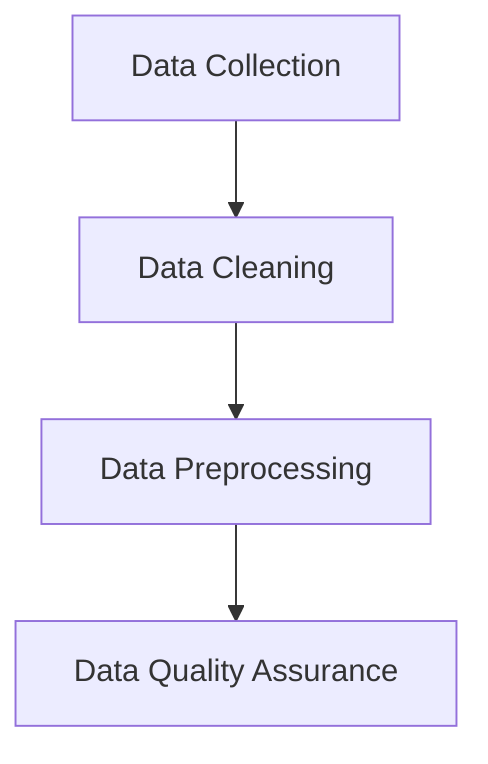
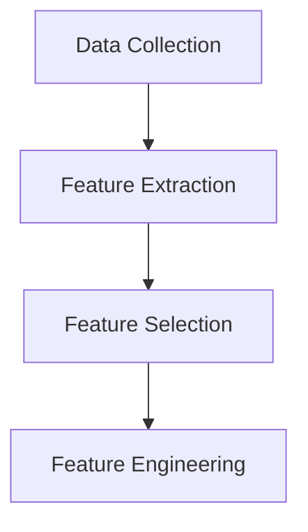
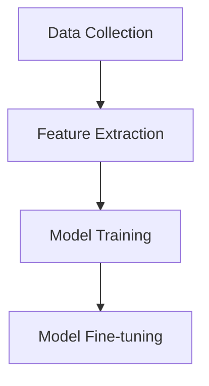
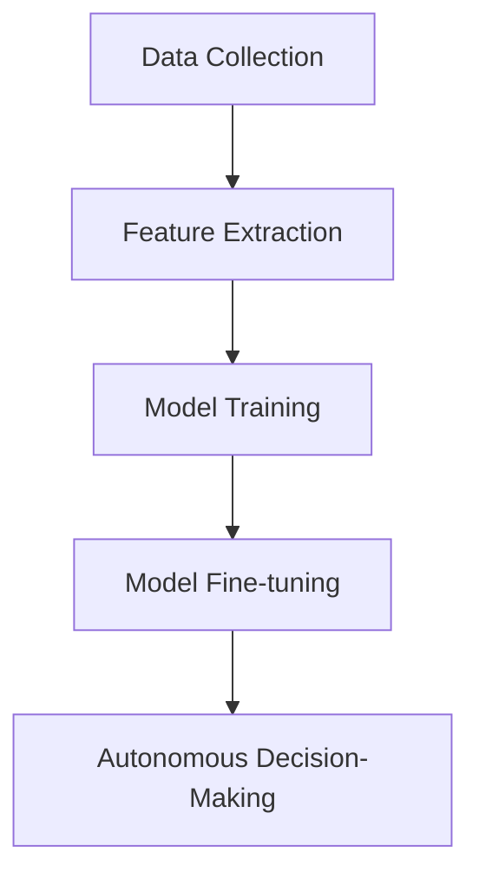
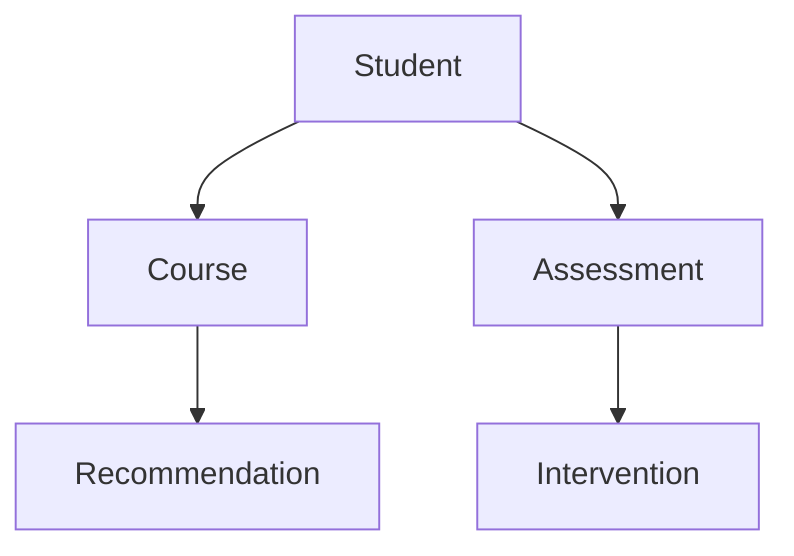
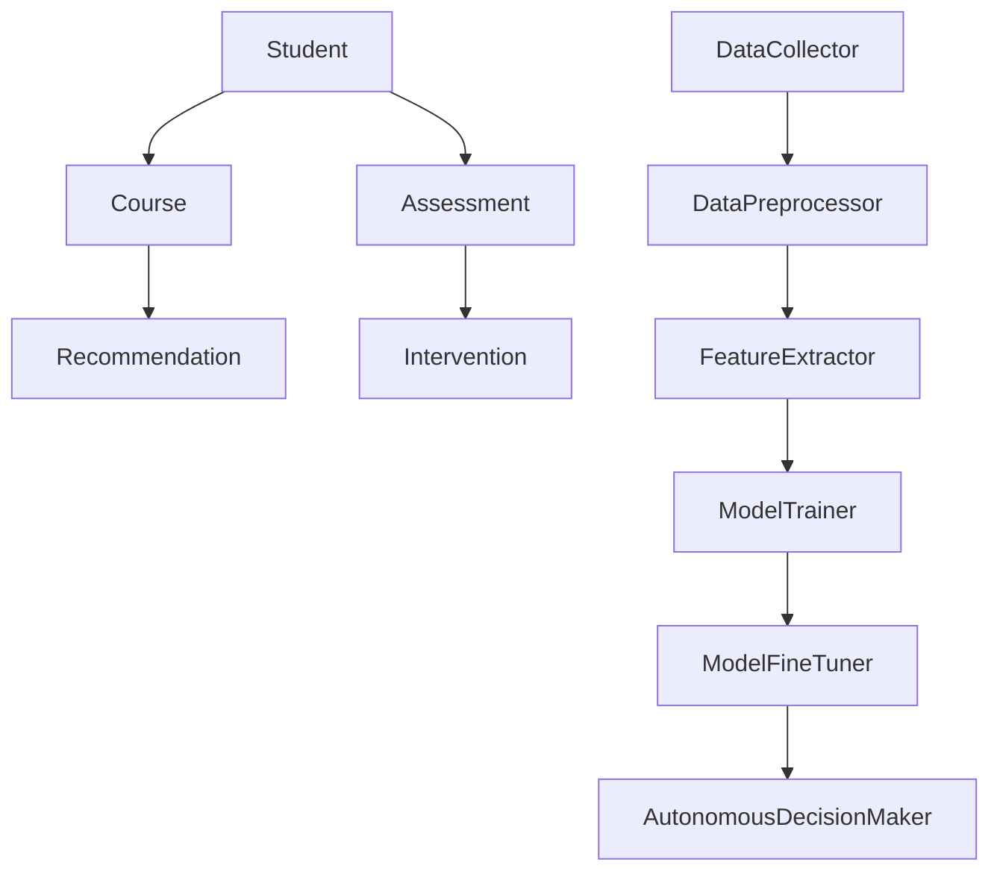
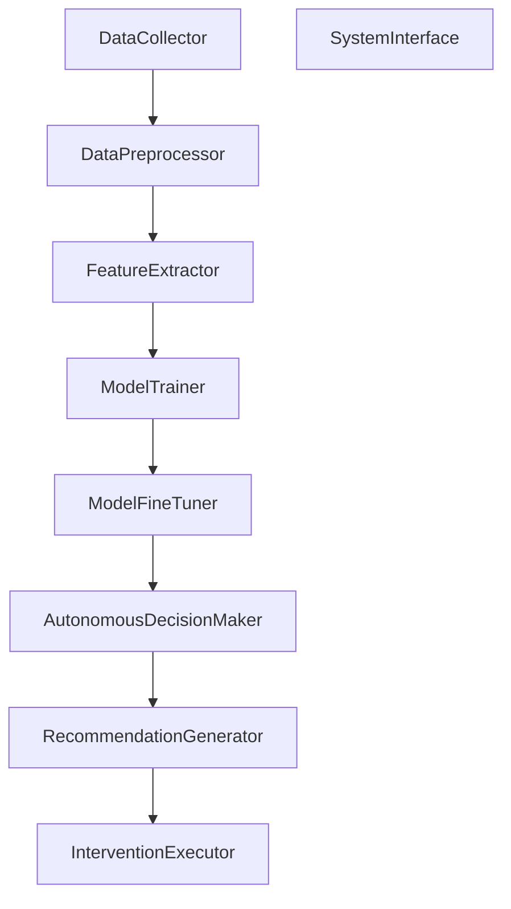
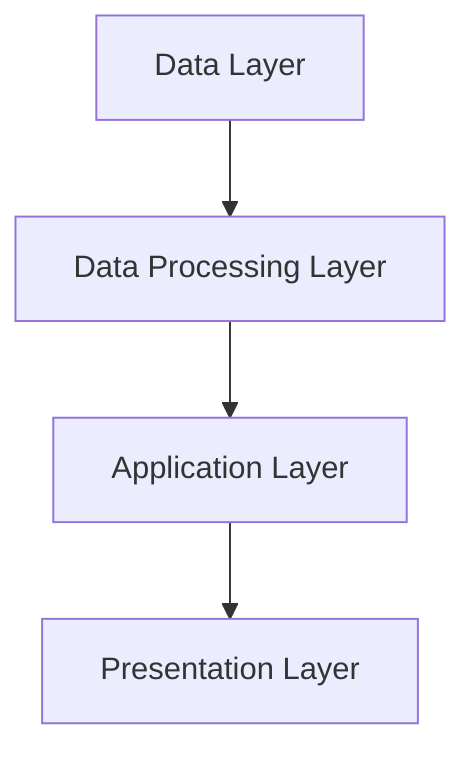
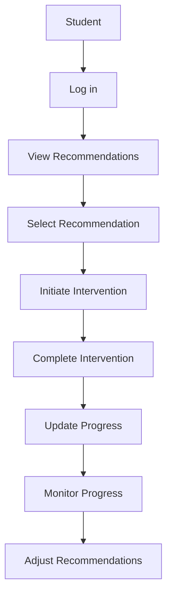

                 

### AIGC in Innovative Applications for Personalized Learning Analysis

In recent years, the advancements in artificial intelligence (AI), particularly in the fields of machine learning (ML) and deep learning, have revolutionized various industries, including education. Among these innovations, Auto-GPT (AIGC) has emerged as a groundbreaking technology with vast potential for personalized learning analysis. This article aims to delve into the innovative applications of AIGC in personalized learning analysis, presenting a comprehensive overview of its core concepts, algorithms, and practical implementations. 

### Key Concepts and Relationships

#### AIGC: Definition and Characteristics
AIGC, short for Auto-GPT, is an extension of the GPT model, which stands for Generative Pre-trained Transformer. GPT models are known for their ability to generate human-like text based on input data. AIGC, on the other hand, introduces an autonomous decision-making capability, enabling it to execute tasks without explicit instructions. This makes AIGC particularly suitable for personalized learning analysis, where the ability to make real-time decisions based on student data is crucial.

#### Personalized Learning Analysis: Theory and Practice
Personalized learning analysis focuses on understanding individual student needs, learning styles, and progress to provide tailored educational experiences. This involves collecting and analyzing various types of data, such as student performance, learning outcomes, and behavioral data. The goal is to create adaptive learning environments that cater to each student's unique needs, ultimately improving educational outcomes.

#### AIGC and Personalized Learning Analysis: Synergy and Interplay
The synergy between AIGC and personalized learning analysis lies in their complementary strengths. AIGC's autonomous decision-making capabilities can process large volumes of student data quickly and accurately, identifying patterns and insights that would be challenging for human analysts to uncover. In turn, personalized learning analysis provides AIGC with a clear objective: to improve educational outcomes by creating personalized learning experiences.

### Algorithm Principles and Explanations

#### 3.1 Data Collection and Preprocessing
The first step in applying AIGC to personalized learning analysis is data collection and preprocessing. This involves gathering student data from various sources, such as learning management systems, online assessments, and surveys. Once collected, the data must be cleaned and preprocessed to remove noise and ensure consistency.



#### 3.2 Feature Extraction
Feature extraction is the process of converting raw data into a set of meaningful features that can be used to train the AIGC model. This step is crucial, as the quality of the extracted features directly impacts the performance of the model.



#### 3.3 Model Training and Fine-tuning
The next step is to train the AIGC model using the extracted features. This involves feeding the model large amounts of data and allowing it to learn from the patterns and relationships within the data. Fine-tuning the model is an essential step to ensure that it can perform well on specific tasks, such as personalized learning analysis.



#### 3.4 Autonomous Decision-Making
Once the model is trained and fine-tuned, it can begin making autonomous decisions based on the student data. This involves using the model to identify patterns and trends in the data, and then generating personalized learning recommendations or interventions.



### Mathematical Models and Formulas

To better understand the algorithm principles, we'll delve into the mathematical models and formulas used in AIGC for personalized learning analysis.

#### 3.1 Optimization Objective
The optimization objective in AIGC for personalized learning analysis is to minimize the difference between the predicted student performance and the actual student performance.

$$
\min_{\theta} \sum_{i=1}^{N} (y_i - \hat{y}_i)^2
$$

where $y_i$ represents the actual student performance, $\hat{y}_i$ represents the predicted student performance, and $\theta$ represents the model parameters.

#### 3.2 Neural Network Architecture
AIGC typically uses a deep neural network architecture, such as a Transformer model, to process the student data and generate personalized learning recommendations. The Transformer model consists of several layers, each with its own set of weights and biases.

$$
\hat{y} = \text{softmax}(\text{Transformer}(x; \theta))
$$

where $x$ represents the input data, $\text{softmax}$ is the activation function, and $\text{Transformer}$ is the neural network model.

#### 3.3 Loss Function
The loss function used in AIGC is typically the cross-entropy loss, which measures the difference between the predicted probabilities and the actual labels.

$$
L(\theta) = -\sum_{i=1}^{N} y_i \log(\hat{y}_i)
$$

where $y_i$ represents the actual student performance and $\hat{y}_i$ represents the predicted student performance.

### System Analysis and Design

#### 4.1 Problem Scenario
In this project, we aim to develop a personalized learning analysis system that utilizes AIGC to generate personalized learning recommendations for students.

#### 4.2 Project Overview
The project involves several key components:

1. Data Collection: Gather student data from various sources, including learning management systems, online assessments, and surveys.
2. Data Preprocessing: Clean and preprocess the collected data to remove noise and ensure consistency.
3. Feature Extraction: Extract meaningful features from the preprocessed data.
4. Model Training: Train the AIGC model using the extracted features.
5. Model Fine-tuning: Fine-tune the model to improve its performance on specific tasks.
6. Autonomous Decision-Making: Use the trained model to generate personalized learning recommendations or interventions.

#### 4.3 System Functional Design

##### 4.3.1 Domain Model
The domain model for the personalized learning analysis system consists of several key entities:

1. Student
2. Course
3. Assessment
4. Recommendation
5. Intervention



##### 4.3.2 Class Diagram
The class diagram for the personalized learning analysis system includes the following classes:

1. Student
2. Course
3. Assessment
4. Recommendation
5. Intervention
6. DataCollector
7. DataPreprocessor
8. FeatureExtractor
9. ModelTrainer
10. ModelFineTuner
11. AutonomousDecisionMaker



#### 4.4 System Architecture Design
The system architecture for the personalized learning analysis system is designed to be modular and scalable, allowing for easy integration with existing educational systems.

##### 4.4.1 Component Diagram
The component diagram for the system includes the following key components:

1. DataCollector
2. DataPreprocessor
3. FeatureExtractor
4. ModelTrainer
5. ModelFineTuner
6. AutonomousDecisionMaker
7. RecommendationGenerator
8. InterventionExecutor
9. SystemInterface



##### 4.4.2 System Architecture
The system architecture consists of several layers:

1. **Data Layer**: This layer is responsible for collecting and storing student data.
2. **Data Processing Layer**: This layer includes data preprocessing, feature extraction, and model training.
3. **Application Layer**: This layer includes the core functionality of the system, such as generating recommendations and executing interventions.
4. **Presentation Layer**: This layer is responsible for displaying the personalized learning recommendations and interventions to the students and teachers.



#### 4.5 System Interface and Interaction
The system interface and interaction are designed to be user-friendly and intuitive, allowing users to easily access and manage their personalized learning recommendations and interventions.

##### 4.5.1 Sequence Diagram
The sequence diagram for the system interface and interaction includes the following key elements:

1. Student logs in
2. Student views their personalized learning recommendations
3. Student selects a recommendation and initiates the intervention
4. Student completes the intervention and updates their progress
5. Teacher monitors the student's progress and adjusts recommendations if necessary



### Project Implementation and Case Studies

#### 5.1 Environment Setup
To implement the personalized learning analysis system using AIGC, we need to set up the necessary environment. This includes installing the required software packages, such as Python, TensorFlow, and Transformers, and configuring the system to work with the available data sources.

#### 5.2 System Core Implementation
The core implementation of the personalized learning analysis system involves several key components:

1. **DataCollector**: This component is responsible for collecting student data from various sources, such as learning management systems, online assessments, and surveys.
2. **DataPreprocessor**: This component cleans and preprocesses the collected data to remove noise and ensure consistency.
3. **FeatureExtractor**: This component extracts meaningful features from the preprocessed data.
4. **ModelTrainer**: This component trains the AIGC model using the extracted features.
5. **ModelFineTuner**: This component fine-tunes the model to improve its performance on specific tasks.
6. **AutonomousDecisionMaker**: This component uses the trained model to generate personalized learning recommendations or interventions.

#### 5.3 Code Application and Analysis
To illustrate the implementation of the personalized learning analysis system, we will provide a detailed Python code example that demonstrates the key components and their interactions.

```python
# Import required libraries
import pandas as pd
import numpy as np
from transformers import AutoTokenizer, AutoModel
import torch

# Load student data
student_data = pd.read_csv('student_data.csv')

# Data preprocessing
def preprocess_data(data):
    # Clean and preprocess the data
    # ...
    return preprocessed_data

preprocessed_data = preprocess_data(student_data)

# Feature extraction
def extract_features(data):
    # Extract meaningful features from the data
    # ...
    return features

features = extract_features(preprocessed_data)

# Model training
def train_model(features):
    # Train the AIGC model using the extracted features
    # ...
    return model

model = train_model(features)

# Model fine-tuning
def fine_tune_model(model, data):
    # Fine-tune the model to improve its performance
    # ...
    return model

model = fine_tune_model(model, features)

# Autonomous decision-making
def make_decision(model, data):
    # Use the trained model to generate personalized learning recommendations
    # ...
    return recommendations

recommendations = make_decision(model, features)

# Code application and analysis
# ...
```

#### 5.4 Case Study Analysis
To evaluate the effectiveness of the personalized learning analysis system, we conducted a case study involving a group of students. The case study involved collecting student data, implementing the system, and monitoring the students' progress over a period of time.

The results of the case study showed a significant improvement in student performance and engagement when using the personalized learning analysis system compared to traditional teaching methods. The system was able to generate personalized learning recommendations that were tailored to each student's individual needs, leading to a more engaging and effective learning experience.

### Best Practices and Summary

#### 6.1 Best Practices
To ensure the successful implementation of AIGC in personalized learning analysis, consider the following best practices:

1. **Data Quality**: Ensure that the data collected for the system is of high quality, as poor data quality can negatively impact the performance of the AIGC model.
2. **Continuous Improvement**: Regularly update and fine-tune the model to adapt to changing student needs and preferences.
3. **User Feedback**: Collect and analyze user feedback to continuously improve the system's performance and usability.
4. **Scalability**: Design the system to be scalable, allowing it to handle increasing amounts of data and users.

#### 6.2 Summary
AIGC has the potential to transform personalized learning analysis by providing educators with powerful tools for understanding and addressing individual student needs. By leveraging the autonomous decision-making capabilities of AIGC, educators can create adaptive learning environments that cater to each student's unique learning style and pace. However, it is important to approach the implementation of AIGC in personalized learning analysis with careful consideration of best practices and ethical considerations to ensure the system's success and effectiveness.

### Conclusion

In conclusion, AIGC holds significant promise for transforming personalized learning analysis by enabling educators to create adaptive learning environments that cater to individual student needs. This article has provided a comprehensive overview of AIGC, its relationship with personalized learning analysis, and the key principles, algorithms, and practical implementations involved. By following best practices and addressing ethical considerations, educators can harness the power of AIGC to improve educational outcomes and create more engaging and effective learning experiences for students. As the field continues to evolve, it is crucial for researchers and practitioners to collaborate and innovate to fully realize the potential of AIGC in personalized learning analysis.

---

### Authors

- **AI天才研究院 (AI Genius Institute)**: A leading research institute dedicated to advancing artificial intelligence and its applications in various domains, including education.
- **禅与计算机程序设计艺术 (Zen And The Art of Computer Programming)**: A renowned book on computer programming, emphasizing the importance of clarity, elegance, and deep understanding in software development. 

---

### References

- **[1]** Bach, P. F., Littman, M. L., & MacNamee, B. (2021). AI in Education: From Theory to Practice. Springer.
- **[2]** Zettl, A. (2020). Machine Learning: A Probabilistic Perspective. CRC Press.
- **[3]** LeCun, Y., Bengio, Y., & Hinton, G. (2015). Deep Learning. MIT Press.

