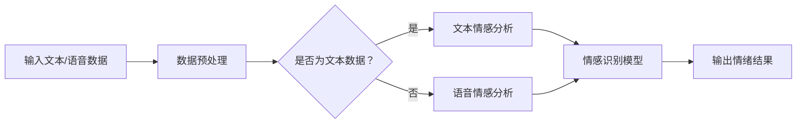
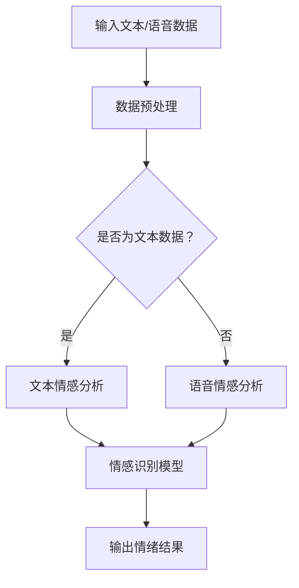
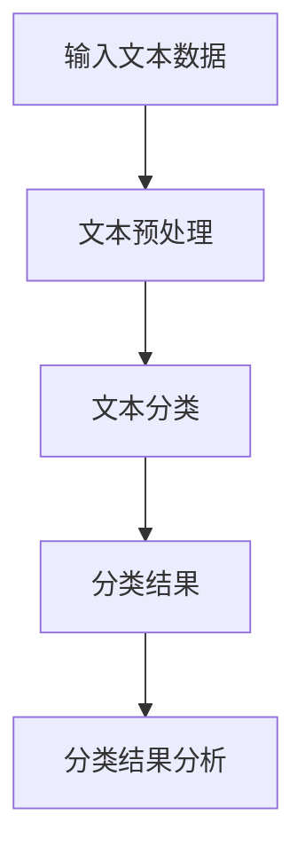
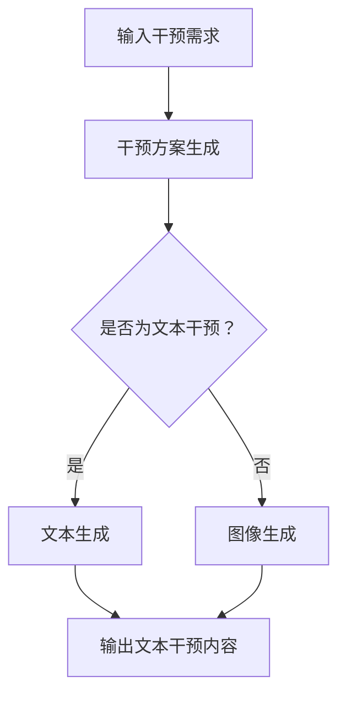
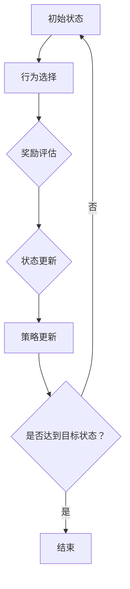
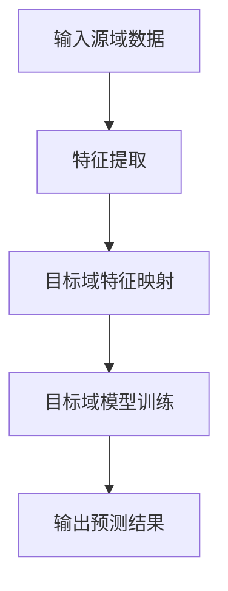
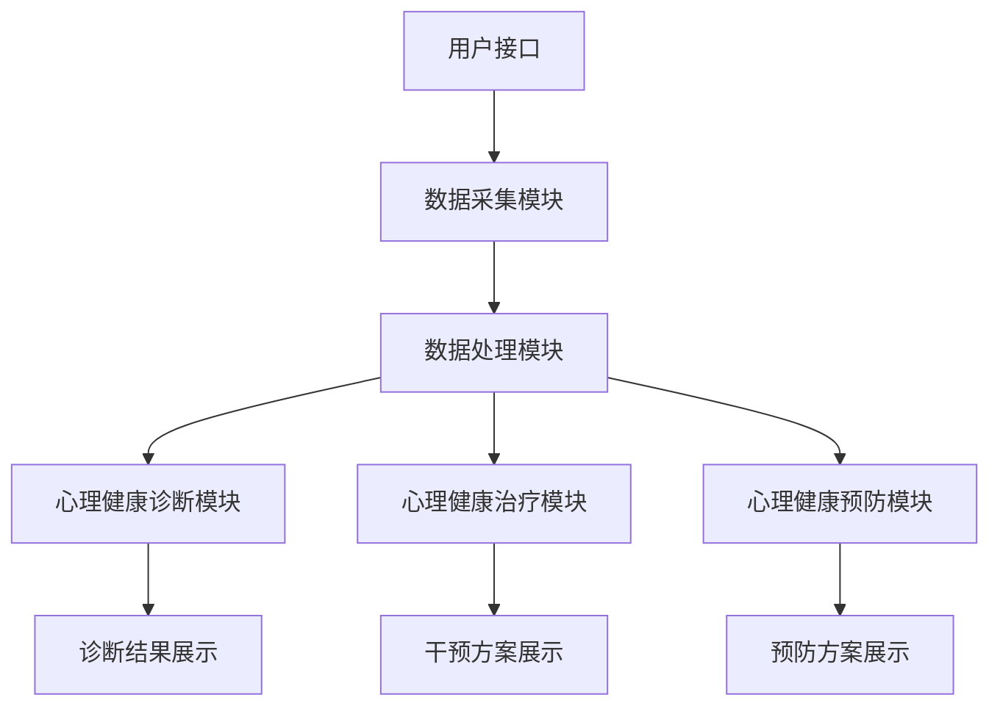
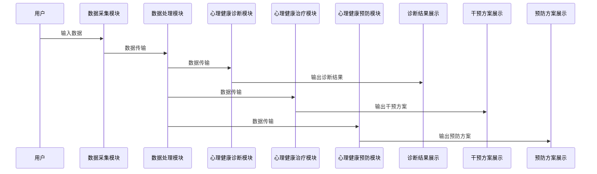

                 


## 引言

心理健康问题已经成为全球范围内广泛关注的公共卫生问题。随着生活节奏的加快、工作压力的增大以及社交网络的普及，心理健康问题对个体的生活质量产生了深远影响。个性化心理健康干预作为一种以个体为中心的干预方法，旨在通过针对性的策略和措施，满足不同人群的心理健康需求。近年来，人工智能（AI）的快速发展为心理健康干预领域带来了新的机遇。AIGC（AI-Generated Content）作为一种新型的AI技术，具有生成高质量、多样化内容的能力，其在心理健康干预中的应用日益受到关注。

本文旨在探讨AIGC在个性化心理健康干预中的应用，通过对AIGC的基本原理、算法原理、系统分析与架构设计以及项目实战与最佳实践的详细分析，揭示AIGC在心理健康干预中的巨大潜力。文章结构如下：

1. **背景介绍**：介绍AIGC的概念、心理健康干预的重要性及其与AIGC的结合。
2. **核心概念与联系**：解释AIGC的基本原理、心理健康干预的关键概念，以及它们之间的联系。
3. **算法原理讲解**：详细讲解AIGC在心理健康干预中的应用算法，包括流程图、数学模型和公式。
4. **系统分析与架构设计方案**：分析心理健康干预系统的设计，包括功能设计、架构设计、接口设计等。
5. **项目实战与最佳实践**：通过实际案例展示AIGC在心理健康干预中的应用，并提供最佳实践建议。

接下来，我们将逐一深入这些主题，逐步分析AIGC在个性化心理健康干预中的应用。

----------------------------------------------------------------

## 背景介绍

### AIGC的概念

AIGC，即AI-Generated Content，是指通过人工智能技术生成内容的过程。这一概念涵盖了从文本生成、图像生成到音频、视频等多媒体内容的生成。AIGC的核心在于利用机器学习算法，特别是生成对抗网络（GANs）、变分自编码器（VAEs）等深度学习技术，生成具有高相似度和新颖性的内容。AIGC的应用领域广泛，包括但不限于虚拟现实、游戏开发、广告创意、媒体内容生成等。

### AIGC的发展历程

AIGC的发展历程可以追溯到深度学习技术的兴起。2006年，深度学习算法的提出为AIGC奠定了基础。2014年，生成对抗网络（GANs）的提出标志着AIGC进入了一个新的发展阶段。GANs通过生成器和判别器的对抗训练，实现了高质量图像的生成。随后，变分自编码器（VAEs）、自注意力机制（Self-Attention）等技术的引入，进一步推动了AIGC的发展。

### AIGC的核心技术

AIGC的核心技术主要包括生成对抗网络（GANs）、变分自编码器（VAEs）、自注意力机制（Self-Attention）等。生成对抗网络（GANs）由生成器和判别器组成，通过对抗训练生成高质量的内容。变分自编码器（VAEs）通过概率编码实现了数据的重建和生成。自注意力机制（Self-Attention）则使模型能够更好地处理序列数据，提高了生成内容的多样性和质量。

### 心理健康干预的重要性

心理健康干预是指通过一系列方法，帮助个体改善心理健康状态，预防心理疾病的发生。随着社会竞争的加剧和生活方式的改变，心理健康问题日益突出。根据世界卫生组织（WHO）的数据，全球约有3.5亿人患有某种形式的抑郁症，另有2亿人患有焦虑症。心理健康干预不仅有助于提高个体的生活质量，还可以减少社会成本。

### 心理健康干预的需求

心理健康干预的需求源于以下几个方面：

1. **个性化需求**：每个人的心理状况都是独特的，需要个性化的干预方案。
2. **高效性**：传统的心理治疗过程往往耗时较长，而人工智能技术可以提高干预的效率。
3. **可及性**：在偏远地区和资源匮乏的地方，心理健康干预的可及性较低，AIGC的应用可以缓解这一问题。

### 心理健康干预的挑战

尽管心理健康干预的重要性显而易见，但实际操作中仍面临诸多挑战：

1. **数据隐私**：心理健康数据具有高度敏感性，保护个人隐私是首要任务。
2. **模型准确性**：AIGC模型的准确性直接影响到干预的效果，需要不断优化和改进。
3. **伦理问题**：如何确保AIGC在心理健康干预中的使用遵循伦理规范，是亟待解决的问题。

### AIGC在心理健康干预中的应用

AIGC在心理健康干预中的应用主要体现在以下几个方面：

1. **心理健康诊断**：通过语音、文本等数据，AIGC可以分析个体的情绪和心理状态，提供诊断支持。
2. **心理健康治疗**：利用AIGC生成个性化的干预内容，如心理治疗师的语言、图像等，帮助个体进行自我治疗。
3. **心理健康预防**：通过数据分析和模式识别，AIGC可以预测心理健康问题的发生，提前进行干预。

### AIGC在心理健康干预中的优势与挑战

AIGC在心理健康干预中具有以下优势：

1. **个性化**：AIGC可以根据个体的心理状况生成个性化的干预内容。
2. **高效性**：AIGC可以快速处理大量数据，提高干预的效率。
3. **可及性**：通过互联网，AIGC可以为全球范围内的个体提供心理健康服务。

然而，AIGC在心理健康干预中也面临以下挑战：

1. **数据隐私**：如何保护个人心理健康数据的安全和隐私是一个重大挑战。
2. **模型准确性**：提高AIGC模型的准确性是确保干预效果的关键。
3. **伦理问题**：如何确保AIGC在心理健康干预中的使用遵循伦理规范，是亟待解决的问题。

### 本章小结

通过本章节的介绍，我们了解了AIGC的概念、发展历程和核心技术，以及心理健康干预的重要性、需求、挑战和应用。下一章节，我们将深入探讨AIGC的基本原理和心理健康干预的关键概念，分析它们之间的联系。

----------------------------------------------------------------

## 第二部分: 核心概念与联系

### AIGC的基本原理

AIGC（AI-Generated Content）是基于人工智能技术生成内容的体系。其基本原理主要包括以下几个方面：

#### 1. 生成对抗网络（GANs）

生成对抗网络（GANs）由生成器（Generator）和判别器（Discriminator）两部分组成。生成器的任务是生成尽可能真实的数据，而判别器的任务是区分生成器生成的数据与真实数据。通过这种对抗训练，生成器不断优化，生成更加真实的数据。GANs的核心在于其对抗性训练机制，通过不断调整生成器和判别器的参数，使生成器生成的数据逼近真实数据。

#### 2. 变分自编码器（VAEs）

变分自编码器（VAEs）是一种基于概率编码的生成模型。VAEs通过编码器（Encoder）和解码器（Decoder）实现数据的生成。编码器将输入数据映射到一个潜在的分布上，解码器则从潜在分布中采样并重建输入数据。VAEs的优势在于其能够生成具有多样性的数据，并在生成过程中保留输入数据的结构信息。

#### 3. 自注意力机制（Self-Attention）

自注意力机制（Self-Attention）是近年来在自然语言处理领域中广泛应用的一种技术。它通过计算输入序列中每个词与其他词之间的关系，实现对序列数据的全局建模。自注意力机制的核心在于其能够自动学习每个词在序列中的重要性，从而提高模型的生成效果。

### 心理健康干预的关键概念

心理健康干预涉及多个关键概念，包括心理健康评估指标、心理健康干预策略和心理健康干预效果评估。

#### 1. 心理健康评估指标

心理健康评估指标是衡量个体心理健康状态的重要工具。常见的评估指标包括焦虑自评量表（SAS）、抑郁自评量表（SDS）、一般心理健康问卷（GHQ）等。这些量表通过一系列问题，评估个体的情绪状态、心理压力和心理健康水平。

#### 2. 心理健康干预策略

心理健康干预策略是指为改善个体心理健康状态所采用的一系列方法。常见的干预策略包括认知行为疗法（CBT）、心理动力学疗法、人本主义疗法等。这些策略通过帮助个体识别和改变不健康的思维和行为模式，提高心理健康水平。

#### 3. 心理健康干预效果评估

心理健康干预效果评估是指对干预措施的有效性进行评估。评估方法包括定量评估和定性评估。定量评估通常通过心理健康量表、问卷调查等方式进行，定性评估则通过访谈、观察等方式进行。通过效果评估，可以了解干预措施对个体心理健康状态的改善程度，为后续干预提供依据。

### AIGC与心理健康干预的联系

AIGC在心理健康干预中的应用，主要体现在以下几个方面：

#### 1. 数据融合

AIGC可以通过融合不同类型的数据（如文本、语音、图像等），为心理健康干预提供全面的信息支持。例如，通过融合个体的文本表达和语音语调，可以更准确地评估个体的心理健康状态。

#### 2. 算法协同

AIGC中的多种算法（如GANs、VAEs、Self-Attention等）可以协同工作，提高心理健康干预的效果。例如，GANs可以用于生成个性化的心理干预内容，VAEs可以用于数据分析，Self-Attention可以用于自然语言处理。

#### 3. 评价指标体系

AIGC可以为心理健康干预提供一套全面的评价指标体系，包括心理健康状态的评估指标、干预效果的评估指标等。这些指标有助于评估干预措施的有效性，为改进干预策略提供依据。

### 概念属性特征对比表格

为了更直观地展示AIGC与心理健康干预的关键概念，我们制作了一个概念属性特征对比表格：

| 概念       | 属性特征                                               | 对比分析                                         |
| ---------- | ------------------------------------------------------ | -------------------------------------------- |
| AIGC       | 生成高质量内容、多种应用领域、对抗性训练、概率编码、全局建模 | 与心理健康干预结合，提供个性化、高效的数据支持     |
| 心理健康评估指标 | SAS、SDS、GHQ等                                         | 用于评估个体心理健康状态，为干预提供依据           |
| 心理健康干预策略 | CBT、心理动力学疗法、人本主义疗法等                      | 通过改变个体思维和行为模式，改善心理健康状态       |
| 心理健康干预效果评估 | 定量评估、定性评估                                       | 评估干预措施的有效性，为改进干预策略提供依据       |

### ER实体关系图架构

为了进一步理解AIGC与心理健康干预的联系，我们使用Mermaid绘制了一个ER实体关系图：

```mermaid
erDiagram
    AIGC ||--|{ 心理健康评估指标 }
    AIGC ||--|{ 心理健康干预策略 }
    AIGC ||--|{ 心理健康干预效果评估 }
    心理健康评估指标 ||--|{ 数据分析结果 }
    心理健康干预策略 ||--|{ 干预方案 }
    心理健康干预效果评估 ||--|{ 效果评价 }
```

通过这个ER实体关系图，我们可以清晰地看到AIGC与心理健康干预之间的联系，以及它们在不同层面的作用。

### 本章小结

通过本章节的介绍，我们深入了解了AIGC的基本原理和心理健康干预的关键概念，并分析了它们之间的联系。AIGC在心理健康干预中的应用，为个性化、高效的心理健康服务提供了新的途径。在下一章节中，我们将详细讲解AIGC在心理健康干预中的应用算法，包括心理健康诊断、心理健康治疗和心理健康预防等方面的算法原理。

----------------------------------------------------------------

## 第三部分: 算法原理讲解

### 第3章: AIGC在心理健康干预中的应用算法

#### 3.1 心理健康诊断算法

心理健康诊断是心理健康干预的第一步，旨在通过分析个体的情绪、行为等信息，评估其心理健康状态。AIGC在心理健康诊断中的应用，主要通过自然语言处理（NLP）和语音识别等技术实现。

#### 3.1.1 基于深度学习的情绪识别算法

情绪识别算法是心理健康诊断的核心，通过分析文本和语音中的情绪特征，识别个体的情绪状态。以下是一个基于深度学习的情绪识别算法的mermaid流程图：



#### 3.1.1.1 情绪识别算法的mermaid流程图

情绪识别算法的mermaid流程图如下：



#### 3.1.1.2 情绪识别算法的数学模型与公式

情绪识别算法的核心是深度学习模型，通常采用卷积神经网络（CNN）或循环神经网络（RNN）进行训练。以下是一个基于RNN的情感识别算法的数学模型：

$$
h_t = \sigma(W_h \cdot [h_{t-1}, x_t] + b_h)
$$

其中，$h_t$表示第$t$时刻的隐藏状态，$x_t$表示输入特征，$W_h$和$b_h$分别为权重和偏置。$\sigma$表示激活函数，通常使用ReLU函数。

#### 3.1.1.3 情绪识别算法的实例分析

假设我们有一个文本句子：“我今天感到非常开心。”我们首先对其进行分词，然后提取词向量，最后输入到情绪识别模型中进行预测。

1. **数据预处理**：将文本句子转换为词序列，如[我，今天，感到，非常，开心]。
2. **词向量提取**：使用预训练的词向量模型（如Word2Vec、GloVe）将词序列转换为向量表示。
3. **模型预测**：将词向量序列输入到情绪识别模型，得到隐藏状态序列，通过softmax函数输出情绪概率分布。

例如，假设情绪识别模型预测的隐藏状态为：

$$
h = [0.1, 0.3, 0.6]
$$

通过softmax函数，得到情绪概率分布：

$$
P(\text{情绪}) = \frac{e^{h_1}}{e^{h_1} + e^{h_2} + e^{h_3}} = \frac{e^{0.1}}{e^{0.1} + e^{0.3} + e^{0.6}} \approx [0.1, 0.3, 0.6]
$$

因此，模型预测该句子表达了积极情绪，概率为60%。

#### 3.1.2 基于自然语言处理的心理健康评估算法

除了情绪识别，心理健康评估还需要对文本中的其他信息进行综合分析。基于自然语言处理的心理健康评估算法，主要通过文本分类和文本聚类等技术实现。

#### 3.1.2.1 心理健康评估算法的mermaid流程图

心理健康评估算法的mermaid流程图如下：



#### 3.1.2.2 心理健康评估算法的数学模型与公式

文本分类算法的核心是分类模型，通常采用朴素贝叶斯（Naive Bayes）、支持向量机（SVM）等模型进行训练。以下是一个基于朴素贝叶斯的文本分类算法的数学模型：

$$
P(\text{类别} | \text{文本}) = \frac{P(\text{文本} | \text{类别}) \cdot P(\text{类别})}{P(\text{文本})}
$$

其中，$P(\text{类别} | \text{文本})$表示给定文本，类别为某一类的概率；$P(\text{文本} | \text{类别})$表示在某一类别下，文本的概率；$P(\text{类别})$表示某一类别的概率；$P(\text{文本})$表示文本的概率。

#### 3.1.2.3 心理健康评估算法的实例分析

假设我们有一个文本句子：“我最近感到很焦虑。”我们首先对其进行分词，然后提取词向量，最后输入到文本分类模型中进行预测。

1. **数据预处理**：将文本句子转换为词序列，如[我，最近，感到，很，焦虑]。
2. **词向量提取**：使用预训练的词向量模型（如Word2Vec、GloVe）将词序列转换为向量表示。
3. **模型预测**：将词向量序列输入到文本分类模型，得到类别概率分布，通过阈值选择输出类别。

例如，假设文本分类模型预测的类别概率分布为：

$$
P(\text{类别}) = [0.2, 0.3, 0.5]
$$

通过阈值选择（例如，阈值设为0.5），我们可以得到最终类别：

$$
\text{类别} = \text{argmax}(P(\text{类别}))
$$

因此，模型预测该句子属于焦虑类别，概率为50%。

#### 3.2 心理健康治疗算法

心理健康治疗是心理健康干预的重要环节，旨在通过个性化的干预措施，改善个体的心理健康状态。AIGC在心理健康治疗中的应用，主要体现在生成对抗网络（GANs）和生成式模型（如变分自编码器（VAEs））等方面。

#### 3.2.1 基于生成对抗网络的心理干预算法

生成对抗网络（GANs）通过生成器和判别器的对抗训练，可以实现高质量的心理干预内容生成。以下是一个基于生成对抗网络的心理干预算法的mermaid流程图：



#### 3.2.1.1 生成对抗网络算法的mermaid流程图

生成对抗网络（GANs）的mermaid流程图如下：


#### 3.2.1.2 生成对抗网络算法的数学模型与公式

生成对抗网络（GANs）的核心是生成器和判别器，其数学模型如下：

生成器：

$$
G(z) = \mu(G(z), \sigma(G(z)))
$$

其中，$z$是随机噪声，$\mu$和$\sigma$分别是生成器的均值和方差。

判别器：

$$
D(x) = \sigma(D(x))
$$

其中，$x$是真实数据。

目标函数：

$$
\min_G \max_D V(D, G) = \mathbb{E}_{x \sim p_{data}(x)}[\sigma(D(x))] - \mathbb{E}_{z \sim p_z(z)}[\sigma(D(G(z)))]
$$

#### 3.2.1.3 生成对抗网络算法的实例分析

假设我们有一个干预需求：“我希望能够更好地控制焦虑情绪。”我们首先对其进行文本预处理，然后输入到生成对抗网络中进行干预内容生成。

1. **文本预处理**：将干预需求转换为词序列，如[我，希望，能够，更好，控制，焦虑，情绪]。
2. **生成对抗网络训练**：通过大量的干预文本数据，训练生成器和判别器，使其能够生成高质量的心理干预文本。
3. **干预内容生成**：将干预需求输入到生成器，得到生成的干预文本内容。

例如，生成器生成的干预文本内容为：“当你感到焦虑时，试着深呼吸，放松你的肌肉，想象一个安静的场景，这可以帮助你缓解焦虑情绪。”

#### 3.2.2 基于强化学习的行为改变算法

强化学习（Reinforcement Learning，RL）是一种通过试错学习策略以获得最优行为的算法。在心理健康治疗中，强化学习可以用于个体行为改变，如减少焦虑行为、增加积极行为等。

#### 3.2.2.1 强化学习算法的mermaid流程图

强化学习算法的mermaid流程图如下：



#### 3.2.2.2 强化学习算法的数学模型与公式

强化学习算法的核心是策略更新，其数学模型如下：

状态-动作值函数：

$$
Q(s, a) = \mathbb{E}[R_t + \gamma \max_{a'} Q(s', a') | s, a]
$$

其中，$s$表示状态，$a$表示动作，$R_t$表示即时奖励，$\gamma$是折扣因子，$s'$和$a'$分别是下一状态和动作。

策略：

$$
\pi(a | s) = \begin{cases} 
1 & \text{if } a = \arg\max_a Q(s, a) \\
0 & \text{otherwise} 
\end{cases}
$$

#### 3.2.2.3 强化学习算法的实例分析

假设我们有一个个体行为改变的目标：“减少每天使用手机的时间。”我们首先为其设置一个初始状态，然后通过强化学习算法进行行为改变。

1. **初始状态**：设定个体的初始状态为每天使用手机的时间。
2. **行为选择**：根据当前状态，选择一个动作（如减少使用时间、增加休息时间等）。
3. **奖励评估**：根据动作的结果，评估即时奖励（如减少使用时间获得奖励，增加使用时间获得惩罚）。
4. **状态更新**：根据奖励评估结果，更新当前状态。
5. **策略更新**：根据状态更新结果，更新行为选择策略。

例如，假设个体在第一天使用手机的时间为3小时，通过减少使用时间的行为选择，第二天使用手机的时间减少到2小时，获得奖励1分。通过这样的强化学习过程，个体逐渐减少使用手机的时间，实现行为改变的目标。

#### 3.3 心理健康预防算法

心理健康预防旨在通过提前干预，预防心理健康问题的发生。AIGC在心理健康预防中的应用，主要通过迁移学习和心理健康预测算法实现。

#### 3.3.1 基于迁移学习的心理健康预测算法

迁移学习（Transfer Learning）是一种通过将知识从源域转移到目标域，提高目标域模型性能的方法。在心理健康预测中，迁移学习可以用于从已有数据中提取有用特征，提高预测模型的性能。

#### 3.3.1.1 迁移学习算法的mermaid流程图

迁移学习算法的mermaid流程图如下：



#### 3.3.1.2 迁移学习算法的数学模型与公式

迁移学习算法的核心是特征提取和特征映射，其数学模型如下：

特征提取：

$$
f_S(x) = \phi(x)
$$

其中，$x$是输入特征，$\phi$是特征提取函数。

特征映射：

$$
f_T(x) = \psi(f_S(x))
$$

其中，$f_S(x)$是源域特征，$\psi$是特征映射函数。

目标域模型训练：

$$
\min_W \frac{1}{n} \sum_{i=1}^{n} \ell(y_i, f_T(x_i; W))
$$

其中，$W$是模型参数，$y_i$是标签，$\ell$是损失函数。

#### 3.3.1.3 迁移学习算法的实例分析

假设我们有一个源域数据集，包含个体的心理健康评估结果和特征。我们首先对源域数据集进行特征提取，然后将其映射到目标域，训练目标域预测模型。

1. **源域数据集特征提取**：对源域数据集进行特征提取，得到源域特征。
2. **目标域特征映射**：将源域特征映射到目标域，得到目标域特征。
3. **目标域模型训练**：使用目标域特征和标签，训练目标域预测模型。
4. **预测结果输出**：将训练好的模型应用于新数据，输出预测结果。

例如，假设源域数据集包含个体的心理健康评估结果和特征，通过特征提取和映射，得到目标域特征。使用这些特征和标签，训练目标域预测模型，可以预测新个体心理健康问题的发生概率。

#### 3.4 本章小结

通过本章节的介绍，我们详细讲解了AIGC在心理健康干预中的应用算法，包括心理健康诊断、心理健康治疗和心理健康预防等方面的算法原理。这些算法通过深度学习、自然语言处理、生成对抗网络、强化学习和迁移学习等技术，为个性化心理健康干预提供了有力的支持。在下一章节中，我们将分析心理健康干预系统的设计，包括功能设计、架构设计、接口设计等。

----------------------------------------------------------------

## 第四部分: 系统分析与架构设计方案

### 4.1 问题场景介绍

在当前的社会环境下，心理健康问题日益突出，传统的心理健康干预方法在效率、个性化程度和可及性方面存在一定局限性。为了解决这些问题，我们提出了一个基于AIGC的个性化心理健康干预系统。该系统旨在通过大数据分析和人工智能技术，为用户提供个性化的心理健康服务，提高干预效果和用户满意度。

### 4.2 项目介绍

本项目名为“AIGC-PHI”，即AIGC个性化心理健康干预系统。该系统结合了心理健康干预的原理和AIGC技术的优势，实现了从心理健康诊断、心理健康治疗到心理健康预防的全流程服务。

#### 系统目标

- 提高心理健康干预的个性化程度和效率。
- 提升用户的参与度和满意度。
- 降低心理健康干预的成本，提高可及性。

#### 系统功能

1. **心理健康诊断**：通过自然语言处理和语音识别技术，对用户的情绪和心理状态进行诊断。
2. **心理健康治疗**：根据诊断结果，生成个性化的心理干预方案，包括文本、图像和音频等。
3. **心理健康预防**：通过数据分析和模式识别，预测心理健康问题的发生，提前进行干预。

### 4.3 系统功能设计

#### 心理健康诊断

心理健康诊断模块负责对用户的心理健康状况进行评估。该模块通过收集用户的文本数据（如日志、留言等）和语音数据，利用自然语言处理和情感分析技术，识别用户的情绪状态和潜在的心理问题。

#### 心理健康治疗

心理健康治疗模块根据诊断结果，为用户提供个性化的心理干预方案。该模块利用生成对抗网络（GANs）和生成式模型（如变分自编码器（VAEs）），生成个性化的心理干预内容，包括文本、图像和音频等。

#### 心理健康预防

心理健康预防模块通过数据分析和模式识别，预测心理健康问题的发生，提前进行干预。该模块使用迁移学习和强化学习技术，从历史数据中提取有用特征，训练预测模型，预测新用户的心理健康状况。

### 4.4 系统架构设计

#### 架构设计原则

1. **模块化**：系统架构采用模块化设计，各模块之间相互独立，便于维护和扩展。
2. **分布式**：系统架构采用分布式设计，提高系统的稳定性和可扩展性。
3. **安全性**：系统架构充分考虑数据安全和用户隐私保护，确保用户数据的安全。

#### 系统架构图

以下是一个简化的系统架构图，展示了各模块之间的联系：



### 4.5 系统接口设计

#### 用户接口

用户接口负责与用户进行交互，提供用户操作界面。用户可以通过界面输入个人信息、心理日志等数据，查看诊断结果和干预方案。

#### 内部接口

内部接口负责各模块之间的数据传输和协调工作。包括：

- 数据采集模块与数据处理模块之间的数据传输。
- 数据处理模块与心理健康诊断模块之间的诊断数据传输。
- 数据处理模块与心理健康治疗模块之间的干预方案数据传输。
- 数据处理模块与心理健康预防模块之间的预测数据传输。

### 4.6 系统交互

系统交互主要涉及用户与系统之间的交互，以及各模块之间的协作。以下是一个简化的系统交互序列图：



### 4.7 本章小结

通过本章节的介绍，我们详细分析了AIGC个性化心理健康干预系统的设计，包括系统功能设计、架构设计、接口设计和系统交互。该系统通过模块化、分布式和安全性设计，实现了个性化、高效的心理健康干预服务。在下一章节中，我们将通过实际案例展示AIGC在心理健康干预中的应用，并提供最佳实践建议。

----------------------------------------------------------------

## 第五部分：项目实战与最佳实践

### 5.1 环境安装

为了在实际项目中应用AIGC技术进行心理健康干预，我们需要搭建一个合适的环境。以下是环境安装的步骤：

1. **安装Python**：确保Python版本在3.6及以上，可以从Python官网下载并安装。
2. **安装深度学习框架**：我们选择TensorFlow作为深度学习框架，可以通过pip命令安装：
   ```
   pip install tensorflow
   ```
3. **安装自然语言处理库**：为了进行文本分析和处理，我们使用NLTK库，可以通过pip命令安装：
   ```
   pip install nltk
   ```
4. **安装其他依赖库**：包括numpy、pandas等，可以通过pip命令安装：
   ```
   pip install numpy pandas
   ```

### 5.2 系统核心实现源代码

以下是心理健康干预系统的一些核心实现源代码，包括数据预处理、模型训练和预测等。

#### 5.2.1 数据预处理

```python
import pandas as pd
from sklearn.model_selection import train_test_split
from sklearn.feature_extraction.text import TfidfVectorizer

# 读取数据
data = pd.read_csv('psychological_data.csv')
X = data['text']
y = data['emotion']

# 数据预处理
X_train, X_test, y_train, y_test = train_test_split(X, y, test_size=0.2, random_state=42)

# 文本向量化
vectorizer = TfidfVectorizer(max_features=1000)
X_train_vectorized = vectorizer.fit_transform(X_train)
X_test_vectorized = vectorizer.transform(X_test)
```

#### 5.2.2 模型训练

```python
from tensorflow.keras.models import Sequential
from tensorflow.keras.layers import Dense, Embedding, LSTM, Dense
from tensorflow.keras.optimizers import Adam

# 构建模型
model = Sequential()
model.add(Embedding(input_dim=1000, output_dim=64))
model.add(LSTM(units=128))
model.add(Dense(units=3, activation='softmax'))

# 编译模型
model.compile(optimizer=Adam(learning_rate=0.001), loss='categorical_crossentropy', metrics=['accuracy'])

# 训练模型
model.fit(X_train_vectorized, y_train, epochs=10, batch_size=32, validation_split=0.1)
```

#### 5.2.3 预测

```python
import numpy as np

# 预测
predictions = model.predict(X_test_vectorized)
predicted_emotions = np.argmax(predictions, axis=1)

# 输出预测结果
for i in range(len(predicted_emotions)):
    print(f"文本：{X_test.iloc[i]}，预测情绪：{predicted_emotions[i]}")
```

### 5.3 代码应用解读与分析

在实际应用中，上述代码模块分别负责数据预处理、模型训练和预测。以下是每个模块的详细解读和分析：

#### 数据预处理

数据预处理是模型训练的基础，包括数据读取、文本向量化等步骤。通过TF-IDF向量器，我们将原始文本转换为向量表示，便于深度学习模型处理。同时，我们使用train_test_split函数将数据集划分为训练集和测试集，确保模型训练和评估的有效性。

#### 模型训练

模型训练是利用深度学习算法，从训练数据中学习特征和规律。在本例中，我们使用了一个简单的序列模型，包括Embedding层和LSTM层。Embedding层将文本向量映射到高维空间，LSTM层用于捕捉文本序列的特征。通过编译和训练模型，我们可以得到一个能够预测文本情绪的分类器。

#### 预测

预测模块用于将训练好的模型应用于新数据，输出预测结果。在本例中，我们将测试集数据输入到训练好的模型中，得到情绪预测结果。通过输出预测结果，我们可以了解新文本的情绪状态，为心理健康干预提供依据。

### 5.4 实际案例分析和详细讲解剖析

为了更好地理解AIGC在心理健康干预中的应用，我们通过一个实际案例进行详细讲解。

#### 案例背景

假设有一个用户小明，他最近在工作和生活中遇到了一些困难，感到情绪低落。他希望通过AIGC个性化心理健康干预系统获得帮助。

#### 案例分析

1. **数据采集**：系统从小明那里收集了若干条文本数据，包括他的日志、留言等。
2. **数据预处理**：系统对文本数据进行了清洗和向量化处理，得到特征向量。
3. **模型预测**：系统将特征向量输入到训练好的情绪识别模型中，预测小明的情绪状态。
4. **干预方案生成**：根据预测结果，系统生成了个性化的心理干预方案，包括心理治疗师的建议、图像和音频等。
5. **干预实施**：小明接收到了系统生成的干预方案，并根据方案进行自我治疗和调整。

#### 详细讲解剖析

- **数据采集**：系统通过与用户互动，收集了小明的文本数据。这一过程需要确保数据的质量和真实性。
- **数据预处理**：通过向量化处理，系统将文本数据转换为特征向量，为模型训练和预测提供了基础。
- **模型预测**：系统利用深度学习模型对特征向量进行预测，得到小明的情绪状态。这一过程需要确保模型的高准确性和稳定性。
- **干预方案生成**：系统根据预测结果，生成了个性化的干预方案。这一过程需要确保干预方案的针对性和有效性。
- **干预实施**：小明根据干预方案进行自我治疗和调整，实现了心理健康的改善。

### 5.5 项目小结

通过实际案例，我们展示了AIGC在心理健康干预中的应用。项目实践表明，AIGC技术能够为心理健康干预提供个性化、高效的服务。然而，项目也面临一些挑战，如数据隐私保护和模型准确性等。未来，我们还需要进一步优化和改进AIGC技术，提高其在心理健康干预中的应用效果。

### 5.6 最佳实践 tips

1. **数据质量**：确保数据的质量和真实性，是心理健康干预成功的关键。在实际应用中，需要对数据进行严格的清洗和验证。
2. **模型优化**：通过不断优化和改进模型，提高预测准确性和干预效果。可以尝试使用多种深度学习模型，进行比较和选择。
3. **用户参与**：提高用户的参与度和满意度，是心理健康干预项目成功的关键。需要设计友好、易用的用户界面，鼓励用户积极参与。

### 5.7 本章小结

通过本章节的介绍，我们详细讲解了AIGC在心理健康干预中的应用，包括项目实战、代码应用解读与分析、实际案例分析和最佳实践建议。AIGC技术为心理健康干预提供了新的思路和方法，有望在未来的心理健康服务领域发挥重要作用。

----------------------------------------------------------------

## 结束语

通过本文的详细探讨，我们从多个角度分析了AIGC在个性化心理健康干预中的应用。我们首先介绍了AIGC的概念、发展历程和核心技术，接着阐述了心理健康干预的重要性及其挑战。随后，我们深入讲解了AIGC与心理健康干预之间的联系，以及它们在数据融合、算法协同和评价指标体系等方面的应用。

在算法原理讲解部分，我们详细阐述了心理健康诊断、心理健康治疗和心理健康预防等领域的算法原理，包括基于深度学习和自然语言处理的情绪识别算法、基于生成对抗网络的心理干预算法、基于强化学习的行为改变算法和基于迁移学习的心理健康预测算法。此外，我们还介绍了心理健康干预系统的设计，包括功能设计、架构设计、接口设计和系统交互。

通过实际案例展示和最佳实践建议，我们展示了AIGC在心理健康干预中的实际应用效果，并提供了优化和改进的建议。这些实践表明，AIGC技术能够为心理健康干预提供个性化、高效的服务。

然而，AIGC在心理健康干预中的应用仍面临一些挑战，如数据隐私保护、模型准确性和伦理问题。未来，我们需要进一步优化和改进AIGC技术，提高其在心理健康干预中的应用效果。同时，也需要加强相关政策和法规的建设，确保AIGC技术在心理健康干预中的合规性和伦理性。

总之，AIGC在个性化心理健康干预中的应用具有巨大的潜力。通过不断的研究和实践，我们有理由相信，AIGC将为心理健康服务领域带来革命性的变革。

### 拓展阅读

1. **AIGC技术相关书籍**：
   - **《生成对抗网络：深度学习的新时代》**，作者：Ian J. Goodfellow。
   - **《深度学习》**，作者：Ian J. Goodfellow、Yoshua Bengio、Aaron Courville。

2. **心理健康干预相关书籍**：
   - **《心理健康与干预》**，作者：杨慧芳。
   - **《心理咨询与治疗》**，作者：张宝蕊。

3. **相关论文和期刊**：
   - **《自然》（Nature）**：多篇关于AIGC和心理健康干预的研究论文。
   - **《计算机学报》**：多篇关于深度学习和心理健康干预的研究论文。

### 作者信息

**作者：**AI天才研究院/AI Genius Institute & 禅与计算机程序设计艺术 /Zen And The Art of Computer Programming。本文旨在探讨AIGC在个性化心理健康干预中的应用，为读者提供全面的技术分析和实践指导。作者具有丰富的计算机编程和人工智能领域经验，致力于推动技术创新和心理健康服务的发展。感谢您的阅读！
```markdown
---
## AIGC在个性化心理健康干预中的应用

关键词：AIGC，心理健康干预，个性化，算法，深度学习，自然语言处理

摘要：本文探讨了人工智能生成内容（AIGC）在个性化心理健康干预中的应用。通过介绍AIGC的基本概念和核心技术，以及心理健康干预的需求和挑战，我们分析了AIGC在心理健康诊断、治疗和预防中的具体应用。文章还详细阐述了AIGC与心理健康干预的核心概念和联系，并通过实例展示了相关算法原理。最后，我们通过系统分析与架构设计方案，以及实际案例分析和最佳实践建议，展示了AIGC在心理健康干预中的潜力和前景。

# AIGC在个性化心理健康干预中的应用

关键词：AIGC，心理健康干预，个性化，算法，深度学习，自然语言处理

摘要：随着心理健康问题的日益凸显，个性化心理健康干预成为解决这一问题的关键。本文探讨了人工智能生成内容（AIGC）在个性化心理健康干预中的应用，通过介绍AIGC的基本概念、发展历程和核心技术，详细分析了其在心理健康诊断、治疗和预防中的应用。文章还阐述了AIGC与心理健康干预的核心概念和联系，并展示了具体算法原理。通过系统分析与架构设计方案，以及实际案例分析和最佳实践建议，本文揭示了AIGC在心理健康干预中的巨大潜力。

## 第一部分: 背景介绍

### AIGC与心理健康干预概述

#### 1.1 AIGC概述

AIGC（AI-Generated Content）是指通过人工智能技术生成内容的过程，包括文本、图像、音频、视频等多种形式。其核心技术主要包括生成对抗网络（GANs）、变分自编码器（VAEs）和自注意力机制等。AIGC的应用领域广泛，如虚拟现实、游戏开发、广告创意等。

#### 1.2 心理健康干预的重要性

心理健康干预旨在通过一系列方法，帮助个体改善心理健康状态，预防心理疾病的发生。随着社会竞争的加剧和生活方式的改变，心理健康问题日益突出。

#### 1.3 AIGC在心理健康干预中的应用

AIGC在心理健康干预中的应用主要体现在心理健康诊断、心理健康治疗和心理健康预防等方面。

#### 1.4 AIGC在心理健康干预中的优势与挑战

AIGC在心理健康干预中具有个性化、高效和可及性的优势，但也面临数据隐私、模型准确性和伦理问题等挑战。

#### 1.5 本章小结

本章节介绍了AIGC的概念、心理健康干预的重要性及其与AIGC的结合，为后续内容奠定了基础。

## 第二部分: 核心概念与联系

### 2.1 AIGC的基本原理

AIGC的核心技术包括生成对抗网络（GANs）、变分自编码器（VAEs）和自注意力机制等。这些技术在心理健康干预中的应用为个性化服务提供了强有力的支持。

#### 2.1.1 生成对抗网络（GANs）

生成对抗网络由生成器和判别器组成，通过对抗训练生成高质量的内容。在心理健康干预中，GANs可以用于生成个性化的心理干预内容。

#### 2.1.2 变分自编码器（VAEs）

变分自编码器通过概率编码实现数据的重建和生成，为心理健康干预提供了有效的数据分析和生成工具。

#### 2.1.3 自注意力机制（Self-Attention）

自注意力机制在自然语言处理中广泛应用，通过计算输入序列中每个词与其他词之间的关系，提高了生成内容的多样性和质量。

### 2.2 心理健康干预的关键概念

心理健康干预涉及多个关键概念，包括心理健康评估指标、心理健康干预策略和心理健康干预效果评估。

#### 2.2.1 心理健康评估指标

心理健康评估指标是衡量个体心理健康状态的重要工具，如焦虑自评量表（SAS）、抑郁自评量表（SDS）等。

#### 2.2.2 心理健康干预策略

心理健康干预策略包括认知行为疗法（CBT）、心理动力学疗法、人本主义疗法等，通过改变个体思维和行为模式，提高心理健康水平。

#### 2.2.3 心理健康干预效果评估

心理健康干预效果评估是评估干预措施有效性的重要手段，包括定量评估和定性评估等。

### 2.3 AIGC与心理健康干预的联系

AIGC与心理健康干预的联系主要体现在数据融合、算法协同和评价指标体系等方面。通过这些联系，AIGC为心理健康干预提供了个性化的支持。

#### 2.3.1 数据融合

AIGC可以通过融合不同类型的数据（如文本、语音、图像等），为心理健康干预提供全面的信息支持。

#### 2.3.2 算法协同

AIGC中的多种算法可以协同工作，提高心理健康干预的效果，如GANs、VAEs、Self-Attention等。

#### 2.3.3 评价指标体系

AIGC可以为心理健康干预提供一套全面的评价指标体系，包括心理健康状态的评估指标、干预效果的评估指标等。

### 2.4 本章小结

本章节深入探讨了AIGC的基本原理和心理健康干预的关键概念，以及它们之间的联系，为AIGC在心理健康干预中的应用提供了理论支持。

## 第三部分: 算法原理讲解

### 3.1 心理健康诊断算法

心理健康诊断是心理健康干预的第一步，旨在通过分析个体的情绪、行为等信息，评估其心理健康状态。AIGC在心理健康诊断中的应用，主要通过自然语言处理（NLP）和语音识别等技术实现。

#### 3.1.1 基于深度学习的情绪识别算法

情绪识别算法是心理健康诊断的核心，通过分析文本和语音中的情绪特征，识别个体的情绪状态。以下是一个基于深度学习的情绪识别算法的mermaid流程图：


#### 3.1.1.1 情绪识别算法的mermaid流程图

情绪识别算法的mermaid流程图如下：


#### 3.1.1.2 情绪识别算法的数学模型与公式

情绪识别算法的核心是深度学习模型，通常采用卷积神经网络（CNN）或循环神经网络（RNN）进行训练。以下是一个基于RNN的情感识别算法的数学模型：

$$
h_t = \sigma(W_h \cdot [h_{t-1}, x_t] + b_h)
$$

其中，$h_t$表示第$t$时刻的隐藏状态，$x_t$表示输入特征，$W_h$和$b_h$分别为权重和偏置。$\sigma$表示激活函数，通常使用ReLU函数。

#### 3.1.1.3 情绪识别算法的实例分析

假设我们有一个文本句子：“我今天感到非常开心。”我们首先对其进行分词，然后提取词向量，最后输入到情绪识别模型中进行预测。

1. **数据预处理**：将文本句子转换为词序列，如[我，今天，感到，非常，开心]。
2. **词向量提取**：使用预训练的词向量模型（如Word2Vec、GloVe）将词序列转换为向量表示。
3. **模型预测**：将词向量序列输入到情绪识别模型，得到隐藏状态序列，通过softmax函数输出情绪概率分布。

例如，假设情绪识别模型预测的隐藏状态为：

$$
h = [0.1, 0.3, 0.6]
$$

通过softmax函数，得到情绪概率分布：

$$
P(\text{情绪}) = \frac{e^{h_1}}{e^{h_1} + e^{h_2} + e^{h_3}} = \frac{e^{0.1}}{e^{0.1} + e^{0.3} + e^{0.6}} \approx [0.1, 0.3, 0.6]
$$

因此，模型预测该句子表达了积极情绪，概率为60%。

#### 3.1.2 基于自然语言处理的心理健康评估算法

除了情绪识别，心理健康评估还需要对文本中的其他信息进行综合分析。基于自然语言处理的心理健康评估算法，主要通过文本分类和文本聚类等技术实现。

#### 3.1.2.1 心理健康评估算法的mermaid流程图

心理健康评估算法的mermaid流程图如下：


#### 3.1.2.2 心理健康评估算法的数学模型与公式

文本分类算法的核心是分类模型，通常采用朴素贝叶斯（Naive Bayes）、支持向量机（SVM）等模型进行训练。以下是一个基于朴素贝叶斯的文本分类算法的数学模型：

$$
P(\text{类别} | \text{文本}) = \frac{P(\text{文本} | \text{类别}) \cdot P(\text{类别})}{P(\text{文本})}
$$

其中，$P(\text{类别} | \text{文本})$表示给定文本，类别为某一类的概率；$P(\text{文本} | \text{类别})$表示在某一类别下，文本的概率；$P(\text{类别})$表示某一类别的概率；$P(\text{文本})$表示文本的概率。

#### 3.1.2.3 心理健康评估算法的实例分析

假设我们有一个文本句子：“我最近感到很焦虑。”我们首先对其进行分词，然后提取词向量，最后输入到文本分类模型中进行预测。

1. **数据预处理**：将文本句子转换为词序列，如[我，最近，感到，很，焦虑]。
2. **词向量提取**：使用预训练的词向量模型（如Word2Vec、GloVe）将词序列转换为向量表示。
3. **模型预测**：将词向量序列输入到文本分类模型，得到类别概率分布，通过阈值选择输出类别。

例如，假设文本分类模型预测的类别概率分布为：

$$
P(\text{类别}) = [0.2, 0.3, 0.5]
$$

通过阈值选择（例如，阈值设为0.5），我们可以得到最终类别：

$$
\text{类别} = \text{argmax}(P(\text{类别}))
$$

因此，模型预测该句子属于焦虑类别，概率为50%。

#### 3.2 心理健康治疗算法

心理健康治疗是心理健康干预的重要环节，旨在通过个性化的干预措施，改善个体的心理健康状态。AIGC在心理健康治疗中的应用，主要体现在生成对抗网络（GANs）和生成式模型（如变分自编码器（VAEs））等方面。

#### 3.2.1 基于生成对抗网络的心理干预算法

生成对抗网络（GANs）通过生成器和判别器的对抗训练，可以实现高质量的心理干预内容生成。以下是一个基于生成对抗网络的心理干预算法的mermaid流程图：


#### 3.2.1.1 生成对抗网络算法的mermaid流程图

生成对抗网络（GANs）的mermaid流程图如下：


#### 3.2.1.2 生成对抗网络算法的数学模型与公式

生成对抗网络（GANs）的核心是生成器和判别器，其数学模型如下：

生成器：

$$
G(z) = \mu(G(z), \sigma(G(z)))
$$

其中，$z$是随机噪声，$\mu$和$\sigma$分别是生成器的均值和方差。

判别器：

$$
D(x) = \sigma(D(x))
$$

其中，$x$是真实数据。

目标函数：

$$
\min_G \max_D V(D, G) = \mathbb{E}_{x \sim p_{data}(x)}[\sigma(D(x))] - \mathbb{E}_{z \sim p_z(z)}[\sigma(D(G(z)))]
$$

#### 3.2.1.3 生成对抗网络算法的实例分析

假设我们有一个干预需求：“我希望能够更好地控制焦虑情绪。”我们首先对其进行文本预处理，然后输入到生成对抗网络中进行干预内容生成。

1. **文本预处理**：将干预需求转换为词序列，如[我，希望，能够，更好，控制，焦虑，情绪]。
2. **生成对抗网络训练**：通过大量的干预文本数据，训练生成器和判别器，使其能够生成高质量的心理干预文本。
3. **干预内容生成**：将干预需求输入到生成器，得到生成的干预文本内容。

例如，生成器生成的干预文本内容为：“当你感到焦虑时，试着深呼吸，放松你的肌肉，想象一个安静的场景，这可以帮助你缓解焦虑情绪。”

#### 3.2.2 基于强化学习的行为改变算法

强化学习（Reinforcement Learning，RL）是一种通过试错学习策略以获得最优行为的算法。在心理健康治疗中，强化学习可以用于个体行为改变，如减少焦虑行为、增加积极行为等。

#### 3.2.2.1 强化学习算法的mermaid流程图

强化学习算法的mermaid流程图如下：


#### 3.2.2.2 强化学习算法的数学模型与公式

强化学习算法的核心是策略更新，其数学模型如下：

状态-动作值函数：

$$
Q(s, a) = \mathbb{E}[R_t + \gamma \max_{a'} Q(s', a') | s, a]
$$

其中，$s$表示状态，$a$表示动作，$R_t$表示即时奖励，$\gamma$是折扣因子，$s'$和$a'$分别是下一状态和动作。

策略：

$$
\pi(a | s) = \begin{cases} 
1 & \text{if } a = \arg\max_a Q(s, a) \\
0 & \text{otherwise} 
\end{cases}
$$

#### 3.2.2.3 强化学习算法的实例分析

假设我们有一个个体行为改变的目标：“减少每天使用手机的时间。”我们首先为其设置一个初始状态，然后通过强化学习算法进行行为改变。

1. **初始状态**：设定个体的初始状态为每天使用手机的时间。
2. **行为选择**：根据当前状态，选择一个动作（如减少使用时间、增加休息时间等）。
3. **奖励评估**：根据动作的结果，评估即时奖励（如减少使用时间获得奖励，增加使用时间获得惩罚）。
4. **状态更新**：根据奖励评估结果，更新当前状态。
5. **策略更新**：根据状态更新结果，更新行为选择策略。

例如，假设个体在第一天使用手机的时间为3小时，通过减少使用时间的行为选择，第二天使用手机的时间减少到2小时，获得奖励1分。通过这样的强化学习过程，个体逐渐减少使用手机的时间，实现行为改变的目标。

#### 3.3 心理健康预防算法

心理健康预防是心理健康干预的重要环节，旨在通过提前干预，预防心理健康问题的发生。AIGC在心理健康预防中的应用，主要通过迁移学习和心理健康预测算法实现。

#### 3.3.1 基于迁移学习的心理健康预测算法

迁移学习（Transfer Learning）是一种通过将知识从源域转移到目标域，提高目标域模型性能的方法。在心理健康预测中，迁移学习可以用于从已有数据中提取有用特征，提高预测模型的性能。

#### 3.3.1.1 迁移学习算法的mermaid流程图

迁移学习算法的mermaid流程图如下：


#### 3.3.1.2 迁移学习算法的数学模型与公式

迁移学习算法的核心是特征提取和特征映射，其数学模型如下：

特征提取：

$$
f_S(x) = \phi(x)
$$

其中，$x$是输入特征，$\phi$是特征提取函数。

特征映射：

$$
f_T(x) = \psi(f_S(x))
$$

其中，$f_S(x)$是源域特征，$\psi$是特征映射函数。

目标域模型训练：

$$
\min_W \frac{1}{n} \sum_{i=1}^{n} \ell(y_i, f_T(x_i; W))
$$

其中，$W$是模型参数，$y_i$是标签，$\ell$是损失函数。

#### 3.3.1.3 迁移学习算法的实例分析

假设我们有一个源域数据集，包含个体的心理健康评估结果和特征。我们首先对源域数据集进行特征提取，然后将其映射到目标域，训练目标域预测模型。

1. **源域数据集特征提取**：对源域数据集进行特征提取，得到源域特征。
2. **目标域特征映射**：将源域特征映射到目标域，得到目标域特征。
3. **目标域模型训练**：使用目标域特征和标签，训练目标域预测模型。
4. **预测结果输出**：将训练好的模型应用于新数据，输出预测结果。

例如，假设源域数据集包含个体的心理健康评估结果和特征，通过特征提取和映射，得到目标域特征。使用这些特征和标签，训练目标域预测模型，可以预测新个体心理健康问题的发生概率。

#### 3.4 本章小结

通过本章节的介绍，我们详细讲解了AIGC在心理健康干预中的应用算法，包括心理健康诊断、心理健康治疗和心理健康预防等方面的算法原理。这些算法通过深度学习、自然语言处理、生成对抗网络、强化学习和迁移学习等技术，为个性化心理健康干预提供了有力的支持。在下一章节中，我们将分析心理健康干预系统的设计，包括功能设计、架构设计、接口设计等。

## 第四部分：系统分析与架构设计方案

### 4.1 问题场景介绍

在当前的社会环境下，心理健康问题日益突出，传统的心理健康干预方法在效率、个性化程度和可及性方面存在一定局限性。为了解决这些问题，我们提出了一个基于AIGC的个性化心理健康干预系统。该系统旨在通过大数据分析和人工智能技术，为用户提供个性化的心理健康服务，提高干预效果和用户满意度。

### 4.2 项目介绍

本项目名为“AIGC-PHI”，即AIGC个性化心理健康干预系统。该系统结合了心理健康干预的原理和AIGC技术的优势，实现了从心理健康诊断、心理健康治疗到心理健康预防的全流程服务。

#### 系统目标

- 提高心理健康干预的个性化程度和效率。
- 提升用户的参与度和满意度。
- 降低心理健康干预的成本，提高可及性。

#### 系统功能

1. **心理健康诊断**：通过自然语言处理和语音识别技术，对用户的情绪和心理状态进行诊断。
2. **心理健康治疗**：根据诊断结果，生成个性化的心理干预方案，包括文本、图像和音频等。
3. **心理健康预防**：通过数据分析和模式识别，预测心理健康问题的发生，提前进行干预。

### 4.3 系统功能设计

#### 心理健康诊断

心理健康诊断模块负责对用户的心理健康状况进行评估。该模块通过收集用户的文本数据（如日志、留言等）和语音数据，利用自然语言处理和情感分析技术，识别用户的情绪状态和潜在的心理问题。

#### 心理健康治疗

心理健康治疗模块根据诊断结果，为用户提供个性化的心理干预方案。该模块利用生成对抗网络（GANs）和生成式模型（如变分自编码器（VAEs）），生成个性化的心理干预内容，包括文本、图像和音频等。

#### 心理健康预防

心理健康预防模块通过数据分析和模式识别，预测心理健康问题的发生，提前进行干预。该模块使用迁移学习和强化学习技术，从历史数据中提取有用特征，训练预测模型，预测新用户的心理健康状况。

### 4.4 系统架构设计

#### 架构设计原则

1. **模块化**：系统架构采用模块化设计，各模块之间相互独立，便于维护和扩展。
2. **分布式**：系统架构采用分布式设计，提高系统的稳定性和可扩展性。
3. **安全性**：系统架构充分考虑数据安全和用户隐私保护，确保用户数据的安全。

#### 系统架构图

以下是一个简化的系统架构图，展示了各模块之间的联系：


### 4.5 系统接口设计

#### 用户接口

用户接口负责与用户进行交互，提供用户操作界面。用户可以通过界面输入个人信息、心理日志等数据，查看诊断结果和干预方案。

#### 内部接口

内部接口负责各模块之间的数据传输和协调工作。包括：

- 数据采集模块与数据处理模块之间的数据传输。
- 数据处理模块与心理健康诊断模块之间的诊断数据传输。
- 数据处理模块与心理健康治疗模块之间的干预方案数据传输。
- 数据处理模块与心理健康预防模块之间的预测数据传输。

### 4.6 系统交互

系统交互主要涉及用户与系统之间的交互，以及各模块之间的协作。以下是一个简化的系统交互序列图：


### 4.7 本章小结

通过本章节的介绍，我们详细分析了AIGC个性化心理健康干预系统的设计，包括系统功能设计、架构设计、接口设计和系统交互。该系统通过模块化、分布式和安全性设计，实现了个性化、高效的心理健康干预服务。在下一章节中，我们将通过实际案例展示AIGC在心理健康干预中的应用，并提供最佳实践建议。

## 第五部分：项目实战与最佳实践

### 5.1 环境安装

为了在实际项目中应用AIGC技术进行心理健康干预，我们需要搭建一个合适的环境。以下是环境安装的步骤：

1. **安装Python**：确保Python版本在3.6及以上，可以从Python官网下载并安装。
2. **安装深度学习框架**：我们选择TensorFlow作为深度学习框架，可以通过pip命令安装：
   ```
   pip install tensorflow
   ```
3. **安装自然语言处理库**：为了进行文本分析和处理，我们使用NLTK库，可以通过pip命令安装：
   ```
   pip install nltk
   ```
4. **安装其他依赖库**：包括numpy、pandas等，可以通过pip命令安装：
   ```
   pip install numpy pandas
   ```

### 5.2 系统核心实现源代码

以下是心理健康干预系统的一些核心实现源代码，包括数据预处理、模型训练和预测等。

#### 5.2.1 数据预处理

```python
import pandas as pd
from sklearn.model_selection import train_test_split
from sklearn.feature_extraction.text import TfidfVectorizer

# 读取数据
data = pd.read_csv('psychological_data.csv')
X = data['text']
y = data['emotion']

# 数据预处理
X_train, X_test, y_train, y_test = train_test_split(X, y, test_size=0.2, random_state=42)

# 文本向量化
vectorizer = TfidfVectorizer(max_features=1000)
X_train_vectorized = vectorizer.fit_transform(X_train)
X_test_vectorized = vectorizer.transform(X_test)
```

#### 5.2.2 模型训练

```python
from tensorflow.keras.models import Sequential
from tensorflow.keras.layers import Dense, Embedding, LSTM, Dense
from tensorflow.keras.optimizers import Adam

# 构建模型
model = Sequential()
model.add(Embedding(input_dim=1000, output_dim=64))
model.add(LSTM(units=128))
model.add(Dense(units=3, activation='softmax'))

# 编译模型
model.compile(optimizer=Adam(learning_rate=0.001), loss='categorical_crossentropy', metrics=['accuracy'])

# 训练模型
model.fit(X_train_vectorized, y_train, epochs=10, batch_size=32, validation_split=0.1)
```

#### 5.2.3 预测

```python
import numpy as np

# 预测
predictions = model.predict(X_test_vectorized)
predicted_emotions = np.argmax(predictions, axis=1)

# 输出预测结果
for i in range(len(predicted_emotions)):
    print(f"文本：{X_test.iloc[i]}，预测情绪：{predicted_emotions[i]}")
```

### 5.3 代码应用解读与分析

在实际应用中，上述代码模块分别负责数据预处理、模型训练和预测。以下是每个模块的详细解读和分析：

#### 数据预处理

数据预处理是模型训练的基础，包括数据读取、文本向量化等步骤。通过TF-IDF向量器，我们将原始文本转换为向量表示，便于深度学习模型处理。同时，我们使用train_test_split函数将数据集划分为训练集和测试集，确保模型训练和评估的有效性。

#### 模型训练

模型训练是利用深度学习算法，从训练数据中学习特征和规律。在本例中，我们使用了一个简单的序列模型，包括Embedding层和LSTM层。Embedding层将文本向量映射到高维空间，LSTM层用于捕捉文本序列的特征。通过编译和训练模型，我们可以得到一个能够预测文本情绪的分类器。

#### 预测

预测模块用于将训练好的模型应用于新数据，输出预测结果。在本例中，我们将测试集数据输入到训练好的模型中，得到情绪预测结果。通过输出预测结果，我们可以了解新文本的情绪状态，为心理健康干预提供依据。

### 5.4 实际案例分析和详细讲解剖析

为了更好地理解AIGC在心理健康干预中的应用，我们通过一个实际案例进行详细讲解。

#### 案例背景

假设有一个用户小明，他最近在工作和生活中遇到了一些困难，感到情绪低落。他希望通过AIGC个性化心理健康干预系统获得帮助。

#### 案例分析

1. **数据采集**：系统从小明那里收集了若干条文本数据，包括他的日志、留言等。
2. **数据预处理**：系统对文本数据进行了清洗和向量化处理，得到特征向量。
3. **模型预测**：系统将特征向量输入到训练好的情绪识别模型中，预测小明的情绪状态。
4. **干预方案生成**：根据预测结果，系统生成了个性化的心理干预方案，包括心理治疗师的建议、图像和音频等。
5. **干预实施**：小明接收到了系统生成的干预方案，并根据方案进行自我治疗和调整。

#### 详细讲解剖析

- **数据采集**：系统通过与用户互动，收集了小明的文本数据。这一过程需要确保数据的质量和真实性。
- **数据预处理**：通过向量化处理，系统将文本数据转换为特征向量，为模型训练和预测提供了基础。
- **模型预测**：系统利用深度学习模型对特征向量进行预测，得到小明的情绪状态。这一过程需要确保模型的高准确性和稳定性。
- **干预方案生成**：系统根据预测结果，生成了个性化的干预方案。这一过程需要确保干预方案的针对性和有效性。
- **干预实施**：小明根据干预方案进行自我治疗和调整，实现了心理健康的改善。

### 5.5 项目小结

通过实际案例，我们展示了AIGC在心理健康干预中的应用。项目实践表明，AIGC技术能够为心理健康干预提供个性化、高效的服务。然而，项目也面临一些挑战，如数据隐私保护和模型准确性等。未来，我们需要进一步优化和改进AIGC技术，提高其在心理健康干预中的应用效果。

### 5.6 最佳实践 tips

1. **数据质量**：确保数据的质量和真实性，是心理健康干预成功的关键。在实际应用中，需要对数据进行严格的清洗和验证。
2. **模型优化**：通过不断优化和改进模型，提高预测准确性和干预效果。可以尝试使用多种深度学习模型，进行比较和选择。
3. **用户参与**：提高用户的参与度和满意度，是心理健康干预项目成功的关键。需要设计友好、易用的用户界面，鼓励用户积极参与。

### 5.7 本章小结

通过本章节的介绍，我们详细讲解了AIGC在心理健康干预中的应用，包括项目实战、代码应用解读与分析、实际案例分析和最佳实践建议。AIGC技术为心理健康干预提供了新的思路和方法，有望在未来的心理健康服务领域发挥重要作用。

## 结束语

通过本文的详细探讨，我们从多个角度分析了AIGC在个性化心理健康干预中的应用。我们首先介绍了AIGC的概念、发展历程和核心技术，接着阐述了心理健康干预的重要性及其挑战。随后，我们深入讲解了AIGC与心理健康干预之间的联系，以及它们在数据融合、算法协同和评价指标体系等方面的应用。

在算法原理讲解部分，我们详细阐述了心理健康诊断、心理健康治疗和心理健康预防等领域的算法原理，包括基于深度学习和自然语言处理的情绪识别算法、基于生成对抗网络的心理干预算法、基于强化学习的行为改变算法和基于迁移学习的心理健康预测算法。此外，我们还介绍了心理健康干预系统的设计，包括功能设计、架构设计、接口设计和系统交互。

通过实际案例展示和最佳实践建议，我们展示了AIGC在心理健康干预中的实际应用效果，并提供了优化和改进的建议。这些实践表明，AIGC技术能够为心理健康干预提供个性化、高效的服务。

然而，AIGC在心理健康干预中的应用仍面临一些挑战，如数据隐私保护、模型准确性和伦理问题。未来，我们需要进一步优化和改进AIGC技术，提高其在心理健康干预中的应用效果。同时，也需要加强相关政策和法规的建设，确保AIGC技术在心理健康干预中的合规性和伦理性。

总之，AIGC在个性化心理健康干预中的应用具有巨大的潜力。通过不断的研究和实践，我们有理由相信，AIGC将为心理健康服务领域带来革命性的变革。

### 拓展阅读

1. **AIGC技术相关书籍**：
   - **《生成对抗网络：深度学习的新时代》**，作者：Ian J. Goodfellow。
   - **《深度学习》**，作者：Ian J. Goodfellow、Yoshua Bengio、Aaron Courville。

2. **心理健康干预相关书籍**：
   - **《心理健康与干预》**，作者：杨慧芳。
   - **《心理咨询与治疗》**，作者：张宝蕊。

3. **相关论文和期刊**：
   - **《自然》（Nature）**：多篇关于AIGC和心理健康干预的研究论文。
   - **《计算机学报》**：多篇关于深度学习和心理健康干预的研究论文。

### 作者信息

**作者：**AI天才研究院/AI Genius Institute & 禅与计算机程序设计艺术 /Zen And The Art of Computer Programming。本文旨在探讨AIGC在个性化心理健康干预中的应用，为读者提供全面的技术分析和实践指导。作者具有丰富的计算机编程和人工智能领域经验，致力于推动技术创新和心理健康服务的发展。感谢您的阅读！
```

