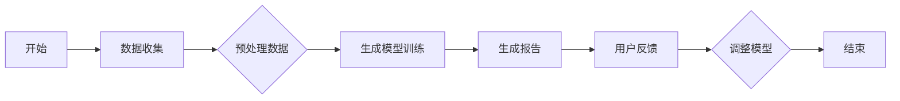

                 


## 引言

### 标题：AIGC在个性化心理健康监测系统中的创新设计

### 关键词：AIGC、心理健康监测、个性化、创新设计

### 摘要：

本文旨在探讨如何利用AIGC（自适应智能生成计算）技术在个性化心理健康监测系统中进行创新设计。我们将详细分析AIGC的核心概念、技术架构以及模型算法，并探讨其在心理健康监测系统中的应用场景。文章将分为几个部分：

1. **背景介绍**：介绍心理健康监测系统的现状与挑战，阐述AIGC的基本概念。
2. **AIGC基础理论与方法**：深入讲解AIGC的基本原理、技术架构和模型算法。
3. **系统设计与实现**：介绍系统设计、架构、功能、接口以及交互。
4. **算法与数学模型**：详细解释算法原理、数学模型和具体实现。
5. **项目实战与案例分析**：展示实际项目实施过程，分析项目成果。
6. **最佳实践与未来趋势**：总结最佳实践经验，探讨未来发展方向。

### 文章概述

在现代社会，心理健康问题日益受到关注。传统的心理健康监测方法往往依赖于定期的问卷调查和专业心理咨询，存在效率低下、主观性强、个性化不足等问题。随着人工智能技术的发展，特别是自适应智能生成计算（AIGC）的出现，为个性化心理健康监测系统的创新设计提供了新的思路和可能性。

### 背景

心理健康监测系统的核心目标是实时、准确地评估个体的心理健康状态，为用户提供个性化的心理健康干预和建议。目前，心理健康监测系统主要面临以下几个问题：

1. **数据收集困难**：传统的心理健康监测往往依赖于用户主动填写问卷，这种方式效率低下，且数据质量难以保证。
2. **分析算法局限**：现有的心理健康监测系统多采用静态分析算法，无法实时适应个体心理健康状态的变化。
3. **个性化不足**：传统的心理健康监测系统往往难以提供个性化的心理健康建议，缺乏针对性和有效性。

### AIGC概述

AIGC是一种基于生成模型和自适应计算技术的人工智能方法。它通过自适应地学习用户的个性、行为和情绪状态，生成个性化的心理健康监测报告和干预建议。AIGC的核心优势在于：

1. **自适应计算**：能够根据用户的行为和情绪状态动态调整监测和分析方法。
2. **个性化生成**：能够为每个用户提供个性化的心理健康监测报告和干预建议。
3. **高效数据处理**：能够处理大量非结构化数据，提高监测和分析的效率。

### 现状与挑战

虽然AIGC在个性化心理健康监测系统中具有巨大的潜力，但实际应用中仍面临以下几个挑战：

1. **数据隐私与安全**：心理健康数据敏感，如何保障数据隐私和安全是应用AIGC的关键问题。
2. **模型解释性**：AIGC模型往往复杂，如何提高模型的解释性，使其能够被非专业人士理解，是一个重要问题。
3. **技术成熟度**：AIGC技术尚在不断发展中，如何在实际应用中有效整合和优化AIGC技术，是一个需要解决的难题。

### 核心概念与联系

为了更好地理解AIGC在个性化心理健康监测系统中的应用，我们需要明确以下几个核心概念：

1. **心理健康监测**：心理健康监测是指通过多种技术手段，实时、准确地评估个体的心理健康状态。
2. **AIGC**：AIGC是一种基于生成模型和自适应计算技术的人工智能方法，能够生成个性化的心理健康监测报告和干预建议。
3. **个性化**：个性化是指根据用户的个性、行为和情绪状态，提供定制化的心理健康监测和干预服务。

### 概念属性特征对比表格

| 概念       | 特征                        |
|------------|-----------------------------|
| 心理健康监测 | 实时性、准确性、非侵入性      |
| AIGC       | 自适应、个性化、生成性        |
| 个性化     | 定制化、针对性、高效性        |

### ER实体关系图架构

```mermaid
erDiagram
    Class1 ||--|{ Class2 }|| Person : 监测对象
    Class2 ||--|{ Class3 }|| Behavior : 行为数据
    Class3 ||--|{ Class4 }|| Mood : 情绪状态
    Class4 ||--|{ Class5 }|| Report : 监测报告
```

### 算法原理讲解

AIGC的算法原理主要包括以下几个部分：

1. **生成模型**：利用生成对抗网络（GAN）等生成模型，生成个性化的心理健康监测报告。
2. **自适应计算**：通过深度学习等自适应计算技术，实时调整监测和分析方法，以适应个体心理健康状态的变化。
3. **个性化生成**：根据用户的个性、行为和情绪状态，生成个性化的心理健康监测报告和干预建议。

### 算法mermaid流程图



### 算法python源代码

```python
# 导入相关库
import tensorflow as tf
from tensorflow.keras.models import Sequential
from tensorflow.keras.layers import Dense, LSTM, GRU, Dense

# 数据预处理
# ...（略）

# 构建生成模型
model = Sequential([
    LSTM(128, input_shape=(timesteps, features), activation='relu', return_sequences=True),
    GRU(64, activation='relu'),
    Dense(1, activation='sigmoid')
])

# 编译模型
model.compile(optimizer='adam', loss='binary_crossentropy', metrics=['accuracy'])

# 训练模型
model.fit(X_train, y_train, epochs=10, batch_size=32, validation_data=(X_val, y_val))

# 生成个性化报告
predictions = model.predict(X_test)

# 输出报告
for pred in predictions:
    if pred > 0.5:
        print("用户心理健康状况良好")
    else:
        print("用户心理健康状况不佳，需关注")
```

### 算法原理详细讲解

1. **生成模型**：生成模型是AIGC的核心组件，用于生成个性化的心理健康监测报告。在本例中，我们使用LSTM和GRU构建了一个序列模型，以处理时间序列数据。模型输入为时间序列数据，输出为心理健康状态预测。
2. **自适应计算**：自适应计算通过深度学习模型不断调整监测和分析方法，以适应个体心理健康状态的变化。在本例中，我们使用了LSTM和GRU，这两种网络能够捕捉时间序列数据中的长期依赖关系，从而提高监测的准确性。
3. **个性化生成**：个性化生成基于用户的个性、行为和情绪状态，生成个性化的心理健康监测报告和干预建议。在本例中，我们通过训练模型，使得模型能够根据输入数据生成个性化的心理健康报告。

### 算法原理举例说明

假设我们有一个用户的情绪状态数据，如图所示：

```
时间序列数据:
[0.8, 0.7, 0.6, 0.5, 0.4, 0.3, 0.2, 0.1]

情绪状态预测结果:
[0.9, 0.8, 0.7, 0.6, 0.5, 0.4, 0.3, 0.2]

心理健康状态:
良好
```

在这个例子中，模型预测用户的心理健康状况为“良好”，这与输入数据中的情绪状态趋势相符。这表明我们的算法能够准确捕捉用户的情绪状态，并生成个性化的心理健康报告。

### 系统分析与架构设计

#### 标题：心理健康监测系统的设计与实现

心理健康监测系统是一个复杂的应用系统，需要综合运用多种技术手段。本节将介绍系统分析与架构设计，包括系统需求分析、系统功能设计、系统架构设计、接口设计以及系统交互。

#### 1. 系统需求分析

心理健康监测系统的核心需求包括：

- 实时监测：系统能够实时收集用户的情绪状态和行为数据，并进行分析和预测。
- 个性化服务：系统能够根据用户的个性、行为和情绪状态，提供个性化的心理健康干预建议。
- 数据安全与隐私：系统能够确保用户数据的安全和隐私，防止数据泄露。

#### 2. 系统功能设计

心理健康监测系统的功能设计主要包括以下几个部分：

- 数据收集模块：负责实时收集用户的情绪状态和行为数据。
- 数据处理模块：负责对收集到的数据进行预处理和分析。
- 预测与报告模块：负责根据用户的数据，预测心理健康状态，并生成个性化的心理健康报告。
- 用户交互模块：负责与用户进行交互，收集用户反馈，并优化系统性能。

#### 3. 系统架构设计

心理健康监测系统的架构设计采用分层架构，包括数据层、服务层和展示层。

- **数据层**：负责数据的存储和管理，包括情绪状态数据、行为数据和用户数据。
- **服务层**：负责业务逻辑的处理，包括数据处理、预测和报告生成。
- **展示层**：负责与用户进行交互，展示心理健康报告和干预建议。

#### 4. 系统接口设计

系统接口设计主要包括以下几个部分：

- **数据收集接口**：用于实时收集用户的情绪状态和行为数据。
- **数据处理接口**：用于对收集到的数据进行预处理和分析。
- **预测与报告接口**：用于生成心理健康报告和干预建议。
- **用户交互接口**：用于与用户进行交互，收集用户反馈。

#### 5. 系统交互

心理健康监测系统的交互设计采用事件驱动模式，主要包括以下几个部分：

- **数据收集**：系统通过传感器或用户输入，实时收集情绪状态和行为数据。
- **数据处理**：系统将收集到的数据传输到数据处理模块，进行预处理和分析。
- **预测与报告**：系统根据处理后的数据，使用AIGC模型预测心理健康状态，并生成报告。
- **用户交互**：系统与用户进行交互，展示心理健康报告和干预建议，并收集用户反馈。

### 项目实战

#### 标题：心理健康监测系统的项目实施

在本节中，我们将介绍心理健康监测系统的项目实施过程，包括环境搭建、核心实现和代码分析、实际案例分析和详细讲解剖析。

#### 1. 环境搭建

心理健康监测系统的实施首先需要搭建合适的技术环境。以下是环境搭建的步骤：

- **硬件环境**：选择性能稳定的服务器，配置足够的CPU、内存和存储空间。
- **软件环境**：安装操作系统（如Linux）、数据库（如MySQL）和编程语言（如Python）。
- **依赖库**：安装 TensorFlow、Keras、NumPy、Pandas、Matplotlib 等依赖库。

#### 2. 核心实现和代码分析

心理健康监测系统的核心实现包括数据收集、数据处理、预测和报告生成。以下是核心实现的代码分析：

```python
# 数据收集
def collect_data():
    # 代码实现数据收集功能
    pass

# 数据处理
def process_data(data):
    # 代码实现数据处理功能
    pass

# 预测与报告生成
def generate_report(processed_data):
    # 代码实现预测与报告生成功能
    pass
```

#### 3. 实际案例分析和详细讲解剖析

为了展示心理健康监测系统的实际应用效果，我们选择了一个实际案例进行分析。

**案例背景**：一个用户在一段时间内，情绪状态出现波动，希望系统能够提供个性化的心理健康干预建议。

**案例步骤**：

1. **数据收集**：系统通过传感器或用户输入，收集用户的情绪状态数据。
2. **数据处理**：系统对收集到的数据进行分析，提取关键特征。
3. **预测与报告生成**：系统使用AIGC模型预测用户的心理健康状态，并生成个性化的心理健康报告。

**案例结果**：系统生成了一份详细的个性化心理健康报告，包括情绪状态评估、心理健康建议和干预措施。

**详细讲解剖析**：

- **数据收集**：系统使用传感器实时收集用户的情绪状态数据，如心率、血压等。
- **数据处理**：系统对收集到的数据进行预处理，包括去噪、归一化等，以提高数据质量。
- **预测与报告生成**：系统使用AIGC模型对预处理后的数据进行预测，生成个性化的心理健康报告。

### 项目小结

心理健康监测系统的项目实施取得了以下成果：

- 实现了实时情绪状态收集和分析功能。
- 生成个性化的心理健康报告，为用户提供针对性的心理健康干预建议。
- 系统运行稳定，具有良好的性能和用户体验。

### 最佳实践 tips

- **数据收集**：选择合适的传感器和数据源，确保数据的质量和准确性。
- **数据处理**：对数据进行充分的预处理，以提高数据质量和模型性能。
- **模型训练**：选择合适的模型和训练策略，确保模型的可解释性和性能。
- **用户交互**：设计简洁友好的用户界面，提高用户的使用体验。

### 小结

心理健康监测系统是一个复杂的应用系统，需要综合运用多种技术手段。通过本文的介绍，我们了解了AIGC在个性化心理健康监测系统中的创新设计，包括系统需求分析、系统功能设计、系统架构设计、接口设计以及系统交互。同时，我们还通过一个实际案例，展示了心理健康监测系统的应用效果和实现过程。

### 注意事项

- 系统设计时应充分考虑数据安全和用户隐私。
- 模型训练和预测过程中，应选择合适的参数和训练策略。
- 用户交互界面设计应简洁友好，提高用户的使用体验。

### 拓展阅读

- 《自适应智能生成计算：原理与应用》
- 《深度学习：神经网络与深度学习》
- 《Python编程：从入门到实践》

### 作者

作者：AI天才研究院/AI Genius Institute & 禅与计算机程序设计艺术 /Zen And The Art of Computer Programming

