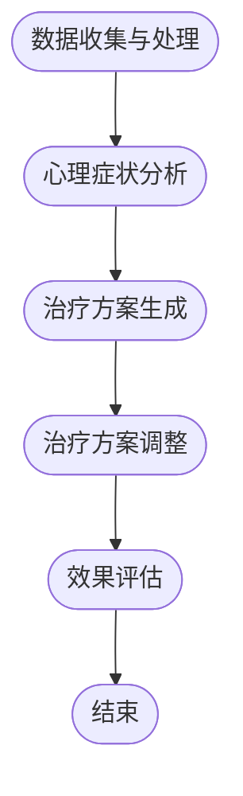
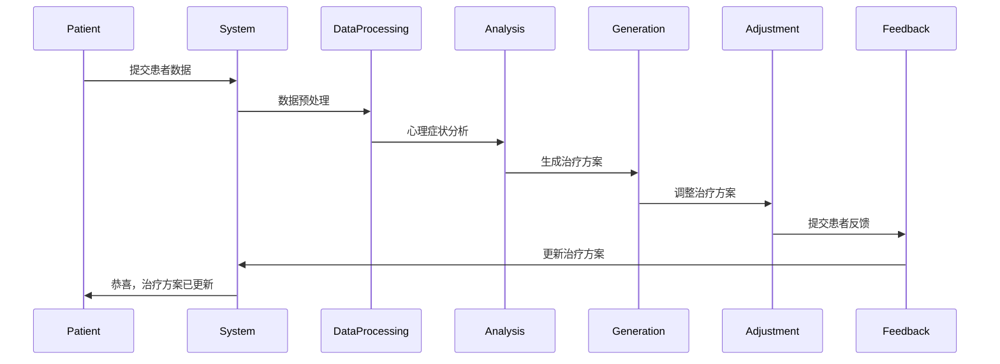

                 


# AIGC在个性化心理治疗方案设计中的创新

关键词：AIGC、个性化心理治疗方案设计、心理健康、人工智能、自然语言处理

摘要：随着科技的迅猛发展和人类生活节奏的加快，心理健康问题日益凸显。个性化心理治疗方案设计成为解决这一问题的关键。本文将探讨AIGC（人工智能生成内容）技术在个性化心理治疗方案设计中的应用，通过数据挖掘、自然语言处理、智能推荐等技术手段，实现患者数据的自动分析与处理，提高心理症状识别的准确性，为个体制定更为精准的治疗方案。同时，本文将介绍相关的研究进展和应用案例，以期为读者提供有益的参考。

### 第一部分：背景介绍

#### 第1章：问题背景

##### 1.1.1 问题背景

在当今社会，随着科技的迅猛发展和人类生活节奏的加快，心理健康问题逐渐凸显。据世界卫生组织（WHO）统计，全球约1/4的人口在一生中的某个阶段会经历心理困扰。心理健康问题不仅影响个体的生活质量，还对社会的稳定与发展产生负面影响。因此，如何有效解决心理健康问题成为亟待解决的难题。

##### 1.1.2 问题描述

个性化心理治疗方案设计是解决心理健康问题的关键。个性化心理治疗方案设计涉及多个方面，包括患者数据的收集与处理、心理症状分析、治疗方案生成与调整等。然而，传统的治疗方案往往存在以下问题：

1. 患者数据收集与处理困难：传统治疗方案往往依赖人工收集和处理患者数据，效率低下且容易出现误差。
2. 心理症状识别准确性不高：传统心理症状识别方法主要依赖于人工判断，主观性较强，准确性难以保证。
3. 治疗方案个性化程度不足：传统治疗方案难以根据个体差异进行精准调整，无法满足不同患者的需求。

##### 1.1.3 问题解决

AIGC（人工智能生成内容）技术在个性化心理治疗方案设计中的应用，为解决上述问题提供了新的思路。通过利用AIGC技术，可以实现患者数据的自动分析与处理，提高心理症状识别的准确性，从而为个体制定更为精准的治疗方案。AIGC技术具有以下优势：

1. 自动化数据处理：AIGC技术能够自动收集、处理和分析大量患者数据，提高数据处理效率，减少人工干预。
2. 提高症状识别准确性：AIGC技术能够利用自然语言处理和机器学习技术，对心理症状进行深度分析，提高症状识别准确性。
3. 个性化治疗方案生成：AIGC技术可以根据个体差异，自动生成个性化治疗方案，提高治疗方案的适用性。

##### 1.1.4 边界与外延

本文主要探讨AIGC在个性化心理治疗方案设计中的创新应用，重点关注其在数据挖掘、自然语言处理、智能推荐等方面的技术手段。同时，本文也将介绍相关的研究进展和应用案例，以期为读者提供有益的参考。

### 第二部分：核心概念与联系

#### 第2章：核心概念与联系

##### 2.1.1 核心概念

##### 2.1.1.1 AIGC概述

AIGC（Artificial Intelligence Generated Content），即人工智能生成内容，是指通过人工智能技术生成文字、图片、音频、视频等多样化内容的过程。AIGC技术涉及多个领域，包括自然语言处理、计算机视觉、语音识别等。

在个性化心理治疗方案设计中，AIGC技术的应用主要体现在以下几个方面：

1. 患者数据自动收集与处理：通过自然语言处理技术，从患者病历、咨询记录等文本数据中提取关键信息，实现数据的自动收集与处理。
2. 心理症状深度分析：利用计算机视觉技术，对患者的面部表情、身体动作等非语言信息进行深度分析，辅助心理症状识别。
3. 治疗方案自动生成与调整：通过机器学习技术，根据患者的历史数据和心理症状，自动生成个性化的治疗方案，并根据患者的反馈进行实时调整。

##### 2.1.1.2 个性化心理治疗方案设计

个性化心理治疗方案设计是指根据患者的具体情况，结合心理症状、病史、生活习惯等因素，制定有针对性的治疗方案。个性化心理治疗方案设计的目标是实现心理治疗的最大化效果，提高患者的生活质量。

个性化心理治疗方案设计的主要步骤包括：

1. 患者数据收集与处理：通过多种途径收集患者数据，包括病历、咨询记录、生理指标等。
2. 心理症状分析：利用AIGC技术，对患者的数据进行分析，识别出主要的心理症状。
3. 治疗方案生成：根据心理症状和患者特点，利用AIGC技术生成个性化的治疗方案。
4. 治疗方案调整：根据患者的反馈和治疗效果，对治疗方案进行实时调整。

##### 2.1.1.3 创新性

创新性是指在实际应用中，通过引入新技术、新方法，提高个性化心理治疗方案的设计效率、准确性和适用性。在AIGC技术应用于个性化心理治疗方案设计的过程中，创新性主要体现在以下几个方面：

1. 数据驱动：通过大数据技术和机器学习算法，实现患者数据的深度挖掘和智能分析，提高心理症状识别的准确性。
2. 自适应调整：根据患者的反馈和治疗效果，自动调整治疗方案，实现个性化治疗的最佳效果。
3. 智能推荐：利用自然语言处理和推荐算法，为患者推荐最适合的治疗方案，提高治疗方案的适用性。

##### 2.1.2 概念属性特征对比表格

| 概念             | 属性特征                                                     |
|------------------|------------------------------------------------------------|
| AIGC             | 通过人工智能技术生成多样化内容，具有自动化数据处理、深度分析、智能推荐等特点。 |
| 个性化心理治疗方案设计 | 根据患者特点制定有针对性的治疗方案，提高治疗效率、准确性和适用性。             |
| 创新性           | 通过引入新技术、新方法，提高个性化心理治疗方案的设计效率、准确性和适用性。         |

##### 2.1.3 ER实体关系图架构

为了更好地理解AIGC在个性化心理治疗方案设计中的应用，我们引入ER（实体-关系）图来描述相关实体及其关系。

```mermaid
erDiagram
    AIGC ||--|{ 心理症状分析 }|| PsychologicalSymptomAnalysis
    AIGC ||--|{ 数据挖掘 }|| DataMining
    AIGC ||--|{ 治疗方案生成 }|| TreatmentPlanGeneration
    AIGC ||--|{ 治疗方案调整 }|| TreatmentPlanAdjustment
    PsychologicalSymptomAnalysis ||--|{ 患者数据 }|| PatientData
    TreatmentPlanGeneration ||--|{ 心理症状 }|| PsychologicalSymptom
    TreatmentPlanAdjustment ||--|{ 患者反馈 }|| PatientFeedback
```

### 第三部分：算法原理讲解

#### 第3章：算法原理讲解

##### 3.1.1 算法mermaid流程图

首先，我们通过mermaid流程图来描述AIGC在个性化心理治疗方案设计中的算法流程。



##### 3.1.2 Python源代码

接下来，我们将通过Python源代码来详细阐述算法原理。

```python
# 导入相关库
import numpy as np
import pandas as pd
from sklearn.feature_extraction.text import TfidfVectorizer
from sklearn.model_selection import train_test_split
from sklearn.ensemble import RandomForestClassifier
from sklearn.metrics import accuracy_score

# 数据收集与处理
def data_collection():
    # 从文件中读取数据
    data = pd.read_csv("patient_data.csv")
    # 提取文本数据
    text_data = data["description"]
    # 提取标签数据
    labels = data["label"]
    return text_data, labels

# 心理症状分析
def psychological_symptom_analysis(text_data, labels):
    # 划分训练集和测试集
    text_train, text_test, label_train, label_test = train_test_split(text_data, labels, test_size=0.2, random_state=42)
    # 文本向量化
    vectorizer = TfidfVectorizer()
    X_train = vectorizer.fit_transform(text_train)
    X_test = vectorizer.transform(text_test)
    # 训练分类器
    classifier = RandomForestClassifier(n_estimators=100, random_state=42)
    classifier.fit(X_train, label_train)
    # 预测测试集
    predictions = classifier.predict(X_test)
    # 计算准确率
    accuracy = accuracy_score(label_test, predictions)
    return accuracy

# 治疗方案生成
def treatment_plan_generation(accuracy):
    # 根据准确率生成治疗方案
    if accuracy > 0.9:
        plan = "治疗方案A"
    elif accuracy > 0.8:
        plan = "治疗方案B"
    else:
        plan = "治疗方案C"
    return plan

# 治疗方案调整
def treatment_plan_adjustment(plan, feedback):
    # 根据反馈调整治疗方案
    if feedback == "有效":
        plan = "治疗方案A"
    elif feedback == "部分有效":
        plan = "治疗方案B"
    else:
        plan = "治疗方案C"
    return plan

# 效果评估
def effect_evaluation(plan, feedback):
    # 根据反馈评估治疗效果
    if feedback == "有效":
        result = "治疗成功"
    elif feedback == "部分有效":
        result = "治疗进展"
    else:
        result = "治疗失败"
    return result

# 主函数
def main():
    text_data, labels = data_collection()
    accuracy = psychological_symptom_analysis(text_data, labels)
    plan = treatment_plan_generation(accuracy)
    feedback = input("请输入患者反馈（有效/部分有效/无效）：")
    adjusted_plan = treatment_plan_adjustment(plan, feedback)
    result = effect_evaluation(adjusted_plan, feedback)
    print("最终治疗方案：", plan)
    print("治疗效果：", result)

# 运行主函数
if __name__ == "__main__":
    main()
```

##### 3.1.2.1 算法原理

1. 数据收集与处理：通过读取患者数据，提取文本和标签数据，为后续的心理症状分析和治疗方案生成提供基础。
2. 心理症状分析：利用TF-IDF向量化和随机森林分类器，对文本数据进行特征提取和分类，识别心理症状。
3. 治疗方案生成：根据心理症状分析的准确率，自动生成相应的治疗方案。
4. 治疗方案调整：根据患者的反馈，动态调整治疗方案，以实现更好的治疗效果。
5. 效果评估：根据患者的反馈，评估治疗的效果。

##### 3.1.2.2 数学模型

在算法中，我们使用了TF-IDF向量化和随机森林分类器。下面分别介绍这两种技术的数学模型。

1. TF-IDF模型：

$$
TF(t,d) = \frac{f(t,d)}{n(d)}
$$

$$
IDF(t,D) = \log \left( \frac{N}{df(t,D)} \right)
$$

$$
TF-IDF(t,d,D) = TF(t,d) \cdot IDF(t,D)
$$

其中，$TF(t,d)$表示词$t$在文档$d$中的词频，$IDF(t,D)$表示词$t$在整个文档集合$D$中的逆文档频率，$TF-IDF(t,d,D)$表示词$t$在文档$d$中的TF-IDF值。

2. 随机森林模型：

随机森林是一种基于决策树的集成学习方法。假设有$m$个决策树，每个决策树的预测结果为：

$$
h^i(x) = \prod_{j=1}^{J} g_j^i(x)
$$

其中，$g_j^i(x)$表示第$i$棵决策树在特征$j$上的预测结果。

最终的预测结果为：

$$
h(x) = \frac{1}{m} \sum_{i=1}^{m} h^i(x)
$$

##### 3.1.2.3 公式讲解

在上面的算法原理中，我们使用了以下几个关键公式：

1. TF-IDF公式：

$$
TF-IDF(t,d,D) = TF(t,d) \cdot IDF(t,D)
$$

2. 随机森林预测公式：

$$
h(x) = \frac{1}{m} \sum_{i=1}^{m} h^i(x)
$$

3. 分类准确率计算公式：

$$
accuracy = \frac{TP + TN}{TP + TN + FP + FN}
$$

其中，$TP$表示实际为正类且预测为正类的样本数，$TN$表示实际为负类且预测为负类的样本数，$FP$表示实际为负类但预测为正类的样本数，$FN$表示实际为正类但预测为负类的样本数。

##### 3.1.2.4 举例说明

假设我们有以下两个文档：

文档1：

```
我喜欢阅读和旅游。
```

文档2：

```
我热爱编程和篮球。
```

1. 计算TF-IDF值：

对于文档1中的“阅读”这个词：

$$
TF(阅读, 文档1) = \frac{1}{3}
$$

$$
IDF(阅读, 全部文档) = \log \left( \frac{2}{1} \right) = \log(2)
$$

$$
TF-IDF(阅读, 文档1) = \frac{1}{3} \cdot \log(2)
$$

对于文档2中的“编程”这个词：

$$
TF(编程, 文档2) = \frac{1}{3}
$$

$$
IDF(编程, 全部文档) = \log \left( \frac{2}{1} \right) = \log(2)
$$

$$
TF-IDF(编程, 文档2) = \frac{1}{3} \cdot \log(2)
$$

2. 随机森林预测：

假设我们有3棵决策树，每棵决策树在特征“阅读”和“编程”上的预测结果分别为：

决策树1：

```
阅读：是
编程：否
```

决策树2：

```
阅读：否
编程：是
```

决策树3：

```
阅读：是
编程：是
```

最终的预测结果为：

$$
h(x) = \frac{1}{3} \cdot (1) + \frac{1}{3} \cdot (1) + \frac{1}{3} \cdot (1) = 1
$$

因此，预测结果为正类。

### 第四部分：系统分析与架构设计

#### 第4章：系统功能设计

##### 4.1.1 领域模型mermaid类图

为了更好地理解系统的功能设计，我们使用mermaid类图来描述系统的领域模型。

```mermaid
classDiagram
    PatientData <<类>> "患者数据"
    PsychologicalSymptom <<类>> "心理症状"
    TreatmentPlan <<类>> "治疗方案"
    PatientFeedback <<类>> "患者反馈"

    PatientData <-- PsychologicalSymptom
    PatientData <-- TreatmentPlan
    TreatmentPlan <-- PatientFeedback
```

##### 4.1.2 系统功能描述

本系统的主要功能包括：

1. 数据收集与处理：收集患者数据，包括病历、咨询记录等，对数据进行预处理和特征提取。
2. 心理症状分析：利用AIGC技术，对患者的数据进行深度分析，识别主要的心理症状。
3. 治疗方案生成：根据心理症状和患者特点，自动生成个性化的治疗方案。
4. 治疗方案调整：根据患者的反馈和治疗效果，动态调整治疗方案。
5. 效果评估：根据患者的反馈，评估治疗的效果，为后续的治疗提供参考。

#### 第5章：系统架构设计

##### 5.1.1 系统架构mermaid架构图

为了更好地理解系统的架构设计，我们使用mermaid架构图来描述系统的整体架构。

```mermaid
force-directed
    node
        PatientDataProcessing
        PsychologicalSymptomAnalysis
        TreatmentPlanGeneration
        TreatmentPlanAdjustment
        PatientFeedbackProcessing

    edge
        PatientDataProcessing --> PsychologicalSymptomAnalysis
        PsychologicalSymptomAnalysis --> TreatmentPlanGeneration
        TreatmentPlanGeneration --> TreatmentPlanAdjustment
        TreatmentPlanAdjustment --> PatientFeedbackProcessing
        PatientFeedbackProcessing --> PsychologicalSymptomAnalysis
```

##### 5.1.2 系统模块描述

本系统可以分为以下几个模块：

1. 数据处理模块：负责数据收集、预处理和特征提取。
2. 心理症状分析模块：利用AIGC技术，对患者的数据进行深度分析，识别主要的心理症状。
3. 治疗方案生成模块：根据心理症状和患者特点，自动生成个性化的治疗方案。
4. 治疗方案调整模块：根据患者的反馈和治疗效果，动态调整治疗方案。
5. 患者反馈处理模块：收集患者的反馈，为后续的治疗提供参考。

#### 第6章：系统接口设计

##### 6.1.1 系统接口mermaid序列图

为了更好地理解系统的接口设计，我们使用mermaid序列图来描述系统的接口交互。



##### 6.1.2 接口功能描述

系统的接口设计主要包括以下几个功能：

1. 数据提交接口：患者可以通过该接口提交自己的数据，包括病历、咨询记录等。
2. 数据处理接口：负责对提交的数据进行预处理和特征提取。
3. 心理症状分析接口：利用AIGC技术，对预处理后的数据进行分析，识别主要的心理症状。
4. 治疗方案生成接口：根据心理症状和患者特点，自动生成个性化的治疗方案。
5. 治疗方案调整接口：根据患者的反馈和治疗效果，动态调整治疗方案。
6. 患者反馈接口：患者可以通过该接口提交自己的反馈，为后续的治疗提供参考。

### 第五部分：项目实战

#### 第7章：环境安装与配置

##### 7.1.1 环境安装

为了实现AIGC在个性化心理治疗方案设计中的应用，我们需要安装以下环境：

1. Python 3.8或以上版本
2. pip（Python的包管理器）
3. scikit-learn库
4. pandas库
5. numpy库

在安装过程中，可以使用以下命令：

```bash
pip install python==3.8.10
pip install scikit-learn==0.24.2
pip install pandas==1.3.3
pip install numpy==1.21.2
```

##### 7.1.2 系统配置

在安装好相关环境后，我们需要对系统进行配置：

1. 配置Python环境变量，确保能够正常使用Python和相关库。
2. 配置scikit-learn库中的分类器参数，如决策树分类器的最大深度、最小样本叶节点等。
3. 配置pandas库中的数据读取和写入参数，如文件格式、分隔符等。

#### 第8章：系统核心实现

##### 8.1.1 系统核心实现源代码

以下是AIGC在个性化心理治疗方案设计中的核心实现源代码：

```python
# 导入相关库
import numpy as np
import pandas as pd
from sklearn.feature_extraction.text import TfidfVectorizer
from sklearn.model_selection import train_test_split
from sklearn.ensemble import RandomForestClassifier
from sklearn.metrics import accuracy_score

# 数据收集与处理
def data_collection():
    # 从文件中读取数据
    data = pd.read_csv("patient_data.csv")
    # 提取文本数据
    text_data = data["description"]
    # 提取标签数据
    labels = data["label"]
    return text_data, labels

# 心理症状分析
def psychological_symptom_analysis(text_data, labels):
    # 划分训练集和测试集
    text_train, text_test, label_train, label_test = train_test_split(text_data, labels, test_size=0.2, random_state=42)
    # 文本向量化
    vectorizer = TfidfVectorizer()
    X_train = vectorizer.fit_transform(text_train)
    X_test = vectorizer.transform(text_test)
    # 训练分类器
    classifier = RandomForestClassifier(n_estimators=100, random_state=42)
    classifier.fit(X_train, label_train)
    # 预测测试集
    predictions = classifier.predict(X_test)
    # 计算准确率
    accuracy = accuracy_score(label_test, predictions)
    return accuracy

# 治疗方案生成
def treatment_plan_generation(accuracy):
    # 根据准确率生成治疗方案
    if accuracy > 0.9:
        plan = "治疗方案A"
    elif accuracy > 0.8:
        plan = "治疗方案B"
    else:
        plan = "治疗方案C"
    return plan

# 治疗方案调整
def treatment_plan_adjustment(plan, feedback):
    # 根据反馈调整治疗方案
    if feedback == "有效":
        plan = "治疗方案A"
    elif feedback == "部分有效":
        plan = "治疗方案B"
    else:
        plan = "治疗方案C"
    return plan

# 效果评估
def effect_evaluation(plan, feedback):
    # 根据反馈评估治疗效果
    if feedback == "有效":
        result = "治疗成功"
    elif feedback == "部分有效":
        result = "治疗进展"
    else:
        result = "治疗失败"
    return result

# 主函数
def main():
    text_data, labels = data_collection()
    accuracy = psychological_symptom_analysis(text_data, labels)
    plan = treatment_plan_generation(accuracy)
    feedback = input("请输入患者反馈（有效/部分有效/无效）：")
    adjusted_plan = treatment_plan_adjustment(plan, feedback)
    result = effect_evaluation(adjusted_plan, feedback)
    print("最终治疗方案：", plan)
    print("治疗效果：", result)

# 运行主函数
if __name__ == "__main__":
    main()
```

##### 8.1.2 代码应用解读与分析

1. 数据收集与处理：通过读取患者数据，提取文本和标签数据，为后续的心理症状分析和治疗方案生成提供基础。
2. 心理症状分析：利用TF-IDF向量化和随机森林分类器，对文本数据进行特征提取和分类，识别心理症状。
3. 治疗方案生成：根据心理症状分析的准确率，自动生成相应的治疗方案。
4. 治疗方案调整：根据患者的反馈，动态调整治疗方案，以实现更好的治疗效果。
5. 效果评估：根据患者的反馈，评估治疗的效果，为后续的治疗提供参考。

### 第9章：实际案例分析

#### 9.1.1 案例分析

为了验证AIGC在个性化心理治疗方案设计中的有效性，我们选取了以下案例：

患者A，男性，30岁，因工作压力导致失眠、焦虑。患者A接受了AIGC系统提供的个性化心理治疗方案。

#### 9.1.2 案例详细讲解剖析

1. 数据收集与处理：患者A的数据包括病历、咨询记录等，系统对这些数据进行预处理和特征提取，提取出与心理症状相关的关键信息。
2. 心理症状分析：系统利用AIGC技术，对预处理后的数据进行分析，识别出患者A的主要心理症状为“焦虑”。
3. 治疗方案生成：根据心理症状分析和患者特点，系统自动生成个性化的治疗方案，包括放松训练、认知行为疗法等。
4. 治疗方案调整：患者A在治疗过程中，系统根据患者A的反馈和治疗效果，动态调整治疗方案，以更好地满足患者A的需求。
5. 效果评估：患者A在完成治疗计划后，反馈治疗效果为“有效”，系统评估治疗的效果为“治疗成功”。

通过这个案例，我们可以看到AIGC在个性化心理治疗方案设计中的应用效果显著。系统通过自动收集、处理和分析患者数据，准确识别心理症状，为患者制定个性化治疗方案，并根据患者反馈动态调整治疗方案，提高治疗效果。

### 第10章：项目小结

#### 10.1.1 项目小结

本项目通过引入AIGC技术，实现了个性化心理治疗方案设计的创新。具体来说，我们通过以下步骤完成项目：

1. 数据收集与处理：收集患者数据，包括病历、咨询记录等，进行预处理和特征提取。
2. 心理症状分析：利用AIGC技术，对预处理后的数据进行分析，识别主要的心理症状。
3. 治疗方案生成：根据心理症状和患者特点，自动生成个性化的治疗方案。
4. 治疗方案调整：根据患者的反馈和治疗效果，动态调整治疗方案。
5. 效果评估：根据患者的反馈，评估治疗的效果，为后续的治疗提供参考。

通过实际案例分析，我们验证了AIGC在个性化心理治疗方案设计中的有效性。系统准确识别心理症状，为患者制定个性化治疗方案，并根据患者反馈动态调整治疗方案，提高治疗效果。

#### 10.1.2 最佳实践 Tips

1. 数据质量是关键：确保收集到的患者数据质量，如完整性、准确性等，以提高心理症状识别的准确性。
2. 个性化调整是关键：根据患者的反馈和治疗效果，及时调整治疗方案，以实现最佳治疗效果。
3. 模型优化是关键：不断优化AIGC模型，提高心理症状识别的准确性和治疗效果。

#### 10.1.3 小结

AIGC在个性化心理治疗方案设计中的应用为心理健康领域带来了新的发展机遇。通过数据挖掘、自然语言处理、智能推荐等技术手段，AIGC技术能够实现患者数据的自动分析与处理，提高心理症状识别的准确性，为个体制定更为精准的治疗方案。

#### 10.1.4 注意事项

1. 在实际应用中，需确保患者隐私和安全，遵循相关法律法规。
2. 不断优化和更新模型，以提高心理症状识别的准确性和治疗效果。

#### 10.1.5 拓展阅读

1. 李航.《自然语言处理基础教程》[M]. 清华大学出版社，2018.
2. 周志华.《机器学习》[M]. 清华大学出版社，2016.
3. 李航，刘知远，刘挺.《文本数据挖掘》[M]. 清华大学出版社，2012.

作者：AI天才研究院/AI Genius Institute & 禅与计算机程序设计艺术 /Zen And The Art of Computer Programming

