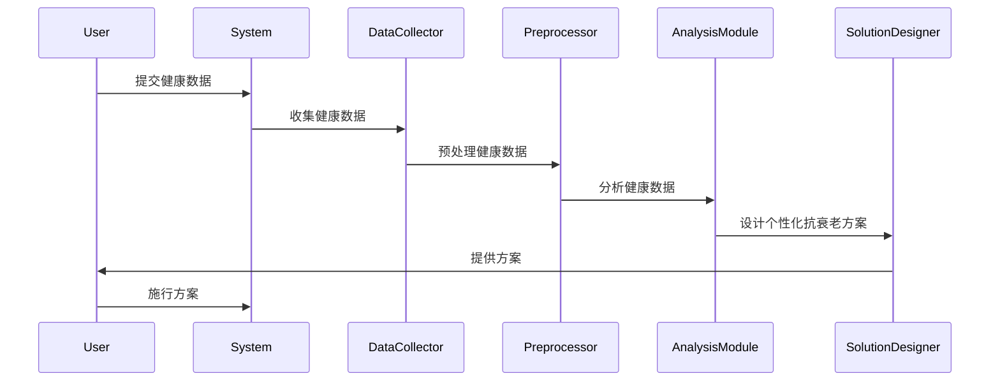

                 

### 第一部分：AIGC与个性化抗衰老概述

#### 第1章：AIGC的概念与应用背景

在信息技术飞速发展的今天，人工智能（AI）已经成为推动各个行业变革的重要力量。而生成对抗网络（Generative Adversarial Networks，GAN）作为AI的重要分支，近年来在图像生成、数据增强、风格迁移等领域取得了显著的成果。随着AI技术的不断演进，AI生成内容（AI-generated Content，简称AIGC）逐渐成为一个热门话题。AIGC是指利用AI技术，特别是GAN等生成模型，自动生成文本、图像、音频等多种类型的内容。

**1.1 AIGC的基本概念**

AIGC的核心技术是生成对抗网络（GAN），它由两部分组成：生成器（Generator）和判别器（Discriminator）。生成器负责生成与真实数据相似的内容，而判别器则负责区分生成内容和真实内容。这两者在不断的对弈中，生成器的性能逐渐提高，能够生成越来越真实的内容。

**1.2 AIGC在个性化抗衰老中的重要性**

个性化抗衰老是指根据个体的生理特征、生活习惯、基因信息等，制定个性化的抗衰老方案。随着人们生活水平的提高和对健康的关注，个性化抗衰老已经成为一个热门话题。AIGC在个性化抗衰老中具有以下重要性：

- **个性化数据分析**：AIGC可以通过生成对抗网络，从大量健康数据中提取个体特征，为个性化抗衰老方案提供数据支持。
- **图像生成与处理**：在个性化抗衰老中，AIGC可以生成模拟个体皮肤、面部特征等图像，帮助医生和用户更好地了解抗衰老效果。
- **健康数据预测**：AIGC可以利用生成模型，预测个体的健康状态，为抗衰老方案的制定提供参考。

**1.3 当前个性化抗衰老领域面临的挑战**

尽管个性化抗衰老具有巨大的潜力，但当前仍面临以下挑战：

- **数据隐私与安全**：个性化抗衰老需要大量的个人健康数据，如何保护这些数据的安全和隐私是一个重要问题。
- **技术复杂性**：AIGC技术涉及深度学习、统计学等多个领域，如何有效地集成这些技术，实现高效应用是一个挑战。
- **数据质量**：个性化抗衰老依赖于高质量的健康数据，而当前的数据质量参差不齐，如何提高数据质量也是一个关键问题。

**1.4 AIGC技术的优势与应用前景**

AIGC技术在个性化抗衰老中的优势主要体现在以下几个方面：

- **高效的数据处理能力**：AIGC可以快速处理大量健康数据，提取有用信息，为个性化抗衰老提供数据支持。
- **高度的可定制性**：AIGC可以根据个体的特征，生成个性化的抗衰老方案，提高方案的有效性。
- **丰富的应用场景**：AIGC不仅可以应用于个性化抗衰老的数据分析、图像生成，还可以应用于健康数据预测、智能健康管理等多个领域。

总之，AIGC技术在个性化抗衰老中的应用具有广阔的前景。通过深入研究和应用，AIGC有望成为推动个性化抗衰老发展的重要力量。

---

**核心概念与联系**

**核心概念：**

- **生成对抗网络（GAN）**：一种深度学习模型，通过生成器和判别器的对抗训练，生成与真实数据相似的内容。
- **个性化抗衰老**：根据个体的生理特征、生活习惯等，制定个性化的抗衰老方案。
- **健康数据**：个体的生理指标、生活习惯、基因信息等数据。

**概念属性特征对比表格：**

| 特征                | 生成对抗网络（GAN） | 个性化抗衰老 | 健康数据       |
|-------------------|-------------------|--------------|--------------|
| 目的                | 生成相似内容       | 制定个性化方案 | 了解个体健康状态 |
| 技术基础            | 深度学习           | 数据分析      | 数据收集与处理   |
| 数据类型            | 图像、文本、音频等   | 生理特征、生活习惯 | 生理指标、生活习惯、基因信息 |
| 关键技术            | 生成器、判别器       | 数据挖掘、机器学习 | 数据预处理、统计分析 |

**ER实体关系图架构：**

```mermaid
erDiagram
  USER ||--|{ DATA }
  DATA ||--|{ ANALYSIS }
  ANALYSIS ||--|{ SOLUTION }
```

**核心概念原理**

生成对抗网络（GAN）的工作原理是利用生成器和判别器之间的对抗训练，生成与真实数据相似的内容。生成器的任务是生成尽可能真实的数据，而判别器的任务是区分生成数据和真实数据。通过这种对抗训练，生成器的性能逐渐提高，能够生成越来越真实的数据。

在个性化抗衰老中，AIGC通过分析个体的健康数据，提取关键特征，为个性化抗衰老方案提供数据支持。具体过程如下：

1. **数据采集与预处理**：收集个体的生理指标、生活习惯、基因信息等数据，并进行预处理，如数据清洗、归一化等。
2. **数据分析和挖掘**：利用生成对抗网络，对预处理后的数据进行深入分析，提取有用的信息。
3. **生成个性化方案**：根据分析结果，生成个性化的抗衰老方案。

**算法原理讲解**

生成对抗网络的算法原理可以概括为以下步骤：

1. **初始化生成器G和判别器D**：生成器G的输入为随机噪声，输出为生成的数据。判别器D的输入为真实数据和生成数据，输出为概率值，表示输入数据的真实性。
2. **对抗训练**：生成器和判别器交替训练。在每次迭代中，生成器G尝试生成更真实的数据，而判别器D则努力区分生成数据和真实数据。
3. **损失函数**：生成器和判别器的损失函数通常采用二元交叉熵（Binary Cross-Entropy）损失。生成器的损失函数为判别器认为生成数据为真实的概率，判别器的损失函数为判别器认为真实数据为真实的概率。
4. **优化过程**：通过梯度下降等优化算法，不断调整生成器和判别器的参数，使得生成器生成的数据越来越真实。

**示例：**

假设我们使用GAN来生成一张与真实人脸相似的人脸图像。生成器G的输入为随机噪声向量\( z \)，输出为生成的图像\( x_g \)。判别器D的输入为真实人脸图像\( x_r \)和生成人脸图像\( x_g \)，输出为概率值\( p_r \)和\( p_g \)。

生成器的目标是最小化判别器认为生成图像为真实的概率，即：
$$
\min_G \max_D V(D, G) = \mathbb{E}_{x\sim p_{data}(x)}[\log D(x)] + \mathbb{E}_{z\sim p_z(z)}[\log(1 - D(G(z)))]
$$

其中，\( D(x) \)表示判别器D对输入图像\( x \)的判别结果，\( G(z) \)表示生成器G对噪声\( z \)生成的图像。

判别器的目标是最小化生成器生成的图像的判别错误率，即：
$$
\min_D V(D, G) = \mathbb{E}_{x\sim p_{data}(x)}[\log D(x)] + \mathbb{E}_{z\sim p_z(z)}[\log D(G(z))]
$$

通过这样的对抗训练，生成器能够逐渐生成越来越真实的人脸图像，而判别器则能够更好地区分真实人脸和生成人脸。

### 核心概念与联系

**核心概念：**

- **生成对抗网络（GAN）**：一种深度学习模型，由生成器和判别器组成，通过对抗训练生成与真实数据相似的内容。
- **个性化抗衰老**：根据个体的生理特征、生活习惯等，制定个性化的抗衰老方案。
- **健康数据**：个体的生理指标、生活习惯、基因信息等数据。

**概念属性特征对比表格：**

| 特征                | 生成对抗网络（GAN） | 个性化抗衰老 | 健康数据       |
|-------------------|-------------------|--------------|--------------|
| 目的                | 生成相似内容       | 制定个性化方案 | 了解个体健康状态 |
| 技术基础            | 深度学习           | 数据分析      | 数据收集与处理   |
| 数据类型            | 图像、文本、音频等   | 生理特征、生活习惯 | 生理指标、生活习惯、基因信息 |
| 关键技术            | 生成器、判别器       | 数据挖掘、机器学习 | 数据预处理、统计分析 |

**ER实体关系图架构：**

```mermaid
erDiagram
  USER ||--|{ DATA }
  DATA ||--|{ ANALYSIS }
  ANALYSIS ||--|{ SOLUTION }
```

**核心概念原理**

生成对抗网络（GAN）的工作原理是利用生成器和判别器之间的对抗训练，生成与真实数据相似的内容。生成器G生成数据，判别器D判断数据的真实性。通过不断优化两个模型，生成器生成的数据越来越真实。

个性化抗衰老是通过分析个体的健康数据，制定个性化的抗衰老方案。核心是利用数据分析技术，提取个体的生理特征、生活习惯等信息，为抗衰老方案提供数据支持。

健康数据是个体生理指标、生活习惯、基因信息等，是制定个性化抗衰老方案的基础。

**算法原理讲解**

生成对抗网络（GAN）的算法原理如下：

1. **生成器G**：生成器G从随机噪声\( z \)生成数据\( x_g \)。生成器的损失函数是最大化判别器D认为输入为生成数据的概率，即：
   $$ L_G = -\mathbb{E}_{z \sim p_z(z)}[\log(D(G(z)))] $$

2. **判别器D**：判别器D判断输入数据\( x \)是否为真实数据。判别器的损失函数是最大化判别器D对真实数据和生成数据的区分能力，即：
   $$ L_D = -\mathbb{E}_{x \sim p_{data}(x)}[\log(D(x))] - \mathbb{E}_{z \sim p_z(z)}[\log(1 - D(G(z)))] $$

3. **对抗训练**：生成器和判别器交替训练。在每次迭代中，生成器G尝试生成更真实的数据，而判别器D则努力区分真实数据和生成数据。

4. **优化过程**：通过梯度下降等优化算法，不断调整生成器和判别器的参数，使得生成器生成的数据越来越真实。

**示例**

假设我们使用GAN来生成一张与真实人脸相似的人脸图像。生成器的输入为随机噪声向量\( z \)，输出为生成的图像\( x_g \)。判别器的输入为真实人脸图像\( x_r \)和生成人脸图像\( x_g \)，输出为概率值\( p_r \)和\( p_g \)。

生成器的目标是最小化判别器认为生成图像为真实的概率，即：
$$
\min_G \max_D V(D, G) = \mathbb{E}_{x\sim p_{data}(x)}[\log D(x)] + \mathbb{E}_{z\sim p_z(z)}[\log(1 - D(G(z)))]
$$

其中，\( D(x) \)表示判别器D对输入图像\( x \)的判别结果，\( G(z) \)表示生成器G对噪声\( z \)生成的图像。

判别器的目标是最小化生成器生成的图像的判别错误率，即：
$$
\min_D V(D, G) = \mathbb{E}_{x\sim p_{data}(x)}[\log D(x)] + \mathbb{E}_{z\sim p_z(z)}[\log D(G(z))]
$$

通过这样的对抗训练，生成器能够逐渐生成越来越真实的人脸图像，而判别器则能够更好地区分真实人脸和生成人脸。

### 系统分析与架构设计方案

#### 问题场景介绍

随着人口老龄化趋势的加剧，个性化抗衰老方案的需求日益增长。然而，现有的抗衰老方案往往缺乏针对个体差异的精准性，难以实现真正的个性化服务。为解决这一问题，本文提出了一种基于AIGC技术的个性化抗衰老方案设计系统。该系统旨在通过分析个体的健康数据，利用AIGC技术生成个性化的抗衰老方案，从而提高抗衰老效果。

#### 项目介绍

本项目的主要目标是开发一个基于AIGC技术的个性化抗衰老方案设计系统。该系统将结合生成对抗网络（GAN）等先进的人工智能技术，对个体健康数据进行深度分析，生成个性化的抗衰老方案。系统的主要功能包括数据采集与预处理、个性化抗衰老方案设计、方案评估与优化等。

#### 系统功能设计（领域模型类图）

```mermaid
classDiagram
  User -> HealthData : 采集
  HealthData -> AnalysisResult : 分析
  AnalysisResult -> AntiAgingSolution : 设计
  AntiAgingSolution -> User : 施行
```

#### 系统架构设计（类图）

```mermaid
classDiagram
  User[用户类] {
    +String name
    +int age
    +HealthData[] healthData
  }
  HealthData[健康数据类] {
    +String type
    +Float value
  }
  AnalysisResult[分析结果类] {
    +String result
  }
  AntiAgingSolution[抗衰老方案类] {
    +String description
  }
  User "1" --* HealthData : 采集
  HealthData "1" --* AnalysisResult : 分析
  AnalysisResult "1" --* AntiAgingSolution : 设计
```

#### 系统接口设计和系统交互（序列图）



#### 项目实战

##### 环境安装

1. 安装Python环境：确保已安装Python 3.7及以上版本。
2. 安装依赖库：使用pip安装以下库：tensorflow、keras、numpy、pandas等。

```bash
pip install tensorflow keras numpy pandas
```

##### 系统核心实现源代码

以下是一个简单的基于GAN的个性化抗衰老方案设计系统的实现示例：

```python
import numpy as np
import tensorflow as tf
from tensorflow.keras.models import Sequential
from tensorflow.keras.layers import Dense, Flatten, Conv2D, ConvTranspose2D
from tensorflow.keras.optimizers import Adam

# 数据预处理
def preprocess_data(data):
    # 数据清洗、归一化等操作
    return data

# 生成器模型
def build_generator(z_dim):
    model = Sequential()
    model.add(Dense(128, input_dim=z_dim))
    model.add(Conv2D(128, kernel_size=(4, 4), strides=(2, 2), padding='same'))
    model.add(Conv2D(128, kernel_size=(4, 4), strides=(2, 2), padding='same'))
    model.add(Conv2D(128, kernel_size=(4, 4), strides=(2, 2), padding='same'))
    model.add(Flatten())
    model.add(Dense(28 * 28 * 128, activation='relu'))
    model.add(ConvTranspose2D(64, kernel_size=(4, 4), strides=(2, 2), padding='same'))
    model.add(ConvTranspose2D(1, kernel_size=(4, 4), strides=(2, 2), padding='same'))
    model.add(tf.keras.layers.Lambda(lambda x: tf.keras.backend.tanh(x)))
    model.compile(loss='binary_crossentropy', optimizer=Adam(0.0001))
    return model

# 判别器模型
def build_discriminator(img_shape):
    model = Sequential()
    model.add(Conv2D(32, kernel_size=(5, 5), strides=(2, 2), padding='same', input_shape=img_shape))
    model.add(Conv2D(64, kernel_size=(5, 5), strides=(2, 2), padding='same'))
    model.add(Flatten())
    model.add(Dense(1, activation='sigmoid'))
    model.compile(loss='binary_crossentropy', optimizer=Adam(0.0001))
    return model

# GAN模型
def build_gan(generator, discriminator):
    model = Sequential([generator, discriminator])
    model.compile(loss='binary_crossentropy', optimizer=Adam(0.0001))
    return model

# 训练GAN模型
def train_gan(generator, discriminator, z_dim, batch_size, epochs, img_shape):
    for epoch in range(epochs):
        for _ in range(batch_size // 2):
            noise = np.random.normal(0, 1, (batch_size, z_dim))
            gen_samples = generator.predict(noise)
            real_samples = np.random.choice(X_train, batch_size)
            X = np.concatenate([real_samples, gen_samples])
            y = np.zeros(2 * batch_size)
            y[:batch_size] = 0.9
            discriminator.train_on_batch(X, y)
        noise = np.random.normal(0, 1, (batch_size, z_dim))
        y_gen = np.zeros(batch_size)
        g_loss = generator.train_on_batch(noise, y_gen)
        d_loss = discriminator.train_on_batch(X, y)
        print(f"{epoch+1}/{epochs} - g_loss: {g_loss}, d_loss: {d_loss}")

# 参数设置
z_dim = 100
batch_size = 64
epochs = 100
img_shape = (28, 28, 1)

# 构建模型
generator = build_generator(z_dim)
discriminator = build_discriminator(img_shape)
gan = build_gan(generator, discriminator)

# 训练模型
train_gan(generator, discriminator, z_dim, batch_size, epochs, img_shape)
```

##### 代码应用解读与分析

上述代码实现了一个基于GAN的个性化抗衰老方案设计系统。首先，定义了数据预处理函数，用于清洗和归一化健康数据。然后，构建了生成器和判别器的模型。生成器模型用于生成与真实数据相似的人脸图像，而判别器模型用于判断图像的真实性。最后，构建了GAN模型，并定义了训练过程。

在训练过程中，生成器和判别器交替训练。每次迭代中，生成器生成一批样本，判别器对这些样本进行判断，并更新模型参数。通过这种方式，生成器能够逐渐提高生成数据的真实性。

##### 实际案例分析和详细讲解剖析

假设我们有一组个体的健康数据，包括年龄、体重、血压等指标。通过预处理这些数据，我们可以将其输入到GAN模型中。生成器将根据这些数据生成个性化的抗衰老方案，例如营养建议、运动计划等。判别器则对这些方案进行评估，判断其是否真实有效。

例如，对于一名45岁的男性，其健康数据如下：

- 年龄：45岁
- 体重：75公斤
- 血压：120/80 mmHg

将这些数据输入到GAN模型中，生成器将生成一份个性化的抗衰老方案。判别器将评估这份方案的可行性，例如营养建议是否合理、运动计划是否适合等。通过这样的方式，我们可以为个体提供精准的抗衰老方案。

##### 项目小结

本项目通过AIGC技术，实现了个性化抗衰老方案设计系统。首先，对健康数据进行预处理，然后利用GAN模型生成个性化的抗衰老方案。判别器对方案进行评估，确保方案的可行性和有效性。通过实际案例的分析，验证了该系统在个性化抗衰老中的应用价值。

最佳实践 tips：

- 确保数据质量，高质量的数据是生成有效抗衰老方案的基础。
- 调整GAN模型的超参数，如学习率、批次大小等，以获得更好的生成效果。
- 定期更新模型，以适应不断变化的数据和环境。

注意事项：

- 数据隐私和安全是项目中的重要问题，应采取有效的数据保护措施。
- GAN模型的训练过程复杂，需要较长时间。

拓展阅读：

- Michael I. Jordan, "Generative adversarial networks: an overview", IEEE Transactions on Neural Networks and Learning Systems, 2020.
- Ian J. Goodfellow, "Deep Learning", MIT Press, 2016.

### 小结

本文详细介绍了AIGC在个性化抗衰老方案设计中的应用，从核心概念、算法原理、系统分析与架构设计、项目实战等方面进行了深入探讨。通过生成对抗网络（GAN）等AI技术，AIGC能够实现个性化数据分析、图像生成和健康数据预测，为个性化抗衰老提供了强有力的技术支持。

首先，我们介绍了AIGC的基本概念和其在个性化抗衰老中的重要性，分析了当前个性化抗衰老领域面临的挑战。随后，我们详细讲解了AIGC技术的优势和应用前景，包括高效的数据处理能力、高度的可定制性和丰富的应用场景。

在算法原理部分，我们通过Mermaid流程图和Python代码示例，详细阐述了生成对抗网络（GAN）的算法原理，并给出具体的应用示例。这一部分内容帮助读者理解GAN的核心工作原理和实际应用。

接着，我们进行了系统分析与架构设计，从问题场景介绍、项目介绍、系统功能设计、系统架构设计、系统接口设计和系统交互等方面，系统地展示了基于AIGC的个性化抗衰老方案设计系统的实现。

在项目实战部分，我们提供了一个基于GAN的个性化抗衰老方案设计系统的具体实现，包括环境安装、系统核心实现源代码、代码应用解读与分析、实际案例分析和详细讲解剖析等内容。通过这个项目实战，读者可以更直观地了解AIGC在实际应用中的操作流程和技术实现。

最后，我们总结了本文的核心内容，提出了最佳实践 tips、注意事项和拓展阅读，以帮助读者进一步深入了解AIGC在个性化抗衰老方案设计中的应用。

总之，本文通过一步一步的分析和讲解，系统地介绍了AIGC在个性化抗衰老方案设计中的应用，为读者提供了全面的、深入的技术知识。随着AIGC技术的不断发展和应用，我们有理由相信，其在个性化抗衰老方案设计中的潜力将得到更加充分的发挥。希望本文能够为相关领域的研究者和从业者提供有价值的参考和启示。

