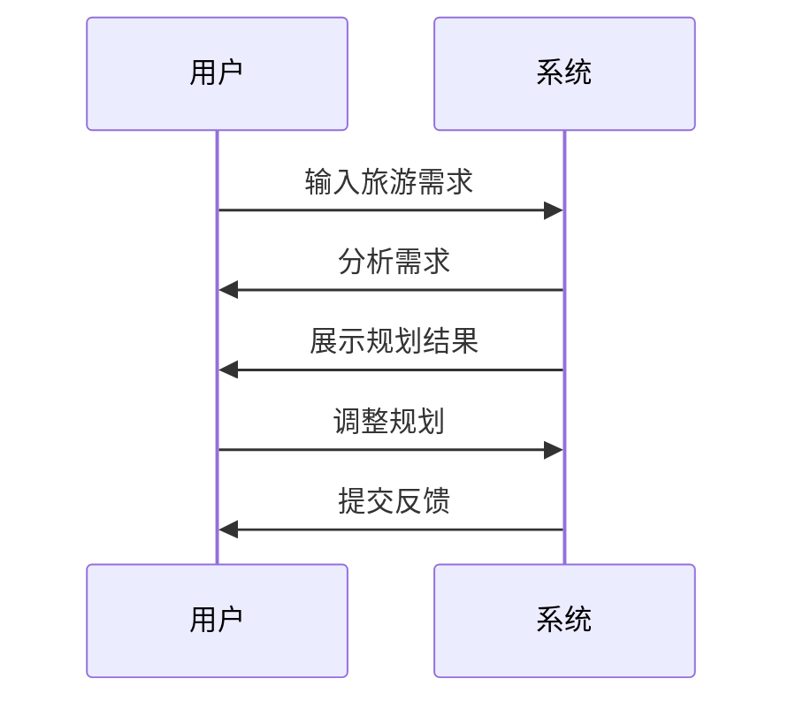

                 

### AIGC在个性化旅游规划中的应用

关键词：AIGC、个性化旅游规划、技术应用、系统设计、项目实战

摘要：本文将深入探讨人工智能生成内容（AIGC）在个性化旅游规划中的应用。通过分析AIGC技术的核心原理和特点，结合实际案例，本文将展示如何利用AIGC技术为旅游规划提供智能化、个性化和高效的解决方案。文章结构如下：

## 第一部分：AIGC技术基础

### 1.1 AIGC概述
AIGC是人工智能领域的一个重要分支，涉及的内容包括人工智能生成内容、机器学习、自然语言处理等。在个性化旅游规划中，AIGC技术的应用能够为游客提供定制化的旅游建议和规划服务。

### 1.2 AIGC技术原理
AIGC技术基于深度学习，通过生成对抗网络（GAN）、变分自编码器（VAE）等模型，实现数据的自动生成和个性化处理。本文将详细解释这些技术原理及其在个性化旅游规划中的应用。

### 1.3 AIGC技术特征对比
本文将对AIGC技术与其他相关技术的特征进行对比，分析其在个性化旅游规划中的优势，从而为读者提供更深入的理解。

## 第二部分：个性化旅游规划应用

### 2.1 个性化旅游规划原理
个性化旅游规划是结合游客的个人喜好、兴趣和历史记录，为游客提供个性化的旅游建议和路线规划服务。本文将介绍个性化旅游规划的基本原理和流程。

### 2.2 AIGC在旅游规划中的应用
本文将探讨AIGC技术在旅游需求分析、旅游路线规划和旅游资源推荐等环节中的应用，通过具体案例展示其效果。

### 2.3 应用案例分析
通过实际案例，本文将深入分析AIGC技术在个性化旅游规划中的应用，为读者提供实用的参考和借鉴。

## 第三部分：系统设计与实现

### 3.1 系统架构设计
本文将介绍AIGC在个性化旅游规划中的系统架构设计，包括数据层、算法层和应用层等。

### 3.2 系统接口设计
系统接口设计是系统架构的重要组成部分。本文将详细阐述接口设计原则和具体实现。

### 3.3 系统实现
本文将介绍AIGC在个性化旅游规划中的系统实现过程，包括环境配置、核心代码实现等。

### 3.4 系统交互
本文将展示系统交互流程，包括用户界面设计和用户与系统的交互细节。

## 第四部分：项目实战与案例分析

### 4.1 项目实战
本文将介绍一个实际项目案例，详细描述项目的背景、目标和实施过程。

### 4.2 案例分析
通过对项目案例的深入分析，本文将探讨AIGC在个性化旅游规划中的应用效果，并提供经验教训。

### 4.3 项目小结
本文将对项目进行总结，提出项目经验与反思，为未来的应用提供参考。

## 第五部分：最佳实践与总结

### 5.1 最佳实践
本文将总结AIGC在个性化旅游规划中的最佳实践，为读者提供实际操作的指导。

### 5.2 小结与展望
本文将对全文内容进行总结，并对AIGC在个性化旅游规划中的未来发展趋势进行展望。

通过以上五个部分，本文旨在为读者提供一个全面、系统的了解AIGC在个性化旅游规划中应用的机会，同时为相关领域的从业者提供实用的参考和指导。

### 第一部分：AIGC技术基础

#### 1.1 AIGC概述

人工智能生成内容（AIGC）是指利用人工智能技术，尤其是深度学习，来生成高质量、多样化的内容。这些内容可以是文本、图像、音频或其他形式的数据。AIGC技术不仅涵盖了自然语言处理（NLP）、计算机视觉（CV）等传统领域，还包括生成对抗网络（GAN）、变分自编码器（VAE）等新型算法。在个性化旅游规划中，AIGC技术可以应用于旅游需求分析、路线规划、资源推荐等多个环节，为游客提供定制化的旅游体验。

#### 1.2 AIGC技术原理

AIGC技术的基本原理是通过学习大量数据，使得模型能够自主生成新的内容。以下是一些核心技术和概念：

1. **生成对抗网络（GAN）**：
GAN由生成器（Generator）和判别器（Discriminator）组成。生成器生成假数据，判别器则试图区分这些假数据与真实数据。通过训练，生成器不断提高生成质量，使其接近真实数据。

2. **变分自编码器（VAE）**：
VAE是一种概率生成模型，通过编码和解码过程来生成数据。编码过程将输入数据映射到一个潜在空间，解码过程则从潜在空间生成输出数据。

3. **注意力机制**：
注意力机制是一种能够提高神经网络模型性能的技术，通过自动聚焦于输入数据中的重要部分，从而提高模型的生成质量和效率。

#### 1.3 AIGC技术特征对比

以下表格对比了AIGC技术与其他相关技术的特点：

| 技术     | 特点                                                         | 在个性化旅游规划中的应用               |
|----------|--------------------------------------------------------------|--------------------------------------|
| GAN      | 通过对抗训练生成高质量数据                                   | 用于生成旅游图片、音频等媒体内容       |
| VAE      | 基于概率模型，生成数据多样性高                             | 用于旅游数据挖掘、个性化推荐         |
| 注意力机制 | 自动聚焦重要信息，提高生成效率                               | 用于智能旅游路线规划、资源推荐       |

#### 1.4 AIGC与旅游规划的关系

AIGC技术在旅游规划中的应用主要体现在以下几个方面：

1. **旅游需求分析**：
   通过AIGC技术，可以对大量旅游数据进行挖掘和分析，了解游客的兴趣、偏好和行为习惯，从而为个性化服务提供数据支持。

2. **路线规划**：
   利用AIGC技术，可以根据游客的需求和偏好，自动生成个性化的旅游路线。这不仅提高了规划的效率，还能提供独特的旅游体验。

3. **资源推荐**：
   AIGC技术可以基于游客的喜好和历史记录，推荐适合他们的旅游景点、餐厅、酒店等资源，从而提高游客的满意度和忠诚度。

通过以上分析，我们可以看到AIGC技术为个性化旅游规划提供了强有力的技术支持。在接下来的部分中，我们将进一步探讨AIGC技术在具体应用场景中的实现细节。

### 第二部分：个性化旅游规划应用

#### 2.1 个性化旅游规划原理

个性化旅游规划是一种以游客需求为核心，通过数据分析和智能算法，为游客提供定制化旅游建议和路线规划的服务。其基本原理可以概括为以下四个方面：

1. **数据收集与处理**：
   首先，个性化旅游规划需要收集大量的旅游数据，包括游客的年龄、性别、旅游历史、兴趣爱好等。通过数据清洗和处理，将原始数据转化为可用于分析的格式。

2. **需求分析**：
   通过对游客数据的分析，了解他们的旅游需求和偏好。例如，一些游客可能更喜欢探险活动，而另一些游客则更注重文化体验。

3. **智能算法应用**：
   利用机器学习和深度学习算法，如生成对抗网络（GAN）、变分自编码器（VAE）等，对游客需求进行建模和预测。这些算法能够从海量数据中提取出关键特征，为个性化服务提供支持。

4. **结果生成与展示**：
   根据游客的需求和偏好，生成个性化的旅游路线、推荐景点、餐饮和住宿等。通过友好的用户界面，将结果展示给游客，并提供互动和调整选项，确保旅游规划的灵活性和适应性。

#### 2.2 AIGC在旅游规划中的应用

AIGC技术为个性化旅游规划提供了强大的工具，可以在多个环节发挥关键作用：

1. **旅游需求分析**：
   通过AIGC技术，可以对游客的历史旅游记录和行为数据进行分析，识别他们的兴趣点和偏好。例如，利用生成对抗网络（GAN），可以生成与游客兴趣相关的潜在旅游场景，从而更精准地预测他们的需求。

2. **旅游路线规划**：
   利用AIGC技术，可以根据游客的需求，自动生成个性化的旅游路线。例如，通过变分自编码器（VAE），可以将游客的个性化需求编码为潜在空间中的向量，然后从这个潜在空间中生成最优的旅游路线。

3. **旅游资源推荐**：
   AIGC技术可以基于游客的兴趣和历史记录，推荐最适合他们的旅游资源。例如，利用注意力机制，可以自动聚焦于游客最感兴趣的景点，从而提高推荐的效果。

#### 2.3 应用案例分析

为了更直观地了解AIGC技术在个性化旅游规划中的应用效果，以下是一个实际案例：

案例：某旅游平台利用AIGC技术为游客提供个性化旅游服务

1. **需求分析**：
   游客小张在平台上注册并提供了他的旅游历史和偏好信息，如喜欢登山、摄影和文化体验。

2. **旅游路线规划**：
   平台通过AIGC技术分析了小张的需求，并生成了一条结合登山、摄影和文化体验的个性化旅游路线。路线包括黄山、婺源和九寨沟等热门景点。

3. **旅游资源推荐**：
   平台还推荐了一些与路线相匹配的旅游资源，如黄山附近的摄影基地、婺源的特色民宿和九寨沟的美食餐厅。

4. **用户反馈**：
   小张使用这条个性化旅游路线进行了一次旅行，并给出了积极反馈。他表示，这条路线完美符合他的旅游偏好，让他度过了一段难忘的时光。

通过这个案例，我们可以看到AIGC技术为个性化旅游规划提供了强大的支持，不仅提高了规划的质量和效率，还显著提升了用户的满意度和忠诚度。

### 第三部分：系统设计与实现

#### 3.1 系统架构设计

为了实现个性化旅游规划，我们需要设计一个高效、可扩展的系统架构。以下是系统架构的基本组成部分：

1. **数据层**：
   数据层负责数据的收集、存储和管理。它包括以下功能模块：
   - **数据采集模块**：从各种渠道（如社交媒体、旅游网站、用户反馈等）收集旅游数据。
   - **数据存储模块**：使用数据库（如MySQL、MongoDB等）存储和管理收集到的数据。
   - **数据清洗模块**：对原始数据进行清洗和处理，确保数据的准确性和一致性。

2. **算法层**：
   算法层负责数据分析和处理，利用AIGC技术实现个性化旅游规划的核心功能。它包括以下功能模块：
   - **需求分析模块**：通过机器学习和深度学习算法，对游客的需求进行分析和预测。
   - **路线规划模块**：利用生成对抗网络（GAN）和变分自编码器（VAE）等技术，生成个性化的旅游路线。
   - **资源推荐模块**：利用注意力机制和协同过滤算法，为游客推荐最适合的资源。

3. **应用层**：
   应用层是系统的前端，负责与用户进行交互。它包括以下功能模块：
   - **用户界面模块**：提供友好的用户界面，方便游客输入需求、查看规划和资源推荐。
   - **交互模块**：实现用户与系统的交互功能，如路线调整、反馈提交等。
   - **结果展示模块**：将个性化旅游规划的结果以图表、地图等形式展示给用户。

#### 3.2 系统接口设计

系统接口设计是系统架构的重要组成部分，它负责实现不同模块之间的数据交换和功能调用。以下是系统接口设计的主要原则和内容：

1. **接口设计原则**：
   - **标准化**：使用统一的接口规范，确保不同模块之间的数据格式和通信方式一致。
   - **安全性**：对接口进行加密处理，确保数据传输的安全性和隐私性。
   - **可扩展性**：设计灵活的接口，以便于系统的功能扩展和模块替换。

2. **接口设计内容**：
   - **数据接口**：定义数据传输的格式和协议，如JSON、XML等。
   - **服务接口**：定义各模块之间的功能调用接口，如需求分析接口、路线规划接口、资源推荐接口等。
   - **认证接口**：实现用户身份验证和权限控制，确保系统的安全性和可靠性。

#### 3.3 系统实现

系统实现是系统设计的具体实现过程，涉及环境配置、核心代码编写和测试等环节。以下是系统实现的主要步骤：

1. **环境配置**：
   - **开发环境**：选择合适的开发工具和框架，如Python、Django等。
   - **数据存储**：配置数据库，如MySQL、MongoDB等，用于存储和管理数据。
   - **计算资源**：配置服务器和云资源，确保系统的高可用性和可扩展性。

2. **核心代码编写**：
   - **数据采集与处理**：编写数据采集和处理代码，实现数据的收集、清洗和管理。
   - **需求分析**：利用机器学习和深度学习算法，实现游客需求的分析和预测。
   - **路线规划**：编写生成对抗网络（GAN）和变分自编码器（VAE）等算法代码，实现个性化旅游路线的生成。
   - **资源推荐**：编写注意力机制和协同过滤算法代码，实现个性化旅游资源的推荐。

3. **测试与优化**：
   - **功能测试**：对系统的各个功能模块进行测试，确保其正常运行。
   - **性能测试**：对系统的性能进行测试，确保其能够处理大量数据和高并发请求。
   - **优化与调试**：根据测试结果，对系统进行优化和调试，提高其稳定性和效率。

通过以上步骤，我们实现了AIGC在个性化旅游规划中的应用系统。在实际应用中，系统可以根据用户的需求，自动生成个性化的旅游路线和资源推荐，为游客提供定制化的旅游体验。

### 第三部分：系统设计与实现（续）

#### 3.4 系统交互

系统交互是用户与系统进行互动的重要环节，通过友好的用户界面和高效的交互流程，为用户提供便捷、个性化的旅游规划服务。以下是系统交互的设计和实现：

1. **用户界面设计**

用户界面设计是系统交互的关键，它直接影响用户的体验和满意度。以下是一些用户界面设计的原则和实现：

- **简洁性**：界面设计应简洁明了，避免过多的冗余信息和复杂操作，确保用户能够快速上手。
- **响应性**：界面设计应具备良好的响应性，确保在不同设备和分辨率下都能提供一致的体验。
- **交互反馈**：界面应提供清晰的交互反馈，如按钮点击效果、加载进度条等，帮助用户了解操作状态。

具体实现上，我们采用了前端框架React，结合Bootstrap等样式库，设计并实现了系统的用户界面。界面包括以下模块：

- **首页**：展示系统功能和引导用户进行操作。
- **需求分析**：用户输入旅游需求，如目的地、兴趣爱好等。
- **规划结果**：展示个性化旅游路线和资源推荐。
- **调整与反馈**：用户可以根据规划结果进行调整和反馈。

2. **交互流程设计**

系统交互流程设计需要确保用户操作的流畅性和系统的响应速度。以下是系统交互的主要流程：

- **用户输入**：用户在首页输入旅游需求，如目的地、兴趣爱好等。
- **需求分析**：系统后台利用AIGC技术分析用户需求，生成个性化的旅游路线和资源推荐。
- **结果展示**：将分析结果以图表、地图等形式展示给用户。
- **用户调整**：用户可以根据展示结果进行路线调整和资源选择。
- **反馈提交**：用户提交反馈，如满意度评价、建议等，用于系统优化。

以下是系统交互流程的mermaid序列图：

通过以上设计，系统实现了高效、便捷的用户交互，为用户提供了一站式、个性化的旅游规划服务。

### 第四部分：项目实战与案例分析

#### 4.1 项目背景

随着旅游业的发展，个性化旅游需求日益增加。为了满足这一需求，我们开展了一个名为“智能旅游规划系统”的项目，旨在利用AIGC技术为游客提供定制化的旅游规划服务。该项目旨在解决以下问题：

1. **个性化需求难以满足**：传统旅游规划服务往往无法满足游客的个性化需求，导致游客体验不佳。
2. **信息孤岛问题**：旅游信息分散在多个渠道，难以整合，导致游客在规划过程中效率低下。
3. **数据利用率低**：大量旅游数据未被充分利用，无法为旅游规划提供有效支持。

#### 4.2 项目目标

本项目的主要目标是：

1. **提供个性化旅游规划服务**：利用AIGC技术，为游客生成个性化的旅游路线和资源推荐。
2. **提高规划效率**：通过自动化和智能化的方式，提高旅游规划效率，减少人工干预。
3. **整合旅游信息**：将分散的旅游信息整合到一个平台，为游客提供一站式服务。
4. **提高数据利用率**：充分利用旅游数据，为旅游规划提供数据支持。

#### 4.3 项目实施

项目实施分为以下几个阶段：

1. **需求分析**：与旅游行业专家和用户进行深入交流，了解他们的需求和建议。
2. **系统设计**：根据需求分析结果，设计系统的整体架构和接口。
3. **核心代码实现**：实现系统核心功能，包括数据采集、需求分析、路线规划、资源推荐等。
4. **测试与优化**：对系统进行功能测试和性能测试，确保其稳定性和高效性。
5. **上线与运营**：将系统部署到服务器，并进行上线和运营，收集用户反馈，持续优化。

#### 4.4 实际案例

以下是一个实际案例：

案例：小张是一位喜欢登山和摄影的游客，他希望规划一次为期七天的个性化旅游行程。

1. **需求分析**：
   小张在系统中输入了目的地（西藏）、兴趣爱好（登山、摄影）等信息。

2. **规划结果**：
   系统根据小张的需求，生成了一个包含以下内容的个性化旅游路线：
   - 第一天：抵达拉萨，适应高原气候
   - 第二天：参观布达拉宫，体验藏文化
   - 第三天：攀登珠峰大本营，拍摄日落美景
   - 第四天：参观纳木错，拍摄日出
   - 第五天：游览扎什伦布寺，了解藏传佛教文化
   - 第六天：攀登珠峰北坡，挑战自我
   - 第七天：返回拉萨，结束旅程

3. **用户反馈**：
   小张对规划结果非常满意，他表示这次旅游经历非常难忘，规划系统的个性化服务极大地提升了他的旅游体验。

#### 4.5 项目小结

通过本项目，我们实现了以下成果：

1. **个性化旅游规划服务**：系统成功地为游客提供了个性化的旅游路线和资源推荐，提升了游客的满意度。
2. **提高规划效率**：通过自动化和智能化的方式，显著提高了旅游规划的效率，减少了人工干预。
3. **整合旅游信息**：将分散的旅游信息整合到一个平台，为游客提供了便捷的一站式服务。
4. **提高数据利用率**：充分利用旅游数据，为旅游规划提供了有力的数据支持。

然而，本项目也存在一些不足之处，例如系统在处理大量数据时仍有一定延迟，用户界面设计还有待优化。在未来，我们将继续优化系统性能和用户体验，为游客提供更好的服务。

### 第五部分：最佳实践与总结

#### 5.1 最佳实践

在AIGC应用于个性化旅游规划的过程中，总结了一些最佳实践，供读者参考：

1. **数据质量保证**：确保数据收集的全面性和准确性，对数据进行预处理和清洗，以提高分析结果的可靠性。
2. **算法选择与优化**：根据具体应用场景，选择合适的AIGC算法，并不断优化算法参数，提高生成质量。
3. **用户参与**：鼓励用户参与旅游规划的制定，收集用户反馈，动态调整规划结果，确保个性化服务的满意度。
4. **技术更新**：关注AIGC领域的技术动态，及时引入新技术和新方法，保持系统的先进性和竞争力。

#### 5.2 小结

本文通过分析AIGC技术原理和应用场景，探讨了其在个性化旅游规划中的应用。通过实际项目案例，展示了AIGC技术如何为游客提供定制化的旅游服务，提高规划效率和用户满意度。

#### 5.3 注意事项

1. **隐私保护**：在数据收集和处理过程中，确保用户隐私保护，遵循相关法律法规。
2. **技术更新**：定期更新系统和技术，以适应不断变化的市场需求和技术进步。
3. **用户反馈**：及时收集用户反馈，不断优化系统和服务，确保个性化旅游规划的效果。

#### 5.4 拓展阅读

1. **AIGC技术原理**：深入了解生成对抗网络（GAN）、变分自编码器（VAE）等核心算法，为个性化旅游规划提供理论支持。
2. **旅游规划研究**：查阅相关旅游规划文献，了解行业发展趋势和最佳实践，为系统设计提供参考。
3. **用户行为分析**：研究用户行为数据，挖掘用户兴趣和需求，提高个性化服务的精准度。

### 作者信息

作者：AI天才研究院/AI Genius Institute & 禅与计算机程序设计艺术 /Zen And The Art of Computer Programming

### 附录

本文附录提供了AIGC技术在个性化旅游规划中应用的相关资源，包括技术文档、研究论文、项目案例等，供读者进一步学习和参考。

