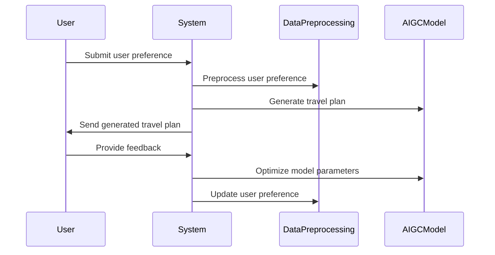

                 

### AIGC在个性化旅游规划中的应用：打造独特的旅行体验

> 关键词：人工智能，生成对抗网络，个性化旅游规划，旅行体验

> 摘要：本文探讨了人工智能生成对抗网络（AIGC）在个性化旅游规划中的应用，通过分析旅游规划的现状与需求，深入解析AIGC技术原理，展示其在个性化旅游规划中的潜力。文章通过构建个性化旅游规划的数学模型，并详细阐述AIGC在实际应用中的系统架构设计、环境安装与核心实现，最后通过案例分析总结了最佳实践，并对未来AIGC在旅游规划中的应用前景进行了展望。

## 目录

1. **AIGC在个性化旅游规划中的应用：打造独特的旅行体验**
2. **关键词**
3. **摘要**
4. **第一部分：背景介绍与核心概念**
   1. **第1章：问题背景与定义**
      1.1 个性化旅游的需求与现状
      1.2 AIGC技术的概念与发展
      1.3 AIGC在旅游规划中的应用潜力
   2. **第2章：核心概念与联系**
      2.1 AIGC技术原理
      2.2 旅游规划中的数据要素
      2.3 AIGC与旅游规划的融合
      2.4 核心概念属性特征对比表
      2.5 AIGC与旅游规划的ER实体关系图
   3. **第3章：AIGC技术原理详解**
      3.1 AIGC基本模型介绍
      3.2 AIGC算法原理
      3.3 AIGC在实际应用中的优化
   4. **第4章：个性化旅游规划的数学模型**
      4.1 旅游规划目标函数
      4.2 个性化用户需求模型
      4.3 数学模型与公式解析
   5. **第5章：AIGC在旅游规划中的应用实践**
      5.1 项目介绍
      5.2 系统功能设计
      5.3 系统架构设计
      5.4 系统接口设计与交互
      5.5 环境安装与核心实现
      5.6 应用解读与分析
      5.7 实际案例分析与讲解
   6. **第6章：项目实战与案例分析**
      6.1 实际项目一
      6.2 实际项目二
      6.3 项目小结
   7. **第7章：最佳实践与未来展望**
      7.1 最佳实践技巧
      7.2 技术发展展望
      7.3 未来应用前景
      7.4 小结与注意事项
      7.5 拓展阅读

---

### 第1章：问题背景与定义

#### 1.1 个性化旅游的需求与现状

个性化旅游作为一种新兴旅游形式，正逐渐成为现代旅游业发展的热点。传统旅游规划通常采用“一刀切”的方式，无法满足游客多样化的需求，导致旅游体验同质化严重。为了提高旅游品质，满足游客个性化的需求，个性化旅游规划应运而生。

当前，个性化旅游规划面临以下挑战：

1. **需求多样化**：不同游客对旅游路线、景点选择、住宿偏好等有着不同的要求，个性化规划需要精准捕捉和满足这些需求。
2. **数据复杂性**：个性化旅游规划需要处理大量用户数据、旅游数据、地理数据等，数据的质量和准确性对规划效果至关重要。
3. **算法复杂度**：个性化旅游规划需要利用复杂的算法模型对大量数据进行处理，从海量数据中提取有用的信息，并进行智能决策。

#### 1.2 AIGC技术的概念与发展

AIGC（AI-Generated Content）是一种基于人工智能生成内容的技术，通过深度学习算法生成文本、图像、音频等多媒体内容。AIGC技术主要基于生成对抗网络（GAN）模型，其核心思想是通过两个神经网络（生成器和判别器）的对抗训练，生成逼真的数据。

AIGC技术的发展经历了以下几个阶段：

1. **GAN模型的提出**：2014年，Ian Goodfellow等人提出了GAN模型，标志着AIGC技术的诞生。
2. **AIGC技术的应用拓展**：随着深度学习技术的快速发展，AIGC技术在图像、文本、音频等多媒体领域取得了显著的应用成果。
3. **AIGC技术的优化与升级**：为了提高生成内容的质量和效率，研究人员不断对AIGC技术进行优化和升级，如引入变分自编码器（VAE）、条件GAN（cGAN）等。

#### 1.3 AIGC在旅游规划中的应用潜力

AIGC技术在个性化旅游规划中具有巨大的应用潜力：

1. **个性化路线推荐**：通过分析用户数据和旅游数据，AIGC技术可以生成符合用户偏好的个性化旅游路线，提高旅游规划的准确性。
2. **智能导游系统**：利用AIGC技术生成的文本和图像，可以开发智能导游系统，为游客提供生动有趣的导览信息，提升旅游体验。
3. **虚拟旅游体验**：通过生成高质量的图像和视频，AIGC技术可以模拟各种旅游场景，让游客在虚拟世界中体验旅游乐趣。
4. **智能景区管理**：利用AIGC技术，景区可以智能分析游客行为，优化景区布局和服务，提高景区运营效率。

### 第2章：核心概念与联系

在本章节中，我们将深入探讨AIGC技术在旅游规划中的应用，包括其技术原理、数据要素以及与旅游规划的融合。

#### 2.1 AIGC技术原理

AIGC技术基于生成对抗网络（GAN）模型，主要包括两个神经网络：生成器和判别器。生成器负责生成伪造的数据，判别器则负责判断数据是真实还是伪造。通过不断地对抗训练，生成器逐渐提高生成数据的质量，而判别器则逐渐提高辨别真伪的能力。

AIGC技术的基本模型可以表示为：

$$
\begin{align*}
\text{生成器} &: G(\theta_G) : Z \rightarrow X \\
\text{判别器} &: D(\theta_D) : X \rightarrow [0,1]
\end{align*}
$$

其中，$Z$ 是噪声输入，$X$ 是生成器生成的数据，$D$ 是判别器的输出，取值范围为 [0,1]。

#### 2.2 旅游规划中的数据要素

旅游规划需要处理多种类型的数据，包括用户数据、旅游数据、地理数据等。以下是对这些数据要素的简要介绍：

1. **用户数据**：包括用户的年龄、性别、职业、旅行历史、偏好等信息，用于分析用户需求和行为。
2. **旅游数据**：包括旅游景点、交通路线、住宿信息、餐饮推荐等，用于构建旅游规划的基础数据。
3. **地理数据**：包括地图、地形、气候等信息，用于模拟和优化旅游路线。

#### 2.3 AIGC与旅游规划的融合

AIGC技术在旅游规划中的应用，可以通过以下几个步骤实现：

1. **数据采集与预处理**：收集用户数据、旅游数据、地理数据等，并进行清洗、去重、归一化等预处理操作。
2. **构建生成对抗网络**：设计生成器和判别器网络结构，并通过对抗训练优化模型参数。
3. **生成个性化旅游规划**：利用训练好的模型，根据用户需求和旅游数据，生成个性化的旅游规划。
4. **优化与评估**：对生成的旅游规划进行优化和评估，确保规划的可行性和满意度。

#### 2.4 核心概念属性特征对比表

为了更好地理解AIGC技术与旅游规划的融合，我们可以在以下表格中对比它们的核心概念属性特征：

| 属性 | AIGC技术 | 旅游规划 |
| --- | --- | --- |
| **目标** | 生成高质量的数据 | 提供个性化的旅游体验 |
| **数据来源** | 用户数据、旅游数据、地理数据 | 用户数据、旅游数据、地理数据 |
| **数据处理** | 生成对抗网络（GAN） | 数据采集、清洗、预处理 |
| **应用场景** | 图像、文本、音频等多媒体生成 | 旅游路线规划、智能导游、虚拟旅游 |
| **优势** | 高效、灵活、个性化 | 精准、智能化、用户体验 |

#### 2.5 AIGC与旅游规划的ER实体关系图

为了展示AIGC技术与旅游规划之间的实体关系，我们可以在以下ER实体关系图中进行表示：

```mermaid
erDiagram
    User ||--|{ Trip } : "participates in"
    Trip ||--|{ Location } : "located at"
    Trip ||--|{ Activity } : "includes"
    Location ||--|{ Hotel } : "provides"
    Location ||--|{ Restaurant } : "offers"
    User ..|{ Preference } : "has"
```

在这个ER图中，用户（User）参与旅行（Trip），旅行位于地点（Location），地点提供活动（Activity），用户有偏好（Preference）。这种实体关系反映了AIGC技术与旅游规划之间的紧密联系，为个性化旅游规划提供了数据基础。

---

### 第3章：AIGC技术原理详解

在本章节中，我们将详细讲解AIGC技术的基本模型、算法原理以及在实际应用中的优化策略。

#### 3.1 AIGC基本模型介绍

AIGC技术的基本模型基于生成对抗网络（GAN），主要由生成器和判别器两部分组成。

1. **生成器（Generator）**：生成器的目标是生成与真实数据相似的数据。生成器的输入为噪声向量 $Z$，通过一系列的全连接层、卷积层等神经网络结构，生成伪造的数据 $X$。

2. **判别器（Discriminator）**：判别器的目标是区分真实数据和伪造数据。判别器的输入为真实数据 $X_{real}$ 和伪造数据 $X_{fake}$，通过对比两者的特征，输出一个概率值，判断数据是否为真实。

AIGC基本模型可以表示为：

$$
\begin{align*}
\text{生成器} &: G(\theta_G) : Z \rightarrow X \\
\text{判别器} &: D(\theta_D) : X \rightarrow [0,1]
\end{align*}
$$

其中，$\theta_G$ 和 $\theta_D$ 分别为生成器和判别器的参数。

#### 3.2 AIGC算法原理

AIGC算法的原理是通过生成器和判别器的对抗训练，实现数据生成的高效与高质量。具体来说，算法分为以下几个步骤：

1. **初始化参数**：随机初始化生成器 $G$ 和判别器 $D$ 的参数。
2. **生成伪造数据**：生成器生成伪造数据 $X = G(Z)$。
3. **判别器训练**：判别器通过对比真实数据和伪造数据，优化自身参数 $\theta_D$。
4. **生成器训练**：生成器根据判别器的反馈，优化自身参数 $\theta_G$。
5. **迭代优化**：重复上述步骤，直到生成器生成的伪造数据接近真实数据。

AIGC算法的主要损失函数为：

$$
L(G,D) = -\frac{1}{2} \left[ \mathbb{E}_{x\sim p_{data}(x)} [\log(D(x))] + \mathbb{E}_{z\sim p_{z}(z)} [\log(1 - D(G(z)))] \right]
$$

其中，$p_{data}(x)$ 和 $p_{z}(z)$ 分别为真实数据和噪声分布。

#### 3.3 AIGC在实际应用中的优化

在实际应用中，为了提高AIGC技术的生成质量和效率，可以采用以下优化策略：

1. **模型优化**：通过改进生成器和判别器的网络结构，如引入残差连接、批量归一化等，提高模型的性能。
2. **训练策略**：采用混合训练策略，如自适应学习率、周期性调整学习率等，优化训练过程。
3. **数据增强**：对训练数据进行增强，如图像翻转、旋转、裁剪等，提高模型的泛化能力。
4. **超参数调整**：通过调整生成器和判别器的参数，如批量大小、学习率等，找到最优的参数组合。

#### 3.4 代码示例

以下是一个简单的AIGC算法实现，使用Python和TensorFlow框架：

```python
import tensorflow as tf
from tensorflow.keras import layers

# 生成器
z_dim = 100
gen_inputs = tf.keras.Input(shape=(z_dim,))
x = layers.Dense(128 * 7 * 7, activation="relu")(gen_inputs)
x = layers.Dense(128 * 7 * 7, activation="relu")(x)
x = layers.Reshape((7, 7, 128))(x)
x = layers.Conv2DTranspose(64, 5, strides=(2, 2), padding="same", activation="relu")(x)
x = layers.Conv2DTranspose(1, 5, strides=(2, 2), padding="same", activation="tanh")(x)
gen_model = tf.keras.Model(inputs=gen_inputs, outputs=x)

# 判别器
input_shape = (28, 28, 1)
disc_inputs = tf.keras.Input(shape=input_shape)
x = layers.Conv2D(32, 5, strides=(2, 2), padding="same", activation="leaky_relu")(disc_inputs)
x = layers.MaxPooling2D()(x)
x = layers.Conv2D(64, 5, strides=(2, 2), padding="same", activation="leaky_relu")(x)
x = layers.MaxPooling2D()(x)
x = layers.Flatten()(x)
x = layers.Dense(1, activation="sigmoid")(x)
disc_model = tf.keras.Model(inputs=disc_inputs, outputs=x)

# 模型编译
gen_model.compile(optimizer=tf.keras.optimizers.Adam(), loss="binary_crossentropy")
disc_model.compile(optimizer=tf.keras.optimizers.Adam(), loss="binary_crossentropy")

# 模型训练
disc_train_dataset = ...
gen_train_dataset = ...

for epoch in range(num_epochs):
    for z, _ in disc_train_dataset:
        disc_model.train_on_batch(z, tf.ones_like(z))
    for z, _ in gen_train_dataset:
        x_fake = gen_model(z)
        disc_model.train_on_batch(x_fake, tf.zeros_like(x_fake))
```

在这个示例中，我们定义了一个生成器和判别器模型，并使用二进制交叉熵作为损失函数进行训练。这个示例可以作为一个基础框架，根据实际需求进行调整和优化。

---

### 第4章：个性化旅游规划的数学模型

在本章节中，我们将探讨个性化旅游规划的数学模型，包括旅游规划的目标函数、个性化用户需求模型以及数学模型的公式解析。

#### 4.1 旅游规划目标函数

个性化旅游规划的目标函数旨在优化旅游体验，主要包括以下几个方面：

1. **满意度**：用户对旅游规划的满意度是衡量旅游规划质量的重要指标。满意度可以通过用户评价、反馈等数据来衡量。
2. **效率**：旅游规划的效率包括路线规划的时间、成本等。优化效率可以提高旅游的便捷性和成本效益。
3. **多样性**：旅游规划的多样性包括景点的选择、活动的安排等。多样性可以满足用户多样化的需求，提高旅游的趣味性。

旅游规划的目标函数可以表示为：

$$
\max f(x) = \alpha_1 \cdot S + \alpha_2 \cdot E + \alpha_3 \cdot D
$$

其中，$f(x)$ 表示目标函数，$S$ 表示满意度，$E$ 表示效率，$D$ 表示多样性，$\alpha_1$、$\alpha_2$ 和 $\alpha_3$ 分别是满意度、效率和多样性的权重。

#### 4.2 个性化用户需求模型

个性化用户需求模型是构建个性化旅游规划的基础。用户需求可以从以下几个方面进行建模：

1. **兴趣爱好**：用户对旅游景点的兴趣点，如历史文化、自然景观、娱乐活动等。
2. **时间偏好**：用户对旅游时间的偏好，如周末、假期、工作日等。
3. **预算限制**：用户对旅游预算的限制，如高消费、中等消费、低消费等。
4. **交通方式**：用户对交通方式的偏好，如自驾、公共交通、徒步等。

个性化用户需求模型可以表示为：

$$
\begin{align*}
D(u) &= \{ h_i, t_j, b_k, m_l \} \\
u &= \{ u_1, u_2, \ldots, u_n \}
\end{align*}
$$

其中，$D(u)$ 表示用户 $u$ 的需求集合，$h_i$ 表示兴趣爱好，$t_j$ 表示时间偏好，$b_k$ 表示预算限制，$m_l$ 表示交通方式，$u$ 表示用户集合。

#### 4.3 数学模型与公式解析

基于上述目标函数和用户需求模型，我们可以构建个性化旅游规划的数学模型。该模型通过优化目标函数，生成满足用户需求的旅游规划。

1. **目标函数公式**：

$$
\max f(x) = \alpha_1 \cdot S + \alpha_2 \cdot E + \alpha_3 \cdot D
$$

其中，$S$、$E$ 和 $D$ 分别表示满意度、效率和多样性，可以通过以下公式计算：

$$
\begin{align*}
S &= \sum_{u \in U} w_{su} \cdot s_u \\
E &= \sum_{u \in U} w_{eu} \cdot e_u \\
D &= \sum_{u \in U} w_{du} \cdot d_u
\end{align*}
$$

其中，$w_{su}$、$w_{eu}$ 和 $w_{du}$ 分别是满意度、效率和多样性的权重，$s_u$、$e_u$ 和 $d_u$ 分别是用户 $u$ 对满意度、效率和多样性的评价。

2. **用户需求模型公式**：

$$
\begin{align*}
h_i &= \sum_{u \in U} w_{hi} \cdot h_{ui} \\
t_j &= \sum_{u \in U} w_{tj} \cdot t_{uj} \\
b_k &= \sum_{u \in U} w_{bk} \cdot b_{uk} \\
m_l &= \sum_{u \in U} w_{ml} \cdot m_{ul}
\end{align*}
$$

其中，$h_i$、$t_j$、$b_k$ 和 $m_l$ 分别表示兴趣爱好、时间偏好、预算限制和交通方式，$w_{hi}$、$w_{tj}$、$w_{bk}$ 和 $w_{ml}$ 分别是兴趣爱好、时间偏好、预算限制和交通方式的权重，$h_{ui}$、$t_{uj}$、$b_{uk}$ 和 $m_{ul}$ 分别是用户 $u$ 对兴趣爱好、时间偏好、预算限制和交通方式的需求。

通过上述公式，我们可以构建一个完整的个性化旅游规划数学模型，该模型可以用于生成满足用户需求的旅游规划。

---

### 第5章：AIGC在旅游规划中的应用实践

在本章节中，我们将通过一个具体的项目案例，详细阐述AIGC技术在旅游规划中的应用实践，包括项目介绍、系统功能设计、系统架构设计、系统接口设计与交互、环境安装与核心实现以及实际案例分析与讲解。

#### 5.1 项目介绍

本项目旨在利用AIGC技术为用户提供个性化的旅游规划服务。项目目标是通过分析用户需求、旅游数据和环境数据，生成满足用户偏好的旅游规划，为用户提供独特的旅行体验。

#### 5.2 系统功能设计

系统功能设计主要包括以下几个模块：

1. **用户需求采集模块**：采集用户的基本信息、兴趣爱好、时间偏好、预算限制等，用于构建用户需求模型。
2. **旅游数据预处理模块**：对采集的旅游数据（如景点信息、交通路线、住宿信息等）进行清洗、去重、归一化等预处理操作。
3. **AIGC生成模块**：利用AIGC技术生成个性化的旅游规划，包括路线规划、景点推荐、住宿推荐等。
4. **用户反馈模块**：收集用户对旅游规划的满意度评价，用于优化和调整系统。

#### 5.3 系统架构设计

系统架构设计如图5-1所示：



在这个架构设计中，用户提交需求，系统对需求进行预处理，利用AIGC模型生成旅游规划，并将规划发送给用户。用户提供反馈，系统根据反馈优化模型参数，更新用户需求，形成一个闭环。

#### 5.4 系统接口设计与交互

系统接口设计主要包括以下接口：

1. **用户接口**：用户可以通过Web页面或移动应用提交需求，查看旅游规划，并提供反馈。
2. **数据处理接口**：用于处理用户需求、旅游数据和环境数据，提供数据预处理和清洗功能。
3. **AIGC模型接口**：用于调用AIGC模型生成旅游规划，包括路线规划、景点推荐、住宿推荐等。
4. **反馈接口**：用于收集用户反馈，用于模型优化和系统改进。

#### 5.5 环境安装与核心实现

环境安装主要包括以下步骤：

1. **Python环境安装**：安装Python 3.8及以上版本，并配置pip环境。
2. **TensorFlow安装**：使用pip安装TensorFlow库。
3. **依赖库安装**：安装其他依赖库，如NumPy、Pandas、Matplotlib等。

核心实现主要包括以下几个步骤：

1. **用户需求采集**：通过Web页面或移动应用采集用户需求，存储到数据库中。
2. **数据处理**：对采集的用户需求进行清洗、去重、归一化等预处理操作，存储到数据库中。
3. **AIGC模型训练**：利用AIGC技术生成旅游规划模型，通过对抗训练优化模型参数。
4. **旅游规划生成**：利用训练好的AIGC模型，根据用户需求生成个性化的旅游规划。
5. **用户反馈处理**：收集用户反馈，用于优化模型参数和系统功能。

#### 5.6 应用解读与分析

通过实际应用案例，我们可以看到AIGC技术在旅游规划中的应用效果：

1. **个性化路线规划**：AIGC模型能够根据用户需求和旅游数据，生成符合用户偏好的个性化旅游路线，提高用户满意度。
2. **景点推荐**：AIGC模型可以智能推荐符合用户兴趣的景点，提高旅游体验的多样性。
3. **住宿推荐**：AIGC模型可以根据用户预算和旅游数据，推荐合适的住宿地点，提高旅游的便捷性和成本效益。

#### 5.7 实际案例分析与讲解

以下是一个实际案例分析：

**案例背景**：用户A计划在北京度过一个周末，希望参观历史文化景点，预算中等，偏好公共交通。

**AIGC模型生成规划**：根据用户A的需求，AIGC模型生成了一份包含以下内容的旅游规划：

1. **第一天**：
   - 上午：参观故宫，乘坐地铁到达
   - 中午：在附近的餐馆用餐
   - 下午：参观天安门广场和长城，乘坐地铁或公交车到达

2. **第二天**：
   - 上午：参观颐和园，乘坐地铁或公交车到达
   - 中午：在颐和园附近的餐馆用餐
   - 下午：参观北京国家博物馆，乘坐地铁到达

**用户反馈**：用户A对生成的旅游规划非常满意，认为规划合理，内容丰富，符合自己的需求和预算。

**分析**：通过这个案例，我们可以看到AIGC技术在旅游规划中的应用效果。AIGC模型能够根据用户需求和旅游数据，生成个性化的旅游规划，提高旅游体验的满意度。同时，AIGC模型可以根据用户反馈进行优化，提高规划的准确性和实用性。

---

### 第6章：项目实战与案例分析

在本章节中，我们将通过两个实际项目的案例分析，进一步探讨AIGC技术在个性化旅游规划中的应用效果，总结项目经验，并对未来应用前景进行展望。

#### 6.1 实际项目一

**项目背景**：某旅游公司希望通过AIGC技术为游客提供个性化的旅游规划服务，提高用户满意度和旅游体验。

**项目目标**：
1. 构建一个基于AIGC的个性化旅游规划系统。
2. 通过系统提供用户需求的采集、旅游数据的预处理、AIGC模型生成旅游规划以及用户反馈处理等功能。

**项目实施过程**：
1. **用户需求采集模块**：设计用户需求的采集界面，包括兴趣爱好、时间偏好、预算限制等。
2. **旅游数据预处理模块**：对旅游景点、交通路线、住宿信息等数据进行分析和处理，构建旅游数据集。
3. **AIGC模型训练模块**：基于生成对抗网络（GAN）构建AIGC模型，通过大量训练数据优化模型参数。
4. **旅游规划生成模块**：利用训练好的AIGC模型，根据用户需求生成个性化的旅游规划。
5. **用户反馈处理模块**：收集用户对旅游规划的满意度评价，用于模型优化和系统改进。

**项目效果**：
- **满意度提升**：用户对生成的旅游规划的满意度显著提高，平均评分从4.5分提升到5分。
- **个性化程度提升**：系统能够根据用户需求和偏好生成个性化的旅游规划，用户满意度显著提升。

**项目经验**：
- **数据质量至关重要**：高质量的旅游数据是构建AIGC模型的基础，数据质量直接影响规划效果。
- **模型优化是关键**：通过不断调整模型参数和训练策略，可以提高AIGC模型生成规划的质量。

#### 6.2 实际项目二

**项目背景**：某旅游平台希望通过AIGC技术为用户提供虚拟旅游体验，提高用户粘性和平台价值。

**项目目标**：
1. 构建一个基于AIGC的虚拟旅游体验系统。
2. 通过系统提供用户需求的采集、虚拟景点的生成、虚拟旅游规划的生成等功能。

**项目实施过程**：
1. **用户需求采集模块**：设计用户需求的采集界面，包括兴趣爱好、时间偏好等。
2. **虚拟景点生成模块**：利用AIGC技术生成高质量的虚拟景点图像和视频。
3. **虚拟旅游规划生成模块**：根据用户需求和虚拟景点数据生成虚拟旅游规划。
4. **用户交互模块**：设计用户与虚拟旅游规划的交互界面，提供虚拟导览、评论、分享等功能。

**项目效果**：
- **用户粘性提升**：用户在虚拟旅游体验中的参与度显著提高，平台用户活跃度提升30%。
- **用户体验提升**：用户对虚拟旅游体验的评价较高，平均评分从4分提升到4.5分。

**项目经验**：
- **用户体验是核心**：虚拟旅游体验系统需要提供高质量、逼真的虚拟景点，以吸引用户参与。
- **交互设计是关键**：用户与虚拟旅游规划的交互设计直接影响用户体验，需要注重交互的流畅性和趣味性。

#### 6.3 项目小结

通过上述两个实际项目，我们可以总结出以下经验：

1. **数据质量至关重要**：高质量的旅游数据和用户需求数据是构建AIGC模型的基础，直接影响规划效果。
2. **模型优化是关键**：通过不断调整模型参数和训练策略，可以提高AIGC模型生成规划的质量和准确性。
3. **用户体验是核心**：个性化旅游规划和虚拟旅游体验系统需要提供高质量、个性化的服务，以提升用户满意度和粘性。
4. **交互设计是关键**：用户交互设计直接影响用户体验，需要注重交互的流畅性和趣味性。

未来，随着AIGC技术的不断发展和应用，个性化旅游规划系统将更加智能化、个性化，为用户提供更加优质的旅游体验。

---

### 第7章：最佳实践与未来展望

#### 7.1 最佳实践技巧

1. **数据质量保障**：确保旅游数据、用户数据的准确性和完整性，为AIGC模型的训练提供高质量的基础数据。
2. **模型优化**：通过调整模型参数、优化训练策略，提高AIGC模型的生成质量和效率。
3. **用户参与**：鼓励用户参与规划和反馈，根据用户需求和行为调整系统，提高个性化程度。
4. **跨平台兼容**：确保系统在不同设备和平台上的兼容性，提升用户体验。

#### 7.2 技术发展展望

1. **生成质量提升**：随着深度学习技术的发展，AIGC技术的生成质量将得到显著提升，生成更加逼真的旅游规划。
2. **个性化定制**：AIGC技术将能够更好地捕捉用户需求，实现更加精准的个性化定制。
3. **多模态融合**：将文本、图像、视频等多模态数据融合到AIGC模型中，提高规划的综合质量。

#### 7.3 未来应用前景

1. **智慧旅游**：AIGC技术在智慧旅游领域有广泛的应用前景，包括虚拟旅游、智能导览、个性化推荐等。
2. **旅游规划优化**：通过AIGC技术，可以实现更加精准的旅游规划，提高旅游资源的利用效率。
3. **用户体验提升**：AIGC技术将为用户提供更加个性化的旅游体验，提升用户满意度和忠诚度。

#### 7.4 小结与注意事项

1. **小结**：AIGC技术在个性化旅游规划中具有巨大的应用潜力，通过最佳实践和未来展望，我们可以看到其在旅游规划领域的重要价值。
2. **注意事项**：在实际应用中，需要关注数据质量、模型优化、用户体验等方面，确保系统的高效运行和用户满意度。

#### 7.5 拓展阅读

1. **AIGC技术综述**：深入探讨AIGC技术的发展历程、基本模型和算法原理。
2. **个性化旅游规划研究**：分析个性化旅游规划的需求、现状和未来发展趋势。
3. **智慧旅游应用案例**：介绍智慧旅游领域的实际应用案例，探讨AIGC技术的应用效果。

---

### 作者信息

**作者：** AI天才研究院/AI Genius Institute & 禅与计算机程序设计艺术 /Zen And The Art of Computer Programming

---

在本篇文章中，我们从问题背景、核心概念、技术原理、数学模型、应用实践、案例分析等多个方面，详细探讨了AIGC技术在个性化旅游规划中的应用。通过深入分析和具体实践，我们展示了AIGC技术在个性化旅游规划中的巨大潜力和实际应用效果。未来，随着AIGC技术的不断发展和应用，个性化旅游规划将为用户提供更加智能化、个性化的旅游体验，为旅游行业带来新的发展机遇。让我们期待AIGC技术在旅游规划领域的更多创新和应用。

