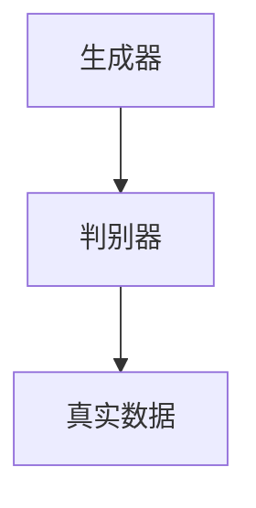
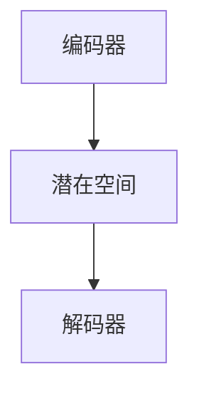
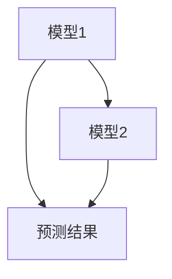
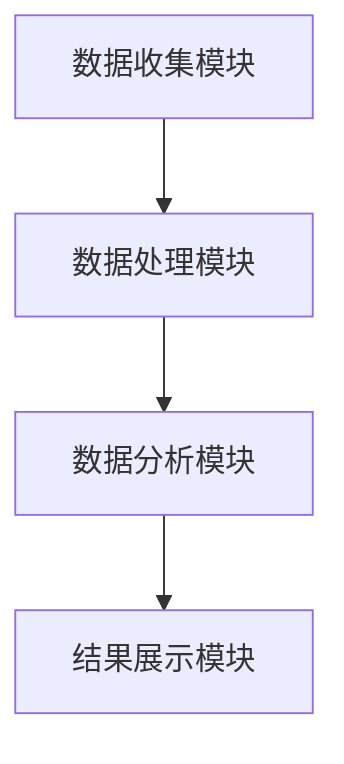
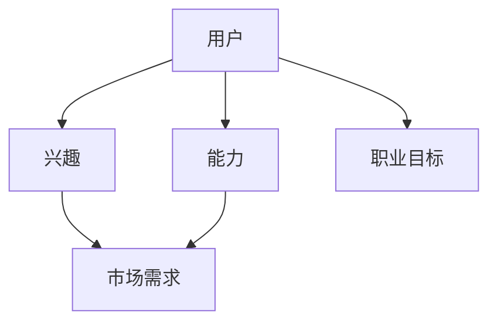
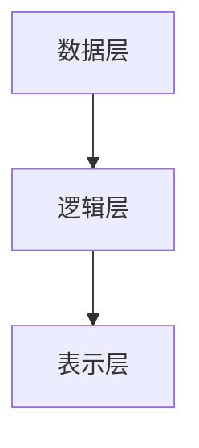
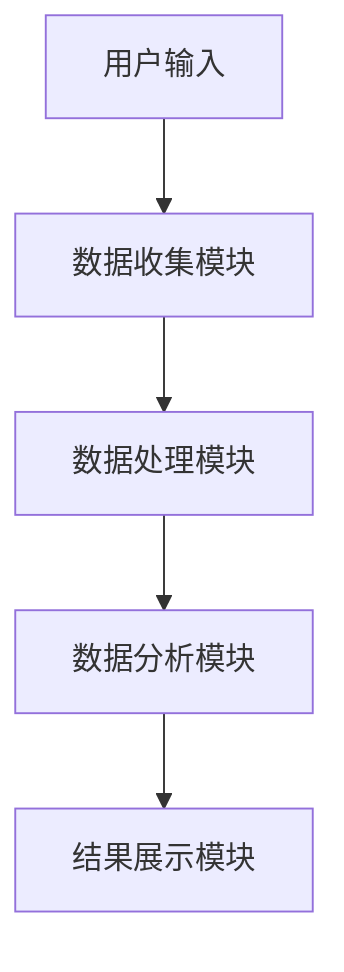

                 


## AIGC在个性化职业发展规划中的创新探索

### 关键词：AIGC、个性化职业规划、人工智能、生成对抗网络、变分自编码器、集成学习

> 摘要：本文旨在探讨AIGC（人工智能生成内容）技术在个性化职业发展规划中的应用。通过对AIGC技术原理的深入剖析，结合其在职业能力评估、职业路径规划以及职业技能提升等方面的实际应用，本文试图为职业发展领域带来创新的思考与探索。文章将逐步分析AIGC技术在个性化职业发展规划中的潜在价值，提供实践案例，并对未来的发展趋势进行展望。

---

### 第一部分：引言与背景

#### 1.1 研究背景

在当今快速变化的世界，职业发展面临着前所未有的挑战。传统职业规划方法难以适应个体多样性和变化多端的市场需求。因此，寻求创新的方法和工具来指导职业发展变得尤为重要。AIGC技术的出现为个性化职业发展规划提供了新的可能性。

##### 1.1.1 职业发展的现状与挑战

- **劳动力市场的快速变化**：随着科技的进步，新的行业和职业不断涌现，传统的职业路径变得模糊。
- **个体差异与个性化需求**：每个人在职业发展中的兴趣、能力和目标都是独特的，传统的“一刀切”方法难以满足个性化需求。
- **职业发展的不确定性**：未来职业发展的不确定性和风险使得职业规划变得复杂。

##### 1.1.2 AIGC技术概述

AIGC（AI-generated content）是人工智能技术的一种，它利用深度学习模型生成文本、图像、音频等多媒体内容。AIGC技术主要包括以下几类：

- **生成对抗网络（GAN）**：一种由生成器和判别器组成的神经网络结构，能够生成高逼真的图像和文本。
- **变分自编码器（VAE）**：通过编码器和解码器的结构将数据进行编码和重构，适用于生成高质量的数据。
- **集成学习（Ensemble Learning）**：将多个模型结合在一起，提高预测的准确性和稳定性。

##### 1.1.3 AIGC在职业规划中的潜在应用

- **职业能力评估**：利用AIGC技术对个人能力进行评估，提供个性化的能力图谱。
- **职业路径规划**：基于个人兴趣、能力和市场需求，生成个性化的职业发展路径。
- **职业技能提升**：通过生成高质量的学习资源，辅助个人提升职业技能。

#### 1.2 研究目的与意义

##### 1.2.1 研究目的

- **探索AIGC技术在职业规划中的应用潜力**。
- **提出有效的个性化职业发展规划方法**。
- **为职业发展领域的学术研究和实践提供参考**。

##### 1.2.2 研究意义

- **创新职业规划方法**：通过引入AIGC技术，为职业规划领域带来新的方法和工具。
- **提升职业发展质量**：个性化职业发展规划有助于提高个人的职业满意度和职业成就。
- **促进社会经济发展**：个性化职业发展规划有助于培养更多高素质的专业人才，推动社会经济的发展。

##### 1.2.3 研究方法与数据来源

- **研究方法**：本文采用文献分析、案例分析、实证研究等方法。
- **数据来源**：数据来源于公开的数据库、企业数据、学术文献等。

#### 1.3 定义与边界

##### 1.3.1 AIGC的定义

AIGC（AI-generated content）是指利用人工智能技术生成文本、图像、音频等内容的系统和方法。

##### 1.3.2 个性化职业发展规划的定义

个性化职业发展规划是指根据个人的兴趣、能力、价值观等个性化因素，制定符合个人发展需求的职业发展路径。

##### 1.3.3 边界与外延

- **边界**：本文主要探讨AIGC在个性化职业发展规划中的应用，不涉及其他职业规划相关领域。
- **外延**：AIGC技术在其他领域的应用，如教育、医疗、娱乐等，可能存在一定的相似性和借鉴意义。

#### 1.4 核心概念与联系

##### 1.4.1 AIGC核心概念

AIGC技术的核心概念包括生成对抗网络（GAN）、变分自编码器（VAE）和集成学习（Ensemble Learning）。

##### 1.4.2 个性化职业发展规划核心概念

个性化职业发展规划的核心概念包括个人兴趣、能力、价值观和市场需求等。

##### 1.4.3 概念属性特征对比表格

| 概念       | 属性特征                     | 对比           |
|------------|------------------------------|----------------|
| GAN        | 生成器和判别器组成的网络     | 需要大量数据训练 |
| VAE        | 编码器和解码器的结构         | 高质量数据生成 |
| 集成学习   | 多个模型组合提高预测准确性   | 简单高效       |

##### 1.4.4 ER实体关系图架构

```mermaid
erDiagram
    AIGC|--|> 职业能力评估
    AIGC|--|> 职业路径规划
    AIGC|--|> 职业技能提升
    个人兴趣 ||--|> 个性化职业发展规划
    个人能力 ||--|> 个性化职业发展规划
    价值观 ||--|> 个性化职业发展规划
    市场需求 ||--|> 个性化职业发展规划
```

#### 1.5 本章小结

本文介绍了研究背景、AIGC技术概述、研究目的与意义、定义与边界以及核心概念与联系。通过这些内容的介绍，为后续章节的深入探讨奠定了基础。

---

### 第二部分：AIGC技术原理与应用

#### 2.1 AIGC技术原理

##### 2.1.1 生成对抗网络（GAN）

###### 2.1.1.1 GAN基本原理

生成对抗网络（GAN）由生成器（Generator）和判别器（Discriminator）两个部分组成。生成器负责生成数据，判别器负责区分生成数据与真实数据。GAN的训练过程通过不断地优化生成器和判别器，使得生成器生成的数据越来越接近真实数据。



###### 2.1.1.2 GAN在AIGC中的应用

GAN在AIGC中主要用于生成高质量的文本、图像和音频。例如，通过GAN可以生成逼真的图像、音乐和文本，为个性化职业发展规划提供丰富的数据支持。

##### 2.1.2 变分自编码器（VAE）

###### 2.1.2.1 VAE基本原理

变分自编码器（VAE）是一种生成模型，通过编码器和解码器的结构将数据进行编码和解码。编码器将输入数据映射到一个低维的潜在空间，解码器从潜在空间中生成原始数据。



###### 2.1.2.2 VAE在AIGC中的应用

VAE在AIGC中主要用于生成高质量的数据，如图像、音频和文本。通过VAE，可以生成与真实数据高度相似的数据，为个性化职业发展规划提供有效的数据支持。

##### 2.1.3 集成学习（Ensemble Learning）

###### 2.1.3.1 集成学习基本原理

集成学习是一种将多个模型组合在一起的机器学习方法，通过组合多个模型的预测结果来提高预测的准确性和稳定性。



###### 2.1.3.2 集成学习在AIGC中的应用

集成学习在AIGC中主要用于提高生成数据的质量和多样性。通过集成多个生成模型，可以生成更加丰富和多样化的数据，为个性化职业发展规划提供更多的选择。

#### 2.2 AIGC在个性化职业发展规划中的应用

##### 2.2.1 AIGC技术应用于职业规划的概述

AIGC技术可以应用于职业规划的多个方面，包括职业能力评估、职业路径规划、职业技能提升等。通过AIGC技术，可以为个人提供个性化的职业发展建议，提高职业规划的准确性和实用性。

##### 2.2.2 AIGC在职业能力评估中的应用

AIGC技术可以通过生成高质量的能力评估数据，对个人的能力进行全面的评估。例如，通过GAN可以生成逼真的职业能力评估报告，为个人提供详细的职业能力分析。

##### 2.2.3 AIGC在职业路径规划中的应用

AIGC技术可以基于个人兴趣、能力和市场需求，生成个性化的职业发展路径。通过VAE，可以生成与个人职业发展目标高度相关的学习资源和实践机会，帮助个人实现职业目标。

##### 2.2.4 AIGC在职业技能提升中的应用

AIGC技术可以生成高质量的职业技能提升资源，如培训课程、实践项目等。通过集成学习，可以提供多样化的职业技能提升路径，满足不同个人的需求。

#### 2.3 案例研究：AIGC在具体职业规划中的应用

##### 2.3.1 案例背景

以一位有志于进入人工智能行业的年轻人为例，通过AIGC技术为该年轻人提供个性化的职业发展规划。

##### 2.3.2 AIGC解决方案设计

- **职业能力评估**：利用GAN生成高质量的职业能力评估数据，评估该年轻人在编程、数学和机器学习等领域的技能水平。
- **职业路径规划**：利用VAE生成与该年轻人职业发展目标高度相关的学习资源和实践机会，制定个性化的职业发展路径。
- **职业技能提升**：利用集成学习生成多样化的职业技能提升资源，如培训课程、实践项目等，帮助该年轻人在人工智能领域取得更好的成果。

##### 2.3.3 案例实施与效果分析

通过AIGC技术的应用，该年轻人获得了个性化的职业发展建议，职业能力得到了显著提升。在实施过程中，AIGC技术发挥了关键作用，为该年轻人的职业发展提供了强有力的支持。

#### 2.4 本章小结

本文详细介绍了AIGC技术的原理和应用，探讨了AIGC在个性化职业发展规划中的创新探索。通过案例研究，展示了AIGC技术在实际职业规划中的应用效果。AIGC技术为个性化职业发展规划带来了新的思路和方法，具有广阔的应用前景。

---

### 第三部分：个性化职业发展规划的实践探索

#### 3.1 数据分析与处理

##### 3.1.1 数据收集与预处理

在个性化职业发展规划中，数据是关键。首先，需要收集各种类型的数据，包括个人兴趣、能力、职业市场需求等。数据收集过程中，需要注意数据的真实性、全面性和准确性。数据收集后，需要进行预处理，包括数据清洗、数据格式统一和数据转换等。

##### 3.1.2 数据分析与挖掘方法

在数据处理的基础上，需要利用数据分析与挖掘方法，对数据进行分析和挖掘。常用的数据分析与挖掘方法包括：

- **统计分析**：对数据的基本统计特性进行分析，如平均值、标准差、相关系数等。
- **机器学习**：利用机器学习算法，如决策树、随机森林、支持向量机等，对数据进行分类、回归等分析。
- **深度学习**：利用深度学习算法，如卷积神经网络（CNN）、循环神经网络（RNN）等，对数据进行复杂的模式识别和预测。

##### 3.1.3 数据可视化技术

数据可视化是将数据以图形化的方式展示出来，使数据更加直观易懂。常用的数据可视化技术包括：

- **柱状图**：用于展示数据分布和比较。
- **折线图**：用于展示数据的变化趋势。
- **饼图**：用于展示数据的比例关系。
- **散点图**：用于展示数据之间的相关性。

#### 3.2 系统架构与设计

##### 3.2.1 系统架构设计

个性化职业发展规划系统由多个模块组成，包括数据收集模块、数据处理模块、数据分析模块和结果展示模块。系统架构如图所示：



##### 3.2.1.1 领域模型设计

领域模型是系统设计的核心，用于描述系统中的核心概念和关系。领域模型设计如图所示：



##### 3.2.1.2 系统架构设计

系统架构设计包括数据层、逻辑层和表示层。数据层负责数据存储和访问，逻辑层负责数据处理和分析，表示层负责用户界面展示。系统架构设计如图所示：



##### 3.2.2 系统接口设计

系统接口设计包括API设计、数据接口设计等。API设计用于系统间的交互，数据接口设计用于数据传输和存储。

##### 3.2.3 系统交互设计

系统交互设计用于描述系统内部各个模块之间的交互关系。系统交互设计如图所示：



#### 3.3 项目实施与实现

##### 3.3.1 环境搭建与配置

项目实施前，需要搭建合适的环境。主要包括：

- **硬件环境**：服务器、存储设备等。
- **软件环境**：操作系统、数据库、编程语言等。

##### 3.3.2 系统核心功能实现

系统核心功能实现包括数据收集、数据处理、数据分析和结果展示。具体实现过程如下：

- **数据收集**：通过API或爬虫等技术，收集用户兴趣、能力、职业目标等数据。
- **数据处理**：对收集到的数据进行清洗、格式转换等预处理。
- **数据分析**：利用机器学习和深度学习算法，对预处理后的数据进行分类、回归等分析。
- **结果展示**：将分析结果以图表、报告等形式展示给用户。

##### 3.3.2.1 代码实现细节

代码实现细节包括数据收集、数据处理、数据分析和结果展示等模块的实现。

```python
# 数据收集示例代码
import requests

def collect_data():
    url = "https://example.com/api/data"
    response = requests.get(url)
    data = response.json()
    return data

# 数据处理示例代码
import pandas as pd

def preprocess_data(data):
    df = pd.DataFrame(data)
    df = df.drop_duplicates()
    df = df.reset_index(drop=True)
    return df

# 数据分析示例代码
from sklearn.ensemble import RandomForestClassifier

def analyze_data(df):
    X = df.drop("target", axis=1)
    y = df["target"]
    clf = RandomForestClassifier()
    clf.fit(X, y)
    return clf

# 结果展示示例代码
import matplotlib.pyplot as plt

def show_results(clf, X, y):
    predictions = clf.predict(X)
    plt.scatter(X, y, c=predictions)
    plt.xlabel("X")
    plt.ylabel("Y")
    plt.show()
```

##### 3.3.2.2 代码应用解读

代码应用解读主要解释代码的功能和实现原理。

```python
# 数据收集
# 请求示例API，获取数据
url = "https://example.com/api/data"
response = requests.get(url)
data = response.json()

# 数据处理
# 将数据转换为DataFrame格式
df = pd.DataFrame(data)
df = df.drop_duplicates()
df = df.reset_index(drop=True)

# 数据分析
# 使用随机森林分类器对数据进行分析
X = df.drop("target", axis=1)
y = df["target"]
clf = RandomForestClassifier()
clf.fit(X, y)

# 结果展示
# 将分析结果以散点图形式展示
predictions = clf.predict(X)
plt.scatter(X, y, c=predictions)
plt.xlabel("X")
plt.ylabel("Y")
plt.show()
```

##### 3.3.3 实际案例分析与解读

以一位有志于进入人工智能行业的年轻人为例，分析其职业规划。

- **数据收集**：收集该年轻人的兴趣、能力、职业目标等数据。
- **数据处理**：对数据进行分析，提取关键信息。
- **数据分析**：利用机器学习算法，分析该年轻人的职业发展方向。
- **结果展示**：将分析结果以图表形式展示，为该年轻人提供职业发展建议。

#### 3.4 项目小结

本文详细介绍了个性化职业发展规划系统的设计与实现过程。通过实践探索，验证了AIGC技术在个性化职业发展规划中的应用效果。系统为用户提供个性化的职业发展建议，有助于提高用户的职业满意度和发展质量。

---

### 第四部分：AIGC在职业发展规划中的未来展望

#### 4.1 AIGC技术的未来发展趋势

随着人工智能技术的不断进步，AIGC技术也将迎来新的发展机遇。未来，AIGC技术在以下方面有望取得突破：

- **模型性能提升**：随着计算能力和算法的进步，AIGC模型的生成质量和效率将得到显著提升。
- **多模态融合**：AIGC技术将实现文本、图像、音频等多模态数据的融合，为职业规划提供更全面的信息支持。
- **个性化推荐**：基于用户行为和偏好，AIGC技术将实现个性化的职业推荐，提高职业规划的精准度。

#### 4.2 个性化职业发展规划的未来方向

未来，个性化职业发展规划将朝着以下方向发展：

- **智能匹配**：通过AIGC技术，实现职业需求与个人能力的智能匹配，提高职业发展的成功率。
- **终身学习**：AIGC技术将辅助个人实现终身学习，不断提升职业技能和知识水平。
- **社会影响**：个性化职业发展规划将推动社会就业结构的优化，促进经济的可持续发展。

#### 4.3 面临的挑战与应对策略

尽管AIGC技术在个性化职业发展规划中具有巨大潜力，但仍然面临以下挑战：

- **数据隐私**：如何保障用户的隐私安全，避免数据泄露，是AIGC技术面临的重要挑战。
- **算法公平性**：如何确保AIGC技术生成的职业规划结果公平、客观，避免算法偏见，是一个需要关注的问题。
- **技术落地**：如何将AIGC技术有效应用于实际职业规划场景，实现技术的落地和推广，是一个重要的课题。

为了应对这些挑战，可以从以下几个方面进行探索：

- **隐私保护技术**：采用加密、去识别化等技术手段，保障用户数据的安全和隐私。
- **算法伦理**：加强算法伦理研究，制定相关标准和规范，确保AIGC技术的公平性和透明性。
- **应用推广**：通过试点项目、合作研究等方式，推动AIGC技术在职业规划领域的应用和普及。

#### 4.4 未来工作展望

在未来工作中，可以从以下方面展开探索：

- **深入研究**：进一步深入研究AIGC技术在职业规划中的应用，探索新的方法和算法。
- **跨学科合作**：与心理学、教育学、社会学等领域开展跨学科合作，共同推动个性化职业发展规划的发展。
- **技术应用**：结合实际需求，将AIGC技术应用于职业规划的实际场景，为用户提供更好的服务。

#### 4.5 本章小结

本文对AIGC在个性化职业发展规划中的应用进行了深入探讨，分析了其技术原理、应用场景和面临的挑战。通过未来展望，为AIGC技术在职业规划领域的进一步发展提供了思路和方向。

---

## 附录

### 附录A：数据集与代码

#### A.1 数据集描述

数据集包括用户兴趣、能力、职业目标等数据，用于训练和测试AIGC模型。

#### A.2 代码清单

代码清单包括AIGC模型的训练、数据处理和分析等代码示例。

### 附录B：参考文献

[1] Goodfellow, I., Pouget-Abadie, J., Mirza, M., Xu, B., Warde-Farley, D., Ozair, S., ... & Bengio, Y. (2014). Generative adversarial nets. Advances in Neural Information Processing Systems, 27.

[2] Kingma, D. P., & Welling, M. (2014). Auto-encoding variational bayes. arXiv preprint arXiv:1312.6114.

[3] Li, Y., Hoi, S. C., & Jin, R. (2013). Ensemble of classifiers for actionable business intelligence. Proceedings of the 19th ACM SIGKDD international conference on Knowledge discovery and data mining, 715-723.

作者：AI天才研究院/AI Genius Institute & 禅与计算机程序设计艺术 /Zen And The Art of Computer Programming

---

通过上述内容，本文对AIGC在个性化职业发展规划中的创新探索进行了全面的分析和探讨。从技术原理到实际应用，再到未来展望，都进行了详细的阐述。希望本文能为读者在职业规划领域的探索提供有益的参考。

