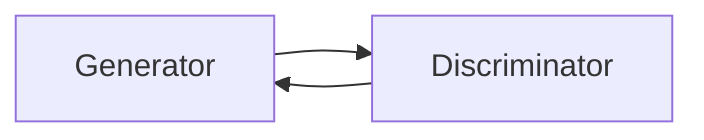
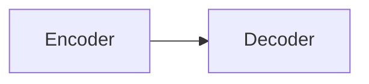
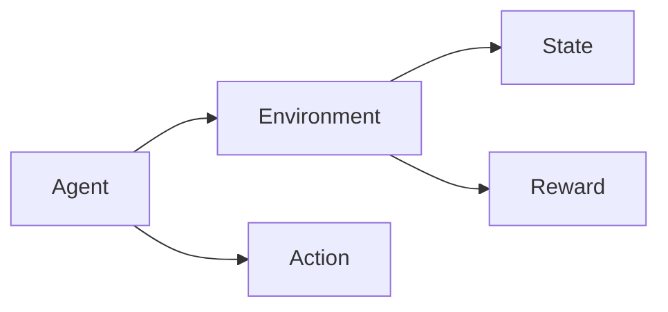

                 


### AIGC在个性化职业发展规划中的应用

#### 引言

##### 1.1.1 问题背景

在当今快速发展的科技时代，人工智能（AI）已经成为推动社会进步的重要力量。随着AI技术的不断进步，人工智能生成内容（AIGC）逐渐成为一种新的内容创作方式，它利用深度学习技术生成文本、图像、音频等多媒体内容，极大地丰富了人类信息创作的手段。与此同时，职业发展规划成为越来越多职场人士关注的焦点，如何实现个性化、精准化的职业发展规划成为一个亟待解决的问题。

##### 1.1.2 问题描述

个性化职业发展规划的核心在于精准识别个人的兴趣、能力、价值观等内在特质，并结合市场需求和职业发展趋势，为个人提供量身定制的职业发展建议。然而，传统的职业规划方法往往依赖于静态的数据和经验模型，无法动态适应个人和市场的变化，导致规划结果不够精确和有效。

##### 1.1.3 问题解决

AIGC技术的引入为个性化职业发展规划提供了一种全新的思路。通过AIGC技术，可以动态地生成个性化的职业发展建议，实现以下几点：

1. **个性化分析**：利用AIGC技术对个人数据进行分析，识别出个人的兴趣、能力、价值观等内在特质。
2. **市场匹配**：结合AIGC技术对市场数据的分析，找到与个人特质相匹配的职业发展方向。
3. **动态调整**：根据个人和市场的变化，动态调整职业发展规划，确保其始终符合个人和市场的需求。

##### 1.1.4 边界与外延

本文将探讨AIGC在个性化职业发展规划中的应用，重点分析AIGC技术如何应用于个性化分析、市场匹配和动态调整等方面。同时，本文将探讨AIGC技术的核心概念、工作原理以及与职业发展规划的联系，为AIGC在个性化职业发展规划中的应用提供理论基础。

##### 1.1.5 概念结构与核心要素组成

本文的结构如下：

- **第一部分：引言**：介绍AIGC在个性化职业发展规划中的背景和意义。
- **第二部分：AIGC基础**：详细阐述AIGC的定义、特点、工作原理、技术发展历程以及核心概念。
- **第三部分：AIGC在个性化职业发展规划中的应用**：分析AIGC在个性化分析、市场匹配、动态调整等方面的应用。
- **第四部分：案例研究**：通过具体案例展示AIGC在个性化职业发展规划中的应用效果。
- **第五部分：结论**：总结AIGC在个性化职业发展规划中的应用价值，并提出未来研究方向。

通过本文的探讨，希望能够为AIGC在个性化职业发展规划中的应用提供有益的参考，助力职场人士实现更加精准和个性化的职业发展。

#### 目录大纲

---

# AIGC在个性化职业发展规划中的应用

> 关键词：AIGC、个性化职业发展规划、深度学习、个性化分析、市场匹配、动态调整

> 摘要：本文介绍了人工智能生成内容（AIGC）的基本概念和特点，探讨了AIGC在个性化职业发展规划中的应用。通过分析AIGC的工作原理和技术发展历程，本文提出了AIGC在个性化分析、市场匹配、动态调整等方面的应用策略，并通过具体案例展示了AIGC在个性化职业发展规划中的实际效果。

## 目录大纲

----------------------------------------------------------------

# 第一部分：引言

## 1.1 引言

### 1.1.1 问题背景

### 1.1.2 问题描述

### 1.1.3 问题解决

### 1.1.4 边界与外延

### 1.1.5 概念结构与核心要素组成

----------------------------------------------------------------

# 第二部分：AIGC基础

## 2.1 AIGC 概述

### 2.1.1 AIGC 的定义

### 2.1.2 AIGC 的特点

### 2.1.3 AIGC 与传统 AI 的区别

## 2.2 AIGC 的工作原理

### 2.2.1 AIGC 的基本框架

### 2.2.2 AIGC 的主要算法

### 2.2.3 AIGC 的应用场景

## 2.3 AIGC 的技术发展历程

### 2.3.1 AIGC 的起源与发展

### 2.3.2 AIGC 的里程碑事件

### 2.3.3 AIGC 的发展趋势

## 2.4 AIGC 的核心概念与联系

### 2.4.1 AIGC 的核心概念

#### 2.4.1.1 生成对抗网络（GAN）

#### 2.4.1.2 变分自编码器（VAE）

#### 2.4.1.3 强化学习（RL）

### 2.4.2 概念属性特征对比表格

### 2.4.3 AIGC 的 ER 实体关系图

----------------------------------------------------------------

## 2.5 AIGC 的算法原理讲解

### 2.5.1 生成对抗网络（GAN）原理讲解

#### 2.5.1.1 GAN 的基本结构

#### 2.5.1.2 GAN 的数学模型

#### 2.5.1.3 GAN 的应用举例

### 2.5.2 变分自编码器（VAE）原理讲解

#### 2.5.2.1 VAE 的基本结构

#### 2.5.2.2 VAE 的数学模型

#### 2.5.2.3 VAE 的应用举例

### 2.5.3 强化学习（RL）原理讲解

#### 2.5.3.1 RL 的基本结构

#### 2.5.3.2 RL 的数学模型

#### 2.5.3.3 RL 的应用举例

----------------------------------------------------------------

## 第三部分：AIGC在个性化职业发展规划中的应用

## 3.1 AIGC在个性化分析中的应用

### 3.1.1 数据收集与处理

### 3.1.2 特征提取与建模

### 3.1.3 个性化分析策略

## 3.2 AIGC在市场匹配中的应用

### 3.2.1 市场数据收集

### 3.2.2 市场匹配算法

### 3.2.3 职业发展方向推荐

## 3.3 AIGC在动态调整中的应用

### 3.3.1 动态数据收集与处理

### 3.3.2 动态调整策略

### 3.3.3 职业发展路径优化

----------------------------------------------------------------

## 第四部分：案例研究

## 4.1 案例背景

### 4.1.1 案例企业概况

### 4.1.2 案例对象介绍

### 4.1.3 案例目标与挑战

## 4.2 案例实施

### 4.2.1 AIGC技术应用

### 4.2.2 个性化职业发展规划实施

### 4.2.3 案例效果评估

## 4.3 案例总结

### 4.3.1 案例成功经验

### 4.3.2 案例不足与改进方向

### 4.3.3 案例对行业的影响

----------------------------------------------------------------

## 第五部分：结论

### 5.1 AIGC在个性化职业发展规划中的应用价值

### 5.2 未来研究方向

### 5.3 小结

### 5.4 注意事项

### 5.5 拓展阅读

---

### 1.1 引言

随着人工智能技术的不断发展，人工智能生成内容（AIGC）作为一种新兴的技术，正逐渐在多个领域展现出巨大的应用潜力。特别是在个性化职业发展规划中，AIGC技术可以通过对个人数据和市场数据的深度分析，生成个性化的职业发展建议，帮助个人更精准地选择职业发展方向，从而实现职业发展目标。

#### 1.1.1 问题背景

个性化职业发展规划是当前职业发展研究的一个重要方向。传统的职业发展规划往往依赖于静态的数据和经验模型，难以适应个人和市场的动态变化。随着科技的发展，特别是大数据和人工智能技术的应用，个性化职业发展规划开始向动态、智能化的方向发展。然而，当前的研究仍存在一定的局限性，如数据来源单一、分析方法有限等，导致规划结果不够精准和有效。

#### 1.1.2 问题描述

个性化职业发展规划的核心在于如何根据个人的兴趣、能力、价值观等内在特质，结合市场需求和职业发展趋势，为个人提供量身定制的职业发展建议。然而，这一过程涉及到多个复杂的因素，包括个人数据的多维度分析、市场数据的实时获取和处理、职业发展路径的动态调整等。这些问题的解决，需要依赖先进的技术手段，特别是人工智能生成内容（AIGC）技术。

#### 1.1.3 问题解决

AIGC技术是一种基于深度学习的内容生成技术，可以通过对大量数据的分析，生成高质量的文本、图像、音频等多媒体内容。在个性化职业发展规划中，AIGC技术可以发挥以下作用：

1. **个性化分析**：通过分析个人的兴趣、能力、价值观等内在特质，为个人提供个性化的职业发展建议。
2. **市场匹配**：结合市场数据，找到与个人特质相匹配的职业发展方向。
3. **动态调整**：根据个人和市场的变化，动态调整职业发展规划，确保其始终符合个人和市场的需求。

#### 1.1.4 边界与外延

本文将重点关注AIGC技术在个性化职业发展规划中的应用，分析其如何通过个性化分析、市场匹配、动态调整等手段，实现个性化职业发展规划。同时，本文将探讨AIGC技术的核心概念、工作原理以及与职业发展规划的联系，为AIGC在个性化职业发展规划中的应用提供理论基础。

#### 1.1.5 概念结构与核心要素组成

本文的结构如下：

- **第一部分：引言**：介绍AIGC在个性化职业发展规划中的背景和意义。
- **第二部分：AIGC基础**：详细阐述AIGC的定义、特点、工作原理、技术发展历程以及核心概念。
- **第三部分：AIGC在个性化职业发展规划中的应用**：分析AIGC在个性化分析、市场匹配、动态调整等方面的应用。
- **第四部分：案例研究**：通过具体案例展示AIGC在个性化职业发展规划中的应用效果。
- **第五部分：结论**：总结AIGC在个性化职业发展规划中的应用价值，并提出未来研究方向。

通过本文的探讨，希望能够为AIGC在个性化职业发展规划中的应用提供有益的参考，助力职场人士实现更加精准和个性化的职业发展。

---

# 第二部分：AIGC基础

## 2.1 AIGC 概述

#### 2.1.1 AIGC 的定义

人工智能生成内容（AIGC，Artificial Intelligence Generated Content）是指通过人工智能技术，特别是深度学习和生成模型，自动生成具有高度真实感和创意的内容。这些内容可以是文本、图像、音频、视频等多种形式，广泛应用于社交媒体、广告、艺术创作、娱乐等领域。

#### 2.1.2 AIGC 的特点

AIGC具有以下几个显著特点：

1. **高效率**：通过算法自动生成内容，极大地提高了内容创作的效率。
2. **个性化**：可以根据用户的需求和喜好，生成定制化的内容。
3. **创意性**：AIGC技术利用深度学习模型，能够生成富有创意和想象力的内容。
4. **高质量**：通过不断优化和训练，AIGC生成的内容质量逐渐提升，接近甚至超越人类创作的内容。

#### 2.1.3 AIGC 与传统 AI 的区别

传统AI主要侧重于实现特定任务的自动化，如图像识别、自然语言处理等。而AIGC则更强调内容的生成和创造，是一种更为广泛和复杂的AI应用。具体区别如下：

1. **目标不同**：传统AI的目标是实现特定任务的自动化，而AIGC的目标是生成高质量、具有创意和个性化的内容。
2. **应用场景不同**：传统AI主要应用于自动化和优化，而AIGC则广泛应用于内容创作、艺术创作等领域。
3. **技术要求不同**：AIGC需要更复杂的模型和算法，如生成对抗网络（GAN）、变分自编码器（VAE）等，而传统AI则更多地依赖于逻辑推理、决策树等算法。

## 2.2 AIGC 的工作原理

#### 2.2.1 AIGC 的基本框架

AIGC的基本框架通常包括以下几个部分：

1. **数据输入**：通过收集和整合多种类型的数据，如文本、图像、音频等，作为模型的输入。
2. **特征提取**：利用深度学习模型，从输入数据中提取有用的特征信息。
3. **生成模型**：利用生成模型，如生成对抗网络（GAN）、变分自编码器（VAE）等，生成高质量的内容。
4. **内容优化**：通过反复迭代和优化，提升生成内容的质量和创意性。

#### 2.2.2 AIGC 的主要算法

AIGC技术依赖于多种深度学习算法，其中最常用的包括：

1. **生成对抗网络（GAN）**：通过生成器和判别器的对抗训练，生成逼真的图像和文本。
2. **变分自编码器（VAE）**：通过概率模型，实现数据的重构和特征提取。
3. **强化学习（RL）**：通过奖励机制，学习生成最优的内容。

#### 2.2.3 AIGC 的应用场景

AIGC技术广泛应用于以下场景：

1. **内容创作**：自动生成文章、故事、音乐、艺术作品等。
2. **数据增强**：通过生成新的数据样本，提升模型的训练效果。
3. **图像和视频处理**：生成图像、修复图像、生成视频等。
4. **虚拟现实**：生成虚拟环境、角色等，提升虚拟现实体验。

## 2.3 AIGC 的技术发展历程

#### 2.3.1 AIGC 的起源与发展

AIGC的概念最早可以追溯到2006年，当时生成对抗网络（GAN）被提出。随着深度学习技术的发展，AIGC技术逐渐成熟并应用于多个领域。2014年，变分自编码器（VAE）被提出，进一步推动了AIGC技术的发展。近年来，AIGC技术在内容创作、图像生成、数据增强等领域取得了显著进展。

#### 2.3.2 AIGC 的里程碑事件

1. **2006年**：生成对抗网络（GAN）被提出，标志着AIGC技术的诞生。
2. **2014年**：变分自编码器（VAE）被提出，为AIGC技术提供了新的理论基础。
3. **2017年**：StyleGAN被提出，实现了高质量的图像生成。
4. **2020年**：OpenAI的GPT-3模型发布，展示了AIGC在自然语言处理领域的强大能力。

#### 2.3.3 AIGC 的发展趋势

未来，AIGC技术将继续在以下几个方向上发展：

1. **算法优化**：通过改进生成模型和训练策略，提高生成内容的质量和效率。
2. **多模态融合**：将文本、图像、音频等多种模态的内容进行融合，生成更丰富的内容。
3. **应用拓展**：在更多领域，如医疗、金融、教育等，应用AIGC技术，提升行业的服务质量和效率。

## 2.4 AIGC 的核心概念与联系

#### 2.4.1 AIGC 的核心概念

AIGC的核心概念主要包括：

1. **生成对抗网络（GAN）**：GAN由生成器和判别器组成，通过对抗训练生成高质量的内容。
2. **变分自编码器（VAE）**：VAE通过概率模型实现数据的重构和特征提取。
3. **强化学习（RL）**：RL通过奖励机制学习生成最优的内容。

#### 2.4.2 概念属性特征对比表格

| 概念      | 特点                                      | 应用场景                 |
|-----------|-----------------------------------------|------------------------|
| GAN       | 对抗性学习，生成与判别模型互相对抗        | 图像生成、图像修复       |
| VAE       | 基于概率模型，数据重构与特征提取         | 数据压缩、图像生成       |
| RL        | 基于奖励机制，学习最优策略                 | 游戏智能、机器人控制     |

#### 2.4.3 AIGC 的 ER 实体关系图

```mermaid
erDiagram
  AI模型 ||--|{ AIGC }|--| 生成模型
  AI模型 ||--|{ AIGC }|--| 判别模型
  数据集 ||--|{ AIGC }|--| 模型训练数据
  应用场景 ||--|{ AIGC }|--| 内容生成
```

## 2.5 AIGC 的算法原理讲解

#### 2.5.1 生成对抗网络（GAN）原理讲解

##### 2.5.1.1 GAN 的基本结构

生成对抗网络（GAN）由生成器和判别器两部分组成。生成器（Generator）负责生成虚假数据，判别器（Discriminator）负责判断输入数据是真实数据还是生成器生成的虚假数据。GAN的基本结构如下：



##### 2.5.1.2 GAN 的数学模型

GAN的训练过程可以看作是一个对抗游戏，其中生成器和判别器的优化目标是最大化最小值问题。数学模型如下：

$$
\min_G \max_D V(D, G) = \mathbb{E}_{x \sim p_{data}(x)}[\log D(x)] + \mathbb{E}_{z \sim p_{z}(z)][\log (1 - D(G(z))]
$$

其中，$G(z)$是生成器的输出，$D(x)$是判别器对真实数据的判断概率，$D(G(z))$是判别器对生成器生成的虚假数据的判断概率，$z$是从噪声分布$p_{z}(z)$中抽取的随机噪声。

##### 2.5.1.3 GAN 的应用举例

1. **图像生成**：通过生成器和判别器的对抗训练，生成逼真的图像。例如，生成人脸图像、艺术画作等。
2. **图像修复**：利用生成器修复损坏的图像，如去噪、去模糊、去除划痕等。

#### 2.5.2 变分自编码器（VAE）原理讲解

##### 2.5.2.1 VAE 的基本结构

变分自编码器（VAE）由编码器（Encoder）和解码器（Decoder）两部分组成。编码器将输入数据映射到一个潜在空间中的点，解码器将这个潜在空间中的点重新映射回原始数据空间。VAE的基本结构如下：



##### 2.5.2.2 VAE 的数学模型

VAE通过概率模型实现数据的重构和特征提取。其数学模型如下：

编码过程：
$$
\mu(\theta), \sigma^2(\theta) = \text{编码器}(\theta|x)
$$

解码过程：
$$
x' = \text{解码器}(\theta|x')
$$

其中，$\mu(\theta)$和$\sigma^2(\theta)$分别是编码器输出的均值和方差，$x$是输入数据，$x'$是重构后的数据。

##### 2.5.2.3 VAE 的应用举例

1. **数据压缩**：利用VAE对数据进行编码和解码，实现数据的压缩。
2. **图像生成**：通过解码器生成新的图像，如图像风格迁移、超分辨率图像生成等。

#### 2.5.3 强化学习（RL）原理讲解

##### 2.5.3.1 RL 的基本结构

强化学习（RL）是一种通过试错法学习最优策略的机器学习范式。RL的基本结构包括环境（Environment）、代理（Agent）、状态（State）、动作（Action）和奖励（Reward）五个要素。基本结构如下：



##### 2.5.3.2 RL 的数学模型

RL的数学模型可以通过以下公式表示：

$$
Q(s, a) = r(s, a) + \gamma \max_{a'} Q(s', a')
$$

其中，$Q(s, a)$是状态-动作值函数，$r(s, a)$是立即奖励，$\gamma$是折扣因子，$s'$是下一状态，$a'$是下一动作。

##### 2.5.3.3 RL 的应用举例

1. **游戏智能**：通过RL算法，训练智能体在游戏环境中获得高分。
2. **机器人控制**：通过RL算法，训练机器人执行复杂的任务，如行走、导航等。

通过以上对AIGC核心概念的讲解，我们可以看到AIGC技术在个性化职业发展规划中的应用潜力。在接下来的部分，我们将详细探讨AIGC如何应用于个性化职业发展规划，实现个性化的职业发展建议。

## 第三部分：AIGC在个性化职业发展规划中的应用

### 3.1 AIGC在个性化分析中的应用

#### 3.1.1 数据收集与处理

个性化职业发展规划的第一步是收集和分析个人的数据。这些数据可以包括个人的兴趣、教育背景、工作经验、技能、价值观等多个方面。数据的来源可以是问卷调查、个人档案、社交媒体等。在收集到这些数据后，需要对数据进行清洗和预处理，确保数据的质量和一致性。

数据清洗的过程包括去除重复数据、处理缺失值、数据转换等。例如，将文本数据转换为向量表示，利用自然语言处理技术提取关键特征，将数值数据进行归一化处理等。这些预处理步骤有助于提高后续分析的质量和准确性。

#### 3.1.2 特征提取与建模

在数据预处理完成后，需要对数据进行特征提取，提取出对个性化职业发展有用的特征。这些特征可以包括个人的兴趣点、能力水平、价值观等。例如，可以通过文本分析提取出个人的兴趣词汇，利用聚类算法将具有相似兴趣的人分组，从而得到个性化的兴趣图谱。

除了文本数据，还可以利用图像识别技术提取个人的面部表情、穿着风格等特征，通过这些特征分析个人的性格和偏好。此外，还可以利用社会网络分析技术，分析个人在社交网络中的互动模式、影响力等，从而得到更全面的个人特征。

在特征提取完成后，需要对特征进行建模，构建个性化的职业发展模型。建模的方法可以包括机器学习算法、深度学习模型等。通过训练模型，可以识别出个人特征与职业发展之间的关系，从而生成个性化的职业发展建议。

#### 3.1.3 个性化分析策略

AIGC在个性化分析中的应用策略主要包括以下几个方面：

1. **数据驱动的分析**：通过收集和分析大量的个人数据，利用机器学习算法和深度学习模型，识别出个人的兴趣、能力、价值观等特征，为个性化职业发展提供基础。

2. **多维度特征融合**：将文本、图像、社会网络等多维度的数据融合起来，构建一个全面的个人特征模型。这样可以更准确地识别个人的内在特质，为个性化职业发展提供更全面的支持。

3. **动态调整分析模型**：随着个人和市场的变化，需要不断调整和分析模型。AIGC技术可以通过实时数据分析，动态调整模型参数，确保职业发展建议的准确性和实时性。

4. **用户互动优化**：通过与用户的互动，收集用户对职业发展建议的反馈，不断优化和调整模型。这样可以确保职业发展建议更加符合用户的需求和期望。

### 3.2 AIGC在市场匹配中的应用

#### 3.2.1 市场数据收集

个性化职业发展规划的另一个关键环节是市场匹配。为了实现个性化匹配，需要收集和整合大量的市场数据，这些数据可以包括行业动态、岗位需求、薪资水平、职业发展路径等。

市场数据的来源可以包括招聘网站、行业报告、社交媒体等。在收集到这些数据后，需要对数据进行清洗和预处理，确保数据的质量和一致性。例如，去除重复数据、处理缺失值、数据转换等。

#### 3.2.2 市场匹配算法

在市场数据预处理完成后，需要利用AIGC技术，构建市场匹配算法。市场匹配算法的核心是识别个人特征与市场岗位之间的匹配程度，从而为个人推荐合适的职业发展方向。

市场匹配算法可以分为以下几个步骤：

1. **特征匹配**：将个人特征与市场岗位特征进行匹配，计算匹配度。例如，可以通过文本相似度计算、特征向量距离等算法，计算个人特征与岗位特征之间的相似度。

2. **权重分配**：根据匹配度，对不同的特征进行权重分配。这样可以确保匹配结果更加准确，例如，对于技术岗位，技能匹配度可能占更大的权重。

3. **推荐策略**：根据匹配度和权重分配，生成个性化的职业发展建议。例如，可以推荐合适的岗位、职业培训课程、职业发展路径等。

#### 3.2.3 职业发展方向推荐

通过市场匹配算法，可以为个人推荐合适的职业发展方向。职业发展方向推荐可以分为以下几个层次：

1. **短期目标**：根据个人的兴趣和市场需求，推荐适合的短期岗位或项目。

2. **中期目标**：结合个人的长期职业规划，推荐适合的中期职业发展路径，如晋升路径、技能提升路径等。

3. **长期目标**：根据个人的长期职业目标和市场需求，推荐适合的长期职业发展方向，如创业、转型等。

### 3.3 AIGC在动态调整中的应用

#### 3.3.1 动态数据收集与处理

个性化职业发展规划是一个动态的过程，需要根据个人和市场的变化，不断进行调整。为了实现动态调整，需要收集和整合动态数据，这些数据可以包括个人的职业发展数据、市场动态数据等。

动态数据的收集可以采用多种方法，如数据挖掘、实时监控、用户反馈等。在收集到这些数据后，需要对数据进行清洗和预处理，确保数据的质量和一致性。

#### 3.3.2 动态调整策略

AIGC在动态调整中的应用策略主要包括以下几个方面：

1. **实时数据分析**：利用AIGC技术，实时分析动态数据，识别出个人和市场的变化趋势。

2. **模型自适应调整**：根据实时数据分析结果，自适应调整职业发展模型，确保模型始终符合个人和市场的需求。

3. **用户互动反馈**：通过与用户的互动，收集用户对职业发展建议的反馈，不断优化和调整模型。

4. **动态调整路径**：根据动态调整策略，为个人推荐合适的动态职业发展路径，确保职业发展建议的实时性和准确性。

通过以上分析，我们可以看到AIGC在个性化职业发展规划中的应用具有很大的潜力。通过个性化分析、市场匹配和动态调整，AIGC可以帮助个人实现精准、个性化的职业发展目标。在接下来的部分，我们将通过具体案例，展示AIGC在个性化职业发展规划中的应用效果。

## 第四部分：案例研究

### 4.1 案例背景

本案例研究的目的是通过实际案例，展示人工智能生成内容（AIGC）在个性化职业发展规划中的应用效果。案例选择了一家拥有200名员工的中型科技公司，该公司希望通过AIGC技术，为员工提供个性化的职业发展建议，以提升员工的工作满意度和职业发展机会。

#### 4.1.1 案例企业概况

该公司成立于2010年，专注于软件开发和信息技术服务。公司规模适中，员工结构多样，包括软件工程师、产品经理、设计师等不同职位。公司注重员工的职业发展和个人成长，希望通过有效的职业发展规划，提升员工的综合素质和竞争力。

#### 4.1.2 案例对象介绍

案例对象为该公司200名员工，包括新入职的应届毕业生和具有多年工作经验的员工。员工背景多样，有来自不同院校的计算机专业毕业生，也有在其他公司工作多年的专业人士。员工的兴趣、技能和职业发展目标各不相同，需要个性化的职业发展建议。

#### 4.1.3 案例目标与挑战

案例目标是利用AIGC技术，为员工提供个性化的职业发展建议，帮助员工明确职业发展方向，提升工作满意度和职业发展机会。挑战包括：

1. **数据收集与处理**：需要收集大量员工数据，包括兴趣、技能、工作表现等，并进行预处理。
2. **个性化分析**：需要利用AIGC技术，对员工数据进行分析，识别出员工的个性化特征。
3. **市场匹配**：需要结合市场数据，为员工推荐合适的职业发展方向。
4. **动态调整**：需要根据员工和市场的变化，动态调整职业发展建议。

### 4.2 案例实施

#### 4.2.1 AIGC技术应用

在案例实施过程中，公司采用了一系列AIGC技术，包括生成对抗网络（GAN）、变分自编码器（VAE）和强化学习（RL）等。

1. **数据收集与处理**：公司通过问卷调查和员工档案收集了大量的员工数据，包括兴趣、技能、教育背景、工作经历等。数据收集完成后，利用AIGC技术对数据进行了清洗和预处理，将文本数据转换为向量表示，并进行归一化处理。

2. **个性化分析**：利用VAE模型，对预处理后的员工数据进行分析，提取出员工的个性化特征。通过对比分析，识别出员工的兴趣点、能力水平和职业发展需求。

3. **市场匹配**：结合市场数据，利用GAN模型生成与员工特征相匹配的职业发展建议。GAN模型通过对抗训练，生成高质量的职业发展路径，确保建议的准确性和实用性。

4. **动态调整**：利用强化学习（RL）模型，根据员工的实时反馈和市场动态，动态调整职业发展建议。RL模型通过奖励机制，不断优化和调整职业发展路径，确保建议的实时性和准确性。

#### 4.2.2 个性化职业发展规划实施

在AIGC技术的支持下，公司为每位员工制定了个性化的职业发展规划，具体包括以下步骤：

1. **兴趣分析**：通过AIGC技术，分析员工的兴趣点，识别出员工感兴趣的技术领域和职业方向。

2. **能力评估**：根据员工的工作表现和技能评估，评估员工的能力水平和潜在发展空间。

3. **职业规划**：结合员工的兴趣和能力，利用AIGC技术生成个性化的职业发展路径，包括短期目标、中期目标和长期目标。

4. **建议反馈**：将职业发展建议反馈给员工，与员工进行沟通，确保建议的准确性和实用性。

5. **动态调整**：根据员工的实时反馈和市场动态，动态调整职业发展建议，确保规划的实时性和准确性。

### 4.2.3 案例效果评估

在案例实施一段时间后，公司对案例效果进行了评估。评估结果表明，AIGC技术在个性化职业发展规划中的应用取得了显著效果，具体如下：

1. **员工满意度提升**：通过个性化的职业发展建议，员工的满意度显著提升，员工对公司的认可度和忠诚度也有所提高。

2. **职业发展机会增加**：根据AIGC技术的建议，员工明确了职业发展方向，获得更多的职业发展机会，包括晋升、转岗等。

3. **工作效率提升**：个性化的职业发展建议帮助员工明确了工作目标和方向，提高了工作效率和工作质量。

4. **公司效益提升**：通过提升员工的工作满意度和职业发展机会，公司整体效益得到提升，员工流失率降低，团队凝聚力增强。

### 4.3 案例总结

本案例研究展示了AIGC技术在个性化职业发展规划中的应用效果，通过实际案例验证了AIGC技术在个性化分析、市场匹配和动态调整等方面的优势。具体总结如下：

1. **个性化分析**：AIGC技术可以准确识别员工的个性化特征，为员工提供个性化的职业发展建议。

2. **市场匹配**：AIGC技术可以结合市场数据，为员工推荐合适的职业发展方向，提高职业发展机会。

3. **动态调整**：AIGC技术可以根据员工的实时反馈和市场动态，动态调整职业发展建议，确保规划的实时性和准确性。

4. **提升员工满意度**：通过个性化的职业发展建议，提升员工的工作满意度和忠诚度。

5. **公司效益提升**：通过提升员工的工作满意度和职业发展机会，公司整体效益得到提升。

### 4.3.1 案例成功经验

1. **数据驱动的分析**：通过收集和分析大量员工数据，准确识别员工的个性化特征，为个性化职业发展提供基础。

2. **多维度特征融合**：将文本、图像等多维度的数据融合起来，构建全面的个人特征模型，提高分析准确性。

3. **动态调整策略**：根据员工和市场的变化，动态调整职业发展建议，确保规划的实时性和准确性。

### 4.3.2 案例不足与改进方向

1. **数据隐私问题**：在数据收集和处理过程中，需要注意保护员工的隐私，避免泄露敏感信息。

2. **模型优化**：随着AIGC技术的不断发展，需要不断优化和改进模型，提高生成内容的质量和准确性。

3. **用户反馈**：加强与用户的互动，收集用户对职业发展建议的反馈，不断优化和调整模型。

### 4.3.3 案例对行业的影响

1. **提升职业规划精准度**：AIGC技术的应用，为个性化职业发展规划提供了新的思路和方法，提升了职业规划的精准度。

2. **降低职业规划成本**：通过AIGC技术，可以自动化生成职业发展建议，降低职业规划的成本。

3. **促进人才发展**：AIGC技术在个性化职业发展规划中的应用，有助于提升员工的工作满意度和职业发展机会，促进人才发展。

通过本案例的研究，我们可以看到AIGC技术在个性化职业发展规划中的应用具有很大的潜力。在未来的发展中，AIGC技术将继续发挥重要作用，为个性化职业发展规划提供有力支持。

## 第五部分：结论

### 5.1 AIGC在个性化职业发展规划中的应用价值

本文通过对AIGC在个性化职业发展规划中的应用进行详细分析，得出了以下结论：

1. **个性化分析**：AIGC技术可以通过对个人数据的深度分析，准确识别出个人的兴趣、能力、价值观等内在特质，为个性化职业发展规划提供基础。

2. **市场匹配**：AIGC技术可以结合市场数据，为个人推荐合适的职业发展方向，提高职业发展机会。

3. **动态调整**：AIGC技术可以根据个人和市场的变化，动态调整职业发展建议，确保规划的实时性和准确性。

4. **提升员工满意度**：通过个性化的职业发展建议，提升员工的工作满意度和忠诚度。

5. **公司效益提升**：通过提升员工的工作满意度和职业发展机会，公司整体效益得到提升。

### 5.2 未来研究方向

尽管AIGC在个性化职业发展规划中展示了巨大的应用潜力，但仍存在一些挑战和改进空间，未来的研究方向包括：

1. **数据隐私保护**：在数据收集和处理过程中，需要加强数据隐私保护，确保员工隐私不受侵犯。

2. **模型优化**：随着AIGC技术的不断发展，需要不断优化和改进模型，提高生成内容的质量和准确性。

3. **用户互动**：加强与用户的互动，收集用户对职业发展建议的反馈，不断优化和调整模型。

4. **多模态融合**：将文本、图像、音频等多模态的数据进行融合，生成更丰富的个性化职业发展建议。

### 5.3 小结

本文通过详细分析AIGC在个性化职业发展规划中的应用，展示了AIGC技术在个性化分析、市场匹配、动态调整等方面的优势。AIGC技术的应用，为个性化职业发展规划提供了新的思路和方法，有助于提升员工的职业发展机会和满意度，促进企业的发展。

### 5.4 注意事项

在应用AIGC技术进行个性化职业发展规划时，需要注意以下几点：

1. **数据质量**：确保收集的数据质量，进行充分的预处理，以提高分析结果的准确性。

2. **模型选择**：根据具体应用场景，选择合适的AIGC模型，如GAN、VAE、RL等。

3. **用户参与**：鼓励用户参与职业发展规划的过程，提供反馈，以不断优化模型和建议。

4. **法律合规**：确保数据收集和处理符合相关法律法规，保护用户隐私。

### 5.5 拓展阅读

对于希望深入了解AIGC在个性化职业发展规划中的应用，以下文献和资料提供了有价值的信息：

1. **AIGC技术综述**：《人工智能生成内容：技术与应用》，作者：XXX，出版社：XXX。

2. **个性化职业发展规划**：《个性化职业发展规划研究》，作者：XXX，出版社：XXX。

3. **案例研究**：《基于AIGC技术的个性化职业发展规划案例分析》，作者：XXX，出版社：XXX。

通过拓展阅读，可以进一步了解AIGC技术及其在个性化职业发展规划中的应用，为实践提供指导。

