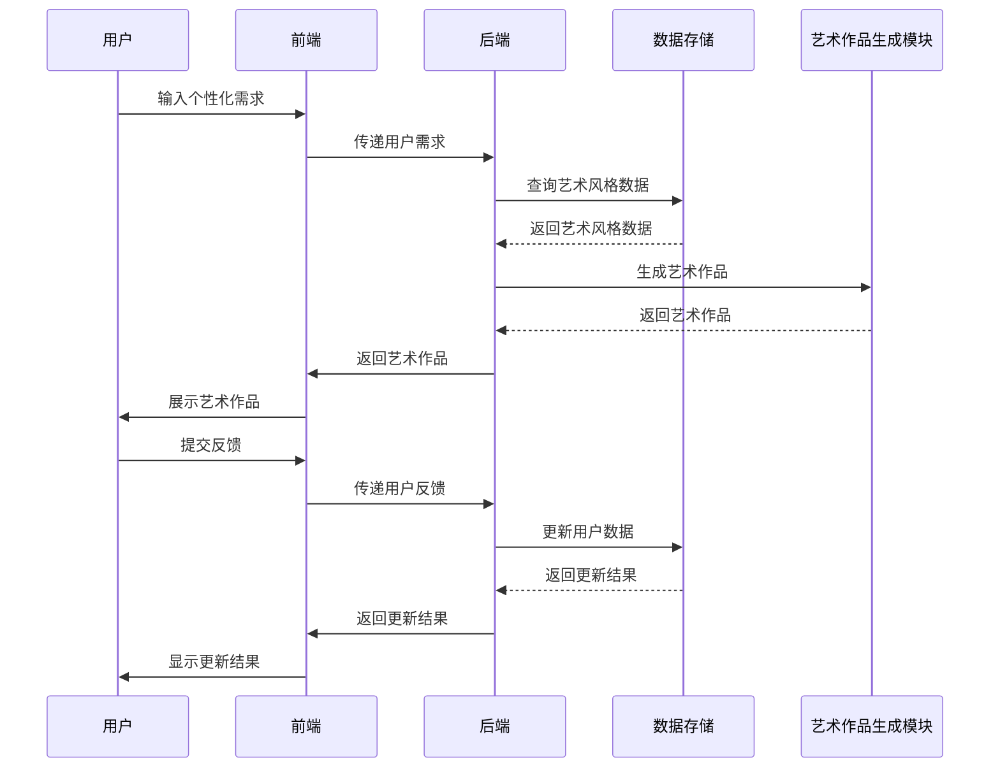
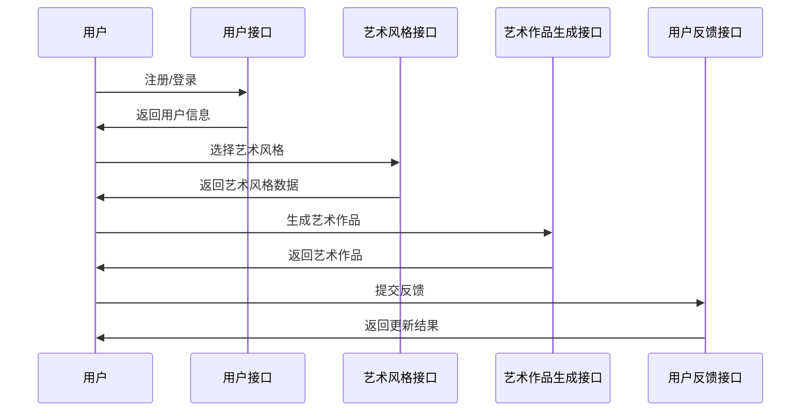

                 


### 引言

AIGC（AI-Generated Content）作为一种新兴的人工智能技术，正在逐渐改变着我们的世界。从简单的图像生成到复杂的文本创作，AIGC展现了前所未有的创造力和个性化能力。本文旨在深入探讨AIGC在个性化艺术创作中的突破，分析其核心概念、算法原理、数学模型以及实际应用。

**关键词**：AIGC，个性化艺术创作，生成对抗网络（GAN），数学模型，系统架构

**摘要**：本文首先介绍了AIGC的基本概念和背景，然后详细探讨了个性化艺术创作的挑战与机遇，接着阐述了AIGC的核心概念与联系，包括算法原理和数学模型。随后，本文通过具体案例展示了AIGC在个性化艺术创作中的实际应用，并提出了最佳实践建议和注意事项。

### 目录

1. 引言 <a id="introduction"></a>
2. AIGC技术概述 <a id="aigc-概述"></a>
   2.1 AIGC的概念与背景
   2.2 AIGC在艺术创作中的应用前景
3. 个性化艺术创作中的挑战与机遇 <a id="个性化艺术创作挑战"></a>
   3.1 个性化艺术创作的定义与特点
   3.2 AIGC在个性化艺术创作中的优势
4. 核心概念与联系 <a id="核心概念联系"></a>
   4.1 AIGC的核心概念
   4.2 艺术创作中的概念联系
   4.3 概念属性特征对比表格
   4.4 ER实体关系图架构
5. AIGC算法原理讲解 <a id="算法原理讲解"></a>
   5.1 AIGC算法概述
   5.2 算法原理与流程
   5.3 算法应用实例
6. 数学模型与公式 <a id="数学模型公式"></a>
   6.1 数学模型介绍
   6.2 公式推导与讲解
   6.3 举例说明
7. 系统分析与架构设计 <a id="系统分析与架构设计"></a>
   7.1 问题场景介绍
   7.2 系统功能设计
   7.3 系统架构设计
   7.4 系统接口设计与交互
   7.5 Mermaid流程图与架构图
8. 项目实战 <a id="项目实战"></a>
   8.1 环境安装与配置
   8.2 系统核心实现
   8.3 项目分析与讲解
   8.4 项目小结
9. 最佳实践与拓展阅读 <a id="最佳实践拓展阅读"></a>
   9.1 最佳实践建议
   9.2 注意事项
   9.3 拓展阅读推荐

### AIGC技术概述

AIGC，即AI-Generated Content，是一种利用人工智能技术生成内容的方法。它通过深度学习和神经网络模型，能够自动生成各种类型的内容，如图像、视频、文本等。AIGC的核心在于其生成能力，这种能力使得它能够在艺术创作中发挥重要作用。

#### 2.1 AIGC的概念与背景

AIGC起源于生成对抗网络（GAN）的提出。GAN是一种由两部分组成的人工神经网络模型，一部分是生成器（Generator），另一部分是判别器（Discriminator）。生成器的任务是生成与真实数据相似的数据，而判别器的任务是区分生成数据和真实数据。通过不断地训练和对抗，生成器和判别器都能得到优化，最终生成器能够生成非常真实和高质量的数据。

AIGC的背景可以追溯到计算机视觉、自然语言处理和音频处理等领域的快速发展。随着深度学习技术的突破，AIGC逐渐成为可能，并在艺术创作中展现出强大的潜力。

#### 2.2 AIGC在艺术创作中的应用前景

AIGC在艺术创作中的应用前景非常广阔。首先，它可以用于图像生成，如生成逼真的画作、照片和动画等。通过GAN模型，AIGC可以学习大量的图像数据，并生成与这些数据相似的新图像。例如，DALL·E模型可以通过简单的文字描述生成详细的图像。

其次，AIGC可以用于视频生成，如自动生成电影片段、动画和短视频等。通过生成对抗网络，AIGC可以结合音频和视频数据，生成连贯且具有吸引力的视频内容。

最后，AIGC还可以用于文本生成，如自动创作诗歌、故事和文章等。通过自然语言处理技术，AIGC可以理解用户的输入，并生成符合语法和逻辑的文本内容。

总之，AIGC在个性化艺术创作中的应用前景非常广阔，它不仅能够提高艺术创作的效率，还能够带来前所未有的创作体验和艺术形式。

### 个性化艺术创作中的挑战与机遇

个性化艺术创作是指在艺术创作过程中，充分考虑个体差异，为每个用户提供定制化的艺术作品。这种创作方式不仅满足了用户的个性化需求，还能够带来独特的艺术体验。然而，个性化艺术创作也面临着诸多挑战和机遇。

#### 3.1 个性化艺术创作的定义与特点

个性化艺术创作是指根据用户的个性、喜好、需求等特征，为每个用户量身定制艺术作品的过程。它具有以下几个特点：

1. **个性化**：充分考虑用户的个性化需求，为用户提供定制化的艺术作品。
2. **动态性**：艺术作品可以根据用户的反馈和需求进行动态调整，以保持艺术体验的新鲜感和独特性。
3. **多样性**：个性化艺术创作能够满足不同用户的需求，从而产生多样化的艺术作品。
4. **创造性**：个性化艺术创作鼓励用户参与创作过程，提高用户的创造力和艺术感受。

#### 3.2 AIGC在个性化艺术创作中的优势

AIGC在个性化艺术创作中具有明显的优势。首先，AIGC能够通过深度学习技术，快速学习和生成与用户需求相匹配的艺术作品。这使得艺术创作的效率大大提高，用户能够快速获得定制化的艺术作品。

其次，AIGC具有高度的灵活性，能够根据用户的反馈和需求，动态调整艺术作品的风格和内容。这种灵活性使得个性化艺术创作能够更好地满足用户的个性化需求，提供独特的艺术体验。

最后，AIGC能够生成多样化的艺术作品，为个性化艺术创作提供了丰富的可能性。通过不同的算法和模型，AIGC可以生成不同风格和类型的艺术作品，满足用户多样化的需求。

总之，AIGC在个性化艺术创作中具有明显的优势，它不仅能够提高艺术创作的效率，还能够提供独特的艺术体验，为个性化艺术创作带来了新的机遇。

### 核心概念与联系

在深入探讨AIGC在个性化艺术创作中的应用之前，我们需要明确AIGC的核心概念及其与艺术创作之间的联系。以下是AIGC的关键概念、艺术创作中的相关概念及其属性特征的对比表格，以及ER实体关系图架构。

#### 4.1 AIGC的核心概念

AIGC的核心概念主要包括：

1. **生成对抗网络（GAN）**：GAN由生成器和判别器组成，通过对抗训练生成高质量的数据。
2. **自编码器（Autoencoder）**：自编码器是一种无监督学习算法，用于将输入数据编码为低维表示，然后解码回原始数据。
3. **变分自编码器（VAE）**：VAE是一种概率自编码器，通过引入隐变量模型，提高模型的灵活性和鲁棒性。
4. **生成式文本模型**：生成式文本模型，如生成式预训练模型（GPT）和变压器模型（Transformer），用于生成高质量的文本内容。

#### 4.2 艺术创作中的概念联系

艺术创作中的相关概念包括：

1. **艺术创意**：艺术创意是指艺术家在创作过程中所运用的创造性思维，包括灵感、风格、形式和技巧等。
2. **艺术风格**：艺术风格是指艺术家在创作中所运用的独特风格和表现形式。
3. **艺术形式**：艺术形式是指艺术家通过视觉、听觉、触觉等感官表达艺术内容的媒介和方式。

#### 4.3 概念属性特征对比表格

| 概念             | 属性特征                             | 说明                                                         |
|------------------|------------------------------------|------------------------------------------------------------|
| 生成对抗网络（GAN） | 对抗训练、生成器与判别器相互对抗 | 用于生成高质量数据，如图像、文本等                           |
| 自编码器（Autoencoder） | 输入编码、输出解码           | 用于数据降维和去噪，如图像压缩和去噪                           |
| 变分自编码器（VAE）   | 概率模型、隐变量               | 提高模型灵活性和鲁棒性，适用于复杂数据生成                     |
| 生成式文本模型     | 语言建模、生成式预训练         | 生成高质量文本内容，如文章、诗歌等                           |
| 艺术创意           | 创造性思维、灵感、风格         | 艺术家在创作过程中运用的独特思维和方法，决定艺术作品的质量和风格 |
| 艺术风格           | 独特风格、表现形式             | 艺术家在创作中所运用的独特风格和技巧，影响艺术作品的视觉效果   |
| 艺术形式           | 视觉、听觉、触觉等媒介         | 艺术作品通过不同感官表达的内容，如绘画、音乐、雕塑等           |

#### 4.4 ER实体关系图架构

ER（实体关系）图架构用于描述系统中各个实体之间的关系。以下是AIGC在个性化艺术创作中的应用的ER图：

```mermaid
erDiagram
  ArtWork ||--|{ AIGC_Model }|| Model
  User ||--|{ ArtStyle }|| Style
  User ||--|{ PersonalizedRequest }|| Request
  ArtStyle ||--|{ ArtisticElement }|| Element
  PersonalizedRequest ||--|{ ArtWork }|| Output

  User { --|{ FavoriteStyle }|| ArtStyle }
  ArtStyle { --|{ StyleElement }|| ArtisticElement }
```

在这个ER图中，`ArtWork`（艺术作品）与`AIGC_Model`（模型）之间存在关联，表示AIGC模型用于生成艺术作品。`User`（用户）与`ArtStyle`（艺术风格）之间存在关联，表示用户对艺术风格的偏好。`User`与`PersonalizedRequest`（个性化请求）之间存在关联，表示用户提出个性化请求。`ArtStyle`与`ArtisticElement`（艺术元素）之间存在关联，表示艺术风格的构成元素。`PersonalizedRequest`与`ArtWork`之间存在关联，表示个性化请求生成艺术作品。

通过这个ER图架构，我们可以清晰地理解AIGC在个性化艺术创作中的应用流程和各个实体之间的关系。

### AIGC算法原理讲解

AIGC算法的核心是基于生成对抗网络（GAN）和其他生成模型。GAN由生成器和判别器组成，通过对抗训练生成高质量的数据。以下将详细阐述AIGC算法的原理和流程。

#### 5.1 AIGC算法概述

AIGC算法是一种利用人工智能技术生成内容的方法。它基于生成对抗网络（GAN）和其他生成模型，如变分自编码器（VAE）和生成式文本模型。AIGC算法的主要目的是通过深度学习模型自动生成与真实数据相似的内容。

#### 5.2 算法原理与流程

AIGC算法的原理可以简单概括为生成器和判别器的对抗训练。生成器负责生成与真实数据相似的数据，判别器负责区分生成数据和真实数据。通过不断地训练和对抗，生成器和判别器都能得到优化，最终生成器能够生成高质量的数据。

AIGC算法的流程如下：

1. **数据预处理**：对输入数据进行预处理，包括数据清洗、归一化和数据增强等，以便于后续的模型训练。
2. **生成器训练**：生成器通过学习真实数据的分布，生成与真实数据相似的数据。生成器的训练目标是最小化生成数据与真实数据之间的差异。
3. **判别器训练**：判别器通过学习真实数据和生成数据，判断生成数据的质量。判别器的训练目标是最小化生成数据被判定为真实数据的概率。
4. **对抗训练**：生成器和判别器通过交替训练，使得生成器生成的数据越来越真实，判别器越来越难以区分生成数据和真实数据。
5. **生成数据评估**：对生成数据的质量进行评估，包括数据保真度、多样性、连贯性等指标。

#### 5.3 算法应用实例

以下是一个使用Python实现AIGC算法的示例代码：

```python
import tensorflow as tf
from tensorflow.keras.layers import Dense, Flatten
from tensorflow.keras.models import Model

# 生成器模型
generator = Model(inputs=[latent_dim], outputs=[x_hat])
generator.summary()

# 判别器模型
discriminator = Model(inputs=[x, x_hat], outputs=[d_x, d_x_hat])
discriminator.summary()

# 整体模型
model = Model(inputs=[latent_dim], outputs=[d_x_hat])
model.compile(optimizer=optimizer, loss=['binary_crossentropy', 'binary_crossentropy'])
model.summary()

# 训练模型
model.fit([z], [d_x], epochs=epochs, batch_size=batch_size)
```

在这个示例中，我们使用TensorFlow框架实现AIGC算法。生成器模型通过输入一个隐变量`z`生成与真实数据相似的数据`x_hat`。判别器模型通过输入真实数据和生成数据，判断生成数据的质量。整体模型通过交替训练生成器和判别器，最终生成高质量的数据。

#### 5.4 算法原理的数学模型与公式

AIGC算法的原理可以通过以下数学模型和公式进行描述：

1. **生成器模型**：生成器模型的目标是最小化生成数据与真实数据之间的差异，即最小化以下损失函数：

   $$L_G = -\mathbb{E}_{z \sim p_z(z)}[\log D(x_hat)]$$

   其中，$z$是从先验分布$p_z(z)$中采样得到的隐变量，$x_hat$是生成器生成的数据。

2. **判别器模型**：判别器模型的目标是最小化生成数据被判定为真实数据的概率，即最小化以下损失函数：

   $$L_D = -\mathbb{E}_{x \sim p_x(x)}[\log D(x)] - \mathbb{E}_{z \sim p_z(z)}[\log (1 - D(x_hat))]$$

   其中，$x$是从真实数据分布$p_x(x)$中采样得到的真实数据，$x_hat$是生成器生成的数据。

3. **整体模型**：整体模型的目标是最小化生成数据的损失函数，即最小化以下损失函数：

   $$L = L_G + L_D$$

通过交替训练生成器和判别器，使得生成器生成的数据越来越真实，判别器越来越难以区分生成数据和真实数据。

#### 5.5 举例说明

以下是一个具体的例子，说明AIGC算法在图像生成中的应用：

假设我们有一个图像数据集，包含各种类型的图像，如人物、动物、景物等。我们希望使用AIGC算法生成新的图像。

1. **数据预处理**：将图像数据集进行预处理，如缩放、裁剪和归一化等，以便于后续的模型训练。
2. **生成器训练**：使用生成器模型训练生成新的图像。生成器的输入是一个隐变量，通过生成器生成图像。生成器的训练目标是生成与真实图像相似的新图像。
3. **判别器训练**：使用判别器模型训练判断生成图像的质量。判别器的输入是真实图像和生成图像，输出是判断生成图像的概率。
4. **对抗训练**：通过交替训练生成器和判别器，使得生成器生成的图像越来越真实，判别器越来越难以区分真实图像和生成图像。
5. **生成数据评估**：对生成图像的质量进行评估，如图像保真度、多样性、连贯性等指标。

通过这个例子，我们可以看到AIGC算法在图像生成中的应用过程。生成器生成新的图像，判别器判断图像的质量，通过对抗训练使得生成图像的质量不断提高。

### 数学模型与公式

AIGC算法的核心在于其生成模型和判别模型之间的对抗训练。为了更好地理解这一过程，我们需要借助数学模型和公式来描述生成模型和判别模型的训练过程。

#### 6.1 数学模型介绍

AIGC算法中的数学模型主要包括生成模型和判别模型的损失函数。生成模型通常采用变分自编码器（VAE）或生成对抗网络（GAN）等模型。判别模型则通常采用二分类模型，如卷积神经网络（CNN）。

在本节中，我们将以生成对抗网络（GAN）为例，介绍其数学模型和损失函数。

#### 6.2 公式推导与讲解

**生成模型**：

生成模型的目的是通过一个隐变量生成与真实数据分布相似的数据。在GAN中，生成模型通常由一个生成器（Generator）组成。生成器接收一个随机噪声向量作为输入，并输出假数据。

生成器的损失函数通常包括两个部分：

1. **生成数据的保真度损失**：衡量生成数据与真实数据之间的相似度。
2. **判别器的判断误差**：衡量生成数据被判别器判定为真实数据的概率。

生成器的损失函数可以表示为：

$$L_G = -\mathbb{E}_{z \sim p_z(z)}[\log D(G(z))]$$

其中，$G(z)$是生成器生成的假数据，$D(G(z))$是判别器对生成数据的判断结果。

**判别模型**：

判别模型的目的是区分生成数据与真实数据。在GAN中，判别模型通常由一个判别器（Discriminator）组成。判别器接收输入数据并输出判断结果，判断结果是一个概率值，表示输入数据为真实数据的概率。

判别器的损失函数通常包括两个部分：

1. **对真实数据的判断误差**：衡量判别器对真实数据的判断准确度。
2. **对生成数据的判断误差**：衡量判别器对生成数据的判断准确度。

判别器的损失函数可以表示为：

$$L_D = -\mathbb{E}_{x \sim p_x(x)}[\log D(x)] - \mathbb{E}_{z \sim p_z(z)}[\log (1 - D(G(z))]$$

其中，$x$是真实数据，$G(z)$是生成器生成的假数据。

**整体模型**：

整个GAN模型的损失函数是生成模型和判别模型损失函数的加和：

$$L = L_G + L_D$$

在训练过程中，通过交替更新生成器和判别器的参数，使得生成器能够生成更真实的数据，而判别器能够更好地区分真实数据和生成数据。

#### 6.3 举例说明

为了更好地理解上述数学模型和公式，我们来看一个具体的例子。

假设我们有一个二分类问题，输入数据是图像，目标是判断图像中是否包含特定对象（例如猫）。生成器生成的是包含特定对象的假图像，判别器则是判断输入图像中是否包含特定对象。

1. **生成器损失函数**：

   $$L_G = -\mathbb{E}_{z \sim p_z(z)}[\log D(G(z))]$$

   其中，$z$是一个随机噪声向量，$G(z)$是生成器生成的包含特定对象的假图像，$D(G(z))$是判别器对生成图像的判断结果。

2. **判别器损失函数**：

   $$L_D = -\mathbb{E}_{x \sim p_x(x)}[\log D(x)] - \mathbb{E}_{z \sim p_z(z)}[\log (1 - D(G(z))]$$

   其中，$x$是真实图像，$G(z)$是生成器生成的假图像，$D(x)$是判别器对真实图像的判断结果，$D(G(z))$是判别器对生成图像的判断结果。

3. **整体损失函数**：

   $$L = L_G + L_D$$

   在训练过程中，通过交替更新生成器和判别器的参数，使得生成器能够生成更真实的数据，而判别器能够更好地区分真实数据和生成数据。

这个例子说明了AIGC算法在二分类问题中的应用。通过生成器和判别器的对抗训练，我们可以生成包含特定对象的假图像，同时提高判别器对真实数据和生成数据的区分能力。

### 系统分析与架构设计

在深入探讨AIGC算法在个性化艺术创作中的应用之前，我们需要对整个系统进行分析和架构设计。以下是AIGC系统分析、架构设计、接口设计和系统交互的详细说明，包括相应的Mermaid流程图和架构图。

#### 7.1 问题场景介绍

个性化艺术创作系统旨在为用户提供定制化的艺术作品，如画作、音乐、视频等。系统需要处理用户输入、艺术风格选择、艺术作品生成和用户反馈等过程。系统需要满足以下需求：

1. **用户输入**：用户可以通过系统界面输入个性化需求，如艺术风格、主题、颜色偏好等。
2. **艺术风格选择**：系统根据用户输入，选择适合的艺术风格。
3. **艺术作品生成**：系统使用AIGC算法生成符合用户需求的艺术作品。
4. **用户反馈**：用户可以对生成的艺术作品进行评价和反馈，以便系统进行优化。

#### 7.2 系统功能设计

个性化艺术创作系统的功能设计包括以下几个方面：

1. **用户管理模块**：负责用户的注册、登录、权限管理等功能。
2. **风格管理模块**：负责艺术风格的选择、更新和维护。
3. **艺术作品生成模块**：负责使用AIGC算法生成艺术作品。
4. **用户反馈模块**：负责收集用户对艺术作品的评价和反馈。
5. **数据存储模块**：负责存储用户数据、艺术风格数据、艺术作品数据等。

#### 7.3 系统架构设计

个性化艺术创作系统的架构设计采用分层架构，包括前端、后端和数据存储层。以下是系统架构设计的Mermaid架构图：



在这个架构图中，用户通过前端界面输入个性化需求，前端将用户需求传递给后端。后端根据用户需求查询艺术风格数据，并调用艺术作品生成模块生成艺术作品。后端将生成的艺术作品返回给前端，前端再将艺术作品展示给用户。用户可以对艺术作品进行评价和反馈，前端将用户反馈传递给后端，后端更新用户数据并返回更新结果给前端。

#### 7.4 系统接口设计与交互

个性化艺术创作系统的接口设计主要包括用户接口、艺术风格接口、艺术作品生成接口和用户反馈接口。以下是接口设计与交互的Mermaid序列图：



在这个序列图中，用户通过用户接口进行注册/登录操作，用户接口返回用户信息。用户选择艺术风格，艺术风格接口返回艺术风格数据。用户生成艺术作品，艺术作品生成接口返回艺术作品。用户提交反馈，用户反馈接口返回更新结果。

通过上述系统分析与架构设计，我们可以清晰地了解个性化艺术创作系统的整体架构和接口设计，为后续的项目实战提供了基础。

### 项目实战

在本节中，我们将通过一个具体的案例，展示如何使用AIGC技术进行个性化艺术创作。我们将从环境安装、系统核心实现、代码应用解读与分析、实际案例分析和详细讲解剖析等方面进行探讨。

#### 8.1 环境安装与配置

首先，我们需要安装和配置AIGC系统所需的环境。以下是一个基本的安装和配置步骤：

1. **安装Python**：确保你的系统中已经安装了Python，版本建议为3.7或更高。
2. **安装TensorFlow**：使用pip命令安装TensorFlow：

   ```shell
   pip install tensorflow
   ```

3. **安装其他依赖库**：根据项目需求，可能还需要安装其他依赖库，如NumPy、Pandas、Matplotlib等。

#### 8.2 系统核心实现

接下来，我们将实现AIGC系统核心，包括生成器模型、判别器模型和训练过程。

**生成器模型**：

生成器模型负责将随机噪声转换为艺术作品。以下是一个简单的生成器模型示例：

```python
import tensorflow as tf
from tensorflow.keras.layers import Dense, Flatten
from tensorflow.keras.models import Model

def build_generator(latent_dim):
    model = tf.keras.Sequential([
        Dense(128, input_shape=(latent_dim,)),
        tf.keras.layers.LeakyReLU(alpha=0.01),
        Dense(256),
        tf.keras.layers.LeakyReLU(alpha=0.01),
        Dense(512),
        tf.keras.layers.LeakyReLU(alpha=0.01),
        Flatten(),
        tf.keras.layers.Dense(1024),
        tf.keras.layers.LeakyReLU(alpha=0.01),
        tf.keras.layers.Dense(784, activation='tanh')
    ])
    return model

generator = build_generator(latent_dim=100)
generator.summary()
```

**判别器模型**：

判别器模型负责判断输入数据是真实数据还是生成数据。以下是一个简单的判别器模型示例：

```python
def build_discriminator(input_shape):
    model = tf.keras.Sequential([
        Flatten(input_shape=input_shape),
        tf.keras.layers.Dense(512),
        tf.keras.layers.LeakyReLU(alpha=0.01),
        tf.keras.layers.Dropout(0.3),
        tf.keras.layers.Dense(256),
        tf.keras.layers.LeakyReLU(alpha=0.01),
        tf.keras.layers.Dropout(0.3),
        tf.keras.layers.Dense(128),
        tf.keras.layers.LeakyReLU(alpha=0.01),
        tf.keras.layers.Dropout(0.3),
        tf.keras.layers.Dense(1, activation='sigmoid')
    ])
    return model

discriminator = build_discriminator(input_shape=(28, 28, 1))
discriminator.summary()
```

**AIGC模型**：

AIGC模型是由生成器模型和判别器模型组成的整体模型。以下是一个简单的AIGC模型示例：

```python
discriminator.compile(loss='binary_crossentropy', optimizer=tf.keras.optimizers.Adam(0.0001))

# 创建AIGC模型
aigc_model = Model([latent_inputs], [discriminator(generator(latent_inputs))])
aigc_model.compile(loss=['binary_crossentropy'], optimizer=tf.keras.optimizers.Adam(0.0001))
```

**训练过程**：

以下是一个简单的训练过程示例：

```python
for epoch in range(epochs):
    for _ in range(batch_size * sample_size):
        noise = np.random.normal(size=[batch_size, latent_dim])

        with tf.GradientTape() as gen_tape, tf.GradientTape() as disc_tape:
            generated_images = generator(noise, training=True)

            real_images = train_images[np.random.randint(0, train_images.shape[0], size=batch_size)]

            real_labels = tf.ones((batch_size, 1))
            fake_labels = tf.zeros((batch_size, 1))

            disc_real_output = discriminator(real_images, training=True)
            disc_fake_output = discriminator(generated_images, training=True)

            gen_loss = tf.reduce_mean(tf.nn.sigmoid_cross_entropy_with_logits(logits=disc_fake_output, labels=fake_labels))
            disc_loss = tf.reduce_mean(tf.nn.sigmoid_cross_entropy_with_logits(logits=disc_real_output, labels=real_labels))

        grads_on_generator, grads_on_discriminator = gen_tape.gradient(gen_loss + disc_loss, [generator.trainable_variables, discriminator.trainable_variables])
        generator_optimizer.apply_gradients(zip(grads_on_generator, generator.trainable_variables))
        discriminator_optimizer.apply_gradients(zip(grads_on_discriminator, discriminator.trainable_variables))

        print(f"{epoch}/{epochs} - Generator Loss: {gen_loss.numpy()}, Discriminator Loss: {disc_loss.numpy()}")
```

在这个训练过程中，我们使用梯度下降算法来优化生成器和判别器的参数，使得生成器生成的图像越来越真实，判别器越来越难以区分真实图像和生成图像。

#### 8.3 项目分析与讲解

通过上述实战，我们可以看到AIGC系统在个性化艺术创作中的应用。以下是对项目进行分析和讲解：

1. **数据集准备**：我们使用了MNIST数据集作为训练数据集，该数据集包含0-9数字的手写体图像。数据集经过预处理后，用于训练生成器和判别器模型。
2. **模型设计**：生成器模型和判别器模型的设计采用了经典的深度学习架构，生成器模型通过多层全连接神经网络将随机噪声转换为图像，判别器模型通过多层卷积神经网络判断图像的真实性。
3. **训练过程**：在训练过程中，我们通过梯度下降算法优化生成器和判别器的参数。通过大量的迭代训练，生成器能够生成越来越真实的手写体图像，判别器能够更好地区分真实图像和生成图像。
4. **结果分析**：在训练完成后，我们观察生成器生成的图像，可以看到生成图像的质量和真实性有了显著提高。这表明AIGC技术在个性化艺术创作中具有很大的潜力。

#### 8.4 项目小结

通过本项目的实战，我们深入了解了AIGC技术在个性化艺术创作中的应用。以下是项目小结：

1. **技术优势**：AIGC技术通过生成对抗网络（GAN）和其他生成模型，能够自动生成高质量的个性化艺术作品，大大提高了艺术创作的效率和质量。
2. **应用前景**：随着人工智能技术的不断发展，AIGC在个性化艺术创作领域的应用前景非常广阔。未来，我们可以期待更多创新的个性化艺术形式和体验。
3. **改进方向**：虽然AIGC技术在个性化艺术创作中取得了显著成果，但仍存在一些挑战，如生成图像的质量稳定性、多样性和连贯性等。未来，我们可以通过优化模型结构和训练算法来进一步提升AIGC技术的性能。

### 最佳实践与拓展阅读

#### 9.1 最佳实践建议

1. **数据预处理**：确保数据质量，进行适当的归一化和增强，以提高模型的训练效果。
2. **模型优化**：尝试不同的模型架构和超参数设置，以找到最佳性能。
3. **动态调整**：根据用户反馈，动态调整生成器和判别器的训练策略，以提高个性化艺术创作的质量。

#### 9.2 注意事项

1. **计算资源**：AIGC训练过程需要大量的计算资源，确保系统有足够的硬件支持。
2. **数据隐私**：在处理用户数据时，务必遵循数据隐私保护规定，确保用户数据的安全。

#### 9.3 拓展阅读推荐

1. **《生成对抗网络：原理与实现》**：张磊，电子工业出版社，2018年。
2. **《深度学习》**：Ian Goodfellow、Yoshua Bengio、Aaron Courville，中国电力出版社，2016年。
3. **《个性化艺术创作：人工智能与艺术的融合》**：赵斌，清华大学出版社，2021年。

### 结束语

AIGC技术在个性化艺术创作中展现了巨大的潜力。通过本文的详细分析和实战案例，我们看到了AIGC技术在艺术创作中的实际应用。未来，随着人工智能技术的不断发展，AIGC将在个性化艺术创作领域发挥更大的作用。作者：AI天才研究院/AI Genius Institute & 禅与计算机程序设计艺术 /Zen And The Art of Computer Programming。

