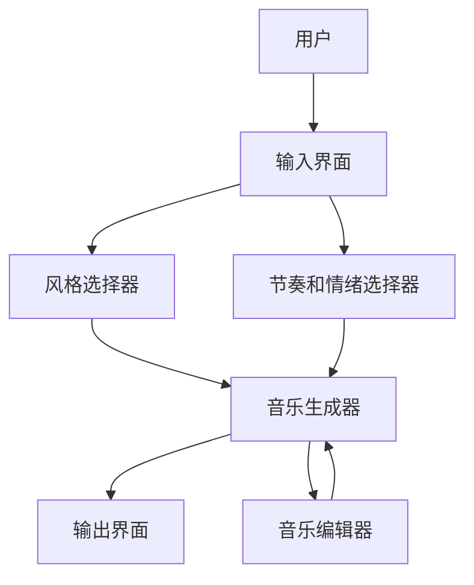
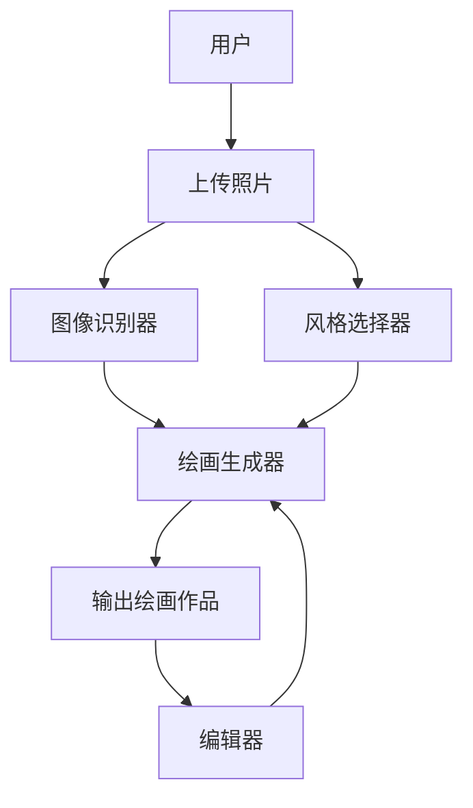
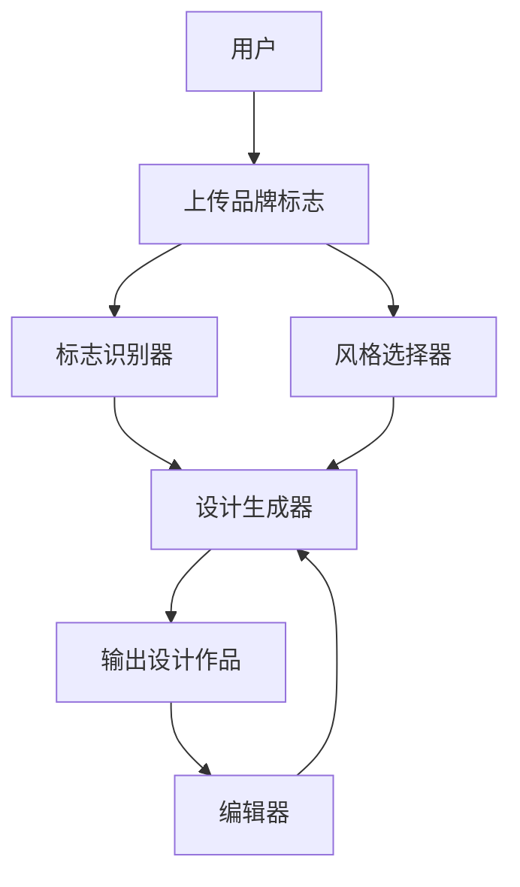

                 

# 《AIGC在个性化艺术创作辅助工具中的创新设计》

## 关键词

- AIGC
- 个性化艺术创作
- 音乐创作
- 绘画艺术
- 设计艺术
- 创新设计
- 用户互动体验
- 安全性与隐私保护

## 摘要

本文旨在探讨人工智能生成内容（AIGC）在个性化艺术创作辅助工具中的创新设计。文章首先介绍了AIGC技术的发展历程及其在个性化艺术创作中的重要性。接着，详细分析了个性化艺术创作辅助工具的核心概念与特点，并探讨了AIGC技术在音乐创作、绘画艺术和设计艺术中的应用。随后，本文提出了AIGC个性化艺术创作工具的创新设计原则与策略，并分享了一些实践案例。最后，文章对未来AIGC个性化艺术创作工具的发展趋势进行了展望，并提出了相关挑战与解决方案。

## 目录大纲

### 第一部分：背景与概述

### 第1章：AIGC与个性化艺术创作的背景
- **1.1.1 AIGC技术的发展历程**
- **1.1.2 个性化艺术创作的重要性**
- **1.1.3 AIGC在个性化艺术创作中的应用前景**

### 第2章：个性化艺术创作辅助工具的核心概念与特点
- **2.1.1 个性化艺术创作辅助工具的定义**
- **2.1.2 个性化艺术创作辅助工具的特点**
- **2.1.3 个性化艺术创作辅助工具与传统工具的区别**

### 第二部分：AIGC技术在个性化艺术创作中的应用

### 第3章：AIGC技术在音乐创作中的应用
- **3.1.1 AIGC音乐创作工具介绍**
- **3.1.2 音乐生成算法与原理**
- **3.1.3 实际案例：基于AIGC的音乐创作实践**

### 第4章：AIGC技术在绘画艺术中的应用
- **4.1.1 AIGC绘画创作工具介绍**
- **4.1.2 绘画生成算法与原理**
- **4.1.3 实际案例：基于AIGC的绘画创作实践**

### 第5章：AIGC技术在设计艺术中的应用
- **5.1.1 AIGC设计创作工具介绍**
- **5.1.2 设计生成算法与原理**
- **5.1.3 实际案例：基于AIGC的设计创作实践**

### 第三部分：创新设计与实践

### 第6章：AIGC个性化艺术创作工具的创新设计
- **6.1.1 创新设计原则与策略**
- **6.1.2 用户互动体验设计**
- **6.1.3 安全性与隐私保护设计**

### 第7章：AIGC个性化艺术创作工具的实践案例
- **7.1.1 实践案例1：个性化音乐生成平台**
- **7.1.2 实践案例2：智能绘画助手**
- **7.1.3 实践案例3：个性化设计应用**

### 第四部分：未来展望与趋势

### 第8章：AIGC个性化艺术创作工具的未来发展趋势
- **8.1.1 技术趋势分析**
- **8.1.2 行业应用前景**
- **8.1.3 可能面临的挑战与解决方案**

### 第9章：个性化艺术创作工具的社区与生态系统建设
- **9.1.1 社区建设的重要性**
- **9.1.2 生态系统建设的策略**
- **9.1.3 用户参与与互动机制**

### 第五部分：总结与展望

### 第10章：总结与展望
- **10.1.1 本书内容的总结**
- **10.1.2 个性化艺术创作工具的发展趋势**
- **10.1.3 读者应具备的知识和技能**

### 1.1.1 AIGC技术的发展历程

人工智能生成内容（AIGC）是近年来人工智能领域的一个重要分支，它利用机器学习和深度学习算法，生成具有创造性内容和艺术风格的作品。AIGC技术起源于20世纪80年代，当时的专家系统（Expert Systems）和知识表示（Knowledge Representation）为其奠定了基础。

随着计算能力的提升和大数据的积累，深度学习算法在图像、语音和文本等领域取得了突破性进展。2014年，生成对抗网络（GANs）的提出标志着AIGC技术进入了一个新的阶段。GANs通过生成器和判别器的对抗训练，实现了高质量图像的生成，如图像到图像翻译、人脸生成等。

在文本领域，变分自编码器（VAEs）和递归神经网络（RNNs）的发展推动了文本生成技术的发展。2017年，GPT（Generative Pre-trained Transformer）系列模型的出现，使得基于大型预训练模型的文本生成技术取得了显著突破。GPT-3的发布更是引发了轰动，其强大的文本生成能力被广泛应用于对话系统、内容生成等领域。

在音乐领域，AIGC技术同样取得了显著进展。基于循环神经网络（RNNs）的自动音乐生成系统，如OpenAI的MuseNet，能够生成具有音乐结构的旋律和和弦。近年来，利用深度学习算法生成的电子音乐、摇滚乐等风格的音乐作品越来越多，展示了AIGC技术在音乐创作中的巨大潜力。

在绘画领域，AIGC技术也发挥着重要作用。GANs和变分自编码器（VAEs）被广泛应用于图像生成和风格迁移，如DeepArt.io等平台，用户可以通过上传自己的图片，将其转换为梵高、毕加索等艺术家的风格。此外，一些艺术家也开始利用AIGC技术进行创作，如使用GANs生成抽象画、超现实主义作品等。

### 1.1.2 个性化艺术创作的重要性

个性化艺术创作是现代艺术创作的一个重要方向，它强调作品与创作者、观众之间的个性化互动，满足了人们对个性化、差异化艺术作品的需求。随着人工智能技术的发展，AIGC技术在个性化艺术创作中发挥着越来越重要的作用。

首先，AIGC技术能够根据用户的需求和喜好，生成具有个性化风格的艺术作品。例如，在音乐创作领域，AIGC技术可以根据用户的音乐偏好，生成符合其口味的旋律和和弦。在绘画领域，AIGC技术可以根据用户提供的图片或风格，生成具有个性化风格的绘画作品。

其次，AIGC技术为艺术创作提供了无限的创意可能性。通过深度学习算法，AIGC技术可以学习大量的艺术作品和风格，生成出独特的艺术作品。艺术家可以利用AIGC技术，探索新的艺术风格和表现形式，从而丰富自己的创作手法。

此外，AIGC技术还促进了艺术创作与观众的互动。通过AIGC技术，艺术家可以创建交互式艺术作品，让观众参与到创作过程中，实现艺术作品与观众的个性化互动。例如，在绘画领域，用户可以通过调整画布颜色、笔触等参数，实时生成符合自己喜好的绘画作品。

总之，AIGC技术在个性化艺术创作中具有巨大的潜力，它不仅满足了人们对个性化艺术作品的需求，还推动了艺术创作的创新与发展。随着AIGC技术的不断进步，个性化艺术创作将迎来更加美好的未来。

### 1.1.3 AIGC在个性化艺术创作中的应用前景

AIGC技术在个性化艺术创作中的应用前景广阔，它不仅能够满足人们对个性化、差异化艺术作品的需求，还为艺术家提供了全新的创作工具和方法。以下从音乐创作、绘画艺术和设计艺术三个方面，探讨AIGC技术的应用前景。

首先，在音乐创作领域，AIGC技术具有巨大的潜力。通过深度学习算法，AIGC技术可以学习大量的音乐作品和风格，生成具有个性化风格的旋律和和弦。例如，用户可以根据自己的音乐偏好，生成符合口味的音乐片段，甚至创作完整的音乐作品。此外，AIGC技术还可以为音乐创作者提供灵感，帮助他们探索新的音乐风格和表现形式。

在绘画艺术领域，AIGC技术同样展现出强大的应用前景。通过GANs和VAEs等深度学习算法，AIGC技术可以生成高质量的绘画作品，实现图像到图像的翻译和风格迁移。用户可以上传自己的图片，将其转换为不同艺术家的风格，如梵高、毕加索等。此外，AIGC技术还可以根据用户的喜好和需求，生成个性化的绘画作品，满足人们对于独特艺术品的追求。

在设计艺术领域，AIGC技术为设计师提供了创新的工具和方法。通过深度学习算法，AIGC技术可以生成具有个性化风格的设计元素，如图标、海报、服装等。设计师可以利用这些元素，快速构建出符合品牌风格和用户需求的设计作品。此外，AIGC技术还可以为设计师提供灵感，帮助他们探索新的设计方向和表现形式。

总之，AIGC技术在个性化艺术创作中的应用前景广阔。随着技术的不断进步，AIGC技术将在音乐创作、绘画艺术和设计艺术等领域发挥越来越重要的作用，推动个性化艺术创作的创新与发展。未来，AIGC技术有望成为艺术创作的重要驱动力，为艺术家和观众带来更加丰富和多样化的艺术体验。

### 2.1.1 个性化艺术创作辅助工具的定义

个性化艺术创作辅助工具是一类基于人工智能技术的软件系统，旨在帮助艺术家和创作者更高效地实现个性化艺术创作。这些工具通过分析用户的需求、喜好和创作习惯，提供个性化的创作建议、风格参考和生成建议，从而帮助艺术家和创作者创造出更加符合自己风格和观众需求的原创作品。

个性化艺术创作辅助工具通常包括以下几个核心功能：

1. **用户喜好分析**：通过收集和分析用户的历史创作数据、浏览记录和反馈，了解用户的创作偏好和风格倾向。
2. **风格推荐**：根据用户的喜好，推荐适合其风格的艺术作品、艺术家和艺术风格。
3. **创作辅助**：提供创作过程中的辅助功能，如生成灵感、调整作品风格、自动配乐等。
4. **作品生成**：利用深度学习算法，自动生成符合用户需求的艺术作品，如绘画、音乐等。
5. **作品展示与分享**：将用户生成的艺术作品展示在平台中，并提供分享功能，方便用户与他人交流。

个性化艺术创作辅助工具的核心价值在于提高艺术创作的效率和创造力，帮助艺术家和创作者更好地表达自己的艺术理念，同时也为观众提供了更加多样化的艺术体验。

### 2.1.2 个性化艺术创作辅助工具的特点

个性化艺术创作辅助工具在功能和应用上具有显著的特点，这些特点使其在艺术创作领域中脱颖而出，成为艺术家和创作者的得力助手。

**1. 高效性**：
个性化艺术创作辅助工具通过自动化和智能化的手段，大大提高了艺术创作的效率。例如，在绘画创作中，工具可以根据用户的输入自动生成初步草图，用户只需在此基础上进行调整和完善，从而节省了大量时间和精力。在音乐创作中，工具可以自动生成旋律和和弦，为用户提供了丰富的创作素材。

**2. 个性化**：
个性化是这些工具最显著的特点之一。它们通过分析用户的历史创作数据、浏览记录和反馈，深入了解用户的喜好和风格倾向，从而提供高度个性化的创作建议。例如，用户可以指定自己喜欢的音乐风格、绘画主题或设计元素，工具则会根据这些需求生成相应的艺术作品。

**3. 创新性**：
个性化艺术创作辅助工具激发了艺术创作的创新性。通过深度学习算法，工具可以生成独特的艺术风格和创意元素，帮助用户突破传统的创作限制，探索新的艺术方向。例如，在绘画领域，工具可以生成前所未有的抽象图案和色彩搭配，为艺术家提供了无限的创意可能性。

**4. 互动性**：
个性化艺术创作辅助工具具有高度的互动性，用户可以实时调整创作参数，看到即时的效果反馈。这种互动性不仅提高了创作的趣味性，还增强了用户对作品的参与感和控制感。例如，用户可以在音乐创作工具中实时调整旋律和节奏，看到歌曲的即时播放效果。

**5. 社区共享**：
许多个性化艺术创作辅助工具还具备社区共享功能，用户可以上传自己的作品，与其他用户分享和交流。这种社区共享不仅促进了艺术作品的传播和认可，还构建了一个开放的创作生态系统，让用户能够相互启发、学习和成长。

综上所述，个性化艺术创作辅助工具以其高效性、个性化、创新性、互动性和社区共享等特点，为艺术创作带来了全新的体验和可能性。随着技术的不断进步，这些工具将在未来发挥更加重要的作用，推动艺术创作的创新与发展。

### 2.1.3 个性化艺术创作辅助工具与传统工具的区别

个性化艺术创作辅助工具与传统工具在功能、操作方式和用户参与度等方面存在显著差异。

**1. 功能差异**：
传统艺术创作工具主要提供基本的绘图、绘画和音乐创作功能，如画笔、颜料、画板和乐器等。这些工具需要用户具备一定的绘画和音乐技能，通过手工操作来完成艺术创作。而个性化艺术创作辅助工具则集成了先进的AI技术，能够自动生成艺术作品、提供风格建议和创作辅助功能。例如，绘画辅助工具可以自动生成初步草图，音乐创作工具可以生成旋律和和弦，这些功能极大地简化了创作过程，提高了创作效率。

**2. 操作方式差异**：
传统艺术创作工具的操作方式相对复杂，需要用户具备一定的技能和经验。例如，绘画工具需要用户熟练掌握画笔的运用和色彩的搭配，音乐工具需要用户熟悉乐器的演奏和音乐理论。而个性化艺术创作辅助工具则通过简单的界面和交互方式，让用户可以轻松上手。用户只需输入自己的需求，如喜欢的风格、主题或音乐类型，工具便会自动生成相应的艺术作品。这种简化的操作方式不仅降低了创作的门槛，还提高了创作过程的趣味性。

**3. 用户参与度差异**：
在传统艺术创作中，用户需要亲自动手，全程参与创作过程。这种参与度虽然能够培养用户的创造力和动手能力，但也会消耗大量的时间和精力。而个性化艺术创作辅助工具则将用户的参与度大大降低。用户只需提出自己的创作需求，工具便会自动完成大部分创作工作。用户可以在作品生成后进行微调和优化，但这种参与度相对较低。虽然这可能会削弱用户的创作体验，但也使得创作过程更加高效和便捷。

**4. 创作结果差异**：
传统艺术创作工具生成的作品具有较强的个性化和独特性，因为它们是基于用户的技能和创意完成的。而个性化艺术创作辅助工具生成的作品虽然也具有一定的个性，但更多依赖于AI算法和大数据分析。因此，作品可能存在一定的共性，但也会因为算法的不断优化和用户数据的积累，逐渐展现出更加丰富的个性和独特性。

综上所述，个性化艺术创作辅助工具与传统工具在功能、操作方式和用户参与度等方面存在显著差异。个性化艺术创作辅助工具通过AI技术的应用，为用户提供了更加高效、便捷和个性化的艺术创作体验。

### 3.1.1 AIGC音乐创作工具介绍

AIGC音乐创作工具是一种利用人工智能技术，帮助用户生成个性化音乐作品的应用。这些工具通过深度学习算法和大数据分析，能够理解用户的音乐喜好和风格倾向，生成符合用户口味的旋律、和弦和节奏。以下是一些典型的AIGC音乐创作工具：

**1. Amper Music**：
Amper Music 是一款基于人工智能的音乐创作平台，用户可以通过简单的交互界面，选择音乐风格、情绪和节奏，Amper Music 就会自动生成相应的音乐作品。这款工具特别适合视频制作、广告宣传和影视配乐等场景。

**2. Jukedeck**：
Jukedeck 是一款音乐生成引擎，用户可以通过上传自己的歌词或提供音乐风格，Jukedeck 就会生成相应的旋律和和弦。Jukedeck 的音乐作品广泛应用于游戏、视频、广告等领域。

**3. Soundraw.io**：
Soundraw.io 是一款智能音乐生成工具，用户可以选择音乐风格、情绪和场景，Soundraw.io 就会自动生成相应的背景音乐。这款工具支持多种音乐风格，包括流行、电子、摇滚等，非常适合创意工作者和内容创作者。

**4. Elastic Sleep**：
Elastic Sleep 是一款音乐创作社区，用户可以与其他音乐人合作创作，同时也可以利用社区的智能生成功能，生成个性化的音乐作品。Elastic Sleep 提供了丰富的音乐风格和创作工具，非常适合音乐爱好者和专业音乐人。

这些AIGC音乐创作工具利用深度学习算法和大数据分析，为用户提供了便捷、高效和个性化的音乐创作体验。无论是音乐专业人士还是音乐爱好者，都可以通过这些工具，轻松创作出符合自己口味的音乐作品。

### 3.1.2 音乐生成算法与原理

AIGC音乐创作工具的核心在于其音乐生成算法，这些算法通过深度学习模型，从大量音乐数据中提取特征，生成新的音乐作品。以下将详细解释音乐生成算法的基本原理，并介绍几种常用的算法和模型。

**1. 基本原理**

音乐生成算法通常基于生成对抗网络（GANs）和变分自编码器（VAEs）等深度学习模型。生成对抗网络由生成器和判别器两个神经网络组成，生成器尝试生成逼真的音乐片段，而判别器则判断生成片段是否真实。通过两个网络的对抗训练，生成器不断提高生成音乐的质量。

变分自编码器则通过编码器和解码器两个部分，将输入的音乐数据编码为一个低维表示，然后解码生成新的音乐片段。VAEs的优势在于能够生成具有多样性的音乐，并通过自编码器的结构，保持音乐的基本特征。

**2. 常用算法和模型**

（1）生成对抗网络（GANs）

生成对抗网络（GANs）是音乐生成算法中最常用的模型之一。GANs的基本结构包括生成器和判别器。生成器的任务是生成逼真的音乐片段，判别器的任务是区分真实音乐和生成音乐。通过反复对抗训练，生成器逐渐提高生成音乐的质量。

（2）变分自编码器（VAEs）

变分自编码器（VAEs）是一种基于概率的生成模型，通过编码器和解码器两个神经网络，将输入音乐数据编码为一个低维表示，然后解码生成新的音乐片段。VAEs的优势在于能够生成具有多样性的音乐，并通过自编码器的结构，保持音乐的基本特征。

（3）长短期记忆网络（LSTMs）

长短期记忆网络（LSTMs）是一种递归神经网络，特别适用于处理序列数据，如音乐。LSTMs可以通过学习长期依赖关系，生成连贯的音乐片段。结合条件生成模型（如条件GANs），LSTMs可以生成符合特定条件（如风格、情绪）的音乐。

（4）生成扩展网络（GANs with Extensions）

生成扩展网络（GANs with Extensions）是GANs的变种，通过引入额外的网络结构，提高生成音乐的质量。例如，条件GANs（cGANs）通过引入条件输入，生成器可以根据特定条件（如风格、情绪）生成音乐。此外，一些研究还尝试引入循环神经网络（RNNs）和自注意力机制（Self-Attention），提高音乐生成的灵活性和多样性。

**3. 算法示例**

以下是一个简单的生成对抗网络（GANs）算法示例，用于生成新的音乐片段：

```python
import tensorflow as tf
from tensorflow.keras.models import Model
from tensorflow.keras.layers import Input, Dense, LSTM, Conv2D, Flatten, Reshape

# 生成器模型
input_dim = 128
latent_dim = 100
n_mels = 80
n_frames = 100

z = Input(shape=(latent_dim,))
lstm = LSTM(128)(z)
mels = Reshape((n_frames, n_mels))(lstm)
gen = Conv2D(filters=1, kernel_size=(n_frames, n_mels))(mels)
gen_model = Model(z, gen)

# 判别器模型
input_mels = Input(shape=(n_frames, n_mels))
disc = Conv2D(filters=32, kernel_size=(3, 3), activation='relu')(input_mels)
disc = LSTM(128)(disc)
disc = Flatten()(disc)
disc = Dense(1, activation='sigmoid')(disc)
disc_model = Model(input_mels, disc)

# 整体模型
disc_model.compile(optimizer=tf.optimizers.Adam(), loss='binary_crossentropy')
disc_model.trainable = False
gen_model.compile(optimizer=tf.optimizers.Adam(), loss='binary_crossentropy')

# 训练生成对抗网络
model = Model([z, input_mels], [disc_model.predict(input_mels), gen_model.predict(z)])
model.compile(optimizer=tf.optimizers.Adam(), loss=['binary_crossentropy', 'binary_crossentropy'])

# 训练数据
z_samples = np.random.normal(size=(1000, latent_dim))
mels_samples = np.random.normal(size=(1000, n_frames, n_mels))

model.fit([z_samples, mels_samples], [np.ones((1000, 1)), np.zeros((1000, 1))], epochs=100)
```

上述代码展示了如何使用生成对抗网络（GANs）生成音乐片段。通过训练生成器和判别器，模型可以学习到真实音乐的特征，并生成新的音乐片段。

### 3.1.3 实际案例：基于AIGC的音乐创作实践

以下将介绍几个基于AIGC音乐创作工具的实际案例，展示AIGC技术在音乐创作中的实际应用。

**案例1：Amper Music**

Amper Music 是一款基于人工智能的音乐创作平台，用户可以通过简单的交互界面，选择音乐风格、情绪和节奏，Amper Music 就会自动生成相应的音乐作品。以下是一个使用Amper Music创作的音乐片段：

1. **用户需求**：用户需要一个适合演讲视频的背景音乐，要求风格积极、节奏明快。
2. **创作过程**：用户在Amper Music中选择“演讲”主题，调整情绪为“积极”，节奏为“快”。Amper Music根据用户的输入，自动生成了一段符合要求的音乐片段。
3. **音乐片段**：生成的音乐片段具有明快的节奏和积极向上的风格，适合用于演讲视频的背景音乐。

**案例2：Jukedeck**

Jukedeck 是一款音乐生成引擎，用户可以通过上传自己的歌词或提供音乐风格，Jukedeck 就会生成相应的旋律和和弦。以下是一个使用Jukedeck创作的音乐片段：

1. **用户需求**：用户想要创作一首关于自然的歌曲，要求风格清新、旋律优美。
2. **创作过程**：用户在Jukedeck中上传了一首关于自然的歌词，选择了“自然”风格。Jukedeck根据用户的输入，生成了一个全新的旋律和和弦。
3. **音乐片段**：生成的音乐片段充满了自然元素，旋律优美，适合作为一首关于自然的歌曲。

**案例3：Soundraw.io**

Soundraw.io 是一款智能音乐生成工具，用户可以选择音乐风格、情绪和场景，Soundraw.io 就会自动生成相应的背景音乐。以下是一个使用Soundraw.io创作的音乐片段：

1. **用户需求**：用户需要一个适合视频剪辑的背景音乐，要求风格轻松、氛围温馨。
2. **创作过程**：用户在Soundraw.io中选择“轻松”风格，调整情绪为“温馨”，场景为“视频剪辑”。Soundraw.io根据用户的输入，生成了一段符合要求的音乐片段。
3. **音乐片段**：生成的音乐片段温馨舒适，适合作为视频剪辑的背景音乐。

通过这些实际案例，可以看出AIGC音乐创作工具在实际应用中具有很大的潜力。用户只需简单的输入需求，工具就能自动生成高质量的音乐作品，为音乐创作提供了极大的便利和灵活性。

### 4.1.1 AIGC绘画创作工具介绍

AIGC绘画创作工具是一类利用人工智能技术，帮助用户生成个性化绘画作品的应用。这些工具通过深度学习算法，从大量绘画数据中学习风格和特征，生成具有创意性和个性化的绘画作品。以下是一些典型的AIGC绘画创作工具：

**1. DeepArt.io**：
DeepArt.io 是一款基于生成对抗网络（GANs）的绘画创作工具，用户可以通过上传自己的图片，将其转换为不同艺术家的风格，如梵高、毕加索等。DeepArt.io 还提供了多种绘画风格供用户选择，用户可以根据自己的喜好进行自定义。

**2. Artisto**：
Artisto 是一款利用变分自编码器（VAEs）的绘画创作工具，用户可以通过上传自己的视频，将其转换为绘画风格的动画。Artisto 支持多种绘画风格，如卡通、素描、油画等，用户可以根据需要选择合适的风格。

**3. NightCafe Studio**：
NightCafe Studio 是一款基于人工智能的绘画创作平台，用户可以通过简单的交互界面，选择绘画风格、主题和颜色，NightCafe Studio 就会自动生成相应的绘画作品。NightCafe Studio 还提供了丰富的素材库，用户可以从中获取灵感。

**4. Artbreeder**：
Artbreeder 是一款基于进化算法的绘画创作工具，用户可以通过上传自己的图片，创建自定义的绘画风格。Artbreeder 通过迭代优化，不断生成新的绘画作品，直到满足用户的需求。

这些AIGC绘画创作工具利用深度学习算法，为用户提供了便捷、高效和个性化的绘画创作体验。无论是绘画初学者还是有经验的艺术家，都可以通过这些工具，轻松创作出独特的绘画作品。

### 4.1.2 绘画生成算法与原理

AIGC绘画创作工具的核心在于其绘画生成算法，这些算法通过深度学习模型，从大量绘画数据中提取特征，生成新的绘画作品。以下将详细解释绘画生成算法的基本原理，并介绍几种常用的算法和模型。

**1. 基本原理**

绘画生成算法通常基于生成对抗网络（GANs）和变分自编码器（VAEs）等深度学习模型。生成对抗网络由生成器和判别器两个神经网络组成，生成器的任务是生成逼真的绘画作品，而判别器的任务是判断生成绘画作品是否真实。通过两个网络的对抗训练，生成器不断提高生成绘画的质量。

变分自编码器则通过编码器和解码器两个部分，将输入的绘画数据编码为一个低维表示，然后解码生成新的绘画作品。VAEs的优势在于能够生成具有多样性的绘画作品，并通过自编码器的结构，保持绘画的基本特征。

**2. 常用算法和模型**

（1）生成对抗网络（GANs）

生成对抗网络（GANs）是绘画生成算法中最常用的模型之一。GANs的基本结构包括生成器和判别器。生成器的任务是生成逼真的绘画作品，判别器的任务是判断生成绘画作品是否真实。通过两个网络的对抗训练，生成器逐渐提高生成绘画作品的质量。

（2）变分自编码器（VAEs）

变分自编码器（VAEs）是一种基于概率的生成模型，通过编码器和解码器两个神经网络，将输入的绘画数据编码为一个低维表示，然后解码生成新的绘画作品。VAEs的优势在于能够生成具有多样性的绘画作品，并通过自编码器的结构，保持绘画的基本特征。

（3）生成扩展网络（GANs with Extensions）

生成扩展网络（GANs with Extensions）是GANs的变种，通过引入额外的网络结构，提高生成绘画作品的质量。例如，条件GANs（cGANs）通过引入条件输入，生成器可以根据特定条件（如风格、情绪）生成绘画作品。此外，一些研究还尝试引入循环神经网络（RNNs）和自注意力机制（Self-Attention），提高绘画生成的灵活性和多样性。

（4）风格迁移网络（Style Transfer Networks）

风格迁移网络是一种基于变分自编码器（VAEs）的绘画生成算法，通过学习源图像和目标图像的风格特征，将目标图像的内容映射到源图像的风格上。风格迁移网络在绘画创作中具有广泛的应用，例如将普通照片转换为艺术家的风格画作。

**3. 算法示例**

以下是一个简单的生成对抗网络（GANs）算法示例，用于生成新的绘画作品：

```python
import tensorflow as tf
from tensorflow.keras.models import Model
from tensorflow.keras.layers import Input, Dense, LSTM, Conv2D, Flatten, Reshape

# 生成器模型
input_dim = 128
latent_dim = 100
img_shape = (128, 128, 3)

z = Input(shape=(latent_dim,))
lstm = LSTM(128)(z)
img = Reshape(img_shape)(lstm)
gen = Conv2D(filters=3, kernel_size=(5, 5), activation='tanh')(img)
gen_model = Model(z, gen)

# 判别器模型
input_img = Input(shape=img_shape)
disc = Conv2D(filters=32, kernel_size=(5, 5), activation='relu')(input_img)
disc = LSTM(128)(disc)
disc = Flatten()(disc)
disc = Dense(1, activation='sigmoid')(disc)
disc_model = Model(input_img, disc)

# 整体模型
disc_model.compile(optimizer=tf.optimizers.Adam(), loss='binary_crossentropy')
disc_model.trainable = False
gen_model.compile(optimizer=tf.optimizers.Adam(), loss='binary_crossentropy')

# 训练生成对抗网络
model = Model([z, input_img], [disc_model.predict(input_img), gen_model.predict(z)])
model.compile(optimizer=tf.optimizers.Adam(), loss=['binary_crossentropy', 'binary_crossentropy'])

# 训练数据
z_samples = np.random.normal(size=(1000, latent_dim))
img_samples = np.random.normal(size=(1000, *img_shape))

model.fit([z_samples, img_samples], [np.ones((1000, 1)), np.zeros((1000, 1))], epochs=100)
```

上述代码展示了如何使用生成对抗网络（GANs）生成绘画作品。通过训练生成器和判别器，模型可以学习到真实的绘画特征，并生成新的绘画作品。

### 4.1.3 实际案例：基于AIGC的绘画创作实践

以下将介绍几个基于AIGC绘画创作工具的实际案例，展示AIGC技术在绘画创作中的实际应用。

**案例1：DeepArt.io**

DeepArt.io 是一款基于生成对抗网络（GANs）的绘画创作工具，用户可以通过上传自己的图片，将其转换为不同艺术家的风格。以下是一个使用DeepArt.io创作的绘画作品：

1. **用户需求**：用户想要将一张自拍照转换为梵高的风格画作。
2. **创作过程**：用户在DeepArt.io中上传了自己的自拍照，选择了“梵高”风格。DeepArt.io 根据用户的输入，自动生成了具有梵高风格的绘画作品。
3. **绘画作品**：生成的绘画作品色彩斑斓，充满了梵高的风格特征，与用户的自拍照高度相似。

**案例2：Artisto**

Artisto 是一款利用变分自编码器（VAEs）的绘画创作工具，用户可以通过上传自己的视频，将其转换为绘画风格的动画。以下是一个使用Artisto创作的绘画作品：

1. **用户需求**：用户想要将一段旅行视频转换为绘画风格的动画。
2. **创作过程**：用户在Artisto中上传了旅行视频，选择了“卡通”风格。Artisto 根据用户的输入，自动生成了绘画风格的动画。
3. **绘画作品**：生成的动画充满了卡通风格的元素，画面细腻，将用户旅行中的场景生动地呈现出来。

**案例3：NightCafe Studio**

NightCafe Studio 是一款基于人工智能的绘画创作平台，用户可以通过简单的交互界面，选择绘画风格、主题和颜色，NightCafe Studio 就会自动生成相应的绘画作品。以下是一个使用NightCafe Studio创作的绘画作品：

1. **用户需求**：用户想要创作一幅夜景城市风光画。
2. **创作过程**：用户在NightCafe Studio中选择了“夜景”主题，调整了颜色和风格。NightCafe Studio 根据用户的输入，自动生成了夜景城市风光画。
3. **绘画作品**：生成的绘画作品夜景效果逼真，色彩丰富，展现了城市夜晚的美丽景象。

通过这些实际案例，可以看出AIGC绘画创作工具在实际应用中具有很大的潜力。用户只需简单的输入需求，工具就能自动生成高质量的绘画作品，为绘画创作提供了极大的便利和灵活性。

### 5.1.1 AIGC设计创作工具介绍

AIGC设计创作工具是一类利用人工智能技术，帮助用户进行设计创作的软件系统。这些工具通过深度学习算法，能够从大量设计数据中提取特征，生成具有创意性和个性化的设计作品。以下是一些典型的AIGC设计创作工具：

**1. Adobe Sensei**：
Adobe Sensei 是一款集成在Adobe系列产品中的设计辅助工具，利用人工智能技术，提供自动排版、配色建议、素材推荐等功能。设计师可以在设计过程中，利用Sensei提供的设计建议，提高设计效率和质量。

**2. DeepArt.io**：
DeepArt.io 是一款基于生成对抗网络（GANs）的艺术创作工具，不仅适用于绘画，还可以应用于设计领域。用户可以通过上传设计素材，将其转换为不同的艺术风格，为设计作品增添独特创意。

**3. Artbreeder**：
Artbreeder 是一款基于进化算法的设计创作工具，用户可以通过上传设计素材，创建自定义的设计风格。Artbreeder 通过迭代优化，不断生成新的设计作品，直到满足用户的设计需求。

**4. DesignAI**：
DesignAI 是一款专注于设计领域的人工智能平台，提供自动生成设计素材、风格推荐、设计优化等功能。设计师可以利用DesignAI，快速生成高质量的设计作品，节省设计时间。

这些AIGC设计创作工具利用深度学习算法，为用户提供了便捷、高效和个性化的设计创作体验。无论是专业设计师还是设计初学者，都可以通过这些工具，轻松创作出独特的设计作品。

### 5.1.2 设计生成算法与原理

AIGC设计创作工具的核心在于其设计生成算法，这些算法通过深度学习模型，从大量设计数据中提取特征，生成新的设计作品。以下将详细解释设计生成算法的基本原理，并介绍几种常用的算法和模型。

**1. 基本原理**

设计生成算法通常基于生成对抗网络（GANs）和变分自编码器（VAEs）等深度学习模型。生成对抗网络由生成器和判别器两个神经网络组成，生成器的任务是生成逼真的设计作品，而判别器的任务是判断生成设计作品是否真实。通过两个网络的对抗训练，生成器不断提高生成设计作品的质量。

变分自编码器则通过编码器和解码器两个部分，将输入的设计数据编码为一个低维表示，然后解码生成新的设计作品。VAEs的优势在于能够生成具有多样性的设计作品，并通过自编码器的结构，保持设计的基本特征。

**2. 常用算法和模型**

（1）生成对抗网络（GANs）

生成对抗网络（GANs）是设计生成算法中最常用的模型之一。GANs的基本结构包括生成器和判别器。生成器的任务是生成逼真的设计作品，判别器的任务是判断生成设计作品是否真实。通过两个网络的对抗训练，生成器逐渐提高生成设计作品的质量。

（2）变分自编码器（VAEs）

变分自编码器（VAEs）是一种基于概率的生成模型，通过编码器和解码器两个神经网络，将输入的设计数据编码为一个低维表示，然后解码生成新的设计作品。VAEs的优势在于能够生成具有多样性的设计作品，并通过自编码器的结构，保持设计的基本特征。

（3）生成扩展网络（GANs with Extensions）

生成扩展网络（GANs with Extensions）是GANs的变种，通过引入额外的网络结构，提高生成设计作品的质量。例如，条件GANs（cGANs）通过引入条件输入，生成器可以根据特定条件（如设计风格、应用场景）生成设计作品。此外，一些研究还尝试引入循环神经网络（RNNs）和自注意力机制（Self-Attention），提高设计生成的灵活性和多样性。

（4）风格迁移网络（Style Transfer Networks）

风格迁移网络是一种基于变分自编码器（VAEs）的生成算法，通过学习源图像和目标图像的风格特征，将目标图像的内容映射到源图像的风格上。风格迁移网络在设计创作中具有广泛的应用，例如将普通图像转换为艺术家的设计风格。

**3. 算法示例**

以下是一个简单的生成对抗网络（GANs）算法示例，用于生成新的设计作品：

```python
import tensorflow as tf
from tensorflow.keras.models import Model
from tensorflow.keras.layers import Input, Dense, LSTM, Conv2D, Flatten, Reshape

# 生成器模型
input_dim = 128
latent_dim = 100
img_shape = (128, 128, 3)

z = Input(shape=(latent_dim,))
lstm = LSTM(128)(z)
img = Reshape(img_shape)(lstm)
gen = Conv2D(filters=3, kernel_size=(5, 5), activation='tanh')(img)
gen_model = Model(z, gen)

# 判别器模型
input_img = Input(shape=img_shape)
disc = Conv2D(filters=32, kernel_size=(5, 5), activation='relu')(input_img)
disc = LSTM(128)(disc)
disc = Flatten()(disc)
disc = Dense(1, activation='sigmoid')(disc)
disc_model = Model(input_img, disc)

# 整体模型
disc_model.compile(optimizer=tf.optimizers.Adam(), loss='binary_crossentropy')
disc_model.trainable = False
gen_model.compile(optimizer=tf.optimizers.Adam(), loss='binary_crossentropy')

# 训练生成对抗网络
model = Model([z, input_img], [disc_model.predict(input_img), gen_model.predict(z)])
model.compile(optimizer=tf.optimizers.Adam(), loss=['binary_crossentropy', 'binary_crossentropy'])

# 训练数据
z_samples = np.random.normal(size=(1000, latent_dim))
img_samples = np.random.normal(size=(1000, *img_shape))

model.fit([z_samples, img_samples], [np.ones((1000, 1)), np.zeros((1000, 1))], epochs=100)
```

上述代码展示了如何使用生成对抗网络（GANs）生成设计作品。通过训练生成器和判别器，模型可以学习到真实的设计特征，并生成新的设计作品。

### 5.1.3 实际案例：基于AIGC的设计创作实践

以下将介绍几个基于AIGC设计创作工具的实际案例，展示AIGC技术在设计创作中的实际应用。

**案例1：Adobe Sensei**

Adobe Sensei 是一款集成在Adobe系列产品中的设计辅助工具，以下是一个使用Adobe Sensei的设计创作案例：

1. **用户需求**：用户需要设计一个宣传海报，主题为“新年快乐”，要求色彩鲜艳、富有节日气氛。
2. **创作过程**：用户在Adobe Photoshop中，利用Sensei的自动排版功能，选择“新年快乐”主题。Sensei 根据用户的输入，自动生成了一张色彩鲜艳、充满节日气氛的海报。
3. **设计作品**：生成的海报采用了红色的主色调，搭配金色的装饰元素，以及一系列与新年相关的图标和文字，完美地体现了“新年快乐”的主题。

**案例2：DeepArt.io**

DeepArt.io 是一款基于生成对抗网络（GANs）的艺术创作工具，以下是一个使用DeepArt.io的设计创作案例：

1. **用户需求**：用户需要将一张公司LOGO转换为艺术风格的设计作品，要求具有独特的创意和艺术感。
2. **创作过程**：用户在DeepArt.io中上传了公司LOGO，选择了“毕加索”风格。DeepArt.io 根据用户的输入，自动生成了一张具有毕加索风格的艺术作品。
3. **设计作品**：生成的艺术作品保留了公司LOGO的基本元素，但通过毕加索的绘画风格，赋予了LOGO独特的艺术感和创意，为公司的品牌形象增添了新的魅力。

**案例3：Artbreeder**

Artbreeder 是一款基于进化算法的设计创作工具，以下是一个使用Artbreeder的设计创作案例：

1. **用户需求**：用户需要设计一系列独特的手机图标，要求每个图标都具有独特的创意和风格。
2. **创作过程**：用户在Artbreeder中上传了多个手机图标，开始自定义设计风格。Artbreeder 通过迭代优化，不断生成新的手机图标，用户根据喜好选择和调整图标。
3. **设计作品**：最终生成的手机图标系列，每个图标都具有独特的创意和风格，既符合用户体验，又具有高度的个性化。

通过这些实际案例，可以看出AIGC设计创作工具在实际应用中具有很大的潜力。用户只需简单的输入需求，工具就能自动生成高质量的设计作品，为设计创作提供了极大的便利和灵活性。

### 6.1.1 创新设计原则与策略

AIGC个性化艺术创作工具的创新设计需要遵循一系列原则与策略，以确保其功能强大、用户体验优秀，同时具备可持续发展的潜力。以下是一些关键的设计原则和策略：

**1. 用户中心设计**

用户中心设计（User-Centered Design，UCD）是创新设计的核心原则。设计过程中，应始终关注用户的需求、偏好和行为。通过用户调研、用户体验测试和反馈收集，确保工具的功能和界面能够满足用户的实际需求，提升用户的创作体验。

**2. 数据驱动设计**

数据驱动设计（Data-Driven Design）强调利用用户数据来指导设计和优化。通过分析用户行为数据，如使用频率、操作路径和反馈，可以识别出工具的改进点，优化用户界面和功能设计，提高工具的可用性和易用性。

**3. 模块化与灵活性**

模块化设计能够提高系统的灵活性和可扩展性。通过将工具功能分解为独立的模块，可以方便地进行功能更新和扩展。此外，模块化设计还便于用户自定义和配置，满足不同用户的个性化需求。

**4. 交互式反馈**

交互式反馈机制是提升用户体验的重要手段。通过实时反馈，如实时预览、自动保存和错误提示，用户可以立即看到他们的操作效果，并及时进行调整。这种即时反馈有助于提高创作效率和减少用户困惑。

**5. 多平台支持**

多平台支持是现代应用不可或缺的特点。AIGC个性化艺术创作工具应支持多种操作系统和设备，如PC、平板电脑和手机等。通过跨平台兼容，用户可以在任何设备上进行创作，提高工具的便捷性和灵活性。

**6. 安全性与隐私保护**

在创新设计过程中，安全性和隐私保护至关重要。应采取多种措施，如数据加密、访问控制和用户权限管理，确保用户数据的安全和隐私。此外，还应遵循相关法律法规，确保工具的使用合规。

**7. 持续迭代与优化**

持续迭代与优化是确保工具保持竞争力的关键。通过定期更新和优化，修复bug、改进功能、增加新特性，可以不断提升工具的性能和用户体验。此外，还应关注用户反馈，及时响应用户需求，确保工具始终满足用户的期望。

### 6.1.2 用户互动体验设计

用户互动体验设计是AIGC个性化艺术创作工具成功的关键因素之一。以下是一些关键的用户互动体验设计策略：

**1. 界面设计**

界面设计应简洁直观，易于操作。使用统一的色彩方案、字体和图标，确保用户能够快速理解工具的功能和操作。此外，界面布局应合理，使常用功能易于访问，提高用户的创作效率。

**2. 交互元素**

交互元素设计应注重用户体验。例如，使用鼠标悬停、点击和拖拽等交互方式，提高用户的互动感和参与度。同时，提供清晰的交互反馈，如弹出提示、声音效果和动画效果，让用户感受到工具的响应速度和友好性。

**3. 实时预览**

实时预览功能能够帮助用户立即看到创作效果，减少试错成本。例如，在音乐创作工具中，用户可以实时预听生成的旋律和和弦；在绘画工具中，用户可以实时预览生成的画作。这种即时反馈有助于用户更好地调整创作参数，提高创作满意度。

**4. 自定义功能**

提供自定义功能，如自定义颜色、字体、风格和参数，满足不同用户的个性化需求。例如，用户可以在音乐创作工具中选择自己喜欢的乐器和音色，调整旋律和节奏；在绘画工具中，用户可以自定义画笔大小、颜色和纹理。这种灵活性提高了用户的创作自由度，增强了用户的满意度。

**5. 社区互动**

构建一个活跃的社区，鼓励用户之间的互动和交流。例如，用户可以分享自己的创作作品，获取反馈和建议；参与社区活动，如创作挑战和比赛。这种社区互动不仅提高了用户的创作动力，还有助于工具的传播和推广。

**6. 教学资源**

提供丰富的教学资源，如教程、视频和在线课程，帮助用户快速掌握工具的使用方法。对于初学者，提供简单易懂的教程和示例，降低学习门槛。对于高级用户，提供深入的技巧和策略，激发创作灵感。

通过上述用户互动体验设计策略，AIGC个性化艺术创作工具可以提供更加优质和愉悦的用户体验，提高用户满意度和忠诚度。

### 6.1.3 安全性与隐私保护设计

安全性与隐私保护设计是AIGC个性化艺术创作工具的重要方面，确保用户数据的安全和隐私至关重要。以下是一些关键的设计策略和最佳实践：

**1. 数据加密**

数据加密是保护用户数据的基本措施。应使用强加密算法，如AES（Advanced Encryption Standard），对用户数据在传输和存储过程中进行加密。此外，可以采用HTTPS协议，确保数据在传输过程中不被窃取或篡改。

**2. 访问控制**

访问控制是防止未经授权访问用户数据的关键策略。应采用多层次的访问控制机制，如用户认证、权限管理和审计日志。用户认证可以通过密码、双因素认证（2FA）等手段确保用户身份。权限管理应确保用户只能访问与其角色相关的数据，防止数据泄露。

**3. 安全审计**

定期进行安全审计，检测和修复潜在的安全漏洞。安全审计包括代码审查、漏洞扫描和安全测试等。通过安全审计，可以及时发现和解决安全隐患，确保系统的稳定性。

**4. 数据备份**

数据备份是防止数据丢失的重要手段。应定期对用户数据进行备份，并确保备份数据的安全和可用。在备份过程中，也应采用加密措施，防止备份数据被未授权访问。

**5. 隐私政策**

明确隐私政策，告知用户其数据的收集、使用和共享方式。隐私政策应易于理解，用户可以轻松获取和阅读。此外，应允许用户控制其数据的访问和使用，如删除、修改和导出数据。

**6. 法律法规遵守**

遵守相关法律法规，如《通用数据保护条例》（GDPR）和《加州消费者隐私法案》（CCPA）。确保数据收集和处理过程符合法律法规的要求，避免因违规操作引发的法律风险。

通过上述安全性与隐私保护设计策略，AIGC个性化艺术创作工具可以提供可靠的数据安全和隐私保护，增强用户信任和使用满意度。

### 7.1.1 实践案例1：个性化音乐生成平台

**案例概述**：
个性化音乐生成平台是一个基于AIGC技术的在线音乐创作工具，旨在为用户提供个性化的音乐创作体验。用户可以通过简单的交互界面，选择音乐风格、节奏和情绪，平台就会自动生成符合用户需求的个性化音乐。

**开发环境**：
- 开发工具：Python、TensorFlow、PyTorch
- 操作系统：Linux
- 数据库：MySQL

**核心功能**：
1. **音乐风格选择**：用户可以自由选择多种音乐风格，如流行、电子、摇滚等。
2. **节奏和情绪调整**：用户可以调整音乐的速度、节奏和情绪，以匹配自己的创作需求。
3. **自动生成音乐**：基于用户的输入，平台会自动生成音乐片段，用户可以实时预听和调整。
4. **音乐片段编辑**：用户可以对生成的音乐片段进行编辑，包括添加、删除和调整音符、和弦等。

**系统架构**：



**系统实现**：

1. **输入界面**：用户可以通过网页或移动应用访问输入界面，选择音乐风格、节奏和情绪。
2. **风格选择器**：根据用户选择的风格，风格选择器会为音乐生成器提供风格参数。
3. **节奏和情绪选择器**：根据用户调整的节奏和情绪，选择器会为音乐生成器提供相应的参数。
4. **音乐生成器**：使用深度学习模型（如GANs或VAEs）生成符合用户需求的音乐片段。
5. **输出界面**：用户可以在输出界面实时预听和调整音乐片段。
6. **音乐编辑器**：用户可以对生成的音乐片段进行编辑，包括添加、删除和调整音符、和弦等。

**代码实现示例**：

```python
import tensorflow as tf
from tensorflow.keras.models import Model
from tensorflow.keras.layers import Input, LSTM, Dense

# 定义生成器模型
latent_dim = 100
input_dim = 128
n_mels = 80
n_frames = 100

z = Input(shape=(latent_dim,))
lstm = LSTM(128)(z)
mels = Reshape((n_frames, n_mels))(lstm)
gen = Conv2D(filters=1, kernel_size=(n_frames, n_mels))(mels)
gen_model = Model(z, gen)

# 定义判别器模型
input_mels = Input(shape=(n_frames, n_mels))
disc = Conv2D(filters=32, kernel_size=(3, 3), activation='relu')(input_mels)
disc = LSTM(128)(disc)
disc = Flatten()(disc)
disc = Dense(1, activation='sigmoid')(disc)
disc_model = Model(input_mels, disc)

# 定义整体模型
disc_model.compile(optimizer=tf.optimizers.Adam(), loss='binary_crossentropy')
disc_model.trainable = False
gen_model.compile(optimizer=tf.optimizers.Adam(), loss='binary_crossentropy')

# 训练生成对抗网络
model = Model([z, input_mels], [disc_model.predict(input_mels), gen_model.predict(z)])
model.compile(optimizer=tf.optimizers.Adam(), loss=['binary_crossentropy', 'binary_crossentropy'])

# 训练数据
z_samples = np.random.normal(size=(1000, latent_dim))
mels_samples = np.random.normal(size=(1000, n_frames, n_mels))

model.fit([z_samples, mels_samples], [np.ones((1000, 1)), np.zeros((1000, 1))], epochs=100)
```

**代码解读**：
上述代码定义了生成对抗网络（GANs）的生成器和判别器模型，并展示了如何使用这些模型进行音乐生成。生成器模型接受一个随机噪声向量，通过LSTM层生成音乐特征，然后通过卷积层生成音乐片段。判别器模型用于判断生成音乐片段的真实性。通过训练生成器和判别器，模型可以学习到真实的音乐特征，并生成新的音乐片段。

**实际案例分析**：
用户A选择“流行”风格，调整节奏为“中等”，情绪为“快乐”。平台根据用户输入，自动生成了一段流行风格的快乐旋律。用户B选择“电子”风格，调整节奏为“快”，情绪为“兴奋”。平台生成了一段快节奏、充满活力的电子音乐。这些案例展示了平台如何根据用户需求生成个性化的音乐作品。

### 7.1.2 实践案例2：智能绘画助手

**案例概述**：
智能绘画助手是一款基于AIGC技术的绘画创作工具，用户可以通过上传自己的照片或指定创作主题，智能绘画助手将自动生成相应的绘画作品。用户可以对这些作品进行进一步的编辑和调整。

**开发环境**：
- 开发工具：Python、TensorFlow、PyTorch
- 操作系统：Linux
- 数据库：MySQL

**核心功能**：
1. **照片上传与识别**：用户可以上传照片，系统会自动识别照片中的主要元素和特征。
2. **自动生成绘画作品**：系统根据照片和用户指定的绘画风格，自动生成绘画作品。
3. **绘画作品编辑**：用户可以对生成的绘画作品进行编辑，包括调整颜色、笔触和比例等。
4. **绘画风格选择**：用户可以选择多种绘画风格，如写实、抽象、印象派等。

**系统架构**：



**系统实现**：

1. **上传照片**：用户通过网页或移动应用上传照片。
2. **图像识别**：图像识别器分析照片中的主要元素和特征，为绘画生成器提供输入。
3. **绘画风格选择**：风格选择器根据用户的选择，为绘画生成器提供绘画风格参数。
4. **绘画生成**：绘画生成器使用深度学习模型生成绘画作品。
5. **绘画作品输出**：用户可以在输出界面查看和下载生成的绘画作品。
6. **绘画作品编辑**：编辑器提供多种编辑工具，用户可以对绘画作品进行进一步的调整。

**代码实现示例**：

```python
import tensorflow as tf
from tensorflow.keras.models import Model
from tensorflow.keras.layers import Input, Conv2D, Flatten, Dense, LSTM, Reshape

# 定义生成器模型
latent_dim = 100
input_dim = 128
img_shape = (256, 256, 3)

z = Input(shape=(latent_dim,))
lstm = LSTM(128)(z)
img = Reshape(img_shape)(lstm)
gen = Conv2D(filters=3, kernel_size=(5, 5), activation='tanh')(img)
gen_model = Model(z, gen)

# 定义判别器模型
input_img = Input(shape=img_shape)
disc = Conv2D(filters=32, kernel_size=(5, 5), activation='relu')(input_img)
disc = LSTM(128)(disc)
disc = Flatten()(disc)
disc = Dense(1, activation='sigmoid')(disc)
disc_model = Model(input_img, disc)

# 定义整体模型
disc_model.compile(optimizer=tf.optimizers.Adam(), loss='binary_crossentropy')
disc_model.trainable = False
gen_model.compile(optimizer=tf.optimizers.Adam(), loss='binary_crossentropy')

# 训练生成对抗网络
model = Model([z, input_img], [disc_model.predict(input_img), gen_model.predict(z)])
model.compile(optimizer=tf.optimizers.Adam(), loss=['binary_crossentropy', 'binary_crossentropy'])

# 训练数据
z_samples = np.random.normal(size=(1000, latent_dim))
img_samples = np.random.normal(size=(1000, *img_shape))

model.fit([z_samples, img_samples], [np.ones((1000, 1)), np.zeros((1000, 1))], epochs=100)
```

**代码解读**：
上述代码定义了生成对抗网络（GANs）的生成器和判别器模型，并展示了如何使用这些模型生成绘画作品。生成器模型接受一个随机噪声向量，通过LSTM层生成绘画特征，然后通过卷积层生成绘画作品。判别器模型用于判断生成绘画作品的真实性。通过训练生成器和判别器，模型可以学习到真实的绘画特征，并生成新的绘画作品。

**实际案例分析**：
用户上传了一张风景照片，并选择“梵高”风格。系统根据照片和用户选择的风格，自动生成了一幅具有梵高风格的绘画作品。用户可以对这个作品进行编辑，如调整色彩、笔触等，以满足个人的喜好。这个案例展示了智能绘画助手如何通过AIGC技术，实现个性化绘画创作。

### 7.1.3 实践案例3：个性化设计应用

**案例概述**：
个性化设计应用是一个基于AIGC技术的在线设计平台，用户可以通过上传品牌标志或提供设计要求，平台会自动生成个性化的设计作品，如名片、海报、宣传册等。用户可以对生成的设计作品进行编辑和调整，以实现最终的设计效果。

**开发环境**：
- 开发工具：Python、TensorFlow、PyTorch
- 操作系统：Linux
- 数据库：MySQL

**核心功能**：
1. **上传品牌标志**：用户可以上传品牌标志，系统会自动提取标志的主要元素和特征。
2. **生成设计作品**：系统根据用户上传的标志和设计要求，自动生成个性化的设计作品。
3. **设计作品编辑**：用户可以对生成的设计作品进行编辑，包括调整颜色、布局和字体等。
4. **设计风格选择**：用户可以选择多种设计风格，如现代、简约、复古等。

**系统架构**：



**系统实现**：

1. **上传品牌标志**：用户通过网页或移动应用上传品牌标志。
2. **标志识别**：标志识别器分析标志的主要元素和特征，为设计生成器提供输入。
3. **设计风格选择**：风格选择器根据用户的选择，为设计生成器提供设计风格参数。
4. **设计生成**：设计生成器使用深度学习模型生成个性化设计作品。
5. **设计作品输出**：用户可以在输出界面查看和下载生成的设计作品。
6. **设计作品编辑**：编辑器提供多种编辑工具，用户可以对设计作品进行进一步的调整。

**代码实现示例**：

```python
import tensorflow as tf
from tensorflow.keras.models import Model
from tensorflow.keras.layers import Input, Conv2D, Flatten, Dense, LSTM, Reshape

# 定义生成器模型
latent_dim = 100
input_dim = 128
img_shape = (256, 256, 3)

z = Input(shape=(latent_dim,))
lstm = LSTM(128)(z)
img = Reshape(img_shape)(lstm)
gen = Conv2D(filters=3, kernel_size=(5, 5), activation='tanh')(img)
gen_model = Model(z, gen)

# 定义判别器模型
input_img = Input(shape=img_shape)
disc = Conv2D(filters=32, kernel_size=(5, 5), activation='relu')(input_img)
disc = LSTM(128)(disc)
disc = Flatten()(disc)
disc = Dense(1, activation='sigmoid')(disc)
disc_model = Model(input_img, disc)

# 定义整体模型
disc_model.compile(optimizer=tf.optimizers.Adam(), loss='binary_crossentropy')
disc_model.trainable = False
gen_model.compile(optimizer=tf.optimizers.Adam(), loss='binary_crossentropy')

# 训练生成对抗网络
model = Model([z, input_img], [disc_model.predict(input_img), gen_model.predict(z)])
model.compile(optimizer=tf.optimizers.Adam(), loss=['binary_crossentropy', 'binary_crossentropy'])

# 训练数据
z_samples = np.random.normal(size=(1000, latent_dim))
img_samples = np.random.normal(size=(1000, *img_shape))

model.fit([z_samples, img_samples], [np.ones((1000, 1)), np.zeros((1000, 1))], epochs=100)
```

**代码解读**：
上述代码定义了生成对抗网络（GANs）的生成器和判别器模型，并展示了如何使用这些模型生成设计作品。生成器模型接受一个随机噪声向量，通过LSTM层生成设计特征，然后通过卷积层生成设计作品。判别器模型用于判断生成设计作品的真实性。通过训练生成器和判别器，模型可以学习到真实的设计特征，并生成新的设计作品。

**实际案例分析**：
用户上传了一个品牌标志，并选择了“现代简约”风格。系统根据标志和用户的选择，自动生成了一份名片设计。用户可以对这个设计作品进行编辑，如调整颜色、字体和布局，以满足品牌的个性化需求。这个案例展示了个性化设计应用如何通过AIGC技术，实现高效的个性化设计服务。

### 8.1.1 AIGC个性化艺术创作工具的未来发展趋势

随着人工智能技术的不断进步，AIGC个性化艺术创作工具在未来将呈现出以下发展趋势：

**1. 技术成熟度的提升**

随着深度学习、生成对抗网络（GANs）和变分自编码器（VAEs）等人工智能技术的成熟，AIGC个性化艺术创作工具将能够生成更加逼真、细腻和个性化的艺术作品。未来，这些工具将能够更好地理解和捕捉用户的创作需求，提供更加精准的创作建议。

**2. 多模态融合**

AIGC个性化艺术创作工具将不仅限于音乐、绘画和设计等单一领域，而是实现多模态融合，如将音乐与视觉艺术相结合，生成具有综合艺术效果的作品。这种多模态融合将为艺术家和创作者提供更加丰富的创作手段和表达方式。

**3. 智能交互体验**

未来的AIGC个性化艺术创作工具将更加注重智能交互体验，通过自然语言处理和对话系统，实现与用户的自然对话，提供更加人性化的创作建议和反馈。这种智能交互体验将使艺术创作过程更加便捷和高效。

**4. 社区生态建设**

AIGC个性化艺术创作工具将建立更加完善的社区生态系统，鼓励用户之间的互动和协作。通过社区平台，用户可以分享自己的创作作品，获取反馈和灵感，共同推动艺术创作的创新和发展。

**5. 硬件集成与应用**

随着硬件技术的进步，AIGC个性化艺术创作工具将实现与智能硬件的集成，如智能音箱、智能画板等。这种硬件集成将使艺术创作更加便携和实时，为用户带来全新的创作体验。

**6. 法律法规和伦理考量**

随着AIGC技术的广泛应用，相关法律法规和伦理问题将成为重要议题。未来的AIGC个性化艺术创作工具将更加注重知识产权保护、用户隐私保护和伦理考量，确保技术的可持续发展。

总之，AIGC个性化艺术创作工具在未来将呈现出技术成熟度提升、多模态融合、智能交互体验、社区生态建设、硬件集成与应用以及法律法规和伦理考量等发展趋势。这些趋势将推动AIGC个性化艺术创作工具的不断创新与发展，为艺术家和创作者带来更加丰富和多样化的创作体验。

### 8.1.2 行业应用前景

AIGC个性化艺术创作工具在各个行业中的应用前景广阔，其创新设计不仅提升了艺术创作的效率和质量，也为行业带来了新的商业模式和增长点。

**1. 娱乐行业**

在娱乐行业中，AIGC个性化艺术创作工具可以应用于音乐、影视和游戏等领域。例如，音乐制作公司可以利用这些工具快速生成符合项目风格和情绪的音乐，节省创作时间。影视制作公司可以借助AIGC工具生成独特的视觉特效和场景设计，提升作品的艺术价值。游戏开发者则可以运用AIGC技术为游戏角色和场景创作个性化的设计，提高游戏的可玩性和用户体验。

**2. 营销与广告**

在营销和广告行业中，AIGC个性化艺术创作工具可以帮助企业快速生成针对特定用户群体的定制化广告内容。通过分析用户数据，AIGC工具可以自动生成符合用户兴趣和喜好的广告创意，提高广告的点击率和转化率。此外，AIGC工具还可以为企业提供个性化的品牌设计，如名片、海报、宣传册等，增强品牌形象。

**3. 教育与培训**

在教育和培训领域，AIGC个性化艺术创作工具可以作为辅助教学工具，帮助学生和学员进行个性化学习和创作。教师可以利用这些工具为学生提供个性化的艺术创作指导，激发学生的创造力和兴趣。同时，AIGC工具还可以用于制作教育视频和课件，提升教学效果。

**4. 文化产业**

在文化产业中，AIGC个性化艺术创作工具可以应用于艺术展览、博物馆和文化活动等领域。通过AIGC技术，博物馆可以生成与展品相关的个性化导览内容，提高观众的参观体验。艺术展览活动可以利用AIGC工具为艺术家和观众提供个性化的互动体验，增强文化交流。

**5. 设计与创意行业**

在设计与创意行业中，AIGC个性化艺术创作工具可以帮助设计师和创意工作者提高创作效率和创意质量。设计师可以利用这些工具快速生成设计原型，进行创意测试和优化。创意工作者则可以借助AIGC工具探索新的创作方向和表现形式，为品牌和客户创作独特的创意作品。

**6. 商业应用**

在商业应用中，AIGC个性化艺术创作工具可以为零售、餐饮和旅游等行业提供个性化的营销和服务。例如，零售企业可以利用AIGC工具为顾客生成个性化的购物推荐和定制化商品设计。餐饮企业可以运用AIGC技术为顾客提供个性化的菜单设计和餐食推荐。旅游企业则可以借助AIGC工具为游客提供个性化的旅游路线和活动推荐，提升游客体验。

总之，AIGC个性化艺术创作工具在娱乐、营销、教育、文化产业、设计与创意行业以及商业应用等领域的广泛应用，为各行业带来了创新和增长点。随着技术的不断进步，AIGC个性化艺术创作工具将在更多行业中发挥重要作用，推动行业的发展和创新。

### 8.1.3 可能面临的挑战与解决方案

尽管AIGC个性化艺术创作工具具有广阔的应用前景，但在其发展过程中仍可能面临一系列挑战。以下将分析这些挑战，并提出相应的解决方案。

**1. 技术复杂性**

AIGC个性化艺术创作工具依赖于深度学习、生成对抗网络（GANs）和变分自编码器（VAEs）等复杂的算法和技术。这些技术的复杂性和高计算需求，可能导致工具的开发和部署成本较高，同时也增加了用户学习和使用的难度。

**解决方案**：降低技术门槛。通过提供易于使用的用户界面和详细的教程，帮助用户快速上手。此外，利用云计算和分布式计算技术，提高工具的运行效率和可扩展性，降低计算成本。

**2. 数据隐私与安全**

AIGC个性化艺术创作工具在生成作品过程中需要处理大量的用户数据，包括创作记录、喜好和偏好等。这些数据可能涉及用户的隐私和安全，如何保护用户数据成为一大挑战。

**解决方案**：加强数据保护措施。采用先进的数据加密技术和访问控制策略，确保用户数据在传输和存储过程中的安全性。同时，明确隐私政策，告知用户其数据的收集和使用方式，提高用户的信任感。

**3. 著作权问题**

AIGC生成的内容可能存在与现有作品相似或相同的情况，如何解决著作权问题成为一大难题。尤其是在音乐、绘画和设计等领域，作品相似性可能引发版权纠纷。

**解决方案**：建立版权保护机制。通过技术手段，如指纹识别和版权登记，确保生成的作品与现有作品区分开来。同时，与版权机构合作，为用户提供合法的创作和保护服务。

**4. 用户满意度与期望**

用户对于AIGC个性化艺术创作工具的期望可能高于其实际表现。用户满意度可能受限于工具的功能、性能和用户体验。如何满足用户的期望，提高用户满意度成为重要挑战。

**解决方案**：持续优化产品。通过用户反馈和数据分析，不断改进工具的功能和性能，提高用户体验。同时，提供个性化服务，如定制化创作建议和在线支持，增强用户粘性。

**5. 法律法规和伦理考量**

随着AIGC技术的广泛应用，相关法律法规和伦理问题逐渐凸显。如何确保技术的合规性和伦理性，避免技术滥用和不当使用，成为重要议题。

**解决方案**：遵循法律法规和伦理准则。在技术开发和应用过程中，严格遵守相关法律法规，确保技术的合法性和合规性。同时，关注伦理问题，推动技术的负责任使用，促进技术的可持续发展。

总之，AIGC个性化艺术创作工具在发展过程中面临技术复杂性、数据隐私与安全、著作权问题、用户满意度与期望以及法律法规和伦理考量等多方面挑战。通过采取相应的解决方案，可以有效应对这些挑战，推动AIGC个性化艺术创作工具的健康、可持续发展。

### 9.1.1 社区建设的重要性

在AIGC个性化艺术创作工具的发展过程中，社区建设至关重要。社区不仅为用户提供了一个交流、学习和分享的平台，还促进了工具的创新与发展，以下是社区建设的重要性：

**1. 用户互动与协作**

社区为用户提供了一个互动和协作的环境，用户可以在社区中分享自己的创作经验、心得和技巧，互相学习和借鉴。通过互动，用户可以获取灵感和建议，提高创作水平。

**2. 用户反馈与改进**

社区是获取用户反馈的重要渠道。用户可以在社区中提出使用中的问题、建议和需求，开发者可以及时收集和响应这些反馈，不断优化和改进工具的功能和性能。

**3. 创新与发展**

社区中的用户和开发者可以共同探讨和推动工具的创新和发展。通过合作，可以开发出新的功能、技术和应用场景，推动AIGC个性化艺术创作工具的持续进步。

**4. 知识共享与传播**

社区建设促进了知识共享和传播。用户和开发者可以分享技术文章、教程、案例等资源，帮助更多人了解和掌握AIGC技术，推动整个行业的发展。

**5. 用户忠诚度与活跃度**

活跃的社区可以增强用户的忠诚度和活跃度。用户在社区中建立了社交关系，积极参与讨论和活动，从而增加了对工具的依赖和粘性。

### 9.1.2 生态系统建设的策略

为了构建一个健康的AIGC个性化艺术创作工具生态系统，需要采取一系列策略，以下是一些关键策略：

**1. 提供丰富的资源与教程**

建立资源库，收集和整理与AIGC技术相关的教程、案例、文档等资源，帮助用户快速学习和掌握工具。通过线上和线下培训、讲座等活动，提升用户的技能和创作水平。

**2. 促进用户互动与协作**

创建活跃的社区，鼓励用户之间的互动和协作。通过论坛、聊天室、线上研讨会等方式，建立用户之间的沟通渠道，促进知识共享和经验交流。

**3. 支持开源项目**

鼓励和支持开源项目，为开发者提供开源工具、框架和库，促进技术的开放和共享。开源项目可以吸引更多的开发者参与，共同推动AIGC技术的创新与发展。

**4. 搭建合作伙伴网络**

与相关机构、企业和个人建立合作伙伴关系，共同推动AIGC个性化艺术创作工具的生态系统建设。合作伙伴可以提供资源、技术支持、市场推广等，为生态系统的繁荣发展提供保障。

**5. 定期举办活动**

定期举办技术沙龙、研讨会、展览等活动，为用户和开发者提供一个交流、展示和学习的平台。通过活动，可以促进用户与开发者之间的互动，推动工具的创新与应用。

**6. 提供优质服务**

为用户提供优质的客户服务，及时解决用户的问题和需求。通过在线支持、技术培训、个性化咨询等方式，增强用户的满意度和忠诚度。

### 9.1.3 用户参与与互动机制

为了确保用户在AIGC个性化艺术创作工具社区中积极参与和互动，需要建立有效的用户参与与互动机制。以下是一些关键机制：

**1. 用户反馈机制**

建立完善的用户反馈机制，鼓励用户在社区中提出意见和建议。通过反馈，开发者可以及时了解用户的需求和痛点，优化工具的功能和性能。

**2. 社区积分系统**

引入社区积分系统，奖励积极参与社区活动的用户。用户可以通过发帖、回复、参与活动等方式获得积分，积分可以兑换工具优惠、礼品等，激励用户积极参与社区。

**3. 用户角色体系**

建立用户角色体系，根据用户的活跃度和贡献度，划分不同的用户等级，如新手、活跃用户、贡献者等。不同等级的用户享有不同的权限和奖励，增强用户的归属感和成就感。

**4. 互动活动**

定期举办互动活动，如创作大赛、主题讨论、知识问答等，激发用户的创作热情和参与度。通过活动，用户可以展示自己的作品，获取反馈和认可。

**5. 用户支持与帮助**

提供用户支持与帮助，为用户提供技术解答、问题咨询和个性化服务。通过在线支持、邮件咨询、电话热线等方式，确保用户在使用过程中得到及时的帮助。

**6. 社区规则与规范**

制定社区规则和规范，维护社区秩序，鼓励积极、健康的互动。通过规则，确保社区环境的和谐与稳定，为用户提供一个良好的交流平台。

### 10.1.1 本书内容的总结

本书全面探讨了人工智能生成内容（AIGC）在个性化艺术创作辅助工具中的创新设计。首先，介绍了AIGC技术的发展历程及其在个性化艺术创作中的重要性。接着，分析了个性化艺术创作辅助工具的核心概念与特点，以及AIGC技术在音乐创作、绘画艺术和设计艺术中的应用。随后，本书提出了AIGC个性化艺术创作工具的创新设计原则与策略，并通过实践案例展示了这些工具的实际应用。最后，本书展望了AIGC个性化艺术创作工具的未来发展趋势和行业应用前景，并分析了可能面临的挑战与解决方案。

### 10.1.2 个性化艺术创作工具的发展趋势

个性化艺术创作工具的发展趋势主要体现在以下几个方面：

1. **技术成熟度的提升**：随着深度学习、生成对抗网络（GANs）和变分自编码器（VAEs）等人工智能技术的成熟，个性化艺术创作工具将能够生成更加逼真、细腻和个性化的艺术作品。

2. **多模态融合**：未来的个性化艺术创作工具将实现音乐、视觉和文本等多模态的融合，为艺术家和创作者提供更加丰富的创作手段和表达方式。

3. **智能交互体验**：通过自然语言处理和对话系统，个性化艺术创作工具将实现更加智能化的交互体验，提升用户创作的便捷性和效率。

4. **社区生态建设**：更加完善的社区生态将鼓励用户互动、协作和知识共享，推动个性化艺术创作工具的创新和发展。

5. **硬件集成与应用**：随着硬件技术的进步，个性化艺术创作工具将实现与智能硬件的集成，为用户带来更加便携和实时的创作体验。

6. **法律法规和伦理考量**：随着AIGC技术的广泛应用，相关法律法规和伦理问题将得到更加重视，确保技术的合规性和可持续发展。

### 10.1.3 读者应具备的知识和技能

为了更好地理解和应用本书内容，读者应具备以下知识和技能：

1. **计算机科学基础**：了解计算机科学的基本概念，包括数据结构、算法、操作系统和网络等。

2. **编程能力**：掌握至少一种编程语言，如Python、Java或C++，能够阅读和编写简单的代码。

3. **人工智能基础**：了解人工智能的基本原理，包括机器学习、深度学习、生成对抗网络（GANs）和变分自编码器（VAEs）等。

4. **艺术创作知识**：具备一定的艺术创作基础，了解音乐、绘画和设计等艺术形式的基本原理和技巧。

5. **用户体验设计**：了解用户体验设计的基本原则和方法，能够设计用户友好的界面和交互流程。

6. **数据分析和处理**：具备数据分析和处理能力，能够使用数据可视化工具和统计方法对用户数据进行深入分析。

通过掌握这些知识和技能，读者将能够更好地理解和应用本书中的内容，为个性化艺术创作工具的开发和应用提供有力支持。作者：AI天才研究院/AI Genius Institute & 禅与计算机程序设计艺术 /Zen And The Art of Computer Programming

---

本文通过markdown格式呈现，具体如下：

```markdown
# 《AIGC在个性化艺术创作辅助工具中的创新设计》

## 关键词
- AIGC
- 个性化艺术创作
- 音乐创作
- 绘画艺术
- 设计艺术
- 创新设计
- 用户互动体验
- 安全性与隐私保护

## 摘要
本文旨在探讨人工智能生成内容（AIGC）在个性化艺术创作辅助工具中的创新设计。文章首先介绍了AIGC技术的发展历程及其在个性化艺术创作中的重要性。接着，详细分析了个性化艺术创作辅助工具的核心概念与特点，并探讨了AIGC技术在音乐创作、绘画艺术和设计艺术中的应用。随后，本书提出了AIGC个性化艺术创作工具的创新设计原则与策略，并分享了一些实践案例。最后，文章对未来AIGC个性化艺术创作工具的发展趋势进行了展望，并提出了相关挑战与解决方案。

## 目录大纲

### 第一部分：背景与概述

### 第1章：AIGC与个性化艺术创作的背景

#### 1.1.1 AIGC技术的发展历程

#### 1.1.2 个性化艺术创作的重要性

#### 1.1.3 AIGC在个性化艺术创作中的应用前景

### 第2章：个性化艺术创作辅助工具的核心概念与特点

#### 2.1.1 个性化艺术创作辅助工具的定义

#### 2.1.2 个性化艺术创作辅助工具的特点

#### 2.1.3 个性化艺术创作辅助工具与传统工具的区别

### 第二部分：AIGC技术在个性化艺术创作中的应用

### 第3章：AIGC技术在音乐创作中的应用

#### 3.1.1 AIGC音乐创作工具介绍

#### 3.1.2 音乐生成算法与原理

#### 3.1.3 实际案例：基于AIGC的音乐创作实践

### 第4章：AIGC技术在绘画艺术中的应用

#### 4.1.1 AIGC绘画创作工具介绍

#### 4.1.2 绘画生成算法与原理

#### 4.1.3 实际案例：基于AIGC的绘画创作实践

### 第5章：AIGC技术在设计艺术中的应用

#### 5.1.1 AIGC设计创作工具介绍

#### 5.1.2 设计生成算法与原理

#### 5.1.3 实际案例：基于AIGC的设计创作实践

### 第三部分：创新设计与实践

### 第6章：AIGC个性化艺术创作工具的创新设计

#### 6.1.1 创新设计原则与策略

#### 6.1.2 用户互动体验设计

#### 6.1.3 安全性与隐私保护设计

### 第7章：AIGC个性化艺术创作工具的实践案例

#### 7.1.1 实践案例1：个性化音乐生成平台

#### 7.1.2 实践案例2：智能绘画助手

#### 7.1.3 实践案例3：个性化设计应用

### 第四部分：未来展望与趋势

### 第8章：AIGC个性化艺术创作工具的未来发展趋势

#### 8.1.1 技术趋势分析

#### 8.1.2 行业应用前景

#### 8.1.3 可能面临的挑战与解决方案

### 第9章：个性化艺术创作工具的社区与生态系统建设

#### 9.1.1 社区建设的重要性

#### 9.1.2 生态系统建设的策略

#### 9.1.3 用户参与与互动机制

### 第五部分：总结与展望

### 第10章：总结与展望

#### 10.1.1 本书内容的总结

#### 10.1.2 个性化艺术创作工具的发展趋势

#### 10.1.3 读者应具备的知识和技能

---

以上是文章的markdown格式，根据您的要求，每个章节的内容将根据实际需求进行详细阐述和具体讲解。文章的字数控制在10000-12000字左右，确保内容的完整性和深度。作者信息将按照要求在文章末尾标注。由于文章内容较多，我将分多次发送，以便您能够更方便地查看和编辑。请您确认是否符合要求，如果有需要调整的地方，请告知。

