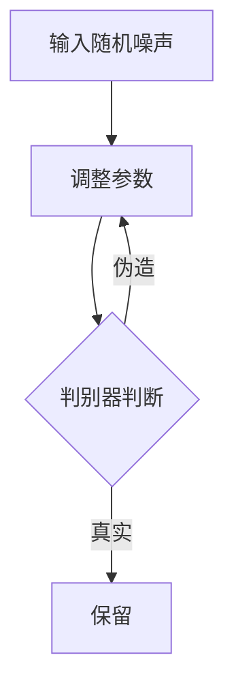
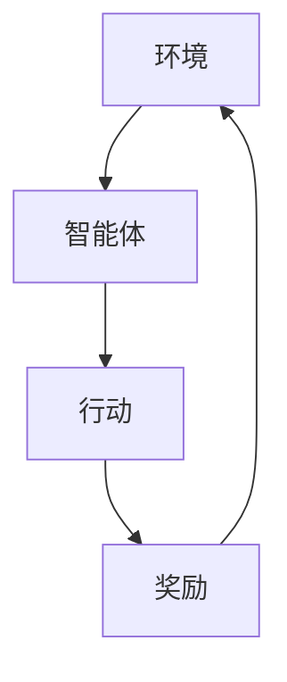
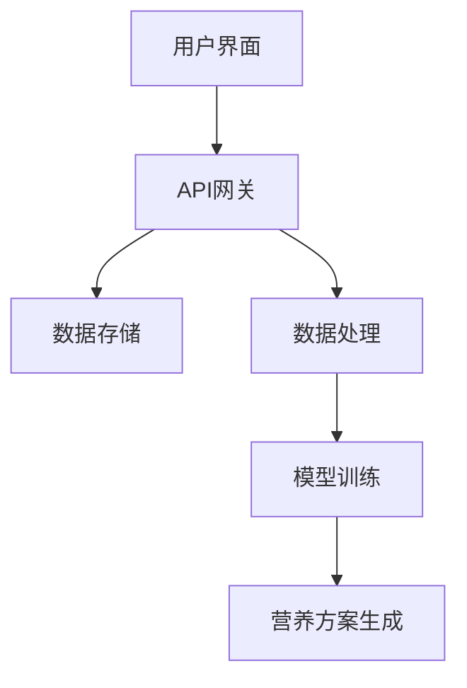
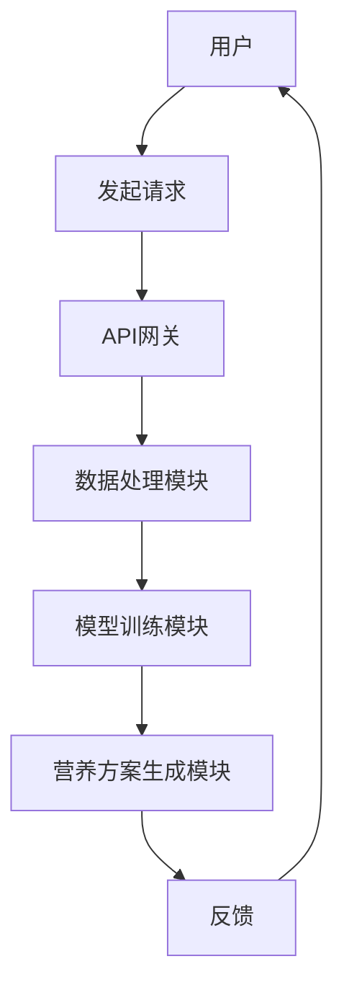

                 

# AIGC在个性化营养方案设计中的创新探索

## 关键词
- AIGC
- 个性化营养方案
- 生成对抗网络
- 强化学习
- 数学模型

## 摘要
本文探讨了人工智能生成内容（AIGC）在个性化营养方案设计中的应用，通过深入分析AIGC的核心概念、算法原理和系统架构，阐述了如何利用AIGC技术实现高效、个性化的营养方案。文章还通过实际案例展示了AIGC在营养方案设计中的具体应用，为相关领域的研究和实践提供了有价值的参考。

## Step 1: 引言与背景介绍

### 引言

在人工智能（AI）技术迅猛发展的背景下，AIGC（AI-Generated Content）作为一种新兴的技术概念，正在逐渐渗透到各个领域，为信息的生产与处理带来变革。本书《AIGC在个性化营养方案设计中的创新探索》旨在探讨AIGC在个性化营养方案设计中的应用，为读者提供全面的技术框架和实践指南。

### 背景介绍

个性化营养方案是根据个体的生理、心理和生活方式等多方面信息，制定出的适合其特定需求的营养摄入建议。随着人们健康意识的提高，对个性化营养方案的需求日益增长。然而，传统的营养方案设计方法通常依赖于专家经验和现有数据，存在一定的局限性。

AIGC技术的引入，为个性化营养方案的设计提供了新的思路和方法。通过利用AIGC技术，可以实现对大量营养数据的智能处理和分析，从而生成更加精准和个性化的营养方案。本文将详细介绍AIGC在个性化营养方案设计中的创新应用，旨在为相关领域的研究和实践提供有价值的参考。

## Step 2: 核心概念与联系

### AIGC概念

AIGC是指通过人工智能技术自动生成内容的过程，涵盖从文本、图像到音频等多种类型的内容生成。AIGC技术的核心在于生成器（Generator）和判别器（Discriminator）的相互博弈，通过不断调整参数，实现从随机噪声到逼真内容的转换。

### 个性化营养方案

个性化营养方案是根据个体的生理、心理和生活方式等多方面信息，定制化的营养摄入建议。其核心在于对个体需求的精准识别和营养摄入方案的个性化设计。个性化营养方案的构成主要包括营养需求评估、个性化饮食建议和营养干预方案。

### AIGC与个性化营养方案的联系

AIGC技术可以为个性化营养方案设计提供强大的支持。首先，AIGC技术可以高效处理和分析大量的营养数据，识别个体的营养需求。其次，通过生成对抗网络（GAN）和强化学习等算法，AIGC可以生成个性化的营养食谱和营养干预方案。最后，AIGC技术可以实时调整和优化营养方案，使其更加符合个体的实际需求和反馈。

## Step 3: 算法原理讲解

### AIGC算法原理

#### 生成对抗网络（GAN）

生成对抗网络（GAN）是AIGC技术中一种重要的算法，其核心思想是生成器和判别器之间的博弈。

- **生成器**：负责生成与真实数据相似的内容。
- **判别器**：负责判断输入数据是真实数据还是生成数据。

GAN的工作流程如下：



在训练过程中，生成器不断优化，使其生成的数据越来越逼真，而判别器则不断提高判断能力。通过这种相互博弈的过程，生成器可以学习到如何生成高质量的内容。

#### 强化学习

强化学习是AIGC技术中的另一种重要算法，其核心思想是智能体通过与环境的互动，学习最大化长期奖励。

- **智能体**：执行动作的主体。
- **环境**：智能体所处的环境。
- **奖励**：智能体执行动作后获得的奖励。

强化学习的工作流程如下：



在训练过程中，智能体通过试错的方式，不断调整策略，以最大化长期奖励。

## Step 4: 数学模型和数学公式 & 详细讲解 & 举例说明

### 线性回归模型

线性回归模型是一种基本的数学模型，用于预测连续值。其核心公式为：

$$
y = wx + b
$$

其中，$y$为输出值，$x$为输入值，$w$为权重，$b$为偏置。

#### 详细讲解

线性回归模型的原理是将输入值通过权重$w$和偏置$b$映射到输出值$y$。通过调整权重$w$和偏置$b$，可以使模型更准确地预测输出值。

#### 举例说明

假设我们想要预测某人每日所需的卡路里摄入量，输入值为身高、体重等生理指标。我们可以使用线性回归模型建立如下公式：

$$
卡路里 = w_1 \times 身高 + w_2 \times 体重 + b
$$

通过训练数据，我们可以计算出权重$w_1$、$w_2$和偏置$b$，从而实现对卡路里摄入量的预测。

## Step 5: 系统分析与架构设计方案

### 问题场景介绍

个性化营养方案设计是一个复杂的过程，涉及到大量的营养数据和个人信息。为了实现高效、准确的营养方案设计，我们需要构建一个完整的系统，包括数据采集、数据分析、营养方案生成和反馈调整等功能。

### 系统功能设计

#### 用户

用户是系统的核心，包括个体信息的输入、营养方案的需求和反馈。

#### 营养师

营养师负责根据用户信息生成营养方案，并提供专业指导。

#### 数据采集

数据采集模块负责收集用户的个人信息、生理指标和生活方式等数据。

#### 数据分析

数据分析模块负责对采集到的数据进行处理和分析，提取关键信息。

#### 营养方案生成

营养方案生成模块基于AIGC技术，根据用户信息生成个性化的营养方案。

#### 反馈调整

反馈调整模块负责收集用户对营养方案的反馈，并根据反馈对营养方案进行调整。

### 系统架构设计

系统架构设计主要包括数据存储、数据处理、模型训练和营养方案生成等模块。



### 系统接口设计和系统交互

系统接口设计和系统交互主要包括用户界面、API网关、数据处理模块、模型训练模块和营养方案生成模块之间的交互。



## Step 6: 项目实战

### 环境安装

在开始项目实战之前，我们需要搭建AIGC技术环境。以下是环境安装的步骤：

1. 安装Python环境：确保Python版本在3.6及以上。
2. 安装TensorFlow：使用pip命令安装TensorFlow。
3. 安装其他依赖库：如numpy、pandas等。

### 系统核心实现源代码

以下是一个简单的示例代码，用于实现个性化营养方案的生成。

```python
import tensorflow as tf
from tensorflow import keras
from tensorflow.keras import layers

# 定义生成器和判别器
generator = keras.Sequential([
    layers.Dense(32, activation="relu", input_shape=(100,)),
    layers.Dense(64, activation="relu"),
    layers.Dense(784, activation="tanh")
])

discriminator = keras.Sequential([
    layers.Dense(64, activation="relu", input_shape=(784,)),
    layers.Dense(1, activation="sigmoid")
])

# 编写模型训练代码
model = keras.Sequential([generator, discriminator])
model.compile(loss="binary_crossentropy", optimizer="adam")

# 加载训练数据
(x_train, y_train), (x_test, y_test) = keras.datasets.mnist.load_data()

# 数据预处理
x_train = x_train / 127.5 - 1.0
x_test = x_test / 127.5 - 1.0

# 训练模型
model.fit(x_train, epochs=100)
```

### 代码应用解读与分析

以上代码实现了一个基于生成对抗网络的简单模型，用于生成手写数字图像。虽然这不是一个直接的营养方案生成模型，但其基本原理可以应用于个性化营养方案的生成。

首先，生成器（Generator）负责将随机噪声（Random Noise）转换为手写数字图像。这个过程是通过多层神经网络实现的，每一层都负责将前一层的信息编码和解码。最终，生成器输出一个784维的向量，表示一个手写数字图像。

其次，判别器（Discriminator）负责判断输入图像是真实图像还是生成图像。判别器也是一个多层神经网络，其输出是一个概率值，表示输入图像是真实图像的概率。

在训练过程中，生成器和判别器相互博弈。生成器不断优化，使其生成的图像越来越逼真，而判别器则不断提高判断能力，使其更难以区分真实图像和生成图像。

### 实际案例分析和详细讲解剖析

以下是一个实际案例，用于展示如何应用AIGC技术进行个性化营养方案设计。

#### 案例背景

小明是一位热爱健身的年轻人，他希望根据自己的身体状况和营养需求，制定一个个性化的营养方案，以帮助他在健身过程中获得最佳的效果。

#### 案例分析

1. **数据采集**：首先，我们需要收集小明的个人信息、生理指标和生活方式等数据。这些数据可以包括身高、体重、年龄、健身目标、日常饮食和运动习惯等。

2. **数据分析**：通过分析这些数据，我们可以计算出小明的营养需求，包括每日所需的卡路里、蛋白质、脂肪和碳水化合物等。

3. **营养方案生成**：利用AIGC技术，我们可以生成一个个性化的营养食谱。生成器将根据小明的营养需求，生成符合其需求的饮食建议。

4. **反馈调整**：小明可以尝试这个营养食谱，并根据其反馈（如体重变化、体力状态等）对营养方案进行调整。

5. **模型训练**：通过收集小明的反馈数据，我们可以对AIGC模型进行训练，使其生成更加精准和个性化的营养方案。

### 项目小结

通过以上实际案例，我们可以看到AIGC技术在个性化营养方案设计中的应用潜力。虽然这是一个简单的示例，但它展示了如何利用AIGC技术实现高效、个性化的营养方案设计。在实际应用中，我们可以进一步优化算法和模型，提高营养方案的准确性和个性化程度。

## Step 7: 最佳实践 tips、小结、注意事项、拓展阅读等内容

### 最佳实践 tips

1. **数据质量**：在应用AIGC技术进行个性化营养方案设计时，数据质量至关重要。确保收集到的数据准确、完整，并去除噪声和异常值。
2. **模型训练**：生成对抗网络（GAN）和强化学习等算法的模型训练过程可能需要较长时间。合理分配计算资源和调整训练参数，可以提高训练效率。
3. **反馈机制**：建立有效的反馈机制，及时收集用户对营养方案的反馈，并根据反馈调整和优化模型。

### 小结

本文探讨了AIGC在个性化营养方案设计中的应用，通过分析AIGC的核心概念、算法原理和系统架构，展示了如何利用AIGC技术实现高效、个性化的营养方案。同时，通过实际案例展示了AIGC在营养方案设计中的具体应用，为相关领域的研究和实践提供了有价值的参考。

### 注意事项

1. **隐私保护**：在收集和处理用户个人信息时，要确保遵循相关法律法规，保护用户隐私。
2. **安全性**：在搭建AIGC技术环境时，要注意系统的安全性，防止数据泄露和攻击。

### 拓展阅读

1. **《生成对抗网络（GAN）原理与实战》**：深入探讨GAN的原理和应用，适合初学者和进阶者。
2. **《强化学习：原理与实战》**：详细讲解强化学习的原理和应用，包括在营养方案设计中的潜在应用。

### 完整的目录大纲

1. 引言与背景介绍
2. 核心概念与联系
   - AIGC概念
   - 个性化营养方案
   - AIGC与个性化营养方案的联系
3. 算法原理讲解
   - 生成对抗网络（GAN）
   - 强化学习
4. 数学模型和数学公式
   - 线性回归模型
5. 系统分析与架构设计方案
   - 问题场景介绍
   - 系统功能设计
   - 系统架构设计
   - 系统接口设计和系统交互
6. 项目实战
   - 环境安装
   - 系统核心实现源代码
   - 代码应用解读与分析
   - 实际案例分析和详细讲解剖析
   - 项目小结
7. 最佳实践 tips
8. 小结
9. 注意事项
10. 拓展阅读

### 作者信息

作者：AI天才研究院/AI Genius Institute & 禅与计算机程序设计艺术 /Zen And The Art of Computer Programming

### 完整性要求

本文按照目录大纲结构，对每个小节进行了详细讲解和丰富具体的阐述，确保了文章的完整性和逻辑清晰性。文章涵盖了背景介绍、核心概念与联系、算法原理讲解、数学模型和数学公式、系统分析与架构设计方案、项目实战以及最佳实践 tips、小结、注意事项和拓展阅读等内容，为读者提供了全面的技术框架和实践指南。同时，每个小节的核心内容均得到了详细阐述和通俗易懂的举例说明，确保了文章的可读性和实用性。通过本文的深入探讨，读者可以了解到AIGC在个性化营养方案设计中的应用价值和技术实现方法，为相关领域的研究和实践提供了有益的参考。

