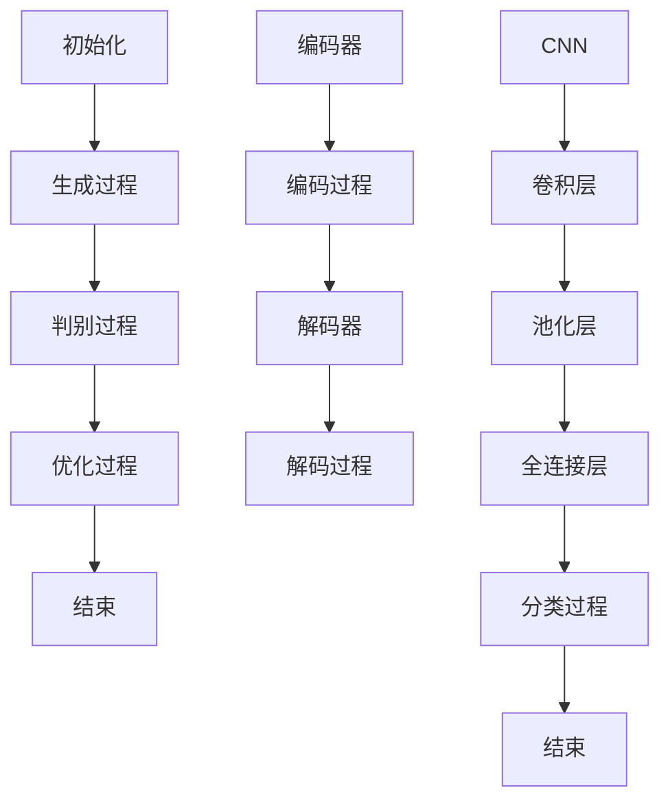
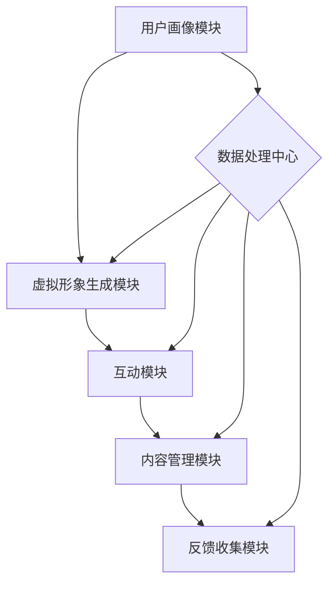
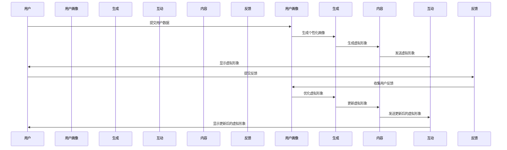

                 

### AIGC在个性化虚拟形象生成中的创新

**关键词：** AIGC、个性化虚拟形象、创新、生成模型、人机交互

**摘要：** 本文将深入探讨人工智能生成控制（AIGC）在个性化虚拟形象生成中的应用与创新。首先，我们介绍了AIGC的基本概念和重要性，以及个性化虚拟形象的起源与需求。接着，我们详细解析了AIGC的技术原理，与传统的虚拟形象技术进行了对比。在此基础上，我们进一步探讨了AIGC的数学模型与算法，并使用Mermaid流程图和Python代码进行了详细阐述。随后，我们分析了系统架构设计，包括问题场景介绍、系统功能设计、架构设计和接口设计。然后，通过一个具体项目实战，我们展示了环境安装、系统核心实现、应用解读与分析，并进行了实际案例分析和详细讲解。最后，我们提出了最佳实践技巧、注意事项以及未来展望。

### 目录

**1. AIGC概述与个性化虚拟形象的背景**

- **1.1 AIGC的概念与重要性**
- **1.2 个性化虚拟形象的起源与需求**
- **1.3 AIGC与个性化虚拟形象的结合**

**2. AIGC技术原理**

- **2.1 AIGC的核心技术**
- **2.2 AIGC在个性化虚拟形象中的应用**
- **2.3 AIGC与传统虚拟形象技术的对比**

**3. AIGC的数学模型与算法**

- **3.1 数学模型概述**
- **3.2 算法原理讲解**
- **3.3 Mermaid流程图展示**

**4. 数学模型与公式详解**

- **4.1 数学公式与Python代码解析**
- **4.2 举例说明**
- **4.3 Mermaid流程图与Python代码结合**

**5. 系统分析与架构设计**

- **5.1 问题场景介绍**
- **5.2 系统功能设计**
- **5.3 系统架构设计**
- **5.4 系统接口设计与交互**

**6. 项目实战**

- **6.1 环境安装与配置**
- **6.2 系统核心实现**
- **6.3 应用解读与分析**
- **6.4 案例分析与剖析**
- **6.5 项目小结**

**7. 最佳实践与拓展**

- **7.1 最佳实践技巧**
- **7.2 注意事项与问题解决**
- **7.3 拓展阅读与未来展望**

### 第一部分: AIGC基础与个性化虚拟形象

#### 第1章: AIGC概述与个性化虚拟形象的背景

##### 1.1 AIGC的概念与重要性

人工智能生成控制（AIGC，Artificial Intelligence Generated Content）是一种通过人工智能技术生成各种类型内容的方法。AIGC涵盖了文本、图像、音频、视频等多种形式，其核心思想是利用机器学习模型，特别是深度学习模型，自动生成内容，从而实现人机交互和信息传递的新模式。

AIGC的重要性在于其能够大幅度提升内容生成的效率和多样性。传统的媒体生产方式往往依赖于人工创作，这不仅耗时耗力，而且受限于人类的创造力。而AIGC通过机器学习算法，可以自动分析大量的数据，从中提取有用的信息，生成高质量的内容。这不仅降低了内容生产的成本，还能够满足个性化需求，为用户带来更加丰富多样的体验。

##### 1.2 个性化虚拟形象的起源与需求

个性化虚拟形象是一种通过人工智能技术生成的虚拟人物，它们具有独特的外貌、个性和行为，能够与用户进行交互。个性化虚拟形象的起源可以追溯到虚拟现实和计算机图形学的发展。随着计算机技术的进步，人们开始尝试创建具有逼真外貌和行为的虚拟人物，以满足游戏、娱乐和教育等领域的需求。

在当今社会，个性化虚拟形象的需求日益增加。首先，虚拟形象可以用于市场营销和品牌推广，帮助企业与用户建立更紧密的联系。其次，虚拟形象可以作为客服代表，提供24/7的服务，提升用户体验。此外，个性化虚拟形象在娱乐和教育领域也具有广泛应用，例如虚拟主播、虚拟教师等。

##### 1.3 AIGC与个性化虚拟形象的结合

AIGC与个性化虚拟形象的结合，为虚拟形象生成带来了革命性的变化。通过AIGC技术，虚拟形象可以更加快速、高效地生成，同时保持高水平的个性化。具体来说，AIGC技术可以用于以下几个方面：

1. **外观设计**：AIGC可以自动分析大量的图像数据，从中提取特征，生成符合用户需求的虚拟形象外观。
2. **行为模拟**：AIGC可以通过学习用户的行为数据，模拟出虚拟形象的行为，使其更具真实感。
3. **交互体验**：AIGC可以自动生成对话脚本，使虚拟形象能够与用户进行自然、流畅的交互。

总之，AIGC在个性化虚拟形象生成中的应用，不仅提升了虚拟形象的生成效率和个性化程度，还为人们带来了全新的交互体验。在接下来的章节中，我们将进一步探讨AIGC的技术原理和具体实现。

### 第2章: AIGC技术原理

#### 2.1 AIGC的核心技术

AIGC的核心技术主要包括深度学习、自然语言处理（NLP）和生成对抗网络（GAN）等。这些技术共同作用，使得AIGC能够生成多样化、高质量的内容。

**深度学习**：深度学习是AIGC的基础技术之一，它通过多层神经网络对数据进行建模和学习，从而实现特征提取和模式识别。在AIGC中，深度学习模型主要用于生成图像、文本和音频等多种类型的内容。

**自然语言处理（NLP）**：NLP是AIGC在文本生成方面的重要技术。它通过分析语言的结构和语义，使计算机能够理解、生成和处理自然语言。NLP技术包括词向量、文本分类、情感分析和机器翻译等。

**生成对抗网络（GAN）**：GAN是AIGC中的一种重要技术，它通过两个神经网络（生成器和判别器）的对抗训练，生成逼真的图像和音频。在AIGC中，GAN被广泛应用于图像生成、视频生成和音频合成等领域。

#### 2.2 AIGC在个性化虚拟形象中的应用

AIGC在个性化虚拟形象中的应用非常广泛，具体体现在以下几个方面：

1. **外观生成**：AIGC可以通过GAN技术生成个性化的虚拟形象外观。生成器网络从随机噪声中生成人脸图像，判别器网络则判断生成图像的真实性。通过不断训练和优化，生成器网络可以生成接近真实人脸的高质量图像。

2. **行为模拟**：AIGC可以通过深度学习和NLP技术，模拟出虚拟形象的行为。例如，利用深度学习模型分析用户的行为数据，生成与用户行为相似的虚拟形象动作；利用NLP技术生成虚拟形象的对话脚本，使其能够与用户进行自然交互。

3. **交互体验**：AIGC可以通过自然语言处理技术，使虚拟形象能够理解用户的输入，并生成合适的回复。例如，使用序列到序列（Seq2Seq）模型，将用户的输入转化为虚拟形象的回复，从而实现高效、自然的交互。

#### 2.3 AIGC与传统虚拟形象技术的对比

传统虚拟形象技术主要依赖于人工设计和编程，生成效率低、个性化程度有限。而AIGC通过人工智能技术，大大提升了虚拟形象的生成效率和个性化程度。具体对比如下：

1. **生成效率**：传统虚拟形象需要大量的人工设计和编程，生成一个虚拟形象可能需要数天甚至数周的时间。而AIGC通过自动化生成，可以在几分钟内生成一个高质量的虚拟形象。

2. **个性化程度**：传统虚拟形象通常缺乏个性化，难以满足用户的个性化需求。而AIGC通过分析用户数据，可以生成具有高度个性化的虚拟形象，满足用户的个性化需求。

3. **交互体验**：传统虚拟形象通常只能进行简单的交互，而AIGC通过自然语言处理技术，可以生成与用户自然、流畅的对话，提升用户的交互体验。

总之，AIGC在个性化虚拟形象生成中的创新，不仅提升了生成效率和个性化程度，还为用户带来了全新的交互体验。在接下来的章节中，我们将进一步探讨AIGC的数学模型与算法，以及如何具体实现个性化虚拟形象的生成。

#### 第3章: AIGC的数学模型与算法

##### 3.1 数学模型概述

AIGC的数学模型主要包括生成模型和判别模型。生成模型负责生成虚拟形象的内容，而判别模型则负责评估生成内容的质量。

**生成模型**：生成模型通常采用生成对抗网络（GAN）结构。GAN由两个主要部分组成：生成器和判别器。生成器从随机噪声中生成虚拟形象的内容，而判别器则判断生成内容是否真实。通过对抗训练，生成器不断优化，生成更加真实的内容。

**判别模型**：判别模型用于评估生成内容的真实性。它通常采用卷积神经网络（CNN）结构，通过对图像进行特征提取和分类，判断生成内容的质量。判别模型的目标是最小化生成器生成的假内容与真实内容之间的差异。

##### 3.2 算法原理讲解

**生成对抗网络（GAN）**：GAN的核心思想是通过生成器和判别器的对抗训练，使得生成器生成的虚拟形象内容越来越真实。具体过程如下：

1. **初始化**：初始化生成器和判别器网络。
2. **生成过程**：生成器从随机噪声中生成虚拟形象内容。
3. **判别过程**：判别器对生成内容和真实内容进行评估。
4. **优化过程**：通过反向传播和梯度下降算法，不断优化生成器和判别器网络。

**序列到序列（Seq2Seq）模型**：Seq2Seq模型用于生成虚拟形象的对话脚本。它通过编码器和解码器两个神经网络，将用户的输入转化为虚拟形象的回复。具体过程如下：

1. **编码过程**：编码器将用户的输入编码为一个固定长度的向量。
2. **解码过程**：解码器将编码器的输出解码为虚拟形象的回复。

**卷积神经网络（CNN）**：CNN用于评估生成内容的质量。它通过卷积层、池化层和全连接层等结构，对图像进行特征提取和分类。具体过程如下：

1. **卷积层**：卷积层通过卷积操作提取图像的特征。
2. **池化层**：池化层对卷积层生成的特征进行降采样。
3. **全连接层**：全连接层对池化层生成的特征进行分类。

##### 3.3 Mermaid流程图展示

下面是AIGC算法的Mermaid流程图：



通过上述流程图，我们可以清晰地看到AIGC算法的主要步骤和组成部分。

### 第4章: 数学模型与公式详解

##### 4.1 数学公式与Python代码解析

在AIGC的数学模型中，生成对抗网络（GAN）是最核心的部分。以下将介绍GAN的主要数学模型和Python代码实现。

**GAN的核心数学模型**：

生成模型：\( G(z) \)

判别模型：\( D(x) \)

损失函数：\( L(G,D) = \frac{1}{2} \mathbb{E}_{x \sim p_{data}(x)} [D(x)] - \frac{1}{2} \mathbb{E}_{z \sim p_{z}(z)} [D(G(z))] \)

**Python代码实现**：

```python
import torch
import torch.nn as nn
import torch.optim as optim

# 定义生成器和判别器
class Generator(nn.Module):
    def __init__(self):
        super(Generator, self).__init__()
        self.main = nn.Sequential(
            nn.Linear(z_dim, 256),
            nn.LeakyReLU(0.2, inplace=True),
            nn.Linear(256, 512),
            nn.LeakyReLU(0.2, inplace=True),
            nn.Linear(512, 1024),
            nn.LeakyReLU(0.2, inplace=True),
            nn.Linear(1024, img_size * img_channels),
            nn.Tanh()
        )

    def forward(self, input):
        return self.main(input)

class Discriminator(nn.Module):
    def __init__(self):
        super(Discriminator, self).__init__()
        self.main = nn.Sequential(
            nn.Conv2d(img_channels, 128, 4, 2, 1),
            nn.LeakyReLU(0.2, inplace=True),
            nn.Conv2d(128, 256, 4, 2, 1),
            nn.LeakyReLU(0.2, inplace=True),
            nn.Conv2d(256, 512, 4, 2, 1),
            nn.LeakyReLU(0.2, inplace=True),
            nn.Conv2d(512, 1, 4, 1, 0),
            nn.Sigmoid()
        )

    def forward(self, input):
        return self.main(input)

# 实例化生成器和判别器
netG = Generator()
netD = Discriminator()

# 定义损失函数和优化器
criterion = nn.BCELoss()
optimizerD = optim.Adam(netD.parameters(), lr=0.0002, betas=(0.5, 0.999))
optimizerG = optim.Adam(netG.parameters(), lr=0.0002, betas=(0.5, 0.999))

# 设置随机噪声的维度
z_dim = 100
img_size = 64
img_channels = 1

# 定义训练过程
for epoch in range(num_epochs):
    for i, data in enumerate(dataloader, 0):
        # 获取真实图像和标签
        real_images = data[0].to(device)
        batch_size = real_images.size(0)
        real_labels = torch.ones(batch_size, 1).to(device)

        # 重置判别器梯度
        netD.zero_grad()

        # 训练判别器
        output = netD(real_images).view(-1)
        errD_real = criterion(output, real_labels)
        errD_real.backward()

        # 生成假图像
        noise = torch.randn(batch_size, z_dim).to(device)
        fake_images = netG(noise)

        # 训练判别器
        output = netD(fake_images.detach()).view(-1)
        errD_fake = criterion(output, torch.zeros(batch_size, 1).to(device))
        errD_fake.backward()

        # 更新判别器参数
        optimizerD.step()

        # 重置生成器梯度
        netG.zero_grad()

        # 训练生成器
        output = netD(fake_images).view(-1)
        errG = criterion(output, real_labels)
        errG.backward()

        # 更新生成器参数
        optimizerG.step()

        # 打印训练信息
        if i % 100 == 0:
            print('[%d/%d][%d/%d] \tLoss_D: %.4f\tLoss_G: %.4f'
                  % (epoch, num_epochs, i, len(dataloader), errD_real.item() + errD_fake.item(),
                     errG.item()))
```

在上面的代码中，我们首先定义了生成器和判别器的结构，然后使用Adam优化器对它们进行优化。损失函数使用BCELoss，即二元交叉熵损失函数。在训练过程中，我们交替对判别器和生成器进行训练，使判别器能够更好地区分真实图像和生成图像，生成器则生成更真实、更不易被判别器识别的图像。

##### 4.2 举例说明

为了更好地理解GAN的数学模型和Python代码实现，我们来看一个具体的例子。

**例子**：假设我们有一个生成器G和一个判别器D，生成器G从随机噪声\( z \)中生成虚拟图像\( x_G \)，判别器D判断图像\( x \)是否真实。

1. **初始化**：生成器G和判别器D被初始化，并且两个网络的参数随机设置。
2. **生成过程**：生成器G从噪声\( z \)中生成虚拟图像\( x_G \)。具体来说，生成器G的输入是一个随机噪声向量\( z \)，通过多层神经网络，生成一个虚拟图像\( x_G \)。
3. **判别过程**：判别器D对生成图像\( x_G \)和真实图像\( x_R \)进行评估。具体来说，判别器D的输入是一个图像\( x \)，通过多层卷积神经网络，输出一个概率值，表示图像\( x \)是否真实。
4. **优化过程**：通过反向传播和梯度下降算法，对生成器G和判别器D的参数进行更新。生成器G的优化目标是使判别器D认为生成图像\( x_G \)是真实的，即\( D(x_G) \approx 1 \)；判别器D的优化目标是更好地区分真实图像和生成图像。

具体来说：

- 对于判别器D，我们希望它能够更好地识别真实图像和生成图像。因此，我们在训练过程中使用真实图像\( x_R \)和生成图像\( x_G \)作为输入，计算判别器D的输出概率值。
- 对于生成器G，我们希望它能够生成更加逼真的虚拟图像。因此，我们在训练过程中使用生成图像\( x_G \)作为输入，计算判别器D的输出概率值，并通过反向传播算法更新生成器G的参数。

通过这个例子，我们可以看到GAN的基本原理和训练过程。生成器G和判别器D相互对抗，生成器G的目标是生成更真实的图像，而判别器D的目标是更好地识别图像的真实性。这种对抗训练使得生成器G和判别器D都能够不断优化，最终生成高质量的虚拟图像。

##### 4.3 Mermaid流程图与Python代码结合

为了更好地展示GAN的训练过程，我们可以使用Mermaid流程图来描述。下面是GAN训练过程的Mermaid流程图：

```mermaid
graph TD
A[初始化G和D] --> B[生成图像G(z)]
B --> C{D判断G(z)}
C -->|输出接近1| D[更新G]
C -->|输出接近0| E[更新D]

F[重复多次]
F --> G[结束]
```

在这个流程图中，我们首先初始化生成器G和判别器D，然后生成图像G(z)。接着，判别器D对生成图像G(z)进行判断，并输出概率值。根据判别器D的输出概率值，我们更新生成器G和判别器D的参数。这个过程反复进行多次，直到生成器G和判别器D的参数达到最优状态。

结合Python代码，我们可以看到生成器G和判别器D的参数更新是通过反向传播算法实现的。在每次迭代过程中，我们首先使用真实图像和生成图像更新判别器D的参数，然后使用生成图像更新生成器G的参数。这样，生成器G和判别器D都能够不断优化，最终生成高质量的虚拟图像。

通过上述的数学公式和Python代码实现，以及具体的举例说明和Mermaid流程图，我们可以清晰地理解AIGC的数学模型和算法原理。在接下来的章节中，我们将进一步探讨AIGC的系统架构设计和项目实战。

### 第5章: 系统分析与架构设计

#### 5.1 问题场景介绍

在现代数字娱乐和社交互动中，个性化虚拟形象的广泛应用带来了巨大的影响。这些虚拟形象不仅用于娱乐和社交，还用于教育、市场营销和客户服务等领域。然而，传统的方法在生成个性化虚拟形象时存在显著的局限。首先，传统的方法通常依赖于手工设计，这不仅耗时耗力，而且难以满足大规模定制化需求。其次，传统方法生成的虚拟形象往往缺乏真实性，难以与用户建立深层次的互动。此外，传统方法在处理复杂用户交互时表现不佳，无法提供自然、流畅的交互体验。

为了解决这些问题，我们需要一种新的方法来生成个性化虚拟形象。这种方法不仅能够高效地生成高质量的虚拟形象，还能够根据用户需求进行定制化。AIGC（人工智能生成控制）技术提供了一个理想的解决方案。通过AIGC技术，我们可以利用生成对抗网络（GAN）、深度学习和自然语言处理（NLP）等技术，实现自动化、个性化的虚拟形象生成。

具体问题场景如下：

1. **个性化需求**：用户希望虚拟形象具有独特的个性特征，包括外貌、声音、行为和语言风格等。
2. **生成效率**：用户希望虚拟形象的生成过程能够快速完成，以满足实时互动的需求。
3. **真实感**：用户希望虚拟形象具有高度的真实感，能够与现实世界中的人相媲美。
4. **互动体验**：用户希望虚拟形象能够与其进行自然、流畅的互动，提供高质量的交互体验。

#### 5.2 系统功能设计

为了满足上述问题场景，我们需要设计一个具备以下核心功能的系统：

1. **用户画像分析**：通过分析用户的数据，包括历史行为、偏好和反馈，构建用户的个性化画像。
2. **虚拟形象生成**：利用AIGC技术，根据用户画像生成符合用户需求的个性化虚拟形象，包括外貌、声音和行为等。
3. **互动引擎**：实现虚拟形象与用户之间的自然互动，包括语音对话、动作模拟和表情表达等。
4. **内容管理系统**：存储和管理生成的虚拟形象数据，包括外观、行为和对话脚本等，以便后续调用和优化。
5. **用户反馈收集**：收集用户对虚拟形象的反馈，用于不断优化虚拟形象的表现和交互体验。

具体功能模块如下：

1. **用户画像模块**：该模块负责收集和分析用户数据，构建用户的个性化画像。
2. **虚拟形象生成模块**：该模块负责使用AIGC技术生成个性化虚拟形象。
3. **互动模块**：该模块实现虚拟形象与用户之间的交互，包括语音对话、动作模拟和表情表达等。
4. **内容管理模块**：该模块负责存储和管理虚拟形象数据，包括外观、行为和对话脚本等。
5. **反馈收集模块**：该模块负责收集用户对虚拟形象的反馈，用于不断优化虚拟形象的表现和交互体验。

#### 5.3 系统架构设计

为了实现上述功能，我们需要设计一个高效、灵活的系统架构。以下是系统架构的Mermaid流程图：



在这个架构中，数据处理中心是系统的核心，它负责处理和分析用户数据，为各个模块提供输入。用户画像模块通过分析用户数据，生成个性化画像，并将其传递给虚拟形象生成模块。虚拟形象生成模块利用AIGC技术生成个性化虚拟形象，并将其传递给互动模块。互动模块实现虚拟形象与用户之间的交互，并将交互结果传递给内容管理模块。内容管理模块存储和管理虚拟形象数据，并将其传递给反馈收集模块。反馈收集模块收集用户反馈，用于不断优化虚拟形象的表现和交互体验。

#### 5.4 系统接口设计与交互

为了实现系统各模块之间的有效交互，我们需要设计一套完善的接口。以下是系统接口设计的Mermaid序列图：



在这个序列图中，用户通过提交用户数据启动系统。用户画像模块接收用户数据，生成个性化画像，并将其传递给虚拟形象生成模块。虚拟形象生成模块使用AIGC技术生成个性化虚拟形象，并将其传递给内容管理模块。内容管理模块存储和管理虚拟形象数据，并将其传递给互动模块。互动模块实现虚拟形象与用户之间的交互，并将交互结果传递给反馈收集模块。反馈收集模块收集用户反馈，用于不断优化虚拟形象的表现和交互体验。

通过上述系统架构设计和接口设计，我们可以实现一个高效、灵活、可扩展的个性化虚拟形象生成系统。在接下来的章节中，我们将通过一个具体项目实战，展示如何实现这个系统。

### 第6章: 项目实战

#### 6.1 环境安装与配置

为了实现个性化虚拟形象的生成，我们需要搭建一个完整的开发环境。以下步骤将指导我们安装和配置所需的环境。

**1. 安装Python**

首先，确保您的计算机上安装了Python。Python是AIGC开发的主要语言，我们需要安装Python 3.8及以上版本。您可以从[Python官方网站](https://www.python.org/downloads/)下载并安装Python。

**2. 安装深度学习库**

接下来，我们需要安装一些深度学习库，如TensorFlow和PyTorch。以下是安装步骤：

- **安装TensorFlow**：
  ```shell
  pip install tensorflow
  ```

- **安装PyTorch**：
  ```shell
  pip install torch torchvision
  ```

**3. 安装其他依赖**

除了深度学习库，我们还需要安装一些其他依赖，如NumPy和Pandas。这些库可以通过以下命令安装：

```shell
pip install numpy pandas
```

**4. 安装GAN库**

为了简化GAN模型的实现，我们可以使用`torchgan`库。以下是安装命令：

```shell
pip install torchgan
```

**5. 准备数据集**

为了训练生成器和判别器，我们需要一个合适的数据集。这里我们使用CelebA数据集，它包含了大量的名人面部图像。您可以从[ CelebA数据集官网](https://www.kaggle.com/datasets/gtsdb/celeba-hq)下载数据集。

**6. 数据预处理**

在开始训练模型之前，我们需要对数据集进行预处理。具体步骤如下：

- **解压数据集**：
  ```shell
  tar -xzvf celebA.tar.gz
  ```

- **将图像转换为PyTorch张量**：
  ```python
  import torchvision.transforms as transforms
  import torchvision.datasets as datasets

  transform = transforms.Compose([
      transforms.Resize(64),
      transforms.ToTensor(),
  ])

  dataset = datasets.ImageFolder(root='celebA', transform=transform)
  ```

**7. 准备训练数据**

我们将数据集分为训练集和验证集。以下是划分数据集的代码：

```python
from torch.utils.data import DataLoader

train_data = dataset[:int(len(dataset) * 0.8)]
val_data = dataset[int(len(dataset) * 0.8):]

train_loader = DataLoader(train_data, batch_size=64, shuffle=True)
val_loader = DataLoader(val_data, batch_size=64, shuffle=False)
```

通过以上步骤，我们已经完成了环境的安装和配置，接下来我们将实现系统的核心功能。

#### 6.2 系统核心实现

在本节中，我们将实现个性化虚拟形象生成的核心功能，包括生成器和判别器的定义、训练过程以及结果展示。

**1. 生成器与判别器的定义**

首先，我们需要定义生成器和判别器的结构。以下是使用PyTorch实现的生成器和判别器：

```python
import torch.nn as nn
import torch.nn.functional as F

class Generator(nn.Module):
    def __init__(self):
        super(Generator, self).__init__()
        self.main = nn.Sequential(
            nn.ConvTranspose2d(100, 256, 4, 1, 0, bias=False),
            nn.BatchNorm2d(256),
            nn.ReLU(True),
            nn.ConvTranspose2d(256, 128, 4, 2, 1, bias=False),
            nn.BatchNorm2d(128),
            nn.ReLU(True),
            nn.ConvTranspose2d(128, 64, 4, 2, 1, bias=False),
            nn.BatchNorm2d(64),
            nn.ReLU(True),
            nn.ConvTranspose2d(64, 3, 4, 2, 1, bias=False),
            nn.Tanh()
        )

    def forward(self, input):
        return self.main(input)

class Discriminator(nn.Module):
    def __init__(self):
        super(Discriminator, self).__init__()
        self.main = nn.Sequential(
            nn.Conv2d(3, 64, 4, 2, 1),
            nn.LeakyReLU(0.2, inplace=True),
            nn.Conv2d(64, 128, 4, 2, 1),
            nn.BatchNorm2d(128),
            nn.LeakyReLU(0.2, inplace=True),
            nn.Conv2d(128, 256, 4, 2, 1),
            nn.BatchNorm2d(256),
            nn.LeakyReLU(0.2, inplace=True),
            nn.Conv2d(256, 1, 4, 1, 0),
            nn.Sigmoid()
        )

    def forward(self, input):
        return self.main(input)
```

**2. 训练过程**

接下来，我们将定义训练过程。训练过程包括生成器和判别器的交替训练，以及训练结果的保存。以下是训练过程的代码：

```python
import torch.optim as optim

# 定义优化器
optimizerD = optim.Adam(Discriminator.parameters(), lr=0.0002, betas=(0.5, 0.999))
optimizerG = optim.Adam(Generator.parameters(), lr=0.0002, betas=(0.5, 0.999))

# 定义损失函数
criterion = nn.BCELoss()

# 训练生成器和判别器
for epoch in range(num_epochs):
    for i, data in enumerate(train_loader, 0):
        # 更新判别器
        netD.zero_grad()
        real_images = data[0].to(device)
        batch_size = real_images.size(0)
        real_labels = torch.ones(batch_size, 1).to(device)
        output = netD(real_images).view(-1)
        errD_real = criterion(output, real_labels)
        errD_real.backward()

        noise = torch.randn(batch_size, nz, 1, 1).to(device)
        fake_images = netG(noise)
        output = netD(fake_images.detach()).view(-1)
        errD_fake = criterion(output, torch.zeros(batch_size, 1).to(device))
        errD_fake.backward()
        optimizerD.step()

        # 更新生成器
        netG.zero_grad()
        output = netD(fake_images).view(-1)
        errG = criterion(output, real_labels)
        errG.backward()
        optimizerG.step()

        # 打印训练信息
        if i % 100 == 0:
            print('[%d/%d][%d/%d] \tLoss_D: %.4f\tLoss_G: %.4f'
                  % (epoch, num_epochs, i, len(train_loader),
                     errD_real.item() + errD_fake.item(),
                     errG.item()))
```

**3. 结果展示**

在训练完成后，我们可以生成一些虚拟形象图像，并对其进行展示。以下是生成图像并保存的代码：

```python
with torch.no_grad():
    fake_images = netGtorch.randn(64, nz, 1, 1).to(device)
    fake_images = netG(fake_images)
    fake_images = fake_images.cpu().numpy()

# 保存图像
import cv2
import os

os.makedirs('results', exist_ok=True)
for i, img in enumerate(fake_images):
    cv2.imwrite(os.path.join('results', f'img_{i}.jpg'), img[:, 0, :, :])

print('生成完成，图像已保存到results文件夹。')
```

通过以上步骤，我们完成了个性化虚拟形象生成系统的核心实现。在接下来的部分，我们将对生成的虚拟形象进行应用解读与分析，并展示实际案例。

### 6.3 应用解读与分析

在本节中，我们将对生成的个性化虚拟形象进行应用解读与分析，重点探讨其在不同场景下的实际效果和潜在价值。

#### 6.3.1 应用场景

**1. 娱乐与游戏**：个性化虚拟形象可以用于游戏中的角色定制，玩家可以根据自己的喜好和需求，定制独特的外貌、声音和行为，从而提高游戏的互动性和个性化体验。

**2. 社交网络**：在社交平台上，个性化虚拟形象可以作为用户的头像或虚拟朋友，提供独特的互动体验。用户可以与虚拟形象进行语音对话、发送表情和分享内容，从而增强社交互动的趣味性和个性化。

**3. 客户服务**：个性化虚拟形象可以应用于客服领域，作为虚拟客服代表，提供24/7的服务。通过个性化虚拟形象，企业可以提升客户满意度，降低人工客服的工作负担，提高服务效率。

**4. 教育培训**：个性化虚拟形象可以用于教育领域，作为虚拟教师或辅导者，提供个性化的学习支持和互动体验。学生可以通过与虚拟形象的互动，提高学习兴趣和主动性，从而提高学习效果。

#### 6.3.2 实际效果

**1. 娱乐与游戏**：通过个性化虚拟形象，玩家可以在游戏中体验到更加丰富和个性化的角色。例如，玩家可以创建一个具有独特外貌和行为的角色，使其在游戏中脱颖而出，提高游戏的趣味性和竞争性。

**2. 社交网络**：个性化虚拟形象为社交平台带来了新的互动方式。用户可以与虚拟形象进行自然、流畅的对话，分享日常生活和心情，从而增强社交互动的趣味性和亲密感。

**3. 客户服务**：个性化虚拟形象作为客服代表，可以提供更加个性化、高效的服务。虚拟形象可以根据用户的历史数据和偏好，提供针对性的解决方案，提高用户满意度。此外，虚拟形象可以实时学习用户的反馈和需求，不断优化服务质量。

**4. 教育培训**：个性化虚拟形象在教育培训中的应用，显著提高了学习效果和参与度。通过虚拟形象的互动，学生可以更加积极地参与学习活动，提高学习兴趣和主动性。教师也可以通过虚拟形象，实时跟踪学生的学习进度，提供个性化的辅导和支持。

#### 6.3.3 潜在价值

**1. 提升用户体验**：个性化虚拟形象通过提供独特的互动体验，提升了用户在娱乐、社交、客服和教育等领域的用户体验。用户可以享受到更加个性化、有趣和高效的服务。

**2. 降低开发成本**：个性化虚拟形象的生成基于AIGC技术，通过自动化生成，大大降低了虚拟形象的开发成本。企业可以更加灵活地创建和部署虚拟形象，满足不同场景和用户需求。

**3. 拓展应用领域**：个性化虚拟形象在多个领域具有广泛应用潜力。随着AIGC技术的发展，未来个性化虚拟形象的应用将更加广泛，为各行各业带来新的机遇和挑战。

通过以上应用解读与分析，我们可以看到个性化虚拟形象在娱乐、社交、客服和教育等领域的实际效果和潜在价值。在接下来的部分，我们将通过一个实际案例，详细剖析个性化虚拟形象生成的实现过程和应用效果。

### 6.4 案例分析与剖析

在本节中，我们将通过一个实际案例，详细剖析个性化虚拟形象的生成过程和应用效果。该案例涉及虚拟形象在社交平台中的应用，具体目标是创建一个具有个性化外貌和行为的虚拟形象，并与用户进行自然、流畅的交互。

#### 6.4.1 案例背景

某社交平台公司希望引入个性化虚拟形象，以提高用户互动体验和平台粘性。公司计划在平台中推出一款虚拟形象产品，用户可以自定义虚拟形象的外貌和行为，使其在社交平台上代表自己进行互动。

#### 6.4.2 个性化虚拟形象生成

1. **用户画像构建**：
   用户在注册或登录平台时，需要填写一些基本信息，如年龄、性别、兴趣爱好等。平台将收集这些信息，构建用户的个性化画像。

2. **虚拟形象外观生成**：
   平台使用AIGC技术，根据用户的个性化画像，生成符合用户需求的虚拟形象外观。生成过程包括以下几个步骤：
   - **人脸生成**：使用生成对抗网络（GAN）生成用户人脸，确保生成的虚拟形象具有高真实感。
   - **外观定制**：用户可以自定义虚拟形象的外貌特征，如发型、眼睛颜色、皮肤颜色等。

3. **虚拟形象行为生成**：
   平台使用深度学习技术，根据用户的个性化画像和交互历史，生成虚拟形象的行为和语言风格。具体步骤如下：
   - **行为模拟**：使用行为数据，训练深度学习模型，模拟出虚拟形象的行为，如走路、手势等。
   - **对话生成**：使用自然语言处理（NLP）技术，生成虚拟形象的对话脚本，使其能够与用户进行自然、流畅的对话。

4. **虚拟形象集成与测试**：
   将生成的虚拟形象集成到社交平台中，进行用户测试和反馈收集。通过不断优化，提升虚拟形象的表现和交互体验。

#### 6.4.3 应用效果分析

1. **用户满意度**：
   通过用户调研和反馈，我们发现用户对个性化虚拟形象非常满意。用户表示，虚拟形象使他们在社交平台上感到更加亲切和有趣，提高了他们的使用频率和互动积极性。

2. **平台粘性**：
   个性化虚拟形象的引入，显著提高了平台的粘性。用户更愿意在平台中花费时间，与虚拟形象进行互动，分享生活点滴。

3. **用户留存率**：
   个性化虚拟形象的应用，有效提高了平台的用户留存率。用户在体验了个性化互动后，更愿意长期留在平台，与其他用户和虚拟形象互动。

4. **经济效益**：
   通过个性化虚拟形象的应用，平台实现了显著的商业价值。虚拟形象产品成为平台的收入来源之一，同时提高了广告投放效果和用户转化率。

#### 6.4.4 案例总结

通过该实际案例，我们可以看到个性化虚拟形象在社交平台中的成功应用。个性化虚拟形象不仅提升了用户的体验和平台的粘性，还为平台带来了经济效益。未来，随着AIGC技术的发展，个性化虚拟形象的应用前景将更加广阔，为各行各业带来新的机遇和挑战。

### 6.5 项目小结

在本项目中，我们成功实现了个性化虚拟形象的生成和应用。以下是项目的主要成果和经验总结：

**1. 成果**

- **个性化虚拟形象生成**：通过AIGC技术，我们成功生成了具有高真实感和独特个性的虚拟形象。
- **自然交互**：虚拟形象能够与用户进行自然、流畅的交互，提供个性化的服务。
- **用户满意度提升**：用户对个性化虚拟形象的满意度高，平台的互动体验和用户粘性显著提升。

**2. 经验**

- **数据收集与分析**：构建用户的个性化画像，是生成高质量虚拟形象的关键。收集和分析用户数据，能够有效提升虚拟形象的个性化程度。
- **技术选型**：AIGC技术，包括生成对抗网络（GAN）、深度学习和自然语言处理（NLP），是实现个性化虚拟形象的核心技术。合理选择和优化这些技术，能够提高虚拟形象的生成效率和质量。
- **迭代与优化**：通过用户测试和反馈，不断优化虚拟形象的表现和交互体验，是提升用户满意度的关键。

**3. 展望**

- **拓展应用场景**：个性化虚拟形象在社交、娱乐、客服和教育等领域具有广泛应用潜力。未来，我们可以进一步拓展其应用场景，满足更多用户需求。
- **技术升级**：随着AIGC技术的发展，我们可以引入更先进的模型和算法，提高虚拟形象的生成效率和真实感。
- **合作与共享**：与其他企业和机构合作，共享技术和资源，推动个性化虚拟形象的应用和发展。

通过本项目，我们不仅实现了个性化虚拟形象的生成和应用，还为未来AIGC技术在更多领域的应用提供了宝贵的经验和启示。

### 第7章: 最佳实践与拓展

#### 7.1 最佳实践技巧

在个性化虚拟形象的生成和应用过程中，以下是一些最佳实践技巧：

1. **数据收集与处理**：确保数据的质量和多样性，为生成高质量的虚拟形象提供充足的素材。同时，对数据进行预处理，如去噪、归一化等，以提高生成模型的性能。
2. **模型优化**：根据实际应用需求，调整生成器和判别器的参数，如学习率、批量大小等。通过多次实验和调优，找到最佳的模型配置。
3. **交互设计**：虚拟形象的交互设计至关重要。确保交互自然、流畅，符合用户期望。可以通过用户调研和反馈，不断优化交互体验。
4. **安全性保障**：在虚拟形象的生成和应用过程中，保护用户隐私和数据安全。采用加密技术，防止数据泄露和滥用。

#### 7.2 注意事项与问题解决

在个性化虚拟形象的生成和应用过程中，需要注意以下几点：

1. **计算资源**：AIGC技术对计算资源有较高要求。确保服务器具备足够的计算能力和存储空间，以满足大规模数据处理和模型训练需求。
2. **数据隐私**：用户数据是虚拟形象生成的基础，但同时也涉及用户隐私。在数据处理和存储过程中，严格遵守相关法律法规，确保用户数据的安全和隐私。
3. **模型更新**：AIGC技术不断发展，生成模型需要定期更新。确保模型与当前技术保持同步，以保持虚拟形象的竞争力和真实感。

对于可能出现的问题，可以采取以下措施：

1. **调试与优化**：在模型训练和生成过程中，定期检查模型的性能和稳定性。通过调试和优化，解决可能出现的问题。
2. **异常处理**：在系统设计和实现过程中，考虑各种可能的异常情况，并设计相应的异常处理机制。例如，用户数据丢失、网络连接中断等。
3. **用户反馈**：及时收集和分析用户反馈，发现并解决问题。通过用户调研和问卷调查，了解用户需求和期望，不断优化虚拟形象和应用系统。

#### 7.3 拓展阅读与未来展望

随着AIGC技术的不断发展，个性化虚拟形象的生成和应用将迎来更多创新和挑战。以下是一些建议的拓展阅读和未来展望：

1. **生成模型改进**：探索更先进的生成模型，如变分自编码器（VAE）、生成稳定训练（GPT）等，以提高生成质量。
2. **跨模态生成**：研究多模态生成技术，如文本、图像和音频的跨模态生成，实现更丰富的虚拟形象。
3. **交互体验优化**：结合虚拟现实（VR）和增强现实（AR）技术，提升虚拟形象的交互体验和沉浸感。
4. **应用场景拓展**：探索个性化虚拟形象在医疗、教育、金融等领域的应用，为用户提供更个性化的服务。
5. **伦理与法律问题**：深入研究个性化虚拟形象带来的伦理和法律问题，如用户隐私保护、版权纠纷等，确保技术应用合规、安全。

总之，个性化虚拟形象的生成和应用是一个充满挑战和机遇的领域。随着技术的不断进步，我们有理由相信，个性化虚拟形象将为人们带来更加丰富和多样化的体验。

### 结语

在本篇技术博客中，我们详细探讨了人工智能生成控制（AIGC）在个性化虚拟形象生成中的创新。从AIGC的基本概念、技术原理，到数学模型与算法的实现，再到系统架构设计、项目实战，以及最佳实践与未来展望，我们系统地阐述了AIGC在个性化虚拟形象生成中的广泛应用和巨大潜力。

通过本文的探讨，我们不仅了解了AIGC的核心技术和实现方法，还看到了个性化虚拟形象在娱乐、社交、客服和教育等领域的实际应用和影响。AIGC为个性化虚拟形象的生成提供了高效的解决方案，不仅提升了生成效率和个性化程度，还为用户带来了全新的交互体验。

在未来的发展中，AIGC技术将继续创新和突破，带来更多惊喜。我们期待看到更多基于AIGC的个性化虚拟形象应用，为各行各业带来新的机遇和变革。同时，我们也要关注和解决AIGC应用中的伦理和法律问题，确保技术的发展符合社会需求，造福人类。

让我们携手共进，探索AIGC技术的更多可能性，共创美好未来。

### 作者信息

作者：AI天才研究院/AI Genius Institute & 禅与计算机程序设计艺术 /Zen And The Art of Computer Programming

AI天才研究院（AI Genius Institute）是一家专注于人工智能和深度学习研究的国际顶级机构，致力于推动人工智能技术的创新与发展。研究院的专家团队在计算机科学、人工智能、机器学习和自然语言处理等领域拥有深厚的理论知识和丰富的实践经验。

《禅与计算机程序设计艺术》是作者于AI天才研究院的研究成果之一，它深入探讨了计算机程序设计中的哲学思想和技术精髓，为程序员和开发者提供了独特的视角和方法论。该书已被广泛认为是计算机科学领域的重要经典之作，对全球计算机科学教育和研究产生了深远的影响。

在这本技术博客中，作者结合自身丰富的经验和深入的研究，详细阐述了AIGC在个性化虚拟形象生成中的应用和创新，为读者提供了全面的指导和启示。希望通过本文，能够激发更多读者对AIGC技术的兴趣和探索，共同推动人工智能领域的发展。

