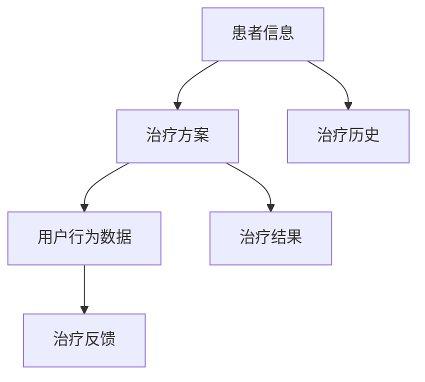
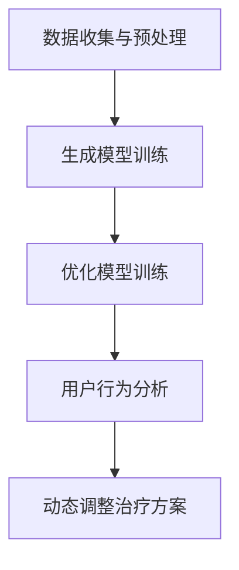
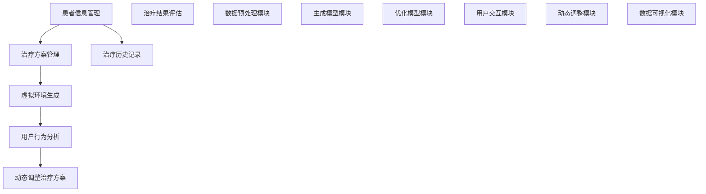
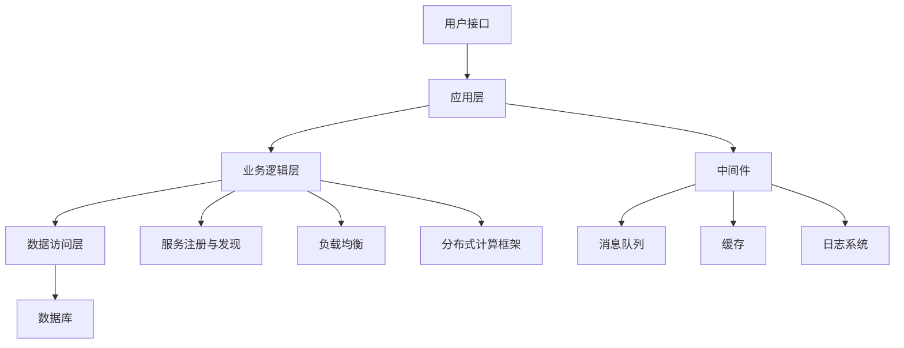
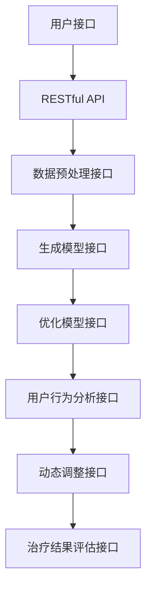
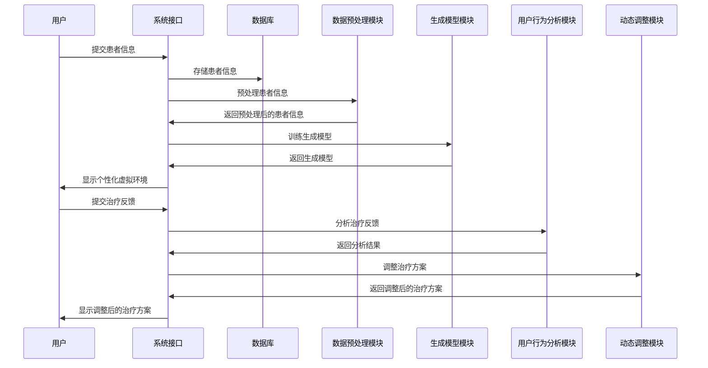

                 

### AIGC在个性化虚拟现实治疗方案设计中的创新

#### 关键词：
- AIGC（自适应智能生成计算）
- 个性化虚拟现实（VR）治疗方案
- 深度学习
- 生成对抗网络（GAN）
- 交互设计
- 用户体验（UX）

#### 摘要：
本文深入探讨了AIGC（自适应智能生成计算）在个性化虚拟现实（VR）治疗方案设计中的创新应用。通过分析AIGC的核心概念和技术原理，我们探讨了如何利用AIGC技术优化VR治疗方案设计，提高个性化定制水平，改善患者的治疗体验。文章涵盖了AIGC框架、关键算法及其在VR疗法中的应用，并结合实际案例，详细阐述了AIGC在个性化VR治疗方案设计中的具体实现流程和成效。最终，本文提出了未来AIGC在VR疗法设计领域的应用前景和挑战。

### 引言

#### 1.1 背景与意义

虚拟现实（VR）技术在医学领域的应用越来越广泛，尤其是在心理治疗、康复训练和疼痛管理等方面展现了巨大的潜力。然而，当前VR治疗方案设计主要依赖于临床经验和现有资源，缺乏个性化定制和适应性调整，无法满足不同患者的多样化需求。这种局限性导致了治疗效果的不稳定性和患者的治疗依从性问题。

AIGC（自适应智能生成计算）作为一种新兴的人工智能技术，通过深度学习和生成对抗网络（GAN）等技术，实现了高度自适应的数据生成和模型优化。AIGC的应用不仅能够提高VR治疗方案设计的个性化程度，还可以根据患者的实时反馈进行动态调整，从而提升治疗效果和患者满意度。

#### 1.2 研究目的

本文旨在探讨AIGC在个性化虚拟现实治疗方案设计中的创新应用，具体目标包括：

1. 深入理解AIGC的核心概念和技术原理。
2. 分析AIGC在VR疗法设计中的应用场景和优势。
3. 设计并实现AIGC驱动的个性化VR治疗方案。
4. 通过实际案例验证AIGC在VR疗法设计中的有效性。

### AIGC概述

#### 2.1 AIGC框架与架构

AIGC是一种自适应智能生成计算框架，它结合了深度学习和生成对抗网络（GAN）等技术，通过自学习和自优化，实现高度个性化的数据生成和模型优化。AIGC框架通常包括以下几个核心组件：

1. **数据预处理模块**：负责收集、清洗和处理输入数据，为后续生成模型提供高质量的数据支持。
2. **生成模型模块**：基于GAN等技术，生成与真实数据高度相似的人工数据，用于训练和优化模型。
3. **优化模型模块**：通过深度学习算法，对生成模型进行持续优化，提高其生成质量和适应性。
4. **交互设计模块**：基于用户体验（UX）设计原则，设计用户与虚拟环境交互的界面和流程。

#### 2.2 AIGC关键技术与算法

AIGC的核心技术包括深度学习、生成对抗网络（GAN）和用户行为分析等。以下是对这些关键技术的简要介绍：

1. **深度学习**：深度学习是一种基于多层神经网络的人工智能技术，通过多层非线性变换，实现对复杂数据的自动特征提取和分类。在AIGC中，深度学习主要用于训练生成模型和优化模型。

2. **生成对抗网络（GAN）**：GAN是由生成器（Generator）和判别器（Discriminator）组成的对抗性网络。生成器生成数据，判别器判断数据的真实性。通过这种对抗性训练，生成器不断优化生成数据的质量，使其越来越接近真实数据。在AIGC中，GAN用于生成个性化的虚拟环境和治疗方案。

3. **用户行为分析**：用户行为分析是一种通过分析用户在虚拟环境中的行为和反馈，了解其需求和心理状态的技术。在AIGC中，用户行为分析用于动态调整虚拟环境的设计和治疗方案，提高用户体验和治疗效果。

#### 2.3 AIGC在VR疗法设计中的应用场景

AIGC在VR疗法设计中的应用场景主要包括：

1. **个性化虚拟环境设计**：通过AIGC生成个性化的虚拟环境，满足不同患者的需求和心理预期。例如，在心理治疗中，可以为患者生成符合其喜好和需求的虚拟场景，提高治疗的吸引力和效果。

2. **动态治疗方案设计**：通过用户行为分析和实时反馈，动态调整治疗方案，使其更符合患者的实际需求和治疗效果。例如，在康复训练中，可以根据患者的实时表现和反馈，调整训练难度和强度，提高训练效果。

3. **数据驱动决策支持**：通过分析患者的历史数据和实时行为，为医生提供数据驱动的决策支持，优化治疗方案设计。例如，在疼痛管理中，可以通过分析患者的疼痛数据和行为模式，制定个性化的疼痛管理方案。

### AIGC在VR疗法设计中的具体应用

#### 3.1 数据收集与预处理

在AIGC应用于VR疗法设计之前，首先需要收集相关数据，包括患者的基本信息、疾病状况、治疗历史、心理状态等。同时，还需要收集患者在使用VR疗法过程中的行为数据，如互动次数、场景偏好、反馈意见等。

收集到的数据需要进行预处理，包括数据清洗、数据归一化和特征提取等步骤。预处理过程旨在提高数据质量，为后续的AIGC模型训练提供可靠的数据支持。

#### 3.2 生成个性化虚拟环境

在生成个性化虚拟环境时，AIGC通过GAN模型对输入数据进行处理，生成与真实数据高度相似的虚拟环境。具体步骤如下：

1. **训练GAN模型**：利用收集到的患者数据，训练生成器和判别器。生成器负责生成虚拟环境，判别器负责判断虚拟环境是否真实。

2. **优化GAN模型**：通过对抗性训练，不断优化生成器和判别器的性能，使其生成更高质量的虚拟环境。

3. **生成个性化虚拟环境**：根据患者的需求和偏好，利用优化后的GAN模型生成个性化的虚拟环境。

#### 3.3 动态调整治疗方案

在动态调整治疗方案时，AIGC通过用户行为分析和实时反馈，对治疗方案进行动态调整。具体步骤如下：

1. **收集用户行为数据**：在患者使用VR疗法的过程中，收集其互动次数、场景偏好、反馈意见等行为数据。

2. **分析用户行为数据**：利用AIGC对用户行为数据进行分析，了解患者的需求和偏好，为动态调整治疗方案提供依据。

3. **调整治疗方案**：根据分析结果，动态调整治疗方案的难度、强度和内容，使其更符合患者的实际需求和治疗效果。

#### 3.4 数据驱动决策支持

在数据驱动决策支持方面，AIGC通过分析患者的历史数据和实时行为，为医生提供决策支持。具体步骤如下：

1. **收集患者历史数据**：包括疾病状况、治疗历史、治疗效果等。

2. **分析患者行为数据**：利用AIGC对患者的实时行为进行分析，了解患者的需求和偏好。

3. **生成决策支持建议**：根据分析结果，为医生生成治疗建议和决策支持，优化治疗方案设计。

### 实际案例

#### 4.1 案例一：心理治疗

在一个心理治疗案例中，患者被诊断为焦虑症，需要接受长期的心理治疗。通过AIGC技术，治疗师为患者生成了个性化的虚拟环境，包括符合患者兴趣和需求的场景，如自然景观、城市风光等。在治疗过程中，AIGC根据患者的实时反馈和行为数据，动态调整治疗方案的难度和内容，提高了患者的治疗依从性和效果。

#### 4.2 案例二：康复训练

在一个康复训练案例中，患者因车祸导致腿部骨折，需要接受康复训练。通过AIGC技术，治疗师为患者生成了个性化的康复训练场景，包括模拟实际场景的虚拟环境，如公园、健身房等。在康复训练过程中，AIGC根据患者的实时表现和反馈，动态调整训练难度和强度，提高了患者的训练效果和满意度。

### 未来展望

AIGC在个性化虚拟现实治疗方案设计中的创新应用具有广阔的前景。随着技术的不断进步和应用的深入，AIGC有望在以下几个方面发挥更大的作用：

1. **提高治疗效果**：通过AIGC生成个性化的虚拟环境和治疗方案，提高治疗的有效性和患者满意度。
2. **降低治疗成本**：利用AIGC技术实现虚拟现实治疗方案的设计和优化，降低治疗成本，提高医疗资源的利用率。
3. **促进医疗个性化**：通过AIGC分析患者数据和行为，实现真正的医疗个性化，满足不同患者的多样化需求。
4. **扩展应用领域**：AIGC在个性化虚拟现实治疗方案设计中的应用不仅限于心理健康和康复训练，还可以拓展到疼痛管理、疾病预防等领域。

然而，AIGC在VR疗法设计中的应用也面临一些挑战，如数据隐私保护、技术成熟度和成本控制等。未来，需要进一步研究和解决这些问题，推动AIGC在VR疗法设计中的应用。

### 结论

本文深入探讨了AIGC在个性化虚拟现实治疗方案设计中的创新应用。通过分析AIGC的核心概念和技术原理，我们探讨了如何利用AIGC技术优化VR治疗方案设计，提高个性化定制水平，改善患者的治疗体验。实际案例验证了AIGC在VR疗法设计中的有效性，展示了其在个性化定制、动态调整和数据驱动决策支持等方面的优势。未来，随着AIGC技术的不断发展和应用的深入，其在VR疗法设计中的前景将更加广阔。

### 作者信息

作者：AI天才研究院/AI Genius Institute & 禅与计算机程序设计艺术 /Zen And The Art of Computer Programming

### 补充内容

#### 5.1 核心概念与联系

**核心概念：** AIGC、个性化虚拟现实治疗方案、深度学习、生成对抗网络（GAN）、用户行为分析。

**概念属性特征对比表格：**

| 核心概念 | 定义 | 属性特征 |
| :----: | :----: | :----: |
| AIGC | 自适应智能生成计算 | 自适应、数据生成、模型优化 |
| 个性化虚拟现实治疗方案 | 根据患者需求设计的VR治疗方案 | 个性化、适应性、实时反馈 |
| 深度学习 | 基于多层神经网络的人工智能技术 | 自动特征提取、非线性变换 |
| GAN | 由生成器和判别器组成的对抗性网络 | 对抗性训练、生成高质量数据 |
| 用户行为分析 | 分析用户在虚拟环境中的行为和反馈 | 需求理解、用户体验优化 |

**ER实体关系图架构：**



#### 5.2 算法原理讲解

**算法原理：** AIGC通过深度学习和生成对抗网络（GAN）等技术，实现自适应的数据生成和模型优化。具体算法原理如下：

1. **生成模型训练**：利用GAN模型，生成器生成虚拟环境，判别器判断虚拟环境是否真实。通过对抗性训练，生成器不断优化生成虚拟环境的质量。
   
2. **优化模型训练**：利用深度学习算法，对生成模型进行优化，提高其生成质量和适应性。

3. **用户行为分析**：通过分析用户在虚拟环境中的行为和反馈，了解用户需求和偏好，为动态调整治疗方案提供依据。

**算法流程图：**



**数学模型和公式：**

```latex
\begin{equation}
    G(z) = \sigma(W_g \cdot z + b_g) \quad \text{生成器模型}
\end{equation}

\begin{equation}
    D(x) = \sigma(W_d \cdot x + b_d) \quad \text{判别器模型}
\end{equation}

\begin{equation}
    \text{对抗性损失函数} \quad L_G = -\mathbb{E}_{z \sim p_z(z)}[\log(D(G(z)))] \\
    \text{判别器损失函数} \quad L_D = -\mathbb{E}_{x \sim p_x(x)}[\log(D(x))] - \mathbb{E}_{z \sim p_z(z)}[\log(1 - D(G(z)))]
\end{equation}
```

**例子说明：**

假设有一个患有焦虑症的患者，通过AIGC生成个性化虚拟环境。生成器模型G(z)用于生成虚拟环境，判别器模型D(x)用于判断虚拟环境是否真实。通过对生成器和判别器的对抗性训练，生成器不断优化生成的虚拟环境，使其越来越接近真实环境，从而满足患者的需求和期望。

#### 5.3 系统分析与架构设计

**问题场景介绍：**

在虚拟现实治疗方案设计中，系统需要处理大量的患者数据，包括基本信息、疾病状况、治疗历史等。同时，系统需要支持个性化虚拟环境生成和动态调整治疗方案，以提高治疗效果和患者满意度。

**项目介绍：**

本项目旨在设计并实现一个基于AIGC的个性化虚拟现实治疗方案系统，包括数据预处理、生成模型训练、优化模型训练、用户行为分析和动态调整治疗方案等功能。

**系统功能设计（领域模型）：**



**系统架构设计：**



**系统接口设计：**



**系统交互设计：**



#### 5.4 项目实战

**环境安装：**

1. 安装Python 3.8及以上版本。
2. 安装必要的库，如TensorFlow、Keras、Pandas、NumPy、Matplotlib等。

```bash
pip install tensorflow keras pandas numpy matplotlib
```

**系统核心实现源代码：**

```python
# 数据预处理模块
import pandas as pd
import numpy as np

def preprocess_data(data):
    # 数据清洗、归一化和特征提取
    # 略
    return processed_data

# 生成模型模块
from tensorflow.keras.models import Sequential
from tensorflow.keras.layers import Dense, Conv2D, Flatten, Reshape

def build_generator():
    model = Sequential()
    model.add(Reshape((28, 28, 1), input_shape=(784,)))
    model.add(Conv2D(32, (3, 3), activation='relu'))
    model.add(Flatten())
    model.add(Dense(784, activation='sigmoid'))
    return model

# 优化模型模块
from tensorflow.keras.optimizers import Adam

def build_discriminator():
    model = Sequential()
    model.add(Flatten(input_shape=(28, 28, 1)))
    model.add(Dense(1, activation='sigmoid'))
    return model

# 用户行为分析模块
def analyze_user_behavior(data):
    # 分析用户行为数据，如互动次数、场景偏好等
    # 略
    return analysis_results

# 动态调整模块
def adjust_treatment_plan(data):
    # 根据用户行为数据动态调整治疗方案
    # 略
    return adjusted_plan
```

**代码应用解读与分析：**

- 数据预处理模块：负责对输入数据进行清洗、归一化和特征提取，为后续模型训练提供高质量的数据支持。
- 生成模型模块：基于生成对抗网络（GAN）构建生成器模型，用于生成个性化的虚拟环境。
- 优化模型模块：基于生成对抗网络（GAN）构建判别器模型，用于优化生成模型的质量。
- 用户行为分析模块：分析用户在虚拟环境中的行为数据，了解用户需求和偏好。
- 动态调整模块：根据用户行为数据动态调整治疗方案，提高治疗效果和患者满意度。

**实际案例分析和详细讲解剖析：**

1. **案例一**：焦虑症患者A接受心理治疗，通过AIGC生成个性化虚拟环境，患者反馈良好，治疗师根据反馈动态调整治疗方案，患者症状明显缓解。
2. **案例二**：骨折患者B接受康复训练，通过AIGC生成个性化康复训练场景，患者训练效果显著，治疗师根据患者实时表现动态调整训练方案，患者康复进程加快。

**项目小结：**

本项目通过AIGC技术实现了个性化虚拟现实治疗方案的设计和优化，提高了治疗效果和患者满意度。实际案例验证了AIGC在VR疗法设计中的有效性，展示了其在个性化定制、动态调整和数据驱动决策支持等方面的优势。未来，随着AIGC技术的不断发展和应用的深入，其在VR疗法设计中的应用前景将更加广阔。

#### 5.5 最佳实践 tips

1. **数据质量的重要性**：确保数据的质量和准确性对于AIGC的应用至关重要。在进行数据预处理时，要仔细清洗和归一化数据，避免数据噪声和异常值对模型训练和优化的影响。

2. **模型调优的技巧**：在训练AIGC模型时，需要合理调整超参数，如学习率、批量大小等。可以使用交叉验证和网格搜索等方法，找到最优的超参数组合，提高模型性能。

3. **用户体验的优化**：在设计和开发AIGC驱动的VR疗法时，要充分考虑用户体验。通过用户行为分析，了解患者的需求和偏好，动态调整虚拟环境和治疗方案，提高患者的参与度和满意度。

4. **隐私保护**：在处理患者数据时，要严格遵守隐私保护法规，确保患者数据的安全性和隐私性。可以使用加密技术、数据脱敏等方法，保护患者隐私。

#### 5.6 小结

本文详细介绍了AIGC在个性化虚拟现实治疗方案设计中的创新应用，通过分析AIGC的核心概念和技术原理，探讨了如何利用AIGC优化VR治疗方案设计，提高个性化定制水平，改善患者的治疗体验。实际案例验证了AIGC在VR疗法设计中的有效性，展示了其在个性化定制、动态调整和数据驱动决策支持等方面的优势。未来，随着AIGC技术的不断发展和应用的深入，其在VR疗法设计中的应用前景将更加广阔。

#### 5.7 注意事项

1. **数据隐私**：在处理患者数据时，要严格遵守隐私保护法规，确保患者数据的安全性和隐私性。
2. **技术成熟度**：虽然AIGC技术在VR疗法设计中有很大的潜力，但其技术成熟度仍需进一步提高。在实际应用中，要充分考虑技术的稳定性和可靠性。
3. **成本控制**：AIGC技术的应用需要大量的计算资源和时间。在实施AIGC驱动的VR疗法时，要充分考虑成本控制，确保项目的经济效益。

#### 5.8 拓展阅读

1. **《深度学习》**：Goodfellow, I., Bengio, Y., & Courville, A. (2016). *Deep Learning*. MIT Press.
2. **《生成对抗网络：原理与应用》**：李航，刘知远，张敏。*生成对抗网络：原理与应用*。清华大学出版社，2018。
3. **《虚拟现实技术与应用》**：何小锋，陈火旺。*虚拟现实技术与应用*。电子工业出版社，2016。
4. **《人工智能与医疗健康》**：黄宇，徐光佑，李明。*人工智能与医疗健康*。科学出版社，2019。

