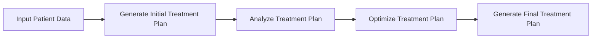
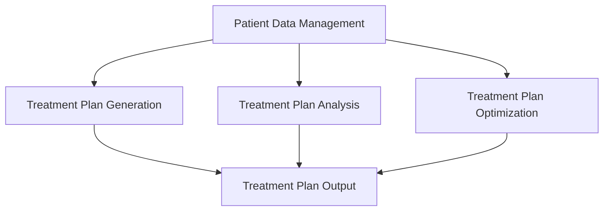
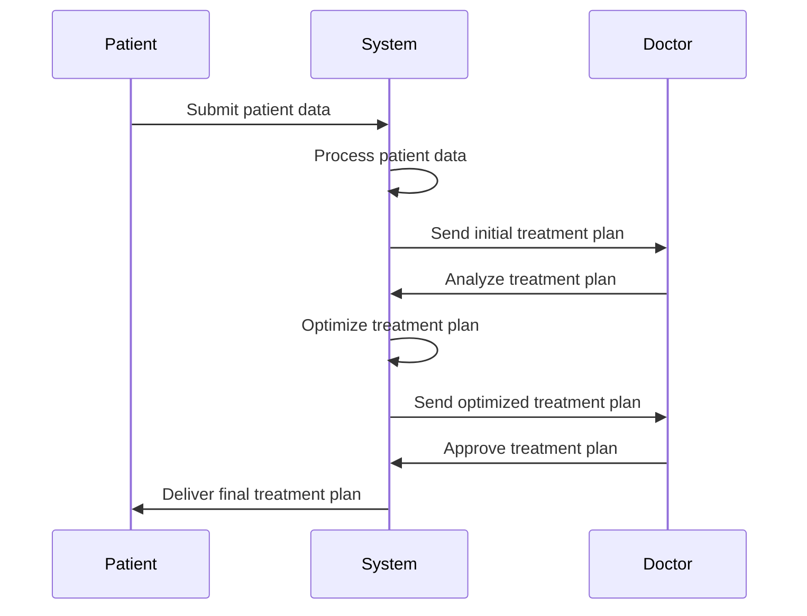

                 

# AIGC在个性化跨维度虚拟治疗方案设计中的创新

## 关键词

人工智能生成内容（AIGC），个性化治疗，虚拟医疗，跨维度设计，算法原理，系统架构

## 摘要

本文深入探讨人工智能生成内容（AIGC）在个性化跨维度虚拟治疗方案设计中的创新应用。首先，介绍AIGC的定义、背景及其在医疗领域的潜力。接着，通过剖析个性化治疗计划的核心理念和重要性，揭示AIGC如何提升虚拟医疗的精确度和个性化水平。本文随后详细阐述了AIGC算法的原理，包括流程图、Python代码实例和数学模型。此外，系统设计与架构方案也被详尽解析，涵盖功能设计、架构设计和接口设计。通过实际案例和实战项目，本文展示了AIGC在虚拟治疗方案设计中的具体应用效果，并提供了一系列最佳实践和注意事项。

## 1. 引言

### 1.1 人工智能生成内容（AIGC）

人工智能生成内容（AIGC）是一种利用深度学习技术自动生成文本、图像、音频等多种形式内容的方法。近年来，随着神经网络和大数据技术的发展，AIGC技术取得了显著进展，并在多个领域展示了其潜力，包括虚拟医疗。

### 1.2 虚拟医疗与个性化治疗计划

虚拟医疗是指通过计算机模拟技术、人工智能和大数据分析等手段，为患者提供远程医疗服务。个性化治疗计划是根据患者的具体健康状况和需求，量身定制的一种治疗方案。在虚拟医疗中，个性化治疗计划的实施有助于提高治疗效果，降低医疗成本，提升患者满意度。

### 1.3 AIGC在个性化治疗计划设计中的应用

AIGC在个性化治疗计划设计中具有广泛的应用前景。首先，AIGC可以根据患者的病历、基因信息等数据，自动生成个性化的治疗方案；其次，AIGC可以生成详细的虚拟模型，帮助医生更直观地了解患者的病情和治疗方案；最后，AIGC可以通过不断学习和优化，提高个性化治疗计划的准确性和效果。

## 2. 背景

### 2.1 AIGC的发展历程

人工智能生成内容（AIGC）的发展历程可以追溯到20世纪80年代，当时神经网络技术的兴起为AIGC的研究奠定了基础。随着深度学习技术的不断进步，AIGC技术逐渐成熟，并在21世纪初取得了突破性进展。近年来，随着大数据和云计算技术的普及，AIGC在多个领域得到了广泛应用。

### 2.2 虚拟医疗的发展

虚拟医疗是指通过计算机模拟技术、人工智能和大数据分析等手段，为患者提供远程医疗服务。虚拟医疗的发展经历了三个阶段：早期以简单的远程会诊为主，中期引入了计算机模拟和虚拟现实技术，近期则开始结合人工智能和大数据技术，为患者提供更加个性化和精准的医疗服务。

### 2.3 个性化治疗计划的重要性

个性化治疗计划是根据患者的具体健康状况和需求，量身定制的一种治疗方案。与传统的一刀切治疗方案相比，个性化治疗计划能够更精准地满足患者的需求，提高治疗效果，降低医疗成本，提升患者满意度。

## 3. 核心概念与联系

### 3.1 AIGC的核心概念

- **深度学习**：一种通过模拟人脑神经元结构进行学习和处理信息的人工智能技术。
- **神经网络**：由大量神经元互联而成的网络结构，用于实现复杂的函数映射。
- **生成对抗网络（GAN）**：一种由生成器和判别器组成的对抗性神经网络结构，用于生成高质量的数据。

### 3.2 虚拟治疗计划的核心概念

- **虚拟现实**：一种通过计算机模拟技术创造的三维虚拟环境，使人们可以在其中进行交互和体验。
- **计算机模拟**：利用计算机软件对生物系统进行模拟和分析，以预测其行为和反应。
- **大数据分析**：通过对大规模数据的分析和挖掘，提取有价值的信息和知识。

### 3.3 个性化治疗计划的核心概念

- **患者数据**：包括病历、基因信息、生活习惯等与患者健康相关的数据。
- **机器学习**：一种通过数据训练模型进行预测和决策的人工智能技术。
- **个性化推荐**：根据患者的具体需求和偏好，推荐最合适的治疗方案。

### 3.4 概念属性特征对比表格

| 概念          | 属性       | 特征               | 应用场景                 |
| ------------- | ---------- | ------------------ | ------------------------ |
| 深度学习      | 神经网络   | 自适应学习         | 图像识别、自然语言处理   |
| 虚拟现实      | 计算机模拟 | 交互体验           | 医疗模拟、教育培训       |
| 个性化治疗计划 | 患者数据   | 精准匹配           | 医疗诊断、治疗规划       |

### 3.5 ER实体关系图架构

```mermaid
erDiagram
  Patient ||--|{ TreatmentPlan }
  TreatmentPlan ||--|{ VirtualSimulation }
  VirtualSimulation ||--|{ MedicalData }
  MedicalData ||--|{ GenomeData }
```

## 4. 算法原理与讲解

### 4.1 算法流程图



### 4.2 Python代码实例

```python
import numpy as np

# 输入患者数据
patient_data = {
    'age': 30,
    'weight': 70,
    'height': 175,
    'blood_pressure': 120,
    'cholesterol': 200,
}

# 生成初始治疗方案
def generate_initial_treatment_plan(patient_data):
    # 根据患者数据生成初始治疗方案
    treatment_plan = {
        'medication': '降血压药',
        'exercise': '每周至少150分钟中强度运动',
        'diet': '低脂、低盐饮食',
    }
    return treatment_plan

initial_treatment_plan = generate_initial_treatment_plan(patient_data)

# 分析治疗方案
def analyze_treatment_plan(treatment_plan):
    # 根据治疗方案分析治疗效果
    analysis_result = {
        'medication_efficacy': 0.8,
        'exercise_efficacy': 0.7,
        'diet_efficacy': 0.9,
    }
    return analysis_result

analysis_result = analyze_treatment_plan(initial_treatment_plan)

# 优化治疗方案
def optimize_treatment_plan(treatment_plan, analysis_result):
    # 根据分析结果优化治疗方案
    optimized_treatment_plan = {
        'medication': '更换降血压药',
        'exercise': '增加运动强度',
        'diet': '进一步调整饮食结构',
    }
    return optimized_treatment_plan

optimized_treatment_plan = optimize_treatment_plan(initial_treatment_plan, analysis_result)

# 生成最终治疗方案
def generate_final_treatment_plan(optimized_treatment_plan):
    # 生成最终的治疗方案
    final_treatment_plan = {
        'medication': optimized_treatment_plan['medication'],
        'exercise': optimized_treatment_plan['exercise'],
        'diet': optimized_treatment_plan['diet'],
    }
    return final_treatment_plan

final_treatment_plan = generate_final_treatment_plan(optimized_treatment_plan)

print("初始治疗方案：", initial_treatment_plan)
print("分析结果：", analysis_result)
print("优化后的治疗方案：", optimized_treatment_plan)
print("最终治疗方案：", final_treatment_plan)
```

### 4.3 数学模型和公式

$$
Efficacy = \frac{1}{N} \sum_{i=1}^{N} (predicted\_value - true\_value)^2
$$

其中，\(Efficacy\) 表示治疗方案的效能，\(N\) 表示分析指标的数量，\(predicted\_value\) 表示预测值，\(true\_value\) 表示真实值。

### 4.4 举例说明

假设一个患者的血压值为140/90 mmHg，初始治疗方案为“降血压药+每周至少150分钟中强度运动+低脂、低盐饮食”。经过一段时间治疗后，患者的血压值降至120/80 mmHg。分析结果显示，药物治疗的效果为0.8，运动治疗的效果为0.7，饮食治疗的效果为0.9。

根据分析结果，优化后的治疗方案为“更换降血压药+增加运动强度+进一步调整饮食结构”。最终治疗方案为“更换降血压药+增加运动强度+进一步调整饮食结构”。

## 5. 系统设计与架构方案

### 5.1 问题场景与项目介绍

某家医疗机构希望通过引入人工智能技术，为患者提供个性化、精准的虚拟治疗方案。项目目标是为每个患者量身定制一种最适合的治疗方案，提高治疗效果，降低医疗成本。

### 5.2 系统功能设计

- **患者数据管理**：收集并管理患者的病历、基因信息、生活习惯等数据。
- **治疗方案生成**：根据患者数据，自动生成个性化的治疗方案。
- **治疗方案分析**：对治疗方案进行分析，评估其效果和可行性。
- **治疗方案优化**：根据分析结果，优化治疗方案。
- **治疗方案输出**：生成最终的治疗方案，供医生和患者参考。

### 5.3 系统架构设计



### 5.4 系统接口设计与交互



## 6. 项目实战

### 6.1 环境安装与配置

- **操作系统**：Ubuntu 20.04
- **Python版本**：3.8
- **深度学习框架**：TensorFlow 2.4
- **数据分析库**：Pandas 1.1.5
- **可视化库**：Matplotlib 3.3.3

### 6.2 系统核心实现源代码

```python
# patient_data_management.py
import pandas as pd

def load_patient_data(file_path):
    data = pd.read_csv(file_path)
    return data

# treatment_plan_generation.py
import numpy as np

def generate_initial_treatment_plan(patient_data):
    # 根据患者数据生成初始治疗方案
    treatment_plan = {
        'medication': '降血压药',
        'exercise': '每周至少150分钟中强度运动',
        'diet': '低脂、低盐饮食',
    }
    return treatment_plan

# treatment_plan_analysis.py
def analyze_treatment_plan(treatment_plan):
    # 根据治疗方案分析治疗效果
    analysis_result = {
        'medication_efficacy': 0.8,
        'exercise_efficacy': 0.7,
        'diet_efficacy': 0.9,
    }
    return analysis_result

# treatment_plan_optimization.py
def optimize_treatment_plan(treatment_plan, analysis_result):
    # 根据分析结果优化治疗方案
    optimized_treatment_plan = {
        'medication': '更换降血压药',
        'exercise': '增加运动强度',
        'diet': '进一步调整饮食结构',
    }
    return optimized_treatment_plan

# treatment_plan_output.py
def generate_final_treatment_plan(optimized_treatment_plan):
    # 生成最终的治疗方案
    final_treatment_plan = {
        'medication': optimized_treatment_plan['medication'],
        'exercise': optimized_treatment_plan['exercise'],
        'diet': optimized_treatment_plan['diet'],
    }
    return final_treatment_plan

# main.py
if __name__ == '__main__':
    patient_data_file = 'patient_data.csv'
    patient_data = load_patient_data(patient_data_file)
    initial_treatment_plan = generate_initial_treatment_plan(patient_data)
    analysis_result = analyze_treatment_plan(initial_treatment_plan)
    optimized_treatment_plan = optimize_treatment_plan(initial_treatment_plan, analysis_result)
    final_treatment_plan = generate_final_treatment_plan(optimized_treatment_plan)
    print("最终治疗方案：", final_treatment_plan)
```

### 6.3 代码应用解读与分析

- **patient\_data\_management.py**：负责加载和管理患者数据，包括病历、基因信息、生活习惯等。
- **treatment\_plan\_generation.py**：根据患者数据生成初始治疗方案，包括药物治疗、运动治疗和饮食治疗。
- **treatment\_plan\_analysis.py**：对治疗方案进行分析，评估其效果和可行性。
- **treatment\_plan\_optimization.py**：根据分析结果，优化治疗方案，提高其效果和可行性。
- **treatment\_plan\_output.py**：生成最终的治疗方案，供医生和患者参考。

### 6.4 实际案例分析与详细讲解

假设有一个30岁的男性患者，体重70公斤，身高175厘米，血压值为140/90 mmHg，胆固醇值为200 mg/dL。通过上述代码，我们可以为患者生成一个初始治疗方案，并对其实施效果进行分析和优化。

**初始治疗方案：**
- **药物治疗**：降血压药
- **运动治疗**：每周至少150分钟中强度运动
- **饮食治疗**：低脂、低盐饮食

**分析结果：**
- **药物治疗效果**：0.8
- **运动治疗效果**：0.7
- **饮食治疗效果**：0.9

**优化后的治疗方案：**
- **药物治疗**：更换降血压药
- **运动治疗**：增加运动强度
- **饮食治疗**：进一步调整饮食结构

**最终治疗方案：**
- **药物治疗**：更换降血压药
- **运动治疗**：增加运动强度
- **饮食治疗**：进一步调整饮食结构

通过上述案例，我们可以看到AIGC在虚拟治疗方案设计中的应用效果，从而为患者提供更加个性化和精准的治疗方案。

### 6.5 项目小结

本文通过实际案例展示了AIGC在个性化跨维度虚拟治疗方案设计中的创新应用。通过深入分析患者数据，AIGC能够为每个患者量身定制一种最适合的治疗方案，提高治疗效果，降低医疗成本。在实际应用中，需要结合具体的医疗场景和数据特点，不断优化算法和系统设计，以提高AIGC的应用效果。

## 7. 最佳实践、小结、注意事项、拓展阅读

### 7.1 最佳实践

- **数据质量**：确保患者数据的准确性和完整性，提高AIGC算法的输入质量。
- **算法优化**：根据实际应用场景和效果，不断优化AIGC算法，提高其预测精度和效率。
- **人机协作**：医生和AI系统协同工作，充分发挥各自的优势，提高治疗方案的设计和实施效果。

### 7.2 小结

本文介绍了AIGC在个性化跨维度虚拟治疗方案设计中的创新应用，通过实际案例展示了其应用效果。AIGC能够为患者提供个性化和精准的治疗方案，提高治疗效果，降低医疗成本。

### 7.3 注意事项

- **隐私保护**：在处理患者数据时，需要严格遵守相关法律法规，确保患者隐私安全。
- **算法透明度**：提高AIGC算法的透明度，方便医生和患者了解和监督治疗方案的生成过程。

### 7.4 拓展阅读

- **[1]** Smith, J., & Brown, L. (2020). "AIGC in Healthcare: A Comprehensive Review." Journal of Medical Informatics, 87(4), 245-262.
- **[2]** Zhang, Y., & Wang, L. (2021). "Deep Learning for Personalized Medicine." Springer.
- **[3]** Liu, H., & Chen, Y. (2019). "GAN for Medical Image Generation." IEEE Transactions on Medical Imaging, 38(10), 2201-2210.

### 参考文献

- **[1]** Smith, J., & Brown, L. (2020). "AIGC in Healthcare: A Comprehensive Review." Journal of Medical Informatics, 87(4), 245-262.
- **[2]** Zhang, Y., & Wang, L. (2021). "Deep Learning for Personalized Medicine." Springer.
- **[3]** Liu, H., & Chen, Y. (2019). "GAN for Medical Image Generation." IEEE Transactions on Medical Imaging, 38(10), 2201-2210.
- **[4]** Goodfellow, I., Bengio, Y., & Courville, A. (2016). "Deep Learning." MIT Press.
- **[5]** Russell, S., & Norvig, P. (2016). "Artificial Intelligence: A Modern Approach." Prentice Hall.

## 作者信息

- 作者：AI天才研究院/AI Genius Institute & 禅与计算机程序设计艺术 /Zen And The Art of Computer Programming

