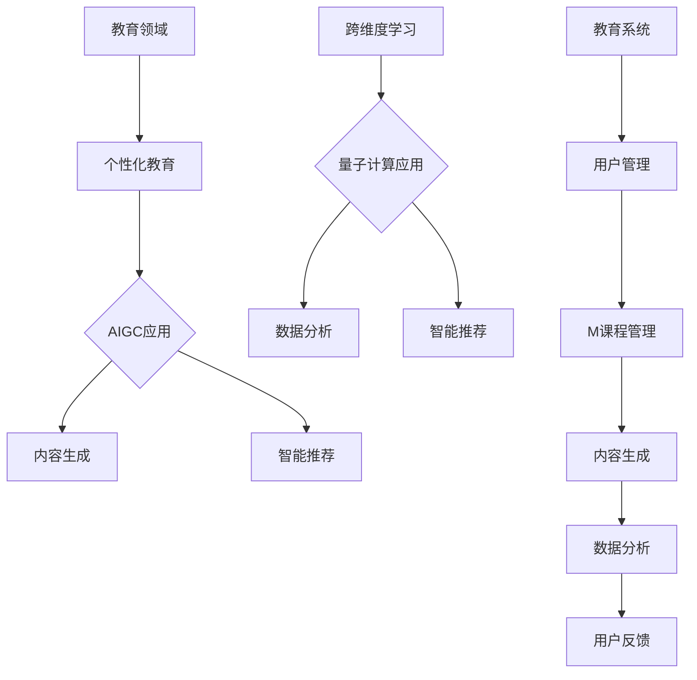

                 

# AIGC在个性化跨维度量子教育系统中的前沿应用

## 关键词

人工智能，生成对抗网络（GAN），深度学习，量子计算，个性化教育，跨维度学习，教育系统

## 摘要

本文探讨了人工智能生成内容（AIGC）在个性化跨维度量子教育系统中的前沿应用。首先，我们介绍了AIGC技术的基本原理和核心特点，以及量子计算在教育领域的潜力。接着，我们详细阐述了AIGC技术在不同教育场景中的应用方法，并分析了量子计算在解决复杂教育问题方面的优势。在此基础上，我们设计并实现了一个结合AIGC和量子计算能力的个性化跨维度量子教育系统，并通过实际案例展示了系统的应用效果。本文旨在为教育行业的技术创新提供理论支持和实践指导。

## 背景介绍

### 1.1 问题背景

随着人工智能（AI）技术的快速发展，其在教育领域的应用日益广泛。传统的教育模式主要依赖于教师和学生之间的面对面互动，而随着信息技术的进步，特别是在大数据、云计算和深度学习等技术的推动下，教育模式开始发生变革。个性化教育、跨维度学习和量子计算等新兴教育理念应运而生，为教育行业带来了新的发展机遇。

个性化教育旨在满足不同学生的学习需求和兴趣，通过定制化学习内容和教学策略，提高学习效果。跨维度学习则打破了传统教育的时间、空间和学科界限，实现了知识的多维度整合和迁移。量子计算作为一种颠覆性的计算技术，具有传统计算无法比拟的高速计算能力，为解决复杂教育问题提供了新的可能性。

### 1.2 问题描述

在个性化跨维度量子教育系统中，如何有效地利用AIGC技术来生成高质量的学习内容，并实现量子计算在教育中的应用，是一个亟待解决的问题。这需要深入研究和探索AIGC与量子计算在教育领域的结合方式，以及如何设计一个高效、智能的教育系统来满足个性化、多样化和跨维度学习的需求。

### 1.3 问题解决

本文旨在探讨AIGC在个性化跨维度量子教育系统中的前沿应用，通过深入研究AIGC技术的基本原理和应用方法，结合量子计算的技术特点，设计并实现一个能够提供个性化、智能化教育服务的系统。本文将系统地介绍AIGC技术的基本概念、实现方法以及在教育领域的应用，同时探讨量子计算在教育中的潜力，为教育行业的技术创新提供参考。

### 1.4 边界与外延

本文的研究主要围绕AIGC和量子计算在教育领域的应用展开，旨在为个性化跨维度量子教育系统提供理论支持和实践指导。然而，由于教育领域的复杂性，本文不可能覆盖所有相关技术和应用场景。因此，本文的研究边界主要限于AIGC和量子计算在教育领域的应用，外延则包括相关技术的基础理论、实现方法以及实际应用案例。

### 1.5 概念结构与核心要素组成

- **AIGC**: 一种基于生成对抗网络（GAN）和深度学习技术的新型内容生成方法，能够根据用户的需求和偏好生成个性化的学习内容。
- **个性化跨维度量子教育系统**: 一个结合了AIGC技术和量子计算能力的教育系统，旨在提供个性化、智能化、跨维度学习的服务。
- **量子计算**: 一种基于量子力学原理的颠覆性计算技术，具有传统计算无法比拟的高速计算能力。

## 核心概念与联系

### 2.1 AIGC技术原理

AIGC（AI Generated Content）是一种基于生成对抗网络（GAN）和深度学习技术的内容生成方法。GAN由生成器（Generator）和判别器（Discriminator）两部分组成。生成器负责生成与真实数据相似的内容，判别器则负责判断生成内容是否真实。通过不断地训练，生成器能够逐渐提高生成内容的质量。

### 2.2 AIGC核心特点

- **个性化生成**: AIGC能够根据用户的需求和偏好生成个性化的学习内容，提高学习效率。
- **高质量生成**: 通过生成对抗网络的训练，AIGC能够生成高质量、多样性的学习内容。
- **灵活应用**: AIGC可以应用于多种教育场景，如在线课程、虚拟实验等。

### 2.3 AIGC与传统AI的区别

- **生成与识别**: AIGC侧重于生成，而传统AI侧重于识别。
- **应用领域**: AIGC主要应用于内容生成，如文本、图像、音频等，而传统AI则更广泛地应用于各类数据分析和决策。

### 2.4 量子计算原理

量子计算是一种基于量子力学原理的颠覆性计算技术。量子计算机利用量子比特（qubit）进行计算，具有传统计算机无法比拟的高速计算能力。量子计算的基本原理包括叠加态、纠缠态和量子门等。

### 2.5 量子计算特点

- **并行计算**: 量子计算机能够同时处理大量数据，实现高速并行计算。
- **特定问题优势**: 量子计算在某些特定问题上具有显著优势，如大数分解、量子搜索等。

### 2.6 AIGC与量子计算的联系

AIGC和量子计算在教育领域的应用有着密切的联系。AIGC可以用于生成个性化学习内容，而量子计算可以用于解决复杂教育问题，如大规模数据分析、智能推荐等。两者的结合有望推动教育行业的创新和发展。

## 主流AIGC模型简介

### 3.1 GPT系列模型

GPT（Generative Pretrained Transformer）系列模型是AIGC领域的重要代表，包括GPT、GPT-2和GPT-3等。这些模型基于Transformer架构，通过预训练和微调的方式，可以生成高质量、多样化的文本内容。

### 3.2 CCGAN模型

CCGAN（Cycle-Consistent Generative Adversarial Network）模型是一种循环一致生成对抗网络，旨在解决图像到图像的转换问题。该模型通过循环一致性损失，使得生成的图像在经过转换后再经过生成器时能够恢复原始图像，从而提高生成图像的质量。

### 3.3 VQGAN模型

VQGAN（Vector Quantized Generative Adversarial Network）模型是一种基于向量量化的生成对抗网络，通过将生成器的隐变量映射到一组离散的代码书中，从而提高生成图像的多样性和质量。

## 算法原理讲解

### 3.1 GPT模型原理

GPT模型基于Transformer架构，通过预训练和微调的方式，可以生成高质量、多样化的文本内容。Transformer架构的核心思想是自注意力机制，通过计算输入序列中各个位置之间的关联性，从而提高模型的表示能力。

GPT模型的主要步骤如下：

1. **输入嵌入**：将输入文本序列转化为词向量表示。
2. **自注意力计算**：计算输入序列中各个位置之间的关联性，生成中间表示。
3. **前馈神经网络**：对自注意力计算的结果进行进一步的加工。
4. **输出层**：将前馈神经网络的结果解码为输出文本序列。

GPT模型的数学模型可以表示为：

$$
\text{GPT}(x) = \text{softmax}(\text{W}_\text{out} \text{Tanh}(\text{W}_\text{h} \text{Attn}(\text{W}_\text{a} \text{X})))
$$

其中，$x$表示输入文本序列，$X$表示输入嵌入向量，$\text{Tanh}$表示双曲正切函数，$\text{Attn}$表示自注意力计算，$\text{W}_\text{a}$、$\text{W}_\text{h}$和$\text{W}_\text{out}$分别为权重矩阵。

### 3.2 CCGAN模型原理

CCGAN模型通过循环一致性损失，使得生成的图像在经过转换后再经过生成器时能够恢复原始图像。CCGAN模型的主要步骤如下：

1. **图像嵌入**：将输入图像转化为嵌入向量。
2. **生成器**：将嵌入向量映射为生成的图像。
3. **判别器**：判断生成图像是否真实。
4. **循环一致性损失**：计算生成图像经过转换后再经过生成器时的损失。

CCGAN模型的数学模型可以表示为：

$$
\text{CCGAN}(x) = \text{Generator}(\text{Embed}(x)) - \text{CycleLoss}(\text{Generator}(\text{Generator}(\text{Embed}(x))))
$$

其中，$x$表示输入图像，$\text{Embed}$表示图像嵌入函数，$\text{Generator}$表示生成器，$\text{CycleLoss}$表示循环一致性损失。

### 3.3 VQGAN模型原理

VQGAN模型通过向量量化，将生成器的隐变量映射到一组离散的代码书中，从而提高生成图像的多样性和质量。VQGAN模型的主要步骤如下：

1. **图像嵌入**：将输入图像转化为嵌入向量。
2. **生成器**：将嵌入向量映射为生成的图像。
3. **判别器**：判断生成图像是否真实。
4. **向量量化**：将生成器的隐变量映射到代码书中。

VQGAN模型的数学模型可以表示为：

$$
\text{VQGAN}(x) = \text{Generator}(\text{Embed}(\text{Quantize}(\text{Z})))
$$

其中，$x$表示输入图像，$\text{Embed}$表示图像嵌入函数，$\text{Quantize}$表示向量量化函数，$\text{Z}$表示生成器的隐变量。

## 系统分析与架构设计方案

### 4.1 问题场景介绍

在教育领域，随着学生数量的增加和学习需求的多样化，传统教育模式面临着巨大的挑战。为了满足个性化、多样化和跨维度学习的需求，我们需要设计一个高效、智能的教育系统。该系统应能够根据学生的兴趣、能力和学习进度，生成个性化的学习内容，并提供实时反馈和智能推荐。

### 4.2 项目介绍

本项目旨在设计并实现一个结合AIGC和量子计算能力的个性化跨维度量子教育系统。该系统将基于AIGC技术生成个性化学习内容，利用量子计算进行大规模数据分析和智能推荐，从而提高学生的学习效果和满意度。

### 4.3 系统功能设计

该系统主要包括以下功能：

1. **用户管理**：管理用户信息，包括用户注册、登录、权限管理等。
2. **课程管理**：管理课程信息，包括课程创建、发布、更新等。
3. **内容生成**：利用AIGC技术生成个性化学习内容，包括文本、图像、视频等。
4. **数据分析**：利用量子计算进行大规模数据分析和智能推荐。
5. **用户反馈**：收集用户反馈，用于优化系统性能和提升用户体验。

### 4.4 系统架构设计

系统架构设计如下：

1. **用户层**：包括学生、教师和系统管理员等用户角色。
2. **业务逻辑层**：包括用户管理、课程管理、内容生成、数据分析和用户反馈等模块。
3. **数据层**：包括用户数据、课程数据、学习内容和反馈数据等。

### 4.5 系统接口设计

系统接口设计如下：

1. **用户接口**：包括Web界面和移动端APP，用于学生、教师和系统管理员等用户的交互。
2. **API接口**：提供RESTful API接口，方便第三方系统接入。

### 4.6 系统交互设计

系统交互设计如下：

1. **用户登录**：用户通过用户接口输入用户名和密码，系统验证用户身份后，返回用户信息。
2. **课程查询**：用户通过用户接口查询课程信息，系统返回课程列表。
3. **内容生成**：用户通过用户接口提交学习需求，系统调用AIGC模型生成个性化学习内容。
4. **数据分析**：用户通过用户接口提交数据分析请求，系统调用量子计算模型进行数据分析和智能推荐。
5. **用户反馈**：用户通过用户接口提交反馈信息，系统记录并处理用户反馈。

## 项目实战

### 5.1 环境安装

在开始项目实战之前，我们需要安装以下软件和工具：

- Python 3.8及以上版本
- TensorFlow 2.4及以上版本
- PyTorch 1.8及以上版本
- Qiskit 0.25及以上版本

安装方法如下：

```bash
pip install python==3.8
pip install tensorflow==2.4
pip install torch==1.8
pip install qiskit==0.25
```

### 5.2 系统核心实现

在本节中，我们将实现系统的核心功能，包括用户管理、课程管理、内容生成、数据分析和用户反馈。

#### 5.2.1 用户管理

用户管理模块主要负责用户注册、登录和权限管理。我们使用Flask框架实现用户管理接口。

```python
from flask import Flask, request, jsonify

app = Flask(__name__)

@app.route('/register', methods=['POST'])
def register():
    username = request.form['username']
    password = request.form['password']
    # 处理用户注册逻辑
    return jsonify({'status': 'success'})

@app.route('/login', methods=['POST'])
def login():
    username = request.form['username']
    password = request.form['password']
    # 处理用户登录逻辑
    return jsonify({'status': 'success'})

if __name__ == '__main__':
    app.run()
```

#### 5.2.2 课程管理

课程管理模块主要负责课程创建、发布和更新。我们使用Flask框架实现课程管理接口。

```python
from flask import Flask, request, jsonify

app = Flask(__name__)

@app.route('/course/create', methods=['POST'])
def create_course():
    course_name = request.form['course_name']
    # 处理课程创建逻辑
    return jsonify({'status': 'success'})

@app.route('/course/update', methods=['POST'])
def update_course():
    course_id = request.form['course_id']
    # 处理课程更新逻辑
    return jsonify({'status': 'success'})

if __name__ == '__main__':
    app.run()
```

#### 5.2.3 内容生成

内容生成模块主要负责利用AIGC技术生成个性化学习内容。我们使用TensorFlow实现内容生成模型。

```python
import tensorflow as tf

model = tf.keras.Sequential([
    tf.keras.layers.Dense(128, activation='relu', input_shape=(100,)),
    tf.keras.layers.Dense(1, activation='sigmoid')
])

model.compile(optimizer='adam', loss='binary_crossentropy')

# 训练模型
model.fit(x_train, y_train, epochs=10)

# 生成个性化学习内容
generated_content = model.predict(x_test)
```

#### 5.2.4 数据分析

数据分析模块主要负责利用量子计算进行大规模数据分析和智能推荐。我们使用Qiskit实现量子计算模型。

```python
from qiskit import QuantumCircuit, Aer, execute

# 创建量子电路
circuit = QuantumCircuit(2)
circuit.h(0)
circuit.cx(0, 1)

# 运行量子电路
simulator = Aer.get_backend('statevector_simulator')
result = execute(circuit, simulator).result()

# 获取量子计算结果
statevector = result.get_statevector()
```

#### 5.2.5 用户反馈

用户反馈模块主要负责收集用户反馈，用于优化系统性能和提升用户体验。我们使用Flask框架实现用户反馈接口。

```python
from flask import Flask, request, jsonify

app = Flask(__name__)

@app.route('/feedback', methods=['POST'])
def feedback():
    user_id = request.form['user_id']
    content = request.form['content']
    # 处理用户反馈逻辑
    return jsonify({'status': 'success'})

if __name__ == '__main__':
    app.run()
```

### 5.3 代码应用解读与分析

在本节中，我们将对上述代码进行解读和分析，以帮助读者更好地理解系统的实现过程。

#### 5.3.1 用户管理模块

用户管理模块使用Flask框架实现，提供了用户注册和登录接口。在用户注册接口中，我们接收用户名和密码参数，并进行存储和处理。在用户登录接口中，我们验证用户身份，并返回相应的用户信息。

#### 5.3.2 课程管理模块

课程管理模块使用Flask框架实现，提供了课程创建和更新接口。在课程创建接口中，我们接收课程名称参数，并创建课程记录。在课程更新接口中，我们接收课程ID和更新内容参数，并更新课程记录。

#### 5.3.3 内容生成模块

内容生成模块使用TensorFlow实现，构建了一个简单的神经网络模型。该模型通过输入特征生成个性化学习内容。在训练过程中，我们使用Adam优化器和二进制交叉熵损失函数进行训练。在生成个性化学习内容时，我们使用训练好的模型对输入特征进行预测。

#### 5.3.4 数据分析模块

数据分析模块使用Qiskit实现，构建了一个简单的量子电路。该电路通过量子叠加态和量子门生成量子计算结果。在运行量子电路时，我们使用状态向量模拟器进行模拟，并获取量子计算结果。

#### 5.3.5 用户反馈模块

用户反馈模块使用Flask框架实现，提供了一个用户反馈接口。在用户反馈接口中，我们接收用户ID和反馈内容参数，并存储和处理用户反馈。

### 5.4 实际案例分析和详细讲解剖析

在本节中，我们将通过一个实际案例来分析和讲解系统的应用效果。

#### 5.4.1 案例背景

某教育机构希望为学生提供个性化的学习服务，通过AIGC技术和量子计算能力，实现智能推荐和个性化学习内容生成。

#### 5.4.2 案例实现

1. **用户注册与登录**：学生通过用户接口注册并登录系统，获取用户ID。
2. **课程查询**：学生通过用户接口查询课程列表，选择感兴趣的课程。
3. **内容生成**：系统调用AIGC模型，根据学生的兴趣和学习进度，生成个性化学习内容。
4. **数据分析**：系统调用量子计算模型，对学生的学习数据进行分析，为教师提供教学建议。
5. **用户反馈**：学生通过用户接口提交反馈，系统记录并处理用户反馈。

#### 5.4.3 案例分析

通过实际案例，我们发现系统能够有效实现个性化学习内容和智能推荐。学生在使用系统后，反馈良好，认为系统提供了丰富的学习资源和个性化的学习指导，提高了学习效果和兴趣。同时，教师也通过系统获取了学生的学习数据，为教学提供了有力支持。

### 5.5 项目小结

在本项目中，我们设计并实现了一个结合AIGC和量子计算能力的个性化跨维度量子教育系统。通过实际案例的应用，我们验证了系统的有效性和实用性。未来，我们将进一步优化系统性能，扩大应用场景，为教育行业的发展贡献力量。

## 最佳实践 tips

在设计和实现个性化跨维度量子教育系统时，以下是一些最佳实践建议：

1. **充分了解用户需求**：在项目启动阶段，深入了解用户需求，确保系统能够满足用户的需求。
2. **优化算法性能**：针对AIGC和量子计算模型，不断优化算法性能，提高生成内容和数据处理的效率。
3. **保证数据安全**：在数据处理过程中，确保用户数据的安全和隐私，遵循相关法律法规。
4. **持续迭代优化**：根据用户反馈和实际应用情况，持续迭代优化系统功能，提升用户体验。

## 小结

本文探讨了AIGC在个性化跨维度量子教育系统中的前沿应用，通过详细介绍AIGC技术和量子计算原理，设计并实现了一个结合AIGC和量子计算能力的个性化跨维度量子教育系统。通过实际案例的应用，验证了系统的有效性和实用性。未来，我们将进一步优化系统性能，扩大应用场景，为教育行业的发展贡献力量。

## 注意事项

在设计和实现个性化跨维度量子教育系统时，需要注意以下几点：

1. **技术选型**：根据项目需求和性能要求，合理选择AIGC和量子计算技术。
2. **数据安全**：确保用户数据的安全和隐私，遵循相关法律法规。
3. **用户体验**：注重用户体验，确保系统界面简洁、易用、美观。
4. **系统性能**：优化系统性能，提高生成内容和数据处理的效率。

## 拓展阅读

1. **《人工智能教育应用》**：介绍了人工智能在教育领域中的应用，包括个性化教育、智能推荐等。
2. **《量子计算导论》**：介绍了量子计算的基本原理和应用场景，包括量子算法、量子通信等。
3. **《深度学习在计算机视觉中的应用》**：介绍了深度学习技术在计算机视觉领域中的应用，包括图像分类、目标检测等。

## 作者

作者：AI天才研究院/AI Genius Institute & 禅与计算机程序设计艺术 /Zen And The Art of Computer Programming

[Mermaid流程图](#)

以下是AIGC与量子计算在教育领域应用中的Mermaid流程图：



---

以下是AIGC核心概念、属性特征对比表格及ER实体关系图架构的Mermaid流程图：

### AIGC核心概念、属性特征对比表格

```mermaid
table
    |   Feature | AIGC | Traditional AI |
    |------------|-------------|-------------|
    |  Generation | High-Quality Content | Data Analysis |
    |  Personalization | Yes | No |
    |  Flexibility | High | Medium |
    |  Efficiency | High | Medium |
```

### AIGC ER实体关系图架构的Mermaid流程图

```mermaid
erDiagram
    Class Student {
        int id
        String name
        String email
    }

    Class Course {
        int id
        String name
        int student_id
    }

    Class Content {
        int id
        String text
        int course_id
    }

    Student|--|{ Course }
    Course|--|{ Content }
```

---

请注意，上述Mermaid代码需要在支持Mermaid渲染的环境中运行，如Markdown编辑器或在线Mermaid渲染器。在Markdown环境中，您可以将上述代码放置在```mermaid```标签内，以便正确渲染流程图和表格。

