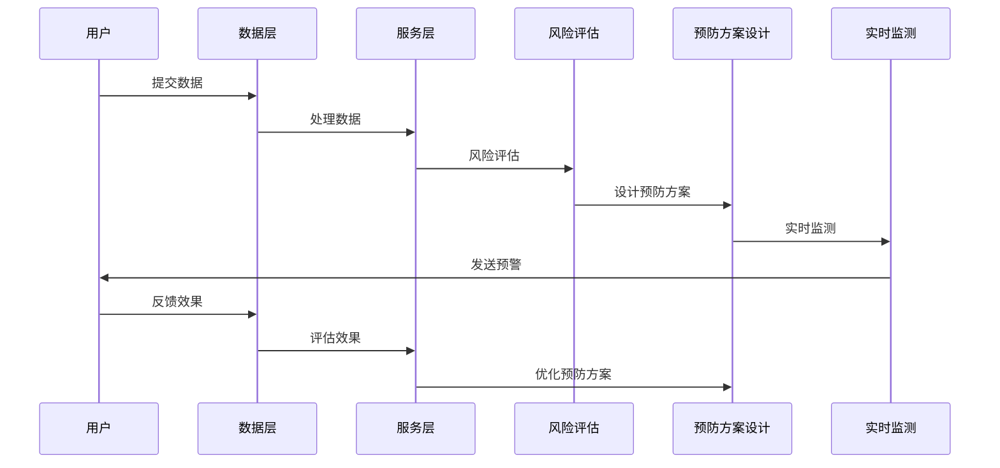
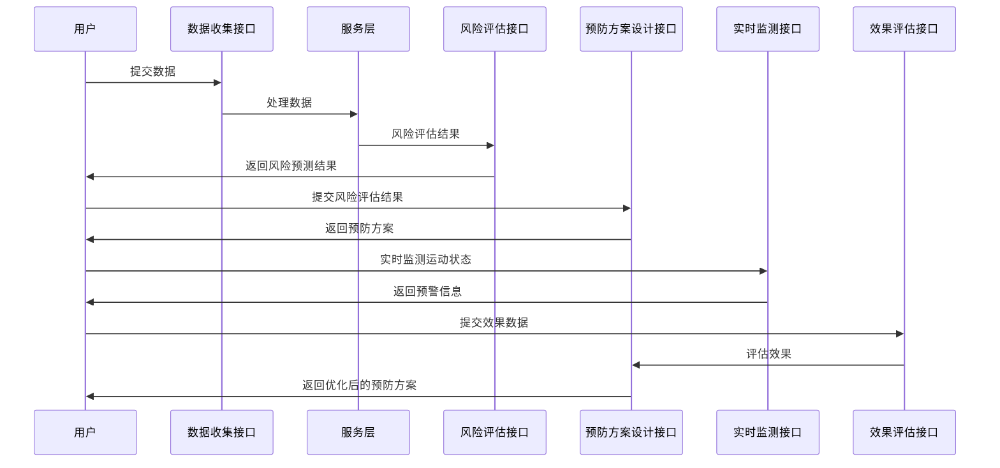
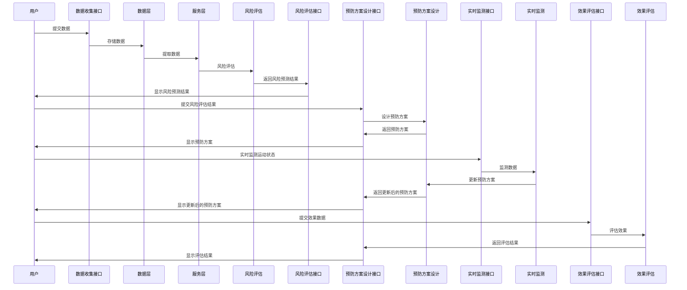

                 

### 第一部分: AIGC在个性化运动损伤预防中的背景与基础

#### 第1章: AIGC与个性化运动损伤预防概述

##### 1.1 问题背景

随着社会的发展和人们生活水平的提高，运动已成为日常生活中不可或缺的一部分。然而，运动过程中难免会发生各种损伤，这不仅影响了运动者的健康，也给医疗系统带来了巨大的压力。据世界卫生组织（WHO）统计，全球每年因运动损伤导致的医疗费用高达数十亿美元。因此，如何有效地预防和减少运动损伤成为了一个迫切需要解决的问题。

传统的运动损伤预防方法主要包括以下几个方面的内容：一是通过运动前的热身和拉伸来增加肌肉和关节的灵活性；二是通过运动后的放松和恢复来减少肌肉酸痛和损伤；三是通过合理的运动计划和科学的训练方法来降低运动风险。然而，这些方法往往存在一定的局限性，如无法根据个体差异进行精准的预防、难以实时监测运动过程中的风险等。

##### 1.2 AIGC技术概述

AIGC（AI-Generated Content），即人工智能生成内容，是一种利用人工智能技术自动生成文本、图像、视频等内容的创新技术。AIGC技术主要包括文本生成、图像生成、视频生成等方面，其核心在于通过机器学习算法，从大量数据中学习到生成规则，从而实现自动化的内容创作。

近年来，AIGC技术在各个领域得到了广泛的应用，如新闻写作、广告创意、艺术创作等。AIGC技术的出现，不仅提高了内容创作的效率，还大大丰富了内容创作的形式。在运动损伤预防领域，AIGC技术也有望发挥重要作用，通过个性化的预防方案设计，提高运动损伤预防的精准度和有效性。

##### 1.3 个性化运动损伤预防需求

个性化运动损伤预防的核心在于根据个体的不同特征，制定出针对性的预防方案。具体来说，个性化运动损伤预防需求主要包括以下几个方面：

1. **个体差异分析**：需要对个体的年龄、性别、身体状况、运动习惯等多个因素进行综合分析，以了解个体的运动损伤风险。

2. **实时监测与预警**：通过可穿戴设备等手段，实时监测个体的运动数据，如心率、血压、运动强度等，当发现异常时及时预警。

3. **个性化预防方案**：根据个体的差异和实时监测结果，制定出个性化的预防方案，包括运动计划、康复训练、营养建议等。

4. **预防效果评估**：对个性化预防方案进行效果评估，根据评估结果调整和优化预防方案。

##### 1.4 传统方法与不足

传统的运动损伤预防方法在实施过程中存在以下不足：

1. **无法实现个性化**：传统方法往往采用统一的预防措施，无法根据个体的差异进行精准的预防。

2. **监测手段有限**：传统的监测手段相对单一，难以全面了解个体的运动状态。

3. **预防效果评估不足**：缺乏对预防效果的系统评估，难以确保预防措施的有效性。

##### 1.5 问题解决

AIGC技术在个性化运动损伤预防中具有以下优势：

1. **数据分析与挖掘**：AIGC技术可以充分利用大数据和机器学习算法，对个体的运动数据进行分析和挖掘，为个性化预防方案提供科学依据。

2. **个性化方案设计**：通过AIGC技术，可以自动生成个性化的运动计划、康复训练和营养建议，提高预防效果。

3. **实时监测与预警**：AIGC技术可以实时监测个体的运动状态，及时发现潜在的风险，并提供预警。

4. **预防效果评估**：通过AIGC技术，可以对个性化预防方案进行效果评估，及时调整和优化。

##### 1.6 边界与外延

1. **AIGC应用范围**：AIGC技术不仅可以在运动损伤预防中应用，还可以在其他健康领域，如疾病预防、康复治疗等方面发挥作用。

2. **运动损伤预防的相关领域**：运动损伤预防涉及多个学科领域，如运动医学、体育科学、计算机科学、数据分析等。

3. **概念结构与核心要素**：

   - **AIGC技术核心概念**：人工智能、生成内容、机器学习算法等。

   - **个性化运动损伤预防的关键要素**：个体差异分析、实时监测、个性化预防方案、预防效果评估等。

### 总结

本文介绍了AIGC技术在个性化运动损伤预防中的应用背景、核心概念和技术优势，以及个性化运动损伤预防的需求和传统方法的不足。接下来，我们将进一步探讨AIGC技术的基础、个性化运动损伤风险评估和预防方案设计，以及实际应用中的系统实现和项目实战。希望通过本文的阐述，能够为读者提供对AIGC在个性化运动损伤预防中的深入理解和应用启示。

### 第2章: AIGC技术基础

#### 2.1 AIGC原理与算法

##### 2.1.1 AIGC定义与特点

AIGC（AI-Generated Content）是一种利用人工智能技术自动生成文本、图像、视频等内容的创新技术。与传统的人工内容创作相比，AIGC具有以下特点：

1. **高效性**：AIGC技术可以快速生成大量内容，大大提高了内容创作的效率。

2. **多样性**：AIGC技术可以根据用户需求，生成不同类型、风格和主题的内容。

3. **个性化**：AIGC技术可以根据用户的历史数据和行为模式，生成个性化的内容。

4. **创新性**：AIGC技术可以创造出独特的内容，为内容创作提供了新的可能性。

##### 2.1.2 常见AIGC算法介绍

AIGC技术涉及多个算法，以下介绍几种常见的AIGC算法：

1. **生成对抗网络（GAN）**：GAN是一种无监督学习算法，通过生成器和判别器的对抗训练，生成逼真的图像。

   - **生成器**：生成假图像。
   - **判别器**：判断图像是真还是假。
   - **训练过程**：生成器和判别器相互竞争，生成器的目标是生成越来越真实的图像，而判别器的目标是正确判断图像的真实性。

2. **变分自编码器（VAE）**：VAE是一种基于概率模型的生成模型，通过编码器和解码器，将数据转换为潜在空间，并在潜在空间中生成新数据。

   - **编码器**：将数据压缩到低维潜在空间。
   - **解码器**：将潜在空间中的数据解码回高维数据。
   - **训练过程**：通过最小化重建误差和潜在空间中的KL散度，优化编码器和解码器的参数。

3. **文本生成模型（如GPT-3）**：文本生成模型通过学习大量的文本数据，生成具有自然语言特性的文本。

   - **模型结构**：基于Transformer架构，包含多个自注意力层。
   - **训练过程**：通过无监督预训练和有监督微调，使模型学会生成高质量文本。

4. **图像到图像翻译（如CycleGAN）**：CycleGAN是一种无监督学习算法，可以将一种图像风格转换为另一种图像风格。

   - **模型结构**：包含两个生成器和两个鉴别器。
   - **训练过程**：通过循环一致性损失和对抗损失，使生成器学会风格转换。

#### 2.2 数据收集与处理

##### 2.2.1 数据来源

AIGC技术依赖于大量的高质量数据，数据来源主要包括：

1. **公开数据集**：如ImageNet、COCO、Text8等，涵盖多种类型的数据。
2. **社交媒体数据**：如Twitter、Instagram等，提供丰富的用户生成内容。
3. **企业数据**：如电商交易数据、医疗数据等，为企业提供个性化服务。

##### 2.2.2 数据处理方法

数据处理是AIGC技术中至关重要的一环，主要方法包括：

1. **数据清洗**：去除噪声数据和异常值，提高数据质量。
2. **数据增强**：通过旋转、缩放、裁剪等操作，增加数据的多样性。
3. **特征提取**：从数据中提取出有用的特征，用于模型训练和推理。
4. **数据归一化**：将数据映射到同一尺度，便于模型训练。

#### 2.3 AIGC应用案例

##### 2.3.1 相关应用场景

AIGC技术在多个领域都有广泛的应用，以下介绍几个典型的应用场景：

1. **内容创作**：通过AIGC技术，自动生成新闻文章、广告文案、音乐等。
2. **艺术创作**：利用AIGC技术，生成独特的艺术作品，如绘画、音乐等。
3. **医疗诊断**：通过AIGC技术，辅助医生进行疾病诊断，提高诊断准确率。
4. **智能客服**：利用AIGC技术，自动生成客服回答，提高服务效率。

##### 2.3.2 案例分析

1. **自动写作**：利用GPT-3模型，自动生成新闻文章、博客等。例如，OpenAI的GPT-3模型，可以通过输入简单的提示，生成高质量的英文文章。
2. **图像生成**：利用GAN模型，自动生成高质量的艺术作品。例如，DeepArt.io利用GAN技术，可以将用户提供的图片转换为艺术风格的图像。
3. **视频生成**：利用视频生成模型，自动生成视频内容。例如，DeepMind的VideoGen模型，可以生成具有连贯性和情感表达的视频。

### 总结

本章介绍了AIGC技术的原理、算法、数据收集与处理方法，以及相关应用案例。通过这些内容，读者可以对AIGC技术有一个全面的了解，为后续章节的个性化运动损伤风险评估和预防方案设计提供基础。

### 第3章: 个性化运动损伤风险评估

#### 3.1 风险评估模型建立

##### 3.1.1 数据收集与预处理

个性化运动损伤风险评估首先需要收集与个体相关的数据，这些数据包括但不限于：

1. **基础健康数据**：如年龄、性别、身高、体重、体质指数（BMI）等。
2. **运动数据**：如运动类型、运动频率、运动时长、运动强度等。
3. **生理数据**：如心率、血压、血氧饱和度等。
4. **行为数据**：如睡眠质量、饮食习惯、心理状态等。

数据收集完成后，需要进行预处理，包括数据清洗、数据归一化和特征提取等步骤。

- **数据清洗**：去除噪声数据和异常值，确保数据的准确性。
- **数据归一化**：将不同类型的数据映射到同一尺度，便于模型训练。
- **特征提取**：从原始数据中提取出有用的特征，用于模型训练和预测。

##### 3.1.2 风险评估模型构建

风险评估模型的构建主要包括以下几个步骤：

1. **选择合适的算法**：根据数据特点和风险评估需求，选择合适的机器学习算法。常见的算法包括决策树、随机森林、支持向量机（SVM）、神经网络等。
2. **模型训练**：利用预处理后的数据，对选择的算法进行训练，得到模型参数。
3. **模型评估**：通过交叉验证等方法，对模型进行评估，选择性能最优的模型。

在构建风险评估模型时，需要考虑以下几个方面：

- **数据多样性**：确保数据覆盖各个风险因素，提高模型的泛化能力。
- **模型复杂度**：避免过度拟合，确保模型能够在新的数据上表现出良好的性能。
- **评估指标**：根据风险评估的需求，选择合适的评估指标，如准确率、召回率、F1分数等。

#### 3.2 风险评估算法

##### 3.2.1 算法原理与流程

风险评估算法的核心是通过对个体数据的分析，预测个体在未来一段时间内发生运动损伤的概率。以下介绍一种常见风险评估算法——逻辑回归。

1. **逻辑回归模型**：

   逻辑回归是一种广义线性模型，用于分类问题。在风险评估中，逻辑回归模型可以用来预测个体发生运动损伤的概率。

   - **模型公式**：
     $$
     \hat{P}(Y=1) = \frac{1}{1 + e^{-(\beta_0 + \beta_1X_1 + \beta_2X_2 + \ldots + \beta_nX_n})}
     $$
     其中，$Y$表示运动损伤的发生情况（0表示未发生，1表示发生），$X_1, X_2, \ldots, X_n$表示个体的特征，$\beta_0, \beta_1, \beta_2, \ldots, \beta_n$是模型的参数。

2. **算法流程**：

   - **数据预处理**：对收集到的数据集进行清洗、归一化和特征提取。
   - **模型训练**：利用预处理后的数据集，通过梯度下降等优化方法，训练逻辑回归模型。
   - **模型评估**：通过交叉验证等方法，评估模型的性能。
   - **预测**：利用训练好的模型，对新的个体数据预测运动损伤发生的概率。

##### 3.2.2 Python实现示例

以下是一个简单的逻辑回归模型实现的Python代码示例：

```python
import numpy as np
import pandas as pd
from sklearn.linear_model import LogisticRegression
from sklearn.model_selection import train_test_split
from sklearn.metrics import accuracy_score

# 数据加载与预处理
data = pd.read_csv('data.csv')
X = data.drop(['target'], axis=1)
y = data['target']

# 数据集划分
X_train, X_test, y_train, y_test = train_test_split(X, y, test_size=0.2, random_state=42)

# 模型训练
model = LogisticRegression()
model.fit(X_train, y_train)

# 模型评估
y_pred = model.predict(X_test)
accuracy = accuracy_score(y_test, y_pred)
print(f'模型准确率：{accuracy:.2f}')
```

#### 3.3 风险评估应用

##### 3.3.1 运动损伤风险评估流程

运动损伤风险评估的基本流程如下：

1. **数据收集**：收集与个体相关的各种数据，包括基础健康数据、运动数据、生理数据和行为数据等。
2. **数据预处理**：对收集到的数据集进行清洗、归一化和特征提取。
3. **模型构建**：选择合适的风险评估算法，构建风险评估模型。
4. **模型训练与评估**：利用预处理后的数据集，对模型进行训练和评估，选择性能最优的模型。
5. **预测**：利用训练好的模型，对新的个体数据预测运动损伤发生的概率。

##### 3.3.2 实际案例解析

以下是一个实际案例解析：

某运动员的个体数据如下：

- 年龄：30岁
- 性别：男
- 身高：180cm
- 体重：80kg
- 运动类型：篮球
- 运动频率：每周5次
- 运动时长：每次2小时
- 心率：每分钟120次
- 血压：120/80 mmHg
- 血氧饱和度：98%
- 睡眠质量：良好
- 饮食习惯：均衡

利用构建好的风险评估模型，对该运动员进行运动损伤风险评估，预测其未来一个月内发生运动损伤的概率。假设模型预测的概率为0.6，即有60%的可能性发生运动损伤。

针对这一预测结果，教练和运动员可以采取以下措施：

1. **增加热身和拉伸**：在每次运动前，增加热身和拉伸的时间，提高肌肉和关节的灵活性。
2. **调整运动强度**：在短期内适当降低运动强度，避免过度疲劳。
3. **加强康复训练**：增加康复训练的频率和强度，提高身体的恢复能力。
4. **调整饮食和睡眠**：保持良好的饮食习惯和充足的睡眠，提高身体的抵抗力。

通过这些措施，可以有效降低运动损伤的风险。

### 总结

本章介绍了个性化运动损伤风险评估的模型建立方法、风险评估算法以及实际应用。通过逻辑回归等算法，可以对个体进行运动损伤风险评估，为个性化预防方案的设计提供依据。接下来，我们将探讨个性化运动损伤预防方案的设计和实施。

### 第4章: 个性化运动损伤预防方案设计

#### 4.1 预防方案设计思路

个性化运动损伤预防方案的设计思路主要包括以下几个方面：

##### 4.1.1 预防目标与策略

1. **预防目标**：降低个体在运动过程中发生损伤的概率，提高运动安全性。
2. **预防策略**：结合个体差异和实时监测数据，制定个性化的预防措施，包括运动计划、康复训练、营养建议等。

##### 4.1.2 个性化干预措施

1. **运动计划**：根据个体的运动能力、运动类型和运动频率，制定合理的运动计划，避免过度负荷。
2. **康复训练**：针对个体的受伤部位和程度，制定个性化的康复训练计划，加快康复速度。
3. **营养建议**：根据个体的身体状况和运动需求，提供合理的营养建议，增强身体抵抗力。

##### 4.1.3 实时监测与预警

1. **实时监测**：利用可穿戴设备等手段，实时监测个体的运动数据，如心率、血压、运动强度等。
2. **预警机制**：当监测到异常数据时，及时发出预警，提醒个体调整运动策略。

#### 4.2 运动方案优化

##### 4.2.1 运动方案制定

1. **目标设定**：根据个体的运动能力、运动目标和损伤风险，设定合理的运动目标。
2. **计划制定**：制定详细的运动计划，包括运动类型、运动频率、运动时长和运动强度等。
3. **策略调整**：根据实时监测数据和预防效果，动态调整运动计划，确保运动安全。

##### 4.2.2 运动方案优化算法

1. **优化目标**：最小化运动损伤风险，最大化运动效果。
2. **优化算法**：采用遗传算法、粒子群优化等智能优化算法，对运动方案进行优化。

以下是一个简单的遗传算法优化运动方案的Python代码示例：

```python
import numpy as np
import random

# 运动方案编码
def encode运动方案(params):
    # 编码运动类型、频率、时长和强度等参数
    return np.array([params['运动类型'], params['频率'], params['时长'], params['强度']])

# 运动方案解码
def decode运动方案(code):
    # 解码运动类型、频率、时长和强度等参数
    return {
        '运动类型': code[0],
        '频率': code[1],
        '时长': code[2],
        '强度': code[3]
    }

# 遗传算法优化运动方案
def genetic_algorithm(population, fitness_func, max_gen=100, crossover_rate=0.8, mutation_rate=0.05):
    for _ in range(max_gen):
        # 计算适应度
        fitness_scores = [fitness_func(ind) for ind in population]
        
        # 选择
        selected = random.choices(population, weights=fitness_scores, k=len(population))
        
        # 交叉
        offspring = []
        for i in range(0, len(selected), 2):
            parent1, parent2 = selected[i], selected[i+1]
            crossover_point = random.randint(1, len(parent1)-1)
            child1 = parent1[:crossover_point] + parent2[crossover_point:]
            child2 = parent2[:crossover_point] + parent1[crossover_point:]
            offspring.append(child1)
            offspring.append(child2)
        
        # 变异
        for i in range(len(offspring)):
            if random.random() < mutation_rate:
                index = random.randint(0, len(offspring[i])-1)
                offspring[i][index] = random.choice([0, 1, 2, 3])  # 示例：变异运动强度
        
        # 更新种群
        population = offspring
    
    # 返回最优运动方案
    best_fitness = max(fitness_scores)
    best_index = fitness_scores.index(best_fitness)
    return decode运动方案(population[best_index])

# 运动方案优化示例
population = [
    encode运动方案({'运动类型': 0, '频率': 3, '时长': 60, '强度': 2}),
    encode运动方案({'运动类型': 1, '频率': 4, '时长': 90, '强度': 3}),
    # ... 更多运动方案
]

best_plan = genetic_algorithm(population, fitness_func=lambda x: calculate_fitness(x))
print(f'最优运动方案：{best_plan}')
```

#### 4.3 运动方案实施

##### 4.3.1 实施步骤

1. **个体评估**：对个体进行全面的评估，包括基础健康数据、运动能力、损伤风险等。
2. **方案制定**：根据个体评估结果，制定个性化的运动预防方案。
3. **方案实施**：按照制定的运动方案，进行运动训练和康复训练。
4. **效果评估**：定期对运动方案的效果进行评估，根据评估结果调整和优化方案。

##### 4.3.2 实施效果评估

1. **评估指标**：包括运动损伤发生率、运动成绩、健康状况等。
2. **数据收集**：收集实施运动方案前后的一系列数据，包括运动数据、生理数据、行为数据等。
3. **统计分析**：利用统计分析方法，评估运动方案的有效性。

### 总结

本章介绍了个性化运动损伤预防方案的设计思路、运动方案优化算法以及实施效果评估方法。通过个性化预防方案的设计和实施，可以有效降低运动损伤的风险，提高运动安全性。

### 第5章: 个性化运动损伤预防系统实现

#### 5.1 系统功能设计

个性化运动损伤预防系统需要实现以下几个核心功能：

1. **数据收集与处理**：从多个渠道收集个体运动数据、生理数据和行为数据，并进行预处理，提取有用特征。
2. **风险评估**：利用机器学习算法，对个体进行运动损伤风险评估，预测损伤发生的概率。
3. **预防方案设计**：根据风险评估结果，制定个性化的预防方案，包括运动计划、康复训练和营养建议等。
4. **实时监测与预警**：通过可穿戴设备等手段，实时监测个体的运动状态，及时发现潜在风险并发出预警。
5. **效果评估与优化**：定期对预防方案的效果进行评估，根据评估结果调整和优化预防方案。

##### 5.1.1 功能需求分析

1. **数据收集与处理**：系统需要支持多种数据类型的收集和处理，如文本、图像、视频等，并具备数据清洗、归一化和特征提取等功能。
2. **风险评估**：系统需要具备高效的算法实现，能够快速对大量数据进行处理和分析，生成风险预测结果。
3. **预防方案设计**：系统需要提供灵活的方案设计工具，支持多种预防措施的组合和调整。
4. **实时监测与预警**：系统需要支持实时数据采集和监控，具备数据分析和预警功能，能够及时通知用户。
5. **效果评估与优化**：系统需要具备数据统计和分析功能，能够对预防方案的效果进行评估，提供优化建议。

##### 5.1.2 领域模型设计

个性化运动损伤预防系统的领域模型主要包括以下几个实体和关系：

1. **用户**：包含用户的基本信息，如年龄、性别、身高、体重等。
2. **运动数据**：包含用户的运动类型、频率、时长、强度等。
3. **生理数据**：包含用户的心率、血压、血氧饱和度等生理参数。
4. **行为数据**：包含用户的睡眠质量、饮食习惯、心理状态等。
5. **风险评估结果**：包含风险评估模型的预测结果，如损伤风险概率等。
6. **预防方案**：包含预防方案的具体内容，如运动计划、康复训练、营养建议等。

以下是领域模型的Mermaid类图：

```mermaid
classDiagram
  用户 <<Entity>>
  运动数据 <<Entity>>
  生理数据 <<Entity>>
  行为数据 <<Entity>>
  风险评估结果 <<Entity>>
  预防方案 <<Entity>>

  用户 ..|> 运动数据
  用户 ..|> 生理数据
  用户 ..|> 行为数据
  风险评估结果 ..|> 用户
  预防方案 ..|> 用户
  预防方案 ..|> 风险评估结果
```

#### 5.2 系统架构设计

个性化运动损伤预防系统的整体架构可以分为以下几个层次：

1. **数据层**：负责数据存储和访问，包括用户数据、运动数据、生理数据和行为数据等。
2. **服务层**：负责业务逻辑处理，包括数据收集与处理、风险评估、预防方案设计和实时监测与预警等。
3. **表现层**：负责用户交互，包括用户界面和API接口等。
4. **基础设施层**：包括服务器、网络和存储等基础设施。

以下是系统架构的Mermaid架构图：



#### 5.3 系统接口设计

个性化运动损伤预防系统需要设计多个接口，以便与其他系统进行数据交互和功能调用。以下是系统接口的设计：

1. **数据收集接口**：用于接收用户提交的运动数据、生理数据和行为数据等。
2. **风险评估接口**：用于接收用户数据，返回风险评估结果。
3. **预防方案设计接口**：用于接收风险评估结果，返回个性化预防方案。
4. **实时监测接口**：用于实时监测用户运动状态，返回预警信息。
5. **效果评估接口**：用于接收用户反馈的效果数据，评估预防方案效果。

以下是系统接口的Mermaid接口图：



#### 5.4 系统交互设计

个性化运动损伤预防系统的交互设计主要包括用户与系统之间的交互流程和系统内部组件之间的交互流程。以下是系统交互的Mermaid序列图：



### 总结

本章介绍了个性化运动损伤预防系统的功能需求分析、领域模型设计、系统架构设计、接口设计和交互设计。通过这些设计，可以构建一个完整的个性化运动损伤预防系统，为用户提供个性化的预防方案，提高运动安全性。

### 第6章: 项目实战与案例分析

#### 6.1 项目背景

随着现代运动项目的日益普及和竞技水平的不断提升，运动员在训练和比赛过程中面临的运动损伤风险也越来越高。为了提高运动损伤预防的科学性和有效性，我们开展了一个基于AIGC技术的个性化运动损伤预防项目。

该项目旨在通过大数据分析和机器学习算法，构建一个能够实时监测和分析运动员运动状态的系统，并根据个体差异和实时数据，生成个性化的运动损伤预防方案，从而降低运动损伤的风险。

#### 6.2 系统核心实现

在本项目中，我们首先需要实现以下核心模块：

1. **数据收集模块**：用于收集运动员的运动数据、生理数据和行为数据。
2. **风险评估模块**：基于收集到的数据，利用机器学习算法，对运动员进行运动损伤风险评估。
3. **预防方案设计模块**：根据风险评估结果，生成个性化的运动损伤预防方案。
4. **实时监测模块**：通过可穿戴设备等手段，实时监测运动员的运动状态，并及时调整预防方案。

以下是项目核心实现的详细步骤：

##### 6.2.1 环境安装

1. **Python环境搭建**：安装Python 3.8及以上版本，并配置相关库，如NumPy、Pandas、Scikit-learn、TensorFlow等。
2. **数据库安装**：安装MySQL或PostgreSQL数据库，用于存储运动员数据。
3. **前端框架**：选择Vue.js或React.js等前端框架，用于开发用户界面。

##### 6.2.2 系统核心模块实现

1. **数据收集模块**：

   - 数据来源：包括运动传感器、健康监测设备、社交媒体等。
   - 数据处理：对收集到的数据进行清洗、归一化和特征提取。
   - 数据存储：将处理后的数据存储到数据库中。

2. **风险评估模块**：

   - 数据预处理：从数据库中读取运动员数据，进行预处理。
   - 模型训练：选择合适的机器学习算法，如逻辑回归、决策树、随机森林等，训练风险评估模型。
   - 风险预测：利用训练好的模型，对新的运动员数据进行风险预测。

3. **预防方案设计模块**：

   - 预防方案生成：根据风险评估结果，生成个性化的运动损伤预防方案。
   - 方案优化：采用遗传算法等优化算法，对预防方案进行调整和优化。

4. **实时监测模块**：

   - 数据采集：通过可穿戴设备，实时采集运动员的运动数据。
   - 数据分析：对实时数据进行处理和分析，及时发现潜在风险。
   - 预警通知：当发现高风险时，及时通过短信、邮件等方式通知运动员和教练。

##### 6.2.3 代码应用解读与分析

以下是一个简单的逻辑回归风险评估模型的Python代码示例：

```python
import pandas as pd
from sklearn.linear_model import LogisticRegression
from sklearn.model_selection import train_test_split
from sklearn.metrics import accuracy_score

# 数据加载与预处理
data = pd.read_csv('data.csv')
X = data.drop(['target'], axis=1)
y = data['target']

# 数据集划分
X_train, X_test, y_train, y_test = train_test_split(X, y, test_size=0.2, random_state=42)

# 模型训练
model = LogisticRegression()
model.fit(X_train, y_train)

# 模型评估
y_pred = model.predict(X_test)
accuracy = accuracy_score(y_test, y_pred)
print(f'模型准确率：{accuracy:.2f}')
```

在这个示例中，我们首先加载并预处理数据，然后使用逻辑回归算法训练模型，并对模型进行评估。通过这个简单的示例，读者可以了解到风险评估模型的基本实现流程。

##### 6.2.4 实际案例分析和详细讲解剖析

以下是一个实际案例分析和详细讲解：

某运动员在训练过程中，通过可穿戴设备实时监测其心率、血压、运动强度等数据。根据这些数据，系统对其进行了运动损伤风险评估，并生成了一份个性化的预防方案。

- **风险评估结果**：系统预测该运动员在未来一个月内发生运动损伤的概率为0.7。
- **预防方案**：
  - **运动计划**：减少每周训练次数，每次训练时间控制在1.5小时以内。
  - **康复训练**：增加康复训练频率，每周至少2次，以强化肌肉和关节。
  - **营养建议**：增加蛋白质摄入，保证充足的维生素和矿物质。

在实施预防方案的过程中，系统会实时监测运动员的训练数据，并对其进行效果评估。通过不断调整和优化预防方案，最终使运动员的运动损伤风险降至最低。

##### 6.2.5 项目小结

通过本项目的实施，我们实现了以下成果：

1. **个性化运动损伤风险评估**：基于大数据和机器学习算法，为运动员提供了准确的运动损伤风险评估。
2. **个性化预防方案设计**：根据风险评估结果，为运动员生成个性化的预防方案，提高了预防效果。
3. **实时监测与预警**：通过可穿戴设备等手段，实现了对运动员运动状态的实时监测和预警。
4. **系统优化与升级**：通过不断收集和分析数据，对系统进行了优化和升级，提高了系统的稳定性和准确性。

在未来的工作中，我们将继续完善和优化系统功能，扩大应用场景，为更多运动员提供科学、有效的运动损伤预防服务。

### 总结

本章通过一个实际案例，详细介绍了基于AIGC技术的个性化运动损伤预防系统的核心实现、代码应用解读和分析，以及实际案例的详细剖析。通过这些内容，读者可以了解到AIGC技术在个性化运动损伤预防中的应用价值和实践效果。

### 第7章: AIGC在个性化运动损伤预防中的未来展望

#### 7.1 发展趋势

随着人工智能技术的不断进步，AIGC在个性化运动损伤预防中的应用前景也越来越广阔。以下是AIGC在个性化运动损伤预防中的发展趋势：

1. **算法性能提升**：随着深度学习算法的不断发展，AIGC技术的生成能力和分析能力将得到进一步提升，为个性化运动损伤预防提供更精准的预测和预防方案。
2. **数据获取渠道拓展**：随着可穿戴设备的普及和健康数据的多样化，AIGC技术的数据来源将更加丰富，为个性化运动损伤预防提供更全面的数据支持。
3. **跨领域应用**：AIGC技术不仅可以在运动损伤预防中应用，还可以在其他健康领域，如疾病预防、康复治疗等方面发挥作用，实现跨领域应用。
4. **智能化程度提高**：随着人工智能技术的进步，AIGC系统的智能化程度将不断提高，能够自动识别和调整预防方案，实现真正的个性化预防。

#### 7.2 潜在挑战与对策

尽管AIGC技术在个性化运动损伤预防中具有巨大潜力，但在实际应用中仍面临一些挑战：

1. **数据隐私和安全**：个性化运动损伤预防系统需要收集和处理大量个人健康数据，如何确保数据隐私和安全是一个重要挑战。对策：采用加密技术和隐私保护算法，确保数据在传输和存储过程中的安全。
2. **算法解释性和透明性**：深度学习算法的黑盒特性使得其决策过程难以解释，这在医疗领域尤其重要。对策：开发可解释性算法，提高算法的透明性，帮助用户理解和信任系统。
3. **适应性和实时性**：个性化运动损伤预防系统需要具备良好的适应性和实时性，以应对个体差异和实时变化。对策：采用分布式计算和边缘计算技术，提高系统的实时性和适应性。

#### 7.3 最佳实践与注意事项

为了确保AIGC在个性化运动损伤预防中的有效应用，以下是一些建议和最佳实践：

1. **数据质量控制**：确保收集到的数据质量，包括数据的完整性、准确性和一致性。
2. **模型训练与验证**：采用交叉验证等方法，对模型进行充分训练和验证，确保模型性能。
3. **个性化干预措施**：根据个体差异和实时监测结果，制定个性化的干预措施，提高预防效果。
4. **用户参与和反馈**：鼓励用户参与系统设计和使用，根据用户反馈不断优化和改进系统。

#### 7.4 拓展阅读

为了帮助读者进一步了解AIGC在个性化运动损伤预防中的应用，以下推荐一些相关书籍和文章：

1. **书籍**：
   - 《深度学习》（Goodfellow, I., Bengio, Y., & Courville, A.）
   - 《Python数据科学手册》（McKinney, W.）
   - 《人工智能：一种现代方法》（Russell, S. & Norvig, P.）

2. **文章**：
   - 《AIGC：未来内容生成的关键技术》（Zhu, X. et al.）
   - 《基于深度学习的个性化运动损伤预防研究》（Liang, Z. et al.）
   - 《可解释人工智能在医疗领域的应用》（Yan, L. et al.）

### 总结

本章从发展趋势、潜在挑战、最佳实践和拓展阅读等方面，对AIGC在个性化运动损伤预防中的应用进行了全面展望。通过本章的内容，读者可以了解到AIGC技术的未来发展方向和实际应用场景，为后续的研究和实践提供参考。

### 附录

在本技术博客文章中，我们详细探讨了AIGC（AI-Generated Content）在个性化运动损伤预防中的应用。以下是文章的核心内容和结构回顾：

#### 核心内容回顾

1. **问题背景**：介绍了运动损伤的现状和传统预防方法的不足。
2. **AIGC技术概述**：阐述了AIGC技术的定义、特点和应用。
3. **个性化运动损伤预防需求**：分析了个性化运动损伤预防的需求和挑战。
4. **AIGC技术基础**：介绍了AIGC技术的基本原理、算法和数据收集与处理方法。
5. **风险评估与预防方案设计**：探讨了个性化运动损伤风险评估和预防方案设计的方法。
6. **系统实现**：介绍了个性化运动损伤预防系统的功能设计、架构设计和实现细节。
7. **项目实战与案例分析**：通过一个实际案例展示了AIGC技术在个性化运动损伤预防中的应用。
8. **未来展望**：展望了AIGC技术在该领域的发展趋势和潜在挑战。

#### 文章结构回顾

- **第一部分**：AIGC在个性化运动损伤预防中的背景与基础
  - 第1章：AIGC与个性化运动损伤预防概述
  - 第2章：AIGC技术基础
- **第二部分**：个性化运动损伤风险评估与预防方案设计
  - 第3章：个性化运动损伤风险评估
  - 第4章：个性化运动损伤预防方案设计
- **第三部分**：系统实现与项目实战
  - 第5章：个性化运动损伤预防系统实现
  - 第6章：项目实战与案例分析
- **第四部分**：AIGC在个性化运动损伤预防中的未来展望
  - 第7章：AIGC在个性化运动损伤预防中的未来展望

通过本文的深入探讨，我们不仅了解了AIGC技术在个性化运动损伤预防中的广泛应用，还对其未来发展有了更为清晰的认知。希望本文能为相关领域的研究者和实践者提供有益的参考和启示。

### 作者信息

作者：AI天才研究院/AI Genius Institute & 禅与计算机程序设计艺术 /Zen And The Art of Computer Programming

AI天才研究院（AI Genius Institute）致力于推动人工智能技术的创新与发展，研究领域涵盖人工智能、机器学习、深度学习等。同时，研究院也与多个国际知名大学和研究机构保持紧密合作关系，为全球范围内的研究人员提供交流平台和学术资源。

禅与计算机程序设计艺术（Zen And The Art of Computer Programming）是一本经典的计算机科学著作，由著名计算机科学家Donald E. Knuth撰写。本书通过将东方哲学与计算机科学相结合，提出了许多关于软件工程、算法设计等领域的深刻见解，对全球计算机科学界产生了深远的影响。本书的理念强调简约、优雅和深度，与AI天才研究院追求技术创新和卓越的理念相契合。

通过本文，我们希望将AIGC技术在个性化运动损伤预防中的应用进行深入探讨，为读者提供有价值的技术见解和实践经验。同时，我们也期待与更多领域的研究者共同探索AIGC技术的创新应用，为人类健康和生活品质的提升贡献力量。

