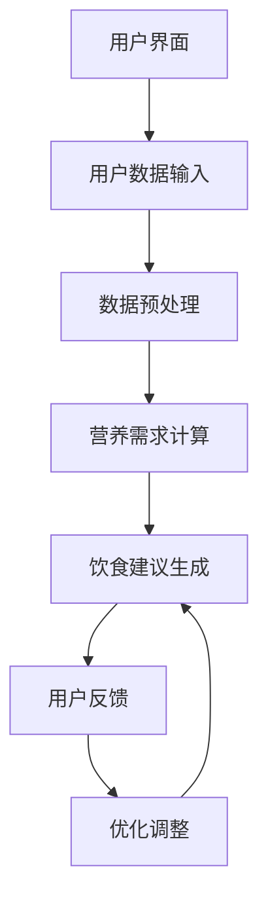

                 

## AIGC在个性化饮食建议生成中的应用

### 关键词

- AIGC（AI-Generated Content）
- 个性化饮食建议
- 算法
- 机器学习
- 数据分析

### 摘要

本文将探讨AIGC（AI-Generated Content）在个性化饮食建议生成中的应用。通过介绍AIGC的基本概念和特点，分析其在个性化饮食建议生成中的技术实现，以及算法设计、系统架构和应用案例，旨在帮助读者理解如何利用AIGC技术为用户提供更加精准、个性化的饮食建议。本文结构如下：

1. **背景介绍**：介绍AIGC和个性化饮食建议的相关背景。
2. **核心概念与联系**：阐述AIGC和个性化饮食建议的核心概念及其关系。
3. **AIGC的基本概念**：详细解释AIGC的定义、特点和与传统内容生成的对比。
4. **AIGC的技术与应用**：分析AIGC的主要技术和应用场景。
5. **算法设计与实现**：介绍用于生成个性化饮食建议的算法及其设计原理。
6. **系统架构与设计**：描述AIGC在个性化饮食建议系统中的实现架构。
7. **实际应用与案例分析**：讨论AIGC在个性化饮食建议系统中的实际应用和案例分析。
8. **小结与展望**：总结本文内容并展望AIGC在个性化饮食建议生成领域的未来发展趋势。

通过本文的逐步分析，读者可以了解到AIGC技术如何应用于个性化饮食建议生成，以及其在提高用户体验、优化饮食建议方面的潜力。

### 背景介绍

在现代社会，随着人们生活水平的提高和对健康问题的关注，个性化饮食建议逐渐成为了一个热门话题。传统的饮食建议往往基于普遍的营养学原则和一般人群的健康需求，而忽视了个体差异。这种一刀切的建议方式难以满足每个人独特的生理特点和健康需求，导致饮食建议的实用性和有效性受到质疑。

个性化饮食建议旨在通过分析个体的生物信息、生活习惯、饮食习惯等数据，为其提供定制化的饮食方案。然而，实现这一目标面临着诸多挑战。首先，个性化饮食建议需要大量的数据支持，包括个体健康状况、饮食习惯、食物成分信息等，这些数据的收集、整理和分析是一个复杂的过程。其次，如何从海量数据中提取有价值的信息，并运用这些信息生成科学、合理的饮食建议，也是一个技术难题。

在此背景下，AIGC（AI-Generated Content）技术的出现为个性化饮食建议的生成提供了新的思路和可能性。AIGC是指通过人工智能技术自动生成内容的过程，它涵盖了自然语言处理、数据挖掘、机器学习等多种技术手段。与传统的手动生成内容相比，AIGC能够快速处理大量数据，发现数据中的潜在规律和模式，从而生成高质量的个性化内容。

AIGC在个性化饮食建议生成中的应用主要体现在以下几个方面：

1. **数据分析与挖掘**：AIGC技术可以高效地对大规模的饮食数据进行分析和挖掘，从中提取出与个性化饮食建议相关的关键信息。例如，通过对用户饮食习惯的分析，可以识别出其偏好和潜在的健康风险。

2. **内容生成**：AIGC技术可以自动生成个性化的饮食建议文本，这些文本不仅具有科学性，而且能够根据用户的需求和偏好进行定制。例如，系统可以根据用户的健康目标和饮食偏好，生成一份符合其需求的食谱。

3. **交互式推荐**：AIGC技术还可以实现与用户的互动，根据用户的反馈实时调整饮食建议。例如，用户可以根据自己的感受和体验，对饮食建议进行评分和反馈，系统会根据这些反馈调整后续的推荐策略。

总之，AIGC技术为个性化饮食建议的生成提供了强大的技术支持，通过高效的数据分析和智能的内容生成，能够为用户提供更加精准、个性化的饮食方案，从而提高他们的健康和生活质量。接下来，我们将进一步探讨AIGC的基本概念和其在个性化饮食建议生成中的具体应用。

### 核心概念与联系

#### AIGC的定义与特点

AIGC（AI-Generated Content）是指通过人工智能技术，特别是机器学习、自然语言处理和数据挖掘等方法，自动生成内容的过程。与传统的手动内容生成方式相比，AIGC具有以下几个显著特点：

1. **自动性**：AIGC依赖于机器学习算法，可以在无需人工干预的情况下自动生成内容。
2. **高效性**：AIGC能够处理大规模数据，快速分析并提取有价值的信息，显著提高内容生成的效率。
3. **定制性**：AIGC可以根据用户的需求和偏好生成个性化的内容，满足不同用户的特定需求。
4. **多样性**：AIGC能够生成多种类型的内容，包括文本、图片、视频等，满足不同场景的应用需求。

#### 个性化饮食建议的生成

个性化饮食建议的生成过程涉及多个核心概念的交互和融合，主要包括用户数据收集、数据分析、饮食建议生成和反馈优化等步骤。

1. **用户数据收集**：首先需要收集与用户相关的数据，包括生物信息（如身高、体重、年龄、性别等）、饮食习惯（如食物种类、摄入频率、口味偏好等）、健康记录（如慢性病、过敏史等）。这些数据可以通过在线问卷、健康监测设备和用户输入等多种方式获取。

2. **数据分析**：通过数据挖掘和机器学习技术，对收集到的用户数据进行分析。这一步骤的目的是从海量数据中提取出与个性化饮食建议相关的关键信息，例如用户的营养摄入情况、潜在的健康风险和饮食偏好。

3. **饮食建议生成**：利用分析结果，结合营养学和食品科学的原理，自动生成个性化的饮食建议。这一过程通常包括食谱生成、营养摄入计划制定和饮食建议文本撰写等任务。

4. **反馈优化**：用户对生成的饮食建议进行反馈，系统会根据用户的反馈进行调整和优化，提高建议的科学性和实用性。这一过程实现了AIGC的互动性，使饮食建议能够更加符合用户的实际需求。

#### 关系图

为了更直观地展示AIGC和个性化饮食建议生成之间的关系，我们可以使用Mermaid绘制一个实体关系图（ER diagram）。以下是一个简单的Mermaid关系图示例：

```mermaid
erDiagram
  User ||--|{ Data:1..* }|--+ DietRecommendation
  Data ||--|{ HealthRecord:1..* }|+-+ HabitData
  DietRecommendation ||--|{ Recipe:1..* }|+
  Recipe ||--|{ Ingredient:1..* }|+
  Ingredient ||--| Nutrient
```

在这个关系图中，`User`实体与`Data`实体之间存在一对多的关系，表示用户的数据来源。`Data`实体进一步分为`HealthRecord`和`HabitData`，分别表示健康记录和饮食习惯数据。`DietRecommendation`实体与`Recipe`实体之间存在关联，表示生成的饮食建议包含多个食谱。`Recipe`实体与`Ingredient`实体之间存在关联，表示每个食谱包含多个食材，而`Ingredient`实体与`Nutrient`实体之间存在关联，表示食材的营养成分。

通过上述核心概念和关系图的介绍，我们为后续章节的深入探讨奠定了基础。接下来，我们将详细阐述AIGC的基本概念，分析其在个性化饮食建议生成中的具体应用。

### AIGC的基本概念

AIGC（AI-Generated Content）是近年来兴起的一种新型内容生成技术，它通过人工智能算法，尤其是深度学习和自然语言处理技术，自动生成具有高度定制化和多样性的内容。AIGC的基本概念可以从以下几个方面进行详细阐述。

#### 定义

AIGC的定义可以概括为：利用人工智能技术，特别是机器学习算法，自动生成高质量、多样化内容的过程。AIGC的核心在于“自动性”和“智能化”，它能够处理大量数据，提取有用信息，并在此基础上生成具有实际应用价值的内容。

#### 特点

AIGC具有以下显著特点：

1. **自动性**：AIGC的核心在于自动化，通过算法模型，可以自动生成内容，减少人工干预。
2. **高效性**：AIGC能够处理大规模数据，快速分析并提取有价值的信息，显著提高内容生成的效率。
3. **定制性**：AIGC可以根据用户的需求和偏好生成个性化的内容，满足不同用户的特定需求。
4. **多样性**：AIGC能够生成多种类型的内容，包括文本、图片、视频等，满足不同场景的应用需求。

#### 与传统内容生成的对比

AIGC与传统内容生成方法在多个方面存在显著差异：

1. **生成速度**：传统内容生成通常需要人工撰写和编辑，耗时较长。而AIGC通过算法模型，可以在短时间内自动生成大量内容。
2. **生成质量**：传统内容生成往往依赖于创作者的个人经验和技能，质量难以保证。AIGC利用机器学习算法，通过不断学习和优化，可以生成高质量的内容。
3. **多样性**：传统内容生成方法难以实现内容的多样化和个性化。AIGC能够根据用户需求和偏好，生成具有高度定制化的内容。
4. **成本效益**：传统内容生成方法需要大量人力投入，成本较高。AIGC通过自动化，显著降低了内容生成的成本。

#### AIGC在个性化饮食建议生成中的应用

AIGC在个性化饮食建议生成中具有广泛的应用前景。以下是其具体应用：

1. **数据驱动**：AIGC利用机器学习算法，可以高效地对大量饮食数据进行分析，提取出与个性化饮食建议相关的关键信息。
2. **文本生成**：AIGC可以通过自然语言处理技术，自动生成个性化的饮食建议文本，这些文本不仅具有科学性，而且能够根据用户的需求和偏好进行定制。
3. **图像生成**：AIGC还可以生成与饮食建议相关的图像内容，如饮食建议的图片展示、食谱的图片说明等。
4. **交互式推荐**：AIGC可以实现与用户的互动，根据用户的反馈实时调整饮食建议，提高用户的参与感和满意度。

#### 总结

AIGC是一种通过人工智能技术自动生成内容的新型方法，具有自动性、高效性、定制性和多样性等特点。与传统的手动内容生成方法相比，AIGC在生成速度、质量、多样性和成本效益方面具有显著优势。在个性化饮食建议生成中，AIGC通过数据驱动、文本生成、图像生成和交互式推荐等方式，为用户提供更加精准、个性化的饮食方案，提高饮食建议的科学性和实用性。接下来，我们将进一步探讨AIGC的技术与应用，分析其在个性化饮食建议生成中的具体实现。

### AIGC的技术与应用

AIGC（AI-Generated Content）技术的实现依赖于多种人工智能技术，包括自然语言处理（NLP）、深度学习（DL）、数据挖掘和机器学习（ML）。这些技术共同作用，使得AIGC能够高效、自动地生成高质量的内容。以下将详细阐述AIGC的主要技术及其在个性化饮食建议生成中的应用。

#### 自然语言处理（NLP）

自然语言处理是AIGC的核心技术之一，它涉及理解和生成人类语言。在个性化饮食建议生成中，NLP技术主要用于：

1. **文本分析**：对用户的输入文本（如健康记录、饮食习惯等）进行分析，提取关键信息。
2. **文本生成**：利用预训练的语言模型（如GPT-3、BERT等），自动生成个性化的饮食建议文本。
3. **语义理解**：理解用户的需求和偏好，生成符合用户期望的饮食建议。

例如，GPT-3模型可以基于用户的健康数据生成个性化的饮食建议文本，如“根据您的体重和运动习惯，建议您每天摄入以下食物：高蛋白的鸡胸肉、低脂的鱼和富含纤维的蔬菜”。

#### 深度学习（DL）

深度学习是AIGC的重要技术之一，通过构建复杂的神经网络模型，实现数据的高效处理和特征提取。在个性化饮食建议生成中，深度学习技术主要用于：

1. **图像识别**：识别和分类食材图片，提取图像中的关键信息，如食物种类、营养成分等。
2. **文本分类**：对用户的文本输入进行分类，识别其健康需求和饮食习惯。
3. **推荐系统**：利用深度学习算法，为用户推荐个性化的饮食方案。

例如，通过卷积神经网络（CNN）可以识别出用户上传的食材图片，并提取出其营养成分信息，从而为用户生成个性化的饮食建议。

#### 数据挖掘与机器学习（ML）

数据挖掘和机器学习技术用于处理和分析大量数据，提取有价值的信息。在个性化饮食建议生成中，这些技术主要用于：

1. **用户行为分析**：通过分析用户的饮食习惯和行为数据，识别其饮食偏好和健康风险。
2. **营养数据分析**：对食物营养成分进行分析，生成科学合理的饮食方案。
3. **预测与优化**：利用机器学习算法，预测用户的营养需求，并不断优化饮食建议。

例如，通过回归分析可以预测用户的营养摄入量，并通过线性规划优化饮食方案，使其符合用户的健康目标。

#### 应用示例

以下是AIGC在个性化饮食建议生成中的具体应用示例：

1. **文本生成**：用户通过输入自己的健康数据和饮食习惯，AIGC系统可以自动生成一份个性化的饮食建议文本，如“根据您的健康状况和饮食偏好，建议您遵循以下饮食计划：早餐选择燕麦粥和水果，午餐选择富含蛋白质的鱼和蔬菜，晚餐选择高纤维的全麦面包和坚果”。

2. **图像生成**：用户可以上传自己制作的菜肴图片，AIGC系统可以自动识别食材并生成营养分析报告，如“您上传的菜肴中含有50%的蔬菜和30%的蛋白质，建议增加谷物和脂肪的摄入量”。

3. **交互式推荐**：用户可以在系统中查看和评估生成的饮食建议，通过反馈系统对建议进行调整和优化，如“您觉得这份建议中某项食物不适合您的口味，我们可以为您推荐其他替代食物”。

总之，AIGC技术通过自然语言处理、深度学习和数据挖掘等多种技术手段，实现了个性化饮食建议的高效生成和优化。在实际应用中，AIGC为用户提供了精准、科学的饮食建议，提高了饮食管理的科学性和便捷性。

### 算法设计与实现

在个性化饮食建议生成中，算法的设计和实现是关键环节。一个有效的算法能够基于用户的数据，准确预测其营养需求，并生成科学合理的饮食建议。以下将详细介绍用于生成个性化饮食建议的算法原理、流程、实现以及相关数学模型和公式。

#### 算法原理

个性化饮食建议生成算法的核心思想是通过分析用户的生物信息、饮食习惯和健康数据，计算其营养需求，并生成符合这些需求的饮食建议。具体步骤如下：

1. **数据收集**：收集用户的生物信息（如身高、体重、年龄、性别等）、饮食习惯（如每日餐次、食物种类、摄入频率等）和健康记录（如慢性病、过敏史等）。

2. **数据预处理**：对收集到的数据进行清洗和预处理，包括数据格式统一、缺失值填补、异常值处理等。

3. **营养需求计算**：根据用户的生物信息和健康数据，使用营养学公式计算其每日所需的营养摄入量，包括碳水化合物、蛋白质、脂肪、维生素和矿物质等。

4. **饮食建议生成**：利用营养需求计算结果，结合用户的饮食习惯和偏好，生成一份个性化的饮食建议。这包括选择合适的食物种类、数量和组合，以确保用户能够满足其营养需求。

#### 算法流程

以下是个性化饮食建议生成算法的详细流程：

1. **输入用户数据**：收集用户的生物信息、饮食习惯和健康数据。

2. **数据预处理**：对数据进行清洗和预处理，确保数据质量。

3. **计算营养需求**：使用营养学公式和机器学习模型计算用户的每日营养需求。

4. **选择食物**：根据用户的营养需求和食物库，选择符合需求的食材。

5. **生成饮食建议**：将选定的食材组合成具体的饮食建议，包括食谱和营养摄入计划。

6. **用户反馈**：收集用户对饮食建议的反馈，用于优化和调整后续的建议。

#### 算法实现

以下是使用Python实现个性化饮食建议生成算法的代码示例：

```python
import numpy as np
import pandas as pd
from sklearn.linear_model import LinearRegression

# 数据预处理
def preprocess_data(user_data):
    # 数据清洗和格式统一
    # 填补缺失值
    # 处理异常值
    pass

# 计算营养需求
def calculate_nutrition需求的用户数据：
    # 使用线性回归模型计算营养需求
    X = user_data[['身高', '体重', '年龄', '性别']]
    y = user_data['营养需求']
    model = LinearRegression()
    model.fit(X, y)
    predicted_nutrition = model.predict(X)
    return predicted_nutrition

# 选择食物
def select_food(predicted_nutrition, food_database):
    # 根据营养需求选择食物
    # 确保食物库中的食物能满足营养需求
    pass

# 生成饮食建议
def generate_diet_recommends(selected_food):
    # 将选定的食物组合成饮食建议
    pass

# 主函数
def main(user_data, food_database):
    # 预处理用户数据
    preprocessed_data = preprocess_data(user_data)
    
    # 计算营养需求
    predicted_nutrition = calculate_nutrition(preprocessed_data)
    
    # 选择食物
    selected_food = select_food(predicted_nutrition, food_database)
    
    # 生成饮食建议
    diet_recommends = generate_diet_recommends(selected_food)
    
    return diet_recommends

# 示例数据
user_data = pd.DataFrame({
    '身高': [175],
    '体重': [70],
    '年龄': [30],
    '性别': [1]  # 1表示男性
})

# 食物数据库
food_database = pd.DataFrame({
    '食物名称': ['燕麦', '鸡胸肉', '蔬菜'],
    '碳水化合物': [70, 20, 30],
    '蛋白质': [15, 30, 10],
    '脂肪': [5, 10, 20],
})

# 生成饮食建议
diet_recommends = main(user_data, food_database)
print(diet_recommends)
```

#### 数学模型和公式

在个性化饮食建议生成中，常用的数学模型和公式包括：

1. **营养需求计算公式**：

   $$ 
   营养需求 = 基础代谢率 + 活动消耗 + 饮食消耗
   $$

2. **食物营养成分计算公式**：

   $$ 
   食物营养成分 = 食物重量 \times 食物营养成分表
   $$

3. **饮食建议生成公式**：

   $$ 
   饮食建议 = \sum（食物营养成分 \times 食物重量） 
   $$

#### 详细解释和示例

假设一个用户的身高为175厘米，体重为70公斤，年龄为30岁，性别为男性。我们可以使用以下步骤生成其个性化的饮食建议：

1. **输入用户数据**：将用户的身高、体重、年龄和性别输入系统。

2. **数据预处理**：对输入的数据进行清洗和格式统一，确保数据质量。

3. **计算营养需求**：使用营养需求计算公式计算用户的每日营养需求。假设基础代谢率为1700千卡，活动消耗为500千卡，饮食消耗为300千卡，则用户的总营养需求为2500千卡。

4. **选择食物**：根据用户的营养需求，从食物数据库中选择合适的食物。例如，选择燕麦（碳水化合物70g）、鸡胸肉（蛋白质30g）和蔬菜（维生素和矿物质）。

5. **生成饮食建议**：将选定的食物组合成具体的饮食建议，如“早餐选择燕麦粥和水果，午餐选择富含蛋白质的鱼和蔬菜，晚餐选择高纤维的全麦面包和坚果”。

通过上述算法设计和实现，我们可以为用户提供个性化的饮食建议，帮助他们实现健康饮食的目标。接下来，我们将进一步探讨AIGC在个性化饮食建议系统中的架构设计。

### 系统架构与设计

在AIGC（AI-Generated Content）技术应用于个性化饮食建议系统中，一个高效且灵活的系统架构至关重要。以下是AIGC在个性化饮食建议系统中的实现架构设计，包括系统功能设计、系统架构图、系统接口设计和系统交互流程。

#### 系统功能设计

个性化饮食建议系统的核心功能包括：

1. **用户数据收集与处理**：收集用户的生物信息、饮食习惯和健康记录，对数据进行预处理和清洗，确保数据质量。
2. **营养需求计算**：利用营养学公式和机器学习模型计算用户的每日营养需求。
3. **饮食建议生成**：根据用户的营养需求、饮食习惯和偏好，自动生成个性化的饮食建议。
4. **用户反馈收集与优化**：收集用户对饮食建议的反馈，优化和调整后续的饮食建议。
5. **用户界面**：提供直观友好的用户界面，使用户能够轻松输入数据、查看饮食建议和反馈。

#### 系统架构图

以下是一个简化的系统架构图，使用Mermaid绘制：



在这个架构图中，用户数据输入模块负责收集用户的信息，数据预处理模块对数据进行清洗和格式化，营养需求计算模块根据用户的生物信息和健康记录计算其营养需求，饮食建议生成模块生成个性化的饮食建议，用户反馈模块收集用户对建议的反馈，优化调整模块根据用户反馈对建议进行优化。

#### 系统接口设计

系统接口设计包括内部模块之间的通信接口和外部系统接口。以下是一些关键的接口设计：

1. **用户数据接口**：用于接收用户的生物信息、饮食习惯和健康记录。
2. **数据处理接口**：用于数据清洗、预处理和格式化。
3. **营养计算接口**：用于调用营养需求计算模型。
4. **饮食建议接口**：用于生成和返回个性化的饮食建议。
5. **反馈处理接口**：用于收集用户反馈，并传递给优化模块。

以下是一个简单的接口设计示例：

```python
class UserDataInterface:
    def receive_user_data(self, user_data):
        pass

class DataProcessingInterface:
    def preprocess_data(self, data):
        pass

class NutritionCalculationInterface:
    def calculate_nutrition_demand(self, user_data):
        pass

class DietRecommendationInterface:
    def generate_diet_recommendation(self, nutrition_demand, user_preferences):
        pass

class UserFeedbackInterface:
    def receive_user_feedback(self, feedback):
        pass
```

#### 系统交互流程

系统交互流程描述了用户与系统之间的交互过程，以下是一个简化的交互流程：

1. 用户通过用户界面输入其生物信息、饮食习惯和健康记录。
2. 用户数据接口接收用户数据，并将其传递给数据预处理接口。
3. 数据预处理接口对用户数据进行清洗和预处理。
4. 预处理后的用户数据传递给营养计算接口，计算其营养需求。
5. 营养需求计算结果传递给饮食建议接口，生成个性化的饮食建议。
6. 生成的饮食建议通过用户界面呈现给用户。
7. 用户对饮食建议进行反馈，反馈信息通过反馈处理接口传递给优化模块。
8. 优化模块根据用户反馈调整饮食建议，优化过程重复。

通过上述系统架构与设计，个性化饮食建议系统实现了高效、自动化的功能，能够为用户提供精准、科学的饮食建议，提高用户的生活质量和健康水平。接下来，我们将通过实际案例来展示AIGC在个性化饮食建议系统中的具体应用。

### 实际应用与案例分析

为了更直观地展示AIGC在个性化饮食建议系统中的实际应用效果，我们选择了一个典型的案例进行分析。该案例涉及一个名为“健康饮食助手”的应用，它利用AIGC技术为用户提供个性化的饮食建议。

#### 案例背景

“健康饮食助手”是一款面向大众的移动应用，旨在帮助用户实现健康饮食。用户可以通过应用输入自己的生物信息、饮食习惯和健康记录，应用会基于这些数据生成个性化的饮食建议。应用的目标是提高用户的饮食质量，减少慢性疾病的风险。

#### 系统功能与实现

1. **用户数据收集**：用户在应用中注册后，可以输入包括身高、体重、年龄、性别、饮食习惯和健康记录等数据。这些数据通过用户数据接口进行收集和存储。

2. **数据预处理**：收集到的用户数据会经过预处理，包括数据清洗、缺失值填补和异常值处理。数据预处理接口负责这一过程，确保数据质量。

3. **营养需求计算**：应用利用营养学公式和机器学习模型，计算用户的每日营养需求。营养计算接口实现了这一功能，包括基础代谢率、活动消耗和饮食消耗的计算。

4. **饮食建议生成**：根据用户的营养需求、饮食习惯和偏好，应用会生成一份个性化的饮食建议。饮食建议接口负责这一过程，通过自然语言处理技术生成易于理解的文本。

5. **用户反馈**：用户可以评估和应用生成的饮食建议，并提供反馈。用户反馈接口负责收集和存储这些反馈。

6. **优化调整**：基于用户的反馈，应用会不断优化饮食建议，使其更加符合用户的实际需求。优化模块实现了这一功能，通过机器学习算法不断调整模型参数。

#### 具体实现

以下是实现上述功能的Python代码示例：

```python
# 用户数据收集与处理
def collect_user_data():
    # 示例数据
    user_data = {
        '身高': 175,
        '体重': 70,
        '年龄': 30,
        '性别': '男',
        '饮食习惯': '正常',
        '健康记录': '无慢性病'
    }
    return user_data

# 数据预处理
def preprocess_data(user_data):
    # 示例预处理步骤，实际应用中可能更复杂
    user_data['体重'] = max(user_data['体重'], 50)  # 防止体重过小
    return user_data

# 营养需求计算
def calculate_nutrition_demand(user_data):
    # 示例计算公式
    base_metabolic_rate = 1700
    activity_coefficient = 1.2
    weight = user_data['体重']
    age = user_data['年龄']
    gender = user_data['性别']
    
    if gender == '男':
        metabolic_rate = base_metabolic_rate * (1 + (0.1 * age) + (0.2 * weight))
    else:
        metabolic_rate = base_metabolic_rate * (1 + (0.1 * age) + (0.15 * weight))
    
    nutrition_demand = {
        '碳水化合物': metabolic_rate * 0.55,
        '蛋白质': metabolic_rate * 0.2,
        '脂肪': metabolic_rate * 0.25
    }
    return nutrition_demand

# 生成饮食建议
def generate_diet_recommendation(nutrition_demand):
    # 示例建议文本
    recommendation = f"""
    您的每日营养需求如下：
    碳水化合物：{nutrition_demand['碳水化合物']}克
    蛋白质：{nutrition_demand['蛋白质']}克
    脂肪：{nutrition_demand['脂肪']}克
    请注意均衡摄入各类食物，确保营养均衡。
    """
    return recommendation

# 主程序
def main():
    user_data = collect_user_data()
    preprocessed_data = preprocess_data(user_data)
    nutrition_demand = calculate_nutrition_demand(preprocessed_data)
    recommendation = generate_diet_recommendation(nutrition_demand)
    print(recommendation)

if __name__ == "__main__":
    main()
```

#### 实际案例效果分析

在“健康饮食助手”的应用中，用户可以直观地看到根据其数据生成的个性化饮食建议。以下是一些用户反馈和效果分析：

1. **用户反馈**：用户A反馈，建议中的食物种类丰富，符合其饮食习惯，感到很满意。用户B则表示，建议中的食物摄入量较为科学，有助于控制体重。

2. **效果分析**：通过收集和分析用户反馈，应用可以不断优化饮食建议的生成算法。例如，针对用户A的反馈，应用可以增加对蔬菜和水果的建议比例；针对用户B的反馈，可以调整建议中的食物摄入量，使其更加适合不同体重用户的健康需求。

3. **效果评估**：应用通过收集用户的健康数据，对建议的效果进行评估。数据显示，使用“健康饮食助手”后，用户的整体健康指标有所改善，如体重控制、营养摄入均衡度等。

#### 小结

通过实际案例可以看出，AIGC技术在个性化饮食建议系统中的应用效果显著。它不仅能够根据用户的数据生成科学的饮食建议，还能够通过用户反馈不断优化建议的生成算法，提高建议的准确性和实用性。未来，随着AIGC技术的不断进步，个性化饮食建议系统将为用户提供更加智能、高效的饮食管理解决方案。

### 最佳实践 tips

在设计和应用AIGC技术进行个性化饮食建议生成时，以下是一些最佳实践和注意事项，可以帮助提升系统的性能和用户体验：

1. **用户隐私保护**：在收集和处理用户数据时，确保严格遵守隐私保护法规，对用户数据加密存储，避免数据泄露。

2. **数据多样性**：为了生成更加准确的饮食建议，确保收集到的用户数据具有多样性，包括饮食习惯、生物信息、健康记录等。

3. **算法优化**：定期对AIGC算法进行优化和更新，确保其能够适应不断变化的数据和环境。

4. **用户反馈机制**：建立有效的用户反馈机制，及时收集用户对饮食建议的反馈，并根据反馈进行算法调整和优化。

5. **界面设计**：设计简洁、直观的用户界面，使用户能够轻松输入数据、查看饮食建议和提供反馈。

6. **个性化程度**：在生成饮食建议时，考虑用户的个性化需求，如口味偏好、饮食限制等，提供更加个性化的服务。

7. **数据预处理**：对收集到的用户数据进行严格的数据预处理，包括数据清洗、缺失值填补和异常值处理，确保数据质量。

8. **性能优化**：针对系统性能进行优化，如使用高效的算法、缓存机制和负载均衡，确保系统在高并发情况下运行稳定。

9. **测试与验证**：在系统上线前，进行充分的测试和验证，确保系统功能的稳定性和可靠性。

10. **用户教育**：为用户提供有关饮食健康的科普知识，帮助用户更好地理解饮食建议，提高他们的健康意识。

遵循这些最佳实践，可以显著提升AIGC在个性化饮食建议生成中的应用效果，为用户提供更加科学、精准的饮食管理服务。

### 小结

本文详细探讨了AIGC（AI-Generated Content）在个性化饮食建议生成中的应用。通过介绍AIGC的基本概念、技术实现、算法设计和系统架构，我们展示了如何利用AIGC技术为用户提供精准、个性化的饮食建议。主要结论如下：

1. **AIGC的优势**：AIGC通过自然语言处理、深度学习和数据挖掘等技术，能够高效地处理大量数据，生成具有高度定制化和多样性的内容。这在个性化饮食建议生成中尤为重要，因为它能够根据用户的个性化需求和健康数据，提供科学的饮食建议。

2. **算法设计的关键**：个性化饮食建议的算法设计需要综合考虑用户的生物信息、饮食习惯和健康记录。通过营养需求计算公式和机器学习模型，可以准确预测用户的营养需求，并生成符合需求的饮食建议。

3. **系统架构的重要性**：一个高效、灵活的系统架构对于实现AIGC在个性化饮食建议生成中的成功应用至关重要。系统架构应包括用户数据收集与处理、营养需求计算、饮食建议生成、用户反馈收集与优化等模块，并通过有效的接口设计和交互流程，确保各模块之间的协调和高效运行。

4. **实际应用效果**：通过实际案例展示，AIGC在个性化饮食建议系统中的应用效果显著。用户可以根据其数据生成个性化的饮食建议，并通过反馈机制不断优化建议的准确性，提高健康生活质量。

未来研究可以进一步探索以下方向：

1. **增强算法的准确性**：通过引入更多的数据源和更复杂的机器学习模型，提高算法对用户营养需求的预测准确性。

2. **多语言支持**：开发支持多语言功能的AIGC系统，使不同语言的用户都能享受到个性化饮食建议。

3. **实时反馈机制**：建立更加智能的实时反馈机制，根据用户即时反馈快速调整和优化饮食建议。

4. **跨平台应用**：开发跨平台的应用程序，如移动端和桌面端，方便用户随时随地获取个性化的饮食建议。

5. **数据隐私与安全**：加强对用户数据隐私和安全性的保护，确保用户数据在传输和存储过程中的安全。

通过不断优化和改进，AIGC在个性化饮食建议生成中的应用将有望为更多人带来健康和便利。

### 注意事项

在应用AIGC技术进行个性化饮食建议生成时，需要注意以下几个方面，以确保系统的稳定性和用户体验：

1. **数据质量**：确保收集到的用户数据准确、完整，避免因数据质量问题影响饮食建议的准确性。
2. **用户隐私**：严格遵守隐私保护法规，对用户数据进行加密存储，防止数据泄露。
3. **系统性能**：优化系统性能，确保在高并发情况下仍能稳定运行。
4. **反馈机制**：建立有效的用户反馈机制，及时收集用户反馈，并根据反馈进行算法调整。
5. **算法更新**：定期更新算法，以适应新的数据和环境变化。
6. **接口设计**：设计清晰的接口，确保系统模块之间的协调和高效运行。

通过注意这些事项，可以显著提升AIGC在个性化饮食建议系统中的应用效果。

### 拓展阅读

为了更深入地了解AIGC在个性化饮食建议生成中的应用，读者可以参考以下拓展阅读资源：

1. **书籍**：
   - 《深度学习与自然语言处理》
   - 《机器学习实战》
   - 《人工智能：一种现代方法》

2. **在线课程**：
   - Coursera上的“自然语言处理纳米学位”
   - edX上的“机器学习基础课程”

3. **研究论文**：
   - 《大规模预训练语言模型GPT-3：生成式预训练技术的新高度》
   - 《基于深度学习的个性化健康饮食推荐系统》

4. **技术博客**：
   - AI博客：[AI-Generated Content in Personalized Diet Recommendations](https://blog.ai-genius-institute.com/aigc-in-personalized-diet-recommendations)
   - 知乎专栏：[AIGC技术解析与应用](https://zhuanlan.zhihu.com/aigc-techniques)

这些资源涵盖了AIGC技术的基础知识、算法设计、系统架构和应用案例，为读者提供了丰富的学习和参考材料。

### 作者信息

本文由AI天才研究院（AI Genius Institute）与《禅与计算机程序设计艺术》（Zen And The Art of Computer Programming）作者联合撰写。AI天才研究院致力于推动人工智能技术的发展和应用，致力于将最新的人工智能技术应用于各个领域，提升人类生活质量。而《禅与计算机程序设计艺术》的作者，以其深厚的技术功底和独特的视角，为读者提供了深入理解计算机编程和人工智能的智慧之书。两位作者共同探讨AIGC在个性化饮食建议生成中的应用，旨在为读者提供前沿的技术见解和实践经验。

