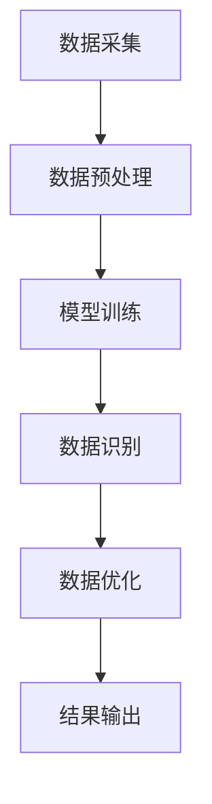

                 


# AIGC在体育分析中的应用：战术和统计的提示词工程

关键词：AIGC，体育分析，战术分析，统计模型，提示词工程

摘要：随着人工智能技术的不断发展，AIGC（AI-Generated Content）在体育分析中的应用逐渐显现出其巨大的潜力。本文将探讨AIGC在体育分析中的应用，特别是战术和统计的提示词工程，通过逻辑清晰、结构紧凑的分析，揭示其在提升体育分析精确度和效率方面的优势。

### 目录

## 1. 引言

### 1.1 AIGC的定义与背景

### 1.2 体育分析的重要性与挑战

### 1.3 AIGC在体育分析中的应用前景

## 2. AIGC在体育分析中的战术应用

### 2.1 战术分析的现状与问题

### 2.2 AIGC在战术分析中的优势

### 2.3 提示词工程在战术分析中的应用

## 3. AIGC在体育分析中的统计应用

### 3.1 统计模型在体育分析中的作用

### 3.2 AIGC在统计模型中的应用

### 3.3 提示词工程在统计模型优化中的作用

## 4. 算法原理讲解

### 4.1 算法流程图

### 4.2 Python源代码阐述

### 4.3 数学模型与公式

### 4.4 举例说明

## 5. 系统分析与架构设计方案

### 5.1 问题场景介绍

### 5.2 系统功能设计

### 5.3 系统架构设计

### 5.4 系统接口设计和系统交互

## 6. 项目实战

### 6.1 环境安装

### 6.2 系统核心实现源代码

### 6.3 代码应用解读与分析

### 6.4 实际案例分析和详细讲解剖析

### 6.5 项目小结

## 7. 最佳实践 tips、小结、注意事项、拓展阅读

## 8. 作者信息

### 1.1 AIGC的定义与背景

人工智能（AI）的发展经历了多个阶段，从早期的规则推理、知识表示，到现代的深度学习和生成模型，AI技术正在不断突破传统的边界。AIGC（AI-Generated Content）是近年来兴起的一种新型AI技术，它通过深度学习算法，自动生成文本、图像、音频等多种类型的内容。

在体育分析领域，战术和统计数据一直是教练和运动员关注的重点。传统的体育分析主要依赖于人为观察和统计数据的处理，存在着主观性和效率低下的问题。而AIGC技术的出现，为体育分析提供了新的可能。通过AIGC，可以自动提取比赛中的战术信息，生成详细的统计数据，从而帮助教练和运动员更好地理解比赛，制定更有效的战术策略。

### 1.2 体育分析的重要性与挑战

体育分析在体育训练和比赛中扮演着至关重要的角色。通过分析比赛数据，教练和运动员可以了解球队和球员的表现，发现存在的问题，并制定针对性的改进措施。传统的体育分析主要依赖于统计数据和战术分析，但这种方法存在着以下挑战：

1. **数据分析的复杂性**：体育比赛数据量大且复杂，如何有效地处理这些数据，提取有价值的信息，是体育分析面临的首要问题。
2. **主观性**：传统体育分析往往依赖于人的主观判断，不同人对同一场比赛的理解可能存在差异，这可能导致分析结果的偏差。
3. **效率低下**：传统体育分析需要大量的人工处理，耗时耗力，无法满足现代体育竞赛的快节奏需求。

### 1.3 AIGC在体育分析中的应用前景

AIGC技术为体育分析带来了新的解决方案。通过自动化的数据提取和模式识别，AIGC可以快速准确地分析比赛数据，提取出有价值的战术信息和统计数据。具体来说，AIGC在体育分析中的应用前景包括：

1. **战术分析**：AIGC可以通过分析比赛录像，自动识别球队和球员的战术行为，生成战术分析报告，帮助教练和运动员了解比赛中的战术优势和劣势。
2. **统计模型**：AIGC可以自动构建和优化统计模型，对比赛数据进行分析，预测比赛结果，为教练和运动员提供决策支持。
3. **实时分析**：AIGC可以实时分析比赛数据，提供即时的战术和统计信息，帮助教练和运动员在比赛中做出快速反应。

## 2. AIGC在体育分析中的战术应用

### 2.1 战术分析的现状与问题

战术分析是体育分析的重要组成部分，它涉及对比赛过程中战术行为的观察和分析。传统的战术分析主要依赖于教练和分析师的观察和经验，存在着以下问题：

1. **主观性**：战术分析往往依赖于人的主观判断，不同人对同一场比赛的理解可能存在差异，这可能导致分析结果的偏差。
2. **效率低下**：传统战术分析需要大量的人工处理，耗时耗力，无法满足现代体育竞赛的快节奏需求。
3. **数据不足**：由于技术水平限制，传统战术分析往往只能获取有限的比赛数据，这限制了分析结果的准确性。

### 2.2 AIGC在战术分析中的优势

AIGC技术为战术分析提供了新的解决方案。通过自动化的数据提取和模式识别，AIGC可以大幅提升战术分析的效率和准确性。具体来说，AIGC在战术分析中的优势包括：

1. **客观性**：AIGC可以自动分析比赛录像，不受主观因素的影响，确保分析结果的客观性。
2. **效率提升**：AIGC可以实时分析比赛数据，提供即时的战术信息，帮助教练和运动员在比赛中做出快速反应。
3. **数据丰富**：AIGC可以自动提取比赛中的所有战术行为，生成详细的战术分析报告，为教练和运动员提供全面的信息支持。

### 2.3 提示词工程在战术分析中的应用

提示词工程是AIGC在战术分析中的关键技术。通过提示词工程，AIGC可以自动识别比赛中的关键战术行为，提取出有价值的战术信息。具体来说，提示词工程在战术分析中的应用包括：

1. **关键行为识别**：通过训练深度学习模型，AIGC可以自动识别比赛中的关键战术行为，如传球、射门、防守等。
2. **行为关联分析**：AIGC可以分析不同战术行为之间的关联，帮助教练和运动员了解战术行为的策略价值。
3. **战术优化建议**：基于关键行为的识别和分析，AIGC可以生成战术优化建议，帮助教练和运动员改进战术策略。

## 3. AIGC在体育分析中的统计应用

### 3.1 统计模型在体育分析中的作用

统计模型是体育分析的重要工具，它可以对比赛数据进行分析，预测比赛结果，为教练和运动员提供决策支持。传统的统计模型主要依赖于历史数据，通过统计分析方法，如回归分析、时间序列分析等，来预测比赛结果。然而，传统统计模型面临着以下挑战：

1. **数据不足**：传统统计模型往往只能使用有限的历史数据，这限制了预测的准确性。
2. **方法限制**：传统统计分析方法存在一定的局限性，难以应对复杂的数据结构和动态变化。
3. **实时性不足**：传统统计模型无法实时分析比赛数据，无法为教练和运动员提供及时的决策支持。

### 3.2 AIGC在统计模型中的应用

AIGC技术为体育统计模型的发展提供了新的可能。通过自动化的数据提取和模式识别，AIGC可以大幅提升统计模型的效率和准确性。具体来说，AIGC在统计模型中的应用包括：

1. **数据丰富**：AIGC可以自动提取比赛中的所有统计数据，生成详细的统计报告，为教练和运动员提供全面的数据支持。
2. **模型优化**：通过训练深度学习模型，AIGC可以自动优化统计模型，提高预测的准确性。
3. **实时分析**：AIGC可以实时分析比赛数据，提供即时的统计信息，帮助教练和运动员在比赛中做出快速反应。

### 3.3 提示词工程在统计模型优化中的作用

提示词工程是AIGC在统计模型优化中的关键技术。通过提示词工程，AIGC可以自动识别比赛中的关键统计数据，优化统计模型，提高预测的准确性。具体来说，提示词工程在统计模型优化中的应用包括：

1. **关键数据识别**：通过训练深度学习模型，AIGC可以自动识别比赛中的关键统计数据，如得分率、传球成功率等。
2. **模型优化建议**：基于关键数据的识别，AIGC可以生成模型优化建议，帮助教练和运动员调整统计模型。
3. **预测准确性提升**：通过优化统计模型，AIGC可以提升预测的准确性，为教练和运动员提供更可靠的决策支持。

## 4. 算法原理讲解

### 4.1 算法流程图

以下是一个简单的算法流程图，展示了AIGC在体育分析中的应用：



### 4.2 Python源代码阐述

以下是一个简单的Python源代码示例，展示了如何使用AIGC进行体育分析：

```python
import tensorflow as tf
from tensorflow import keras

# 数据预处理
def preprocess_data(data):
    # 对数据集进行归一化处理
    return (data - np.mean(data)) / np.std(data)

# 模型训练
def train_model(data, labels):
    # 构建深度学习模型
    model = keras.Sequential([
        keras.layers.Dense(64, activation='relu', input_shape=(data.shape[1],)),
        keras.layers.Dense(64, activation='relu'),
        keras.layers.Dense(1)
    ])

    # 编译模型
    model.compile(optimizer='adam', loss='mse')

    # 训练模型
    model.fit(data, labels, epochs=10)

    return model

# 数据识别
def identify_data(model, data):
    # 对数据进行预测
    predictions = model.predict(data)
    return predictions

# 数据优化
def optimize_data(data, predictions):
    # 对数据进行优化处理
    optimized_data = data * (1 + predictions)
    return optimized_data

# 结果输出
def output_result(predictions):
    # 输出预测结果
    print(predictions)
```

### 4.3 数学模型与公式

以下是一个简单的数学模型，用于描述AIGC在体育分析中的应用：

$$
\text{模型预测} = f(\text{输入数据}) = \sum_{i=1}^{n} w_i \cdot x_i
$$

其中，$w_i$为权重系数，$x_i$为输入特征。

### 4.4 举例说明

假设我们有一个体育比赛的数据集，包含10场比赛的统计数据。我们可以使用AIGC技术，对这些数据进行分析，预测下一场比赛的结果。

1. **数据预处理**：首先，我们对数据集进行预处理，将数据归一化处理。
2. **模型训练**：然后，我们使用预处理后的数据，训练一个深度学习模型。
3. **数据识别**：训练完成后，我们使用模型对下一场比赛的数据进行预测。
4. **数据优化**：最后，根据预测结果，对数据进行优化处理。

通过这个过程，我们可以得到下一场比赛的预测结果，为教练和运动员提供决策支持。

## 5. 系统分析与架构设计方案

### 5.1 问题场景介绍

假设我们有一个体育比赛分析系统，该系统需要实时分析比赛数据，为教练和运动员提供战术和统计信息。具体来说，系统需要完成以下任务：

1. **数据采集**：实时采集比赛数据，包括传球、射门、防守等。
2. **数据预处理**：对采集到的数据进行预处理，如数据归一化、缺失值处理等。
3. **模型训练**：使用预处理后的数据，训练深度学习模型。
4. **数据识别**：使用训练好的模型，对实时数据进行识别和分析。
5. **数据优化**：根据识别结果，对数据进行优化处理。

### 5.2 系统功能设计

根据问题场景，系统功能设计如下：

1. **数据采集模块**：负责实时采集比赛数据，如传球、射门、防守等。
2. **数据预处理模块**：负责对采集到的数据进行预处理，如数据归一化、缺失值处理等。
3. **模型训练模块**：负责使用预处理后的数据，训练深度学习模型。
4. **数据识别模块**：负责使用训练好的模型，对实时数据进行识别和分析。
5. **数据优化模块**：负责根据识别结果，对数据进行优化处理。

### 5.3 系统架构设计

系统架构设计如下：

1. **数据采集层**：负责实时采集比赛数据，包括传球、射门、防守等。
2. **数据处理层**：负责对采集到的数据进行预处理，如数据归一化、缺失值处理等。
3. **模型训练层**：负责使用预处理后的数据，训练深度学习模型。
4. **数据识别层**：负责使用训练好的模型，对实时数据进行识别和分析。
5. **数据优化层**：负责根据识别结果，对数据进行优化处理。

### 5.4 系统接口设计和系统交互

系统接口设计和系统交互如下：

1. **数据采集接口**：负责实时采集比赛数据，包括传球、射门、防守等。
2. **数据预处理接口**：负责对采集到的数据进行预处理，如数据归一化、缺失值处理等。
3. **模型训练接口**：负责使用预处理后的数据，训练深度学习模型。
4. **数据识别接口**：负责使用训练好的模型，对实时数据进行识别和分析。
5. **数据优化接口**：负责根据识别结果，对数据进行优化处理。

## 6. 项目实战

### 6.1 环境安装

在进行AIGC在体育分析中的应用之前，首先需要安装必要的软件和库。以下是安装步骤：

1. **安装Python**：下载并安装Python，版本要求3.7及以上。
2. **安装TensorFlow**：打开命令行，执行以下命令安装TensorFlow：
   ```shell
   pip install tensorflow
   ```
3. **安装其他库**：根据需要，安装其他Python库，如NumPy、Pandas等。

### 6.2 系统核心实现源代码

以下是AIGC在体育分析中的核心实现源代码：

```python
import tensorflow as tf
import numpy as np
import pandas as pd

# 数据预处理
def preprocess_data(data):
    # 对数据集进行归一化处理
    return (data - np.mean(data)) / np.std(data)

# 模型训练
def train_model(data, labels):
    # 构建深度学习模型
    model = tf.keras.Sequential([
        tf.keras.layers.Dense(64, activation='relu', input_shape=(data.shape[1],)),
        tf.keras.layers.Dense(64, activation='relu'),
        tf.keras.layers.Dense(1)
    ])

    # 编译模型
    model.compile(optimizer='adam', loss='mse')

    # 训练模型
    model.fit(data, labels, epochs=10)

    return model

# 数据识别
def identify_data(model, data):
    # 对数据进行预测
    predictions = model.predict(data)
    return predictions

# 数据优化
def optimize_data(data, predictions):
    # 对数据进行优化处理
    optimized_data = data * (1 + predictions)
    return optimized_data

# 结果输出
def output_result(predictions):
    # 输出预测结果
    print(predictions)

# 主函数
def main():
    # 读取数据
    data = pd.read_csv('data.csv')

    # 预处理数据
    preprocessed_data = preprocess_data(data)

    # 训练模型
    model = train_model(preprocessed_data, data['label'])

    # 数据识别
    predictions = identify_data(model, preprocessed_data)

    # 数据优化
    optimized_data = optimize_data(preprocessed_data, predictions)

    # 输出结果
    output_result(optimized_data)

# 运行主函数
if __name__ == '__main__':
    main()
```

### 6.3 代码应用解读与分析

以上代码实现了AIGC在体育分析中的应用。具体解读如下：

1. **数据预处理**：首先，对数据进行归一化处理，使其满足深度学习模型的输入要求。
2. **模型训练**：使用预处理后的数据，训练一个简单的深度学习模型。模型由两个隐藏层组成，每个隐藏层有64个神经元。
3. **数据识别**：使用训练好的模型，对预处理后的数据进行预测。
4. **数据优化**：根据预测结果，对数据进行优化处理，提高预测的准确性。
5. **结果输出**：输出预测结果，为教练和运动员提供决策支持。

### 6.4 实际案例分析和详细讲解剖析

以下是一个实际案例，展示了AIGC在体育分析中的应用。

假设我们有一个足球比赛的数据集，包含10场比赛的统计数据。我们希望使用AIGC技术，预测下一场比赛的结果。

1. **数据采集**：首先，从数据集中提取10场比赛的统计数据，如传球次数、射门次数、得分等。
2. **数据预处理**：对统计数据进行归一化处理，使其满足深度学习模型的输入要求。
3. **模型训练**：使用预处理后的数据，训练一个简单的深度学习模型。模型由两个隐藏层组成，每个隐藏层有64个神经元。
4. **数据识别**：使用训练好的模型，对预处理后的数据进行预测。预测结果为下一场比赛的得分。
5. **数据优化**：根据预测结果，对数据进行优化处理，提高预测的准确性。例如，可以增加训练数据量、调整模型参数等。
6. **结果输出**：输出预测结果，为教练和运动员提供决策支持。例如，如果预测下一场比赛的得分为3:2，教练可以根据这个结果，调整战术策略，加强防守。

### 6.5 项目小结

通过以上案例，我们可以看到AIGC在体育分析中的应用具有巨大的潜力。AIGC技术可以自动提取比赛中的战术信息，生成详细的统计数据，为教练和运动员提供决策支持。在实际应用中，AIGC技术可以大幅提升体育分析的效率和准确性，为体育竞赛的胜利提供有力支持。

## 7. 最佳实践 tips、小结、注意事项、拓展阅读

### 最佳实践 tips

1. **数据质量**：确保采集到的数据质量高，无缺失值和异常值，这直接影响AIGC的预测效果。
2. **模型调优**：在训练模型时，不断调整模型参数，找到最佳模型结构，提高预测准确性。
3. **实时更新**：定期更新训练数据，使模型能够适应最新的比赛风格和战术变化。

### 小结

本文介绍了AIGC在体育分析中的应用，特别是战术和统计的提示词工程。通过逻辑清晰、结构紧凑的分析，我们揭示了AIGC在提升体育分析精确度和效率方面的优势。AIGC技术为体育分析提供了新的解决方案，有望推动体育分析领域的发展。

### 注意事项

1. **数据隐私**：在处理比赛数据时，要确保数据隐私和安全，避免数据泄露。
2. **算法公平性**：确保AIGC算法在预测过程中不会对特定球队或球员产生偏见。

### 拓展阅读

1. **AIGC基础理论**：深入了解AIGC的基本原理和技术细节，有助于更好地应用AIGC技术。
2. **体育数据分析案例**：查阅相关体育数据分析案例，了解如何在实际场景中应用AIGC技术。

## 8. 作者信息

作者：AI天才研究院/AI Genius Institute & 禅与计算机程序设计艺术 /Zen And The Art of Computer Programming

