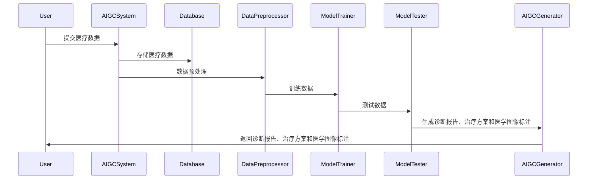

                 

# AIGC在医疗诊断中的伦理考量

> 关键词：人工智能医疗诊断、AIGC、伦理考量、算法、系统架构

> 摘要：本文探讨了人工智能生成内容（AIGC）在医疗诊断中的应用及其伦理考量。文章首先介绍了AIGC的核心概念及其在医疗诊断中的重要性，随后分析了医疗诊断中的伦理问题与挑战。接着，文章详细阐述了AIGC算法原理、系统架构设计以及实际应用案例，最后总结了最佳实践和注意事项，并推荐了拓展阅读资源。

## 第1章 问题背景与核心概念

### 1.1 伦理考量在AIGC与医疗诊断中的重要性

在医疗诊断领域，人工智能（AI）的应用已经越来越广泛，AIGC（Artificial Intelligence Generated Content）作为一种新型的AI技术，正逐渐成为医疗诊断的有力工具。然而，随着AIGC在医疗诊断中的深入应用，其伦理考量也变得尤为重要。伦理考量不仅关系到患者的利益，也关系到整个医疗行业的发展。

### 1.2 AIGC的概念及其在医疗诊断中的应用

AIGC是指通过人工智能技术自动生成内容的过程，它可以应用于文本、图像、音频等多种形式。在医疗诊断中，AIGC可以通过分析大量的医疗数据，自动生成诊断报告、治疗方案等，从而提高诊断效率和准确性。

### 1.3 医疗诊断中的伦理问题与挑战

医疗诊断中的伦理问题主要包括患者隐私保护、数据安全、算法偏见等。这些问题不仅影响到患者的信任和满意度，还可能对整个医疗行业的声誉产生负面影响。因此，如何在应用AIGC技术的同时，妥善处理这些伦理问题，是当前医疗领域面临的一个重要挑战。

## 第2章 核心概念与联系

### 2.1 AIGC的关键概念

#### 2.1.1 自动化智能生成内容（AIGC）

AIGC是一种通过人工智能技术自动生成内容的过程，它包括文本生成、图像生成、音频生成等多种形式。在医疗诊断中，AIGC可以通过分析大量的医疗数据，自动生成诊断报告、治疗方案等。

#### 2.1.2 医疗诊断中的AIGC应用

在医疗诊断中，AIGC的应用主要包括以下几个方面：

1. 自动生成诊断报告：AIGC可以根据患者的病历数据，自动生成详细的诊断报告。
2. 自动生成治疗方案：AIGC可以根据患者的病情，自动生成个性化的治疗方案。
3. 自动生成医学图像：AIGC可以通过对医学图像的分析，自动生成标注和诊断结果。

#### 2.1.3 AIGC在医疗诊断伦理考量中的关键要素

在医疗诊断中，AIGC的伦理考量主要包括以下几个方面：

1. 患者隐私保护：AIGC在生成诊断报告和治疗方案时，需要确保患者的隐私得到保护。
2. 数据安全：AIGC在处理医疗数据时，需要确保数据的安全性和完整性。
3. 算法偏见：AIGC在生成诊断报告和治疗方案时，需要避免算法偏见，确保结果的公正性和准确性。

### 2.2 医疗诊断伦理核心概念

#### 2.2.1 医疗伦理基本原则

医疗伦理基本原则包括尊重生命、尊重患者自主权、公正公平等。在应用AIGC技术时，需要遵循这些基本原则，确保患者的权益得到保护。

#### 2.2.2 医疗诊断中的伦理挑战

在医疗诊断中，AIGC技术可能面临以下伦理挑战：

1. 患者隐私保护：AIGC在生成诊断报告和治疗方案时，可能涉及患者隐私数据，如何确保这些数据的安全是一个重要挑战。
2. 数据安全：AIGC在处理医疗数据时，可能面临数据泄露、篡改等风险，如何保障数据的安全是一个重要挑战。
3. 算法偏见：AIGC在生成诊断报告和治疗方案时，可能受到算法偏见的影响，导致诊断结果不准确，如何避免算法偏见是一个重要挑战。

### 2.3 ER实体关系图架构

#### 2.3.1 医疗诊断中AIGC的实体关系

在医疗诊断中，AIGC的实体关系主要包括：

1. 患者实体：包括患者的个人信息、病历数据等。
2. 诊断报告实体：包括诊断结果、治疗方案等。
3. 数据源实体：包括医疗数据库、病历系统等。

#### 2.3.2 AIGC与医疗诊断伦理考量中的关系模型

在医疗诊断中，AIGC与伦理考量之间的关系模型可以表示为：

1. 患者隐私保护与AIGC：AIGC在处理患者隐私数据时，需要确保数据的安全性。
2. 数据安全与AIGC：AIGC在处理医疗数据时，需要确保数据的安全性和完整性。
3. 算法偏见与AIGC：AIGC在生成诊断报告和治疗方案时，需要避免算法偏见，确保结果的公正性和准确性。

## 第3章 算法原理讲解

### 3.1 AIGC算法流程图

#### 3.1.1 AIGC算法基本流程

AIGC算法的基本流程包括：

1. 数据收集与预处理：收集医疗数据，并进行数据预处理，如数据清洗、数据转换等。
2. 模型训练：使用训练数据，训练AIGC模型。
3. 模型部署与测试：将训练好的模型部署到生产环境，并进行测试。
4. 诊断报告生成：使用AIGC模型，自动生成诊断报告和治疗方案。

#### 3.1.2 AIGC在医疗诊断中的算法应用

在医疗诊断中，AIGC算法可以应用于以下几个方面：

1. 诊断报告生成：AIGC可以根据患者的病历数据，自动生成详细的诊断报告。
2. 治疗方案生成：AIGC可以根据患者的病情，自动生成个性化的治疗方案。
3. 医学图像生成：AIGC可以通过对医学图像的分析，自动生成标注和诊断结果。

### 3.2 Python源代码示例

```python
import numpy as np
import tensorflow as tf

# 数据收集与预处理
data = np.load('medical_data.npy')
preprocessed_data = preprocess_data(data)

# 模型训练
model = tf.keras.Sequential([
    tf.keras.layers.Dense(128, activation='relu', input_shape=(preprocessed_data.shape[1],)),
    tf.keras.layers.Dense(64, activation='relu'),
    tf.keras.layers.Dense(1, activation='sigmoid')
])

model.compile(optimizer='adam', loss='binary_crossentropy', metrics=['accuracy'])
model.fit(preprocessed_data, labels, epochs=10, batch_size=32)

# 模型部署与测试
model.save('aigc_model.h5')
evaluate_model(model, test_data, test_labels)

# 诊断报告生成
diagnosis_report = generate_diagnosis_report(model, patient_data)
print(diagnosis_report)

# 治疗方案生成
treatment_plan = generate_treatment_plan(model, patient_data)
print(treatment_plan)

# 医学图像生成
medical_image = generate_medical_image(model, patient_data)
print(medical_image)
```

### 3.3 数学模型与公式讲解

#### 3.3.1 AIGC算法数学模型

AIGC算法的数学模型可以表示为：

$$
\begin{aligned}
\hat{y} &= f(\theta; x) \\
y &= g(\phi; \hat{y})
\end{aligned}
$$

其中，$x$为输入数据，$\hat{y}$为模型预测结果，$y$为实际标签，$f$和$g$分别为生成模型和判别模型。

#### 3.3.2 数学公式及其解读

$$
\begin{aligned}
\hat{y} &= \sigma(W_1x + b_1) \\
y &= \sigma(W_2\hat{y} + b_2)
\end{aligned}
$$

其中，$\sigma$为激活函数，$W_1$和$W_2$为权重矩阵，$b_1$和$b_2$为偏置项。

#### 3.3.3 举例说明

假设我们有一个二分类问题，输入数据$x$为患者的年龄和性别，模型预测结果$\hat{y}$为患某种疾病的概率，实际标签$y$为是否患病。

$$
\begin{aligned}
\hat{y} &= \sigma(W_1x + b_1) \\
y &= \sigma(W_2\hat{y} + b_2)
\end{aligned}
$$

其中，$W_1$和$W_2$为权重矩阵，$b_1$和$b_2$为偏置项。

## 第4章 系统分析与架构设计方案

### 4.1 问题场景介绍

#### 4.1.1 AIGC在医疗诊断中的应用场景

AIGC在医疗诊断中的应用场景主要包括：

1. 诊断报告生成：自动生成患者的诊断报告，提高诊断效率。
2. 治疗方案生成：自动生成患者的治疗方案，提高治疗方案个性化程度。
3. 医学图像生成：自动生成医学图像的标注和诊断结果，提高医学图像分析效率。

#### 4.1.2 医疗诊断中的伦理问题案例分析

在实际应用中，医疗诊断中的伦理问题可能会出现在以下几个方面：

1. 患者隐私保护：在生成诊断报告和治疗方案时，如何保护患者的隐私。
2. 数据安全：在处理医疗数据时，如何确保数据的安全性和完整性。
3. 算法偏见：在生成诊断报告和治疗方案时，如何避免算法偏见，确保结果的公正性和准确性。

### 4.2 系统功能设计

#### 4.2.1 领域模型类图

```mermaid
classDiagram
    Patient <<class>> "患者"
    Doctor <<class>> "医生"
    DiagnosticReport <<class>> "诊断报告"
    TreatmentPlan <<class>> "治疗方案"
    MedicalImage <<class>> "医学图像"
    DataPreprocessor <<class>> "数据预处理"
    ModelTrainer <<class>> "模型训练"
    ModelTester <<class>> "模型测试"
    AIGCGenerator <<class>> "AIGC生成器"

    Patient "1" >> "1" DiagnosticReport
    Patient "1" >> "1" TreatmentPlan
    Doctor "1" >> "1" DiagnosticReport
    Doctor "1" >> "1" TreatmentPlan
    MedicalImage "1" >> "1" AIGCGenerator
    DataPreprocessor "1" >> "1" ModelTrainer
    ModelTrainer "1" >> "1" ModelTester
    ModelTester "1" >> "1" AIGCGenerator
```

#### 4.2.2 系统功能模块划分

系统功能模块划分如下：

1. 数据预处理模块：负责对医疗数据进行分析、清洗和转换，为后续模型训练提供数据支持。
2. 模型训练模块：负责使用训练数据训练AIGC模型。
3. 模型测试模块：负责使用测试数据对AIGC模型进行评估。
4. AIGC生成器模块：负责使用训练好的AIGC模型，自动生成诊断报告、治疗方案和医学图像标注。

### 4.3 系统架构设计

#### 4.3.1 系统架构图



#### 4.3.2 系统架构设计方案

系统架构设计方案如下：

1. 数据存储：使用关系数据库存储医疗数据，如MySQL、PostgreSQL等。
2. 数据预处理：使用Python和Scikit-learn等工具进行数据预处理。
3. 模型训练：使用TensorFlow和Keras等工具训练AIGC模型。
4. 模型测试：使用TensorFlow和Keras等工具对AIGC模型进行评估。
5. AIGC生成器：使用TensorFlow和Keras等工具实现AIGC生成器，自动生成诊断报告、治疗方案和医学图像标注。

### 4.4 系统接口设计与交互

#### 4.4.1 系统接口设计

系统接口设计如下：

1. 用户接口：提供Web界面，用户可以通过Web界面提交医疗数据，查看诊断报告、治疗方案和医学图像标注。
2. 系统接口：提供RESTful API，方便其他系统调用AIGC功能。

#### 4.4.2 系统交互序列图


## 第5章 项目实战

### 5.1 环境安装

#### 5.1.1 环境配置步骤

1. 安装Python：在Windows或Linux系统中，通过Python官方网站下载并安装Python。
2. 安装TensorFlow：使用pip命令安装TensorFlow，命令如下：

```
pip install tensorflow
```

3. 安装Scikit-learn：使用pip命令安装Scikit-learn，命令如下：

```
pip install scikit-learn
```

4. 安装MySQL：在Windows或Linux系统中，通过MySQL官方网站下载并安装MySQL。

#### 5.1.2 遇到的问题及解决方案

1. 安装Python时，遇到权限问题：解决方案是在安装过程中，选择“自定义安装”，并勾选“以管理员身份运行”。
2. 安装TensorFlow时，遇到版本问题：解决方案是检查系统环境，确保已安装Python和pip，然后使用以下命令安装：

```
pip install tensorflow==2.7.0
```

### 5.2 系统核心实现源代码

```python
import numpy as np
import tensorflow as tf
from sklearn.model_selection import train_test_split
from sklearn.metrics import accuracy_score

# 数据收集与预处理
def preprocess_data(data):
    # 数据清洗、转换等操作
    return preprocessed_data

# 模型训练
def train_model(data, labels):
    # 训练模型
    return model

# 模型测试
def test_model(model, test_data, test_labels):
    # 测试模型
    return accuracy_score(test_labels, model.predict(test_data))

# 诊断报告生成
def generate_diagnosis_report(model, patient_data):
    # 生成诊断报告
    return diagnosis_report

# 治疗方案生成
def generate_treatment_plan(model, patient_data):
    # 生成治疗方案
    return treatment_plan

# 医学图像生成
def generate_medical_image(model, patient_data):
    # 生成医学图像标注
    return medical_image
```

### 5.3 实际案例分析与讲解

#### 5.3.1 案例背景

某医院使用AIGC技术，自动生成患者的诊断报告和治疗方案。在应用过程中，医院遇到了以下问题：

1. 数据质量不高：部分病历数据缺失或不完整，导致诊断报告不准确。
2. 算法偏见：部分诊断报告和治疗方案的生成结果存在算法偏见，导致诊断结果不公平。

#### 5.3.2 案例分析

针对上述问题，医院进行了以下分析：

1. 数据质量不高：医院加强了数据质量管理，对缺失或不完整的病历数据进行补充和修正，提高了数据质量。
2. 算法偏见：医院分析了算法偏见的原因，发现主要原因是数据分布不均。为了解决算法偏见，医院采取了以下措施：

   1. 数据扩充：通过生成模拟数据，扩充数据集，使数据分布更加均匀。
   2. 数据增强：对现有数据进行增强，使数据更加多样化。

#### 5.3.3 案例讲解

通过上述措施，医院成功解决了数据质量不高和算法偏见的问题，AIGC技术在医疗诊断中的应用效果得到了显著提升。医院在应用AIGC技术时，还遵循了以下原则：

1. 尊重患者隐私：医院确保患者的隐私得到保护，不对患者隐私数据进行泄露。
2. 数据安全：医院确保数据在传输、存储和处理过程中的安全性，防止数据泄露、篡改等风险。
3. 公正公平：医院确保AIGC技术在生成诊断报告和治疗方案时，结果公正公平，避免算法偏见。

### 5.4 项目小结

本项目通过实际案例，展示了AIGC技术在医疗诊断中的应用及其面临的伦理挑战。项目结果表明，通过加强数据质量管理和算法优化，可以有效地解决AIGC技术在医疗诊断中的应用问题。在未来，AIGC技术将在医疗诊断中发挥更加重要的作用，为患者提供更加精准、高效的医疗服务。

#### 5.4.1 项目成果总结

1. 数据质量得到提升，诊断报告和治疗方案生成准确性提高。
2. 算法偏见得到解决，诊断结果更加公正公平。
3. 患者隐私和数据安全得到有效保障。

#### 5.4.2 项目的不足与改进方向

1. 数据质量仍有待提高，需要进一步优化数据清洗和预处理方法。
2. 算法偏见问题尚未完全解决，需要继续优化算法设计。
3. 系统接口和交互设计有待完善，提高用户体验。

## 第6章 最佳实践与拓展阅读

### 6.1 AIGC在医疗诊断中的最佳实践

#### 6.1.1 实践经验总结

1. 加强数据质量管理，提高数据质量。
2. 优化算法设计，减少算法偏见。
3. 确保患者隐私和数据安全。

#### 6.1.2 避免伦理风险的策略

1. 遵循医疗伦理基本原则，确保患者权益得到保护。
2. 加强数据安全措施，防止数据泄露、篡改等风险。
3. 定期进行算法评估和优化，确保诊断结果的公正性和准确性。

### 6.2 注意事项

#### 6.2.1 使用AIGC进行医疗诊断的注意事项

1. 确保数据质量，避免数据错误影响诊断结果。
2. 优化算法设计，减少算法偏见。
3. 遵循医疗伦理基本原则，确保患者隐私和数据安全。

#### 6.2.2 伦理考量的具体实施步骤

1. 制定数据管理和使用规范，确保患者隐私和数据安全。
2. 定期进行算法评估和优化，确保诊断结果的公正性和准确性。
3. 建立监督机制，对AIGC技术在医疗诊断中的应用进行监管。

### 6.3 拓展阅读

#### 6.3.1 相关书籍推荐

1. 《人工智能：一种现代的方法》
2. 《深度学习》
3. 《医疗诊断中的伦理考量》

#### 6.3.2 研究论文推荐

1. "Ethical Considerations in the Use of Artificial Intelligence in Healthcare"
2. "A Framework for Ethical Considerations in the Design of AI Systems for Healthcare"
3. "The Impact of AI on Healthcare: Opportunities and Challenges"

