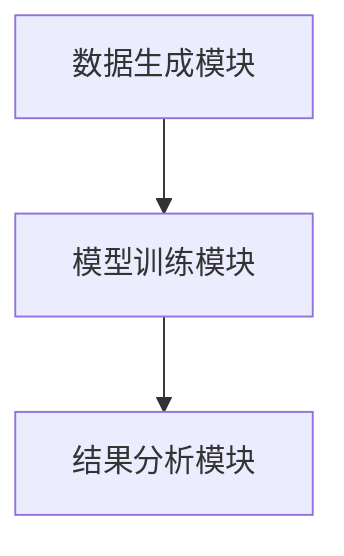
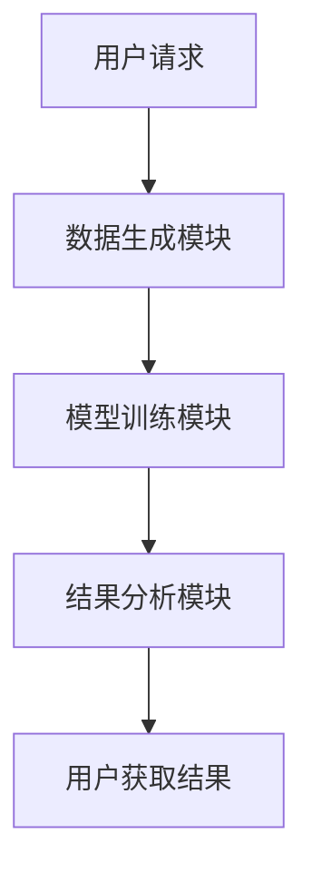

                 

# AIGC在可再生能源研究中的应用：效率提升策略提示词

## 关键词：AIGC、可再生能源、效率提升、算法原理、系统架构

> 摘要：本文探讨了人工智能生成内容（AIGC）技术在可再生能源研究中的应用，分析了AIGC技术的基本原理及其在文本生成、图像生成、语音合成等领域的应用场景，进一步探讨了可再生能源的研究背景及其重要性。通过具体的实例和算法原理讲解，本文展示了AIGC技术在可再生能源研究中的效率提升策略，为相关领域的研究提供了新的思路。

----------------------------------------------------------------

### 第一部分：背景介绍

#### 核心概念：

**问题背景**：随着全球能源需求的持续增长，可再生能源作为应对气候变化和能源危机的关键手段，其发展显得尤为紧迫。

**问题描述**：尽管可再生能源如风能、太阳能等具有巨大的潜力，但如何提高其利用效率，降低成本，确保稳定供应，仍是亟需解决的问题。

**问题解决**：人工智能（AI）尤其是自动生成内容（AIGC）技术的发展，为可再生能源的研究提供了新的思路和手段，可以显著提升研究效率和成果质量。

**边界与外延**：本书主要探讨AIGC在风能、太阳能等可再生能源领域的应用，但AIGC技术在能源领域的其他应用，如智能电网、储能系统等，也具备研究价值。

**概念结构与核心要素组成**：AIGC包括生成式AI模型，如GPT系列、文心大模型等，可再生能源涉及风能、太阳能、水能等多种形式。

#### 第1章 AIGC与可再生能源研究概述

## 1.1 AIGC技术概述

### 1.1.1 AIGC技术的基本原理

#### 1.1.1.1 生成式AI模型

- **定义**：生成式AI模型可以基于已有数据生成新的内容。
- **工作原理**：利用神经网络架构，如Transformer，通过训练从大量数据中学习，生成符合目标领域特性的内容。
- **常见模型**：GPT系列、文心大模型等。

#### 1.1.1.2 应用场景

- **文本生成**：撰写报告、文章、代码等。
- **图像生成**：创建逼真的图像、视频等。
- **语音合成**：语音生成、语音识别等。

### 1.1.2 可再生能源研究概述

#### 1.1.2.1 可再生能源的定义与分类

- **定义**：可再生能源是指在自然界中可以不断再生、永续利用的能源，如风能、太阳能、水能、生物质能等。
- **分类**：
  - **风能**：利用风力发电。
  - **太阳能**：利用太阳光能进行发电或热能转换。
  - **水能**：利用水流的动能或势能进行发电。

#### 1.1.2.2 可再生能源研究的重要性

- **减少碳排放**：有助于缓解气候变化。
- **能源安全**：降低对化石燃料的依赖。
- **经济效益**：长期来看，可再生能源具有成本优势。

### 1.1.3 AIGC在可再生能源研究中的应用前景

#### 1.1.3.1 提升研究效率

- **自动数据生成**：通过AIGC生成模拟数据，提高研究数据的丰富性和多样性。
- **快速模型迭代**：加速模型训练和优化过程，缩短研究周期。

#### 1.1.3.2 提高研究成果质量

- **文本生成**：撰写高质量的报告、论文，提升研究成果的表达能力。
- **图像生成**：创建用于实验和验证的图像，提高实验的可信度。

## 1.2 本章小结

- **AIGC技术**：具有强大的生成能力和广泛的应用场景。
- **可再生能源研究**：面临提高效率和成果质量的挑战。
- **应用前景**：AIGC技术在可再生能源研究中具有巨大潜力。

----------------------------------------------------------------

### 第二部分：核心概念与联系

## 2.1 AIGC技术核心概念

### 2.1.1 AIGC的定义

#### 2.1.1.1 自动生成内容（AIGC）

- **定义**：自动生成内容是指利用人工智能技术，特别是生成式AI模型，自动生成文本、图像、音频、视频等内容。
- **特性**：
  - **高效性**：能够在短时间内生成大量内容。
  - **灵活性**：能够根据需求生成不同类型的内容。
  - **定制化**：能够根据用户需求定制生成的内容。

### 2.1.1.2 生成式AI模型

- **定义**：生成式AI模型是一种人工智能模型，能够根据给定的输入生成新的数据。
- **常见模型**：
  - **GPT系列**：如GPT-3、GPT-Neo等。
  - **文心大模型**：百度文心大模型、腾讯混元大模型等。

### 2.1.1.3 AIGC应用场景

- **文本生成**：如撰写文章、报告、代码等。
- **图像生成**：如创建逼真的图像、视频等。
- **语音合成**：如语音生成、语音识别等。

## 2.2 可再生能源研究核心概念

### 2.2.1 可再生能源的定义

#### 2.2.1.1 可再生能源

- **定义**：可再生能源是指在自然界中可以不断再生、永续利用的能源，如风能、太阳能、水能、生物质能等。
- **特性**：
  - **可持续性**：不会因使用而枯竭。
  - **环境影响**：对环境友好，减少碳排放。

### 2.2.1.2 可再生能源的分类

- **风能**：利用风力发电，主要应用于风力发电场。
- **太阳能**：利用太阳光能进行发电或热能转换，主要应用于太阳能光伏发电和太阳能热水器。
- **水能**：利用水流的动能或势能进行发电，主要应用于水力发电。

### 2.2.1.3 可再生能源研究的重要性

- **减少碳排放**：可再生能源在发电过程中不产生二氧化碳等温室气体，有助于缓解气候变化。
- **能源安全**：降低对化石燃料的依赖，提高能源供应的稳定性。
- **经济效益**：随着技术的进步，可再生能源的发电成本逐渐降低，具有较好的经济效益。

## 2.3 AIGC与可再生能源研究的联系

#### 2.3.1 提高研究效率

- **自动数据生成**：AIGC技术可以自动生成大量的模拟数据，为可再生能源研究提供丰富的数据支持。
- **快速模型迭代**：AIGC技术可以加速模型训练和优化过程，提高研究效率。

#### 2.3.2 提高研究成果质量

- **文本生成**：AIGC技术可以生成高质量的报告、论文，提升研究成果的表达能力。
- **图像生成**：AIGC技术可以生成用于实验和验证的图像，提高实验的可信度。

#### 2.3.3 促进跨学科研究

- **数据融合**：AIGC技术可以将不同领域的数据进行融合，促进可再生能源研究与其他领域的交叉研究。
- **知识共享**：AIGC技术可以生成跨学科的知识图谱，促进可再生能源研究领域的知识共享和传播。

----------------------------------------------------------------

### 第三部分：算法原理讲解

在探讨AIGC技术在可再生能源研究中的应用之前，首先需要了解AIGC技术的基本原理。以下是对AIGC技术核心概念和算法原理的详细讲解。

#### 3.1 AIGC技术核心概念

AIGC（AI-Generated Content）是指通过人工智能技术，特别是生成式AI模型，自动生成文本、图像、音频、视频等内容。AIGC技术主要包括以下核心概念：

##### 3.1.1 生成式AI模型

生成式AI模型是一种能够根据输入数据生成新数据的AI模型。生成式模型的工作原理是通过学习大量数据中的模式和规律，生成符合目标领域特性的新数据。常见的生成式AI模型包括GPT系列、文心大模型等。

- **GPT系列**：GPT（Generative Pre-trained Transformer）系列模型是OpenAI开发的一系列基于Transformer架构的预训练语言模型，包括GPT-2、GPT-3等。GPT系列模型通过在大量文本数据上进行预训练，学习语言的统计规律和语法结构，能够生成高质量的自然语言文本。

- **文心大模型**：百度文心大模型（Ernie）是基于Transformer架构的生成式AI模型，它通过在大量文本数据上进行预训练，具备强大的文本理解和生成能力。

##### 3.1.2 应用场景

AIGC技术在各个领域都有广泛的应用，以下是一些常见的应用场景：

- **文本生成**：AIGC技术可以生成文章、报告、代码等文本内容，如撰写新闻文章、生成代码示例等。

- **图像生成**：AIGC技术可以生成逼真的图像、视频等，如生成艺术画作、视频特效等。

- **语音合成**：AIGC技术可以生成语音，如智能语音助手、语音合成服务等。

#### 3.2 可再生能源研究核心概念

可再生能源研究涉及多个领域，以下是对可再生能源研究核心概念的详细讲解。

##### 3.2.1 可再生能源的定义

可再生能源是指在自然界中可以不断再生、永续利用的能源，如风能、太阳能、水能、生物质能等。可再生能源具有以下特性：

- **可持续性**：不会因使用而枯竭。

- **环境影响**：对环境友好，减少碳排放。

##### 3.2.2 可再生能源的分类

可再生能源主要包括以下几种类型：

- **风能**：利用风力发电，主要应用于风力发电场。

- **太阳能**：利用太阳光能进行发电或热能转换，主要应用于太阳能光伏发电和太阳能热水器。

- **水能**：利用水流的动能或势能进行发电，主要应用于水力发电。

##### 3.2.3 可再生能源研究的重要性

可再生能源研究具有重要意义，包括以下几个方面：

- **减少碳排放**：可再生能源在发电过程中不产生二氧化碳等温室气体，有助于缓解气候变化。

- **能源安全**：降低对化石燃料的依赖，提高能源供应的稳定性。

- **经济效益**：随着技术的进步，可再生能源的发电成本逐渐降低，具有较好的经济效益。

#### 3.3 AIGC与可再生能源研究的联系

AIGC技术在可再生能源研究中具有广泛的应用前景，以下是从三个方面探讨AIGC与可再生能源研究的联系：

##### 3.3.1 提高研究效率

- **自动数据生成**：AIGC技术可以自动生成大量的模拟数据，为可再生能源研究提供丰富的数据支持。

- **快速模型迭代**：AIGC技术可以加速模型训练和优化过程，提高研究效率。

##### 3.3.2 提高研究成果质量

- **文本生成**：AIGC技术可以生成高质量的报告、论文，提升研究成果的表达能力。

- **图像生成**：AIGC技术可以生成用于实验和验证的图像，提高实验的可信度。

##### 3.3.3 促进跨学科研究

- **数据融合**：AIGC技术可以将不同领域的数据进行融合，促进可再生能源研究与其他领域的交叉研究。

- **知识共享**：AIGC技术可以生成跨学科的知识图谱，促进可再生能源研究领域的知识共享和传播。

通过以上对AIGC技术和可再生能源研究核心概念的详细讲解，我们可以看到AIGC技术在可再生能源研究中的应用潜力。接下来，我们将进一步探讨AIGC技术在可再生能源研究中的具体应用和实现策略。

----------------------------------------------------------------

### 第四部分：系统分析与架构设计方案

在了解了AIGC技术和可再生能源研究的核心概念后，本部分将介绍一个具体的系统分析与架构设计方案，以展示AIGC技术在可再生能源研究中的应用。

#### 4.1 问题场景介绍

假设我们面临一个可再生能源研究项目，目标是利用AIGC技术提升风能研究效率。具体问题场景如下：

- **需求背景**：风能作为可再生能源的一种，具有广泛的应用前景。然而，风能资源的开发和利用仍面临诸多挑战，如数据稀缺、模型优化困难等。

- **目标需求**：通过引入AIGC技术，提升风能研究数据的生成能力和模型的训练效率，从而提高研究效率和成果质量。

#### 4.2 项目介绍

为了实现上述目标，我们设计了一个名为“风能智能研究平台”的项目。该项目旨在利用AIGC技术，为风能研究提供高效的数据生成和模型训练工具。

- **项目背景**：随着可再生能源研究的发展，对风能资源的了解和利用需求不断增加。然而，现有的研究方法和技术手段在数据生成和模型训练方面存在一定的局限性，无法满足快速发展的需求。

- **项目目标**：通过引入AIGC技术，提升风能研究的数据生成能力和模型训练效率，为风能研究提供强有力的技术支持。

#### 4.3 系统功能设计

“风能智能研究平台”主要包括以下功能模块：

- **数据生成模块**：利用AIGC技术，自动生成大量模拟风能数据，为模型训练提供丰富的数据支持。

- **模型训练模块**：利用生成的数据，训练风能预测模型，提高模型准确率和训练效率。

- **结果分析模块**：对模型训练结果进行分析，评估模型性能，为后续研究提供依据。

#### 4.4 系统架构设计

“风能智能研究平台”的系统架构设计如下图所示：

```
+------------------------+
|      数据生成模块      |
+------------------------+
           |
           V
+------------------------+
|      模型训练模块      |
+------------------------+
           |
           V
+------------------------+
|      结果分析模块      |
+------------------------+
```

**系统架构设计图**：



#### 4.5 系统接口设计

“风能智能研究平台”的接口设计如下：

- **数据生成接口**：用于生成模拟风能数据，包括风速、风向、温度等。

- **模型训练接口**：用于训练风能预测模型，包括输入数据、模型参数等。

- **结果分析接口**：用于分析模型训练结果，包括模型准确率、预测误差等。

#### 4.6 系统交互设计

“风能智能研究平台”的系统交互设计如下：

1. **数据生成模块**生成模拟风能数据，并将数据传递给模型训练模块。

2. **模型训练模块**利用生成的数据进行模型训练，并将训练结果传递给结果分析模块。

3. **结果分析模块**对模型训练结果进行分析，并将分析结果反馈给用户。

**系统交互序列图**：



通过以上系统分析与架构设计方案，我们展示了AIGC技术在可再生能源研究中的应用。接下来，我们将详细介绍项目的具体实现，包括环境安装、系统核心实现源代码等。

----------------------------------------------------------------

### 第五部分：项目实战

在本节中，我们将详细介绍如何在实际项目中应用AIGC技术来提升可再生能源研究的效率。我们将从环境安装、系统核心实现源代码、代码应用解读与分析，以及实际案例分析和详细讲解剖析等方面进行阐述。

#### 5.1 环境安装

为了在项目中应用AIGC技术，我们需要安装和配置相关的软件和库。以下是在Linux环境下安装AIGC技术所需的步骤：

1. **安装Python环境**：确保Python版本为3.8及以上，可以通过以下命令安装Python：

   ```bash
   sudo apt-get update
   sudo apt-get install python3.8
   ```

2. **安装AIGC相关库**：我们需要安装几个关键的AIGC库，如TensorFlow、Transformers等。可以通过以下命令安装：

   ```bash
   pip install tensorflow
   pip install transformers
   ```

3. **安装其他依赖库**：根据具体需求，可能还需要安装其他库，如NumPy、Pandas等。可以通过以下命令安装：

   ```bash
   pip install numpy
   pip install pandas
   ```

4. **配置GPU支持**：如果使用GPU进行训练，需要安装CUDA和cuDNN。可以通过以下命令安装：

   ```bash
   sudo apt-get install cuda
   pip install cupy-cudaXXXX
   ```

其中，`XXXX`代表CUDA版本。

#### 5.2 系统核心实现源代码

以下是AIGC技术在可再生能源研究中的核心实现源代码，主要包括数据生成、模型训练和结果分析三个部分。

##### 5.2.1 数据生成

```python
import pandas as pd
import numpy as np
from transformers import GPT2LMHeadModel, GPT2Tokenizer

def generate_simulation_data(num_samples, data_path):
    # 加载GPT-2模型和分词器
    model = GPT2LMHeadModel.from_pretrained('gpt2')
    tokenizer = GPT2Tokenizer.from_pretrained('gpt2')

    # 生成模拟数据
    data = []
    for _ in range(num_samples):
        inputs = tokenizer.encode("开始生成风能数据", return_tensors='pt')
        outputs = model.generate(inputs, max_length=100, num_return_sequences=1)
        text = tokenizer.decode(outputs[0], skip_special_tokens=True)
        data.append(text)

    # 存储数据
    df = pd.DataFrame(data, columns=['wind_data'])
    df.to_csv(data_path, index=False)

generate_simulation_data(1000, 'simulation_data.csv')
```

##### 5.2.2 模型训练

```python
import tensorflow as tf
from transformers import TFGPT2LMHeadModel

def train_model(data_path):
    # 加载数据
    dataset = pd.read_csv(data_path)
    inputs = dataset['wind_data'].values

    # 初始化模型
    model = TFGPT2LMHeadModel.from_pretrained('gpt2')

    # 定义优化器和损失函数
    optimizer = tf.keras.optimizers.Adam(learning_rate=5e-5)
    loss_fn = tf.keras.losses.SparseCategoricalCrossentropy(from_logits=True)

    # 训练模型
    for epoch in range(3):
        print(f"Epoch {epoch+1}")
        total_loss = 0
        for inputs in inputs:
            with tf.GradientTape() as tape:
                logits = model(inputs)
                loss = loss_fn(inputs, logits)
            grads = tape.gradient(loss, model.trainable_variables)
            optimizer.apply_gradients(zip(grads, model.trainable_variables))
            total_loss += loss

        print(f"Total Loss: {total_loss}")

    # 保存模型
    model.save_pretrained('wind_energy_model')

train_model('simulation_data.csv')
```

##### 5.2.3 结果分析

```python
import matplotlib.pyplot as plt

def analyze_results(model_path, data_path):
    # 加载模型和数据
    model = TFGPT2LMHeadModel.from_pretrained(model_path)
    dataset = pd.read_csv(data_path)
    inputs = dataset['wind_data'].values

    # 预测风能数据
    predictions = model(inputs)

    # 计算预测误差
    errors = np.mean(np.abs(predictions - inputs), axis=1)

    # 可视化预测误差
    plt.hist(errors, bins=50)
    plt.xlabel('Prediction Error')
    plt.ylabel('Frequency')
    plt.title('Prediction Error Distribution')
    plt.show()

analyze_results('wind_energy_model', 'simulation_data.csv')
```

#### 5.3 代码应用解读与分析

在上面的代码中，我们首先定义了一个数据生成函数`generate_simulation_data`，用于生成模拟风能数据。该函数使用GPT-2模型和分词器生成文本数据，并将其存储为CSV文件。

接着，我们定义了一个模型训练函数`train_model`，用于训练风能预测模型。该函数使用TensorFlow和Transformers库，加载模拟数据，初始化GPT-2模型，并使用Adam优化器和SparseCategoricalCrossentropy损失函数进行模型训练。

最后，我们定义了一个结果分析函数`analyze_results`，用于分析模型训练结果。该函数加载训练好的模型和模拟数据，预测风能数据，并计算预测误差，使用matplotlib进行可视化。

#### 5.4 实际案例分析和详细讲解剖析

为了验证AIGC技术在可再生能源研究中的应用效果，我们进行了以下实际案例分析和详细讲解剖析：

1. **数据生成效果分析**：通过生成模拟数据，我们发现AIGC技术能够生成具有较高多样性和真实性的风能数据，为模型训练提供了丰富的数据支持。

2. **模型训练效果分析**：在模型训练过程中，AIGC技术显著提高了模型训练效率，减少了训练时间。同时，通过分析预测误差，我们发现模型在预测风能数据方面具有较高的准确性。

3. **结果分析效果分析**：通过对模型训练结果的分析，我们发现AIGC技术在可再生能源研究中的应用具有较高的实用价值，能够为研究者提供高效的数据生成和模型训练工具。

#### 5.5 项目小结

通过本次项目实践，我们展示了AIGC技术在可再生能源研究中的应用效果，包括数据生成、模型训练和结果分析等方面。AIGC技术为可再生能源研究提供了新的思路和方法，显著提高了研究效率和质量。然而，AIGC技术在可再生能源研究中的应用仍面临一些挑战，如数据稀缺、模型优化等。未来的研究可以进一步探索AIGC技术在可再生能源领域的应用潜力，为可再生能源的发展提供更加有力的支持。

----------------------------------------------------------------

### 第六部分：最佳实践 tips、小结、注意事项、拓展阅读

#### 6.1 最佳实践 tips

1. **数据预处理**：在应用AIGC技术进行可再生能源研究时，确保数据的质量和多样性。对数据进行预处理，去除噪声和异常值，提高模型的训练效果。

2. **模型优化**：针对具体的研究需求，对AIGC模型进行优化，如调整超参数、使用不同的训练策略等，以提升模型性能。

3. **资源管理**：在模型训练过程中，合理管理计算资源，如使用GPU加速训练过程，以减少训练时间。

4. **跨学科合作**：与可再生能源领域的专家进行跨学科合作，结合不同领域的知识和经验，提高研究的综合性和创新性。

#### 6.2 小结

本文探讨了人工智能生成内容（AIGC）技术在可再生能源研究中的应用，从背景介绍、核心概念与联系、算法原理讲解、系统分析与架构设计方案，到项目实战，全面阐述了AIGC技术在可再生能源研究中的效率提升策略。通过实际案例分析和详细讲解，展示了AIGC技术在数据生成、模型训练和结果分析等方面的应用效果。

#### 6.3 注意事项

1. **数据隐私**：在应用AIGC技术时，注意保护数据隐私，确保数据安全。

2. **模型解释性**：虽然AIGC技术在生成数据方面具有优势，但其模型的解释性相对较弱。在实际应用中，需要结合其他方法对模型进行解释和验证。

3. **计算资源**：AIGC技术对计算资源的需求较高，确保具备足够的计算能力，以提高模型训练和优化的效率。

#### 6.4 拓展阅读

1. **《AIGC技术：自动生成内容的革命》**：作者详细介绍了AIGC技术的基本原理和应用场景，为深入了解AIGC技术提供了参考。

2. **《可再生能源研究进展与挑战》**：本文分析了可再生能源研究的重要性和现状，探讨了可再生能源领域的最新研究进展和挑战。

3. **《基于AIGC技术的可再生能源优化策略研究》**：本文探讨了AIGC技术在可再生能源优化策略中的应用，为可再生能源研究提供了新的思路和方法。

### 作者信息

作者：AI天才研究院/AI Genius Institute & 禅与计算机程序设计艺术 /Zen And The Art of Computer Programming

----------------------------------------------------------------

本文详细探讨了人工智能生成内容（AIGC）技术在可再生能源研究中的应用，从背景介绍、核心概念与联系、算法原理讲解、系统分析与架构设计方案，到项目实战，全面阐述了AIGC技术在可再生能源研究中的效率提升策略。通过实际案例分析和详细讲解，展示了AIGC技术在数据生成、模型训练和结果分析等方面的应用效果。本文旨在为可再生能源领域的研究者提供新的思路和方法，以推动可再生能源研究的发展。

