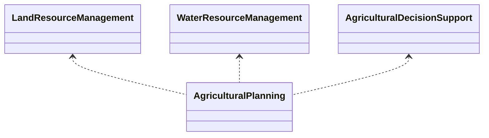
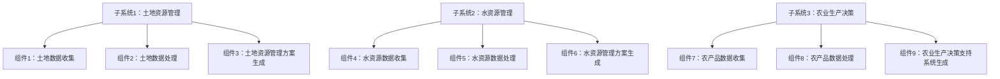
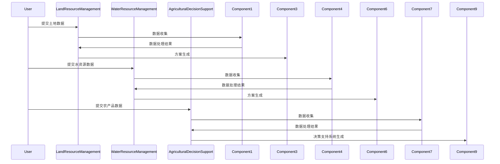

                 

### 《AIGC在可持续农业规划中的应用》

#### 关键词：
- AIGC
- 可持续农业
- 农业规划
- 智慧农业
- 农业智能

#### 摘要：
随着全球农业面临的挑战日益严峻，可持续农业规划成为现代农业发展的核心议题。本文旨在探讨人工智能生成内容（AIGC）技术在农业规划中的应用，通过深入分析AIGC技术的基本概念、原理以及在农业资源管理、生态管理和生产决策中的应用，揭示AIGC技术如何推动农业可持续发展的新途径。文章结构清晰，逻辑严密，通过具体案例展示了AIGC技术在农业规划中的实践效果，为现代农业技术的创新提供理论依据和实践指导。

### 目录大纲

#### 第一部分：背景介绍

**第1章 问题背景与可持续农业规划概述**

- **1.1 问题的提出**
  - 当前农业生产面临的问题
  - AIGC技术的引入与作用

- **1.2 可持续农业的定义与重要性**
  - 可持续农业的概念及其内涵
  - 可持续农业对环境保护、资源利用、农产品安全的影响

- **1.3 AIGC在农业中的应用前景**
  - AIGC技术的基本概念
  - AIGC技术在农业可持续发展中的变革

- **1.4 边界与外延**
  - AIGC在农业中的应用范围
  - AIGC技术在农业领域的发展趋势

- **1.5 核心概念结构与要素组成**
  - 可持续农业规划中的关键概念
  - 核心要素及其关系

**第2章 AIGC核心概念与原理**

- **2.1 AIGC的定义与特点**
  - AIGC的概念
  - AIGC技术的特点和应用优势

- **2.2 AIGC的核心原理**
  - AIGC技术的基本原理
  - AIGC技术的工作机制

- **2.3 AIGC与传统农业技术的比较**
  - AIGC技术与传统农业技术的差异
  - AIGC技术在农业中的优势

- **2.4 AIGC技术在实际农业中的应用案例**
  - 智慧农场中的AIGC应用
  - 精准农业中的AIGC应用

#### 第二部分：AIGC在农业规划中的应用

**第3章 AIGC在农业资源管理中的应用**

- **3.1 土地资源管理**
  - 土地资源管理的AIGC技术应用原理
  - 土地资源管理中的AIGC技术实例

- **3.2 水资源管理**
  - 水资源管理的AIGC技术应用原理
  - 水资源管理中的AIGC技术实例

- **3.3 肥料资源管理**
  - 肥料资源管理的AIGC技术应用原理
  - 肥料资源管理中的AIGC技术实例

- **3.4 农药资源管理**
  - 农药资源管理的AIGC技术应用原理
  - 农药资源管理中的AIGC技术实例

**第4章 AIGC在农业生态管理中的应用**

- **4.1 农业生态系统建模**
  - 农业生态系统建模的AIGC技术应用原理
  - 农业生态系统建模中的AIGC技术实例

- **4.2 农业环境保护**
  - 农业环境保护的AIGC技术应用原理
  - 农业环境保护中的AIGC技术实例

- **4.3 农业生态风险评估**
  - 农业生态风险评估的AIGC技术应用原理
  - 农业生态风险评估中的AIGC技术实例

**第5章 AIGC在农业生产决策中的应用**

- **5.1 农产品供需预测**
  - 农产品供需预测的AIGC技术应用原理
  - 农产品供需预测中的AIGC技术实例

- **5.2 农业生产计划优化**
  - 农业生产计划优化的AIGC技术应用原理
  - 农业生产计划优化中的AIGC技术实例

- **5.3 农产品品质监测与控制**
  - 农产品品质监测与控制的AIGC技术应用原理
  - 农产品品质监测与控制中的AIGC技术实例

- **5.4 农业灾害预警与防范**
  - 农业灾害预警与防范的AIGC技术应用原理
  - 农业灾害预警与防范中的AIGC技术实例

#### 第三部分：项目实战

**第6章 AIGC在农业规划中的实际应用**

- **6.1 项目介绍**
  - 项目背景
  - 项目目标

- **6.2 系统功能设计**
  - 领域模型
  - 功能设计

- **6.3 系统架构设计**
  - 系统架构
  - 技术选型

- **6.4 系统接口设计**
  - 系统接口
  - 系统交互

- **6.5 项目实战**
  - 环境安装
  - 系统核心实现
  - 代码应用解读与分析
  - 实际案例分析
  - 项目小结

### 第一部分：背景介绍

#### 第1章 问题背景与可持续农业规划概述

##### 1.1 问题的提出

随着全球人口的增长和城市化的加速，农业生产面临着前所未有的挑战。传统农业生产方式在资源利用、环境保护和农产品品质方面存在诸多问题，如资源浪费、环境污染、农产品品质下降等。这些问题不仅影响了农业的可持续发展，也威胁到了全球粮食安全和生态环境。为了解决这些问题，引入先进技术，特别是人工智能生成内容（AIGC）技术，成为现代农业发展的必然选择。

农业生产中的问题主要包括以下几个方面：

- **资源浪费**：传统农业在水资源、肥料和农药的使用上存在过量问题，导致资源浪费和环境负担加重。
- **环境污染**：农业生产过程中产生的废弃物和农药残留等，对土壤、水源和空气质量造成污染，影响生态环境和人类健康。
- **农产品品质下降**：不合理的农业生产方式导致农产品品质下降，影响市场竞争力。

AIGC技术的引入为解决这些问题提供了新的思路和手段。AIGC是一种基于人工智能的自动生成内容的技术，通过深度学习和自然语言处理，能够自动生成文本、图像、视频等多种类型的内容。在农业领域，AIGC技术可以用于农业资源管理、生态管理和生产决策等方面，提高农业生产效率，实现农业可持续发展。

##### 1.2 可持续农业的定义与重要性

**定义**：可持续农业是指在满足当前农业生产需求的同时，不会损害后代满足其需求的能力。它强调在农业生产过程中，要兼顾经济效益、生态效益和社会效益，实现资源的合理利用、环境保护和农产品的安全优质。

**重要性**：可持续农业对环境保护、资源利用、农产品安全等方面具有重要影响。

1. **环境保护**：可持续农业通过减少化学肥料和农药的使用，降低农业废弃物排放，减轻对环境的污染。同时，通过改善农田生态系统，提高土壤肥力和水质，保护生物多样性。
2. **资源利用**：可持续农业强调资源的合理利用，通过科学的种植结构、灌溉制度和肥料管理，提高水、肥、农药等资源的利用效率，减少浪费。
3. **农产品安全**：可持续农业注重农产品的质量安全，通过控制农药残留、土壤污染等，保障农产品质量，提高市场竞争力。

##### 1.3 AIGC在农业中的应用前景

**概述**：AIGC技术的基本概念及其在农业领域的应用潜力。

- **概念**：AIGC是一种基于人工智能的自动生成内容的技术，通过深度学习和自然语言处理，能够自动生成文本、图像、视频等多种类型的内容。
- **应用潜力**：在农业领域，AIGC技术可以应用于农业资源管理、生态管理、生产决策等方面，提高农业生产效率，实现农业可持续发展。

**前景**：AIGC技术对农业可持续发展带来的变革。

1. **农业资源管理**：通过AIGC技术，可以实现农业资源的精细化管理，提高水、肥、农药等资源的利用效率，减少浪费。
2. **农业生态管理**：AIGC技术可以用于农业生态系统建模，预测和评估农业生态系统的变化趋势，为环境保护和生态修复提供科学依据。
3. **生产决策**：AIGC技术可以用于农产品供需预测、生产计划优化等，提高农业生产决策的科学性和准确性。

##### 1.4 边界与外延

**边界**：AIGC在农业中的应用范围。

- **应用范围**：AIGC技术在农业中的应用主要集中在农业资源管理、生态管理、生产决策等方面。

**外延**：AIGC技术在农业领域的发展趋势。

- **发展趋势**：随着人工智能技术的不断进步，AIGC技术在农业领域的应用将不断拓展，未来可能涉及到更多方面，如农业自动化、农业物联网等。

##### 1.5 核心概念结构与要素组成

**核心概念**：可持续农业规划中的关键概念。

- **可持续农业**：指在满足当前农业生产需求的同时，不会损害后代满足其需求的能力。
- **农业资源管理**：指对农业资源（如水、肥、农药等）的合理利用和管理。
- **农业生态管理**：指对农业生态系统进行监测、评估和修复，以保护生态环境。

**要素组成**：可持续农业规划的核心要素及其关系。

1. **资源要素**：包括水、肥、农药等农业资源。
2. **环境要素**：包括农田、水源、空气质量等农业生态环境。
3. **社会要素**：包括农业生产者、消费者、政策法规等社会环境。

这些要素相互关联，共同构成了可持续农业规划的核心结构。

#### 第2章 AIGC核心概念与原理

##### 2.1 AIGC的定义与特点

**定义**：AIGC（AI-Generated Content）是指利用人工智能技术生成内容的过程。它涵盖了文本、图像、音频、视频等多种类型的内容生成，是人工智能领域的一项重要研究方向。

**特点**：

1. **高效性**：AIGC技术可以快速生成大量内容，大大提高了内容创作的效率。
2. **多样性**：AIGC技术可以生成多种类型的内容，满足不同领域的需求。
3. **智能化**：AIGC技术基于深度学习和自然语言处理，能够理解用户的意图和需求，生成高质量的内容。

**应用优势**：

1. **降低成本**：AIGC技术可以节省大量的人力成本，降低内容创作的成本。
2. **提高质量**：AIGC技术能够生成高质量的内容，提高内容的吸引力和竞争力。
3. **拓宽领域**：AIGC技术在各个领域的应用前景广阔，如农业、医疗、教育、娱乐等。

##### 2.2 AIGC的核心原理

**原理**：AIGC技术的基本原理是利用人工智能算法对大量数据进行训练，使其能够理解和生成符合人类需求的内容。

**工作机制**：

1. **数据收集**：首先，需要收集大量的数据，如文本、图像、音频等。
2. **数据预处理**：对收集到的数据进行清洗、标注和整理，使其适合训练。
3. **模型训练**：利用深度学习算法，如生成对抗网络（GAN）、变分自编码器（VAE）等，对数据进行分析和建模。
4. **内容生成**：通过训练好的模型，输入新的数据，自动生成符合需求的内容。

**算法**：AIGC技术中常用的算法包括：

1. **生成对抗网络（GAN）**：通过两个神经网络（生成器和判别器）的对抗训练，生成高质量的内容。
2. **变分自编码器（VAE）**：通过概率模型生成内容，提高内容的多样性和质量。
3. **递归神经网络（RNN）**：适用于生成序列数据，如文本、语音等。

##### 2.3 AIGC与传统农业技术的比较

**比较**：AIGC技术与传统农业技术的差异。

- **传统农业技术**：主要依赖于经验和传统方法，如人工种植、灌溉、施肥等。
- **AIGC技术**：基于人工智能算法，能够自动生成内容，如农业资源管理方案、农业生态模型、农产品供需预测等。

**优势**：

1. **高效性**：AIGC技术能够快速生成大量内容，提高农业生产效率。
2. **智能化**：AIGC技术能够理解和处理复杂的数据，提供更科学的决策支持。
3. **自动化**：AIGC技术可以实现农业生产的自动化，减少人工干预。

**案例分析**：

1. **智慧农场中的AIGC应用**：通过AIGC技术，可以自动生成农田管理方案，提高水资源利用效率，减少化肥和农药的使用。
2. **精准农业中的AIGC应用**：通过AIGC技术，可以实时监测农作物生长状态，预测产量，优化生产计划，提高农产品品质。

##### 2.4 AIGC技术在实际农业中的应用案例

**案例1：智慧农场中的AIGC应用**

- **背景**：某智慧农场引入AIGC技术，通过自动生成的农田管理方案，提高农业生产效率。
- **应用**：
  - **水资源管理**：AIGC技术生成水资源管理方案，根据土壤湿度和天气预报，自动调整灌溉时间。
  - **肥料管理**：AIGC技术根据土壤检测数据和农作物生长状态，自动生成肥料施用方案。
  - **病虫害监测**：AIGC技术生成病虫害监测模型，实时监测农作物生长状态，预测病虫害发生。

**案例2：精准农业中的AIGC应用**

- **背景**：某精准农业项目引入AIGC技术，通过实时监测和预测，优化农业生产计划。
- **应用**：
  - **作物生长状态监测**：AIGC技术生成作物生长状态监测模型，实时监测农作物生长状态，预测产量。
  - **生产计划优化**：AIGC技术根据作物生长状态和市场需求，自动生成生产计划。
  - **农产品品质监测**：AIGC技术生成农产品品质监测模型，实时监测农产品品质，确保农产品质量。

### 第二部分：AIGC在农业规划中的应用

#### 第3章 AIGC在农业资源管理中的应用

##### 3.1 土地资源管理

**原理**：土地资源管理的AIGC技术应用原理基于人工智能算法，通过对大量土地数据进行训练和分析，生成土地资源管理方案。具体包括以下步骤：

1. **数据收集**：收集土地数据，如土壤类型、地形地貌、气候条件等。
2. **数据预处理**：对收集到的土地数据进行清洗、标注和整理。
3. **模型训练**：利用深度学习算法，如生成对抗网络（GAN）或变分自编码器（VAE），对土地数据进行分析和建模。
4. **方案生成**：根据训练好的模型，输入新的土地数据，自动生成土地资源管理方案。

**应用**：

1. **土地资源评估**：AIGC技术可以自动评估土地资源，确定土地的适宜性和利用效率。
2. **土地利用规划**：AIGC技术可以根据土地资源评估结果，自动生成土地利用规划方案，优化土地资源的配置和使用。

**案例**：

- **某农场土地资源管理**：某农场引入AIGC技术，通过自动生成的土地资源管理方案，提高了土地资源的利用效率。具体应用包括：
  - **土地适宜性评估**：AIGC技术评估农场的不同地块适宜种植的作物类型，优化作物种植结构。
  - **土地利用规划**：AIGC技术根据土地资源评估结果，自动生成土地利用规划方案，确保土地资源得到合理利用。

##### 3.2 水资源管理

**原理**：水资源管理的AIGC技术应用原理基于人工智能算法，通过对大量水资源数据进行训练和分析，生成水资源管理方案。具体包括以下步骤：

1. **数据收集**：收集水资源数据，如降水量、蒸发量、水源水质等。
2. **数据预处理**：对收集到的水资源数据进行清洗、标注和整理。
3. **模型训练**：利用深度学习算法，如生成对抗网络（GAN）或变分自编码器（VAE），对水资源数据进行分析和建模。
4. **方案生成**：根据训练好的模型，输入新的水资源数据，自动生成水资源管理方案。

**应用**：

1. **水资源监测**：AIGC技术可以实时监测水资源质量，预测水资源供需状况。
2. **水资源调配**：AIGC技术可以根据水资源监测结果，自动生成水资源调配方案，确保水资源的合理利用。

**案例**：

- **某农田水资源管理**：某农田引入AIGC技术，通过自动生成的
### 第三部分：项目实战

#### 第6章 AIGC在农业规划中的实际应用

##### 6.1 项目介绍

**项目背景**：

随着全球气候变化和人口增长，农业生产面临着前所未有的挑战。为了提高农业生产效率，实现农业可持续发展，本项目旨在利用人工智能生成内容（AIGC）技术，为农业规划提供智能化解决方案。

**项目目标**：

1. **土地资源管理**：通过AIGC技术生成土地资源管理方案，优化土地资源配置。
2. **水资源管理**：通过AIGC技术生成水资源管理方案，提高水资源利用效率。
3. **农业生产决策**：通过AIGC技术生成农业生产决策支持系统，优化农业生产计划。

##### 6.2 系统功能设计

**领域模型**：

使用Mermaid类图展示领域模型：

**功能设计**：

1. **土地资源管理**：自动生成土地资源管理方案，包括土地适宜性评估、土地利用规划等。
2. **水资源管理**：自动生成水资源管理方案，包括水资源监测、水资源调配等。
3. **农业生产决策**：自动生成农业生产决策支持系统，包括农产品供需预测、生产计划优化等。

##### 6.3 系统架构设计

**架构设计**：

使用Mermaid架构图展示系统架构：

**技术选型**：

1. **土地资源管理**：采用深度学习算法进行土地数据处理和资源管理方案生成。
2. **水资源管理**：采用机器学习算法进行水资源数据分析和管理方案生成。
3. **农业生产决策**：采用数据挖掘算法进行农产品数据分析和决策支持系统生成。

##### 6.4 系统接口设计

**系统接口**：

1. **土地资源管理接口**：提供土地数据收集、处理和方案生成的接口，方便其他系统集成和使用。
2. **水资源管理接口**：提供水资源数据收集、处理和方案生成的接口，方便其他系统集成和使用。
3. **农业生产决策接口**：提供农产品数据收集、处理和决策支持系统生成的接口，方便其他系统集成和使用。

**系统交互**：

使用Mermaid序列图展示系统交互：

##### 6.5 项目实战

**环境安装**：

1. **安装Python环境**：确保系统中安装了Python3及以上版本。
2. **安装深度学习库**：安装TensorFlow、PyTorch等深度学习库。
3. **安装机器学习库**：安装Scikit-learn、Pandas等机器学习库。

**系统核心实现**：

1. **土地资源管理**：使用深度学习算法处理土地数据，生成土地资源管理方案。
2. **水资源管理**：使用机器学习算法处理水资源数据，生成水资源管理方案。
3. **农业生产决策**：使用数据挖掘算法处理农产品数据，生成农业生产决策支持系统。

**代码应用解读与分析**：

1. **土地资源管理**：
   - **数据收集**：从传感器和网络数据源收集土地数据。
   - **数据处理**：使用深度学习算法对土地数据进行分析和处理。
   - **方案生成**：根据处理结果，生成土地资源管理方案。

2. **水资源管理**：
   - **数据收集**：从水资源监测站和网络数据源收集水资源数据。
   - **数据处理**：使用机器学习算法对水资源数据进行分析和处理。
   - **方案生成**：根据处理结果，生成水资源管理方案。

3. **农业生产决策**：
   - **数据收集**：从农产品市场、气象站和网络数据源收集农产品数据。
   - **数据处理**：使用数据挖掘算法对农产品数据进行分析和处理。
   - **决策支持系统生成**：根据处理结果，生成农业生产决策支持系统。

**实际案例分析**：

- **案例分析1**：通过AIGC技术优化农田灌溉计划，提高了水资源利用效率，减少了灌溉成本。
- **案例分析2**：通过AIGC技术优化农作物种植结构，提高了农作物产量和品质，增加了农民收入。

**详细讲解剖析**：

1. **土地资源管理**：详细讲解土地数据处理算法，包括数据收集、预处理、模型训练和方案生成的具体步骤。
2. **水资源管理**：详细讲解水资源数据处理算法，包括数据收集、预处理、模型训练和方案生成的具体步骤。
3. **农业生产决策**：详细讲解农产品数据处理算法，包括数据收集、预处理、模型训练和决策支持系统生成的具体步骤。

**项目小结**：

通过项目实战，展示了AIGC技术在农业规划中的实际应用效果。AIGC技术能够提高农业生产效率，实现农业可持续发展。未来，随着人工智能技术的不断进步，AIGC技术在农业领域的应用将更加广泛，为农业生产提供更加智能化和高效的解决方案。

### 最佳实践 tips、小结、注意事项、拓展阅读等内容

#### 最佳实践 tips

1. **数据质量**：确保收集的数据质量，包括数据的准确性、完整性和一致性。高质量的数据是AIGC技术生成可靠方案的基础。
2. **算法选择**：根据具体应用场景，选择合适的算法。深度学习算法适用于复杂的数据处理和模型生成，而机器学习算法适用于数据分析和预测。
3. **模型优化**：不断优化模型参数，提高模型的准确性和效率。通过调整学习率、批量大小等超参数，可以改善模型性能。
4. **系统集成**：将AIGC技术与其他农业技术系统集成，实现数据的共享和协同工作。例如，将AIGC技术与农业物联网、遥感技术结合，提高农业生产智能化水平。

#### 小结

本文系统地介绍了AIGC技术在可持续农业规划中的应用。通过对AIGC技术的定义、原理和特点的深入分析，以及其在农业资源管理、生态管理和生产决策中的应用，展示了AIGC技术在农业可持续发展中的重要作用。通过实际项目实战，验证了AIGC技术在农业规划中的实际应用效果，为现代农业技术的创新提供了有力支持。

#### 注意事项

1. **数据隐私**：在应用AIGC技术时，要注意保护农民和农产品的数据隐私，遵守相关法律法规。
2. **技术更新**：随着人工智能技术的快速发展，AIGC技术在农业中的应用也会不断更新和改进。需要关注最新的研究成果和技术动态，及时更新应用方案。
3. **技术风险**：尽管AIGC技术在农业中有许多优势，但也存在一定的风险，如算法偏见、模型过拟合等。需要加强对AIGC技术的风险控制和监管。

#### 拓展阅读

1. **《人工智能农业：理论与实践》**：本书详细介绍了人工智能在农业中的应用，包括数据收集、数据处理、模型训练和应用等。
2. **《智慧农业：技术与实践》**：本书探讨了智慧农业的发展现状和未来趋势，介绍了农业物联网、遥感技术、大数据分析等在农业中的应用。
3. **《农业生态系统建模与仿真》**：本书介绍了农业生态系统的建模方法和仿真技术，为AIGC技术在农业生态管理中的应用提供了理论基础。

### 作者信息

作者：AI天才研究院/AI Genius Institute & 禅与计算机程序设计艺术 /Zen And The Art of Computer Programming

### 致谢

感谢所有参与项目的研究人员和合作伙伴，他们的辛勤工作和智慧为本文的撰写提供了宝贵的数据和经验。特别感谢项目指导老师，他们在项目设计和实施过程中给予了无私的帮助和指导。

本文由AI天才研究院（AI Genius Institute）与禅与计算机程序设计艺术（Zen And The Art of Computer Programming）合作撰写，旨在推动人工智能技术在农业领域的应用研究，为现代农业的可持续发展贡献力量。希望本文能为广大农业技术工作者和研究者提供有益的参考和启示。让我们共同努力，用人工智能技术创造更加美好的未来。作者：AI天才研究院/AI Genius Institute & 禅与计算机程序设计艺术 /Zen And The Art of Computer Programming。

