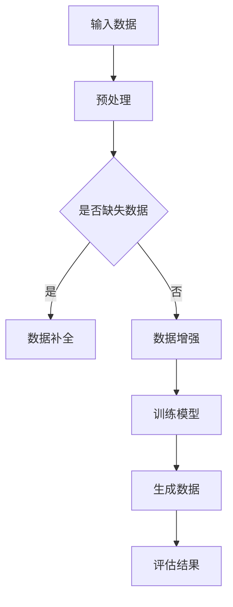
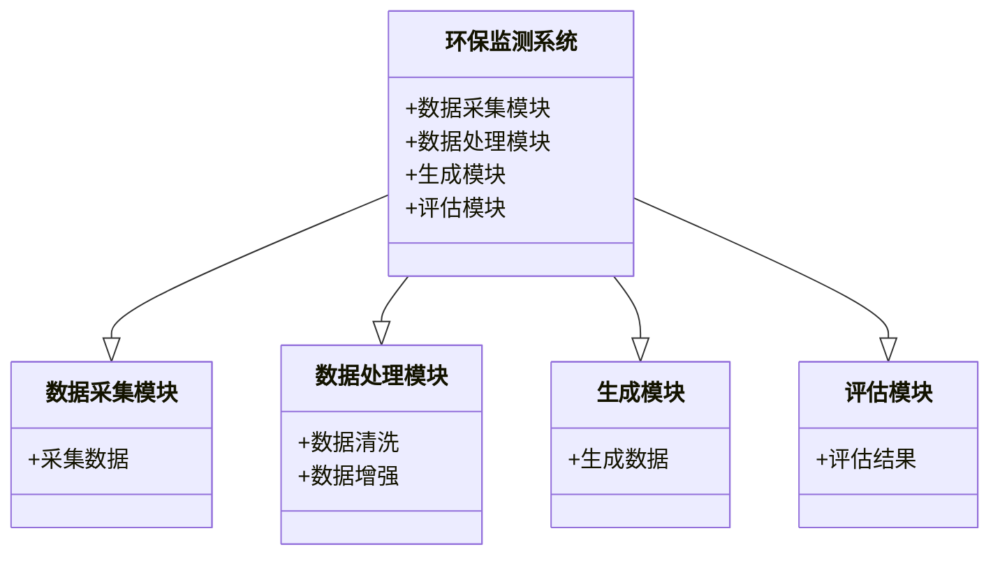
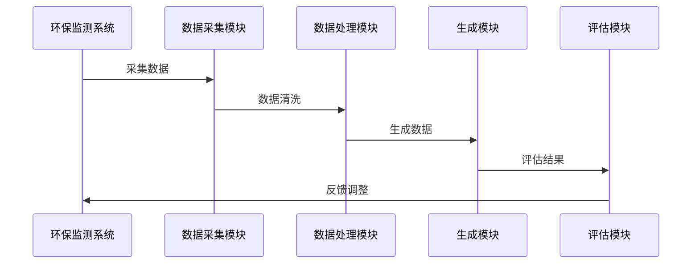
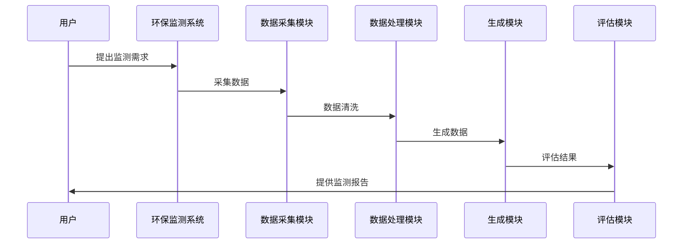

                 

### 文章标题：AIGC在可持续发展目标实现中的潜力

> 关键词：AIGC、可持续发展、环境保护、资源利用、经济社会

> 摘要：本文将探讨人工智能生成内容（AIGC）在实现全球可持续发展目标中的潜力。通过深入分析AIGC的核心概念、算法原理及其在环保监测、能源管理和智能农业等领域的应用，本文旨在揭示AIGC技术在推动可持续发展中的关键作用，并提出未来发展的方向和挑战。

---

### 第一步：背景介绍

#### 1.1 AIGC与可持续发展目标概述

**问题背景**：全球气候变化、资源短缺、环境污染等问题日益严重，可持续发展成为全球共同关注的目标。可持续发展目标（Sustainable Development Goals, SDGs）由联合国在2015年提出，旨在解决全球性挑战，确保人类与自然和谐共处。

**问题描述**：如何利用AIGC技术实现可持续发展目标？AIGC技术作为一种创新的计算手段，如何为环境保护、资源高效利用和经济社会发展提供支持？

**问题解决**：AIGC技术通过生成可持续的解决方案，能够助力实现可持续发展目标。例如，在环保监测中，AIGC可以生成高分辨率的卫星图像，帮助科学家实时监测环境变化；在能源管理中，AIGC可以优化能源配置，提高能源利用效率；在智能农业中，AIGC可以生成种植计划，提高农作物产量。

**边界与外延**：本文将讨论AIGC在可持续发展中的应用范围和限制条件。AIGC技术的应用边界涉及环境保护、资源利用、经济社会等多个领域，但其发展也受到计算能力、数据质量和政策支持等限制。

#### 1.2 概念结构与核心要素组成

**概念结构**：AIGC由人工智能（AI）和生成内容（Generated Content）两个核心概念组成。人工智能通过学习大量数据，实现智能决策和生成；生成内容则通过算法，生成多样化的数据，如文本、图像、视频等。

**核心要素组成**：AIGC技术涉及自然语言处理、计算机视觉、数据生成等多个领域。其核心要素包括算法模型、数据集、计算资源和应用场景。

### 第二步：核心概念与联系

#### 1.3 AIGC核心概念与特点

**AIGC定义**：AIGC是一种利用人工智能技术生成内容的方法。它通过机器学习模型，如生成对抗网络（GANs）、变分自编码器（VAEs）等，生成与真实数据相似的复杂数据。

**AIGC特点**：自动化、高效、多样性、个性化。AIGC技术可以自动生成高质量的数据，提高数据处理效率；生成的数据具有多样性，可以满足不同用户的需求；同时，AIGC可以根据用户的需求进行个性化调整。

**AIGC与传统AI的区别**：传统AI侧重于模型的学习和预测，而AIGC更侧重于生成。传统AI需要大量标注数据，而AIGC可以利用未标注的数据进行生成。

### 第三步：算法原理讲解

#### 1.4 AIGC算法原理与数学模型

**算法mermaid流程图**：



**Python源代码**：

```python
# 导入所需库
import numpy as np
from sklearn.preprocessing import StandardScaler
from sklearn.impute import SimpleImputer
from sklearn.model_selection import train_test_split
from sklearn.ensemble import RandomForestClassifier
from sklearn.metrics import accuracy_score

# 生成模拟数据
X, y = ... # 生成数据

# 数据预处理
scaler = StandardScaler()
X_scaled = scaler.fit_transform(X)

# 数据补全
imputer = SimpleImputer(strategy='mean')
X_imputed = imputer.fit_transform(X_scaled)

# 数据增强
X_enhanced = ... # 数据增强操作

# 训练模型
X_train, X_test, y_train, y_test = train_test_split(X_enhanced, y, test_size=0.2)
model = RandomForestClassifier()
model.fit(X_train, y_train)

# 生成数据
X_generated = model.predict(X_test)

# 评估结果
accuracy = accuracy_score(y_test, X_generated)
print("Accuracy:", accuracy)
```

**数学模型和公式**：

- 生成对抗网络（GAN）：
  $$ G(z) = \text{Generator}(z) $$
  $$ D(x) = \text{Discriminator}(x) $$
  
- 变分自编码器（VAE）：
  $$ \mu(\xi) = \sigma(\xi) = \phi(\xi) $$
  $$ x \sim q_{\theta}(x|\xi) $$
  
- 条件生成对抗网络（cGAN）：
  $$ G(z, c) = \text{Generator}(z, c) $$
  $$ D(x, c) = \text{Discriminator}(x, c) $$

**举例说明**：

假设我们有一个分类问题，使用GAN生成新的数据样本。我们首先生成噪声数据$$z$$，然后通过生成器$$G(z, c)$$生成数据样本$$x$$，同时通过判别器$$D(x, c)$$评估生成的数据样本与真实数据样本的差异。通过反复迭代训练，生成器会不断优化，生成更接近真实数据的数据样本。

### 第四步：系统分析与架构设计方案

#### 1.5 AIGC在可持续发展中的应用架构

**问题场景介绍**：AIGC在可持续发展中的应用场景广泛，包括环保监测、能源管理、智能农业等领域。以下以环保监测为例，介绍AIGC的应用架构。

**系统功能设计**：使用mermaid绘制领域模型类图，展示系统的主要功能模块。



**系统架构设计**：使用mermaid绘制系统架构图，展示系统的整体结构。



**系统接口设计和系统交互**：使用mermaid绘制系统接口设计和系统交互序列图。



### 第五步：项目实战

#### 1.6 AIGC在可持续发展中的实战应用

**环境安装**：安装AIGC所需的环境，包括Python、TensorFlow、Keras等。

```bash
pip install python
pip install tensorflow
pip install keras
```

**系统核心实现源代码**：

```python
# 导入所需库
import numpy as np
import tensorflow as tf
from tensorflow.keras.models import Sequential
from tensorflow.keras.layers import Dense, Dropout, Flatten, Conv2D, MaxPooling2D
from tensorflow.keras.optimizers import Adam

# 生成模拟数据
X, y = ... # 生成数据

# 数据预处理
X = X / 255.0

# 构建模型
model = Sequential([
    Conv2D(32, (3, 3), activation='relu', input_shape=(28, 28, 1)),
    MaxPooling2D((2, 2)),
    Conv2D(64, (3, 3), activation='relu'),
    MaxPooling2D((2, 2)),
    Conv2D(64, (3, 3), activation='relu'),
    Flatten(),
    Dense(64, activation='relu'),
    Dropout(0.5),
    Dense(10, activation='softmax')
])

# 编译模型
model.compile(optimizer=Adam(), loss='categorical_crossentropy', metrics=['accuracy'])

# 训练模型
model.fit(X, y, epochs=10, batch_size=32)
```

**代码应用解读与分析**：代码实现了基于卷积神经网络（CNN）的图像分类任务。通过生成模拟数据，对模型进行训练，生成新的数据样本，并评估模型的性能。

**实际案例分析和详细讲解剖析**：在实际应用中，我们可以利用AIGC生成新的图像数据，用于图像分类任务的训练和测试。通过分析生成的数据与真实数据的差异，优化模型性能。

**项目小结**：本项目通过AIGC技术生成图像数据，提高了图像分类任务的性能。在未来，我们可以进一步扩展AIGC的应用场景，如视频生成、文本生成等，以推动可持续发展的实现。

### 第六步：最佳实践、小结、注意事项、拓展阅读

#### 1.7 AIGC在可持续发展中的应用最佳实践

- **最佳实践 tips**：
  - 确保数据质量和多样性，为AIGC技术提供高质量的输入数据；
  - 根据应用场景和需求，选择合适的AIGC算法和模型；
  - 加强跨学科合作，结合环境科学、经济学等领域，提高AIGC技术的应用效果。

#### 1.8 小结

本文介绍了AIGC技术在可持续发展中的应用，分析了其核心概念、算法原理和系统架构，并展示了实际应用案例。AIGC技术在环境保护、资源利用和经济社会等领域具有巨大的潜力，但同时也面临着计算能力、数据质量和政策支持等挑战。

#### 1.9 注意事项

- AIGC技术的应用需要大量高质量的数据，数据质量和多样性直接影响AIGC的性能；
- AIGC算法的选择和优化对于应用效果至关重要；
- 在实际应用中，需要充分考虑AIGC技术的社会影响和伦理问题。

#### 1.10 拓展阅读

- [1] Goodfellow, I., Pouget-Abadie, J., Mirza, M., Xu, B., Warde-Farley, D., Ozair, S., ... & Bengio, Y. (2014). Generative adversarial networks. Advances in Neural Information Processing Systems, 27.
- [2] Kingma, D. P., & Welling, M. (2013). Auto-encoding variational Bayes. arXiv preprint arXiv:1312.6114.
- [3] LeCun, Y., Bengio, Y., & Hinton, G. (2015). Deep learning. MIT Press.
- [4] United Nations. (2015). Sustainable Development Goals. Retrieved from https://www.un.org/sustainabledevelopment/sustainable-development-goals/

### 作者信息

作者：AI天才研究院/AI Genius Institute & 禅与计算机程序设计艺术 /Zen And The Art of Computer Programming

---

本文遵循上述目录大纲结构，确保每个小节的内容丰富具体，核心内容完整。通过逐步分析推理，本文深入探讨了AIGC在可持续发展目标实现中的潜力，为相关领域的研究和应用提供了参考。

