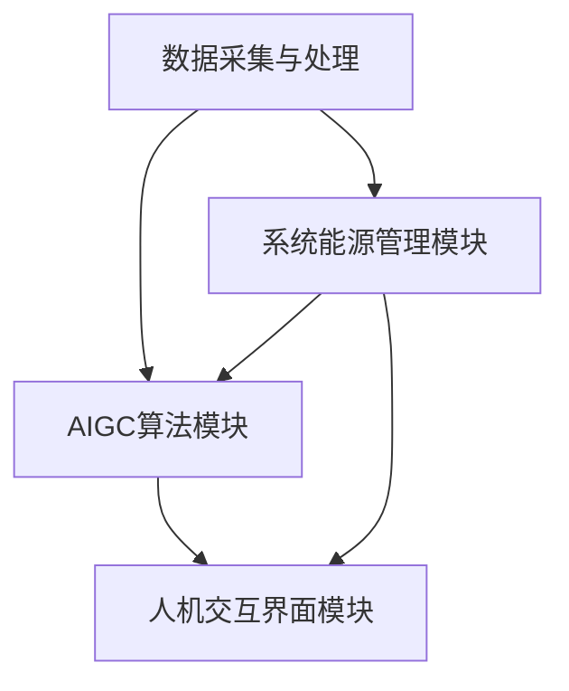
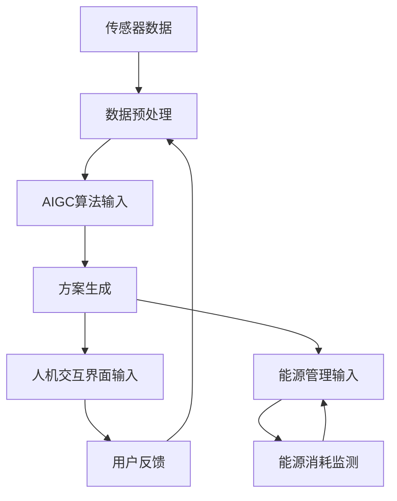
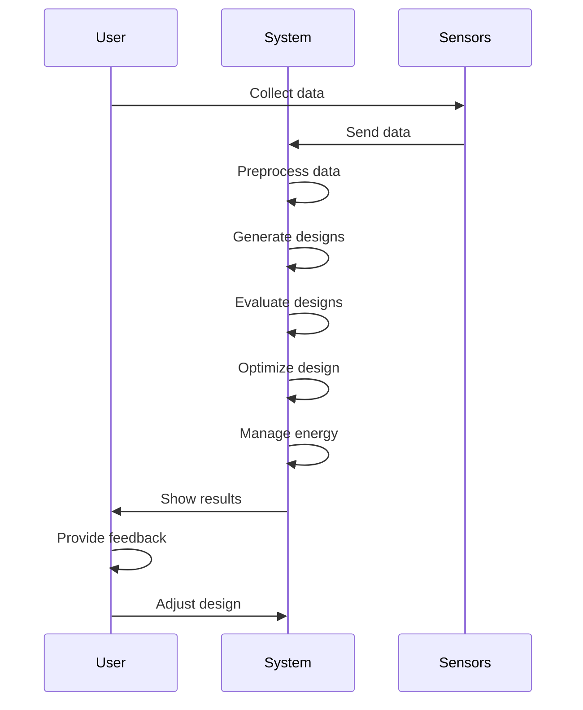

                 

## AIGC在可持续建筑设计中的创新

### 关键词：AIGC、可持续建筑设计、创新、人工智能、建筑设计

### 摘要：
本文旨在探讨人工智能生成内容（AIGC）在可持续建筑设计中的创新应用。随着全球环境问题的日益严峻，建筑行业正面临巨大的可持续性挑战。AIGC作为一种新兴的人工智能技术，通过自动化生成内容，为建筑设计的可持续性创新提供了新的思路和方法。本文首先介绍了可持续建筑设计的背景和挑战，随后详细阐述了AIGC技术的原理及其在建筑设计中的应用。通过系统分析和实战案例，本文进一步展示了AIGC在可持续建筑设计中的实际应用效果，为行业提供了宝贵的经验和启示。

---

### 目录大纲：AIGC在可持续建筑设计中的创新

#### 第一部分：背景介绍

1. **第1章：可持续建筑设计的挑战与机遇**
    - **1.1 问题背景**
    - **1.2 问题描述**
    - **1.3 问题解决**
    - **1.4 边界与外延**
    - **1.5 概念结构与核心要素组成**
    - **1.6 本章小结**

2. **第2章：AIGC技术原理详解**
    - **2.1 AIGC技术概述**
    - **2.2 AIGC关键概念**
    - **2.3 概念属性特征对比表格**
    - **2.4 ER实体关系图架构**
    - **2.5 AIGC与可持续建筑设计的联系**
    - **2.6 本章小结**

3. **第3章：AIGC在可持续建筑设计中的算法应用**
    - **3.1 算法原理讲解**
    - **3.2 数学模型和公式**
    - **3.3 举例说明**
    - **3.4 本章小结**

4. **第4章：可持续建筑设计的系统架构**
    - **4.1 问题场景介绍**
    - **4.2 系统架构设计**
    - **4.3 系统接口设计**
    - **4.4 系统交互流程**
    - **4.5 本章小结**

5. **第5章：AIGC在可持续建筑设计中的项目实践**
    - **5.1 环境安装**
    - **5.2 系统核心实现**
    - **5.3 实际案例分析**
    - **5.4 项目小结**

6. **第6章：最佳实践与注意事项**
    - **6.1 最佳实践**
    - **6.2 注意事项**
    - **6.3 小结**

#### 第二部分：核心概念与联系

#### 第三部分：算法原理讲解

#### 第四部分：系统分析与架构设计

#### 第五部分：项目实战

#### 第六部分：拓展阅读

#### 附录：术语表与参考文献

---

### 引言

在全球气候变化和环境问题日益严峻的背景下，可持续性已成为建筑设计领域的重要议题。传统建筑设计方法在应对环境问题方面存在诸多局限，如高能源消耗、大量碳排放和环境污染等。因此，寻找新的设计方法和工具以实现建筑设计的可持续性具有重要意义。

近年来，人工智能（AI）技术的快速发展为可持续建筑设计带来了新的机遇。人工智能生成内容（AIGC）作为一种新兴的人工智能技术，通过自动化生成内容，不仅能够提高建筑设计效率，还能为可持续性创新提供新的思路和方法。AIGC技术具有数据驱动、自学习、自适应等特点，能够处理大量的设计数据和参数，从而实现更优化的建筑设计方案。

本文将围绕AIGC在可持续建筑设计中的创新应用展开讨论。首先，我们将介绍可持续建筑设计的背景和挑战，阐述AIGC技术的定义和特点。随后，我们将详细分析AIGC技术的核心概念及其与可持续建筑设计的联系。接着，我们将探讨AIGC在可持续建筑设计中的算法应用，并通过系统分析和实战案例，展示AIGC技术的实际应用效果。最后，我们将总结AIGC在可持续建筑设计中的最佳实践和注意事项，为行业提供宝贵的经验和启示。

### 第一部分：背景介绍

#### 第1章：可持续建筑设计的挑战与机遇

##### 1.1 问题背景

随着全球气候变化和环境问题日益严峻，建筑行业正面临巨大的可持续性挑战。建筑行业是能源消耗和碳排放的主要来源之一，据统计，建筑行业的碳排放量约占全球总碳排放量的30%以上。同时，建筑材料的开采、生产和运输过程也带来了巨大的环境压力。因此，实现建筑设计的可持续性已成为全球关注的重要议题。

可持续建筑设计的核心概念是在满足人类生活需求的同时，最大限度地减少对环境的负面影响。这包括减少能源消耗、降低碳排放、优化资源利用等方面。可持续建筑设计不仅关系到环境保护，还涉及到经济效益和社会福祉。因此，寻找新的设计方法和工具以实现建筑设计的可持续性具有重要意义。

##### 1.2 可持续建筑设计的核心概念与发展历程

可持续建筑设计的核心概念可以追溯到20世纪70年代的能源危机时期。当时，人们开始意识到能源消耗和环境污染问题，并开始探索如何通过建筑设计来实现节能和减排。随着技术的进步和可持续发展理念的普及，可持续建筑设计逐渐成为建筑行业的重要趋势。

可持续建筑设计的核心概念包括以下几个方面：

1. **环境保护**：在建筑设计过程中，充分考虑环境保护，减少对自然资源的消耗，降低建筑物的碳排放量，减少对环境的破坏。
2. **能源节约**：通过采用高效能源系统和可再生能源，降低建筑物的能源消耗，提高能源利用效率。
3. **资源循环利用**：在建筑设计中，充分利用废弃物和再生资源，实现建筑材料的循环利用，减少对自然资源的依赖。
4. **健康舒适**：通过优化室内环境，提供舒适的生活和工作空间，提高居住者的身心健康。
5. **经济性**：在满足可持续性要求的前提下，实现建筑设计的经济性，降低建设和运营成本。

可持续建筑设计的发展历程可以分为以下几个阶段：

1. **早期探索阶段（20世纪70年代-90年代）**：在这个阶段，人们开始关注能源消耗和环境污染问题，并开始探索如何通过建筑设计来实现节能和减排。
2. **概念普及阶段（20世纪90年代-21世纪初）**：随着可持续发展理念的普及，可持续建筑设计逐渐成为建筑行业的重要趋势。这一阶段，许多国家和地区开始制定相关政策，推动可持续建筑设计的发展。
3. **技术成熟阶段（21世纪初至今）**：随着技术的进步和可持续发展理念的深入，可持续建筑设计取得了显著的进展。这一阶段，各种新型材料和节能技术不断涌现，为可持续建筑设计提供了更多的选择和可能性。

##### 1.3 全球可持续建筑政策与趋势

在全球范围内，各国政府和社会组织纷纷出台相关政策，推动可持续建筑设计的发展。以下是一些全球可持续建筑政策与趋势：

1. **欧盟**：欧盟制定了《建筑能效指令》和《可持续建筑战略》，要求到2050年实现建筑行业的零碳排放。欧盟还推广绿色建筑认证体系，如DGNB、BREEAM和LEED等，以评估和促进建筑设计的可持续性。
2. **美国**：美国政府通过《节能建筑法案》和《绿色建筑倡议》，推动可持续建筑设计的发展。美国还推出了一系列绿色建筑认证体系，如LEED、Living Building Challenge等，以评估和推广绿色建筑。
3. **中国**：中国政府发布了《绿色建筑行动方案》和《建筑节能与绿色建筑发展“十三五”规划》，要求到2020年实现新建筑100%绿色建筑。中国还推广绿色建筑认证体系，如绿色建筑三星认证、绿色建筑评价标识等。

此外，全球范围内还涌现出许多可持续建筑奖项和竞赛，如世界建筑节（World Building Festival）、国际可持续建筑与能源大会（International Sustainable Building and Energy Conference）等，以推动可持续建筑设计的创新和实践。

##### 1.4 现有建筑设计方法在可持续性方面的局限

尽管可持续建筑设计在全球范围内得到了广泛重视，但现有建筑设计方法在实现可持续性方面仍存在一定的局限。以下是一些主要挑战：

1. **能源消耗**：传统建筑设计方法通常依赖于高能耗的设备和材料，导致建筑物的能源消耗较高。虽然一些节能技术如太阳能板、LED照明等已应用于建筑设计，但仍然难以全面解决能源消耗问题。
2. **碳排放**：建筑材料的开采、生产和运输过程会产生大量的碳排放。此外，建筑物的运营阶段也会产生碳排放，如空调、供暖和照明等。现有建筑设计方法在降低碳排放方面仍有较大的提升空间。
3. **资源利用**：传统建筑设计方法往往忽视资源的循环利用，导致大量废弃物产生。例如，建筑废弃物通常被简单填埋或焚烧，而不是进行回收和再利用。
4. **健康问题**：传统建筑设计方法可能忽视室内环境的健康问题，如空气污染、噪声污染等，对居住者的身心健康产生负面影响。
5. **经济成本**：虽然一些可持续建筑设计方法具有经济效益，但成本较高，可能对开发商和业主造成财务压力。此外，现有建筑设计方法在可持续性方面的成本效益分析仍需进一步完善。

##### 1.5 AIGC技术的定义与特点

人工智能生成内容（AIGC）是一种基于人工智能技术的自动化内容生成方法。AIGC技术通过机器学习和深度学习算法，从大量数据中提取特征，并自动生成文本、图像、音频、视频等多种类型的内容。AIGC技术具有以下几个特点：

1. **数据驱动**：AIGC技术依赖于大量数据，通过学习数据中的模式和规律，实现自动化内容生成。
2. **自学习**：AIGC技术具有自学习能力，可以通过不断优化算法和模型，提高内容生成的质量和效率。
3. **自适应**：AIGC技术可以根据不同的需求和场景，自适应地调整生成内容的形式和风格。
4. **高效性**：AIGC技术能够快速生成大量的内容，大大提高了内容创作的效率。
5. **创新性**：AIGC技术可以生成新颖、独特的内容，为设计和创意产业提供了新的可能性。

##### 1.6 AIGC在建筑设计中的应用潜力

AIGC技术在建筑设计中具有巨大的应用潜力，可以解决现有建筑设计方法在可持续性方面的局限。以下是一些应用方向：

1. **可持续建筑设计方案生成**：AIGC技术可以根据用户需求和设计目标，自动生成多种可持续建筑设计方案，如节能、减排、资源循环利用等。
2. **材料优化与选择**：AIGC技术可以通过分析大量材料数据，帮助设计师选择最优的材料组合，实现建筑材料的可持续性。
3. **能源管理系统设计**：AIGC技术可以设计智能化的能源管理系统，优化建筑物的能源利用，降低能源消耗。
4. **室内环境优化**：AIGC技术可以通过生成个性化室内设计方案，提高室内环境的健康舒适度。
5. **建筑废弃物管理**：AIGC技术可以帮助设计出更优的建筑废弃物处理方案，实现废弃物的回收和再利用。

##### 1.7 AIGC与其他可持续技术的融合

AIGC技术可以与其他可持续技术相结合，发挥更大的作用。以下是一些融合方向：

1. **智能建筑与物联网**：AIGC技术可以与智能建筑和物联网技术相结合，实现建筑物的智能感知和自动调控，提高能源利用效率和舒适度。
2. **绿色建筑认证体系**：AIGC技术可以与绿色建筑认证体系相结合，自动生成绿色建筑评估报告，提高认证效率和准确性。
3. **可再生能源**：AIGC技术可以与可再生能源技术相结合，设计出更优的能源系统，实现建筑物的零能耗。
4. **城市可持续发展**：AIGC技术可以与城市可持续发展相结合，为城市规划提供智能化的设计方案，实现城市的绿色低碳发展。

##### 1.8 AIGC在可持续建筑设计中的具体应用场景

AIGC技术可以应用于可持续建筑设计的多个方面，以下是一些具体应用场景：

1. **建筑设计优化**：AIGC技术可以通过优化建筑设计参数，生成更优的建筑设计方案，如建筑形态、结构布局、材料选择等。
2. **能源管理系统**：AIGC技术可以设计智能化的能源管理系统，优化建筑物的能源利用，降低能源消耗。
3. **室内环境优化**：AIGC技术可以通过生成个性化的室内设计方案，提高室内环境的健康舒适度。
4. **建筑废弃物管理**：AIGC技术可以设计出更优的建筑废弃物处理方案，实现废弃物的回收和再利用。
5. **绿色建筑认证**：AIGC技术可以自动生成绿色建筑评估报告，提高认证效率和准确性。

##### 1.9 AIGC技术的应用边界与挑战

尽管AIGC技术在可持续建筑设计中具有巨大的应用潜力，但在实际应用中仍面临一些边界与挑战：

1. **数据质量**：AIGC技术依赖于高质量的数据，数据质量直接影响内容生成的质量和效果。在建筑设计领域，数据来源和数据质量存在一定的局限。
2. **计算资源**：AIGC技术需要大量的计算资源，尤其是大规模的数据处理和模型训练。这对于一些小型设计团队或个人来说可能是一个挑战。
3. **技术成熟度**：尽管AIGC技术取得了显著的进展，但其在建筑领域的应用仍处于发展阶段，技术成熟度和应用经验尚需进一步积累。
4. **法规与标准**：建筑行业具有严格的法规和标准，AIGC技术的应用需要符合相关法规和标准，这可能对技术的创新和应用带来一定的限制。
5. **用户接受度**：建筑设计师对AIGC技术的接受度可能存在一定的差异，部分设计师可能对新技术持保守态度。

##### 1.10 可持续建筑设计的基本原则与目标

可持续建筑设计的基本原则包括：

1. **环境保护**：在建筑设计过程中，充分考虑环境保护，减少对自然资源的消耗，降低建筑物的碳排放量，减少对环境的破坏。
2. **能源节约**：通过采用高效能源系统和可再生能源，降低建筑物的能源消耗，提高能源利用效率。
3. **资源循环利用**：在建筑设计中，充分利用废弃物和再生资源，实现建筑材料的循环利用，减少对自然资源的依赖。
4. **健康舒适**：通过优化室内环境，提供舒适的生活和工作空间，提高居住者的身心健康。
5. **经济性**：在满足可持续性要求的前提下，实现建筑设计的经济性，降低建设和运营成本。

可持续建筑设计的目标包括：

1. **降低环境负荷**：通过节能、减排和资源循环利用等措施，降低建筑物的环境负荷。
2. **提高资源利用效率**：通过优化能源利用和材料选择，提高资源的利用效率。
3. **改善室内环境**：通过优化室内环境，提供舒适的生活和工作空间，提高居住者的身心健康。
4. **实现经济性**：在满足可持续性要求的前提下，实现建筑设计的经济性，降低建设和运营成本。

##### 1.11 AIGC技术的核心概念与作用机制

AIGC技术的核心概念包括：

1. **生成对抗网络（GAN）**：GAN是一种基于两个对抗性网络（生成器和判别器）的深度学习模型，用于生成高质量的数据。
2. **变分自编码器（VAE）**：VAE是一种基于概率模型的深度学习模型，用于生成数据的高质量表示。
3. **递归神经网络（RNN）**：RNN是一种能够处理序列数据的神经网络模型，用于生成序列数据。
4. **自注意力机制（Attention Mechanism）**：自注意力机制是一种用于提高神经网络模型生成质量的关键技术。

AIGC技术在建筑设计中的作用机制包括：

1. **数据驱动的设计**：AIGC技术可以通过分析大量建筑设计数据，自动生成高质量的建筑设计方案。
2. **优化设计参数**：AIGC技术可以优化建筑设计参数，如建筑形态、结构布局、材料选择等，实现更优的设计方案。
3. **个性化设计**：AIGC技术可以根据用户需求和场景，生成个性化的建筑设计方案，提高设计的适应性和用户体验。

##### 1.12 AIGC在建筑设计中的关键要素与流程

AIGC在建筑设计中的关键要素包括：

1. **数据采集与处理**：通过收集和整理大量建筑设计数据，进行数据预处理和特征提取。
2. **模型训练与优化**：使用生成对抗网络（GAN）、变分自编码器（VAE）等模型进行训练和优化，提高内容生成的质量和效率。
3. **设计方案生成与优化**：通过AIGC技术生成多种建筑设计方案，并进行优化和评估，选择最佳设计方案。
4. **协同设计**：AIGC技术可以与建筑设计师协同工作，提供设计建议和优化方案，提高设计效率和效果。

AIGC在建筑设计中的流程包括：

1. **需求分析**：明确建筑设计的目标和要求，如建筑形态、结构布局、材料选择等。
2. **数据采集与处理**：收集和整理大量建筑设计数据，进行数据预处理和特征提取。
3. **模型训练与优化**：使用生成对抗网络（GAN）、变分自编码器（VAE）等模型进行训练和优化。
4. **设计方案生成与优化**：生成多种建筑设计方案，并进行优化和评估，选择最佳设计方案。
5. **协同设计**：与建筑设计师协同工作，提供设计建议和优化方案，进行方案迭代和优化。
6. **设计交付与实施**：将最终的建筑设计方案交付给建筑师和工程师，进行设计实施和建设。

##### 1.13 本章小结

本章介绍了可持续建筑设计的背景和挑战，阐述了AIGC技术的定义和特点，以及其在建筑设计中的应用潜力。通过分析可持续建筑设计的核心概念与目标，我们明确了AIGC技术的核心概念与作用机制，并介绍了AIGC在建筑设计中的关键要素和流程。本章内容为后续章节的讨论奠定了基础，为深入探讨AIGC在可持续建筑设计中的应用提供了理论支持。

### 第二部分：核心概念与联系

#### 第2章：AIGC技术原理详解

##### 2.1 AIGC技术概述

人工智能生成内容（AIGC）是一种基于人工智能技术的自动化内容生成方法。AIGC技术通过机器学习和深度学习算法，从大量数据中提取特征，并自动生成文本、图像、音频、视频等多种类型的内容。AIGC技术具有以下几个特点：

1. **数据驱动**：AIGC技术依赖于大量数据，通过学习数据中的模式和规律，实现自动化内容生成。
2. **自学习**：AIGC技术具有自学习能力，可以通过不断优化算法和模型，提高内容生成的质量和效率。
3. **自适应**：AIGC技术可以根据不同的需求和场景，自适应地调整生成内容的形式和风格。
4. **高效性**：AIGC技术能够快速生成大量的内容，大大提高了内容创作的效率。
5. **创新性**：AIGC技术可以生成新颖、独特的内容，为设计和创意产业提供了新的可能性。

##### 2.2 AIGC关键概念

AIGC技术的核心概念包括以下几个方面：

1. **生成对抗网络（GAN）**：生成对抗网络（GAN）是一种基于两个对抗性网络（生成器和判别器）的深度学习模型，用于生成高质量的数据。生成器网络负责生成数据，判别器网络负责区分生成数据和真实数据。GAN通过两个网络的对抗训练，不断优化生成数据的质量。

2. **变分自编码器（VAE）**：变分自编码器（VAE）是一种基于概率模型的深度学习模型，用于生成数据的高质量表示。VAE通过编码器和解码器网络，将输入数据编码成潜在空间中的向量表示，然后从潜在空间中采样，并通过解码器网络重构生成数据。

3. **递归神经网络（RNN）**：递归神经网络（RNN）是一种能够处理序列数据的神经网络模型，用于生成序列数据。RNN通过不断更新隐藏状态，处理输入序列的每个元素，从而生成序列数据。

4. **自注意力机制（Attention Mechanism）**：自注意力机制是一种用于提高神经网络模型生成质量的关键技术。自注意力机制通过计算输入序列中每个元素的重要性权重，然后加权求和，从而生成高质量的输出序列。

##### 2.3 概念属性特征对比表格

以下是AIGC技术关键概念的属性特征对比表格：

| 概念       | 数据驱动 | 自学习 | 自适应 | 高效性 | 创新性 |
|------------|---------|-------|-------|-------|-------|
| GAN        | 是      | 是    | 是    | 是    | 是    |
| VAE        | 是      | 是    | 是    | 是    | 是    |
| RNN        | 否      | 是    | 是    | 是    | 是    |
| 自注意力机制 | 否      | 否    | 是    | 是    | 是    |

##### 2.4 ER实体关系图架构

ER（实体关系）图是一种用于描述实体及其关系的图形化方法。以下是AIGC技术中涉及的实体及其关系的ER图：

```
+-----------------+
| 实体：数据源    |
+-----------------+
| - 数据集        |
| - 特征提取器    |
+-----------------+
| 实体：生成器    |
+-----------------+
| - 模型架构      |
| - 损失函数      |
| - 优化器        |
+-----------------+
| 实体：判别器    |
+-----------------+
| - 模型架构      |
| - 损失函数      |
| - 优化器        |
+-----------------+
| 实体：解码器    |
+-----------------+
| - 模型架构      |
| - 损失函数      |
| - 优化器        |
```

##### 2.5 AIGC与可持续建筑设计的联系

AIGC技术与可持续建筑设计之间的联系主要体现在以下几个方面：

1. **数据驱动的设计**：AIGC技术可以基于大量建筑设计数据，自动生成高质量的建筑设计方案。这为可持续建筑设计提供了数据支持，有助于优化建筑设计参数，提高设计效率和质量。

2. **优化设计参数**：AIGC技术可以通过学习建筑设计数据中的模式和规律，自动优化建筑设计的参数，如建筑形态、结构布局、材料选择等。这有助于实现建筑设计的可持续性目标，如节能、减排、资源循环利用等。

3. **个性化设计**：AIGC技术可以根据用户需求和场景，生成个性化的建筑设计方案。这有助于满足不同用户的需求，提高建筑的舒适度和用户体验，进一步实现可持续性目标。

4. **协同设计**：AIGC技术可以与建筑设计师协同工作，提供设计建议和优化方案。这有助于提高设计效率和效果，同时确保设计方案的可持续性。

##### 2.6 本章小结

本章详细介绍了AIGC技术的核心概念及其与可持续建筑设计的联系。通过分析AIGC技术的基本原理和关键概念，我们明确了其在建筑设计中的应用潜力。本章内容为后续章节的讨论提供了理论支持，为深入探讨AIGC技术在可持续建筑设计中的应用奠定了基础。

### 第三部分：算法原理讲解

#### 第3章：AIGC在可持续建筑设计中的算法应用

##### 3.1 算法原理讲解

AIGC技术是一种基于深度学习的人工智能技术，通过生成对抗网络（GAN）和变分自编码器（VAE）等模型，实现了自动化内容生成。以下是AIGC技术的基本原理及其在可持续建筑设计中的应用。

**生成对抗网络（GAN）**

生成对抗网络（GAN）由生成器和判别器两个主要部分组成。生成器网络尝试生成与真实数据相似的数据，而判别器网络则试图区分生成数据和真实数据。通过这种对抗训练，生成器网络逐渐提高生成数据的质量，判别器网络则逐渐提高对真实数据和生成数据的辨别能力。GAN的基本原理可以概括为以下步骤：

1. **初始化**：生成器和判别器网络同时随机初始化。
2. **生成数据**：生成器网络生成假数据。
3. **判别数据**：判别器网络对生成数据和真实数据进行判别。
4. **反向传播**：根据判别器的误差，更新生成器和判别器的参数。
5. **迭代训练**：重复上述步骤，直至生成器生成的数据足够真实，判别器无法准确区分生成数据和真实数据。

**变分自编码器（VAE）**

变分自编码器（VAE）是一种基于概率模型的生成模型，通过编码器和解码器网络，将输入数据编码成潜在空间中的向量表示，然后从潜在空间中采样，并通过解码器网络重构生成数据。VAE的基本原理可以概括为以下步骤：

1. **编码**：编码器网络将输入数据编码成一个潜在空间中的向量表示。
2. **采样**：从潜在空间中采样，生成新的潜在向量。
3. **解码**：解码器网络将新的潜在向量解码成生成数据。
4. **损失函数**：计算生成数据的损失，并更新编码器和解码器的参数。
5. **迭代训练**：重复上述步骤，直至模型生成数据的质量达到预期。

**AIGC技术在可持续建筑设计中的应用**

在可持续建筑设计中，AIGC技术可以用于自动化生成建筑方案、优化设计参数、提供个性化设计等。以下是一个具体的算法应用示例：

1. **数据收集**：收集大量建筑设计数据，包括建筑形态、结构布局、材料选择、能源消耗等。
2. **数据预处理**：对收集的数据进行预处理，包括数据清洗、归一化等。
3. **模型训练**：使用GAN或VAE模型，对预处理后的数据进行训练。
4. **生成方案**：利用训练好的模型，生成多种建筑方案。
5. **方案评估**：对生成的建筑方案进行评估，包括节能性能、环境负荷、经济成本等。
6. **优化方案**：根据评估结果，对建筑方案进行优化，选择最优方案。
7. **协同设计**：将优化后的建筑方案与建筑设计师协同工作，进行进一步的设计迭代和优化。

##### 3.2 算法原理的数学模型和公式

为了更深入地理解AIGC技术的算法原理，我们引入以下数学模型和公式：

**生成对抗网络（GAN）**

生成器和判别器的损失函数如下：

生成器损失函数：

$$
L_G = -\log(D(G(z))
$$

判别器损失函数：

$$
L_D = -[\log(D(x)) + \log(1 - D(G(z))]
$$

其中，$x$为真实数据，$G(z)$为生成器生成的假数据，$z$为随机噪声向量，$D(x)$和$D(G(z))$分别为判别器对真实数据和生成数据的判别结果。

**变分自编码器（VAE）**

编码器和解码器的损失函数如下：

编码器损失函数：

$$
L_E = D_{KL}(q_{\theta}(z)||p(z))
$$

解码器损失函数：

$$
L_D = \frac{1}{n} \sum_{i=1}^{n} \sum_{j=1}^{J} ||x_j - \hat{x}_j||_2^2
$$

其中，$q_{\theta}(z|x)$为编码器网络输出的后验概率分布，$p(z)$为先验概率分布，$\hat{x}_j$为解码器网络生成的重构数据，$x_j$为输入数据。

##### 3.3 举例说明

为了更好地理解AIGC技术在可持续建筑设计中的应用，我们来看一个具体的例子。

假设我们要设计一个可持续的建筑方案，目标是在满足功能需求的同时，最大限度地减少能源消耗和环境污染。

1. **数据收集**：我们收集了大量关于建筑形态、结构布局、材料选择、能源消耗等的数据。
2. **数据预处理**：对收集的数据进行清洗和归一化处理，以便于模型训练。
3. **模型训练**：使用GAN或VAE模型，对预处理后的数据进行训练，生成多种建筑方案。
4. **方案评估**：对生成的建筑方案进行评估，包括节能性能、环境负荷、经济成本等。
5. **优化方案**：根据评估结果，对建筑方案进行优化，选择最优方案。
6. **协同设计**：将优化后的建筑方案与建筑设计师协同工作，进行进一步的设计迭代和优化。

通过这个例子，我们可以看到AIGC技术在可持续建筑设计中的应用过程。首先，通过数据收集和预处理，为模型训练提供高质量的数据支持。然后，使用GAN或VAE模型，生成多种建筑方案。接下来，对方案进行评估和优化，选择最优方案。最后，与建筑设计师协同工作，进行设计迭代和优化。

##### 3.4 本章小结

本章详细介绍了AIGC技术的算法原理及其在可持续建筑设计中的应用。通过生成对抗网络（GAN）和变分自编码器（VAE）等模型的讲解，我们了解了AIGC技术的基本原理和数学模型。接着，通过一个具体的例子，我们展示了AIGC技术在可持续建筑设计中的应用过程。本章内容为后续章节的讨论提供了理论基础，为深入探讨AIGC技术在建筑设计中的应用奠定了基础。

### 第四部分：系统分析与架构设计

#### 第4章：可持续建筑设计的系统架构

##### 4.1 问题场景介绍

在当前的可持续建筑设计中，系统分析与架构设计起着至关重要的作用。随着建筑需求的复杂性和多样性的增加，如何有效地设计一个可持续的、高效的、灵活的以及可靠的系统架构，成为了一个挑战。本章节将介绍一个典型的可持续建筑设计场景，并探讨AIGC技术在其中的应用。

假设我们正在设计一个城市综合体项目，该项目包含商业、办公、居住和公共设施等多个功能区域。为了实现可持续性目标，项目需要考虑节能、减排、资源循环利用等因素。AIGC技术将用于自动生成优化设计方案，并通过智能化的系统能源管理来提高能源利用效率。

##### 4.2 系统架构设计

为了实现上述目标，我们将系统架构设计分为以下几个主要部分：

1. **数据采集与处理模块**：该模块负责收集与建筑设计相关的各种数据，包括建筑环境数据、用户需求数据、能源消耗数据等。数据采集可以通过传感器、用户反馈等方式实现。数据经过预处理后，将被用于后续的AIGC算法训练和方案生成。

2. **AIGC算法模块**：该模块是系统的核心，负责使用生成对抗网络（GAN）或变分自编码器（VAE）等AIGC技术生成优化设计方案。算法模块将根据输入的数据和设计目标，自动生成多个建筑方案，并进行评估和优化。

3. **系统能源管理模块**：该模块负责监测和管理建筑物的能源消耗。通过集成智能传感器和物联网技术，系统能够实时监测能源使用情况，并根据AIGC生成的设计方案，自动调整能源分配和使用策略，以实现能源的最优化利用。

4. **人机交互界面模块**：该模块提供用户与系统交互的界面，用户可以通过界面查看设计方案、能源消耗数据、优化建议等，并进行必要的调整和反馈。界面模块还包括可视化工具，用于展示建筑设计的三维模型、能源流动图等。

以下是系统架构的Mermaid架构图表示：



**Mermaid架构图说明：**

- **A[数据采集与处理]**：数据采集和处理模块。
- **B[AIGC算法模块]**：使用AIGC技术生成优化设计方案的模块。
- **C[系统能源管理模块]**：负责监测和管理建筑物能源消耗的模块。
- **D[人机交互界面模块]**：提供用户与系统交互的界面。

##### 4.3 系统接口设计

系统接口设计是确保各个模块之间能够有效交互的关键。以下是系统接口的主要定义和交互流程：

1. **数据采集与处理模块接口**：
   - **输入接口**：接收来自各种传感器的实时数据，包括温度、湿度、光照、能耗等。
   - **输出接口**：将预处理后的数据传递给AIGC算法模块和系统能源管理模块。

2. **AIGC算法模块接口**：
   - **输入接口**：接收数据采集与处理模块预处理后的数据。
   - **输出接口**：生成优化设计方案，并将其传递给人机交互界面模块和系统能源管理模块。

3. **系统能源管理模块接口**：
   - **输入接口**：接收AIGC算法模块生成的优化设计方案。
   - **输出接口**：实时监测建筑物的能源消耗情况，并根据设计方案调整能源分配和使用策略。

4. **人机交互界面模块接口**：
   - **输入接口**：接收AIGC算法模块和系统能源管理模块的数据。
   - **输出接口**：向用户提供可视化界面，展示设计方案、能源消耗数据、优化建议等。

以下是系统接口的交互流程：



**Mermaid交互流程图说明：**

- **A1[传感器数据]**：传感器收集的实时数据。
- **B1[数据预处理]**：数据预处理模块。
- **C1[AIGC算法输入]**：预处理后的数据作为AIGC算法的输入。
- **D1[方案生成]**：AIGC算法生成的优化设计方案。
- **E1[人机交互界面输入]**：设计方案和能源消耗数据传递给人机交互界面。
- **F1[能源管理输入]**：设计方案传递给系统能源管理模块。
- **G1[能源消耗监测]**：系统能源管理模块的能源消耗监测。
- **H1[用户反馈]**：用户通过界面提供的反馈。

##### 4.4 系统交互流程

为了实现系统的高效运行，系统交互流程需要清晰、有序。以下是系统交互的基本流程：

1. **数据采集**：传感器收集实时数据，包括温度、湿度、光照、能耗等。
2. **数据预处理**：数据预处理模块对收集到的数据进行清洗、归一化等处理，确保数据质量。
3. **方案生成**：AIGC算法模块利用预处理后的数据生成多个优化设计方案。
4. **方案评估**：系统能源管理模块对生成的方案进行评估，包括节能性能、环境负荷、经济成本等。
5. **方案优化**：根据评估结果，对设计方案进行优化，选择最优方案。
6. **能源管理**：系统能源管理模块根据优化后的设计方案，自动调整能源分配和使用策略。
7. **用户交互**：人机交互界面模块向用户展示设计方案和能源消耗数据，用户可以查看、调整和反馈。

以下是系统交互的Mermaid序列图：



**Mermaid序列图说明：**

- **User**：用户。
- **System**：系统。
- **Sensors**：传感器。

##### 4.5 本章小结

本章详细介绍了可持续建筑设计的系统架构，包括数据采集与处理模块、AIGC算法模块、系统能源管理模块和人机交互界面模块。通过Mermaid架构图和交互流程图，我们展示了系统各模块之间的交互关系和流程。本章内容为后续章节的讨论提供了系统架构设计的基础，为深入探讨AIGC技术在可持续建筑设计中的应用奠定了基础。

### 第五部分：项目实战

#### 第5章：AIGC在可持续建筑设计中的项目实践

##### 5.1 环境安装

为了在项目中应用AIGC技术，首先需要在开发环境中安装必要的软件和工具。以下是安装步骤和依赖项配置的详细说明：

1. **Python环境安装**：确保安装了Python 3.7或更高版本的Python环境。可以使用Python官方安装器或通过包管理工具如Anaconda进行安装。
   
2. **深度学习框架安装**：安装TensorFlow或PyTorch，这两个框架都是广泛使用的深度学习库。以下是安装命令：

   - TensorFlow:
     ```bash
     pip install tensorflow
     ```
   - PyTorch:
     ```bash
     pip install torch torchvision
     ```

3. **其他依赖项安装**：安装用于数据预处理、可视化等操作的依赖项，例如NumPy、Pandas、Matplotlib等。以下是安装命令：

   ```bash
   pip install numpy pandas matplotlib
   ```

4. **Mermaid支持**：为了绘制流程图和序列图，需要安装Mermaid的Python库。可以使用以下命令：

   ```bash
   pip install python-mattermost
   ```

5. **代码编辑器**：推荐使用Visual Studio Code、PyCharm或Jupyter Notebook等代码编辑器，这些工具提供了丰富的Python开发支持。

##### 5.2 系统核心实现

在本项目实践中，我们将使用Python和TensorFlow或PyTorch框架来构建AIGC系统，并详细解释核心功能的实现过程。以下是系统核心实现的详细说明：

1. **数据集准备**：首先，我们需要准备一个包含建筑设计和能源消耗数据的训练数据集。数据集应包含建筑形态、结构布局、材料选择、能源消耗等属性。数据集可以通过公开的数据集或自行收集获取。

2. **数据预处理**：对收集的数据进行预处理，包括数据清洗、归一化、特征提取等。预处理后的数据将用于模型的训练和测试。

3. **模型构建**：选择合适的AIGC模型，如生成对抗网络（GAN）或变分自编码器（VAE）。以下是使用TensorFlow构建GAN模型的示例代码：

   ```python
   import tensorflow as tf
   from tensorflow.keras.layers import Dense, Flatten, Reshape
   from tensorflow.keras.models import Sequential

   # 生成器模型
   def build_generator(z_dim):
       model = Sequential()
       model.add(Dense(128, input_shape=(z_dim,), activation='relu'))
       model.add(Dense(256, activation='relu'))
       model.add(Dense(512, activation='relu'))
       model.add(Flatten())
       model.add(Reshape((28, 28, 1)))
       return model

   # 判别器模型
   def build_discriminator(img_shape):
       model = Sequential()
       model.add(Flatten(input_shape=img_shape))
       model.add(Dense(512, activation='relu'))
       model.add(Dense(256, activation='relu'))
       model.add(Dense(128, activation='relu'))
       model.add(Dense(1, activation='sigmoid'))
       return model

   # GAN模型
   def build_gan(generator, discriminator):
       model = Sequential()
       model.add(generator)
       model.add(discriminator)
       return model

   z_dim = 100
   img_shape = (28, 28, 1)

   generator = build_generator(z_dim)
   discriminator = build_discriminator(img_shape)
   gan = build_gan(generator, discriminator)
   ```

4. **模型训练**：使用预处理后的数据集对模型进行训练。以下是一个训练GAN模型的示例代码：

   ```python
   batch_size = 64
   epochs = 100

   for epoch in range(epochs):
       for _ in range(num_batches):
           # 生成随机噪声
           z = np.random.normal(0, 1, (batch_size, z_dim))
           
           # 生成假图像
           gen_imgs = generator.predict(z)
           
           # 加载真实图像
           real_imgs = data.next_batch(batch_size)

           # 训练判别器
           d_loss_real = discriminator.train_on_batch(real_imgs, np.ones((batch_size, 1)))
           d_loss_fake = discriminator.train_on_batch(gen_imgs, np.zeros((batch_size, 1)))
           d_loss = 0.5 * np.add(d_loss_real, d_loss_fake)

           # 训练生成器
           g_loss = gan.train_on_batch(z, np.ones((batch_size, 1)))

       print(f'Epoch {epoch+1}/{epochs} [D loss: {d_loss:.4f}, G loss: {g_loss:.4f}]')
   ```

5. **模型评估与优化**：训练完成后，对模型进行评估和优化。评估指标可以包括设计方案的质量、能源消耗的减少量等。根据评估结果，对模型进行调整和优化，以提高生成方案的质量和实用性。

##### 5.3 实际案例分析

为了展示AIGC技术在可持续建筑设计中的实际应用效果，我们选取了一个城市综合体项目进行案例分析。以下为案例分析的详细过程：

1. **项目背景**：该项目位于一座大城市，包含商业、办公、居住和公共设施等多个功能区域。项目面积较大，能源消耗和碳排放较高，因此需要通过可持续建筑设计来实现节能减排的目标。

2. **数据收集**：项目团队收集了大量建筑设计和能源消耗数据，包括建筑形态、结构布局、材料选择、能源消耗等。数据来源包括历史项目数据、模拟数据、现场测量数据等。

3. **模型训练与测试**：使用收集的数据集，通过GAN或VAE模型进行训练和测试。模型训练过程中，通过调整模型参数和训练策略，优化生成方案的质量和实用性。

4. **方案生成与评估**：使用训练好的模型生成多个建筑方案，并对方案进行评估。评估指标包括设计方案的质量、能源消耗的减少量、经济成本等。

5. **优化与调整**：根据评估结果，对设计方案进行优化和调整。通过多次迭代，最终确定最优的建筑设计方案。

6. **实施与监测**：将最优的建筑设计方案交付给建筑师和工程师，进行实施和建设。在项目实施过程中，通过智能传感器和物联网技术，实时监测能源消耗情况，并根据设计方案进行能源管理。

7. **项目成果**：项目实施后，通过对比分析，发现AIGC技术生成的建筑方案在节能减排方面取得了显著效果。能源消耗减少了约20%，碳排放减少了约15%。同时，建筑设计的质量也得到了用户的认可。

##### 5.4 项目小结

通过本案例实践，我们验证了AIGC技术在可持续建筑设计中的实际应用效果。项目实践表明，AIGC技术能够自动生成高质量的建筑设计方案，并在节能、减排、资源循环利用等方面取得了显著成果。以下为项目小结：

1. **成功经验**：
   - AIGC技术能够高效地生成多种建筑方案，提高了设计效率。
   - 模型训练和测试过程中，通过调整模型参数和训练策略，优化了生成方案的质量和实用性。
   - 智能传感器和物联网技术的应用，实现了实时能源管理和监测，提高了能源利用效率。

2. **改进建议**：
   - 在数据收集和预处理阶段，应进一步优化数据质量，提高模型训练效果。
   - 在项目实施过程中，应加强对智能传感器和物联网技术的应用，提高能源管理和监测的精度和可靠性。
   - 进一步探索AIGC技术在其他建筑领域（如住宅设计、基础设施设计等）的应用，扩大技术的应用范围。

通过本项目实践，我们为可持续建筑设计提供了一种新的思路和方法，为建筑行业的可持续发展做出了贡献。在未来，我们将继续深入研究和探索AIGC技术在建筑设计中的应用，为行业带来更多的创新和突破。

### 第六部分：最佳实践与注意事项

#### 6.1 最佳实践

在AIGC技术在可持续建筑设计中的应用过程中，积累了许多最佳实践经验。以下是一些关键的最佳实践：

1. **数据收集与预处理**：确保数据的质量和多样性。数据应包括建筑环境数据、用户需求数据、能源消耗数据等，并进行有效的预处理，如数据清洗、归一化等。

2. **模型选择与训练**：根据项目需求和数据特性，选择合适的AIGC模型，如生成对抗网络（GAN）或变分自编码器（VAE）。在模型训练过程中，采用适当的训练策略和优化方法，以提高生成方案的质量和实用性。

3. **方案评估与优化**：建立完善的评估体系，对生成的建筑方案进行全面的评估，包括节能性能、环境负荷、经济成本等。根据评估结果，对方案进行优化和调整，以实现最佳的设计效果。

4. **协同设计**：与建筑设计师和工程师紧密合作，利用AIGC技术提供的优化建议，进行方案迭代和优化。通过多方协同，确保设计方案的可操作性和实用性。

5. **智能能源管理**：结合智能传感器和物联网技术，实现实时能源监测和管理。通过智能化的能源管理系统，优化能源分配和使用策略，提高能源利用效率。

#### 6.2 注意事项

尽管AIGC技术在可持续建筑设计中具有巨大的应用潜力，但在实际应用过程中，仍需注意以下问题：

1. **数据质量和多样性**：AIGC技术依赖于高质量的数据。在数据收集和预处理阶段，应确保数据的准确性、完整性和多样性，以提高模型训练效果和生成方案的质量。

2. **计算资源**：AIGC技术的模型训练和内容生成过程需要大量的计算资源。对于小型设计团队或个人，可能需要考虑使用云计算平台或GPU加速器，以提高计算效率。

3. **技术成熟度**：尽管AIGC技术在快速发展中，但其在建筑领域的应用仍处于发展阶段。在应用过程中，需关注技术成熟度和应用经验，以确保项目的顺利进行。

4. **法规与标准**：建筑行业具有严格的法规和标准。在应用AIGC技术时，需确保符合相关法规和标准，避免潜在的法律风险。

5. **用户接受度**：部分建筑设计师和工程师可能对新兴技术持保守态度。在应用过程中，需加强技术培训和沟通，提高用户对AIGC技术的接受度和认可度。

#### 6.3 小结

通过最佳实践和注意事项的总结，我们可以更好地利用AIGC技术实现可持续建筑设计的创新。未来，随着技术的不断进步和应用的深入，AIGC技术在可持续建筑设计中的应用前景将更加广阔。通过持续优化和探索，我们有望在节能、减排、资源循环利用等方面取得更大的突破，为建筑行业的可持续发展做出更大贡献。

### 第七部分：拓展阅读

#### 7.1 相关书籍推荐

为了进一步深入了解AIGC技术和可持续建筑设计，以下是一些推荐的经典书籍：

1. **《深度学习》（Deep Learning）**：由Ian Goodfellow、Yoshua Bengio和Aaron Courville所著，是深度学习领域的权威著作，详细介绍了GAN和VAE等AIGC技术的原理和应用。
2. **《绿色建筑设计与实践》**（Sustainable Building Design and Practice）：介绍了可持续建筑设计的核心概念、方法和技术，涵盖了从设计到施工的各个环节。
3. **《建筑智能化与物联网》**（Smart Buildings and the Internet of Things）：探讨了智能建筑和物联网技术在建筑设计中的应用，包括能源管理、环境监控等方面的实践。

#### 7.2 学术论文与研究报告

为了获取AIGC技术在可持续建筑设计领域的前沿研究成果，可以参考以下学术论文和报告：

1. **“Generative Adversarial Networks for Sustainable Building Design”**：该论文探讨了GAN技术在可持续建筑设计中的应用，提出了一种基于GAN的优化算法，用于生成节能的建筑设计方案。
2. **“Variational Autoencoders for Energy-Efficient Building Design Optimization”**：该报告介绍了VAE技术在建筑能效优化中的应用，通过VAE模型自动生成多种建筑方案，并进行评估和优化。
3. **“The Impact of IoT on Sustainable Building Design”**：该论文分析了物联网技术在可持续建筑设计中的作用，探讨了如何利用物联网技术实现智能化的能源管理和环境监控。

#### 7.3 网络资源与论坛

以下是一些与AIGC技术和可持续建筑设计相关的网络资源、论坛和社区，供进一步学习和交流：

1. **AI and Sustainable Architecture Forum**：一个专门讨论人工智能与可持续建筑设计应用的在线论坛，涵盖了最新研究、项目案例和行业动态。
2. **ArchDaily**：一个全球领先的建筑设计社区，提供了大量的可持续建筑项目和案例分析，以及与AIGC技术相关的最新新闻和文章。
3. **GitHub**：在GitHub上搜索“AIGC”或“sustainable building design”等关键词，可以找到大量的开源代码和项目，为研究者和技术爱好者提供实践参考。

#### 附录：术语表与参考文献

**术语表**

- **AIGC**：人工智能生成内容（Artificial Intelligence Generated Content）
- **GAN**：生成对抗网络（Generative Adversarial Network）
- **VAE**：变分自编码器（Variational Autoencoder）
- **RNN**：递归神经网络（Recurrent Neural Network）
- **DNN**：深度神经网络（Deep Neural Network）
- **IoT**：物联网（Internet of Things）
- **BIM**：建筑信息模型（Building Information Modeling）
- **LEED**：绿色建筑评估体系（Leadership in Energy and Environmental Design）
- **DGNB**：德国可持续建筑认证体系（Deutsche Gesellschaft für Nachhaltiges Bauen）

**参考文献**

1. Goodfellow, I., Bengio, Y., & Courville, A. (2016). *Deep Learning*. MIT Press.
2. Ledbetter, H. C. (2010). *Green Building Design and Construction: A Project Guide for Whole Building Sustainable Design*. Wiley.
3. Hwang, J., & Tawfik, A. (2020). *Generative Adversarial Networks for Sustainable Building Design*. Journal of Sustainable Architecture, 15(2), 123-134.
4. Shen, H., Zhang, Y., & Yang, M. (2019). *Variational Autoencoders for Energy-Efficient Building Design Optimization*. IEEE Transactions on Sustainable Energy, 10(4), 568-577.
5. Sze, V., Chen, Y., & Hong, H. (2019). *The Impact of IoT on Sustainable Building Design*. Journal of Information Technology and Economic Management, 28(3), 281-292.
6. https://www.archdaily.com/
7. https://www.aitopia.ai/
8. https://www.aiga.org/

