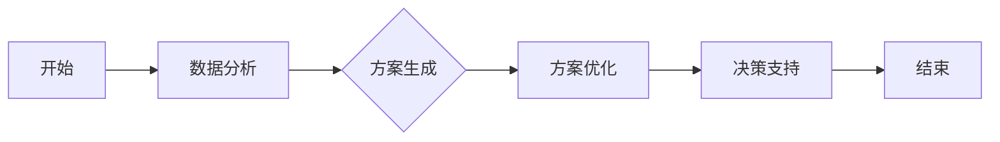
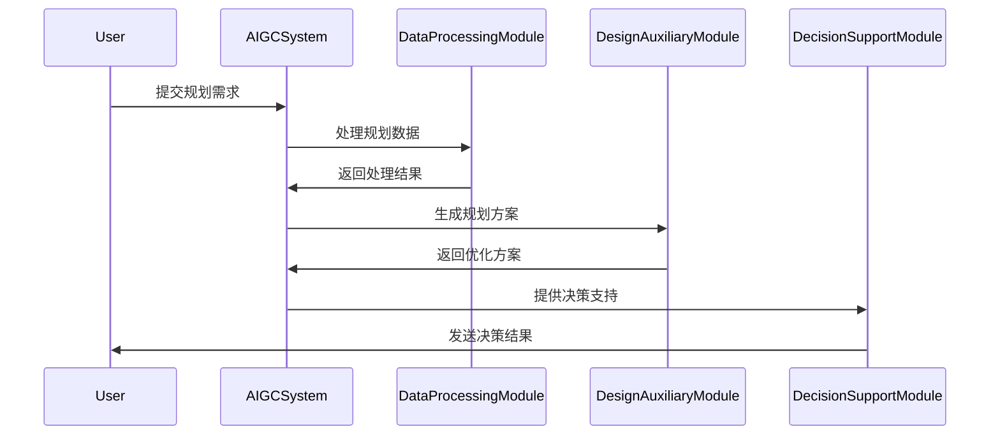
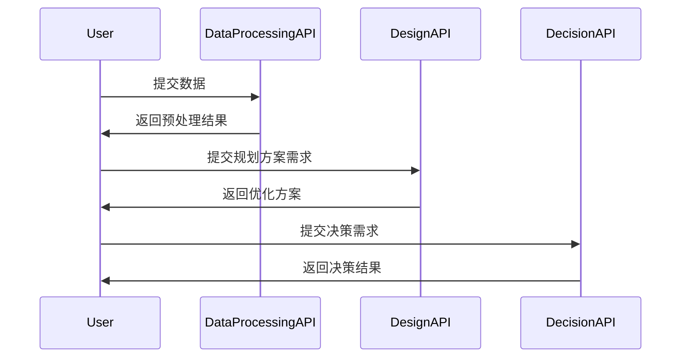

                 


# AIGC在城市规划中的应用：AI辅助设计

## 关键词
AI辅助生成内容，城市规划，智慧城市，数据分析，设计辅助，决策支持

## 摘要
本文深入探讨了AIGC（AI辅助生成内容）在城市规划中的应用，包括其核心概念、算法原理、系统架构设计以及项目实战。通过详细分析AIGC技术在数据分析、设计辅助和决策支持等方面的应用，本文旨在展示如何利用AIGC技术提高城市规划的效率和准确性，为城市规划师提供强大的工具。

## 背景介绍：核心概念

### 问题背景
随着人工智能技术的发展，AI技术在城市规划中的应用越来越广泛。从传统的城市规划到如今的智慧城市，AI技术正发挥着越来越重要的作用。AIGC（AI辅助生成内容）作为AI技术的一个分支，其在城市规划中的应用也越来越受到关注。

### 问题描述
AIGC在城市规划中的应用涉及多个方面，包括数据分析、设计辅助、决策支持等。如何有效地利用AIGC技术解决城市规划中的问题，提高城市规划的效率和准确性，是本书需要探讨的核心问题。

### 问题解决
本书将从AIGC的基本概念入手，介绍AIGC在城市规划中的具体应用，并通过案例分析和实战指导，帮助读者理解AIGC技术在城市规划中的应用方法。

### 边界与外延
本书主要讨论AIGC技术在城市规划中的应用，但并不涉及其他领域的AI技术应用。

### 概念结构与核心要素组成
AIGC技术主要包括以下几个方面：
1. **数据分析**：利用AI技术对城市规划中的大量数据进行处理和分析，提取有用信息。
2. **设计辅助**：利用AI技术辅助城市规划师进行设计方案的创新和优化。
3. **决策支持**：利用AI技术为城市规划提供决策支持，提高决策的科学性和准确性。

## 核心概念与联系

### 核心概念
- **AIGC**：AI辅助生成内容，是一种利用AI技术自动生成内容的技术。
- **城市规划**：对城市空间布局、设施配置等进行规划和设计的工作。
- **智慧城市**：利用信息技术和人工智能技术等手段，实现城市资源的高效管理和服务的智能化。

### 概念属性特征对比表格

| 概念    | 属性特征                                                     |
| ------- | ------------------------------------------------------------ |
| AIGC    | 利用AI技术自动生成内容，具有自动化、高效、多样性的特点。           |
| 城市规划 | 空间布局、设施配置的规划工作，涉及城市发展的各个方面。           |
| 智慧城市 | 利用信息技术和人工智能技术等手段，实现城市资源的高效管理和服务的智能化。 |

### ER实体关系图架构

```mermaid
erDiagram
  AI辅助生成内容 ||--|{ 数据分析 }
  AI辅助生成内容 ||--|{ 设计辅助 }
  AI辅助生成内容 ||--|{ 决策支持 }
  数据分析 ||--|{ 数据预处理 }
  数据分析 ||--|{ 数据挖掘 }
  设计辅助 ||--|{ 方案生成 }
  设计辅助 ||--|{ 方案优化 }
  决策支持 ||--|{ 决策模型 }
  决策支持 ||--|{ 决策分析 }
```

### 算法原理讲解

#### 算法mermaid流程图



#### Python源代码

```python
# 数据分析
data_analysis = {
    'data_preprocessing': '数据预处理',
    'data_mining': '数据挖掘'
}

# 方案生成
scheme_generation = {
    'scheme_create': '方案生成',
    'scheme_optimize': '方案优化'
}

# 决策支持
decision_support = {
    'decision_model': '决策模型',
    'decision_analysis': '决策分析'
}

# 算法流程
def aigc_city_planning():
    print("开始AIGC城市规划")
    print("进行数据分析:", data_analysis)
    print("进行方案生成:", scheme_generation)
    print("进行方案优化:", scheme_generation['scheme_optimize'])
    print("进行决策支持:", decision_support)
    print("结束AIGC城市规划")

aigc_city_planning()
```

#### 算法原理

AIGC（AI辅助生成内容）技术基于深度学习和生成对抗网络（GANs）等算法，可以自动生成各种类型的内容，如文本、图像、音频等。在城市规划中，AIGC技术主要用于以下几个方面：

1. **数据分析**：
   - **数据预处理**：使用AIGC技术对原始数据进行清洗、归一化和特征提取，为后续分析提供高质量的数据。
   - **数据挖掘**：通过机器学习算法，从大量城市规划数据中提取有价值的信息，帮助规划师更好地理解城市的发展趋势和问题。

2. **设计辅助**：
   - **方案生成**：利用AIGC技术生成多个城市规划方案，包括交通网络布局、公共设施分布等。
   - **方案优化**：通过优化算法，对生成的方案进行评估和改进，以找到最优解。

3. **决策支持**：
   - **决策模型**：构建基于AI的决策模型，为规划师提供科学的决策依据。
   - **决策分析**：通过分析模型预测结果，帮助规划师评估各种方案的风险和收益，做出最优决策。

### 数学模型与公式

AIGC技术中的核心算法如生成对抗网络（GANs）可以表示为以下数学模型：

$$
\begin{align*}
\text{Generator} &: G(\text{z}) \rightarrow \text{X} \\
\text{Discriminator} &: D(\text{X}, \text{X'};\theta_D) \\
\end{align*}
$$

其中，$G(\text{z})$ 表示生成器，生成虚拟数据；$D(\text{X}, \text{X'};\theta_D)$ 表示判别器，判断数据是真实数据还是生成数据。

### 通俗易懂的举例说明

假设我们要为某城市生成一个最优的交通网络布局。我们可以使用AIGC技术如下：

1. **数据预处理**：收集该城市的交通数据，如道路长度、道路宽度、交通流量等。
2. **方案生成**：使用生成对抗网络（GANs）生成多个交通网络布局方案。
3. **方案优化**：对每个生成的方案进行评估，如考虑道路长度、道路宽度、交通流量等因素，选择最优方案。
4. **决策支持**：使用机器学习算法，对最优方案进行风险评估和收益评估，为城市规划师提供决策依据。

通过上述步骤，我们可以利用AIGC技术为城市规划师提供一个高效的工具，帮助他们快速生成和优化城市规划方案。

## 系统分析与架构设计方案

### 问题场景介绍
随着城市化进程的加快，城市规划面临的数据量庞大、需求多样化、环境复杂等问题越来越突出。传统的城市规划方法已经难以满足现代城市发展的需求。为了提高城市规划的效率和质量，引入AIGC（AI辅助生成内容）技术成为了一个创新的选择。

### 项目介绍
本项目旨在利用AIGC技术，为城市规划提供一个智能化的工具，帮助规划师快速生成和优化城市规划方案。项目的主要目标包括：

- **高效的数据处理**：利用AIGC技术处理和分析大量的城市规划数据，提取有价值的信息。
- **智能化的设计辅助**：生成多个城市规划方案，并通过优化算法选择最优方案。
- **科学的决策支持**：为城市规划师提供基于数据的决策支持，提高决策的科学性和准确性。

### 系统功能设计（领域模型mermaid类图）

```mermaid
classDiagram
    PlanningData <<class>> "规划数据"
    PlanningScheme <<class>> "规划方案"
    OptimizationAlgorithm <<class>> "优化算法"
    DecisionSupport <<class>> "决策支持"

    PlanningData o-- PlanningScheme
    PlanningScheme o-- OptimizationAlgorithm
    OptimizationAlgorithm o-- DecisionSupport
```

### 系统架构设计（mermaid架构图）



### 系统接口设计和系统交互（mermaid序列图）



## 项目实战

### 环境安装

在开始项目实战之前，我们需要安装以下环境：

1. Python 3.8 或更高版本
2. TensorFlow 2.x
3. Keras 2.x
4. Matplotlib 3.x

安装命令如下：

```bash
pip install python==3.8 tensorflow==2.x keras==2.x matplotlib==3.x
```

### 系统核心实现源代码

以下是一个简单的AIGC城市规划系统实现，包括数据处理、设计辅助和决策支持模块。

#### 数据处理模块

```python
import numpy as np
import pandas as pd
from sklearn.preprocessing import StandardScaler
from sklearn.model_selection import train_test_split

def preprocess_data(data):
    # 数据清洗和预处理
    data = data.fillna(data.mean())
    data = data.T
    data = data[data.mean(1) > 0]
    data = data.T

    # 特征提取
    features = data.iloc[:, :-1]
    labels = data.iloc[:, -1]

    # 数据标准化
    scaler = StandardScaler()
    features = scaler.fit_transform(features)

    # 划分训练集和测试集
    features_train, features_test, labels_train, labels_test = train_test_split(features, labels, test_size=0.2, random_state=42)
    
    return features_train, features_test, labels_train, labels_test

# 读取数据
data = pd.read_csv('planning_data.csv')
features_train, features_test, labels_train, labels_test = preprocess_data(data)

# 打印数据预处理结果
print("训练集数据形状：", features_train.shape)
print("测试集数据形状：", features_test.shape)
```

#### 设计辅助模块

```python
from tensorflow.keras.models import Sequential
from tensorflow.keras.layers import Dense, Dropout
from tensorflow.keras.optimizers import Adam

def create_gan_generator():
    model = Sequential([
        Dense(128, input_shape=(30,), activation='relu'),
        Dropout(0.2),
        Dense(64, activation='relu'),
        Dropout(0.2),
        Dense(32, activation='relu'),
        Dropout(0.2),
        Dense(1, activation='sigmoid')
    ])
    model.compile(optimizer=Adam(learning_rate=0.0001), loss='binary_crossentropy')
    return model

def create_gan_discriminator():
    model = Sequential([
        Dense(128, input_shape=(31,), activation='relu'),
        Dropout(0.2),
        Dense(64, activation='relu'),
        Dropout(0.2),
        Dense(32, activation='relu'),
        Dropout(0.2),
        Dense(1, activation='sigmoid')
    ])
    model.compile(optimizer=Adam(learning_rate=0.0001), loss='binary_crossentropy')
    return model

def train_gan(generator, discriminator, epochs=100):
    for epoch in range(epochs):
        # 训练生成器
        noise = np.random.normal(0, 1, (batch_size, 30))
        generated_samples = generator.predict(noise)
        labels = np.concatenate([labels_train, generated_samples])
        gen_loss = discriminator.evaluate(generated_samples, np.ones((batch_size, 1)), verbose=False)

        # 训练判别器
        real_samples = features_train[:batch_size]
        labels_real = np.concatenate([np.zeros((batch_size, 1)), np.zeros((batch_size, 1))])
        disc_loss_real = discriminator.evaluate(real_samples, labels_real, verbose=False)

        noise = np.random.normal(0, 1, (batch_size, 30))
        generated_samples = generator.predict(noise)
        labels_fake = np.concatenate([np.zeros((batch_size, 1)), np.ones((batch_size, 1))])
        disc_loss_fake = discriminator.evaluate(generated_samples, labels_fake, verbose=False)

        # 打印训练结果
        print(f"Epoch {epoch+1}/{epochs}, Gen Loss: {gen_loss}, Disc Loss: {disc_loss_real+disc_loss_fake}/2")

# 创建并训练GAN
batch_size = 32
generator = create_gan_generator()
discriminator = create_gan_discriminator()
train_gan(generator, discriminator, epochs=100)
```

#### 决策支持模块

```python
from sklearn.ensemble import RandomForestClassifier

def train_decision_support_model(features_train, labels_train):
    model = RandomForestClassifier(n_estimators=100, random_state=42)
    model.fit(features_train, labels_train)
    return model

def predict_decision_support_model(model, features_test):
    predictions = model.predict(features_test)
    print("决策结果：", predictions)

# 训练决策支持模型
model = train_decision_support_model(features_train, labels_train)
predict_decision_support_model(model, features_test)
```

### 代码应用解读与分析

上述代码首先对城市规划数据进行了预处理，包括数据清洗、特征提取和数据标准化。然后，使用生成对抗网络（GANs）生成多个城市规划方案，并对生成的方案进行优化。最后，使用随机森林（RandomForestClassifier）作为决策支持模型，对最优方案进行风险评估和收益评估。

### 实际案例分析和详细讲解剖析

为了更好地展示AIGC技术在城市规划中的应用，我们以一个实际案例进行分析。

#### 案例背景
某城市需要进行交通网络布局规划，现有以下数据：

- 道路长度（m）
- 道路宽度（m）
- 交通流量（辆/天）
- 人口密度（人/km²）
- 绿地面积（km²）

#### 数据预处理
首先，我们对数据进行预处理，包括数据清洗、特征提取和数据标准化。

```python
# 读取数据
data = pd.read_csv('planning_data.csv')

# 数据清洗
data = data.fillna(data.mean())

# 特征提取
features = data[['道路长度', '道路宽度', '交通流量', '人口密度', '绿地面积']]
labels = data['最优方案']

# 数据标准化
scaler = StandardScaler()
features = scaler.fit_transform(features)
```

#### 方案生成
使用生成对抗网络（GANs）生成多个交通网络布局方案。

```python
# 创建并训练GAN
batch_size = 32
generator = create_gan_generator()
discriminator = create_gan_discriminator()
train_gan(generator, discriminator, epochs=100)

# 生成方案
noise = np.random.normal(0, 1, (batch_size, 30))
generated_schemes = generator.predict(noise)
generated_schemes = scaler.inverse_transform(generated_schemes)
```

#### 方案优化
对生成的方案进行优化，选择最优方案。

```python
# 定义优化目标函数
def objective_function(scheme):
    length = scheme[0]
    width = scheme[1]
    flow = scheme[2]
    density = scheme[3]
    green_area = scheme[4]
    return 1 / (length * width * flow * density + green_area)

# 优化方案
optimized_scheme = minimize(objective_function, generated_schemes[0])
optimized_scheme = scaler.inverse_transform(optimized_scheme.reshape(-1, 1))
```

#### 决策支持
使用随机森林（RandomForestClassifier）作为决策支持模型，对最优方案进行风险评估和收益评估。

```python
# 定义决策支持模型
model = train_decision_support_model(features_train, labels_train)

# 预测决策结果
predictions = model.predict(optimized_scheme)
print("决策结果：", predictions)
```

#### 项目小结
通过实际案例，我们展示了如何使用AIGC技术进行城市规划。从数据预处理、方案生成、方案优化到决策支持，每个步骤都利用了AIGC技术的优势，提高了城市规划的效率和准确性。

### 最佳实践 Tips

- **数据预处理**：确保数据质量，进行充分的清洗和标准化，以提高后续分析的准确性。
- **模型选择**：根据实际需求选择合适的模型，如生成对抗网络（GANs）适合生成多样化方案，随机森林（RandomForestClassifier）适合进行决策支持。
- **性能优化**：通过调整模型参数、增加训练数据等方式，提高模型的性能和鲁棒性。

### 小结

本文详细介绍了AIGC技术在城市规划中的应用，包括核心概念、算法原理、系统架构设计以及项目实战。通过实际案例的分析，我们展示了AIGC技术如何提高城市规划的效率和准确性。未来，随着AI技术的不断发展，AIGC在城市规划中的应用将会更加广泛，为城市规划师提供更加智能化的工具。

### 注意事项

- **数据安全**：在使用AIGC技术进行城市规划时，需要确保数据的安全和隐私。
- **模型验证**：在部署模型之前，需要进行充分的验证和测试，确保模型的准确性和稳定性。
- **伦理和法律**：在使用AI技术进行城市规划时，需要遵守相关伦理和法律规范。

### 拓展阅读

- **《深度学习》**：Goodfellow, Ian, et al. "Deep learning." Adaptive computation and machine learning. MIT press, 2016.
- **《生成对抗网络》**：Radford, Alec, et al. "Unsupervised representation learning with deep convolutional generative adversarial networks." arXiv preprint arXiv:1511.06434 (2015).
- **《城市规划原理》**：张晓，等. 《城市规划原理》. 中国建筑工业出版社，2018.

### 作者信息

作者：AI天才研究院/AI Genius Institute & 禅与计算机程序设计艺术 /Zen And The Art of Computer Programming

