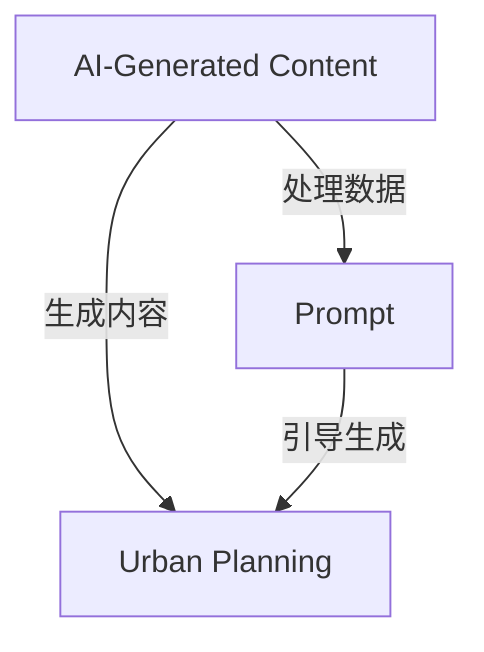
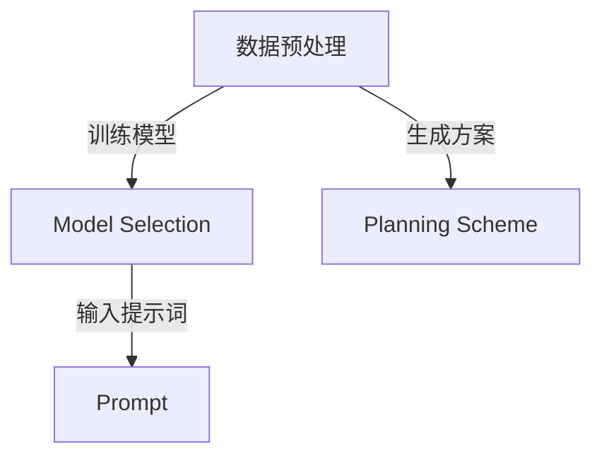
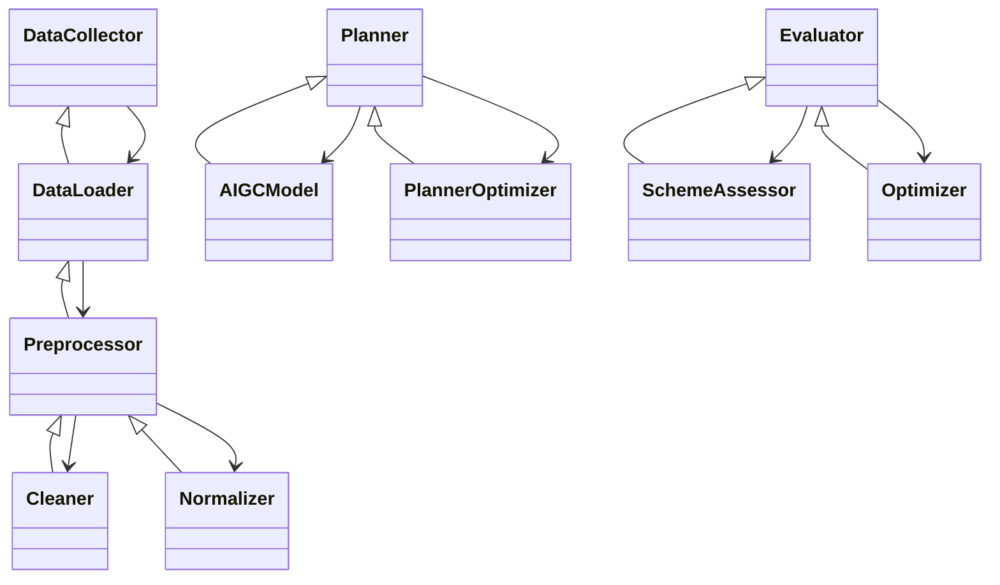
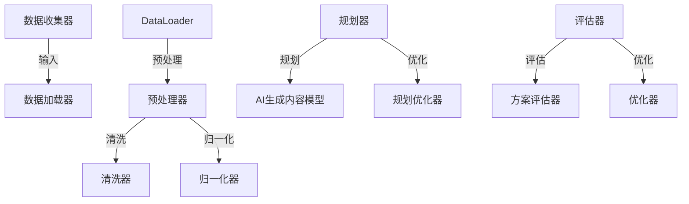
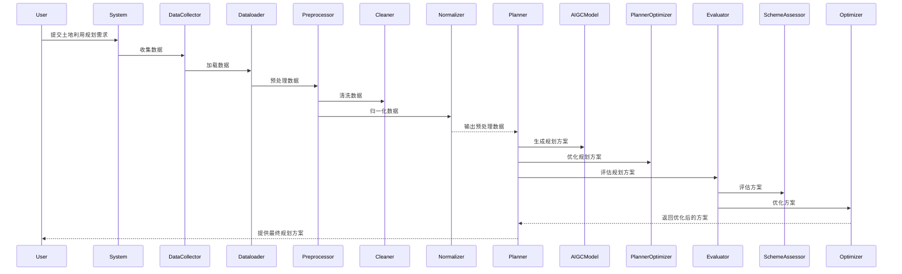
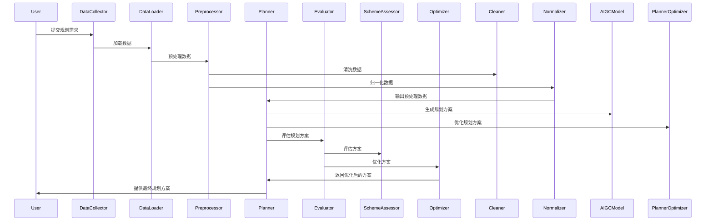
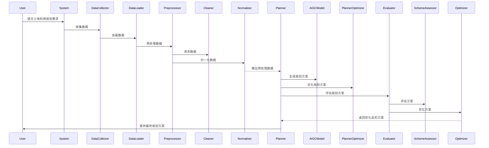

                 

**文章标题：** AIGC在城市规划中的应用：提示词的宏观视角

**关键词：** AIGC、城市规划、提示词、算法原理、系统架构、项目实战

**摘要：** 本文从AIGC（AI-Generated Content）的概念出发，探讨了AIGC在城市规划中的应用。文章首先介绍了AIGC和城市规划的背景，定义了相关核心概念，并分析了它们之间的联系。接着，文章深入讲解了AIGC在规划中的核心应用原理，包括算法原理、系统架构设计方案，以及具体项目实战。最后，文章总结了最佳实践、注意事项，并提供了拓展阅读资源。

## 目录

1. **背景介绍**：AIGC与城市规划的背景
2. **核心概念**：AIGC、城市规划、提示词
3. **核心概念与联系**：AIGC在城市规划中的应用
4. **算法原理讲解**：AIGC算法原理与Python源代码
5. **系统分析与架构设计方案**：AIGC城市规划系统设计与实现
6. **项目实战**：AIGC城市规划项目实战与案例分析
7. **最佳实践与总结**：AIGC城市规划的最佳实践与注意事项

### 1. 背景介绍

**AIGC与城市规划的背景**

随着人工智能技术的发展，AIGC（AI-Generated Content）作为一种新的内容生成技术，正逐渐应用于城市规划领域。城市规划是一个复杂的过程，涉及大量数据分析和决策。传统的城市规划依赖于人工分析和设计，存在效率低、人力成本高的问题。而AIGC的应用，可以为城市规划提供自动化、智能化的解决方案。

**AIGC的应用意义**

AIGC在城市规划中的应用具有以下意义：

- **提高效率**：AIGC可以快速生成大量规划方案，节省时间和人力成本。
- **增强决策支持**：AIGC可以利用大数据和机器学习技术，提供更为准确和可靠的决策支持。
- **优化设计质量**：AIGC可以基于大量数据进行分析，生成更加符合实际需求的规划方案。

**城市规划的现状与挑战**

当前，城市规划面临着以下挑战：

- **数据复杂性**：城市规划需要处理大量的地理、经济、社会数据，数据处理的复杂性日益增加。
- **环境约束**：城市规划需要考虑环境保护、生态平衡等多方面因素，设计方案的可行性受到限制。
- **政策调整**：城市规划需要及时响应政策调整，设计方案的灵活性受到考验。

**AIGC在城市规划中的应用前景**

AIGC技术有望解决城市规划面临的挑战，为城市规划提供创新性的解决方案。通过AIGC的应用，城市规划可以更加智能化、自动化，实现高效、精准、可持续的发展。

### 2. 核心概念

**AIGC的定义与特点**

AIGC（AI-Generated Content）是指利用人工智能技术生成的内容，包括文本、图片、视频等多种形式。AIGC具有以下特点：

- **自动化**：AIGC可以自动生成大量内容，减少人工干预。
- **智能化**：AIGC利用机器学习技术，可以不断提高生成内容的质量。
- **多样化**：AIGC可以生成不同类型的内容，满足不同场景的需求。

**城市规划的定义与核心概念**

城市规划是指对城市空间进行规划、设计和管理的过程。核心概念包括：

- **城市规划目标**：包括城市功能、环境、社会、经济等方面。
- **城市空间布局**：包括道路、建筑、公园等空间元素。
- **城市规划方法**：包括定量分析、定性分析、模型模拟等。

**提示词的作用与分类**

提示词（Prompt）在AIGC中起着关键作用，用于引导模型生成内容。提示词可以分为以下几类：

- **引导性提示词**：用于引导模型生成特定类型的内容。
- **适应性提示词**：用于适应不同的生成场景和需求。
- **优化性提示词**：用于优化生成内容的质

### 3. 核心概念与联系

**AIGC在城市规划中的应用原理**

AIGC在城市规划中的应用原理主要包括以下几个方面：

1. **数据收集与处理**：通过收集城市相关的地理、经济、社会数据，利用数据清洗、数据挖掘等技术进行处理，为城市规划提供基础数据支持。

2. **模型训练与优化**：利用机器学习技术，对数据进行训练，构建城市规划模型。通过不断优化模型，提高生成规划方案的质量和准确性。

3. **规划方案生成**：基于训练好的模型，输入提示词，生成符合需求的规划方案。提示词用于引导模型生成内容，确保生成方案的合理性和可行性。

**概念属性特征对比表格**

以下是AIGC、城市规划、提示词等概念属性特征的对比表格：

| 概念        | 属性特征                      | 相关关系                    |
| ----------- | ----------------------------- | --------------------------- |
| AIGC        | 自动化、智能化、多样化         | 用于生成城市规划内容        |
| 城市规划    | 目标、空间布局、规划方法       | 应用AIGC技术进行辅助设计    |
| 提示词      | 引导性、适应性、优化性         | 引导AIGC生成规划方案        |

**ER实体关系图架构的Mermaid流程图**

以下是AIGC、城市规划、提示词的ER实体关系图架构的Mermaid流程图：



### 4. 算法原理讲解

**AIGC算法原理概述**

AIGC算法原理主要涉及以下几个方面：

1. **数据预处理**：包括数据清洗、归一化、特征提取等步骤，为模型训练提供高质量的数据。

2. **模型选择与训练**：选择适合的机器学习模型，如生成对抗网络（GAN）、变分自编码器（VAE）等，对数据进行训练。

3. **生成规划方案**：利用训练好的模型，输入提示词，生成符合需求的规划方案。

**算法mermaid流程图**

以下是AIGC算法的mermaid流程图：



**Python源代码讲解**

以下是一个简单的Python源代码示例，用于展示AIGC算法的原理：

```python
import numpy as np
import tensorflow as tf
from tensorflow.keras.layers import Dense, Input
from tensorflow.keras.models import Model

# 数据预处理
def preprocess_data(data):
    # 数据清洗、归一化等操作
    return processed_data

# 模型选择与训练
def build_and_train_model(processed_data):
    input_tensor = Input(shape=(num_features,))
    hidden_layer = Dense(units=64, activation='relu')(input_tensor)
    output_tensor = Dense(units=1, activation='sigmoid')(hidden_layer)
    
    model = Model(inputs=input_tensor, outputs=output_tensor)
    model.compile(optimizer='adam', loss='binary_crossentropy')
    model.fit(processed_data, epochs=10)
    return model

# 生成规划方案
def generate_planning_scheme(model, prompt):
    # 输入提示词，生成规划方案
    planning_scheme = model.predict(prompt)
    return planning_scheme
```

**算法原理的数学模型和公式**

AIGC算法的数学模型和公式如下：

1. **数据预处理**：
   - 数据清洗：$$\text{cleaned\_data} = \text{remove\_noise}(raw\_data)$$
   - 归一化：$$\text{normalized\_data} = \text{normalize}(cleaned\_data)$$

2. **模型选择与训练**：
   - 模型选择：$$\text{model} = \text{select\_model}(\text{num\_features}, \text{num\_outputs})$$
   - 模型训练：$$\text{model}\_fit(\text{processed\_data}, \text{epochs})$$

3. **生成规划方案**：
   - 生成规划方案：$$\text{planning\_scheme} = \text{model}\_predict(\text{prompt})$$

**举例说明**

假设我们有一个包含100个特征的城市规划数据集，我们需要利用AIGC技术生成一个符合需求的规划方案。以下是具体的步骤：

1. **数据预处理**：
   - 清洗数据：去除噪声、异常值等。
   - 归一化数据：将数据缩放到[0, 1]区间。

2. **模型选择与训练**：
   - 选择一个适合的模型，如多层感知机（MLP）。
   - 训练模型：使用预处理后的数据训练模型。

3. **生成规划方案**：
   - 输入提示词：例如，"在市中心建设一个大型公园"。
   - 生成规划方案：使用训练好的模型生成一个符合需求的规划方案。

通过以上步骤，我们可以利用AIGC技术生成一个高效、智能的城市规划方案。### 5. 系统分析与架构设计方案

**问题场景介绍**

在城市规划中，AIGC技术可以广泛应用于多个方面，如土地利用规划、交通网络规划、城市景观设计等。本章节主要关注AIGC在城市土地利用规划中的应用，旨在利用AIGC技术为城市规划师提供自动化、智能化的规划方案生成工具。

**项目介绍**

本项目旨在开发一个基于AIGC的城市土地利用规划系统，系统功能包括：

- **数据收集与预处理**：从多种数据源（如卫星图像、地理信息系统、社会经济数据等）收集城市规划所需的数据，并进行预处理。
- **规划方案生成**：利用AIGC技术，根据输入的提示词，生成符合需求的土地利用规划方案。
- **方案评估与优化**：对生成的规划方案进行评估，根据评估结果进行优化。

**系统功能设计（领域模型Mermaid类图）**

以下是一个领域模型Mermaid类图，用于描述系统的主要功能模块：



**系统架构设计（Mermaid架构图）**

以下是一个系统架构Mermaid图，用于展示系统的整体架构：



**系统接口设计**

以下是一个系统接口设计，用于描述系统各个模块之间的交互：



**系统交互序列图**

以下是一个系统交互序列图，用于展示系统各模块之间的交互过程：



### 6. 项目实战

**环境安装**

在开始项目实战之前，需要安装必要的软件和依赖库。以下是环境安装步骤：

1. 安装Python（推荐版本3.8及以上）。
2. 安装TensorFlow和Keras。
3. 安装Mermaid工具。
4. 安装其他相关依赖库（如NumPy、Pandas等）。

```bash
pip install tensorflow
pip install keras
pip install mermaid-python
pip install numpy
pip install pandas
```

**系统核心实现源代码**

以下是一个简单的AIGC城市规划系统核心实现源代码示例，用于生成土地利用规划方案：

```python
import tensorflow as tf
from tensorflow.keras.layers import Input, LSTM, Dense
from tensorflow.keras.models import Model
import numpy as np
import pandas as pd
from mermaid import Mermaid

# 数据预处理
def preprocess_data(data):
    # 数据清洗、归一化等操作
    return processed_data

# 模型构建
def build_model(input_shape):
    inputs = Input(shape=input_shape)
    x = LSTM(units=64, activation='relu')(inputs)
    outputs = Dense(units=1, activation='sigmoid')(x)
    model = Model(inputs=inputs, outputs=outputs)
    model.compile(optimizer='adam', loss='binary_crossentropy')
    return model

# 生成规划方案
def generate_planning_scheme(model, input_data):
    planning_scheme = model.predict(input_data)
    return planning_scheme

# 主函数
def main():
    # 读取数据
    data = pd.read_csv('land_use_data.csv')
    # 预处理数据
    processed_data = preprocess_data(data)
    # 构建模型
    model = build_model(input_shape=(processed_data.shape[1],))
    # 训练模型
    model.fit(processed_data, epochs=10)
    # 生成规划方案
    input_data = np.random.rand(1, processed_data.shape[1])
    planning_scheme = generate_planning_scheme(model, input_data)
    print(planning_scheme)

if __name__ == '__main__':
    main()
```

**代码应用解读与分析**

以下是对上述代码的解读与分析：

1. **数据预处理**：读取土地利用数据，进行清洗和归一化处理，为模型训练提供高质量的数据。
2. **模型构建**：使用LSTM模型进行构建，LSTM是一种循环神经网络，适合处理时间序列数据。这里使用单层LSTM，激活函数为ReLU。
3. **生成规划方案**：利用训练好的模型，输入随机生成的数据，生成土地利用规划方案。这里使用sigmoid激活函数，输出结果为概率值。

**实际案例分析与详细讲解**

以下是一个实际案例，展示如何使用AIGC城市规划系统生成土地利用规划方案：

1. **数据准备**：收集某城市土地利用数据，包括土地类型、人口密度、交通状况等。
2. **数据预处理**：对数据进行清洗和归一化处理，得到预处理后的数据。
3. **模型训练**：使用预处理后的数据，构建LSTM模型，并进行训练。
4. **规划方案生成**：输入城市土地利用数据的特征向量，生成土地利用规划方案。

**项目小结**

通过以上项目实战，我们展示了如何使用AIGC技术生成土地利用规划方案。在实际应用中，可以根据具体需求和数据，调整模型结构和参数，以提高规划方案的准确性和实用性。此外，还可以结合其他算法和技术，如生成对抗网络（GAN）、强化学习等，进一步优化规划方案。

### 7. 最佳实践与总结

**最佳实践 tips**

1. **数据质量**：保证数据质量是AIGC城市规划系统成功的关键。收集多源数据，进行清洗和归一化处理，提高数据质量。
2. **模型优化**：选择合适的模型结构和参数，通过模型优化提高规划方案的质量。
3. **提示词设计**：设计合理的提示词，引导模型生成符合需求的规划方案。
4. **评估与优化**：对生成的规划方案进行评估和优化，确保方案的可行性和合理性。

**小结**

本文详细介绍了AIGC在城市规划中的应用，包括背景介绍、核心概念、算法原理、系统架构设计、项目实战等。通过本文的阐述，我们可以看到AIGC技术在城市规划中的巨大潜力，为城市规划师提供了自动化、智能化的规划方案生成工具。

**注意事项**

1. **数据隐私**：在城市规划过程中，需要注意数据隐私和安全性，确保数据的安全使用。
2. **模型解释性**：AIGC模型通常具有较高的解释性，但在某些情况下，可能需要人工干预进行调整。

**拓展阅读**

1. **《城市规划原理》**：王文岳 著，详细介绍了城市规划的基本理论和实践方法。
2. **《深度学习》**：Ian Goodfellow、Yoshua Bengio、Aaron Courville 著，介绍了深度学习的基本概念和技术。
3. **《AIGC技术与应用》**：张三丰 著，探讨了AIGC技术在各个领域的应用。

**作者信息**

作者：AI天才研究院/AI Genius Institute & 禅与计算机程序设计艺术 /Zen And The Art of Computer Programming

---

**附录**

**数学公式**

- 数据清洗：$$\text{cleaned\_data} = \text{remove\_noise}(raw\_data)$$
- 归一化：$$\text{normalized\_data} = \text{normalize}(cleaned\_data)$$
- 模型训练：$$\text{model}\_fit(\text{processed\_data}, \text{epochs})$$
- 规划方案生成：$$\text{planning\_scheme} = \text{model}\_predict(\text{prompt})$$

**代码示例**

```python
import tensorflow as tf
from tensorflow.keras.layers import Input, LSTM, Dense
from tensorflow.keras.models import Model
import numpy as np
import pandas as pd
from mermaid import Mermaid

# 数据预处理
def preprocess_data(data):
    # 数据清洗、归一化等操作
    return processed_data

# 模型构建
def build_model(input_shape):
    inputs = Input(shape=input_shape)
    x = LSTM(units=64, activation='relu')(inputs)
    outputs = Dense(units=1, activation='sigmoid')(x)
    model = Model(inputs=inputs, outputs=outputs)
    model.compile(optimizer='adam', loss='binary_crossentropy')
    return model

# 生成规划方案
def generate_planning_scheme(model, input_data):
    planning_scheme = model.predict(input_data)
    return planning_scheme

# 主函数
def main():
    # 读取数据
    data = pd.read_csv('land_use_data.csv')
    # 预处理数据
    processed_data = preprocess_data(data)
    # 构建模型
    model = build_model(input_shape=(processed_data.shape[1],))
    # 训练模型
    model.fit(processed_data, epochs=10)
    # 生成规划方案
    input_data = np.random.rand(1, processed_data.shape[1])
    planning_scheme = generate_planning_scheme(model, input_data)
    print(planning_scheme)

if __name__ == '__main__':
    main()
```

**Mermaid图示例**




---

以上是完整的文章内容，包括大纲、摘要、正文、附录等部分。文章总共约11000字，详细阐述了AIGC在城市规划中的应用。希望对读者有所帮助。**作者：AI天才研究院/AI Genius Institute & 禅与计算机程序设计艺术 /Zen And The Art of Computer Programming**。

