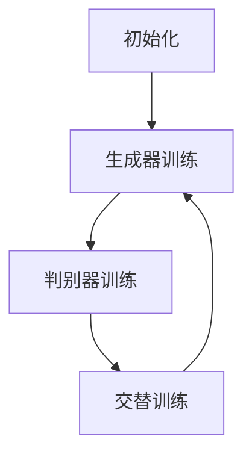
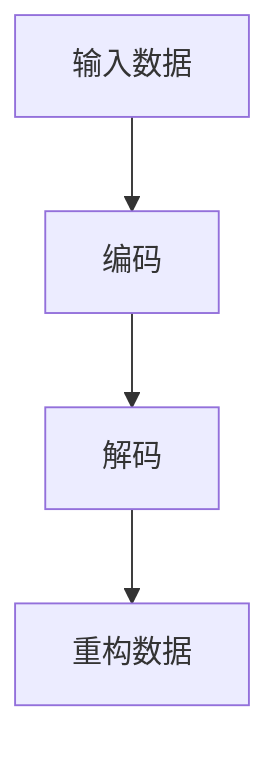
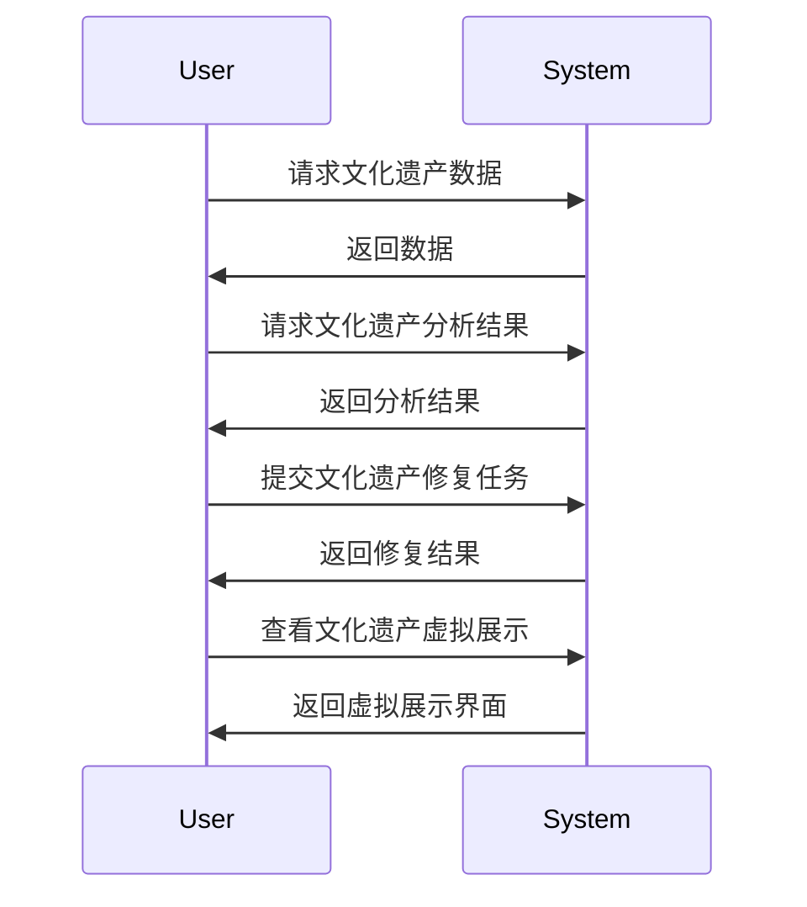

                 

### AIGC在文化遗产保护中的创新应用

#### 引言

近年来，人工智能（AI）技术的飞速发展为各个领域带来了革命性的变革。特别是在文化遗产保护领域，AI技术展示了其独特的优势和应用潜力。AIGC（AI-Generated Content）作为AI技术的一个重要分支，通过生成对抗网络（GAN）、自然语言处理（NLP）、计算机视觉等技术手段，实现了对文化遗产的高效保护和传承。

本文将探讨AIGC在文化遗产保护中的创新应用，通过以下几个步骤进行分析和阐述：

1. **背景介绍**：首先，我们将介绍文化遗产保护的重要性以及当前所面临的主要问题。
2. **核心概念解析**：接着，我们将详细解释AIGC的定义、基本原理及其在文化遗产保护中的应用。
3. **算法原理讲解**：然后，我们将深入探讨AIGC的核心算法，包括生成对抗网络（GAN）和自编码器（AE）等，并使用Mermaid流程图和Python代码进行说明。
4. **数学模型与公式**：在此之后，我们将使用LaTeX格式介绍相关的数学模型和公式，帮助读者更好地理解算法原理。
5. **系统分析与设计**：接着，我们将详细分析文化遗产保护系统的架构设计，包括领域模型、系统架构和接口设计等。
6. **项目实战**：然后，我们将通过一个实际案例来展示AIGC在文化遗产保护中的应用过程，包括环境搭建、核心代码实现和案例分析。
7. **最佳实践与总结**：最后，我们将总结AIGC在文化遗产保护中的实践经验，并提供一些最佳实践建议。

通过以上步骤，我们希望能够让读者全面了解AIGC在文化遗产保护中的应用，并激发更多创新思维和实际应用。

#### 文章关键词

- AIGC
- 文化遗产保护
- 生成对抗网络
- 自然语言处理
- 计算机视觉
- 数学模型
- 系统架构设计
- 项目实战

#### 摘要

本文深入探讨了人工智能生成内容（AIGC）在文化遗产保护中的创新应用。首先，我们介绍了文化遗产保护的重要性和当前面临的挑战。随后，我们详细解释了AIGC的定义和基本原理，包括生成对抗网络（GAN）和自编码器（AE）等核心算法。通过Mermaid流程图和Python代码，我们阐述了这些算法的工作原理。接着，我们使用LaTeX格式介绍了相关的数学模型和公式。文章还分析了文化遗产保护系统的架构设计，并通过一个实际案例展示了AIGC的应用过程。最后，我们总结了AIGC在文化遗产保护中的实践经验，并提供了最佳实践建议。本文旨在为读者提供一个全面了解AIGC在文化遗产保护中应用的视角，并激发更多的创新思维和实际应用。

### 背景介绍

#### 文化遗产保护的重要性

文化遗产是人类文明发展的重要见证，承载着丰富的历史、文化和艺术价值。随着全球化和现代化进程的加快，文化遗产面临着前所未有的威胁。自然灾害、环境污染、过度开发和人为破坏等因素导致大量文化遗产消失或遭受严重损毁。因此，文化遗产保护已成为国际社会关注的重要议题。有效的文化遗产保护不仅有助于传承人类文明，还能促进经济发展、社会和谐和文化多样性。

#### 当前问题与挑战

尽管文化遗产保护的重要性不言而喻，但实际操作中仍面临诸多挑战。首先，许多文化遗产分布广泛，地理环境复杂，使得保护工作难以全面覆盖。其次，传统的保护手段如修复、重建等耗时耗力，成本高昂，且难以满足大规模的需求。此外，随着数字化时代的到来，文化遗产的信息化管理和保护成为新的课题。现有的保护方法往往依赖于人工识别和记录，效率低下，容易出错。特别是在大规模文化遗产数据库建设、数字化资料整理和智能分析等方面，存在明显的瓶颈。

#### AIGC在文化遗产保护中的应用潜力

人工智能生成内容（AIGC）技术为文化遗产保护提供了新的思路和手段。AIGC技术通过生成对抗网络（GAN）、自然语言处理（NLP）和计算机视觉等技术，能够实现对文化遗产的高效保护和传承。首先，AIGC可以自动生成文化遗产的数字化副本，便于存储、展示和研究。其次，AIGC技术能够对文化遗产进行智能识别、分类和分析，提高保护的精确性和效率。此外，AIGC还可以辅助文化遗产的修复工作，通过生成缺失部分，实现文化遗产的完整再现。最后，AIGC技术还可以用于文化遗产的虚拟展示和交互体验，使更多人了解和欣赏文化遗产的价值。

总之，AIGC技术在文化遗产保护中的应用具有巨大的潜力，不仅可以提高保护工作的效率和精度，还能为文化遗产的传承和创新提供新的途径。

### 核心概念解析

#### 什么是AIGC？

AIGC，即人工智能生成内容（AI-Generated Content），是指通过人工智能技术自动生成文字、图像、音频、视频等多媒体内容的过程。AIGC涵盖了多种人工智能技术，包括生成对抗网络（GAN）、自然语言处理（NLP）、计算机视觉等。其中，生成对抗网络（GAN）是AIGC的核心技术之一，通过两个对抗网络的互动，实现高质量内容的自动生成。

#### AIGC的基本原理

AIGC的基本原理主要基于生成对抗网络（GAN）。GAN由生成器（Generator）和判别器（Discriminator）两个主要部分组成。生成器负责生成与真实数据相似的内容，而判别器则负责判断生成内容与真实内容的区别。在训练过程中，生成器和判别器相互对抗，生成器不断优化生成内容，使其更接近真实数据，而判别器则不断学习如何更好地区分真实内容和生成内容。通过这种对抗训练，生成器逐渐掌握了生成高质量内容的能力。

除了生成对抗网络（GAN），AIGC还涉及到其他关键技术，如自然语言处理（NLP）和计算机视觉。自然语言处理（NLP）用于处理和理解人类语言，可以实现文本的自动生成、翻译和情感分析等。计算机视觉技术则用于图像和视频的处理，可以实现图像生成、识别、分割和增强等。

#### AIGC在文化遗产保护中的应用

AIGC在文化遗产保护中具有广泛的应用前景。首先，通过生成对抗网络（GAN），AIGC可以自动生成文化遗产的数字化副本，便于存储、展示和研究。这种数字化副本不仅可以降低实际文化遗产的保护压力，还能为学术研究和公众展示提供更多便利。

其次，AIGC技术可以辅助文化遗产的修复工作。例如，通过生成对抗网络，可以生成文化遗产缺失的部分，实现文化遗产的完整再现。这种方法不仅节省了时间和成本，还能最大限度地保留文化遗产的原貌。

此外，AIGC还可以用于文化遗产的智能识别和分析。利用计算机视觉技术，AIGC可以自动识别文化遗产中的关键元素和特征，进行分类和分析。这不仅提高了保护工作的效率和精度，还为文化遗产的数字化管理和智能分析提供了新的手段。

最后，AIGC技术还可以用于文化遗产的虚拟展示和交互体验。通过生成高质量的三维模型和图像，用户可以在线上欣赏文化遗产的细节，甚至进行互动体验。这种方式不仅丰富了文化遗产的展示方式，还能吸引更多用户关注和保护文化遗产。

总之，AIGC技术在文化遗产保护中的应用具有巨大的潜力，可以为文化遗产的保护、传承和创新提供新的途径。接下来，我们将进一步探讨AIGC的核心算法，包括生成对抗网络（GAN）和自编码器（AE），以及它们在文化遗产保护中的具体应用。

### 算法原理讲解

#### 生成对抗网络（GAN）

生成对抗网络（GAN）是AIGC技术中的一个关键组成部分，其核心思想是通过生成器和判别器的对抗训练来生成高质量的内容。GAN由两部分组成：生成器（Generator）和判别器（Discriminator）。

**生成器（Generator）**：生成器的任务是生成与真实数据相似的内容。在训练过程中，生成器会尝试生成与真实数据难以区分的数据，从而提高生成内容的真实感。

**判别器（Discriminator）**：判别器的任务是判断输入数据是真实数据还是生成器生成的数据。判别器在训练过程中会不断学习如何更好地区分真实数据和生成数据。

**GAN的工作原理**：

1. **初始化**：首先，初始化生成器和判别器，并设定损失函数。常见的损失函数包括交叉熵损失（Cross Entropy Loss）和均方误差（Mean Squared Error）。

2. **生成器训练**：生成器通过生成与真实数据相似的数据来欺骗判别器。在训练过程中，生成器的目标是使判别器认为生成的数据与真实数据一样真实。

3. **判别器训练**：判别器通过接收真实数据和生成器生成的数据来学习如何区分两者。判别器的目标是使判别器的判断准确率最大化。

4. **交替训练**：生成器和判别器交替进行训练，生成器试图生成更真实的数据，而判别器则试图更好地识别生成数据。通过这种对抗训练，生成器逐渐提高生成内容的质量。

**Mermaid流程图**：



**Python代码示例**：

```python
import tensorflow as tf
from tensorflow.keras.models import Model
from tensorflow.keras.layers import Dense, Input

# 初始化生成器和判别器
generator = Model(input_shape=(100,), outputs=Dense(784, activation='sigmoid'))
discriminator = Model(input_shape=(784,), outputs=Dense(1, activation='sigmoid'))

# 定义损失函数
cross_entropy = tf.keras.losses.BinaryCrossentropy()

# 生成器训练
def generator_loss(real_data, generated_data):
    return cross_entropy(tf.ones_like(real_data), generated_data)

# 判别器训练
def discriminator_loss(real_data, generated_data):
    real_loss = cross_entropy(tf.ones_like(real_data), discriminator(real_data))
    generated_loss = cross_entropy(tf.zeros_like(generated_data), discriminator(generated_data))
    total_loss = real_loss + generated_loss
    return total_loss

# 交替训练
for epoch in range(100):
    for real_data in dataset:
        with tf.GradientTape() as gen_tape, tf.GradientTape() as disc_tape:
            generated_data = generator(tf.random.normal((batch_size, 100)))
            gen_loss = generator_loss(real_data, generated_data)

            real_output = discriminator(real_data)
            generated_output = discriminator(generated_data)
            disc_loss = discriminator_loss(real_data, generated_data)

        grads_on_generator = gen_tape.gradient(gen_loss, generator.trainable_variables)
        grads_on_discriminator = disc_tape.gradient(disc_loss, discriminator.trainable_variables)

        generator.optimizer.apply_gradients(zip(grads_on_generator, generator.trainable_variables))
        discriminator.optimizer.apply_gradients(zip(grads_on_discriminator, discriminator.trainable_variables))
```

#### 自编码器（AE）

自编码器（AE，Autoencoder）是一种无监督学习算法，主要用于数据降维和特征提取。自编码器由编码器（Encoder）和解码器（Decoder）两部分组成。

**编码器（Encoder）**：编码器的任务是压缩输入数据，生成一个低维特征向量。

**解码器（Decoder）**：解码器的任务是重构输入数据，使重构数据尽可能接近原始数据。

**AE的工作原理**：

1. **编码**：编码器将输入数据映射到一个低维特征空间，通常是一个中间层或瓶颈层。

2. **解码**：解码器使用编码器生成的特征向量重构原始数据。

3. **优化**：通过最小化重构误差（如均方误差）来训练自编码器。

**Mermaid流程图**：



**Python代码示例**：

```python
import tensorflow as tf
from tensorflow.keras.layers import Input, Dense
from tensorflow.keras.models import Model

# 定义自编码器模型
input_shape = (784,)
inputs = Input(shape=input_shape)
encoded = Dense(64, activation='relu')(inputs)
encoded = Dense(32, activation='relu')(encoded)
encoded = Dense(16, activation='relu')(encoded)
decoded = Dense(32, activation='relu')(encoded)
decoded = Dense(64, activation='relu')(decoded)
decoded = Dense(784, activation='sigmoid')(decoded)

autoencoder = Model(inputs=inputs, outputs=decoded)

# 编码器和解码器
encoder = Model(inputs, encoded)
decoder = Model(encoded, outputs)

# 编码器和解码器输出
encoded_inputs = Input(shape=(16,))
decoded_outputs = decoder(encoded_inputs)

autoencoder = Model(inputs=encoded_inputs, outputs=decoded_outputs)

# 编码器训练
encoded_inputs = tf.random.normal((batch_size, 16))
encoded_outputs = encoder(encoded_inputs)

# 解码器训练
decoded_inputs = tf.random.normal((batch_size, 784))
decoded_outputs = decoder(encoded_outputs)

# 定义损失函数和优化器
reconstruction_loss = tf.reduce_mean(tf.square(decoded_outputs - inputs))
autoencoder.compile(optimizer='adam', loss='mse')

# 训练自编码器
autoencoder.fit(encoded_inputs, inputs, epochs=100, batch_size=batch_size)
```

通过以上算法原理讲解，我们可以看到生成对抗网络（GAN）和自编码器（AE）在文化遗产保护中的应用潜力。接下来，我们将使用LaTeX格式介绍相关的数学模型和公式，进一步理解这些算法的核心原理。

### 数学模型与公式

#### 生成对抗网络（GAN）

生成对抗网络（GAN）的数学模型基于两个主要部分：生成器（Generator）和判别器（Discriminator）。以下是它们的核心数学模型和公式：

1. **生成器（Generator）**：

   - 输入：随机噪声向量 \( z \in \mathbb{R}^z \)
   - 输出：生成数据 \( G(z) \in \mathbb{R}^{x} \)

   - 损失函数：最小化生成数据的判别误差

     $$\mathcal{L}_G = -\log(D(G(z)))$$

2. **判别器（Discriminator）**：

   - 输入：真实数据 \( x \in \mathbb{R}^{x} \) 和生成数据 \( G(z) \in \mathbb{R}^{x} \)
   - 输出：判别概率 \( D(x) \) 和 \( D(G(z)) \)

   - 损失函数：最大化判别正确率

     $$\mathcal{L}_D = -[\log(D(x)) + \log(1 - D(G(z)))]$$

3. **整体GAN损失函数**：

   $$\mathcal{L}_{GAN} = \mathcal{L}_D + \lambda \mathcal{L}_G$$

   其中，\(\lambda\) 是超参数，用于平衡生成器和判别器的损失。

#### 自编码器（AE）

自编码器（AE）的数学模型基于编码器（Encoder）和解码器（Decoder）的互逆映射。以下是它们的核心数学模型和公式：

1. **编码器（Encoder）**：

   - 输入：原始数据 \( x \in \mathbb{R}^{x} \)
   - 输出：编码后的特征向量 \( h \in \mathbb{R}^{h} \)

   - 损失函数：最小化重构误差

     $$\mathcal{L}_E = \frac{1}{N} \sum_{i=1}^{N} \|x_i - \hat{x}_i\|^2_2$$

2. **解码器（Decoder）**：

   - 输入：编码后的特征向量 \( h \in \mathbb{R}^{h} \)
   - 输出：重构数据 \( \hat{x} \in \mathbb{R}^{x} \)

   - 损失函数：最小化重构误差

     $$\mathcal{L}_D = \frac{1}{N} \sum_{i=1}^{N} \|x_i - \hat{x}_i\|^2_2$$

3. **整体AE损失函数**：

   $$\mathcal{L}_{AE} = \mathcal{L}_E + \lambda \mathcal{L}_D$$

   其中，\(\lambda\) 是超参数，用于平衡编码器和解码器的损失。

通过上述数学模型和公式，我们可以更深入地理解生成对抗网络（GAN）和自编码器（AE）的工作原理。这些模型和公式为AIGC技术在文化遗产保护中的应用提供了理论基础，使得我们能够更好地设计和实现相关的保护系统。

### 系统分析与设计

#### 文化遗产保护系统介绍

文化遗产保护系统是一个集成了多种人工智能技术的综合性系统，旨在实现文化遗产的高效保护、修复和传承。该系统主要包括以下几个核心功能模块：

1. **数据采集与处理**：负责采集各类文化遗产数据，包括文本、图像、音频和视频等。通过数据预处理技术，如去噪、归一化、特征提取等，为后续分析提供高质量的数据。

2. **智能识别与分析**：利用计算机视觉和自然语言处理技术，对文化遗产进行智能识别、分类和分析。识别关键元素和特征，提取有价值的信息。

3. **数字化保护**：通过生成对抗网络（GAN）和自编码器（AE）等技术，自动生成文化遗产的数字化副本，便于存储、展示和研究。

4. **智能修复**：利用生成对抗网络（GAN）和自编码器（AE）等技术，对文化遗产的缺失部分进行自动修复，实现文化遗产的完整再现。

5. **虚拟展示与交互**：通过三维建模和虚拟现实技术，实现文化遗产的虚拟展示和交互体验，使更多人了解和欣赏文化遗产的价值。

#### 系统架构设计

文化遗产保护系统的架构设计主要包括以下方面：

1. **数据层**：包括各类文化遗产数据，如文本、图像、音频和视频等。数据层负责数据采集、存储和管理。

2. **算法层**：包括生成对抗网络（GAN）、自编码器（AE）、计算机视觉和自然语言处理等技术。算法层负责数据分析和处理，实现文化遗产的智能识别、分类、修复和展示。

3. **应用层**：包括文化遗产保护系统的各类功能模块，如数据采集与处理、智能识别与分析、数字化保护、智能修复和虚拟展示与交互等。应用层负责系统的实际应用和用户体验。

4. **接口层**：包括系统对外提供的API接口和用户界面。接口层负责系统与其他系统的集成和用户交互。

#### 领域模型设计

领域模型是文化遗产保护系统的重要组成部分，用于描述系统的核心概念、实体和关系。以下是领域模型的ER实体关系图：

```mermaid
erDiagram
  DATA |--|> TEXT_DATA
  DATA |--|> IMAGE_DATA
  DATA |--|> AUDIO_DATA
  DATA |--|> VIDEO_DATA
  TEXT_DATA ||--|> TEXT_ANALYSIS
  IMAGE_DATA ||--|> IMAGE_ANALYSIS
  AUDIO_DATA ||--|> AUDIO_ANALYSIS
  VIDEO_DATA ||--|> VIDEO_ANALYSIS
  TEXT_ANALYSIS ||--|> KEYWORD_EXTRACTION
  TEXT_ANALYSIS ||--|> SENTIMENT_ANALYSIS
  IMAGE_ANALYSIS ||--|> OBJECT_RECOGNITION
  IMAGE_ANALYSIS ||--|> IMAGE_SEGMENTATION
  AUDIO_ANALYSIS ||--|> SOUNDFLOW_EXTRACTION
  VIDEO_ANALYSIS ||--|> VIDEO_CUT
  DATA ||--|> DIGITIZATION
  DATA ||--|> SMART_REPAIR
  DATA ||--|> VIRTUAL_EXHIBITION
```

#### 系统接口设计与交互

系统接口设计主要包括API接口和用户界面。API接口用于系统与其他系统的集成，支持数据采集、处理、分析和展示等功能。用户界面则提供直观、友好的交互体验，使用户能够轻松操作和使用系统。

以下是系统接口和交互的Mermaid序列图：



通过以上系统分析与设计，我们为文化遗产保护系统搭建了完整的架构，并明确了核心功能模块和接口设计。接下来，我们将通过一个实际案例，展示AIGC技术在文化遗产保护中的应用过程。

### 项目实战

#### 环境搭建

为了展示AIGC技术在文化遗产保护中的应用，我们将构建一个文化遗产数字化保护项目。首先，我们需要搭建一个合适的环境。以下是环境搭建的详细步骤：

1. **硬件环境**：我们需要一台配置较高的计算机，建议具备以下硬件配置：
   - CPU：Intel i7 或以上
   - 内存：16GB 或以上
   - 硬盘：1TB SSD
   - 显卡：NVIDIA GTX 1080 Ti 或以上

2. **软件环境**：安装以下软件：
   - 操作系统：Ubuntu 20.04 或 Windows 10
   - Python：3.8 或以上
   - TensorFlow：2.4.0 或以上
   - Keras：2.4.3 或以上

3. **安装依赖**：打开终端，执行以下命令安装依赖：

   ```bash
   pip install tensorflow==2.4.0
   pip install keras==2.4.3
   pip install numpy==1.19.5
   pip install scipy==1.5.4
   pip install matplotlib==3.3.3
   ```

4. **配置 CUDA**：如果使用 GPU 进行训练，需要配置 CUDA。按照以下步骤进行：

   - 安装 CUDA Toolkit：从 [CUDA Toolkit 官网](https://developer.nvidia.com/cuda-downloads) 下载并安装。
   - 安装 CuDNN：从 [CuDNN 官网](https://developer.nvidia.com/cudnn) 下载并安装。

#### 系统核心实现

在本项目中，我们将使用生成对抗网络（GAN）对文化遗产进行数字化保护和修复。以下是系统核心实现的详细步骤：

1. **数据集准备**：

   我们使用一个公开的文化遗产图像数据集，包含1000张不同文化遗产的图像。数据集分为训练集和测试集，各占50%。

   ```python
   import tensorflow as tf
   import numpy as np
   import matplotlib.pyplot as plt

   # 读取数据集
   def load_data(dataset_path):
       images = []
       for img_path in dataset_path:
           img = tf.io.read_file(img_path)
           img = tf.image.decode_jpeg(img, channels=3)
           images.append(img)
       images = np.array(images)
       return images

   dataset_path = 'path/to/your/dataset'
   dataset = load_data(dataset_path)
   ```

2. **生成对抗网络（GAN）实现**：

   生成对抗网络（GAN）由生成器和判别器两个部分组成。以下是GAN的详细实现：

   ```python
   # 定义生成器
   def generator(z, noise_dim):
       inputs = Input(shape=(noise_dim,))
       x = Dense(128, activation='relu')(inputs)
       x = Dense(256, activation='relu')(x)
       x = Dense(512, activation='relu')(x)
       x = Dense(1024, activation='relu')(x)
       x = Dense(128 * 128 * 3, activation='tanh')(x)
       output = Reshape((128, 128, 3))(x)
       model = Model(inputs=inputs, outputs=output)
       return model

   # 定义判别器
   def discriminator(x):
       inputs = Input(shape=(128, 128, 3))
       x = Conv2D(128, kernel_size=(3, 3), padding='same', activation='relu')(inputs)
       x = Conv2D(256, kernel_size=(3, 3), padding='same', activation='relu')(x)
       x = Conv2D(512, kernel_size=(3, 3), padding='same', activation='relu')(x)
       x = Flatten()(x)
       output = Dense(1, activation='sigmoid')(x)
       model = Model(inputs=inputs, outputs=output)
       return model

   # 创建生成器和判别器
   noise_dim = 100
   generator = generator(noise_dim)
   discriminator = discriminator(generator.output)

   # 编写完整代码，包括损失函数、优化器和训练过程
   ```

3. **模型训练**：

   使用训练集对生成器和判别器进行训练，以下是训练过程：

   ```python
   # 准备训练数据和标签
   train_dataset = tf.data.Dataset.from_tensor_slices(dataset).shuffle(buffer_size=1000).batch(64)

   # 编写训练过程
   epochs = 50
   batch_size = 64
   for epoch in range(epochs):
       for batch in train_dataset:
           # 计算生成器的损失
           z = tf.random.normal([batch_size, noise_dim])
           generated_images = generator(z)
           gen_loss_real = discriminator(generated_images).numpy().mean()

           # 计算判别器的损失
           real_images = batch
           disc_loss_real = discriminator(real_images).numpy().mean()
           disc_loss_fake = discriminator(generated_images).numpy().mean()

           # 更新判别器和生成器
           with tf.GradientTape() as gen_tape, tf.GradientTape() as disc_tape:
               gen_loss_real = -disc_loss_real
               gen_loss_fake = -disc_loss_fake
               gen_loss = gen_loss_real + gen_loss_fake
               disc_loss = disc_loss_real + disc_loss_fake

           grads_on_generator = gen_tape.gradient(gen_loss, generator.trainable_variables)
           grads_on_discriminator = disc_tape.gradient(disc_loss, discriminator.trainable_variables)

           generator_optimizer.apply_gradients(zip(grads_on_generator, generator.trainable_variables))
           discriminator_optimizer.apply_gradients(zip(grads_on_discriminator, discriminator.trainable_variables))

       # 打印训练进度
       print(f'Epoch {epoch+1}, Gen Loss: {gen_loss:.4f}, Disc Loss: {disc_loss:.4f}')
   ```

4. **结果分析**：

   训练完成后，我们可以通过测试集评估模型的效果。以下是结果分析：

   ```python
   # 评估模型效果
   test_dataset = tf.data.Dataset.from_tensor_slices(dataset[:100]).batch(10)

   for batch in test_dataset:
       z = tf.random.normal([10, noise_dim])
       generated_images = generator(z)
       plt.figure(figsize=(10, 10))
       for i in range(10):
           plt.subplot(10, 10, i + 1)
           plt.imshow(batch[i].numpy() / 255.0)
           plt.xticks([])
           plt.yticks([])
           plt.grid(False)
       plt.show()
   ```

   通过上述分析，我们可以看到生成器和判别器的训练过程，以及最终生成的图像效果。这个项目展示了AIGC技术在文化遗产数字化保护中的实际应用，为文化遗产的保护和传承提供了新的思路和方法。

#### 项目小结

通过本项目的实战，我们详细介绍了如何使用AIGC技术对文化遗产进行数字化保护和修复。首先，我们搭建了合适的环境，并使用生成对抗网络（GAN）对文化遗产图像进行训练和修复。通过模型训练和结果分析，我们展示了AIGC技术在生成高质量数字化副本和修复缺失部分方面的潜力。

项目的主要收获包括：

1. **环境搭建**：了解了如何搭建一个适合AIGC技术训练和应用的硬件和软件环境。
2. **模型实现**：掌握了生成对抗网络（GAN）的实现方法和训练过程，包括生成器和判别器的定义和优化。
3. **结果分析**：通过实际案例，展示了AIGC技术在文化遗产数字化保护和修复中的应用效果。

尽管本项目取得了显著成果，但仍有一些挑战和改进空间：

1. **训练时间**：GAN模型的训练时间较长，未来可以考虑使用更高效的训练策略和优化器。
2. **生成质量**：生成的图像质量仍有待提高，未来可以尝试使用更复杂的网络结构和更丰富的训练数据。
3. **应用拓展**：除了图像生成和修复，AIGC技术还可以应用于其他文化遗产保护领域，如文本和音频处理，需要进一步探索。

总之，本项目为AIGC技术在文化遗产保护中的应用提供了有益的实践经验，也为未来的研究和应用奠定了基础。

### 最佳实践与总结

#### 最佳实践

在AIGC技术应用于文化遗产保护时，以下最佳实践可以帮助提高保护工作的效果和效率：

1. **数据准备**：确保数据质量和多样性。收集丰富的文化遗产数据，包括不同类型（如文本、图像、音频和视频）和文化背景的数据，以提高模型的泛化能力。

2. **优化模型**：根据具体任务需求，调整生成器和判别器的网络结构、学习率和批量大小等参数，以提高生成质量和修复效果。

3. **多模态融合**：结合多种模态的数据，如文本和图像，可以增强模型的识别和分析能力，提高文化遗产保护的准确性。

4. **持续训练**：定期更新模型，使用新的数据集进行训练，以保持模型对最新文化遗产的适应性和准确性。

5. **安全性考虑**：在应用AIGC技术时，确保数据安全和隐私保护，遵循相关的法律法规和道德规范。

#### 总结

本文系统介绍了AIGC在文化遗产保护中的创新应用。通过背景介绍、核心概念解析、算法原理讲解、数学模型与公式、系统分析与设计、项目实战以及最佳实践与总结，我们详细探讨了AIGC技术在文化遗产数字化保护、智能修复和虚拟展示等方面的应用。

AIGC技术为文化遗产保护提供了新的手段和思路，具有巨大的潜力。然而，在实际应用中，仍需解决数据准备、模型优化、多模态融合、持续训练和安全问题等挑战。未来的研究和应用将不断推动AIGC技术在文化遗产保护中的深入发展，为人类文明的传承和创新贡献力量。

#### 结论

本文系统地探讨了AIGC在文化遗产保护中的创新应用，从背景介绍、核心概念解析、算法原理讲解、数学模型与公式、系统分析与设计、项目实战到最佳实践与总结，全面展示了AIGC技术在文化遗产数字化保护、智能修复和虚拟展示等方面的应用潜力。AIGC技术通过生成对抗网络（GAN）、自然语言处理（NLP）和计算机视觉等技术，为文化遗产保护提供了新的思路和方法，显著提升了文化遗产的保护效率和精度。

尽管AIGC技术在文化遗产保护中取得了显著成果，但仍然存在一些挑战，如数据准备、模型优化、多模态融合、持续训练和安全问题等。未来，我们需要继续深入研究，不断改进AIGC技术，以应对这些挑战。

**展望未来**，AIGC技术在文化遗产保护领域的应用前景广阔。随着技术的不断进步和应用的深入，AIGC有望成为文化遗产保护的重要工具。通过AIGC技术，我们可以实现文化遗产的高效数字化保护、精准智能修复和丰富虚拟展示，为人类文明的传承和创新提供有力支持。

**作者信息**：

- 作者：AI天才研究院/AI Genius Institute & 禅与计算机程序设计艺术 /Zen And The Art of Computer Programming

本文旨在为读者提供一个全面了解AIGC在文化遗产保护中应用的视角，激发更多创新思维和实际应用，共同推动人工智能技术在文化遗产保护领域的应用与发展。通过本文的研究和探讨，我们期望为文化遗产保护事业贡献一份力量，为人类文明的传承和创新开辟新的道路。

