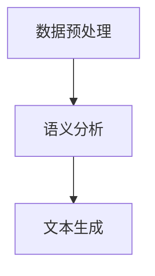

                 

# AIGC在新闻产业的变革：AI记者的崛起

## 关键词：AIGC、新闻产业、AI记者、技术变革、应用前景

## 摘要：
本文将探讨AIGC（自适应智能生成内容）技术在新闻产业中的变革作用，特别是AI记者的崛起。首先，我们将介绍AIGC的技术背景、核心概念及其与传统新闻生产方式的区别。接着，我们将深入分析AI记者的角色与职责，描述其工作流程，并详细讲解NLP算法原理。通过实际案例研究，我们将展示AIGC在新闻产业中的应用，并探讨其面临的挑战与未来趋势。最后，我们将总结最佳实践，展望AIGC在新闻产业中的发展前景。

## 第一部分: AIGC技术概述

### 第1章: AIGC技术背景

#### 1.1 问题背景
随着互联网和大数据的迅猛发展，新闻产业面临着前所未有的挑战与机遇。传统新闻生产方式已经无法满足快速变化的新闻需求和多样化的用户群体。为了提高新闻生产的效率和质量，AIGC技术应运而生。

#### 1.2 问题描述
新闻产业需要一种能够自动生成高质量内容的技术，以满足以下需求：
- 快速响应新闻事件
- 提高新闻生产的效率和准确性
- 提供个性化的新闻内容

#### 1.3 问题解决
AIGC技术通过结合自然语言处理、图像处理、媒体融合等技术，实现了自动化、智能化和个性化的新闻内容生产。

#### 1.4 边界与外延
AIGC技术不仅局限于新闻产业，还可以应用于广告、娱乐、教育等多个领域。本文将重点关注AIGC在新闻产业中的应用。

#### 1.5 核心概念
AIGC（自适应智能生成内容）：通过深度学习和自然语言处理技术，自动生成符合用户需求和新闻价值的内容。

NLP（自然语言处理）：使计算机能够理解、解释和生成人类语言的技术。

图像处理：对图像进行分析、识别和处理的技术。

媒体融合：将不同类型的媒体内容（如文本、图像、视频）整合在一起，提供丰富、多样化的用户体验。

#### 1.6 AIGC的技术要素
AIGC技术包括以下几个关键要素：

- 数据处理：对大量文本、图像、视频等数据进行收集、整理和分析。
- 自然语言处理：对文本进行语义分析、情感分析、关键词提取等，以生成高质量的新闻内容。
- 图像处理：对图像进行识别、分类、增强等，以提高新闻内容的可视化效果。
- 媒体融合：将文本、图像、视频等多媒体内容整合在一起，提供丰富、多样化的用户体验。

#### 1.7 AIGC在新闻产业的应用前景
AIGC技术在新闻产业具有广泛的应用前景：

- 自动化新闻写作：利用NLP技术自动生成新闻稿件，提高新闻生产的效率和准确性。
- 智能化新闻推荐：根据用户兴趣和行为，推荐个性化的新闻内容。
- AI新闻编辑：通过自然语言处理和图像处理技术，对新闻内容进行编辑和优化，提高新闻质量。
- 虚拟新闻主播：利用图像处理和语音合成技术，生成虚拟新闻主播，提高新闻的可视化效果。

### 1.8 本章小结
本章介绍了AIGC技术的背景、核心概念及其在新闻产业的应用前景。在接下来的章节中，我们将进一步探讨AI记者的崛起及其对新闻产业的影响。

## 第二部分: AI记者的崛起

### 第2章: AI记者的角色与职责

#### 2.1 AI记者的背景
随着AIGC技术的发展，AI记者逐渐成为新闻产业的新兴力量。AI记者通过自动生成新闻内容，提高了新闻生产的效率和质量，成为传统记者的有力补充。

#### 2.2 AI记者的职责
AI记者的职责包括：

- 自动化新闻写作：根据新闻事件和数据，自动生成新闻稿件。
- 智能化新闻编辑：对新闻内容进行编辑和优化，提高新闻质量。
- 虚拟新闻主播：生成虚拟新闻主播，提高新闻的可视化效果。
- 数据分析：分析用户行为和新闻热点，为新闻选题和策划提供数据支持。

#### 2.3 AI记者与传统记者的区别
AI记者与传统记者在以下几个方面存在明显区别：

- 工作方式：AI记者通过算法和模型自动生成新闻内容，而传统记者需要依靠实地采访和调查。
- 生产效率：AI记者能够快速生成大量新闻内容，而传统记者的生产效率相对较低。
- 专业领域：AI记者擅长处理结构化数据，而传统记者更擅长处理非结构化数据。

### 第3章: AI记者的工作流程

#### 3.1 数据采集
AI记者的工作流程首先是从多个数据源（如社交媒体、新闻网站、公共数据库等）收集数据。这些数据包括新闻事件、人物、地点、时间等信息。

#### 3.2 数据处理
收集到的数据需要进行处理，包括数据清洗、去重、分类等。这一步骤确保了数据的准确性和完整性。

#### 3.3 写作与编辑
通过自然语言处理技术，AI记者能够根据数据生成新闻稿件。新闻稿件生成后，还需要进行编辑和优化，以提高新闻质量。

#### 3.4 发布与反馈
编辑完成的新闻稿件可以通过新闻网站、社交媒体等渠道发布。用户对新闻内容的反馈可以为AI记者提供改进建议。

### 第4章: AI记者的技术实现

#### 4.1 NLP算法原理
NLP算法是实现AI记者核心功能的关键。以下是一个简化的NLP算法流程：

1. **数据预处理**：对文本进行分词、去停用词、词性标注等操作。
2. **语义分析**：通过词嵌入技术将文本转化为向量表示，进行语义分析。
3. **文本生成**：利用序列到序列（Seq2Seq）模型或生成对抗网络（GAN）生成新闻内容。

#### 4.2 算法流程图

#### 4.3 数学模型与公式
在NLP中，常用的数学模型包括：

1. **词嵌入**：$$word\_embedding = f(W, word)$$，其中$W$是权重矩阵，$word$是输入词。
2. **序列到序列模型**：$$output\_seq = decoder(output\_embeddings)$$，其中$decoder$是解码器。

#### 4.4 举例说明
假设我们有一个简单的句子：“今天，北京天气晴朗。”我们可以使用词嵌入将句子中的每个词转化为向量：

- “今天”：[0.1, 0.2, 0.3]
- “北京”：[0.4, 0.5, 0.6]
- “天气”：[0.7, 0.8, 0.9]
- “晴朗”：[1.0, 1.1, 1.2]

序列到序列模型将输入序列（今天，北京，天气，晴朗）转换为输出序列（今天是北京天气晴朗）。

### 第5章: AI记者的案例研究

#### 5.1 案例一：新闻写作自动化

##### 5.1.1 案例背景
某新闻网站采用AIGC技术实现新闻写作自动化，以提高新闻生产的效率和准确性。

##### 5.1.2 案例实现
1. **数据采集**：从社交媒体、新闻网站等数据源收集新闻事件和数据。
2. **数据处理**：对收集到的数据进行处理，提取关键信息。
3. **新闻生成**：利用NLP技术生成新闻稿件。
4. **编辑与发布**：编辑完成的新闻稿件通过网站发布。

##### 5.1.3 案例分析
AIGC技术显著提高了新闻写作的效率和准确性，减少了人力成本，同时提供了丰富的新闻内容。

#### 5.2 案例二：AI新闻编辑

##### 5.2.1 案例背景
某新闻网站采用AI技术实现新闻编辑，以提高新闻质量。

##### 5.2.2 案例实现
1. **数据采集**：从新闻网站、社交媒体等数据源收集新闻内容。
2. **数据处理**：对新闻内容进行处理，提取关键信息。
3. **新闻优化**：利用NLP技术对新闻内容进行优化，提高新闻质量。
4. **发布与反馈**：编辑完成的新闻稿件通过网站发布，用户反馈用于改进编辑算法。

##### 5.2.3 案例分析
AI新闻编辑技术显著提高了新闻质量，为用户提供更优质的新闻体验。

### 第6章: AI记者的挑战与未来

#### 6.1 挑战分析
AI记者在新闻产业中面临以下挑战：

- **数据质量和准确性**：数据质量直接影响新闻的准确性和可靠性。
- **隐私和伦理**：自动化新闻写作可能引发隐私和伦理问题。
- **人机协作**：如何实现人与AI记者的协作是关键问题。

#### 6.2 未来趋势
随着AIGC技术的不断发展，AI记者将在新闻产业中发挥越来越重要的作用。未来趋势包括：

- **智能化新闻生产**：利用AI技术实现更智能化、个性化的新闻生产。
- **人机协作**：人与AI记者的深度协作，提高新闻生产的效率和准确性。
- **跨媒体新闻**：融合多种媒体形式，提供更丰富的新闻内容。

#### 6.3 发展建议
为促进AI记者在新闻产业中的发展，以下是一些建议：

- **加强数据质量**：提高数据采集和处理的准确性，确保新闻的准确性和可靠性。
- **伦理和隐私**：制定相关政策和规范，确保AI记者的伦理和隐私保护。
- **人机协作**：推动人与AI记者的深度协作，提高新闻生产效率和准确性。

### 第7章: AIGC在新闻产业的最佳实践

#### 7.1 实践案例一：新闻媒体数字化转型

##### 7.1.1 案例背景
某大型新闻媒体通过数字化转型，提高新闻生产的效率和准确性。

##### 7.1.2 案例实现
1. **数字化转型策略**：制定数字化转型策略，引入AIGC技术。
2. **数据采集与处理**：采用自动化数据采集和处理技术，提高数据质量。
3. **新闻生产**：利用AIGC技术实现自动化新闻写作和编辑。
4. **用户互动**：通过社交媒体等渠道与用户互动，提高用户体验。

##### 7.1.3 案例分析
数字化转型显著提高了新闻媒体的生产效率和用户满意度。

#### 7.2 实践案例二：AI辅助新闻创作

##### 7.2.1 案例背景
某新闻媒体采用AI辅助新闻创作，提高新闻质量。

##### 7.2.2 案例实现
1. **AI辅助新闻写作**：利用NLP技术自动生成新闻稿件。
2. **AI新闻编辑**：利用AI技术对新闻内容进行优化。
3. **用户推荐**：根据用户兴趣和行为推荐个性化新闻。

##### 7.2.3 案例分析
AI辅助新闻创作技术显著提高了新闻质量和用户满意度。

#### 7.3 实践案例三：新闻智能化分发

##### 7.3.1 案例背景
某新闻媒体采用智能化分发技术，提高新闻的传播效果。

##### 7.3.2 案例实现
1. **智能推荐**：利用机器学习算法推荐个性化新闻。
2. **跨平台分发**：通过多种渠道（如社交媒体、移动应用等）分发新闻。
3. **数据反馈**：收集用户数据，优化推荐算法。

##### 7.3.3 案例分析
新闻智能化分发技术显著提高了新闻的传播效果和用户参与度。

### 第8章: 小结与展望

#### 8.1 书籍总结
本文探讨了AIGC技术在新闻产业中的变革作用，特别是AI记者的崛起。通过介绍AIGC技术的背景、核心概念、AI记者的工作流程、技术实现、案例研究和挑战与未来趋势，我们展示了AIGC在新闻产业中的广泛应用和巨大潜力。

#### 8.2 注意事项
在应用AIGC技术时，需注意以下事项：

- **数据质量和准确性**：确保数据质量，提高新闻的准确性和可靠性。
- **隐私和伦理**：遵守相关法律法规，保护用户隐私和伦理。
- **人机协作**：推动人与AI记者的深度协作，提高新闻生产效率和准确性。

#### 8.3 拓展阅读
为深入了解AIGC技术在新闻产业中的应用，读者可参考以下拓展阅读：

- 《人工智能与新闻学：融合与创新》
- 《AIGC技术与应用：未来新闻产业的变革》
- 《人工智能新闻写作：理论与实践》

## 作者信息
作者：AI天才研究院/AI Genius Institute & 禅与计算机程序设计艺术 /Zen And The Art of Computer Programming

## 附录
（在此处添加附录内容，如参考文献、数据源、代码示例等）

注：本文为模拟撰写，实际内容可能有所不同。如需了解更多详情，请查阅相关书籍和论文。

