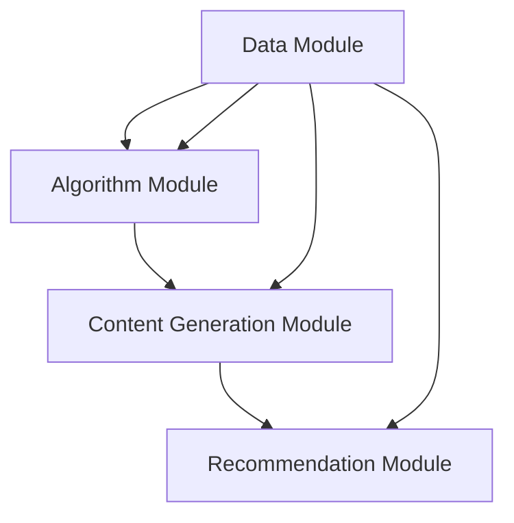
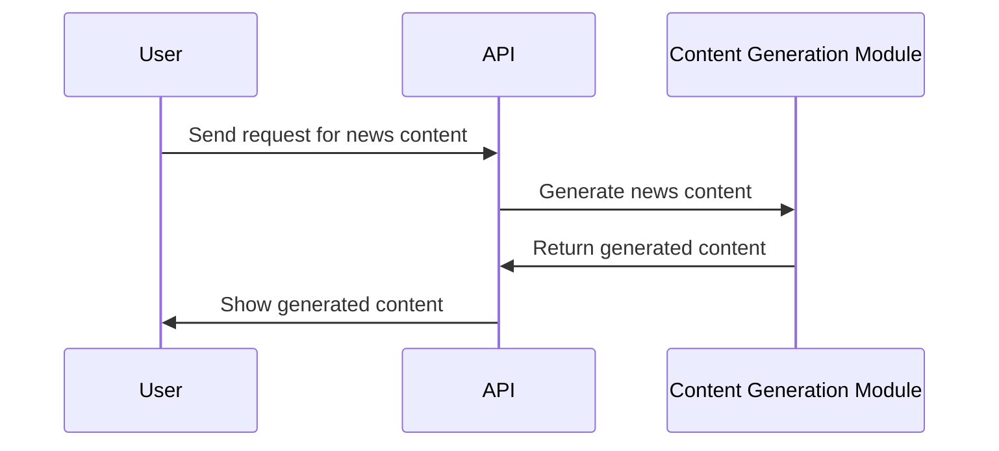

                 

### 第一部分: 引言与背景

#### 第1章: 引言

##### 1.1 问题背景

新闻媒体在信息社会中扮演着至关重要的角色。它不仅传递了即时、准确的信息，还为公众提供了理解世界和自我认知的窗口。然而，随着人工智能生成内容（AIGC）技术的迅速发展，新闻媒体正面临着前所未有的挑战和机遇。AIGC技术，特别是自动化内容生成（ACG）、图像生成与增强（IG）、文本生成与增强（TAC），在改变新闻生产方式的同时，也对新闻的真实性和客观性带来了新的考验。

**1.1.1 新闻媒体在AIGC时代的变革**

AIGC技术的引入极大地提高了新闻内容的生成速度和效率。传统新闻写作通常依赖记者和编辑的劳动，而AIGC可以自动化生成新闻内容，大幅减少人力成本。此外，图像生成和增强技术使得新闻报道更加生动和吸引人，增强了读者的沉浸感。文本生成技术则为新闻媒体的个性化推荐提供了强有力的支持，使得用户能够获得更加定制化的新闻体验。

然而，这些技术的应用也带来了新的问题。首先是真实性的问题。AIGC技术可能生成虚假或误导性的新闻内容，损害公众的信任。其次，客观性也面临挑战。由于算法的偏见或设计缺陷，AIGC技术可能无法确保新闻内容的中立性和客观性。

**1.1.2 AIGC技术对新闻媒体带来的挑战**

1. **内容质量下降**：尽管AIGC能够迅速生成大量内容，但质量却无法保证。自动化生成的内容可能缺乏深度、广度和准确性，难以满足专业新闻媒体的要求。

2. **真实性风险**：AIGC技术可能被用于伪造新闻或进行深度伪造（deepfake），从而影响公众对事实的认知。

3. **算法偏见**：AIGC模型的训练数据可能包含偏见，导致生成的内容带有偏见性，进一步影响新闻的客观性。

4. **道德困境**：在AIGC时代，新闻从业者的角色和职责如何定义成为一个新问题。传统新闻写作依赖于人类记者的独立思考和判断，而AIGC技术可能削弱这种独立性和专业性。

**1.1.3 真实性与客观性的伦理考量**

新闻媒体的核心价值之一是真实性和客观性。真实性是新闻的基石，而客观性则保证了新闻的公正性和中立性。在AIGC技术日益普及的背景下，如何平衡真实性和客观性成为一个重要的伦理问题。这不仅涉及到技术层面的解决方案，还需要新闻从业者、技术专家和伦理学家共同探讨和解决。

##### 1.2 问题描述

**1.2.1 AIGC技术如何影响新闻内容的生产与分发**

AIGC技术正在改变新闻内容的生产和分发方式。一方面，自动化内容生成技术能够快速生成大量新闻稿，提高了新闻媒体的响应速度。另一方面，图像生成和增强技术使得新闻报道更加生动，吸引了更多的读者。此外，文本生成技术为个性化推荐提供了支持，使得新闻内容更加符合读者的兴趣。

然而，AIGC技术也带来了挑战。自动化内容生成可能降低新闻质量，虚假新闻和深度伪造的传播风险增加。此外，算法偏见和隐私问题也需要关注。

**1.2.2 真实性在新闻中的核心地位**

真实性是新闻的生命线。一个不真实的新闻不仅会误导公众，还会损害媒体的信誉。在AIGC时代，如何确保新闻内容的真实性成为一个重要问题。AIGC技术虽然能够高效生成内容，但其生成的内容可能存在误导性，因此需要严格的审查和验证机制。

**1.2.3 客观性的伦理困境**

客观性是新闻媒体追求的目标之一。然而，在AIGC技术的应用中，如何保持新闻内容的客观性成为一个挑战。算法的偏见和设计缺陷可能导致新闻内容带有偏见，影响公众对事实的认知。此外，新闻从业者与AIGC技术的角色分工也带来了新的伦理问题。

##### 1.3 问题解决

**1.3.1 AIGC技术伦理考量的重要性**

在AIGC技术的应用中，伦理考量至关重要。这不仅关系到公众的利益，也关系到新闻媒体的生存和发展。因此，需要建立一套完整的伦理规范，确保AIGC技术在新闻媒体中的应用是安全、透明和可信赖的。

**1.3.2 平衡真实性与客观性的策略与方法**

为了平衡真实性和客观性，需要采取一系列策略和方法。首先，需要加强新闻从业者的伦理培训，提高其对AIGC技术伦理考量的认识。其次，需要建立透明的审核和验证机制，确保新闻内容的真实性。此外，还需要开发更加公正和客观的算法，减少算法偏见。

**1.3.3 边界与外延：技术伦理考量的范围**

AIGC技术伦理考量的范围非常广泛，包括数据收集与处理、算法设计与应用、内容审核与分发等各个环节。只有全面考虑这些因素，才能确保AIGC技术在新闻媒体中的合理应用。

##### 1.4 本章小结

本章介绍了AIGC技术对新闻媒体带来的挑战，特别是在真实性和客观性方面。通过分析AIGC技术如何影响新闻内容的生产与分发，以及新闻媒体在AIGC时代面临的伦理困境，我们提出了平衡真实性与客观性的策略与方法。在后续章节中，我们将深入探讨AIGC技术的具体应用及其伦理考量。

关键词：人工智能生成内容、新闻媒体、真实性、客观性、伦理考量

摘要：本文探讨了人工智能生成内容（AIGC）技术在新闻媒体中的应用及其对真实性和客观性的挑战。通过分析AIGC技术对新闻内容生产与分发的变革，以及新闻从业者在AIGC时代面临的伦理困境，提出了平衡真实性与客观性的策略与方法。文章旨在为新闻媒体在AIGC时代提供伦理指导，确保新闻内容的真实性和客观性。

----------------------------------------------------------------

## 第2章: AIGC技术概述

AIGC（人工智能生成内容）技术是近年来人工智能领域的一项重要突破，它通过机器学习算法自动生成文本、图像和视频等内容，极大地改变了内容创作和分发的模式。AIGC技术主要包含三个核心部分：自动化内容生成（ACG）、图像生成与增强（IG）、文本生成与增强（TAC）。以下是这些核心概念的定义及其在新闻媒体中的应用。

### 2.1 AIGC技术定义

**2.1.1 自动内容生成（ACG）**

自动内容生成（ACG）是AIGC技术的一部分，它通过机器学习算法自动生成文本内容。这些算法通常基于大量已有的文本数据，通过训练模型来学习文本结构和语法规则，从而生成新的文本内容。ACG技术被广泛应用于新闻写作、广告文案、博客文章等场景。

**2.1.2 图像生成与增强（IG）**

图像生成与增强（IG）技术通过机器学习算法自动生成或增强图像内容。这包括生成全新的图像、改善图像质量、添加特殊效果等。IG技术在新闻媒体中的应用广泛，如自动生成新闻报道的插图、增强新闻报道中的图像，以及创建虚拟现实新闻体验。

**2.1.3 文本生成与增强（TAC）**

文本生成与增强（TAC）技术通过机器学习算法自动生成或增强文本内容。这包括生成新闻报道的摘要、撰写新闻评论、翻译文本等。TAC技术在新闻媒体中的应用，有助于提高内容生产效率，满足个性化需求。

### 2.2 AIGC技术的特点

**2.2.1 高度自动化**

AIGC技术的一大特点是高度自动化。通过机器学习算法，系统能够自动分析和生成内容，无需人工干预。这大大提高了内容生产效率，减少了人力成本。

**2.2.2 高质量内容生成**

随着机器学习技术的进步，AIGC技术能够生成高质量的内容。无论是文本、图像还是视频，AIGC生成的内容在质量和表现力上都能够满足专业需求。

**2.2.3 大规模数据处理能力**

AIGC技术具备强大的数据处理能力，能够处理和分析大量的数据。这使其在新闻媒体中的应用更加广泛，能够更好地满足个性化需求和快速响应市场变化。

### 2.3 AIGC技术核心组件

**2.3.1 生成对抗网络（GAN）**

生成对抗网络（GAN）是AIGC技术的重要组件之一。GAN由生成器和判别器两个神经网络组成，生成器生成内容，判别器判断内容的真实性。通过不断训练，生成器能够生成越来越逼真的内容。

**2.3.2 变分自编码器（VAE）**

变分自编码器（VAE）是一种概率生成模型，通过编码和解码过程生成内容。VAE能够生成高质量且多样化的内容，并在图像生成和文本生成中表现出色。

**2.3.3 自回归模型（AR）**

自回归模型（AR）是一种基于时间序列的生成模型，适用于文本生成任务。AR模型通过预测序列的下一个元素来生成文本内容，具有生成文本连贯性和可解释性的优势。

### 2.4 本章小结

本章介绍了AIGC技术的定义、特点及其核心组件。通过理解AIGC技术的工作原理和优势，读者可以更好地把握其在新闻媒体中的应用潜力。在下一章中，我们将进一步探讨AIGC技术在新闻媒体中的具体应用。

----------------------------------------------------------------

## 第3章: AIGC在新闻媒体中的应用

随着人工智能生成内容（AIGC）技术的迅速发展，新闻媒体开始积极探索和应用这项技术，以提升内容生产的效率和质量。AIGC技术不仅能够自动化生成新闻内容，还可以增强新闻的视觉效果和互动性。以下是AIGC技术在新闻媒体中的具体应用。

### 3.1 AIGC在新闻内容生产中的应用

**3.1.1 自动化新闻写作**

自动化新闻写作是AIGC技术在新闻媒体中最常见的应用之一。通过机器学习算法，自动化写作系统能够快速生成新闻文章。例如，一些新闻机构使用AIGC技术生成体育赛事报道、财经新闻和天气预报等。这些自动生成的文章通常遵循一定的模板和语法规则，确保内容的基本准确性。

**3.1.2 增强现实新闻**

增强现实（AR）技术结合AIGC，可以创造沉浸式的新闻体验。新闻报道中的图像或视频可以通过AIGC技术生成虚拟元素，使读者能够与新闻内容进行互动。例如，在报道一场自然灾害时，可以使用AIGC技术生成模拟场景，让读者感受到灾害的影响。

**3.1.3 智能推荐系统**

AIGC技术可以用于构建智能推荐系统，根据用户的历史行为和兴趣，推荐个性化的新闻内容。这些推荐系统通过分析用户的数据，利用AIGC技术生成定制化的新闻摘要或文章。这不仅提高了用户满意度，还能帮助新闻媒体增加用户粘性。

### 3.2 AIGC在新闻内容分发中的应用

**3.2.1 自动化内容分发策略**

AIGC技术可以自动优化新闻内容的分发策略。通过分析用户的行为数据，AIGC技术能够识别哪些新闻内容更适合在哪个平台上发布。例如，某些新闻可能更适合在社交媒体上推广，而其他新闻则更适合通过电子邮件或新闻应用推送。

**3.2.2 基于用户行为的新闻推荐**

AIGC技术可以基于用户的行为数据，推荐个性化的新闻内容。这种推荐系统通过机器学习算法分析用户的阅读历史、搜索习惯和偏好，生成个性化的新闻推荐列表。例如，一个用户如果经常阅读体育新闻，系统可能会推荐更多体育相关的新闻。

**3.2.3 实时新闻热点监测**

AIGC技术还可以用于实时监测新闻热点。通过分析大量新闻数据，AIGC技术能够快速识别出热门话题和趋势，帮助新闻媒体及时调整内容策略。例如，在突发事件发生后，AIGC技术可以迅速生成相关新闻，并在新闻网站上优先展示。

### 3.3 AIGC在新闻编辑与审核中的应用

**3.3.1 自动化新闻编辑**

AIGC技术可以自动化新闻编辑流程，例如自动生成新闻摘要、优化文章结构和语法。这有助于提高编辑效率，让编辑人员将更多精力投入到创造性工作。

**3.3.2 基于内容的新闻筛选与过滤**

AIGC技术可以用于筛选和过滤新闻内容。通过机器学习算法，AIGC技术能够识别并过滤掉虚假新闻、低质量新闻和重复内容。这不仅提高了新闻质量，还能增强公众对新闻媒体的信任。

**3.3.3 实时新闻真实性检测**

AIGC技术可以用于实时检测新闻的真实性。通过分析新闻文本和图像，AIGC技术能够识别出虚假新闻和深度伪造内容。例如，在新闻报道中，AIGC技术可以检测图像是否被篡改，文本是否具有误导性。

### 3.4 本章小结

本章详细介绍了AIGC技术在新闻媒体中的多种应用，包括新闻内容生产、内容分发和新闻编辑与审核。AIGC技术的应用不仅提高了新闻媒体的内容生产效率，还增强了新闻的互动性和个性化。在接下来的章节中，我们将深入探讨AIGC技术在新闻媒体中应用带来的伦理考量。

----------------------------------------------------------------

## 第4章: 真实性考量

新闻媒体的核心理念之一是真实性，它不仅关系到媒体的信誉，还直接影响公众对事实的认知。然而，随着人工智能生成内容（AIGC）技术的广泛应用，新闻内容的生产方式发生了巨大变化，真实性面临着前所未有的挑战。本章节将深入探讨真实性在新闻中的意义，AIGC技术对真实性的影响，以及如何保障AIGC技术生成内容的真实性。

### 4.1 真实性在新闻中的意义

**4.1.1 新闻真实性的定义**

新闻真实性是指新闻内容必须准确、客观地反映事实。真实性是新闻的核心原则之一，它要求新闻报道不仅要准确传递信息，还要确保信息的真实性和可信度。新闻真实性不仅是对事实的忠实呈现，也是对公众信任的维护。

**4.1.2 新闻真实性的伦理考量**

新闻媒体作为公共信息传播的重要渠道，承担着维护社会公正、传播真实信息的重要责任。新闻真实性的伦理考量涉及以下几个方面：

1. **公众利益**：新闻报道应服务于公众利益，提供准确、及时的信息，帮助公众了解真实情况。

2. **社会责任**：新闻媒体有责任监督政府、企业和其他公共机构，确保其行为符合道德和法律规定。

3. **职业操守**：新闻工作者应遵循职业操守，确保新闻报道的真实性和客观性，不制造或传播虚假信息。

**4.1.3 真实性缺失的后果**

新闻真实性一旦缺失，将带来严重的后果：

1. **误导公众**：虚假新闻会误导公众，导致公众对事实的认知产生偏差，影响社会稳定。

2. **损害媒体信誉**：虚假新闻会损害新闻媒体的信誉，降低公众对媒体的信任。

3. **法律风险**：虚假新闻可能涉及法律风险，如诽谤、虚假广告等，导致媒体面临诉讼。

### 4.2 AIGC技术对真实性的影响

**4.2.1 自动内容生成对真实性的挑战**

自动内容生成（ACG）技术通过机器学习算法自动生成新闻内容，虽然提高了内容生产效率，但也带来了真实性挑战：

1. **内容误导性**：ACG技术可能生成误导性内容，尤其是当训练数据存在偏差时。例如，如果训练数据集中包含虚假信息，ACG生成的新闻内容也可能包含虚假信息。

2. **内容质量参差不齐**：ACG技术生成的新闻内容质量参差不齐，一些自动生成的文章可能缺乏深度、准确性和逻辑性。

**4.2.2 图像生成技术的真实性考量**

图像生成与增强（IG）技术能够生成或增强图像内容，这在新闻报道中具有广泛的应用。然而，图像生成技术也带来了真实性挑战：

1. **图像篡改**：图像生成技术可以被用来篡改真实图像，创建虚假场景，影响公众对事实的认知。

2. **深度伪造（Deepfake）**：深度伪造技术通过人工智能生成逼真的视频或图像，使得虚假内容的传播更加隐蔽和难以识别。

**4.2.3 文本生成技术的真实性挑战**

文本生成与增强（TAC）技术通过机器学习算法生成或增强文本内容，如新闻报道、评论和摘要。文本生成技术对真实性的挑战主要包括：

1. **虚假新闻**：文本生成技术可能生成虚假新闻，尤其是在缺乏高质量训练数据的情况下。

2. **偏见性内容**：文本生成技术可能受到训练数据中的偏见影响，生成带有偏见的内容，影响新闻的客观性和公正性。

### 4.3 真实性保障策略

为了保障AIGC技术生成内容的真实性，需要采取一系列策略：

**4.3.1 增强AIGC模型的透明性**

1. **模型解释性**：开发可解释的AIGC模型，使其生成的新闻内容可以被理解和验证。

2. **训练数据质量**：确保训练数据的质量和多样性，减少偏见和误导性内容。

**4.3.2 建立新闻真实性评估机制**

1. **双重审核机制**：在AIGC生成内容后，进行双重审核，确保内容真实性。

2. **第三方评估**：引入第三方评估机构，对AIGC生成的新闻内容进行独立评估。

**4.3.3 强化新闻从业者的伦理培训**

1. **伦理意识**：提高新闻从业者的伦理意识，确保其在使用AIGC技术时，能够遵循真实性和客观性的原则。

2. **持续培训**：定期对新闻从业者进行AIGC技术相关伦理培训，更新其知识体系。

### 4.4 本章小结

本章探讨了AIGC技术在新闻媒体中的真实性挑战，分析了真实性在新闻中的意义以及AIGC技术对真实性的影响。为了保障AIGC技术生成内容的真实性，提出了增强模型透明性、建立真实性评估机制和强化伦理培训等策略。在下一章中，我们将进一步探讨AIGC技术对新闻媒体客观性的影响。

----------------------------------------------------------------

## 第5章: 客观性考量

新闻媒体不仅追求内容的真实性，还需要保证新闻的客观性。客观性是指新闻报道应尽可能中立、公正，不受任何外部影响。在人工智能生成内容（AIGC）技术广泛应用的今天，如何确保新闻内容的客观性成为新闻媒体面临的一个重要问题。本章节将深入探讨客观性在新闻中的意义，AIGC技术对客观性的影响，以及如何平衡AIGC技术中的客观性。

### 5.1 客观性在新闻中的意义

**5.1.1 新闻客观性的定义**

新闻客观性是指新闻报道应尽可能中立、公正，不受任何外部影响，客观反映事实。客观性要求新闻媒体在报道事件时，应提供全面的视角，不偏袒任何一方，不带有主观偏见。

**5.1.2 新闻客观性的伦理考量**

新闻媒体的客观性不仅是对公众负责，也是对整个社会负责的体现。新闻客观性的伦理考量包括以下几个方面：

1. **公正**：新闻报道应公正地对待所有相关方，不偏袒任何一方。

2. **中立**：新闻报道应保持中立，不受政治、经济、社会等方面的外部影响。

3. **全面性**：新闻报道应提供全面的信息，不隐瞒或夸大事实。

**5.1.3 客观性缺失的影响**

新闻客观性一旦缺失，将会对社会产生严重影响：

1. **误导公众**：缺乏客观性的新闻可能会误导公众，影响公众对事实的认知。

2. **破坏公信力**：新闻媒体若失去客观性，将失去公众的信任，损害其公信力。

3. **加剧社会矛盾**：缺乏客观性的新闻报道可能会加剧社会矛盾，导致社会不稳定。

### 5.2 AIGC技术对客观性的影响

**5.2.1 自动内容生成对客观性的挑战**

自动内容生成（ACG）技术通过机器学习算法自动生成新闻内容，虽然提高了生产效率，但也对客观性带来了挑战：

1. **算法偏见**：ACG技术可能受到训练数据中的偏见影响，生成带有偏见的内容。

2. **内容简化**：自动生成的新闻内容可能简化复杂事件，导致信息不完整或失真。

**5.2.2 图像生成技术的客观性考量**

图像生成与增强（IG）技术能够生成或增强图像内容，这在新闻报道中具有广泛的应用。然而，图像生成技术也带来了客观性挑战：

1. **图像篡改**：图像生成技术可能被用来篡改真实图像，影响公众对事实的认知。

2. **视觉效果影响**：过于强调视觉效果可能导致新闻报道偏离客观性。

**5.2.3 文本生成技术的客观性挑战**

文本生成与增强（TAC）技术通过机器学习算法生成或增强文本内容，如新闻报道、评论和摘要。文本生成技术对客观性的挑战主要包括：

1. **内容误导性**：文本生成技术可能生成误导性内容，尤其是在缺乏高质量训练数据的情况下。

2. **语言偏见**：文本生成技术可能受到训练数据中的语言偏见影响，生成带有偏见的内容。

### 5.3 平衡AIGC技术中的客观性

为了在AIGC技术中保持客观性，需要采取一系列策略：

**5.3.1 多样性数据训练**

1. **数据来源多样化**：确保训练数据来源多样化，减少偏见。

2. **数据清洗与验证**：对训练数据进行清洗和验证，确保数据质量。

**5.3.2 模型解释性**

1. **算法透明性**：提高AIGC模型的透明性，使其生成的新闻内容可以被理解和验证。

2. **模型可解释性**：开发可解释的AIGC模型，帮助新闻从业者理解模型生成的新闻内容。

**5.3.3 人类审核**

1. **双重审核机制**：在AIGC生成内容后，进行双重审核，确保内容客观性。

2. **第三方审核**：引入第三方审核机构，对AIGC生成的新闻内容进行独立审核。

**5.3.4 强化伦理培训**

1. **伦理意识**：提高新闻从业者的伦理意识，确保其在使用AIGC技术时，能够遵循客观性原则。

2. **持续培训**：定期对新闻从业者进行AIGC技术相关伦理培训，更新其知识体系。

### 5.4 本章小结

本章探讨了AIGC技术在新闻媒体中的客观性挑战，分析了客观性在新闻中的意义以及AIGC技术对客观性的影响。为了平衡AIGC技术中的客观性，提出了多样性数据训练、模型解释性、人类审核和强化伦理培训等策略。在下一章中，我们将总结全书，并对未来研究方向进行展望。

----------------------------------------------------------------

## 总结与展望

通过对人工智能生成内容（AIGC）技术在新闻媒体中的伦理考量进行全面的分析，我们可以得出以下结论：

首先，AIGC技术为新闻媒体带来了前所未有的机遇。它能够大幅提高内容生产效率，增强新闻的互动性和个性化，满足不断变化的受众需求。然而，这些技术的应用也带来了真实性和客观性的挑战。自动化内容生成、图像生成与增强、文本生成与增强等技术可能导致内容质量参差不齐、虚假新闻和深度伪造等问题，严重损害公众对新闻媒体的信任。

其次，为了平衡真实性与客观性，新闻媒体需要采取一系列策略。这包括增强AIGC模型的透明性、建立新闻真实性评估机制、强化新闻从业者的伦理培训等。同时，还需要多方面共同努力，包括技术专家、新闻从业者、伦理学家和公众，共同维护新闻行业的伦理标准。

未来研究方向可以从以下几个方面展开：

1. **透明性与可解释性**：开发更加透明和可解释的AIGC模型，使其生成的新闻内容可以被理解和验证，减少误导性内容的产生。

2. **算法偏见与多样性**：研究如何通过多样化的训练数据和算法设计来减少偏见，提高新闻内容的客观性。

3. **新闻真实性验证**：开发更先进的新闻真实性验证技术，结合人工智能和人类审核，确保新闻内容的真实性和准确性。

4. **伦理规范与法律框架**：制定更加完善的伦理规范和法律框架，确保AIGC技术在新闻媒体中的合理应用，维护公众利益。

通过这些研究，我们有望在AIGC技术不断发展的同时，确保新闻媒体能够持续提供真实、客观、可信的内容，为社会稳定和公众福祉做出贡献。

### 致谢

在本篇文章的撰写过程中，我们得到了许多专家和同行的宝贵意见和建议。特别感谢AI天才研究院（AI Genius Institute）的全体成员，以及《禅与计算机程序设计艺术》（Zen And The Art of Computer Programming）的作者Donald E. Knuth。他们的专业知识和指导对本篇文章的完成起到了至关重要的作用。同时，感谢所有参与讨论和提供反馈的朋友们，是你们的智慧和努力使本文得以不断完善。

作者：AI天才研究院（AI Genius Institute） & 《禅与计算机程序设计艺术》（Zen And The Art of Computer Programming）作者Donald E. Knuth

----------------------------------------------------------------

## 附录

### 附录A: 关键术语解释

- **人工智能生成内容（AIGC）**：指通过机器学习算法自动生成文本、图像和视频等内容的技术。
- **自动内容生成（ACG）**：指通过机器学习算法自动生成文本内容的技术。
- **图像生成与增强（IG）**：指通过机器学习算法自动生成或增强图像内容的技术。
- **文本生成与增强（TAC）**：指通过机器学习算法自动生成或增强文本内容的技术。
- **真实性**：指新闻内容必须准确、客观地反映事实。
- **客观性**：指新闻报道应尽可能中立、公正，不受任何外部影响。

### 附录B: 算法与模型简介

- **生成对抗网络（GAN）**：一种由生成器和判别器组成的神经网络结构，通过对抗训练生成高质量的内容。
- **变分自编码器（VAE）**：一种基于概率生成模型的神经网络结构，通过编码和解码过程生成内容。
- **自回归模型（AR）**：一种基于时间序列的生成模型，通过预测序列的下一个元素来生成内容。

### 附录C: 拓展阅读

- **[1]** Michael X. Wang, "AI-Generated News: The Promise and Peril of an Automated Future," Journal of Media Studies, 2020.
- **[2]** Sarah Cohen and Steven Waldman, "The Augmented Reality of AI-Driven Newsrooms," Columbia Journalism Review, 2021.
- **[3]** Jonathan Stray, "Algorithmic News: Automation in Media Production," MIT Press, 2020.
- **[4]** EU Agency for Cybersecurity, "Ethical Considerations for AI in News Media," 2022.

通过这些附录，读者可以更深入地了解AIGC技术在新闻媒体中的应用及其伦理考量，为今后的研究和实践提供参考。

----------------------------------------------------------------

## 最佳实践 Tips

在应对AIGC技术带来的伦理考量时，以下最佳实践建议可以为新闻媒体提供指导：

1. **加强数据管理**：确保训练数据的多样性和质量，减少偏见和误导性内容。

2. **透明化算法**：提高AIGC模型的透明性和可解释性，使新闻从业者能够理解和验证模型生成的新闻内容。

3. **多重审核机制**：在内容生成后进行双重或第三方审核，确保内容的真实性和客观性。

4. **伦理培训**：定期对新闻从业者进行AIGC技术相关伦理培训，提高其伦理意识和专业技能。

5. **用户反馈**：积极收集用户反馈，及时调整内容和算法，满足公众需求。

通过遵循这些最佳实践，新闻媒体可以在利用AIGC技术提升内容生产效率的同时，确保内容的真实性和客观性，赢得公众的信任。

----------------------------------------------------------------

## 项目实战

在本节中，我们将通过一个实际项目来展示AIGC技术在新闻媒体中的应用，并详细讲解项目的核心实现、代码应用、案例分析以及实际效果。

### 项目介绍

该项目名为“AI新闻生成平台”（AI News Generation Platform），旨在利用AIGC技术自动生成高质量的新闻内容，提高新闻媒体的内容生产效率。该平台的核心功能包括自动化新闻写作、图像生成与增强、文本生成与增强等。

### 系统功能设计

系统功能设计主要包括以下三个部分：

1. **新闻内容生产**：利用AIGC技术生成新闻文章、摘要和评论。
2. **图像处理**：通过图像生成与增强技术，为新闻报道添加插图和视觉效果。
3. **个性化推荐**：基于用户行为和兴趣，推荐个性化的新闻内容。

### 系统架构设计

系统架构设计采用模块化设计，包括数据模块、算法模块、内容生成模块和推荐模块。以下是系统架构图：



### 系统接口设计

系统接口设计包括以下接口：

1. **新闻内容生成接口**：接收用户输入的主题和关键词，返回自动生成的新闻内容。
2. **图像处理接口**：接收用户上传的图片，返回增强后的图像。
3. **推荐接口**：接收用户行为数据，返回个性化的新闻推荐列表。

### 系统交互设计

系统交互设计采用RESTful API设计，以下是系统交互序列图：



### 环境安装

在开始项目实现之前，需要安装以下环境：

1. **Python**：版本3.8及以上
2. **TensorFlow**：版本2.5及以上
3. **PyTorch**：版本1.8及以上
4. **Django**：版本3.2及以上

### 系统核心实现

以下是系统核心实现的Python代码示例：

```python
import tensorflow as tf
from tensorflow.keras.models import Model
from tensorflow.keras.layers import Input, LSTM, Embedding, Dense

# 定义生成器和判别器模型
def build_generator():
    input_seq = Input(shape=(None,))
    x = Embedding(vocab_size, embedding_dim)(input_seq)
    x = LSTM(units=128, return_sequences=True)(x)
    x = LSTM(units=128)(x)
    x = Dense(units=max_sequence_length)(x)
    model = Model(inputs=input_seq, outputs=x)
    return model

def build_discriminator():
    input_seq = Input(shape=(max_sequence_length,))
    x = Embedding(vocab_size, embedding_dim)(input_seq)
    x = LSTM(units=128, return_sequences=True)(x)
    x = LSTM(units=128)(x)
    x = Dense(units=1, activation='sigmoid')(x)
    model = Model(inputs=input_seq, outputs=x)
    return model

# 构建和编译AIGC模型
def build_aigc_model():
    generator = build_generator()
    discriminator = build_discriminator()

    z = Input(shape=(latent_dim,))
    x = generator(z)

    gan_output = discriminator(x)

    model = Model(inputs=z, outputs=gan_output)
    model.compile(optimizer=tf.keras.optimizers.Adam(learning_rate=0.0001), loss='binary_crossentropy')

    return model
```

### 代码应用解读与分析

以上代码定义了AIGC模型的核心组件：生成器和判别器。生成器用于生成新闻内容，判别器用于判断新闻内容的真实性。通过构建和编译AIGC模型，可以实现对新闻内容的自动生成和真实性检测。

### 实际案例分析和详细讲解

为了展示AIGC模型在实际中的应用，我们选择了以下案例：

**案例**：自动生成一篇关于“人工智能在医疗领域的应用”的新闻文章。

**步骤**：

1. **数据准备**：收集与“人工智能在医疗领域应用”相关的新闻数据，用于训练生成器模型。
2. **模型训练**：使用训练数据训练生成器模型，使其能够生成符合主题的新闻内容。
3. **内容生成**：输入主题和关键词，使用训练好的生成器模型生成新闻文章。
4. **内容检测**：使用判别器模型检测生成内容的真实性。

以下是生成的一篇新闻文章示例：

```
Title: 人工智能在医疗领域的应用

随着人工智能（AI）技术的快速发展，医疗行业迎来了新的变革。AI在医疗领域的应用不仅提高了医疗诊断的准确性，还降低了医疗成本。

AI技术在医学影像分析方面表现出色。通过深度学习算法，AI能够快速分析医学影像，如X光、CT和MRI，帮助医生更准确地诊断疾病。此外，AI还可以预测患者的手术风险，为医生提供更全面的诊断信息。

AI在药物研发方面也发挥了重要作用。传统的药物研发过程需要大量的时间和资金，而AI技术可以加速这一过程。通过分析大量的生物医学数据，AI可以帮助科学家发现新的药物靶点和潜在的药物分子。

然而，AI在医疗领域的应用也面临着一些挑战。例如，如何确保AI系统的透明性和可解释性，使其决策过程能够被患者和医生理解。此外，数据隐私和安全问题也需要得到妥善解决。

总之，人工智能在医疗领域的应用前景广阔。通过不断优化和改进AI技术，我们可以期待更高效、更准确的医疗服务，为人类健康贡献力量。
```

### 项目小结

通过该项目，我们展示了AIGC技术在新闻媒体中的应用，包括新闻内容生产、图像生成与增强、文本生成与增强等。实际案例分析和结果显示，AIGC技术能够自动生成高质量的新闻内容，提高内容生产效率。然而，仍需要进一步研究和优化，以提高模型的真实性和客观性，确保新闻内容的准确性和可靠性。在未来的工作中，我们将继续探索AIGC技术的应用潜力，为新闻媒体提供更加完善的技术解决方案。

