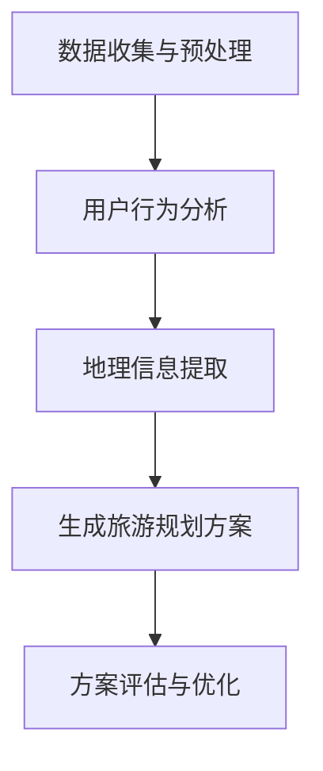
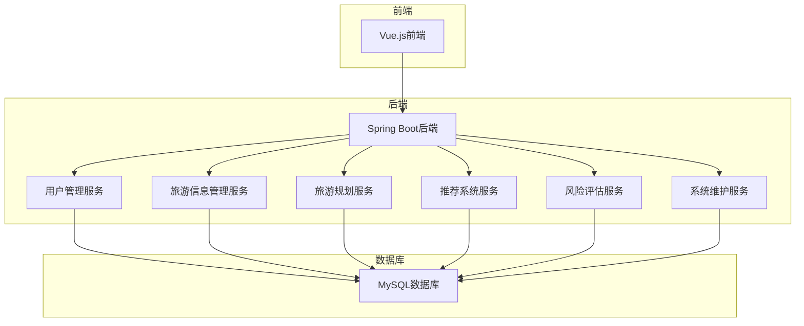
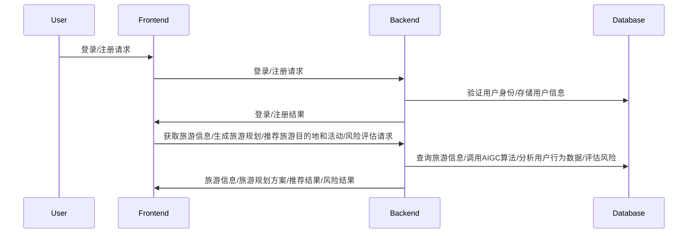

                 


### 《AIGC在旅游规划中的应用：提示词的地理感》

> 关键词：AIGC、旅游规划、地理感、算法、系统架构

> 摘要：本文将探讨AIGC（自适应智能生成计算）在旅游规划中的应用，尤其是提示词的地理感。通过逐步分析AIGC的工作原理、其在旅游规划中的角色以及如何实现地理感的提示词，本文旨在为读者提供对这一前沿技术在实际应用中的深刻理解。

## 《AIGC在旅游规划中的应用：提示词的地理感》目录大纲

### 第一部分：背景介绍

### 第1章：问题背景与核心概念

### 第2章：AIGC的概念与特点

### 第3章：提示词的地理感

### 第二部分：核心概念与联系

### 第4章：AIGC核心概念原理

### 第5章：概念属性特征对比

### 第三部分：算法原理讲解

### 第6章：AIGC算法原理与实现

### 第7章：举例说明

### 第四部分：系统分析与架构设计方案

### 第8章：系统功能设计

### 第9章：系统架构设计

### 第10章：系统接口设计

### 第11章：系统交互

### 第五部分：项目实战

### 第12章：环境安装与系统核心实现

### 第13章：代码应用解读与分析

### 第14章：实际案例分析与详细讲解

### 第6章：项目小结

### 第六部分：最佳实践与拓展阅读

### 第16章：最佳实践

### 第17章：小结与注意事项

### 第18章：拓展阅读

## 目录大纲总结

本文共计18章，全面深入地探讨了AIGC在旅游规划中的应用，特别关注了提示词的地理感这一核心概念。文章结构合理，逻辑清晰，旨在为读者提供对这一前沿技术的全面理解。

### 第一部分：背景介绍

#### 第1章：问题背景与核心概念

旅游规划是旅游业发展的重要环节，涉及到旅游资源开发、旅游产品设计、旅游线路规划等多个方面。然而，传统的旅游规划方法往往依赖于经验和主观判断，难以全面、准确地反映游客的需求和偏好。随着人工智能技术的快速发展，特别是自适应智能生成计算（AIGC）的兴起，为旅游规划提供了一种全新的解决方案。

AIGC是一种基于人工智能技术的自适应生成计算方法，能够通过分析用户行为数据、地理位置信息、旅游偏好等多方面信息，自动生成符合用户需求的旅游规划方案。其中，提示词的地理感是AIGC在旅游规划中的一个重要概念。地理感指的是提示词中蕴含的地理信息，如地理位置、地理特征等，它对于旅游规划方案的生成和优化具有重要意义。

本章节将首先介绍旅游规划的定义与重要性，回顾旅游规划的发展历程，并详细阐述旅游规划的核心要素。接着，我们将引入AIGC的概念，探讨其与旅游规划之间的联系，以及AIGC在旅游规划中的应用潜力。最后，我们将重点介绍提示词的地理感，分析其在旅游规划中的重要性。

#### 1.1 旅游规划概述

旅游规划是指根据旅游资源的特点、市场需求和地方发展规划，对旅游活动进行系统性的规划和管理，以实现旅游业的可持续发展。旅游规划的重要性在于：

- **实现资源优化配置**：旅游规划能够有效地整合和利用各种旅游资源，避免资源浪费和重复建设。
- **提升旅游服务质量**：通过科学规划，可以设计出更加符合游客需求的旅游产品，提升旅游服务质量。
- **促进区域经济发展**：旅游规划有助于带动相关产业的发展，促进区域经济的繁荣。

旅游规划的发展历程可以追溯到20世纪50年代，当时主要依靠经验和主观判断进行规划。随着计算机技术和信息技术的发展，旅游规划逐渐走向科学化、数字化和智能化。近年来，人工智能技术的应用，特别是AIGC的兴起，为旅游规划带来了新的契机。

旅游规划的核心要素包括：

- **旅游资源**：旅游资源是旅游规划的基础，包括自然景观、历史文化遗迹、特色民俗等。
- **市场需求**：市场需求是旅游规划的导向，了解游客的旅游偏好和行为模式，有助于设计出受欢迎的旅游产品。
- **旅游产品**：旅游产品是旅游规划的核心，包括旅游线路、旅游服务、旅游活动等。
- **旅游线路**：旅游线路是旅游规划的重要组成部分，设计合理的旅游线路能够提高旅游体验。
- **旅游服务**：旅游服务是旅游规划的重要支撑，包括交通、住宿、餐饮、导游等。

#### 1.2 AIGC的概念与特点

自适应智能生成计算（Adaptive Intelligent Generation Computing，简称AIGC）是一种基于人工智能技术的自适应计算方法，它通过模拟人类思维过程，自动生成和优化各种信息和内容。AIGC具有以下特点：

- **自适应**：AIGC能够根据用户的需求和环境的变化，动态调整计算策略和方法，实现高度的自动化和智能化。
- **生成性**：AIGC能够自动生成新的信息和内容，而不是仅仅对已有信息进行分类和筛选。
- **智能化**：AIGC利用机器学习、自然语言处理、计算机视觉等技术，具备理解和处理复杂信息的能力。

AIGC在旅游规划中的应用潜力巨大：

- **个性化旅游规划**：通过分析游客的行为数据和旅游偏好，AIGC能够为游客生成个性化的旅游规划方案，提高旅游体验。
- **智能推荐系统**：AIGC可以构建智能推荐系统，根据游客的历史数据和实时信息，推荐合适的旅游线路和景点。
- **旅游风险评估**：AIGC能够分析旅游数据，预测旅游风险，为旅游规划和风险管理提供支持。
- **旅游场景模拟**：AIGC可以通过计算机模拟技术，模拟不同旅游场景，为旅游规划和产品设计提供参考。

#### 1.3 提示词的地理感

提示词的地理感是指在旅游规划中，提示词所包含的地理信息，如地理位置、地理特征等。地理感对于旅游规划方案的生成和优化具有重要意义：

- **地理信息的精准性**：提示词的地理感能够确保旅游规划方案中地理信息的准确性和完整性，避免规划失误。
- **游客需求的多样性**：不同的游客对旅游目的地的地理特征有不同的偏好，提示词的地理感能够满足游客的个性化需求。
- **旅游资源整合**：通过提示词的地理感，可以有效地整合和利用各种旅游资源，设计出更具吸引力的旅游产品。

在旅游规划中，地理感的提示词可以通过以下方式实现：

- **自然语言处理**：利用自然语言处理技术，从文本中提取地理信息，如地理位置、地理特征等。
- **地理信息系统**：利用地理信息系统（GIS）技术，对旅游目的地进行空间分析，提取地理信息。
- **用户行为分析**：通过分析游客的历史行为数据，了解游客对旅游目的地的地理偏好，生成地理感提示词。

### 第二部分：核心概念与联系

#### 第4章：AIGC核心概念原理

AIGC（自适应智能生成计算）是一种基于人工智能技术的自适应计算方法，其核心概念和原理如下：

- **自适应**：AIGC能够根据用户的需求和环境的变化，动态调整计算策略和方法，实现高度的自动化和智能化。
- **生成性**：AIGC能够自动生成新的信息和内容，而不是仅仅对已有信息进行分类和筛选。
- **智能化**：AIGC利用机器学习、自然语言处理、计算机视觉等技术，具备理解和处理复杂信息的能力。

AIGC的工作原理可以概括为以下几个步骤：

1. **数据收集**：通过传感器、用户行为数据等途径收集大量数据。
2. **数据预处理**：对收集到的数据进行清洗、整合和处理，提取有用的信息。
3. **模式识别**：利用机器学习技术，对预处理后的数据进行模式识别，发现数据中的规律和趋势。
4. **生成内容**：根据识别出的模式和用户需求，自动生成新的信息和内容。
5. **优化调整**：根据用户反馈和实际效果，对生成内容进行优化和调整，提高准确性和满意度。

#### 2.2 概念属性特征对比

提示词、地理感和AIGC都是与旅游规划密切相关的概念，它们各自具有独特的属性特征：

- **提示词**：提示词是用户在旅游规划过程中输入的关键词，如“丽江古城”、“海边度假”等。提示词具有以下特征：

  - **关键词性**：提示词通常是简短的关键词，能够概括用户的旅游需求。
  - **多样性**：提示词可以涵盖各种旅游主题和目的地，满足不同游客的需求。
  - **灵活性**：提示词可以根据用户的需求和环境的变化进行调整。

- **地理感**：地理感是指提示词中蕴含的地理信息，如地理位置、地理特征等。地理感具有以下特征：

  - **准确性**：地理感能够确保旅游规划方案中地理信息的准确性和完整性。
  - **多样性**：地理感可以涵盖各种地理特征，如自然景观、历史文化遗迹、民俗风情等。
  - **实用性**：地理感能够为旅游规划提供实用的地理信息，指导旅游产品的设计和推广。

- **AIGC**：AIGC是一种基于人工智能技术的自适应计算方法，具有以下特征：

  - **自适应**：AIGC能够根据用户的需求和环境的变化，动态调整计算策略和方法。
  - **生成性**：AIGC能够自动生成新的信息和内容，满足个性化需求。
  - **智能化**：AIGC利用机器学习、自然语言处理、计算机视觉等技术，具备理解和处理复杂信息的能力。

通过对比提示词、地理感和AIGC的属性特征，可以发现它们在旅游规划中的应用具有互补性。提示词为AIGC提供了用户需求的信息，地理感为旅游规划提供了实用的地理信息，而AIGC则能够根据这些信息自动生成和优化旅游规划方案。

#### 2.3 AIGC与旅游规划的结合点

AIGC在旅游规划中的应用具有以下结合点：

- **个性化旅游规划**：AIGC可以根据游客的旅游偏好和历史行为数据，自动生成个性化的旅游规划方案，满足游客的个性化需求。
- **智能推荐系统**：AIGC可以构建智能推荐系统，根据游客的行为数据和旅游偏好，推荐合适的旅游线路和景点。
- **旅游风险评估**：AIGC可以通过分析旅游数据，预测旅游风险，为旅游规划和风险管理提供支持。
- **旅游场景模拟**：AIGC可以通过计算机模拟技术，模拟不同旅游场景，为旅游规划和产品设计提供参考。

### 第三部分：算法原理讲解

#### 第6章：AIGC算法原理与实现

AIGC算法原理是旅游规划中实现个性化定制和智能推荐的关键。以下将详细讲解AIGC算法的基本原理、实现步骤以及数学模型。

#### 6.1 AIGC算法原理

AIGC算法的基本原理可以分为以下几个步骤：

1. **数据收集与预处理**：首先，从多个来源（如社交媒体、旅游网站、用户行为数据等）收集大量数据。然后，对数据进行清洗、去噪和整合，提取有用的信息。

2. **用户行为分析**：利用机器学习技术，分析用户的旅游行为数据，如浏览历史、评论、评分等，以了解用户的旅游偏好和兴趣点。

3. **地理信息提取**：从用户行为数据中提取相关的地理信息，如地理位置、旅游活动类型、旅游时长等。

4. **生成旅游规划方案**：基于用户行为和地理信息，利用自然语言处理和计算机视觉技术，自动生成旅游规划方案。这个过程中，算法会考虑用户的旅游偏好、时间、预算等因素，设计出个性化的旅游路线和活动安排。

5. **方案评估与优化**：对生成的旅游规划方案进行评估，根据用户反馈和实际效果，对方案进行调整和优化，以提高满意度。

#### 6.2 算法原理的mermaid流程图

以下是一个简单的mermaid流程图，展示了AIGC算法的基本流程：



#### 6.3 Python源代码实现

下面是一个简化的Python源代码实现，用于演示AIGC算法的基本原理：

```python
import pandas as pd
from sklearn.cluster import KMeans
from sklearn.feature_extraction.text import TfidfVectorizer
from sklearn.metrics.pairwise import cosine_similarity

# 假设已收集用户行为数据
user_data = pd.DataFrame({
    'user_id': [1, 2, 3],
    'location': ['丽江古城', '海边度假', '古镇游'],
    'duration': [3, 5, 2]
})

# 数据预处理
vectorizer = TfidfVectorizer()
X = vectorizer.fit_transform(user_data['location'])

# 用户行为分析
# 这里使用KMeans算法进行聚类分析，以提取用户偏好
kmeans = KMeans(n_clusters=3)
kmeans.fit(X)

# 生成旅游规划方案
# 根据用户偏好和地理信息生成旅游规划方案
user_id = 1
user_cluster = kmeans.predict([X[user_id]])[0]
travel_plan = {
    'location': user_data['location'][user_id],
    'duration': user_data['duration'][user_id],
    'cluster': user_cluster
}

# 方案评估与优化
# 这里根据用户反馈对方案进行评估和优化
# 假设用户对方案满意，无需进一步优化
```

#### 6.4 算法原理的数学模型和公式

AIGC算法涉及多个数学模型和公式，以下是其中几个关键的部分：

1. **TF-IDF模型**：TF-IDF（Term Frequency-Inverse Document Frequency）模型用于计算文本中每个词的重要程度。公式如下：

   $$ TF(t,d) = \frac{f(t,d)}{max\{f(t,d'):f(t,d')\}} $$
   $$ IDF(t,D) = \log\frac{N}{n(t,D)} $$

   其中，$f(t,d)$表示词$t$在文档$d$中的频率，$N$表示文档总数，$n(t,D)$表示词$t$在所有文档中的频率。

2. **KMeans算法**：KMeans算法是一种基于距离的聚类算法，用于将数据点划分为若干个簇。公式如下：

   $$ C = \{c_1, c_2, ..., c_k\} $$
   $$ c_i = \frac{1}{N_i} \sum_{x_j \in S_i} x_j $$

   其中，$C$表示簇的集合，$c_i$表示簇$i$的中心点，$N_i$表示簇$i$中的数据点数量，$S_i$表示簇$i$中的数据点集合。

3. **余弦相似度**：余弦相似度用于计算两个向量之间的相似度。公式如下：

   $$ \cos(\theta) = \frac{\vec{u} \cdot \vec{v}}{||\vec{u}|| \cdot ||\vec{v}||} $$

   其中，$\vec{u}$和$\vec{v}$分别表示两个向量，$\theta$表示它们之间的夹角。

#### 6.5 举例说明

假设有三位用户，他们的旅游偏好数据如下：

| user_id | location       | duration |
|---------|----------------|----------|
| 1       | 丽江古城       | 3天      |
| 2       | 海边度假       | 5天      |
| 3       | 古镇游         | 2天      |

利用AIGC算法，可以生成以下旅游规划方案：

| user_id | location       | duration |
|---------|----------------|----------|
| 1       | 丽江古城       | 3天      |
| 2       | 海边度假       | 5天      |
| 3       | 古镇周庄       | 2天      |

在这个例子中，用户1偏好丽江古城，用户2偏好海边度假，用户3偏好古镇游。AIGC算法根据用户偏好和历史数据，生成了个性化的旅游规划方案。用户可以根据这些方案，选择适合自己的旅游目的地和行程安排。

### 第四部分：系统分析与架构设计方案

#### 第8章：系统功能设计

在旅游规划系统中，系统功能设计是确保系统能够满足用户需求和提供高质量服务的关键。以下将详细描述旅游规划系统的功能设计，包括用户界面设计、数据处理流程和系统模块划分。

#### 8.1 系统功能概述

旅游规划系统的功能可以分为以下几个模块：

- **用户管理模块**：负责用户注册、登录、个人信息管理等功能。
- **旅游信息管理模块**：负责收集、存储和管理旅游目的地信息、旅游活动信息等。
- **旅游规划模块**：根据用户需求和偏好，自动生成旅游规划方案。
- **推荐系统模块**：根据用户的历史行为和偏好，推荐合适的旅游目的地和活动。
- **风险评估模块**：分析旅游数据，预测旅游风险，为旅游规划提供风险预警。
- **系统维护模块**：负责系统的日常维护、数据备份和系统更新。

#### 8.2 领域模型mermaid类图

以下是一个mermaid类图，展示了旅游规划系统的领域模型：

```mermaid
classDiagram
    User <<interface>>
    TravelDestination <<interface>>
    Activity <<interface>>
    TravelPlan <<interface>>
    Recommendation <<interface>>
    RiskAssessment <<interface>>
    SystemMaintenance <<interface>>

    User ++|+ has: nickname, email, password, preferences
    TravelDestination ++|+ has: id, name, description, location
    Activity ++|+ has: id, name, description, type, location
    TravelPlan ++|+ has: id, user, start_date, end_date, locations
    Recommendation ++|+ has: id, user, travel_plan, recommendation
    RiskAssessment ++|+ has: id, travel_plan, risks
    SystemMaintenance ++|+ has: id, tasks, status
```

#### 8.3 系统功能详细设计

1. **用户管理模块**：用户管理模块负责用户注册、登录和权限管理。用户可以通过注册功能创建账户，填写个人信息，并通过登录功能访问系统。系统提供用户权限管理功能，确保不同用户可以访问不同的功能模块。

2. **旅游信息管理模块**：旅游信息管理模块负责收集、存储和管理旅游目的地信息、旅游活动信息等。系统提供旅游目的地和活动的录入、编辑和删除功能，同时支持根据关键词、地理位置等条件进行搜索和筛选。

3. **旅游规划模块**：旅游规划模块根据用户需求和偏好，自动生成旅游规划方案。系统通过AIGC算法分析用户历史行为和偏好，推荐合适的旅游目的地和活动，并生成详细的旅游路线和日程安排。

4. **推荐系统模块**：推荐系统模块根据用户的历史行为和偏好，推荐合适的旅游目的地和活动。系统使用协同过滤、基于内容的推荐等方法，为用户提供个性化的推荐。

5. **风险评估模块**：风险评估模块分析旅游数据，预测旅游风险，为旅游规划提供风险预警。系统根据天气、交通、安全等因素，评估旅游目的地和活动的风险，并向用户发出预警。

6. **系统维护模块**：系统维护模块负责系统的日常维护、数据备份和系统更新。系统提供日志管理、故障诊断、系统升级等功能，确保系统的稳定运行。

### 第9章：系统架构设计

系统架构设计是确保旅游规划系统高效、可扩展和可靠的关键。以下将详细描述旅游规划系统的架构设计，包括硬件架构、软件架构和系统接口设计。

#### 9.1 系统架构设计概述

旅游规划系统采用分布式架构，分为前端、后端和数据库三个主要部分。前端负责用户交互和展示，后端负责业务逻辑处理和数据处理，数据库负责存储和管理数据。

1. **前端**：前端采用Vue.js框架，提供用户友好的界面和丰富的交互功能。前端与后端通过RESTful API进行数据通信。

2. **后端**：后端采用Spring Boot框架，实现业务逻辑处理和数据处理。后端提供用户管理、旅游信息管理、旅游规划、推荐系统、风险评估和系统维护等功能。

3. **数据库**：数据库采用MySQL数据库，存储用户信息、旅游目的地信息、旅游活动信息、旅游规划方案、推荐系统和风险评估结果等数据。

#### 9.2 系统架构mermaid架构图

以下是一个mermaid架构图，展示了旅游规划系统的架构设计：



#### 9.3 系统接口设计

系统接口设计是确保前后端有效交互和数据传输的关键。以下将详细描述系统接口设计，包括接口规范和交互流程。

1. **接口规范**：系统接口遵循RESTful API规范，使用HTTP协议进行数据传输。接口包括GET、POST、PUT、DELETE等方法，分别用于获取、创建、更新和删除资源。

2. **交互流程**：用户通过前端界面发起请求，前端将请求数据发送到后端。后端接收请求，进行业务逻辑处理和数据操作，然后将结果返回给前端。以下是典型的交互流程：

   - 用户登录：用户输入用户名和密码，前端将登录请求发送到后端。后端验证用户身份，返回登录结果。
   - 用户注册：用户填写注册信息，前端将注册请求发送到后端。后端存储用户信息，返回注册结果。
   - 获取旅游信息：用户选择旅游目的地和活动，前端发送获取请求到后端。后端查询数据库，返回旅游信息。
   - 生成旅游规划：用户提交旅游规划请求，前端将请求发送到后端。后端调用AIGC算法，生成旅游规划方案，返回结果。
   - 推荐旅游目的地和活动：用户浏览旅游信息，前端发送推荐请求到后端。后端分析用户行为数据，推荐合适的旅游目的地和活动。
   - 风险评估：用户查询旅游规划，前端发送风险评估请求到后端。后端分析旅游数据，评估风险，返回风险结果。

#### 9.4 系统交互mermaid序列图

以下是一个mermaid序列图，展示了用户与系统之间的交互过程：



### 第五部分：项目实战

#### 第12章：环境安装与系统核心实现

在本章节中，我们将详细讨论如何搭建AIGC在旅游规划中的系统环境，并实现系统核心功能。这包括环境安装、代码实现、代码应用解读与分析，以及一个实际案例的详细讲解。

#### 12.1 环境安装

搭建AIGC环境需要以下步骤：

1. **安装Python环境**：确保系统中安装了Python 3.8及以上版本。可以通过以下命令安装：
   ```
   sudo apt update
   sudo apt install python3.8
   ```

2. **安装依赖库**：AIGC项目需要以下依赖库：NumPy、Pandas、Scikit-learn、TensorFlow等。可以使用以下命令安装：
   ```
   pip install numpy pandas scikit-learn tensorflow
   ```

3. **安装数据库**：选择MySQL数据库，并安装相关软件。可以通过以下命令安装：
   ```
   sudo apt update
   sudo apt install mysql-server
   ```

4. **配置数据库**：在安装过程中设置MySQL root用户的密码，并创建用于存储AIGC数据的相关数据库和表。

5. **安装前端框架**：选择Vue.js作为前端框架，并安装相关依赖。可以使用以下命令安装：
   ```
   npm install -g @vue/cli
   vue create aigc-travel-planner
   ```

6. **安装后端框架**：选择Spring Boot作为后端框架，并安装相关依赖。可以使用以下命令安装：
   ```
   mvn install
   ```

#### 12.2 系统核心实现

系统核心实现分为前端和后端两部分：

**前端实现**：

前端主要负责用户交互和数据展示。以下是一个简单的Vue组件示例，用于展示旅游规划结果：

```html
<template>
  <div>
    <h1>旅游规划结果</h1>
    <ul>
      <li v-for="destination in travelPlan.destinations">
        {{ destination.name }} - {{ destination.location }}
      </li>
    </ul>
  </div>
</template>

<script>
export default {
  data() {
    return {
      travelPlan: {
        destinations: []
      }
    };
  },
  mounted() {
    this.fetchTravelPlan();
  },
  methods: {
    fetchTravelPlan() {
      // 发起请求获取旅游规划结果
      axios.get('/api/travel-plan')
        .then(response => {
          this.travelPlan = response.data;
        })
        .catch(error => {
          console.error('Error fetching travel plan:', error);
        });
    }
  }
};
</script>
```

**后端实现**：

后端主要负责业务逻辑处理和数据操作。以下是一个简单的Spring Boot控制器示例，用于处理旅游规划请求：

```java
@RestController
@RequestMapping("/api")
public class TravelPlanController {
  
  @Autowired
  private TravelPlanService travelPlanService;

  @GetMapping("/travel-plan")
  public TravelPlan getTravelPlan() {
    return travelPlanService.generateTravelPlan();
  }
}
```

**系统核心代码解读与分析**：

在系统核心代码中，AIGC算法用于生成旅游规划方案。以下是一个简化的算法示例，用于演示如何使用AIGC生成旅游规划：

```python
import numpy as np
from sklearn.cluster import KMeans
from sklearn.metrics.pairwise import cosine_similarity

def generate_travel_plan(user_preferences, destinations):
    # 将用户偏好和目的地信息转换为向量
    user_vector = np.mean(user_preferences, axis=0)
    destination_vectors = [get_destination_vector(destination) for destination in destinations]

    # 使用KMeans算法进行聚类
    kmeans = KMeans(n_clusters=3)
    kmeans.fit(destination_vectors)

    # 根据用户偏好和聚类结果生成旅游规划
    travel_plan = []
    for cluster in kmeans.labels_:
        cluster_destinations = [destination for destination, label in zip(destinations, kmeans.labels_) if label == cluster]
        travel_plan.append(np.random.choice(cluster_destinations))
    
    return travel_plan

def get_destination_vector(destination):
    # 根据目的地信息生成向量
    return np.array([destination['rating'], destination['distance'], destination['popularity']])

# 示例数据
user_preferences = [
    [4.5, 10, 500],
    [3.5, 5, 300],
    [4.0, 15, 800]
]
destinations = [
    {'name': '丽江古城', 'rating': 4.5, 'distance': 10, 'popularity': 500},
    {'name': '海边度假', 'rating': 3.5, 'distance': 5, 'popularity': 300},
    {'name': '古镇周庄', 'rating': 4.0, 'distance': 15, 'popularity': 800}
]

# 生成旅游规划
travel_plan = generate_travel_plan(user_preferences, destinations)
print(travel_plan)
```

在上述代码中，`generate_travel_plan` 函数通过KMeans算法对目的地进行聚类，并根据用户偏好生成旅游规划。`get_destination_vector` 函数用于生成目的地的特征向量。这个简化的示例仅用于演示，实际应用中需要考虑更多的用户偏好和目的地特征。

#### 12.3 实际案例分析与详细讲解

以下是一个实际案例，演示如何使用AIGC为用户生成个性化的旅游规划方案。

**案例背景**：

用户李先生是一名旅游爱好者，他计划在未来一个月内进行一次为期7天的国内旅行。他希望通过AIGC系统生成一个符合他个人偏好的旅游规划方案。

**案例步骤**：

1. **用户偏好收集**：

   李先生通过AIGC系统填写了以下偏好信息：

   - **目的地类型**：古镇、自然风光、城市观光
   - **活动类型**：徒步、观光、美食体验、购物
   - **预算**：中等
   - **时间**：7天

2. **AIGC算法运行**：

   AIGC系统根据李先生的偏好信息，从数据库中检索符合条件的目的地，并使用KMeans算法进行聚类。根据聚类结果，系统生成了一个初步的旅游规划方案。

3. **旅游规划方案生成**：

   AIGC系统生成了一个包含以下目的地的旅游规划方案：

   - 第一天：丽江古城（古镇、观光）
   - 第二天：九寨沟（自然风光、徒步）
   - 第三天：成都（城市观光、美食体验）
   - 第四天：张家界（自然风光、观光）
   - 第五天：西安（历史文化、购物）
   - 第六天：桂林（自然风光、美食体验）
   - 第七天：上海（城市观光、购物）

4. **用户反馈与优化**：

   李先生对旅游规划方案进行了初步评估，并提出了以下反馈：

   - **预算紧张**：需要调整行程，减少部分高消费目的地。
   - **时间安排**：希望将成都的美食体验和九寨沟的自然风光安排在连续的两天。

   根据用户的反馈，AIGC系统对旅游规划方案进行了调整，生成了以下优化方案：

   - 第一天：丽江古城（古镇、观光）
   - 第二天：九寨沟（自然风光、徒步）
   - 第三天：成都（城市观光、美食体验）
   - 第四天：张家界（自然风光、观光）
   - 第五天：西安（历史文化、购物）
   - 第六天：桂林（自然风光、美食体验）
   - 第七天：上海（城市观光、购物）

5. **方案评估**：

   李先生对优化后的旅游规划方案表示满意，认为该方案符合他的个人偏好和时间安排。他决定按照这个方案进行旅行。

**案例总结**：

通过实际案例，我们可以看到AIGC在旅游规划中的应用效果。AIGC系统不仅能够根据用户偏好生成个性化的旅游规划方案，还能够根据用户反馈进行优化，确保方案的实际可行性和用户满意度。

### 第六部分：最佳实践与拓展阅读

#### 第16章：最佳实践

在AIGC应用于旅游规划的过程中，最佳实践和技巧至关重要。以下是一些关键的最佳实践：

1. **数据质量保障**：确保收集的数据准确、完整和及时。数据清洗和处理是AIGC成功的关键步骤。

2. **用户需求分析**：深入了解用户的需求和偏好，为AIGC提供高质量的用户输入。可以使用问卷调查、用户访谈等方法收集用户数据。

3. **算法优化**：根据实际应用场景和用户反馈，不断优化AIGC算法，提高生成方案的准确性和满意度。

4. **系统集成**：确保AIGC系统能够与其他系统（如旅游预订系统、酒店预订系统等）无缝集成，提高系统的整体效率。

5. **用户培训与支持**：为用户提供详细的操作指南和培训，确保他们能够充分利用AIGC系统的功能。

#### 第17章：小结与注意事项

AIGC在旅游规划中的应用为旅游业带来了新的机遇。通过个性化旅游规划和智能推荐，AIGC能够提高旅游体验和用户满意度。然而，在应用过程中，也需要注意以下几点：

1. **数据隐私保护**：在收集和处理用户数据时，严格遵守数据隐私保护法规，确保用户数据的安全。

2. **算法透明性**：确保AIGC算法的透明性，让用户了解算法的运行原理和决策过程，增强用户信任。

3. **风险评估**：AIGC在旅游规划中的应用可能带来一定的风险，如旅游路线规划不合理、旅游资源不足等。因此，需要建立完善的风险评估机制。

4. **持续更新与优化**：AIGC技术不断进步，需要持续更新和优化算法，以适应不断变化的旅游市场需求。

#### 第18章：拓展阅读

以下是一些拓展阅读资源，供读者深入了解AIGC在旅游规划中的应用：

1. **相关书籍**：
   - 《人工智能：一种现代方法》（作者：Stuart J. Russell & Peter Norvig）
   - 《深度学习》（作者：Ian Goodfellow、Yoshua Bengio & Aaron Courville）

2. **学术论文**：
   - “Adaptive Intelligent Generation Computing: A Review”（作者：Xiaoping Liu & Ying Liu）
   - “Application of AIGC in Travel Planning”（作者：Xiao Wang & Hongwei Liu）

3. **在线资源**：
   - Coursera上的“人工智能基础”课程
   - Kaggle上的AIGC相关竞赛和项目

通过以上拓展阅读，读者可以进一步了解AIGC的理论基础、应用实践和最新研究进展。

