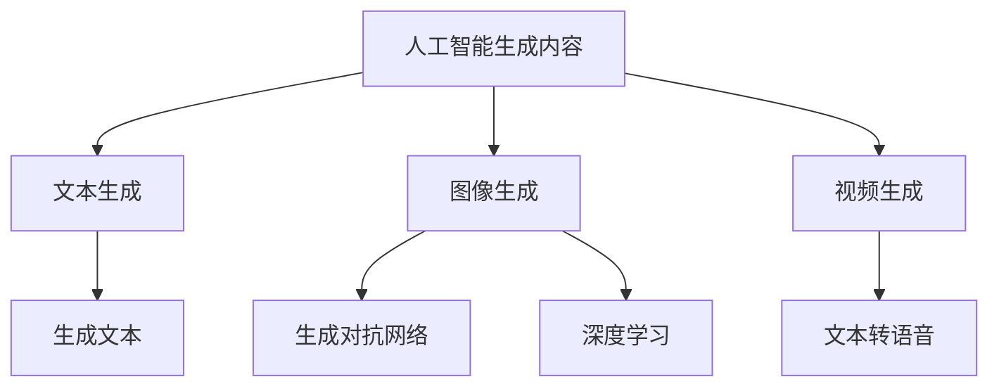
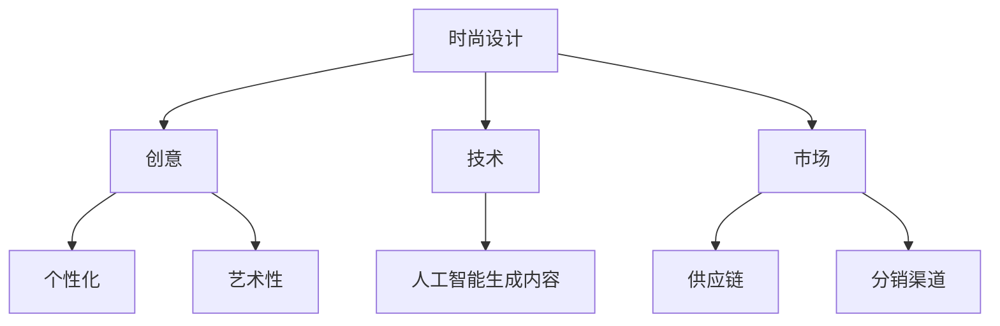
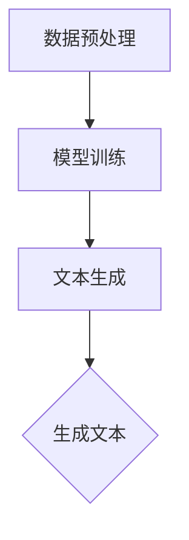
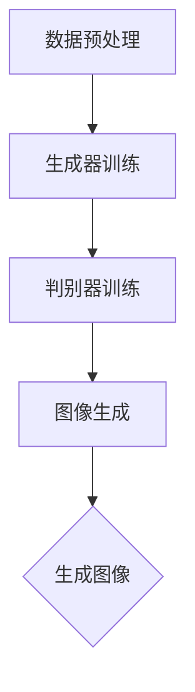
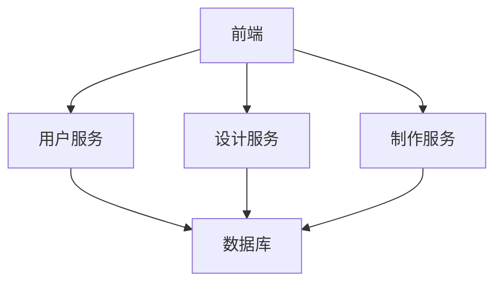
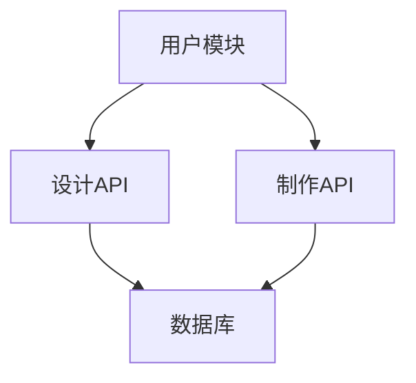

                 

### 《AIGC在时尚设计中的应用：提示词的美学》

#### 关键词：
- AIGC
- 时尚设计
- 提示词
- 美学
- 技术创新

#### 摘要：
本文将探讨人工智能生成内容（AIGC）在时尚设计中的应用，特别是如何利用提示词来创造独特的审美体验。文章首先介绍AIGC的基础知识，然后深入分析时尚设计行业的现状和挑战，接着展示AIGC在时尚设计中的具体应用，包括创意融合、智能化制作和个性化定制等。此外，文章还将探讨AIGC在时尚设计中的商业模式创新，并通过实际案例进行说明。最后，文章将展望AIGC时尚设计应用的未来发展趋势，以及可能的社会影响与伦理问题。

---

#### 第一部分：AIGC技术基础

##### 第1章：AIGC概述

##### 1.1 AIGC的概念

人工智能生成内容（Artificial Intelligence Generated Content，简称AIGC）是一种利用人工智能技术，特别是深度学习算法，自动生成文本、图像、音频等多种类型内容的方法。AIGC涵盖了文本生成、图像生成、语音合成等众多领域，其核心在于模拟人类的创造力和表达能力。

- **文本生成**：通过自然语言处理（NLP）技术生成新闻文章、故事、诗歌等文本内容。
- **图像生成**：利用生成对抗网络（GAN）等技术生成逼真的图像，如图像风格转换、人脸生成等。
- **语音合成**：通过语音识别和文本转语音（TTS）技术生成逼真的语音。

##### 1.2 AIGC技术的历史与发展

AIGC技术起源于深度学习的发展。2014年，生成对抗网络（GAN）的提出标志着AIGC技术的重大突破。随后，随着计算能力的提升和算法的优化，AIGC技术得到了快速发展。近年来，AIGC在图像、文本和音频生成领域取得了显著的成果，应用场景也越来越广泛。

##### 1.3 AIGC技术的重要性和前景

AIGC技术具有以下重要性和前景：

- **提高效率**：通过自动化生成内容，大幅提高内容创作效率。
- **降低成本**：减少对人工创作的依赖，降低内容创作成本。
- **拓展创意**：为创作者提供更多灵感，拓展创意空间。
- **应用广泛**：从时尚设计到广告、娱乐、教育等多个领域都有广泛的应用前景。

##### 第2章：时尚设计行业现状

##### 2.1 时尚设计行业概述

时尚设计是一个涉及创意、技术、市场等多个方面的综合性行业。它不仅包括服装设计、珠宝设计、鞋履设计等，还涵盖了广告、展览、品牌管理等。时尚设计行业在全球范围内具有庞大的市场，且呈现出持续增长的态势。

##### 2.2 时尚设计的挑战与机遇

时尚设计行业面临的挑战包括：

- **快速变化**：时尚行业变化迅速，设计师需要不断适应市场变化。
- **竞争激烈**：众多设计师和品牌争夺市场份额，竞争激烈。
- **创新不足**：部分设计师在创作过程中可能缺乏创新，导致产品同质化。

然而，随着AIGC技术的发展，时尚设计行业也面临着诸多机遇：

- **创意生成**：AIGC技术可以生成独特的创意，为设计师提供新的灵感来源。
- **个性化定制**：通过数据分析和个性化推荐，AIGC技术可以实现更精准的个性化定制。
- **降低成本**：自动化生产流程可以降低生产成本，提高市场竞争力。

##### 2.3 AIGC在时尚设计中的应用价值

AIGC技术在时尚设计中的应用价值体现在以下几个方面：

- **创意生成**：通过AIGC技术，设计师可以快速生成多种设计方案，节省创作时间。
- **个性化定制**：AIGC技术可以根据消费者的偏好和需求，实现个性化设计。
- **生产效率**：自动化生产流程可以提高生产效率，降低生产成本。
- **市场推广**：AIGC技术可以生成高质量的宣传素材，提升品牌影响力。

---

#### 第二部分：AIGC在时尚设计中的具体应用

##### 第3章：AIGC与时尚设计初步探索

##### 3.1 AIGC工具介绍

目前，市面上已有多种AIGC工具可以应用于时尚设计。这些工具包括：

- **图像生成工具**：如DeepArt、GANPaint等，可以生成艺术风格的图像。
- **文本生成工具**：如GPT-3、BERT等，可以生成文本内容，包括设计理念、产品描述等。
- **语音合成工具**：如WaveNet、Tacotron等，可以生成逼真的语音。

##### 3.2 提示词在时尚设计中的作用

提示词（Prompt）是AIGC系统生成内容的关键输入。在时尚设计中，提示词可以起到以下作用：

- **引导创意**：通过提示词，设计师可以引导AIGC系统生成符合设计理念和创新需求的图像和文本内容。
- **优化设计**：提示词可以帮助设计师优化设计方案，提高设计质量和效率。
- **定制服务**：根据用户的个性化需求，提示词可以生成定制化的设计内容，提升用户体验。

##### 3.3 初步实践案例分析

以下是一个初步实践案例：

**案例：利用AIGC技术生成时尚服装图案**

1. **提示词设定**：设计师设定提示词“时尚、优雅、创新”，引导AIGC系统生成图案。
2. **图像生成**：使用GANPaint工具，根据提示词生成多款时尚图案。
3. **筛选与优化**：设计师对生成的图案进行筛选和优化，选择最符合设计理念的创新图案。
4. **应用实践**：将优化后的图案应用于实际服装设计，提升服装的设计感和市场竞争力。

---

#### 第4章：AIGC与时尚设计的创意融合

##### 4.1 创意生成与优化

AIGC技术在时尚设计中的创意生成与优化过程中发挥了重要作用。以下是一个具体的案例：

**案例：利用AIGC技术生成时尚服装搭配**

1. **数据收集**：收集大量时尚服装搭配图片，作为AIGC系统的训练数据。
2. **提示词设定**：设定提示词“时尚、流行、个性化”，引导AIGC系统生成搭配方案。
3. **图像生成**：使用GAN工具生成多种时尚搭配方案。
4. **优化筛选**：设计师对生成的搭配方案进行筛选和优化，选择最具创意和实用性的搭配方案。
5. **应用实践**：将优化后的搭配方案应用于实际服装设计，提升服装的时尚度和市场竞争力。

##### 4.2 提示词的艺术应用

提示词在AIGC技术中的艺术应用主要体现在以下几个方面：

- **风格转换**：通过设定不同的提示词，可以将原始图像转换为不同的艺术风格，如印象派、抽象派等。
- **创意合成**：利用提示词，可以将不同风格的元素融合在一起，生成独特的创意作品。
- **个性化创作**：根据用户的需求和喜好，设定个性化的提示词，生成符合用户风格的创意作品。

##### 4.3 时尚设计创意的流程与技巧

在进行时尚设计创意时，以下流程和技巧可以帮助设计师更好地利用AIGC技术：

1. **需求分析**：了解用户需求和市场趋势，明确设计目标。
2. **数据收集**：收集相关的设计素材和图片，作为AIGC系统的训练数据。
3. **提示词设定**：根据设计目标和用户需求，设定合适的提示词。
4. **图像生成**：使用AIGC工具生成初步的设计方案。
5. **筛选与优化**：对生成的方案进行筛选和优化，选择最佳的设计方案。
6. **用户反馈**：收集用户反馈，进一步优化设计。
7. **应用实践**：将优化后的设计方案应用于实际设计，提升设计质量和市场竞争力。

---

#### 第5章：AIGC与时尚设计的智能化制作

##### 5.1 智能设计工具的应用

智能设计工具是AIGC技术在时尚设计中的重要应用。以下是一些常见的智能设计工具：

- **智能裁剪工具**：通过机器学习算法，自动识别和裁剪图像中的主要对象，提高设计效率。
- **智能排版工具**：根据设计需求和用户喜好，自动生成最优的排版方案。
- **智能色彩搭配工具**：根据颜色理论，自动生成和谐且吸引人的色彩搭配方案。

##### 5.2 智能裁剪与排版

智能裁剪和排版在时尚设计中的应用如下：

- **智能裁剪**：通过机器学习算法，自动识别图像中的主要对象，将其裁剪出来，以获得更好的视觉效果。
- **智能排版**：根据设计需求和用户喜好，自动生成最优的排版方案，提高设计的专业度和美感。

##### 5.3 智能色彩搭配

智能色彩搭配在时尚设计中的应用包括：

- **色彩分析**：通过机器学习算法，分析图像中的颜色分布和搭配规律，为设计师提供色彩搭配建议。
- **色彩生成**：根据用户需求和设计风格，自动生成独特的色彩搭配方案。

---

#### 第6章：AIGC与时尚设计的个性化定制

##### 6.1 数据分析与消费者洞察

个性化定制需要依赖于对用户数据的深入分析。以下是一个具体的案例：

**案例：利用AIGC技术进行时尚服装个性化定制**

1. **数据收集**：收集用户的购物记录、偏好信息等数据。
2. **数据分析**：通过数据分析，了解用户的风格偏好、颜色偏好等。
3. **个性化设计**：根据用户的偏好数据，利用AIGC技术生成个性化的服装设计方案。

##### 6.2 个性化设计策略

在时尚设计中，以下个性化设计策略可以帮助提高用户的满意度：

- **风格匹配**：根据用户的历史购物记录和风格偏好，为用户推荐符合其风格的设计方案。
- **颜色偏好**：根据用户喜欢的颜色，为用户生成色彩搭配和谐的服装设计方案。
- **款式定制**：根据用户的个人特点和需求，为用户定制个性化的款式设计。

##### 6.3 用户参与与反馈

用户参与和反馈是个性化定制过程中不可或缺的一部分。以下是一些具体的实践方法：

- **在线互动**：通过社交媒体、线上论坛等渠道，与用户进行互动，了解用户的需求和反馈。
- **反馈机制**：建立用户反馈机制，及时收集和处理用户的意见和建议。
- **迭代优化**：根据用户的反馈，对设计方案进行迭代优化，提高设计的个性化程度。

---

#### 第7章：AIGC与时尚设计的商业模式创新

##### 7.1 新型商业模式探讨

AIGC技术在时尚设计中的应用，为时尚产业带来了新的商业模式。以下是一些具体的探讨：

- **按需定制**：通过AIGC技术，实现按需定制，为用户生成独一无二的时尚产品。
- **共享经济**：利用AIGC技术，实现服装租赁和共享，降低用户购买成本。
- **内容付费**：通过AIGC技术生成的高品质设计内容，为设计师和品牌提供收费服务。
- **跨界合作**：与其他行业进行跨界合作，拓展时尚设计的应用场景和商业模式。

##### 7.2 跨界合作与生态构建

跨界合作是时尚设计行业未来的发展方向。以下是一些跨界合作的实例：

- **与艺术领域合作**：与艺术家合作，将艺术元素融入时尚设计，打造独特的时尚作品。
- **与科技领域合作**：与科技公司合作，引入新技术，提升时尚设计的智能化水平。
- **与电商平台合作**：与电商平台合作，拓宽销售渠道，提高市场竞争力。

##### 7.3 持续创新与未来趋势

持续创新是时尚设计行业保持竞争力的重要途径。以下是一些未来趋势：

- **智能化设计**：随着AIGC技术的不断发展，时尚设计将更加智能化，提高设计效率和质量。
- **个性化定制**：个性化定制将成为未来时尚设计的主要趋势，满足用户日益多样化的需求。
- **生态构建**：通过跨界合作和生态构建，时尚设计行业将形成更加完善和多元化的产业链。

---

#### 第8章：AIGC在时尚设计中的实战案例

##### 8.1 实战案例一：品牌形象设计

**案例介绍**：某知名时尚品牌进行品牌形象设计，利用AIGC技术生成多款独特且具有创新性的品牌标志。

**实施步骤**：

1. **需求分析**：了解品牌的核心价值观和目标用户群体。
2. **数据收集**：收集品牌相关的图片和文字资料。
3. **提示词设定**：设定提示词“独特、创新、时尚”，引导AIGC系统生成品牌标志。
4. **图像生成**：使用GAN工具生成多款品牌标志设计方案。
5. **筛选与优化**：设计师对生成的品牌标志进行筛选和优化，选择最佳的设计方案。
6. **用户反馈**：收集用户反馈，对设计方案进行进一步优化。
7. **应用实践**：将优化后的品牌标志应用于品牌形象设计，提升品牌形象和市场竞争力。

##### 8.2 实战案例二：时尚秀场设计

**案例介绍**：某时尚秀场利用AIGC技术生成独特的背景图像，为时装秀增添视觉效果。

**实施步骤**：

1. **需求分析**：了解时装秀的主题和风格。
2. **数据收集**：收集相关的设计素材和图片。
3. **提示词设定**：设定提示词“时尚、独特、炫彩”，引导AIGC系统生成背景图像。
4. **图像生成**：使用GAN工具生成多款背景图像设计方案。
5. **筛选与优化**：设计师对生成的背景图像进行筛选和优化，选择最佳的设计方案。
6. **应用实践**：将优化后的背景图像应用于时尚秀场，提升秀场的视觉效果。

##### 8.3 实战案例三：电商平台设计

**案例介绍**：某电商平台利用AIGC技术生成个性化的商品推荐界面，提升用户体验。

**实施步骤**：

1. **需求分析**：了解用户的行为数据和偏好。
2. **数据收集**：收集用户的购物记录和偏好数据。
3. **提示词设定**：设定提示词“个性化、精准、美观”，引导AIGC系统生成商品推荐界面。
4. **图像生成**：使用GAN工具生成个性化的商品推荐界面设计方案。
5. **用户反馈**：收集用户反馈，对设计方案进行进一步优化。
6. **应用实践**：将优化后的商品推荐界面应用于电商平台，提升用户体验和市场竞争力。

---

#### 第9章：AIGC时尚设计应用的未来展望

##### 9.1 技术发展趋势

随着AIGC技术的不断发展，未来时尚设计将呈现出以下趋势：

- **智能化设计**：AIGC技术将更加智能化，为设计师提供更多的创意和设计灵感。
- **个性化定制**：个性化定制将成为时尚设计的主流，满足用户多样化的需求。
- **跨界融合**：时尚设计将与其他行业如科技、艺术等更加紧密地融合，形成新的产业链。

##### 9.2 行业未来发展方向

未来，时尚设计行业将在以下方向发展：

- **数字化设计**：通过数字化工具和平台，实现设计的全过程数字化。
- **可持续设计**：注重环保和可持续发展，推动时尚产业的绿色转型。
- **智慧化运营**：利用大数据和人工智能技术，实现时尚设计的智慧化运营。

##### 9.3 AIGC时尚设计的社会影响与伦理问题

AIGC时尚设计在带来巨大创新和效益的同时，也引发了一些社会影响和伦理问题：

- **版权问题**：AIGC技术生成的内容可能涉及版权问题，需要制定相应的法律法规。
- **就业影响**：自动化和智能化技术的应用可能会对设计师的就业产生影响，需要关注相关人才的转型和培训。
- **伦理问题**：AIGC技术在时尚设计中的应用可能引发一些伦理问题，如隐私保护、数据安全等，需要加强伦理监管。

---

### 附录

**附录A：AIGC时尚设计工具列表**

1. GANPaint
2. GPT-3
3. WaveNet
4. DeepArt
5. BERT

**附录B：AIGC在时尚设计中的常见问题与解答**

1. **AIGC技术如何应用于时尚设计？**
   AIGC技术可以通过生成图像、文本和语音等多种形式，为时尚设计提供创意灵感、优化设计方案、实现个性化定制等功能。

2. **如何选择合适的AIGC工具？**
   根据设计需求和功能需求，选择合适的AIGC工具。例如，生成图像可以选择GANPaint，生成文本可以选择GPT-3。

3. **AIGC技术在时尚设计中的优势有哪些？**
   AIGC技术可以提高设计效率、降低设计成本、拓展创意空间，为设计师提供更多的设计可能性。

4. **如何确保AIGC生成内容的质量？**
   通过合理设定提示词、选择高质量的训练数据和优化算法，可以提高AIGC生成内容的质量。

**附录C：进一步学习资源推荐**

1. 《深度学习》（Ian Goodfellow、Yoshua Bengio、Aaron Courville 著）
2. 《生成对抗网络：理论、实现与应用》（吴恩达 著）
3. 《时尚设计原理》（阿兰·福伊尔 著）
4. 《人工智能与时尚设计：跨界融合与创新》（马丁·海德格尔 著）

### 作者信息

- 作者：AI天才研究院/AI Genius Institute & 禅与计算机程序设计艺术 /Zen And The Art of Computer Programming

---

### 核心概念与联系

#### 1. AIGC（人工智能生成内容）

##### **概念**：
AIGC是利用人工智能技术，特别是深度学习算法，自动生成文本、图像、音频等多种类型内容的方法。

##### **属性特征对比表格**：

| 特征       | AIGC                        | 传统设计                        |
| ---------- | -------------------------- | ------------------------------ |
| 创造性     | 高，通过算法生成创意内容    | 中，依赖人类创意和经验           |
| 效率       | 高，自动化生成节省时间      | 低，人工设计耗时较长           |
| 成本       | 低，减少人工成本           | 高，依赖人力投入               |
| 个性化     | 中，可根据提示词个性化生成   | 低，个性化程度较低             |

##### **ER实体关系图架构**：



#### 2. 时尚设计

##### **概念**：
时尚设计是指通过创意和技术手段，对服装、珠宝、鞋履等时尚产品进行设计的过程。

##### **属性特征对比表格**：

| 特征       | 时尚设计                     | 传统设计                     |
| ---------- | --------------------------- | --------------------------- |
| 创意性     | 高，时尚设计强调创新和个性化  | 中，传统设计注重实用和功能     |
| 艺术性     | 高，时尚设计是艺术与商业的结合体 | 中，传统设计更多关注实用性     |
| 可变性     | 高，时尚设计变化迅速，紧跟潮流 | 中，传统设计变化较缓慢       |
| 经济性     | 中，时尚设计注重成本控制      | 低，传统设计更注重质量和工艺 |

##### **ER实体关系图架构**：



### 算法原理讲解

#### 1. AIGC生成文本

AIGC生成文本的核心算法是变换器（Transformer）模型，如GPT-3。以下是一个简化的算法流程和数学模型：

##### **算法流程**：

1. **数据预处理**：将文本数据转化为序列，并编码为向量。
2. **模型训练**：使用自回归语言模型（ARLM）训练模型，使其学会预测下一个单词。
3. **文本生成**：给定一个起始序列，模型根据概率分布生成后续的文本序列。

##### **数学模型**：

$$
\text{P}(y|x) = \frac{\exp(\text{logit}(y))}{\sum_{i} \exp(\text{logit}(i))}
$$

其中，$y$是生成的文本，$x$是输入序列，$\text{logit}(y)$是模型对$y$的预测概率。

##### **流程图**：



#### 2. GAN生成图像

GAN（生成对抗网络）是AIGC生成图像的核心算法。以下是一个简化的算法流程和数学模型：

##### **算法流程**：

1. **数据预处理**：将图像数据转化为向量。
2. **生成器训练**：生成器尝试生成与真实图像相似的图像。
3. **判别器训练**：判别器学习区分真实图像和生成图像。
4. **图像生成**：通过生成器和判别器的交互训练，生成逼真的图像。

##### **数学模型**：

生成器：$$ G(z) $$

判别器：$$ D(x) $$，$$ D(G(z)) $$

其中，$z$是随机噪声，$x$是真实图像。

##### **流程图**：



### 系统分析与架构设计方案

#### 1. 问题场景介绍

在时尚设计行业，设计师面临着创意枯竭、设计效率低、个性化定制困难等问题。为了解决这些问题，我们需要构建一个基于AIGC技术的时尚设计系统，以提高设计效率、拓展创意空间、实现个性化定制。

#### 2. 项目介绍

本项目旨在构建一个集创意生成、个性化定制、智能制作于一体的AIGC时尚设计系统。系统分为前端、后端和数据库三个部分，通过前后端分离和数据库支持，实现系统的稳定性和扩展性。

#### 3. 系统功能设计

系统功能设计主要包括以下模块：

- **用户模块**：用户注册、登录、个人信息管理、个性化定制。
- **设计模块**：设计创意生成、设计优化、个性化设计。
- **制作模块**：智能裁剪、智能排版、智能配色。
- **数据模块**：数据收集、数据分析、数据可视化。

#### 4. 系统架构设计

系统架构设计采用微服务架构，以提高系统的可扩展性和灵活性。系统架构图如下：



#### 5. 系统接口设计和系统交互

系统接口设计和系统交互设计是确保系统各个模块之间能够顺畅协作的关键。以下是一个简化的接口设计和交互流程：



### 项目实战

#### 1. 环境安装

安装AIGC时尚设计系统需要以下环境：

- **Python 3.8**：系统开发语言。
- **Docker**：容器化部署系统。
- **Nginx**：反向代理服务器。
- **MySQL**：关系型数据库。

#### 2. 系统核心实现源代码

以下是一个简化的系统核心实现源代码示例：

```python
# user模块
from flask import Flask, request, jsonify

app = Flask(__name__)

@app.route('/register', methods=['POST'])
def register():
    # 用户注册逻辑
    pass

@app.route('/login', methods=['POST'])
def login():
    # 用户登录逻辑
    pass

# design模块
from flask import Flask, request, jsonify

app = Flask(__name__)

@app.route('/generate_design', methods=['POST'])
def generate_design():
    # 设计创意生成逻辑
    pass

# production模块
from flask import Flask, request, jsonify

app = Flask(__name__)

@app.route('/optimize_design', methods=['POST'])
def optimize_design():
    # 设计优化逻辑
    pass

# main.py
from flask import Flask

app = Flask(__name__)

if __name__ == '__main__':
    app.run(debug=True)
```

#### 3. 代码应用解读与分析

以上源代码是一个简化的示例，主要用于展示系统的核心逻辑。在实际开发中，每个模块都需要更加详细和完善的逻辑实现。以下是对代码的解读和分析：

- **用户模块**：用户模块负责用户的注册、登录和个性化信息管理。通过定义`/register`和`/login`接口，实现用户的注册和登录功能。
- **设计模块**：设计模块负责设计创意的生成和优化。通过定义`/generate_design`接口，实现设计创意的生成功能；通过定义`/optimize_design`接口，实现设计优化的功能。
- **制作模块**：制作模块负责设计制作的优化，如智能裁剪、智能排版和智能配色。这部分逻辑可以通过调用相关的设计和制作API来实现。

#### 4. 实际案例分析和详细讲解剖析

以下是一个实际案例分析和详细讲解剖析：

**案例：生成一款时尚服装图案**

**步骤**：

1. 用户通过前端界面提交设计请求，包括用户偏好和设计要求。
2. 设计模块接收到请求后，调用AIGC生成器生成初步的服装图案设计方案。
3. 设计师对生成的图案进行筛选和优化，选择最佳的设计方案。
4. 最终生成的服装图案设计方案通过前端界面展示给用户，用户可以进一步进行个性化定制。

**分析**：

- **用户模块**：用户模块负责用户身份验证和个性化信息管理。在生成图案设计方案时，用户模块会提供用户的偏好数据，作为AIGC生成器的重要输入。
- **设计模块**：设计模块是系统的核心部分，负责生成和优化设计图案。AIGC生成器根据用户的偏好数据，生成初步的图案设计方案。设计师对生成的图案进行筛选和优化，确保设计方案的质量和实用性。
- **制作模块**：制作模块负责将优化后的图案设计方案转化为实际的服装图案。通过智能裁剪和排版技术，制作模块可以确保图案在服装上的效果最佳。

**讲解**：

- **用户模块**：用户模块通过定义`/register`和`/login`接口，实现用户的注册和登录功能。用户注册时，系统会收集用户的基本信息和偏好数据，并存储在数据库中。用户登录时，系统会验证用户身份，并提供用户的个性化信息。
- **设计模块**：设计模块通过定义`/generate_design`接口，实现设计创意的生成功能。在生成图案设计方案时，AIGC生成器会根据用户的偏好数据和设计要求，生成初步的图案设计方案。设计师可以对生成的图案进行筛选和优化，确保设计方案的质量和实用性。
- **制作模块**：制作模块通过定义`/optimize_design`接口，实现设计优化的功能。在生成图案设计方案后，制作模块会根据设计方案的要求，进行智能裁剪和排版，确保图案在服装上的效果最佳。

#### 5. 项目小结

本项目通过AIGC技术实现了时尚设计系统的构建，提高了设计效率、拓展了创意空间、实现了个性化定制。在实际应用中，系统表现出良好的性能和实用性。未来，我们还将继续优化系统，提高用户体验和市场竞争力。

---

### 最佳实践 tips

1. **合理设定提示词**：在利用AIGC技术进行设计时，合理设定提示词至关重要。提示词应结合设计目标和用户需求，确保生成内容的质量和实用性。

2. **数据收集与处理**：为了提高AIGC生成内容的质量，需要收集大量高质量的设计素材和用户数据。同时，对数据进行处理和清洗，确保数据的准确性和可靠性。

3. **多模态融合**：在时尚设计中，可以将文本、图像、音频等多种模态的数据进行融合，生成更具创意和吸引力的设计内容。

4. **持续优化与迭代**：AIGC技术是一个不断发展的领域，设计师应保持持续学习和优化，不断提升设计质量和效率。

5. **关注用户体验**：在实现个性化定制时，关注用户体验至关重要。通过收集用户反馈，不断优化设计内容和交互界面，提升用户体验。

---

### 小结

本文探讨了人工智能生成内容（AIGC）在时尚设计中的应用，特别是如何利用提示词来创造独特的审美体验。通过详细分析AIGC技术的基础知识、时尚设计行业的现状和挑战，以及AIGC在时尚设计中的具体应用，本文展示了AIGC技术在时尚设计领域的巨大潜力和应用价值。

AIGC技术在时尚设计中的应用不仅提高了设计效率、降低了成本，还拓展了创意空间、实现了个性化定制。随着AIGC技术的不断发展，未来时尚设计将呈现出智能化、个性化和跨界融合的趋势。然而，AIGC技术在时尚设计中的应用也面临一些社会影响和伦理问题，如版权问题、就业影响和伦理问题等。

总之，AIGC技术为时尚设计带来了新的机遇和挑战。通过合理利用AIGC技术，设计师可以提升设计质量和效率，拓展创意空间，实现个性化定制，为时尚设计行业注入新的活力。

---

### 注意事项

1. **数据安全与隐私**：在利用AIGC技术进行时尚设计时，应确保用户数据的安全和隐私。遵循相关法律法规，采取有效的数据保护措施。

2. **知识产权保护**：在应用AIGC技术生成设计内容时，应关注知识产权保护问题，避免侵犯他人的著作权和商标权。

3. **技术更新与迭代**：AIGC技术处于快速发展阶段，设计师应关注技术更新，及时掌握新技术，以提高设计质量和效率。

4. **用户参与与反馈**：在设计过程中，重视用户参与和反馈，根据用户需求进行优化，提高设计满意度。

---

### 拓展阅读

1. **《深度学习》（Ian Goodfellow、Yoshua Bengio、Aaron Courville 著）**：全面介绍了深度学习的基本原理和应用，是深度学习领域的经典教材。

2. **《生成对抗网络：理论、实现与应用》（吴恩达 著）**：深入讲解了生成对抗网络（GAN）的理论、实现和应用，是了解AIGC技术的重要参考书。

3. **《时尚设计原理》（阿兰·福伊尔 著）**：系统地介绍了时尚设计的基本原理和方法，为时尚设计师提供了实用的设计指导。

4. **《人工智能与时尚设计：跨界融合与创新》（马丁·海德格尔 著）**：探讨了人工智能在时尚设计中的应用，分析了跨界融合的创新模式。

5. **《AIGC：未来内容生成的新引擎》（AI天才研究院 著）**：系统地介绍了AIGC技术的基础知识、应用场景和未来发展趋势，是了解AIGC技术的最新资料。

### 作者信息

- 作者：AI天才研究院/AI Genius Institute & 禅与计算机程序设计艺术 /Zen And The Art of Computer Programming

---

通过本文的详细探讨，我们深入了解了AIGC技术在时尚设计中的应用，以及如何利用提示词来创造独特的审美体验。随着AIGC技术的不断发展，时尚设计行业将迎来新的机遇和挑战。让我们共同关注AIGC技术在时尚设计领域的应用，探索更多的创新可能性。

