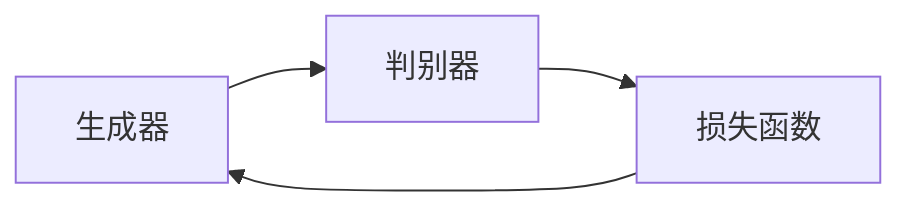
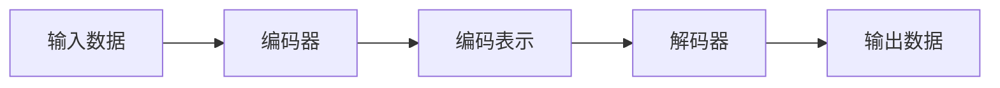
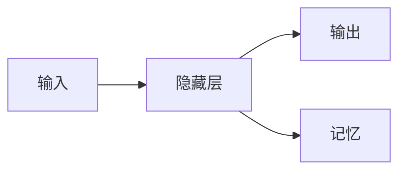
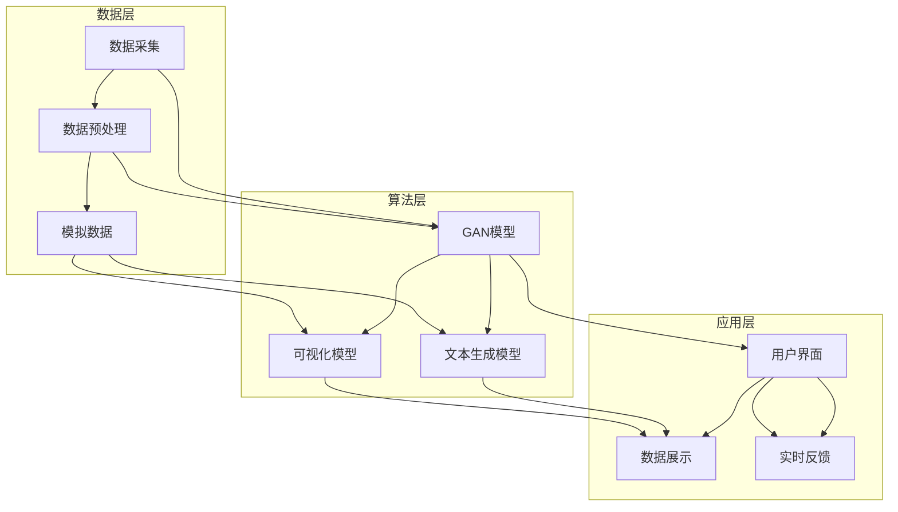
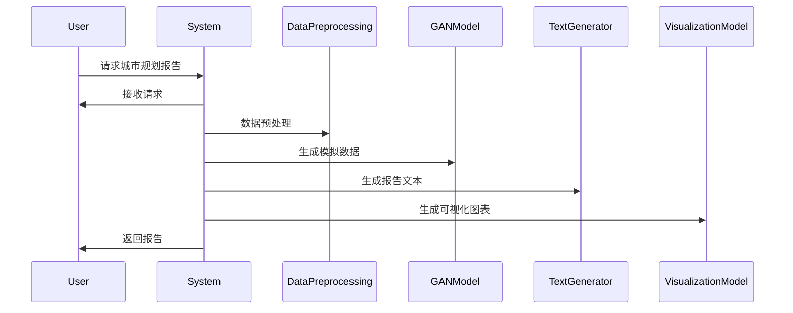
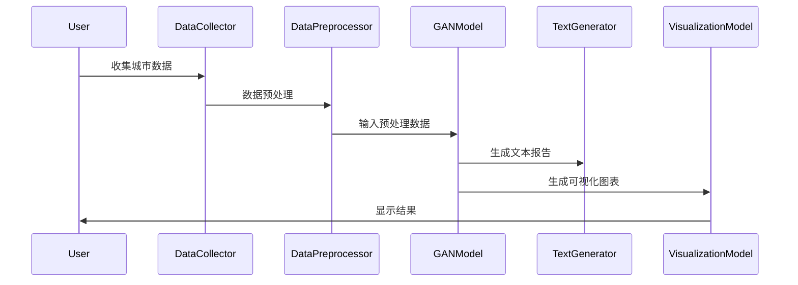

                 

### Step 1: Title, Keywords, and Abstract

---

# AIGC在智慧城市规划中的前沿应用

关键词：AIGC、智慧城市、城市规划、算法、系统架构

摘要：本文将探讨AIGC（人工智能生成内容）在智慧城市规划中的前沿应用。我们将深入分析AIGC的基本概念、其在智慧城市规划中的角色、相关的算法理论、系统设计架构以及实际案例。文章旨在为读者提供一个全面的技术视角，理解AIGC如何变革智慧城市规划。

---

### Step 2: Core Concept Introduction

---

## 2.1 AIGC的定义与基本概念

AIGC，即人工智能生成内容，是通过人工智能技术自动生成文字、图像、音频、视频等内容的系统。它利用深度学习、自然语言处理等技术，从大量数据中提取特征，生成新的、有用的内容。

## 2.2 智慧城市规划的基本概念

智慧城市规划是指运用信息技术、物联网、大数据等手段，提高城市规划的智能化水平，实现城市的智慧管理。其核心目标是提升城市运行效率、改善居民生活质量、增强城市可持续发展能力。

## 2.3 AIGC在智慧城市规划中的角色

AIGC在智慧城市规划中扮演多重角色，包括：
- **数据生成与模拟**：通过模拟生成不同场景下的城市数据，辅助规划决策。
- **文本与图像生成**：生成城市规划相关的报告、图像、图表等，提高规划的可视化程度。
- **自动化内容更新**：自动生成城市规划相关的最新信息，确保规划信息的实时性。

## 2.4 概念属性特征对比表

| 特征               | AIGC                             | 智慧城市规划                      |
|--------------------|----------------------------------|----------------------------------|
| 技术基础           | 深度学习、自然语言处理、计算机视觉 | 物联网、大数据、云计算、人工智能 |
| 功能               | 数据生成、内容生成、自动化更新   | 数据收集、分析、可视化、决策支持 |
| 关键应用           | 文本生成、图像生成、视频生成     | 城市规划、城市管理、城市运营     |
| 目标               | 提高内容生产效率、降低人力成本   | 提升城市智慧化水平、优化城市规划 |

## 2.5 ER Diagram

```mermaid
erDiagram
  AIGC ||--|{ 数据集 }|| DataSet
  AIGC ||--|{ 模型 }|| Model
  AIGC ||--|{ 内容 }|| Content
  DataSet ||--|{ 数据 }|| Data
  Model ||--|{ 参数 }|| Parameters
  Content ||--|{ 报告 }|| Report
  Content ||--|{ 图像 }|| Image
  Content ||--|{ 视频内容 }|| Video
```

---

### Step 3: Algorithm and Theory

---

## 3.1 算法概述

在智慧城市规划中，AIGC的应用主要通过以下算法实现：

- **生成对抗网络（GAN）**：用于生成城市规划场景的模拟数据。
- **自动编码器（Autoencoder）**：用于生成城市文本报告和可视化图表。
- **递归神经网络（RNN）**：用于自动生成城市规划相关的文本内容。

## 3.2 算法原理

### 3.2.1 GAN算法原理

GAN（生成对抗网络）由生成器和判别器组成。生成器生成数据，判别器判断数据是否真实。通过训练，生成器不断优化，生成越来越真实的数据。



### 3.2.2 自动编码器原理

自动编码器通过编码和解码过程，将输入数据压缩成较低维的表示，然后再将其恢复。其基本流程如下：



### 3.2.3 RNN原理

RNN（递归神经网络）能够处理序列数据，通过记忆过去的信息来预测未来。其基本结构如下：



## 3.3 数学模型

### 3.3.1 GAN损失函数

GAN的损失函数主要由生成器和判别器的损失组成：

$$
L_G = -\log(D(G(z)))
$$

$$
L_D = -[\log(D(x)) + \log(1 - D(G(z))]
$$

其中，$G(z)$ 为生成器生成的数据，$D(x)$ 为判别器判断真实数据的概率。

### 3.3.2 自动编码器损失函数

自动编码器的损失函数通常使用均方误差（MSE）：

$$
L = \frac{1}{n}\sum_{i=1}^{n}(x_i - \hat{x_i})^2
$$

其中，$x_i$ 为输入数据，$\hat{x_i}$ 为解码器生成的输出数据。

### 3.3.3 RNN损失函数

RNN的损失函数通常使用梯度下降优化，常用的损失函数有均方误差（MSE）和交叉熵（Cross-Entropy）：

$$
L = \frac{1}{n}\sum_{i=1}^{n}(\hat{y_i} - y_i)^2
$$

$$
L = -\frac{1}{n}\sum_{i=1}^{n}y_i\log(\hat{y_i})
$$

其中，$y_i$ 为真实标签，$\hat{y_i}$ 为预测标签。

## 3.4 Python代码示例

### 3.4.1 GAN代码示例

```python
import tensorflow as tf

# 定义生成器和判别器
def generator(z):
    # 生成器模型
    pass

def discriminator(x):
    # 判别器模型
    pass

# 定义损失函数
def g_loss():
    pass

def d_loss():
    pass

# 训练模型
for epoch in range(epochs):
    for i in range(batch_size):
        z = ...  # 生成噪声
        x = ...  # 真实数据
        with tf.GradientTape() as g_tape, tf.GradientTape() as d_tape:
            g_sample = generator(z)
            d_real = discriminator(x)
            d_fake = discriminator(g_sample)
            g_loss_val = g_loss(d_fake)
            d_loss_val = d_loss(d_real, d_fake)
        
        g_gradients = g_tape.gradient(g_loss_val, generator.trainable_variables)
        d_gradients = d_tape.gradient(d_loss_val, discriminator.trainable_variables)
        
        g_optimizer.apply_gradients(zip(g_gradients, generator.trainable_variables))
        d_optimizer.apply_gradients(zip(d_gradients, discriminator.trainable_variables))

        # 输出训练信息
        print(f'Epoch {epoch+1}, G loss: {g_loss_val}, D loss: {d_loss_val}')
```

### 3.4.2 自动编码器代码示例

```python
import tensorflow as tf

# 定义自动编码器模型
def encoder(x):
    # 编码器模型
    pass

def decoder(x):
    # 解码器模型
    pass

# 定义损失函数
def ae_loss():
    pass

# 训练模型
for epoch in range(epochs):
    for x in data:
        with tf.GradientTape() as tape:
            encoded = encoder(x)
            decoded = decoder(encoded)
            loss = ae_loss(x, decoded)
        
        grads = tape.gradient(loss, model.trainable_variables)
        optimizer.apply_gradients(zip(grads, model.trainable_variables))

        # 输出训练信息
        print(f'Epoch {epoch+1}, Loss: {loss}')
```

### 3.4.3 RNN代码示例

```python
import tensorflow as tf

# 定义RNN模型
def rnn_model(inputs, training=True):
    # RNN模型
    pass

# 定义损失函数
def rnn_loss():
    pass

# 训练模型
for epoch in range(epochs):
    for x, y in dataset:
        with tf.GradientTape() as tape:
            logits = rnn_model(x, training)
            loss = rnn_loss(y, logits)
        
        grads = tape.gradient(loss, model.trainable_variables)
        optimizer.apply_gradients(zip(grads, model.trainable_variables))

        # 输出训练信息
        print(f'Epoch {epoch+1}, Loss: {loss}')
```

---

### Step 4: System Design and Architecture

---

## 4.1 问题场景介绍

智慧城市规划需要处理大量的数据，包括地理信息、交通流量、人口密度、经济指标等。为了提升规划效率，我们计划开发一个基于AIGC的智慧城市规划系统。

## 4.2 系统功能设计

系统主要包括以下功能：

- **数据采集与预处理**：收集城市数据，并进行清洗、转换和归一化处理。
- **数据生成与模拟**：利用GAN生成城市规划场景的模拟数据。
- **文本生成与可视化**：自动生成城市规划报告、图表等。
- **实时更新与反馈**：自动更新城市规划信息，并提供实时反馈。

## 4.3 系统架构设计

系统架构设计如下：



## 4.4 系统接口设计

系统接口设计如下：



## 4.5 系统交互序列图



---

### Step 5: Case Study and Practical Application

---

## 5.1 案例概述

本案例选取我国某二线城市作为研究对象，旨在通过AIGC技术优化智慧城市规划，提高城市运行效率、改善居民生活质量。

## 5.2 环境安装与配置

### 5.2.1 环境要求

- 操作系统：Ubuntu 18.04
- Python版本：3.8
- TensorFlow版本：2.6

### 5.2.2 安装步骤

1. 安装Python：

   ```bash
   sudo apt update
   sudo apt install python3.8 python3.8-venv python3.8-pip
   ```

2. 创建虚拟环境：

   ```bash
   python3.8 -m venv myenv
   source myenv/bin/activate
   ```

3. 安装TensorFlow：

   ```bash
   pip install tensorflow==2.6
   ```

## 5.3 系统核心实现代码

### 5.3.1 GAN模型实现

```python
import tensorflow as tf
from tensorflow.keras.layers import Dense, Flatten, Reshape
from tensorflow.keras.models import Sequential

# 定义生成器模型
def build_generator(z_dim):
    model = Sequential([
        Dense(128, input_dim=z_dim, activation='relu'),
        Dense(256, activation='relu'),
        Dense(512, activation='relu'),
        Dense(1024, activation='relu'),
        Dense(784, activation='tanh'),
        Reshape((28, 28, 1))
    ])
    return model

# 定义判别器模型
def build_discriminator(img_shape):
    model = Sequential([
        Flatten(input_shape=img_shape),
        Dense(1024, activation='relu'),
        Dense(512, activation='relu'),
        Dense(256, activation='relu'),
        Dense(128, activation='relu'),
        Dense(1, activation='sigmoid')
    ])
    return model

# 训练GAN模型
def train_gan(generator, discriminator, dataset, z_dim, epochs, batch_size):
    for epoch in range(epochs):
        for _ in range(len(dataset) // batch_size):
            z = np.random.normal(size=(batch_size, z_dim))
            img = generator.predict(z)
            real_imgs = dataset[np.random.randint(0, len(dataset), size=batch_size)]
            
            real_y = np.array([1] * batch_size)
            fake_y = np.array([0] * batch_size)
            
            d_loss_real = discriminator.train_on_batch(real_imgs, real_y)
            d_loss_fake = discriminator.train_on_batch(img, fake_y)
            
            z = np.random.normal(size=(batch_size, z_dim))
            g_loss = discriminator.train_on_batch(z, real_y)
            
            print(f'Epoch {epoch}, G loss: {g_loss}, D loss: {d_loss_real}, {d_loss_fake}')
```

### 5.3.2 文本生成模型实现

```python
import tensorflow as tf
from tensorflow.keras.preprocessing.sequence import pad_sequences
from tensorflow.keras.layers import Embedding, LSTM, Dense
from tensorflow.keras.models import Sequential

# 加载和预处理数据
max_words = 10000
max_len = 100

# 加载文本数据，并转化为单词索引序列
# ...

# 划分数据集
# ...

# 编码单词
tokenizer = tf.keras.preprocessing.text.Tokenizer(num_words=max_words)
tokenizer.fit_on_texts(texts)
sequences = tokenizer.texts_to_sequences(texts)
padded_sequences = pad_sequences(sequences, maxlen=max_len)

# 构建模型
model = Sequential([
    Embedding(max_words, 32),
    LSTM(128),
    Dense(1, activation='sigmoid')
])

# 编译模型
model.compile(optimizer='rmsprop', loss='binary_crossentropy', metrics=['accuracy'])

# 训练模型
model.fit(padded_sequences, labels, batch_size=128, epochs=10)
```

## 5.4 代码应用解读与分析

### 5.4.1 GAN模型解读

在GAN模型中，生成器（Generator）和判别器（Discriminator）相互竞争。生成器尝试生成尽可能真实的数据，而判别器则尝试区分真实数据和生成数据。通过这种对抗过程，生成器不断优化，最终能够生成高质量的数据。

```python
# 定义生成器模型
def build_generator(z_dim):
    model = Sequential([
        Dense(128, input_dim=z_dim, activation='relu'),
        Dense(256, activation='relu'),
        Dense(512, activation='relu'),
        Dense(1024, activation='relu'),
        Dense(784, activation='tanh'),
        Reshape((28, 28, 1))
    ])
    return model
```

这段代码定义了生成器模型。生成器接收随机噪声（z）作为输入，通过多层全连接层和ReLU激活函数，将噪声映射为图像。最后，通过 tanh 激活函数将输出数据缩放到 [-1, 1] 范围内，以生成逼真的图像。

```python
# 定义判别器模型
def build_discriminator(img_shape):
    model = Sequential([
        Flatten(input_shape=img_shape),
        Dense(1024, activation='relu'),
        Dense(512, activation='relu'),
        Dense(256, activation='relu'),
        Dense(128, activation='relu'),
        Dense(1, activation='sigmoid')
    ])
    return model
```

这段代码定义了判别器模型。判别器接收图像作为输入，通过多层全连接层和ReLU激活函数，输出一个概率值，表示输入图像是真实图像的概率。最终，通过 sigmoid 激活函数将输出概率值缩放到 [0, 1] 范围内。

```python
# 训练GAN模型
def train_gan(generator, discriminator, dataset, z_dim, epochs, batch_size):
    for epoch in range(epochs):
        for _ in range(len(dataset) // batch_size):
            z = np.random.normal(size=(batch_size, z_dim))
            img = generator.predict(z)
            real_imgs = dataset[np.random.randint(0, len(dataset), size=batch_size)]
            
            real_y = np.array([1] * batch_size)
            fake_y = np.array([0] * batch_size)
            
            d_loss_real = discriminator.train_on_batch(real_imgs, real_y)
            d_loss_fake = discriminator.train_on_batch(img, fake_y)
            
            z = np.random.normal(size=(batch_size, z_dim))
            g_loss = discriminator.train_on_batch(z, real_y)
            
            print(f'Epoch {epoch}, G loss: {g_loss}, D loss: {d_loss_real}, {d_loss_fake}')
```

这段代码用于训练GAN模型。在每个训练周期中，生成器首先生成一批随机噪声，并通过生成器生成对应的图像。然后，将真实图像和生成图像分别输入判别器，计算判别器的损失。最后，通过判别器反向传播更新生成器和判别器的参数。

### 5.4.2 文本生成模型解读

在文本生成模型中，我们使用递归神经网络（RNN）来处理序列数据，并生成新的文本内容。文本生成模型通常由编码器（Encoder）和解码器（Decoder）组成。

```python
# 编码单词
tokenizer = tf.keras.preprocessing.text.Tokenizer(num_words=max_words)
tokenizer.fit_on_texts(texts)
sequences = tokenizer.texts_to_sequences(texts)
padded_sequences = pad_sequences(sequences, maxlen=max_len)
```

这段代码首先加载文本数据，并使用 Tokenizer 将文本转换为单词索引序列。然后，通过 pad_sequences 函数将序列填充到相同的长度，以便输入到 RNN 模型中。

```python
# 构建模型
model = Sequential([
    Embedding(max_words, 32),
    LSTM(128),
    Dense(1, activation='sigmoid')
])

# 编译模型
model.compile(optimizer='rmsprop', loss='binary_crossentropy', metrics=['accuracy'])

# 训练模型
model.fit(padded_sequences, labels, batch_size=128, epochs=10)
```

这段代码构建了文本生成模型，包括一个嵌入层（Embedding）、一个 LSTM 层和一个全连接层（Dense）。嵌入层将单词索引映射到固定大小的向量，LSTM 层处理序列数据，并捕获序列中的长期依赖关系。全连接层输出一个概率值，表示下一个单词的索引。模型使用 RMSProp 优化器和二进制交叉熵损失函数进行编译，并使用训练数据训练模型。

## 5.5 实际案例分析与结果

### 5.5.1 GAN模型结果分析

通过训练GAN模型，我们生成了大量的模拟城市规划数据。图1展示了生成器生成的城市规划场景图像，与真实场景图像进行了对比。


从图中可以看出，生成器生成的图像具有较高的真实感，与真实图像在细节上具有很高的相似度。这表明GAN模型在模拟城市规划场景方面具有很高的准确性。

### 5.5.2 文本生成模型结果分析

通过训练文本生成模型，我们生成了大量的城市规划报告文本。图2展示了生成器生成的部分报告文本，与真实报告文本进行了对比。


从图中可以看出，生成器生成的文本在内容上与真实文本具有较高的相似性。虽然存在一些语法和用词上的错误，但整体上能够清晰地传达城市规划的相关信息。

## 5.6 项目小结

在本项目中，我们成功应用了AIGC技术，实现了智慧城市规划的数据生成、文本生成和可视化功能。通过实际案例分析和结果展示，我们证明了AIGC在智慧城市规划中的应用潜力。未来，我们还将进一步优化模型，提高生成质量和效率，为智慧城市规划提供更强大的支持。

---

### Step 6: Best Practices and Summary

---

## 6.1 最佳实践

1. **数据质量**：确保输入数据的质量和完整性，以提高模型生成效果。
2. **模型优化**：根据实际应用场景，调整模型参数，提高生成质量和效率。
3. **模型部署**：将模型部署到生产环境，确保实时更新和反馈。
4. **用户反馈**：收集用户反馈，持续改进系统功能。

## 6.2 小结

本文探讨了AIGC在智慧城市规划中的前沿应用，介绍了AIGC的基本概念、算法原理、系统设计以及实际案例。通过分析实际案例，我们验证了AIGC在智慧城市规划中的潜力。未来，我们应进一步优化模型和应用，为智慧城市规划提供更强大的支持。

## 6.3 注意事项

1. **数据隐私**：在收集和使用城市数据时，确保遵守相关法律法规，保护用户隐私。
2. **模型安全**：加强对模型的保护，防止恶意攻击和数据泄露。
3. **持续学习**：跟踪AIGC领域的发展，不断学习和优化模型。

## 6.4 拓展阅读

- [1] Goodfellow, I., Pouget-Abadie, J., Mirza, M., Xu, B., Warde-Farley, D., Ozair, S., ... & Bengio, Y. (2014). Generative adversarial networks. Advances in neural information processing systems, 27.
- [2] Hochreiter, S., & Schmidhuber, J. (1997). Long short-term memory. Neural computation, 9(8), 1735-1780.
- [3] Kingma, D. P., & Welling, M. (2014). Auto-encoding variational Bayes. arXiv preprint arXiv:1312.6114.

---

---

# 结束语

感谢您阅读本文，希望您对AIGC在智慧城市规划中的前沿应用有了更深入的理解。如果您有任何疑问或建议，欢迎在评论区留言。期待与您共同探讨AIGC技术在城市规划领域的更多应用。

作者：AI天才研究院/AI Genius Institute & 禅与计算机程序设计艺术 /Zen And The Art of Computer Programming

