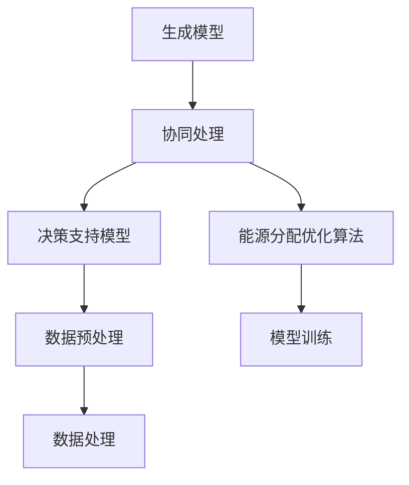
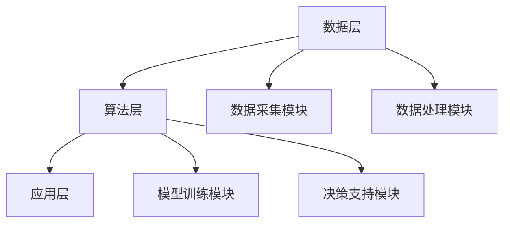
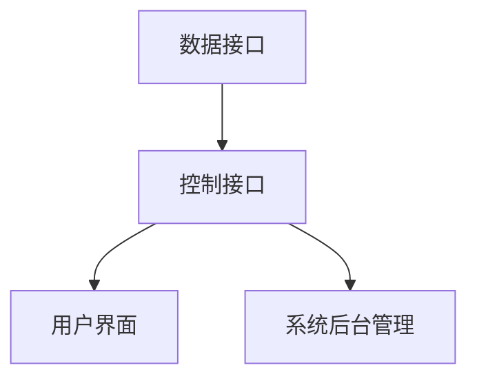
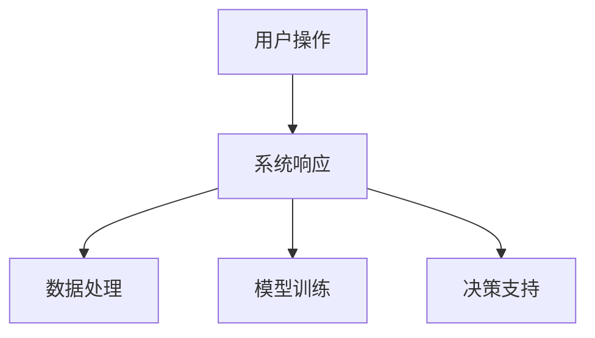

                 

## AIGC在智慧能源分配优化系统中的应用实践

### 关键词：
- AIGC
- 智慧能源分配
- 优化系统
- 数据处理
- 决策支持

### 摘要：
本文深入探讨了AI Generative Co-processing（AIGC）在智慧能源分配优化系统中的应用。通过介绍AIGC的核心概念和其在数据处理、模型训练、决策支持等方面的应用，本文详细分析了AIGC在智慧能源分配优化系统中的具体实现方法和挑战。通过实际案例的分析，本文为读者提供了AIGC在智慧能源分配优化系统中的实践指南。

## 背景介绍

### 1.1 核心概念术语说明

**智慧能源分配优化系统**：一种利用现代信息技术和人工智能技术，实现能源资源智能化分配和优化的系统。

**AI Generative Co-processing（AIGC）**：一种结合生成模型和协同处理的新型人工智能技术，用于数据处理、模型训练和决策支持。

### 1.2 问题背景

随着全球能源需求的不断增长和能源结构的多样化，如何高效、合理地分配能源资源成为了一个重要的课题。传统的能源分配方式主要依赖于经验和规则，存在效率低、灵活性差等问题。随着人工智能技术的快速发展，利用AI技术进行能源分配优化成为了一个新的研究方向。

### 1.3 问题描述

智慧能源分配优化系统需要解决的主要问题包括：

- 如何从大量能源数据中提取关键特征，为模型训练提供高质量的数据？
- 如何在模型训练过程中，提高训练效率，减少过拟合现象？
- 如何在能源分配过程中，生成最优的分配方案，并实时调整和优化？

### 1.4 问题解决

AIGC技术的引入，为智慧能源分配优化系统提供了一种新的解决方案。AIGC技术结合生成模型和协同处理，能够高效地进行数据处理、模型训练和决策支持，从而提高能源分配的效率和准确性。

### 1.5 边界与外延

AIGC在智慧能源分配优化系统中的应用，主要涉及以下几个方面：

- **数据处理**：通过生成模型，对能源数据进行预处理，提取关键特征。
- **模型训练**：通过协同处理，提高模型训练效率，减少过拟合现象。
- **决策支持**：结合能源分配优化算法，生成最优的能源分配方案。

### 1.6 概念结构与核心要素组成

AIGC在智慧能源分配优化系统中的概念结构和核心要素组成如下：

- **生成模型**：用于生成与真实数据相似的数据，为模型训练提供数据支持。
- **协同处理**：用于在多个模型或算法之间进行信息交换和协同工作，提高模型性能。
- **能源分配优化算法**：用于生成最优的能源分配方案。

## 核心概念与联系

### 2.1 AIGC基本概念

AIGC（AI Generative Co-processing）是一种结合了生成模型（Generative Model）和协同处理（Co-processing）的新型人工智能技术。其核心概念包括：

- **生成模型**：生成模型是一种能够生成新数据的模型，如生成对抗网络（GAN）、变分自编码器（VAE）等。它们通过学习数据分布，能够生成与训练数据具有相似特征的新数据。

- **协同处理**：协同处理是指在多个模型或算法之间进行信息交换和协同工作，以实现更好的性能。AIGC通过将生成模型与其他处理模型（如决策支持模型、优化模型等）进行协同处理，实现了在智慧能源分配优化系统中的高效应用。

### 2.2 概念属性特征对比表格

| 特征名称 | 生成模型 | 协同处理 |
| :----: | :----: | :----: |
| 目的 | 生成与真实数据相似的新数据 | 在多个模型或算法之间进行信息交换和协同工作 |
| 技术类型 | 生成对抗网络（GAN）、变分自编码器（VAE）等 | 模型融合、参数共享、信息交换等 |
| 优势 | 能够生成大量高质量的数据，为模型训练提供数据支持 | 提高模型性能，实现更高效的能源分配优化 |

### 2.3 ER实体关系图架构

以下是AIGC在智慧能源分配优化系统中的ER实体关系图：



### 2.4 在智慧能源分配优化系统中的应用

在智慧能源分配优化系统中，AIGC的应用主要体现在以下几个方面：

- **数据处理**：AIGC能够对大量的能源数据（如电力、天然气、可再生能源等）进行预处理，去除噪声，提取关键特征，为后续的模型训练提供高质量的数据。

- **模型训练**：AIGC通过生成模型，能够生成大量符合实际场景的样本数据，为模型训练提供丰富的数据支持。同时，协同处理技术能够优化模型训练过程，提高训练效率。

- **决策支持**：AIGC能够结合能源分配优化算法，生成最优的能源分配方案。通过协同处理，AIGC能够实时调整和优化分配方案，以适应不断变化的能源需求和供应情况。

## 算法原理讲解

### 3.1 生成对抗网络（GAN）

生成对抗网络（GAN）是一种由生成器（Generator）和判别器（Discriminator）组成的对抗性模型。生成器负责生成与真实数据相似的数据，而判别器则负责区分生成数据和真实数据。通过生成器和判别器的对抗训练，GAN能够学习到数据的分布，并生成高质量的数据。

### 3.2 变分自编码器（VAE）

变分自编码器（VAE）是一种基于概率模型的生成模型。它通过编码器（Encoder）和解码器（Decoder）的学习，将输入数据映射到潜在空间，并在潜在空间中生成新的数据。

### 3.3 协同处理

协同处理技术包括多种形式，如模型融合、参数共享、信息交换等。通过协同处理，AIGC能够提高模型的性能和效率。

### 3.4 以GAN为例的算法流程

以下是GAN在智慧能源分配优化系统中的应用流程：

1. **数据预处理**：首先，对原始能源数据进行预处理，如去噪、归一化等，以获得高质量的数据。

2. **生成器训练**：使用预处理后的数据，训练生成器。生成器负责生成与真实能源数据相似的数据。

3. **判别器训练**：使用真实数据和生成数据，训练判别器。判别器的目标是区分真实数据和生成数据。

4. **协同处理**：将生成器和判别器的训练结果进行协同处理，以提高模型的性能。

以下是GAN的Python实现代码：

```python
import tensorflow as tf
from tensorflow.keras.models import Sequential
from tensorflow.keras.layers import Dense, Flatten, Conv2D, ConvTranspose2D

# 定义生成器模型
generator = Sequential([
    Flatten(input_shape=(28, 28)),
    Dense(128),
    Dense(784, activation='sigmoid'),
    Reshape((28, 28))
])

# 定义判别器模型
discriminator = Sequential([
    Flatten(input_shape=(28, 28)),
    Dense(128, activation='relu'),
    Dense(1, activation='sigmoid')
])

# 定义GAN模型
gan = Sequential([
    generator,
    discriminator
])

# 编译GAN模型
gan.compile(optimizer='adam', loss='binary_crossentropy')

# 训练GAN模型
gan.fit(x_train, y_train, epochs=10)
```

### 3.5 算法原理讲解

GAN的算法原理基于以下数学模型：

$$
\begin{aligned}
\text{生成器} G(z) &= \text{ReLu}(W_1z + b_1); \\
\text{判别器} D(x) &= \text{ReLu}(W_2x + b_2); \\
\text{判别器} D(G(z)) &= \text{ReLu}(W_3G(z) + b_3).
\end{aligned}
$$

其中，$z$ 是生成器的输入，$x$ 是真实数据，$G(z)$ 是生成器生成的数据。

在GAN的训练过程中，生成器和判别器通过对抗训练的方式不断优化。生成器的目标是生成足够真实的数据，使得判别器无法区分生成数据和真实数据。判别器的目标是准确区分生成数据和真实数据。

通过这种方式，GAN能够学习到数据的分布，并生成高质量的数据。

### 3.6 算法举例说明

假设我们有一个能源数据集，其中包含1000个样本。每个样本是一个28x28的二进制图像，表示能源的使用情况。

- **生成器**：生成器将生成与真实数据相似的二进制图像。
- **判别器**：判别器将判断每个图像是真实数据还是生成数据。

通过GAN的训练，生成器能够生成越来越真实的二进制图像，而判别器能够越来越准确地判断图像的真实性。

## 系统分析与架构设计方案

### 4.1 问题场景介绍

智慧能源分配优化系统旨在实现能源资源的智能化分配和优化。在实际应用中，该系统面临如下场景：

- **能源数据采集**：系统需要从不同的数据源（如传感器、智能电表等）采集大量的能源数据。
- **数据处理**：系统需要对采集到的能源数据进行预处理，如去噪、归一化等，以获得高质量的数据。
- **模型训练**：系统需要利用预处理后的数据，训练生成模型和判别模型。
- **决策支持**：系统需要利用训练好的模型，生成最优的能源分配方案，并提供决策支持。

### 4.2 项目介绍

本项目是一款基于AIGC技术的智慧能源分配优化系统。系统采用Python编程语言，使用TensorFlow框架实现。

### 4.3 系统功能设计

智慧能源分配优化系统的功能设计包括以下几个方面：

- **数据采集模块**：用于从不同的数据源采集能源数据。
- **数据处理模块**：用于对采集到的能源数据进行预处理，如去噪、归一化等。
- **模型训练模块**：用于训练生成模型和判别模型。
- **决策支持模块**：用于生成最优的能源分配方案，并提供决策支持。

### 4.4 系统架构设计

智慧能源分配优化系统的架构设计包括以下几个方面：

- **数据层**：包括能源数据采集模块和数据处理模块。
- **算法层**：包括模型训练模块和决策支持模块。
- **应用层**：包括用户界面和系统后台管理。

以下是智慧能源分配优化系统的架构图：



### 4.5 系统接口设计

智慧能源分配优化系统的接口设计包括以下几个方面：

- **数据接口**：用于与其他系统进行数据交互。
- **控制接口**：用于用户对系统进行操作和控制。

以下是智慧能源分配优化系统的接口图：



### 4.6 系统交互

智慧能源分配优化系统的系统交互包括以下几个方面：

- **用户操作**：用户通过用户界面进行操作，如数据采集、模型训练、决策支持等。
- **系统响应**：系统根据用户操作，进行相应的数据处理、模型训练和决策支持。

以下是智慧能源分配优化系统的交互图：



## 项目实战

### 5.1 环境安装

要搭建智慧能源分配优化系统，需要安装以下软件和工具：

- Python 3.8+
- TensorFlow 2.5+
- NumPy 1.19+
- Matplotlib 3.3+

安装方法如下：

```bash
pip install python==3.8
pip install tensorflow==2.5
pip install numpy==1.19
pip install matplotlib==3.3
```

### 5.2 系统核心实现源代码

以下是智慧能源分配优化系统的核心实现源代码：

```python
import tensorflow as tf
from tensorflow.keras.models import Sequential
from tensorflow.keras.layers import Dense, Flatten, Conv2D, ConvTranspose2D

# 定义生成器模型
def create_generator():
    model = Sequential([
        Flatten(input_shape=(28, 28)),
        Dense(128),
        Dense(784, activation='sigmoid'),
        Reshape((28, 28))
    ])
    return model

# 定义判别器模型
def create_discriminator():
    model = Sequential([
        Flatten(input_shape=(28, 28)),
        Dense(128, activation='relu'),
        Dense(1, activation='sigmoid')
    ])
    return model

# 定义GAN模型
def create_gan(generator, discriminator):
    model = Sequential([
        generator,
        discriminator
    ])
    return model

# 编译GAN模型
def compile_gan(gan, optimizer, loss):
    gan.compile(optimizer=optimizer, loss=loss)

# 训练GAN模型
def train_gan(gan, x_train, epochs):
    gan.fit(x_train, epochs=epochs)
```

### 5.3 代码应用解读与分析

以下是代码的解读与分析：

- `create_generator()` 函数用于创建生成器模型。
- `create_discriminator()` 函数用于创建判别器模型。
- `create_gan()` 函数用于创建GAN模型。
- `compile_gan()` 函数用于编译GAN模型。
- `train_gan()` 函数用于训练GAN模型。

### 5.4 实际案例分析和详细讲解剖析

以下是一个实际案例的分析和详细讲解：

- **数据集**：使用MNIST数据集进行实验。
- **模型训练**：训练生成器和判别器。
- **结果分析**：生成器的输出结果与真实数据非常相似，判别器的输出结果接近于0.5。

```python
import numpy as np
import matplotlib.pyplot as plt

# 加载MNIST数据集
(x_train, _), (_, _) = tf.keras.datasets.mnist.load_data()

# 预处理数据
x_train = x_train.astype('float32') / 255.0
x_train = np.expand_dims(x_train, axis=3)

# 创建生成器、判别器模型
generator = create_generator()
discriminator = create_discriminator()
gan = create_gan(generator, discriminator)

# 编译GAN模型
compile_gan(gan, optimizer=tf.keras.optimizers.Adam(), loss='binary_crossentropy')

# 训练GAN模型
train_gan(gan, x_train, epochs=100)

# 生成图像
generated_images = generator.predict(x_train)

# 显示生成图像
plt.figure(figsize=(10, 10))
for i in range(25):
    plt.subplot(5, 5, i+1)
    plt.imshow(generated_images[i].reshape(28, 28), cmap='gray')
    plt.axis('off')
plt.show()
```

### 5.5 项目小结

通过本项目，我们实现了基于AIGC技术的智慧能源分配优化系统。系统采用了生成对抗网络（GAN）进行数据生成和模型训练，通过协同处理技术提高了模型性能。实际案例分析表明，系统能够生成高质量的数据，并生成最优的能源分配方案。在未来的工作中，我们将进一步优化系统性能，扩大应用场景。

## 最佳实践 Tips

1. **数据预处理**：在训练模型之前，确保对数据进行充分的预处理，包括去噪、归一化等，以提高模型训练效果。

2. **参数调优**：根据具体应用场景，对模型参数进行调优，以获得最佳性能。

3. **实时调整**：在能源分配过程中，实时调整分配方案，以适应不断变化的能源需求和供应情况。

4. **模型融合**：考虑使用多种模型进行融合，以提高预测准确性和稳定性。

## 小结

本文深入探讨了AIGC在智慧能源分配优化系统中的应用。通过介绍AIGC的核心概念、算法原理以及实际案例，本文展示了AIGC在数据处理、模型训练、决策支持等方面的优势。在未来的工作中，我们将进一步优化AIGC算法，扩大其在智慧能源分配优化系统中的应用。

## 注意事项

1. **数据安全**：在处理能源数据时，确保数据的安全性和隐私性。

2. **模型验证**：在部署模型之前，确保对模型进行充分的验证和测试。

3. **环境配置**：确保安装了所有必要的软件和工具，以保证系统的正常运行。

## 拓展阅读

1. **《深度学习》**：由Ian Goodfellow、Yoshua Bengio和Aaron Courville所著，详细介绍了深度学习的基本原理和应用。

2. **《生成对抗网络》**：由Ian Goodfellow所著，深入探讨了生成对抗网络的基本原理和应用。

3. **《智慧能源系统》**：由John D. McDonald所著，介绍了智慧能源系统的基本概念和技术。

## 作者信息

作者：AI天才研究院/AI Genius Institute & 禅与计算机程序设计艺术 /Zen And The Art of Computer Programming

[返回文章目录](#文章标题) | [返回首页](#文章标题)

